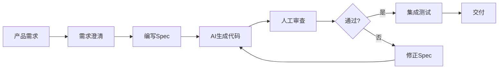
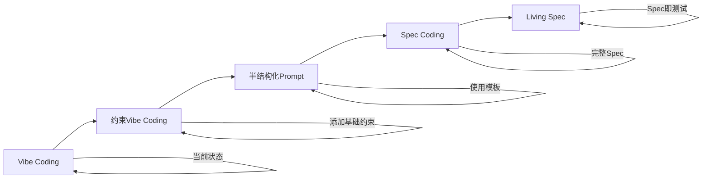

# AI辅助iOS开发实践深度解析

> **核心结论**：AI辅助iOS开发的核心在于建立"Spec → Harness → Code → Verify"的闭环。从Vibe Coding的随意性到Spec Coding的规约驱动，iOS团队需要构建适合移动端的Harness体系。

> 本文是对 [iOS开发者视角：AI驱动开发的演进与实践](../../iOS开发者视角：AI驱动开发的演进与实践.md) 的深化与扩展

---

## 核心结论 TL;DR 表格

| 实践领域 | 传统方式 | AI辅助方式 | 关键转变 |
|---------|---------|-----------|---------|
| 需求到代码 | 人工分析实现 | Spec驱动生成 | 需求即规约 |
| 代码规范 | 人工审查 | 自动化Harness | 约束即代码 |
| 测试验证 | 事后补充 | Living Spec集成 | 测试即文档 |
| 问题排查 | 人工调试 | AI辅助诊断 | 数据驱动 |
| 知识传递 | 文档+口述 | AGENTS.md配置 | 上下文即配置 |

---

## 一、Spec Coding在iOS项目中的实践

### 1.1 从需求到Spec到代码的完整流程

**核心结论**：Spec是AI可靠工作的前提，好的Spec应该包含功能需求、技术约束、验收标准三个维度。



### 1.2 iOS功能Spec模板

```yaml
# specs/features/user_login.yaml
# iOS登录功能Spec示例

spec_id: IOS-AUTH-001
version: "1.0.0"
title: 用户登录功能
domain: Authentication
priority: high

# 上下文信息
context:
  background: |
    用户需要通过邮箱和密码登录应用。
    登录成功后保存认证状态，支持自动登录。
  stakeholders:
    - 产品经理
    - iOS开发团队
    - 后端API团队
    - 安全团队

# 验收标准 (Given/When/Then)
acceptance_criteria:
  - id: AC-001
    title: 有效凭证登录
    given: 用户在登录页面，网络连接正常
    when: 
      - 输入有效邮箱地址
      - 输入正确密码
      - 点击登录按钮
    then:
      - 显示加载状态
      - 调用POST /api/v1/auth/login
      - 保存access_token到Keychain
      - 保存refresh_token到Keychain
      - 导航到首页
      - 记录登录成功事件

  - id: AC-002
    title: 无效凭证登录
    given: 用户在登录页面
    when:
      - 输入无效邮箱或错误密码
      - 点击登录按钮
    then:
      - 显示错误提示"邮箱或密码错误"
      - 密码输入框保持内容
      - 邮箱输入框保持内容
      - 记录登录失败事件

  - id: AC-003
    title: 表单验证
    given: 用户在登录页面
    when:
      - 邮箱格式不合法，或
      - 密码长度小于8位
    then:
      - 实时显示验证错误
      - 禁用登录按钮

# 技术约束
technical_constraints:
  platform:
    min_ios_version: "16.0"
    swift_version: "5.9"
    
  architecture:
    pattern: MVVM
    state_management: Observation
    
  security:
    - 所有网络请求必须使用HTTPS
    - Token必须使用Keychain存储
    - 禁止使用UserDefaults存储敏感信息
    - 密码输入必须使用SecureField
    
  performance:
    - API响应时间<2s
    - UI响应时间<100ms
    - 支持离线状态检测

# UI规范
ui_spec:
  screen: LoginView
  components:
    - type: TextField
      id: email_input
      placeholder: "邮箱地址"
      keyboard_type: emailAddress
      autocapitalization: none
      
    - type: SecureField
      id: password_input
      placeholder: "密码"
      min_length: 8
      
    - type: Button
      id: login_button
      title: "登录"
      style: primary
      disabled_when: "!isFormValid || isLoading"
      
    - type: Button
      id: forgot_password_link
      title: "忘记密码?"
      style: link

# 依赖注入
dependencies:
  protocols:
    - AuthServiceProtocol
    - KeychainServiceProtocol
    - AnalyticsServiceProtocol
    
  implementations:
    auth_service: LiveAuthService
    keychain_service: KeychainService
    analytics_service: FirebaseAnalyticsService

# 测试要求
test_requirements:
  unit_tests:
    coverage_threshold: 80
    required_tests:
      - 有效凭证登录成功
      - 无效凭证登录失败
      - Token正确存储
      - 表单验证逻辑
      
  ui_tests:
    - 完整登录流程
    - 错误状态显示
    - 加载状态显示
    
  integration_tests:
    - API集成测试
    - Keychain集成测试

# 错误处理
error_handling:
  network_error:
    user_message: "网络连接失败，请检查网络设置"
    retry_allowed: true
    
  server_error:
    user_message: "服务器繁忙，请稍后重试"
    retry_allowed: true
    
  auth_error:
    user_message: "邮箱或密码错误"
    retry_allowed: true
    log_event: true
```

### 1.3 Spec到代码的生成流程

```swift
// 基于上述Spec生成的代码示例

import SwiftUI
import Observation

// MARK: - Model

struct LoginCredentials: Codable {
    let email: String
    let password: String
}

struct AuthResponse: Codable {
    let accessToken: String
    let refreshToken: String
    let expiresIn: Int
}

// MARK: - Protocols

protocol AuthServiceProtocol {
    func login(credentials: LoginCredentials) async throws -> AuthResponse
}

protocol KeychainServiceProtocol {
    func save(_ value: String, forKey key: String) throws
    func get(forKey key: String) -> String?
    func delete(forKey key: String) throws
}

protocol AnalyticsServiceProtocol {
    func logEvent(_ name: String, parameters: [String: Any]?)
}

// MARK: - ViewModel

@Observable
@MainActor
class LoginViewModel {
    
    // MARK: - State
    
    var email: String = "" {
        didSet { validateForm() }
    }
    
    var password: String = "" {
        didSet { validateForm() }
    }
    
    var isLoading: Bool = false
    var errorMessage: String?
    var isFormValid: Bool = false
    
    // MARK: - Dependencies
    
    private let authService: AuthServiceProtocol
    private let keychainService: KeychainServiceProtocol
    private let analyticsService: AnalyticsServiceProtocol
    
    // MARK: - Initialization
    
    init(
        authService: AuthServiceProtocol,
        keychainService: KeychainServiceProtocol,
        analyticsService: AnalyticsServiceProtocol
    ) {
        self.authService = authService
        self.keychainService = keychainService
        self.analyticsService = analyticsService
    }
    
    // MARK: - Public Methods
    
    func login() async {
        guard isFormValid else { return }
        
        isLoading = true
        errorMessage = nil
        
        do {
            let credentials = LoginCredentials(email: email, password: password)
            let response = try await authService.login(credentials: credentials)
            
            // 保存Token到Keychain
            try keychainService.save(response.accessToken, forKey: "access_token")
            try keychainService.save(response.refreshToken, forKey: "refresh_token")
            
            analyticsService.logEvent("login_success", parameters: ["method": "email"])
            
            // 导航到首页 (通过回调或状态通知)
            
        } catch let error as NetworkError {
            handleNetworkError(error)
        } catch {
            errorMessage = "登录失败，请稍后重试"
            analyticsService.logEvent("login_failure", parameters: ["error": error.localizedDescription])
        }
        
        isLoading = false
    }
    
    // MARK: - Private Methods
    
    private func validateForm() {
        let isEmailValid = email.contains("@") && email.contains(".")
        let isPasswordValid = password.count >= 8
        isFormValid = isEmailValid && isPasswordValid
    }
    
    private func handleNetworkError(_ error: NetworkError) {
        switch error {
        case .unauthorized:
            errorMessage = "邮箱或密码错误"
        case .noConnection:
            errorMessage = "网络连接失败，请检查网络设置"
        default:
            errorMessage = "服务器繁忙，请稍后重试"
        }
    }
}

// MARK: - SwiftUI View

struct LoginView: View {
    
    @State private var viewModel: LoginViewModel
    
    init(viewModel: LoginViewModel) {
        self.viewModel = viewModel
    }
    
    var body: some View {
        VStack(spacing: 24) {
            // Logo或标题
            Text("登录")
                .font(.largeTitle)
                .fontWeight(.bold)
            
            // 邮箱输入
            VStack(alignment: .leading, spacing: 8) {
                TextField("邮箱地址", text: $viewModel.email)
                    .textFieldStyle(RoundedBorderTextFieldStyle())
                    .keyboardType(.emailAddress)
                    .textInputAutocapitalization(.never)
                    .autocorrectionDisabled()
                
                if !viewModel.email.isEmpty && !isValidEmail(viewModel.email) {
                    Text("请输入有效的邮箱地址")
                        .font(.caption)
                        .foregroundStyle(.red)
                }
            }
            
            // 密码输入
            VStack(alignment: .leading, spacing: 8) {
                SecureField("密码", text: $viewModel.password)
                    .textFieldStyle(RoundedBorderTextFieldStyle())
                
                if !viewModel.password.isEmpty && viewModel.password.count < 8 {
                    Text("密码长度至少8位")
                        .font(.caption)
                        .foregroundStyle(.red)
                }
            }
            
            // 错误提示
            if let error = viewModel.errorMessage {
                Text(error)
                    .font(.subheadline)
                    .foregroundStyle(.red)
                    .multilineTextAlignment(.center)
            }
            
            // 登录按钮
            Button(action: {
                Task {
                    await viewModel.login()
                }
            }) {
                if viewModel.isLoading {
                    ProgressView()
                        .progressViewStyle(CircularProgressViewStyle(tint: .white))
                } else {
                    Text("登录")
                        .fontWeight(.semibold)
                }
            }
            .frame(maxWidth: .infinity)
            .padding()
            .background(viewModel.isFormValid ? Color.blue : Color.gray)
            .foregroundStyle(.white)
            .cornerRadius(8)
            .disabled(!viewModel.isFormValid || viewModel.isLoading)
            
            // 忘记密码
            Button("忘记密码?") {
                // 导航到忘记密码页面
            }
            .font(.subheadline)
            .foregroundStyle(.blue)
            
            Spacer()
        }
        .padding()
    }
    
    private func isValidEmail(_ email: String) -> Bool {
        let pattern = "[A-Z0-9a-z._%+-]+@[A-Za-z0-9.-]+\\.[A-Za-z]{2,}"
        return email.range(of: pattern, options: .regularExpression) != nil
    }
}
```

---

## 二、Harness Engineering在Xcode工程的落地

### 2.1 SwiftLint配置最佳实践

**核心结论**：SwiftLint规则应该覆盖iOS特有的约束，如@MainActor使用、内存管理、线程安全等。

```yaml
# .swiftlint.yml
# iOS项目SwiftLint配置

included:
  - Sources
  - Tests

excluded:
  - Pods
  - Carthage
  - Generated
  - fastlane

# 行长度
line_length:
  warning: 120
  error: 150
  ignores_urls: true
  ignores_function_declarations: false
  ignores_comments: true

# 函数长度
function_body_length:
  warning: 60
  error: 100

# 类型长度
type_body_length:
  warning: 300
  error: 500

# 圈复杂度
cyclomatic_complexity:
  warning: 10
  error: 20

# iOS特定规则
custom_rules:
  # 强制使用@MainActor
  main_actor_ui:
    name: "MainActor for UI"
    regex: "@Published\s+var"
    message: "UI-related @Published properties should be in @MainActor class"
    severity: warning
    
  # 闭包中必须使用weak self
  weak_self_check:
    name: "Weak Self in Closure"
    regex: "=\s*\{\s*[^\[]"
    message: "Consider using [weak self] in closures that capture self"
    severity: warning
    match_kinds:
      - argument
      
  # 禁止使用UserDefaults存储敏感信息
  no_sensitive_userdefaults:
    name: "No Sensitive UserDefaults"
    regex: "UserDefaults.*password|UserDefaults.*token|UserDefaults.*secret"
    message: "Sensitive data must be stored in Keychain, not UserDefaults"
    severity: error
    
  # 强制使用HTTPS
  https_enforcement:
    name: "HTTPS Enforcement"
    regex: "http://"
    message: "All network requests must use HTTPS"
    severity: error
    excluded: ".*localhost.*|.*127\.0\.0\.1.*"
    
  # 禁止使用已废弃API
  no_deprecated_api:
    name: "No Deprecated API"
    regex: "NSURLConnection|UIWebView|ALAssetsLibrary|AddressBook"
    message: "Using deprecated API that may cause App Store rejection"
    severity: error
    
  # 强制使用NSCache而非Dictionary作为缓存
  prefer_nscache:
    name: "Prefer NSCache"
    regex: "var\s+\w+:\s*\[String:\s*UIImage\]"
    message: "Use NSCache instead of Dictionary for image caching"
    severity: warning

# 启用规则
opt_in_rules:
  - array_init
  - attributes
  - closure_end_indentation
  - closure_spacing
  - collection_alignment
  - contains_over_filter_count
  - contains_over_filter_is_empty
  - contains_over_first_not_nil
  - discouraged_object_literal
  - empty_collection_literal
  - empty_count
  - empty_string
  - enum_case_associated_values_count
  - explicit_init
  - extension_access_modifier
  - fallthrough
  - fatal_error_message
  - file_header
  - file_name
  - first_where
  - force_unwrapping
  - function_default_parameter_at_end
  - identical_operands
  - implicit_return
  - joined_default_parameter
  - last_where
  - legacy_random
  - let_var_whitespace
  - literal_expression_end_indentation
  - lower_acl_than_parent
  - modifier_order
  - nimble_operator
  - nslocalizedstring_key
  - number_separator
  - object_literal
  - operator_usage_whitespace
  - overridden_super_call
  - override_in_extension
  - pattern_matching_keywords
  - prefer_self_type_over_type_of_self
  - private_action
  - private_outlet
  - prohibited_super_call
  - quick_discouraged_call
  - quick_discouraged_focused_test
  - quick_discouraged_pending_test
  - reduce_into
  - redundant_nil_coalescing
  - redundant_type_annotation
  - single_test_class
  - sorted_first_last
  - sorted_imports
  - static_operator
  - strict_fileprivate
  - strong_iboutlet
  - toggle_bool
  - trailing_closure
  - unavailable_function
  - unneeded_parentheses_in_closure_argument
  - untyped_error_in_catch
  - vertical_parameter_alignment_on_call
  - vertical_whitespace_closing_braces
  - vertical_whitespace_opening_braces
  - xct_specific_matcher
  - yoda_condition

# 禁用规则
disabled_rules:
  - trailing_whitespace
  - todo
  - identifier_name

# 文件长度
file_length:
  warning: 500
  error: 1000

# 类型命名
type_name:
  min_length: 3
  max_length: 50

# 标识符命名
identifier_name:
  min_length: 2
  max_length: 60
  excluded:
    - id
    - x
    - y
    - i
    - j
    - k
```

### 2.2 Xcode Build Phases集成

```bash
#!/bin/bash
# scripts/build_phase_validation.sh
# Xcode Build Phase脚本

set -e

echo "🔍 开始Harness验证..."

# 1. SwiftLint检查
echo "📋 运行SwiftLint..."
if which swiftlint >/dev/null; then
    swiftlint lint --quiet
else
    echo "warning: SwiftLint未安装"
fi

# 2. 检查API使用合规性
echo "🔒 检查API合规性..."
if grep -r "NSURLConnection" "${SRCROOT}/Sources/" 2>/dev/null; then
    echo "error: 发现已废弃的NSURLConnection使用"
    exit 1
fi

# 3. 检查隐私权限声明
echo "🔐 检查隐私权限..."
ENTITLEMENTS_FILE="${SRCROOT}/${PRODUCT_NAME}.entitlements"

if grep -r "HealthKit" "${SRCROOT}/Sources/" 2>/dev/null; then
    if [ ! -f "$ENTITLEMENTS_FILE" ] || ! grep -q "com.apple.developer.healthkit" "$ENTITLEMENTS_FILE"; then
        echo "error: 使用HealthKit但未在entitlements中声明"
        exit 1
    fi
fi

# 4. 检查内存管理模式
echo "🧠 检查内存管理..."
if grep -r "DispatchQueue.global" "${SRCROOT}/Sources/" | grep -v "DispatchQueue.main" 2>/dev/null; then
    echo "warning: 发现全局队列使用，请确保线程安全"
fi

# 5. 检查代码签名
echo "✅ 检查代码签名配置..."
if [ -z "${CODE_SIGN_IDENTITY}" ] || [ "${CODE_SIGN_IDENTITY}" = "" ]; then
    echo "warning: 未配置代码签名"
fi

# 6. 检查资源文件
echo "📁 检查资源文件..."
find "${SRCROOT}/Resources" -name "*.png" -o -name "*.jpg" 2>/dev/null | while read file; do
    size=$(stat -f%z "$file")
    if [ $size -gt 1048576 ]; then
        echo "warning: 图片文件过大: $file ($size bytes)"
    fi
done

echo "✅ Harness验证完成"
```

### 2.3 CI/CD管线设计

```yaml
# .github/workflows/ios-harness.yml
name: iOS Harness CI/CD

on:
  push:
    branches: [main, develop]
    paths:
      - 'Sources/**'
      - 'Tests/**'
      - '.swiftlint.yml'
      - 'Package.swift'
  pull_request:
    branches: [main]

env:
  DEVELOPER_DIR: /Applications/Xcode_15.2.app/Contents/Developer

jobs:
  # 阶段1: 代码规范检查
  lint:
    runs-on: macos-14
    steps:
      - uses: actions/checkout@v4
      
      - name: Install SwiftLint
        run: brew install swiftlint
      
      - name: Run SwiftLint
        run: swiftlint lint --reporter github-actions-logging

  # 阶段2: 依赖验证
  dependencies:
    runs-on: macos-14
    steps:
      - uses: actions/checkout@v4
      
      - name: Resolve SPM Dependencies
        run: swift package resolve
      
      - name: Validate Package.resolved
        run: |
          if [ -f Package.resolved ]; then
            echo "✅ Package.resolved存在"
          else
            echo "⚠️ 未找到Package.resolved，建议提交锁定文件"
          fi

  # 阶段3: 静态分析
  static-analysis:
    runs-on: macos-14
    needs: [lint, dependencies]
    steps:
      - uses: actions/checkout@v4
      
      - name: Run Xcode Analyze
        run: |
          xcodebuild analyze \
            -scheme MyApp \
            -destination 'platform=iOS Simulator,name=iPhone 15' \
            -quiet \
            | xcpretty

  # 阶段4: 单元测试
  unit-tests:
    runs-on: macos-14
    needs: [static-analysis]
    steps:
      - uses: actions/checkout@v4
      
      - name: Run Unit Tests
        run: |
          xcodebuild test \
            -scheme MyApp \
            -destination 'platform=iOS Simulator,name=iPhone 15' \
            -enableCodeCoverage YES \
            -resultBundlePath TestResults.xcresult \
            | xcpretty
      
      - name: Upload Coverage
        uses: codecov/codecov-action@v3
        with:
          files: ./coverage.lcov
          fail_ci_if_error: false

  # 阶段5: UI测试
  ui-tests:
    runs-on: macos-14
    needs: [unit-tests]
    steps:
      - uses: actions/checkout@v4
      
      - name: Run UI Tests
        run: |
          xcodebuild test \
            -scheme MyAppUITests \
            -destination 'platform=iOS Simulator,name=iPhone 15' \
            | xcpretty

  # 阶段6: 构建验证
  build:
    runs-on: macos-14
    needs: [unit-tests]
    strategy:
      matrix:
        configuration: [Debug, Release]
    steps:
      - uses: actions/checkout@v4
      
      - name: Build App
        run: |
          xcodebuild build \
            -scheme MyApp \
            -configuration ${{ matrix.configuration }} \
            -destination 'generic/platform=iOS' \
            -derivedDataPath DerivedData \
            | xcpretty
      
      - name: Archive App
        if: matrix.configuration == 'Release'
        run: |
          xcodebuild archive \
            -scheme MyApp \
            -configuration Release \
            -archivePath MyApp.xcarchive \
            -destination 'generic/platform=iOS'

  # 阶段7: 安全扫描
  security-scan:
    runs-on: macos-14
    steps:
      - uses: actions/checkout@v4
      
      - name: Run Security Scan
        run: |
          # 检查敏感信息泄露
          if grep -r "api_key\|password\|secret" --include="*.swift" Sources/ 2>/dev/null; then
            echo "⚠️ 发现潜在的敏感信息硬编码"
          fi
          
          # 检查不安全的网络配置
          if grep -r "NSAllowsArbitraryLoads.*true" --include="*.plist" . 2>/dev/null; then
            echo "⚠️ 发现允许任意HTTP加载的配置"
          fi
```

---

## 三、AGENTS.md/CLAUDE.md配置最佳实践

### 3.1 iOS项目专属AGENTS.md模板

```markdown
# AGENTS.md - iOS项目AI助手配置

## 项目概述

- **平台**: iOS 16.0+
- **语言**: Swift 5.9+
- **UI框架**: SwiftUI (主要), UIKit (遗留模块)
- **架构模式**: MVVM + Observation, TCA (复杂模块)
- **包管理**: Swift Package Manager
- **最低支持**: iPhone SE (2nd gen) 及以上

## 编码规范

### Swift风格指南

#### 基础规范
- 使用4空格缩进
- 最大行长度120字符
- 强制使用`self.`访问实例成员（除init和property wrapper）
- 优先使用`let`而非`var`
- 使用显式类型声明公共API

#### 命名规范
```swift
// 类型名: 大驼峰
struct UserProfile { }
class LoginViewModel { }
enum NetworkError { }

// 函数/变量: 小驼峰
func fetchUserProfile() async { }
var userName: String = ""

// 常量: 小驼峰
let maxRetryCount = 3
let defaultTimeout: TimeInterval = 30

// 布尔值: 使用is/has/should前缀
var isLoading: Bool = false
var hasMoreData: Bool = true
var shouldRefresh: Bool = false
```

### iOS特定规则

#### 线程安全
- 所有UI更新必须在@MainActor上执行
- ViewModel使用@MainActor标注
- 后台任务使用Task或自定义Actor
- 避免直接使用DispatchQueue.global()

```swift
// ✅ 正确
@MainActor
class ProfileViewModel: ObservableObject {
    @Published var user: User?
    
    func loadUser() async {
        user = await repository.fetchUser()
    }
}

// ❌ 错误
class BadViewModel: ObservableObject {
    @Published var user: User? // 未标注@MainActor
}
```

#### 内存管理
- 闭包中必须使用[weak self]避免循环引用
- 使用NSCache而非Dictionary作为缓存
- 及时清理NotificationCenter观察者

```swift
// ✅ 正确
service.fetchData { [weak self] result in
    self?.handleResult(result)
}

// ❌ 错误
service.fetchData { result in
    self.handleResult(result) // 循环引用风险
}
```

#### 安全规范
- 敏感数据必须使用Keychain存储
- 禁止使用UserDefaults存储密码/Token
- 所有网络请求必须使用HTTPS
- 禁止使用私有API

```swift
// ✅ 正确
let token = Keychain.standard.get("access_token")

// ❌ 错误
UserDefaults.standard.set(password, forKey: "password")
```

### 架构约束

#### 依赖方向
```
Presentation -> Domain <- Data
```

#### 禁止行为
- 禁止在View中直接调用NetworkService
- 禁止在Domain层使用UIKit
- 禁止在Data层使用SwiftUI
- 禁止跨层直接通信

#### 模块组织
```
Sources/
├── App/                    # 应用入口、组装
├── Features/
│   ├── User/              # 用户模块
│   ├── Order/             # 订单模块
│   └── Payment/           # 支付模块
├── Core/
│   ├── Domain/            # 业务实体、UseCase协议
│   ├── Data/              # 数据层实现
│   ├── Network/           # 网络基础设施
│   └── UIComponents/      # 共享UI组件
└── Infrastructure/
    ├── Logger/            # 日志
    ├── Analytics/         # 分析
    └── Keychain/          # 安全存储
```

### 测试要求

#### 覆盖率要求
- 单元测试覆盖率 >= 80%
- ViewModel必须100%覆盖
- UseCase必须100%覆盖

#### 测试结构
```swift
import XCTest
@testable import MyApp

final class LoginViewModelTests: XCTestCase {
    
    // MARK: - Given/When/Then格式
    
    func testLogin_WithValidCredentials_ShouldSucceed() async {
        // Given
        let mockService = MockAuthService()
        mockService.expectedResult = .success(.mock)
        let viewModel = LoginViewModel(authService: mockService)
        viewModel.email = "test@example.com"
        viewModel.password = "password123"
        
        // When
        await viewModel.login()
        
        // Then
        XCTAssertNotNil(viewModel.user)
        XCTAssertNil(viewModel.errorMessage)
    }
}
```

### 常见错误预防

#### AI生成代码常见问题
1. **@MainActor遗漏**: 检查所有UI更新相关代码
2. **循环引用**: 检查闭包中的self捕获
3. **错误处理**: 确保所有异步调用有错误处理
4. **内存管理**: 检查缓存实现是否使用NSCache
5. **线程安全**: 检查共享状态访问

#### 代码审查Checklist
- [ ] 是否遵循依赖方向
- [ ] 是否正确使用@MainActor
- [ ] 是否有适当的错误处理
- [ ] 是否包含单元测试
- [ ] 是否有内存泄漏风险
- [ ] 是否符合安全规范

### 第三方库使用

#### 已批准库
```swift
// UI
import SwiftUI
import Combine

// 架构
import ComposableArchitecture  // TCA

// 网络
import Alamofire  // 如使用

// 存储
import KeychainSwift

// 测试
import XCTest
```

#### 禁止使用的库
- 未维护的库（超过1年无更新）
- 与系统功能重复的库
- 体积过大的库（>10MB）

### 性能考虑

#### 启动优化
- 减少AppDelegate初始化代码
- 延迟加载非必要资源
- 使用MetricKit监控启动时间

#### 内存优化
- 图片使用适当尺寸
- 实现缓存清理策略
- 使用 Instruments 定期检查

#### 渲染优化
- 减少视图层级
- 避免离屏渲染
- 使用 Instruments - Core Animation检测

## 参考资源

- [Swift API Design Guidelines](https://swift.org/documentation/api-design-guidelines/)
- [Apple Human Interface Guidelines](https://developer.apple.com/design/human-interface-guidelines/)
- [Swift Concurrency Documentation](https://docs.swift.org/swift-book/documentation/the-swift-programming-language/concurrency/)
```

---

## 四、AI编码助手的iOS适配策略

### 4.1 iOS特有约束处理

**核心结论**：AI编码助手需要特殊处理iOS的@MainActor、ARC、Keychain、App Store审核等约束。

#### @MainActor处理

```swift
// 提示词模板:
// "所有UI更新必须在@MainActor上执行。ViewModel使用@MainActor标注，
//  @Published属性自动在主线程更新。"

// ✅ AI应生成的代码
@MainActor
class UserProfileViewModel: ObservableObject {
    @Published var user: User?
    @Published var isLoading = false
    
    func loadUser() async {
        isLoading = true
        // await后自动回到主线程
        user = await repository.fetchUser()
        isLoading = false
    }
}

// ❌ AI容易犯的错误
class BadViewModel: ObservableObject {
    @Published var user: User? // 未标注@MainActor，可能在后台线程更新
    
    func loadUser() {
        Task {
            user = await repository.fetchUser() // 危险！
        }
    }
}
```

#### ARC内存管理

```swift
// 提示词模板:
// "所有捕获self的闭包必须使用[weak self]避免循环引用。
// 检查delegate模式、NotificationCenter观察者、Timer等场景。"

// ✅ AI应生成的代码
class UserService {
    weak var delegate: UserServiceDelegate?
    
    func fetchUser(completion: @escaping (Result<User, Error>) -> Void) {
        network.request { [weak self] result in
            self?.delegate?.didCompleteRequest()
            completion(result)
        }
    }
}

// 使用NotificationCenter
class DataObserver {
    private var cancellables: Set<AnyCancellable> = []
    
    func observe() {
        NotificationCenter.default
            .publisher(for: .dataDidUpdate)
            .sink { [weak self] _ in
                self?.handleUpdate()
            }
            .store(in: &cancellables)
    }
}

// ❌ AI容易犯的错误
class BadService {
    var completion: (() -> Void)?
    
    func setup() {
        // 循环引用！
        completion = {
            self.doSomething()
        }
    }
}
```

#### Keychain安全存储

```swift
// 提示词模板:
// "所有敏感数据（Token、密码、密钥）必须使用Keychain存储，
// 禁止使用UserDefaults。使用kSecAttrAccessibleWhenUnlockedThisDeviceOnly级别。"

// ✅ AI应生成的代码
import Security

final class SecureStorage {
    
    static let shared = SecureStorage()
    
    func save(_ value: String, forKey key: String) throws {
        guard let data = value.data(using: .utf8) else {
            throw KeychainError.invalidData
        }
        
        let query: [String: Any] = [
            kSecClass as String: kSecClassGenericPassword,
            kSecAttrAccount as String: key,
            kSecValueData as String: data,
            kSecAttrAccessible as String: kSecAttrAccessibleWhenUnlockedThisDeviceOnly
        ]
        
        SecItemDelete(query as CFDictionary)
        
        let status = SecItemAdd(query as CFDictionary, nil)
        guard status == errSecSuccess else {
            throw KeychainError.saveFailed(status)
        }
    }
    
    func get(forKey key: String) -> String? {
        let query: [String: Any] = [
            kSecClass as String: kSecClassGenericPassword,
            kSecAttrAccount as String: key,
            kSecReturnData as String: true,
            kSecMatchLimit as String: kSecMatchLimitOne
        ]
        
        var result: AnyObject?
        let status = SecItemCopyMatching(query as CFDictionary, &result)
        
        guard status == errSecSuccess,
              let data = result as? Data,
              let value = String(data: data, encoding: .utf8) else {
            return nil
        }
        
        return value
    }
    
    func delete(forKey key: String) throws {
        let query: [String: Any] = [
            kSecClass as String: kSecClassGenericPassword,
            kSecAttrAccount as String: key
        ]
        
        let status = SecItemDelete(query as CFDictionary)
        guard status == errSecSuccess || status == errSecItemNotFound else {
            throw KeychainError.deleteFailed(status)
        }
    }
}

enum KeychainError: Error {
    case invalidData
    case saveFailed(OSStatus)
    case deleteFailed(OSStatus)
}

// ❌ AI容易犯的错误
class BadStorage {
    // 使用UserDefaults存储敏感信息！
    func saveToken(_ token: String) {
        UserDefaults.standard.set(token, forKey: "access_token")
    }
}
```

#### App Store审核合规

```swift
// 提示词模板:
// "代码必须符合App Store审核指南。禁止使用私有API，
// 禁止动态下载执行代码，正确处理隐私权限。"

// ✅ AI应生成的代码

// 1. 使用公共API
class DeviceInfo {
    func getDeviceModel() -> String {
        return UIDevice.current.model // ✅ 公共API
    }
    
    // ❌ 禁止使用私有API
    // func getSerialNumber() -> String {
    //     let selector = NSSelectorFromString("serialNumber")
    //     return UIDevice.current.perform(selector).takeUnretainedValue() as! String
    // }
}

// 2. 正确处理隐私权限
import HealthKit

class HealthManager {
    private let healthStore = HKHealthStore()
    
    func requestAuthorization() async throws {
        // 检查是否可用
        guard HKHealthStore.isHealthDataAvailable() else {
            throw HealthError.notAvailable
        }
        
        let typesToRead: Set = [
            HKObjectType.quantityType(forIdentifier: .stepCount)!,
            HKObjectType.quantityType(forIdentifier: .heartRate)!
        ]
        
        try await healthStore.requestAuthorization(toShare: [], read: typesToRead)
    }
    
    func fetchSteps() async throws -> Int {
        // 检查授权状态
        let status = healthStore.authorizationStatus(for: HKObjectType.quantityType(forIdentifier: .stepCount)!)
        guard status == .sharingAuthorized else {
            throw HealthError.notAuthorized
        }
        
        // 执行查询...
        return 0
    }
}

// 3. 禁止热更新/动态代码
// ❌ 禁止动态下载执行代码
// class CodeLoader {
//     func downloadAndExecute(from url: URL) async {
//         let (data, _) = try! await URLSession.shared.data(from: url)
//         let script = String(data: data, encoding: .utf8)!
//         let context = JSContext()!
//         context.evaluateScript(script) // 审核风险！
//     }
// }
```

### 4.2 AI适配Checklist

```markdown
## iOS AI生成代码审查清单

### 线程安全
- [ ] ViewModel是否标注@MainActor
- [ ] @Published属性是否在主线程更新
- [ ] 后台任务是否正确使用Task/Actor
- [ ] 是否避免直接使用DispatchQueue.global()

### 内存管理
- [ ] 闭包是否使用[weak self]
- [ ] Delegate是否为weak
- [ ] NotificationCenter观察者是否正确移除
- [ ] Timer是否使用weak self

### 安全
- [ ] 敏感数据是否使用Keychain
- [ ] 是否使用HTTPS
- [ ] 密码输入是否使用SecureField
- [ ] 是否禁用ATS例外

### App Store合规
- [ ] 是否使用私有API
- [ ] 是否动态下载执行代码
- [ ] 隐私权限是否正确声明
- [ ] 是否包含必要的隐私政策链接

### 性能
- [ ] 图片加载是否使用适当尺寸
- [ ] 缓存是否使用NSCache
- [ ] 网络请求是否有超时设置
- [ ] 大数据处理是否在后台线程

### 测试
- [ ] 是否包含单元测试
- [ ] 异步代码是否正确测试
- [ ] Mock对象是否正确实现
```

---

## 五、从Vibe Coding到Spec Coding的渐进式转型

### 5.1 转型路径



### 5.2 各阶段实践

#### 阶段1: Vibe Coding (当前)

```
特征:
- 随意描述需求
- 直接接受AI输出
- 事后修复问题

示例:
"帮我写一个登录页面"
→ AI生成代码
→ 发现问题 → 修复 → 再发现问题 → 再修复
```

#### 阶段2: 约束Vibe Coding

```
特征:
- 添加基础约束
- 指定技术栈
- 要求错误处理

示例Prompt:
"使用SwiftUI和MVVM写一个登录页面。
要求:
- 使用@MainActor
- 包含表单验证
- 处理网络错误
- 使用async/await"
```

#### 阶段3: 半结构化Prompt

```
特征:
- 使用模板结构
- 明确验收标准
- 指定测试要求

示例Prompt:
"## 功能: 用户登录

### 需求
- 邮箱和密码登录
- 表单实时验证
- 错误提示

### 技术栈
- SwiftUI + MVVM
- Swift Concurrency

### 验收标准
1. 有效凭证登录成功
2. 无效凭证显示错误
3. 网络错误有重试

### 约束
- 使用@MainActor
- Token存Keychain
- 单元测试覆盖"
```

#### 阶段4: Spec Coding

```yaml
# 完整的YAML Spec
spec_id: LOGIN-001
# ... (完整Spec内容)
```

#### 阶段5: Living Spec

```swift
// Spec即测试
import XCTest

class LoginSpecTests: XCTestCase {
    
    /// Spec: LOGIN-001 有效凭证登录
    /// Given: 用户在登录页面
    /// When: 输入有效凭证并点击登录
    /// Then: 登录成功，保存Token
    func testValidLogin() async {
        // 测试代码
    }
}
```

### 5.3 转型Checklist

```markdown
## 从Vibe Coding到Spec Coding转型检查清单

### 第1周: 建立意识
- [ ] 团队培训: Spec Coding概念
- [ ] 分析当前AI使用问题
- [ ] 确定试点模块

### 第2-3周: 引入约束
- [ ] 创建基础Prompt模板
- [ ] 配置SwiftLint规则
- [ ] 建立代码审查流程

### 第4-6周: 规范Spec
- [ ] 定义Spec模板
- [ ] 试点模块使用Spec驱动
- [ ] 收集反馈优化模板

### 第7-8周: 自动化验证
- [ ] 集成Build Phases脚本
- [ ] 配置CI/CD管线
- [ ] 建立测试门槛

### 第9-12周: 全面推广
- [ ] 所有新功能使用Spec Coding
- [ ] 建立Living Spec实践
- [ ] 沉淀最佳实践文档
```

---

## 六、Living Spec与XCTest集成

### 6.1 测试即规约

**核心结论**：Living Spec将Spec和测试代码统一，确保Spec始终与实现同步。

```swift
// Living Spec示例
import XCTest
@testable import MyApp

/// Feature: 用户登录
/// Spec ID: AUTH-LOGIN-001
@MainActor
final class UserLoginLivingSpec: XCTestCase {
    
    // MARK: - Spec: 有效凭证登录
    
    /// Given: 用户在登录页面，网络连接正常
    /// When: 输入有效邮箱和密码，点击登录
    /// Then: 
    ///   - 显示加载状态
    ///   - 调用登录API
    ///   - 保存Token到Keychain
    ///   - 导航到首页
    func testValidLogin() async throws {
        // Given
        let mockAuthService = MockAuthService()
        mockAuthService.stubbedLoginResult = .success(.mockValidResponse)
        
        let mockKeychain = MockKeychainService()
        
        let viewModel = LoginViewModel(
            authService: mockAuthService,
            keychainService: mockKeychain
        )
        
        viewModel.email = "valid@example.com"
        viewModel.password = "password123"
        
        XCTAssertFalse(viewModel.isLoading)
        
        // When
        await viewModel.login()
        
        // Then
        XCTAssertTrue(mockAuthService.loginCalled)
        XCTAssertEqual(mockAuthService.receivedCredentials?.email, "valid@example.com")
        XCTAssertTrue(mockKeychain.savedKeys.contains("access_token"))
        XCTAssertTrue(mockKeychain.savedKeys.contains("refresh_token"))
    }
    
    // MARK: - Spec: 无效凭证登录
    
    /// Given: 用户在登录页面
    /// When: 输入无效凭证并点击登录
    /// Then: 显示错误提示，不清空输入框
    func testInvalidLogin() async {
        // Given
        let mockAuthService = MockAuthService()
        mockAuthService.stubbedLoginResult = .failure(.invalidCredentials)
        
        let viewModel = LoginViewModel(
            authService: mockAuthService,
            keychainService: MockKeychainService()
        )
        
        viewModel.email = "invalid@example.com"
        viewModel.password = "wrongpassword"
        let originalEmail = viewModel.email
        
        // When
        await viewModel.login()
        
        // Then
        XCTAssertNotNil(viewModel.errorMessage)
        XCTAssertEqual(viewModel.email, originalEmail) // 输入框不清空
    }
    
    // MARK: - Spec: 表单验证
    
    /// Given: 用户在登录页面
    /// When: 邮箱格式不合法
    /// Then: 实时显示验证错误，禁用登录按钮
    func testEmailValidation() {
        // Given
        let viewModel = LoginViewModel(
            authService: MockAuthService(),
            keychainService: MockKeychainService()
        )
        
        // When - 输入无效邮箱
        viewModel.email = "invalid-email"
        viewModel.password = "password123"
        
        // Then
        XCTAssertFalse(viewModel.isFormValid)
        
        // When - 输入有效邮箱
        viewModel.email = "valid@example.com"
        
        // Then
        XCTAssertTrue(viewModel.isFormValid)
    }
    
    /// Given: 用户在登录页面
    /// When: 密码长度小于8位
    /// Then: 禁用登录按钮
    func testPasswordValidation() {
        // Given
        let viewModel = LoginViewModel(
            authService: MockAuthService(),
            keychainService: MockKeychainService()
        )
        
        // When
        viewModel.email = "valid@example.com"
        viewModel.password = "short"
        
        // Then
        XCTAssertFalse(viewModel.isFormValid)
        
        // When - 密码长度>=8
        viewModel.password = "longenough"
        
        // Then
        XCTAssertTrue(viewModel.isFormValid)
    }
}

// MARK: - Mocks

class MockAuthService: AuthServiceProtocol {
    var stubbedLoginResult: Result<AuthResponse, AuthError>?
    var loginCalled = false
    var receivedCredentials: LoginCredentials?
    
    func login(credentials: LoginCredentials) async throws -> AuthResponse {
        loginCalled = true
        receivedCredentials = credentials
        
        switch stubbedLoginResult {
        case .success(let response):
            return response
        case .failure(let error):
            throw error
        case .none:
            fatalError("Stub not set")
        }
    }
}

class MockKeychainService: KeychainServiceProtocol {
    var savedKeys: [String] = []
    private var storage: [String: String] = [:]
    
    func save(_ value: String, forKey key: String) throws {
        savedKeys.append(key)
        storage[key] = value
    }
    
    func get(forKey key: String) -> String? {
        return storage[key]
    }
    
    func delete(forKey key: String) throws {
        storage.removeValue(forKey: key)
    }
}

extension AuthResponse {
    static let mockValidResponse = AuthResponse(
        accessToken: "mock_access_token",
        refreshToken: "mock_refresh_token",
        expiresIn: 3600
    )
}
```

### 6.2 Spec与测试同步验证

```yaml
# CI中验证Spec与测试的对应关系
- name: Verify Living Spec
  run: |
    # 检查每个Spec ID都有对应的测试
    for spec in specs/*.yaml; do
      spec_id=$(yq '.spec_id' $spec)
      if ! grep -r "$spec_id" Tests/; then
        echo "⚠️ Spec $spec_id 没有对应的测试"
        exit 1
      fi
    done
```

---

## 七、MCP在iOS开发中的集成

### 7.1 MCP概述

**核心结论**：MCP (Model Context Protocol) 允许AI助手访问项目特定的上下文，提升代码生成质量。

### 7.2 iOS项目MCP配置

```json
// .cursor/mcp.json
{
  "mcpServers": {
    "ios-project-context": {
      "command": "npx",
      "args": ["-y", "@modelcontextprotocol/server-filesystem"],
      "env": {
        "ROOT_PATH": "${workspaceFolder}"
      }
    },
    "swift-docs": {
      "command": "npx",
      "args": ["-y", "@modelcontextprotocol/server-swift-docs"]
    },
    "spm-index": {
      "command": "npx",
      "args": ["-y", "@modelcontextprotocol/server-spm-index"]
    }
  }
}
```

### 7.3 自定义MCP Server示例

```swift
// 项目特定的MCP Server
// Tools/mcp-server/Package.swift

// swift-tools-version:5.9
import PackageDescription

let package = Package(
    name: "iOSProjectMCP",
    platforms: [.macOS(.v13)],
    dependencies: [
        .package(url: "https://github.com/modelcontextprotocol/swift-sdk", from: "1.0.0"),
    ],
    targets: [
        .executableTarget(
            name: "iOSProjectMCP",
            dependencies: [
                .product(name: "MCP", package: "swift-sdk"),
            ]
        ),
    ]
)

// Tools/mcp-server/Sources/main.swift
import MCP
import Foundation

let server = Server(name: "ios-project-mcp", version: "1.0.0")

// 提供项目架构信息
server.registerTool(
    name: "get_architecture",
    description: "获取项目架构规范"
) { _ in
    let architecture = """
    项目架构: Clean Architecture + MVVM
    
    模块结构:
    - Domain: 业务实体、UseCase协议
    - Data: Repository实现、网络层
    - Presentation: ViewModel、View
    
    依赖方向: Presentation -> Domain <- Data
    """
    return .success(.text(architecture))
}

// 提供API规范
server.registerTool(
    name: "get_api_spec",
    description: "获取API接口规范"
) { arguments in
    let endpoint = arguments["endpoint"]?.stringValue
    // 返回对应端点的规范
    return .success(.text("API规范..."))
}

// 提供组件库信息
server.registerTool(
    name: "list_components",
    description: "列出可用UI组件"
) { _ in
    let components = [
        "PrimaryButton: 主要操作按钮",
        "SecondaryButton: 次要操作按钮",
        "LoadingView: 加载状态视图",
        "ErrorView: 错误状态视图",
    ]
    return .success(.text(components.joined(separator: "\n")))
}

try await server.start()
```

---

## 八、总结

### 8.1 实践要点

```
AI辅助iOS开发成功关键:

1. Spec先行
   - 详细的功能Spec是AI可靠工作的基础
   - Spec应包含需求、约束、验收标准

2. Harness保障
   - SwiftLint规则覆盖iOS特有约束
   - Build Phases脚本自动化验证
   - CI/CD管线持续检查

3. 上下文配置
   - AGENTS.md提供项目上下文
   - MCP Server扩展AI能力
   - 模板化Prompt提高效率

4. 渐进式转型
   - 从Vibe Coding逐步过渡到Spec Coding
   - Living Spec确保Spec与代码同步
   - 持续优化流程和工具
```

### 8.2 实施路线图

| 阶段 | 时间 | 目标 | 产出 |
|-----|------|------|------|
| 准备 | 1-2周 | 建立基础Harness | SwiftLint配置、AGENTS.md |
| 试点 | 3-4周 | 试点模块Spec驱动 | 3-5个功能Spec |
| 推广 | 5-8周 | 团队全面采用 | 规范文档、培训 |
| 优化 | 9-12周 | Living Spec实践 | 自动化验证、MCP集成 |

---

## 参考资源

- [iOS开发者视角：AI驱动开发的演进与实践](../../iOS开发者视角：AI驱动开发的演进与实践.md)
- [SwiftLint GitHub](https://github.com/realm/SwiftLint)
- [Model Context Protocol](https://modelcontextprotocol.io/)
- [GitHub Actions for iOS](https://docs.github.com/en/actions/deployment/deploying-xcode-applications)

---

*本文档基于 iOS 17+ / Swift 5.9+ / Xcode 15+ / AI工具2024-2026现状编写。*
