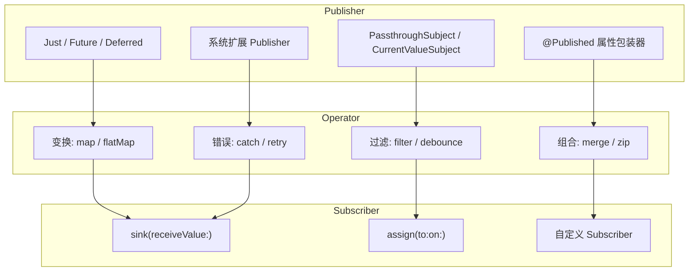
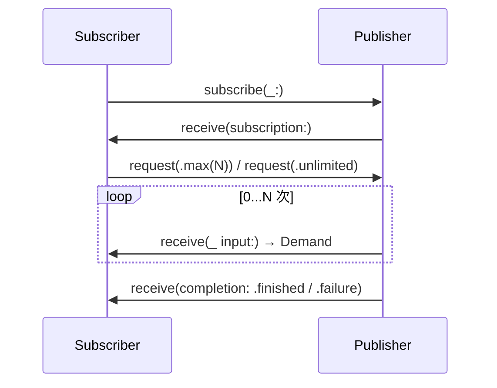
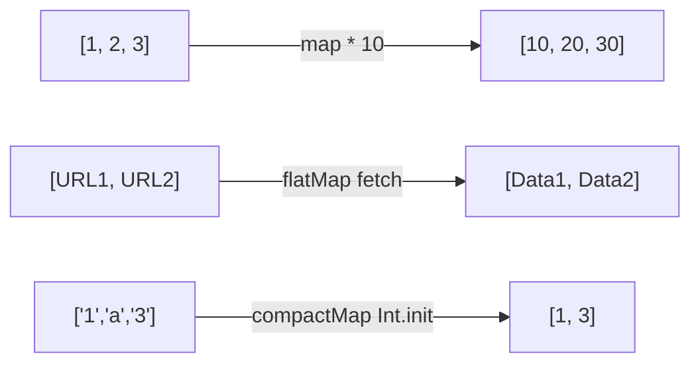
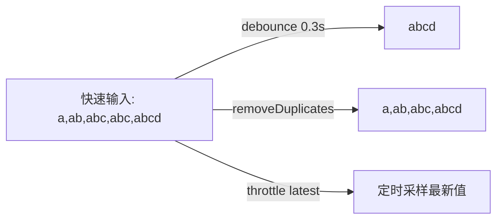
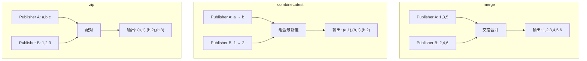
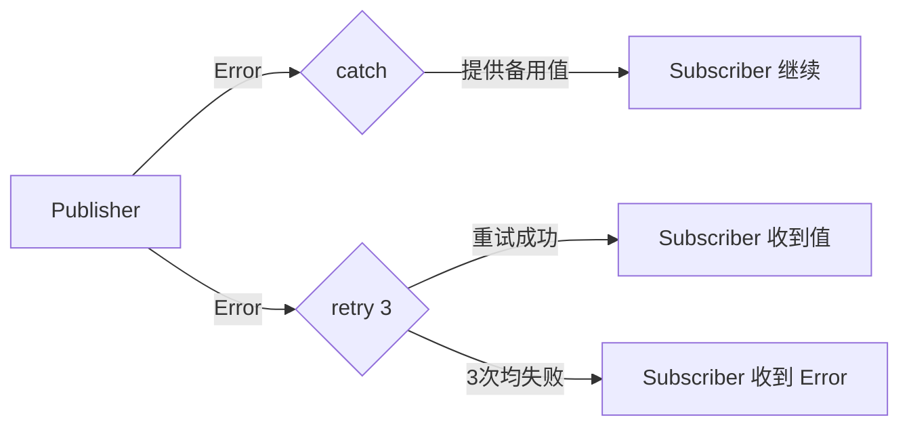
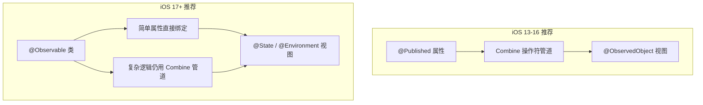
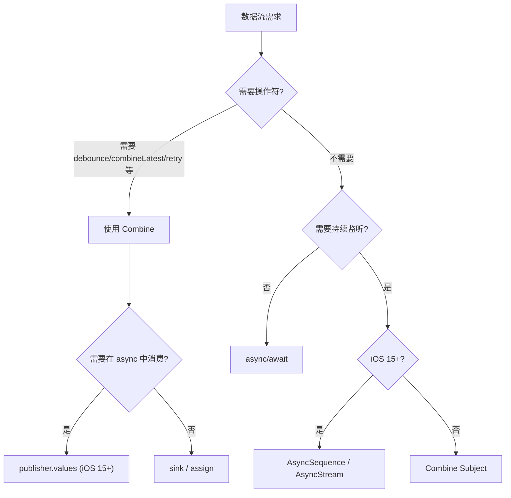

# Combine 基础使用与典型场景 — 详细解析

> **定位**：本文聚焦 Combine 框架的基本使用方法与典型实践场景，面向已有 iOS 开发经验、希望快速上手 Combine 的工程师。理论定位与战略分析参见 [Combine定位与战略分析_详细解析](Combine定位与战略分析_详细解析.md)。
>
> **适用版本**：iOS 13+（Swift 5.1+），部分 API 标注了更高版本要求。

---

## 一、核心结论 TL;DR

### 1.1 三大核心组件速查

| 组件 | 职责 | 关键协议 | 类型约束 |
|------|------|----------|----------|
| **Publisher** | 声明数据来源与失败类型 | `Publisher` | `Output` / `Failure: Error` |
| **Subscriber** | 接收数据并触发副作用 | `Subscriber` | `Input` / `Failure` 须与 Publisher 匹配 |
| **Operator** | 中间变换层，链式衔接 | 本质也是 `Publisher` | 输入匹配上游 Output，输出传递给下游 |

### 1.2 操作符分类速查

| 分类 | 核心操作符 | 一句话场景 |
|------|-----------|-----------|
| 变换 | `map`, `flatMap`, `compactMap`, `scan`, `reduce` | 数据格式转换、展平嵌套流 |
| 过滤 | `filter`, `removeDuplicates`, `debounce`, `throttle` | 去重、防抖、节流 |
| 组合 | `merge`, `combineLatest`, `zip`, `switchToLatest` | 多源合并、最新值聚合 |
| 错误处理 | `catch`, `retry`, `replaceError`, `mapError` | 失败恢复、重试、错误映射 |
| 调度 | `receive(on:)`, `subscribe(on:)`, `delay` | 线程切换、延迟发送 |
| 时间 | `debounce`, `throttle`, `timeout` | 时间窗口控制 |
| 调试 | `print`, `breakpoint`, `handleEvents` | 开发阶段链路追踪 |

### 1.3 典型场景推荐

| 场景 | 推荐操作符组合 | 复杂度 |
|------|---------------|--------|
| 实时搜索 | `debounce` → `removeDuplicates` → `flatMap` | ⭐⭐ |
| 表单验证 | `combineLatest` → `map` | ⭐⭐ |
| 网络请求链 | `flatMap` 链式调用 | ⭐⭐⭐ |
| 分页加载 | `CurrentValueSubject` → `flatMap` → `scan` | ⭐⭐⭐ |
| 定时器/倒计时 | `Timer.publish` → `autoconnect` → `map` | ⭐ |
| 事件总线 | `PassthroughSubject` → `filter` | ⭐⭐ |

---

## 二、Combine 核心概念与基础语法

### 2.1 三大核心组件架构

**Combine 的设计遵循 Reactive Streams 规范，Publisher-Operator-Subscriber 构成完整的数据管道。**




**订阅生命周期**：



### 2.2 Publisher 类型速查表

| Publisher 类型 | 描述 | 典型场景 |
|---------------|------|----------|
| `Just` | 发射单个值后立即完成 | 单元测试 mock、默认值提供 |
| `Future` | 异步产生单个值或错误（闭包在创建时执行） | 包装回调 API、一次性异步操作 |
| `Deferred` | 延迟到订阅时才创建 Publisher | 惰性资源初始化、按需创建 |
| `Empty` | 不发射值，立即或永不完成 | 条件分支的空实现 |
| `Fail` | 立即发射错误 | 错误测试、前置校验失败 |
| `Record` | 录制预设序列的值和完成事件 | 单元测试、重放固定序列 |
| `PassthroughSubject` | 无初始值，手动 `send()` 发射 | 事件总线、外部事件桥接 |
| `CurrentValueSubject` | 带初始值，可随时读取当前值 | 状态管理、分页页码 |
| `@Published` | 属性包装器，值变更时自动发布 | ViewModel 属性绑定 |
| `URLSession.DataTaskPublisher` | 网络请求 Publisher | HTTP 请求 |
| `NotificationCenter.Publisher` | 通知中心 Publisher | 系统通知监听 |
| `Timer.TimerPublisher` | 定时器 Publisher | 倒计时、轮询 |

#### Just — 单值发布

```swift
// iOS 13+
let publisher = Just(42)
publisher
    .sink { completion in
        print("完成: \(completion)")  // finished
    } receiveValue: { value in
        print("收到: \(value)")       // 42
    }
```

#### Future — 异步单值

```swift
// iOS 13+ — 包装异步回调
func fetchUser(id: Int) -> Future<User, NetworkError> {
    Future { promise in
        APIClient.shared.getUser(id: id) { result in
            switch result {
            case .success(let user):
                promise(.success(user))
            case .failure(let error):
                promise(.failure(error))
            }
        }
    }
}
```

> **注意**：`Future` 的闭包在**创建时立即执行**，而非订阅时。如果需要惰性执行，使用 `Deferred { Future { ... } }`。

#### PassthroughSubject vs CurrentValueSubject

```swift
// PassthroughSubject：无初始值，适合事件
let eventBus = PassthroughSubject<AppEvent, Never>()
eventBus.send(.userLoggedIn)

// CurrentValueSubject：有初始值，可读取当前状态
let pageIndex = CurrentValueSubject<Int, Never>(1)
print(pageIndex.value)  // 1
pageIndex.send(2)
print(pageIndex.value)  // 2
```

#### @Published 属性包装器

```swift
// iOS 13+
class LoginViewModel: ObservableObject {
    @Published var username = ""
    @Published var password = ""
    @Published var isLoading = false
    
    // 通过 $username 访问底层 Publisher
    // 类型: Published<String>.Publisher (Output=String, Failure=Never)
}
```

### 2.3 Subscriber 类型

#### sink — 最常用的订阅方式

```swift
// iOS 13+
let cancellable = [1, 2, 3].publisher
    .sink { completion in
        switch completion {
        case .finished:
            print("流完成")
        case .failure(let error):
            print("错误: \(error)")
        }
    } receiveValue: { value in
        print("值: \(value)")
    }
// ⚠️ 必须持有 cancellable，否则订阅立即取消
```

#### assign(to:on:) — 属性绑定（iOS 13）

```swift
// iOS 13+ — 注意：强引用 object 参数，可能导致循环引用
class ViewModel: ObservableObject {
    @Published var title = ""
}

let vm = ViewModel()
let cancellable = Just("Hello Combine")
    .assign(to: \.title, on: vm)
// vm.title == "Hello Combine"
```

#### assign(to:) — 避免循环引用（iOS 14+）

```swift
// iOS 14+ — 直接绑定到 @Published 属性，不产生 AnyCancellable
class SearchViewModel: ObservableObject {
    @Published var query = ""
    @Published var results: [String] = []
    
    init() {
        $query
            .debounce(for: .milliseconds(300), scheduler: RunLoop.main)
            .removeDuplicates()
            .map { query in
                // 模拟搜索
                ["结果1: \(query)", "结果2: \(query)"]
            }
            .assign(to: &$results)  // ✅ 无循环引用风险
    }
}
```

#### 自定义 Subscriber

```swift
// iOS 13+
class IntSubscriber: Subscriber {
    typealias Input = Int
    typealias Failure = Never
    
    func receive(subscription: Subscription) {
        subscription.request(.max(3))  // 背压：最多接收 3 个值
    }
    
    func receive(_ input: Int) -> Subscribers.Demand {
        print("收到: \(input)")
        return .none  // 不额外请求
    }
    
    func receive(completion: Subscribers.Completion<Never>) {
        print("完成")
    }
}

let publisher = [1, 2, 3, 4, 5].publisher
publisher.subscribe(IntSubscriber())
// 输出: 收到: 1, 收到: 2, 收到: 3（仅3个）
```

### 2.4 Subscription 协议与背压控制

**背压（Backpressure）是 Combine 区别于简单回调或通知机制的核心能力。**

```swift
protocol Subscription: Cancellable {
    func request(_ demand: Subscribers.Demand)
}
```

| Demand 值 | 含义 | 使用场景 |
|-----------|------|----------|
| `.unlimited` | 不限量接收 | `sink` / `assign` 默认行为 |
| `.max(N)` | 最多接收 N 个值 | 自定义 Subscriber、资源受限场景 |
| `.none` | 不额外请求 | `receive(_:)` 返回，维持当前需求 |

> **实践建议**：大多数业务场景使用 `sink` 的 `.unlimited` 即可。仅在处理高频数据流（如传感器数据、WebSocket）时需要自定义背压策略。

---

## 三、操作符完整分类与使用指南

### 3.1 变换操作符

**变换操作符将上游值转换为新的形式传递给下游，是最常使用的操作符类别。**



| 操作符 | 输入 → 输出 | 使用场景 |
|--------|------------|----------|
| `map` | `T → U` | 简单值转换 |
| `tryMap` | `T → U throws` | 可能抛错的转换 |
| `flatMap` | `T → Publisher<U>` | 将值转换为新的 Publisher，展平嵌套 |
| `compactMap` | `T → U?` | 过滤 nil 的转换 |
| `scan` | `(累积值, T) → U` | 累计运算（类似 reduce，但逐个发射） |
| `reduce` | `(累积值, T) → U` | 仅在完成时发射最终累积值 |

```swift
// map — 基础变换
[1, 2, 3].publisher
    .map { $0 * 10 }
    .sink { print($0) }  // 10, 20, 30

// flatMap — 展平嵌套 Publisher（网络请求场景）
func fetchDetail(for id: Int) -> AnyPublisher<Detail, Error> { /* ... */ }

[1, 2, 3].publisher
    .setFailureType(to: Error.self)
    .flatMap(maxPublishers: .max(2)) { id in
        fetchDetail(for: id)  // 最多并发 2 个请求
    }
    .sink(receiveCompletion: { _ in }, receiveValue: { detail in
        print(detail)
    })

// compactMap — 过滤 nil
["1", "abc", "3", "def", "5"].publisher
    .compactMap { Int($0) }
    .sink { print($0) }  // 1, 3, 5

// scan — 累积（逐个发射）
[1, 2, 3, 4, 5].publisher
    .scan(0, +)
    .sink { print($0) }  // 1, 3, 6, 10, 15
```

### 3.2 过滤操作符

**过滤操作符根据条件保留或丢弃上游值，是防抖、节流、去重的基础。**



| 操作符 | 行为 | 使用场景 |
|--------|------|----------|
| `filter` | 条件为 true 时放行 | 数据筛选 |
| `removeDuplicates` | 过滤连续重复值 | 去重（搜索输入） |
| `debounce` | 等待静默期后发射最新值 | 搜索防抖 |
| `throttle` | 固定时间窗内取首/末值 | 按钮防重复、滚动节流 |
| `first` / `first(where:)` | 取第一个匹配值后完成 | 快速获取首个结果 |
| `last` / `last(where:)` | 流完成时发射最后匹配值 | 获取最终值 |
| `dropFirst(N)` | 丢弃前 N 个值 | 跳过初始值 |
| `prefix(N)` | 仅保留前 N 个值 | 限制数量 |

```swift
// debounce vs throttle
// debounce: 等用户停止输入 0.3s 后才发射
$searchText
    .debounce(for: .milliseconds(300), scheduler: RunLoop.main)

// throttle: 每 0.3s 固定发射一次（latest=true 取最新值）
scrollOffsetPublisher
    .throttle(for: .milliseconds(300), scheduler: RunLoop.main, latest: true)

// removeDuplicates — 连续重复值过滤
$searchText
    .removeDuplicates()  // "abc" → "abc" 不会重复触发

// filter — 条件过滤
[1, 2, 3, 4, 5, 6].publisher
    .filter { $0 % 2 == 0 }
    .sink { print($0) }  // 2, 4, 6
```

### 3.3 组合操作符

**组合操作符将多个 Publisher 的输出汇聚为单一数据流。**



| 操作符 | 行为 | 使用场景 |
|--------|------|----------|
| `merge` | 交错合并多个同类型流 | 多数据源聚合 |
| `combineLatest` | 任一发射时组合所有最新值 | 表单验证（多字段联动） |
| `zip` | 严格配对（等待所有源都有新值） | 并行请求结果同步 |
| `switchToLatest` | 切换到最新的内部 Publisher | 搜索取消旧请求 |
| `append` | 当前流完成后追加 | 串接多个数据源 |
| `prepend` | 在当前流之前插入 | 提供默认值 / 缓存数据 |

```swift
// combineLatest — 表单验证
let username = PassthroughSubject<String, Never>()
let password = PassthroughSubject<String, Never>()

let isFormValid = username.combineLatest(password)
    .map { user, pass in
        user.count >= 3 && pass.count >= 6
    }

// zip — 并行请求同步等待
let userPublisher = fetchUser()
let configPublisher = fetchConfig()

userPublisher.zip(configPublisher)
    .sink { user, config in
        // 两个请求都完成后才执行
        setupUI(user: user, config: config)
    }

// merge — 多源合并
let localNotifications = NotificationCenter.default.publisher(for: .localUpdate)
let remoteNotifications = NotificationCenter.default.publisher(for: .remoteUpdate)

localNotifications.merge(with: remoteNotifications)
    .sink { notification in
        refreshUI()
    }

// switchToLatest — 取消旧搜索
$searchText
    .debounce(for: .milliseconds(300), scheduler: RunLoop.main)
    .map { query in
        searchAPI(query: query)  // 返回 Publisher
    }
    .switchToLatest()  // 新搜索自动取消旧请求
    .sink { results in
        self.results = results
    }
```

### 3.4 错误处理操作符

**错误处理操作符使数据流在遇到错误时能优雅降级，而非直接终止。**



| 操作符 | 行为 | 使用场景 |
|--------|------|----------|
| `catch` | 错误时切换到备用 Publisher | 离线回退、默认值 |
| `retry(N)` | 失败后重新订阅 N 次 | 网络重试 |
| `replaceError` | 错误替换为固定值 | 简单降级 |
| `mapError` | 转换错误类型 | 统一错误域 |
| `tryMap` | 可抛错的 map | 解码、校验 |
| `tryCatch` | 可抛错的 catch | 有条件恢复 |

```swift
// retry + catch 组合 — 网络请求容错
URLSession.shared.dataTaskPublisher(for: url)
    .retry(2)  // 最多重试 2 次（共 3 次请求）
    .map(\.data)
    .decode(type: Response.self, decoder: JSONDecoder())
    .catch { error -> Just<Response> in
        print("降级: \(error)")
        return Just(Response.fallback)
    }
    .receive(on: DispatchQueue.main)
    .assign(to: &$response)

// mapError — 统一错误类型
enum AppError: Error {
    case network(URLError)
    case decode(DecodingError)
    case unknown(Error)
}

URLSession.shared.dataTaskPublisher(for: url)
    .mapError { AppError.network($0) }
    .tryMap { data, response -> Data in
        guard let httpResponse = response as? HTTPURLResponse,
              (200...299).contains(httpResponse.statusCode) else {
            throw AppError.network(URLError(.badServerResponse))
        }
        return data
    }
    .decode(type: User.self, decoder: JSONDecoder())
    .mapError { error -> AppError in
        if let appError = error as? AppError { return appError }
        if let decodingError = error as? DecodingError {
            return .decode(decodingError)
        }
        return .unknown(error)
    }
```

### 3.5 调度操作符

**调度操作符控制数据在哪个线程/队列上发射，是 UI 更新安全的关键。**

| 操作符 | 行为 | 使用场景 |
|--------|------|----------|
| `receive(on:)` | 下游在指定 Scheduler 上接收值 | 切回主线程更新 UI |
| `subscribe(on:)` | 上游在指定 Scheduler 上执行 | 后台执行耗时操作 |
| `delay` | 延迟指定时间后发射 | 动画延迟、重试间隔 |

```swift
// 典型模式：后台请求 → 主线程更新
URLSession.shared.dataTaskPublisher(for: url)
    .subscribe(on: DispatchQueue.global(qos: .background))  // 后台执行
    .receive(on: DispatchQueue.main)                          // 主线程接收
    .sink(receiveCompletion: { _ in },
          receiveValue: { data, response in
        self.updateUI(with: data)
    })
```

> **关键区别**：`receive(on:)` 影响**下游**操作符和 Subscriber；`subscribe(on:)` 影响**上游** Publisher 的订阅和请求操作。

### 3.6 时间操作符

| 操作符 | 行为 | 使用场景 |
|--------|------|----------|
| `debounce(for:scheduler:)` | 静默期后发射最新值 | 搜索输入 |
| `throttle(for:scheduler:latest:)` | 固定间隔采样 | 滚动事件 |
| `timeout(_ interval:scheduler:)` | 超时未收到值则完成/报错 | 网络超时 |
| `measureTimeInterval(using:)` | 测量两次发射的时间间隔 | 性能监控 |

```swift
// timeout — 超时控制
fetchDataPublisher
    .timeout(.seconds(10), scheduler: DispatchQueue.main, customError: { URLError(.timedOut) })
    .catch { _ in Just(Data()) }
    .sink { data in
        processData(data)
    }

// measureTimeInterval — 性能测量
subject
    .measureTimeInterval(using: DispatchQueue.main)
    .sink { stride in
        print("距上次发射: \(stride.magnitude) 秒")
    }
```

### 3.7 调试操作符

**开发阶段必备，帮助追踪数据流的每一步变化。**

| 操作符 | 行为 | 使用场景 |
|--------|------|----------|
| `print(_ prefix:)` | 打印所有事件到控制台 | 快速调试 |
| `breakpoint` | 条件触发 LLDB 断点 | 条件调试 |
| `handleEvents` | 在各个生命周期插入副作用 | 日志、埋点 |

```swift
// print — 最简单的调试工具
$searchText
    .print("🔍 搜索")  // 所有事件都会打印
    .debounce(for: .milliseconds(300), scheduler: RunLoop.main)
    .sink { _ in }

// handleEvents — 精细控制
fetchUser()
    .handleEvents(
        receiveSubscription: { _ in print("⏳ 开始请求") },
        receiveOutput: { user in print("✅ 收到: \(user.name)") },
        receiveCompletion: { print("🏁 完成: \($0)") },
        receiveCancel: { print("❌ 取消") }
    )
    .sink(receiveCompletion: { _ in }, receiveValue: { _ in })
```

---

## 四、Combine 与 SwiftUI 的集成

> 更多 SwiftUI 架构细节参见 [SwiftUI架构与渲染机制_详细解析](../02_SwiftUI深度解析/SwiftUI架构与渲染机制_详细解析.md)。

### 4.1 @Published + @ObservedObject 数据绑定（iOS 13-16）

**这是 iOS 13-16 期间 Combine 与 SwiftUI 结合的标准模式。**

```swift
// iOS 13+ — 完整 ViewModel 示例
class UserListViewModel: ObservableObject {
    // 输入
    @Published var searchQuery = ""
    @Published var selectedCategory: Category = .all
    
    // 输出
    @Published private(set) var users: [User] = []
    @Published private(set) var isLoading = false
    @Published private(set) var errorMessage: String?
    
    private var cancellables = Set<AnyCancellable>()
    private let userService: UserServiceProtocol
    
    init(userService: UserServiceProtocol = UserService()) {
        self.userService = userService
        setupBindings()
    }
    
    private func setupBindings() {
        // 多个 @Published 属性联动
        $searchQuery
            .combineLatest($selectedCategory)
            .debounce(for: .milliseconds(300), scheduler: RunLoop.main)
            .removeDuplicates { prev, curr in
                prev.0 == curr.0 && prev.1 == curr.1
            }
            .handleEvents(receiveOutput: { [weak self] _ in
                self?.isLoading = true
                self?.errorMessage = nil
            })
            .map { [userService] query, category in
                userService.searchUsers(query: query, category: category)
                    .catch { error -> Just<[User]> in
                        return Just([])
                    }
            }
            .switchToLatest()
            .receive(on: DispatchQueue.main)
            .sink { [weak self] users in
                self?.users = users
                self?.isLoading = false
            }
            .store(in: &cancellables)
    }
}

// SwiftUI View
struct UserListView: View {
    @StateObject private var viewModel = UserListViewModel()
    
    var body: some View {
        NavigationView {
            VStack {
                TextField("搜索用户", text: $viewModel.searchQuery)
                    .textFieldStyle(.roundedBorder)
                    .padding()
                
                Picker("分类", selection: $viewModel.selectedCategory) {
                    ForEach(Category.allCases, id: \.self) { category in
                        Text(category.displayName).tag(category)
                    }
                }
                .pickerStyle(.segmented)
                .padding(.horizontal)
                
                if viewModel.isLoading {
                    ProgressView()
                } else if let error = viewModel.errorMessage {
                    Text(error).foregroundColor(.red)
                } else {
                    List(viewModel.users) { user in
                        UserRow(user: user)
                    }
                }
            }
            .navigationTitle("用户列表")
        }
    }
}
```

### 4.2 Combine 在 SwiftUI 生命周期中的使用

#### onReceive() — 接收 Publisher 事件

```swift
// iOS 13+
struct TimerView: View {
    @State private var currentTime = Date()
    
    let timer = Timer.publish(every: 1, on: .main, in: .common).autoconnect()
    
    var body: some View {
        Text(currentTime, style: .time)
            .onReceive(timer) { date in
                currentTime = date
            }
    }
}

// 监听系统通知
struct ContentView: View {
    @State private var isInBackground = false
    
    var body: some View {
        Text(isInBackground ? "后台" : "前台")
            .onReceive(NotificationCenter.default.publisher(for: UIApplication.didEnterBackgroundNotification)) { _ in
                isInBackground = true
            }
            .onReceive(NotificationCenter.default.publisher(for: UIApplication.willEnterForegroundNotification)) { _ in
                isInBackground = false
            }
    }
}
```

#### .task + Combine 的 values 属性（iOS 15+）

```swift
// iOS 15+ — 在 async 上下文中消费 Combine Publisher
struct SearchView: View {
    @State private var query = ""
    @State private var results: [String] = []
    
    var body: some View {
        TextField("搜索", text: $query)
            .task(id: query) {
                // 使用 Combine 的 debounce，再通过 .values 桥接到 async
                guard !query.isEmpty else { return }
                do {
                    try await Task.sleep(nanoseconds: 300_000_000)  // 简易 debounce
                    results = try await searchAPI(query: query)
                } catch {
                    // 被取消或出错
                }
            }
    }
}
```

### 4.3 与 @Observable（iOS 17+）的对比

| 特性 | Combine + ObservableObject | @Observable (iOS 17+) |
|------|--------------------------|----------------------|
| 最低版本 | iOS 13 | iOS 17 |
| 属性标注 | 每个属性需 `@Published` | 自动追踪，无需标注 |
| 视图更新粒度 | 任一 `@Published` 变化触发整体更新 | 仅访问的属性变化才触发更新 |
| 复杂数据流 | `combineLatest`、`debounce` 等丰富操作 | 需结合 `AsyncSequence` 或 Combine |
| View 端引用 | `@ObservedObject` / `@StateObject` | `@State` / `@Environment` |

**何时仍需要 Combine（即使在 iOS 17+）**：
- 需要 `debounce`、`throttle`、`combineLatest` 等时间/组合操作
- 需要 `retry`、`catch` 等错误恢复管道
- 与系统 Publisher（`URLSession`、`NotificationCenter`、`Timer`）交互
- 已有大量 Combine 代码的项目迁移过渡期



---

## 五、典型使用场景

> 网络层实践另见 [网络框架与数据持久化_详细解析](../05_并发与网络框架/网络框架与数据持久化_详细解析.md)。

### 5.1 实时搜索（Search-as-you-type）

**经典 Combine 场景：TextField → debounce → removeDuplicates → flatMap → UI。**

```swift
// iOS 13+ — 完整可运行示例
class SearchViewModel: ObservableObject {
    @Published var searchText = ""
    @Published private(set) var results: [SearchResult] = []
    @Published private(set) var isSearching = false
    
    private var cancellables = Set<AnyCancellable>()
    
    init() {
        $searchText
            .dropFirst()                    // 跳过初始空值
            .debounce(for: .milliseconds(300), scheduler: RunLoop.main)
            .removeDuplicates()             // 相同文本不重复搜索
            .map { query -> AnyPublisher<[SearchResult], Never> in
                guard !query.isEmpty else {
                    return Just([]).eraseToAnyPublisher()
                }
                return self.search(query: query)
                    .catch { _ in Just([]) }
                    .eraseToAnyPublisher()
            }
            .switchToLatest()               // 取消旧请求
            .receive(on: DispatchQueue.main)
            .sink { [weak self] results in
                self?.results = results
                self?.isSearching = false
            }
            .store(in: &cancellables)
        
        // 搜索状态指示
        $searchText
            .dropFirst()
            .map { !$0.isEmpty }
            .assign(to: &$isSearching)
    }
    
    private func search(query: String) -> AnyPublisher<[SearchResult], Error> {
        let url = URL(string: "https://api.example.com/search?q=\(query)")!
        return URLSession.shared.dataTaskPublisher(for: url)
            .map(\.data)
            .decode(type: SearchResponse.self, decoder: JSONDecoder())
            .map(\.results)
            .eraseToAnyPublisher()
    }
}

struct SearchView: View {
    @StateObject private var viewModel = SearchViewModel()
    
    var body: some View {
        VStack {
            TextField("搜索...", text: $viewModel.searchText)
                .textFieldStyle(.roundedBorder)
                .padding()
            
            if viewModel.isSearching {
                ProgressView("搜索中...")
            }
            
            List(viewModel.results) { result in
                Text(result.title)
            }
        }
    }
}
```

### 5.2 表单验证

**combineLatest 聚合多个字段，实时计算表单合法性。**

```swift
// iOS 13+
class RegistrationViewModel: ObservableObject {
    // 输入
    @Published var username = ""
    @Published var email = ""
    @Published var password = ""
    @Published var confirmPassword = ""
    
    // 输出
    @Published private(set) var usernameError: String?
    @Published private(set) var emailError: String?
    @Published private(set) var passwordError: String?
    @Published private(set) var isFormValid = false
    
    private var cancellables = Set<AnyCancellable>()
    
    // 内部验证 Publisher
    private var isUsernameValid: AnyPublisher<Bool, Never> {
        $username
            .debounce(for: .milliseconds(200), scheduler: RunLoop.main)
            .map { $0.count >= 3 }
            .eraseToAnyPublisher()
    }
    
    private var isEmailValid: AnyPublisher<Bool, Never> {
        $email
            .debounce(for: .milliseconds(200), scheduler: RunLoop.main)
            .map { email in
                let regex = /^[A-Za-z0-9._%+-]+@[A-Za-z0-9.-]+\.[A-Z|a-z]{2,}$/
                return email.wholeMatch(of: regex) != nil
            }
            .eraseToAnyPublisher()
    }
    
    private var isPasswordValid: AnyPublisher<Bool, Never> {
        $password.combineLatest($confirmPassword)
            .debounce(for: .milliseconds(200), scheduler: RunLoop.main)
            .map { password, confirm in
                password.count >= 8 && password == confirm
            }
            .eraseToAnyPublisher()
    }
    
    init() {
        // 聚合所有验证结果
        isUsernameValid
            .combineLatest(isEmailValid, isPasswordValid)
            .map { $0 && $1 && $2 }
            .assign(to: &$isFormValid)
        
        // 用户名错误提示
        $username
            .debounce(for: .milliseconds(500), scheduler: RunLoop.main)
            .map { name -> String? in
                if name.isEmpty { return nil }
                return name.count < 3 ? "用户名至少 3 个字符" : nil
            }
            .assign(to: &$usernameError)
    }
}

struct RegistrationView: View {
    @StateObject private var viewModel = RegistrationViewModel()
    
    var body: some View {
        Form {
            Section("账号信息") {
                TextField("用户名", text: $viewModel.username)
                if let error = viewModel.usernameError {
                    Text(error).font(.caption).foregroundColor(.red)
                }
                TextField("邮箱", text: $viewModel.email)
            }
            Section("密码") {
                SecureField("密码", text: $viewModel.password)
                SecureField("确认密码", text: $viewModel.confirmPassword)
            }
            Section {
                Button("注册") { /* 提交 */ }
                    .disabled(!viewModel.isFormValid)
            }
        }
    }
}
```

### 5.3 网络请求链

**flatMap 串联多个依赖请求，形成清晰的异步管道。**

```swift
// iOS 13+ — 登录 → Token → 用户信息
class AuthService {
    struct Credentials { let username: String; let password: String }
    struct AuthToken { let token: String; let refreshToken: String }
    struct UserProfile: Decodable { let id: Int; let name: String; let avatar: URL }
    
    private var cancellables = Set<AnyCancellable>()
    
    func loginFlow(credentials: Credentials) -> AnyPublisher<UserProfile, Error> {
        // Step 1: 登录获取 token
        login(credentials: credentials)
            // Step 2: 用 token 请求用户信息
            .flatMap { [self] token in
                fetchProfile(token: token)
            }
            // Step 3: 下载头像预加载
            .flatMap { [self] profile in
                preloadAvatar(profile: profile)
                    .map { _ in profile }     // 头像加载完后传递 profile
                    .catch { _ in Just(profile) }  // 头像失败不阻断主流程
            }
            .receive(on: DispatchQueue.main)
            .eraseToAnyPublisher()
    }
    
    private func login(credentials: Credentials) -> AnyPublisher<AuthToken, Error> {
        var request = URLRequest(url: URL(string: "https://api.example.com/login")!)
        request.httpMethod = "POST"
        request.httpBody = try? JSONEncoder().encode(credentials)
        
        return URLSession.shared.dataTaskPublisher(for: request)
            .map(\.data)
            .decode(type: AuthToken.self, decoder: JSONDecoder())
            .eraseToAnyPublisher()
    }
    
    private func fetchProfile(token: AuthToken) -> AnyPublisher<UserProfile, Error> {
        var request = URLRequest(url: URL(string: "https://api.example.com/profile")!)
        request.setValue("Bearer \(token.token)", forHTTPHeaderField: "Authorization")
        
        return URLSession.shared.dataTaskPublisher(for: request)
            .map(\.data)
            .decode(type: UserProfile.self, decoder: JSONDecoder())
            .eraseToAnyPublisher()
    }
    
    private func preloadAvatar(profile: UserProfile) -> AnyPublisher<Data, Error> {
        URLSession.shared.dataTaskPublisher(for: profile.avatar)
            .map(\.data)
            .mapError { $0 as Error }
            .eraseToAnyPublisher()
    }
}
```

### 5.4 多数据源合并

```swift
// iOS 13+ — merge 合并多个通知源
class NotificationManager: ObservableObject {
    @Published private(set) var alerts: [AlertItem] = []
    private var cancellables = Set<AnyCancellable>()
    
    init() {
        let pushNotifications = NotificationCenter.default
            .publisher(for: .pushReceived)
            .compactMap { $0.userInfo?["alert"] as? String }
            .map { AlertItem(source: .push, message: $0) }
        
        let socketAlerts = WebSocketManager.shared.alertPublisher
            .map { AlertItem(source: .socket, message: $0) }
        
        let localReminders = Timer.publish(every: 60, on: .main, in: .common)
            .autoconnect()
            .compactMap { _ in PendingReminder.next() }
            .map { AlertItem(source: .local, message: $0.message) }
        
        // merge 合并三个异构数据源（统一为 AlertItem 类型）
        pushNotifications
            .merge(with: socketAlerts, localReminders)
            .receive(on: DispatchQueue.main)
            .scan([AlertItem]()) { accumulated, newAlert in
                Array((accumulated + [newAlert]).suffix(50))  // 保留最新 50 条
            }
            .assign(to: &$alerts)
    }
}
```

### 5.5 分页加载

**CurrentValueSubject 管理页码状态，scan 累积历史结果。**

```swift
// iOS 13+
class PaginatedListViewModel: ObservableObject {
    @Published private(set) var items: [Item] = []
    @Published private(set) var isLoading = false
    @Published private(set) var hasMorePages = true
    
    private let pageSubject = CurrentValueSubject<Int, Never>(1)
    private var cancellables = Set<AnyCancellable>()
    
    init() {
        pageSubject
            .handleEvents(receiveOutput: { [weak self] _ in
                self?.isLoading = true
            })
            .flatMap { [self] page in
                fetchPage(page: page)
                    .catch { _ -> Just<PageResponse> in
                        Just(PageResponse(items: [], hasMore: false))
                    }
            }
            .receive(on: DispatchQueue.main)
            .sink { [weak self] response in
                guard let self else { return }
                if self.pageSubject.value == 1 {
                    self.items = response.items  // 第一页：替换
                } else {
                    self.items.append(contentsOf: response.items)  // 追加
                }
                self.hasMorePages = response.hasMore
                self.isLoading = false
            }
            .store(in: &cancellables)
    }
    
    func loadNextPage() {
        guard !isLoading, hasMorePages else { return }
        pageSubject.send(pageSubject.value + 1)
    }
    
    func refresh() {
        pageSubject.send(1)
    }
    
    private func fetchPage(page: Int) -> AnyPublisher<PageResponse, Error> {
        let url = URL(string: "https://api.example.com/items?page=\(page)&size=20")!
        return URLSession.shared.dataTaskPublisher(for: url)
            .map(\.data)
            .decode(type: PageResponse.self, decoder: JSONDecoder())
            .eraseToAnyPublisher()
    }
}

struct PaginatedListView: View {
    @StateObject private var viewModel = PaginatedListViewModel()
    
    var body: some View {
        List {
            ForEach(viewModel.items) { item in
                ItemRow(item: item)
                    .onAppear {
                        if item.id == viewModel.items.last?.id {
                            viewModel.loadNextPage()
                        }
                    }
            }
            if viewModel.isLoading {
                ProgressView()
                    .frame(maxWidth: .infinity)
            }
        }
        .refreshable {
            viewModel.refresh()
        }
    }
}
```

### 5.6 定时器与倒计时

```swift
// iOS 13+ — 倒计时
class CountdownViewModel: ObservableObject {
    @Published private(set) var remainingTime = ""
    @Published private(set) var isFinished = false
    
    private var cancellable: AnyCancellable?
    
    func startCountdown(seconds: Int) {
        let deadline = Date().addingTimeInterval(TimeInterval(seconds))
        
        cancellable = Timer.publish(every: 1, on: .main, in: .common)
            .autoconnect()
            .map { now -> Int in
                max(0, Int(deadline.timeIntervalSince(now)))
            }
            .removeDuplicates()
            .sink { [weak self] remaining in
                guard let self else { return }
                let minutes = remaining / 60
                let secs = remaining % 60
                self.remainingTime = String(format: "%02d:%02d", minutes, secs)
                if remaining == 0 {
                    self.isFinished = true
                    self.cancellable?.cancel()
                }
            }
    }
    
    func stop() {
        cancellable?.cancel()
    }
}

// SwiftUI 视图
struct CountdownView: View {
    @StateObject private var viewModel = CountdownViewModel()
    
    var body: some View {
        VStack(spacing: 20) {
            Text(viewModel.remainingTime)
                .font(.system(size: 60, weight: .bold, design: .monospaced))
            
            if viewModel.isFinished {
                Text("时间到！").foregroundColor(.red)
            }
            
            Button("开始 5 分钟倒计时") {
                viewModel.startCountdown(seconds: 300)
            }
        }
    }
}
```

### 5.7 WebSocket 数据流

```swift
// iOS 13+ — WebSocket + Combine
class WebSocketManager: ObservableObject {
    @Published private(set) var messages: [ChatMessage] = []
    @Published private(set) var connectionState: ConnectionState = .disconnected
    
    private let messageSubject = PassthroughSubject<ChatMessage, Never>()
    private var webSocketTask: URLSessionWebSocketTask?
    private var cancellables = Set<AnyCancellable>()
    
    enum ConnectionState { case disconnected, connecting, connected }
    
    init() {
        // 将 Subject 的事件累积到 messages 数组
        messageSubject
            .receive(on: DispatchQueue.main)
            .scan([ChatMessage]()) { messages, newMessage in
                var updated = messages
                updated.append(newMessage)
                return Array(updated.suffix(100))  // 保留最近 100 条
            }
            .assign(to: &$messages)
    }
    
    func connect(to url: URL) {
        connectionState = .connecting
        webSocketTask = URLSession.shared.webSocketTask(with: url)
        webSocketTask?.resume()
        connectionState = .connected
        receiveMessage()
    }
    
    private func receiveMessage() {
        webSocketTask?.receive { [weak self] result in
            guard let self else { return }
            switch result {
            case .success(let message):
                switch message {
                case .string(let text):
                    if let data = text.data(using: .utf8),
                       let chatMessage = try? JSONDecoder().decode(ChatMessage.self, from: data) {
                        self.messageSubject.send(chatMessage)
                    }
                case .data(let data):
                    if let chatMessage = try? JSONDecoder().decode(ChatMessage.self, from: data) {
                        self.messageSubject.send(chatMessage)
                    }
                @unknown default:
                    break
                }
                self.receiveMessage()  // 继续监听下一条
                
            case .failure:
                DispatchQueue.main.async {
                    self.connectionState = .disconnected
                }
            }
        }
    }
    
    func send(_ text: String) {
        let message = URLSessionWebSocketTask.Message.string(text)
        webSocketTask?.send(message) { error in
            if let error { print("发送失败: \(error)") }
        }
    }
    
    func disconnect() {
        webSocketTask?.cancel(with: .normalClosure, reason: nil)
        connectionState = .disconnected
    }
}
```

### 5.8 事件总线（Event Bus）

**PassthroughSubject 实现类型安全的全局事件分发。**

```swift
// iOS 13+ — 类型安全事件总线
enum AppEvent {
    case userLoggedIn(userId: String)
    case userLoggedOut
    case themeChanged(Theme)
    case networkStatusChanged(isOnline: Bool)
    case dataUpdated(entity: String, id: String)
}

final class EventBus {
    static let shared = EventBus()
    
    private let subject = PassthroughSubject<AppEvent, Never>()
    private init() {}
    
    /// 发送事件
    func emit(_ event: AppEvent) {
        subject.send(event)
    }
    
    /// 订阅所有事件
    var publisher: AnyPublisher<AppEvent, Never> {
        subject.eraseToAnyPublisher()
    }
    
    /// 订阅特定类型事件的便利方法
    func on<T>(_ extract: @escaping (AppEvent) -> T?) -> AnyPublisher<T, Never> {
        subject
            .compactMap(extract)
            .eraseToAnyPublisher()
    }
}

// 使用示例
class SettingsViewModel: ObservableObject {
    @Published var currentTheme: Theme = .light
    private var cancellables = Set<AnyCancellable>()
    
    init() {
        // 只监听主题变更事件
        EventBus.shared.on { event -> Theme? in
            if case .themeChanged(let theme) = event { return theme }
            return nil
        }
        .assign(to: &$currentTheme)
        
        // 监听登出事件
        EventBus.shared.publisher
            .filter { if case .userLoggedOut = $0 { return true }; return false }
            .sink { [weak self] _ in
                self?.resetSettings()
            }
            .store(in: &cancellables)
    }
    
    private func resetSettings() { /* ... */ }
}

// 发送事件
EventBus.shared.emit(.themeChanged(.dark))
EventBus.shared.emit(.userLoggedOut)
```

---

## 六、iOS 版本兼容性

### 6.1 版本特性对照表

| iOS 版本 | Combine 相关特性 | 重要程度 |
|----------|-----------------|---------|
| **iOS 13** | Combine 框架首发；全部核心 API（Publisher/Subscriber/Operator）；`@Published`、Subject 系列；`ObservableObject` 协议；`URLSession.DataTaskPublisher` | 🔴 核心 |
| **iOS 14** | `assign(to: &$property)` — 避免循环引用；`@StateObject` 属性包装器；部分操作符性能优化 | 🟡 推荐 |
| **iOS 15** | `AsyncSequence` 桥接：Publisher `.values` 属性；`URLSession.bytes(from:)` 等 async API | 🟡 重要 |
| **iOS 16** | `NavigationStack` / `NavigationSplitView`（SwiftUI 导航重构，间接影响 Combine 使用模式） | 🟢 一般 |
| **iOS 17** | `@Observable` 宏（Observation 框架）；简化数据绑定，减少对 `@Published` 的依赖 | 🟡 重要 |
| **iOS 18** | 稳定维护期；Combine API 无重大变化；`@Observable` 成为推荐方案 | 🟢 一般 |

### 6.2 最低版本建议

**iOS 13 即可使用 Combine 的全部核心功能。** 推荐策略：

- **新项目（最低 iOS 15+）**：优先使用 `async/await`，Combine 仅用于需要操作符能力的场景
- **存量项目（最低 iOS 13-14）**：Combine 仍是最佳选择，逐步向 `async/await` 迁移
- **最低 iOS 17+**：新代码优先 `@Observable`，Combine 作为复杂数据流补充

### 6.3 与 Swift Concurrency 的共存策略



**桥接代码示例**：

```swift
// Combine → async/await（iOS 15+）
func searchAsync(query: String) async throws -> [SearchResult] {
    try await $searchText
        .debounce(for: .milliseconds(300), scheduler: RunLoop.main)
        .removeDuplicates()
        .flatMap { query in
            searchAPI(query: query)
        }
        .values       // AsyncSequence 桥接
        .first { _ in true }!  // 取第一个值
}

// async/await → Combine
func makePublisher() -> AnyPublisher<User, Error> {
    Deferred {
        Future { promise in
            Task {
                do {
                    let user = try await fetchUserAsync()
                    promise(.success(user))
                } catch {
                    promise(.failure(error))
                }
            }
        }
    }
    .eraseToAnyPublisher()
}
```

**共存原则**：

| 场景 | 推荐技术 | 理由 |
|------|---------|------|
| 一次性异步操作 | `async/await` | 语法简洁，线性执行 |
| 持续数据流 + 操作符 | `Combine` | `debounce`、`combineLatest` 等无替代品 |
| 事件通知（无操作符需求） | `AsyncStream`（iOS 15+） | 与 structured concurrency 协作 |
| SwiftUI 数据绑定（iOS 13-16） | `@Published` + Combine | 原生支持 |
| SwiftUI 数据绑定（iOS 17+） | `@Observable` | 更简洁，性能更好 |
| 需要跨两种范式 | `publisher.values` 桥接 | 统一消费接口 |

---

## 参考与延伸

- [Combine定位与战略分析_详细解析](Combine定位与战略分析_详细解析.md) — 框架定位、与 RxSwift 对比、技术选型
- [SwiftUI架构与渲染机制_详细解析](../02_SwiftUI深度解析/SwiftUI架构与渲染机制_详细解析.md) — SwiftUI 渲染机制与数据流
- [网络框架与数据持久化_详细解析](../05_并发与网络框架/网络框架与数据持久化_详细解析.md) — 网络层 Combine 实践
- [Apple Combine Documentation](https://developer.apple.com/documentation/combine)
- [Using Combine (heckj)](https://heckj.github.io/swiftui-notes/)
