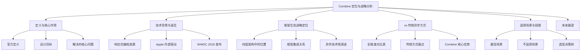
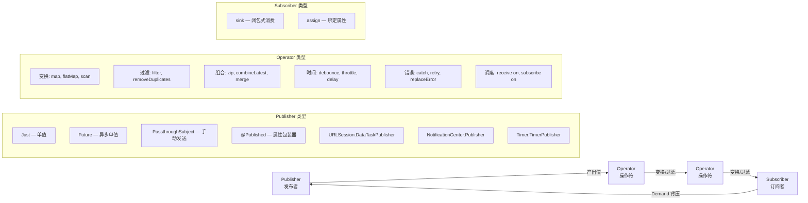
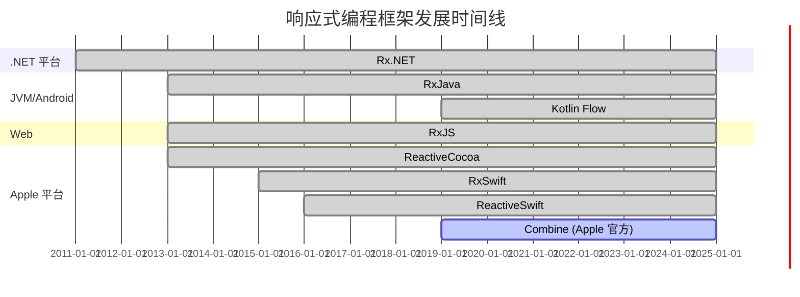
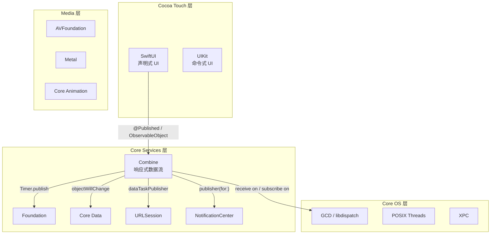
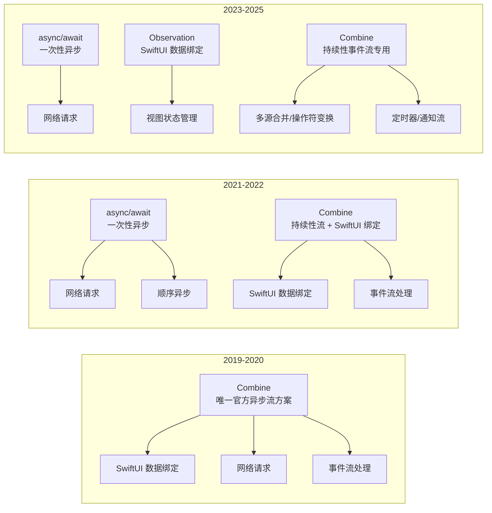
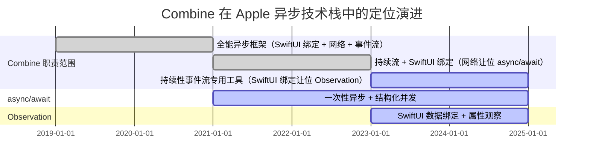
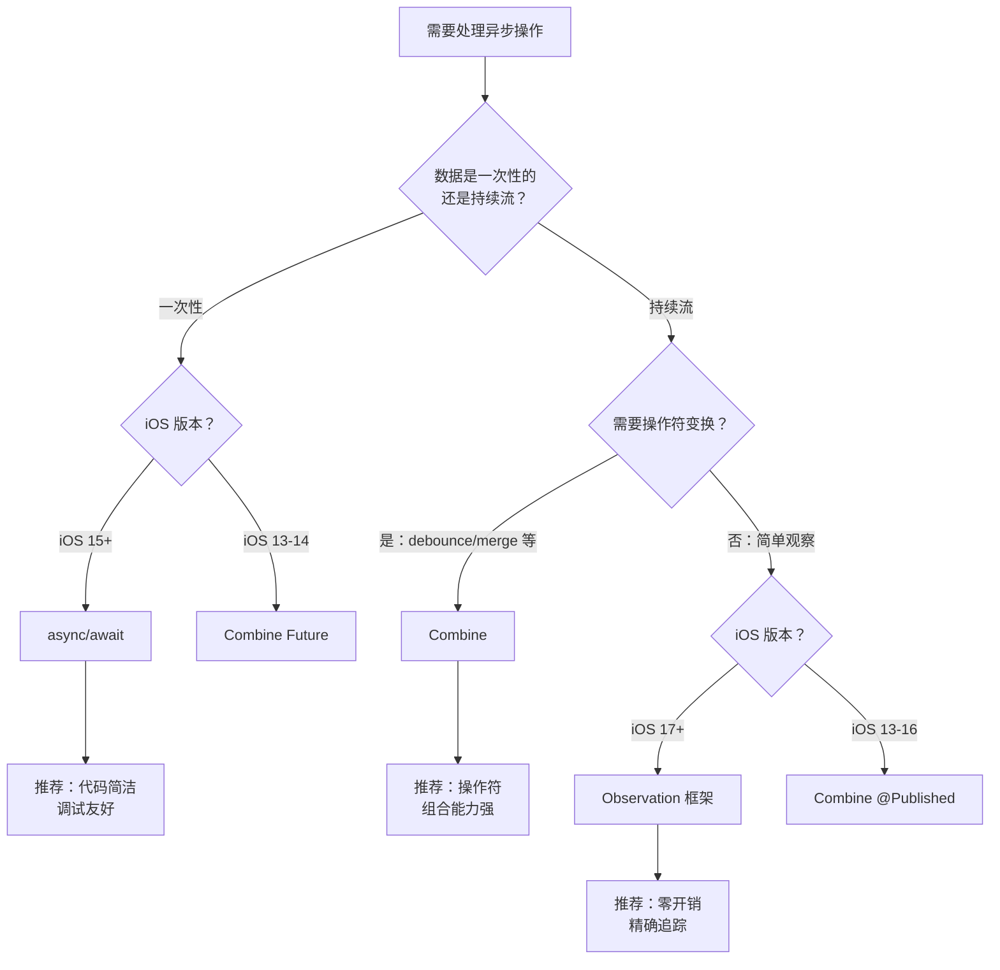

# Combine 定位与战略分析 — 详细解析

> **核心结论**：Combine 是 Apple 在 WWDC 2019 推出的声明式响应式编程框架，与 SwiftUI 同步发布，旨在统一 iOS 生态中碎片化的异步事件处理模型（Delegate、Callback、KVO、NotificationCenter）。Combine 通过 Publisher-Operator-Subscriber 管道模型，提供类型安全、可组合、支持背压的异步数据流处理能力。随着 Swift Concurrency（iOS 15+）和 Observation 框架（iOS 17+）的出现，Combine 的战略定位已从"异步编程主力框架"转变为"持续性事件流处理的专用工具"，在多源合并、操作符变换、实时搜索等场景仍具不可替代的价值。

---

## 核心结论 TL;DR

| 维度 | 核心结论 |
|------|---------|
| **定义** | Apple 官方声明式响应式编程框架，基于 Publisher-Operator-Subscriber 管道模型处理异步事件流 |
| **战略定位** | SwiftUI 数据流基础设施（iOS 13-16）；iOS 17+ 后转为持续性事件流的专用工具 |
| **核心价值** | 统一异步模型、类型安全管道、操作符组合能力、内建背压与取消机制 |
| **最佳场景** | 表单验证/实时搜索、网络请求链、多数据源合并、定时器与通知事件流 |
| **不适用场景** | 简单一次性异步（用 async/await）、iOS 17+ SwiftUI 状态管理（用 @Observable） |
| **与 async/await 关系** | 互补而非替代：Combine 擅长持续性流，async/await 擅长一次性异步与结构化并发 |
| **长期趋势** | 从全能异步框架退化为响应式事件流专用工具，但 Apple 仍持续维护 |

---

## 文章结构概览



---

# 一、Combine 的定义与核心作用

## 1.1 Combine 的官方定义

**结论先行**：Combine 是 Apple 提供的第一方声明式响应式编程框架，通过 Publisher-Operator-Subscriber 管道模型，将异步事件处理统一为可组合、可变换、类型安全的数据流。

Apple 在 WWDC 2019 Session "Introducing Combine" 中的定义：

> "A unified, declarative API for processing values over time."
> — 一个统一的、声明式的 API，用于处理随时间变化的值。

Combine 框架的三个核心特征：

| 特征 | 说明 |
|------|------|
| **声明式（Declarative）** | 描述"做什么"而非"怎么做"，数据流通过操作符链声明式组合 |
| **统一（Unified）** | 替代 Delegate、Callback、KVO、NotificationCenter 等多种异步模式 |
| **类型安全（Type-safe）** | 每个 Publisher 声明 Output 和 Failure 类型，编译器静态检查 |

```swift
// Combine 的核心协议定义
protocol Publisher {
    associatedtype Output   // 产出值的类型
    associatedtype Failure: Error  // 错误类型（Never 表示不会失败）
    func receive<S: Subscriber>(subscriber: S)
        where S.Input == Output, S.Failure == Failure
}

protocol Subscriber {
    associatedtype Input
    associatedtype Failure: Error
    func receive(subscription: Subscription)
    func receive(_ input: Input) -> Subscribers.Demand  // 背压：返回需求量
    func receive(completion: Subscribers.Completion<Failure>)
}
```

## 1.2 核心设计目标

**结论先行**：Combine 的设计目标不是"再造一个 RxSwift"，而是作为 Apple 平台的原生异步基础设施，为 SwiftUI 提供数据绑定、为 Foundation 提供统一的异步 API、为开发者提供标准化的异步编程模型。

| 设计目标 | 具体体现 |
|---------|---------|
| **统一异步模型** | Timer、URLSession、NotificationCenter 等均提供 Combine Publisher |
| **SwiftUI 数据绑定** | @Published + ObservableObject 是 SwiftUI 数据流的核心 |
| **替代第三方依赖** | 官方实现替代 RxSwift/ReactiveSwift 等第三方响应式框架 |
| **类型安全保障** | Output/Failure 泛型约束，编译期检查数据流类型 |
| **性能优化** | 基于 Swift 值类型和内联优化，比第三方框架更轻量 |

## 1.3 解决的核心问题

**结论先行**：Combine 统一解决了 iOS 开发中长期存在的五大异步编程痛点：回调地狱、数据流组合困难、多源协调复杂、错误传播分散、内存管理易出错。

### 1.3.1 回调地狱（Callback Hell）

```swift
// ❌ 传统回调嵌套
func loadUserProfile(userId: String) {
    fetchUser(userId) { user, error in
        guard let user = user else { return }
        fetchAvatar(user.avatarURL) { image, error in
            guard let image = image else { return }
            fetchFollowers(userId) { followers, error in
                guard let followers = followers else { return }
                // 三层嵌套，难以维护
                DispatchQueue.main.async {
                    self.updateUI(user: user, avatar: image, followers: followers)
                }
            }
        }
    }
}

// ✅ Combine 管道
func loadUserProfile(userId: String) -> AnyPublisher<UserProfile, Error> {
    let user = fetchUserPublisher(userId)
    let avatar = user.flatMap { fetchAvatarPublisher($0.avatarURL) }
    let followers = fetchFollowersPublisher(userId)
    
    return Publishers.Zip3(user, avatar, followers)
        .map { UserProfile(user: $0, avatar: $1, followers: $2) }
        .receive(on: DispatchQueue.main)
        .eraseToAnyPublisher()
}
```

### 1.3.2 异步数据流的组合与变换

```swift
// Combine 操作符链：搜索 + 去重 + 防抖 + 网络请求 + 错误恢复
$searchText
    .debounce(for: .milliseconds(300), scheduler: RunLoop.main)
    .removeDuplicates()
    .filter { !$0.isEmpty }
    .flatMap { query in
        searchAPI(query)
            .catch { _ in Just([]) }
    }
    .receive(on: DispatchQueue.main)
    .assign(to: &$results)
```

### 1.3.3 多数据源的协调与合并

```swift
// 三个独立数据源合并为一个视图模型
let profile = Publishers.CombineLatest3(
    userPublisher,          // 用户信息
    settingsPublisher,      // 设置项
    notificationsPublisher  // 通知列表
)
.map { user, settings, notifications in
    ProfileViewModel(user: user, settings: settings, notifications: notifications)
}
```

### 1.3.4 错误传播与统一处理

```swift
// 统一的错误类型传播与恢复
fetchData()
    .retry(3)                           // 自动重试 3 次
    .mapError { AppError.network($0) }  // 统一错误类型
    .catch { error -> AnyPublisher<Data, Never> in
        logError(error)
        return Just(cachedData)          // 降级到缓存
            .eraseToAnyPublisher()
    }
    .sink { data in updateUI(data) }
    .store(in: &cancellables)
```

### 1.3.5 内存管理与资源释放

```swift
// AnyCancellable 自动管理订阅生命周期
class ViewModel {
    private var cancellables = Set<AnyCancellable>()
    
    func bind() {
        publisher
            .sink { [weak self] value in self?.handle(value) }
            .store(in: &cancellables)
        // ViewModel 被释放时，cancellables 自动 cancel 所有订阅
    }
}
```

## 1.4 Combine 核心概念关系图



> **交叉引用**：Combine 的 Publisher/Subscriber 模型、操作符分类、SwiftUI 集成及 AnyCancellable 内存管理的实战用法，参见 → [网络框架与数据持久化_详细解析](../05_并发与网络框架/网络框架与数据持久化_详细解析.md)

---

# 二、Combine 出现的技术背景

## 2.1 响应式编程浪潮

**结论先行**：Combine 并非 Apple 的原创发明，而是响应式编程（Reactive Programming）在 Apple 平台的官方落地。在 Combine 之前，社区已广泛采用 RxSwift/ReactiveSwift 等第三方框架，Apple 推出 Combine 是对这一趋势的官方回应。

响应式编程的核心理念：**将数据视为随时间变化的流（Stream），通过声明式操作符对流进行变换、组合和消费。**

| 框架 | 平台 | 首次发布 | 遵循规范 |
|------|------|---------|---------|
| Rx.NET | .NET | 2011 | ReactiveX 原始实现 |
| RxJava | JVM/Android | 2013 | ReactiveX |
| RxJS | Web/Node | 2013 | ReactiveX |
| ReactiveCocoa | iOS/macOS | 2013 | 受 .NET Rx 启发 |
| ReactiveSwift | iOS/macOS | 2016 | ReactiveCocoa 重构 |
| RxSwift | iOS/macOS | 2015 | ReactiveX |
| **Combine** | **Apple 全平台** | **2019** | **参考 ReactiveX，非严格遵循** |
| Kotlin Flow | Android/KMP | 2019 | Kotlin Coroutines |

### 行业 Reactive Extensions 实现时间线



## 2.2 Apple 内部驱动

**结论先行**：Combine 的诞生不仅是对社区趋势的回应，更是 Apple 内部框架战略的需要——SwiftUI 需要声明式数据绑定、Foundation 需要统一异步 API、Swift 语言特性也已成熟到足以支撑响应式框架。

### 2.2.1 SwiftUI 需要声明式数据绑定机制

SwiftUI 的声明式 UI 需要一个数据变更自动驱动视图更新的机制。Combine 的 `@Published` + `ObservableObject` 正是为此设计：

```swift
// SwiftUI + Combine 数据绑定 (iOS 13-16 核心模式)
class CounterViewModel: ObservableObject {
    @Published var count = 0  // @Published 是 Combine 的属性包装器
    // $count 是 Published<Int>.Publisher 类型
}

struct CounterView: View {
    @StateObject var vm = CounterViewModel()
    var body: some View {
        Text("\(vm.count)")  // count 变更时自动刷新
        Button("增加") { vm.count += 1 }
    }
}
```

### 2.2.2 Foundation 需要统一的异步 API

Combine 之前，Foundation 框架的异步 API 模式不统一。Combine 为多种系统服务提供了统一的 Publisher 接口：

| 系统服务 | 传统 API | Combine Publisher |
|---------|---------|-------------------|
| 网络请求 | `dataTask(completionHandler:)` | `dataTaskPublisher(for:)` |
| 通知中心 | `addObserver(_:selector:name:)` | `publisher(for:)` |
| 定时器 | `Timer.scheduledTimer(withTimeInterval:)` | `Timer.publish(every:on:in:)` |
| KVO | `observe(_:options:changeHandler:)` | `publisher(for:\.keyPath)` |

### 2.2.3 Swift 语言特性成熟

Combine 重度依赖 Swift 语言的多项现代特性：

| Swift 特性 | 在 Combine 中的应用 |
|-----------|-------------------|
| **协议与关联类型** | Publisher/Subscriber 协议定义 |
| **泛型约束** | Output/Failure 类型安全传播 |
| **类型推断** | 操作符链的自动类型推导 |
| **属性包装器** | @Published 驱动 SwiftUI 数据流 |
| **Result 类型** | Combine Completion 复用 Swift Result 理念 |
| **值类型优化** | 大量操作符基于 struct 实现，栈分配优化 |

## 2.3 WWDC 2019 发布背景

**结论先行**：Combine 在 WWDC 2019 与 SwiftUI 同步发布，这不是巧合而是精心设计的战略——SwiftUI 是声明式 UI 框架，Combine 是其声明式数据流的底层基础设施。两者的同步发布标志着 Apple 从命令式编程全面转向声明式编程范式。

WWDC 2019 发布的关键框架：

| 框架 | 定位 | 战略意义 |
|------|------|---------|
| **SwiftUI** | 声明式 UI | 替代 UIKit 的长期方向 |
| **Combine** | 声明式数据流 | SwiftUI 的数据流基础设施 |
| **RealityKit** | AR 渲染 | 空间计算的早期布局 |
| **Catalyst** | Mac 移植 | UIKit app 快速上 Mac |

> **交叉引用**：Combine 在 WWDC 2019 发布背景中的战略意义，参见 → [Apple框架生态全景与战略定位_详细解析](../01_框架生态与演进/Apple框架生态全景与战略定位_详细解析.md)

---

# 三、Apple 框架生态中的战略定位

## 3.1 Combine 在 Apple 四层框架架构中的位置

**结论先行**：Combine 位于 Core Services 层，是连接上层 UI 框架（SwiftUI/UIKit）和下层系统服务（Foundation/URLSession/NotificationCenter）的数据流中间件。它既是 SwiftUI 的数据驱动引擎，也是传统框架的响应式封装层。



## 3.2 与其他框架的集成关系

**结论先行**：Combine 作为胶水层，为 Apple 多个核心框架提供了统一的响应式接口。理解每种集成模式是实际项目中高效使用 Combine 的基础。

### 3.2.1 Combine + SwiftUI：@Published → @ObservedObject 数据绑定

```swift
// iOS 13-16 标准 MVVM 数据绑定
class LoginViewModel: ObservableObject {
    @Published var email = ""
    @Published var password = ""
    @Published var isLoginEnabled = false
    
    private var cancellables = Set<AnyCancellable>()
    
    init() {
        // 两个 @Published 合并 → 自动计算按钮状态
        Publishers.CombineLatest($email, $password)
            .map { email, password in
                email.contains("@") && password.count >= 8
            }
            .assign(to: &$isLoginEnabled)
    }
}

struct LoginView: View {
    @StateObject var vm = LoginViewModel()
    var body: some View {
        VStack {
            TextField("Email", text: $vm.email)
            SecureField("Password", text: $vm.password)
            Button("登录") { /* ... */ }
                .disabled(!vm.isLoginEnabled)
        }
    }
}
```

### 3.2.2 Combine + URLSession：dataTaskPublisher 统一网络响应

```swift
// URLSession 的 Combine 接口
func fetchPosts() -> AnyPublisher<[Post], Error> {
    let url = URL(string: "https://api.example.com/posts")!
    return URLSession.shared.dataTaskPublisher(for: url)
        .map(\.data)
        .decode(type: [Post].self, decoder: JSONDecoder())
        .receive(on: DispatchQueue.main)
        .eraseToAnyPublisher()
}
```

### 3.2.3 Combine + NotificationCenter：publisher(for:) 通知转换

```swift
// 键盘高度变化的 Combine 流
NotificationCenter.default
    .publisher(for: UIResponder.keyboardWillShowNotification)
    .compactMap { notification -> CGFloat? in
        (notification.userInfo?[UIResponder.keyboardFrameEndUserInfoKey] as? CGRect)?.height
    }
    .sink { [weak self] height in
        self?.adjustForKeyboard(height: height)
    }
    .store(in: &cancellables)
```

### 3.2.4 Combine + Core Data：NSManagedObjectContext 变更通知

```swift
// 监听 Core Data 变更
NotificationCenter.default
    .publisher(for: .NSManagedObjectContextObjectsDidChange, object: context)
    .compactMap { notification -> Set<NSManagedObject>? in
        notification.userInfo?[NSUpdatedObjectsKey] as? Set<NSManagedObject>
    }
    .sink { updatedObjects in
        // 响应 Core Data 数据变更
        self.refreshUI(for: updatedObjects)
    }
    .store(in: &cancellables)
```

### 3.2.5 Combine + Timer：TimerPublisher 定时事件

```swift
// Combine 方式的定时器
Timer.publish(every: 1.0, on: .main, in: .common)
    .autoconnect()
    .scan(0) { count, _ in count + 1 }
    .prefix(60)  // 60 秒后自动完成
    .sink { secondsElapsed in
        self.timerLabel.text = "\(60 - secondsElapsed)s"
    }
    .store(in: &cancellables)
```

## 3.3 Apple 战略定位分析

**结论先行**：Combine 的战略定位经历了从"核心基础设施"到"专用工具"的转变。2019 年作为 SwiftUI 唯一数据流方案发布，2021 年 async/await 分流了一次性异步场景，2023 年 Observation 框架取代了 SwiftUI 数据绑定场景。Combine 最终定位为：**持续性事件流处理的专用框架**。

### 3.3.1 Combine 是 SwiftUI 数据流的基础设施（iOS 13-16）

在 iOS 13-16 期间，Combine 是 SwiftUI 数据流的**唯一**官方方案：

- `@Published` 属性包装器底层是 Combine Publisher
- `ObservableObject` 协议的 `objectWillChange` 是 Combine Publisher
- `@StateObject`/`@ObservedObject` 依赖 Combine 驱动视图更新

### 3.3.2 Swift Concurrency 出现后的定位变化（iOS 15+）

async/await（iOS 15, 2021）的出现分流了 Combine 的部分使用场景：

| 场景 | iOS 13-14 推荐 | iOS 15+ 推荐 |
|------|---------------|-------------|
| 一次性网络请求 | `dataTaskPublisher` | `try await data(from:)` |
| 顺序异步操作 | `flatMap` 链 | `async let` / `TaskGroup` |
| 错误处理 | `.catch`/`.retry` | `do-catch` |
| 持续数据流 | Combine | **仍然 Combine** |
| 多源合并 | Combine | **仍然 Combine** |

### 3.3.3 Observation 框架对 Combine 在 SwiftUI 中角色的影响（iOS 17+）

Observation 框架（iOS 17, Swift 5.9）通过 `@Observable` 宏取代了 Combine 在 SwiftUI 数据绑定中的角色：

```swift
// iOS 13-16：Combine 驱动
class OldViewModel: ObservableObject {
    @Published var name = ""      // Combine Publisher
    @Published var score = 0      // Combine Publisher
}

// iOS 17+：Observation 驱动（无需 Combine）
@Observable
class NewViewModel {
    var name = ""    // 编译器自动追踪
    var score = 0    // 编译器自动追踪
}
```

Observation 取代 Combine 的关键优势：

| 维度 | Combine (@Published) | Observation (@Observable) |
|------|---------------------|--------------------------|
| **粒度** | 整个 ObservableObject 变更都触发刷新 | 精确到具体属性的读取追踪 |
| **性能** | 运行时订阅管理，有开销 | 编译期宏生成，零抽象成本 |
| **语法** | 需 @Published/@StateObject 等 | 直接使用属性，自然语法 |
| **学习曲线** | 需理解 Publisher/Subscriber | 几乎无额外概念 |

### 3.3.4 Combine 的长期定位：从"主力"到"特定场景工具"



### Combine 在 Apple 异步技术栈中的演进定位（2019-2025）



> **交叉引用**：Combine 与 Observation 的详细对比及代码示例，参见 → [Apple框架生态全景与战略定位_详细解析](../01_框架生态与演进/Apple框架生态全景与战略定位_详细解析.md)；Swift Concurrency 的深度解析，参见 → [Swift_Concurrency深度解析_详细解析](../05_并发与网络框架/Swift_Concurrency深度解析_详细解析.md)

---

# 四、Combine vs 传统异步方式的核心优势

## 4.1 全面对比表

**结论先行**：Combine 在组合能力、错误处理、取消机制、类型安全四个维度显著优于所有传统异步方式。传统方式各有适用场景，但在复杂异步数据流处理中，Combine 是唯一提供完整解决方案的框架。

| 维度 | Combine | Delegate | Callback/Closure | KVO | NotificationCenter | Target-Action |
|------|---------|----------|-------------------|-----|-------------------|---------------|
| **代码可读性** | ⭐⭐⭐⭐⭐ 声明式管道 | ⭐⭐⭐ 结构清晰但分散 | ⭐⭐ 嵌套时急剧下降 | ⭐⭐ 语法繁琐 | ⭐⭐⭐ 简单但松散 | ⭐⭐⭐⭐ 简单直观 |
| **组合能力** | ⭐⭐⭐⭐⭐ 丰富操作符 | ⭐ 无组合能力 | ⭐⭐ 手动嵌套 | ⭐ 单属性观察 | ⭐ 无组合能力 | ⭐ 无组合能力 |
| **错误处理** | ⭐⭐⭐⭐⭐ 类型化错误传播 | ⭐⭐⭐ 协议方法分开 | ⭐⭐ Result/双回调 | ⭐ 无错误机制 | ⭐ 无错误机制 | ⭐ 无错误机制 |
| **取消机制** | ⭐⭐⭐⭐⭐ AnyCancellable | ⭐⭐ 手动置 nil | ⭐⭐ 手动管理 | ⭐⭐⭐ invalidate | ⭐⭐ removeObserver | ⭐⭐ removeTarget |
| **线程管理** | ⭐⭐⭐⭐⭐ 声明式调度 | ⭐⭐ 调用者线程 | ⭐⭐ 手动 dispatch | ⭐⭐ 发送者线程 | ⭐⭐ 发送者线程 | ⭐⭐⭐⭐ 主线程 |
| **类型安全** | ⭐⭐⭐⭐⭐ 泛型约束 | ⭐⭐⭐⭐ 协议约束 | ⭐⭐⭐ 闭包签名 | ⭐ Any 类型 | ⭐ userInfo 字典 | ⭐⭐⭐ 弱类型 |
| **内存管理** | ⭐⭐⭐⭐ 自动取消 | ⭐⭐ weak delegate | ⭐⭐ 循环引用风险 | ⭐⭐ 手动移除 | ⭐⭐ 手动移除 | ⭐⭐⭐ 弱引用 |
| **调试难度** | ⭐⭐⭐ 栈较深 | ⭐⭐⭐⭐ 断点清晰 | ⭐⭐⭐ 闭包断点 | ⭐⭐ 难定位 | ⭐⭐ 难定位 | ⭐⭐⭐⭐ 断点清晰 |

## 4.2 各传统方式的痛点分析

### 4.2.1 Delegate：协议膨胀、一对一限制

```swift
// 痛点1：协议膨胀 — 每种回调都需要协议方法
protocol NetworkServiceDelegate: AnyObject {
    func didStartLoading()
    func didFinishLoading(data: Data)
    func didFailWithError(_ error: Error)
    func didUpdateProgress(_ progress: Double)
    func didReceiveResponse(_ response: URLResponse)
    // 协议方法不断膨胀...
}

// 痛点2：一对一限制 — 只能有一个 delegate
class NetworkService {
    weak var delegate: NetworkServiceDelegate?
    // 如果多个对象需要监听？→ 需要引入多播代理模式
}
```

### 4.2.2 Callback/Closure：回调嵌套、错误处理分散

```swift
// 痛点：回调嵌套（Callback Hell）+ 错误处理分散
func processOrder(orderId: String) {
    validateOrder(orderId) { result in
        switch result {
        case .success(let order):
            chargePayment(order) { result in  // 第二层
                switch result {
                case .success(let payment):
                    shipOrder(payment) { result in  // 第三层
                        switch result {
                        case .success(let tracking):
                            notifyUser(tracking) { result in  // 第四层
                                // 四层嵌套，每层都要处理错误
                            }
                        case .failure(let error):
                            handleShipError(error)
                        }
                    }
                case .failure(let error):
                    handlePaymentError(error)
                }
            }
        case .failure(let error):
            handleValidationError(error)
        }
    }
}
```

### 4.2.3 KVO：类型不安全、NSObject 限制

```swift
// 痛点1：必须继承 NSObject（纯 Swift 类型不可用）
// 痛点2：@objc dynamic 标记繁琐
class Player: NSObject {
    @objc dynamic var currentTime: Double = 0
    @objc dynamic var isPlaying: Bool = false
}

// 痛点3：旧式 KVO API 类型不安全
override func observeValue(forKeyPath keyPath: String?,
                          of object: Any?,
                          change: [NSKeyValueChangeKey: Any]?,
                          context: UnsafeMutableRawPointer?) {
    // keyPath 是字符串，无编译检查
    // change 是 [String: Any]，需要手动类型转换
    if keyPath == "currentTime" {
        let newValue = change?[.newKey] as? Double  // 强制类型转换
    }
}
// 痛点4：必须手动移除观察者，否则崩溃（iOS 10 以前）
```

### 4.2.4 NotificationCenter：类型不安全、松耦合过度

```swift
// 痛点1：userInfo 是 [AnyHashable: Any]? — 完全无类型安全
NotificationCenter.default.post(
    name: .userDidLogin,
    object: nil,
    userInfo: ["userId": "123", "timestamp": Date()]  // 无类型约束
)

// 痛点2：接收方需要手动解析，易出错
NotificationCenter.default.addObserver(forName: .userDidLogin, object: nil, queue: nil) { notification in
    let userId = notification.userInfo?["userId"] as? String  // 可能 key 拼错
    let timestamp = notification.userInfo?["timestamp"] as? Date  // 可能类型错误
}

// 痛点3：松耦合过度 — 难以追踪通知的发送者和接收者
// 痛点4：无法组合多个通知进行联合处理
```

### 4.2.5 Target-Action：功能有限、无组合能力

```swift
// 痛点1：仅限 UIControl 事件，无法处理任意异步
button.addTarget(self, action: #selector(buttonTapped), for: .touchUpInside)

// 痛点2：无组合能力 — 无法声明"按钮点击 + 文本变化 → 自动计算"
// 痛点3：selector 基于字符串匹配，重构不友好（虽然 #selector 改善了这点）
// 痛点4：无法传递额外上下文，方法签名受限
```

## 4.3 Combine 的核心优势详解

### 4.3.1 声明式管道 → 数据流可读性大幅提升

```swift
// ❌ 命令式：逻辑分散在多个回调中
var timer: Timer?
var debounceWorkItem: DispatchWorkItem?

func textFieldDidChange(_ textField: UITextField) {
    debounceWorkItem?.cancel()
    let workItem = DispatchWorkItem { [weak self] in
        guard let query = textField.text, !query.isEmpty else { return }
        if query != self?.lastQuery {
            self?.lastQuery = query
            self?.performSearch(query)
        }
    }
    debounceWorkItem = workItem
    DispatchQueue.main.asyncAfter(deadline: .now() + 0.3, execute: workItem)
}

// ✅ 声明式：一条管道描述完整数据流
$searchText
    .debounce(for: .milliseconds(300), scheduler: RunLoop.main)
    .removeDuplicates()
    .filter { !$0.isEmpty }
    .flatMap { self.search($0).catch { _ in Just([]) } }
    .receive(on: DispatchQueue.main)
    .assign(to: &$results)
```

### 4.3.2 操作符组合 → 复杂异步逻辑的优雅表达

```swift
// 复杂场景：并发请求 + 超时 + 重试 + 缓存降级
func loadDashboard() -> AnyPublisher<Dashboard, Never> {
    let userInfo = fetchUser().retry(2)
    let notifications = fetchNotifications().retry(1)
    let settings = fetchSettings()
    
    return Publishers.Zip3(userInfo, notifications, settings)
        .timeout(.seconds(10), scheduler: DispatchQueue.main)
        .map { Dashboard(user: $0, notifications: $1, settings: $2) }
        .catch { _ in Just(Dashboard.cached()) }  // 超时/失败降级缓存
        .eraseToAnyPublisher()
}
```

### 4.3.3 类型安全 → 编译时检查 Output/Failure 类型

```swift
// 编译器强制类型匹配
let publisher: AnyPublisher<User, NetworkError> = fetchUser()

// ✅ 编译通过：Output 和 Failure 类型匹配
publisher
    .map { $0.name }  // AnyPublisher<String, NetworkError>
    .mapError { AppError.network($0) }  // AnyPublisher<String, AppError>
    .sink(receiveCompletion: { completion in
        // completion 是 Subscribers.Completion<AppError>，类型安全
    }, receiveValue: { name in
        // name 是 String，类型安全
    })

// ❌ 编译错误：类型不匹配
// publisher.assign(to: \.score, on: viewModel) // String 无法赋值给 Int
```

### 4.3.4 内建背压 → 防止数据溢出

```swift
// 背压机制：Subscriber 告诉 Publisher 自己能处理多少数据
class SlowSubscriber: Subscriber {
    typealias Input = Data
    typealias Failure = Never
    
    func receive(subscription: Subscription) {
        subscription.request(.max(1))  // 一次只处理 1 个
    }
    
    func receive(_ input: Data) -> Subscribers.Demand {
        processData(input)  // 耗时处理
        return .max(1)      // 处理完再要下一个（背压控制）
    }
    
    func receive(completion: Subscribers.Completion<Never>) {}
}
```

### 4.3.5 统一取消机制 → AnyCancellable 自动资源管理

```swift
// 所有订阅统一通过 AnyCancellable 管理
class DashboardViewModel: ObservableObject {
    private var cancellables = Set<AnyCancellable>()
    
    func startMonitoring() {
        // 网络轮询
        Timer.publish(every: 30, on: .main, in: .common)
            .autoconnect()
            .flatMap { _ in self.fetchUpdates() }
            .sink { [weak self] updates in self?.apply(updates) }
            .store(in: &cancellables)
        
        // 通知监听
        NotificationCenter.default.publisher(for: .significantTimeChange)
            .sink { [weak self] _ in self?.refreshTimestamps() }
            .store(in: &cancellables)
    }
    // deinit 时 cancellables 自动 cancel 所有订阅 — 无需手动清理
}
```

### 4.3.6 线程调度 → receive(on:)/subscribe(on:) 声明式调度

```swift
// 声明式线程调度 vs 命令式 dispatch
fetchHeavyData()
    .subscribe(on: DispatchQueue.global(qos: .userInitiated))  // 在后台线程订阅
    .map { processData($0) }  // 仍在后台线程
    .receive(on: DispatchQueue.main)  // 切回主线程
    .sink { [weak self] result in
        self?.updateUI(result)  // 保证在主线程
    }
    .store(in: &cancellables)
```

---

# 五、Combine 的适用场景与局限性

## 5.1 最佳适用场景

**结论先行**：Combine 最适合需要持续性数据流处理、多源数据合并、操作符变换的场景。在这些场景中，Combine 的声明式管道和丰富操作符提供了无可替代的表达能力。

| 场景 | 项目类型 | 推荐指数 | 说明 |
|------|---------|---------|------|
| **表单验证与实时搜索** | 所有带输入的 App | ⭐⭐⭐⭐⭐ | debounce + removeDuplicates + flatMap 经典组合 |
| **网络请求链组合** | 需多接口联调的 App | ⭐⭐⭐⭐ | Zip/CombineLatest 并发请求，flatMap 串行请求 |
| **多数据源合并** | Dashboard/监控类 | ⭐⭐⭐⭐⭐ | CombineLatest/Merge 合并多个数据源 |
| **SwiftUI 数据绑定** | iOS 13-16 SwiftUI App | ⭐⭐⭐⭐ | @Published + ObservableObject（iOS 17+ 转 @Observable） |
| **事件流处理** | 定时器/通知/传感器 | ⭐⭐⭐⭐⭐ | Timer.publish + NotificationCenter.publisher |
| **实时数据推送** | 聊天/股票/协作编辑 | ⭐⭐⭐⭐ | WebSocket 数据流 + 操作符变换 |
| **状态机与业务规则** | 复杂业务逻辑 | ⭐⭐⭐ | scan 操作符实现状态累积 |

## 5.2 不适用/需谨慎场景

**结论先行**：Combine 并非万能——简单一次性异步应使用 async/await，iOS 17+ 的 SwiftUI 状态管理应使用 @Observable，高频事件处理需注意性能开销。

| 场景 | 不推荐原因 | 替代方案 |
|------|----------|---------|
| **简单一次性异步操作** | Combine 管道过于重量级 | `async/await`（iOS 15+） |
| **iOS 17+ SwiftUI 状态管理** | Observation 更轻量、更精确 | `@Observable` 宏 |
| **高频事件处理（60fps+）** | Combine 有运行时开销 | 直接使用 GCD/CADisplayLink |
| **纯 Swift Package（跨平台）** | Combine 仅限 Apple 平台 | AsyncSequence 或 swift-async-algorithms |
| **简单的属性观察** | Combine 引入不必要复杂度 | `didSet`/`willSet` |

## 5.3 与 Swift Concurrency 的关系

**结论先行**：Combine 与 Swift Concurrency（async/await）是互补关系而非替代关系。Combine 擅长持续性数据流和操作符变换，async/await 擅长一次性异步和结构化并发。两者可通过 `values` 属性互操作。

| 维度 | Combine | async/await |
|------|---------|-------------|
| **数据模式** | 持续性流（0..N 个值） | 一次性值（1 个值） |
| **错误处理** | 类型化 Failure + catch 操作符 | throws + do-catch |
| **取消机制** | AnyCancellable | Task.cancel() / 结构化取消 |
| **线程管理** | receive(on:)/subscribe(on:) | Actor 隔离 / MainActor |
| **组合能力** | 丰富操作符（50+） | async let / TaskGroup |
| **学习曲线** | 陡峭 | 平缓 |
| **调试体验** | 栈深、难追踪 | 清晰的调用栈 |
| **互操作** | `.values` 转 AsyncSequence | `AsyncPublisher` 桥接 |
| **适用 iOS 版本** | iOS 13+ | iOS 15+ |

### 互操作示例

```swift
// Combine → async/await：通过 .values 属性
let publisher = NotificationCenter.default.publisher(for: .userDidLogin)

// 在 async 上下文中消费 Combine 流
Task {
    for await notification in publisher.values {
        let userId = notification.userInfo?["userId"] as? String
        await processLogin(userId)
    }
}

// async/await → Combine：包装为 Future
func fetchUserCombine(id: String) -> Future<User, Error> {
    Future { promise in
        Task {
            do {
                let user = try await fetchUser(id: id)
                promise(.success(user))
            } catch {
                promise(.failure(error))
            }
        }
    }
}
```

### 选型决策树



---

# 六、Combine 的未来展望

## 6.1 Apple 对 Combine 的维护态度

**结论先行**：Apple 对 Combine 采取"维护但不大力发展"的策略。自 WWDC 2019 发布以来，Combine 未获得重大新特性更新，但也未被标记为 deprecated。Apple 的投入重心已转向 Swift Concurrency 和 Observation 框架。

| WWDC 年份 | Combine 相关更新 | 重点投入方向 |
|-----------|----------------|-------------|
| **2019** | 框架发布（全套 API） | Combine + SwiftUI |
| **2020** | 小幅 API 完善 | SwiftUI 2.0 |
| **2021** | 无重大更新 | async/await（Swift 5.5） |
| **2022** | 无重大更新 | Swift Concurrency 完善 |
| **2023** | 无重大更新 | Observation 框架（Swift 5.9） |
| **2024** | 无重大更新 | Swift 6 Strict Concurrency |
| **2025** | 维护性更新 | Swift 6 全面推广 |

关键信号：Apple 的示例代码和文档中，新增的 SwiftUI 示例越来越多使用 `@Observable` 而非 `ObservableObject + @Published`。

## 6.2 Combine + async/await 互操作

**结论先行**：Apple 通过 `values` 属性为 Combine Publisher 提供了 AsyncSequence 桥接，使得 Combine 流可以在 async/await 上下文中被消费。这是两个异步世界的官方互操作通道。

```swift
// Publisher 的 values 属性（iOS 15+）
// 将任何 Combine Publisher 转为 AsyncSequence
let timerValues = Timer.publish(every: 1.0, on: .main, in: .common)
    .autoconnect()
    .values  // AsyncPublisher<Timer.TimerPublisher>

Task {
    for await timestamp in timerValues {
        print("Tick: \(timestamp)")
    }
}

// 实际应用：在 async 函数中消费搜索结果流
func monitorSearch() async {
    let searchResults = $searchText
        .debounce(for: .milliseconds(300), scheduler: RunLoop.main)
        .removeDuplicates()
        .values
    
    for await query in searchResults {
        let results = try? await searchAPI(query)
        await MainActor.run { self.results = results ?? [] }
    }
}
```

## 6.3 在 Swift 6 Strict Concurrency 下的适配挑战

**结论先行**：Swift 6 的 Strict Concurrency checking 对 Combine 代码提出了新的挑战。`@Sendable` 闭包约束、Actor 隔离检查等特性可能导致现有 Combine 代码出现编译警告甚至错误。

主要挑战：

| 挑战 | 说明 | 应对策略 |
|------|------|---------|
| **@Sendable 闭包** | sink/map 闭包需满足 Sendable 约束 | 确保闭包捕获的值是 Sendable 的 |
| **Actor 隔离** | receive(on: DispatchQueue.main) 与 @MainActor 冲突 | 使用 `receive(on: RunLoop.main)` 或显式 Actor |
| **可变状态** | 闭包中捕获可变状态触发警告 | 使用 Actor 封装或 `nonisolated` 标注 |
| **Subscription 线程安全** | 跨 Actor 边界的订阅管理 | 确保 AnyCancellable 存储在正确的隔离域 |

```swift
// Swift 6 适配示例
@MainActor
class ViewModel: ObservableObject {
    @Published var items: [Item] = []
    private var cancellables = Set<AnyCancellable>()
    
    func startMonitoring() {
        // Swift 6 需要显式标注跨隔离域
        NotificationCenter.default.publisher(for: .itemsDidChange)
            .receive(on: RunLoop.main)
            .sink { [weak self] _ in
                // 已在 MainActor 上，安全访问 self
                self?.refreshItems()
            }
            .store(in: &cancellables)
    }
}
```

## 6.4 长期定位预测

**结论先行**：Combine 的长期定位将稳定为"响应式事件流的专用工具"。它不会被 deprecated，但也不会成为 Apple 异步编程的主推方案。在多源合并、操作符变换、持续性事件流等场景，Combine 仍将是最佳选择。

| 时间范围 | 预测定位 | 依据 |
|---------|---------|------|
| **2025-2027** | 与 async/await 共存，专注事件流 | Apple 未 deprecate，但无新投入 |
| **2027-2030** | 稳定的事件流处理工具 | RxSwift 社区萎缩，Combine 成为唯一选择 |
| **长期** | 类似 KVO 的长期维护状态 | 有明确适用场景，不会完全被替代 |

Combine 不会被替代的核心原因：

1. **AsyncSequence 不等于 Combine**：AsyncSequence 缺乏 Combine 丰富的操作符（combineLatest、debounce、throttle 等）
2. **swift-async-algorithms** 尚未完全覆盖 Combine 功能
3. **存量代码**：大量 iOS 13-16 项目依赖 Combine，Apple 不会轻易 deprecate
4. **Foundation 集成**：Timer.publish、NotificationCenter.publisher 等 API 仍在广泛使用

---

## 总结

Combine 是 Apple 在声明式编程时代的重要基础设施。虽然其战略地位随着 Swift Concurrency 和 Observation 框架的出现而收缩，但在持续性事件流处理、多源数据合并、操作符变换等场景中，Combine 仍然是 Apple 生态中最强大的工具。

**选型核心原则**：

- **一次性异步** → async/await
- **SwiftUI 状态管理（iOS 17+）** → @Observable
- **持续性事件流 / 多源合并 / 操作符变换** → **Combine**
- **iOS 13-16 SwiftUI 数据绑定** → Combine @Published

> **延伸阅读**：
> - Combine 的 Publisher/Subscriber 实战用法 → [网络框架与数据持久化_详细解析](../05_并发与网络框架/网络框架与数据持久化_详细解析.md)
> - Combine 在框架生态中的全景定位 → [Apple框架生态全景与战略定位_详细解析](../01_框架生态与演进/Apple框架生态全景与战略定位_详细解析.md)
> - Swift Concurrency 深度解析 → [Swift_Concurrency深度解析_详细解析](../05_并发与网络框架/Swift_Concurrency深度解析_详细解析.md)
