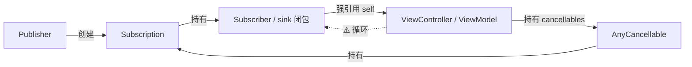
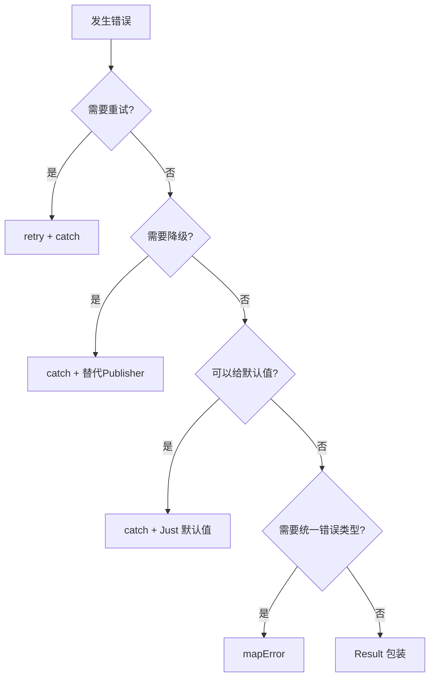

# Combine 实践指南与性能优化深度解析

> **文档版本**: iOS 15+ / Swift 5.7+ / Xcode 14+  
> **核心定位**: Combine 最佳实践、反模式规避、错误处理策略与性能优化  
> **前置阅读**: [Combine运行机制与原理](Combine运行机制与原理_详细解析.md) · [Combine基础使用与典型场景](Combine基础使用与典型场景_详细解析.md) · [渲染性能与能耗优化](../06_性能优化框架/渲染性能与能耗优化_详细解析.md)

---

## 一、核心结论 TL;DR

### 最佳实践要点

| # | 要点 | 核心建议 |
|---|------|---------|
| 1 | **AnyCancellable 存储** | 所有订阅必须存入 `Set<AnyCancellable>`，否则订阅创建后立即被取消释放 |
| 2 | **闭包弱引用** | `sink` / `handleEvents` 闭包中一律使用 `[weak self]`，`assign(to:)` (iOS 14+) 替代 `assign(to:on:)` |
| 3 | **线程调度** | UI 更新前必须 `receive(on: DispatchQueue.main)`；数据处理使用 `subscribe(on:)` 移至后台 |
| 4 | **错误处理** | 每条 Publisher 链必须有明确的错误处理策略，禁止吞没错误 |
| 5 | **性能意识** | 操作符链不宜超过 8 层；`eraseToAnyPublisher()` 仅在 API 边界使用 |

### Top 5 常见陷阱

| # | 陷阱 | 后果 | 修复成本 |
|---|------|------|---------|
| 1 | 忘记存储 `AnyCancellable` | 订阅立即失效，无任何数据回调 | 低 |
| 2 | `sink` 中强引用 `self` | 内存泄漏，ViewController 无法释放 | 中 |
| 3 | `flatMap` 未限制并发数 | 无限并发请求，可能耗尽系统资源 | 中 |
| 4 | `assign(to:on:)` 循环引用 | iOS 13/14 上 self 永远不释放 | 高（隐蔽） |
| 5 | 主线程外更新 UI | 紫色崩溃警告或界面不刷新 | 低 |

### 性能优化关键点

| 优化方向 | 措施 | 预期收益 |
|---------|------|---------|
| 减少堆分配 | 合并连续 `map`、减少操作符层数 | 内存降低 20-40% |
| 避免过度类型擦除 | 仅在 API 边界使用 `eraseToAnyPublisher()` | 减少间接调用开销 |
| 并发控制 | `flatMap(maxPublishers: .max(3))` | 防止资源耗尽 |
| 线程调度 | 合并多次 `receive(on:)` 为单次 | 减少上下文切换 30-50% |
| 批量处理 | `collect(.byTime)` / `collect(.byCount)` | 降低事件处理频率 |

---

## 二、内存管理最佳实践

> **核心结论：Combine 的内存管理核心在于理解 Publisher → Subscription → Subscriber 的引用链。绝大多数内存泄漏源于闭包对 self 的强引用和 AnyCancellable 的错误生命周期管理。**

### 2.1 AnyCancellable 的正确使用

#### Set\<AnyCancellable\> 模式

**这是 Combine 中管理订阅生命周期的标准模式。** 当 `Set<AnyCancellable>` 所属对象被释放时，集合中所有 `AnyCancellable` 自动调用 `cancel()`，终止订阅。

```swift
class ProfileViewModel: ObservableObject {
    @Published var username: String = ""
    @Published var isLoading: Bool = false
    
    // ✅ 标准模式：所有订阅统一存入 cancellables
    private var cancellables = Set<AnyCancellable>()
    
    func fetchProfile(userId: String) {
        isLoading = true
        
        APIService.shared.fetchProfile(userId: userId)
            .receive(on: DispatchQueue.main)
            .sink(
                receiveCompletion: { [weak self] completion in
                    self?.isLoading = false
                    if case .failure(let error) = completion {
                        print("Fetch failed: \(error)")
                    }
                },
                receiveValue: { [weak self] profile in
                    self?.username = profile.name
                }
            )
            .store(in: &cancellables)  // ← 关键：存储订阅
    }
}
```

#### 生命周期管理

**ViewController 中的 cancellables（deinit 自动取消）：**

```swift
class ProfileViewController: UIViewController {
    private var cancellables = Set<AnyCancellable>()
    private let viewModel = ProfileViewModel()
    
    override func viewDidLoad() {
        super.viewDidLoad()
        
        viewModel.$username
            .receive(on: DispatchQueue.main)
            .sink { [weak self] name in
                self?.nameLabel.text = name
            }
            .store(in: &cancellables)
    }
    
    // ✅ cancellables 随 ViewController 释放自动取消所有订阅
    // 无需手动调用 cancel()
    deinit {
        print("ProfileViewController released — all subscriptions cancelled")
    }
}
```

**SwiftUI View 中的 onDisappear 取消：**

```swift
struct ProfileView: View {
    @StateObject private var viewModel = ProfileViewModel()
    
    var body: some View {
        VStack {
            Text(viewModel.username)
        }
        .onAppear {
            viewModel.fetchProfile(userId: "123")
        }
        // ✅ @StateObject 生命周期与 View 一致
        // 当 View 从视图树移除时，ViewModel.deinit 自动清理订阅
    }
}
```

**单例中的订阅管理：**

```swift
class AppStateManager {
    static let shared = AppStateManager()
    private var cancellables = Set<AnyCancellable>()
    
    private init() {
        // ⚠️ 单例的订阅永远不会被自动取消
        // 必须显式管理或确认这是期望行为
        NotificationCenter.default.publisher(for: UIApplication.didBecomeActiveNotification)
            .sink { [weak self] _ in
                self?.refreshState()
            }
            .store(in: &cancellables)
    }
    
    // ✅ 提供手动清理能力（用于测试或特殊场景）
    func tearDown() {
        cancellables.removeAll()
    }
}
```

#### 内存泄漏检测

**Instruments Leaks/Allocations 使用方法：**

1. **Leaks 模板**：Product → Profile → Leaks → 运行 → 查看泄漏对象类型列表
2. **Allocations 模板**：筛选 `AnyCancellable`、`Sink`、`Subscription` 关键字
3. **Generation 分析**：标记进入页面前后的内存快照，对比增量对象是否含 Combine 相关类

**弱引用 [weak self] 的使用场景：**

```swift
// ✅ 必须使用 [weak self] 的场景：
// 1. sink 闭包引用了 self
publisher.sink { [weak self] value in
    self?.handleValue(value)
}

// 2. handleEvents 闭包引用了 self
publisher.handleEvents(receiveOutput: { [weak self] value in
    self?.log(value)
})

// ✅ 不需要 [weak self] 的场景：
// 1. map/filter 等纯变换操作符（无副作用，不持有 self）
publisher.map { $0.name }  // 闭包不引用 self，无需 weak self

// 2. 使用 assign(to:) (iOS 14+) 替代 assign(to:on:)
publisher.assign(to: &$username)  // 不创建强引用
```

### 2.2 引用循环陷阱

#### 引用关系图



> 当 `sink` 闭包强引用 `self`，而 `self` 通过 `cancellables` 持有 `AnyCancellable`（间接持有 Subscription → sink 闭包），就形成了循环引用。

#### 场景 1：sink 闭包中的 self 强引用

```swift
// ❌ 错误：强引用 self → 内存泄漏
class SearchViewModel {
    var cancellables = Set<AnyCancellable>()
    var results: [String] = []
    
    func search(query: String) {
        APIService.search(query)
            .sink(
                receiveCompletion: { completion in },
                receiveValue: { results in
                    self.results = results  // ⚠️ 强引用 self
                }
            )
            .store(in: &cancellables)
    }
}
```

```swift
// ✅ 正确：使用 [weak self]
func search(query: String) {
    APIService.search(query)
        .sink(
            receiveCompletion: { _ in },
            receiveValue: { [weak self] results in
                self?.results = results  // ✅ 弱引用
            }
        )
        .store(in: &cancellables)
}
```

#### 场景 2：assign(to:on:) 对 self 的强引用

```swift
// ❌ 错误（iOS 13）：assign(to:on:) 对 self 创建强引用，永远不释放
class TimerViewModel: ObservableObject {
    @Published var elapsed: Int = 0
    var cancellables = Set<AnyCancellable>()
    
    init() {
        Timer.publish(every: 1, on: .main, in: .common)
            .autoconnect()
            .scan(0) { count, _ in count + 1 }
            .assign(to: \.elapsed, on: self)  // ⚠️ 强引用 self
            .store(in: &cancellables)
    }
}
```

```swift
// ✅ 正确（iOS 14+）：使用 assign(to:) 直接绑定 @Published 属性
class TimerViewModel: ObservableObject {
    @Published var elapsed: Int = 0
    
    init() {
        Timer.publish(every: 1, on: .main, in: .common)
            .autoconnect()
            .scan(0) { count, _ in count + 1 }
            .assign(to: &$elapsed)  // ✅ 不创建强引用，无需 AnyCancellable
    }
}
```

#### 场景 3：Subject 持有链的循环引用

```swift
// ❌ 错误：闭包捕获 subject 且 subject 被 self 持有
class DataManager {
    let dataSubject = PassthroughSubject<Data, Never>()
    var cancellables = Set<AnyCancellable>()
    
    init() {
        dataSubject
            .sink { [weak self] data in
                // 处理 data 后再次发送（形成闭环）
                self?.dataSubject.send(data)  // ⚠️ 间接强引用
            }
            .store(in: &cancellables)
    }
}
```

```swift
// ✅ 正确：打破闭环，使用独立的输出 Subject 或去除循环逻辑
class DataManager {
    let inputSubject = PassthroughSubject<Data, Never>()
    let outputSubject = PassthroughSubject<Data, Never>()  // 分离输入输出
    var cancellables = Set<AnyCancellable>()
    
    init() {
        inputSubject
            .map { data in transform(data) }
            .subscribe(outputSubject)  // ✅ 单向数据流
            .store(in: &cancellables)
    }
}
```

#### 场景 4：Publisher 链中的闭包捕获

```swift
// ❌ 错误：flatMap 内部创建新 Publisher 时捕获 self
class DownloadManager {
    var cancellables = Set<AnyCancellable>()
    var token: String = ""
    
    func download(urls: [URL]) {
        urls.publisher
            .flatMap { url in
                // ⚠️ 闭包隐式捕获 self（通过 self.token）
                URLSession.shared.dataTaskPublisher(for: self.makeRequest(url))
            }
            .sink(receiveCompletion: { _ in },
                  receiveValue: { _ in })
            .store(in: &cancellables)
    }
}
```

```swift
// ✅ 正确：显式捕获所需值
func download(urls: [URL]) {
    let currentToken = self.token  // ✅ 提前捕获值类型
    urls.publisher
        .flatMap { [weak self] url -> AnyPublisher<Data, URLError> in
            guard let self = self else {
                return Empty().eraseToAnyPublisher()
            }
            return URLSession.shared
                .dataTaskPublisher(for: self.makeRequest(url))
                .map(\.data)
                .eraseToAnyPublisher()
        }
        .sink(receiveCompletion: { _ in },
              receiveValue: { data in /* handle */ })
        .store(in: &cancellables)
}
```

### 2.3 订阅生命周期管理模式

#### ViewModel 模式

```swift
// ✅ 最常用的模式：cancellables 随 ViewModel 释放自动清理
class OrderListViewModel: ObservableObject {
    @Published var orders: [Order] = []
    @Published var error: AppError?
    private var cancellables = Set<AnyCancellable>()
    
    func loadOrders() {
        OrderService.shared.fetchOrders()
            .receive(on: DispatchQueue.main)
            .sink(
                receiveCompletion: { [weak self] completion in
                    if case .failure(let err) = completion {
                        self?.error = AppError(err)
                    }
                },
                receiveValue: { [weak self] orders in
                    self?.orders = orders
                }
            )
            .store(in: &cancellables)
    }
    
    deinit { /* cancellables 自动清理 */ }
}
```

#### Task-scoped 模式（结合 async/await）

```swift
// ✅ iOS 15+：将 Combine Publisher 桥接到 async/await
class SearchController {
    private let searchSubject = PassthroughSubject<String, Never>()
    
    func startSearch() async {
        // for-in values 在 Task 取消时自动停止
        for await query in searchSubject.values {
            do {
                let results = try await APIService.search(query)
                await MainActor.run { updateUI(results) }
            } catch {
                print("Search failed: \(error)")
            }
        }
    }
    
    func userTyped(_ text: String) {
        searchSubject.send(text)
    }
}
```

#### Event-scoped 模式（单次订阅）

```swift
// ✅ 一次性订阅：prefix(1) 确保只接收一个值后自动完成
func fetchOnce() {
    APIService.fetchConfig()
        .prefix(1)  // 取一个值后自动 complete
        .sink(
            receiveCompletion: { _ in
                // 订阅自然结束，AnyCancellable 可安全释放
            },
            receiveValue: { config in
                AppConfig.apply(config)
            }
        )
        .store(in: &cancellables)
}

// ✅ 或使用 first() 操作符
NotificationCenter.default
    .publisher(for: .userDidLogin)
    .first()
    .sink { [weak self] _ in self?.onFirstLogin() }
    .store(in: &cancellables)
```

---

## 三、常见反模式与避坑指南

> **核心结论：Combine 的 12 大反模式中，80% 与内存管理和线程调度相关。建立代码审查清单是防止这些问题上线的最有效手段。**

### 3.1 忘记存储 AnyCancellable

**问题**：订阅返回的 `AnyCancellable` 未被存储，立即被释放，订阅也随之取消。

```swift
// ❌ 错误：返回值被忽略，订阅立即取消
func loadData() {
    URLSession.shared.dataTaskPublisher(for: url)
        .map(\.data)
        .decode(type: User.self, decoder: JSONDecoder())
        .sink(receiveCompletion: { _ in },
              receiveValue: { user in print(user) })
    // ⚠️ AnyCancellable 被丢弃 → 请求被立即取消
}
```

```swift
// ✅ 正确：存入 cancellables
func loadData() {
    URLSession.shared.dataTaskPublisher(for: url)
        .map(\.data)
        .decode(type: User.self, decoder: JSONDecoder())
        .sink(receiveCompletion: { _ in },
              receiveValue: { user in print(user) })
        .store(in: &cancellables)  // ← 必须存储
}
```

> **原因**：`sink` 返回 `AnyCancellable`，其 `deinit` 会调用 `cancel()`。不存储意味着当前作用域结束后立即释放。

### 3.2 sink 中未使用 [weak self]

**问题**：闭包对 `self` 的强引用导致循环引用。

```swift
// ❌ 错误
viewModel.$state
    .sink { state in
        self.updateUI(state)  // 强引用 self
    }
    .store(in: &cancellables)
```

```swift
// ✅ 正确
viewModel.$state
    .sink { [weak self] state in
        self?.updateUI(state)
    }
    .store(in: &cancellables)
```

> **原因**：self → cancellables → AnyCancellable → Subscription → sink 闭包 → self，形成环。

### 3.3 在主线程外更新 UI

**问题**：网络请求回调默认在后台线程，直接更新 UI 导致崩溃或紫色警告。

```swift
// ❌ 错误：dataTaskPublisher 回调在后台线程
URLSession.shared.dataTaskPublisher(for: url)
    .map(\.data)
    .decode(type: [Item].self, decoder: JSONDecoder())
    .sink(
        receiveCompletion: { _ in },
        receiveValue: { items in
            self.tableView.reloadData()  // ⚠️ 后台线程更新 UI
        }
    )
    .store(in: &cancellables)
```

```swift
// ✅ 正确：在 sink 前切换到主线程
URLSession.shared.dataTaskPublisher(for: url)
    .map(\.data)
    .decode(type: [Item].self, decoder: JSONDecoder())
    .receive(on: DispatchQueue.main)  // ← 切换到主线程
    .sink(
        receiveCompletion: { _ in },
        receiveValue: { [weak self] items in
            self?.tableView.reloadData()
        }
    )
    .store(in: &cancellables)
```

### 3.4 过度使用 eraseToAnyPublisher()

**问题**：每层操作符后都调用 `eraseToAnyPublisher()`，造成不必要的类型擦除开销。

```swift
// ❌ 错误：每步都擦除类型
func searchPublisher(query: String) -> AnyPublisher<[Result], Error> {
    Just(query)
        .eraseToAnyPublisher()           // 不必要
        .map { $0.lowercased() }
        .eraseToAnyPublisher()           // 不必要
        .flatMap { q in APIService.search(q) }
        .eraseToAnyPublisher()           // 不必要
        .map { $0.sorted() }
        .eraseToAnyPublisher()           // 只需最后一次
}
```

```swift
// ✅ 正确：仅在 API 边界擦除一次
func searchPublisher(query: String) -> AnyPublisher<[Result], Error> {
    Just(query)
        .setFailureType(to: Error.self)
        .map { $0.lowercased() }
        .flatMap { q in APIService.search(q) }
        .map { $0.sorted() }
        .eraseToAnyPublisher()  // ✅ 只在返回类型处擦除一次
}
```

> **原因**：`eraseToAnyPublisher()` 会创建一个 `AnyPublisher` 包装器，增加一层间接调用。多层嵌套会累积虚拟调度开销。

### 3.5 flatMap 未限制 maxPublishers

**问题**：`flatMap` 默认 `maxPublishers: .unlimited`，并发创建无限内部 Publisher。

```swift
// ❌ 错误：1000 个 URL 同时发起请求
urls.publisher
    .flatMap { url in
        URLSession.shared.dataTaskPublisher(for: url)
    }
    .sink(/* ... */)
    .store(in: &cancellables)
```

```swift
// ✅ 正确：限制并发数
urls.publisher
    .flatMap(maxPublishers: .max(3)) { url in
        URLSession.shared.dataTaskPublisher(for: url)
            .map(\.data)
            .catch { _ in Empty() }
    }
    .sink(/* ... */)
    .store(in: &cancellables)
```

> **原因**：无限并发可能导致连接池耗尽、内存暴涨、服务端限流。`.max(3)` 是网络请求的常用并发上限。

### 3.6 忽略 Failure 类型匹配

**问题**：Publisher 链中 Failure 类型不一致导致编译错误。

```swift
// ❌ 错误：Just 的 Failure 是 Never，dataTaskPublisher 的 Failure 是 URLError
let combined = Just("https://api.example.com")
    .flatMap { urlString in  // ⚠️ 编译错误：Failure 类型不匹配
        URLSession.shared.dataTaskPublisher(for: URL(string: urlString)!)
    }
```

```swift
// ✅ 正确：使用 setFailureType 对齐错误类型
let combined = Just("https://api.example.com")
    .setFailureType(to: URLError.self)  // ← 提升 Failure 类型
    .flatMap { urlString in
        URLSession.shared.dataTaskPublisher(for: URL(string: urlString)!)
    }
```

### 3.7 在 combineLatest 中使用大量 Publisher

**问题**：`combineLatest` 超过 3-4 个 Publisher 时，类型推断和运行时开销急剧增长。

```swift
// ❌ 错误：6 个 Publisher combineLatest，编译时间爆炸
Publishers.CombineLatest4(pub1, pub2, pub3, pub4)
    .combineLatest(pub5)
    .combineLatest(pub6)  // 嵌套元组，类型极其复杂
```

```swift
// ✅ 正确：使用中间模型聚合
struct FormState {
    var name: String; var email: String
    var phone: String; var address: String
}

// 分步合并，每步不超过 3 个
let basicInfo = Publishers.CombineLatest(namePub, emailPub)
    .map { (name: $0, email: $1) }

let contactInfo = Publishers.CombineLatest(phonePub, addressPub)
    .map { (phone: $0, address: $1) }

Publishers.CombineLatest(basicInfo, contactInfo)
    .map { FormState(name: $0.name, email: $0.email,
                     phone: $1.phone, address: $1.address) }
```

### 3.8 Subject 的错误使用：send() 在 completion 后调用

**问题**：Subject 发送 `completion` 后继续 `send` 值，值会被静默丢弃。

```swift
// ❌ 错误：completion 后的 send 被忽略
let subject = PassthroughSubject<Int, Never>()
subject.send(1)        // ✅ 正常接收
subject.send(completion: .finished)
subject.send(2)        // ⚠️ 静默丢弃，无任何提示
subject.send(3)        // ⚠️ 静默丢弃
```

```swift
// ✅ 正确：使用状态标记防止误用
class SafeSubject<T> {
    private let subject = PassthroughSubject<T, Never>()
    private var isCompleted = false
    
    var publisher: AnyPublisher<T, Never> {
        subject.eraseToAnyPublisher()
    }
    
    func send(_ value: T) {
        guard !isCompleted else {
            assertionFailure("Attempted to send value after completion")
            return
        }
        subject.send(value)
    }
    
    func complete() {
        isCompleted = true
        subject.send(completion: .finished)
    }
}
```

### 3.9 debounce/throttle 混淆

**问题**：`debounce` 和 `throttle` 语义不同，混用导致行为不符预期。

```swift
// debounce：等待静默期后发送最后一个值
// 适用于搜索输入 — 用户停止输入后才发请求
searchText.publisher
    .debounce(for: .milliseconds(300), scheduler: RunLoop.main)

// throttle：固定间隔发送第一个或最后一个值
// 适用于滚动事件 — 固定频率采样
scrollOffset.publisher
    .throttle(for: .milliseconds(100), scheduler: RunLoop.main, latest: true)
```

| 操作符 | 发送时机 | 典型场景 |
|--------|---------|---------|
| `debounce` | 最后一次输入后等待指定时间无新输入才发送 | 搜索框、表单验证 |
| `throttle(latest: true)` | 固定间隔取最新值 | 滚动位置、传感器数据 |
| `throttle(latest: false)` | 固定间隔取第一个值 | 按钮防抖 |

### 3.10 retry 无限重试

**问题**：`retry` 未指定合理次数，网络错误时无限重试。

```swift
// ❌ 错误：重试 100 次几乎等于无限
URLSession.shared.dataTaskPublisher(for: url)
    .retry(100)
    .sink(/* ... */)
```

```swift
// ✅ 正确：合理次数 + 指数退避
URLSession.shared.dataTaskPublisher(for: url)
    .retry(3)  // 最多重试 3 次
    .catch { error -> AnyPublisher<(data: Data, response: URLResponse), Never> in
        // 所有重试失败后的兜底处理
        Just((data: Data(), response: URLResponse()))
            .eraseToAnyPublisher()
    }
    .sink(/* ... */)
```

### 3.11 assign(to:on:) 的循环引用（iOS 13/14 差异）

**问题**：`assign(to:on:)` 内部对 `object` 参数创建强引用。

```swift
// ❌ iOS 13/14：assign(to:on:) 强引用 self，造成循环
class ViewModel: ObservableObject {
    @Published var value: String = ""
    var cancellables = Set<AnyCancellable>()
    
    init() {
        somePublisher
            .assign(to: \.value, on: self)  // ⚠️ 强引用 self
            .store(in: &cancellables)
    }
}
```

```swift
// ✅ iOS 14+：使用 assign(to:) 直接绑定 @Published
class ViewModel: ObservableObject {
    @Published var value: String = ""
    
    init() {
        somePublisher
            .assign(to: &$value)  // ✅ 无强引用，无需 cancellable
    }
}

// ✅ iOS 13 兼容方案：用 sink + weak self 替代
init() {
    somePublisher
        .sink { [weak self] v in self?.value = v }
        .store(in: &cancellables)
}
```

### 3.12 share() 的时机错误

**问题**：`share()` 将冷 Publisher 转为热 Publisher，放置位置错误导致后续订阅者收不到值。

```swift
// ❌ 错误：share() 放在最前面，第一个订阅者触发请求后，值已发出
let shared = URLSession.shared.dataTaskPublisher(for: url)
    .share()  // 转为热 Publisher

shared.sink { ... }.store(in: &cancellables)  // ✅ 触发请求，收到数据

// 稍后添加的订阅者
DispatchQueue.main.asyncAfter(deadline: .now() + 1) {
    shared.sink { ... }.store(in: &cancellables)  // ⚠️ 可能收不到值
}
```

```swift
// ✅ 正确：使用 share() + makeConnectable() 或 multicast
let connectable = URLSession.shared.dataTaskPublisher(for: url)
    .share()
    .makeConnectable()

// 先设置所有订阅者
connectable.sink { ... }.store(in: &cancellables)
connectable.sink { ... }.store(in: &cancellables)

// 然后一次性触发
connectable.connect().store(in: &cancellables)

// 或者使用 share() + 确保所有订阅者同步注册
```

---

## 四、错误处理策略

> **核心结论：Combine 的错误处理是类型安全的，Publisher 链的 Failure 类型必须一致。正确选择错误处理模式是保证数据流健壮性的关键——核心原则是"不吞错误、不断流"。**

### 4.1 错误处理模式



#### 模式 1：catch + 默认值（容错场景）

**适用场景**：配置加载、缓存获取等允许降级的场景。

```swift
// ✅ 获取用户设置失败时使用默认值
func fetchSettings() -> AnyPublisher<AppSettings, Never> {
    APIService.getSettings()
        .catch { error -> Just<AppSettings> in
            print("Settings fetch failed: \(error), using defaults")
            return Just(AppSettings.default)
        }
        .eraseToAnyPublisher()
}
```

#### 模式 2：catch + 替代 Publisher（降级策略）

**适用场景**：主数据源失败后切换到备用数据源。

```swift
// ✅ 远程配置失败时读取本地缓存
func fetchConfig() -> AnyPublisher<Config, Error> {
    RemoteConfigService.fetch()
        .catch { remoteError -> AnyPublisher<Config, Error> in
            print("Remote config failed: \(remoteError), falling back to cache")
            return LocalCacheService.loadConfig()  // 替代 Publisher
        }
        .eraseToAnyPublisher()
}
```

#### 模式 3：retry + catch（网络请求）

**适用场景**：网络请求可能因瞬时错误失败。

```swift
// ✅ 重试 3 次后降级到缓存
func fetchData() -> AnyPublisher<[Item], Never> {
    URLSession.shared.dataTaskPublisher(for: apiURL)
        .map(\.data)
        .decode(type: [Item].self, decoder: JSONDecoder())
        .retry(3)
        .catch { error -> AnyPublisher<[Item], Never> in
            print("All retries failed: \(error)")
            return Just(CacheManager.loadItems())
                .eraseToAnyPublisher()
        }
        .eraseToAnyPublisher()
}
```

#### 模式 4：mapError + 统一错误类型（多层错误聚合）

**适用场景**：多个数据源有不同错误类型，需要统一处理。

```swift
enum AppError: Error {
    case network(URLError)
    case decoding(DecodingError)
    case validation(String)
    case unknown(Error)
}

func fetchAndValidateUser() -> AnyPublisher<User, AppError> {
    URLSession.shared.dataTaskPublisher(for: userURL)
        .mapError { AppError.network($0) }       // URLError → AppError
        .map(\.data)
        .decode(type: User.self, decoder: JSONDecoder())
        .mapError { error -> AppError in
            if let decodingError = error as? DecodingError {
                return .decoding(decodingError)
            }
            return .unknown(error)
        }
        .flatMap { user -> AnyPublisher<User, AppError> in
            guard user.isValid else {
                return Fail(error: .validation("Invalid user data"))
                    .eraseToAnyPublisher()
            }
            return Just(user)
                .setFailureType(to: AppError.self)
                .eraseToAnyPublisher()
        }
        .eraseToAnyPublisher()
}
```

#### 模式 5：Result 包装（不中断流）

**适用场景**：持续的数据流中，单次错误不应终止整个订阅。

```swift
// ✅ 使用 Result 包装，错误不会终止流
func continuousSearch(queries: AnyPublisher<String, Never>) -> AnyPublisher<Result<[Item], Error>, Never> {
    queries
        .debounce(for: .milliseconds(300), scheduler: RunLoop.main)
        .flatMap { query -> AnyPublisher<Result<[Item], Error>, Never> in
            APIService.search(query)
                .map { Result<[Item], Error>.success($0) }
                .catch { error in
                    Just(Result<[Item], Error>.failure(error))
                }
                .eraseToAnyPublisher()
        }
        .eraseToAnyPublisher()
}

// 使用端
continuousSearch(queries: searchTextPublisher)
    .sink { result in
        switch result {
        case .success(let items):
            self.items = items
        case .failure(let error):
            self.showError(error)
            // 流不会中断，下次搜索继续正常工作
        }
    }
    .store(in: &cancellables)
```

### 4.2 自定义错误类型设计

**错误类型层级设计：**

```swift
// ✅ 分层错误类型，支持精确匹配和统一处理
enum NetworkError: Error, LocalizedError {
    case invalidURL
    case timeout
    case serverError(statusCode: Int)
    case noConnection
    
    var errorDescription: String? {
        switch self {
        case .invalidURL: return "无效的请求地址"
        case .timeout: return "请求超时"
        case .serverError(let code): return "服务器错误(\(code))"
        case .noConnection: return "网络连接不可用"
        }
    }
}

enum ValidationError: Error {
    case emptyField(String)
    case invalidFormat(field: String, expected: String)
    case outOfRange(field: String, min: Any, max: Any)
}

enum PersistenceError: Error {
    case readFailed(path: String)
    case writeFailed(path: String)
    case corruptedData
}

// 顶层聚合错误
enum AppError: Error {
    case network(NetworkError)
    case validation(ValidationError)
    case persistence(PersistenceError)
    case unexpected(Error)
}
```

**tryMap 与类型化错误的结合：**

```swift
func processResponse(_ data: Data) -> AnyPublisher<User, AppError> {
    Just(data)
        .setFailureType(to: AppError.self)
        .tryMap { data -> User in
            guard let json = try? JSONSerialization.jsonObject(with: data) as? [String: Any] else {
                throw AppError.persistence(.corruptedData)
            }
            guard let name = json["name"] as? String, !name.isEmpty else {
                throw AppError.validation(.emptyField("name"))
            }
            return User(name: name)
        }
        .mapError { error -> AppError in
            (error as? AppError) ?? .unexpected(error)
        }
        .eraseToAnyPublisher()
}
```

### 4.3 错误日志与监控

**handleEvents 记录错误：**

```swift
// ✅ 在 Publisher 链中注入日志（不影响数据流）
func fetchUser() -> AnyPublisher<User, AppError> {
    apiClient.request(.getUser)
        .handleEvents(
            receiveSubscription: { _ in
                Logger.log(.debug, "User fetch started")
            },
            receiveOutput: { user in
                Logger.log(.info, "User fetched: \(user.id)")
            },
            receiveCompletion: { completion in
                if case .failure(let error) = completion {
                    Logger.log(.error, "User fetch failed: \(error)")
                }
            },
            receiveCancel: {
                Logger.log(.warning, "User fetch cancelled")
            }
        )
        .eraseToAnyPublisher()
}
```

**生产环境的错误上报集成：**

```swift
extension Publisher {
    /// 在 Publisher 链中自动上报错误到监控系统
    func reportErrors(
        context: String,
        reporter: ErrorReporter = .shared
    ) -> Publishers.HandleEvents<Self> {
        handleEvents(receiveCompletion: { completion in
            if case .failure(let error) = completion {
                reporter.report(error, context: context, extra: [
                    "publisher_type": String(describing: Self.self),
                    "timestamp": ISO8601DateFormatter().string(from: Date())
                ])
            }
        })
    }
}

// 使用
APIService.fetchOrders()
    .reportErrors(context: "OrderList.loadOrders")
    .sink(/* ... */)
    .store(in: &cancellables)
```

---

## 五、调试技巧

> **核心结论：Combine 的声明式链式语法增加了调试难度。善用 `print()`、`breakpoint()`、`handleEvents()` 三大内建调试操作符，配合自定义调试扩展，可以有效定位数据流问题。**

### 5.1 内建调试工具

#### print() 操作符

**输出 Publisher 链的所有事件，包括订阅、值、完成和取消。**

```swift
URLSession.shared.dataTaskPublisher(for: url)
    .print("🌐 NetworkRequest")  // 添加前缀标识
    .map(\.data)
    .print("📦 DataExtracted")
    .decode(type: User.self, decoder: JSONDecoder())
    .print("👤 UserDecoded")
    .sink(/* ... */)
    .store(in: &cancellables)

// 输出示例：
// 🌐 NetworkRequest: receive subscription: (DataTaskPublisher)
// 🌐 NetworkRequest: request unlimited
// 🌐 NetworkRequest: receive value: ((200 bytes, HTTP 200))
// 📦 DataExtracted: receive value: (200 bytes)
// 👤 UserDecoded: receive value: (User(name: "Alice"))
// 👤 UserDecoded: receive finished
// 📦 DataExtracted: receive finished
// 🌐 NetworkRequest: receive finished
```

#### breakpoint() 操作符

```swift
// ✅ 条件断点：满足条件时触发 SIGTRAP
publisher
    .breakpoint(
        receiveSubscription: { subscription in
            return false  // 订阅时不中断
        },
        receiveOutput: { value in
            return value.count > 100  // 数据量超过 100 时中断
        },
        receiveCompletion: { completion in
            if case .failure = completion { return true }  // 错误时中断
            return false
        }
    )
```

#### handleEvents() 操作符

```swift
// ✅ 拦截所有生命周期事件，适合埋点和日志
publisher
    .handleEvents(
        receiveSubscription: { sub in print("📌 Subscribed: \(sub)") },
        receiveOutput: { val in print("📤 Output: \(val)") },
        receiveCompletion: { comp in print("🏁 Completed: \(comp)") },
        receiveCancel: { print("❌ Cancelled") },
        receiveRequest: { demand in print("📥 Demand: \(demand)") }
    )
```

### 5.2 自定义调试辅助

#### 自定义 debug() 操作符（带线程和时间信息）

```swift
extension Publisher {
    /// 增强版 print()：附带时间戳和线程信息
    func debug(
        _ prefix: String = "",
        file: String = #file,
        line: Int = #line
    ) -> Publishers.HandleEvents<Self> {
        let fileName = (file as NSString).lastPathComponent
        
        return handleEvents(
            receiveSubscription: { sub in
                let thread = Thread.isMainThread ? "main" : "bg(\(Thread.current.name ?? "?"))"
                print("[\(Self.timestamp)] [\(thread)] \(prefix) 📌 subscribe | \(fileName):\(line)")
            },
            receiveOutput: { value in
                let thread = Thread.isMainThread ? "main" : "bg"
                print("[\(Self.timestamp)] [\(thread)] \(prefix) 📤 value: \(value)")
            },
            receiveCompletion: { completion in
                switch completion {
                case .finished:
                    print("[\(Self.timestamp)] \(prefix) ✅ finished")
                case .failure(let error):
                    print("[\(Self.timestamp)] \(prefix) ❌ error: \(error)")
                }
            },
            receiveCancel: {
                print("[\(Self.timestamp)] \(prefix) 🚫 cancelled")
            }
        )
    }
    
    private static var timestamp: String {
        let formatter = DateFormatter()
        formatter.dateFormat = "HH:mm:ss.SSS"
        return formatter.string(from: Date())
    }
}

// 使用
searchPublisher
    .debug("🔍 Search")
    .sink(/* ... */)
    .store(in: &cancellables)

// 输出：
// [14:32:01.123] [main] 🔍 Search 📌 subscribe | SearchVM.swift:42
// [14:32:01.456] [bg] 🔍 Search 📤 value: ["result1", "result2"]
// [14:32:01.457] [main] 🔍 Search ✅ finished
```

#### 完整的调试管道

```swift
// ✅ 生产级调试管道：开发阶段启用，Release 自动禁用
extension Publisher {
    func debugPipeline(_ label: String) -> AnyPublisher<Output, Failure> {
        #if DEBUG
        return self
            .debug(label)
            .eraseToAnyPublisher()
        #else
        return self.eraseToAnyPublisher()
        #endif
    }
}
```

### 5.3 Instruments 调试

#### Time Profiler 分析 Combine 性能

1. **Product → Profile → Time Profiler**
2. 在 Call Tree 中筛选 `Combine` 关键字
3. 关注 `receive(on:)` 的上下文切换耗时
4. 检查 `sink` 闭包的执行时间是否阻塞主线程

#### Allocations 检测 Combine 内存问题

1. **Product → Profile → Allocations**
2. 搜索 `AnyCancellable`、`PublisherBox`、`ConduitBase` 等 Combine 内部类型
3. 使用 **Mark Generation** 功能：
   - Generation A：进入页面前
   - Generation B：进入页面后
   - Generation C：退出页面后
   - 对比 A→C：如果 Combine 相关对象数量增长，说明存在泄漏
4. 关注 **Persistent** 列：持久存在的 Combine 对象可能是泄漏的线索

#### 调试检查表

| 问题类型 | 推荐工具 | 关键指标 |
|---------|---------|---------|
| 数据不到达 | `print()` 操作符 | 是否有 `receive subscription` 和 `request` |
| 内存泄漏 | Instruments Allocations | AnyCancellable 的 Persistent 数量 |
| 性能瓶颈 | Time Profiler | `receive(on:)` 和 `sink` 闭包耗时 |
| 线程问题 | 自定义 `debug()` | 事件触发的线程信息 |
| 逻辑错误 | `breakpoint()` | 条件断点精准定位 |

---

## 六、性能优化

> **核心结论：Combine 的性能开销主要来自操作符链的堆分配、类型擦除的间接调用和线程调度的上下文切换。在绝大多数业务场景中这些开销可以忽略，但在高频数据流（>1000 events/s）场景下需要针对性优化。**

### 6.1 Combine 性能特征分析

#### 性能开销来源

| 开销来源 | 机制 | 影响程度 |
|---------|------|---------|
| **操作符创建** | 每个操作符生成新的 Publisher + Subscription 对象（堆分配） | 中 |
| **类型擦除** | `eraseToAnyPublisher()` 引入 `AnyPublisher` 包装，增加虚拟调度 | 低-中 |
| **内存分配** | 每个 Subscription 在堆上分配，retain/release 开销 | 中 |
| **线程调度** | `receive(on:)` 每次触发 GCD dispatch，含上下文切换 | 高 |
| **背压管理** | Demand 协商在高频场景下产生额外调用开销 | 低 |

#### 性能基准数据（参考值）

| 场景 | 操作符链长度 | 单次事件延迟 | 内存占用/订阅 | 备注 |
|------|------------|------------|-------------|------|
| 直接回调 (closure) | 0 | ~0.1μs | ~0 | 基准线 |
| 单个 `map` | 1 | ~0.5μs | ~128B | 最小开销 |
| `map → filter → map` | 3 | ~1.5μs | ~384B | 典型链 |
| 完整网络请求链 | 5-8 | ~3-5μs | ~1KB | 含 decode/receive(on:) |
| `receive(on: .main)` | +1 | ~10-50μs | +64B | 上下文切换是主要开销 |
| `eraseToAnyPublisher()` | +0 | ~0.2μs | +64B | 间接调用开销 |
| 10 层操作符链 | 10 | ~5-8μs | ~2KB | 仍在可接受范围 |

> **注**：以上数据为 iPhone 14 Pro / iOS 17 环境下的近似值，仅供参考量级。网络 I/O 本身延迟（毫秒级）远大于 Combine 链开销（微秒级）。

### 6.2 性能优化技巧

#### 1. 减少不必要的操作符链

```swift
// ❌ 三个独立的 map
publisher
    .map { $0.name }
    .map { $0.lowercased() }
    .map { $0.trimmingCharacters(in: .whitespaces) }

// ✅ 合并为一个 map
publisher
    .map { $0.name.lowercased().trimmingCharacters(in: .whitespaces) }
```

#### 2. 避免过度类型擦除

```swift
// ❌ 中间步骤不需要 eraseToAnyPublisher
func process() -> AnyPublisher<String, Never> {
    input
        .map { transform($0) }.eraseToAnyPublisher()  // 不必要
        .filter { validate($0) }.eraseToAnyPublisher()  // 不必要
        .eraseToAnyPublisher()
}

// ✅ 仅在 API 边界使用
func process() -> AnyPublisher<String, Never> {
    input
        .map { transform($0) }
        .filter { validate($0) }
        .eraseToAnyPublisher()  // 只需一次
}

// ✅ 更优：使用 some Publisher（Swift 5.7+，方法内推断）
func process() -> some Publisher<String, Never> {
    input
        .map { transform($0) }
        .filter { validate($0) }
    // 无类型擦除，编译器直接推断具体类型
}
```

#### 3. 正确使用 share()

```swift
// ❌ 不使用 share()：网络请求执行两次
let userPublisher = APIService.fetchUser()
userPublisher.sink { user in updateProfile(user) }.store(in: &c)
userPublisher.sink { user in updateHeader(user) }.store(in: &c)
// ⚠️ 两个 sink → 两次网络请求

// ✅ 使用 share()：共享上游，只请求一次
let sharedUser = APIService.fetchUser()
    .share()  // 转为多播，只执行一次上游
sharedUser.sink { user in updateProfile(user) }.store(in: &c)
sharedUser.sink { user in updateHeader(user) }.store(in: &c)
```

#### 4. buffer 策略选择

```swift
// ✅ 高频传感器数据：使用 buffer 批量处理
sensorPublisher
    .buffer(size: 50, prefetch: .byRequest, whenFull: .dropOldest)
    .sink { batch in
        processBatch(batch)  // 每 50 个事件处理一次
    }

// ✅ 按时间窗口收集
eventPublisher
    .collect(.byTime(DispatchQueue.main, .seconds(1)))
    .sink { eventsInLastSecond in
        analytics.log(eventsInLastSecond)
    }
```

#### 5. flatMap 并发控制

```swift
// ✅ 根据场景选择并发策略
// 图片下载：允许并行但限制数量
imageURLs.publisher
    .flatMap(maxPublishers: .max(4)) { url in
        ImageLoader.load(url)
    }

// 数据库写入：严格串行
operations.publisher
    .flatMap(maxPublishers: .max(1)) { op in
        database.execute(op)
    }
```

#### 6. 线程调度优化

```swift
// ❌ 多次切换线程
publisher
    .receive(on: DispatchQueue.main)
    .map { transform($0) }
    .receive(on: DispatchQueue.main)  // 重复切换
    .filter { validate($0) }
    .receive(on: DispatchQueue.main)  // 重复切换
    .sink { /* update UI */ }

// ✅ 只在必要时切换一次
publisher
    .map { transform($0) }       // 在上游线程执行（后台）
    .filter { validate($0) }     // 在上游线程执行（后台）
    .receive(on: DispatchQueue.main)  // 仅一次切换
    .sink { /* update UI */ }
```

#### 7. 批量处理降频

```swift
// ❌ 每个字符变化都触发计算
textField.publisher
    .sink { text in
        expensiveValidation(text)  // 每次按键都执行
    }

// ✅ debounce + collect 降低频率
textField.publisher
    .debounce(for: .milliseconds(300), scheduler: RunLoop.main)
    .removeDuplicates()
    .sink { text in
        expensiveValidation(text)  // 用户停顿后执行
    }
```

### 6.3 Combine vs 其他异步方式性能对比

| 维度 | Combine | GCD | async/await | RxSwift |
|------|---------|-----|-------------|---------|
| **单次异步延迟** | ~3-5μs | ~1-2μs | ~1-3μs | ~5-8μs |
| **内存/订阅** | ~1KB | ~256B | ~512B | ~1.5KB |
| **CPU 开销** | 中 | 低 | 低 | 中-高 |
| **编译时间** | 长链影响大 | 无影响 | 低 | 长链影响大 |
| **简单回调** | 过度设计 | ✅ 最优 | ✅ 最优 | 过度设计 |
| **链式异步** | ✅ 优秀 | 嵌套回调地狱 | ✅ 最优 | ✅ 优秀 |
| **持续数据流** | ✅ 最优 | 不适用 | AsyncSequence 可用 | ✅ 优秀 |
| **背压支持** | ✅ 原生 | 无 | 无 | 部分支持 |
| **SwiftUI 集成** | ✅ 原生 | 手动桥接 | ✅ .task 原生 | 需桥接 |

**结论：**
- **简单异步任务**：优先 `async/await`，代码最简洁、性能最优
- **持续数据流 / 事件流**：Combine 或 AsyncSequence
- **需要背压控制**：Combine 是唯一原生选择
- **已有 RxSwift 项目**：无需迁移，性能差异不足以成为迁移理由
- **性能极端敏感场景**：直接 GCD + 回调

### 6.4 大规模使用的性能陷阱

#### 过多订阅的管理开销

```swift
// ❌ 1000 个 cell 各自创建独立订阅
func tableView(_ tableView: UITableView, cellForRowAt indexPath: IndexPath) -> UITableViewCell {
    let cell = tableView.dequeueReusableCell(/* ... */)
    // ⚠️ 每次复用都追加新订阅，旧订阅未取消
    viewModel.itemPublisher(at: indexPath.row)
        .sink { cell.update($0) }
        .store(in: &cancellables)
    return cell
}

// ✅ 在 Cell 层面管理订阅生命周期
class ItemCell: UITableViewCell {
    private var cellCancellables = Set<AnyCancellable>()
    
    override func prepareForReuse() {
        super.prepareForReuse()
        cellCancellables.removeAll()  // ✅ 复用时清理
    }
    
    func configure(with publisher: AnyPublisher<Item, Never>) {
        publisher
            .receive(on: DispatchQueue.main)
            .sink { [weak self] item in self?.update(item) }
            .store(in: &cellCancellables)
    }
}
```

#### 长链操作符的编译时间影响

```swift
// ❌ 超长链导致 Swift 类型推断编译缓慢（>30s）
let result = input
    .map { ... }.filter { ... }.flatMap { ... }
    .map { ... }.compactMap { ... }.removeDuplicates()
    .combineLatest(other).map { ... }.filter { ... }
    .debounce(for: .seconds(1), scheduler: RunLoop.main)
    .receive(on: DispatchQueue.main)
    // 编译器需要推断 12+ 层泛型嵌套类型

// ✅ 拆分为子函数，减少单次类型推断深度
private func preprocessed() -> some Publisher<CleanData, Error> {
    input
        .map { ... }
        .filter { ... }
        .flatMap { ... }
}

private func validated() -> some Publisher<ValidData, Error> {
    preprocessed()
        .compactMap { ... }
        .removeDuplicates()
}

// 最终组合
validated()
    .combineLatest(other)
    .receive(on: DispatchQueue.main)
    .sink(/* ... */)
```

#### Subject 多播的性能考虑

```swift
// ⚠️ CurrentValueSubject 有多个订阅者时，send() 同步通知所有订阅者
// 如果有 100 个订阅者，send() 的执行时间 = 100 × 单个 sink 闭包时间

// ✅ 优化方案：使用 share() + buffer 减少上游触发次数
let sharedStream = expensivePublisher
    .share()
    .buffer(size: 10, prefetch: .keepFull, whenFull: .dropOldest)

// ✅ 或考虑用 @Observable (iOS 17+) 替代 Combine 的状态分发
// @Observable 使用属性级追踪，只通知真正观察了变化属性的视图
```

---

## 七、生产环境检查清单

> **核心结论：上线前对所有 Combine 代码执行以下 15 项检查，可以预防 90% 以上的 Combine 相关线上问题。**

### 上线前 Combine 使用检查清单

| # | 类别 | 检查项 | 严重等级 |
|---|------|--------|---------|
| 1 | 内存管理 | 所有 `sink` / `handleEvents` 闭包中引用 self 时使用了 `[weak self]` | 🔴 Critical |
| 2 | 内存管理 | 所有订阅已通过 `.store(in: &cancellables)` 存储 | 🔴 Critical |
| 3 | 内存管理 | 未使用 `assign(to:on: self)`（iOS 14+ 使用 `assign(to:)`） | 🔴 Critical |
| 4 | 内存管理 | UITableViewCell / UICollectionViewCell 在 `prepareForReuse` 中清理订阅 | 🟡 High |
| 5 | 错误处理 | 每条 Publisher 链有明确的错误处理（`catch` / `replaceError` / `retry`） | 🔴 Critical |
| 6 | 错误处理 | 生产环境的错误已接入监控系统 | 🟡 High |
| 7 | 线程安全 | UI 更新前有 `receive(on: DispatchQueue.main)` | 🔴 Critical |
| 8 | 线程安全 | `@Published` 属性仅在主线程更新（或标记 `@MainActor`） | 🟡 High |
| 9 | 性能 | `flatMap` 均设置了合理的 `maxPublishers` | 🟡 High |
| 10 | 性能 | 无多余的 `eraseToAnyPublisher()` 调用 | 🟢 Medium |
| 11 | 性能 | 无多余的 `receive(on:)` 切换（合并为单次） | 🟢 Medium |
| 12 | 性能 | 高频数据流使用了 `debounce` / `throttle` / `collect` 降频 | 🟡 High |
| 13 | 兼容性 | `assign(to:)` 仅在 iOS 14+ 目标中使用 | 🟡 High |
| 14 | 兼容性 | 无 iOS 版本特有的已知 Bug（如 iOS 13 的 `assign(to:on:)` 循环引用） | 🟡 High |
| 15 | 可维护性 | 操作符链长度不超过 8 层，超过已拆分为子方法 | 🟢 Medium |

### 代码审查辅助脚本示例

```swift
// ✅ 在 CI 中检测高危模式的简单正则
// 1. 检测未存储的 AnyCancellable：
//    正则：\.sink\s*\((?!.*\.store)
// 2. 检测 assign(to:on: self)：
//    正则：\.assign\(to:.*on:\s*self\)
// 3. 检测缺少 [weak self] 的 sink：
//    正则：\.sink\s*\{\s*(?!\[weak).*self\.
```

---

> **延伸阅读**
> - [Combine运行机制与原理](Combine运行机制与原理_详细解析.md)：深入理解 Publisher-Subscription-Subscriber 三角关系
> - [Combine基础使用与典型场景](Combine基础使用与典型场景_详细解析.md)：操作符详解与典型业务场景
> - [渲染性能与能耗优化](../06_性能优化框架/渲染性能与能耗优化_详细解析.md)：iOS 性能优化整体框架
