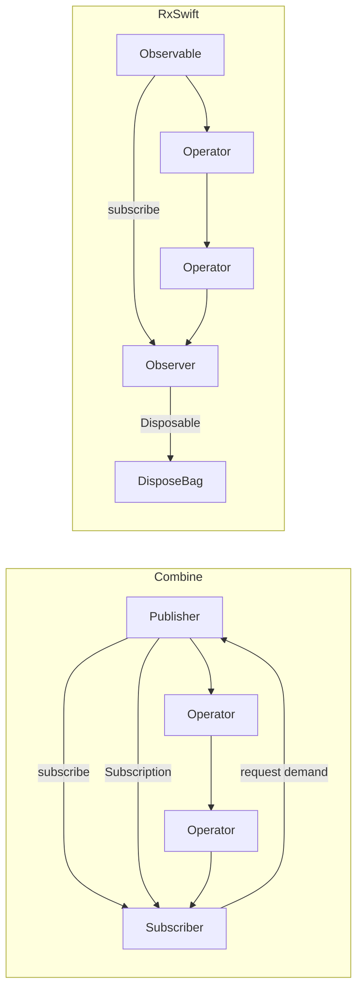
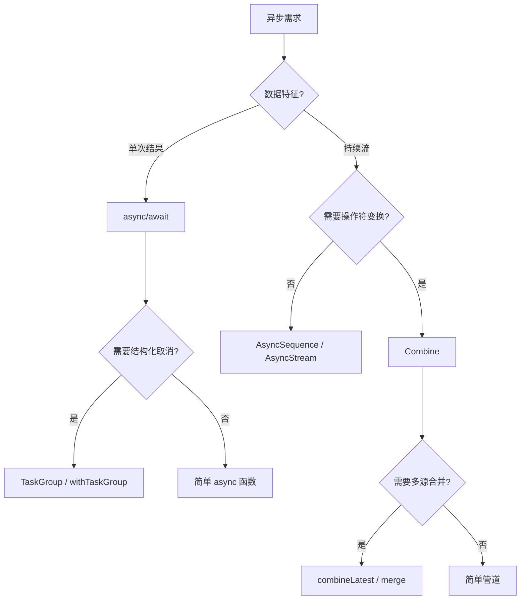
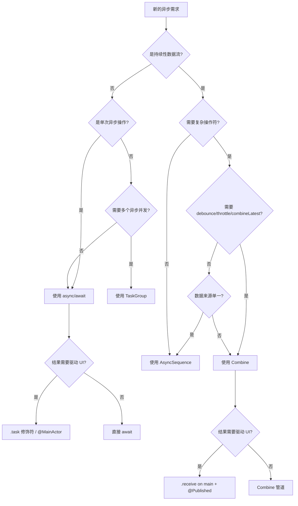
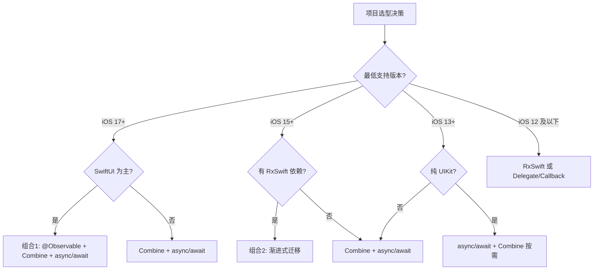

# Combine 横向对比与选型 — 详细解析

> **定位**：本文对 Combine 与 RxSwift、Observation、Swift Concurrency、Delegate/Callback 等方案进行全面横向对比，并给出场景化选型建议。  
> **适用读者**：需要在 iOS 项目中做响应式/异步方案选型的架构师与高级开发者。  
> **交叉引用**：  
> - [Combine 定位与战略分析](Combine定位与战略分析_详细解析.md)  
> - [SwiftUI 关键字与运行原理](../02_SwiftUI深度解析/SwiftUI关键字与运行原理_详细解析.md)  
> - [Swift Concurrency 深度解析](../05_并发与网络框架/Swift_Concurrency深度解析_详细解析.md)

---

## 一、核心结论 TL;DR

| 方案 | 一句话定位 | 最低系统 | 推荐场景 |
|------|-----------|---------|---------|
| **Combine** | Apple 官方的声明式响应式数据流框架，深度集成系统组件 | iOS 13+ | 持续数据流管道、多源合并、SwiftUI 绑定 |
| **RxSwift** | 社区维护的跨平台 ReactiveX 实现，操作符最齐全 | iOS 9+ | 历史项目维护、跨平台统一响应式范式 |
| **Observation** | iOS 17+ 专为 SwiftUI 打造的属性级粒度观察机制 | iOS 17+ | SwiftUI 视图状态管理、精细化 UI 更新 |
| **async/await** | Swift 原生结构化并发，解决一次性异步与取消问题 | iOS 13+（编译器） | 网络请求、文件 I/O、一次性异步操作 |
| **Delegate/Callback** | UIKit 时代的经典回调模式，零依赖 | iOS 2+ | 简单回调、遗留 API、无需组合的场景 |

> **核心选型原则**：**新项目优先 Combine + async/await 组合；iOS 17+ 项目用 @Observable 管理状态；RxSwift 项目做渐进式迁移。**

---

## 二、Combine vs RxSwift 全面对比

### 2.1 架构与设计哲学



| 维度 | Combine | RxSwift |
|------|---------|---------|
| **驱动方** | Apple 官方，闭源 | 社区开源，ReactiveX 规范 |
| **背压支持** | 原生支持（Demand 机制） | 不原生支持，需手动处理 |
| **类型安全** | Publisher<Output, Failure> 双泛型 | Observable<Element>，错误类型擦除 |
| **错误模型** | 类型化 Failure，编译期检查 | 统一 Error，运行时处理 |
| **平台绑定** | 仅 Apple 平台 | 跨平台（Linux、Android via RxKotlin） |
| **Swift 版本** | 需 Swift 5.1+ | 支持 Swift 4.2+ |
| **系统集成** | 与 Foundation/SwiftUI/URLSession 深度集成 | 需 RxCocoa 等扩展桥接 |

**设计哲学差异**：

- **Combine** 遵循 Reactive Streams 规范，强调**背压（Backpressure）**。Subscriber 主动告诉 Publisher「我要多少数据」，形成**拉（pull）模型**。这避免了生产者速度超过消费者导致的内存溢出，是一种更安全的设计。
- **RxSwift** 遵循 ReactiveX 规范，采用**推（push）模型**。Observable 产生数据就推给 Observer，需要开发者自行用 `throttle`、`buffer` 等操作符控制流速。灵活但容易遗漏。

### 2.2 API 对应表

> **结论先行**：Combine 与 RxSwift 的大部分操作符存在一一对应关系，但命名和行为细节有差异。掌握此对照表可大幅降低迁移成本。

| 分类 | Combine | RxSwift | 备注 |
|------|---------|---------|------|
| **核心类型** | | | |
| 数据源 | `Publisher` | `Observable` | Combine 带 Failure 泛型 |
| 观察者 | `Subscriber` | `Observer` | |
| 订阅令牌 | `Subscription` | `Disposable` | Combine 支持 Demand |
| 内存管理 | `AnyCancellable` / `Set<AnyCancellable>` | `DisposeBag` | |
| 可变数据源 | `CurrentValueSubject` | `BehaviorSubject` / `BehaviorRelay` | |
| 无初始值数据源 | `PassthroughSubject` | `PublishSubject` / `PublishRelay` | |
| **创建操作** | | | |
| 单值 | `Just(value)` | `Observable.just(value)` | |
| 空序列 | `Empty()` | `Observable.empty()` | |
| 失败序列 | `Fail(error:)` | `Observable.error()` | |
| 延迟创建 | `Deferred { }` | `Observable.deferred { }` | |
| 异步单值 | `Future { promise in }` | `Single.create { }` | Future 只执行一次 |
| 序列 | `sequence.publisher` | `Observable.from(sequence)` | |
| 定时器 | `Timer.publish(every:)` | `Observable.interval()` | |
| **变换操作符** | | | |
| 映射 | `.map { }` | `.map { }` | 完全一致 |
| 扁平映射 | `.flatMap { }` | `.flatMap { }` | Combine 要求内部 Failure 一致 |
| 压缩映射 | `.compactMap { }` | `.compactMap { }` | |
| 扫描累积 | `.scan(initial) { }` | `.scan(initial) { }` | |
| 类型转换 | `.map(\.property)` | `.map { $0.property }` | Combine 支持 KeyPath |
| **过滤操作符** | | | |
| 过滤 | `.filter { }` | `.filter { }` | |
| 去重 | `.removeDuplicates()` | `.distinctUntilChanged()` | |
| 跳过 | `.dropFirst(n)` | `.skip(n)` | |
| 取前 N 个 | `.prefix(n)` | `.take(n)` | |
| 首个 | `.first()` | `.take(1)` | |
| 最后一个 | `.last()` | `.takeLast(1)` | |
| 防抖 | `.debounce(for:scheduler:)` | `.debounce(dueTime:scheduler:)` | |
| 节流 | `.throttle(for:scheduler:latest:)` | `.throttle(dueTime:latest:scheduler:)` | |
| **合并操作符** | | | |
| 合并 | `.merge(with:)` | `Observable.merge()` | |
| 组合最新 | `.combineLatest()` | `Observable.combineLatest()` | |
| Zip | `.zip()` | `Observable.zip()` | |
| 切换最新 | `.switchToLatest()` | `.flatMapLatest { }` | 概念相同，API 不同 |
| 连接 | `.append()` | `.concat()` | |
| **错误处理** | | | |
| 捕获替换 | `.catch { }` | `.catchError { }` | |
| 捕获并继续 | `.tryCatch { }` | `.catchAndReturn()` | |
| 重试 | `.retry(n)` | `.retry(n)` | |
| 替换错误 | `.replaceError(with:)` | `.catchErrorJustReturn()` | |
| 错误映射 | `.mapError { }` | 无直接对应 | RxSwift Error 无类型 |
| **调度器** | | | |
| 接收线程 | `.receive(on: DispatchQueue.main)` | `.observe(on: MainScheduler.instance)` | |
| 订阅线程 | `.subscribe(on:)` | `.subscribe(on:)` | |
| **生命周期** | | | |
| 共享 | `.share()` | `.share(replay:scope:)` | RxSwift 可配置回放 |
| 引用计数共享 | `.multicast { }.autoconnect()` | `.refCount()` | |
| 缓存最新 | `CurrentValueSubject` / `.share()` | `.replay(1).refCount()` | |

### 2.3 性能对比

> **结论先行**：Combine 在内存占用、事件吞吐量、包体积三个维度上均优于 RxSwift，优势源于系统级集成和编译器优化。

#### 基准测试数据（参考 Benchmarks 社区测试）

| 指标 | Combine | RxSwift | 差异 |
|------|---------|---------|------|
| **单个订阅内存开销** | ~256 bytes | ~600-800 bytes | Combine 约为 RxSwift 的 **1/3** |
| **1000 次 map 链内存** | ~32 KB | ~80 KB | Combine 节省约 **60%** |
| **事件吞吐量（ops/sec）** | ~2.5M | ~1.2M | Combine 约 **2x** 吞吐 |
| **订阅创建耗时** | ~0.3 μs | ~0.8 μs | Combine 快 **2-3x** |
| **取消操作耗时** | ~0.1 μs | ~0.4 μs | Combine 快 **3-4x** |
| **包体积增量** | 0（系统框架） | ~2-4 MB（stripped） | RxSwift 增加可观二进制体积 |
| **编译时间影响** | 低（预编译） | 中-高（泛型推导开销大） | 大型项目差异明显 |

#### Combine 性能优势原因

1. **系统级集成**：Combine 作为系统框架，随 OS 预加载到共享缓存（dyld shared cache），无需动态链接额外二进制。
2. **编译器优化**：Apple 编译器对 Combine 的泛型特化（specialization）做了定制优化，减少了中间类型装箱。
3. **ABI 稳定**：Combine 享受 Swift ABI 稳定的红利，二进制大小为零增量。
4. **底层实现**：Combine 内部使用了高度优化的 C/C++ 实现（通过 `@_silgen_name` 桥接），而非纯 Swift。
5. **Demand 机制**：背压模型让系统只处理需要的数据量，减少无用计算。

### 2.4 生态与社区对比

| 维度 | Combine | RxSwift |
|------|---------|---------|
| **UI 绑定库** | CombineCocoa（社区） | RxCocoa（官方配套） |
| **网络扩展** | 原生 URLSession.dataTaskPublisher | RxAlamofire / Moya-RxSwift |
| **CoreData 扩展** | 原生 NSFetchedResultsController Publisher | RxCoreData |
| **测试工具** | Combine 自带，社区 CombineExpectations | RxTest / RxBlocking |
| **学习资源** | Apple 官方文档、WWDC Session | 海量教程、书籍（多年积累） |
| **Stack Overflow 问题数** | ~5,000+ | ~20,000+ |
| **GitHub Stars** | N/A（闭源） | ~24k |
| **维护状态** | 随 iOS/macOS 更新 | 活跃维护（RxSwift 6.x） |

**RxSwift 的未来趋势**：

- **RxSwift 6** 引入了 `Infallible` 类型，向 Combine 的类型化错误靠拢。
- RxSwift 社区提供了 **RxCombine** 库，实现 `Observable` ↔ `Publisher` 的双向桥接。
- 长期看，随着 Combine 生态成熟和 iOS 最低版本提升，**新项目将逐步转向 Combine**。
- RxSwift 在**跨平台场景**（如 KMP 项目、服务端 Swift）中仍有独特价值。

### 2.5 迁移指南：从 RxSwift 到 Combine

> **结论先行**：渐进式迁移是最佳策略。利用 RxCombine 桥接层，按模块逐步替换，避免一次性重写带来的高风险。

#### 迁移步骤

```
阶段一：评估与准备（1-2 周）
├── 梳理项目中 RxSwift 使用热图（哪些模块用得最多）
├── 确认最低部署版本 ≥ iOS 13
├── 引入 RxCombine 桥接库
└── 建立 Combine 编码规范

阶段二：基础设施层迁移（2-4 周）
├── 网络层：URLSession.dataTaskPublisher 替换 RxAlamofire
├── 存储层：Combine 包装 CoreData/UserDefaults
└── 通用工具：Timer、Notification 等改用 Combine API

阶段三：业务模块迁移（按模块，4-8 周）
├── 新模块直接使用 Combine
├── 低耦合模块优先迁移
├── 通过 RxCombine 桥接保持新旧模块互操作
└── ViewModel 层 BehaviorSubject → CurrentValueSubject

阶段四：清理与优化（2 周）
├── 移除 RxSwift/RxCocoa 依赖
├── 移除 RxCombine 桥接
├── 全量回归测试
└── 性能基准对比验证
```

#### 关键差异与陷阱

| 陷阱 | RxSwift 行为 | Combine 行为 | 解决方案 |
|------|-------------|-------------|---------|
| **Error 类型** | 统一 `Error` | 类型化 `Failure` | 使用 `mapError` 或 `setFailureType` |
| **Subject 完成** | Subject 可重复发送 | Subject 完成后不可再发送 | 注意生命周期管理 |
| **share 行为** | `.share(replay:1)` 自动回放 | `.share()` 不回放 | 用 `CurrentValueSubject` 或 `multicast` |
| **flatMap 签名** | 错误类型自动对齐 | 内部 Publisher 的 Failure 必须一致 | `setFailureType(to:)` 对齐 |
| **dispose vs cancel** | DisposeBag deinit 自动清理 | AnyCancellable deinit 自动 cancel | 语义一致，但 API 不同 |
| **Hot vs Cold** | 明确区分 Hot/Cold | 默认 Cold，Subject 是 Hot | 理解 Combine 的惰性求值 |

#### RxCombine 桥接示例

```swift
import RxSwift
import Combine
import RxCombine

// RxSwift Observable → Combine Publisher
let rxObservable = Observable.just("Hello RxSwift")
let combinePublisher = rxObservable.asPublisher()  // AnyPublisher<String, Error>

combinePublisher
    .sink(receiveCompletion: { _ in },
          receiveValue: { print($0) })
    .store(in: &cancellables)

// Combine Publisher → RxSwift Observable
let justPublisher = Just("Hello Combine")
let observable = justPublisher.asObservable()  // Observable<String>

observable
    .subscribe(onNext: { print($0) })
    .disposed(by: disposeBag)
```

---

## 三、Combine vs Observation 框架 (iOS 17+)

### 3.1 定位差异

> **结论先行**：Combine 是通用数据流框架，Observation 是 SwiftUI 专用的属性级观察机制。两者不是替代关系，而是互补关系。

```mermaid
graph TB
    subgraph 使用场景分界
        A[数据层需求] --> B{需要流式处理?}
        B -->|是| C{多源合并/操作符变换?}
        C -->|是| D[Combine]
        C -->|否| E{持续数据流?}
        E -->|是| D
        E -->|否| F[async/await]
        B -->|否| G{驱动 SwiftUI 视图?}
        G -->|是| H{iOS 17+?}
        H -->|是| I[@Observable / Observation]
        H -->|否| J[@Published + Combine]
        G -->|否| K[传统属性/KVO]
    end
```

- **Combine**：面向**数据管道**——从数据源到 UI 的多步变换链。它处理的是「数据怎么流动」。
- **Observation**：面向**状态同步**——让 SwiftUI 精确知道哪个属性变了。它处理的是「UI 怎么更新」。

### 3.2 技术对比表

| 维度 | Combine (@Published) | Observation (@Observable) |
|------|---------------------|--------------------------|
| **最低版本** | iOS 13+ | iOS 17+ / macOS 14+ |
| **追踪粒度** | 对象级（objectWillChange 整体通知） | 属性级（仅访问的属性触发更新） |
| **更新触发** | `objectWillChange.send()` | `withObservationTracking { }` |
| **SwiftUI 集成** | `@ObservedObject` / `@StateObject` | 自动追踪，无需属性包装器 |
| **声明方式** | `class VM: ObservableObject` + `@Published` | `@Observable class VM` |
| **过度刷新** | 任意 @Published 变化触发全部依赖刷新 | 仅读取的属性变化才触发对应视图刷新 |
| **错误处理** | 完整的 Failure 类型系统 | 无内建错误传播 |
| **组合能力** | 丰富的操作符链 | 无操作符，纯属性观察 |
| **异步流支持** | 原生 Publisher 流 | 无流概念 |
| **多线程安全** | Scheduler 显式调度 | 自动与 MainActor 配合 |
| **学习曲线** | 中-高（操作符生态庞大） | 低（声明一个宏即可） |
| **调试复杂度** | 高（异步链路追踪困难） | 低（属性级，直觉明确） |
| **性能** | 中等（Subject 开销 + 对象级通知） | 优秀（编译器插桩，属性级精准） |

### 3.3 代码对比

#### 场景：一个包含多个属性的 ViewModel 驱动 SwiftUI 视图

**Combine 方式 (@Published)**：

```swift
// ViewModel — Combine 方式
class UserProfileViewModel: ObservableObject {
    @Published var name: String = ""
    @Published var avatarURL: URL?
    @Published var followerCount: Int = 0
    @Published var isLoading: Bool = false
    
    private var cancellables = Set<AnyCancellable>()
    
    func loadProfile(userId: String) {
        isLoading = true
        URLSession.shared.dataTaskPublisher(for: profileURL(userId))
            .map(\.data)
            .decode(type: UserProfile.self, decoder: JSONDecoder())
            .receive(on: DispatchQueue.main)
            .sink(
                receiveCompletion: { [weak self] completion in
                    self?.isLoading = false
                    if case .failure(let error) = completion {
                        print("Error: \(error)")
                    }
                },
                receiveValue: { [weak self] profile in
                    self?.name = profile.name          // 触发 objectWillChange
                    self?.avatarURL = profile.avatarURL // 再次触发
                    self?.followerCount = profile.followers // 再次触发
                }
            )
            .store(in: &cancellables)
    }
}

// View — 需要 @ObservedObject
struct UserProfileView: View {
    @ObservedObject var viewModel: UserProfileViewModel
    
    var body: some View {
        VStack {
            Text(viewModel.name)           // 即使只显示 name
            Text("\(viewModel.followerCount) followers")
        }
        // ⚠️ 问题：修改 avatarURL 也会触发此视图重绘
        // 因为 objectWillChange 是对象级通知
    }
}
```

**Observation 方式 (@Observable)**：

```swift
// ViewModel — Observation 方式（iOS 17+）
@Observable
class UserProfileViewModel {
    var name: String = ""
    var avatarURL: URL?
    var followerCount: Int = 0
    var isLoading: Bool = false
    
    func loadProfile(userId: String) async {
        isLoading = true
        defer { isLoading = false }
        
        do {
            let (data, _) = try await URLSession.shared.data(from: profileURL(userId))
            let profile = try JSONDecoder().decode(UserProfile.self, from: data)
            name = profile.name
            avatarURL = profile.avatarURL
            followerCount = profile.followers
        } catch {
            print("Error: \(error)")
        }
    }
}

// View — 无需属性包装器
struct UserProfileView: View {
    var viewModel: UserProfileViewModel  // 直接引用，无需 @ObservedObject
    
    var body: some View {
        VStack {
            Text(viewModel.name)
            Text("\(viewModel.followerCount) followers")
        }
        // ✅ 优势：修改 avatarURL 不会触发此视图重绘
        // 因为 body 中未读取 avatarURL，Observation 精确追踪
    }
}
```

#### 过度刷新问题对比

| 操作 | Combine (@Published) | Observation (@Observable) |
|------|---------------------|--------------------------|
| 修改 `name` | 整个视图树刷新 | 仅使用 `name` 的视图刷新 |
| 修改 `avatarURL` | 整个视图树刷新 | 仅使用 `avatarURL` 的视图刷新 |
| 同时修改 3 个属性 | 触发 3 次 objectWillChange | 合并为 1 次精准更新 |
| 修改未被 UI 使用的属性 | 仍然触发刷新 | **不触发任何刷新** |

### 3.4 共存策略

> **结论先行**：iOS 17+ 项目推荐 @Observable 管理 UI 状态，Combine 处理复杂数据流管道。两者共存是最佳实践。

#### 推荐架构分层

```
┌─────────────────────────────────────────┐
│  SwiftUI Views                          │
│  └── 自动追踪 @Observable 属性           │
├─────────────────────────────────────────┤
│  @Observable ViewModels                  │
│  └── 属性暴露给 View，精准更新            │
├─────────────────────────────────────────┤
│  Combine Pipelines（数据流层）            │
│  └── 网络响应 → 数据变换 → 赋值给 VM 属性  │
├─────────────────────────────────────────┤
│  async/await Services（服务层）           │
│  └── 网络请求、文件 I/O、数据库操作        │
└─────────────────────────────────────────┘
```

#### 混合使用示例

```swift
@Observable
class SearchViewModel {
    var query: String = ""
    var results: [SearchResult] = []
    var isSearching: Bool = false
    
    private var cancellables = Set<AnyCancellable>()
    
    init() {
        // 使用 Combine 处理复杂数据流：防抖 + 去重 + 网络请求
        // 最终结果赋值给 @Observable 属性，驱动精准 UI 更新
        withObservationTracking {
            _ = query  // 触发对 query 的追踪
        } onChange: { [weak self] in
            self?.setupSearchPipeline()
        }
    }
    
    private func setupSearchPipeline() {
        // 利用 Combine 的操作符优势处理搜索逻辑
        let queryPublisher = PassthroughSubject<String, Never>()
        
        queryPublisher
            .debounce(for: .milliseconds(300), scheduler: RunLoop.main)
            .removeDuplicates()
            .filter { !$0.isEmpty }
            .flatMap { query in
                URLSession.shared.dataTaskPublisher(for: searchURL(query))
                    .map(\.data)
                    .decode(type: [SearchResult].self, decoder: JSONDecoder())
                    .catch { _ in Just([]) }
            }
            .receive(on: DispatchQueue.main)
            .sink { [weak self] results in
                self?.results = results  // 赋值触发精准 UI 更新
                self?.isSearching = false
            }
            .store(in: &cancellables)
    }
}
```

#### 渐进式迁移路径

```
Step 1：新增 @Observable ViewModel（iOS 17+ Target）
Step 2：在 @Observable VM 内部继续使用 Combine 管道
Step 3：逐步将简单的 @Published 属性迁移到 @Observable
Step 4：保留 Combine 仅用于复杂数据流场景
Step 5：随最低版本提升，淘汰 ObservableObject
```

---

## 四、Combine vs Swift Concurrency (async/await)

### 4.1 定位差异

> **结论先行**：Combine 擅长持续性数据流和多源合并，async/await 擅长一次性异步操作和结构化并发。AsyncSequence 是两者的桥接层。



| 适用场景 | Combine | async/await |
|---------|---------|------------|
| 网络请求（单次） | 可以但杀鸡用牛刀 | **最佳选择** |
| 搜索框防抖 | **最佳选择** | 需手动实现 |
| 多个 API 并发请求 | merge/zip | **TaskGroup 更直观** |
| WebSocket 持续消息 | **最佳选择** | AsyncStream 可替代 |
| 表单多字段联合校验 | **combineLatest 最佳** | 需要手动组合 |
| 文件下载进度 | Publisher 流 | AsyncSequence 可替代 |
| 定时轮询 | Timer.publish | AsyncStream + Task.sleep |

### 4.2 技术对比表

| 维度 | Combine | async/await |
|------|---------|------------|
| **编程模型** | 声明式/响应式 | 命令式/结构化 |
| **数据流类型** | 持续流（0...∞ 个值） | 单次值（1 个结果或抛错） |
| **错误处理** | 类型化 `Failure` 泛型 | `throws`（运行时） |
| **取消机制** | `AnyCancellable` 引用计数 | `Task.cancel()`，协作式检查 |
| **线程管理** | `Scheduler`（receive(on:)） | `Actor` / `@MainActor` |
| **组合能力** | 丰富操作符（50+） | `async let` / `TaskGroup` |
| **背压** | 原生 Demand 机制 | 无（AsyncSequence 有限支持） |
| **调试体验** | 差（异步链路堆栈断裂） | 好（结构化 async 堆栈清晰） |
| **学习曲线** | 高（操作符 + 泛型 + 背压） | 中（接近同步代码风格） |
| **代码可读性** | 链式声明，紧凑但抽象 | 线性流程，接近传统代码 |
| **系统集成** | Foundation Publisher 扩展 | Swift 语言级别原生支持 |
| **最低版本** | iOS 13+ | iOS 13+（编译器 backport） |
| **SwiftUI 集成** | @Published / onReceive | .task { } / .refreshable { } |

### 4.3 互操作

> **结论先行**：Combine 和 async/await 可以无缝互操作。`publisher.values` 将 Publisher 转为 AsyncSequence，`Future` 可以包装 async 函数。

#### Combine → async/await

```swift
// 方式 1：publisher.values — 将 Publisher 转为 AsyncSequence
let publisher = NotificationCenter.default.publisher(for: UIDevice.orientationDidChangeNotification)

// 在 async 上下文中消费 Combine Publisher
Task {
    for await notification in publisher.values {
        print("方向变化: \(notification)")
    }
}

// 方式 2：获取单个值
let value = try await somePublisher
    .filter { $0 > threshold }
    .first()
    .values
    .first(where: { _ in true })
```

#### async/await → Combine

```swift
// 方式 1：Future 包装 async 函数
func fetchUserPublisher(id: String) -> AnyPublisher<User, Error> {
    Future { promise in
        Task {
            do {
                let user = try await fetchUser(id: id)
                promise(.success(user))
            } catch {
                promise(.failure(error))
            }
        }
    }
    .eraseToAnyPublisher()
}

// 方式 2：通用扩展
extension Publisher {
    func toAsyncStream() -> AsyncThrowingStream<Output, Error> {
        AsyncThrowingStream { continuation in
            let cancellable = self.sink(
                receiveCompletion: { completion in
                    switch completion {
                    case .finished:
                        continuation.finish()
                    case .failure(let error):
                        continuation.finish(throwing: error)
                    }
                },
                receiveValue: { value in
                    continuation.yield(value)
                }
            )
            continuation.onTermination = { _ in
                cancellable.cancel()
            }
        }
    }
}
```

#### 混合使用最佳模式

```swift
class DataSyncViewModel: ObservableObject {
    @Published var syncStatus: SyncStatus = .idle
    @Published var lastSyncDate: Date?
    
    private var cancellables = Set<AnyCancellable>()
    
    func startAutoSync() {
        // Combine 管道：定时触发 + 网络状态过滤
        Timer.publish(every: 300, on: .main, in: .common)
            .autoconnect()
            .combineLatest(networkMonitor.isConnectedPublisher)
            .filter { _, isConnected in isConnected }
            .sink { [weak self] _ in
                // 在 Combine sink 中桥接到 async/await
                Task { await self?.performSync() }
            }
            .store(in: &cancellables)
    }
    
    // async/await 处理一次性同步操作
    @MainActor
    private func performSync() async {
        syncStatus = .syncing
        do {
            // 结构化并发：并行同步多个数据源
            async let users = syncService.syncUsers()
            async let orders = syncService.syncOrders()
            async let settings = syncService.syncSettings()
            
            let results = try await (users, orders, settings)
            syncStatus = .completed(results)
            lastSyncDate = Date()
        } catch {
            syncStatus = .failed(error)
        }
    }
}
```

### 4.4 选型决策流程



---

## 五、Combine vs Delegate/Callback 传统模式

### 5.1 相同场景的三种实现对比

> **场景**：网络请求获取用户列表 → 过滤有效用户 → 更新 UI 表格。

#### Delegate 模式

```swift
// MARK: - Delegate 模式
protocol UserServiceDelegate: AnyObject {
    func userService(_ service: UserService, didFetchUsers users: [User])
    func userService(_ service: UserService, didFailWithError error: Error)
}

class UserService: NSObject, URLSessionDataDelegate {
    weak var delegate: UserServiceDelegate?
    private var receivedData = Data()
    
    func fetchUsers() {
        let request = URLRequest(url: usersURL)
        let session = URLSession(configuration: .default, delegate: self, delegateQueue: nil)
        session.dataTask(with: request).resume()
    }
    
    func urlSession(_ session: URLSession, dataTask: URLSessionDataTask,
                    didReceive data: Data) {
        receivedData.append(data)
    }
    
    func urlSession(_ session: URLSession, task: URLSessionTask,
                    didCompleteWithError error: Error?) {
        if let error = error {
            DispatchQueue.main.async {
                self.delegate?.userService(self, didFailWithError: error)
            }
            return
        }
        do {
            let users = try JSONDecoder().decode([User].self, from: receivedData)
            let validUsers = users.filter { $0.isActive }
            DispatchQueue.main.async {
                self.delegate?.userService(self, didFetchUsers: validUsers)
            }
        } catch {
            DispatchQueue.main.async {
                self.delegate?.userService(self, didFailWithError: error)
            }
        }
    }
}

// ViewController 需要实现 delegate
class UsersViewController: UIViewController, UserServiceDelegate {
    let service = UserService()
    
    override func viewDidLoad() {
        super.viewDidLoad()
        service.delegate = self
        service.fetchUsers()
    }
    
    func userService(_ service: UserService, didFetchUsers users: [User]) {
        tableView.reloadData()  // 已在主线程
    }
    
    func userService(_ service: UserService, didFailWithError error: Error) {
        showAlert(error: error)
    }
}
```

#### Callback/Closure 模式

```swift
// MARK: - Callback 模式
class UserService {
    func fetchUsers(completion: @escaping (Result<[User], Error>) -> Void) {
        URLSession.shared.dataTask(with: usersURL) { data, response, error in
            if let error = error {
                DispatchQueue.main.async { completion(.failure(error)) }
                return
            }
            guard let data = data else {
                DispatchQueue.main.async { completion(.failure(NetworkError.noData)) }
                return
            }
            do {
                let users = try JSONDecoder().decode([User].self, from: data)
                let validUsers = users.filter { $0.isActive }
                DispatchQueue.main.async { completion(.success(validUsers)) }
            } catch {
                DispatchQueue.main.async { completion(.failure(error)) }
            }
        }.resume()
    }
}

// 使用
service.fetchUsers { [weak self] result in
    switch result {
    case .success(let users):
        self?.users = users
        self?.tableView.reloadData()
    case .failure(let error):
        self?.showAlert(error: error)
    }
}
```

#### Combine 管道

```swift
// MARK: - Combine 模式
class UserService {
    func fetchUsers() -> AnyPublisher<[User], Error> {
        URLSession.shared.dataTaskPublisher(for: usersURL)
            .map(\.data)
            .decode(type: [User].self, decoder: JSONDecoder())
            .map { $0.filter { $0.isActive } }
            .receive(on: DispatchQueue.main)
            .eraseToAnyPublisher()
    }
}

// 使用
service.fetchUsers()
    .sink(
        receiveCompletion: { [weak self] completion in
            if case .failure(let error) = completion {
                self?.showAlert(error: error)
            }
        },
        receiveValue: { [weak self] users in
            self?.users = users
            self?.tableView.reloadData()
        }
    )
    .store(in: &cancellables)
```

#### 对比总结

| 维度 | Delegate | Callback | Combine |
|------|----------|----------|---------|
| **代码行数** | ~50 行 | ~25 行 | ~15 行 |
| **类型安全** | 弱（协议方法命名约定） | 中（Result 类型） | 强（泛型 Publisher） |
| **可组合性** | 差（新需求需新协议方法） | 差（嵌套回调地狱） | 优秀（操作符链式组合） |
| **取消支持** | 需手动实现 | 需手动实现 | AnyCancellable 自动管理 |
| **线程安全** | 手动 dispatch | 手动 dispatch | receive(on:) 声明式 |
| **可测试性** | 中（需 Mock delegate） | 中（需传入 closure） | 好（可注入 Publisher） |
| **学习曲线** | 低 | 低 | 中-高 |
| **适用场景** | UIKit 系统回调 | 简单异步操作 | 复杂数据流管道 |

### 5.2 迁移路径

#### 将 Delegate API 包装为 Publisher

```swift
// 通用 Delegate 代理类 → Publisher
class CLLocationManagerDelegatePublisher: NSObject, CLLocationManagerDelegate {
    let locationSubject = PassthroughSubject<CLLocation, Error>()
    
    func locationManager(_ manager: CLLocationManager,
                        didUpdateLocations locations: [CLLocation]) {
        locations.forEach { locationSubject.send($0) }
    }
    
    func locationManager(_ manager: CLLocationManager,
                        didFailWithError error: Error) {
        locationSubject.send(completion: .failure(error))
    }
}

// 封装为便捷 Publisher
extension CLLocationManager {
    static func locationPublisher() -> AnyPublisher<CLLocation, Error> {
        let manager = CLLocationManager()
        let delegate = CLLocationManagerDelegatePublisher()
        manager.delegate = delegate
        manager.startUpdatingLocation()
        
        return delegate.locationSubject
            .handleEvents(receiveCancel: {
                manager.stopUpdatingLocation()
            })
            .eraseToAnyPublisher()
    }
}

// 使用
CLLocationManager.locationPublisher()
    .filter { $0.horizontalAccuracy < 100 }
    .throttle(for: .seconds(5), scheduler: RunLoop.main, latest: true)
    .sink(
        receiveCompletion: { print("Error: \($0)") },
        receiveValue: { location in updateMapPin(location) }
    )
    .store(in: &cancellables)
```

#### 将 Callback API 包装为 Future

```swift
// 通用包装：任意 callback → Future
func wrapInFuture<T>(
    _ operation: @escaping (@escaping (Result<T, Error>) -> Void) -> Void
) -> Future<T, Error> {
    Future { promise in
        operation { result in
            promise(result)
        }
    }
}

// 示例：包装第三方 SDK 的 callback API
extension PaymentSDK {
    func processPaymentPublisher(amount: Decimal) -> AnyPublisher<PaymentResult, Error> {
        Future<PaymentResult, Error> { [weak self] promise in
            self?.processPayment(amount: amount) { result, error in
                if let error = error {
                    promise(.failure(error))
                } else if let result = result {
                    promise(.success(result))
                } else {
                    promise(.failure(PaymentError.unknown))
                }
            }
        }
        .eraseToAnyPublisher()
    }
}

// 使用：在 Combine 管道中无缝集成遗留 API
paymentSDK.processPaymentPublisher(amount: 99.99)
    .retry(2)
    .receive(on: DispatchQueue.main)
    .sink(
        receiveCompletion: { completion in
            if case .failure(let error) = completion {
                showPaymentError(error)
            }
        },
        receiveValue: { result in
            showPaymentSuccess(result)
        }
    )
    .store(in: &cancellables)
```

---

## 六、综合选型矩阵与建议

### 6.1 技术选型综合评分表

> **评分标准**：1-5 分，5 分为该维度最优。

| 维度 | Combine | RxSwift | Observation | async/await | Delegate/Callback |
|------|---------|---------|-------------|------------|-------------------|
| **类型安全** | 5 | 3 | 4 | 4 | 2 |
| **操作符丰富度** | 4 | 5 | 1 | 2 | 1 |
| **持续数据流** | 5 | 5 | 1 | 3 | 2 |
| **一次性异步** | 3 | 3 | 1 | 5 | 3 |
| **SwiftUI 集成** | 4 | 2 | 5 | 3 | 1 |
| **UIKit 集成** | 3 | 4 | 2 | 3 | 5 |
| **调试体验** | 2 | 2 | 4 | 5 | 4 |
| **学习曲线** | 2 | 2 | 5 | 4 | 5 |
| **包体积** | 5 | 2 | 5 | 5 | 5 |
| **性能** | 4 | 3 | 5 | 4 | 4 |
| **社区生态** | 3 | 5 | 3 | 4 | 5 |
| **多平台** | 2 | 4 | 2 | 3 | 4 |
| **可测试性** | 4 | 4 | 3 | 4 | 2 |
| **未来趋势** | 4 | 2 | 5 | 5 | 1 |
| **综合加权** | **3.6** | **3.1** | **3.3** | **3.9** | **3.1** |

> **解读**：async/await 综合得分最高，因为它覆盖面广且学习成本低。Combine 在持续数据流场景无可替代。Observation 在 SwiftUI 状态管理上是最佳方案。

### 6.2 场景化选型推荐

#### 新项目（iOS 17+，SwiftUI 为主）

```
推荐：@Observable + async/await + Combine（仅复杂数据流）
├── UI 状态管理 → @Observable
├── 网络请求 → async/await
├── 搜索防抖/多源合并 → Combine
└── 定时任务 → Combine Timer.publish 或 AsyncStream
```

#### 新项目（iOS 15+，SwiftUI + UIKit 混合）

```
推荐：Combine + async/await
├── UI 状态管理 → @Published + @ObservedObject
├── UIKit 绑定 → Combine Publisher + sink
├── 网络请求 → async/await
├── 数据流管道 → Combine
└── 系统事件 → NotificationCenter.publisher
```

#### 既有项目（有 RxSwift 依赖）

```
推荐：渐进式迁移 RxSwift → Combine
├── 引入 RxCombine 桥接
├── 新模块使用 Combine
├── 按模块逐步替换
├── 网络层优先迁移到 async/await
└── 最终目标：移除 RxSwift 依赖
```

#### 既有项目（纯 UIKit，无响应式依赖）

```
推荐：async/await + Combine（按需）
├── 网络层 → async/await
├── 复杂 UI 交互 → Combine
├── 简单回调 → 保留 Delegate/Callback
└── 避免过度改造低价值模块
```

#### 小组件 / App Extension

```
推荐：async/await（首选）+ Combine（如需定时更新）
├── Timeline 刷新 → async/await
├── 网络请求 → URLSession async API
├── 避免引入第三方依赖（包体积限制）
└── Widget 刷新策略 → TimelineProvider + async
```

#### 系统级框架 / SDK 开发

```
推荐：Combine（API 暴露）+ async/await（内部实现）
├── 对外暴露 Publisher API → 消费者可自由组合
├── 同时提供 async/await API → 降低使用门槛
├── 内部实现使用 async/await → 简化代码
├── 零第三方依赖 → 只用系统框架
└── 不使用 Observation → 框架不应依赖 iOS 17+
```

### 6.3 技术栈组合推荐

#### 组合 1：现代 SwiftUI 全家桶（iOS 17+）

```
@Observable（UI 状态）+ Combine（数据流）+ async/await（网络/IO）
```

| 层 | 技术选择 | 理由 |
|---|---------|------|
| View 层 | @Observable 自动追踪 | 属性级精准刷新，零样板代码 |
| ViewModel | @Observable class | 替代 ObservableObject |
| 数据流 | Combine 管道 | 防抖、合并、变换等复杂流处理 |
| 网络层 | async/await | 简洁直观，结构化错误处理 |
| 持久化 | SwiftData + async | 与 @Observable 深度集成 |

#### 组合 2：渐进迁移组合（既有 RxSwift 项目）

```
RxSwift（渐进迁移）→ Combine + async/await
```

| 阶段 | 做法 | 工具 |
|-----|------|------|
| 第一阶段 | 新模块用 Combine | RxCombine 桥接 |
| 第二阶段 | 网络层迁移 async/await | async URLSession |
| 第三阶段 | ViewModel 迁移 Combine | CurrentValueSubject |
| 第四阶段 | 移除 RxSwift 依赖 | 全量回归测试 |

#### 组合 3：纯 Swift Concurrency 轻量方案

```
async/await + AsyncSequence + Observation
```

| 场景 | 方案 | 备注 |
|------|------|------|
| 网络请求 | async/await | 原生支持 |
| 持续流 | AsyncStream | 替代简单 Publisher |
| UI 状态 | @Observable | iOS 17+ |
| 定时任务 | Task.sleep + while | 简单但足够 |
| 多源合并 | TaskGroup | 替代 merge/zip |

> **适用场景**：功能简单、不需要复杂操作符变换的小型项目或原型开发。当需要 `debounce`、`combineLatest`、`switchToLatest` 等复杂流操作时，仍需引入 Combine。

---

## 总结：选型决策速查



> **最终建议**：技术选型没有银弹。理解每种方案的核心优势和适用边界，根据项目实际情况组合使用，才是最佳策略。Combine 在 Apple 生态中的地位稳固——它不是万能的，但在持续数据流处理和系统级集成场景下，仍然是不可替代的最优解。

---

> **交叉引用**  
> - [Combine 定位与战略分析](Combine定位与战略分析_详细解析.md) — Combine 在 Apple 技术版图中的战略定位  
> - [SwiftUI 关键字与运行原理](../02_SwiftUI深度解析/SwiftUI关键字与运行原理_详细解析.md) — @ObservedObject vs @Observable 的 SwiftUI 运行机制  
> - [Swift Concurrency 深度解析](../05_并发与网络框架/Swift_Concurrency深度解析_详细解析.md) — async/await 与结构化并发的完整技术细节
