# Combine 运行机制与原理深度解析

> **定位**：本文是 Combine 深度解析系列第三篇，聚焦 Combine 的**底层运行机制与实现原理**。从协议体系、Publisher/Subscriber/Subscription 的运行时角色，到背压处理、线程调度、操作符内部实现，逐层剖析 Combine 的设计哲学与工程实现。
>
> **前置阅读**：[Combine 定位与战略分析](Combine定位与战略分析_详细解析.md) | [Combine 基础使用与典型场景](Combine基础使用与典型场景_详细解析.md)
>
> **关联参考**：[Swift 运行时与 ABI 稳定性](../04_底层运行机制/Swift运行时与ABI稳定性_详细解析.md)

---

## 一、核心结论 TL;DR

| 维度 | 核心结论 |
|------|----------|
| **三大协议角色** | Publisher 是值的**声明者**（描述能产生什么值），Subscriber 是值的**消费者**（决定何时要值、要多少），Subscription 是两者之间的**控制通道**（管理生命周期与需求传递） |
| **背压机制** | Combine 采用 **Pull 模型**——Subscriber 主动向上游请求 Demand，上游不会无限推送。这是与 RxSwift Push 模型的根本区别 |
| **线程调度** | `subscribe(on:)` 影响**上游**订阅与值产生线程，`receive(on:)` 影响**下游**值接收线程。二者作用方向完全相反 |
| **Subscription 生命周期** | Subscription 是整个管道的**强引用锚点**，AnyCancellable 持有 Subscription，`cancel()` 或 deinit 触发级联取消 |
| **操作符本质** | 每个操作符都是一个新 Publisher + 内部 Subscription，形成链式结构。值沿链正向传递，Demand 沿链反向传递 |
| **错误传播** | 错误一旦发生，整个管道**立即终止**——当前节点发送 `.failure`，上游被取消，下游收到 `completion(.failure)` |
| **线程安全保证** | Publisher 链中的值传递是**串行的**（serial access guarantee），但 Subject 的 `send()` 可从多线程调用 |
| **内存模型** | Publisher 链通过 Subscription 建立引用链，AnyCancellable 是用户侧的生命周期管理工具，其 deinit 自动调用 `cancel()` 打破引用 |

---

## 二、Combine 协议体系架构

**核心结论：Combine 的整个框架建立在三个协议之上——Publisher、Subscriber、Subscription。它们通过 associatedtype 形成编译期类型安全的数据流管道。**

### 2.1 核心协议关系

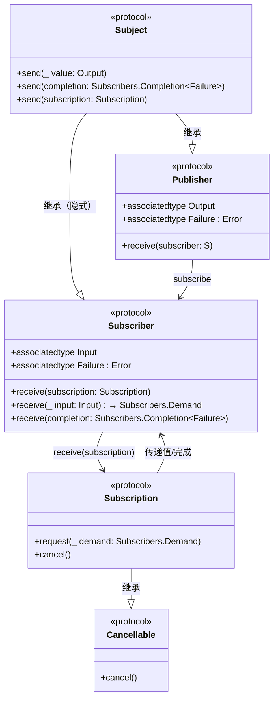

### 2.2 协议定义详解

```swift
// ✅ iOS 13.0+ | Swift 5.1+

// MARK: - Publisher 协议
public protocol Publisher {
    associatedtype Output
    associatedtype Failure: Error
    
    /// 核心方法：接受一个订阅者
    /// 实现者必须在此方法中创建 Subscription 并调用 subscriber.receive(subscription:)
    func receive<S: Subscriber>(subscriber: S) 
        where S.Input == Output, S.Failure == Failure
}

// MARK: - Subscriber 协议
public protocol Subscriber: CustomCombineIdentifierConvertible {
    associatedtype Input
    associatedtype Failure: Error
    
    /// 收到 Subscription 后，存储并请求 Demand
    func receive(subscription: Subscription)
    
    /// 收到值，返回额外的 Demand（累加到已有需求上）
    func receive(_ input: Input) -> Subscribers.Demand
    
    /// 收到完成事件（正常完成或错误）
    func receive(completion: Subscribers.Completion<Failure>)
}

// MARK: - Subscription 协议
public protocol Subscription: Cancellable, CustomCombineIdentifierConvertible {
    /// Subscriber 通过此方法向上游请求数据
    func request(_ demand: Subscribers.Demand)
}
```

### 2.3 类型擦除

**核心结论：类型擦除解决了 Combine 中 associatedtype 导致的协议不能作为类型使用的问题，是 API 设计的关键基础设施。**

```swift
// ✅ iOS 13.0+

// AnyPublisher — 擦除 Publisher 的具体类型
// 内部持有一个 box（existential container），转发所有调用
let publisher: AnyPublisher<String, Never> = Just("Hello")
    .map { $0.uppercased() }
    .eraseToAnyPublisher()  // 返回 AnyPublisher<String, Never>

// AnySubscriber — 擦除 Subscriber 的具体类型
// 常用于自定义操作符的内部实现
let subscriber = AnySubscriber<Int, Never>(
    receiveSubscription: { subscription in
        subscription.request(.max(3))
    },
    receiveValue: { value -> Subscribers.Demand in
        print("收到: \(value)")
        return .none  // 不增加额外需求
    },
    receiveCompletion: { completion in
        print("完成: \(completion)")
    }
)

// AnyCancellable — 擦除 Cancellable 的具体类型
// 最重要的特性：deinit 时自动调用 cancel()
var cancellables = Set<AnyCancellable>()
publisher.sink { value in
    print(value)
}
.store(in: &cancellables)  // AnyCancellable 存入 Set
```

**类型擦除的实现原理**：

```swift
// 简化版 AnyPublisher 实现原理
public struct AnyPublisher<Output, Failure: Error>: Publisher {
    private let _subscribe: (AnySubscriber<Output, Failure>) -> Void
    
    public init<P: Publisher>(_ publisher: P) 
        where P.Output == Output, P.Failure == Failure 
    {
        _subscribe = { subscriber in
            publisher.receive(subscriber: subscriber)
        }
    }
    
    public func receive<S: Subscriber>(subscriber: S) 
        where S.Input == Output, S.Failure == Failure 
    {
        let anySubscriber = AnySubscriber(subscriber)
        _subscribe(anySubscriber)
    }
}
```

### 2.4 协议交互时序

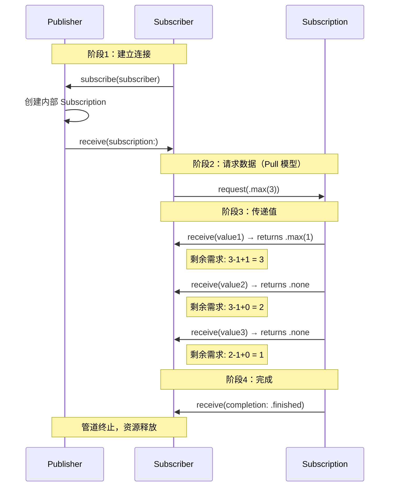

> **关键洞察**：Demand 是**累加式**的——`receive(_:)` 每消费一个值减少 1，但其返回值会**加回**到剩余需求中。这意味着 Subscriber 可以动态调整消费速率。

---

## 三、Publisher 内部机制深度解析

**核心结论：Publisher 本身是轻量的值类型描述，真正的工作发生在其内部创建的 Subscription 中。每次 `subscribe()` 调用都会创建一个全新的 Subscription 实例。**

### 3.1 内建 Publisher 实现分析

#### Just：同步单值发布

```swift
// ✅ iOS 13.0+
// Just 的简化实现原理

public struct Just<Output>: Publisher {
    public typealias Failure = Never
    
    public let output: Output
    
    public init(_ output: Output) {
        self.output = output
    }
    
    public func receive<S: Subscriber>(subscriber: S) 
        where S.Input == Output, S.Failure == Never 
    {
        // 创建内部 Subscription
        let subscription = JustSubscription(value: output, subscriber: subscriber)
        subscriber.receive(subscription: subscription)
    }
}

private final class JustSubscription<S: Subscriber>: Subscription 
    where S.Failure == Never 
{
    private var value: S.Input?
    private var subscriber: S?
    
    init(value: S.Input, subscriber: S) {
        self.value = value
        self.subscriber = subscriber
    }
    
    func request(_ demand: Subscribers.Demand) {
        guard demand > .none, let subscriber = subscriber, let value = value else { return }
        self.value = nil       // 只发送一次
        _ = subscriber.receive(value)
        subscriber.receive(completion: .finished)
        self.subscriber = nil  // 释放引用
    }
    
    func cancel() {
        subscriber = nil
        value = nil
    }
}
```

**关键点**：Just 在 `request(_:)` 中**同步**完成值发送和完成事件，不涉及异步调度。

#### Future：异步单值发布

```swift
// ✅ iOS 13.0+
// Future 的简化实现原理

public final class Future<Output, Failure: Error>: Publisher {
    public typealias Promise = (Result<Output, Failure>) -> Void
    
    private let attemptToFulfill: (@escaping Promise) -> Void
    private var result: Result<Output, Failure>?
    private let lock = NSLock()  // 线程安全
    
    public init(_ attemptToFulfill: @escaping (@escaping Promise) -> Void) {
        self.attemptToFulfill = attemptToFulfill
        // ⚠️ 重要：Future 在初始化时就立即执行闭包！
        attemptToFulfill { [weak self] result in
            self?.lock.lock()
            self?.result = result
            self?.lock.unlock()
            // 通知已有的订阅者...
        }
    }
    
    public func receive<S: Subscriber>(subscriber: S) 
        where S.Input == Output, S.Failure == Failure 
    {
        lock.lock()
        let currentResult = result
        lock.unlock()
        
        if let result = currentResult {
            // 已有结果，直接发送
            let subscription = FulfilledSubscription(result: result, subscriber: subscriber)
            subscriber.receive(subscription: subscription)
        } else {
            // 等待结果...注册等待订阅
            let subscription = PendingSubscription(subscriber: subscriber, future: self)
            subscriber.receive(subscription: subscription)
        }
    }
}
```

**关键点**：
- Future 是 `class`（引用类型），因为它需要持有异步回调的状态
- Promise 闭包在**初始化时立即执行**（不是订阅时），结果会被缓存
- 内部使用 `NSLock` 确保 `result` 的线程安全读写

#### Deferred：延迟创建

```swift
// ✅ iOS 13.0+
// Deferred 每次订阅都会重新执行工厂闭包

public struct Deferred<DeferredPublisher: Publisher>: Publisher {
    public typealias Output = DeferredPublisher.Output
    public typealias Failure = DeferredPublisher.Failure
    
    private let createPublisher: () -> DeferredPublisher
    
    public init(createPublisher: @escaping () -> DeferredPublisher) {
        self.createPublisher = createPublisher
    }
    
    public func receive<S: Subscriber>(subscriber: S) 
        where S.Input == Output, S.Failure == Failure 
    {
        // 每次订阅都创建新的 Publisher
        let publisher = createPublisher()
        publisher.receive(subscriber: subscriber)
    }
}

// 使用示例：每次订阅获取当前时间
let deferredTime = Deferred {
    Just(Date())
}
// 第一次订阅 → 时间 T1
// 第二次订阅 → 时间 T2（不同于 T1）
```

#### PassthroughSubject：多播实现

```swift
// ✅ iOS 13.0+
// PassthroughSubject 简化实现原理

public final class PassthroughSubject<Output, Failure: Error>: Subject {
    private let lock = NSRecursiveLock()
    private var subscriptions: [ConduitSubscription<Output, Failure>] = []
    private var completion: Subscribers.Completion<Failure>?
    
    public func receive<S: Subscriber>(subscriber: S) 
        where S.Input == Output, S.Failure == Failure 
    {
        lock.lock()
        defer { lock.unlock() }
        
        if let completion = completion {
            // 已经完成，立即通知新订阅者
            subscriber.receive(subscription: Subscriptions.empty)
            subscriber.receive(completion: completion)
        } else {
            // 创建 Conduit（管道），加入订阅列表
            let conduit = ConduitSubscription(parent: self, subscriber: AnySubscriber(subscriber))
            subscriptions.append(conduit)
            subscriber.receive(subscription: conduit)
        }
    }
    
    public func send(_ input: Output) {
        lock.lock()
        let currentSubs = subscriptions
        lock.unlock()
        
        // 多播：向所有活跃订阅者发送值
        for subscription in currentSubs {
            subscription.receive(input)
        }
    }
    
    public func send(completion: Subscribers.Completion<Failure>) {
        lock.lock()
        self.completion = completion
        let currentSubs = subscriptions
        subscriptions.removeAll()
        lock.unlock()
        
        for subscription in currentSubs {
            subscription.receive(completion: completion)
        }
    }
}
```

**关键点**：
- 内部维护 `[ConduitSubscription]` 数组实现**一对多**广播
- 使用 `NSRecursiveLock` 保护共享状态
- `send(completion:)` 后清空订阅列表，防止后续消息

#### CurrentValueSubject：带缓存的多播

```swift
// ✅ iOS 13.0+

public final class CurrentValueSubject<Output, Failure: Error>: Subject {
    private let lock = NSRecursiveLock()
    private var _value: Output
    
    /// value 属性是线程安全的
    public var value: Output {
        get {
            lock.lock()
            defer { lock.unlock() }
            return _value
        }
        set {
            // 设置 value 等同于调用 send()
            lock.lock()
            _value = newValue
            lock.unlock()
            send(newValue)
        }
    }
    
    public init(_ value: Output) {
        self._value = value
    }
    
    // receive(subscriber:) 实现中，新订阅者会立即收到当前 value
}

// 使用示例
let subject = CurrentValueSubject<Int, Never>(0)
subject.sink { print("收到: \($0)") }  // 立即输出: 收到: 0
subject.value = 42                      // 输出: 收到: 42
subject.send(100)                       // 输出: 收到: 100
print(subject.value)                    // 输出: 100
```

### 3.2 自定义 Publisher 完整实现：IntervalPublisher

**以下实现一个定时发送递增整数的 Publisher，完整展示 Publisher + Subscription 的协作模式。**

```swift
// ✅ iOS 13.0+ | Swift 5.1+
import Combine
import Foundation

// MARK: - IntervalPublisher：每隔指定时间发送递增整数
struct IntervalPublisher: Publisher {
    typealias Output = Int
    typealias Failure = Never
    
    let interval: TimeInterval
    let scheduler: DispatchQueue
    
    init(interval: TimeInterval, scheduler: DispatchQueue = .global()) {
        self.interval = interval
        self.scheduler = scheduler
    }
    
    func receive<S: Subscriber>(subscriber: S) 
        where S.Input == Int, S.Failure == Never 
    {
        let subscription = IntervalSubscription(
            subscriber: subscriber,
            interval: interval,
            scheduler: scheduler
        )
        subscriber.receive(subscription: subscription)
    }
}

// MARK: - 内部 Subscription
private final class IntervalSubscription<S: Subscriber>: Subscription 
    where S.Input == Int, S.Failure == Never 
{
    private var subscriber: S?
    private var counter: Int = 0
    private var demand: Subscribers.Demand = .none
    private var timer: DispatchSourceTimer?
    private let interval: TimeInterval
    private let scheduler: DispatchQueue
    private let lock = NSLock()
    
    init(subscriber: S, interval: TimeInterval, scheduler: DispatchQueue) {
        self.subscriber = subscriber
        self.interval = interval
        self.scheduler = scheduler
    }
    
    func request(_ demand: Subscribers.Demand) {
        lock.lock()
        
        // 累加需求
        self.demand += demand
        
        // 如果 timer 尚未创建，启动定时器
        if timer == nil && self.demand > .none {
            let timer = DispatchSource.makeTimerSource(queue: scheduler)
            timer.schedule(
                deadline: .now() + interval, 
                repeating: interval
            )
            timer.setEventHandler { [weak self] in
                self?.tick()
            }
            self.timer = timer
            lock.unlock()
            timer.resume()
        } else {
            lock.unlock()
        }
    }
    
    private func tick() {
        lock.lock()
        
        guard let subscriber = subscriber, demand > .none else {
            lock.unlock()
            return
        }
        
        // 消耗一个需求
        demand -= 1
        let value = counter
        counter += 1
        lock.unlock()
        
        // 发送值并获取额外需求
        let additionalDemand = subscriber.receive(value)
        
        lock.lock()
        demand += additionalDemand
        lock.unlock()
    }
    
    func cancel() {
        lock.lock()
        timer?.cancel()
        timer = nil
        subscriber = nil
        lock.unlock()
    }
    
    deinit {
        timer?.cancel()
    }
}

// MARK: - 使用示例
var cancellables = Set<AnyCancellable>()

IntervalPublisher(interval: 1.0, scheduler: .main)
    .prefix(5)  // 只取前 5 个值
    .sink { value in
        print("第 \(value) 秒")  // 输出: 第 0 秒, 第 1 秒, ... 第 4 秒
    }
    .store(in: &cancellables)
```

**关键设计要点**：

| 要点 | 说明 |
|------|------|
| Subscriber 引用 | `subscriber` 属性在 `cancel()` 时置 nil，打破引用循环 |
| 线程安全 | `NSLock` 保护 `demand`、`counter`、`subscriber` 等共享状态 |
| 弱引用回调 | timer 的 eventHandler 使用 `[weak self]` 避免循环引用 |
| Demand 累加 | `request(_:)` 中累加需求，`tick()` 中消耗并获取额外需求 |
| 取消处理 | `cancel()` 停止 timer 并释放 subscriber 引用 |

---

## 四、Subscriber 与 Subscription 机制

**核心结论：Subscription 是 Combine 管道的"中枢神经"——它既是上游产生值的触发器（Subscriber 调用 `request`），也是值到达下游的传送带，还是取消操作的执行者。**

### 4.1 Subscription 生命周期

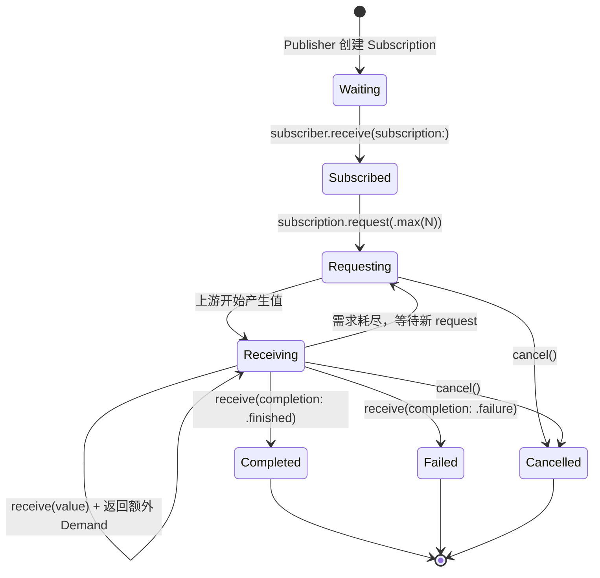

### 4.2 Demand 需求模型

**核心结论：Demand 是 Combine 背压机制的基础。它是一个非负整数（或 unlimited），采用累加语义——永远不会减少，只能增加。**

```swift
// ✅ iOS 13.0+

// Subscribers.Demand 的三种形式
let none: Subscribers.Demand = .none          // 不请求新值（等价于 .max(0)）
let limited: Subscribers.Demand = .max(5)     // 请求最多 5 个值
let unlimited: Subscribers.Demand = .unlimited // 请求无限个值

// Demand 的累加语义
var demand: Subscribers.Demand = .max(3)
demand += .max(2)    // 现在是 .max(5)
demand += .unlimited // 现在是 .unlimited（一旦 unlimited 不可逆）

// ⚠️ Demand 永远 >= 0
// .max(0) 和 .none 等价
// 不能创建负数 Demand
```

**需求累加机制详解**：

```swift
// ✅ iOS 13.0+
// 自定义 Subscriber 演示 Demand 累加

final class CountingSubscriber: Subscriber {
    typealias Input = Int
    typealias Failure = Never
    
    private var subscription: Subscription?
    private var receivedCount = 0
    
    func receive(subscription: Subscription) {
        self.subscription = subscription
        // 初始请求 3 个值
        subscription.request(.max(3))
        print("📤 初始请求: .max(3)")
    }
    
    func receive(_ input: Int) -> Subscribers.Demand {
        receivedCount += 1
        print("📥 收到值: \(input), 已收到 \(receivedCount) 个")
        
        // 每收到一个值，额外请求 1 个
        // 效果：剩余需求 = 原剩余 - 1（消费） + 1（新增） = 恒定
        // 这实际上实现了"滑动窗口"效果
        if receivedCount < 10 {
            return .max(1)  // 额外请求 1 个
        } else {
            return .none    // 达到上限，不再请求
        }
    }
    
    func receive(completion: Subscribers.Completion<Never>) {
        print("✅ 完成: \(completion)")
    }
}

// 使用
let publisher = (1...100).publisher
let subscriber = CountingSubscriber()
publisher.subscribe(subscriber)
// 输出前 10 个值后停止（Demand 耗尽）
```

### 4.3 Cancellation 机制

**核心结论：取消是 Combine 生命周期管理的核心手段。AnyCancellable 的 deinit 自动取消机制是防止内存泄漏的关键安全网。**

#### AnyCancellable 的自动取消

```swift
// ✅ iOS 13.0+

// AnyCancellable 内部实现原理
public final class AnyCancellable: Cancellable, Hashable {
    private var _cancel: (() -> Void)?
    
    public init(_ cancel: @escaping () -> Void) {
        self._cancel = cancel
    }
    
    public init<C: Cancellable>(_ cancellable: C) {
        self._cancel = cancellable.cancel
    }
    
    public func cancel() {
        _cancel?()
        _cancel = nil  // 确保只取消一次
    }
    
    // ⚠️ 关键：deinit 时自动调用 cancel()
    deinit {
        cancel()
    }
}
```

#### Set\<AnyCancellable\> 批量管理

```swift
// ✅ iOS 13.0+

class MyViewModel {
    private var cancellables = Set<AnyCancellable>()
    
    func bind() {
        // 多个订阅统一管理
        networkPublisher
            .sink { [weak self] data in self?.handleData(data) }
            .store(in: &cancellables)
        
        timerPublisher
            .sink { [weak self] _ in self?.refresh() }
            .store(in: &cancellables)
    }
    
    func unbindAll() {
        // 方式 1：手动取消所有
        cancellables.forEach { $0.cancel() }
        
        // 方式 2：清空集合（deinit 触发自动取消）
        cancellables.removeAll()
    }
    
    // ViewModel deinit 时，cancellables 被释放
    // → 每个 AnyCancellable deinit → 自动 cancel()
    // → 整个订阅链自动清理
}
```

#### 取消的传播链

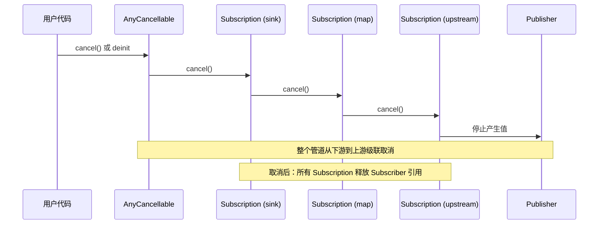

**取消后的行为保证**：

```swift
// ✅ iOS 13.0+
// 取消后不再接收任何事件

let subject = PassthroughSubject<Int, Never>()
let cancellable = subject.sink { value in
    print("收到: \(value)")
}

subject.send(1)       // 输出: 收到: 1
subject.send(2)       // 输出: 收到: 2
cancellable.cancel()  // 取消订阅
subject.send(3)       // ❌ 无输出——已取消
subject.send(4)       // ❌ 无输出——已取消
```

---

## 五、背压处理（Backpressure）深度解析

**核心结论：背压是响应式编程中生产者速度超过消费者速度时的流控手段。Combine 采用基于 Demand 的 Pull 模型，从根本上避免了无限缓冲的问题。**

### 5.1 什么是背压

```
生产者 ──── 100 个值/秒 ────→ ┌──────────┐ ────→ 消费者（10 个值/秒）
                              │  缓冲区   │
                              │ 不断增长！ │  ← 如果没有背压控制
                              └──────────┘     → 内存溢出
```

**背压场景**：传感器高频数据、网络流、用户输入事件流等生产速率远大于消费速率的场景。

### 5.2 Pull vs Push 模型对比

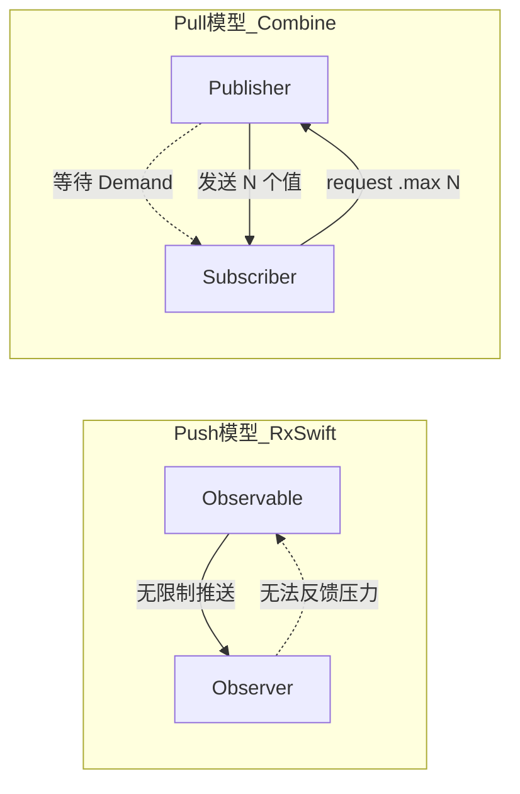

| 对比维度 | Push 模型（RxSwift） | Pull 模型（Combine） |
|----------|---------------------|---------------------|
| 流控方向 | 生产者驱动 | 消费者驱动 |
| 缓冲风险 | 高（需要额外 buffer/throttle） | 低（天然受 Demand 约束） |
| 实现复杂度 | 简单（直接推送） | 较高（需管理 Demand 状态） |
| 适用场景 | UI 事件等低频场景 | 高频数据流、网络流 |
| 内存安全 | 需手动管理 | 框架层面保障 |

### 5.3 背压策略实现

#### buffer 操作符

```swift
// ✅ iOS 13.0+

// buffer(size:prefetch:whenFull:)
// size: 缓冲区大小
// prefetch: 预取策略（.byRequest / .keepFull）
// whenFull: 缓冲区满时的策略

let highFreqPublisher = Timer.publish(every: 0.01, on: .main, in: .common)
    .autoconnect()

highFreqPublisher
    .buffer(size: 50, prefetch: .keepFull, whenFull: .dropNewest)
    // .dropNewest — 丢弃最新值（保留旧数据）
    // .dropOldest — 丢弃最旧值（保留新数据）
    // .customError — 缓冲区满时发送自定义错误
    .sink { timestamp in
        // 慢速消费者
        Thread.sleep(forTimeInterval: 0.1)
        print("处理: \(timestamp)")
    }
    .store(in: &cancellables)
```

#### 时间维度的背压

```swift
// ✅ iOS 13.0+

// throttle：固定时间间隔取样（取首/取末）
searchTextField.publisher
    .throttle(for: .milliseconds(300), scheduler: RunLoop.main, latest: true)
    // 每 300ms 取最新值，中间值全部丢弃
    .sink { text in
        performSearch(text)
    }

// debounce：等待静默期后发送
searchTextField.publisher
    .debounce(for: .milliseconds(500), scheduler: RunLoop.main)
    // 用户停止输入 500ms 后才发送最后一个值
    .sink { text in
        performSearch(text)
    }

// collect(.byTime)：按时间窗口批量收集
sensorPublisher
    .collect(.byTime(DispatchQueue.main, .seconds(1)))
    // 每 1 秒收集一批值，作为数组发送
    .sink { batch in
        print("本秒收到 \(batch.count) 个采样值")
        processBatch(batch)
    }
```

#### 实战：高频传感器数据处理

```swift
// ✅ iOS 13.0+
import Combine
import CoreMotion

class SensorDataProcessor {
    private let motionManager = CMMotionManager()
    private var cancellables = Set<AnyCancellable>()
    
    // 传感器采样率: 100Hz（每 0.01 秒一个数据点）
    // UI 刷新率: 60Hz
    // 数据库写入: 约 10 次/秒
    
    func startProcessing() {
        let sensorPublisher = createAccelerometerPublisher()
        
        // 策略 1：UI 展示 — throttle 降频到 60fps
        sensorPublisher
            .throttle(for: .milliseconds(16), scheduler: DispatchQueue.main, latest: true)
            .receive(on: DispatchQueue.main)
            .sink { [weak self] data in
                self?.updateUI(with: data)
            }
            .store(in: &cancellables)
        
        // 策略 2：数据库存储 — collect 批量写入
        sensorPublisher
            .collect(.byTime(DispatchQueue.global(), .milliseconds(100)))
            .sink { [weak self] batch in
                self?.batchSaveToDB(batch)  // 每 100ms 批量写入
            }
            .store(in: &cancellables)
        
        // 策略 3：异常检测 — buffer + 滑动窗口分析
        sensorPublisher
            .buffer(size: 200, prefetch: .keepFull, whenFull: .dropOldest)
            .collect(50)  // 每 50 个一组分析
            .sink { [weak self] window in
                self?.analyzeAnomalies(window)
            }
            .store(in: &cancellables)
    }
}
```

### 5.4 自定义背压处理

```swift
// ✅ iOS 13.0+
// 实现速率控制 Subscriber：每处理完一个值后延迟再请求下一个

final class ThrottledSubscriber<Input>: Subscriber {
    typealias Failure = Never
    
    private var subscription: Subscription?
    private let receiveValue: (Input) -> Void
    private let delay: TimeInterval
    private let queue: DispatchQueue
    
    init(delay: TimeInterval, 
         queue: DispatchQueue = .main,
         receiveValue: @escaping (Input) -> Void) {
        self.delay = delay
        self.queue = queue
        self.receiveValue = receiveValue
    }
    
    func receive(subscription: Subscription) {
        self.subscription = subscription
        // 初始只请求 1 个值
        subscription.request(.max(1))
    }
    
    func receive(_ input: Input) -> Subscribers.Demand {
        receiveValue(input)
        
        // 处理完后延迟请求下一个
        queue.asyncAfter(deadline: .now() + delay) { [weak self] in
            self?.subscription?.request(.max(1))
        }
        
        // 当前不增加额外需求（延迟后再请求）
        return .none
    }
    
    func receive(completion: Subscribers.Completion<Never>) {
        subscription = nil
        print("流完成: \(completion)")
    }
    
    func cancel() {
        subscription?.cancel()
        subscription = nil
    }
}

// 使用：每隔 0.5 秒处理一个值
let subscriber = ThrottledSubscriber<Int>(delay: 0.5) { value in
    print("处理: \(value)")
}
(1...100).publisher.subscribe(subscriber)
```

---

## 六、线程调度机制

**核心结论：Combine 通过 Scheduler 协议抽象线程调度。`subscribe(on:)` 和 `receive(on:)` 分别控制上游和下游的执行线程，是管道中最常被误解的两个操作符。**

### 6.1 Scheduler 协议

```swift
// ✅ iOS 13.0+

public protocol Scheduler {
    associatedtype SchedulerTimeType: Strideable 
        where SchedulerTimeType.Stride: SchedulerTimeIntervalConvertible
    associatedtype SchedulerOptions
    
    /// 当前时间
    var now: SchedulerTimeType { get }
    
    /// 最小容差
    var minimumTolerance: SchedulerTimeType.Stride { get }
    
    /// 立即调度
    func schedule(options: SchedulerOptions?, _ action: @escaping () -> Void)
    
    /// 延迟调度
    func schedule(after date: SchedulerTimeType, 
                  tolerance: SchedulerTimeType.Stride,
                  options: SchedulerOptions?, 
                  _ action: @escaping () -> Void)
    
    /// 周期调度
    func schedule(after date: SchedulerTimeType, 
                  interval: SchedulerTimeType.Stride,
                  tolerance: SchedulerTimeType.Stride,
                  options: SchedulerOptions?, 
                  _ action: @escaping () -> Void) -> Cancellable
}
```

**内建 Scheduler 对比**：

| Scheduler | 时间类型 | 适用场景 | 注意事项 |
|-----------|----------|----------|----------|
| `DispatchQueue` | `DispatchQueue.SchedulerTimeType` | 大多数异步操作 | `.main` 用于 UI 更新 |
| `RunLoop` | `RunLoop.SchedulerTimeType` | Timer 相关、UIKit 集成 | 必须在有 RunLoop 的线程使用 |
| `OperationQueue` | `OperationQueue.SchedulerTimeType` | 需要并发控制 | 可设置 `maxConcurrentOperationCount` |
| `ImmediateScheduler` | `ImmediateScheduler.SchedulerTimeType` | 测试、同步执行 | 不进行线程切换，立即执行 |

### 6.2 receive(on:) vs subscribe(on:) 的区别

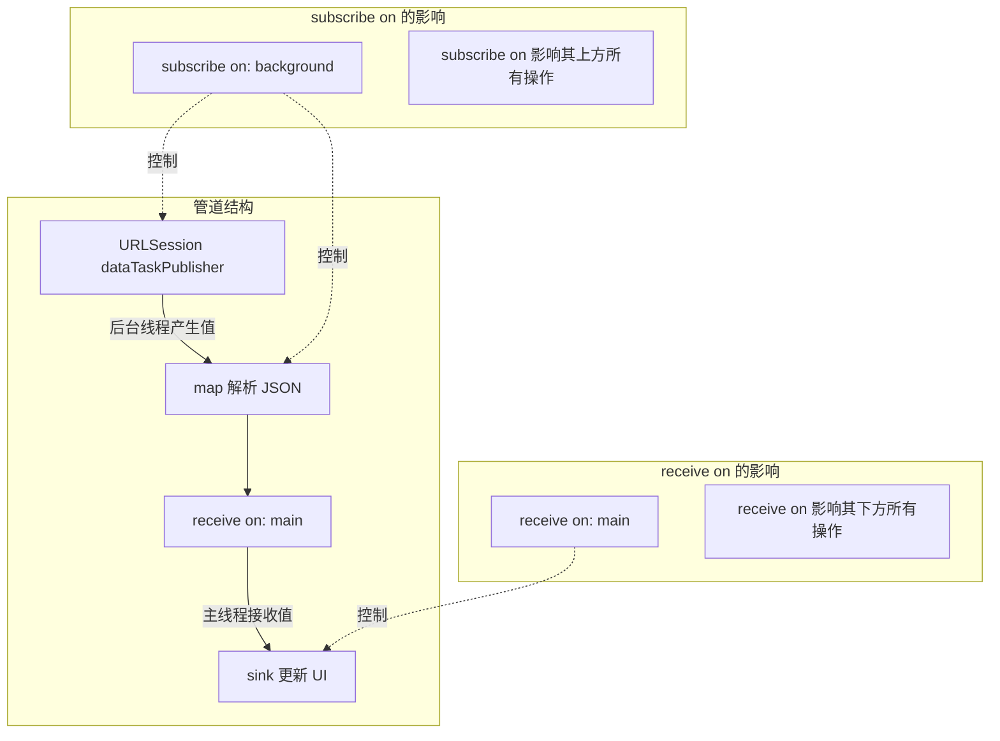

**关键区别**：

| 操作符 | 影响方向 | 作用 |
|--------|----------|------|
| `subscribe(on:)` | **向上**（影响上游） | 控制订阅发生的线程、上游值产生的线程 |
| `receive(on:)` | **向下**（影响下游） | 控制下游接收值的线程 |

#### 代码验证

```swift
// ✅ iOS 13.0+

let publisher = [1, 2, 3].publisher

publisher
    .print("🔵 上游")
    .subscribe(on: DispatchQueue.global(qos: .background))
    .handleEvents(
        receiveOutput: { _ in 
            print("📍 subscribe(on:) 后的线程: \(Thread.current)") 
        }
    )
    .receive(on: DispatchQueue.main)
    .handleEvents(
        receiveOutput: { _ in 
            print("📍 receive(on:) 后的线程: \(Thread.current)") 
        }
    )
    .sink { value in
        print("📍 sink 中的线程: \(Thread.current)")
        print("收到值: \(value)")
    }
    .store(in: &cancellables)

/* 典型输出:
🔵 上游: receive subscription: ([1, 2, 3])
🔵 上游: request unlimited
🔵 上游: receive value: (1)
📍 subscribe(on:) 后的线程: <NSThread: 0x...>{number = 5, name = (null)}  // 后台线程
📍 receive(on:) 后的线程: <NSThread: 0x...>{number = 1, name = main}     // 主线程
📍 sink 中的线程: <NSThread: 0x...>{number = 1, name = main}             // 主线程
收到值: 1
...
*/
```

### 6.3 线程安全保证

**核心结论：Combine 保证同一个 Subscription 上的值是串行传递的（serial access guarantee），但这不意味着整个管道是线程安全的——Subject 的多线程 `send()` 需要额外注意。**

```swift
// ✅ iOS 13.0+ 

// ✅ 安全：Combine 保证值的串行传递
// 即使 subscribe(on:) 和 receive(on:) 切换了线程
// 同一个 subscription 上不会出现并发调用 receive(_:)

// ⚠️ 需要注意的场景：Subject 多线程 send
let subject = PassthroughSubject<Int, Never>()

// 多线程并发 send — Subject 内部使用锁保护
DispatchQueue.concurrentPerform(iterations: 100) { i in
    subject.send(i)  // ✅ PassthroughSubject.send() 是线程安全的
}

// ⚠️ 自定义 Publisher 的线程安全要求
// 如果自定义 Publisher 可能从多个线程接收事件
// 必须在 Subscription 内部使用同步机制（如 NSLock）
// 保证对 subscriber 的调用是串行的
```

**自定义 Publisher 线程安全检查清单**：

| 检查项 | 要求 |
|--------|------|
| Subscription 的 `request(_:)` | 可能从任意线程调用，必须线程安全 |
| Subscription 的 `cancel()` | 可能从任意线程调用，必须线程安全 |
| 对 Subscriber 的调用 | 必须串行（不能并发调用 `receive(_:)`） |
| 共享状态（demand、counter 等） | 必须用锁或原子操作保护 |
| cancel 后的行为 | 不再调用 Subscriber 的任何方法 |

---

## 七、操作符内部实现原理

**核心结论：每个操作符本质上是一个"中间人"——它是上游的 Subscriber，同时也是下游的 Publisher。操作符通过创建内部 Subscription 桥接上下游。**

### 7.1 操作符的工作模式

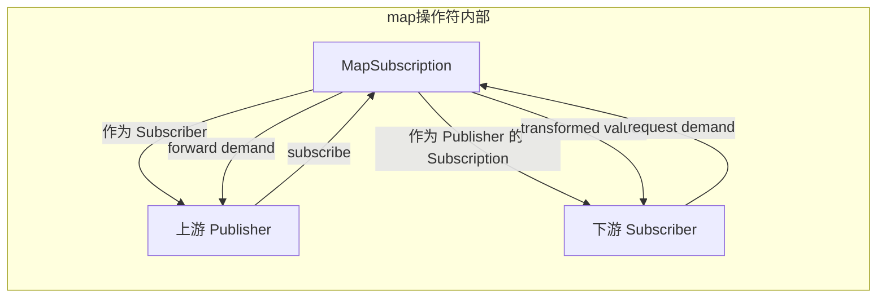

### 7.2 map 操作符的完整实现

```swift
// ✅ iOS 13.0+
// 模拟 Apple 内部 Publishers.Map 实现

extension Publishers {
    struct MyMap<Upstream: Publisher, Output>: Publisher {
        typealias Failure = Upstream.Failure
        
        let upstream: Upstream
        let transform: (Upstream.Output) -> Output
        
        func receive<S: Subscriber>(subscriber: S) 
            where S.Input == Output, S.Failure == Failure 
        {
            // 创建内部 Subscription，连接上下游
            let mapSubscription = MapSubscription(
                subscriber: subscriber,
                transform: transform
            )
            // 向上游订阅（mapSubscription 作为上游的 Subscriber）
            upstream.receive(subscriber: mapSubscription)
        }
    }
}

// 内部 Subscription：同时扮演 Subscriber（面向上游）和 Subscription（面向下游）
private final class MapSubscription<S: Subscriber, Input>: Subscriber, Subscription {
    typealias Failure = S.Failure
    
    private var subscriber: S?
    private var upstreamSubscription: Subscription?
    private let transform: (Input) -> S.Input
    
    init(subscriber: S, transform: @escaping (Input) -> S.Input) {
        self.subscriber = subscriber
        self.transform = transform
    }
    
    // MARK: - Subscriber 协议（面向上游）
    
    func receive(subscription: Subscription) {
        upstreamSubscription = subscription
        // 将自身作为 Subscription 传给下游 Subscriber
        subscriber?.receive(subscription: self)
    }
    
    func receive(_ input: Input) -> Subscribers.Demand {
        guard let subscriber = subscriber else { return .none }
        // 变换值后传给下游
        let transformedValue = transform(input)
        return subscriber.receive(transformedValue)
        // 直接返回下游的 Demand → 透传给上游
    }
    
    func receive(completion: Subscribers.Completion<Failure>) {
        subscriber?.receive(completion: completion)
        cleanup()
    }
    
    // MARK: - Subscription 协议（面向下游）
    
    func request(_ demand: Subscribers.Demand) {
        // Demand 透传：下游要多少，向上游要多少
        upstreamSubscription?.request(demand)
    }
    
    func cancel() {
        upstreamSubscription?.cancel()
        cleanup()
    }
    
    private func cleanup() {
        subscriber = nil
        upstreamSubscription = nil
    }
}

// 添加便捷方法
extension Publisher {
    func myMap<T>(_ transform: @escaping (Output) -> T) -> Publishers.MyMap<Self, T> {
        Publishers.MyMap(upstream: self, transform: transform)
    }
}

// 验证
[1, 2, 3].publisher
    .myMap { $0 * 10 }
    .sink { print($0) }  // 输出: 10, 20, 30
    .store(in: &cancellables)
```

### 7.3 flatMap 的复杂性

**核心结论：`flatMap` 是最复杂的操作符之一——它需要管理多个内部 Subscription，处理并发控制，并在所有上游完成后才能完成。**

```swift
// ✅ iOS 13.0+
// flatMap 内部机制示意（简化）

// flatMap 的签名
// func flatMap<T: Publisher>(maxPublishers: Subscribers.Demand = .unlimited,
//                            _ transform: @escaping (Output) -> T) -> Publishers.FlatMap<T, Self>

// 内部实现要点：
// 1. 外部上游每发送一个值 → transform 创建一个新的内部 Publisher
// 2. 新的内部 Publisher 被订阅，其值传递给下游
// 3. maxPublishers 控制同时活跃的内部 Publisher 数量
```

**flatMap 内部结构**：

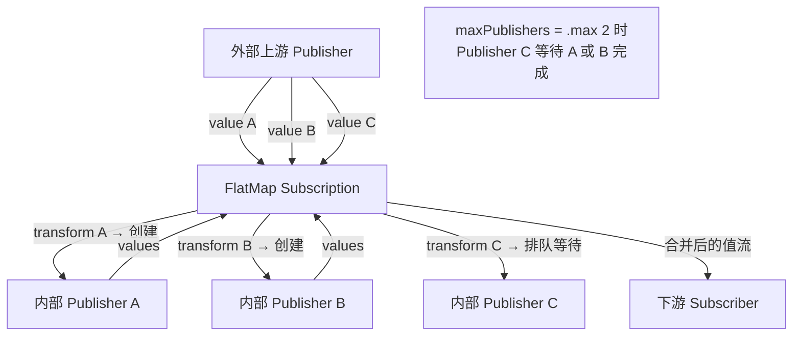

```swift
// ✅ iOS 13.0+
// flatMap 并发控制示例

let urls = ["url1", "url2", "url3", "url4", "url5"].publisher

urls
    .flatMap(maxPublishers: .max(2)) { url -> URLSession.DataTaskPublisher in
        // 同时最多只有 2 个网络请求在执行
        URLSession.shared.dataTaskPublisher(for: URL(string: url)!)
    }
    .sink(
        receiveCompletion: { _ in },
        receiveValue: { data, response in
            print("收到响应: \(response.url?.absoluteString ?? "")")
        }
    )
    .store(in: &cancellables)

// 内存管理要点：
// - 外部上游完成后，FlatMap 不会立即完成
// - 必须等所有内部 Publisher 也完成
// - 每个内部 Publisher 完成后，其 Subscription 被释放
// - 所有内部 Publisher 完成 + 外部上游完成 → flatMap 发送 completion
```

### 7.4 combineLatest 的实现思路

```swift
// ✅ iOS 13.0+
// combineLatest 内部机制示意

// 核心思路：
// 1. 分别订阅两个上游
// 2. 维护各自的"最新值"缓存
// 3. 只有两个上游都至少发送过一个值后，才开始向下游输出
// 4. 之后任一上游发送新值，都与另一上游的最新值组合输出

/*
 内部状态管理：
 ┌─────────────────────────────────────────────┐
 │ CombineLatest Subscription                   │
 │                                               │
 │  latestA: Output1? = nil  (上游 A 的最新值)    │
 │  latestB: Output2? = nil  (上游 B 的最新值)    │
 │  completedA: Bool = false                     │
 │  completedB: Bool = false                     │
 │                                               │
 │  当 latestA != nil && latestB != nil 时       │
 │  → 向下游发送 (latestA!, latestB!)            │
 │                                               │
 │  当 completedA && completedB 时               │
 │  → 向下游发送 completion(.finished)            │
 └─────────────────────────────────────────────┘
*/

// 使用示例
let publisherA = PassthroughSubject<String, Never>()
let publisherB = PassthroughSubject<Int, Never>()

publisherA.combineLatest(publisherB)
    .sink { string, number in
        print("\(string) - \(number)")
    }
    .store(in: &cancellables)

publisherA.send("A")     // 无输出（B 还没有值）
publisherB.send(1)        // 输出: A - 1
publisherA.send("B")     // 输出: B - 1
publisherB.send(2)        // 输出: B - 2
```

---

## 八、错误处理机制

**核心结论：Combine 的错误处理是类型安全的——Failure 类型在编译期确定，上下游 Failure 必须匹配。错误一旦发生，整个管道终止，这与 RxSwift 的行为一致。**

### 8.1 Failure 类型系统

```swift
// ✅ iOS 13.0+

// Never 类型：表示永远不会失败
let justPublisher: Just<Int> = Just(42)
// Just<Int> 的 Failure 类型是 Never

// 类型约束：上下游 Failure 必须匹配
let urlPublisher: URLSession.DataTaskPublisher  // Failure = URLError
let jsonPublisher = urlPublisher
    .map(\.data)             // Failure 保持 URLError
    // .decode(...)          // Failure 变为 Error（更宽泛）

// setFailureType(to:)：将 Never 转换为具体错误类型
let neverFails: Just<Int> = Just(42)  // Failure = Never
let canFail: Publishers.SetFailureType<Just<Int>, URLError> = 
    neverFails.setFailureType(to: URLError.self)  // Failure = URLError

// 典型用途：让 Never 类型的 Publisher 与有错误类型的 Publisher 组合
Just(defaultURL)
    .setFailureType(to: URLError.self)
    .flatMap { url in
        URLSession.shared.dataTaskPublisher(for: url)
    }
    .sink(
        receiveCompletion: { completion in
            switch completion {
            case .finished: print("完成")
            case .failure(let error): print("错误: \(error)")
            }
        },
        receiveValue: { data, response in
            print("收到数据: \(data.count) bytes")
        }
    )
    .store(in: &cancellables)
```

### 8.2 错误传播路径

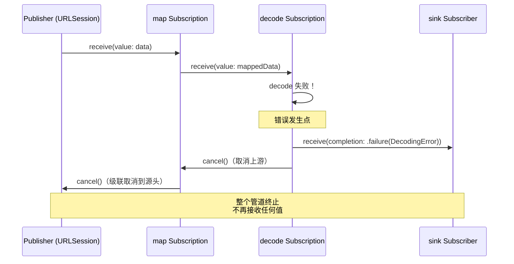

**错误传播规则**：

| 阶段 | 行为 |
|------|------|
| 错误发生 | 当前操作符停止处理 |
| 向下传播 | 向下游发送 `completion(.failure(error))` |
| 向上取消 | 取消所有上游 Subscription |
| 终止保证 | 管道不可恢复，必须重新订阅 |
| 后续值 | 不再接收或传递任何值 |

### 8.3 错误恢复操作符

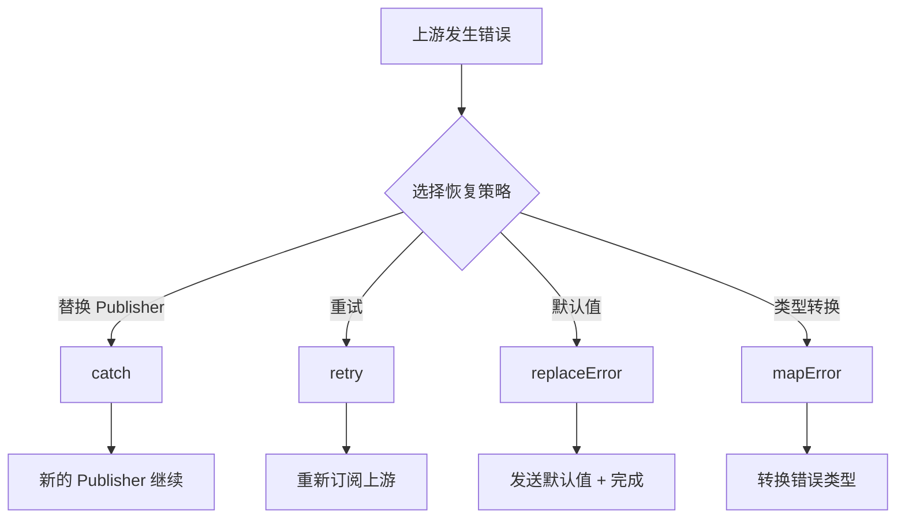

#### catch：替换为新 Publisher

```swift
// ✅ iOS 13.0+

struct NetworkError: Error {
    let message: String
}

func fetchFromNetwork() -> AnyPublisher<Data, NetworkError> {
    // 网络请求...
    Fail(error: NetworkError(message: "连接超时"))
        .eraseToAnyPublisher()
}

func loadFromCache() -> AnyPublisher<Data, Never> {
    Just(Data("cached".utf8))
        .eraseToAnyPublisher()
}

fetchFromNetwork()
    .catch { error -> AnyPublisher<Data, Never> in
        print("网络错误: \(error.message)，使用缓存")
        return loadFromCache()
        // catch 将错误替换为新的 Publisher
        // 新 Publisher 的 Failure 可以是 Never（降级）
    }
    .sink { data in
        print("数据: \(String(data: data, encoding: .utf8) ?? "")")
    }
    .store(in: &cancellables)
```

#### retry：重新订阅上游

```swift
// ✅ iOS 13.0+

var attemptCount = 0

let unreliablePublisher = Deferred {
    Future<String, Error> { promise in
        attemptCount += 1
        print("尝试第 \(attemptCount) 次...")
        
        if attemptCount < 3 {
            promise(.failure(NSError(domain: "", code: -1)))
        } else {
            promise(.success("成功！"))
        }
    }
}

unreliablePublisher
    .retry(3)  // 最多重试 3 次（总共尝试 4 次）
    // retry 的工作原理：
    // 1. 收到 .failure → 重新调用上游的 subscribe()
    // 2. 因为用了 Deferred，每次重新订阅会执行新的 Future
    // 3. 重试次数耗尽仍然失败 → 将最后的错误传递给下游
    .sink(
        receiveCompletion: { print("完成: \($0)") },
        receiveValue: { print("值: \($0)") }
    )
    .store(in: &cancellables)

/* 输出:
尝试第 1 次...
尝试第 2 次...
尝试第 3 次...
值: 成功！
完成: finished
*/
```

#### replaceError：替换为默认值

```swift
// ✅ iOS 13.0+

URLSession.shared.dataTaskPublisher(for: someURL)
    .map(\.data)
    .decode(type: UserProfile.self, decoder: JSONDecoder())
    .replaceError(with: UserProfile.defaultProfile)
    // replaceError 做两件事：
    // 1. 将错误替换为指定的默认值
    // 2. 立即发送 .finished
    // 3. Failure 类型变为 Never
    .sink { profile in
        updateUI(with: profile)
    }
    .store(in: &cancellables)
```

#### 组合错误处理策略

```swift
// ✅ iOS 13.0+
// 实战：网络请求的完整错误处理链

func fetchUserProfile(id: String) -> AnyPublisher<UserProfile, Never> {
    let url = URL(string: "https://api.example.com/users/\(id)")!
    
    return URLSession.shared.dataTaskPublisher(for: url)
        .mapError { urlError -> AppError in
            // 1. 转换错误类型
            .network(urlError)
        }
        .flatMap { data, response -> AnyPublisher<Data, AppError> in
            // 2. 验证 HTTP 状态码
            guard let httpResponse = response as? HTTPURLResponse,
                  (200...299).contains(httpResponse.statusCode) else {
                return Fail(error: AppError.invalidResponse)
                    .eraseToAnyPublisher()
            }
            return Just(data)
                .setFailureType(to: AppError.self)
                .eraseToAnyPublisher()
        }
        .decode(type: UserProfile.self, decoder: JSONDecoder())
        .mapError { _ in AppError.decodingFailed }
        .retry(2)  // 3. 失败时重试 2 次
        .catch { error -> Just<UserProfile> in
            // 4. 最终兜底：返回默认 Profile
            print("所有尝试失败: \(error)")
            return Just(.defaultProfile)
        }
        .eraseToAnyPublisher()
}
```

---

## 九、与底层运行时的交互

**核心结论：Combine 深度集成了 Apple 的底层运行时基础设施——GCD 提供线程调度能力，RunLoop 提供 Timer 集成，而引用计数（ARC）则是生命周期管理的根基。**

### 9.1 GCD 集成

```swift
// ✅ iOS 13.0+

// DispatchQueue 遵循 Scheduler 协议
// Combine 的线程切换本质上是 GCD 的 dispatch_async

// receive(on:) 内部简化实现：
// func receive(on scheduler: S) {
//     scheduler.schedule {
//         downstream.receive(value)
//     }
// }
// 等价于：
// DispatchQueue.main.async {
//     downstream.receive(value)
// }

// subscribe(on:) 内部简化实现：
// 将 upstream.subscribe() 调度到指定队列
// scheduler.schedule {
//     upstream.receive(subscriber: downstream)
// }

// 实际使用
URLSession.shared.dataTaskPublisher(for: url)
    .subscribe(on: DispatchQueue.global(qos: .userInitiated))
    // 等价于在 .userInitiated 队列发起网络请求
    .receive(on: DispatchQueue.main)
    // 等价于在主队列接收结果
    .sink { ... }
```

### 9.2 RunLoop 集成

```swift
// ✅ iOS 13.0+

// Timer.publish 基于 RunLoop
let timerPublisher = Timer.publish(every: 1.0, on: .main, in: .common)
    .autoconnect()
// 内部实现：创建 NSTimer 并添加到指定 RunLoop

// RunLoop 作为 Scheduler
// ⚠️ RunLoop.main 只在主线程有效
somePublisher
    .receive(on: RunLoop.main)
    .sink { value in
        // 在主线程的 RunLoop 中执行
        // 与 DispatchQueue.main 的区别：
        // - RunLoop.main 在 RunLoop 迭代中执行
        // - DispatchQueue.main 通过 GCD 调度执行
        // - 对于 UI 更新，两者效果基本一致
        // - Timer 相关场景推荐 RunLoop
    }

// RunLoop 的局限性
// ❌ 后台线程默认没有 RunLoop
// ❌ 子线程使用 RunLoop 需要手动创建和运行
// 推荐：大多数场景使用 DispatchQueue，Timer 场景使用 RunLoop
```

### 9.3 内存管理

**核心结论：Combine 管道的内存管理基于 ARC。Subscription 是管道中的强引用锚点，AnyCancellable 是用户侧的生命周期控制器。理解引用关系图是避免内存泄漏的关键。**

#### 订阅生命周期中的引用关系

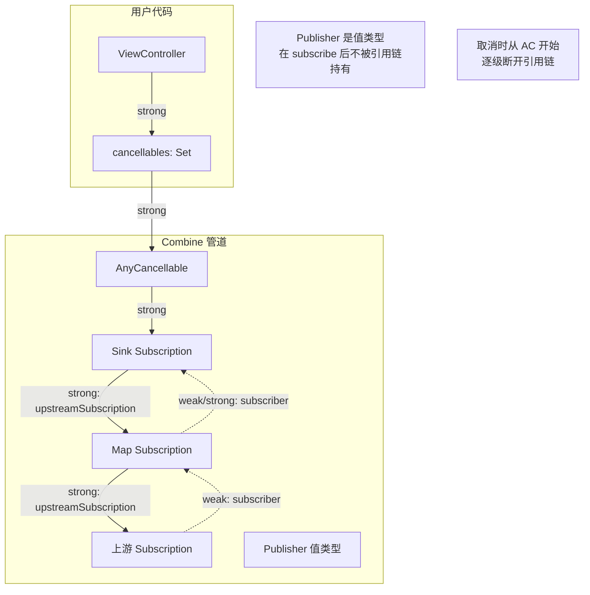

#### 引用关系详解

| 引用方向 | 引用类型 | 说明 |
|----------|----------|------|
| AnyCancellable → Subscription | **强引用** | 保持管道存活 |
| Subscription → 上游 Subscription | **强引用** | 保持上游存活 |
| Subscription → 下游 Subscriber | **视实现而定** | 通常在 cancel/completion 后置 nil |
| ViewController → Set\<AnyCancellable\> | **强引用** | 生命周期绑定 |

#### 常见内存泄漏场景与防范

```swift
// ✅ iOS 13.0+

// ⚠️ 场景 1：忘记存储 AnyCancellable
class BadViewModel {
    func bind() {
        publisher.sink { value in  // 返回的 AnyCancellable 被丢弃
            self.update(value)     // AnyCancellable 立即 deinit → 订阅被取消
        }
        // ❌ 这个订阅会立即被取消！不会收到任何值
    }
}

// ✅ 正确做法
class GoodViewModel {
    private var cancellables = Set<AnyCancellable>()
    
    func bind() {
        publisher.sink { [weak self] value in
            self?.update(value)
        }
        .store(in: &cancellables)  // ✅ 存储 AnyCancellable
    }
}

// ⚠️ 场景 2：闭包中的循环引用
class LeakyViewModel {
    var cancellables = Set<AnyCancellable>()
    var name = "test"
    
    func bind() {
        publisher.sink { value in
            print(self.name)  // ❌ 强引用 self
            // self → cancellables → AnyCancellable → Subscription → 闭包 → self
            // 即使 cancel 也只断开 AnyCancellable → Subscription
            // 但如果是 assign(to:on:) 则会有不同的引用模式
        }
        .store(in: &cancellables)
    }
}

// ✅ 正确做法：使用 [weak self]
class SafeViewModel {
    var cancellables = Set<AnyCancellable>()
    var name = "test"
    
    func bind() {
        publisher.sink { [weak self] value in
            guard let self = self else { return }
            print(self.name)  // ✅ 弱引用 self
        }
        .store(in: &cancellables)
    }
}

// ⚠️ 场景 3：assign(to:on:) 的隐藏强引用
class AssignViewModel {
    var cancellables = Set<AnyCancellable>()
    @Published var text = ""
    
    func bind() {
        // ❌ assign(to:on:) 会强引用 self
        publisher
            .assign(to: \.text, on: self)
            .store(in: &cancellables)
        // self → cancellables → AC → Subscription → self (通过 on: self)
        
        // ✅ iOS 14+ 使用 assign(to: &$text) 避免强引用
        publisher
            .assign(to: &$text)  // 不返回 AnyCancellable，自动管理
    }
}
```

#### AnyCancellable 打破引用链的机制

```swift
// AnyCancellable.cancel() 的内部效果

// 1. cancel() 被调用（手动或 deinit 触发）
// 2. 内部的 _cancel 闭包执行 → Subscription.cancel()
// 3. Subscription.cancel() 内部：
//    a. 取消上游 Subscription（upstreamSubscription?.cancel()）
//    b. 将 subscriber 引用置 nil
//    c. 将 upstreamSubscription 引用置 nil
// 4. 整条引用链从下游到上游逐级断开
// 5. 没有被引用的 Subscription 被 ARC 释放

// 时序：
// cancel() → Subscription.cancel() → 置 nil subscriber 
//                                   → 置 nil upstreamSubscription
//                                   → 上游 cancel() → ...
//                                   → 所有引用断开 → ARC 释放
```

---

## 总结与交叉引用

本文深入剖析了 Combine 的底层运行机制，从协议体系到内存管理形成完整的认知链条：

| 层次 | 核心内容 | 关键洞察 |
|------|----------|----------|
| 协议体系 | Publisher/Subscriber/Subscription | 三者通过 associatedtype 形成类型安全的数据流 |
| Publisher 实现 | Just/Future/Subject 等 | Publisher 是轻量描述，Subscription 才是执行主体 |
| 背压模型 | 基于 Demand 的 Pull 模型 | 消费者驱动，天然避免无限缓冲 |
| 线程调度 | subscribe(on:) vs receive(on:) | 方向相反，常被混淆 |
| 操作符原理 | 中间人模式 | 每个操作符是上游的 Subscriber + 下游的 Subscription |
| 错误处理 | 类型安全 + 管道终止 | catch/retry/replaceError 三级恢复策略 |
| 内存管理 | ARC + AnyCancellable | Subscription 是锚点，cancel 打破引用链 |

### 系列导航

| 文档 | 聚焦维度 |
|------|----------|
| [Combine 定位与战略分析](Combine定位与战略分析_详细解析.md) | 为什么用 Combine、战略定位 |
| [Combine 基础使用与典型场景](Combine基础使用与典型场景_详细解析.md) | 怎么用、实战场景 |
| **本文：Combine 运行机制与原理** | 底层怎么跑的、实现原理 |
| [Swift 运行时与 ABI 稳定性](../04_底层运行机制/Swift运行时与ABI稳定性_详细解析.md) | Swift 底层运行时支撑 |
