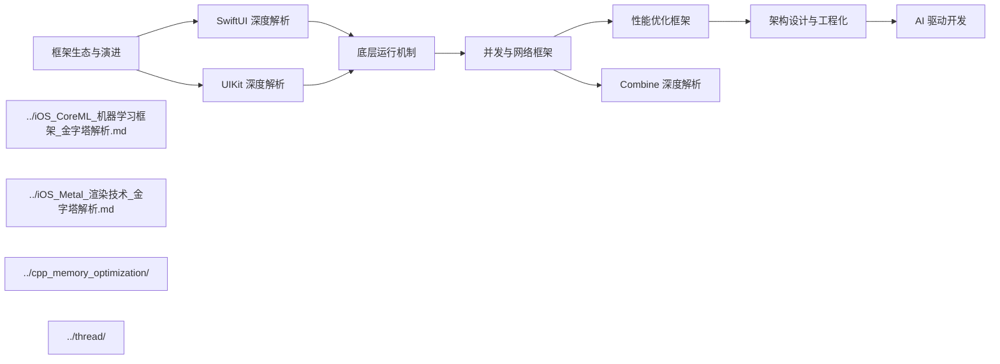

# iOS Framework Architecture 深度解析 - 文档导航

> 本目录包含关于 iOS 框架分层架构、SwiftUI/UIKit 双轨体系、底层运行机制、并发模型、Combine 响应式编程、性能优化、架构设计模式与 AI 驱动开发的系统性深度文章

---

## 文档结构

本文档采用**金字塔结构**组织，主文章提供全景视图，子文件深入关键概念。

### 主文章

| 文件 | 描述 | 行数 |
|------|------|------|
| **[iOS_Framework_Architecture_深度解析.md](./iOS_Framework_Architecture_深度解析.md)** | iOS 框架全景概览：分层架构、SwiftUI/UIKit 对比、运行时机制、并发模型、性能优化、架构设计与 AI 驱动开发 | ~820 |

### 子文件（按主题分类）

#### 框架生态与演进

| 文件 | 描述 | 行数 |
|------|------|------|
| [Apple框架生态全景与战略定位_详细解析.md](./01_框架生态与演进/Apple框架生态全景与战略定位_详细解析.md) | 四层分层架构、核心框架演进、Swift 语言协同演进、WWDC 里程碑解读 | ~1500 |
| [新兴框架与未来趋势_详细解析.md](./01_框架生态与演进/新兴框架与未来趋势_详细解析.md) | Vision/RealityKit/ActivityKit/SwiftData/Apple Intelligence/空间计算 | ~2200 |

#### SwiftUI 深度解析

| 文件 | 描述 | 行数 |
|------|------|------|
| [SwiftUI架构与渲染机制_详细解析.md](./02_SwiftUI深度解析/SwiftUI架构与渲染机制_详细解析.md) | 声明式 UI 范式、AttributeGraph 依赖追踪、视图标识、渲染流程 | ~1100 |
| [SwiftUI高级实践与性能优化_详细解析.md](./02_SwiftUI深度解析/SwiftUI高级实践与性能优化_详细解析.md) | @Observable 状态管理、列表/动画性能、UIKit 混用、导航架构 | ~1500 |
| [SwiftUI定位与战略分析_详细解析.md](./02_SwiftUI深度解析/SwiftUI定位与战略分析_详细解析.md) | SwiftUI 战略定位、出现背景、核心优势、适用场景分析 | ~840 |
| [SwiftUI基础使用与典型场景_详细解析.md](./02_SwiftUI深度解析/SwiftUI基础使用与典型场景_详细解析.md) | 核心语法、修饰符系统、数据流基础、8大典型场景、版本兼容性 | ~1590 |
| [SwiftUI关键字与运行原理_详细解析.md](./02_SwiftUI深度解析/SwiftUI关键字与运行原理_详细解析.md) | 9大关键字深度解析、声明式UI原理、Core Animation交互机制 | ~1196 |
| [SwiftUI最佳实践与横向对比_详细解析.md](./02_SwiftUI深度解析/SwiftUI最佳实践与横向对比_详细解析.md) | 架构设计、10大反模式、vs UIKit/Flutter/RN对比、生产检查清单 | ~1132 |

#### UIKit 深度解析

| 文件 | 描述 | 行数 |
|------|------|------|
| [UIKit架构与事件机制_详细解析.md](./03_UIKit深度解析/UIKit架构与事件机制_详细解析.md) | 架构层次、Scene 生命周期、Hit-Testing、手势识别、Cassowary 布局、渲染管线 | ~1400 |
| [UIKit高级组件与自定义_详细解析.md](./03_UIKit深度解析/UIKit高级组件与自定义_详细解析.md) | Compositional Layout、Diffable DataSource、自定义转场、UIMenu、UISheetPresentation | ~1800 |
| [UIKit架构组成与战略定位_详细解析.md](./03_UIKit深度解析/UIKit架构组成与战略定位_详细解析.md) | UIKit 战略定位、六层架构详解、核心组件协作、UIWindowScene 革新、vs SwiftUI 对比 | ~832 |
| [UIKit运行原理深度剖析_详细解析.md](./03_UIKit深度解析/UIKit运行原理深度剖析_详细解析.md) | RunLoop 事件分发、响应链与 Hit-Testing、Cassowary 引擎、渲染管线、动画系统原理 | ~944 |
| [UIKit最佳实践与避坑指南_详细解析.md](./03_UIKit深度解析/UIKit最佳实践与避坑指南_详细解析.md) | 内存管理、主线程 UI 更新、AutoLayout 约束、列表优化、17 个常见陷阱速查 | ~874 |
| [UIKit性能优化_详细解析.md](./03_UIKit深度解析/UIKit性能优化_详细解析.md) | 性能瓶颈分类、列表/离屏渲染/AutoLayout/图片优化、框架对比、监测方法 | ~792 |

#### 底层运行机制

| 文件 | 描述 | 行数 |
|------|------|------|
| [ObjC_Runtime与消息机制_详细解析.md](./04_底层运行机制/ObjC_Runtime与消息机制_详细解析.md) | 对象模型、isa 指针、objc_msgSend 三阶段转发、Method Swizzling、关联对象、Tagged Pointer | ~1100 |
| [Swift运行时与ABI稳定性_详细解析.md](./04_底层运行机制/Swift运行时与ABI稳定性_详细解析.md) | 类型元数据、协议派发、方法派发三模式、ABI/模块稳定、泛型特化、COW | ~1200 |

#### 并发与网络框架

| 文件 | 描述 | 行数 |
|------|------|------|
| [Swift_Concurrency深度解析_详细解析.md](./05_并发与网络框架/Swift_Concurrency深度解析_详细解析.md) | async/await 状态机、Actor 隔离与可重入性、结构化并发、Sendable、AsyncSequence | ~900 |
| [网络框架与数据持久化_详细解析.md](./05_并发与网络框架/网络框架与数据持久化_详细解析.md) | URLSession async API、Combine 响应式、SwiftData/CoreData 持久化、Keychain 安全存储 | ~900 |

#### 性能优化框架

| 文件 | 描述 | 行数 |
|------|------|------|
| [启动优化与包体积治理_详细解析.md](./06_性能优化框架/启动优化与包体积治理_详细解析.md) | dyld 加载、Pre-main/Post-main 优化、二进制重排、包体积治理、Swift 专项优化 | ~1300 |
| [渲染性能与能耗优化_详细解析.md](./06_性能优化框架/渲染性能与能耗优化_详细解析.md) | Core Animation 管线、离屏渲染治理、卡顿检测、图片渲染优化、电量优化 | ~1600 |

#### 架构设计与工程化

| 文件 | 描述 | 行数 |
|------|------|------|
| [客户端架构模式对比_详细解析.md](./07_架构设计与工程化/客户端架构模式对比_详细解析.md) | MVC/MVP/MVVM/VIPER/TCA/Clean Architecture 全面对比与选型 | ~1500 |
| [跨平台方案对比与选型_详细解析.md](./07_架构设计与工程化/跨平台方案对比与选型_详细解析.md) | Flutter/React Native/KMP/原生开发性能、生态、维护成本对比 | ~660 |

#### AI 驱动开发与架构师能力模型

| 文件 | 描述 | 行数 |
|------|------|------|
| [AI时代iOS架构师能力模型_详细解析.md](./08_AI驱动开发与架构师能力模型/AI时代iOS架构师能力模型_详细解析.md) | T 型技能矩阵、能力演进路线、技术领导力、AI 时代核心竞争力 | ~900 |
| [AI辅助iOS开发实践_详细解析.md](./08_AI驱动开发与架构师能力模型/AI辅助iOS开发实践_详细解析.md) | Spec Coding 工作流、Harness 体系、AI 工具链集成、团队落地实践 | ~1800 |

#### Combine 深度解析

| 文件 | 描述 | 行数 |
|------|------|------|
| [Combine定位与战略分析_详细解析.md](./09_Combine深度解析/Combine定位与战略分析_详细解析.md) | Combine 定义、出现背景、Apple 战略定位、vs 传统异步方式核心优势 | ~1059 |
| [Combine基础使用与典型场景_详细解析.md](./09_Combine深度解析/Combine基础使用与典型场景_详细解析.md) | Publisher/Subscriber/Operator 核心概念、操作符分类、8大典型场景、SwiftUI集成 | ~1409 |
| [Combine运行机制与原理_详细解析.md](./09_Combine深度解析/Combine运行机制与原理_详细解析.md) | 协议体系架构、背压处理、线程调度、操作符内部实现、错误传播机制 | ~1812 |
| [Combine横向对比与选型_详细解析.md](./09_Combine深度解析/Combine横向对比与选型_详细解析.md) | vs RxSwift/Observation/async-await/Delegate 全面对比、综合选型矩阵 | ~1070 |
| [Combine实践指南与性能优化_详细解析.md](./09_Combine深度解析/Combine实践指南与性能优化_详细解析.md) | 内存管理、12大反模式、错误处理策略、调试技巧、性能优化、生产检查清单 | ~1523 |

---

## 学习路径

根据不同的学习目标，推荐以下学习路径：

### 路径一：快速入门（1-2天）

适合：想快速了解 iOS 框架体系全貌的开发者

```
iOS_Framework_Architecture_深度解析.md（全文）
    │
    ├─→ Apple框架生态全景与战略定位_详细解析.md（四层架构部分）
    │
    └─→ SwiftUI定位与战略分析_详细解析.md（战略定位与适用场景）
```

### 路径二：深入原理（1-2周）

适合：需要理解 iOS 底层机制的工程师

```
iOS_Framework_Architecture_深度解析.md
    │
    ├─→ ObjC_Runtime与消息机制_详细解析.md
    │
    ├─→ Swift运行时与ABI稳定性_详细解析.md
    │
    ├─→ SwiftUI架构与渲染机制_详细解析.md
    │
    ├─→ SwiftUI关键字与运行原理_详细解析.md
    │
    ├─→ UIKit架构与事件机制_详细解析.md
    │
    ├─→ UIKit运行原理深度剖析_详细解析.md
    │
    └─→ UIKit架构组成与战略定位_详细解析.md
```

### 路径三：性能专项（3-5天）

适合：需要优化 App 性能的高级工程师

```
iOS_Framework_Architecture_深度解析.md（性能优化部分）
    │
    ├─→ 启动优化与包体积治理_详细解析.md
    │
    ├─→ 渲染性能与能耗优化_详细解析.md
    │
    ├─→ Swift_Concurrency深度解析_详细解析.md（并发性能）
    │
    └─→ UIKit性能优化_详细解析.md（UIKit 专项性能优化）
```

### 路径四：架构师进阶（1-2周）

适合：向架构师角色发展的资深开发者

```
iOS_Framework_Architecture_深度解析.md
    │
    ├─→ 客户端架构模式对比_详细解析.md
    │
    ├─→ 跨平台方案对比与选型_详细解析.md
    │
    ├─→ AI时代iOS架构师能力模型_详细解析.md
    │
    └─→ AI辅助iOS开发实践_详细解析.md
```

### 路径五：面试强化（3-5天）

适合：准备 iOS 高级/专家级面试的候选人

```
iOS_Framework_Architecture_深度解析.md（面试高频考点部分）
    │
    ├─→ ObjC_Runtime与消息机制_详细解析.md（消息转发三阶段）
    │
    ├─→ Swift_Concurrency深度解析_详细解析.md（Actor 与 Sendable）
    │
    ├─→ 启动优化与包体积治理_详细解析.md（二进制重排）
    │
    ├─→ 客户端架构模式对比_详细解析.md（MVVM vs TCA）
    │
    └─→ UIKit最佳实践与避坑指南_详细解析.md（17 个常见陷阱）
```

---

## 进阶路线图



**推荐进阶顺序**：
1. **框架基础**：完成本文档框架生态 + SwiftUI/UIKit 模块
2. **底层深入**：理解 Runtime + Swift ABI，掌握派发机制
3. **并发编程**：学习 Swift Concurrency，掌握 async/await + Actor
4. **响应式编程**：学习 Combine 框架，掌握 Publisher/Subscriber 模式与背压机制
5. **性能优化**：结合 `cpp_memory_optimization/` 深入内存优化
6. **架构设计**：掌握架构模式选型，理解跨平台方案
7. **AI 进阶**：学习 `iOS_CoreML_机器学习框架_金字塔解析.md` 和 `iOS_Metal_渲染技术_金字塔解析.md`
8. **架构师成长**：构建 AI 驱动开发体系，发展技术领导力

---

## 写作原则

本系列文档遵循以下写作原则：

### 1. 金字塔结构
- 主文章提供全景概览，明确"做什么"和"为什么"
- 子文件深入细节，解释"怎么做"和"如何优化"
- 每篇文章开头有核心结论（TL;DR），便于快速把握要点

### 2. 结论先行
- 每个章节以核心结论开头，再展开技术细节
- 表格对比优先，便于快速对比与选型
- 面试考点标注，满足面试准备需求

### 3. 面向实践
- 避免纯理论推导，强调概念与实际应用的关联
- 提供具体的 Swift/ObjC 代码示例
- 包含常见问题、踩坑点和最佳实践

### 4. 渐进深入
- 每个概念先给出直观解释，再展开技术细节
- 配合 Mermaid 图解辅助理解架构与流程
- 提供交叉引用，满足跨知识库深入学习需求

---

## 目标读者

本系列文档面向以下读者：

| 读者类型 | 背景假设 | 重点章节 |
|---------|---------|---------|
| **初级开发者** | 有 Swift 基础，了解 UIKit 基本用法 | SwiftUI 架构、UIKit 基础、Foundation |
| **中级开发者** | 熟悉 UIKit，需要深入理解底层机制 | Runtime、Swift ABI、Swift Concurrency |
| **高级开发者** | 需要设计高质量代码架构与性能优化 | 性能优化、架构模式、跨平台选型 |
| **架构师** | 需要技术选型决策与团队技术领导 | 架构设计、AI 驱动开发、能力模型 |
| **面试候选人** | 准备 iOS 高级/专家级技术面试 | Runtime、并发、性能优化、架构选型 |

**前置知识**：
- Swift 语言基础（变量、函数、闭包、协议）
- 基本 iOS 开发概念（ViewController、View、生命周期）
- 不要求深入的编译原理或汇编背景（文中会解释必要概念）

---

## 核心概念速查表

### 框架架构

| 术语 | 英文 | 简要解释 | 详见 |
|------|------|---------|------|
| 分层架构 | Layered Architecture | Cocoa Touch → Media → Core Services → Core OS | 框架生态 |
| ABI | Application Binary Interface | 二进制级接口规范，Swift 5.0 实现稳定 | 运行时 |
| Scene | UIWindowScene | iOS 13+ 多窗口场景抽象 | UIKit |
| COW | Copy-on-Write | 值类型写时复制优化 | Swift 运行时 |

### UI 框架

| 术语 | 英文 | 简要解释 | 详见 |
|------|------|---------|------|
| AG | AttributeGraph | SwiftUI 依赖追踪引擎 | SwiftUI |
| Hit-Testing | Hit Testing | 深度优先逆序遍历查找最优响应者 | UIKit |
| CL | Compositional Layout | 声明式定义 CollectionView 布局 | UIKit |
| DDS | Diffable DataSource | 快照驱动自动差分更新 | UIKit |

### 并发与运行时

| 术语 | 英文 | 简要解释 | 详见 |
|------|------|---------|------|
| CPS | Continuation-Passing Style | async 函数编译变换为状态机 | Swift Concurrency |
| PWT | Protocol Witness Table | 协议类型动态派发实现 | Swift 运行时 |
| IMP | Implementation Pointer | 方法实现函数指针 | ObjC Runtime |
| isa | ISA Pointer | 对象指向类的指针 | ObjC Runtime |

---

## 相关文档

本知识库是 iOS 技术体系的核心部分，建议结合以下文档学习：

| 文档 | 路径 | 描述 |
|------|------|------|
| **iOS CoreML 机器学习框架金字塔解析** | [../iOS_CoreML_机器学习框架_金字塔解析.md](../iOS_CoreML_机器学习框架_金字塔解析.md) | CoreML 端侧机器学习框架深度解析 |
| **iOS Metal 渲染技术金字塔解析** | [../iOS_Metal_渲染技术_金字塔解析.md](../iOS_Metal_渲染技术_金字塔解析.md) | Metal GPU 渲染与计算框架深度解析 |
| **iOS 开发者视角：AI 驱动开发的演进与实践** | [../iOS开发者视角：AI驱动开发的演进与实践.md](../iOS开发者视角：AI驱动开发的演进与实践.md) | AI 对 iOS 开发影响的全景分析 |
| **C++ 内存优化 - iOS 内存优化** | [../cpp_memory_optimization/03_系统级优化/iOS内存优化.md](../cpp_memory_optimization/03_系统级优化/iOS内存优化.md) | iOS 内存优化技术实践 |
| **跨平台多线程实践 - iOS 多线程** | [../thread/05_跨平台多线程实践/iOS多线程_详细解析.md](../thread/05_跨平台多线程实践/iOS多线程_详细解析.md) | iOS 多线程编程与 GCD 实践 |

---

## 更新日志

| 日期 | 版本 | 更新内容 |
|------|------|----------|
| 2026-04-18 | v1.0 | 创建 iOS Framework Architecture 知识库，包含主文章与 8 大维度 16 个子文件（后扩展至 9 大维度） |
| 2026-04-18 | v1.1 | 新增 SwiftUI 深度调研 4 篇：定位与战略分析、基础使用与典型场景、关键字与运行原理、最佳实践与横向对比 |
| 2026-04-18 | v1.2 | 新增 Combine 深度解析 5 篇：定位与战略分析、基础使用与典型场景、运行机制与原理、横向对比与选型、实践指南与性能优化 |
| 2026-04-18 | v1.3 | 新增 UIKit 深度调研 4 篇：架构组成与战略定位、运行原理深度剖析、最佳实践与避坑指南、性能优化 |

---

> 如有问题或建议，欢迎反馈。
