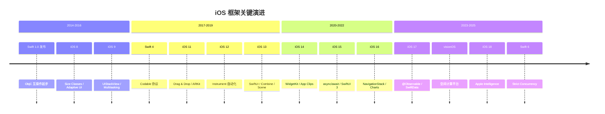
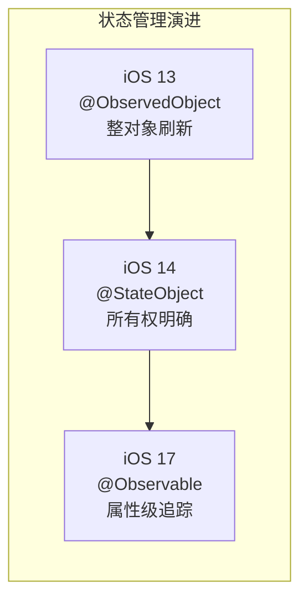
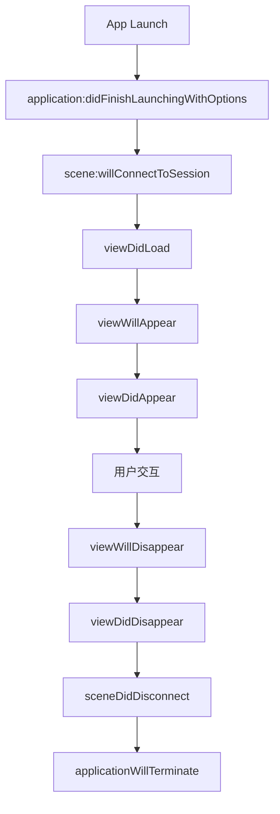
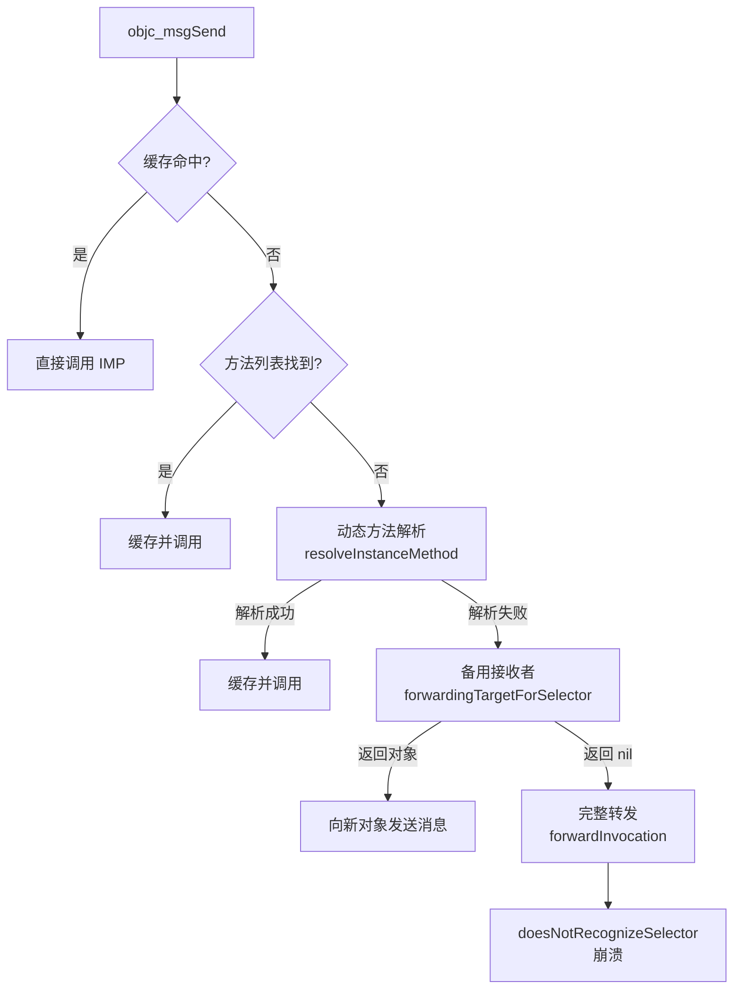
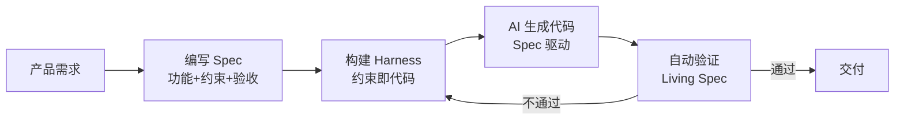
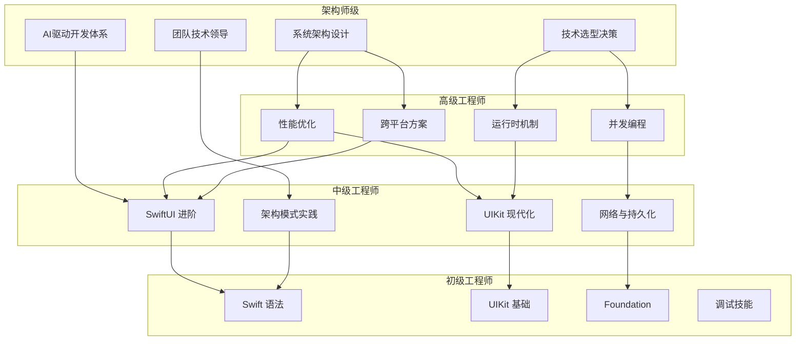

# iOS Framework Architecture 深度解析

> 系统性梳理 iOS 框架分层架构、SwiftUI/UIKit 双轨体系、底层运行机制、并发模型、性能优化、架构设计模式与 AI 驱动开发的全景知识体系

---

## 核心结论（TL;DR）

**iOS 框架体系的核心设计哲学是：分层抽象（Layered Abstraction）—— 从 Core OS 到 Cocoa Touch 逐层封装，开发者只需关注业务层，但深入理解底层才能写出高性能代码。**

| 知识维度 | 一句话核心结论 |
|---------|--------------|
| **框架生态与演进** | Apple 框架采用四层分层架构，Swift 语言演进是推动框架现代化的核心引擎 |
| **SwiftUI 体系** | 声明式 UI 通过 AttributeGraph 实现细粒度依赖追踪，iOS 17 @Observable 是状态管理的最终形态 |
| **UIKit 体系** | 命令式 UI 的成熟方案，iOS 13+ Scene 生命周期与 iOS 14+ 现代化 API 是工程必知 |
| **底层运行机制** | ObjC Runtime 消息转发三阶段 + Swift 方法派发三模式，理解派发机制是性能优化的前提 |
| **并发与网络框架** | Swift Concurrency 从语言级保障并发安全，async/await + Actor + 结构化并发是 GCD 的范式升级 |
| **性能优化** | 启动优化（dyld 加载→二进制重排）、渲染优化（Core Animation 管线→离屏渲染治理）、能耗优化三位一体 |
| **架构设计与工程化** | 没有最好的架构，只有最适合的架构；MVVM 稳妥、TCA 适合 SwiftUI、Clean Architecture 适合大型团队 |
| **AI 驱动开发** | Spec → Harness → Code → Verify 闭环是 AI 时代开发者核心工作流，底层技术深度仍是根基 |

**一句话理解 iOS 框架体系**：iOS 开发是一个从「使用框架」到「理解框架」再到「超越框架」的渐进过程——会用 UIKit 能干活，懂 Runtime 能调优，掌握架构能设计系统。

---

## 目录

- [核心结论（TL;DR）](#核心结论tldr)
- [文章导航](#文章导航)
- [Apple 框架分层架构图](#apple-框架分层架构图)
- [方法论框架：iOS 知识金字塔](#方法论框架ios-知识金字塔)
- [各维度核心概念速览](#各维度核心概念速览)
- [第一部分：框架生态与演进](#第一部分框架生态与演进)
- [第二部分：SwiftUI 体系](#第二部分swiftui-体系)
- [第三部分：UIKit 体系](#第三部分uikit-体系)
- [第四部分：底层运行机制](#第四部分底层运行机制)
- [第五部分：并发与网络框架](#第五部分并发与网络框架)
- [第六部分：性能优化](#第六部分性能优化)
- [第七部分：架构设计与工程化](#第七部分架构设计与工程化)
- [第八部分：AI 驱动开发与架构师能力](#第八部分ai-驱动开发与架构师能力)
- [SwiftUI vs UIKit 核心对比](#swiftui-vs-uikit-核心对比)
- [iOS 开发者技术能力全景图](#ios-开发者技术能力全景图)
- [与已有知识库的交叉引用](#与已有知识库的交叉引用)
- [面试高频考点速查](#面试高频考点速查)
- [参考资源](#参考资源)

---

## 文章导航

本文采用金字塔结构组织，主文章提供全景视图，子文件深入关键概念：

### 框架生态与演进

- [Apple框架生态全景与战略定位_详细解析](./01_框架生态与演进/Apple框架生态全景与战略定位_详细解析.md) - 分层架构、核心框架演进、WWDC 里程碑
- [新兴框架与未来趋势_详细解析](./01_框架生态与演进/新兴框架与未来趋势_详细解析.md) - Vision/RealityKit/ActivityKit/SwiftData/Apple Intelligence

### SwiftUI 深度解析

- [SwiftUI架构与渲染机制_详细解析](./02_SwiftUI深度解析/SwiftUI架构与渲染机制_详细解析.md) - 声明式 UI、AttributeGraph、视图标识、渲染流程
- [SwiftUI高级实践与性能优化_详细解析](./02_SwiftUI深度解析/SwiftUI高级实践与性能优化_详细解析.md) - @Observable、列表性能、动画优化、UIKit 混用

### UIKit 深度解析

- [UIKit架构与事件机制_详细解析](./03_UIKit深度解析/UIKit架构与事件机制_详细解析.md) - 架构层次、生命周期、Hit-Testing、手势识别、布局系统
- [UIKit高级组件与自定义_详细解析](./03_UIKit深度解析/UIKit高级组件与自定义_详细解析.md) - Compositional Layout、Diffable DataSource、自定义转场

### 底层运行机制

- [ObjC_Runtime与消息机制_详细解析](./04_底层运行机制/ObjC_Runtime与消息机制_详细解析.md) - 对象模型、消息发送、Method Swizzling、关联对象
- [Swift运行时与ABI稳定性_详细解析](./04_底层运行机制/Swift运行时与ABI稳定性_详细解析.md) - 类型元数据、协议派发、方法派发、ABI 稳定

### 并发与网络框架

- [Swift_Concurrency深度解析_详细解析](./05_并发与网络框架/Swift_Concurrency深度解析_详细解析.md) - async/await、Actor、结构化并发、Sendable
- [网络框架与数据持久化_详细解析](./05_并发与网络框架/网络框架与数据持久化_详细解析.md) - URLSession、Combine、SwiftData、CoreData、Keychain

### 性能优化框架

- [启动优化与包体积治理_详细解析](./06_性能优化框架/启动优化与包体积治理_详细解析.md) - dyld 加载、二进制重排、包体积治理
- [渲染性能与能耗优化_详细解析](./06_性能优化框架/渲染性能与能耗优化_详细解析.md) - Core Animation 管线、离屏渲染、卡顿检测、电量优化

### 架构设计与工程化

- [客户端架构模式对比_详细解析](./07_架构设计与工程化/客户端架构模式对比_详细解析.md) - MVC/MVP/MVVM/VIPER/TCA/Clean Architecture
- [跨平台方案对比与选型_详细解析](./07_架构设计与工程化/跨平台方案对比与选型_详细解析.md) - Flutter/React Native/KMP/原生对比

### AI 驱动开发与架构师能力模型

- [AI时代iOS架构师能力模型_详细解析](./08_AI驱动开发与架构师能力模型/AI时代iOS架构师能力模型_详细解析.md) - T 型技能矩阵、能力演进、技术领导力
- [AI辅助iOS开发实践_详细解析](./08_AI驱动开发与架构师能力模型/AI辅助iOS开发实践_详细解析.md) - Spec Coding、Harness 体系、AI 工具链

---

## Apple 框架分层架构图

```mermaid
graph TB
    subgraph "Cocoa Touch 层"
        CT1[UIKit]
        CT2[SwiftUI]
        CT3[MapKit]
        CT4[HealthKit]
        CT5[SiriKit]
        CT6[ActivityKit]
        CT7[WidgetKit]
        CT8[GameKit]
    end

    subgraph "Media 层"
        M1[AVFoundation]
        M2[Core Animation]
        M3[Metal]
        M4[CoreML]
        M5[Core Graphics]
        M6[Core Image]
        M7[RealityKit]
        M8[ARKit]
    end

    subgraph "Core Services 层"
        CS1[Foundation]
        CS2[CoreData]
        CS3[SwiftData]
        CS4[CloudKit]
        CS5[Combine]
        CS6[Network]
        CS7[StoreKit]
        CS8[Security]
    end

    subgraph "Core OS 层"
        CO1[Darwin / XNU]
        CO2[Mach]
        CO3[BSD]
        CO4[Security Framework]
        CO5[IOKit]
        CO6[libSystem]
    end

    Cocoa Touch --> Media
    Media --> Core Services
    Core Services --> Core OS
```

**分层架构核心要点**：

| 层级 | 职责 | 典型框架 | 开发者接触频率 |
|------|------|---------|--------------|
| **Cocoa Touch** | 应用层 UI 与交互 | UIKit、SwiftUI、MapKit | ★★★★★ 每日使用 |
| **Media** | 图形、音频、视频、ML | AVFoundation、Metal、CoreML | ★★★★☆ 高频场景 |
| **Core Services** | 核心服务与数据 | Foundation、CoreData、Combine | ★★★★★ 每日使用 |
| **Core OS** | 内核与系统接口 | Darwin、Mach、BSD | ★★☆☆☆ 性能调优时 |

---

## 方法论框架：iOS 知识金字塔

```
                          ┌─────────────────┐
                          │   架构师级精通    │
                          │  系统设计 / AI    │
                          │  技术领导力       │
                     ┌────┴─────────────────┴────┐
                     │       高级应用层           │
                     │  架构模式 / 性能优化        │
                     │  跨平台选型 / 并发编程      │
                ┌────┴─────────────────────────┴────┐
                │         核心机制层                 │
                │  Runtime / 渲染管线 / Swift ABI    │
                │  消息机制 / 状态管理 / 依赖追踪    │
           ┌────┴───────────────────────────────┴────┐
           │           基础框架层                     │
           │  UIKit / SwiftUI / Foundation            │
           │  事件响应 / 布局系统 / 数据持久化         │
      ┌────┴──────────────────────────────────────┴────┐
      │             语言与平台基础                      │
      │  Swift 语法 / ObjC 互操作 / Apple 平台特性     │
      │  开发工具链 / 调试技巧 / 版本适配              │
      └────────────────────────────────────────────────┘
```

---

## iOS 框架版本演进时间线



---

## 各维度核心概念速览

### 框架生态核心概念

| 术语 | 英文 | 简要解释 | 详见 |
|------|------|---------|------|
| 分层架构 | Layered Architecture | Cocoa Touch → Media → Core Services → Core OS 四层封装 | 框架生态 |
| ABI 稳定 | ABI Stability | Swift 5.0+ 二进制兼容，支持框架分发 | 运行时 |
| Scene 生命周期 | Scene Lifecycle | iOS 13+ 多窗口场景抽象 | UIKit |
| 模块稳定 | Module Stability | Swift 5.1+ 支持 Library Evolution | 运行时 |

### SwiftUI 核心概念

| 术语 | 英文 | 简要解释 | 详见 |
|------|------|---------|------|
| AttributeGraph | Attribute Graph | SwiftUI 依赖追踪引擎，细粒度更新 | SwiftUI 架构 |
| @Observable | Observable Macro | iOS 17 属性级精准追踪，替代 ObservableObject | SwiftUI 高级 |
| View Identity | View Identity | 结构标识（类型+位置）为主，id() 为辅 | SwiftUI 架构 |
| _printChanges | Print Changes | 定位不必要视图刷新的调试工具 | SwiftUI 高级 |

### UIKit 核心概念

| 术语 | 英文 | 简要解释 | 详见 |
|------|------|---------|------|
| Hit-Testing | Hit Testing | 深度优先逆序遍历查找最优响应者 | UIKit 事件 |
| Cassowary | Cassowary Algorithm | Auto Layout 约束求解算法 | UIKit 事件 |
| Compositional Layout | Compositional Layout | 声明式定义 CollectionView 布局 | UIKit 组件 |
| Diffable DataSource | Diffable DataSource | 快照驱动自动差分更新 | UIKit 组件 |

### 运行时核心概念

| 术语 | 英文 | 简要解释 | 详见 |
|------|------|---------|------|
| objc_msgSend | Message Send | ObjC 消息发送，缓存优先 + 三阶段转发 | ObjC Runtime |
| isa | ISA Pointer | 对象指向类的指针，建立类与元类关系 | ObjC Runtime |
| VTable | Virtual Table | Swift 类默认方法派发，编译期确定 | Swift 运行时 |
| Protocol Witness Table | Witness Table | 协议类型动态派发实现 | Swift 运行时 |

### 并发核心概念

| 术语 | 英文 | 简要解释 | 详见 |
|------|------|---------|------|
| Actor | Actor | 隔离边界保证数据竞争安全，非锁机制 | Swift Concurrency |
| 结构化并发 | Structured Concurrency | 子任务生命周期不超出父任务 | Swift Concurrency |
| Sendable | Sendable | 编译器静态检查跨并发边界数据安全 | Swift Concurrency |
| AsyncSequence | Async Sequence | 异步拉取模型，天然支持背压 | 网络框架 |

### 性能优化核心概念

| 术语 | 英文 | 简要解释 | 详见 |
|------|------|---------|------|
| 二进制重排 | Binary Reorder | Order File 优化页缺失，减少启动耗时 | 启动优化 |
| 离屏渲染 | Off-screen Rendering | GPU 需离屏缓冲区的渲染，性能杀手 | 渲染优化 |
| COW | Copy-on-Write | Swift 值类型写时复制，避免不必要拷贝 | 渲染优化 |
| App Thinning | App Thinning | 按设备分发资源，减少下载体积 | 包体积 |

---

## 第一部分：框架生态与演进

Apple 框架生态采用四层分层架构设计（Cocoa Touch → Media → Core Services → Core OS），以 Swift 语言演进为引擎，推动 UIKit 向 SwiftUI 的声明式转型、GCD 向 Swift Concurrency 的结构化并发迁移。理解各框架的战略定位、版本演进时间线、以及 Apple 投入重点，是 iOS 开发者技术选型和长期职业规划的关键。

当前 Apple 框架生态正经历三大范式转移：从移动优先到 AI 优先（Apple Intelligence 端侧 AI）、从 2D 界面到空间计算（visionOS/RealityKit）、从命令式到声明式（SwiftUI/SwiftData/Swift Concurrency）。掌握这些趋势，才能在技术选型时做出前瞻性决策。

### 框架演进关键里程碑

| 时间 | 里程碑 | 影响维度 |
|------|--------|----------|
| 2014 | Swift 1.0 发布 | 语言层面开始替代 ObjC |
| 2019 | SwiftUI 发布（iOS 13） | 声明式 UI 范式开启 |
| 2019 | Combine 发布（iOS 13） | 响应式编程官方支持 |
| 2019 | Swift 5.1 ABI 稳定 + 模块稳定 | 二进制框架分发成为可能 |
| 2021 | Swift Concurrency（iOS 15） | async/await + Actor 并发模型 |
| 2022 | Swift 5.7 正则表达式 + 已解锁 Sendable | 语言表达力持续增强 |
| 2023 | SwiftData + @Observable（iOS 17） | 声明式持久化 + 精准状态追踪 |
| 2023 | visionOS SDK | 空间计算平台开启 |
| 2024 | Swift 6.0 Strict Concurrency | 编译器强制并发安全 |
| 2024 | Apple Intelligence | 端侧 AI 成为核心能力 |

### 核心要点

| 核心要点 | 说明 | 详见 |
|---------|------|------|
| 四层分层架构 | Cocoa Touch / Media / Core Services / Core OS | [Apple框架生态全景与战略定位](./01_框架生态与演进/Apple框架生态全景与战略定位_详细解析.md) |
| Swift 语言协同演进 | Swift 5.5 async/await → 5.9 Macro → 6.0 Strict Concurrency | [Apple框架生态全景与战略定位](./01_框架生态与演进/Apple框架生态全景与战略定位_详细解析.md) |
| WWDC 里程碑解读 | 从 iOS 7 扁平化到 iOS 18 AI 优先的关键转折 | [Apple框架生态全景与战略定位](./01_框架生态与演进/Apple框架生态全景与战略定位_详细解析.md) |
| Vision/RealityKit | OCR 能力 + 空间渲染，visionOS 技术新基建 | [新兴框架与未来趋势](./01_框架生态与演进/新兴框架与未来趋势_详细解析.md) |
| ActivityKit/SwiftData | 实时活动 + 现代持久化，iOS 17+ 核心新框架 | [新兴框架与未来趋势](./01_框架生态与演进/新兴框架与未来趋势_详细解析.md) |
| Apple Intelligence | 端侧 AI 新范式，重新定义人机交互 | [新兴框架与未来趋势](./01_框架生态与演进/新兴框架与未来趋势_详细解析.md) |

---

## 第二部分：SwiftUI 体系

SwiftUI 采用声明式 UI 范式，通过描述「状态到视图的映射」而非「操作步骤」构建界面。其核心引擎 AttributeGraph 实现细粒度依赖追踪，仅更新受影响的视图子树。iOS 17 的 @Observable 宏实现属性级精准追踪，替代了 @ObservedObject 的整对象刷新，标志着 SwiftUI 状态管理进入成熟期。

SwiftUI 的渲染流程为：View body 求值 → AttributeGraph 更新 → Core Animation 层提交 → GPU 渲染。理解这一流程，是优化 SwiftUI 性能的基础。在生产环境中，`_printChanges()` 定位不必要刷新、LazyVStack 优化大数据列表、UIViewRepresentable 混用 UIKit 组件，是三个最常见的实践课题。

### SwiftUI 状态管理演进



| 属性包装器 | 引入版本 | 粒度 | 所有权 | 适用场景 |
|-----------|---------|------|--------|----------|
| @State | iOS 13 | 值类型 | 视图拥有 | 简单本地状态 |
| @Binding | iOS 13 | 值类型 | 父视图拥有 | 父子视图传递 |
| @ObservedObject | iOS 13 | 引用类型 | 外部拥有 | 外部创建的 VM |
| @StateObject | iOS 14 | 引用类型 | 视图拥有 | 视图创建的 VM |
| @Observable | iOS 17 | 属性级 | 任意 | 现代状态管理首选 |
| @Environment | iOS 13 | 任意 | 环境注入 | 跨层级传递 |

### 核心要点

| 核心要点 | 说明 | 详见 |
|---------|------|------|
| 声明式 UI 范式 | 描述状态→视图映射，而非操作步骤 | [SwiftUI架构与渲染机制](./02_SwiftUI深度解析/SwiftUI架构与渲染机制_详细解析.md) |
| AttributeGraph | 细粒度依赖追踪引擎，仅更新受影响子树 | [SwiftUI架构与渲染机制](./02_SwiftUI深度解析/SwiftUI架构与渲染机制_详细解析.md) |
| 视图标识 | 结构标识（类型+位置）为主，id() 修饰符为辅 | [SwiftUI架构与渲染机制](./02_SwiftUI深度解析/SwiftUI架构与渲染机制_详细解析.md) |
| 渲染流程 | body 求值 → AG 更新 → CA 提交 → GPU 渲染 | [SwiftUI架构与渲染机制](./02_SwiftUI深度解析/SwiftUI架构与渲染机制_详细解析.md) |
| @Observable | iOS 17 属性级精准追踪，替代 @ObservedObject | [SwiftUI高级实践与性能优化](./02_SwiftUI深度解析/SwiftUI高级实践与性能优化_详细解析.md) |
| 列表性能 | List vs LazyVStack 选型，ForEach 标识优化 | [SwiftUI高级实践与性能优化](./02_SwiftUI深度解析/SwiftUI高级实践与性能优化_详细解析.md) |
| UIKit 混用 | UIViewRepresentable + Coordinator 处理回调 | [SwiftUI高级实践与性能优化](./02_SwiftUI深度解析/SwiftUI高级实践与性能优化_详细解析.md) |
| 导航架构 | NavigationStack 类型安全路由（iOS 16+） | [SwiftUI高级实践与性能优化](./02_SwiftUI深度解析/SwiftUI高级实践与性能优化_详细解析.md) |
| 动画优化 | 优先隐式动画，避免 withAnimation 中同步耗时 | [SwiftUI高级实践与性能优化](./02_SwiftUI深度解析/SwiftUI高级实践与性能优化_详细解析.md) |

---

## 第三部分：UIKit 体系

UIKit 是 iOS 开发的成熟命令式 UI 框架，采用分层架构：UIApplication → UIWindowScene → UIWindow → UIViewController → UIView。iOS 13+ 引入 UISceneDelegate 支持多窗口场景，与 UIApplicationDelegate 共存但职责分离。Hit-Testing 采用深度优先逆序遍历查找最优响应者，Auto Layout 基于 Cassowary 算法求解线性约束。

UIKit 现代化 API 是工程实践必知：Compositional Layout 声明式定义布局、Diffable DataSource 快照驱动自动差分更新、Cell Registration 类型安全注册、UISheetPresentation 半屏弹窗。这些 API 显著降低了 UICollectionView 和导航系统的复杂度。

### UIKit 生命周期关键节点



### UIKit 现代化 API 演进

| API | 引入版本 | 解决的问题 | 替代方案 |
|-----|---------|-----------|----------|
| Compositional Layout | iOS 13 | UICollectionViewFlowLayout 无法表达复杂布局 | FlowLayout |
| Diffable DataSource | iOS 13 | indexPath 手动管理导致崩溃 | DataSource 协议 |
| Cell Registration | iOS 14 | dequeueReusableCell 类型不安全 | register/dequeue |
| UIMenu | iOS 14 | UIAlertController 操作菜单复杂 | UIAlertController |
| UISheetPresentation | iOS 15 | 自定义半屏弹窗实现困难 | 自定义 Presentation |
| UINavigationBarAppearance | iOS 13 | 导航栏外观配置分散 | 直接修改 bar 属性 |
| UIWindowScene | iOS 13 | 多窗口支持 | 单 Window 模式 |

### 核心要点

| 核心要点 | 说明 | 详见 |
|---------|------|------|
| 架构层次 | UIApplication → Scene → Window → VC → View | [UIKit架构与事件机制](./03_UIKit深度解析/UIKit架构与事件机制_详细解析.md) |
| 生命周期 | iOS 13+ SceneDelegate 与 AppDelegate 职责分离 | [UIKit架构与事件机制](./03_UIKit深度解析/UIKit架构与事件机制_详细解析.md) |
| 事件响应链 | Hit-Testing 深度优先逆序 + Responder Chain | [UIKit架构与事件机制](./03_UIKit深度解析/UIKit架构与事件机制_详细解析.md) |
| 手势识别 | UIGestureRecognizer 状态机 + require(toFail:) | [UIKit架构与事件机制](./03_UIKit深度解析/UIKit架构与事件机制_详细解析.md) |
| 布局系统 | Cassowary 约束求解 + intrinsicContentSize | [UIKit架构与事件机制](./03_UIKit深度解析/UIKit架构与事件机制_详细解析.md) |
| 渲染管线 | layoutSubviews → draw(_:) → CA 提交 → GPU | [UIKit架构与事件机制](./03_UIKit深度解析/UIKit架构与事件机制_详细解析.md) |
| Compositional Layout | Section/Group/Item 三层声明式布局 | [UIKit高级组件与自定义](./03_UIKit深度解析/UIKit高级组件与自定义_详细解析.md) |
| Diffable DataSource | Snapshot 驱动差分更新，消除 indexPath 崩溃 | [UIKit高级组件与自定义](./03_UIKit深度解析/UIKit高级组件与自定义_详细解析.md) |
| 自定义转场 | TransitioningDelegate + AnimatedTransitioning | [UIKit高级组件与自定义](./03_UIKit深度解析/UIKit高级组件与自定义_详细解析.md) |
| UIMenu 系统 | UIAction + UIMenu 替代传统 UIAlertController | [UIKit高级组件与自定义](./03_UIKit深度解析/UIKit高级组件与自定义_详细解析.md) |

---

## 第四部分：底层运行机制

ObjC Runtime 是 iOS 动态性的基石。所有 ObjC 对象本质是 `objc_object` 结构体，通过 `isa` 指针关联到类。`objc_msgSend` 采用缓存优先策略，未命中时遍历方法列表，支持完整的三阶段消息转发（动态方法解析 → 备用接收者 → 完整转发）。Method Swizzling 本质是交换 IMP 指针，必须在 `+load` 中使用 `dispatch_once` 保证线程安全。

Swift 运行时采用三种方法派发方式：直接派发（性能最优，final/staticmethod）、VTable 派发（类默认方式）、消息派发（@objc 动态性）。Swift 5.0 实现 ABI 稳定，5.1 实现模块稳定，支持 Library Evolution 和二进制框架分发。协议类型通过 Protocol Witness Table 实现动态派发，Existential Container 存储值或引用。

### ObjC 消息发送流程



### Swift 方法派发对比

| 派发方式 | 触发条件 | 性能 | 动态性 | 典型场景 |
|---------|---------|------|--------|----------|
| 直接派发 | final / static / struct 方法 | ★★★★★ | 无 | 值类型方法、final 类方法 |
| VTable 派发 | class 普通方法 | ★★★★☆ | 子类重写 | 类继承体系 |
| 消息派发 | @objc / dynamic | ★★★☆☆ | 完全动态 | ObjC 互操作、Swizzling |
| Witness Table | 协议类型调用 | ★★★★☆ | 协议动态 | 泛型约束、协议多态 |

### 核心要点

| 核心要点 | 说明 | 详见 |
|---------|------|------|
| 对象模型 | objc_object + isa 指针 + 类/元类链 | [ObjC_Runtime与消息机制](./04_底层运行机制/ObjC_Runtime与消息机制_详细解析.md) |
| 消息转发三阶段 | 动态方法解析 → 备用接收者 → 完整转发 | [ObjC_Runtime与消息机制](./04_底层运行机制/ObjC_Runtime与消息机制_详细解析.md) |
| Method Swizzling | 交换 IMP 指针，+load + dispatch_once | [ObjC_Runtime与消息机制](./04_底层运行机制/ObjC_Runtime与消息机制_详细解析.md) |
| 关联对象 | AssociationsHashMap 全局存储，RETAIN/ASSIGN/COPY | [ObjC_Runtime与消息机制](./04_底层运行机制/ObjC_Runtime与消息机制_详细解析.md) |
| Tagged Pointer | 小对象编码到指针，避免堆分配 | [ObjC_Runtime与消息机制](./04_底层运行机制/ObjC_Runtime与消息机制_详细解析.md) |
| 类加载流程 | dyld → _objc_init → map_images → load_images | [ObjC_Runtime与消息机制](./04_底层运行机制/ObjC_Runtime与消息机制_详细解析.md) |
| Swift 方法派发 | 直接派发 / VTable / 消息派发三模式 | [Swift运行时与ABI稳定性](./04_底层运行机制/Swift运行时与ABI稳定性_详细解析.md) |
| 类型元数据 | 值类型内联存储，引用类型堆分配 | [Swift运行时与ABI稳定性](./04_底层运行机制/Swift运行时与ABI稳定性_详细解析.md) |
| ABI 稳定性 | Swift 5.0 ABI 稳定 + 5.1 模块稳定 | [Swift运行时与ABI稳定性](./04_底层运行机制/Swift运行时与ABI稳定性_详细解析.md) |
| 泛型特化 | 编译期特化 + Generic Witness Table | [Swift运行时与ABI稳定性](./04_底层运行机制/Swift运行时与ABI稳定性_详细解析.md) |
| 值类型优化 | 栈分配 + COW，性能接近引用类型 | [Swift运行时与ABI稳定性](./04_底层运行机制/Swift运行时与ABI稳定性_详细解析.md) |

---

## 第五部分：并发与网络框架

Swift Concurrency 是 Apple 推出的语言级并发模型，通过 async/await、Actor、结构化并发三大支柱，将并发编程从「手动线程管理」提升为「编译器保障的安全并发」。async 函数被编译器变换为状态机（CPS 变换），Actor 通过隔离边界保证数据竞争安全，TaskGroup 保证子任务生命周期不超出父任务。从 GCD 迁移到 Swift Concurrency 不仅是 API 更替，更是从「基于回调的异步」到「基于协程的同步式异步」的范式转变。

网络与持久化框架选型核心原则：简单数据用 UserDefaults，安全凭证用 Keychain，结构化数据用 SwiftData（iOS 17+）/CoreData，实时流用 Combine。URLSession 在 iOS 15 引入 async/await API 后成为现代化网络层基石；SwiftData 用宏驱动方式替代 CoreData 繁琐模板代码，但 CoreData 仍是复杂持久化场景的成熟方案。

### GCD vs Swift Concurrency 对比

| 对比维度 | GCD | Swift Concurrency |
|---------|-----|-------------------|
| 编程模型 | 回调/闭包嵌套 | async/await 线性化 |
| 线程管理 | 手动选择队列，可能线程爆炸 | Cooperative Thread Pool 固定线程数 |
| 数据安全 | 开发者手动加锁 | Actor 隔离 + Sendable 编译器检查 |
| 取消机制 | 无原生支持 | Task.cancel() 自动传播 |
| 错误处理 | Result 类型或回调参数 | try/await 原生异常传播 |
| 调试性 | 嵌套闭包栈难以追踪 | 结构化并发，栈清晰 |
| 背压控制 | 无 | AsyncSequence 消费者拉取 |

### 持久化框架选型决策

| 数据特征 | 推荐方案 | 理由 |
|---------|---------|------|
| 简单键值（用户偏好） | UserDefaults | 轻量，异步写入 |
| 安全凭证（Token/密码） | Keychain | 硬件级加密 |
| 结构化数据（iOS 17+） | SwiftData | 宏驱动，代码最简 |
| 结构化数据（iOS 15-） | CoreData | 成熟方案，CloudKit 同步 |
| 实时数据流 | Combine | 响应式，与 SwiftUI 集成 |
| 大文件/二进制 | 文件系统 + ODR | 按需下载，节省体积 |

### 核心要点

| 核心要点 | 说明 | 详见 |
|---------|------|------|
| async/await | 编译器 CPS 变换为状态机，语言级协程 | [Swift_Concurrency深度解析](./05_并发与网络框架/Swift_Concurrency深度解析_详细解析.md) |
| Actor 隔离 | actor isolation 保证互斥访问，可重入性是最大陷阱 | [Swift_Concurrency深度解析](./05_并发与网络框架/Swift_Concurrency深度解析_详细解析.md) |
| 结构化并发 | TaskGroup 子任务生命周期绑定父任务 | [Swift_Concurrency深度解析](./05_并发与网络框架/Swift_Concurrency深度解析_详细解析.md) |
| Sendable | Swift 6 默认严格模式，编译器静态检查并发安全 | [Swift_Concurrency深度解析](./05_并发与网络框架/Swift_Concurrency深度解析_详细解析.md) |
| AsyncSequence | 异步拉取模型，天然支持背压 | [Swift_Concurrency深度解析](./05_并发与网络框架/Swift_Concurrency深度解析_详细解析.md) |
| URLSession | iOS 15 async/await API，后台下载是唯一被杀后仍可完成机制 | [网络框架与数据持久化](./05_并发与网络框架/网络框架与数据持久化_详细解析.md) |
| SwiftData | @Model 宏 + ModelContainer，CoreData 的 Swift 原生封装 | [网络框架与数据持久化](./05_并发与网络框架/网络框架与数据持久化_详细解析.md) |
| Combine | Publisher-Subscriber 模型，与 SwiftUI @Published 天然集成 | [网络框架与数据持久化](./05_并发与网络框架/网络框架与数据持久化_详细解析.md) |
| CoreData | NSManagedObjectContext 并发模型是最大复杂性 | [网络框架与数据持久化](./05_并发与网络框架/网络框架与数据持久化_详细解析.md) |
| Keychain | SecItem API 繁琐但无更安全的替代方案 | [网络框架与数据持久化](./05_并发与网络框架/网络框架与数据持久化_详细解析.md) |

---

## 第六部分：性能优化

iOS 性能优化覆盖三大维度：启动优化、渲染优化、能耗优化。启动优化从 dyld 加载机制入手，Pre-main 阶段通过动态库合并、+load 治理、类精简可减少 100-300ms；Post-main 阶段通过启动任务编排、懒加载、首帧优化可减少 200-500ms；二进制重排通过 Order File + SanitizerCoverage 减少页缺失 30-50%。

渲染性能的关键是理解 Core Animation 管线：layoutSubviews → draw(_:) → Core Animation 层树提交 → GPU 渲染。离屏渲染（cornerRadius+masksToBounds 组合、阴影）是性能杀手，避免方式包括预渲染阴影、异步绘制。卡顿检测采用 RunLoop 监控 + CADisplayLink 帧率检测。图片渲染通过下采样 + 异步解码 + UIGraphicsImageRenderer 可减少内存 50%+。

### App 启动全链路

```mermaid
graph LR
    A[点击图标] --> B[dyld 加载]
    B --> C[rebase/bind]
    C --> D[ObjC Setup]
    D --> E[+load 方法]
    E --> F[main()]
    F --> G[UIApplicationMain]
    G --> H[首帧渲染]
    subgraph "Pre-main"
        B
        C
        D
        E
    end
    subgraph "Post-main"
        F
        G
        H
    end
```

### 性能优化收益速查

| 优化手段 | 预期收益 | 实施复杂度 | 适用阶段 |
|---------|---------|-----------|----------|
| 动态库合并 | 启动 -100~300ms | ⭐⭐⭐ | Pre-main |
| +load 治理 | 启动 -50~200ms | ⭐⭐ | Pre-main |
| 二进制重排 | 页缺失 -30~50% | ⭐⭐⭐⭐ | Pre-main |
| 启动任务编排 | 首屏 -200~500ms | ⭐⭐ | Post-main |
| 懒加载 | 首屏 -100~300ms | ⭐ | Post-main |
| 离屏渲染治理 | 帧率 +10~20fps | ⭐⭐⭐ | 渲染 |
| 图片下采样 | 内存 -50%+ | ⭐⭐ | 渲染 |
| 网络请求合并 | 续航 +20%+ | ⭐⭐ | 能耗 |
| App Thinning | 包体积 -20~40% | ⭐⭐⭐ | 包体积 |
| Swift -Osize | 代码段 -15~30% | ⭐ | 包体积 |
| ODR 按需资源 | 初始下载 -50%+ | ⭐⭐⭐ | 包体积 |

### 核心要点

| 核心要点 | 说明 | 详见 |
|---------|------|------|
| Pre-main 优化 | 动态库合并、+load 治理、类精简 | [启动优化与包体积治理](./06_性能优化框架/启动优化与包体积治理_详细解析.md) |
| Post-main 优化 | 启动任务编排、懒加载、首帧优化 | [启动优化与包体积治理](./06_性能优化框架/启动优化与包体积治理_详细解析.md) |
| 二进制重排 | Order File + SanitizerCoverage，页缺失减少 30-50% | [启动优化与包体积治理](./06_性能优化框架/启动优化与包体积治理_详细解析.md) |
| 包体积治理 | Link Map 分析 + 资源优化 + App Thinning，减少 20-40% | [启动优化与包体积治理](./06_性能优化框架/启动优化与包体积治理_详细解析.md) |
| Swift 专项优化 | -Osize、WMO、泛型收敛，代码段减少 15-30% | [启动优化与包体积治理](./06_性能优化框架/启动优化与包体积治理_详细解析.md) |
| Core Animation 管线 | layout → display → CA 提交 → GPU | [渲染性能与能耗优化](./06_性能优化框架/渲染性能与能耗优化_详细解析.md) |
| 离屏渲染 | 避免 cornerRadius+masksToBounds，预渲染阴影 | [渲染性能与能耗优化](./06_性能优化框架/渲染性能与能耗优化_详细解析.md) |
| 卡顿检测 | RunLoop 监控 + CADisplayLink，实时发现卡顿 | [渲染性能与能耗优化](./06_性能优化框架/渲染性能与能耗优化_详细解析.md) |
| 图片渲染优化 | 下采样 + 异步解码 + UIGraphicsImageRenderer | [渲染性能与能耗优化](./06_性能优化框架/渲染性能与能耗优化_详细解析.md) |
| 电量优化 | 后台任务管理 + 网络合并 + 定位精度控制 | [渲染性能与能耗优化](./06_性能优化框架/渲染性能与能耗优化_详细解析.md) |
| 性能度量 | os_signpost + Instruments 深度分析 | [渲染性能与能耗优化](./06_性能优化框架/渲染性能与能耗优化_详细解析.md) |

---

## 第七部分：架构设计与工程化

没有最好的架构，只有最适合的架构。MVVM 仍是大多数 iOS 项目的稳妥选择，与 SwiftUI 的 @Observable 天然契合；TCA（The Composable Architecture）在复杂 SwiftUI 应用中表现优异，提供单一数据源和可测试性；VIPER 适合超大型项目但学习曲线陡峭；Clean Architecture 适合大型团队协作，通过分层隔离关注点。

跨平台方案选型取决于团队技能、性能需求和长期维护策略。Flutter 凭借 Impeller 渲染引擎在性能上领先，React Native 新架构显著提升体验，KMP 成为共享业务逻辑的首选。原生开发在性能要求最高的场景仍是首选。

### 架构模式决策矩阵

| 架构模式 | 复杂度 | 学习曲线 | 测试友好度 | SwiftUI 支持 | 典型适用场景 |
|---------|--------|---------|-----------|-------------|-------------|
| MVC | 低 | 平缓 | 差 | 一般 | 小型原型、遗留项目 |
| MVP | 中 | 中等 | 中 | 一般 | Android 迁移项目 |
| MVVM | 中 | 平缓 | 好 | 优秀 | 大多数 iOS 项目 |
| VIPER | 高 | 陡峭 | 优秀 | 较差 | 超大型项目 |
| TCA | 高 | 陡峭 | 优秀 | 完美 | 复杂状态 SwiftUI 应用 |
| Clean Architecture | 高 | 陡峭 | 优秀 | 良好 | 企业级应用 |

### 跨平台方案速查

| 方案 | 渲染方式 | 性能 | 生态 | 最佳场景 |
|-----|---------|------|------|----------|
| 原生开发 | 系统控件 | ★★★★★ | ★★★★★ | 高性能 / 深度平台集成 |
| Flutter | 自绘引擎(Impeller) | ★★★★★ | ★★★★☆ | 跨平台 UI 一致性 |
| React Native | 原生组件(Fabric) | ★★★★☆ | ★★★★★ | 前端团队 / 快速迭代 |
| KMP | 共享逻辑+原生UI | ★★★★★ | ★★★☆☆ | 共享业务逻辑 |

### 核心要点

| 核心要点 | 说明 | 详见 |
|---------|------|------|
| MVVM | 稳妥选择，与 SwiftUI @Observable 天然契合 | [客户端架构模式对比](./07_架构设计与工程化/客户端架构模式对比_详细解析.md) |
| TCA | 单一数据源 + Reducer，复杂 SwiftUI 应用最优解 | [客户端架构模式对比](./07_架构设计与工程化/客户端架构模式对比_详细解析.md) |
| VIPER | 超大型项目，测试友好但学习陡峭 | [客户端架构模式对比](./07_架构设计与工程化/客户端架构模式对比_详细解析.md) |
| Clean Architecture | 分层隔离关注点，大型团队协作 | [客户端架构模式对比](./07_架构设计与工程化/客户端架构模式对比_详细解析.md) |
| 架构选型原则 | 没有最好的架构，只有最适合的架构 | [客户端架构模式对比](./07_架构设计与工程化/客户端架构模式对比_详细解析.md) |
| Flutter | Impeller 渲染引擎，跨平台性能首选 | [跨平台方案对比与选型](./07_架构设计与工程化/跨平台方案对比与选型_详细解析.md) |
| React Native | 新架构 Fabric + TurboModule，前端团队首选 | [跨平台方案对比与选型](./07_架构设计与工程化/跨平台方案对比与选型_详细解析.md) |
| KMP | 共享业务逻辑，保持原生 UI | [跨平台方案对比与选型](./07_架构设计与工程化/跨平台方案对比与选型_详细解析.md) |
| 选型决策框架 | 团队技能 + 性能需求 + 长期维护策略 | [跨平台方案对比与选型](./07_架构设计与工程化/跨平台方案对比与选型_详细解析.md) |

---

## 第八部分：AI 驱动开发与架构师能力

AI 时代 iOS 架构师的核心竞争力从「写代码」转向「设计系统」。T 型技能矩阵要求：广度决定视野（跨端、后端、DevOps 认知），深度决定影响力（iOS 领域专长）。Prompt Engineering、Spec Writing、Harness Design 成为新的必备技能，而底层技术深度仍是根基。

AI 辅助 iOS 开发的核心在于建立「Spec → Harness → Code → Verify」的闭环。从 Vibe Coding 的随意性到 Spec Coding 的规约驱动，iOS 团队需要构建适合移动端的 Harness 体系。Spec 是 AI 可靠工作的前提，好的 Spec 应包含功能需求、技术约束、验收标准三个维度。

### AI 时代能力模型变化

| 能力维度 | 传统要求 | AI 时代新要求 | 重要性变化 |
|---------|---------|-------------|----------|
| 编码实现 | ★★★★★ | ★★★☆☆ | ↓ 下降 |
| 架构设计 | ★★★★★ | ★★★★★ | → 保持 |
| AI 工具使用 | ★☆☆☆☆ | ★★★★★ | ↑ 激增 |
| 系统思维 | ★★★★☆ | ★★★★★ | ↑ 上升 |
| 技术领导力 | ★★★☆☆ | ★★★★★ | ↑ 上升 |
| Spec Writing | ★★☆☆☆ | ★★★★★ | ↑ 激增 |
| Harness Design | ★★☆☆☆ | ★★★★★ | ↑ 激增 |

### Spec → Harness → Code → Verify 闭环



### 核心要点

| 核心要点 | 说明 | 详见 |
|---------|------|------|
| T 型技能矩阵 | 广度（跨端认知）+ 深度（iOS 专长） | [AI时代iOS架构师能力模型](./08_AI驱动开发与架构师能力模型/AI时代iOS架构师能力模型_详细解析.md) |
| 能力演进 | 编码实现重要性下降，架构设计 + AI 工具使用激增 | [AI时代iOS架构师能力模型](./08_AI驱动开发与架构师能力模型/AI时代iOS架构师能力模型_详细解析.md) |
| 技术领导力 | 从个人贡献者到技术决策者 | [AI时代iOS架构师能力模型](./08_AI驱动开发与架构师能力模型/AI时代iOS架构师能力模型_详细解析.md) |
| Spec Coding | 需求→规约→代码，Spec 是 AI 可靠工作的前提 | [AI辅助iOS开发实践](./08_AI驱动开发与架构师能力模型/AI辅助iOS开发实践_详细解析.md) |
| Harness 体系 | 自动化约束即代码，测试即文档 | [AI辅助iOS开发实践](./08_AI驱动开发与架构师能力模型/AI辅助iOS开发实践_详细解析.md) |
| AI 工具链 | Copilot/Cursor/GPT + Xcode 集成实践 | [AI辅助iOS开发实践](./08_AI驱动开发与架构师能力模型/AI辅助iOS开发实践_详细解析.md) |
| Vibe → Spec | 从随意编码到规约驱动的范式转变 | [AI辅助iOS开发实践](./08_AI驱动开发与架构师能力模型/AI辅助iOS开发实践_详细解析.md) |
| 知识传递 | 从文档+口述到 AGENTS.md 配置化 | [AI辅助iOS开发实践](./08_AI驱动开发与架构师能力模型/AI辅助iOS开发实践_详细解析.md) |

---

## SwiftUI vs UIKit 核心对比

这是 iOS 开发者最核心的技术选型决策，以下从 7 个维度进行全面对比：

### 范式与架构对比

| 对比维度 | SwiftUI | UIKit |
|---------|---------|-------|
| **编程范式** | 声明式（描述状态→视图映射） | 命令式（描述操作步骤） |
| **状态管理** | @State/@Binding/@Observable 属性包装器 | KVO / NotificationCenter / Delegate |
| **数据流** | 单向数据流（State → View → Action → State） | 双向数据流（Delegate / Target-Action） |
| **视图更新** | AttributeGraph 自动追踪依赖，精准刷新 | 手动调用 setNeedsLayout/setNeedsDisplay |
| **类型安全** | 编译期强类型，View 协议约束 | 运行时动态性，Any 类型常见 |

### 渲染与性能对比

| 对比维度 | SwiftUI | UIKit |
|---------|---------|-------|
| **渲染引擎** | AttributeGraph → Core Animation → GPU | Layout → Display → Core Animation → GPU |
| **列表性能** | List 内部 Lazy 优化，大数据用 LazyVStack | UITableView 原生复用池，性能稳定 |
| **动画** | withAnimation 隐式动画，动画自动插值 | UIView.animate 显式动画，需手动管理 |
| **调试工具** | _printChanges()、SwiftUI Instruments | View Debugger、Instruments Time Profiler |
| **性能瓶颈** | 不必要视图刷新、@Observable 追踪粒度 | 离屏渲染、约束冲突、布局冗余 |

### 工程实践对比

| 对比维度 | SwiftUI | UIKit |
|---------|---------|-------|
| **最低版本** | iOS 13+（生产可用 iOS 14+） | iOS 2+ |
| **学习曲线** | 声明式思维转换，前期较陡 | 面向对象思维，入门平缓 |
| **生态成熟度** | 快速成长，部分 API 仍缺失 | 15 年沉淀，API 完备 |
| **UIKit 混用** | UIViewRepresentable/UIViewControllerRepresentable | 原生 |
| **预览** | Xcode Canvas 实时预览 | 需运行模拟器 |
| **测试** | View 是值类型，更易单元测试 | 依赖生命周期，测试较复杂 |
| **导航** | NavigationStack（iOS 16+）类型安全 | UINavigationController 命令式 |

### 选型建议

| 项目类型 | 推荐方案 | 理由 |
|---------|---------|------|
| **全新项目（iOS 17+）** | SwiftUI 为主 | 声明式 + @Observable 生态成熟 |
| **全新项目（iOS 14-16）** | SwiftUI + UIKit 混用 | SwiftUI 部分功能受限，UIKit 补位 |
| **已有 UIKit 项目** | 渐进迁移 | 通过 UIHostingController 逐步引入 SwiftUI |
| **复杂自定义组件** | UIKit 为主 | 精细控制渲染，UIKit 更灵活 |
| **Widget / App Clip** | SwiftUI | 框架原生支持，代码最精简 |
| **跨平台（iOS + macOS）** | SwiftUI | 一套代码多平台适配 |

---

## iOS 开发者技术能力全景图



**能力进阶路线**：

1. **初级 → 中级**：从「会用框架」到「理解机制」—— 掌握 UIKit 事件响应链、SwiftUI 依赖追踪、网络层设计
2. **中级 → 高级**：从「理解机制」到「优化系统」—— 掌握 Runtime 消息转发、Swift Concurrency、渲染性能调优
3. **高级 → 架构师**：从「优化系统」到「设计系统」—— 掌握架构模式选型、跨平台决策、AI 驱动开发体系

---

## 与已有知识库的交叉引用

本知识库与以下已有文档存在交叉引用，建议结合学习：

| 已有文档 | 路径 | 关联知识维度 | 关联说明 |
|---------|------|------------|---------|
| **iOS CoreML 机器学习框架金字塔解析** | [../iOS_CoreML_机器学习框架_金字塔解析.md](../iOS_CoreML_机器学习框架_金字塔解析.md) | Media 层 CoreML、AI 驱动开发 | CoreML 是 Apple 端侧 ML 的核心框架，与框架生态与 AI 实践深度关联 |
| **iOS Metal 渲染技术金字塔解析** | [../iOS_Metal_渲染技术_金字塔解析.md](../iOS_Metal_渲染技术_金字塔解析.md) | Media 层 Metal、渲染优化 | Metal 是 GPU 渲染与计算的基础，与 Core Animation 渲染管线和性能优化深度关联 |
| **iOS 开发者视角：AI 驱动开发的演进与实践** | [../iOS开发者视角：AI驱动开发的演进与实践.md](../iOS开发者视角：AI驱动开发的演进与实践.md) | AI 驱动开发 | 本文第 8 部分的深化与扩展，从战略视角理解 AI 对 iOS 开发的影响 |
| **C++ 内存优化 - iOS 内存优化** | [../cpp_memory_optimization/03_系统级优化/iOS内存优化.md](../cpp_memory_optimization/03_系统级优化/iOS内存优化.md) | 性能优化 | iOS 内存优化是性能优化体系的重要组成部分，与启动优化和渲染优化互补 |
| **跨平台多线程实践 - iOS 多线程** | [../thread/05_跨平台多线程实践/iOS多线程_详细解析.md](../thread/05_跨平台多线程实践/iOS多线程_详细解析.md) | 并发编程 | iOS 多线程是 GCD → Swift Concurrency 迁移的背景知识 |

---

## 面试高频考点速查

| 维度 | Top 3 高频考点 | 追问方向 |
|------|---------------|---------|
| **框架生态** | ① Apple 四层架构分层 ② Swift 版本演进里程碑 ③ SwiftUI vs UIKit 选型 | 追问各层框架职责与依赖关系 |
| **SwiftUI** | ① @State/@Binding/@Observable 区别 ② AttributeGraph 依赖追踪 ③ 视图标识与 Diff 算法 | 追问性能优化与不必要刷新定位 |
| **UIKit** | ① 事件响应链与 Hit-Testing ② UIViewController 生命周期 ③ RunLoop 与渲染提交 | 追问自定义交互与性能优化 |
| **Runtime** | ① objc_msgSend 消息转发三阶段 ② Method Swizzling 原理与风险 ③ isa 指针与类/元类链 | 追问 Tagged Pointer 与关联对象 |
| **Swift 运行时** | ① 方法派发三种方式 ② ABI 稳定性含义 ③ 值类型 COW 机制 | 追问泛型特化与 Protocol Witness |
| **并发** | ① async/await 状态机实现 ② Actor 隔离与可重入性 ③ Sendable 检查 | 追问结构化并发与 GCD 对比 |
| **性能** | ① App 启动流程与优化 ② 离屏渲染触发条件与治理 ③ 卡顿检测方案 | 追问二进制重排与包体积治理 |
| **架构** | ① MVVM vs TCA 选型 ② SwiftUI 下架构模式演进 ③ 跨平台方案对比 | 追问实际项目架构演进经历 |
| **AI 开发** | ① Spec Coding 工作流 ② Harness 体系设计 ③ AI 工具在 iOS 开发中的应用 | 追问团队落地经验与效果度量 |

### 面试答题策略

| 问题类型 | 答题框架 | 示例 |
|---------|---------|------|
| 原理类 | 是什么 → 为什么 → 怎么做 | "objc_msgSend 是...因为...实践中..." |
| 对比类 | A 特点 → B 特点 → 选型建议 | "SwiftUI 声明式...UIKit 命令式...选型看..." |
| 设计类 | 需求分析 → 方案对比 → 折衷取舍 | "启动优化需分析...方案有...我们选...因为..." |
| 场景类 | 问题定位 → 排查思路 → 解决方案 | "卡顿问题先定位...排查用...解决方案是..." |

---

## 参考资源

### 官方文档
- [Apple Developer Documentation](https://developer.apple.com/documentation/)
- [Swift.org - The Swift Programming Language](https://www.swift.org/documentation/)
- [WWDC Sessions](https://developer.apple.com/videos/)
- [Human Interface Guidelines](https://developer.apple.com/design/human-interface-guidelines/)

### 权威书籍
- Objc.io - *SwiftUI by Tutorials*
- Big Nerd Ranch - *iOS Programming: The Big Nerd Ranch Guide*
- Matt Gallagher - *Swift Concurrency by Example*
- Chris Eidhof, Florian Kugler, Ole Begemann - *Thinking in SwiftUI*

### 在线资源
- [Swift Forums](https://forums.swift.org/) - Swift 社区讨论
- [Point-Free](https://www.pointfree.co/) - TCA 与函数式编程
- [Hacking with Swift](https://www.hackingwithswift.com/) - Swift 实战教程
- [SwiftLee](https://www.avanderlee.com/) - iOS 深度技术博客

---

## 更新日志

| 日期 | 版本 | 更新内容 |
|------|------|----------|
| 2026-04-18 | v1.0 | 创建 iOS Framework Architecture 知识体系主文章 |

---

> 如有问题或建议，欢迎反馈。
