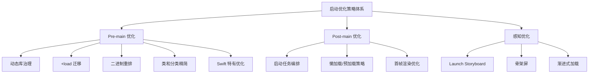
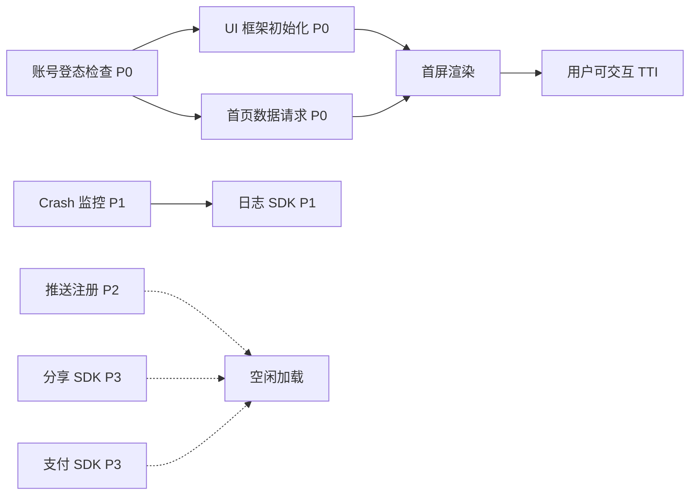
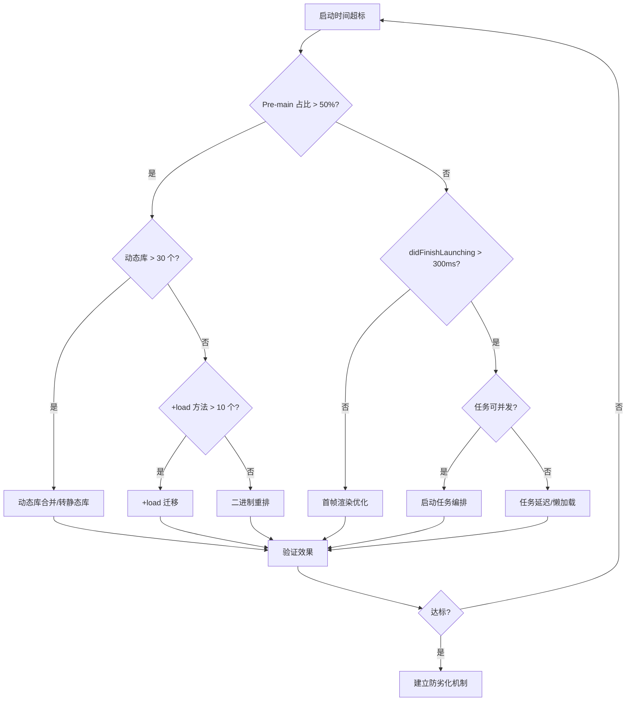

# 启动优化策略与实施方案深度解析

> 从策略选型到工程落地：Pre-main / Post-main / 感知优化三维体系，ROI 驱动优先级决策，持续防劣化闭环

---

## 目录

- [核心结论 TL;DR](#核心结论-tldr)
- [第一部分：优化策略全景（What）](#第一部分优化策略全景what)
- [第二部分：Pre-main 阶段优化](#第二部分pre-main-阶段优化)
- [第三部分：Post-main 阶段优化](#第三部分post-main-阶段优化)
- [第四部分：感知优化](#第四部分感知优化)
- [第五部分：实施优先级决策树](#第五部分实施优先级决策树)
- [第六部分：持续防劣化](#第六部分持续防劣化)
- [最佳实践](#最佳实践)
- [常见陷阱](#常见陷阱)
- [面试考点](#面试考点)
- [参考资源](#参考资源)

---

## 核心结论 TL;DR

| 维度 | 核心洞察 |
|------|----------|
| **策略分层** | Pre-main（二进制层面）→ Post-main（业务层面）→ 感知优化（用户体验层面），三层并行推进 |
| **ROI 最高** | 动态库转静态库、+load 迁移、启动任务延迟 — 投入小、收益大、风险低 |
| **二进制重排** | 通过 Order File 降低 Page Fault，冷启动可优化 10-30%，是 Pre-main 阶段的杀手锏 |
| **任务编排** | Post-main 核心是依赖图 + 拓扑排序 + 并发调度，将串行启动改为有序并发 |
| **防劣化** | CI 卡点 + 启动时间准入门禁 + 灰度监控，三位一体防止优化成果被回吞 |

---

## 第一部分：优化策略全景（What）

### 1.1 三阶段优化模型

**结论先行**：启动优化不是单点突破，而是 Pre-main / Post-main / 感知优化三层体系协同推进。



### 1.2 优化策略分类矩阵

```
投入 vs 收益矩阵：
                    高收益
                      │
         ┌────────────┼────────────┐
         │ 🌟 优先做   │ 💎 重点投入 │
         │            │            │
         │ +load 迁移  │ 二进制重排   │
         │ 延迟初始化  │ 启动任务编排  │
         │ 动态库合并  │ 启动链路重构  │
 低投入──┼────────────┼────────────┼──高投入
         │ ✅ 顺手做   │ ⚠️ 谨慎评估 │
         │            │            │
         │ 骨架屏     │ 动态库转静态 │
         │ 首屏占位图  │ Unused 类清理│
         │ 预编译优化  │ 架构级重构   │
         └────────────┼────────────┘
                      │
                    低收益
```

---

## 第二部分：Pre-main 阶段优化

### 2.1 动态库治理

**结论先行**：每个动态库带来 3-8ms 的加载开销，减少动态库数量是 Pre-main 优化的第一步。

```
动态库加载成本模型：
┌──────────────────────┬────────────────────────────┐
│ 开销项                │ 单个 dylib 典型耗时          │
├──────────────────────┼────────────────────────────┤
│ mmap 映射到虚拟内存    │ 1-2ms                      │
│ 符号解析与绑定         │ 1-3ms                      │
│ initializer 执行      │ 1-3ms                      │
│ 合计                  │ 3-8ms / dylib              │
├──────────────────────┼────────────────────────────┤
│ 50 个动态库           │ 150ms ~ 400ms               │
│ 优化到 20 个          │ 60ms ~ 160ms               │
│ 预估收益              │ 100ms ~ 240ms ⬇️            │
└──────────────────────┴────────────────────────────┘
```

#### 策略一：合并动态库

```ruby
# ✅ 推荐 — Podfile: 将多个小 Pod 合并为一个 umbrella framework
# Before: 每个 Pod 独立的动态库
pod 'SDKModuleA'
pod 'SDKModuleB'  
pod 'SDKModuleC'

# After: 合并为单个静态库
pod 'SDKUmbrella', :path => './LocalPods/SDKUmbrella'
# SDKUmbrella 内部 vendored_libraries 包含 A/B/C 的 .a
```

#### 策略二：动态库转静态库

```ruby
# ✅ 推荐 — CocoaPods: 全局使用静态库
use_frameworks! :linkage => :static

# 或者对特定 Pod 配置
pod 'SomeLibrary', :linkage => :static
```

```swift
// ✅ 推荐 — SPM: Package.swift 中指定静态库
let package = Package(
    name: "MyLibrary",
    products: [
        .library(
            name: "MyLibrary",
            type: .static,  // 显式指定静态链接
            targets: ["MyLibrary"]
        ),
    ],
    // ...
)
```

#### 策略三：延迟加载动态库

```objc
// ✅ 推荐 — dlopen 延迟加载非首屏必需的动态库
#import <dlfcn.h>

@implementation LazyFrameworkLoader

+ (void)loadShareSDKWhenNeeded {
    static dispatch_once_t onceToken;
    dispatch_once(&onceToken, ^{
        // 仅在用户触发分享时才加载
        void *handle = dlopen("ShareSDK.framework/ShareSDK", RTLD_LAZY);
        if (!handle) {
            NSLog(@"⚠️ Failed to load ShareSDK: %s", dlerror());
        }
    });
}

@end
```

```swift
// ✅ 推荐 — Swift: 延迟加载框架
class LazyFrameworkLoader {
    static func loadAnalyticsIfNeeded() {
        // 使用 Bundle.load() 延迟加载可选框架
        if let bundle = Bundle(path: Bundle.main.privateFrameworksPath! 
            + "/AnalyticsSDK.framework") {
            bundle.load()
        }
    }
}
```

### 2.2 +load 方法迁移

**结论先行**：每个 +load 方法在 Pre-main 阶段同步执行，累积效应会严重拖慢启动。

```
+load 执行时序：
Runtime 初始化
  ├─ 父类 +load（按编译顺序）
  ├─ 子类 +load（按编译顺序）
  └─ Category +load（按编译顺序）
  
问题：+load 是同步串行执行，任何一个慢都会阻塞整个链路
```

```objc
// ❌ 避免 — 在 +load 中做重型初始化
@implementation NetworkManager
+ (void)load {
    [self sharedInstance];           // 创建单例
    [self setupURLSessionConfig];   // 配置网络
    [self registerHTTPDNS];         // 注册 HTTPDNS
}
@end

// ✅ 推荐 — 方案一：迁移到 +initialize（惰性执行）
@implementation NetworkManager
+ (void)initialize {
    if (self == [NetworkManager class]) {
        // 首次使用时才初始化
        [self setupDefaultConfig];
    }
}
@end

// ✅ 推荐 — 方案二：显式初始化（可控时机）
@implementation NetworkManager
+ (void)setupAtLaunchPhase:(LaunchPhase)phase {
    if (phase == LaunchPhaseAfterFirstFrame) {
        [self sharedInstance];
        [self setupURLSessionConfig];
    }
}
@end

// ✅ 推荐 — 方案三：使用 __attribute__((constructor)) 替代
// 注意：constructor 也在 Pre-main 执行，但可以指定优先级
__attribute__((constructor(101)))  // 101-255，数字越大越晚执行
static void initLightweightModule(void) {
    // 仅做轻量注册，不做重型初始化
    RegisterModule(@"LightModule");
}
```

#### +load 迁移排查脚本

```bash
# 查找项目中所有 +load 实现
grep -rn "+\s*(void)load\b" --include="*.m" --include="*.mm" .

# 查找所有 __attribute__((constructor))
grep -rn "__attribute__((constructor" --include="*.m" --include="*.mm" --include="*.c" --include="*.cpp" .

# 查找 C++ 静态构造函数（全局对象）
grep -rn "^static.*=.*\[.*alloc\].*init" --include="*.m" --include="*.mm" .
```

### 2.3 二进制重排

**结论先行**：二进制重排通过 Order File 控制函数在二进制中的布局，将启动时调用的函数集中到相邻 Page，减少 Page Fault，冷启动可优化 10-30%。

#### Page Fault 原理

```
虚拟内存与 Page Fault：

App 启动时，代码按需从磁盘加载到物理内存（每次 16KB / Page）
当访问尚未加载的 Page → 触发 Page Fault → 阻塞等待磁盘 I/O

未重排：启动函数分散在不同 Page
┌────┬────┬────┬────┬────┬────┬────┬────┐
│ A  │ X  │ B  │ Y  │ C  │ Z  │ D  │ W  │  ← Pages
│启动 │无关│启动 │无关│启动 │无关│启动 │无关│
└────┴────┴────┴────┴────┴────┴────┴────┘
  ↑ PF    ↑ PF    ↑ PF    ↑ PF
  需要加载 4 个 Page → 4 次 Page Fault

重排后：启动函数集中到前几个 Page
┌────┬────┬────┬────┬────┬────┬────┬────┐
│ A  │ B  │ C  │ D  │ X  │ Y  │ Z  │ W  │  ← Pages
│启动 │启动│启动│启动│无关 │无关│无关│无关│
└────┴────┴────┴────┴────┴────┴────┴────┘
  ↑ PF ↑ PF
  只需加载 2 个 Page → 2 次 Page Fault → 减少 50% I/O
```

#### Order File 生成方法

```objc
// ✅ 推荐 — 使用 SanitizerCoverage 自动采集启动调用函数
// Build Settings: Other C Flags 添加 -fsanitize-coverage=func,trace-pc-guard

// 实现回调函数
#import <dlfcn.h>
#import <libkern/OSAtomic.h>
#import <sanitizer/coverage_interface.h>

static OSQueueHead symbolList = OS_ATOMIC_QUEUE_INIT;

typedef struct {
    void *pc;
    void *next;
} SymbolNode;

// 编译器在每个函数入口自动插入调用
void __sanitizer_cov_trace_pc_guard(uint32_t *guard) {
    if (!*guard) return;  // 只记录第一次调用
    *guard = 0;
    
    void *PC = __builtin_return_address(0);
    
    SymbolNode *node = malloc(sizeof(SymbolNode));
    node->pc = PC;
    node->next = NULL;
    
    OSAtomicEnqueue(&symbolList, node, offsetof(SymbolNode, next));
}

void __sanitizer_cov_trace_pc_guard_init(uint32_t *start, uint32_t *stop) {
    static BOOL initialized = NO;
    if (initialized) return;
    initialized = YES;
    
    for (uint32_t *x = start; x < stop; x++) {
        *x = 1;  // 启用所有 guard
    }
}

// 在首帧渲染后导出 Order File
+ (void)exportOrderFile {
    NSMutableArray<NSString *> *symbols = [NSMutableArray array];
    
    while (YES) {
        SymbolNode *node = OSAtomicDequeue(&symbolList, 
                                            offsetof(SymbolNode, next));
        if (!node) break;
        
        Dl_info info;
        dladdr(node->pc, &info);
        
        NSString *name = @(info.dli_sname);
        // ObjC 方法名以 +[ 或 -[ 开头不需要加 _
        if (![name hasPrefix:@"+["] && ![name hasPrefix:@"-["]) {
            name = [@"_" stringByAppendingString:name];
        }
        
        if (![symbols containsObject:name]) {
            [symbols addObject:name];
        }
        
        free(node);
    }
    
    // 反转（因为使用的是栈结构）
    NSArray *reversed = [[symbols reverseObjectEnumerator] allObjects];
    NSString *content = [reversed componentsJoinedByString:@"\n"];
    
    NSString *path = [NSTemporaryDirectory() 
                      stringByAppendingPathComponent:@"app.order"];
    [content writeToFile:path atomically:YES 
                encoding:NSUTF8StringEncoding error:nil];
    
    NSLog(@"📦 Order File saved to: %@", path);
}
```

```
# Order File 配置
# Xcode → Build Settings → Order File → $(SRCROOT)/app.order

# app.order 文件内容示例：
_main
_UIApplicationMain
-[AppDelegate application:didFinishLaunchingWithOptions:]
-[AppDelegate setupRootViewController]
-[HomeViewController viewDidLoad]
-[HomeViewController setupUI]
-[NetworkManager sharedInstance]
# ... 其余启动路径函数
```

### 2.4 类和分类精简

**结论先行**：每个 ObjC 类在启动时都要注册到 Runtime，类越多、Pre-main 越慢。

```objc
// ❌ 避免 — 大量无用类留在工程中
// UnusedLegacyManager.h — 2年没人用了
@interface UnusedLegacyManager : NSObject
@end

// ❌ 避免 — 过度拆分 Category
// UIView+Shadow.m
// UIView+Border.m  
// UIView+Corner.m
// UIView+Gradient.m
// 每个 Category 都会增加 Runtime 注册开销
```

```objc
// ✅ 推荐 — 合并 Category
// UIView+Decoration.m — 合并为一个
@implementation UIView (Decoration)
- (void)applyShadow:(NSDictionary *)config { /* ... */ }
- (void)applyBorder:(NSDictionary *)config { /* ... */ }
- (void)applyCornerRadius:(CGFloat)radius { /* ... */ }
@end
```

**Unused Class 检测方案**：

```bash
# 方案一：使用 AppCode → Inspect Code → Unused code
# 方案二：LinkMap 分析
# 方案三：通过 __DATA,__objc_classrefs 和 __DATA,__objc_classlist 差集

# otool 提取已引用的类
otool -v -s __DATA __objc_classrefs MyApp.app/MyApp | grep "_OBJC_CLASS"

# otool 提取所有定义的类  
otool -v -s __DATA __objc_classlist MyApp.app/MyApp | grep "_OBJC_CLASS"

# 差集即为 unused classes
```

### 2.5 Swift 特有优化

```swift
// ❌ 避免 — 大量协议一致性（Protocol Conformance）增加元数据
// 每个 struct/class 遵循的每个协议都会生成协议一致性记录
// dyld 启动时需要注册所有协议一致性

struct MyModel: Codable, Equatable, Hashable, CustomStringConvertible,
                CustomDebugStringConvertible, Identifiable {
    // 6 个协议一致性，每个增加元数据
}

// ✅ 推荐 — 按需遵循协议，避免不必要的一致性
struct MyModel: Codable, Equatable {
    // 只声明实际使用的协议
}

// ✅ 推荐 — 减少泛型特化数量
// 泛型特化（Specialization）会生成独立的函数副本
// 过多特化 → 二进制膨胀 → 更多 Page Fault
```

```
Swift 启动开销来源：
┌──────────────────────────┬────────────────────────┐
│ 开销项                    │ 优化方式                │
├──────────────────────────┼────────────────────────┤
│ Protocol Conformance 注册│ 减少不必要的协议遵循    │
│ Type Metadata 初始化     │ 避免过度泛型特化         │
│ Global Actor 初始化      │ 延迟到首次使用           │
│ Module 初始化器           │ 精简 @_cdecl 导出        │
│ 泛型特化（Specialization）│ 控制特化数量             │
└──────────────────────────┴────────────────────────┘
```

---

## 第三部分：Post-main 阶段优化

### 3.1 启动任务编排框架

**结论先行**：Post-main 优化的核心是将无序串行的启动任务，转化为有序并发的任务调度，依赖图 + 拓扑排序是关键算法。

#### 任务依赖图与调度模型



#### 任务分级策略

```
启动任务优先级分级：
┌──────────────┬─────────────────────────────────────────────┐
│ 级别          │ 定义 & 示例                                  │
├──────────────┼─────────────────────────────────────────────┤
│ P0 首屏必要   │ 不执行则首屏无法展示                          │
│              │ 例：账号登态检查、首页数据请求、UI 框架初始化    │
├──────────────┼─────────────────────────────────────────────┤
│ P1 首屏非必要 │ 不影响首屏展示，但需在启动后尽快完成            │
│              │ 例：推送注册、日志 SDK、Crash 监控初始化        │
├──────────────┼─────────────────────────────────────────────┤
│ P2 延迟加载   │ 可延迟到首屏展示后或用户触发时                  │
│              │ 例：分享 SDK、支付 SDK、IM SDK                 │
├──────────────┼─────────────────────────────────────────────┤
│ P3 空闲加载   │ 在 RunLoop 空闲时加载                         │
│              │ 例：预热缓存、数据库迁移检查、AB 实验拉取       │
└──────────────┴─────────────────────────────────────────────┘
```

#### 简易启动任务调度器实现

```swift
// ✅ 推荐 — Swift: 启动任务调度器
protocol LaunchTask: AnyObject {
    var taskName: String { get }
    var priority: LaunchPriority { get }
    var dependencies: [String] { get }       // 依赖的任务名
    var runOnMainThread: Bool { get }        // 是否必须主线程
    func execute(completion: @escaping () -> Void)
}

enum LaunchPriority: Int, Comparable {
    case critical = 0    // P0 首屏必要
    case high = 1        // P1 首屏非必要
    case normal = 2      // P2 延迟加载
    case low = 3         // P3 空闲加载
    
    static func < (lhs: Self, rhs: Self) -> Bool {
        lhs.rawValue < rhs.rawValue
    }
}

class LaunchTaskScheduler {
    
    private var tasks: [String: LaunchTask] = [:]
    private var completedTasks: Set<String> = []
    private let lock = NSLock()
    private let concurrentQueue = DispatchQueue(
        label: "com.app.launch.scheduler",
        attributes: .concurrent
    )
    
    func register(_ task: LaunchTask) {
        tasks[task.taskName] = task
    }
    
    func start() {
        let sorted = topologicalSort()
        executeTasks(sorted)
    }
    
    // 拓扑排序：确保依赖关系正确
    private func topologicalSort() -> [LaunchTask] {
        var inDegree: [String: Int] = [:]
        var graph: [String: [String]] = [:]
        
        for (name, task) in tasks {
            inDegree[name] = task.dependencies.count
            for dep in task.dependencies {
                graph[dep, default: []].append(name)
            }
        }
        
        // BFS 拓扑排序
        var queue: [LaunchTask] = []
        for (name, degree) in inDegree where degree == 0 {
            if let task = tasks[name] { queue.append(task) }
        }
        
        var result: [LaunchTask] = []
        while !queue.isEmpty {
            // 按优先级排序当前可执行任务
            queue.sort { $0.priority < $1.priority }
            let task = queue.removeFirst()
            result.append(task)
            
            for next in graph[task.taskName] ?? [] {
                inDegree[next]! -= 1
                if inDegree[next] == 0, let nextTask = tasks[next] {
                    queue.append(nextTask)
                }
            }
        }
        
        return result
    }
    
    private func executeTasks(_ sorted: [LaunchTask]) {
        let group = DispatchGroup()
        
        for task in sorted {
            // 等待依赖完成
            waitForDependencies(task)
            
            group.enter()
            let executeBlock = {
                task.execute {
                    self.lock.lock()
                    self.completedTasks.insert(task.taskName)
                    self.lock.unlock()
                    group.leave()
                }
            }
            
            if task.runOnMainThread {
                DispatchQueue.main.async(execute: executeBlock)
            } else {
                concurrentQueue.async(execute: executeBlock)
            }
        }
        
        group.notify(queue: .main) {
            print("🚀 All launch tasks completed")
        }
    }
    
    private func waitForDependencies(_ task: LaunchTask) {
        for dep in task.dependencies {
            while true {
                lock.lock()
                let completed = completedTasks.contains(dep)
                lock.unlock()
                if completed { break }
                usleep(1000) // 1ms
            }
        }
    }
}
```

```objc
// ✅ 推荐 — ObjC: 启动任务注册与使用
// LaunchTaskProtocol.h
@protocol LaunchTaskProtocol <NSObject>
@property (nonatomic, readonly) NSString *taskName;
@property (nonatomic, readonly) NSInteger priority;
@property (nonatomic, readonly) NSArray<NSString *> *dependencies;
@property (nonatomic, readonly) BOOL requiresMainThread;
- (void)executeWithCompletion:(void(^)(void))completion;
@end

// 使用示例
@interface AccountCheckTask : NSObject <LaunchTaskProtocol>
@end

@implementation AccountCheckTask
- (NSString *)taskName { return @"AccountCheck"; }
- (NSInteger)priority { return 0; }  // P0 最高优先级
- (NSArray<NSString *> *)dependencies { return @[]; } // 无依赖
- (BOOL)requiresMainThread { return NO; }

- (void)executeWithCompletion:(void(^)(void))completion {
    // 检查登录态
    [AccountManager checkLoginStateWithCompletion:^(BOOL isLoggedIn) {
        completion();
    }];
}
@end

// AppDelegate 中注册
- (BOOL)application:(UIApplication *)application 
    didFinishLaunchingWithOptions:(NSDictionary *)launchOptions {
    
    LaunchTaskScheduler *scheduler = [LaunchTaskScheduler shared];
    [scheduler registerTask:[AccountCheckTask new]];
    [scheduler registerTask:[CrashMonitorTask new]];
    [scheduler registerTask:[PushRegistrationTask new]];
    [scheduler registerTask:[HomeDataFetchTask new]]; // 依赖 AccountCheck
    [scheduler start];
    
    return YES;
}
```

### 3.2 懒加载 / 预加载策略矩阵

```
策略选择矩阵：
┌───────────────────┬────────────┬────────────┬────────────────────┐
│ 模块              │ 使用频率    │ 首屏需要？  │ 推荐策略            │
├───────────────────┼────────────┼────────────┼────────────────────┤
│ 首页 UI 框架      │ 必用       │ ✅ 是      │ 预加载（P0 同步）    │
│ 网络库            │ 必用       │ ✅ 是      │ 预加载（P0 并发）    │
│ Crash 监控        │ 必用       │ ❌ 否      │ 预加载（P1 并发）    │
│ 埋点 SDK          │ 必用       │ ❌ 否      │ 预加载（P1 并发）    │
│ 推送 SDK          │ 高频       │ ❌ 否      │ 延迟加载（P2）       │
│ IM SDK            │ 中频       │ ❌ 否      │ 延迟加载（P2）       │
│ 分享 SDK          │ 低频       │ ❌ 否      │ 懒加载（用户触发）   │
│ 支付 SDK          │ 低频       │ ❌ 否      │ 懒加载（用户触发）   │
│ AI 特效 SDK       │ 极低频     │ ❌ 否      │ 懒加载（进入页面时） │
└───────────────────┴────────────┴────────────┴────────────────────┘
```

### 3.3 首帧渲染优化

**结论先行**：首帧越早渲染出来，用户越早看到内容，感知启动时间越短。

```swift
// ❌ 避免 — 在 viewDidLoad 中同步加载所有数据再渲染
class HomeViewController: UIViewController {
    override func viewDidLoad() {
        super.viewDidLoad()
        let data = NetworkManager.syncFetchHomeData() // 阻塞主线程！
        self.tableView.reloadData()
    }
}

// ✅ 推荐 — 先渲染骨架屏/缓存数据，异步加载最新数据
class HomeViewController: UIViewController {
    override func viewDidLoad() {
        super.viewDidLoad()
        
        // 1. 立即展示骨架屏
        showSkeletonView()
        
        // 2. 尝试展示本地缓存
        if let cachedData = CacheManager.homeData {
            renderContent(cachedData)
            hideSkeletonView()
        }
        
        // 3. 异步拉取最新数据
        NetworkManager.fetchHomeData { [weak self] result in
            DispatchQueue.main.async {
                self?.hideSkeletonView()
                switch result {
                case .success(let data):
                    self?.renderContent(data)
                    CacheManager.saveHomeData(data)
                case .failure:
                    if CacheManager.homeData == nil {
                        self?.showErrorView()
                    }
                }
            }
        }
    }
}
```

```objc
// ✅ 推荐 — ObjC: 异步首屏渲染
- (void)viewDidLoad {
    [super viewDidLoad];
    
    // 1. 骨架屏先行
    [self showSkeletonView];
    
    // 2. 缓存优先
    id cachedData = [CacheManager homeData];
    if (cachedData) {
        [self renderContent:cachedData];
        [self hideSkeletonView];
    }
    
    // 3. 异步刷新
    __weak typeof(self) weakSelf = self;
    [NetworkManager fetchHomeDataWithCompletion:^(id data, NSError *error) {
        dispatch_async(dispatch_get_main_queue(), ^{
            __strong typeof(weakSelf) self = weakSelf;
            [self hideSkeletonView];
            if (data) {
                [self renderContent:data];
            }
        });
    }];
}
```

---

## 第四部分：感知优化

### 4.1 Launch Storyboard 优化

**结论先行**：Launch Storyboard 是系统在 App 进程启动前就展示的静态界面，优化它可以减少"白屏感"。

```
Launch Storyboard 工作原理：
1. 用户点击 App Icon
2. SpringBoard 立即展示 Launch Storyboard 截图（缓存）
3. App 进程启动（Pre-main + Post-main）
4. App 首帧渲染完成，替换 Launch Storyboard

优化策略：
┌──────────────────────────┬──────────────────────────────┐
│ 策略                      │ 效果                          │
├──────────────────────────┼──────────────────────────────┤
│ Launch Screen 与首屏风格一致│ 视觉连续性，减少跳变感         │
│ 避免复杂布局               │ 系统加载 Launch Screen 更快     │
│ 使用品牌色背景             │ 即使等待也有品牌识别            │
│ 避免使用大图片             │ 减少 Launch Screen 加载时间     │
└──────────────────────────┴──────────────────────────────┘
```

### 4.2 骨架屏设计与实现

```swift
// ✅ 推荐 — 轻量骨架屏实现
class SkeletonView: UIView {
    
    private var shimmerLayer: CAGradientLayer?
    
    func addSkeletonBlock(frame: CGRect, cornerRadius: CGFloat = 4) {
        let block = UIView(frame: frame)
        block.backgroundColor = UIColor(white: 0.9, alpha: 1.0)
        block.layer.cornerRadius = cornerRadius
        block.clipsToBounds = true
        addSubview(block)
    }
    
    func startShimmer() {
        let gradient = CAGradientLayer()
        gradient.colors = [
            UIColor(white: 0.9, alpha: 1.0).cgColor,
            UIColor(white: 0.95, alpha: 1.0).cgColor,
            UIColor(white: 0.9, alpha: 1.0).cgColor
        ]
        gradient.startPoint = CGPoint(x: 0, y: 0.5)
        gradient.endPoint = CGPoint(x: 1, y: 0.5)
        gradient.locations = [0.0, 0.5, 1.0]
        gradient.frame = CGRect(
            x: -bounds.width, y: 0,
            width: bounds.width * 3, height: bounds.height
        )
        layer.mask = gradient
        shimmerLayer = gradient
        
        let animation = CABasicAnimation(keyPath: "locations")
        animation.fromValue = [-1.0, -0.5, 0.0]
        animation.toValue = [1.0, 1.5, 2.0]
        animation.duration = 1.5
        animation.repeatCount = .infinity
        gradient.add(animation, forKey: "shimmer")
    }
    
    func stopShimmer() {
        shimmerLayer?.removeAllAnimations()
        layer.mask = nil
    }
}
```

### 4.3 渐进式加载策略

```swift
// ✅ 推荐 — 分帧渲染：将首屏渲染分散到多个 RunLoop 周期
class ProgressiveRenderer {
    
    private var renderTasks: [() -> Void] = []
    
    func addRenderTask(_ task: @escaping () -> Void) {
        renderTasks.append(task)
    }
    
    func startRendering() {
        scheduleNextTask()
    }
    
    private func scheduleNextTask() {
        guard !renderTasks.isEmpty else { return }
        let task = renderTasks.removeFirst()
        
        // 利用 RunLoop 空闲时机执行
        CFRunLoopPerformBlock(CFRunLoopGetMain(), 
                              CFRunLoopMode.defaultMode.rawValue) {
            task()
            self.scheduleNextTask()
        }
    }
}

// 使用示例
let renderer = ProgressiveRenderer()
renderer.addRenderTask { self.renderNavigationBar() }   // 第 1 帧
renderer.addRenderTask { self.renderTopBanner() }       // 第 2 帧
renderer.addRenderTask { self.renderFeedList() }        // 第 3 帧
renderer.addRenderTask { self.renderTabBar() }          // 第 4 帧
renderer.startRendering()
```

---

## 第五部分：实施优先级决策树

**结论先行**：优化策略的选择应遵循 ROI（投入产出比）原则，先做投入小收益大的，再攻坚高投入高收益的。



### ROI 排序建议

```
实施优先级排序（按 ROI 从高到低）：

Phase 1 — Quick Wins（1-2 周）
┌──┬──────────────────────┬────────┬─────────┬───────┐
│# │ 优化项                │ 投入    │ 预期收益 │ 风险  │
├──┼──────────────────────┼────────┼─────────┼───────┤
│1 │ +load 方法迁移        │ 1-2天  │ 50-200ms│ 低    │
│2 │ 启动任务延迟/移除      │ 1-2天  │ 50-150ms│ 低    │
│3 │ 骨架屏/占位视图        │ 1天    │ 感知提升 │ 极低  │
│4 │ 无用代码清理           │ 2-3天  │ 20-80ms │ 低    │
└──┴──────────────────────┴────────┴─────────┴───────┘

Phase 2 — Core Optimization（2-4 周）
┌──┬──────────────────────┬────────┬─────────┬───────┐
│# │ 优化项                │ 投入    │ 预期收益 │ 风险  │
├──┼──────────────────────┼────────┼─────────┼───────┤
│5 │ 动态库合并/转静态      │ 1-2周  │100-300ms│ 中    │
│6 │ 启动任务编排框架       │ 1-2周  │100-200ms│ 中    │
│7 │ 二进制重排             │ 1周    │ 80-200ms│ 中    │
│8 │ 首屏异步渲染           │ 1周    │ 50-150ms│ 中    │
└──┴──────────────────────┴────────┴─────────┴───────┘

Phase 3 — Deep Optimization（1-2 月）
┌──┬──────────────────────┬────────┬─────────┬───────┐
│# │ 优化项                │ 投入    │ 预期收益 │ 风险  │
├──┼──────────────────────┼────────┼─────────┼───────┤
│9 │ 启动链路架构重构       │ 2-4周  │200-500ms│ 高    │
│10│ 按需加载模块化         │ 2-4周  │100-300ms│ 高    │
│11│ Swift 元数据精简       │ 1-2周  │ 30-80ms │ 中    │
└──┴──────────────────────┴────────┴─────────┴───────┘
```

---

## 第六部分：持续防劣化

### 6.1 启动时间准入门禁

**结论先行**：优化成果必须通过机制守住，否则新需求会在几个版本内吞噬全部优化收益。

```swift
// ✅ 推荐 — 启动任务注册强制 Code Review 卡点
// 所有新增启动任务必须：
// 1. 声明优先级和依赖
// 2. 提供耗时预估
// 3. 说明为什么必须在启动时执行
// 4. 经过性能评审

/// 启动任务注册注解（辅助 Code Review）
@propertyWrapper
struct LaunchTaskRegistration {
    var wrappedValue: LaunchTask
    
    /// - Parameters:
    ///   - reason: 为什么必须在启动时执行
    ///   - estimatedDuration: 预估耗时（ms）
    ///   - reviewer: 性能评审人
    init(wrappedValue: LaunchTask,
         reason: String,
         estimatedDuration: Int,
         reviewer: String) {
        self.wrappedValue = wrappedValue
        // 编译期记录，用于生成启动任务清单
    }
}
```

### 6.2 CI 卡点：自动化测量 + 阈值告警

```yaml
# ✅ 推荐 — CI Pipeline 启动性能卡点配置
# .github/workflows/launch-perf-gate.yml
name: Launch Performance Gate

on:
  pull_request:
    branches: [main, develop]

jobs:
  launch-perf-test:
    runs-on: macos-14
    steps:
      - uses: actions/checkout@v4
      
      - name: Build Release
        run: |
          xcodebuild build-for-testing \
            -scheme MyApp \
            -configuration Release \
            -destination 'platform=iOS Simulator,name=iPhone 15'
      
      - name: Run Launch Performance Tests
        run: |
          xcodebuild test \
            -scheme MyApp \
            -configuration Release \
            -destination 'platform=iOS Simulator,name=iPhone 15' \
            -only-testing:MyAppPerformanceTests/LaunchPerformanceTests
      
      - name: Check Thresholds
        run: |
          # 解析 xcresult 中的启动时间
          LAUNCH_TIME=$(xcrun xcresulttool get --format json \
            --path TestResults.xcresult | jq '.launchTime')
          
          THRESHOLD=500  # 500ms
          if [ "$LAUNCH_TIME" -gt "$THRESHOLD" ]; then
            echo "❌ Launch time ${LAUNCH_TIME}ms exceeds threshold ${THRESHOLD}ms"
            exit 1
          fi
          echo "✅ Launch time ${LAUNCH_TIME}ms within threshold"
```

### 6.3 灰度监控与版本趋势

```
灰度监控策略：
┌──────────────┬────────────────────────────────────────────┐
│ 阶段          │ 监控重点                                    │
├──────────────┼────────────────────────────────────────────┤
│ 灰度 1%      │ P99 是否出现极端值（> 5s）                   │
│ 灰度 5%      │ P90 是否相比上一版本上涨 > 10%               │
│ 灰度 20%     │ P50 是否相比上一版本上涨 > 5%                │
│ 灰度 50%     │ 设备分布验证：低端机 P90 < 2s                │
│ 全量发布      │ 持续监控 7 天，确认趋势稳定                  │
└──────────────┴────────────────────────────────────────────┘

版本趋势看板核心指标：
1. 各版本 P50/P90/P99 折线图
2. 各版本启动任务数量变化
3. 各版本动态库数量变化
4. 各版本二进制大小变化
5. 低端机 vs 高端机启动时间对比
```

```swift
// ✅ 推荐 — 端侧版本趋势记录
class LaunchTrendTracker {
    
    private static let key = "launch_time_history"
    
    struct LaunchRecord: Codable {
        let version: String
        let timestamp: Date
        let coldLaunchTime: Double
        let premaineTime: Double
        let postmainTime: Double
    }
    
    static func record(premain: Double, postmain: Double) {
        let version = Bundle.main.infoDictionary?["CFBundleShortVersionString"] as? String ?? "unknown"
        let record = LaunchRecord(
            version: version,
            timestamp: Date(),
            coldLaunchTime: premain + postmain,
            premaineTime: premain,
            postmainTime: postmain
        )
        
        var history = loadHistory()
        history.append(record)
        // 保留最近 50 条
        if history.count > 50 { history = Array(history.suffix(50)) }
        saveHistory(history)
        
        // 检测劣化
        detectRegression(current: record, history: history)
    }
    
    private static func detectRegression(current: LaunchRecord, 
                                          history: [LaunchRecord]) {
        let previousVersionRecords = history.filter { 
            $0.version != current.version 
        }
        guard let avgPrevious = previousVersionRecords
            .map(\.coldLaunchTime)
            .average else { return }
        
        let regressionRatio = (current.coldLaunchTime - avgPrevious) / avgPrevious
        if regressionRatio > 0.15 {  // 劣化超过 15%
            print("⚠️ Launch time regression detected: \(Int(regressionRatio * 100))%")
        }
    }
    
    private static func loadHistory() -> [LaunchRecord] {
        guard let data = UserDefaults.standard.data(forKey: key),
              let records = try? JSONDecoder().decode([LaunchRecord].self, from: data)
        else { return [] }
        return records
    }
    
    private static func saveHistory(_ records: [LaunchRecord]) {
        if let data = try? JSONEncoder().encode(records) {
            UserDefaults.standard.set(data, forKey: key)
        }
    }
}

private extension Array where Element == Double {
    var average: Double? {
        guard !isEmpty else { return nil }
        return reduce(0, +) / Double(count)
    }
}
```

---

## 最佳实践

### ✅ 推荐做法

```
1. 数据驱动优化
   - 先度量，再优化，后验证
   - 每次优化必须有量化数据支撑
   - 使用 A/B 实验验证优化效果

2. 分阶段实施
   - Phase 1：Quick Wins（投入小、收益大、风险低）
   - Phase 2：Core（投入中、收益中、风险可控）
   - Phase 3：Deep（投入大、收益高、需架构支撑）

3. 建立启动任务治理机制
   - 所有启动任务注册到统一调度器
   - 新增启动任务需经过性能评审
   - 定期审计启动任务列表

4. 多机型覆盖
   - 至少在低 / 中 / 高三档设备上验证
   - 低端机是重点：iPhone 8 / SE 2 上达标才算真达标
   - 关注设备热状态对启动的影响
```

---

## 常见陷阱

### ❌ 陷阱 1：过度优化 Pre-main 忽视 Post-main

```
问题：花大量精力优化 Pre-main（二进制重排、动态库治理），
      却忽视 didFinishLaunching 中 500ms 的同步网络请求
解法：先看数据！T1 和 T2 哪个大就先优化哪个
      大多数 App 的 Post-main 优化空间更大
```

### ❌ 陷阱 2：启动任务"只增不减"

```
问题：每个版本新增 2-3 个启动任务，半年后启动时间回到优化前
      典型：产品说"这个功能启动时要初始化"
案例：V1.0 启动 500ms → 优化到 300ms → V2.0 又回到 600ms
解法：启动任务准入门禁 + 定期审计 + CI 卡点
```

### ❌ 陷阱 3：二进制重排后不维护 Order File

```
问题：生成 Order File 后再也没更新，新增代码不在 Order File 中
      几个版本后 Order File 覆盖率从 95% 降到 50%
解法：CI 中定期重新采集 Order File，或使用自动化脚本在每次发版前更新
```

### ❌ 陷阱 4：所有优化一起上，无法归因

```
问题：同时做了 5 个优化，启动时间降了 200ms，不知道哪个生效
      如果某个优化引入了 Bug 也无法定位
解法：一次一个优化，逐步验证
      如果时间紧，至少按阶段分批上线
```

### ❌ 陷阱 5：忽略首次安装 / 版本更新场景

```
问题：首次安装启动含数据库建表、引导页渲染等，可能比常规启动慢 2-3 倍
      版本更新含数据迁移、缓存重建等
      不区分统计会导致数据失真
解法：区分场景打标，首次安装和版本更新单独设定阈值
      例：常规冷启动 < 500ms，首次安装 < 1500ms，版本更新 < 800ms
```

---

## 面试考点

### 题目 1：请设计一个完整的启动优化方案，从分析到落地

**参考答案要点**：
1. **度量先行**：埋点测量 T1/T2/TTI，建立 P50/P90/P99 基线
2. **分析归因**：Instruments App Launch 分析，DYLD_PRINT_STATISTICS 查看 Pre-main，os_signpost 标记 Post-main 各阶段
3. **Pre-main 优化**：动态库治理 → +load 迁移 → 二进制重排 → 无用类清理
4. **Post-main 优化**：启动任务编排（依赖图 + 拓扑排序 + 并发调度）→ 懒加载 → 首帧优化
5. **感知优化**：骨架屏 + 渐进式渲染
6. **防劣化**：CI 卡点 + 启动任务准入 + 灰度监控
7. **持续迭代**：版本趋势跟踪，定期审计

### 题目 2：什么是二进制重排？原理和实现方式？

**参考答案要点**：
- **原理**：App 代码按 Page（16KB）从磁盘加载到内存，启动时调用的函数如果分散在不同 Page，会产生大量 Page Fault。二进制重排将启动路径上的函数集中到相邻 Page，减少 Page Fault 次数。
- **实现**：通过 Clang 的 SanitizerCoverage（`-fsanitize-coverage=func,trace-pc-guard`）在每个函数入口插桩，启动时记录调用顺序，生成 Order File
- **配置**：Xcode Build Settings → Order File 指定路径
- **效果**：冷启动 Page Fault 减少 50-70%，耗时优化 10-30%
- **维护**：需要定期更新 Order File，否则覆盖率会逐渐下降

### 题目 3：如何设计启动任务编排框架？

**参考答案要点**：
- **任务抽象**：协议定义（taskName / priority / dependencies / runOnMainThread / execute）
- **依赖管理**：有向无环图（DAG）+ 拓扑排序确保执行顺序
- **优先级**：P0（首屏必要）→ P1（首屏非必要）→ P2（延迟加载）→ P3（空闲加载）
- **并发调度**：无依赖的同优先级任务并发执行，主线程任务和子线程任务分离
- **监控**：记录每个任务实际耗时，超时告警
- **追问**：如何处理循环依赖？— 注册时检测环，编译期静态分析

### 题目 4：+load 和 +initialize 的区别？为什么要迁移？

**参考答案要点**：
- **+load**：Runtime 加载类时调用，Pre-main 阶段，所有 +load 串行执行，即使类未被使用也会调用
- **+initialize**：类首次收到消息时调用，惰性执行，只有实际使用时才触发
- **迁移原因**：+load 在 Pre-main 阻塞启动，累积效应显著。10 个 +load 各 5ms = 50ms
- **注意**：+initialize 有继承问题（子类未实现时会调用父类的），需要 `if (self == [ClassName class])` 保护
- **替代方案**：显式初始化、启动任务调度器注册

### 题目 5：如何防止启动时间劣化？

**参考答案要点**：
- **CI 卡点**：PR 合并前自动运行启动性能测试，超阈值则阻断
- **启动任务准入**：新增启动任务需要性能评审（reason + 预估耗时 + reviewer）
- **灰度监控**：按灰度比例逐步放量，监控 P50/P90/P99 变化趋势
- **定期审计**：每月 review 启动任务列表，清理不再需要的任务
- **告警机制**：P90 环比上涨 > 10% 或 P99 > 绝对阈值自动告警

---

## 参考资源

### Apple 官方资源
- [WWDC 2019 - Optimizing App Launch](https://developer.apple.com/videos/play/wwdc2019/423/)
- [WWDC 2016 - Optimizing App Startup Time](https://developer.apple.com/videos/play/wwdc2016/406/)
- [WWDC 2022 - Improve app size and runtime performance](https://developer.apple.com/videos/play/wwdc2022/110363/)
- [Reducing your app's launch time](https://developer.apple.com/documentation/xcode/reducing-your-app-s-launch-time)

### 社区资源
- [抖音品质建设 - iOS 启动优化实践](https://mp.weixin.qq.com/s/Kf3EbDIUuf0aWVT-UCEmbA)
- [Facebook App 二进制重排实践](https://engineering.fb.com/2015/12/05/ios/optimizing-facebook-for-ios-start-time/)
- [SanitizerCoverage Documentation](https://clang.llvm.org/docs/SanitizerCoverage.html)

### 交叉引用
- [启动流程分析与度量体系](./启动流程分析与度量体系_详细解析.md)
- [启动优化与包体积治理](../../iOS_Framework_Architecture/06_性能优化框架/启动优化与包体积治理_详细解析.md)
