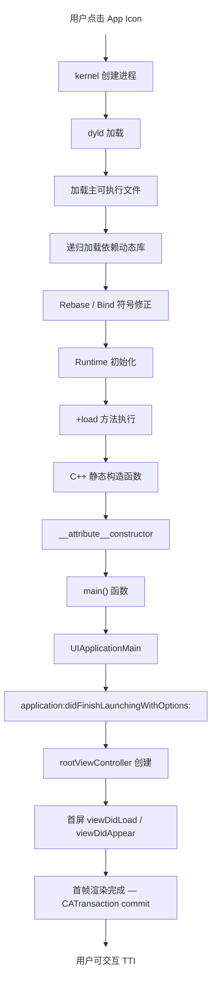
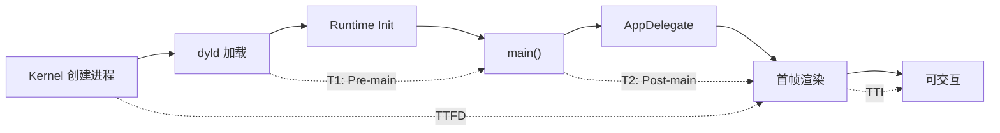
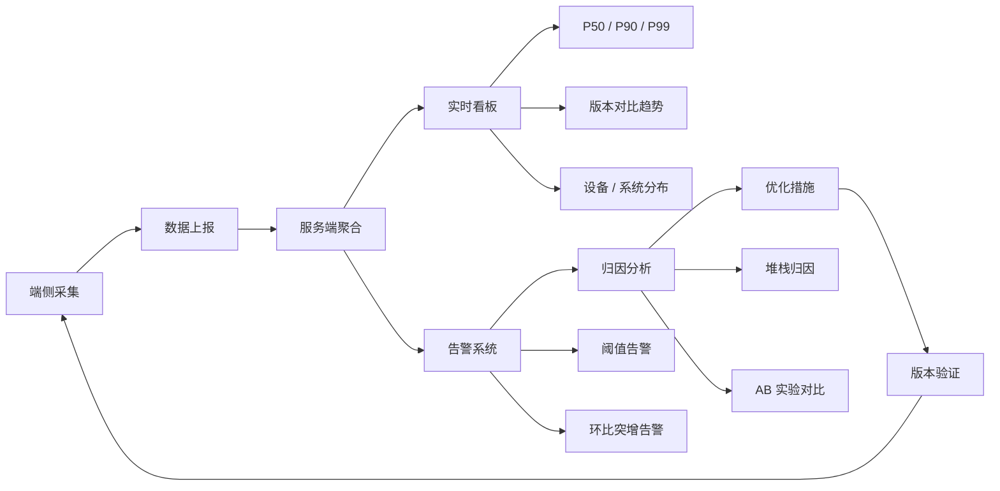

# 启动流程分析与度量体系深度解析

> 从 kernel 到首帧渲染：全面拆解 iOS App 启动关键路径，建立科学度量体系，数据驱动启动性能治理

---

## 目录

- [核心结论 TL;DR](#核心结论-tldr)
- [第一部分：启动流程全景（What）](#第一部分启动流程全景what)
- [第二部分：度量体系的必要性（Why）](#第二部分度量体系的必要性why)
- [第三部分：度量体系建设（How）](#第三部分度量体系建设how)
- [第四部分：监控闭环体系](#第四部分监控闭环体系)
- [最佳实践](#最佳实践)
- [常见陷阱](#常见陷阱)
- [面试考点](#面试考点)
- [参考资源](#参考资源)

---

## 核心结论 TL;DR

| 维度 | 核心洞察 |
|------|----------|
| **启动三态** | 冷启动（进程不存在）、热启动（进程在内存中）、恢复启动（后台挂起恢复），冷启动是优化重点 |
| **关键路径** | kernel → dyld3/4 → Runtime Init → main() → UIApplicationMain → didFinishLaunching → 首帧渲染 |
| **核心指标** | T1（Pre-main）+ T2（Post-main 到首帧）= TTI，Apple 建议冷启动 < 400ms |
| **度量手段** | mach_absolute_time 埋点 + os_signpost 可视化 + MetricKit 线上采集 + DYLD_PRINT_STATISTICS 诊断 |
| **监控闭环** | 采集 → 上报 → 聚合（P50/P90/P99）→ 告警 → 归因 → 优化验证，形成数据驱动闭环 |

---

## 第一部分：启动流程全景（What）

### 1.1 启动三态模型

**结论先行**：iOS App 启动分为三种状态，冷启动耗时最长、优化收益最大，是性能治理的核心目标。

| 启动类型 | 定义 | 进程状态 | 典型耗时 | 优化优先级 |
|----------|------|----------|----------|------------|
| **冷启动（Cold Launch）** | 进程不存在，从零开始 | 不存在 | 500ms ~ 3s+ | ⭐⭐⭐ 最高 |
| **热启动（Warm Launch）** | 进程被终止但系统缓存仍在 | 不存在（缓存存在） | 200ms ~ 800ms | ⭐⭐ 中等 |
| **恢复启动（Resume）** | 进程在后台挂起，恢复前台 | 存在（suspended） | < 100ms | ⭐ 较低 |

**冷启动 vs 热启动的关键区别**：

```
冷启动：dylib 不在磁盘缓存 → Page Fault 率高 → I/O 等待多
热启动：dylib 已在磁盘缓存 → Page Fault 率低 → I/O 几乎为零

实际场景：
- 设备重启后第一次打开 App → 冷启动
- 杀掉 App 后短时间内再次打开 → 热启动（系统缓存尚在）
- 杀掉 App 后长时间再打开 → 可能退化为冷启动（缓存被回收）
```

### 1.2 冷启动关键路径分解

**结论先行**：冷启动分为 Pre-main 和 Post-main 两大阶段，每个阶段包含多个子步骤，精确拆解是优化的前提。



#### Pre-main 阶段详解

**Step 1：kernel 阶段**
- 创建进程（fork + execve）
- 分配虚拟内存空间
- 加载主可执行文件 Mach-O Header
- 将控制权转交给 dyld

**Step 2：dyld 加载阶段（dyld3/dyld4）**

```
dyld 工作流程：
┌─────────────────────────────────────────────────────┐
│ 1. 解析主 Mach-O 的 Load Commands                    │
│ 2. 递归发现并映射依赖的 dylib（mmap）                  │
│ 3. Rebase — 修正 ASLR 导致的内部指针偏移               │
│ 4. Bind — 绑定外部符号引用                             │
│ 5. Weak Bind — 处理弱符号绑定                          │
│ 6. 通知 Runtime 进行初始化                             │
└─────────────────────────────────────────────────────┘

dyld3 vs dyld4 对比：
┌──────────┬──────────────────────┬──────────────────────┐
│ 特性      │ dyld3（iOS 13+）     │ dyld4（iOS 16+）      │
├──────────┼──────────────────────┼──────────────────────┤
│ 闭包缓存  │ Launch Closure 缓存  │ PrebuiltLoader 缓存   │
│ 首次启动  │ 需要构建闭包          │ 更快的预构建加载器     │
│ 符号查找  │ 三阶段管道           │ 统一的 JustInTime 加载 │
└──────────┴──────────────────────┴──────────────────────┘
```

**Step 3：Runtime 初始化阶段**

```objc
// ❌ 避免 — +load 方法在 Pre-main 执行，直接拖慢启动
@implementation HeavySDKManager
+ (void)load {
    // 这里的每一行代码都在阻塞启动！
    [self setupDatabase];       // 数据库初始化
    [self registerServices];    // 服务注册
    [self configureNetwork];    // 网络配置
}
@end

// ✅ 推荐 — 迁移到 +initialize 或显式初始化
@implementation HeavySDKManager
+ (void)initialize {
    // 首次使用该类时才执行，惰性初始化
    static dispatch_once_t onceToken;
    dispatch_once(&onceToken, ^{
        [self setupDatabase];
    });
}
@end
```

```swift
// ❌ 避免 — 全局变量的复杂初始化
let globalConfig = ExpensiveConfig.loadFromDisk() // App 启动即执行

// ✅ 推荐 — lazy 延迟到首次访问
lazy var globalConfig = ExpensiveConfig.loadFromDisk()
```

#### Post-main 阶段详解

**Step 4：main() → didFinishLaunching**

```objc
// Post-main 阶段的典型调用链
int main(int argc, char * argv[]) {
    @autoreleasepool {
        // T2 起始点
        return UIApplicationMain(argc, argv, nil, 
               NSStringFromClass([AppDelegate class]));
    }
}

// AppDelegate 中的启动任务
- (BOOL)application:(UIApplication *)application 
    didFinishLaunchingWithOptions:(NSDictionary *)launchOptions {
    
    [self setupThirdPartySDKs];     // SDK 初始化
    [self configureAppearance];     // UI 外观配置
    [self setupRootViewController]; // 根控制器创建
    [self registerNotifications];   // 推送注册
    [self checkUpdate];             // 更新检查
    
    return YES;
}
```

**Step 5：首帧渲染完成**

```
首帧渲染判定标准：
1. rootViewController.view 完成 layoutSubviews
2. CATransaction 提交渲染树到 Render Server
3. GPU 完成首帧合成
4. 画面呈现到屏幕 — 此时用户看到内容

测量终点选择：
- viewDidAppear:  → 近似首帧（推荐用于业务打点）
- CATransaction completionHandler → 精确首帧
- CFRunLoopObserver kCFRunLoopAfterWaiting → 主线程空闲
```

### 1.3 启动阶段耗时分布（典型 App）

```
┌───────────────────────────────────────────────────────────┐
│ 典型 App 冷启动耗时分布（总计 ~1200ms）                     │
├──────────────────────┬──────────┬─────────────────────────┤
│ 阶段                  │ 耗时占比 │ 典型耗时                 │
├──────────────────────┼──────────┼─────────────────────────┤
│ kernel 创建进程       │ ~3%      │ ~30ms                   │
│ dyld 加载动态库       │ ~25%     │ ~300ms                  │
│ Rebase/Bind          │ ~8%      │ ~100ms                  │
│ ObjC Runtime Init    │ ~7%      │ ~80ms                   │
│ +load / 静态构造      │ ~7%      │ ~90ms                   │
│ ── Pre-main 小计 ──  │ ~50%     │ ~600ms                  │
│ didFinishLaunching   │ ~30%     │ ~360ms                  │
│ 首屏 UI 构建          │ ~15%     │ ~180ms                  │
│ 首帧渲染              │ ~5%      │ ~60ms                   │
│ ── Post-main 小计 ── │ ~50%     │ ~600ms                  │
└──────────────────────┴──────────┴─────────────────────────┘
```

---

## 第二部分：度量体系的必要性（Why）

### 2.1 启动时间与用户留存

**结论先行**：启动时间是用户的第一印象，每增加 1 秒冷启动时间，次日留存下降约 5-8%。

```
用户感知阈值：
┌──────────────┬───────────────────────────────────┐
│ 耗时区间      │ 用户感知                           │
├──────────────┼───────────────────────────────────┤
│ < 400ms      │ 即时响应，几乎无感知               │
│ 400ms ~ 1s   │ 可接受，轻微等待感                 │
│ 1s ~ 2s      │ 明显等待，开始产生焦虑             │
│ 2s ~ 5s      │ 严重等待，考虑放弃                 │
│ > 5s         │ 不可接受，大量用户流失              │
└──────────────┴───────────────────────────────────┘

行业数据参考：
- Google：页面加载每慢 500ms，搜索量下降 25%
- Amazon：每 100ms 延迟 → 销售额下降 1%
- 移动端 App：冷启动 > 3s，53% 用户可能放弃（来源：Google I/O）
```

### 2.2 Apple 官方基准与审核标准

```
Apple Launch Time 基准（WWDC 推荐）：
┌──────────────────────┬─────────────────────────────────┐
│ 指标                  │ 建议值                           │
├──────────────────────┼─────────────────────────────────┤
│ 冷启动 Total Time     │ < 400ms（推荐目标）              │
│ Watchdog 超时          │ 20s（超过则被系统 kill）          │
│ Pre-main              │ < 200ms                         │
│ Post-main to 首帧     │ < 200ms                         │
│ 恢复启动              │ < 50ms                          │
└──────────────────────┴─────────────────────────────────┘

注意：App Store Review 不会因为启动慢直接拒审，
但 iOS 系统的 Watchdog 机制会在启动超过 20s 时强制 kill App。
MetricKit 数据中标记为 MXCrashDiagnostic (Launch Hang)。
```

---

## 第三部分：度量体系建设（How）

### 3.1 性能指标定义

**结论先行**：科学的度量需要标准化指标定义，避免团队内对"启动时间"的理解歧义。

| 指标 | 全称 | 定义 | 测量起止点 |
|------|------|------|------------|
| **T1** | Pre-main Time | 进程创建到 main() 执行 | process start → main() entry |
| **T2** | Post-main Time | main() 到首帧渲染 | main() entry → first frame |
| **TTFD** | Time to First Draw | 到首帧绘制完成 | process start → first CATransaction commit |
| **TTI** | Time to Interactive | 到用户可交互 | process start → 首屏可响应用户操作 |
| **白屏时间** | White Screen Duration | Launch Screen 到内容出现 | launch screen show → content visible |

```
指标关系：
T1 + T2 ≈ TTFD ≤ TTI

Timeline:
──┬──────────┬───────────────────┬──────────┬──────→
  │          │                   │          │
进程创建    main()           首帧渲染     可交互
  │←── T1 ──→│←────── T2 ───────→│          │
  │←──────── TTFD ──────────────→│          │
  │←──────────── TTI ────────────────────→│
```

**启动阶段与度量指标映射关系**：



### 3.2 测量技术实现

#### 3.2.1 mach_absolute_time 精确计时

**结论先行**：`mach_absolute_time` 是 iOS 上最精确的时间测量方式，不受墙上时钟调整影响。

```objc
// ✅ 推荐 — ObjC: 精确测量各阶段耗时
#import <mach/mach_time.h>

// 在 main.m 最早位置记录
static uint64_t kAppMainEntryTime;

int main(int argc, char * argv[]) {
    kAppMainEntryTime = mach_absolute_time();
    @autoreleasepool {
        return UIApplicationMain(argc, argv, nil, 
               NSStringFromClass([AppDelegate class]));
    }
}

// 工具方法：mach_absolute_time 转毫秒
static double machTimeToMilliseconds(uint64_t machTime) {
    static mach_timebase_info_data_t timebase;
    if (timebase.denom == 0) {
        mach_timebase_info(&timebase);
    }
    return (double)machTime * timebase.numer / timebase.denom / 1e6;
}

// 获取进程创建时间（用于计算 T1）
static uint64_t getProcessStartTime(void) {
    struct kinfo_proc procInfo;
    size_t size = sizeof(procInfo);
    int name[] = {CTL_KERN, KERN_PROC, KERN_PROC_PID, getpid()};
    sysctl(name, 4, &procInfo, &size, NULL, 0);
    struct timeval startTime = procInfo.kp_proc.p_starttime;
    return startTime.tv_sec * 1000 + startTime.tv_usec / 1000;
}
```

```swift
// ✅ 推荐 — Swift: 启动耗时测量工具
import Foundation

enum LaunchTimeTracker {
    
    /// main() 入口时间（在 main.swift 中尽早调用）
    static var mainEntryTime: UInt64 = 0
    
    /// 记录 main() 入口
    static func markMainEntry() {
        mainEntryTime = mach_absolute_time()
    }
    
    /// 记录首帧完成
    static func markFirstFrame() {
        let firstFrameTime = mach_absolute_time()
        let t2 = machTimeToMS(firstFrameTime - mainEntryTime)
        print("📊 T2 (Post-main): \(String(format: "%.2f", t2))ms")
    }
    
    /// mach_absolute_time 转毫秒
    private static func machTimeToMS(_ elapsed: UInt64) -> Double {
        var timebase = mach_timebase_info_data_t()
        mach_timebase_info(&timebase)
        return Double(elapsed) * Double(timebase.numer) 
               / Double(timebase.denom) / 1_000_000
    }
    
    /// 获取进程启动时间（计算 T1）
    static func processStartTimeMS() -> Double {
        var kinfo = kinfo_proc()
        var size = MemoryLayout<kinfo_proc>.stride
        var name: [Int32] = [CTL_KERN, KERN_PROC, KERN_PROC_PID, getpid()]
        sysctl(&name, 4, &kinfo, &size, nil, 0)
        let sec = kinfo.kp_proc.p_starttime.tv_sec
        let usec = kinfo.kp_proc.p_starttime.tv_usec
        return Double(sec) * 1000.0 + Double(usec) / 1000.0
    }
}
```

#### 3.2.2 os_signpost + Instruments 可视化

```swift
// ✅ 推荐 — 使用 os_signpost 标记启动各阶段，Instruments 中可视化
import os.signpost

extension LaunchTimeTracker {
    
    private static let log = OSLog(subsystem: "com.app.launch", 
                                    category: "Performance")
    
    static func beginPhase(_ name: StaticString) {
        os_signpost(.begin, log: log, name: name)
    }
    
    static func endPhase(_ name: StaticString) {
        os_signpost(.end, log: log, name: name)
    }
}

// 使用方式
func application(_ application: UIApplication,
    didFinishLaunchingWithOptions launchOptions: [UIApplication.LaunchOptionsKey: Any]?) -> Bool {
    
    LaunchTimeTracker.beginPhase("didFinishLaunching")
    
    LaunchTimeTracker.beginPhase("SDKInit")
    setupSDKs()
    LaunchTimeTracker.endPhase("SDKInit")
    
    LaunchTimeTracker.beginPhase("UISetup")
    setupRootViewController()
    LaunchTimeTracker.endPhase("UISetup")
    
    LaunchTimeTracker.endPhase("didFinishLaunching")
    
    return true
}
```

```objc
// ✅ 推荐 — ObjC: os_signpost 使用
#import <os/signpost.h>

static os_log_t launchLog;

+ (void)initialize {
    launchLog = os_log_create("com.app.launch", "Performance");
}

- (BOOL)application:(UIApplication *)application 
    didFinishLaunchingWithOptions:(NSDictionary *)launchOptions {
    
    os_signpost_id_t spid = os_signpost_id_generate(launchLog);
    
    os_signpost_interval_begin(launchLog, spid, "didFinishLaunching");
    
    // ... 启动任务 ...
    
    os_signpost_interval_end(launchLog, spid, "didFinishLaunching");
    
    return YES;
}
```

#### 3.2.3 MetricKit MXAppLaunchMetric（iOS 13+）

```swift
// ✅ 推荐 — MetricKit 线上启动数据采集
import MetricKit

class LaunchMetricSubscriber: NSObject, MXMetricManagerSubscriber {
    
    static let shared = LaunchMetricSubscriber()
    
    func register() {
        MXMetricManager.shared.add(self)
    }
    
    // iOS 13+ 周期性回调（约 24 小时）
    func didReceive(_ payloads: [MXMetricPayload]) {
        for payload in payloads {
            if let launchMetric = payload.applicationLaunchMetrics {
                // 直方图数据：首次绘制时间分布
                let histogram = launchMetric
                    .histogrammedTimeToFirstDraw
                reportToServer(histogram: histogram)
            }
        }
    }
    
    // iOS 14+ 诊断回调
    func didReceive(_ payloads: [MXDiagnosticPayload]) {
        for payload in payloads {
            if let launchDiags = payload.launchDiagnostics {
                // Launch Hang 诊断
                reportLaunchHang(diagnostics: launchDiags)
            }
        }
    }
}
```

#### 3.2.4 DYLD_PRINT_STATISTICS 环境变量

```
Xcode Scheme → Edit Scheme → Run → Arguments → Environment Variables:

DYLD_PRINT_STATISTICS = 1
DYLD_PRINT_STATISTICS_DETAILS = 1  （详细版本）

输出示例：
Total pre-main time:  520.37 milliseconds (100.0%)
         dylib loading time: 268.41 milliseconds (51.5%)
        rebase/binding time:  54.32 milliseconds (10.4%)
    ObjC setup time:          68.90 milliseconds (13.2%)
       initializer time:     128.74 milliseconds (24.7%)
     slowest intializers :
       libSystem.B.dylib :    6.87 milliseconds (1.3%)
      libMainThreadChecker.dylib : 38.26 milliseconds (7.3%)
                 MyApp :         83.61 milliseconds (16.0%)
```

### 3.3 Pre-main 时间获取进阶

```objc
// ✅ 推荐 — 通过 sysctl 获取进程创建时间，精确计算 T1
#import <sys/sysctl.h>

static CFAbsoluteTime getProcessStartAbsoluteTime(void) {
    struct kinfo_proc procInfo;
    size_t structSize = sizeof(procInfo);
    int mib[] = {CTL_KERN, KERN_PROC, KERN_PROC_PID, getpid()};
    
    if (sysctl(mib, 4, &procInfo, &structSize, NULL, 0) != 0) {
        return 0;
    }
    
    struct timeval tv = procInfo.kp_proc.p_starttime;
    // 转换为 CFAbsoluteTime（相对于 2001-01-01）
    return tv.tv_sec + tv.tv_usec / 1e6 - kCFAbsoluteTimeIntervalSince1970;
}

// 在 main() 中使用
int main(int argc, char * argv[]) {
    CFAbsoluteTime mainEntry = CFAbsoluteTimeGetCurrent();
    CFAbsoluteTime processStart = getProcessStartAbsoluteTime();
    CFAbsoluteTime preMainTime = mainEntry - processStart;
    NSLog(@"📊 T1 (Pre-main): %.2fms", preMainTime * 1000);
    
    @autoreleasepool {
        return UIApplicationMain(argc, argv, nil,
               NSStringFromClass([AppDelegate class]));
    }
}
```

---

## 第四部分：监控闭环体系

### 4.1 监控架构全景

**结论先行**：度量体系必须形成闭环：采集 → 上报 → 聚合 → 告警 → 归因 → 优化验证，否则数据毫无意义。



### 4.2 分位数统计策略

```
为什么不用平均值？

假设 100 次启动：
- 95 次：400ms
- 5 次：8000ms
- 平均值：780ms  ← 看起来还行
- P95：8000ms    ← 有 5% 用户体验极差！

推荐分位数矩阵：
┌─────────┬─────────────────────┬──────────────────────────┐
│ 分位数   │ 含义                 │ 建议阈值（冷启动）        │
├─────────┼─────────────────────┼──────────────────────────┤
│ P50     │ 中位数（一般体验）    │ < 400ms                  │
│ P75     │ 75% 用户体验上限     │ < 600ms                  │
│ P90     │ 90% 用户体验上限     │ < 1000ms                 │
│ P95     │ 长尾用户起始          │ < 1500ms                 │
│ P99     │ 极端场景             │ < 3000ms                 │
└─────────┴─────────────────────┴──────────────────────────┘
```

### 4.3 版本对比与趋势分析

```swift
// ✅ 推荐 — 上报数据结构设计
struct LaunchMetricReport: Codable {
    let appVersion: String
    let buildNumber: String
    let deviceModel: String          // e.g. "iPhone14,5"
    let osVersion: String            // e.g. "17.4"
    let launchType: LaunchType       // cold / warm / resume
    let preMainDuration: Double      // T1 (ms)
    let postMainDuration: Double     // T2 (ms)
    let totalDuration: Double        // TTI (ms)
    let phaseBreakdown: [String: Double]  // 各阶段耗时
    let timestamp: Date
    let isFirstLaunchAfterInstall: Bool
    let isFirstLaunchAfterUpdate: Bool
    let networkType: String          // wifi / cellular / none
    let availableMemory: UInt64      // 剩余内存
    let thermalState: String         // nominal / fair / serious / critical
}

enum LaunchType: String, Codable {
    case cold, warm, resume
}
```

### 4.4 采集策略与采样

```
采样策略设计：
┌──────────────────┬──────────┬────────────────────────────┐
│ 场景              │ 采样率   │ 原因                        │
├──────────────────┼──────────┼────────────────────────────┤
│ Debug / 内测版    │ 100%     │ 全量采集，精确分析           │
│ 灰度版            │ 50%      │ 高采样率，快速发现问题       │
│ 正式版 — P50 数据 │ 10%      │ 中位数样本量足够             │
│ 正式版 — P99 数据 │ 100%     │ 长尾必须全量才有统计意义     │
│ 首次安装 / 更新   │ 100%     │ 关键场景全量采集             │
└──────────────────┴──────────┴────────────────────────────┘
```

### 4.5 告警规则设计

```objc
// ✅ 推荐 — 端侧异常启动检测
static const NSTimeInterval kLaunchTimeWarningThreshold = 2.0;  // 2s
static const NSTimeInterval kLaunchTimeCriticalThreshold = 5.0; // 5s

- (void)checkLaunchTimeAnomaly:(NSTimeInterval)launchTime {
    if (launchTime > kLaunchTimeCriticalThreshold) {
        // 严重超时 — 附带堆栈上报
        [self reportCriticalLaunch:launchTime 
                     withCallStack:[NSThread callStackSymbols]];
    } else if (launchTime > kLaunchTimeWarningThreshold) {
        // 警告超时 — 仅上报数据
        [self reportWarningLaunch:launchTime];
    }
}
```

---

## 最佳实践

### ✅ 推荐做法

```
1. 多维度交叉分析
   - 按设备型号分组：低端机（iPhone 8）vs 高端机（iPhone 15 Pro）
   - 按系统版本分组：iOS 15 vs iOS 17
   - 按网络环境分组：WiFi vs 蜂窝 vs 无网络
   - 按热状态分组：nominal vs serious/critical

2. 建立基线与 SLA
   - 每个版本记录 P50/P90/P99 作为基线
   - 设定 SLA：P90 不超过 1000ms，P99 不超过 3000ms
   - 新版本对比基线，超标即阻断发布

3. 自动化度量
   - CI 流水线中加入启动性能测试
   - 使用 XCTest + XCTMetric 自动测量
   - 结果写入数据库，自动生成趋势图

4. 区分启动场景
   - 首次安装启动（含数据库建表、引导页等）
   - 版本更新启动（含数据迁移）
   - 正常冷启动
   - 推送点击启动
   - DeepLink / Universal Link 启动
```

```swift
// ✅ 推荐 — XCTest 自动化启动性能测试
import XCTest

class LaunchPerformanceTests: XCTestCase {
    
    func testColdLaunchPerformance() throws {
        measure(metrics: [XCTApplicationLaunchMetric()]) {
            XCUIApplication().launch()
        }
    }
    
    // iOS 16+ 支持更细粒度的度量
    func testLaunchToFirstFrame() throws {
        if #available(iOS 16.0, *) {
            measure(
                metrics: [XCTApplicationLaunchMetric(waitUntilResponsive: true)]
            ) {
                XCUIApplication().launch()
            }
        }
    }
}
```

---

## 常见陷阱

### ❌ 陷阱 1：只关注平均值

```
问题：平均值掩盖了长尾用户的糟糕体验
案例：P50 = 300ms，P99 = 8000ms，平均 = 600ms
      看平均值"达标"，但 1% 用户等待 8 秒
解法：必须关注 P90/P99，长尾比中位数更重要
```

### ❌ 陷阱 2：Debug 模式下测量启动时间

```
问题：Debug 编译关闭优化 (-O0)，dylib 使用调试版本，
      LLDB attach 有额外开销，结果比 Release 慢 2-5 倍
解法：始终使用 Release 模式测量
      Xcode: Product → Scheme → Edit Scheme → Run → 
      Build Configuration → Release
```

### ❌ 陷阱 3：忽略设备差异

```
问题：只在最新 iPhone Pro 上测量，上线后低端机投诉
案例：iPhone 15 Pro 启动 300ms，iPhone 8 启动 2500ms
解法：建立设备分级矩阵，至少覆盖低 / 中 / 高三档设备
      低端基准机：iPhone 8 / iPhone SE 2
      中端基准机：iPhone 11 / iPhone 12
      高端基准机：iPhone 14 Pro / iPhone 15 Pro
```

### ❌ 陷阱 4：T1 和 T2 的测量起止点不统一

```
问题：团队内对"启动时间"定义不一致，A 说 400ms，B 说 1200ms
解法：文档化指标定义 + 统一埋点工具
      T1：进程创建时间（sysctl）→ main() 入口（mach_absolute_time）
      T2：main() 入口 → 首帧渲染完成（CATransaction commit / viewDidAppear）
      TTI：进程创建 → 可交互（首帧 + 异步任务完成）
```

### ❌ 陷阱 5：首次启动和常规启动不区分

```
问题：首次安装启动含数据库建表、引导页等，耗时远高于常规启动
      混在一起统计会拉高整体数据
解法：打标区分首次安装/版本更新/常规冷启动，分别统计
```

---

## 面试考点

### 题目 1：请描述 iOS App 冷启动的完整流程

**参考答案要点**：
1. **kernel**：创建进程、分配虚拟内存、加载 Mach-O Header
2. **dyld**：解析 Load Commands → 递归加载 dylib → Rebase → Bind → Weak Bind
3. **Runtime**：注册 ObjC 类 → 调用 +load → 执行 C++ 静态构造函数 → `__attribute__((constructor))`
4. **main()**：进入 main 函数 → UIApplicationMain → 创建 UIApplication 和 AppDelegate
5. **didFinishLaunching**：执行启动任务（SDK 初始化、UI 配置等）
6. **首帧渲染**：rootViewController.view layout → CATransaction commit → GPU 合成 → 屏幕显示

**追问**：dyld3 和 dyld4 的区别？— Launch Closure 缓存 vs PrebuiltLoader，dyld4 在 iOS 16+ 引入。

### 题目 2：如何精确测量 Pre-main 时间？

**参考答案要点**：
- **方法一**：`DYLD_PRINT_STATISTICS` 环境变量，适合开发阶段
- **方法二**：在 main() 最早位置调用 `mach_absolute_time()`，通过 `sysctl` 获取进程创建时间，两者之差即 T1
- **方法三**：Instruments → App Launch template 可视化分析
- **注意**：必须在 Release 模式下测量，Debug 模式结果不可信

### 题目 3：MetricKit 能获取哪些启动相关数据？

**参考答案要点**：
- `MXAppLaunchMetric`：应用启动时间直方图（`histogrammedTimeToFirstDraw`、`histogrammedResumeTime`）
- `MXDiagnosticPayload`：Launch Hang 诊断信息
- 数据以约 24 小时为周期聚合回调
- iOS 14+ 支持即时诊断数据
- 优势：Apple 官方采集、无需额外埋点、可获取后台被 kill 的启动数据

### 题目 4：启动时间监控体系如何设计分位数统计？

**参考答案要点**：
- 不能只看平均值，必须关注 P50/P90/P99
- P50 代表一般用户体验，P99 代表极端长尾
- 告警规则：P90 环比上涨 > 10% 触发告警，P99 > 绝对阈值触发严重告警
- 多维交叉分析：设备型号 × 系统版本 × 网络环境 × 热状态
- 版本趋势对比：每个版本记录基线，CI 流水线中自动对比

### 题目 5：如何区分冷启动和热启动？在监控中如何分别统计？

**参考答案要点**：
- 冷启动：进程不存在，需完整走 dyld 加载流程
- 热启动：进程被 kill 但磁盘缓存仍在，Page Fault 率低
- 区分方式：通过 `sysctl` 获取进程创建时间，对比 App 被 kill 的时间差；或通过 Page Fault 数量判断
- 监控上报时打标 `launchType`，服务端分别统计
- 热启动的 T1 通常比冷启动低 30-60%

---

## 参考资源

### Apple 官方资源
- [WWDC 2019 - Optimizing App Launch](https://developer.apple.com/videos/play/wwdc2019/423/)
- [WWDC 2022 - Hang Detection](https://developer.apple.com/videos/play/wwdc2022/10082/)
- [MetricKit Documentation](https://developer.apple.com/documentation/metrickit)
- [Instruments - App Launch Template](https://developer.apple.com/documentation/xcode/improving-app-launch-time)

### 社区资源
- [dyld Source Code (Apple Open Source)](https://opensource.apple.com/source/dyld/)
- [Understanding Mach-O Binaries](https://www.objc.io/issues/6-build-tools/mach-o-executables/)
- [iOS App Launch time analysis and optimizations](https://medium.com/geekculture/ios-app-launch-time-analysis-and-optimization-a219ee81447c)

### 交叉引用
- [启动优化与包体积治理](../../iOS_Framework_Architecture/06_性能优化框架/启动优化与包体积治理_详细解析.md)
- [启动优化策略与实施方案](./启动优化策略与实施方案_详细解析.md)
