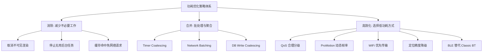
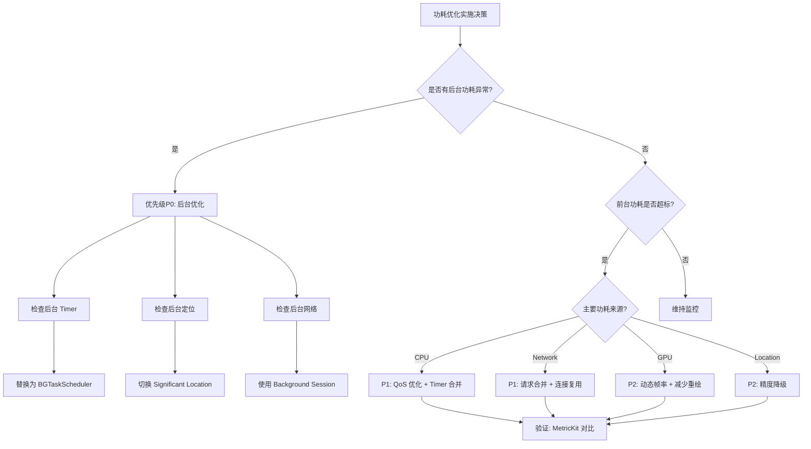

# 功耗优化策略与最佳实践深度解析

> 从 CPU/GPU/网络/定位/后台任务到屏幕传感器：系统化的功耗优化策略矩阵、代码级最佳实践与实施优先级决策框架

---

## 目录

- [核心结论 TL;DR](#核心结论-tldr)
- [第一部分：优化策略全景](#第一部分优化策略全景)
- [第二部分：CPU 功耗优化](#第二部分cpu-功耗优化)
- [第三部分：GPU 功耗优化](#第三部分gpu-功耗优化)
- [第四部分：网络功耗优化](#第四部分网络功耗优化)
- [第五部分：定位功耗优化](#第五部分定位功耗优化)
- [第六部分：后台任务管理](#第六部分后台任务管理)
- [第七部分：屏幕与传感器优化](#第七部分屏幕与传感器优化)
- [第八部分：实施优先级决策树](#第八部分实施优先级决策树)
- [最佳实践](#最佳实践)
- [常见陷阱](#常见陷阱)
- [面试考点](#面试考点)
- [参考资源](#参考资源)

---

## 核心结论 TL;DR

| 维度 | 核心洞察 |
|------|----------|
| **核心原则** | 减少不必要的工作 > 合并工作 > 选择高效方式，三层优化漏斗 |
| **CPU** | QoS 合理分级 + Timer Coalescing + 批处理合并，唤醒次数比占用率更关键 |
| **GPU** | ProMotion 动态帧率（静止10fps/滚动120fps）+ 减少过度绘制 + Metal 着色器精简 |
| **网络** | 请求合并 + HTTP/2 连接复用 + Background Session，蜂窝 Radio Tail Energy 是隐形杀手 |
| **定位** | 精度按需降级 + Significant Location Change 替代持续定位 + Geofencing 替代轮询 |
| **后台** | BGTaskScheduler 统一管理 + 静默推送替代轮询 + Background Modes 最小化 |

---

## 第一部分：优化策略全景

### 1.1 功耗优化核心原则

**结论先行**：功耗优化遵循三层漏斗原则 —— 先消除不必要的工作，再合并剩余工作，最后选择最高效的执行方式。

三层优化漏斗：

1. **消除（Eliminate）**：移除不必要的工作
   - 取消不可见界面的渲染
   - 停止用户不需要的后台活动
   - 去除冗余的网络请求

2. **合并（Coalesce）**：合并可以批处理的工作
   - Timer 合并（Timer Coalescing）
   - 网络请求合并（Request Batching）
   - 数据库写入合并

3. **高效化（Optimize）**：选择最省电的执行方式
   - 低 QoS 替代高 QoS
   - WiFi 替代蜂窝传输
   - BLE 替代 Classic Bluetooth

### 1.2 优化策略分类矩阵

| 优化域 | 消除策略 | 合并策略 | 高效化策略 |
|--------|---------|---------|-----------|
| **CPU** | 取消无用计算 | Timer Coalescing | QoS 降级 |
| **GPU** | 停止不可见渲染 | 减少重绘次数 | 动态帧率 |
| **网络** | 缓存命中免请求 | Request Batching | HTTP/2 复用 |
| **定位** | 不需要时关闭 | 合并位置回调 | 精度降级 |
| **后台** | 关闭非必要 Mode | BGTask 合并 | 静默推送 |
| **屏幕** | 减少高亮场景 | — | 暗黑模式 |

### 1.3 策略体系架构图



---

## 第二部分：CPU 功耗优化

### 2.1 QoS（Quality of Service）合理利用

**结论先行**：正确使用 QoS 是 CPU 功耗优化的第一步，它决定了任务在哪类 CPU 核心上执行以及频率/电压的调度策略。

iOS QoS 等级与功耗关系：

| QoS 等级 | 调度优先级 | CPU 核心 | 功耗影响 | 适用场景 |
|----------|-----------|---------|---------|---------|
| `.userInteractive` | 最高 | P核优先，最高频 | 极高 | UI 渲染、动画 |
| `.userInitiated` | 高 | P核，高频 | 高 | 用户主动请求的操作 |
| `.default` | 中 | 自动调度 | 中 | 未指定 QoS 的默认 |
| `.utility` | 低 | E核优先，中低频 | 低 | 长时间计算、I/O |
| `.background` | 最低 | E核，最低频 | 极低 | 预下载、备份、索引 |

```swift
// ✅ 推荐：按业务场景合理分配 QoS
class TaskScheduler {
    
    // UI 动画相关 — userInteractive
    func animateTransition() {
        DispatchQueue.main.async { // 主线程自动 userInteractive
            UIView.animate(withDuration: 0.3) {
                self.view.alpha = 1.0
            }
        }
    }
    
    // 用户触发的数据加载 — userInitiated
    func loadUserProfile() {
        DispatchQueue.global(qos: .userInitiated).async {
            let profile = self.fetchProfile()
            DispatchQueue.main.async {
                self.updateUI(with: profile)
            }
        }
    }
    
    // 数据处理与日志 — utility
    func processAnalytics() {
        DispatchQueue.global(qos: .utility).async {
            self.aggregateEvents()
            self.compressLogFiles()
        }
    }
    
    // 预加载与索引 — background
    func prefetchContent() {
        DispatchQueue.global(qos: .background).async {
            self.buildSearchIndex()
            self.prefetchRecommendations()
        }
    }
}
```

```objectivec
// ✅ 推荐：ObjC 中通过 dispatch_queue_attr 设置 QoS
// 用户触发的操作
dispatch_queue_attr_t userAttr = dispatch_queue_attr_make_with_qos_class(
    DISPATCH_QUEUE_SERIAL, QOS_CLASS_USER_INITIATED, 0);
dispatch_queue_t userQueue = dispatch_queue_create("com.app.user", userAttr);

// 后台处理
dispatch_queue_attr_t bgAttr = dispatch_queue_attr_make_with_qos_class(
    DISPATCH_QUEUE_SERIAL, QOS_CLASS_BACKGROUND, 0);
dispatch_queue_t bgQueue = dispatch_queue_create("com.app.background", bgAttr);

dispatch_async(bgQueue, ^{
    [self buildSearchIndex];
    [self prefetchRecommendations];
});
```

#### QoS 传播与优先级反转

**结论先行**：GCD 会自动提升低优先级队列上的任务 QoS，以避免优先级反转问题，但开发者仍需注意同步等待导致的隐式提升。

```swift
// ❌ 避免：高 QoS 线程同步等待低 QoS 线程结果（优先级反转）
let bgQueue = DispatchQueue(label: "bg", qos: .background)
let result = bgQueue.sync { // 主线程 sync 等待 background 队列
    return heavyComputation() // GCD 会提升此任务到 userInteractive
    // 虽然系统会修正，但设计上应避免此模式
}

// ✅ 推荐：使用异步回调避免优先级反转
let bgQueue = DispatchQueue(label: "bg", qos: .utility)
bgQueue.async {
    let result = self.heavyComputation()
    DispatchQueue.main.async {
        self.handleResult(result)
    }
}
```

### 2.2 批处理策略：合并小任务

**结论先行**：将多个小任务合并为一个批次执行，减少 CPU 唤醒次数，是降低 CPU 功耗最有效的策略之一。

```swift
// ✅ 推荐：批量处理事件
class EventBatcher {
    private var pendingEvents: [AnalyticsEvent] = []
    private let batchQueue = DispatchQueue(label: "com.app.eventBatcher", qos: .utility)
    private var batchTimer: DispatchSourceTimer?
    
    func trackEvent(_ event: AnalyticsEvent) {
        batchQueue.async {
            self.pendingEvents.append(event)
            
            // 达到阈值立即发送
            if self.pendingEvents.count >= 50 {
                self.flushEvents()
                return
            }
            
            // 否则启动延迟发送（合并 30s 内的事件）
            self.scheduleBatchFlush()
        }
    }
    
    private func scheduleBatchFlush() {
        batchTimer?.cancel()
        
        let timer = DispatchSource.makeTimerSource(queue: batchQueue)
        timer.schedule(deadline: .now() + 30.0, leeway: .seconds(5))
        timer.setEventHandler { [weak self] in
            self?.flushEvents()
        }
        timer.resume()
        batchTimer = timer
    }
    
    private func flushEvents() {
        guard !pendingEvents.isEmpty else { return }
        let batch = pendingEvents
        pendingEvents.removeAll()
        
        // 批量上传
        NetworkManager.shared.uploadEvents(batch)
    }
}
```

### 2.3 Timer 合并：Timer Coalescing

**结论先行**：设置 Timer 的 tolerance（容差）允许系统合并多个 Timer 的触发时机，减少 CPU 唤醒次数。Apple 推荐至少设置 10% 的 tolerance。

```swift
// ✅ 推荐：设置 Timer tolerance 允许系统合并
let timer = Timer.scheduledTimer(withTimeInterval: 60.0, repeats: true) { _ in
    self.refreshData()
}
timer.tolerance = 6.0  // 10% tolerance，允许 ±6s 的偏差

// ✅ 推荐：使用 DispatchSourceTimer 并设置 leeway
let timer = DispatchSource.makeTimerSource(queue: .global(qos: .utility))
timer.schedule(deadline: .now() + 60.0, repeating: 60.0, leeway: .seconds(10))
timer.setEventHandler {
    self.refreshData()
}
timer.resume()
```

```objectivec
// ✅ 推荐：ObjC Timer tolerance
NSTimer *timer = [NSTimer scheduledTimerWithTimeInterval:60.0
                                                 repeats:YES
                                                   block:^(NSTimer *timer) {
    [self refreshData];
}];
timer.tolerance = 6.0; // 10% tolerance

// ✅ 推荐：ObjC dispatch_source timer with leeway
dispatch_source_t timer = dispatch_source_create(DISPATCH_SOURCE_TYPE_TIMER, 0, 0,
    dispatch_get_global_queue(QOS_CLASS_UTILITY, 0));
dispatch_source_set_timer(timer,
    dispatch_time(DISPATCH_TIME_NOW, 60 * NSEC_PER_SEC),
    60 * NSEC_PER_SEC,
    10 * NSEC_PER_SEC); // 10s leeway
dispatch_source_set_event_handler(timer, ^{
    [self refreshData];
});
dispatch_resume(timer);
```

**Timer Coalescing 工作原理**：

```
┌──────────────────────────────────────────────────────────┐
│  无 Tolerance: CPU 每次都被精确唤醒                        │
│  Timer A: ──|──────|──────|──────|──────|──              │
│  Timer B: ────|──────|──────|──────|────                  │
│  CPU唤醒:  | || |  | || |  | || |  | || |                │
│                                                           │
│  有 Tolerance: 系统合并到同一时间点                         │
│  Timer A: ──|──────|──────|──────|──────|──              │
│  Timer B: ──|──────|──────|──────|──────|──  (合并)       │
│  CPU唤醒:   |      |      |      |      |                │
│                                                           │
│  唤醒次数从 8 次降为 5 次，减少 37.5%                      │
└──────────────────────────────────────────────────────────┘
```

---

## 第三部分：GPU 功耗优化

### 3.1 帧率动态调节

**结论先行**：利用 ProMotion 的自适应帧率能力，根据内容变化动态调整刷新率，可节省 20-40% 的 GPU 功耗。

```swift
// ✅ 推荐：CADisplayLink 动态帧率设置 (iOS 15+)
class AdaptiveFrameRateController {
    private var displayLink: CADisplayLink?
    
    func setupDisplayLink() {
        displayLink = CADisplayLink(target: self, selector: #selector(render))
        
        // 设置帧率范围：最低 10fps，最高 120fps，首选 60fps
        if #available(iOS 15.0, *) {
            displayLink?.preferredFrameRateRange = CAFrameRateRange(
                minimum: 10,   // 静止/慢速内容
                maximum: 120,  // 快速滚动/动画
                preferred: 60  // 常规动画
            )
        }
        
        displayLink?.add(to: .main, forMode: .common)
    }
    
    // 根据场景动态调整帧率范围
    func updateForState(_ state: ContentState) {
        guard #available(iOS 15.0, *) else { return }
        
        switch state {
        case .idle:
            // 静止页面：10fps 足够
            displayLink?.preferredFrameRateRange = CAFrameRateRange(
                minimum: 10, maximum: 10, preferred: 10)
        case .scrolling:
            // 滚动：120fps 最流畅
            displayLink?.preferredFrameRateRange = CAFrameRateRange(
                minimum: 60, maximum: 120, preferred: 120)
        case .animating:
            // 常规动画：60fps
            displayLink?.preferredFrameRateRange = CAFrameRateRange(
                minimum: 30, maximum: 60, preferred: 60)
        case .video:
            // 视频播放：匹配内容帧率
            displayLink?.preferredFrameRateRange = CAFrameRateRange(
                minimum: 24, maximum: 30, preferred: 30)
        }
    }
    
    @objc private func render() {
        // 渲染逻辑
    }
}
```

```objectivec
// ✅ 推荐：ObjC 动态帧率
- (void)setupDisplayLink {
    self.displayLink = [CADisplayLink displayLinkWithTarget:self selector:@selector(render)];
    
    if (@available(iOS 15.0, *)) {
        self.displayLink.preferredFrameRateRange = CAFrameRateRangeMake(10, 120, 60);
    }
    
    [self.displayLink addToRunLoop:[NSRunLoop mainRunLoop] forMode:NSRunLoopCommonModes];
}

- (void)switchToIdleMode {
    if (@available(iOS 15.0, *)) {
        self.displayLink.preferredFrameRateRange = CAFrameRateRangeMake(10, 10, 10);
    }
}
```

### 3.2 渲染负载优化

**结论先行**：减少 GPU 过度绘制（Overdraw）和不必要的重绘是 GPU 功耗优化的核心。

```swift
// ✅ 推荐：避免不必要的重绘
class EfficientView: UIView {
    
    // 1. 使用 setNeedsDisplay 替代频繁的 draw 调用
    var data: [DataPoint] = [] {
        didSet {
            setNeedsDisplay() // 标记脏区域，下一渲染周期统一绘制
        }
    }
    
    // 2. 标记不透明视图
    override var isOpaque: Bool { return true } // 减少混合计算
    
    // 3. 使用光栅化缓存复杂视图
    func enableRasterization() {
        layer.shouldRasterize = true
        layer.rasterizationScale = UIScreen.main.scale
        // 注意：仅对不频繁变化的复杂视图使用
    }
}

// ❌ 避免：每帧都重建视图层次
func updateContent() {
    // 每次清空重建，浪费 GPU 资源
    contentView.subviews.forEach { $0.removeFromSuperview() }
    for item in items {
        let view = ItemView(item: item)
        contentView.addSubview(view)
    }
}

// ✅ 推荐：复用视图，只更新数据
func updateContent() {
    for (index, item) in items.enumerated() {
        if index < cachedViews.count {
            cachedViews[index].configure(with: item)
        }
    }
}
```

### 3.3 Metal 着色器效率优化

```swift
// ❌ 避免：着色器中使用高精度浮点（不必要时）
// fragment float4 fragmentShader(... ) {
//     float4 color = texture.sample(sampler, in.texCoord); // 32-bit float
//     return color;
// }

// ✅ 推荐：使用 half 精度（16-bit，GPU 吞吐量翻倍）
// fragment half4 fragmentShader(... ) {
//     half4 color = texture.sample(sampler, in.texCoord); // 16-bit half
//     return color;
// }
```

> **关键洞察**：Apple GPU（Apple Silicon）对 half 精度浮点的处理速度是 float 的 2 倍，能显著降低 GPU 负载和功耗。

---

## 第四部分：网络功耗优化

### 4.1 WiFi vs 蜂窝功耗对比

| 维度 | WiFi | 蜂窝 LTE | 蜂窝 5G |
|------|------|----------|---------|
| 单次请求功耗 | 低 | 高（含 Radio 唤醒） | 极高 |
| Tail Energy | 无 | ~17s | ~17s |
| 适合场景 | 频繁小请求 | 批量大传输 | 高带宽需求 |
| 建议策略 | 正常使用 | 请求合并 | 按需激活 |

### 4.2 Radio 唤醒机制与 Tail Energy

**结论先行**：蜂窝网络每次请求都会唤醒 Radio 并维持高功率状态约 17 秒，频繁小请求的累积 Tail Energy 远超数据传输本身的能耗。

优化策略优先级：

1. **请求合并（Batching）**：攒够一批再发
2. **去抖动（Debouncing）**：短时间内的重复请求合并
3. **预取（Prefetching）**：利用已激活的 Radio 窗口预加载
4. **延迟非紧急请求**：等待 WiFi 环境再传输

### 4.3 请求合并策略

```swift
// ✅ 推荐：网络请求合并与去抖动
class NetworkBatcher {
    private var pendingRequests: [APIRequest] = []
    private let batchQueue = DispatchQueue(label: "com.app.networkBatch", qos: .utility)
    private var debounceTimer: DispatchWorkItem?
    
    func enqueueRequest(_ request: APIRequest) {
        batchQueue.async {
            self.pendingRequests.append(request)
            self.scheduleFlush()
        }
    }
    
    private func scheduleFlush() {
        debounceTimer?.cancel()
        
        let workItem = DispatchWorkItem { [weak self] in
            self?.flushRequests()
        }
        debounceTimer = workItem
        
        // 2s 去抖动：2s 内无新请求则发送
        batchQueue.asyncAfter(deadline: .now() + 2.0, execute: workItem)
    }
    
    private func flushRequests() {
        guard !pendingRequests.isEmpty else { return }
        let batch = pendingRequests
        pendingRequests.removeAll()
        
        // 合并为单个批量请求
        let batchRequest = BatchAPIRequest(requests: batch)
        URLSession.shared.dataTask(with: batchRequest.urlRequest) { data, response, error in
            // 分发结果到各原始请求的回调
            batchRequest.dispatchResults(data: data, error: error)
        }.resume()
    }
}
```

### 4.4 连接复用：HTTP/2 与 URLSession 配置

```swift
// ✅ 推荐：配置 URLSession 以最大化连接复用
class NetworkConfig {
    
    static let shared: URLSession = {
        let config = URLSessionConfiguration.default
        
        // HTTP/2 Multiplexing（默认支持）
        config.httpMaximumConnectionsPerHost = 6
        
        // 蜂窝网络策略
        config.allowsCellularAccess = true
        config.allowsExpensiveNetworkAccess = true   // 5G 等计费网络
        config.allowsConstrainedNetworkAccess = false // 低数据模式下不请求
        
        // 缓存策略：减少不必要的网络请求
        config.urlCache = URLCache(memoryCapacity: 50 * 1024 * 1024,   // 50MB 内存
                                   diskCapacity: 200 * 1024 * 1024)     // 200MB 磁盘
        config.requestCachePolicy = .returnCacheDataElseLoad
        
        // 超时设置
        config.timeoutIntervalForResource = 300
        config.timeoutIntervalForRequest = 30
        
        // 等待网络连接（iOS 11+）
        config.waitsForConnectivity = true
        
        return URLSession(configuration: config)
    }()
}
```

```objectivec
// ✅ 推荐：ObjC URLSession 配置
+ (NSURLSession *)sharedEfficientSession {
    static NSURLSession *session = nil;
    static dispatch_once_t onceToken;
    dispatch_once(&onceToken, ^{
        NSURLSessionConfiguration *config = [NSURLSessionConfiguration defaultSessionConfiguration];
        config.HTTPMaximumConnectionsPerHost = 6;
        config.allowsCellularAccess = YES;
        config.allowsConstrainedNetworkAccess = NO;
        config.waitsForConnectivity = YES;
        
        NSURLCache *cache = [[NSURLCache alloc] initWithMemoryCapacity:50 * 1024 * 1024
                                                          diskCapacity:200 * 1024 * 1024
                                                          directoryURL:nil];
        config.URLCache = cache;
        config.requestCachePolicy = NSURLRequestReturnCacheDataElseLoad;
        
        session = [NSURLSession sessionWithConfiguration:config];
    });
    return session;
}
```

### 4.5 NSURLSession 后台传输

**结论先行**：后台传输由系统管理网络连接的生命周期，系统会在最优时机（WiFi、充电中）执行传输，显著降低功耗。

```swift
// ✅ 推荐：后台传输配置
class BackgroundTransferManager: NSObject, URLSessionDownloadDelegate {
    
    static let shared = BackgroundTransferManager()
    
    private lazy var backgroundSession: URLSession = {
        let config = URLSessionConfiguration.background(
            withIdentifier: "com.app.backgroundTransfer")
        config.isDiscretionary = true          // 系统自行选择最优时机
        config.sessionSendsLaunchEvents = true  // 完成时唤醒 App
        config.allowsCellularAccess = false     // 仅 WiFi
        
        // iOS 13+：等待网络连接
        config.waitsForConnectivity = true
        
        return URLSession(configuration: config, delegate: self, delegateQueue: nil)
    }()
    
    func scheduleDownload(url: URL) {
        let task = backgroundSession.downloadTask(with: url)
        task.earliestBeginDate = Date(timeIntervalSinceNow: 60) // 最早 1 分钟后开始
        task.countOfBytesClientExpectsToSend = 200               // 预估上行字节
        task.countOfBytesClientExpectsToReceive = 5 * 1024 * 1024 // 预估下行 5MB
        task.resume()
    }
    
    // MARK: - URLSessionDownloadDelegate
    
    func urlSession(_ session: URLSession, downloadTask: URLSessionDownloadTask,
                    didFinishDownloadingTo location: URL) {
        // 处理下载完成的文件
        let destinationURL = FileManager.default.urls(for: .documentDirectory, in: .userDomainMask)[0]
            .appendingPathComponent(downloadTask.originalRequest?.url?.lastPathComponent ?? "download")
        try? FileManager.default.moveItem(at: location, to: destinationURL)
    }
}
```

```objectivec
// ✅ 推荐：ObjC 后台传输
- (NSURLSession *)backgroundSession {
    static NSURLSession *session = nil;
    static dispatch_once_t onceToken;
    dispatch_once(&onceToken, ^{
        NSURLSessionConfiguration *config = [NSURLSessionConfiguration
            backgroundSessionConfigurationWithIdentifier:@"com.app.bgTransfer"];
        config.discretionary = YES;
        config.sessionSendsLaunchEvents = YES;
        config.allowsCellularAccess = NO;
        session = [NSURLSession sessionWithConfiguration:config delegate:self delegateQueue:nil];
    });
    return session;
}

- (void)scheduleDownloadWithURL:(NSURL *)url {
    NSURLSessionDownloadTask *task = [[self backgroundSession] downloadTaskWithURL:url];
    task.earliestBeginDate = [NSDate dateWithTimeIntervalSinceNow:60];
    task.countOfBytesClientExpectsToReceive = 5 * 1024 * 1024;
    [task resume];
}
```

---

## 第五部分：定位功耗优化

### 5.1 精度等级阶梯与功耗

**结论先行**：定位精度与功耗呈指数关系，大多数场景无需最高精度。选择匹配业务需求的最低精度等级是定位功耗优化的核心。

| 精度常量 | 精度 | 技术 | 相对功耗 | 适用场景 |
|---------|------|------|---------|---------|
| `bestForNavigation` | ~1m | GPS + 陀螺仪 | ★★★★★ | 导航 |
| `best` | ~5m | GPS | ★★★★ | 精确打卡 |
| `nearestTenMeters` | ~10m | GPS/WiFi | ★★★ | 附近搜索 |
| `hundredMeters` | ~100m | WiFi/Cell | ★★ | 城市级服务 |
| `kilometer` | ~1km | Cell Tower | ★ | 天气 |
| `threeKilometers` | ~3km | Cell Tower | ★ | 粗略定位 |

### 5.2 Significant Location Change

**结论先行**：Significant Location Change 是替代持续定位的最佳方案，仅在用户位置发生显著变化（通常 500m+）时触发回调，功耗极低。

```swift
// ✅ 推荐：不同场景的定位配置
class LocationOptimizer: NSObject, CLLocationManagerDelegate {
    
    private let locationManager = CLLocationManager()
    
    // 场景一：导航（需要最高精度）
    func startNavigation() {
        locationManager.desiredAccuracy = kCLLocationAccuracyBestForNavigation
        locationManager.distanceFilter = kCLDistanceFilterNone
        locationManager.activityType = .automotiveNavigation
        locationManager.allowsBackgroundLocationUpdates = true
        locationManager.showsBackgroundLocationIndicator = true // 状态栏蓝色指示
        locationManager.startUpdatingLocation()
    }
    
    // 场景二：附近搜索（中等精度即可）
    func startNearbySearch() {
        locationManager.desiredAccuracy = kCLLocationAccuracyHundredMeters
        locationManager.distanceFilter = 100 // 移动 100m 才回调
        locationManager.startUpdatingLocation()
    }
    
    // 场景三：后台位置追踪（低功耗方案）
    func startBackgroundTracking() {
        locationManager.stopUpdatingLocation() // 先停止持续定位
        locationManager.startMonitoringSignificantLocationChanges()
    }
    
    // 场景四：地理围栏（零持续功耗）
    func setupGeofence(center: CLLocationCoordinate2D, radius: Double) {
        let region = CLCircularRegion(center: center, radius: radius,
                                       identifier: "targetRegion")
        region.notifyOnEntry = true
        region.notifyOnExit = true
        locationManager.startMonitoring(for: region)
    }
    
    // 应用进入后台时降级定位
    func applicationDidEnterBackground() {
        locationManager.stopUpdatingLocation()
        locationManager.startMonitoringSignificantLocationChanges()
    }
    
    // 应用回到前台时恢复
    func applicationWillEnterForeground() {
        locationManager.stopMonitoringSignificantLocationChanges()
        locationManager.desiredAccuracy = kCLLocationAccuracyHundredMeters
        locationManager.startUpdatingLocation()
    }
    
    // MARK: - CLLocationManagerDelegate
    
    func locationManager(_ manager: CLLocationManager, didUpdateLocations locations: [CLLocation]) {
        guard let location = locations.last else { return }
        
        // 过滤过旧的位置数据
        let age = -location.timestamp.timeIntervalSinceNow
        guard age < 30 else { return } // 忽略 30s 以前的缓存数据
        
        processLocation(location)
    }
}
```

```objectivec
// ✅ 推荐：ObjC 定位功耗优化
@implementation LocationOptimizer

- (void)startBackgroundTracking {
    [self.locationManager stopUpdatingLocation];
    [self.locationManager startMonitoringSignificantLocationChanges];
}

- (void)setupGeofenceWithCenter:(CLLocationCoordinate2D)center radius:(CLLocationDistance)radius {
    CLCircularRegion *region = [[CLCircularRegion alloc]
        initWithCenter:center radius:radius identifier:@"targetRegion"];
    region.notifyOnEntry = YES;
    region.notifyOnExit = YES;
    [self.locationManager startMonitoringForRegion:region];
}

- (void)applicationDidEnterBackground {
    [self.locationManager stopUpdatingLocation];
    self.locationManager.desiredAccuracy = kCLLocationAccuracyThreeKilometers;
    [self.locationManager startMonitoringSignificantLocationChanges];
}

- (void)locationManager:(CLLocationManager *)manager didUpdateLocations:(NSArray<CLLocation *> *)locations {
    CLLocation *location = locations.lastObject;
    NSTimeInterval age = -[location.timestamp timeIntervalSinceNow];
    if (age > 30) return; // 忽略旧数据
    [self processLocation:location];
}

@end
```

### 5.3 pausesLocationUpdatesAutomatically

```swift
// ✅ 推荐：允许系统自动暂停定位
locationManager.pausesLocationUpdatesAutomatically = true
locationManager.activityType = .fitness // 帮助系统判断暂停时机

// 当系统自动暂停时会触发
func locationManagerDidPauseLocationUpdates(_ manager: CLLocationManager) {
    // 记录暂停状态，可切换到 Significant Location Change
    manager.startMonitoringSignificantLocationChanges()
}

func locationManagerDidResumeLocationUpdates(_ manager: CLLocationManager) {
    manager.stopMonitoringSignificantLocationChanges()
}
```

---

## 第六部分：后台任务管理

### 6.1 BGTaskScheduler 框架

**结论先行**：BGTaskScheduler（iOS 13+）是 Apple 推荐的后台任务管理框架，它让系统根据设备状态（充电、WiFi、空闲）智能调度后台任务，最大化节能。

两种后台任务类型：

| 类型 | 执行时间 | 适用场景 | 系统调度条件 |
|------|---------|---------|-------------|
| **BGAppRefreshTask** | ~30s | 数据刷新、状态同步 | 系统预测用户使用时机 |
| **BGProcessingTask** | 数分钟 | 数据库维护、ML 训练 | 设备充电 + 空闲 |

```swift
// ✅ 推荐：BGTaskScheduler 注册与调度
class BackgroundTaskManager {
    
    static let refreshTaskId = "com.app.refresh"
    static let processingTaskId = "com.app.processing"
    
    // Step 1: 在 AppDelegate 中注册（application:didFinishLaunchingWithOptions: 中调用）
    static func registerTasks() {
        BGTaskScheduler.shared.register(
            forTaskWithIdentifier: refreshTaskId,
            using: nil
        ) { task in
            handleAppRefresh(task: task as! BGAppRefreshTask)
        }
        
        BGTaskScheduler.shared.register(
            forTaskWithIdentifier: processingTaskId,
            using: nil
        ) { task in
            handleProcessing(task: task as! BGProcessingTask)
        }
    }
    
    // Step 2: 调度 Refresh Task
    static func scheduleAppRefresh() {
        let request = BGAppRefreshTaskRequest(identifier: refreshTaskId)
        request.earliestBeginDate = Date(timeIntervalSinceNow: 15 * 60) // 最早 15 分钟后
        
        do {
            try BGTaskScheduler.shared.submit(request)
        } catch {
            print("Failed to schedule refresh: \(error)")
        }
    }
    
    // Step 3: 调度 Processing Task
    static func scheduleProcessing() {
        let request = BGProcessingTaskRequest(identifier: processingTaskId)
        request.earliestBeginDate = Date(timeIntervalSinceNow: 60 * 60) // 最早 1 小时后
        request.requiresNetworkConnectivity = true  // 需要网络
        request.requiresExternalPower = true         // 需要充电状态
        
        do {
            try BGTaskScheduler.shared.submit(request)
        } catch {
            print("Failed to schedule processing: \(error)")
        }
    }
    
    // Step 4: 处理 Refresh Task
    private static func handleAppRefresh(task: BGAppRefreshTask) {
        // 调度下一次刷新
        scheduleAppRefresh()
        
        let operation = RefreshOperation()
        
        task.expirationHandler = {
            operation.cancel()
        }
        
        operation.completionBlock = {
            task.setTaskCompleted(success: !operation.isCancelled)
        }
        
        OperationQueue.main.addOperation(operation)
    }
    
    // Step 5: 处理 Processing Task
    private static func handleProcessing(task: BGProcessingTask) {
        let operation = DatabaseMaintenanceOperation()
        
        task.expirationHandler = {
            operation.cancel()
        }
        
        operation.completionBlock = {
            task.setTaskCompleted(success: !operation.isCancelled)
        }
        
        OperationQueue().addOperation(operation)
    }
}
```

```objectivec
// ✅ 推荐：ObjC BGTaskScheduler 注册
static NSString *const kRefreshTaskId = @"com.app.refresh";
static NSString *const kProcessingTaskId = @"com.app.processing";

+ (void)registerTasks {
    [[BGTaskScheduler sharedScheduler] registerForTaskWithIdentifier:kRefreshTaskId
                                                          usingQueue:nil
                                                       launchHandler:^(BGTask *task) {
        [self handleAppRefresh:(BGAppRefreshTask *)task];
    }];
    
    [[BGTaskScheduler sharedScheduler] registerForTaskWithIdentifier:kProcessingTaskId
                                                          usingQueue:nil
                                                       launchHandler:^(BGTask *task) {
        [self handleProcessing:(BGProcessingTask *)task];
    }];
}

+ (void)scheduleAppRefresh {
    BGAppRefreshTaskRequest *request = [[BGAppRefreshTaskRequest alloc]
        initWithIdentifier:kRefreshTaskId];
    request.earliestBeginDate = [NSDate dateWithTimeIntervalSinceNow:15 * 60];
    
    NSError *error = nil;
    [[BGTaskScheduler sharedScheduler] submitTaskRequest:request error:&error];
    if (error) {
        NSLog(@"Failed to schedule refresh: %@", error);
    }
}
```

### 6.2 Background Modes 最小化原则

**结论先行**：只申请应用真正需要的 Background Modes，过多的后台模式会增加系统唤醒频率和功耗。

| Background Mode | 功耗影响 | 是否必须 |
|----------------|---------|---------|
| Audio | 中 | 音频类 App 必须 |
| Location | 高 | 导航类必须，其他尽量避免 |
| VoIP | 中 | 通话类必须 |
| External Accessory | 低 | 外设类必须 |
| Background Fetch | 低 | 用 BGTaskScheduler 替代 |
| Remote Notifications | 低 | 推荐：替代轮询 |
| Background Processing | 低 | 推荐：重型后台任务 |

### 6.3 静默推送替代后台轮询

```swift
// ✅ 推荐：静默推送（Silent Push）替代后台轮询
func application(_ application: UIApplication,
                 didReceiveRemoteNotification userInfo: [AnyHashable: Any],
                 fetchCompletionHandler completionHandler: @escaping (UIBackgroundFetchResult) -> Void) {
    
    guard let action = userInfo["action"] as? String else {
        completionHandler(.noData)
        return
    }
    
    switch action {
    case "new_content":
        // 服务器有新内容时才唤醒，而非定期轮询
        fetchNewContent { hasNewData in
            completionHandler(hasNewData ? .newData : .noData)
        }
    case "sync":
        syncData { success in
            completionHandler(success ? .newData : .failed)
        }
    default:
        completionHandler(.noData)
    }
}
```

---

## 第七部分：屏幕与传感器优化

### 7.1 暗黑模式与 OLED 省电

**结论先行**：在 OLED 屏幕上，暗黑模式可节省 30%-60% 的屏幕功耗，因为黑色像素完全关闭。

```swift
// ✅ 推荐：适配暗黑模式，使用语义化颜色
class ThemeManager {
    
    static func setupDarkModeOptimized() {
        // 使用系统语义化颜色（自动适配暗黑模式）
        let backgroundColor = UIColor.systemBackground       // 亮: 白色, 暗: 纯黑
        let labelColor = UIColor.label                        // 自动适配
        let secondaryBG = UIColor.secondarySystemBackground  // 自动适配
        
        // 自定义颜色也应支持暗黑模式
        let brandColor = UIColor { traitCollection in
            traitCollection.userInterfaceStyle == .dark
                ? UIColor(red: 0.2, green: 0.6, blue: 1.0, alpha: 1.0) // 暗模式
                : UIColor(red: 0.0, green: 0.4, blue: 0.9, alpha: 1.0) // 亮模式
        }
    }
}

// ✅ 推荐：在低电量模式下建议切换到暗黑模式
func suggestDarkModeForPowerSaving() {
    if ProcessInfo.processInfo.isLowPowerModeEnabled {
        if UITraitCollection.current.userInterfaceStyle != .dark {
            // 提示用户切换到暗黑模式省电
            showDarkModeSuggestion()
        }
    }
}
```

### 7.2 蓝牙 BLE 扫描优化

```swift
// ✅ 推荐：按需扫描，限制扫描时长
class BLEOptimizer: NSObject, CBCentralManagerDelegate {
    
    private var centralManager: CBCentralManager!
    private var scanTimer: Timer?
    
    // 仅扫描需要的 Service UUID，避免全量扫描
    func startOptimizedScan() {
        let targetServices = [CBUUID(string: "FFE0")] // 只扫描目标设备
        
        centralManager.scanForPeripherals(
            withServices: targetServices,
            options: [CBCentralManagerScanOptionAllowDuplicatesKey: false] // 不报告重复设备
        )
        
        // 限制扫描时长（15s 后停止）
        scanTimer = Timer.scheduledTimer(withTimeInterval: 15.0, repeats: false) { [weak self] _ in
            self?.centralManager.stopScan()
        }
    }
    
    // ❌ 避免：无限制全量扫描
    func badScan() {
        centralManager.scanForPeripherals(
            withServices: nil, // 扫描所有设备 — 功耗极高
            options: [CBCentralManagerScanOptionAllowDuplicatesKey: true] // 重复报告
        )
        // 且没有停止扫描的逻辑
    }
}
```

### 7.3 动态亮度适配

```swift
// ✅ 推荐：不强制修改屏幕亮度，尊重系统自动亮度
// 仅在特殊场景（如扫码）临时调整，用完恢复
class BrightnessManager {
    private var originalBrightness: CGFloat = 0
    
    func temporarilyIncreaseBrightness() {
        originalBrightness = UIScreen.main.brightness
        UIScreen.main.brightness = 0.8 // 临时提高
    }
    
    func restoreBrightness() {
        UIScreen.main.brightness = originalBrightness
    }
}
```

---

## 第八部分：实施优先级决策树

**结论先行**：功耗优化应按投入产出比排序，优先处理收益最大、实施成本最低的优化项。



### 实施优先级排序

| 优先级 | 优化项 | 预期收益 | 实施成本 | ROI |
|--------|--------|---------|---------|-----|
| **P0** | 后台 Timer → BGTaskScheduler | 极高 | 低 | ★★★★★ |
| **P0** | 后台持续定位 → Significant Change | 极高 | 低 | ★★★★★ |
| **P1** | 网络请求合并 + Background Session | 高 | 中 | ★★★★ |
| **P1** | QoS 合理分级 | 高 | 低 | ★★★★ |
| **P1** | Timer Coalescing（tolerance 设置） | 中 | 极低 | ★★★★ |
| **P2** | ProMotion 动态帧率 | 中 | 中 | ★★★ |
| **P2** | 暗黑模式适配 | 中 | 中 | ★★★ |
| **P3** | Metal 着色器精度优化 | 低-中 | 高 | ★★ |
| **P3** | BLE 扫描优化 | 低 | 低 | ★★ |

---

## 最佳实践

### 功耗优化 Checklist

```swift
// ✅ 1. 低电量模式适配 — 所有高功耗功能都应响应
class PowerAwareFeatureManager {
    
    init() {
        NotificationCenter.default.addObserver(
            self, selector: #selector(powerStateChanged),
            name: .NSProcessInfoPowerStateDidChange, object: nil)
    }
    
    @objc func powerStateChanged() {
        let isLowPower = ProcessInfo.processInfo.isLowPowerModeEnabled
        
        if isLowPower {
            // 降低帧率
            displayLink?.preferredFrameRateRange = CAFrameRateRange(
                minimum: 10, maximum: 30, preferred: 30)
            // 降低定位精度
            locationManager.desiredAccuracy = kCLLocationAccuracyKilometer
            // 增加网络请求合并窗口
            networkBatcher.flushInterval = 60.0
            // 禁用预加载
            prefetchEnabled = false
        } else {
            restoreNormalSettings()
        }
    }
}

// ✅ 2. 应用前后台切换时调整策略
class AppLifecycleManager {
    
    func applicationDidEnterBackground() {
        // 停止所有不必要的前台活动
        displayLink?.isPaused = true
        locationManager.stopUpdatingLocation()
        locationManager.startMonitoringSignificantLocationChanges()
        
        // 取消非关键网络请求
        pendingNonCriticalTasks.forEach { $0.cancel() }
    }
    
    func applicationWillEnterForeground() {
        displayLink?.isPaused = false
        locationManager.stopMonitoringSignificantLocationChanges()
        locationManager.startUpdatingLocation()
    }
}

// ✅ 3. 热状态监控与降级
class ThermalStateManager {
    
    init() {
        NotificationCenter.default.addObserver(
            self, selector: #selector(thermalStateChanged),
            name: ProcessInfo.thermalStateDidChangeNotification, object: nil)
    }
    
    @objc func thermalStateChanged() {
        switch ProcessInfo.processInfo.thermalState {
        case .nominal:
            restoreFullPerformance()
        case .fair:
            reduceNonEssentialWork()
        case .serious:
            significantlyReduceWork()
        case .critical:
            emergencyReduction()
        @unknown default:
            break
        }
    }
    
    private func emergencyReduction() {
        // 紧急降级：只保留核心功能
        displayLink?.preferredFrameRateRange = CAFrameRateRange(
            minimum: 10, maximum: 24, preferred: 24)
        locationManager.stopUpdatingLocation()
        networkBatcher.pauseNonCritical()
    }
}
```

```objectivec
// ✅ ObjC: 热状态监控
- (void)setupThermalMonitoring {
    [[NSNotificationCenter defaultCenter] addObserver:self
        selector:@selector(thermalStateChanged:)
        name:NSProcessInfoThermalStateDidChangeNotification
        object:nil];
}

- (void)thermalStateChanged:(NSNotification *)notification {
    NSProcessInfoThermalState state = [NSProcessInfo processInfo].thermalState;
    switch (state) {
        case NSProcessInfoThermalStateCritical:
            [self emergencyReduction];
            break;
        case NSProcessInfoThermalStateSerious:
            [self significantlyReduceWork];
            break;
        default:
            break;
    }
}
```

---

## 常见陷阱

### ❌ 陷阱 1：后台使用 NSTimer 而非 BGTaskScheduler

```swift
// ❌ NSTimer 在后台每分钟唤醒 CPU
var backgroundTimer: Timer?
func applicationDidEnterBackground() {
    backgroundTimer = Timer.scheduledTimer(withTimeInterval: 60, repeats: true) { _ in
        self.syncData() // 后台每分钟唤醒，功耗极高
    }
}

// ✅ 使用 BGTaskScheduler 让系统智能调度
func applicationDidEnterBackground() {
    BackgroundTaskManager.scheduleAppRefresh()
}
```

### ❌ 陷阱 2：CADisplayLink 不区分场景全程 120fps

```swift
// ❌ 全程最高帧率
displayLink = CADisplayLink(target: self, selector: #selector(render))
// 不设置 preferredFrameRateRange，默认最高帧率

// ✅ 根据内容状态动态调整
func scrollViewDidScroll(_ scrollView: UIScrollView) {
    setHighFrameRate()
}
func scrollViewDidEndDecelerating(_ scrollView: UIScrollView) {
    setLowFrameRate()
}
```

### ❌ 陷阱 3：忽略 isDiscretionary 导致后台传输不节能

```swift
// ❌ 后台下载未设置 isDiscretionary
let config = URLSessionConfiguration.background(withIdentifier: "bg")
// config.isDiscretionary = false (默认)
// 系统会立即开始传输，不会等待最优时机

// ✅ 非紧急传输设置 isDiscretionary = true
config.isDiscretionary = true // 系统选择充电+WiFi时执行
```

### ❌ 陷阱 4：QoS 传播导致意外的高功耗

```swift
// ❌ 在 .background 队列上 sync 调用了高 QoS 的操作
let bgQueue = DispatchQueue(label: "bg", qos: .background)
bgQueue.async {
    // 此块在 background QoS 执行
    DispatchQueue.main.sync {
        // sync 会将 bgQueue 的任务提升到 mainQueue 的 QoS
        // 导致后续 bg 任务也可能被提升
        let result = self.loadData()
    }
}

// ✅ 使用异步回调，避免 QoS 提升
bgQueue.async {
    let data = self.prepareData()
    DispatchQueue.main.async {
        self.updateUI(with: data) // 异步不影响 bgQueue QoS
    }
}
```

### ❌ 陷阱 5：定位权限请求 Always 但只需要 WhenInUse

```swift
// ❌ 请求 Always 权限（持续后台定位，功耗极高）
locationManager.requestAlwaysAuthorization()
locationManager.allowsBackgroundLocationUpdates = true

// ✅ 大多数 App 只需要 WhenInUse
locationManager.requestWhenInUseAuthorization()
// 需要后台定位时使用 Significant Location Change
```

---

## 面试考点

### Q1：iOS 中有哪些 QoS 等级？它们如何影响功耗？

**参考答案**：iOS 有 5 个 QoS 等级（从高到低）：`.userInteractive`（P核+最高频）、`.userInitiated`（P核+高频）、`.default`（自动调度）、`.utility`（E核优先+中低频）、`.background`（E核+最低频）。QoS 影响功耗的两个维度：①CPU 核心选择 —— P核功耗是E核的3-5倍；②频率/电压调度 —— DVFS 动态调节，高 QoS 使用更高频率和电压。正确做法是为每个任务选择匹配业务紧迫度的最低 QoS。

### Q2：什么是 Timer Coalescing？为什么设置 tolerance 能省电？

**参考答案**：Timer Coalescing 是系统将多个 Timer 的触发时机合并到同一时间点的机制。设置 tolerance（如 `timer.tolerance = 6.0`）允许系统在 ±tolerance 范围内调整触发时间，将多个 Timer 对齐。这减少了 CPU 唤醒次数 —— 每次唤醒都有电压爬升开销（voltage ramp-up），合并后只需一次唤醒处理所有 Timer。Apple 推荐 tolerance 至少为 interval 的 10%。

### Q3：如何优化蜂窝网络下的功耗？什么是 Tail Energy？

**参考答案**：蜂窝 Radio 有三态机：Idle → Connected High Power → Connected Low Power → Idle。每次唤醒后会维持高功率约5s + 低功率约12s = 17s Tail Energy。优化策略：①请求合并（Batching）—— 减少 Radio 唤醒次数；②Debouncing —— 2-5s 内合并近距离请求；③后台传输用 `URLSessionConfiguration.background` 并设置 `isDiscretionary = true`；④`allowsConstrainedNetworkAccess = false` 在低数据模式下不请求；⑤优先 WiFi 传输。

### Q4：BGAppRefreshTask 和 BGProcessingTask 有什么区别？如何选择？

**参考答案**：`BGAppRefreshTask` 执行时间约30s，用于轻量数据刷新（如拉取新消息数量），系统根据用户使用习惯预测调度时机；`BGProcessingTask` 可执行数分钟，用于重型任务（数据库维护、ML模型训练），通常需要设备充电+空闲才触发。选择原则：快速数据同步用 Refresh，耗时后台处理用 Processing。两者都支持设置 `earliestBeginDate`，Processing 还可设置 `requiresNetworkConnectivity` 和 `requiresExternalPower`。

### Q5：如何构建一个完整的功耗优化方案？请描述实施步骤。

**参考答案**：分五步走：①**监控基线** —— MetricKit 订阅 + 自建平台，采集 CPU/GPU/Network/Location 指标，建立功耗基线；②**问题定位** —— Top-Down 分解法，Instruments Energy Log + Time Profiler 定位功耗热点；③**分优先级优化** —— P0：后台Timer/定位/网络问题；P1：QoS分级 + 请求合并；P2：动态帧率 + 暗黑模式；④**适配系统状态** —— 响应 `isLowPowerModeEnabled`、`thermalState` 动态降级；⑤**持续验证** —— MetricKit A/B 对比，CI/CD 功耗回归检测。

---

## 参考资源

### Apple 官方文档
- [Reducing Your App's Energy Use](https://developer.apple.com/documentation/performance/reducing-your-app-s-energy-use)
- [BGTaskScheduler](https://developer.apple.com/documentation/backgroundtasks/bgtaskscheduler)
- [CLLocationManager](https://developer.apple.com/documentation/corelocation/cllocationmanager)
- [CAFrameRateRange](https://developer.apple.com/documentation/quartzcore/caframeraterange)

### WWDC Sessions
- [WWDC 2020: Background Execution Demystified](https://developer.apple.com/videos/play/wwdc2020/10063/)
- [WWDC 2019: Advances in App Background Execution](https://developer.apple.com/videos/play/wwdc2019/707/)
- [WWDC 2022: Power Down: Improve Battery Consumption](https://developer.apple.com/videos/play/wwdc2022/10083/)
- [WWDC 2021: Optimize ProMotion Scrolling](https://developer.apple.com/videos/play/wwdc2021/10147/)

### 交叉引用
- [电量消耗模型与监控体系](./电量消耗模型与监控体系_详细解析.md) — 功耗模型基础与监控工具
- [渲染性能与能耗优化](../../iOS_Framework_Architecture/06_性能优化框架/渲染性能与能耗优化_详细解析.md) — GPU 渲染优化详解
- [UI 卡顿优化](../05_UI卡顿优化方法论/) — CPU 调度与帧率相关优化
