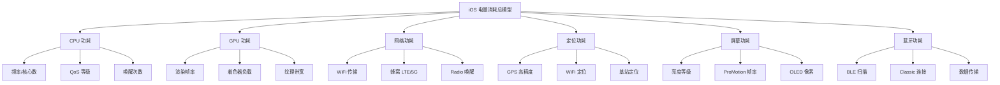
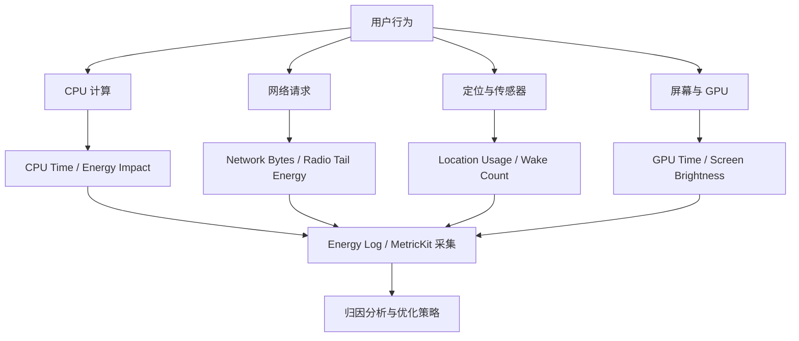
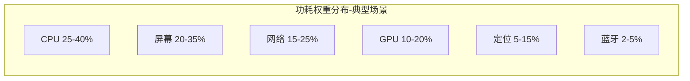
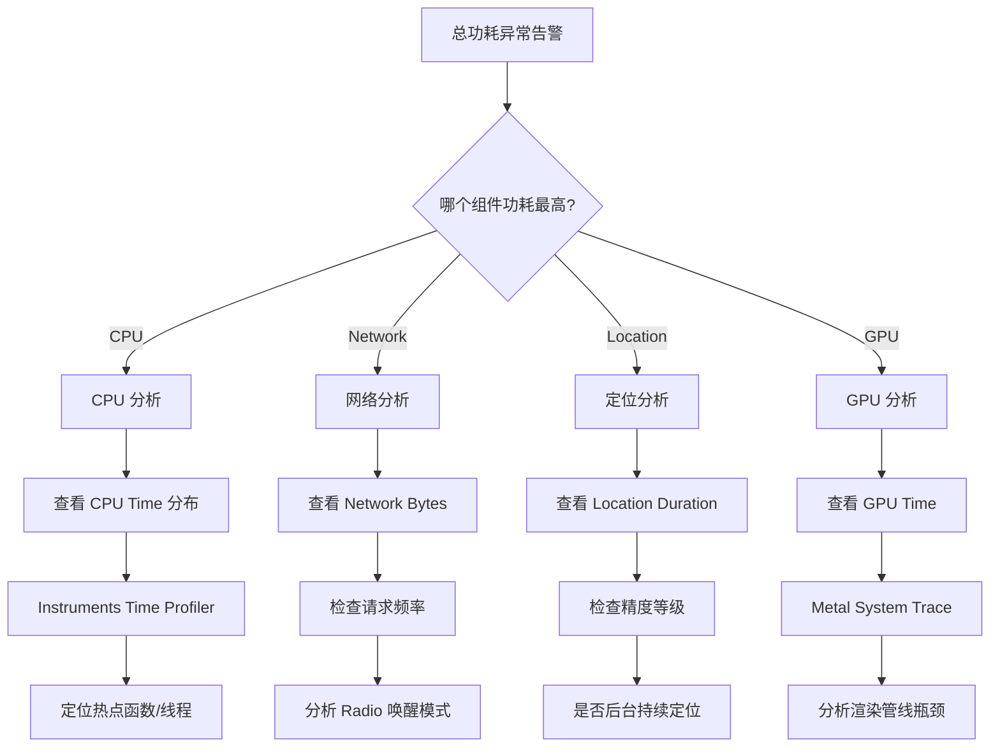
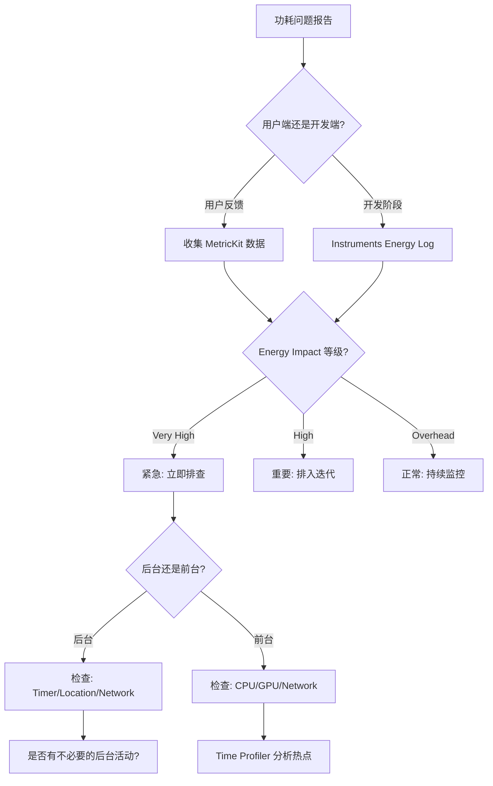

# 电量消耗模型与监控体系深度解析

> 从硬件功耗本质到系统级监控：全面理解 iOS 电量消耗分层模型、监控指标体系与归因分析方法论，构建完整的功耗可观测性基础设施

---

## 目录

- [核心结论 TL;DR](#核心结论-tldr)
- [第一部分：iOS 电量消耗模型](#第一部分ios-电量消耗模型)
- [第二部分：功耗监控的必要性](#第二部分功耗监控的必要性)
- [第三部分：监控指标体系](#第三部分监控指标体系)
- [第四部分：监控工具链](#第四部分监控工具链)
- [第五部分：电量归因分析方法论](#第五部分电量归因分析方法论)
- [最佳实践](#最佳实践)
- [常见陷阱](#常见陷阱)
- [面试考点](#面试考点)
- [参考资源](#参考资源)

---

## 核心结论 TL;DR

| 维度 | 核心洞察 |
|------|----------|
| **功耗本质** | 电量消耗 = 各硬件组件（CPU/GPU/网络/定位/屏幕/蓝牙）的功率 × 时间，网络与定位是最易被忽视的功耗大户 |
| **监控指标** | Energy Impact Level（Overhead/High/Very High）是核心综合指标，CPU Time、CPU Wake Count、Network Bytes 是细分维度 |
| **工具选择** | 开发阶段用 Instruments Energy Log + Xcode Energy Gauge；线上用 MetricKit 聚合采集 |
| **归因方法** | Top-Down 分解法：总功耗 → 组件功耗 → 模块 → 具体代码路径，结合 os_signpost 精确标记 |
| **核心原则** | 减少不必要工作 > 合并工作 > 选择低功耗方式，CPU 唤醒次数比 CPU 占用率更影响功耗 |

---

## 第一部分：iOS 电量消耗模型

### 1.1 电量消耗的物理本质

**结论先行**：电量消耗的本质是电流通过硬件组件做功，不同硬件组件的功耗特性差异巨大，理解各组件的功耗权重是优化的前提。

iOS 设备的电池是一个容量有限的化学储能装置（iPhone 15 Pro 约 3274mAh），设备运行时各硬件模块持续消耗电能。功耗（Power）的单位是瓦特（W），电量消耗（Energy）= 功率 × 时间（Wh 或 mAh）。

各硬件组件的功耗特性：

| 组件 | 典型功率范围 | 功耗特点 | 影响因素 |
|------|-------------|---------|---------|
| **CPU** | 0.5W ~ 6W | 动态功耗随频率/电压平方增长 | 核心数、频率、QoS 等级 |
| **GPU** | 0.3W ~ 4W | 与渲染负载线性相关 | 帧率、着色器复杂度、纹理 |
| **屏幕** | 0.5W ~ 2.5W | 持续消耗，受亮度影响最大 | 亮度、刷新率、OLED 像素 |
| **蜂窝网络** | 0.8W ~ 3.5W | 有 Radio 唤醒和尾部能耗 | 信号强度、频段、数据量 |
| **WiFi** | 0.2W ~ 0.8W | 功耗远低于蜂窝 | 信号强度、传输速率 |
| **GPS** | 0.1W ~ 1.0W | 高精度模式功耗剧增 | 精度等级、更新频率 |
| **蓝牙** | 0.01W ~ 0.5W | BLE 功耗远低于经典蓝牙 | 扫描频率、连接数 |

### 1.2 iOS 电量消耗分层模型

**结论先行**：iOS 电量消耗可分为六大组件域，每个域有独立的功耗曲线和优化策略。



#### CPU 功耗：频率、核心数、QoS 等级

CPU 是最核心的功耗组件，其动态功耗遵循公式：P = C × V² × f（C: 电容系数，V: 电压，f: 频率）。

关键影响因素：

- **频率与电压**：Apple A 系列芯片采用 DVFS（Dynamic Voltage and Frequency Scaling），高频率意味着高电压，功耗按电压平方增长
- **核心类型**：Performance Core（P核）功耗约为 Efficiency Core（E核）的 3-5 倍
- **QoS 等级**：`.userInteractive` 会唤醒 P 核并提升频率，`.background` 仅使用 E 核

```swift
// ✅ 推荐：为非紧急任务指定低 QoS，让系统调度到 E 核
DispatchQueue.global(qos: .utility).async {
    // 数据处理、日志上传等非紧急任务
    self.processAnalyticsData()
}

// ❌ 避免：所有任务都用默认 QoS 或 userInteractive
DispatchQueue.global(qos: .userInteractive).async {
    // 非 UI 相关的后台任务不应使用 userInteractive
    self.uploadLogs()
}
```

```objectivec
// ✅ 推荐：ObjC 中通过 NSOperation 设置 QoS
NSOperationQueue *bgQueue = [[NSOperationQueue alloc] init];
bgQueue.qualityOfService = NSQualityOfServiceUtility;
[bgQueue addOperationWithBlock:^{
    [self processAnalyticsData];
}];

// ❌ 避免：不设置 QoS，默认使用较高优先级
NSOperationQueue *queue = [[NSOperationQueue alloc] init];
// 未设置 qualityOfService，默认 NSQualityOfServiceDefault
[queue addOperationWithBlock:^{
    [self uploadLogs];
}];
```

**CPU Wake Count 的重要性**：

CPU 唤醒次数比 CPU 占用率更影响功耗。每次从 idle 状态唤醒 CPU，都会经历一次电压/频率爬升过程，产生额外的能耗开销。频繁的短暂唤醒（如高频 Timer）比持续占用更耗电。

#### GPU 功耗：渲染负载、帧率、Metal/OpenGL 差异

GPU 功耗与渲染管线的负载直接相关：

- **帧率**：120fps 的 GPU 功耗约为 60fps 的 1.5-2 倍（非线性关系，因频率/电压提升）
- **着色器复杂度**：Fragment Shader 中复杂的数学运算和纹理采样直接增加 GPU 周期
- **Metal vs OpenGL ES**：Metal 的驱动层开销更低，相同渲染任务功耗约低 10-20%
- **过度绘制**：同一像素被多次渲染浪费 GPU 算力和带宽

#### 网络功耗：WiFi vs 蜂窝功耗差异与 Radio 唤醒机制

**结论先行**：蜂窝网络的功耗是 WiFi 的 3-5 倍，且存在 Radio 尾部能耗问题，是最容易被忽视的功耗大户。

蜂窝网络（LTE/5G）Radio 状态机：

```
┌─────────────────────────────────────────────────────────────────┐
│  蜂窝 Radio 状态机                                               │
│                                                                  │
│  [Idle] ──数据请求──→ [Connected High Power] ──无活动──→         │
│    ↑                      (全速传输)           (等待约 5s)        │
│    │                                              ↓              │
│    │                                    [Connected Low Power]    │
│    │                                      (降低功率监听)          │
│    │                                         (约 12s)            │
│    │                                              ↓              │
│    └──────────────────────────────────────── [Idle]              │
│                                                                  │
│  关键问题：Tail Energy（尾部能耗）                                │
│  每次唤醒 Radio 后，即使数据传输完毕，Radio 仍维持                │
│  高功率状态约 5s + 低功率状态约 12s = 总计约 17s 额外功耗         │
└─────────────────────────────────────────────────────────────────┘
```

功耗对比数据：

| 场景 | WiFi | 蜂窝 LTE | 蜂窝 5G |
|------|------|----------|---------|
| 单次请求（含 Tail） | ~0.2W × 2s | ~2.0W × 17s | ~2.5W × 17s |
| 每小时 60 次小请求 | ~24Wh | ~2040Wh | ~2550Wh |
| 持续流媒体 | ~0.5W | ~1.5W | ~2.0W |

#### 定位功耗：精度与功耗的权衡

定位精度与功耗成指数关系：

| 精度等级 | 精度范围 | 功耗等级 | 适用场景 |
|---------|---------|---------|---------|
| `kCLLocationAccuracyBestForNavigation` | ~1m | 极高 | 导航 |
| `kCLLocationAccuracyBest` | ~5m | 高 | 精确定位 |
| `kCLLocationAccuracyNearestTenMeters` | ~10m | 中 | 附近搜索 |
| `kCLLocationAccuracyHundredMeters` | ~100m | 低 | 城市级定位 |
| `kCLLocationAccuracyKilometer` | ~1km | 很低 | 天气应用 |
| `kCLLocationAccuracyThreeKilometers` | ~3km | 极低 | 粗略定位 |

#### 屏幕功耗：亮度与 ProMotion 自适应帧率

屏幕是持续消耗功率的组件：

- **亮度**：最大亮度的功耗约为最低亮度的 4-5 倍
- **ProMotion**：iPhone 13 Pro+ 支持 10Hz-120Hz 自适应刷新率，静止页面自动降至 10Hz
- **OLED 特性**：黑色像素几乎不耗电，暗黑模式可节省 30%-60% 屏幕功耗

#### 蓝牙功耗：BLE vs Classic Bluetooth

| 特性 | BLE (低功耗蓝牙) | Classic Bluetooth |
|------|-----------------|-------------------|
| 峰值功耗 | < 15mA | 30-50mA |
| 待机功耗 | < 1μA | ~2.5mA |
| 连接建立 | < 6ms | ~100ms |
| 典型场景 | 传感器、信标 | 音频、文件传输 |

### 1.3 功耗权重模型

**从用户行为到监控采集的全链路功耗模型**：





> **关键洞察**：功耗权重因应用类型差异巨大。社交 App 网络占比高达 40%+，游戏 App GPU 占比达 35%+，导航 App 定位占比达 30%+。优化策略必须针对应用特性定制。

---

## 第二部分：功耗监控的必要性

### 2.1 电量与用户体验的关系

**结论先行**：电量消耗是用户体验的隐形杀手，过度功耗导致设备发热、续航缩短，最终导致用户卸载。

Apple 的研究数据表明：
- **70%** 的用户会因为 App 导致设备发热而降低使用频率
- **设备发热**触发系统热保护（Thermal Throttling），CPU/GPU 降频，直接影响性能表现
- **电池健康**：持续高功耗加速电池化学老化，降低电池最大容量

### 2.2 App Store 的能耗审查标准

Apple 对应用的能耗表现有明确要求：

- **Background Energy Budget**：后台运行时系统分配的能耗预算，超出预算的 App 会被系统强制挂起
- **后台刷新权限**：能耗超标的 App，系统会自动关闭其 Background App Refresh
- **审核拒绝**：严重的能耗问题（如持续占用 GPS、持续高 CPU）可能导致审核拒绝
- **设备管理提示**：iOS "设置 → 电池" 页面会显示高耗电 App，影响用户信任

### 2.3 iOS 后台限制机制

iOS 对后台应用有严格的能耗管控：

```
┌──────────────────────────────────────────────────────────┐
│  iOS 后台能耗管控层级                                      │
│                                                           │
│  L1: Background App Refresh 开关                          │
│      → 用户/系统可关闭，App 的 BGTask 不再被调度            │
│                                                           │
│  L2: App Nap (类似 macOS)                                 │
│      → 后台 Timer 延迟、网络请求推迟                        │
│                                                           │
│  L3: Background Execution Budget                          │
│      → 系统动态分配 CPU 时间预算，超出则终止                 │
│                                                           │
│  L4: Thermal Throttling                                   │
│      → 设备过热时系统降频，所有进程受影响                    │
│                                                           │
│  L5: Low Power Mode                                       │
│      → 用户开启低电量模式，后台活动大幅受限                  │
└──────────────────────────────────────────────────────────┘
```

---

## 第三部分：监控指标体系

### 3.1 Energy Impact Level

**结论先行**：Energy Impact Level 是 Xcode/Instruments 中的综合功耗指标，分为三个等级，是判断应用功耗是否健康的首要参考。

| 等级 | 标识 | 含义 | 行动建议 |
|------|------|------|---------|
| **Overhead** | 🟢 绿色 | 低功耗，正常范围 | 维持现状 |
| **High** | 🟡 黄色 | 中等功耗，需关注 | 审查 CPU/网络活动 |
| **Very High** | 🔴 红色 | 高功耗，必须优化 | 立即定位并修复 |

Energy Impact 的计算综合考虑：CPU Usage、Network Activity、Location Usage、GPU Usage、Background Activity。

### 3.2 CPU 相关指标

| 指标 | 说明 | 健康阈值 |
|------|------|---------|
| **CPU Time** | 应用实际占用 CPU 的时间 | 前台 < 80%，后台 < 5% |
| **CPU Wake Count** | CPU 从 idle 被唤醒的次数 | < 100 次/分钟 |
| **CPU Instructions Retired** | 执行的指令总数 | 与业务相关，关注趋势 |

### 3.3 网络相关指标

| 指标 | 说明 | 关注点 |
|------|------|--------|
| **Network Bytes Sent/Received** | 上下行数据量 | 关注蜂窝下的数据量 |
| **Network Connections** | 建立的连接数 | 频繁建连增加 Radio 唤醒 |
| **Cellular Condition** | 蜂窝信号状态 | 弱信号时功耗更高 |

### 3.4 定位相关指标

| 指标 | 说明 | 关注点 |
|------|------|--------|
| **Location Duration** | 定位服务使用时长 | 后台持续定位需重点关注 |
| **Location Accuracy Level** | 使用的精度等级 | 是否匹配实际需求 |

### 3.5 MetricKit 指标详解

MetricKit 提供线上聚合指标，按 24 小时为窗口收集：

| MetricKit 类 | 功能 | 关键属性 |
|--------------|------|---------|
| **MXCPUMetric** | CPU 使用指标 | `cumulativeCPUTime`、`cumulativeCPUInstructions` |
| **MXGPUMetric** | GPU 使用指标 | `cumulativeGPUTime` |
| **MXCellularConditionMetric** | 蜂窝网络状态 | `histogrammedCellularConditionTime`（按信号强度分桶） |
| **MXNetworkTransferMetric** | 网络传输指标 | `cumulativeCellularUpload`、`cumulativeWifiDownload` |
| **MXAppExitMetric** | 应用退出原因 | `backgroundExitData`（含 `cumulativeMemoryPressureExitCount`） |
| **MXDisplayMetric** | 显示指标 | `averagePixelLuminance` (iOS 16+) |

---

## 第四部分：监控工具链

### 4.1 Xcode Energy Gauge

**结论先行**：Xcode Energy Gauge 是最便捷的实时功耗观测工具，适合开发阶段快速定位功耗问题。

使用方法：
1. 连接真机运行应用（模拟器不支持能耗监测）
2. Xcode → Debug Navigator → Energy Impact
3. 观察实时功耗等级和各组件活动状态

关注面板信息：
- **Energy Impact Bar**：综合功耗等级（绿/黄/红）
- **CPU**：CPU 占用率时间线
- **Network**：网络活动状态
- **Location**：定位使用状态
- **GPU**：GPU 活动状态
- **Background**：后台活动指示

### 4.2 Instruments Energy Log

**结论先行**：Energy Log 是最详细的离线功耗分析工具，支持长时间采集和细粒度分析。

使用流程：
1. Instruments → Energy Log 模板
2. 选择真机目标应用
3. 录制操作场景（建议 5-10 分钟）
4. 分析各通道数据：CPU Activity、Network Activity、Display Brightness、GPS、Bluetooth

### 4.3 MetricKit：线上收集框架

**结论先行**：MetricKit 是 Apple 提供的线上性能指标收集框架（iOS 13+），每 24 小时自动聚合一次数据，是功耗长期监控的核心工具。

```swift
// ✅ 推荐：MetricKit 订阅与数据解析
import MetricKit

class EnergyMetricsSubscriber: NSObject, MXMetricManagerSubscriber {
    
    static let shared = EnergyMetricsSubscriber()
    
    func startMonitoring() {
        MXMetricManager.shared.add(self)
    }
    
    func stopMonitoring() {
        MXMetricManager.shared.remove(self)
    }
    
    // MARK: - MXMetricManagerSubscriber
    
    func didReceive(_ payloads: [MXMetricPayload]) {
        for payload in payloads {
            processMetricPayload(payload)
        }
    }
    
    func didReceive(_ payloads: [MXDiagnosticPayload]) {
        for payload in payloads {
            processDiagnosticPayload(payload)
        }
    }
    
    // MARK: - Payload 解析
    
    private func processMetricPayload(_ payload: MXMetricPayload) {
        // CPU 指标
        if let cpuMetric = payload.cpuMetrics {
            let cpuTime = cpuMetric.cumulativeCPUTime
            print("CPU Time: \(cpuTime.converted(to: .seconds).value)s")
        }
        
        // GPU 指标
        if let gpuMetric = payload.gpuMetrics {
            let gpuTime = gpuMetric.cumulativeGPUTime
            print("GPU Time: \(gpuTime.converted(to: .seconds).value)s")
        }
        
        // 蜂窝条件指标
        if let cellularMetric = payload.cellularConditionMetrics {
            let histogram = cellularMetric.histogrammedCellularConditionTime
            print("Cellular Condition Histogram: \(histogram)")
        }
        
        // 网络传输指标
        if let networkMetric = payload.networkTransferMetrics {
            let cellularUpload = networkMetric.cumulativeCellularUpload
            let cellularDownload = networkMetric.cumulativeCellularDownload
            let wifiUpload = networkMetric.cumulativeWifiUpload
            let wifiDownload = networkMetric.cumulativeWifiDownload
            print("Cellular: ↑\(cellularUpload) ↓\(cellularDownload)")
            print("WiFi: ↑\(wifiUpload) ↓\(wifiDownload)")
        }
        
        // 应用退出指标
        if let exitMetric = payload.applicationExitMetrics {
            let bgExit = exitMetric.backgroundExitData
            print("BG Memory Pressure Exits: \(bgExit.cumulativeMemoryPressureExitCount)")
            print("BG CPU Resource Limit Exits: \(bgExit.cumulativeCPUResourceLimitExitCount)")
        }
        
        // 将 JSON 数据上报到自建服务
        if let jsonData = payload.jsonRepresentation() {
            uploadToServer(data: jsonData)
        }
    }
    
    private func processDiagnosticPayload(_ payload: MXDiagnosticPayload) {
        if let cpuExceptions = payload.cpuExceptionDiagnostics {
            for diagnostic in cpuExceptions {
                let totalCPUTime = diagnostic.totalCPUTime
                let totalSampledTime = diagnostic.totalSampledTime
                print("CPU Exception: \(totalCPUTime) in \(totalSampledTime)")
                // 包含调用栈信息
                let callStack = diagnostic.callStackTree
                print("Call Stack: \(callStack)")
            }
        }
    }
    
    private func uploadToServer(data: Data) {
        // 上报到自建监控平台
        var request = URLRequest(url: URL(string: "https://api.example.com/metrics")!)
        request.httpMethod = "POST"
        request.httpBody = data
        request.setValue("application/json", forHTTPHeaderField: "Content-Type")
        URLSession.shared.dataTask(with: request).resume()
    }
}
```

```objectivec
// ✅ 推荐：ObjC 版 MetricKit 订阅
#import <MetricKit/MetricKit.h>

@interface EnergyMetricsSubscriber : NSObject <MXMetricManagerSubscriber>
+ (instancetype)shared;
- (void)startMonitoring;
@end

@implementation EnergyMetricsSubscriber

+ (instancetype)shared {
    static EnergyMetricsSubscriber *instance = nil;
    static dispatch_once_t onceToken;
    dispatch_once(&onceToken, ^{
        instance = [[self alloc] init];
    });
    return instance;
}

- (void)startMonitoring {
    [[MXMetricManager sharedManager] addSubscriber:self];
}

- (void)didReceiveMetricPayloads:(NSArray<MXMetricPayload *> *)payloads {
    for (MXMetricPayload *payload in payloads) {
        // CPU 指标
        MXCPUMetric *cpuMetric = payload.cpuMetrics;
        if (cpuMetric) {
            NSMeasurement *cpuTime = cpuMetric.cumulativeCPUTime;
            NSLog(@"CPU Time: %@", cpuTime);
        }
        
        // 上报 JSON 数据
        NSData *jsonData = [payload JSONRepresentation];
        if (jsonData) {
            [self uploadToServer:jsonData];
        }
    }
}

- (void)didReceiveDiagnosticPayloads:(NSArray<MXDiagnosticPayload *> *)payloads {
    for (MXDiagnosticPayload *payload in payloads) {
        NSArray<MXCPUExceptionDiagnostic *> *cpuExceptions = payload.cpuExceptionDiagnostics;
        for (MXCPUExceptionDiagnostic *diagnostic in cpuExceptions) {
            NSLog(@"CPU Exception - Total CPU Time: %@", diagnostic.totalCPUTime);
        }
    }
}

- (void)uploadToServer:(NSData *)data {
    NSMutableURLRequest *request = [NSMutableURLRequest requestWithURL:
        [NSURL URLWithString:@"https://api.example.com/metrics"]];
    request.HTTPMethod = @"POST";
    request.HTTPBody = data;
    [request setValue:@"application/json" forHTTPHeaderField:@"Content-Type"];
    [[NSURLSession.sharedSession dataTaskWithRequest:request] resume];
}

@end
```

### 4.4 os_signpost 自定义能耗标记

**结论先行**：os_signpost 允许开发者在代码中插入自定义标记，与 Instruments 联动实现精确的功耗归因。

```swift
// ✅ 推荐：使用 os_signpost 标记高功耗操作
import os.signpost

let energyLog = OSLog(subsystem: "com.app.energy", category: "NetworkRequests")

func performBatchUpload() {
    let signpostID = OSSignpostID(log: energyLog)
    
    // 标记开始
    os_signpost(.begin, log: energyLog, name: "BatchUpload", signpostID: signpostID,
                "Uploading %d items", items.count)
    
    // 执行上传操作
    uploadItems(items) { result in
        // 标记结束
        os_signpost(.end, log: energyLog, name: "BatchUpload", signpostID: signpostID,
                    "Result: %{public}@", result.description)
    }
}
```

```objectivec
// ✅ 推荐：ObjC 中使用 os_signpost
#import <os/signpost.h>

static os_log_t energyLog;

+ (void)initialize {
    energyLog = os_log_create("com.app.energy", "NetworkRequests");
}

- (void)performBatchUpload {
    os_signpost_id_t spid = os_signpost_id_generate(energyLog);
    
    os_signpost_interval_begin(energyLog, spid, "BatchUpload",
                               "Uploading %lu items", (unsigned long)self.items.count);
    
    [self uploadItems:self.items completion:^(NSError *error) {
        os_signpost_interval_end(energyLog, spid, "BatchUpload",
                                  "Error: %{public}@", error ?: @"none");
    }];
}
```

---

## 第五部分：电量归因分析方法论

### 5.1 Top-Down 分解法

**结论先行**：电量归因采用 Top-Down 分解法，从总功耗逐层下钻到具体代码路径，是最系统化的功耗问题定位方法。



### 5.2 归因分析步骤

**Step 1：确认问题存在**
- Xcode Energy Gauge 显示持续红色（Very High）
- 或 MetricKit 上报 CPU Exception Diagnostic

**Step 2：组件级定位**
- Instruments Energy Log → 查看各通道活动
- 确定主要功耗来源组件

**Step 3：模块级定位**
- CPU：Time Profiler → 查看线程和调用栈
- 网络：Network Profiler → 查看请求时间线
- 定位：Location Profiler → 查看精度和时长
- GPU：Metal System Trace → 查看渲染负载

**Step 4：代码级定位**
- 结合 os_signpost 标记缩小范围
- 代码审查确认具体原因

### 5.3 案例分析：定位一个高功耗问题

**场景**：用户反馈某社交 App 在后台导致 iPhone 发热、电量快速下降。

**分析过程**：

```
┌───────────────────────────────────────────────────────────┐
│  Step 1: 复现与数据收集                                     │
│  → Instruments Energy Log 录制 30 分钟（含后台）            │
│  → 观察：后台时 Energy Impact 持续为 Very High              │
│                                                            │
│  Step 2: 组件级分析                                         │
│  → CPU Activity: 后台 CPU 占用率 15-20%                     │
│  → Network Activity: 每 30s 有网络请求                      │
│  → Location: 持续开启                                       │
│                                                            │
│  Step 3: 根因定位                                           │
│  → Network: 后台心跳请求间隔过短（30s），每次唤醒 Radio       │
│  → Location: 使用 kCLLocationAccuracyBest 持续定位          │
│  → CPU: NSTimer 每 5s 触发一次位置更新检查                   │
│                                                            │
│  Step 4: 修复方案                                           │
│  → 心跳间隔调整为 5 分钟 + 使用 NSURLSession Background     │
│  → 定位改为 Significant Location Change                     │
│  → Timer 改为 BGTaskScheduler                               │
│                                                            │
│  结果: 后台功耗降低 85%                                      │
└───────────────────────────────────────────────────────────┘
```

### 5.4 功耗排查决策树



---

## 最佳实践

### 开发阶段

```swift
// ✅ 1. 在 AppDelegate 中尽早注册 MetricKit 订阅
func application(_ application: UIApplication, 
                 didFinishLaunchingWithOptions launchOptions: [UIApplication.LaunchOptionsKey: Any]?) -> Bool {
    EnergyMetricsSubscriber.shared.startMonitoring()
    return true
}

// ✅ 2. 为关键路径添加 os_signpost 标记
func fetchTimeline() {
    os_signpost(.begin, log: energyLog, name: "TimelineFetch")
    defer { os_signpost(.end, log: energyLog, name: "TimelineFetch") }
    // ...
}

// ✅ 3. 根据 ProcessInfo 判断低电量模式
func shouldEnableExpensiveFeature() -> Bool {
    return !ProcessInfo.processInfo.isLowPowerModeEnabled
}
```

```objectivec
// ✅ ObjC: 监听低电量模式变化
[[NSNotificationCenter defaultCenter] addObserver:self
    selector:@selector(powerModeChanged:)
    name:NSProcessInfoPowerStateDidChangeNotification
    object:nil];

- (void)powerModeChanged:(NSNotification *)notification {
    BOOL isLowPower = [NSProcessInfo processInfo].isLowPowerModeEnabled;
    if (isLowPower) {
        [self reduceBackgroundActivity];
        [self lowerFrameRate];
    }
}
```

### 监控体系建设

| 阶段 | 工具 | 指标 | 频率 |
|------|------|------|------|
| 开发 | Xcode Energy Gauge | Energy Impact Level | 实时 |
| 测试 | Instruments Energy Log | 各组件详细数据 | 每个版本 |
| 灰度 | MetricKit | CPU/GPU/Network 聚合 | 每日 |
| 全量 | MetricKit + 自建平台 | 趋势 + 告警 | 每日 |

---

## 常见陷阱

### ❌ 陷阱 1：在模拟器上测试功耗

```swift
// ❌ 模拟器无法准确模拟硬件功耗特性
// 模拟器运行在 x86/ARM Mac 上，功耗数据无参考价值
// Instruments Energy Log 在模拟器上不可用

// ✅ 必须使用真机测试功耗
// 且应使用与目标用户相似的设备型号
```

### ❌ 陷阱 2：忽略 CPU Wake Count

```swift
// ❌ 高频 Timer 导致 CPU 频繁唤醒
Timer.scheduledTimer(withTimeInterval: 0.1, repeats: true) { _ in
    self.checkForUpdates() // 每 100ms 唤醒一次 CPU
}

// ✅ 使用合适的间隔并设置 tolerance
let timer = Timer.scheduledTimer(withTimeInterval: 60.0, repeats: true) { _ in
    self.checkForUpdates()
}
timer.tolerance = 10.0 // 允许 10s 偏差，让系统合并 Timer
```

### ❌ 陷阱 3：后台持续使用高精度定位

```swift
// ❌ 后台仍使用最高精度
locationManager.desiredAccuracy = kCLLocationAccuracyBest
locationManager.allowsBackgroundLocationUpdates = true
// 后台 GPS 持续工作，功耗极高

// ✅ 后台切换到低精度或 Significant Location Change
func applicationDidEnterBackground(_ application: UIApplication) {
    locationManager.stopUpdatingLocation()
    locationManager.startMonitoringSignificantLocationChanges()
}
```

### ❌ 陷阱 4：蜂窝网络下频繁小请求

```swift
// ❌ 每次用户操作都发送请求（蜂窝下每次唤醒 Radio 17s）
func userDidTapLike() {
    URLSession.shared.dataTask(with: likeURL).resume() // 小请求频繁触发
}

// ✅ 批量合并请求
private var pendingActions: [UserAction] = []

func userDidTapLike() {
    pendingActions.append(.like(postId: currentPost.id))
    debounceBatchUpload()
}

func debounceBatchUpload() {
    NSObject.cancelPreviousPerformRequests(withTarget: self, selector: #selector(batchUpload), object: nil)
    perform(#selector(batchUpload), with: nil, afterDelay: 5.0) // 5s 内合并
}
```

### ❌ 陷阱 5：MetricKit 数据未解析利用

```swift
// ❌ 注册了 MetricKit 但没有解析和上报数据
func didReceive(_ payloads: [MXMetricPayload]) {
    // 空实现，数据白白丢失
}

// ✅ 完整解析并上报到监控平台
func didReceive(_ payloads: [MXMetricPayload]) {
    for payload in payloads {
        let jsonData = payload.jsonRepresentation()
        uploadToMonitoringPlatform(jsonData)
        
        // 同时检查是否有 CPU Exception
        if let cpuTime = payload.cpuMetrics?.cumulativeCPUTime,
           cpuTime.converted(to: .hours).value > 2.0 {
            triggerAlert("Abnormal CPU usage detected")
        }
    }
}
```

---

## 面试考点

### Q1：iOS 中哪些硬件组件是主要的功耗来源？它们的功耗特点分别是什么？

**参考答案**：主要功耗来源包括 CPU（动态功耗随频率/电压平方增长，P核功耗是E核的3-5倍）、GPU（与渲染帧率和着色器复杂度线性相关）、屏幕（持续消耗，亮度影响最大）、蜂窝网络（功耗是WiFi的3-5倍，存在Radio尾部能耗）、GPS（高精度模式功耗剧增）、蓝牙（BLE远低于Classic）。不同应用类型的功耗权重差异巨大。

### Q2：什么是 Radio 尾部能耗（Tail Energy）？如何优化？

**参考答案**：蜂窝Radio从Connected切回Idle需经历约17s的降功率过程（5s高功率 + 12s低功率），即使数据传输已完成。频繁的小请求会反复唤醒Radio，累积大量Tail Energy。优化策略：①请求合并（Batching）—— 攒够一批再发；②Debouncing —— 延迟合并近距离请求；③优先WiFi传输；④后台传输使用NSURLSession Background Session。

### Q3：如何使用 MetricKit 建立线上功耗监控？

**参考答案**：①实现 `MXMetricManagerSubscriber` 协议并注册订阅；②在 `didReceive(_:)` 中解析 `MXMetricPayload`，提取 `MXCPUMetric`、`MXGPUMetric`、`MXCellularConditionMetric`、`MXNetworkTransferMetric` 等指标；③将 `jsonRepresentation()` 上报到自建监控平台；④解析 `MXDiagnosticPayload` 获取 CPU Exception 的调用栈信息；⑤建立基线和告警阈值，关注日趋势变化。注意 MetricKit 按24小时窗口聚合，不适用于实时监控。

### Q4：为什么 CPU Wake Count 比 CPU 占用率更影响功耗？

**参考答案**：每次CPU从idle唤醒，需要经历电压/频率爬升过程（voltage ramp-up），产生额外的功耗开销。频繁的短暂唤醒（如100ms间隔的Timer）导致CPU无法进入深度睡眠，持续处于低效的唤醒-睡眠循环中。解决方案：使用Timer.tolerance允许系统合并Timer，使用GCD的DispatchSourceTimer，用BGTaskScheduler替代后台Timer。

### Q5：如何系统性地排查一个高功耗问题？

**参考答案**：采用Top-Down分解法：①确认问题 —— Xcode Energy Gauge或MetricKit数据确认功耗异常；②组件定位 —— Instruments Energy Log查看各组件（CPU/Network/Location/GPU）的活动状态；③模块定位 —— Time Profiler找CPU热点、Network Profiler找请求模式、Location Profiler看精度和时长；④代码定位 —— 结合os_signpost标记缩小范围到具体代码路径；⑤验证修复 —— A/B对比修复前后的MetricKit数据。

---

## 参考资源

### Apple 官方文档
- [Reducing Your App's Energy Use](https://developer.apple.com/documentation/performance/reducing-your-app-s-energy-use)
- [MetricKit Framework](https://developer.apple.com/documentation/metrickit)
- [MXMetricManager](https://developer.apple.com/documentation/metrickit/mxmetricmanager)
- [Energy Efficiency Guide for iOS Apps](https://developer.apple.com/library/archive/documentation/Performance/Conceptual/EnergyGuide-iOS/)

### WWDC Sessions
- [WWDC 2020: What's New in MetricKit](https://developer.apple.com/videos/play/wwdc2020/10081/)
- [WWDC 2019: Improving Battery Life and Performance](https://developer.apple.com/videos/play/wwdc2019/417/)
- [WWDC 2018: Measuring Performance Using Logging](https://developer.apple.com/videos/play/wwdc2018/405/)

### 交叉引用
- [渲染性能与能耗优化](../../iOS_Framework_Architecture/06_性能优化框架/渲染性能与能耗优化_详细解析.md)
- [CPU 功耗与 QoS](../05_UI卡顿优化方法论/) — UI 卡顿与 CPU 调度策略
- [网络功耗优化](./功耗优化策略与最佳实践_详细解析.md) — 详细网络优化策略
