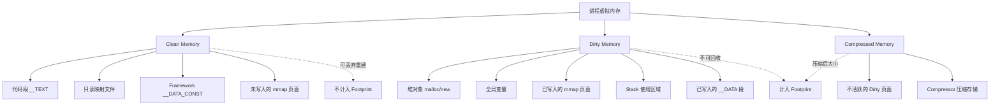
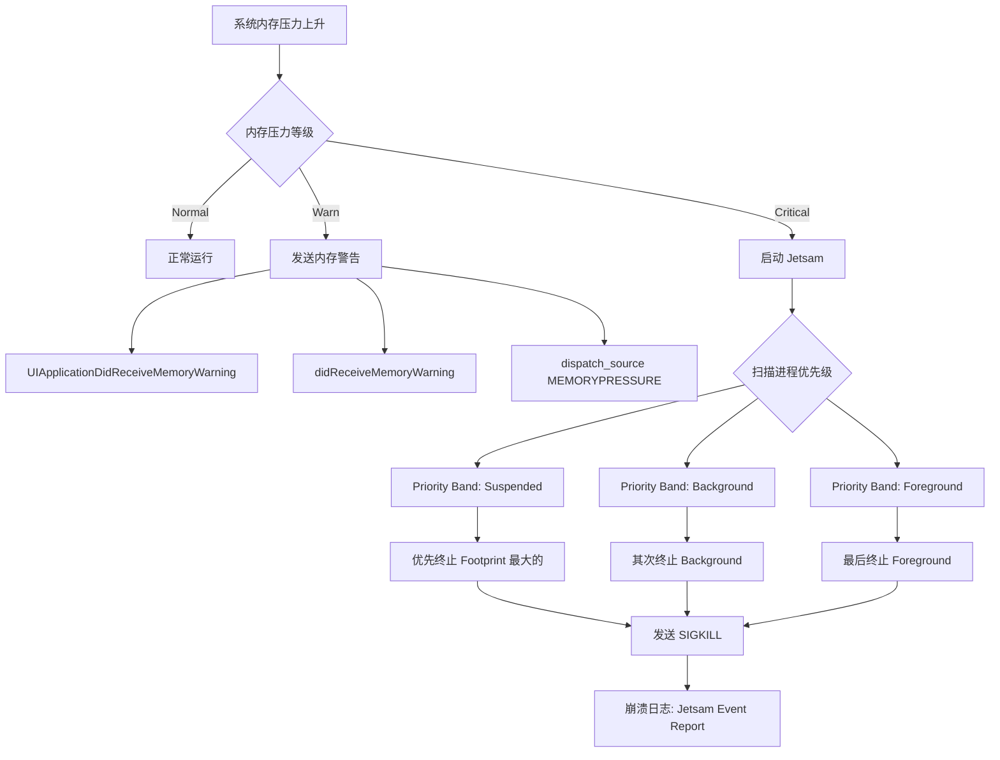
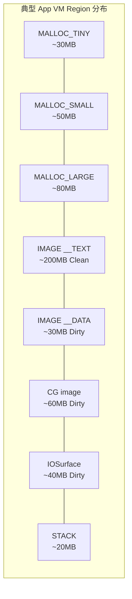

# iOS 内存架构与 Jetsam 机制深度解析

> 从虚拟内存到物理页面，从 Clean/Dirty/Compressed 分类到 Jetsam 终止策略——系统性掌握 iOS 内存管理的底层机制与度量体系

---

## 目录

- [核心结论 TL;DR](#核心结论-tldr)
- [第一部分：iOS 内存架构](#第一部分ios-内存架构)
- [第二部分：Jetsam 机制](#第二部分jetsam-机制)
- [第三部分：度量指标体系](#第三部分度量指标体系)
- [第四部分：VM Region 详解](#第四部分vm-region-详解)
- [第五部分：Copy-on-Write 机制](#第五部分copy-on-write-机制)
- [最佳实践](#最佳实践)
- [常见陷阱](#常见陷阱)
- [面试考点](#面试考点)
- [参考资源](#参考资源)

---

## 核心结论 TL;DR

| 维度 | 核心洞察 |
|------|----------|
| **内存分层** | iOS 内存分为 Clean（可丢弃重建）、Dirty（不可回收）、Compressed（压缩态 Dirty）三层，理解分层是优化的前提 |
| **Jetsam 本质** | iOS 无 Swap File，系统通过 Jetsam 机制按优先级终止进程来回收内存，Footprint 超限即被杀 |
| **度量核心** | Footprint = Dirty + Compressed（不含 Clean），这是 Jetsam 判定依据，而非 Resident Size |
| **内存压缩** | Compressor 将不活跃 Dirty 页面压缩至原大小 1/2~1/5，节省物理内存但消耗 CPU |
| **COW 机制** | Copy-on-Write 使 Framework 等只读内存跨进程共享，写入时才复制为 Dirty，是系统级优化基石 |
| **Page 大小** | Apple Silicon 使用 16KB Page（A14+），早期设备使用 4KB Page，影响内存对齐和分配粒度 |

---

## 第一部分：iOS 内存架构

### 1.1 虚拟内存与物理内存

**结论先行**：iOS 使用虚拟内存系统，每个进程拥有独立的虚拟地址空间（64 位下理论 ~18EB），但实际可用物理内存受设备限制（1GB~8GB）。虚拟页面按需映射到物理页面，是理解所有内存行为的基础。

```
┌────────────────────────────────────────────────────────────────┐
│                    iOS 虚拟内存体系                              │
├────────────────────────────────────────────────────────────────┤
│                                                                │
│  进程 A 虚拟地址空间            进程 B 虚拟地址空间               │
│  ┌──────────────────┐          ┌──────────────────┐            │
│  │ 0x0000 TEXT (Code)│         │ 0x0000 TEXT (Code)│            │
│  │ 0x1000 DATA       │         │ 0x1000 DATA       │            │
│  │ 0x2000 HEAP ↓     │         │ 0x2000 HEAP ↓     │            │
│  │        ...        │          │        ...        │            │
│  │ 0xF000 STACK ↑    │         │ 0xF000 STACK ↑    │            │
│  └───────┬───────────┘         └───────┬───────────┘            │
│          │                              │                       │
│          └──────────┬───────────────────┘                       │
│                     ▼                                           │
│            ┌──────────────┐                                     │
│            │   MMU/TLB    │  ← Page Table 映射                  │
│            └──────┬───────┘                                     │
│                   ▼                                             │
│          ┌──────────────────┐                                   │
│          │  物理内存 (DRAM)   │  ← 1GB ~ 8GB                    │
│          │  Page 大小: 16KB  │  ← Apple Silicon (A14+)          │
│          └──────────────────┘                                   │
└────────────────────────────────────────────────────────────────┘
```

**核心概念**：

- **Page（页面）**：内存管理的最小单位，Apple Silicon（A14+）为 **16KB**，早期 A-series 为 4KB
- **VM Region**：连续虚拟地址区间，具有相同的保护属性和映射关系
- **地址空间布局**：TEXT → DATA → HEAP（向高地址增长）→ ... → STACK（向低地址增长）
- **Page Fault**：访问未映射的虚拟页面时触发，内核分配物理页面并建立映射

```swift
// ✅ 获取系统 Page 大小
import Darwin

let pageSize = vm_page_size  // 16384 (16KB) on Apple Silicon
print("System page size: \(pageSize) bytes")

// 内存分配会按 Page 对齐
// 即使只需要 1 字节，也至少占用一个 Page（16KB）
let ptr = mmap(nil, 1, PROT_READ | PROT_WRITE,
               MAP_PRIVATE | MAP_ANONYMOUS, -1, 0)
// 实际映射了 16KB 的虚拟地址空间
```

```objc
// ✅ ObjC 获取 Page 大小
#import <mach/mach.h>

vm_size_t pageSize = vm_page_size; // 16384
NSLog(@"Page size: %lu bytes", (unsigned long)pageSize);
```

### 1.2 iOS 内存分类深度解析

**结论先行**：iOS 将进程内存分为 Clean、Dirty、Compressed 三类，Jetsam 仅基于 Dirty + Compressed（即 Footprint）做终止判定，Clean Memory 可随时丢弃重建。



#### Clean Memory — 可重新加载的内存

Clean Memory 是指可以被系统丢弃并在需要时重新加载的内存页面：

| 类型 | 说明 | 示例 |
|------|------|------|
| **代码段 `__TEXT`** | 可执行代码，可从 Mach-O 重新加载 | App 二进制、dylib |
| **只读映射文件** | read-only mmap 文件 | 资源文件、数据库文件 |
| **Framework `__DATA_CONST`** | Framework 中的只读数据 | 常量表、方法列表 |
| **未写入的 mmap** | 映射后尚未修改的页面 | 懒加载的大文件 |

> **关键洞察**：Clean Memory 在内存紧张时可被系统直接回收（evict），因为它能从磁盘重新加载，因此**不计入 Footprint**。

#### Dirty Memory — 不可回收的修改过内存

Dirty Memory 是进程在运行过程中修改或创建的内存，**无法被系统回收**：

| 类型 | 说明 | 常见来源 |
|------|------|----------|
| **堆分配** | malloc / new / alloc 创建的对象 | NSObject、Swift class 实例 |
| **全局变量** | 静态存储期的可变数据 | static var、全局字典 |
| **已写入 mmap** | mmap 后发生写入的页面 | 数据库 WAL、日志文件 |
| **Stack 使用区** | 线程栈中已使用的区域 | 局部变量、函数调用帧 |
| **`__DATA` 段写入** | ObjC runtime 初始化写入的元数据 | isa swizzle、category 加载 |

```swift
// ❌ 避免：大量 Dirty Memory 产生
var hugeArray = [Int](repeating: 0, count: 1_000_000)  // ~8MB Dirty
for i in 0..<hugeArray.count {
    hugeArray[i] = i  // 每个 Page 被写入后变为 Dirty
}

// ✅ 推荐：使用 mmap 文件映射，读取部分保持 Clean
let fileURL = URL(fileURLWithPath: "/path/to/large/data")
let data = try! Data(contentsOf: fileURL, options: .mappedIfSafe)
// 只有实际读取的 Page 会被加载，且未修改的保持 Clean
```

#### Compressed Memory — 压缩后的不活跃 Dirty Memory

**结论先行**：iOS 的 Compressor 会将不活跃的 Dirty 页面压缩存储在内存中（而非写入磁盘），以压缩后大小计入 Footprint。

### 1.3 内存压缩机制原理

**结论先行**：内存压缩是 iOS 应对"无 Swap"限制的核心策略，Compressor 可将不活跃内存压缩至原大小的 1/2~1/5，但压缩/解压有 CPU 开销。

```
┌─────────────────────────────────────────────────────────────┐
│                Compressor 工作流程                            │
├─────────────────────────────────────────────────────────────┤
│                                                             │
│  Dirty Page (16KB)                                          │
│  ┌──────────────┐                                           │
│  │ 活跃使用中    │ ──→ 保持原样（计入 Dirty Size）            │
│  └──────────────┘                                           │
│                                                             │
│  ┌──────────────┐     ┌──────────┐                          │
│  │ 不活跃        │ ──→ │ Compress │ ──→ 压缩存储 (3~8KB)     │
│  │ (长时间未访问) │     │ (WKdm)   │     (计入 Compressed)    │
│  └──────────────┘     └──────────┘                          │
│                                                             │
│  ┌──────────────┐     ┌────────────┐   ┌──────────────┐     │
│  │ 被访问        │ ←── │ Decompress │ ←─│ Compressed   │     │
│  │ (Page Fault)  │     │ (CPU 开销)  │   │ 存储区       │     │
│  └──────────────┘     └────────────┘   └──────────────┘     │
│                                                             │
│  典型压缩比: 2:1 ~ 5:1                                      │
│  ┌────────────────────────────────────┐                     │
│  │ 原始 16KB → 压缩后 3.2~8KB         │                     │
│  │ 纯零页面  → 接近 0 (极高压缩比)     │                     │
│  │ 随机数据  → ~14KB (低压缩比)        │                     │
│  └────────────────────────────────────┘                     │
└─────────────────────────────────────────────────────────────┘
```

**Compressor 工作时机与策略**：

1. **触发条件**：系统内存压力升高，可用物理页面低于阈值时开始压缩
2. **选择策略**：优先压缩最久未访问（LRU）的 Dirty 页面
3. **压缩算法**：使用 WKdm（Wilson-Kaplan direct mapped）算法，针对内存数据优化
4. **解压触发**：当进程访问已压缩页面时产生 Page Fault，内核自动解压

**CPU 开销分析**：

| 操作 | 耗时（典型值） | 影响 |
|------|----------------|------|
| 压缩 16KB 页面 | ~10-50 μs | 后台线程执行，影响较小 |
| 解压 16KB 页面 | ~5-30 μs | 在访问线程同步执行，可能造成卡顿 |
| 大量解压（遍历集合） | 数十 ms | 可导致主线程掉帧 |

```swift
// ❌ 避免：遍历大集合触发大量解压
var cache: [String: Data] = [:]  // 10000 个条目，大部分已被压缩
for (key, value) in cache {       // 触发所有条目解压 → CPU spike
    process(value)
}

// ✅ 推荐：按需访问，避免全量遍历压缩内存
if let target = cache["specific_key"] {  // 只解压一个条目
    process(target)
}
```

**Compressed 内存在 Footprint 中的计算方式**：

```
Footprint = Dirty Size + Compressed Size（压缩后大小）

示例：
- Dirty Pages:        100MB
- Compressed Pages:    50MB (原始 200MB 压缩后)
- Clean Pages:         80MB (不计入)
- Footprint:          150MB ← Jetsam 判定依据
```

---

## 第二部分：Jetsam 机制

### 2.1 iOS 没有 Swap File 的设计决策

**结论先行**：iOS 不使用磁盘 Swap，这是出于 NAND Flash 寿命保护和性能考量的设计决策，直接导致了 Jetsam 机制的存在。

| 维度 | macOS | iOS |
|------|-------|-----|
| **Swap 机制** | 有（写入 SSD） | **无** |
| **内存压缩** | 有 | 有 |
| **内存不足处理** | Swap + Compress + 终止 | Compress + **Jetsam 终止** |
| **进程生命周期** | 长期运行 | 系统随时可终止 |
| **设计考量** | 桌面应用体验优先 | Flash 寿命 + 续航 + 性能 |

### 2.2 Jetsam（Memorystatus）机制详解

**结论先行**：Jetsam 是 iOS 内核的内存守护机制，当系统内存压力达到阈值时，按进程优先级从低到高终止进程。前台 App 有最高优先级但仍有 Footprint 上限。



**内存压力等级**：

| 等级 | 含义 | 系统行为 |
|------|------|----------|
| **Normal** | 内存充裕 | 无特殊处理 |
| **Warn** | 内存偏紧 | 发送 `didReceiveMemoryWarning`，App 应主动释放缓存 |
| **Critical** | 内存严重不足 | Jetsam 启动，按优先级终止进程 |

**进程优先级评分（Priority Band）**：

| Priority Band | 值 | 典型进程 | 终止顺序 |
|---------------|-----|----------|----------|
| JETSAM_PRIORITY_IDLE | 0 | 已终止但缓存的进程 | 最先终止 |
| JETSAM_PRIORITY_BACKGROUND | 10 | 后台应用 | 较早终止 |
| JETSAM_PRIORITY_MAIL | 15 | 后台邮件同步 | - |
| JETSAM_PRIORITY_PHONE | 40 | 通话中 | - |
| JETSAM_PRIORITY_FOREGROUND | 100 | 前台应用 | 较晚终止 |
| JETSAM_PRIORITY_FOREGROUND_SUPPORT | 150 | 前台支持进程 | - |
| JETSAM_PRIORITY_JETSAM_MAX | 999 | 系统关键进程 | 最后终止 |

**终止决策逻辑**：
1. 从最低 Priority Band 开始扫描
2. 同一 Band 内，优先终止 **Footprint 最大**的进程
3. 如果回收内存不足，继续向更高 Band 扫描
4. 前台 App 有独立的 Footprint Limit（Hard Limit），超限立即被杀

**Jetsam 阈值（Per-Device 差异）**：

| 设备 | RAM | 前台 App 约限 | 系统 Critical 阈值 |
|------|-----|---------------|-------------------|
| iPhone SE 2 | 3GB | ~1.3GB | ~1.0GB |
| iPhone 12 | 4GB | ~1.8GB | ~1.4GB |
| iPhone 13 Pro | 6GB | ~3.0GB | ~2.0GB |
| iPhone 15 Pro | 8GB | ~4.0GB | ~3.0GB |
| iPad Pro M2 | 16GB | ~6.0GB | ~5.0GB |

> **注意**：以上为经验估计值，Apple 未公开精确阈值，且会随 iOS 版本变化。

### 2.3 EXC_RESOURCE vs Jetsam 区分

**结论先行**：EXC_RESOURCE 是进程超出单项资源限制的异常，Jetsam 是系统全局内存压力导致的终止，两者在崩溃日志中有明显区别。

| 维度 | EXC_RESOURCE | Jetsam |
|------|-------------|--------|
| **触发原因** | 单进程超出资源限制（CPU/Memory/IO） | 系统整体内存压力过高 |
| **日志标识** | `Exception Type: EXC_RESOURCE` | `Reason: per-process-limit` 或 `Jetsam Event Report` |
| **终止方式** | EXC_RESOURCE exception | SIGKILL (无法捕获) |
| **可预防** | 控制单进程资源使用 | 降低 Footprint + 响应内存警告 |
| **日志位置** | .crash 文件 | JetsamEvent-*.ips 文件 |

```
// Jetsam 崩溃日志示例
{
  "bug_type": "298",
  "name": "Jetsam",
  "os_version": "iPhone OS 17.0",
  ...
  "largestProcess": "MyApp",
  "processes": [
    {
      "name": "MyApp",
      "rpages": 89600,      // Resident Pages
      "reason": "per-process-limit",
      "fds": 128,
      "lifetimeMax": 92000
    }
  ]
}

// EXC_RESOURCE 崩溃日志示例
Exception Type:  EXC_RESOURCE
Exception Subtype: MEMORY
Exception Message: (limit=1450 MB, unused=0x0)
Triggered by Thread: 0
```

---

## 第三部分：度量指标体系

### 3.1 核心指标定义

**结论先行**：`phys_footprint`（通过 `task_info` 获取）是最精确的 Footprint 度量，等价于 Xcode Memory Gauge 显示值，也是 Jetsam 判定依据。

| 指标 | 计算公式 | 含义 | 获取方式 |
|------|----------|------|----------|
| **Footprint** | Dirty + Compressed | Jetsam 判定依据 | `task_info` → `phys_footprint` |
| **Dirty Size** | 所有 Dirty Pages 大小 | 不可回收内存 | `vmmap --summary` |
| **Clean Size** | 所有 Clean Pages 大小 | 可丢弃内存 | `vmmap --summary` |
| **Compressed Size** | 压缩后 Dirty Pages 大小 | 压缩态内存 | `task_info` → `internal_compressed` |
| **Resident Size** | 映射到物理内存的所有页面 | 包含 Clean，不适合做优化指标 | `task_info` → `resident_size` |
| **Virtual Size** | 虚拟地址空间总量 | 含未映射区域，参考意义有限 | `task_info` → `virtual_size` |

```
┌────────────────────────────────────────────────────────────┐
│                     内存指标关系                             │
├────────────────────────────────────────────────────────────┤
│                                                            │
│  Virtual Size ━━━━━━━━━━━━━━━━━━━━━━━━━━━━━━━━━━━━━━━━━   │
│  ┃                                                         │
│  ┣━ Resident Size ━━━━━━━━━━━━━━━━━━━━━━━━━━━━━━━━        │
│  ┃  ┃                                                      │
│  ┃  ┣━ Clean Memory ━━━━━━━━━━━ (可回收)                   │
│  ┃  ┃                                                      │
│  ┃  ┗━ Dirty Memory ━━━━━━━━━━━ ─┐                        │
│  ┃                                 ├→ Footprint ← Jetsam  │
│  ┗━ Compressed Memory ━━━━━━━━━━━ ─┘     判定依据          │
│                                                            │
│  Non-Resident (未映射/已换出)                               │
└────────────────────────────────────────────────────────────┘
```

### 3.2 内存信息获取 — 代码实现

```swift
// ✅ Swift：获取当前进程内存 Footprint（最常用）
import MachO

func currentMemoryFootprint() -> UInt64? {
    var info = task_vm_info_data_t()
    var count = mach_msg_type_number_t(
        MemoryLayout<task_vm_info_data_t>.size / MemoryLayout<natural_t>.size
    )
    
    let result = withUnsafeMutablePointer(to: &info) { infoPtr in
        infoPtr.withMemoryRebound(to: integer_t.self, capacity: Int(count)) { rawPtr in
            task_info(mach_task_self_,
                      task_flavor_t(TASK_VM_INFO),
                      rawPtr,
                      &count)
        }
    }
    
    guard result == KERN_SUCCESS else { return nil }
    
    // phys_footprint 就是 Xcode Memory Gauge 显示的值
    return UInt64(info.phys_footprint)
}

// 使用
if let footprint = currentMemoryFootprint() {
    let mb = Double(footprint) / 1024 / 1024
    print("Current Footprint: \(String(format: "%.1f", mb)) MB")
}
```

```objc
// ✅ ObjC：获取当前进程内存信息（完整版）
#import <mach/mach.h>

typedef struct {
    uint64_t footprint;        // phys_footprint (Dirty + Compressed)
    uint64_t residentSize;     // 物理内存占用（含 Clean）
    uint64_t virtualSize;      // 虚拟内存总量
    uint64_t compressedSize;   // 压缩内存大小
} MemoryInfo;

static MemoryInfo getCurrentMemoryInfo(void) {
    MemoryInfo memInfo = {0};
    
    task_vm_info_data_t vmInfo;
    mach_msg_type_number_t count = TASK_VM_INFO_COUNT;
    
    kern_return_t kr = task_info(mach_task_self(),
                                 TASK_VM_INFO,
                                 (task_info_t)&vmInfo,
                                 &count);
    if (kr == KERN_SUCCESS) {
        memInfo.footprint      = vmInfo.phys_footprint;
        memInfo.residentSize   = vmInfo.resident_size;
        memInfo.virtualSize    = vmInfo.virtual_size;
        memInfo.compressedSize = vmInfo.compressed;
    }
    
    return memInfo;
}

// 使用
MemoryInfo info = getCurrentMemoryInfo();
NSLog(@"Footprint: %.1f MB", info.footprint / 1024.0 / 1024.0);
NSLog(@"Resident:  %.1f MB", info.residentSize / 1024.0 / 1024.0);
NSLog(@"Compressed: %.1f MB", info.compressedSize / 1024.0 / 1024.0);
```

### 3.3 系统内存压力监控

```swift
// ✅ Swift：监控系统内存压力等级
import Foundation

func monitorMemoryPressure() {
    let source = DispatchSource.makeMemoryPressureSource(
        eventMask: [.warning, .critical],
        queue: .main
    )
    
    source.setEventHandler { [weak source] in
        guard let source = source else { return }
        let event = source.data
        
        switch event {
        case .warning:
            print("⚠️ Memory Pressure: WARNING")
            // 释放非关键缓存
            clearNonCriticalCaches()
        case .critical:
            print("🔴 Memory Pressure: CRITICAL")
            // 紧急释放所有可释放资源
            emergencyMemoryCleanup()
        default:
            break
        }
    }
    
    source.resume()
}

// ✅ 查询可用内存（iOS 13+）
import os

func availableMemory() -> UInt64 {
    return os_proc_available_memory()  // 返回 App 距离被 Jetsam 终止前的可用字节数
}

let available = availableMemory()
print("Available before Jetsam: \(available / 1024 / 1024) MB")
```

```objc
// ✅ ObjC：查询可用内存
#import <os/proc.h>

uint64_t available = os_proc_available_memory();
NSLog(@"Available memory: %llu MB", available / 1024 / 1024);
```

> **关键洞察**：`os_proc_available_memory()`（iOS 13+）是目前唯一官方推荐的可用内存查询 API，返回值表示距离 Jetsam 终止的剩余额度。

---

## 第四部分：VM Region 详解

### 4.1 VM Region 类型

**结论先行**：每个进程的虚拟地址空间被划分为多个 VM Region，每种 Region 有不同的用途和内存特性，理解 Region 分布是定位内存问题的基础。

| Region 类型 | 说明 | 典型大小 | Clean/Dirty |
|-------------|------|----------|-------------|
| **MALLOC_TINY** | 小对象分配（≤1008B） | 数十 MB | Dirty 为主 |
| **MALLOC_SMALL** | 中等对象（1008B~127KB） | 数十 MB | Dirty 为主 |
| **MALLOC_LARGE** | 大对象（>127KB） | 可变 | Dirty |
| **IMAGE** | Mach-O 映像（TEXT/DATA） | 数百 MB | Clean + Dirty |
| **STACK** | 线程栈 | 每线程 512KB~8MB | Dirty |
| **mapped file** | 内存映射文件 | 可变 | Clean (未修改) |
| **CG image** | CoreGraphics 图片缓冲 | 可变 | Dirty |
| **IOSurface** | GPU/跨进程共享 Surface | 可变 | Dirty |
| **GPU driver** | Metal/GL 纹理和 Buffer | 可变 | Dirty |



### 4.2 vmmap 命令行工具使用

```bash
# 获取进程的 VM Region 摘要（模拟器/macOS）
vmmap --summary <PID>

# 输出示例：
# REGION TYPE                      VIRTUAL   RESIDENT   DIRTY     SWAPPED
# ===========                      =======   ========   =====     =======
# MALLOC_TINY                       32.0M     28.5M     28.5M        0K
# MALLOC_SMALL                      56.0M     44.2M     44.2M        0K
# MALLOC_LARGE                      96.0M     88.0M     88.0M        0K
# Image IO                          16.0M     16.0M     16.0M        0K
# __TEXT                            220.0M    180.0M      0K          0K  ← Clean!
# __DATA                            30.0M     28.0M     25.0M        0K
# TOTAL                            680.0M    500.0M    260.0M        0K

# 详细查看特定 Region
vmmap --wide <PID> | grep MALLOC_LARGE
```

### 4.3 VM Tracker Instrument 使用指南

**操作步骤**：
1. Xcode → Product → Profile → 选择 **Allocations** 模板
2. 勾选 **VM Tracker** instrument
3. 运行并操作 App
4. 在 VM Tracker 面板查看各 Region 类型的 Dirty / Resident / Virtual 大小
5. 按 Dirty Size 降序排列，定位内存大户

```
┌──────────────────────────────────────────────────────────┐
│  VM Tracker 关键列说明                                    │
├──────────────────────────────────────────────────────────┤
│  Type          : VM Region 类型                          │
│  Virtual Size  : 虚拟地址空间占用                          │
│  Resident Size : 已映射到物理内存的大小                    │
│  Dirty Size    : 不可回收的修改过页面大小 ← 重点关注       │
│  Swapped Size  : 已被压缩的大小 (iOS 上即 Compressed)     │
└──────────────────────────────────────────────────────────┘
```

---

## 第五部分：Copy-on-Write 机制

### 5.1 COW 在 iOS 中的应用场景

**结论先行**：Copy-on-Write（COW）是操作系统级别的内存优化策略——多个进程可以共享相同的物理页面，直到某个进程对共享页面执行写操作时，才复制出独立副本。

```
┌──────────────────────────────────────────────────────────────┐
│                  Copy-on-Write 工作流程                       │
├──────────────────────────────────────────────────────────────┤
│                                                              │
│  初始状态（共享）：                                           │
│  进程 A  ──→ ┌──────────┐ ←── 进程 B                        │
│              │ 物理页面 X │                                   │
│              │ (Clean)   │                                   │
│              └──────────┘                                    │
│                                                              │
│  进程 A 写入后（触发 COW）：                                  │
│  进程 A  ──→ ┌──────────┐                                    │
│              │ 页面 X'   │  ← 新复制的独立页面 (Dirty!)       │
│              │ (Dirty)   │                                   │
│              └──────────┘                                    │
│  进程 B  ──→ ┌──────────┐                                    │
│              │ 页面 X    │  ← 原始页面保持不变                 │
│              │ (Clean)   │                                   │
│              └──────────┘                                    │
└──────────────────────────────────────────────────────────────┘
```

### 5.2 Framework 共享内存与 COW

系统 Framework（UIKit、Foundation 等）的 `__TEXT` 段和 `__DATA_CONST` 段在所有使用它们的进程之间共享：

- **`__TEXT` 段**：代码段，只读，始终 Clean 且共享
- **`__DATA_CONST` 段**：只读数据，Clean 且共享
- **`__DATA` 段**：可写数据，初始共享（Clean），ObjC runtime 初始化时写入（变 Dirty）
  - Category 方法注入 → Dirty
  - Protocol conformance 注册 → Dirty
  - isa 指针修正（non-pointer isa）→ Dirty

```objc
// ❌ 避免：过多 ObjC Category 导致 __DATA 段 Dirty 页面增多
// 每个 Category 的加载都会修改 __DATA 段的类元数据
@implementation UIView (CustomA) ... @end  // 修改 UIView __DATA
@implementation UIView (CustomB) ... @end  // 再次修改
@implementation UIView (CustomC) ... @end  // 继续修改

// ✅ 推荐：合理控制 Category 数量，合并相关功能
@implementation UIView (Custom)
// 将 A/B/C 的功能合并到一个 Category
@end
```

### 5.3 Swift @frozen 与 COW 的关系

```swift
// @frozen 修饰的 struct 允许编译器直接内联其内存布局
// 避免了运行时查找导致的额外内存开销

// ✅ 标准库中的 @frozen 类型
@frozen public struct Int { ... }
@frozen public struct Optional<Wrapped> { ... }

// Swift 值类型（Array、Dictionary 等）内部使用 COW：
var array1 = [1, 2, 3, 4, 5]
var array2 = array1  // 此时 array1 和 array2 共享同一 buffer

array2.append(6)     // 触发 COW：array2 获得独立副本
// array1 仍然是 [1, 2, 3, 4, 5]
// array2 现在是 [1, 2, 3, 4, 5, 6]，拥有独立内存

// ✅ 检查是否唯一引用（用于自定义 COW 类型）
final class Buffer {
    var storage: [Int] = []
}

struct MyCollection {
    private var buffer = Buffer()
    
    mutating func append(_ value: Int) {
        if !isKnownUniquelyReferenced(&buffer) {
            buffer = Buffer()  // COW：复制
            buffer.storage = buffer.storage
        }
        buffer.storage.append(value)
    }
}
```

---

## 最佳实践

### 内存架构层面

| 实践 | 说明 | 优先级 |
|------|------|--------|
| **优先使用 `os_proc_available_memory()`** | 唯一可靠的可用内存查询 API（iOS 13+） | ⭐⭐⭐ |
| **监控 Footprint 而非 Resident Size** | Footprint 才是 Jetsam 判定依据 | ⭐⭐⭐ |
| **响应内存警告** | 实现 `didReceiveMemoryWarning` 释放缓存 | ⭐⭐⭐ |
| **使用 `Data(contentsOf:options:.mappedIfSafe)`** | 大文件使用 mmap，保持 Clean | ⭐⭐ |
| **控制 ObjC Category 数量** | 减少 `__DATA` 段 Dirty 页面 | ⭐⭐ |
| **关注 Compressed Memory 的 CPU 影响** | 避免大量遍历已压缩数据 | ⭐⭐ |
| **按设备分级设定内存预算** | 低端设备 150MB / 高端设备 500MB | ⭐⭐⭐ |

### 度量与监控

```swift
// ✅ 推荐：封装内存监控工具类
class MemoryMonitor {
    static let shared = MemoryMonitor()
    
    /// 当前 Footprint (MB)
    var footprintMB: Double {
        guard let footprint = currentMemoryFootprint() else { return 0 }
        return Double(footprint) / 1024 / 1024
    }
    
    /// 可用内存 (MB)
    var availableMB: Double {
        return Double(os_proc_available_memory()) / 1024 / 1024
    }
    
    /// 内存使用比例
    var usageRatio: Double {
        let available = Double(os_proc_available_memory())
        guard let footprint = currentMemoryFootprint() else { return 0 }
        let total = available + Double(footprint)
        return Double(footprint) / total
    }
    
    /// 定期上报（生产环境）
    func startPeriodicReport(interval: TimeInterval = 30) {
        Timer.scheduledTimer(withTimeInterval: interval, repeats: true) { _ in
            let report = [
                "footprint_mb": self.footprintMB,
                "available_mb": self.availableMB,
                "usage_ratio": self.usageRatio
            ]
            // 上报到监控平台
            Analytics.report(event: "memory_status", params: report)
        }
    }
}
```

---

## 常见陷阱

### 陷阱 1：混淆 Resident Size 和 Footprint

```swift
// ❌ 错误：使用 Resident Size 做内存预警
let residentSize = info.resident_size  // 包含 Clean Memory!
if residentSize > threshold {
    // 可能误报：大量 Clean Memory 不会导致 Jetsam
}

// ✅ 正确：使用 phys_footprint
let footprint = info.phys_footprint  // Dirty + Compressed
if footprint > threshold {
    // 真正接近 Jetsam 阈值
}
```

### 陷阱 2：忽略 Compressed Memory 的解压开销

```swift
// ❌ 错误：在主线程大量访问可能已被压缩的内存
func reloadAllData() {
    // cache 中大量数据已被压缩，逐个访问触发解压
    for item in cache.allValues {  // 大量 Page Fault + CPU 解压
        tableView.reloadRow(for: item)  // 主线程卡顿!
    }
}

// ✅ 正确：异步分批处理
func reloadAllData() {
    DispatchQueue.global(qos: .userInitiated).async {
        let items = self.cache.allValues  // 后台线程解压
        DispatchQueue.main.async {
            self.tableView.reloadData()
        }
    }
}
```

### 陷阱 3：将所有 OOM 归因于内存泄漏

```
OOM（Out of Memory）的三大原因：
1. 内存泄漏（Leak）— 有解决方案
2. 内存常驻过大（High Footprint）— 需要优化策略
3. 内存峰值过高（Spike）— 瞬时大量分配，如加载大图片

❌ 误区：只关注泄漏检测
✅ 正确：泄漏、常驻、峰值三个维度全面分析
```

### 陷阱 4：后台任务不释放内存

```swift
// ❌ 错误：进入后台不清理缓存，被 Jetsam 优先杀掉
// 后台进程 Priority Band 低，Footprint 大则优先被终止

// ✅ 正确：响应生命周期事件释放内存
NotificationCenter.default.addObserver(
    forName: UIApplication.didEnterBackgroundNotification,
    object: nil, queue: .main
) { _ in
    ImageCache.shared.clearMemoryCache()
    DataCache.shared.trimToLimit(50 * 1024 * 1024)  // 后台保留 50MB
}
```

---

## 面试考点

### Q1：iOS 的 Clean Memory 和 Dirty Memory 有什么区别？各举例说明。

**参考答案**：
- **Clean Memory**：可以被系统丢弃并从磁盘重新加载的内存页面。包括：代码段（`__TEXT`）、只读映射文件、Framework 的 `__DATA_CONST` 段。
- **Dirty Memory**：进程运行时修改或创建的内存，不能被系统回收。包括：堆对象（malloc/alloc 创建）、已写入的全局变量、已修改的 mmap 页面、线程栈已使用区域。
- **关键区别**：Clean 不计入 Footprint，Dirty 计入。Jetsam 基于 Footprint（Dirty + Compressed）判定是否终止进程。

### Q2：什么是 Jetsam？iOS 系统如何决定终止哪个进程？

**参考答案**：
Jetsam 是 iOS 内核的内存守护机制。iOS 没有磁盘 Swap，当系统内存压力达到 Critical 时启动 Jetsam：
1. 从最低 Priority Band（Idle/Suspended）开始，优先终止 Footprint 最大的进程
2. 同 Band 内按 Footprint 大小排序终止
3. 若回收不足，向更高 Band 推进，最后才终止前台 App
4. 前台 App 还有独立的 Hard Limit，超限直接被杀

### Q3：Footprint 和 Resident Size 有什么区别？为什么要关注 Footprint？

**参考答案**：
- **Footprint** = Dirty + Compressed，是 Jetsam 判定的依据
- **Resident Size** = Clean + Dirty，包含了可被系统回收的 Clean Memory
- 关注 Footprint 因为它直接决定 App 是否会被 Jetsam 终止。Resident Size 可能很大（大量 Clean Memory），但不会触发 Jetsam。

### Q4：如何在代码中获取 App 的内存使用量和可用内存？

**参考答案**：
- 使用 `task_info(TASK_VM_INFO)` 获取 `phys_footprint`，等价于 Xcode Memory Gauge 显示值
- 使用 `os_proc_available_memory()`（iOS 13+）获取距离 Jetsam 终止的剩余可用内存
- 使用 `DispatchSource.makeMemoryPressureSource()` 监听系统内存压力事件

### Q5：iOS 的内存压缩机制是如何工作的？有什么副作用？

**参考答案**：
- Compressor 将不活跃的 Dirty 页面用 WKdm 算法压缩存储在内存中（不写磁盘）
- 压缩比通常 2:1~5:1，有效降低 Footprint
- 当访问已压缩页面时触发 Page Fault，内核同步解压
- **副作用**：解压消耗 CPU（~5-30μs/页），大量遍历已压缩数据会导致 CPU spike 和主线程卡顿

---

## 参考资源

### Apple 官方

- [WWDC 2018 - iOS Memory Deep Dive](https://developer.apple.com/videos/play/wwdc2018/416/)
- [WWDC 2019 - Getting Started with Instruments](https://developer.apple.com/videos/play/wwdc2019/411/)
- [WWDC 2020 - Detect and Diagnose Memory Issues](https://developer.apple.com/videos/play/wwdc2021/10180/)
- [Apple - Reducing Your App's Memory Use](https://developer.apple.com/documentation/xcode/reducing-your-app-s-memory-use)
- [Apple - Responding to Low-Memory Warnings](https://developer.apple.com/documentation/uikit/app_and_environment/managing_your_app_s_life_cycle/responding_to_memory_warnings)

### 交叉引用

- [C++ 内存优化 — iOS 内存优化](../../cpp_memory_optimization/03_系统级优化/iOS内存优化.md)
- [线程管理 — 线程栈内存](../../thread/README.md)
- [常驻内存分析与 Footprint 优化](./常驻内存分析与Footprint优化_详细解析.md)
- [内存泄漏检测与循环引用排查](./内存泄漏检测与循环引用排查_详细解析.md)

### 社区资源

- [Understanding iOS Memory - Mike Ash](https://www.mikeash.com/pyblog/)
- [iOS Memory Management Best Practices - PSPDFKit](https://pspdfkit.com/blog/2021/ios-memory-management/)
- [Jetsam Mechanism Analysis](https://newosxbook.com/articles/MemoryPressure.html)
