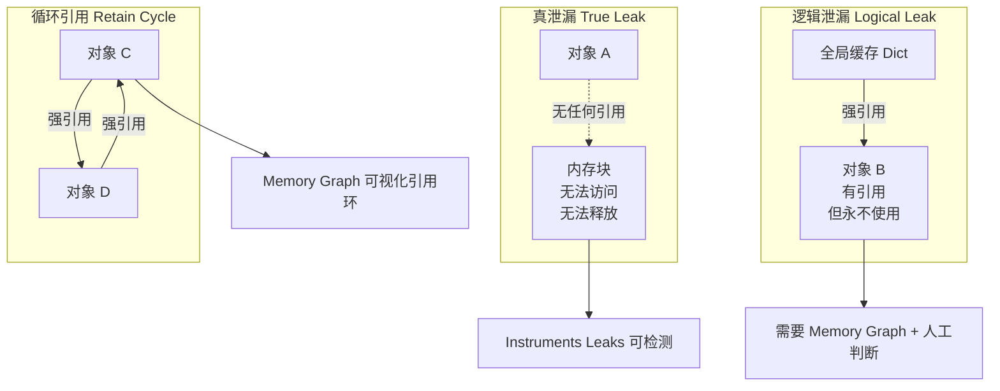
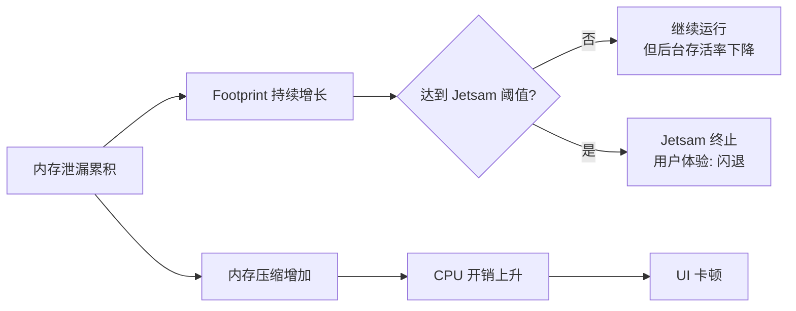
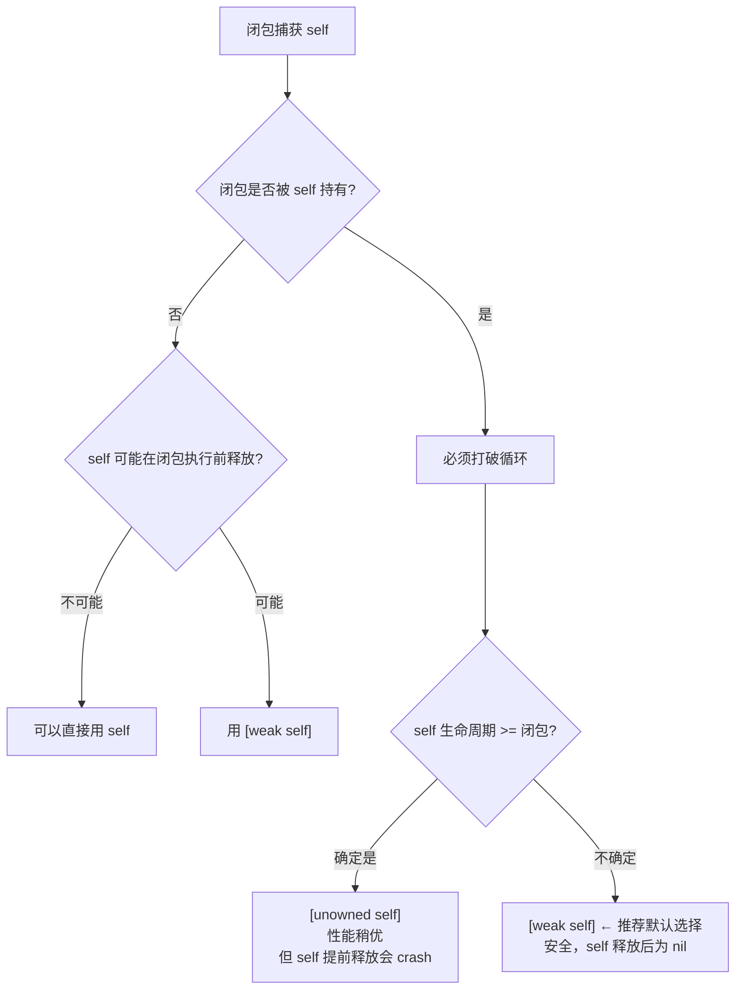
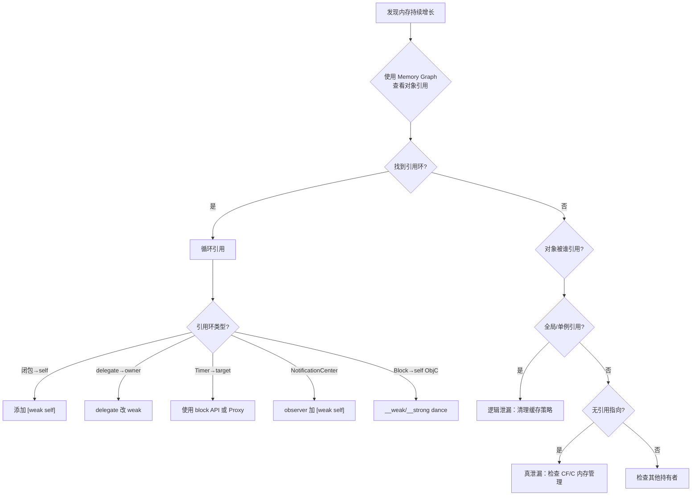

# 内存泄漏检测与循环引用排查深度解析

> 从真泄漏到逻辑泄漏，从 Retain Cycle 到工具链实战——系统性掌握 iOS 内存泄漏的分类、排查决策树与自动化检测方案

---

## 目录

- [核心结论 TL;DR](#核心结论-tldr)
- [第一部分：内存泄漏分类](#第一部分内存泄漏分类)
- [第二部分：泄漏的危害与排查必要性](#第二部分泄漏的危害与排查必要性)
- [第三部分：循环引用排查决策树](#第三部分循环引用排查决策树)
- [第四部分：检测工具链](#第四部分检测工具链)
- [第五部分：自动化检测方案](#第五部分自动化检测方案)
- [最佳实践](#最佳实践)
- [常见陷阱](#常见陷阱)
- [面试考点](#面试考点)
- [参考资源](#参考资源)

---

## 核心结论 TL;DR

| 维度 | 核心洞察 |
|------|----------|
| **泄漏分类** | 三类：真泄漏（无引用）、逻辑泄漏（有引用但不再使用）、循环引用（互相持有），后两者更常见也更难发现 |
| **首要关注** | 循环引用是 iOS 最高频的泄漏类型，闭包捕获 self 和 delegate 未 weak 是两大元凶 |
| **weak vs unowned** | 生命周期不确定用 `[weak self]`，确定不会提前释放用 `[unowned self]`，拿不准一律用 weak |
| **工具优先级** | Xcode Memory Graph > Instruments Leaks > MLeaksFinder > FBRetainCycleDetector |
| **自动化** | CI 集成 Leaks 检测 + 运行时 Hook dealloc 延迟检查，形成泄漏防劣化体系 |
| **累积危害** | 泄漏量 = 单次泄漏 × 频率 × 时间，即使单次微小也会因高频操作累积到触发 Jetsam |

---

## 第一部分：内存泄漏分类

### 1.1 三种泄漏类型

**结论先行**：iOS 内存泄漏分为真泄漏、逻辑泄漏和循环引用三类。真泄漏在 ARC 时代已少见，循环引用和逻辑泄漏是主要治理对象。



#### 真泄漏（True Leak）

无任何强引用指向的已分配内存块，在 ARC 环境下较少出现，主要发生在：

| 场景 | 说明 | 示例 |
|------|------|------|
| **C/C++ 手动内存管理** | malloc/new 后忘记 free/delete | Core Foundation 对象未 CFRelease |
| **Core Foundation 桥接** | CF 对象与 ObjC 对象桥接时引用计数不匹配 | CGImageRef 未释放 |
| **C 库调用** | 第三方 C 库返回的堆内存 | libxml2、SQLite 直接 API |

```objc
// ❌ 真泄漏示例：CF 对象忘记释放
CGColorSpaceRef colorSpace = CGColorSpaceCreateDeviceRGB();
CGContextRef context = CGBitmapContextCreate(NULL, width, height,
                                              8, 0, colorSpace,
                                              kCGImageAlphaPremultipliedLast);
// ... 使用 context ...
CGContextRelease(context);
// ❌ 忘记释放 colorSpace → True Leak!
// CGColorSpaceRelease(colorSpace);

// ✅ 正确：所有 CF Create/Copy 返回的对象都需要 Release
CGColorSpaceRelease(colorSpace);
```

```swift
// ✅ Swift 中使用 Unmanaged 处理 CF 桥接
let colorSpace = CGColorSpaceCreateDeviceRGB()
// Swift 自动管理 CGColorSpace 的生命周期（toll-free bridging）

// 但对于非 toll-free bridging 的 CF 类型：
let unmanagedRef = Unmanaged<CFString>.passRetained(cfString)
// ... 使用 ...
unmanagedRef.release()  // 手动释放
```

#### 逻辑泄漏（Logical Leak / Abandoned Memory）

对象仍被引用但永远不会再被使用——比真泄漏更隐蔽、更常见：

```swift
// ❌ 逻辑泄漏：缓存无限增长
class DataManager {
    // 缓存字典只增不减，已处理的数据永远不会被访问
    private var processedCache: [String: Data] = [:]
    
    func processItem(_ id: String, data: Data) {
        let result = heavyProcess(data)
        processedCache[id] = result  // 只增不删，逻辑泄漏!
    }
}

// ✅ 正确：使用 NSCache 或设置上限
class DataManager {
    private let processedCache = NSCache<NSString, NSData>()
    
    init() {
        processedCache.countLimit = 100
        processedCache.totalCostLimit = 50 * 1024 * 1024  // 50MB
    }
    
    func processItem(_ id: String, data: Data) {
        let result = heavyProcess(data)
        processedCache.setObject(result as NSData,
                                  forKey: id as NSString,
                                  cost: result.count)
    }
}
```

#### 循环引用（Retain Cycle）

两个或多个对象互相强引用，形成引用环，即使外部不再引用也无法释放：

```swift
// ❌ 经典循环引用
class ViewController: UIViewController {
    var closure: (() -> Void)?
    
    override func viewDidLoad() {
        super.viewDidLoad()
        closure = {
            self.view.backgroundColor = .red  // self 被闭包强捕获
            // ViewController → closure → ViewController (循环!)
        }
    }
}

// ✅ 使用 [weak self] 打破循环
class ViewController: UIViewController {
    var closure: (() -> Void)?
    
    override func viewDidLoad() {
        super.viewDidLoad()
        closure = { [weak self] in
            self?.view.backgroundColor = .red  // weak 引用不增加引用计数
        }
    }
}
```

---

## 第二部分：泄漏的危害与排查必要性

### 2.1 泄漏累积模型

**结论先行**：单次泄漏量可能很小（几 KB），但通过高频操作路径累积，最终触发 Jetsam。泄漏治理的 ROI 取决于 `泄漏量 × 频率 × 会话时长`。

```
总泄漏量 = 单次泄漏量 × 触发频率 × 会话时长

示例：
- 场景：每次进入聊天页面泄漏一个 ViewController (~200KB)
- 频率：用户每天进出聊天页面 50 次
- 累积：50 × 200KB = 10MB/天 → 长会话可能达 30-50MB
- 风险：叠加正常内存使用 → 触发 Jetsam

优先级矩阵：
┌──────────────┬───────────┬───────────┐
│              │ 低频路径   │ 高频路径   │
├──────────────┼───────────┼───────────┤
│ 小泄漏(<10KB)│ P3 低优先  │ P1 高优先  │
│ 大泄漏(>1MB) │ P2 中优先  │ P0 紧急    │
└──────────────┴───────────┴───────────┘
```



---

## 第三部分：循环引用排查决策树

### 3.1 闭包捕获 — 6 种典型场景

**结论先行**：闭包（Closure/Block）隐式捕获 self 是 iOS 最高频的循环引用来源。核心原则——**当闭包被 self 的属性持有时，必须用 weak/unowned 捕获 self**。

#### 场景 1：属性持有闭包

```swift
// ❌ self → closure（属性）→ self（捕获）
class ProfileVC: UIViewController {
    var onUpdate: (() -> Void)?
    
    func setup() {
        onUpdate = {
            self.refreshUI()  // 循环引用!
        }
    }
}

// ✅ [weak self]
func setup() {
    onUpdate = { [weak self] in
        self?.refreshUI()
    }
}
```

#### 场景 2：嵌套闭包

```swift
// ❌ 外层 weak，内层又强引用
class ChatVC: UIViewController {
    var handler: (() -> Void)?
    
    func setup() {
        handler = { [weak self] in
            guard let self = self else { return }
            // ⚠️ 此处 self 是强引用，但作用域限于 guard let 之后
            // 如果内部再有异步操作持有 self，仍可能延长生命周期
            DispatchQueue.main.asyncAfter(deadline: .now() + 5) {
                self.reload()  // 延长了 self 的生命周期 5 秒
            }
        }
    }
}

// ✅ 嵌套闭包也使用 [weak self]
func setup() {
    handler = { [weak self] in
        guard let self = self else { return }
        DispatchQueue.main.asyncAfter(deadline: .now() + 5) { [weak self] in
            self?.reload()  // 不延长生命周期
        }
    }
}
```

#### 场景 3：UIView.animate 和 DispatchQueue（无需 weak）

```swift
// ✅ UIView.animate 的闭包不被 self 持有，不会循环引用
UIView.animate(withDuration: 0.3) {
    self.view.alpha = 0  // 安全！闭包由系统临时持有，执行后释放
}

// ✅ GCD dispatch 不被 self 持有
DispatchQueue.main.async {
    self.updateUI()  // 安全！闭包由 GCD 队列持有，执行后释放
}
```

#### 场景 4：Combine/RxSwift 订阅

```swift
// ❌ 订阅存储在 self 的属性中
class SearchVC: UIViewController {
    var cancellables = Set<AnyCancellable>()
    
    func bind() {
        publisher
            .sink { value in
                self.updateResults(value)  // cancellables → subscription → self
            }
            .store(in: &cancellables)
    }
}

// ✅ [weak self]
func bind() {
    publisher
        .sink { [weak self] value in
            self?.updateResults(value)
        }
        .store(in: &cancellables)
}
```

#### 场景 5：lazy var 使用闭包初始化

```swift
// ❌ lazy var 的闭包捕获 self
class DetailVC: UIViewController {
    lazy var formatter: DateFormatter = {
        let f = DateFormatter()
        f.dateFormat = self.dateFormat  // 捕获 self
        return f
    }()
    // 但 lazy var 闭包执行后即释放，实际上 ✅ 不会循环引用
    // 因为闭包不被 self 持有，只在首次访问时执行一次
    var dateFormat = "yyyy-MM-dd"
}
```

#### 场景 6：escaping 闭包参数

```swift
// ⚠️ 需要区分 @escaping 闭包是否被 self 持有
class NetworkManager {
    // 闭包作为参数传递，不被 self 持有 → 安全
    func fetch(completion: @escaping (Data) -> Void) {
        URLSession.shared.dataTask(with: url) { data, _, _ in
            completion(data!)  // completion 不被 self 持有
        }.resume()
    }
}

class MyVC: UIViewController {
    let manager = NetworkManager()
    
    func load() {
        // ✅ 这里的闭包不被 self 持有，不会循环引用
        // 但如果 MyVC dismiss 后请求完成，self 仍会被延迟释放
        manager.fetch { [weak self] data in
            self?.process(data)  // 推荐用 weak，避免延迟释放
        }
    }
}
```

### 3.2 [weak self] vs [unowned self] 选择决策



| 选择 | 适用场景 | 风险 | 性能 |
|------|----------|------|------|
| `[weak self]` | **默认选择**，self 生命周期不确定 | 无风险，self 为 nil 时闭包空操作 | 略有 Optional 开销 |
| `[unowned self]` | 100% 确定 self 不会先释放 | self 提前释放则 **crash** | 无 Optional 开销 |
| 不捕获 | 闭包不被 self 持有 + 允许延迟释放 | 延迟释放 | 最优 |

### 3.3 Delegate 模式

```swift
// ❌ delegate 未声明 weak → 循环引用
protocol DataSourceDelegate: AnyObject {
    func didUpdate()
}

class DataSource {
    var delegate: DataSourceDelegate?  // ❌ 强引用!
}

class ListVC: UIViewController, DataSourceDelegate {
    let dataSource = DataSource()
    
    override func viewDidLoad() {
        dataSource.delegate = self  // ListVC → dataSource → delegate → ListVC
    }
}

// ✅ weak delegate
class DataSource {
    weak var delegate: DataSourceDelegate?  // ✅ 弱引用
}
```

```objc
// ✅ ObjC weak delegate
@protocol DataSourceDelegate <NSObject>
- (void)didUpdate;
@end

@interface DataSource : NSObject
@property (nonatomic, weak) id<DataSourceDelegate> delegate;  // ✅ weak
@end

// ❌ 如果用 assign 而非 weak，对象释放后变成野指针
@property (nonatomic, assign) id<DataSourceDelegate> delegate;  // ❌ 危险!
```

### 3.4 NotificationCenter

```swift
// iOS 9+ block-based observer 的陷阱
class MyVC: UIViewController {
    var observer: NSObjectProtocol?
    
    override func viewDidLoad() {
        // ❌ block 捕获 self，observer 被 self 持有
        observer = NotificationCenter.default.addObserver(
            forName: .someNotification,
            object: nil,
            queue: .main
        ) { notification in
            self.handleNotification(notification)  // 循环引用!
        }
    }
    
    deinit {
        // 由于循环引用，deinit 永远不会调用!
        if let observer = observer {
            NotificationCenter.default.removeObserver(observer)
        }
    }
}

// ✅ 正确：[weak self] + deinit 移除
override func viewDidLoad() {
    observer = NotificationCenter.default.addObserver(
        forName: .someNotification,
        object: nil,
        queue: .main
    ) { [weak self] notification in
        self?.handleNotification(notification)
    }
}
```

### 3.5 Timer

```swift
// ❌ Timer 强持有 target → 循环引用
class TimerVC: UIViewController {
    var timer: Timer?
    
    override func viewDidLoad() {
        timer = Timer.scheduledTimer(
            timeInterval: 1.0,
            target: self,       // Timer 强引用 self!
            selector: #selector(tick),
            userInfo: nil,
            repeats: true
        )
        // self → timer → self (循环!)
        // 且 RunLoop 也持有 timer，即使 self.timer = nil 也不释放
    }
    
    deinit { timer?.invalidate() }  // 永远不会调用!
}

// ✅ 方案 1：使用 block-based API（iOS 10+）
timer = Timer.scheduledTimer(withTimeInterval: 1.0, repeats: true) { [weak self] _ in
    self?.tick()
}

// ✅ 方案 2：代理模式打破循环
class WeakTimerProxy {
    weak var target: AnyObject?
    let selector: Selector
    
    init(target: AnyObject, selector: Selector) {
        self.target = target
        self.selector = selector
    }
    
    @objc func fire(_ timer: Timer) {
        if let target = target {
            _ = target.perform(selector, with: timer)
        } else {
            timer.invalidate()  // target 已释放，自动停止
        }
    }
}

// 使用
let proxy = WeakTimerProxy(target: self, selector: #selector(tick))
timer = Timer.scheduledTimer(timeInterval: 1.0,
                              target: proxy,
                              selector: #selector(WeakTimerProxy.fire(_:)),
                              userInfo: nil,
                              repeats: true)
```

### 3.6 Block（ObjC）— __weak/__strong dance

```objc
// ❌ Block 捕获 self → 循环引用
self.completionBlock = ^{
    [self doSomething];  // 循环引用!
};

// ✅ __weak/__strong dance 模式
__weak typeof(self) weakSelf = self;
self.completionBlock = ^{
    __strong typeof(weakSelf) strongSelf = weakSelf;
    if (!strongSelf) return;
    
    // strongSelf 保证 block 执行期间 self 不会被释放
    [strongSelf doSomething];
    [strongSelf doAnotherThing];
    // block 结束后 strongSelf 释放，不影响 self 的生命周期
};
```

### 3.7 排查决策树



---

## 第四部分：检测工具链

### 4.1 Xcode Memory Graph Debugger

**结论先行**：Memory Graph 是诊断循环引用和逻辑泄漏的**首选工具**，可以可视化展示整个对象引用图，直接定位引用环。

**使用方法**：

1. **启动**：Debug 运行 App → Xcode 左下角 Debug Navigator → 点击 **"Debug Memory Graph"** 按钮（三圆环图标）
2. **界面解读**：
   - 左侧面板：按类型列出所有存活对象，标注 `!` 的为检测到的泄漏
   - 中间区域：选中对象的引用关系图（箭头方向 = 引用方向）
   - 右侧面板：选中对象的详细信息（类型、大小、引用链）

```
┌──────────────────────────────────────────────────────────────┐
│  Memory Graph Debugger 界面                                   │
├────────────┬─────────────────────────┬───────────────────────┤
│ 对象列表    │     引用关系图           │   详细信息            │
│            │                         │                       │
│ ! MyVC (3) │  ┌─────┐    ┌──────┐   │ Type: MyVC            │
│   Cell (50)│  │ MyVC │──→│Closure│   │ Size: 256 bytes       │
│   Model(12)│  │      │←──│       │   │ Retain Count: 2       │
│   ...      │  └─────┘    └──────┘   │ Allocation: ...       │
│            │     ↑ 循环引用!          │                       │
└────────────┴─────────────────────────┴───────────────────────┘
```

**识别循环引用**：
- 在引用图中寻找**闭环**（箭头形成环路）
- 紫色 `!` 标记的对象为工具检测到的可疑泄漏
- 选中对象查看 Backtrace 定位分配位置

**发现逻辑泄漏**：
- 搜索特定类型（如 ViewController），检查是否存在不应该存活的实例
- 比较操作前后的实例数量变化

> **技巧**：在 Scheme → Run → Diagnostics 中开启 **"Malloc Stack Logging"**，可以在 Memory Graph 中看到对象分配的完整调用栈。

### 4.2 Instruments Leaks

**使用方法**：
1. Xcode → Product → Profile → 选择 **Leaks** 模板
2. 运行 App 并操作（重复进出页面、执行各种功能）
3. Leaks 工具会每隔约 10 秒自动扫描一次

**Leaks Trace 配置**：
- Recording Options → Leaks Check Interval（默认 10s，可调低到 1s 增加精度）
- 勾选 "Record reference counts" 获取引用计数历史

**报告解读**：

| 列名 | 含义 |
|------|------|
| **Address** | 泄漏内存的地址 |
| **Size** | 泄漏大小 |
| **Responsible Library** | 分配该内存的库 |
| **Responsible Frame** | 分配函数 |
| **Type** | 对象类型（ObjC class 或 C malloc） |

**与 Allocations 联合使用**：

```
Instruments 组合策略：
1. Leaks：检测真泄漏（无引用的内存块）
2. Allocations：跟踪所有内存分配，分析增长趋势
3. 联合使用：Leaks 发现泄漏 → Allocations 中定位分配来源
```

### 4.3 Instruments Allocations — Generation Analysis

**Mark Generation（代际分析）**：这是发现逻辑泄漏的最有效方法之一。

**操作步骤**：
1. 启动 Allocations instrument
2. App 进入基准状态（如主页面）
3. 点击 **"Mark Generation"** 按钮
4. 执行操作（如进入详情页再返回）
5. 再次点击 **"Mark Generation"**
6. 重复步骤 4-5 多次
7. 检查每个 Generation 中**持续留存**的对象

```
┌────────────────────────────────────────────────────────────┐
│  Generation Analysis 结果                                  │
├────────────────────────────────────────────────────────────┤
│                                                            │
│  Generation A: (基准)                                      │
│  Generation B: +2.3MB (进入详情页后)                        │
│  Generation C: +1.8MB (再次进入)     ← 应该接近 0!         │
│  Generation D: +1.9MB (再次进入)     ← 持续增长 = 泄漏!    │
│                                                            │
│  展开 Generation C：                                       │
│  - DetailViewController: 1 instance (256B)  ← 泄漏!       │
│  - UIImage: 3 instances (1.2MB)             ← 泄漏!       │
│  - NSMutableArray: 1 instance (64B)                        │
└────────────────────────────────────────────────────────────┘
```

**Transient vs Persistent 区分**：
- **Transient**：创建后已释放的对象 → 正常
- **Persistent**：仍然存活的对象 → 检查是否应该存活
- **Growth**：两次 Generation 之间的净增长 → 持续增长 = 可能泄漏

### 4.4 MLeaksFinder（开源）

**原理**：ViewController 被 dismiss/pop 后延迟 2 秒检查是否已释放。如果仍然存活，弹出 alert 提示泄漏。

```objc
// MLeaksFinder 核心原理（简化版）
@implementation UIViewController (MemoryLeak)

- (void)willDealloc {
    __weak typeof(self) weakSelf = self;
    dispatch_after(dispatch_time(DISPATCH_TIME_NOW, 2 * NSEC_PER_SEC),
                   dispatch_get_main_queue(), ^{
        // 2 秒后如果 weakSelf 不为 nil，说明 VC 未释放 → 泄漏!
        [weakSelf assertNotDealloc];
    });
}

- (void)assertNotDealloc {
    // 如果执行到这里，说明 self 仍然存活 → 可能泄漏
    NSString *message = [NSString stringWithFormat:
        @"⚠️ Possible memory leak: %@", NSStringFromClass([self class])];
    NSLog(@"%@", message);
    
    // Debug 模式弹出 Alert
    #ifdef DEBUG
    UIAlertController *alert = [UIAlertController
        alertControllerWithTitle:@"Memory Leak"
        message:message
        preferredStyle:UIAlertControllerStyleAlert];
    // ... 展示 alert
    #endif
}

@end
```

**集成方法**：

```ruby
# Podfile
pod 'MLeaksFinder', :configurations => ['Debug']
```

**自定义扩展**：
- 继承 `MLLeaksFinder` 添加自定义视图检测
- 白名单排除已知的单例或缓存对象
- 集成到内部 Debug 面板

### 4.5 FBRetainCycleDetector（Facebook）

**原理**：通过 DFS 遍历对象的引用图，查找引用环。

```objc
// FBRetainCycleDetector 使用
#import <FBRetainCycleDetector/FBRetainCycleDetector.h>

FBRetainCycleDetector *detector = [FBRetainCycleDetector new];
[detector addCandidate:suspiciousObject];

NSSet<NSArray<FBObjectiveCGraphElement *> *> *cycles = [detector findRetainCycles];

for (NSArray<FBObjectiveCGraphElement *> *cycle in cycles) {
    NSLog(@"🔄 Retain Cycle Found:");
    for (FBObjectiveCGraphElement *element in cycle) {
        NSLog(@"  → %@", element);
    }
}
```

**使用场景与局限性**：

| 维度 | 说明 |
|------|------|
| **适用** | 已知可疑对象的引用环检测 |
| **优势** | 可精确输出循环引用链路 |
| **局限** | 对 Swift 对象支持有限，无法检测 Block 内部引用 |
| **性能** | DFS 遍历有性能开销，不适合生产环境全量扫描 |

---

## 第五部分：自动化检测方案

### 5.1 CI 集成内存泄漏扫描

```bash
# CI 脚本：运行 XCTest 并检测 Leaks
xcodebuild test \
  -scheme MyApp \
  -destination 'platform=iOS Simulator,name=iPhone 15' \
  -enablePerformanceTestsDiagnostics YES

# 使用 leaks 命令行工具（模拟器进程）
leaks --atExit -- ./MyAppTests.xctest
```

```swift
// ✅ XCTest 中的内存泄漏检测
class MemoryLeakTests: XCTestCase {
    
    /// 通用泄漏检测辅助方法
    func assertNoMemoryLeak(
        _ instance: AnyObject,
        file: StaticString = #filePath,
        line: UInt = #line
    ) {
        addTeardownBlock { [weak instance] in
            XCTAssertNil(instance,
                         "Potential memory leak: \(String(describing: instance))",
                         file: file, line: line)
        }
    }
    
    func testViewControllerDoesNotLeak() {
        let sut = makeSUT()
        assertNoMemoryLeak(sut)
        
        // 执行操作...
        sut.viewDidLoad()
        sut.viewWillAppear(false)
        sut.viewWillDisappear(false)
        // teardown 时检查 sut 是否已释放
    }
    
    private func makeSUT() -> MyViewController {
        let vc = MyViewController()
        return vc
    }
}
```

### 5.2 运行时检测框架设计

```swift
// ✅ 自定义运行时泄漏检测框架（Debug 使用）
class LeakDetector {
    static let shared = LeakDetector()
    
    private var trackedObjects: [String: WeakBox] = [:]
    private let queue = DispatchQueue(label: "leak.detector")
    
    /// 跟踪对象，预期在 delay 后被释放
    func track(_ object: AnyObject, context: String, delay: TimeInterval = 3.0) {
        let identifier = "\(context)_\(ObjectIdentifier(object))"
        let weakBox = WeakBox(object: object, context: context)
        
        queue.async {
            self.trackedObjects[identifier] = weakBox
        }
        
        DispatchQueue.main.asyncAfter(deadline: .now() + delay) { [weak self] in
            self?.check(identifier: identifier)
        }
    }
    
    private func check(identifier: String) {
        queue.async {
            guard let box = self.trackedObjects[identifier] else { return }
            
            if box.object != nil {
                // 对象仍然存活 → 可能泄漏
                let message = "⚠️ Potential leak: \(box.context)"
                print(message)
                
                #if DEBUG
                // Debug 模式上报到内部平台
                DebugPanel.report(leak: message)
                #endif
            }
            
            self.trackedObjects.removeValue(forKey: identifier)
        }
    }
}

private class WeakBox {
    weak var object: AnyObject?
    let context: String
    
    init(object: AnyObject, context: String) {
        self.object = object
        self.context = context
    }
}

// 使用：在 ViewController 生命周期中注入
extension UIViewController {
    @objc func leak_viewDidDisappear(_ animated: Bool) {
        leak_viewDidDisappear(animated)  // 调用原始方法（Method Swizzle）
        
        if isBeingDismissed || isMovingFromParent {
            LeakDetector.shared.track(self,
                                       context: String(describing: type(of: self)))
        }
    }
}
```

```objc
// ✅ ObjC：Hook dealloc 进行泄漏检测
#import <objc/runtime.h>

@implementation NSObject (LeakDetection)

+ (void)load {
    #ifdef DEBUG
    static dispatch_once_t onceToken;
    dispatch_once(&onceToken, ^{
        // Swizzle UIViewController 的 viewDidDisappear:
        Class cls = [UIViewController class];
        SEL originalSel = @selector(viewDidDisappear:);
        SEL swizzledSel = @selector(leak_viewDidDisappear:);
        
        Method original = class_getInstanceMethod(cls, originalSel);
        Method swizzled = class_getInstanceMethod(cls, swizzledSel);
        method_exchangeImplementations(original, swizzled);
    });
    #endif
}

@end
```

---

## 最佳实践

### 编码阶段预防

| 实践 | 说明 | 优先级 |
|------|------|--------|
| **闭包默认 `[weak self]`** | 除非确定不需要，否则一律 weak | ⭐⭐⭐ |
| **delegate 一律 weak** | protocol 继承 AnyObject/NSObjectProtocol | ⭐⭐⭐ |
| **Timer 使用 block API** | 避免 target-action 模式的循环引用 | ⭐⭐⭐ |
| **CF 对象配对 Release** | Create/Copy 必须对应 Release | ⭐⭐⭐ |
| **缓存使用 NSCache** | 自动响应内存警告清理 | ⭐⭐ |
| **NotificationCenter block observer 用 weak** | 且在 deinit 中 removeObserver | ⭐⭐ |

### 排查阶段

```
排查优先级：
1. Xcode Memory Graph → 可视化引用关系 → 定位循环引用
2. Instruments Allocations → Mark Generation → 定位逻辑泄漏
3. Instruments Leaks → 定位真泄漏
4. MLeaksFinder → 开发阶段自动提醒
5. FBRetainCycleDetector → 对可疑对象深度扫描
```

---

## 常见陷阱

### 陷阱 1：认为 GCD/UIView.animate 需要 [weak self]

```swift
// ✅ 这些场景通常不需要 [weak self]
// GCD：闭包被队列临时持有，执行后释放
DispatchQueue.main.async {
    self.updateUI()  // 安全，不会循环引用
}

// UIView.animate：闭包被系统临时持有
UIView.animate(withDuration: 0.3) {
    self.view.alpha = 0  // 安全
}

// ⚠️ 但如果不希望延迟释放 self，仍可以用 [weak self]
// 例如：VC 已 dismiss 后不需要执行动画
```

### 陷阱 2：guard let self = self 后又嵌套异步

```swift
// ❌ guard let self 后在内层闭包中直接用 self
handler = { [weak self] in
    guard let self = self else { return }
    
    someAsyncOperation { result in
        self.process(result)  // self 是强引用！延长了生命周期
    }
}

// ✅ 内层也用 [weak self]
handler = { [weak self] in
    guard let self = self else { return }
    
    someAsyncOperation { [weak self] result in
        self?.process(result)
    }
}
```

### 陷阱 3：ObjC 中 assign 代替 weak

```objc
// ❌ assign 不会在对象释放时置 nil → 野指针
@property (nonatomic, assign) id<MyDelegate> delegate;
// delegate 指向的对象释放后，delegate 变成悬垂指针 → crash!

// ✅ weak 会在对象释放时自动置 nil
@property (nonatomic, weak) id<MyDelegate> delegate;
```

### 陷阱 4：MLeaksFinder 误报

```
常见误报场景：
1. 单例对象或全局缓存持有的 VC → 实际是设计如此
2. 页面切换动画期间检测 → 延迟释放
3. Async 操作完成回调延长 VC 生命周期 → 非真泄漏

处理方式：
- 添加白名单过滤已知安全场景
- 增加检测延迟时间（默认 2s → 5s）
- 结合 Memory Graph 确认
```

---

## 面试考点

### Q1：iOS 中有哪些类型的内存泄漏？如何区分？

**参考答案**：
三类：
1. **真泄漏**：无任何引用指向的内存块，主要出现在 C/CF 对象未释放。Instruments Leaks 可自动检测。
2. **逻辑泄漏**：有引用但永远不再使用（如无限增长的缓存字典）。需要 Generation Analysis + 人工判断。
3. **循环引用**：两个以上对象互相强引用形成闭环。Xcode Memory Graph 可可视化引用环。

### Q2：[weak self] 和 [unowned self] 的区别？什么时候用哪个？

**参考答案**：
- `[weak self]`：将 self 变为 Optional，self 释放后变为 nil，安全但需要解包
- `[unowned self]`：假设 self 不会先释放，性能略优但 self 提前释放会 crash
- **选择原则**：不确定用 weak（默认选择），100% 确定 self 生命周期更长用 unowned

### Q3：如何使用 Instruments 检测内存泄漏？

**参考答案**：
1. **Leaks** 工具检测真泄漏：自动扫描无引用的内存块
2. **Allocations** 的 Mark Generation 检测逻辑泄漏：在操作前后标记 Generation，比较 Persistent 对象增长
3. **Memory Graph Debugger** 检测循环引用：可视化引用图，查找闭环

### Q4：Timer 为什么会导致循环引用？如何解决？

**参考答案**：
Timer 通过 `scheduledTimer(target:)` 强持有 target，且 RunLoop 强持有 Timer。如果 target（通常是 VC）也持有 Timer，形成：`VC → timer → VC` + `RunLoop → timer`。即使 `vc.timer = nil`，RunLoop 仍持有 timer，timer 仍持有 VC。
**解决方案**：①使用 block-based API + `[weak self]`；②使用 WeakProxy 中间代理对象；③确保在适当时机调用 `invalidate()`。

### Q5：MLeaksFinder 的原理是什么？

**参考答案**：
MLeaksFinder 通过 Method Swizzle hook `UIViewController` 的 `viewDidDisappear:` 等方法。当 VC 被 dismiss 或 pop 时，延迟约 2 秒后检查该 VC 是否已释放（通过 weak 引用是否为 nil）。如果未释放，说明可能存在泄漏，弹出 alert 提醒开发者。优点是无侵入、实时检测；缺点是只能检测 VC 层级的泄漏，且有误报。

---

## 参考资源

### Apple 官方

- [WWDC 2018 - iOS Memory Deep Dive](https://developer.apple.com/videos/play/wwdc2018/416/)
- [WWDC 2021 - Detect and Diagnose Memory Issues](https://developer.apple.com/videos/play/wwdc2021/10180/)
- [Apple - Finding Memory Issues with Instruments](https://developer.apple.com/documentation/xcode/gathering-information-about-memory-use)
- [Apple - Automatic Reference Counting](https://docs.swift.org/swift-book/documentation/the-swift-programming-language/automaticreferencecounting/)

### 交叉引用

- [ARC 与引用管理](../../Swift_Language/05_内存管理与资源安全/ARC与引用管理_详细解析.md)
- [iOS 内存架构与 Jetsam 机制](./iOS内存架构与Jetsam机制_详细解析.md)
- [常驻内存分析与 Footprint 优化](./常驻内存分析与Footprint优化_详细解析.md)

### 开源工具

- [MLeaksFinder - GitHub](https://github.com/Tencent/MLeaksFinder)
- [FBRetainCycleDetector - GitHub](https://github.com/facebook/FBRetainCycleDetector)
- [LifetimeTracker - GitHub](https://github.com/nicklama/LifetimeTracker)

### 社区资源

- [iOS Memory Leak Detection - Ray Wenderlich](https://www.raywenderlich.com/)
- [Debugging Memory Issues - objc.io](https://www.objc.io/issues/19-debugging/debugging-memory-issues/)
