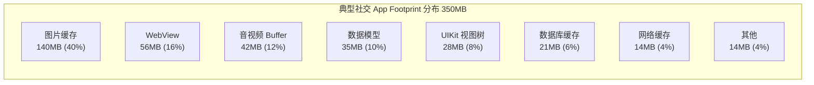
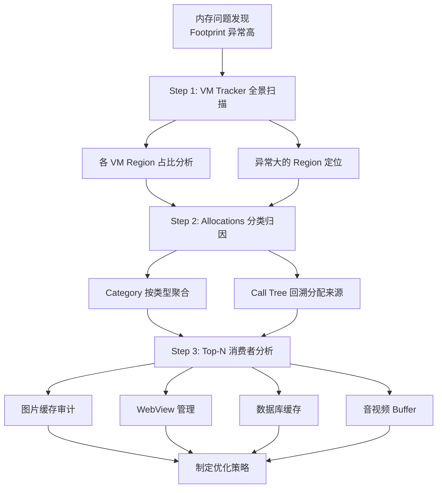
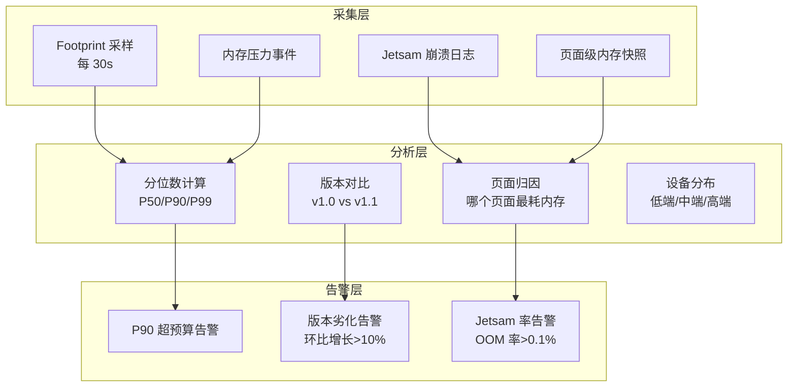

# 常驻内存分析与 Footprint 优化深度解析

> 从 VM Tracker 全景扫描到 Top-N 消费者归因，从图片降采样到内存预算管理——系统性掌握 iOS 常驻内存排查方法论与 Footprint 优化策略

---

## 目录

- [核心结论 TL;DR](#核心结论-tldr)
- [第一部分：常驻内存问题定义](#第一部分常驻内存问题定义)
- [第二部分：Footprint 优化的重要性](#第二部分footprint-优化的重要性)
- [第三部分：常驻内存排查方法论](#第三部分常驻内存排查方法论)
- [第四部分：Footprint 优化策略矩阵](#第四部分footprint-优化策略矩阵)
- [第五部分：内存预算管理](#第五部分内存预算管理)
- [第六部分：内存水位监控与告警体系](#第六部分内存水位监控与告警体系)
- [最佳实践](#最佳实践)
- [常见陷阱](#常见陷阱)
- [面试考点](#面试考点)
- [参考资源](#参考资源)

---

## 核心结论 TL;DR

| 维度 | 核心洞察 |
|------|----------|
| **常驻 vs 泄漏** | 常驻内存不是泄漏——对象仍被有效引用，但持续占用大量 Footprint，是 OOM 的主要原因 |
| **排查三步法** | VM Tracker 全景扫描 → Allocations 分类归因 → Top-N 消费者定点优化 |
| **图片是第一大户** | 图片缓存通常占 Footprint 40%+，降采样 + 分层缓存是投入产出比最高的优化手段 |
| **内存预算** | 按设备分级设定 Footprint 阈值：低端 150MB / 中端 300MB / 高端 500MB |
| **动态降级** | 响应内存压力分级降级：清缓存 → 降图片质量 → 释放非必要模块 → 极端降级 |
| **监控闭环** | Footprint P50/P90/P99 + 版本对比趋势 + 异常告警 = 防劣化体系 |

---

## 第一部分：常驻内存问题定义

### 1.1 核心概念辨析

**结论先行**：常驻内存（Resident Memory）是指已映射到物理内存的虚拟页面，不等于泄漏——它们被有效引用、有存在的理由，但如果管理不当会成为 Footprint 的最大贡献者。

| 概念 | 定义 | 是否可回收 | 与 Jetsam 关系 |
|------|------|-----------|---------------|
| **Resident Size** | 映射到物理内存的所有页面（Clean + Dirty） | Clean 部分可回收 | 非直接判定依据 |
| **Footprint** | Dirty + Compressed | 不可回收 | **Jetsam 判定依据** |
| **内存泄漏** | 无引用或循环引用导致的无法释放 | 理论上应释放但无法释放 | 累积后推高 Footprint |
| **常驻内存** | 被有效引用、有使用场景但持续占用 | 可主动释放/缩减 | 直接影响 Footprint |

```
关键区别：
- 泄漏内存：不应该存在的 → 修复 Bug
- 常驻内存：可以存在但太多了 → 优化策略

典型案例：
- 泄漏：dismiss 后 VC 未释放 → 循环引用 Bug
- 常驻：图片缓存 200MB → 不是 Bug，但需要策略控制
```

### 1.2 Footprint 与 Resident Size 的区别

```
┌──────────────────────────────────────────────────────┐
│              Footprint vs Resident Size               │
├──────────────────────────────────────────────────────┤
│                                                      │
│  Resident Size = Clean + Dirty                       │
│  ┌─────────────┬─────────────┐                       │
│  │ Clean 200MB │ Dirty 300MB │ → Resident = 500MB   │
│  │ (可回收)     │ (不可回收)   │                       │
│  └─────────────┴─────────────┘                       │
│                                                      │
│  Footprint = Dirty + Compressed                      │
│  ┌─────────────┬──────────────┐                      │
│  │ Dirty 300MB │ Compressed   │ → Footprint = 340MB │
│  │             │    40MB      │   ← Jetsam 看这个!   │
│  └─────────────┴──────────────┘                      │
│                                                      │
│  ⚠️ Resident Size 大 ≠ 会被 Jetsam 杀               │
│  ⚠️ Footprint 大 = 会被 Jetsam 杀                    │
└──────────────────────────────────────────────────────┘
```

### 1.3 大 App 的典型内存分布



> **关键洞察**：图片缓存通常是 Footprint 的第一大户（40%+），优化图片内存是 ROI 最高的策略。

---

## 第二部分：Footprint 优化的重要性

### 2.1 Jetsam 基于 Footprint 判定

```swift
// 设备 Jetsam 阈值差异
struct JetsamLimits {
    // 以下为经验值，Apple 未公开精确数据
    static let lowEnd   = 1000  // iPhone SE 2 (3GB) → ~1GB limit
    static let midRange = 1800  // iPhone 12 (4GB) → ~1.8GB limit
    static let highEnd  = 3000  // iPhone 15 Pro (8GB) → ~3GB limit
}
```

### 2.2 后台存活率与内存的关系

```
后台存活率直接影响：
1. Push 通知的即时处理能力
2. 后台音频/定位等持续性任务
3. 用户切回 App 的体验（冷启动 vs 热恢复）

Footprint 与后台存活率关系：
┌────────────────────────────────────────────┐
│  后台 Footprint    │  后台存活率（估计）     │
├────────────────────┼───────────────────────┤
│  < 50MB            │  ~95%                 │
│  50-100MB          │  ~80%                 │
│  100-200MB         │  ~50%                 │
│  > 200MB           │  ~20%                 │
└────────────────────┴───────────────────────┘

策略：进入后台时主动降低 Footprint
```

---

## 第三部分：常驻内存排查方法论

### 3.1 排查三步法



### Step 1：VM Tracker 全景扫描

**目标**：了解 Footprint 的宏观构成，找到占比最大的 VM Region 类型。

**操作步骤**：
1. Instruments → 选择 **Allocations** 模板 → 添加 **VM Tracker** instrument
2. 运行 App 到目标场景（如聊天页面、视频播放页）
3. 在 VM Tracker 面板按 **Dirty Size** 降序排列

```
VM Tracker 典型输出分析：
┌──────────────────────────────────────────────────────────┐
│  VM Region Type     │ Virtual │ Resident │ Dirty  │ 占比 │
├─────────────────────┼─────────┼──────────┼────────┼──────┤
│  MALLOC_LARGE       │  250MB  │  240MB   │ 240MB  │ 48%  │ ← 重点!
│  CG image           │  120MB  │  115MB   │ 115MB  │ 23%  │ ← 图片
│  MALLOC_SMALL       │   80MB  │   65MB   │  65MB  │ 13%  │
│  MALLOC_TINY        │   40MB  │   35MB   │  35MB  │  7%  │
│  IOSurface          │   30MB  │   30MB   │  30MB  │  6%  │
│  IMAGE (__DATA)     │   20MB  │   18MB   │  15MB  │  3%  │
│  STACK              │    8MB  │    5MB   │   5MB  │  1%  │
│  TOTAL              │  548MB  │  508MB   │ 505MB  │ 100% │
└──────────────────────────────────────────────────────────┘

诊断结论：MALLOC_LARGE (48%) + CG image (23%) = 71%
→ 大对象分配和图片是优化重点
```

### Step 2：Allocations 分类归因

**目标**：定位具体的对象类型和分配来源。

```
Allocations → Category 分析：
┌──────────────────────────────────────────────────┐
│  Category            │ Persistent │ Total Size   │
├──────────────────────┼────────────┼──────────────┤
│  VM: CG image        │    85      │    95MB      │ ← 85张图片解码
│  CFData              │   320      │    45MB      │
│  NSConcreteData      │   180      │    30MB      │
│  UIImage             │    85      │    12MB      │
│  NSMutableDictionary │   450      │     8MB      │
│  WKWebView           │     3      │    28MB      │ ← 3个WebView
└──────────────────────┴────────────┴──────────────┘

→ Call Tree 展开 "VM: CG image" → 定位到 SDWebImage 的解码缓存
```

**Call Tree 回溯**：选中某个 Category → 切换到 Call Tree 视图 → 展开调用栈 → 定位到业务代码的分配位置。

### Step 3：Top-N 消费者分析

#### 图片缓存审计

```swift
// 图片内存计算公式
// 解码后尺寸 = width × height × bytesPerPixel
// RGBA: 4 bytes/pixel, RGB: 3 bytes/pixel

// 例：一张 4032×3024 的拍照原图
let decodedSize = 4032 * 3024 * 4  // ≈ 46.5MB per image!
// 如果缓存 10 张 → 465MB → 直接触发 Jetsam

// SDWebImage 缓存策略审计
import SDWebImage

// 检查当前缓存状态
let cache = SDImageCache.shared
let memoryCount = cache.memoryCache.countLimit
let memoryCost = cache.memoryCache.totalCostLimit
print("Memory cache limit: \(memoryCost / 1024 / 1024) MB")

// Kingfisher 缓存策略审计
import Kingfisher

let kfCache = ImageCache.default
print("Memory limit: \(kfCache.memoryStorage.config.totalCostLimit / 1024 / 1024) MB")
print("Count limit: \(kfCache.memoryStorage.config.countLimit)")
```

#### WebView 内存特性

```swift
// WKWebView 内存特性：
// - 每个 WKWebView 实例占用 ~8-30MB（取决于页面复杂度）
// - WKWebView 使用独立进程（Web Content Process），内存由系统管理
// - 多个 WKWebView 的内存会叠加

// ❌ 避免：同时创建多个 WKWebView
class TabManager {
    var webViews: [WKWebView] = []  // 10 个 tab → 300MB!
}

// ✅ 推荐：复用 WKWebView + 按需加载
class TabManager {
    private let reusePool = WKWebViewPool(maxCount: 3)
    
    func showTab(_ url: URL) {
        let webView = reusePool.dequeue()
        webView.load(URLRequest(url: url))
    }
    
    func hideTab(_ webView: WKWebView) {
        webView.loadHTMLString("", baseURL: nil)  // 清空内容释放内存
        reusePool.enqueue(webView)
    }
}
```

#### 音视频 Buffer 生命周期

```swift
// CVPixelBuffer 内存计算
// 1080p BGRA: 1920 × 1080 × 4 = ~7.9MB per frame
// 4K BGRA: 3840 × 2160 × 4 = ~31.6MB per frame

// ❌ 避免：持有过多 PixelBuffer
var bufferQueue: [CVPixelBuffer] = []  // 积累 10 帧 → 80MB+

// ✅ 推荐：使用 CVPixelBufferPool + 及时释放
var pixelBufferPool: CVPixelBufferPool?

let poolAttributes: [String: Any] = [
    kCVPixelBufferPoolMinimumBufferCountKey as String: 3  // 池大小限制
]
let pixelAttributes: [String: Any] = [
    kCVPixelBufferWidthKey as String: 1920,
    kCVPixelBufferHeightKey as String: 1080,
    kCVPixelBufferPixelFormatTypeKey as String: kCVPixelFormatType_32BGRA
]

CVPixelBufferPoolCreate(nil, poolAttributes as CFDictionary,
                         pixelAttributes as CFDictionary, &pixelBufferPool)
```

```objc
// ✅ ObjC：CMSampleBuffer 及时释放
- (void)captureOutput:(AVCaptureOutput *)output
  didOutputSampleBuffer:(CMSampleBufferRef)sampleBuffer
       fromConnection:(AVCaptureConnection *)connection {
    
    // 处理完后不要持有 sampleBuffer
    CVPixelBufferRef pixelBuffer = CMSampleBufferGetImageBuffer(sampleBuffer);
    
    // 如果需要异步处理，拷贝数据而非持有 sampleBuffer
    // ❌ self.lastBuffer = sampleBuffer;  // 持有大量内存
    
    // ✅ 提取需要的数据后让 sampleBuffer 自然释放
    [self processPixelBuffer:pixelBuffer];
    // sampleBuffer 在回调返回后由系统回收
}
```

---

## 第四部分：Footprint 优化策略矩阵

### 4.1 图片优化

#### 降采样（Downsampling）

**结论先行**：不要将大图片解码为完整尺寸再显示在小 ImageView 上。使用 ImageIO 在解码阶段就降采样到目标尺寸，可节省 90%+ 内存。

```swift
// ✅ 推荐：使用 ImageIO 降采样（WWDC 2018 推荐方案）
func downsample(imageAt url: URL, to pointSize: CGSize, scale: CGFloat) -> UIImage? {
    let maxDimensionInPixels = max(pointSize.width, pointSize.height) * scale
    
    let imageSourceOptions = [kCGImageSourceShouldCache: false] as CFDictionary
    guard let imageSource = CGImageSourceCreateWithURL(url as CFURL, imageSourceOptions) else {
        return nil
    }
    
    let downsampleOptions = [
        kCGImageSourceCreateThumbnailFromImageAlways: true,
        kCGImageSourceShouldCacheImmediately: true,      // 立即解码
        kCGImageSourceCreateThumbnailWithTransform: true, // 应用 EXIF 方向
        kCGImageSourceThumbnailMaxPixelSize: maxDimensionInPixels
    ] as CFDictionary
    
    guard let downsampledImage = CGImageSourceCreateThumbnailAtIndex(
        imageSource, 0, downsampleOptions
    ) else {
        return nil
    }
    
    return UIImage(cgImage: downsampledImage)
}

// 使用示例：4032×3024 原图 → 300×300 缩略图
// 原始解码内存：4032 × 3024 × 4 = 46.5MB
// 降采样后内存：300 × 300 × 4 = 0.35MB → 节省 99%!
let thumbnail = downsample(
    imageAt: photoURL,
    to: CGSize(width: 150, height: 150),
    scale: UIScreen.main.scale  // @2x → 300×300, @3x → 450×450
)
```

```objc
// ✅ ObjC 降采样实现
- (UIImage *)downsampleImageAtURL:(NSURL *)url
                       toPointSize:(CGSize)pointSize
                             scale:(CGFloat)scale {
    
    CGFloat maxDimension = MAX(pointSize.width, pointSize.height) * scale;
    
    NSDictionary *sourceOptions = @{(__bridge NSString *)kCGImageSourceShouldCache: @NO};
    CGImageSourceRef source = CGImageSourceCreateWithURL(
        (__bridge CFURLRef)url, (__bridge CFDictionaryRef)sourceOptions
    );
    if (!source) return nil;
    
    NSDictionary *downsampleOptions = @{
        (__bridge NSString *)kCGImageSourceCreateThumbnailFromImageAlways: @YES,
        (__bridge NSString *)kCGImageSourceShouldCacheImmediately: @YES,
        (__bridge NSString *)kCGImageSourceCreateThumbnailWithTransform: @YES,
        (__bridge NSString *)kCGImageSourceThumbnailMaxPixelSize: @(maxDimension)
    };
    
    CGImageRef thumbnail = CGImageSourceCreateThumbnailAtIndex(
        source, 0, (__bridge CFDictionaryRef)downsampleOptions
    );
    CFRelease(source);
    
    if (!thumbnail) return nil;
    
    UIImage *result = [UIImage imageWithCGImage:thumbnail];
    CGImageRelease(thumbnail);
    return result;
}
```

#### 缓存策略：内存 + 磁盘分层

```swift
// ✅ 图片缓存分层架构
class ImageCacheManager {
    // L1: 内存缓存 — 快速访问，受内存限制
    let memoryCache = NSCache<NSString, UIImage>()
    
    // L2: 磁盘缓存 — 持久存储，受磁盘限制
    let diskCachePath: URL
    
    init() {
        // 内存缓存设置上限
        memoryCache.totalCostLimit = 100 * 1024 * 1024  // 100MB
        memoryCache.countLimit = 200
        
        diskCachePath = FileManager.default.urls(for: .cachesDirectory, in: .userDomainMask).first!
            .appendingPathComponent("ImageCache")
    }
    
    func image(forKey key: String, targetSize: CGSize) -> UIImage? {
        // L1 查询
        if let cached = memoryCache.object(forKey: key as NSString) {
            return cached
        }
        
        // L2 查询 + 降采样
        let diskURL = diskCachePath.appendingPathComponent(key.md5)
        if FileManager.default.fileExists(atPath: diskURL.path) {
            if let image = downsample(imageAt: diskURL, to: targetSize,
                                       scale: UIScreen.main.scale) {
                // 回填 L1
                let cost = Int(targetSize.width * targetSize.height * 4 * UIScreen.main.scale * UIScreen.main.scale)
                memoryCache.setObject(image, forKey: key as NSString, cost: cost)
                return image
            }
        }
        
        return nil
    }
}
```

### 4.2 缓存管理

#### NSCache 自动清理机制

```swift
// ✅ NSCache 优势：自动响应内存压力，线程安全
let cache = NSCache<NSString, NSData>()

// 设置限制
cache.countLimit = 100                        // 最多 100 个条目
cache.totalCostLimit = 50 * 1024 * 1024       // 最大 50MB

// 设置代理监听驱逐事件
cache.delegate = self  // NSCacheDelegate
func cache(_ cache: NSCache<AnyObject, AnyObject>,
           willEvictObject obj: Any) {
    print("Cache will evict: \(obj)")
}

// NSCache vs Dictionary:
// ✅ NSCache: 内存压力自动清理，线程安全，不拷贝 key
// ❌ Dictionary: 手动管理，需加锁，拷贝 key（String）
```

#### NSPurgeableData 与 NSDiscardableContent

```swift
// NSPurgeableData 在内存紧张时可被系统自动丢弃
let purgeableData = NSPurgeableData(bytes: rawBytes, length: rawBytes.count)

// 使用前标记 "正在使用"
purgeableData.beginContentAccess()
// ... 使用数据 ...
purgeableData.endContentAccess()
// endContentAccess 后系统可在内存紧张时丢弃这段数据

// 配合 NSCache 使用
cache.evictsObjectsWithDiscardedContent = true  // 丢弃后自动从缓存移除
```

#### 自定义 LRU 缓存

```swift
// ✅ 自定义 LRU 缓存（支持 cost 限制和内存压力响应）
class LRUCache<Key: Hashable, Value> {
    private let lock = NSLock()
    private var dict: [Key: Node<Key, Value>] = [:]
    private let head = Node<Key, Value>()  // 哨兵头
    private let tail = Node<Key, Value>()  // 哨兵尾
    
    let costLimit: Int
    private(set) var totalCost: Int = 0
    
    init(costLimit: Int) {
        self.costLimit = costLimit
        head.next = tail
        tail.prev = head
        
        // 响应内存压力
        NotificationCenter.default.addObserver(
            forName: UIApplication.didReceiveMemoryWarningNotification,
            object: nil, queue: nil
        ) { [weak self] _ in
            self?.removeAll()
        }
    }
    
    func set(_ value: Value, forKey key: Key, cost: Int = 0) {
        lock.lock()
        defer { lock.unlock() }
        
        if let existing = dict[key] {
            totalCost -= existing.cost
            remove(node: existing)
        }
        
        let node = Node(key: key, value: value, cost: cost)
        dict[key] = node
        insertAtHead(node)
        totalCost += cost
        
        // 超过限制则淘汰尾部（最久未使用）
        while totalCost > costLimit, let lru = tail.prev, lru !== head {
            remove(node: lru)
            dict.removeValue(forKey: lru.key!)
            totalCost -= lru.cost
        }
    }
    
    func get(_ key: Key) -> Value? {
        lock.lock()
        defer { lock.unlock() }
        
        guard let node = dict[key] else { return nil }
        // 移到头部（最近使用）
        remove(node: node)
        insertAtHead(node)
        return node.value
    }
    
    func removeAll() {
        lock.lock()
        defer { lock.unlock() }
        dict.removeAll()
        head.next = tail
        tail.prev = head
        totalCost = 0
    }
    
    // 链表操作...
    private func insertAtHead(_ node: Node<Key, Value>) {
        node.next = head.next
        node.prev = head
        head.next?.prev = node
        head.next = node
    }
    
    private func remove(node: Node<Key, Value>) {
        node.prev?.next = node.next
        node.next?.prev = node.prev
    }
}

private class Node<Key, Value> {
    var key: Key?
    var value: Value?
    var cost: Int = 0
    var prev: Node?
    var next: Node?
    
    init() {}
    init(key: Key, value: Value, cost: Int) {
        self.key = key
        self.value = value
        self.cost = cost
    }
}
```

### 4.3 AutoreleasePool 优化

```swift
// ❌ 循环中大量临时对象堆积
func processLargeDataset() {
    for i in 0..<100_000 {
        let data = generateData(index: i)         // 临时 Data 对象
        let processed = transform(data)           // 临时处理结果
        save(processed)
        // 所有临时对象在函数返回前不会释放 → 内存峰值极高
    }
}

// ✅ 使用 @autoreleasepool 控制峰值
func processLargeDataset() {
    for i in 0..<100_000 {
        autoreleasepool {
            let data = generateData(index: i)
            let processed = transform(data)
            save(processed)
            // 每次循环结束时释放临时对象
        }
    }
}

// ✅ 批量处理 + autoreleasepool
func processLargeDataset() {
    let batchSize = 100
    for batchStart in stride(from: 0, to: 100_000, by: batchSize) {
        autoreleasepool {
            let batchEnd = min(batchStart + batchSize, 100_000)
            for i in batchStart..<batchEnd {
                let data = generateData(index: i)
                let processed = transform(data)
                save(processed)
            }
        }
    }
}
```

```objc
// ✅ ObjC @autoreleasepool
- (void)processLargeDataset {
    for (NSInteger i = 0; i < 100000; i++) {
        @autoreleasepool {
            NSData *data = [self generateDataAtIndex:i];
            NSData *processed = [self transformData:data];
            [self saveData:processed];
        }
    }
}
```

### 4.4 大对象管理

#### mmap 替代全量读取

```swift
// ❌ 全量读取大文件 → 一次性分配大量 Dirty Memory
let data = try Data(contentsOf: largeFileURL)  // 500MB 文件 → 500MB Dirty!

// ✅ mmap 映射 → 按需加载，未访问部分不占物理内存
let data = try Data(contentsOf: largeFileURL, options: .mappedIfSafe)
// 虚拟地址空间分配 500MB，但物理内存按需加载
// 已加载但未修改的页面为 Clean，可被系统回收

// ✅ 直接使用 mmap（更精细控制）
let fd = open(filePath, O_RDONLY)
let fileSize = lseek(fd, 0, SEEK_END)
let ptr = mmap(nil, Int(fileSize), PROT_READ, MAP_PRIVATE, fd, 0)
close(fd)

// 使用 ptr 访问数据（按需加载）
let byte = ptr!.load(fromByteOffset: 1000, as: UInt8.self)

// 完成后释放
munmap(ptr, Int(fileSize))
```

#### Metal Buffer 共享内存

```swift
// ✅ Metal Shared Storage Mode：CPU 和 GPU 共享同一内存
let sharedBuffer = device.makeBuffer(
    length: bufferSize,
    options: .storageModeShared  // CPU & GPU 共享，无需拷贝
)

// ❌ 避免不必要的 Private Storage + Blit Copy
// Private 模式需要额外的 Blit 操作将数据从 CPU 拷贝到 GPU
let privateBuffer = device.makeBuffer(
    length: bufferSize,
    options: .storageModePrivate  // 仅当 GPU 独占访问时使用
)
```

---

## 第五部分：内存预算管理

### 5.1 按设备分级设定 Footprint 阈值

**结论先行**：不同设备的 RAM 和 Jetsam 阈值差异巨大，统一的内存策略会导致低端设备 OOM 或高端设备资源浪费。必须按设备分级管理。

```swift
// ✅ 设备分级与内存预算
enum DeviceTier {
    case low      // 1-3GB RAM: iPhone SE, iPhone 8
    case mid      // 4GB RAM: iPhone 12, iPhone 13
    case high     // 6-8GB RAM: iPhone 14 Pro, iPhone 15 Pro
    
    var footprintBudget: UInt64 {
        switch self {
        case .low:  return 150 * 1024 * 1024   // 150MB
        case .mid:  return 300 * 1024 * 1024   // 300MB
        case .high: return 500 * 1024 * 1024   // 500MB
        }
    }
    
    var imageCacheLimit: Int {
        switch self {
        case .low:  return 50 * 1024 * 1024    // 50MB
        case .mid:  return 100 * 1024 * 1024   // 100MB
        case .high: return 200 * 1024 * 1024   // 200MB
        }
    }
    
    var maxConcurrentWebViews: Int {
        switch self {
        case .low:  return 1
        case .mid:  return 2
        case .high: return 4
        }
    }
    
    static var current: DeviceTier {
        let totalMemory = ProcessInfo.processInfo.physicalMemory
        switch totalMemory {
        case ..<(4 * 1024 * 1024 * 1024):
            return .low
        case ..<(6 * 1024 * 1024 * 1024):
            return .mid
        default:
            return .high
        }
    }
}

// 使用
let tier = DeviceTier.current
SDImageCache.shared.config.maxMemoryCost = UInt(tier.imageCacheLimit)
```

### 5.2 动态降级策略

```swift
// ✅ 内存压力分级响应
class MemoryPressureResponder {
    
    enum PressureLevel: Int, Comparable {
        case normal = 0
        case elevated = 1    // Footprint > 70% 预算
        case warning = 2     // 系统内存警告
        case critical = 3    // 系统 Critical
        
        static func < (lhs: Self, rhs: Self) -> Bool {
            lhs.rawValue < rhs.rawValue
        }
    }
    
    private var currentLevel: PressureLevel = .normal
    
    func respond(to level: PressureLevel) {
        guard level > currentLevel else { return }
        currentLevel = level
        
        switch level {
        case .normal:
            break
            
        case .elevated:
            // 阶段 1：清理非关键缓存
            ImageCache.shared.clearMemoryCache()
            URLCache.shared.removeAllCachedResponses()
            print("🟡 Elevated: Cleared non-critical caches")
            
        case .warning:
            // 阶段 2：降低图片质量 + 释放非可见页面
            ImagePipeline.shared.downgradeQuality()
            NavigationManager.shared.releaseInvisibleViewControllers()
            print("🟠 Warning: Downgraded quality, released invisible VCs")
            
        case .critical:
            // 阶段 3：极端降级
            WebViewPool.shared.releaseAll()
            VideoPlayer.shared.releaseBuffers()
            DatabaseManager.shared.flushAndReduceCache()
            print("🔴 Critical: Emergency cleanup completed")
        }
    }
    
    func startMonitoring() {
        // 定期检查 Footprint
        Timer.scheduledTimer(withTimeInterval: 5, repeats: true) { [weak self] _ in
            guard let self = self else { return }
            
            let budget = DeviceTier.current.footprintBudget
            guard let footprint = currentMemoryFootprint() else { return }
            
            let ratio = Double(footprint) / Double(budget)
            
            if ratio > 0.9 {
                self.respond(to: .warning)
            } else if ratio > 0.7 {
                self.respond(to: .elevated)
            } else {
                self.currentLevel = .normal
            }
        }
        
        // 监听系统内存压力
        let source = DispatchSource.makeMemoryPressureSource(
            eventMask: [.warning, .critical], queue: .main
        )
        source.setEventHandler { [weak self] in
            let event = source.data
            if event.contains(.critical) {
                self?.respond(to: .critical)
            } else if event.contains(.warning) {
                self?.respond(to: .warning)
            }
        }
        source.resume()
    }
}
```

```objc
// ✅ ObjC：响应内存警告
- (void)applicationDidReceiveMemoryWarning:(UIApplication *)application {
    // 清理图片缓存
    [[SDImageCache sharedImageCache] clearMemory];
    
    // 清理 URL 缓存
    [[NSURLCache sharedURLCache] removeAllCachedResponses];
    
    // 通知各模块释放缓存
    [[NSNotificationCenter defaultCenter]
        postNotificationName:@"AppMemoryWarning" object:nil];
}
```

---

## 第六部分：内存水位监控与告警体系

### 6.1 监控指标体系



### 6.2 线上监控指标收集

```swift
// ✅ 内存监控采集器
class MemoryMetricsCollector {
    
    struct Snapshot: Codable {
        let timestamp: TimeInterval
        let footprintMB: Double
        let availableMB: Double
        let pageName: String
        let deviceTier: String
    }
    
    private var snapshots: [Snapshot] = []
    private var currentPage: String = "unknown"
    
    func collect() {
        guard let footprint = currentMemoryFootprint() else { return }
        let available = os_proc_available_memory()
        
        let snapshot = Snapshot(
            timestamp: Date().timeIntervalSince1970,
            footprintMB: Double(footprint) / 1024 / 1024,
            availableMB: Double(available) / 1024 / 1024,
            pageName: currentPage,
            deviceTier: DeviceTier.current.description
        )
        
        snapshots.append(snapshot)
    }
    
    /// 上报统计数据
    func reportStats() {
        guard !snapshots.isEmpty else { return }
        
        let footprints = snapshots.map(\.footprintMB).sorted()
        let count = footprints.count
        
        let stats: [String: Any] = [
            "p50": footprints[count / 2],
            "p90": footprints[Int(Double(count) * 0.9)],
            "p99": footprints[Int(Double(count) * 0.99)],
            "max": footprints.last ?? 0,
            "avg": footprints.reduce(0, +) / Double(count),
            "sample_count": count,
            "device_tier": DeviceTier.current.description
        ]
        
        Analytics.report(event: "memory_stats", params: stats)
        snapshots.removeAll()
    }
}
```

### 6.3 分位数分析与版本对比

```
内存分位数分析（线上数据示例）：

版本 v3.2.0:
┌──────────┬────────┬────────┬────────┬────────┐
│  指标     │  P50   │  P90   │  P99   │  Max   │
├──────────┼────────┼────────┼────────┼────────┤
│ Footprint│ 180MB  │ 320MB  │ 480MB  │ 650MB  │
│ 低端设备  │ 120MB  │ 200MB  │ 280MB  │ 350MB  │
│ 高端设备  │ 220MB  │ 380MB  │ 520MB  │ 720MB  │
└──────────┴────────┴────────┴────────┴────────┘

版本 v3.3.0（优化后）:
┌──────────┬────────┬────────┬────────┬────────┐
│  指标     │  P50   │  P90   │  P99   │  Max   │
├──────────┼────────┼────────┼────────┼────────┤
│ Footprint│ 150MB  │ 260MB  │ 380MB  │ 500MB  │ ← 全面下降
│ 低端设备  │  95MB  │ 160MB  │ 220MB  │ 280MB  │ ← -20%
│ 高端设备  │ 190MB  │ 310MB  │ 420MB  │ 550MB  │ ← -18%
└──────────┴────────┴────────┴────────┴────────┘

告警规则：
- P90 超过预算阈值 → 触发告警
- 环比增长 > 10% → 劣化告警
- OOM 率 > 0.1% → 紧急告警
```

---

## 最佳实践

### 优化策略优先级

| 策略 | 预期收益 | 实施难度 | 优先级 |
|------|----------|----------|--------|
| **图片降采样** | 节省 30-50% Footprint | 低 | ⭐⭐⭐ |
| **图片缓存限制** | 节省 10-20% | 低 | ⭐⭐⭐ |
| **内存压力响应** | 避免 Jetsam | 中 | ⭐⭐⭐ |
| **WebView 复用** | 节省 10-30MB/个 | 中 | ⭐⭐ |
| **AutoreleasePool** | 降低峰值 | 低 | ⭐⭐ |
| **mmap 替代全量读取** | 大文件场景显著 | 低 | ⭐⭐ |
| **自定义 LRU 缓存** | 精细控制 | 高 | ⭐ |
| **设备分级预算** | 全面优化 | 高 | ⭐⭐⭐ |

### 监控与防劣化

```
防劣化闭环：
1. 开发阶段：Xcode Memory Gauge + VM Tracker 性能验证
2. CI 阶段：自动化内存基线测试（新版本 vs 上版本）
3. 灰度阶段：小流量验证内存指标
4. 全量发布：P50/P90/P99 监控 + 告警
5. 回顾：Jetsam 率趋势 + 版本对比报告
```

---

## 常见陷阱

### 陷阱 1：UIImage(named:) 的缓存陷阱

```swift
// ❌ UIImage(named:) 使用系统缓存，不受开发者控制
for name in imageNames {
    let image = UIImage(named: name)  // 全部缓存在系统内存中!
    // 系统缓存不响应 NSCache 的 costLimit
}

// ✅ 大量图片使用 UIImage(contentsOfFile:)（不缓存）
for name in imageNames {
    let path = Bundle.main.path(forResource: name, ofType: "png")!
    let image = UIImage(contentsOfFile: path)  // 不缓存，用完即释放
}

// ✅ 或者使用降采样方案
let url = Bundle.main.url(forResource: name, withExtension: "png")!
let image = downsample(imageAt: url, to: targetSize, scale: UIScreen.main.scale)
```

### 陷阱 2：解码后图片大小 ≠ 文件大小

```
常见误解：100KB 的 JPEG 文件只占 100KB 内存
实际情况：解码后 = width × height × 4 bytes

┌──────────────┬───────────┬──────────────┐
│ 图片规格      │ 文件大小   │ 解码后内存    │
├──────────────┼───────────┼──────────────┤
│ 100×100      │ ~5KB      │ 39KB         │
│ 1080×1920    │ ~200KB    │ 7.9MB        │
│ 4032×3024    │ ~3MB      │ 46.5MB ← !   │
│ 8000×6000    │ ~10MB     │ 183MB ← !!   │
└──────────────┴───────────┴──────────────┘
```

### 陷阱 3：NSCache countLimit/totalCostLimit 不是硬限制

```swift
// ⚠️ NSCache 的限制是"建议性"的，不是精确限制
let cache = NSCache<NSString, NSData>()
cache.totalCostLimit = 50 * 1024 * 1024  // "建议" 50MB

// 系统可能在超过限制一段时间后才触发清理
// 不要依赖 NSCache 做精确的内存控制

// ✅ 如果需要精确控制，自定义 LRU 缓存
```

### 陷阱 4：进入后台不清理内存

```swift
// ❌ 后台仍保持大量缓存 → 被 Jetsam 优先终止
// 后台进程 Priority Band 低，Footprint 大则优先被杀

// ✅ 进入后台时主动释放
NotificationCenter.default.addObserver(
    forName: UIApplication.didEnterBackgroundNotification,
    object: nil, queue: .main
) { _ in
    // 释放图片缓存
    ImageCache.shared.clearMemoryCache()
    // 释放 WebView
    WebViewPool.shared.releaseAll()
    // 降低数据库缓存
    DatabaseManager.shared.reduceCacheSize(to: 5 * 1024 * 1024)
}
```

---

## 面试考点

### Q1：Footprint 和 Resident Size 有什么区别？为什么要关注 Footprint？

**参考答案**：
- **Resident Size** = Clean + Dirty，包含可被系统回收的 Clean Memory（如代码段、只读映射文件）
- **Footprint** = Dirty + Compressed，只包含不可回收的内存
- 关注 Footprint 因为 Jetsam 基于 Footprint 判定是否终止进程。Resident Size 大但 Clean 多不会触发 Jetsam，而 Footprint 大即使 Resident Size 不大也可能被杀。

### Q2：一张 4K 图片在内存中占多少空间？如何优化？

**参考答案**：
- 4K 图片（3840×2160）解码后：3840 × 2160 × 4 = **31.6MB**（RGBA 格式）
- 如果显示在 200×200 的 ImageView 上，99% 的像素数据是浪费
- **优化方案**：使用 ImageIO 的 `CGImageSourceCreateThumbnailAtIndex` 在解码阶段降采样到目标尺寸，200×200 @3x = 600×600 × 4 = 1.37MB，节省 96%

### Q3：如何设计一个完整的 iOS 内存优化方案？

**参考答案**：
1. **度量**：使用 VM Tracker + Allocations 建立内存基线，了解 Footprint 构成
2. **分级预算**：按设备 RAM 分级设定 Footprint 目标（低端 150MB / 中端 300MB / 高端 500MB）
3. **优化 Top-N**：图片降采样 + 缓存限制（通常占 40%+）、WebView 复用、音视频 Buffer 池化
4. **动态降级**：监听内存压力事件，分级释放（缓存 → 图片质量 → 非必要模块）
5. **监控防劣化**：线上采集 P50/P90/P99，版本对比告警，Jetsam 率监控

### Q4：AutoreleasePool 在什么场景下需要手动使用？

**参考答案**：
在循环中创建大量临时 ObjC/Swift 对象时需要手动 `autoreleasepool {}`。默认情况下 autorelease 对象在 RunLoop 迭代结束时才释放，循环中大量创建会导致内存峰值极高。手动 autoreleasepool 可以在每次循环结束时释放临时对象，控制内存峰值。

### Q5：os_proc_available_memory() 和 didReceiveMemoryWarning 有什么区别？

**参考答案**：
- `os_proc_available_memory()`（iOS 13+）：主动查询 API，返回距离 Jetsam 终止的剩余字节数，可精确量化当前状态
- `didReceiveMemoryWarning`：被动通知，系统内存压力达到阈值时触发，无精确数值
- **最佳实践**：定期调用 `os_proc_available_memory()` 做精细化内存管理 + 监听 `didReceiveMemoryWarning` 做紧急清理

---

## 参考资源

### Apple 官方

- [WWDC 2018 - iOS Memory Deep Dive](https://developer.apple.com/videos/play/wwdc2018/416/)
- [WWDC 2018 - Images and Graphics Best Practices](https://developer.apple.com/videos/play/wwdc2018/219/)
- [WWDC 2021 - Detect and Diagnose Memory Issues](https://developer.apple.com/videos/play/wwdc2021/10180/)
- [Apple - Reducing Your App's Memory Use](https://developer.apple.com/documentation/xcode/reducing-your-app-s-memory-use)
- [Apple - os_proc_available_memory](https://developer.apple.com/documentation/os/3191911-os_proc_available_memory)

### 交叉引用

- [iOS 内存架构与 Jetsam 机制](./iOS内存架构与Jetsam机制_详细解析.md)
- [内存泄漏检测与循环引用排查](./内存泄漏检测与循环引用排查_详细解析.md)
- [C++ 内存优化 — iOS 内存优化](../../cpp_memory_optimization/03_系统级优化/iOS内存优化.md)
- [Metal 渲染技术 — Buffer 管理](../../../iOS_Metal_渲染技术_金字塔解析.md)

### 社区资源

- [iOS Memory Deep Dive - Hacking with Swift](https://www.hackingwithswift.com/)
- [Image Downsampling - WWDC Notes](https://wwdcnotes.com/)
- [NSCache vs Dictionary - objc.io](https://www.objc.io/)
