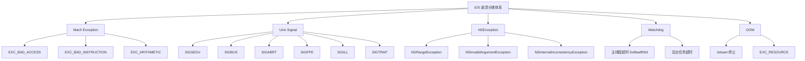
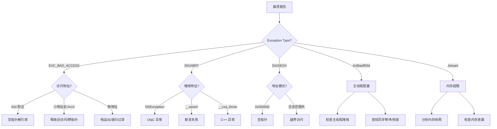

# 崩溃分析与根因定位方法论深度解析

> 系统掌握 iOS 崩溃分类体系、符号化分析、根因定位决策树与 OOM 专项排查，建立从现象到根因的完整分析能力

---

## 目录

- [核心结论 TL;DR](#核心结论-tldr)
- [第一部分：崩溃分类体系](#第一部分崩溃分类体系)
- [第二部分：崩溃率指标体系](#第二部分崩溃率指标体系)
- [第三部分：符号化与堆栈分析](#第三部分符号化与堆栈分析)
- [第四部分：根因定位决策树](#第四部分根因定位决策树)
- [第五部分：难复现崩溃的排查策略](#第五部分难复现崩溃的排查策略)
- [第六部分：OOM 崩溃专题](#第六部分oom-崩溃专题)
- [最佳实践](#最佳实践)
- [常见陷阱](#常见陷阱)
- [面试考点](#面试考点)
- [参考资源](#参考资源)

---

## 核心结论 TL;DR

| 维度 | 核心洞察 |
|------|----------|
| **崩溃分类** | iOS 崩溃分为 Mach Exception、Unix Signal、NSException、Watchdog、OOM 五大类，每类的捕获方式和排查思路截然不同 |
| **指标体系** | Crash Free Rate ≥ 99.9% 是行业标杆，User Crash Rate 比 Session Crash Rate 更能反映用户体验 |
| **符号化** | dSYM UUID 必须与二进制精确匹配，Bitcode 场景需从 App Store Connect 下载 dSYM |
| **根因定位** | 从崩溃类型 + 堆栈模式双维度入手，建立决策树快速收敛定位方向 |
| **OOM** | OOM 无法被 Signal Handler 捕获，需要排除法 + 内存快照组合判定 |
| **难复现** | 日志回放 + 状态快照 + Zombie + Sanitizer 多工具组合，缩小复现范围 |

---

## 第一部分：崩溃分类体系

### 1.1 崩溃分类全景图

**结论先行**：iOS 崩溃从底层到上层可分为五大类，理解分类是精准定位根因的前提。



### 1.2 Mach Exception

**结论先行**：Mach Exception 是内核级异常，由硬件或 Mach 微内核直接触发，是最底层的崩溃类型。

| Exception 类型 | 触发场景 | 常见原因 |
|---------------|---------|---------|
| **EXC_BAD_ACCESS** | 非法内存访问 | 野指针、释放后访问、栈溢出 |
| **EXC_BAD_INSTRUCTION** | 非法指令执行 | Swift 强制解包 nil、fatalError |
| **EXC_ARITHMETIC** | 算术异常 | 除以零、整数溢出 |

Mach Exception 的传递链路：

```
硬件异常 → Mach 微内核 → Mach Exception
    → 转换为 Unix Signal（如 SIGSEGV）
    → 用户态 Signal Handler
```

```objc
// ✅ 注册 Mach Exception Handler（底层捕获）
#include <mach/mach.h>

kern_return_t catch_mach_exception_raise(
    mach_port_t exception_port,
    mach_port_t thread,
    mach_port_t task,
    exception_type_t exception,
    mach_exception_data_t code,
    mach_msg_type_number_t code_count) {
    
    // 记录异常类型和地址
    NSLog(@"Mach Exception: type=%d, code=%lld, subcode=%lld",
          exception, code[0], code[1]);
    return KERN_FAILURE; // 返回失败，让系统继续处理
}
```

### 1.3 Unix Signal

**结论先行**：Unix Signal 是 Mach Exception 的上层表现，大部分崩溃最终以 Signal 形式呈现给用户态。

| Signal | 值 | 含义 | 典型场景 |
|--------|---|------|---------|
| **SIGSEGV** | 11 | 段错误 | 空指针解引用、非法地址访问 |
| **SIGBUS** | 10 | 总线错误 | 内存对齐错误、映射文件问题 |
| **SIGABRT** | 6 | 主动终止 | NSException、assert、C++ exception |
| **SIGFPE** | 8 | 算术异常 | 除以零 |
| **SIGILL** | 4 | 非法指令 | 代码段损坏 |
| **SIGTRAP** | 5 | 断点/陷阱 | __builtin_trap、Swift 运行时检查 |

```objc
// ✅ 注册 Signal Handler
#import <signal.h>

void signalHandler(int signal) {
    // ⚠️ 只能使用 async-signal-safe 函数
    // 不能调用 NSLog、malloc、objc_msgSend
    const char *signalName = "UNKNOWN";
    switch (signal) {
        case SIGSEGV: signalName = "SIGSEGV"; break;
        case SIGBUS:  signalName = "SIGBUS";  break;
        case SIGABRT: signalName = "SIGABRT"; break;
        case SIGFPE:  signalName = "SIGFPE";  break;
        case SIGILL:  signalName = "SIGILL";  break;
        case SIGTRAP: signalName = "SIGTRAP"; break;
    }
    // 使用 write 系统调用输出（async-signal-safe）
    write(STDERR_FILENO, signalName, strlen(signalName));
    write(STDERR_FILENO, "\n", 1);
    _exit(1);
}

void registerSignalHandlers(void) {
    signal(SIGSEGV, signalHandler);
    signal(SIGBUS,  signalHandler);
    signal(SIGABRT, signalHandler);
    signal(SIGFPE,  signalHandler);
    signal(SIGILL,  signalHandler);
    signal(SIGTRAP, signalHandler);
}
```

```swift
// ✅ Swift 中通过 C 桥接注册 Signal Handler
import Darwin

func registerSignalHandlers() {
    signal(SIGSEGV) { signal in
        // async-signal-safe 操作
        let msg = "SIGSEGV caught\n"
        msg.withCString { ptr in
            write(STDERR_FILENO, ptr, strlen(ptr))
        }
        _exit(1)
    }
    signal(SIGABRT) { signal in
        let msg = "SIGABRT caught\n"
        msg.withCString { ptr in
            write(STDERR_FILENO, ptr, strlen(ptr))
        }
        _exit(1)
    }
}
```

### 1.4 NSException

**结论先行**：NSException 是 Objective-C 层面的异常，最终会转化为 SIGABRT，是最常见且最易修复的崩溃类型。

| Exception 类型 | 典型场景 | 修复方向 |
|---------------|---------|---------|
| **NSRangeException** | 数组越界、字符串截取越界 | 边界检查 |
| **NSInvalidArgumentException** | nil 插入集合、unrecognized selector | 参数校验 |
| **NSInternalInconsistencyException** | UI 数据源不一致、断言失败 | 状态同步 |

```objc
// ❌ 避免：未做边界检查的数组访问
NSArray *items = @[@"a", @"b", @"c"];
id obj = items[5]; // 💥 NSRangeException

// ✅ 推荐：安全访问
- (nullable id)safeObjectAtIndex:(NSUInteger)index inArray:(NSArray *)array {
    if (index < array.count) {
        return array[index];
    }
    NSLog(@"⚠️ Index %lu out of bounds [0, %lu)", (unsigned long)index, (unsigned long)array.count);
    return nil;
}
```

```swift
// ❌ 避免：强制解包
let value: String? = nil
let result = value! // 💥 EXC_BAD_INSTRUCTION (Swift runtime trap)

// ✅ 推荐：安全解包
let result = value ?? "default"
// 或
if let value = value {
    print(value)
}
// 或
guard let value = value else { return }
```

### 1.5 Watchdog 崩溃

**结论先行**：Watchdog 崩溃是系统层面因超时而终止 App，其崩溃码 `0x8badf00d`（"ate bad food"）意为主线程"卡住了"。

**触发条件**：
- **启动超时**：App 启动超过 20 秒未完成
- **后台任务超时**：`beginBackgroundTask` 超过约 30 秒未结束
- **主线程阻塞**：主线程同步等待超过系统阈值

```objc
// ❌ 避免：主线程同步网络请求
- (void)viewDidLoad {
    [super viewDidLoad];
    // 💥 主线程同步请求 → 可能触发 Watchdog
    NSData *data = [NSData dataWithContentsOfURL:
        [NSURL URLWithString:@"https://api.example.com/data"]];
}

// ✅ 推荐：异步处理
- (void)viewDidLoad {
    [super viewDidLoad];
    dispatch_async(dispatch_get_global_queue(DISPATCH_QUEUE_PRIORITY_DEFAULT, 0), ^{
        NSData *data = [NSData dataWithContentsOfURL:
            [NSURL URLWithString:@"https://api.example.com/data"]];
        dispatch_async(dispatch_get_main_queue(), ^{
            [self updateUIWithData:data];
        });
    });
}
```

### 1.6 OOM 与后台崩溃

**结论先行**：OOM 是最隐蔽的崩溃类型，系统 Jetsam 机制直接终止进程，不会触发任何 Signal。

| 类型 | 触发方式 | 是否可捕获 | 日志标识 |
|------|---------|-----------|---------|
| **Jetsam 终止** | 系统内存压力 → 选择终止 | ❌ 不可 | JetsamEvent 日志 |
| **EXC_RESOURCE** | 单进程内存超限 | ⚠️ 部分可 | Exception Type |
| **后台任务超时** | Background Task 未及时结束 | ❌ 不可 | 0xbada5e47 |
| **VOIP 唤醒崩溃** | PushKit 回调超时 | ❌ 不可 | 0xbaadca11 |

---

## 第二部分：崩溃率指标体系

### 2.1 核心指标定义

**结论先行**：Crash Free Rate（无崩溃用户占比）是衡量 App 稳定性的金标准，目标 ≥ 99.9%。

| 指标 | 公式 | 适用场景 | 局限性 |
|------|------|---------|--------|
| **Session Crash Rate** | 崩溃次数 / 总 Session 数 | 衡量崩溃频率 | 高频用户拉高分母 |
| **User Crash Rate** | 崩溃用户数 / 总用户数 | 衡量用户影响面 | 不反映崩溃频次 |
| **Crash Free Rate** | 1 − User Crash Rate | 综合衡量稳定性 | 不区分崩溃严重程度 |

```
行业标杆参考：
┌─────────────────────────────────────────────────────┐
│ Crash Free Rate 分级                                  │
├──────────────┬──────────────────────────────────────┤
│ ≥ 99.9%      │ 优秀（头部 App 目标）                   │
│ 99.5% ~ 99.9%│ 良好（大多数成熟 App）                  │
│ 99.0% ~ 99.5%│ 一般（需要重点治理）                    │
│ < 99.0%      │ 差（严重影响用户体验）                   │
└──────────────┴──────────────────────────────────────┘
```

### 2.2 多维度统计

**结论先行**：单一指标不够，需要按版本、设备、系统版本、页面等维度交叉分析，才能精准定位问题。

```objc
// ✅ 崩溃上报时附带维度信息
- (NSDictionary *)crashContextInfo {
    return @{
        @"app_version":    [[NSBundle mainBundle] objectForInfoDictionaryKey:@"CFBundleShortVersionString"],
        @"build_number":   [[NSBundle mainBundle] objectForInfoDictionaryKey:@"CFBundleVersion"],
        @"device_model":   [self deviceModel],
        @"os_version":     [[UIDevice currentDevice] systemVersion],
        @"available_memory": @([self availableMemoryInMB]),
        @"disk_free":      @([self freeDiskSpaceInMB]),
        @"current_page":   self.currentPageName ?: @"unknown",
        @"user_actions":   [self.actionLogger recentActions:20],
        @"network_type":   [self currentNetworkType],
    };
}
```

```swift
// ✅ Swift 版本 — 结构化崩溃上下文
struct CrashContext: Codable {
    let appVersion: String
    let buildNumber: String
    let deviceModel: String
    let osVersion: String
    let availableMemoryMB: UInt64
    let currentPage: String
    let recentActions: [String]
    let networkType: String
    
    static func current() -> CrashContext {
        return CrashContext(
            appVersion: Bundle.main.infoDictionary?["CFBundleShortVersionString"] as? String ?? "",
            buildNumber: Bundle.main.infoDictionary?["CFBundleVersion"] as? String ?? "",
            deviceModel: UIDevice.modelName,
            osVersion: UIDevice.current.systemVersion,
            availableMemoryMB: ProcessInfo.processInfo.physicalMemory / 1024 / 1024,
            currentPage: NavigationTracker.shared.currentPage,
            recentActions: ActionLogger.shared.recentActions(count: 20),
            networkType: NetworkMonitor.shared.currentType
        )
    }
}
```

---

## 第三部分：符号化与堆栈分析

### 3.1 dSYM 管理

**结论先行**：dSYM 是崩溃分析的基础，丢失 dSYM 就等于丢失了分析能力，必须在 CI/CD 中自动归档。

**dSYM 生成与归档**：

```bash
# ✅ 查看 dSYM 的 UUID
dwarfdump --uuid MyApp.app.dSYM

# 输出示例：
# UUID: 2A3B4C5D-6E7F-8901-2345-6789ABCDEF01 (arm64) MyApp.app.dSYM/Contents/Resources/DWARF/MyApp

# ✅ 查看二进制的 UUID（必须与 dSYM 匹配）
dwarfdump --uuid MyApp.app/MyApp

# ✅ 从崩溃日志中获取 UUID
# Binary Images 部分包含：
# 0x100000000 - 0x100ffffff MyApp arm64 <2a3b4c5d6e7f890123456789abcdef01> /var/...
```

**Bitcode 场景**：

```
启用 Bitcode 时 dSYM 获取流程：
┌──────────────────────────────────────────────────────┐
│ 1. 上传 App Store Connect（含 Bitcode）                │
│ 2. Apple 在服务端重新编译                               │
│ 3. 生成新的二进制 + 新的 dSYM                           │
│ 4. 从 Xcode Organizer 或 App Store Connect 下载 dSYM  │
│ ⚠️ 本地编译的 dSYM UUID ≠ App Store 版本的 UUID        │
└──────────────────────────────────────────────────────┘
```

### 3.2 符号化方法

**结论先行**：掌握 `atos` 命令行是最基础的符号化能力，其他工具本质上都是对 atos 的封装。

```bash
# ✅ atos 命令行符号化（最常用）
# 格式：atos -arch <架构> -o <dSYM路径> -l <加载地址> <崩溃地址>
atos -arch arm64 \
     -o MyApp.app.dSYM/Contents/Resources/DWARF/MyApp \
     -l 0x100000000 \
     0x10004a3b8

# 输出示例：-[ViewController handleTap:] (in MyApp) (ViewController.m:42)

# ✅ 批量符号化脚本
#!/bin/bash
DSYM_PATH="MyApp.app.dSYM/Contents/Resources/DWARF/MyApp"
LOAD_ADDR="0x100000000"
ARCH="arm64"

while IFS= read -r addr; do
    result=$(atos -arch "$ARCH" -o "$DSYM_PATH" -l "$LOAD_ADDR" "$addr" 2>/dev/null)
    echo "$addr -> $result"
done < crash_addresses.txt

# ✅ symbolicatecrash 工具
export DEVELOPER_DIR="/Applications/Xcode.app/Contents/Developer"
/Applications/Xcode.app/Contents/SharedFrameworks/DVTFoundation.framework/Versions/A/Resources/symbolicatecrash \
    crash_report.crash MyApp.app.dSYM > symbolicated.crash
```

### 3.3 堆栈分析技巧

**结论先行**：堆栈分析的关键是识别"应用栈帧 vs 系统栈帧"，从应用栈帧入手定位问题代码。

```
崩溃报告关键区域：
┌──────────────────────────────────────────────────────────┐
│ Exception Type:  EXC_BAD_ACCESS (SIGSEGV)                │ ← 崩溃类型
│ Exception Subtype: KERN_INVALID_ADDRESS at 0x0000000000  │ ← 具体原因
│ Termination Reason: Namespace SIGNAL, Code 11            │
│ Triggered by Thread: 0                                   │ ← 崩溃线程
│                                                          │
│ Thread 0 (crashed):                                      │ ← 主线程崩溃
│ 0  libobjc.A.dylib   objc_msgSend + 16                  │ ← 系统帧（野指针特征）
│ 1  UIKitCore          -[UITableView _cellForRowAt...     │ ← 系统帧
│ 2  MyApp              -[DataSource tableView:cell...     │ ← 🎯 应用帧（问题点）
│ 3  MyApp              -[ViewController refreshData]      │ ← 🎯 应用帧（调用链）
│ 4  MyApp              -[ViewController viewDidLoad]      │ ← 🎯 应用帧（入口）
│ ...                                                      │
│ Thread 1:                                                │
│ 0  libsystem_kernel   __workq_kernreturn + 8             │
│ ...                                                      │
└──────────────────────────────────────────────────────────┘
```

**寄存器状态分析**：

```
Thread 0 crashed with ARM Thread State (64-bit):
    x0: 0x0000000badbeef01  ← 被调用对象的地址（异常值 → 野指针）
    x1: 0x00000001a2b3c4d5  ← selector 地址
   ...
    pc: 0x000000019876abcd  ← 程序计数器（崩溃指令地址）
    lr: 0x0000000100123456  ← 链接寄存器（返回地址）
```

---

## 第四部分：根因定位决策树

### 4.1 从崩溃类型出发

**结论先行**：崩溃类型是第一分流依据，不同类型对应不同的排查方向和工具链。



### 4.2 从堆栈模式出发

**结论先行**：经验丰富的开发者能从堆栈中的"标志性帧"快速判断问题类型。

| 堆栈关键帧 | 指向问题 | 排查方向 |
|-----------|---------|---------|
| `objc_msgSend` | 野指针/zombie | 开启 Zombie Objects |
| `objc_msgSend + 16` | 对象已释放 | 检查对象生命周期 |
| `_CFRelease` / `objc_release` | Over-release | 检查引用计数管理 |
| `malloc_error_break` | 堆损坏 | Address Sanitizer |
| `pthread_kill` | 主动 abort | 查找上层 NSException |
| `__swift_stdlib_reportFatalError` | Swift fatalError | 检查强制解包/越界 |
| `_dispatch_lane_serial_drain` | GCD 队列崩溃 | 检查队列中的任务 |

```objc
// ✅ Zombie Object 检测方案 — 线上轻量版
// 原理：hook dealloc，保留已释放对象的类名信息
#import <objc/runtime.h>

static NSMutableDictionary *sZombieMap;
static const NSUInteger kMaxZombieCount = 1000;

void enableZombieDetection(void) {
    sZombieMap = [NSMutableDictionary dictionary];
    
    // Hook NSObject dealloc
    Method origDealloc = class_getInstanceMethod([NSObject class], NSSelectorFromString(@"dealloc"));
    
    // 在 dealloc 前记录类名和地址映射
    // 保留最近 N 个已释放对象的信息
    // 当 objc_msgSend 崩溃时，查表获取原始类名
}

// ❌ 避免：线上环境开启系统 Zombie（性能开销巨大）
// Scheme → Diagnostics → Zombie Objects → 仅用于开发调试
```

```swift
// ✅ Swift 版 — 野指针访问的典型模式
class UnsafeExample {
    var callback: (() -> Void)?
    
    func setupCallback() {
        // ❌ 避免：闭包捕获 self 导致的野指针
        NotificationCenter.default.addObserver(
            forName: .someNotification,
            object: nil,
            queue: .main
        ) { _ in
            self.handleNotification() // 💥 self 可能已释放
        }
    }
    
    // ✅ 推荐：使用 weak self
    func setupCallbackSafely() {
        NotificationCenter.default.addObserver(
            forName: .someNotification,
            object: nil,
            queue: .main
        ) { [weak self] _ in
            self?.handleNotification()
        }
    }
}
```

---

## 第五部分：难复现崩溃的排查策略

### 5.1 日志回放

**结论先行**：崩溃前的用户操作路径是复现问题的关键线索，必须建立"操作日志"机制。

```objc
// ✅ 崩溃前操作日志收集器
@interface ActionLogger : NSObject
@property (nonatomic, strong) NSMutableArray<NSDictionary *> *actionQueue;
@property (nonatomic, assign) NSUInteger maxCount;
@end

@implementation ActionLogger

- (instancetype)init {
    self = [super init];
    if (self) {
        _actionQueue = [NSMutableArray array];
        _maxCount = 50; // 保留最近 50 步操作
    }
    return self;
}

- (void)logAction:(NSString *)action params:(NSDictionary *)params {
    NSDictionary *entry = @{
        @"action": action,
        @"params": params ?: @{},
        @"timestamp": @([[NSDate date] timeIntervalSince1970]),
        @"thread": [NSThread isMainThread] ? @"main" : @"background",
        @"memory_mb": @([self currentMemoryMB]),
    };
    
    @synchronized (self.actionQueue) {
        [self.actionQueue addObject:entry];
        if (self.actionQueue.count > self.maxCount) {
            [self.actionQueue removeObjectAtIndex:0];
        }
    }
}

- (NSArray *)recentActions:(NSUInteger)count {
    @synchronized (self.actionQueue) {
        NSUInteger start = self.actionQueue.count > count ?
            self.actionQueue.count - count : 0;
        return [self.actionQueue subarrayWithRange:
            NSMakeRange(start, self.actionQueue.count - start)];
    }
}

@end
```

```swift
// ✅ Swift 版 — Actor-based 日志收集（线程安全）
actor ActionLogger {
    static let shared = ActionLogger()
    
    private var actions: [(action: String, timestamp: Date, detail: String)] = []
    private let maxCount = 50
    
    func log(action: String, detail: String = "") {
        actions.append((action: action, timestamp: Date(), detail: detail))
        if actions.count > maxCount {
            actions.removeFirst()
        }
    }
    
    func recentActions(count: Int) -> [(action: String, timestamp: Date, detail: String)] {
        return Array(actions.suffix(count))
    }
    
    /// 崩溃时同步写入文件（⚠️ 需在 Signal Handler 前调用）
    nonisolated func persistToDisk() {
        // 使用 POSIX write，async-signal-safe
    }
}
```

### 5.2 状态快照

**结论先行**：崩溃瞬间的 App 状态快照（内存、网络、页面栈）能大幅缩小排查范围。

```objc
// ✅ 状态快照收集
@interface StateSnapshot : NSObject
+ (NSDictionary *)capture;
@end

@implementation StateSnapshot

+ (NSDictionary *)capture {
    return @{
        @"memory": @{
            @"used_mb": @([self usedMemoryMB]),
            @"available_mb": @([self availableMemoryMB]),
            @"footprint_mb": @([self memoryFootprintMB]),
        },
        @"app_state": @(UIApplication.sharedApplication.applicationState),
        @"active_vc": NSStringFromClass(
            [UIApplication.sharedApplication.keyWindow.rootViewController class]),
        @"bg_tasks": @([self activeBackgroundTaskCount]),
        @"open_files": @([self openFileDescriptorCount]),
        @"thread_count": @([self currentThreadCount]),
    };
}

+ (double)memoryFootprintMB {
    task_vm_info_data_t vmInfo;
    mach_msg_type_number_t count = TASK_VM_INFO_COUNT;
    kern_return_t result = task_info(mach_task_self(),
                                     TASK_VM_INFO,
                                     (task_info_t)&vmInfo,
                                     &count);
    if (result == KERN_SUCCESS) {
        return vmInfo.phys_footprint / (1024.0 * 1024.0);
    }
    return 0;
}

@end
```

### 5.3 调试工具组合

**结论先行**：不同类型的难复现崩溃需要不同的工具组合，Sanitizer 系列是最强利器。

| 工具 | 检测能力 | 性能开销 | 使用场景 |
|------|---------|---------|---------|
| **Zombie Objects** | 释放后访问 | 高（内存不回收） | 开发调试 |
| **Address Sanitizer** | 堆栈溢出、Use-after-free、Double-free | 2-3x 减速 | CI 自动化 |
| **Thread Sanitizer** | 数据竞争 | 5-10x 减速 | CI 自动化 |
| **Undefined Behavior Sanitizer** | 未定义行为 | 较低 | CI 自动化 |
| **Malloc Scribble** | 使用未初始化内存 | 低 | 开发调试 |
| **Guard Malloc** | 堆缓冲区溢出 | 极高 | 专项排查 |

```
灰度验证缩小范围策略：
┌──────────────────────────────────────────────────────────────┐
│ 1. 确认问题版本范围：v3.1.0 有崩溃，v3.0.9 没有               │
│ 2. Git bisect 定位引入 commit                                │
│ 3. 灰度发布修复版本到 1% 用户验证                              │
│ 4. 对比修复版 vs 问题版的崩溃率                                │
│ 5. 确认修复有效后全量发布                                      │
└──────────────────────────────────────────────────────────────┘
```

---

## 第六部分：OOM 崩溃专题

### 6.1 OOM 的特殊性

**结论先行**：OOM 是唯一无法被任何 crash reporter 直接捕获的崩溃类型，必须通过间接方法判定。

```
OOM 判定排除法：
┌─────────────────────────────────────────────────────────────┐
│ App 上次非正常退出                                           │
│   ├── 有崩溃日志 → 普通崩溃（非 OOM）                         │
│   ├── 用户主动杀进程 → 非 OOM                                │
│   ├── 系统升级/重启 → 非 OOM                                 │
│   ├── App 更新 → 非 OOM                                     │
│   └── 以上都不是 → 大概率 OOM                                │
│       ├── 前台 OOM（FOOM）→ 用户正在使用时被杀               │
│       └── 后台 OOM（BOOM）→ 后台内存压力被杀                 │
└─────────────────────────────────────────────────────────────┘
```

### 6.2 OOM 监控方案

```objc
// ✅ OOM 判定逻辑
@interface OOMDetector : NSObject
@end

@implementation OOMDetector

+ (void)load {
    [self markAppLaunch];
    [self checkPreviousTermination];
}

+ (void)markAppLaunch {
    NSUserDefaults *defaults = [NSUserDefaults standardUserDefaults];
    // 记录本次启动状态
    [defaults setBool:YES forKey:@"app_is_running"];
    [defaults setBool:NO forKey:@"app_terminated_normally"];
    [defaults setBool:NO forKey:@"app_crashed"];
    [defaults synchronize];
    
    // 注册正常退出回调
    [[NSNotificationCenter defaultCenter] addObserver:self
        selector:@selector(appWillTerminate)
        name:UIApplicationWillTerminateNotification
        object:nil];
}

+ (void)appWillTerminate {
    NSUserDefaults *defaults = [NSUserDefaults standardUserDefaults];
    [defaults setBool:YES forKey:@"app_terminated_normally"];
    [defaults synchronize];
}

+ (void)checkPreviousTermination {
    NSUserDefaults *defaults = [NSUserDefaults standardUserDefaults];
    BOOL wasRunning = [defaults boolForKey:@"app_is_running"];
    BOOL terminatedNormally = [defaults boolForKey:@"app_terminated_normally"];
    BOOL crashed = [defaults boolForKey:@"app_crashed"];
    
    if (wasRunning && !terminatedNormally && !crashed) {
        // 排除法：既非正常退出，也非 Signal 崩溃 → 可能是 OOM
        [self reportPossibleOOM];
    }
}

+ (void)reportPossibleOOM {
    // 上报 OOM 事件，附带上次运行时的内存快照
    NSDictionary *lastSnapshot = [self loadLastMemorySnapshot];
    NSLog(@"⚠️ Possible OOM detected. Last memory: %@", lastSnapshot);
}

@end
```

### 6.3 内存快照 Top-N

```swift
// ✅ 定期记录内存 Top-N，OOM 时可回溯
class MemorySnapshotRecorder {
    static let shared = MemorySnapshotRecorder()
    
    private var timer: Timer?
    private let snapshotInterval: TimeInterval = 5.0
    
    struct MemorySnapshot: Codable {
        let timestamp: TimeInterval
        let totalFootprintMB: Double
        let vmAllocations: [VMAllocation]
        
        struct VMAllocation: Codable {
            let category: String
            let sizeMB: Double
        }
    }
    
    func startRecording() {
        timer = Timer.scheduledTimer(withTimeInterval: snapshotInterval, repeats: true) { [weak self] _ in
            self?.captureSnapshot()
        }
    }
    
    private func captureSnapshot() {
        var info = task_vm_info_data_t()
        var count = mach_msg_type_number_t(MemoryLayout<task_vm_info>.size / MemoryLayout<natural_t>.size)
        
        let result = withUnsafeMutablePointer(to: &info) {
            $0.withMemoryRebound(to: integer_t.self, capacity: Int(count)) {
                task_info(mach_task_self_, task_flavor_t(TASK_VM_INFO), $0, &count)
            }
        }
        
        guard result == KERN_SUCCESS else { return }
        
        let footprintMB = Double(info.phys_footprint) / 1024.0 / 1024.0
        
        let snapshot = MemorySnapshot(
            timestamp: Date().timeIntervalSince1970,
            totalFootprintMB: footprintMB,
            vmAllocations: [] // 实际项目中可通过 vm_region 遍历获取
        )
        
        // 写入磁盘（mmap 方式，崩溃时不丢失）
        persistSnapshot(snapshot)
        
        // ⚠️ 内存水位预警
        if footprintMB > Double(self.warningThresholdMB) {
            NotificationCenter.default.post(name: .memoryWarning, object: nil,
                userInfo: ["footprint_mb": footprintMB])
        }
    }
    
    private let warningThresholdMB: UInt64 = {
        // 根据设备内存设定阈值（通常为物理内存的 50%-70%）
        let totalMemory = ProcessInfo.processInfo.physicalMemory
        return totalMemory / 1024 / 1024 * 60 / 100 // 60%
    }()
    
    private func persistSnapshot(_ snapshot: MemorySnapshot) {
        guard let data = try? JSONEncoder().encode(snapshot) else { return }
        let path = FileManager.default.temporaryDirectory
            .appendingPathComponent("memory_snapshot.json")
        try? data.write(to: path, options: .atomic)
    }
}
```

---

## 最佳实践

### 1. 崩溃分析流程标准化

```
✅ 推荐的崩溃分析 SOP：
1. 确认崩溃类型（Exception Type + Signal）
2. 符号化堆栈（确保 dSYM UUID 匹配）
3. 识别应用栈帧 vs 系统栈帧
4. 根据决策树确定排查方向
5. 收集上下文（设备/版本/操作路径）
6. 本地复现或使用 Sanitizer 验证
7. 修复 + 回归测试 + 灰度验证
```

### 2. dSYM 管理

```
✅ dSYM 最佳实践：
- CI/CD 中自动归档 dSYM 到 Symbol Server
- 每次 Release 构建后验证 UUID 匹配
- Bitcode 场景下从 App Store Connect 同步 dSYM
- dSYM 至少保留最近 12 个月（覆盖长尾用户）
```

### 3. 崩溃上报完备性

```
✅ 崩溃上报应包含：
- 完整堆栈（所有线程）
- 寄存器状态
- 二进制镜像列表（Binary Images）
- 崩溃前操作日志
- 设备/系统/版本信息
- 内存/磁盘/网络状态
```

---

## 常见陷阱

### 陷阱 1：Signal Handler 中使用非 async-signal-safe 函数

```objc
// ❌ 避免：在 Signal Handler 中使用 ObjC/malloc
void badSignalHandler(int signal) {
    // 💥 以下操作都不是 async-signal-safe
    NSLog(@"Crash: %d", signal);           // 调用 objc_msgSend
    NSString *log = [NSString stringWithFormat:@"%d", signal]; // malloc
    [CrashReporter report:log];            // objc_msgSend
}

// ✅ 推荐：只使用 async-signal-safe 函数
void goodSignalHandler(int signal) {
    // write、_exit、sigaction 等少数系统调用是安全的
    char buf[64];
    int len = snprintf(buf, sizeof(buf), "Signal: %d\n", signal);
    write(STDERR_FILENO, buf, len);
    _exit(1);
}
```

### 陷阱 2：多个 Crash Reporter 互相覆盖

```objc
// ❌ 避免：直接覆盖前一个 handler
NSSetUncaughtExceptionHandler(&myHandler); // 覆盖了 Bugly 的 handler！

// ✅ 推荐：保存并调用前一个 handler（链式注册）
static NSUncaughtExceptionHandler *sPreviousHandler = NULL;

void myExceptionHandler(NSException *exception) {
    // 自己的处理逻辑
    saveException(exception);
    
    // 调用前一个 handler
    if (sPreviousHandler) {
        sPreviousHandler(exception);
    }
}

void registerExceptionHandler(void) {
    sPreviousHandler = NSGetUncaughtExceptionHandler();
    NSSetUncaughtExceptionHandler(&myExceptionHandler);
}
```

### 陷阱 3：OOM 误判

```
❌ 常见误判场景：
- 用户从多任务界面手动杀 App → 误判为 OOM
- 系统升级重启 → 误判为 OOM
- 后台被系统挂起后释放 → 正常行为，不算 OOM

✅ 提高判定准确性：
- 排除用户主动退出（记录 applicationWillTerminate）
- 排除系统重启（对比启动时间和系统启动时间）
- 区分 FOOM 和 BOOM（记录前后台状态）
- 交叉验证：结合内存快照判断 OOM 时的内存水位
```

### 陷阱 4：dSYM UUID 不匹配

```
❌ 常见原因：
- Debug 构建的 dSYM 用于分析 Release 崩溃
- Bitcode 重编译后未重新下载 dSYM
- 热修复/动态库版本更新后未更新 dSYM

✅ 验证方法：
1. 从崩溃日志 Binary Images 获取 UUID
2. 用 dwarfdump --uuid 查看 dSYM 的 UUID
3. 两者必须完全一致才能正确符号化
```

---

## 面试考点

### Q1：iOS 崩溃有哪些类型？请说明每种类型的特点和常见场景

**参考答案**：
iOS 崩溃分为五大类：
1. **Mach Exception**（内核级）：EXC_BAD_ACCESS（野指针/非法地址）、EXC_BAD_INSTRUCTION（非法指令，Swift trap）
2. **Unix Signal**（系统级）：SIGSEGV（段错误）、SIGABRT（主动终止）、SIGBUS（总线错误）等，大部分由 Mach Exception 转换而来
3. **NSException**（ObjC 层）：数组越界、unrecognized selector、数据源不一致等，最终转为 SIGABRT
4. **Watchdog**（系统策略）：主线程超时 20 秒（0x8badf00d）、后台任务超时
5. **OOM**（内存超限）：系统 Jetsam 机制直接终止进程，无法被 Signal Handler 捕获

### Q2：如何判断一个崩溃是 OOM？

**参考答案**：
OOM 无法被传统 crash reporter 捕获，需要排除法：
1. 记录 App 运行状态标记（app_is_running）
2. 注册 applicationWillTerminate 记录正常退出
3. 注册 Signal Handler 记录崩溃退出
4. 下次启动时检查：如果上次是"运行中"但"非正常退出"且"无崩溃日志"，大概率是 OOM
5. 进一步区分 FOOM（前台 OOM）和 BOOM（后台 OOM），FOOM 对用户体验影响更大
6. 结合崩溃前的内存快照（定期记录 phys_footprint）辅助验证

### Q3：objc_msgSend 崩溃通常意味着什么？如何排查？

**参考答案**：
`objc_msgSend` 崩溃几乎总是意味着向已释放的对象发送消息（野指针/Use-after-free）：
1. **特征**：EXC_BAD_ACCESS，崩溃在 objc_msgSend 或 objc_msgSend + 16
2. **排查步骤**：
   - 开启 Zombie Objects（Debug 环境）：将 dealloc 替换为 zombie 转换，访问时输出原始类名
   - Address Sanitizer：检测 Use-after-free
   - 检查 x0 寄存器：如果值看起来像被覆盖的内存（如 0xbadbeef），确认是野指针
   - 分析对象生命周期：检查 delegate、block 捕获、通知中心的引用关系

### Q4：Signal Handler 有什么限制？为什么？

**参考答案**：
Signal Handler 运行在**异步信号上下文**中，存在严格限制：
1. **只能调用 async-signal-safe 函数**：如 `write`、`_exit`、`sigaction`
2. **不能调用**：`malloc`/`free`（堆可能正在被修改）、`objc_msgSend`（ObjC 运行时非信号安全）、`NSLog`、`printf`
3. **原因**：Signal 可能在任意时刻打断正常执行流，此时堆、锁等共享状态可能处于不一致状态，调用非信号安全函数可能导致死锁或二次崩溃
4. **实践方案**：在 Signal Handler 中仅做最小写入（用 `write` 写文件），复杂处理延迟到下次启动

### Q5：dSYM 是什么？Bitcode 场景下如何处理？

**参考答案**：
dSYM（Debug Symbol file）包含二进制的调试符号信息，是崩溃符号化的必要条件：
1. **作用**：将内存地址映射为源码文件名、行号、函数名
2. **UUID 匹配**：dSYM 和二进制通过 UUID 关联，必须完全一致
3. **Bitcode 场景**：
   - Bitcode 上传后 Apple 服务器重新编译，生成新的二进制和新的 dSYM
   - 本地构建的 dSYM 与 App Store 版本的 UUID 不同，无法使用
   - 需要从 Xcode Organizer 或 App Store Connect API 下载对应版本的 dSYM

---

## 参考资源

### Apple 官方文档
- [Understanding the Exception Types in a Crash Report](https://developer.apple.com/documentation/xcode/understanding-the-exception-types-in-a-crash-report)
- [Diagnosing Issues Using Crash Reports](https://developer.apple.com/documentation/xcode/diagnosing-issues-using-crash-reports-and-device-logs)
- [Identifying the Cause of Common Crashes](https://developer.apple.com/documentation/xcode/identifying-the-cause-of-common-crashes)

### 工具与框架
- [PLCrashReporter](https://github.com/microsoft/plcrashreporter) — 开源崩溃捕获框架
- [KSCrash](https://github.com/kstenerud/KSCrash) — 功能全面的崩溃报告库
- [Firebase Crashlytics](https://firebase.google.com/docs/crashlytics) — Google 崩溃分析服务

### 交叉引用
- [疑难崩溃问题治理方法论与实践指南](../../疑难崩溃问题治理方法论与实践指南.md)
- [防劣化体系建设](./防劣化体系建设_详细解析.md)
