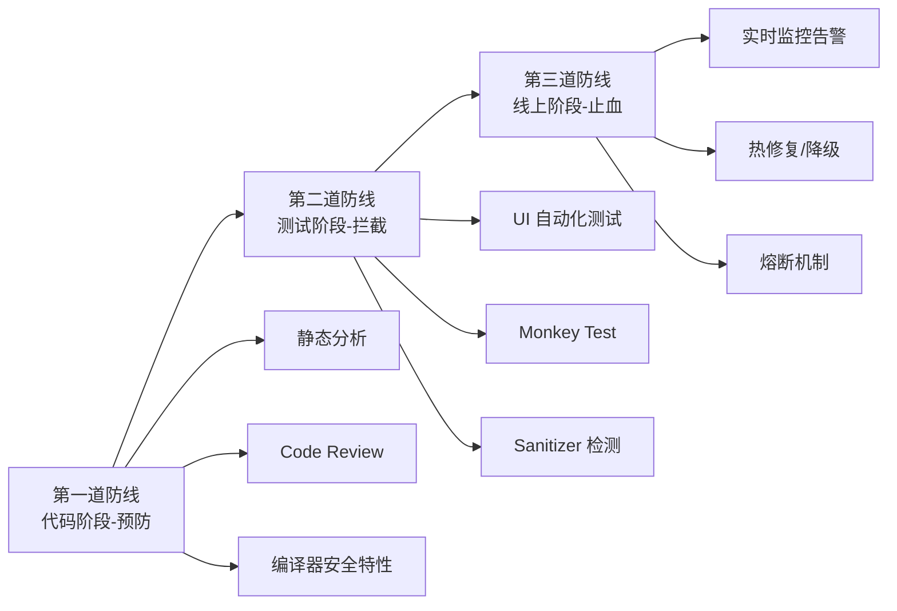
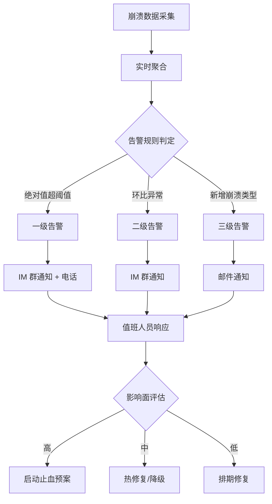

# 防劣化体系建设深度解析

> 构建代码阶段预防、测试阶段拦截、线上阶段止血的三道防线，实现崩溃率持续收敛而非反复劣化

---

## 目录

- [核心结论 TL;DR](#核心结论-tldr)
- [第一部分：防劣化三道防线](#第一部分防劣化三道防线)
- [第二部分：防劣化的必要性](#第二部分防劣化的必要性)
- [第三部分：崩溃预防机制](#第三部分崩溃预防机制)
- [第四部分：自动化测试策略](#第四部分自动化测试策略)
- [第五部分：线上监控体系](#第五部分线上监控体系)
- [第六部分：崩溃率准入与发布卡口](#第六部分崩溃率准入与发布卡口)
- [最佳实践](#最佳实践)
- [常见陷阱](#常见陷阱)
- [面试考点](#面试考点)
- [参考资源](#参考资源)

---

## 核心结论 TL;DR

| 维度 | 核心洞察 |
|------|----------|
| **三道防线** | 代码阶段预防（静态分析 + Review）→ 测试阶段拦截（Sanitizer + Monkey）→ 线上止血（监控 + 热修复 + 熔断） |
| **预防 > 治理** | 在代码阶段拦截一个崩溃的成本约为线上修复的 1/100，越早发现越低成本 |
| **安全兜底** | NSSetUncaughtExceptionHandler + Signal Handler 链式注册是崩溃捕获的基础设施 |
| **Sanitizer** | ASan/TSan/UBSan 是测试阶段最强力的崩溃检测工具，必须集成到 CI |
| **发布卡口** | 灰度分阶段放量（1%→5%→20%→50%→100%）+ 崩溃率门禁是防劣化的最后屏障 |
| **自动归因** | Top-N 崩溃自动关联 Git Blame + 自动创建 Issue 是规模化治理的关键 |

---

## 第一部分：防劣化三道防线

### 1.1 三道防线全景图

**结论先行**：防劣化体系的核心思想是"左移"——将问题发现尽可能前置到开发阶段。



### 1.2 第一道防线：代码阶段（预防）

**结论先行**：静态分析 + 规范化 Code Review 能在代码合入前拦截 60% 以上的潜在崩溃。

**静态分析工具**：

| 工具 | 检测能力 | 集成方式 |
|------|---------|---------|
| **Clang Static Analyzer** | 空指针、内存泄漏、逻辑错误 | Xcode 内置 / CI 脚本 |
| **SwiftLint** | Swift 代码规范、强制解包检测 | Build Phase / CI |
| **Infer (Facebook)** | 线程安全、空指针、资源泄漏 | CI 独立运行 |
| **OCLint** | ObjC 复杂度、未使用代码、可疑模式 | CI 脚本 |

**Code Review 崩溃检查清单**：

```
✅ 崩溃防护 Code Review Checklist：
□ 数组/字典访问是否有边界检查？
□ Optional 是否避免了强制解包（!）？
□ delegate/block 是否使用了 weak 引用？
□ 多线程访问共享数据是否有锁保护？
□ KVO 移除是否与添加配对？
□ NotificationCenter 移除是否在 dealloc 中？
□ 大内存分配是否有失败处理？
□ 主线程是否有同步等待操作？
□ C/C++ 指针是否有 NULL 检查？
□ 动态类型转换是否用了安全方式（as?）？
```

**编译器安全特性**：

```
✅ 推荐开启的编译器安全选项：
- -Wnullable-to-nonnull-conversion   ← nullable 赋给 nonnull 告警
- -Wunguarded-availability           ← API 可用性检查
- -Werror=return-type                ← 缺少返回值报错
- CLANG_WARN_OBJC_IMPLICIT_RETAIN_SELF ← 隐式 self 捕获告警
- SWIFT_STRICT_CONCURRENCY = complete ← Swift 并发严格模式
```

### 1.3 第二道防线：测试阶段（拦截）

**结论先行**：自动化测试 + Sanitizer 组合能发现代码层面无法检测的运行时问题（内存越界、数据竞争等）。

### 1.4 第三道防线：线上阶段（止血）

**结论先行**：线上发现的崩溃需要"快速止血"能力，热修复和熔断是最后的安全网。

```
线上止血手段优先级：
┌───────────────────────────────────────────────────────────────┐
│ 1. 服务端配置降级 — 关闭出问题的功能入口（秒级生效）            │
│ 2. 热修复（JSPatch/Aspects）— 运行时修补代码（分钟级生效）     │
│ 3. 熔断机制 — 崩溃次数超阈值自动关闭功能（自动化）             │
│ 4. 紧急版本发布 — 走加急审核流程（天级生效）                   │
└───────────────────────────────────────────────────────────────┘
```

---

## 第二部分：防劣化的必要性

### 2.1 崩溃劣化的常见原因

**结论先行**：崩溃劣化通常不是单点问题，而是系统性的工程能力缺失。

| 劣化原因 | 具体表现 | 占比（经验值） |
|---------|---------|--------------|
| **新功能引入** | 新代码边界条件未覆盖 | ~40% |
| **底层依赖升级** | SDK 升级兼容性问题 | ~20% |
| **多线程竞争** | 并发场景新增或变化 | ~15% |
| **机型/系统兼容** | 低端设备或新系统适配不足 | ~10% |
| **修复引入回归** | 修复 A 崩溃引入 B 崩溃 | ~10% |
| **数据异常** | 服务端返回异常数据 | ~5% |

### 2.2 发现时机与修复成本

**结论先行**：越早发现，修复成本呈指数级降低。

```
修复成本对比（相对值）：
┌──────────────────────────────────────────────────────────────┐
│ 阶段          │ 发现方式            │ 修复成本 │ 影响范围     │
├──────────────┼───────────────────┼─────────┼────────────┤
│ 编码阶段      │ 静态分析/IDE 提示    │ 1x      │ 0 用户      │
│ Code Review   │ 人工审查            │ 2x      │ 0 用户      │
│ CI 测试       │ 自动化测试 + Sanitizer│ 5x     │ 0 用户      │
│ 灰度阶段      │ 灰度监控            │ 20x     │ 少量用户    │
│ 全量发布      │ 线上监控            │ 50x     │ 大量用户    │
│ 用户反馈      │ 差评/客诉           │ 100x    │ 已产生口碑影响│
└──────────────┴───────────────────┴─────────┴────────────┘
```

---

## 第三部分：崩溃预防机制

### 3.1 异常捕获兜底

**结论先行**：NSSetUncaughtExceptionHandler + Signal Handler 是崩溃捕获的基础设施，必须链式注册避免互相覆盖。

```objc
// ✅ 完整的崩溃捕获设置（链式注册，不覆盖其他 SDK）
#import <signal.h>
#import <execinfo.h>

// 保存前一个 handler
static NSUncaughtExceptionHandler *sPreviousExceptionHandler = NULL;
static struct sigaction sPreviousSignalActions[32];

#pragma mark - NSException Handler

void customExceptionHandler(NSException *exception) {
    // 1. 收集崩溃信息
    NSMutableDictionary *crashInfo = [NSMutableDictionary dictionary];
    crashInfo[@"name"] = exception.name;
    crashInfo[@"reason"] = exception.reason;
    crashInfo[@"callStackSymbols"] = [exception callStackSymbols];
    crashInfo[@"callStackReturnAddresses"] = [exception callStackReturnAddresses];
    crashInfo[@"userInfo"] = exception.userInfo;
    
    // 2. 写入本地文件（同步写入，防止进程退出丢失）
    NSData *data = [NSJSONSerialization dataWithJSONObject:crashInfo
                                                  options:0
                                                    error:nil];
    NSString *path = [NSTemporaryDirectory() stringByAppendingPathComponent:@"crash.json"];
    [data writeToFile:path atomically:YES];
    
    // 3. 调用前一个 handler（链式传递）
    if (sPreviousExceptionHandler) {
        sPreviousExceptionHandler(exception);
    }
}

#pragma mark - Signal Handler

void customSignalHandler(int signal, siginfo_t *info, void *context) {
    // ⚠️ 只使用 async-signal-safe 函数
    // 1. 记录信号信息
    char buf[256];
    int len = snprintf(buf, sizeof(buf),
        "Signal: %d, si_addr: %p, si_code: %d\n",
        signal, info->si_addr, info->si_code);
    
    // 2. 获取调用栈（backtrace 在某些平台是 signal-safe 的）
    void *callstack[128];
    int frames = backtrace(callstack, 128);
    
    // 3. 写入文件
    int fd = open("/tmp/signal_crash.log", O_WRONLY | O_CREAT | O_TRUNC, 0644);
    if (fd >= 0) {
        write(fd, buf, len);
        backtrace_symbols_fd(callstack, frames, fd);
        close(fd);
    }
    
    // 4. 恢复默认 handler 并重新发送信号
    struct sigaction defaultAction;
    defaultAction.sa_handler = SIG_DFL;
    sigemptyset(&defaultAction.sa_mask);
    defaultAction.sa_flags = 0;
    sigaction(signal, &defaultAction, NULL);
    raise(signal);
}

#pragma mark - 注册

void setupCrashCapture(void) {
    // 1. 注册 NSException handler（保存前一个）
    sPreviousExceptionHandler = NSGetUncaughtExceptionHandler();
    NSSetUncaughtExceptionHandler(&customExceptionHandler);
    
    // 2. 注册 Signal handler（保存前一个）
    int signals[] = {SIGSEGV, SIGBUS, SIGABRT, SIGFPE, SIGILL, SIGTRAP};
    int count = sizeof(signals) / sizeof(signals[0]);
    
    struct sigaction action;
    action.sa_sigaction = customSignalHandler;
    action.sa_flags = SA_SIGINFO; // 使用 sa_sigaction 而非 sa_handler
    sigemptyset(&action.sa_mask);
    
    for (int i = 0; i < count; i++) {
        sigaction(signals[i], &action, &sPreviousSignalActions[signals[i]]);
    }
}
```

```swift
// ✅ Swift 封装 — 崩溃捕获管理器
final class CrashCaptureManager {
    static let shared = CrashCaptureManager()
    
    private var isSetup = false
    
    func setup() {
        guard !isSetup else { return }
        isSetup = true
        
        // 调用 ObjC 桥接的注册函数
        setupCrashCapture()
        
        // 额外：注册 C++ 异常处理
        std_set_terminate {
            // 记录 C++ 异常信息
            if let exception = __cxa_current_exception_type() {
                let name = String(cString: exception.pointee.name())
                print("C++ Exception: \(name)")
            }
        }
    }
}
```

### 3.2 Safe Category / Safe Swizzling

**结论先行**：通过方法交换为系统容器类添加安全防护，是防止线上崩溃最直接有效的兜底手段。

```objc
// ✅ NSArray 安全访问防护
@implementation NSArray (SafeAccess)

+ (void)load {
    static dispatch_once_t onceToken;
    dispatch_once(&onceToken, ^{
        // __NSArrayI 是不可变数组的实际类
        Class cls = NSClassFromString(@"__NSArrayI");
        [self swizzleMethod:cls
                       orig:@selector(objectAtIndex:)
                       swap:@selector(safe_objectAtIndex:)];
        
        // __NSArrayM 是可变数组
        Class mutableCls = NSClassFromString(@"__NSArrayM");
        [self swizzleMethod:mutableCls
                       orig:@selector(objectAtIndex:)
                       swap:@selector(safe_objectAtIndex:)];
        
        // __NSSingleObjectArrayI 是单元素数组
        Class singleCls = NSClassFromString(@"__NSSingleObjectArrayI");
        if (singleCls) {
            [self swizzleMethod:singleCls
                           orig:@selector(objectAtIndex:)
                           swap:@selector(safe_objectAtIndex:)];
        }
    });
}

- (id)safe_objectAtIndex:(NSUInteger)index {
    if (index < self.count) {
        return [self safe_objectAtIndex:index]; // 调用原方法
    }
    // 上报异常但不崩溃
    NSLog(@"⚠️ [SafeArray] Index %lu beyond bounds [0..%lu]",
          (unsigned long)index, (unsigned long)self.count);
    #if DEBUG
    // Debug 环境仍然崩溃，便于发现问题
    return [self safe_objectAtIndex:index];
    #else
    return nil;
    #endif
}

+ (void)swizzleMethod:(Class)cls orig:(SEL)origSel swap:(SEL)swapSel {
    Method origMethod = class_getInstanceMethod(cls, origSel);
    Method swapMethod = class_getInstanceMethod([self class], swapSel);
    if (origMethod && swapMethod) {
        method_exchangeImplementations(origMethod, swapMethod);
    }
}

@end
```

```objc
// ✅ NSDictionary nil value 防护
@implementation NSMutableDictionary (SafeAccess)

+ (void)load {
    static dispatch_once_t onceToken;
    dispatch_once(&onceToken, ^{
        Class cls = NSClassFromString(@"__NSDictionaryM");
        Method origMethod = class_getInstanceMethod(cls, @selector(setObject:forKey:));
        Method safeMethod = class_getInstanceMethod([self class], @selector(safe_setObject:forKey:));
        if (origMethod && safeMethod) {
            method_exchangeImplementations(origMethod, safeMethod);
        }
    });
}

- (void)safe_setObject:(id)anObject forKey:(id<NSCopying>)aKey {
    if (!anObject) {
        NSLog(@"⚠️ [SafeDict] Attempt to set nil for key: %@", aKey);
        #if DEBUG
        NSAssert(NO, @"nil value for key: %@", aKey);
        #endif
        return;
    }
    if (!aKey) {
        NSLog(@"⚠️ [SafeDict] Attempt to set value for nil key");
        return;
    }
    [self safe_setObject:anObject forKey:aKey];
}

@end
```

```objc
// ✅ Unrecognized Selector 防护 — 消息转发兜底
@implementation NSObject (UnrecognizedSelectorGuard)

+ (void)load {
    static dispatch_once_t onceToken;
    dispatch_once(&onceToken, ^{
        Method origMethod = class_getInstanceMethod(self, @selector(forwardingTargetForSelector:));
        Method safeMethod = class_getInstanceMethod(self, @selector(safe_forwardingTargetForSelector:));
        method_exchangeImplementations(origMethod, safeMethod);
    });
}

- (id)safe_forwardingTargetForSelector:(SEL)aSelector {
    // 先尝试原始转发
    id target = [self safe_forwardingTargetForSelector:aSelector];
    if (target) return target;
    
    // 兜底：动态创建一个能响应该 selector 的对象
    Class stubClass = [SafeMethodStub class];
    if (![stubClass instancesRespondToSelector:aSelector]) {
        class_addMethod(stubClass, aSelector, (IMP)safeStubIMP, "v@:");
    }
    
    NSLog(@"⚠️ [UnrecognizedSelector] %@ does not respond to %@",
          NSStringFromClass([self class]), NSStringFromSelector(aSelector));
    
    #if DEBUG
    return nil; // Debug 环境仍然崩溃
    #else
    return [[SafeMethodStub alloc] init];
    #endif
}

void safeStubIMP(id self, SEL _cmd) {
    // 空实现，防止崩溃
}

@end
```

### 3.3 KVO 安全移除

```objc
// ✅ KVO 安全防护 — 防止重复移除崩溃
@interface KVOSafeGuard : NSObject
@property (nonatomic, strong) NSMutableDictionary<NSString *, NSHashTable *> *observers;
@end

@implementation KVOSafeGuard

- (void)safeAddObserver:(NSObject *)observer
             forKeyPath:(NSString *)keyPath
                options:(NSKeyValueObservingOptions)options
                context:(void *)context
               toObject:(NSObject *)object {
    
    NSHashTable *observerSet = self.observers[keyPath];
    if (!observerSet) {
        observerSet = [NSHashTable weakObjectsHashTable];
        self.observers[keyPath] = observerSet;
    }
    
    if ([observerSet containsObject:observer]) {
        NSLog(@"⚠️ [KVOGuard] Duplicate observer for keyPath: %@", keyPath);
        return;
    }
    
    [observerSet addObject:observer];
    [object addObserver:observer forKeyPath:keyPath options:options context:context];
}

- (void)safeRemoveObserver:(NSObject *)observer
                forKeyPath:(NSString *)keyPath
                fromObject:(NSObject *)object {
    
    NSHashTable *observerSet = self.observers[keyPath];
    if (![observerSet containsObject:observer]) {
        NSLog(@"⚠️ [KVOGuard] Remove non-existing observer for keyPath: %@", keyPath);
        return; // 防止重复移除崩溃
    }
    
    [observerSet removeObject:observer];
    [object removeObserver:observer forKeyPath:keyPath];
}

@end
```

### 3.4 Swift 异常安全

**结论先行**：Swift 的安全特性（Optional、数组边界检查）在 Release 模式下仍会 trap，需要主动防护。

```swift
// ✅ Optional 安全解包扩展
extension Optional {
    /// 带日志的安全解包
    func unwrap(
        or defaultValue: Wrapped,
        file: String = #file,
        line: Int = #line
    ) -> Wrapped {
        switch self {
        case .some(let value):
            return value
        case .none:
            #if DEBUG
            print("⚠️ Nil unwrap at \(file):\(line), using default: \(defaultValue)")
            #endif
            return defaultValue
        }
    }
}

// 使用示例
let name: String? = nil
let result = name.unwrap(or: "Unknown") // 安全，不会崩溃

// ✅ 数组安全访问扩展
extension Collection {
    subscript(safe index: Index) -> Element? {
        return indices.contains(index) ? self[index] : nil
    }
}

// 使用示例
let items = ["a", "b", "c"]
let value = items[safe: 5] // nil，不会崩溃

// ❌ 避免：强制解包和直接越界访问
let value1 = items[5]    // 💥 Index out of range
let value2: String! = nil
print(value2!)            // 💥 Unexpectedly found nil
```

---

## 第四部分：自动化测试策略

### 4.1 UI Test 覆盖核心路径

**结论先行**：自动化 UI 测试不追求 100% 覆盖率，重点覆盖高频核心路径即可拦截大部分回归崩溃。

```swift
// ✅ XCUITest — 核心路径测试示例
import XCTest

class CorePathCrashTests: XCTestCase {
    
    let app = XCUIApplication()
    
    override func setUp() {
        continueAfterFailure = false
        app.launchArguments = ["--uitesting"]
        app.launch()
    }
    
    /// 测试：启动 → 登录 → 首页 → 设置 → 退出（核心路径）
    func testCorePathNavigation() {
        // 登录
        let usernameField = app.textFields["username_field"]
        XCTAssertTrue(usernameField.waitForExistence(timeout: 5))
        usernameField.tap()
        usernameField.typeText("testuser")
        
        app.secureTextFields["password_field"].tap()
        app.secureTextFields["password_field"].typeText("password123")
        app.buttons["login_button"].tap()
        
        // 验证首页加载
        XCTAssertTrue(app.navigationBars["Home"].waitForExistence(timeout: 10))
        
        // 进入设置
        app.tabBars.buttons["Settings"].tap()
        XCTAssertTrue(app.navigationBars["Settings"].waitForExistence(timeout: 5))
        
        // 退出登录
        app.buttons["logout_button"].tap()
        app.alerts.buttons["Confirm"].tap()
        
        // 验证回到登录页
        XCTAssertTrue(usernameField.waitForExistence(timeout: 5))
    }
    
    /// 测试：快速反复进出页面（压力测试）
    func testRapidNavigation() {
        for _ in 0..<20 {
            app.tabBars.buttons["Home"].tap()
            app.tabBars.buttons["Discover"].tap()
            app.tabBars.buttons["Profile"].tap()
        }
        // 如果没崩溃就通过
        XCTAssertTrue(app.exists)
    }
}
```

**核心路径优先级**：

```
核心路径定义与优先级：
┌──────────────────────────────────────────────────────────────┐
│ P0（必须覆盖）：启动 → 登录 → 首页加载 → 核心功能操作        │
│ P1（应该覆盖）：搜索 → 详情页 → 分享 → 支付                  │
│ P2（尽量覆盖）：设置 → 个人资料编辑 → 消息列表               │
│ P3（可选覆盖）：边缘功能、低频路径                            │
└──────────────────────────────────────────────────────────────┘
```

### 4.2 Monkey Test 随机探索

**结论先行**：Monkey Test 通过随机操作发现人工测试难以覆盖的边界场景和组合崩溃。

```swift
// ✅ 简易 Monkey Test 实现
class MonkeyTestRunner {
    let app: XCUIApplication
    let duration: TimeInterval
    
    // 操作类型权重配置
    let actionWeights: [(action: String, weight: Int)] = [
        ("tap", 40),           // 点击占 40%
        ("swipe", 20),         // 滑动占 20%
        ("scroll", 15),        // 滚动占 15%
        ("type_text", 10),     // 输入占 10%
        ("orientation", 5),    // 旋转占 5%
        ("home_return", 5),    // 前后台切换占 5%
        ("volume", 5),         // 音量按键占 5%
    ]
    
    init(app: XCUIApplication, duration: TimeInterval = 600) {
        self.app = app
        self.duration = duration
    }
    
    func run() {
        let startTime = Date()
        var actionCount = 0
        
        while Date().timeIntervalSince(startTime) < duration {
            let action = selectWeightedAction()
            performAction(action)
            actionCount += 1
            
            // 检查 App 是否还活着
            if !app.exists {
                XCTFail("App crashed after \(actionCount) actions")
                return
            }
            
            // 随机短暂等待
            Thread.sleep(forTimeInterval: Double.random(in: 0.1...0.5))
        }
        
        print("✅ Monkey test completed: \(actionCount) actions, no crash")
    }
    
    private func performAction(_ action: String) {
        let screenSize = app.windows.firstMatch.frame
        let randomPoint = CGPoint(
            x: CGFloat.random(in: 0...screenSize.width),
            y: CGFloat.random(in: 0...screenSize.height)
        )
        
        switch action {
        case "tap":
            app.coordinate(withNormalizedOffset: .zero)
                .withOffset(CGVector(dx: randomPoint.x, dy: randomPoint.y))
                .tap()
        case "swipe":
            let directions = [app.swipeUp, app.swipeDown, app.swipeLeft, app.swipeRight]
            directions.randomElement()?()
        case "type_text":
            if let textField = app.textFields.allElementsBoundByIndex.randomElement(),
               textField.exists {
                textField.tap()
                textField.typeText("monkey\(Int.random(in: 0...999))")
            }
        default:
            break
        }
    }
}
```

### 4.3 Sanitizer 集成

**结论先行**：Sanitizer 系列工具是发现内存问题和线程问题的最强利器，必须在 CI 中集成。

| Sanitizer | 检测范围 | 性能开销 | 内存开销 | 推荐场景 |
|-----------|---------|---------|---------|---------|
| **ASan** | 堆栈溢出、Use-after-free、Double-free | 2x | 2-3x | CI 每次构建 |
| **TSan** | 数据竞争、死锁 | 5-10x | 5-10x | CI 每日构建 |
| **UBSan** | 整数溢出、空指针、对齐错误 | <10% | <10% | CI 每次构建 |

```bash
# ✅ CI 脚本：Sanitizer 集成
#!/bin/bash

# Address Sanitizer 构建 + 测试
echo "🔍 Running Address Sanitizer..."
xcodebuild test \
    -workspace MyApp.xcworkspace \
    -scheme MyApp \
    -destination 'platform=iOS Simulator,name=iPhone 15' \
    -enableAddressSanitizer YES \
    -resultBundlePath results/asan_results \
    2>&1 | tee asan_output.log

ASAN_RESULT=$?

# Thread Sanitizer 构建 + 测试
echo "🔍 Running Thread Sanitizer..."
xcodebuild test \
    -workspace MyApp.xcworkspace \
    -scheme MyApp \
    -destination 'platform=iOS Simulator,name=iPhone 15' \
    -enableThreadSanitizer YES \
    -resultBundlePath results/tsan_results \
    2>&1 | tee tsan_output.log

TSAN_RESULT=$?

# UBSan（通过 Other C Flags 配置）
echo "🔍 Running UBSan..."
xcodebuild test \
    -workspace MyApp.xcworkspace \
    -scheme MyApp-UBSan \
    -destination 'platform=iOS Simulator,name=iPhone 15' \
    -resultBundlePath results/ubsan_results \
    2>&1 | tee ubsan_output.log

UBSAN_RESULT=$?

# 汇总结果
if [ $ASAN_RESULT -ne 0 ] || [ $TSAN_RESULT -ne 0 ] || [ $UBSAN_RESULT -ne 0 ]; then
    echo "❌ Sanitizer detected issues!"
    exit 1
fi
echo "✅ All sanitizer checks passed"
```

**ASan 检测示例**：

```objc
// ASan 能检测的典型问题

// 1. Use-after-free
char *ptr = malloc(100);
free(ptr);
ptr[0] = 'x'; // 💥 ASan: heap-use-after-free

// 2. Heap buffer overflow
char *buf = malloc(10);
buf[10] = 'x'; // 💥 ASan: heap-buffer-overflow

// 3. Stack buffer overflow
char stack_buf[10];
stack_buf[10] = 'x'; // 💥 ASan: stack-buffer-overflow

// 4. Double-free
char *p = malloc(100);
free(p);
free(p); // 💥 ASan: attempting double-free
```

---

## 第五部分：线上监控体系

### 5.1 实时告警

**结论先行**：线上监控的核心是"快速发现 + 精准定位 + 自动通知"，将 MTTR（平均修复时间）降到最低。



**告警规则设计**：

```
告警规则矩阵：
┌───────────────────────────────────────────────────────────────┐
│ 一级告警（紧急 — 5分钟内响应）                                  │
│   - 崩溃率 > 1% 持续 5 分钟                                   │
│   - 单一崩溃影响 > 1000 用户 / 小时                            │
│   - 核心路径（启动/支付）崩溃率突增 200%                         │
│                                                               │
│ 二级告警（重要 — 30分钟内响应）                                  │
│   - 崩溃率环比上涨 50%                                         │
│   - 单一崩溃 Top3 新增未知类型                                  │
│                                                               │
│ 三级告警（关注 — 当日处理）                                     │
│   - 新版本新增崩溃类型                                          │
│   - 低频崩溃持续出现                                            │
└───────────────────────────────────────────────────────────────┘
```

### 5.2 版本对比

**结论先行**：版本间崩溃率趋势对比是判断版本质量的核心手段，关注新增、修复、回归三类变化。

```objc
// ✅ 版本崩溃率对比数据模型
@interface VersionCrashComparison : NSObject

@property (nonatomic, copy) NSString *currentVersion;
@property (nonatomic, copy) NSString *previousVersion;

// 崩溃分类对比
@property (nonatomic, strong) NSArray<NSString *> *newCrashes;      // 新增崩溃
@property (nonatomic, strong) NSArray<NSString *> *fixedCrashes;    // 已修复崩溃
@property (nonatomic, strong) NSArray<NSString *> *regressionCrashes; // 回归崩溃
@property (nonatomic, strong) NSArray<NSString *> *ongoingCrashes;   // 持续存在

- (NSDictionary *)generateReport;

@end

@implementation VersionCrashComparison

- (NSDictionary *)generateReport {
    return @{
        @"summary": @{
            @"current_cfr": @(self.currentCFR),
            @"previous_cfr": @(self.previousCFR),
            @"delta": @(self.currentCFR - self.previousCFR),
            @"trend": self.currentCFR >= self.previousCFR ? @"improved" : @"degraded",
        },
        @"new_crashes": self.newCrashes ?: @[],
        @"fixed_crashes": self.fixedCrashes ?: @[],
        @"regression_crashes": self.regressionCrashes ?: @[],
        @"action_required": self.regressionCrashes.count > 0 ? @YES : @NO,
    };
}

@end
```

### 5.3 Top-N 自动归因

**结论先行**：崩溃 Top-N 自动关联代码变更（Git Blame），实现从崩溃到责任人的自动归因闭环。

```swift
// ✅ Top-N 崩溃自动归因系统（服务端逻辑示意）
struct CrashAutoAttribution {
    
    struct CrashCluster {
        let signature: String        // 崩溃签名（聚合 key）
        let count: Int               // 崩溃次数
        let affectedUsers: Int       // 影响用户数
        let sampleStackTrace: String // 示例堆栈
        let firstSeen: Date          // 首次出现时间
        let suspectedFiles: [String] // 涉及的源文件
    }
    
    /// 从堆栈中提取涉及的源文件
    static func extractSourceFiles(from stackTrace: String) -> [String] {
        // 从符号化后的堆栈中提取 .m/.swift 文件
        let pattern = #"\((\w+\.\w+:\d+)\)"#
        let regex = try? NSRegularExpression(pattern: pattern)
        let matches = regex?.matches(in: stackTrace,
            range: NSRange(stackTrace.startIndex..., in: stackTrace))
        return matches?.compactMap { match in
            Range(match.range(at: 1), in: stackTrace).map { String(stackTrace[$0]) }
        } ?? []
    }
    
    /// Git Blame 关联变更作者
    static func blameAuthors(files: [String], since version: String) -> [String: String] {
        // 调用 git log --since=<version_date> -- <file>
        // 返回 [文件路径: 最近修改作者]
        var result: [String: String] = [:]
        for file in files {
            // git blame -L <crash_line>,<crash_line> <file>
            // 解析输出获取作者
            result[file] = "developer@company.com"
        }
        return result
    }
    
    /// 自动创建 Issue
    static func createIssue(for cluster: CrashCluster, assignee: String) {
        // 调用 JIRA / GitHub API 创建 Issue
        let issue = [
            "title": "[Crash] \(cluster.signature) - \(cluster.affectedUsers) users affected",
            "description": """
                ## 崩溃信息
                - 签名: \(cluster.signature)
                - 次数: \(cluster.count)
                - 影响用户: \(cluster.affectedUsers)
                - 首次出现: \(cluster.firstSeen)
                
                ## 堆栈
                ```
                \(cluster.sampleStackTrace)
                ```
                
                ## 涉及文件
                \(cluster.suspectedFiles.joined(separator: "\n"))
                """,
            "assignee": assignee,
            "priority": cluster.affectedUsers > 1000 ? "P0" : "P1"
        ]
        // API call to create issue...
    }
}
```

---

## 第六部分：崩溃率准入与发布卡口

### 6.1 CI 崩溃率门禁

**结论先行**：CI 门禁是防止劣化代码合入主干的第一道自动化屏障。

```bash
#!/bin/bash
# ✅ CI 崩溃率门禁脚本

set -e

echo "=========================================="
echo "📋 崩溃防护 CI 门禁检查"
echo "=========================================="

PASS=true

# 1. Clang Static Analyzer
echo "🔍 Step 1: Static Analysis..."
xcodebuild analyze \
    -workspace MyApp.xcworkspace \
    -scheme MyApp \
    -destination 'generic/platform=iOS' \
    -resultBundlePath results/analyze \
    2>&1 | tee analyze.log

ANALYZER_WARNINGS=$(grep -c "warning:" analyze.log || true)
if [ "$ANALYZER_WARNINGS" -gt 0 ]; then
    echo "⚠️ Static Analyzer found $ANALYZER_WARNINGS warnings"
    # 可配置为 error 或 warning
fi

# 2. SwiftLint（检查强制解包等危险模式）
echo "🔍 Step 2: SwiftLint..."
FORCE_UNWRAP_COUNT=$(swiftlint lint --reporter json 2>/dev/null | \
    python3 -c "import sys,json; print(sum(1 for r in json.load(sys.stdin) if r['rule_id']=='force_unwrapping'))")

if [ "$FORCE_UNWRAP_COUNT" -gt 0 ]; then
    echo "❌ Found $FORCE_UNWRAP_COUNT force unwrapping violations"
    PASS=false
fi

# 3. Address Sanitizer 测试
echo "🔍 Step 3: ASan Test..."
xcodebuild test \
    -workspace MyApp.xcworkspace \
    -scheme MyApp \
    -destination 'platform=iOS Simulator,name=iPhone 15' \
    -enableAddressSanitizer YES \
    -only-testing:MyAppTests/CrashRegressionTests \
    2>&1 | tee asan.log

if [ $? -ne 0 ]; then
    echo "❌ ASan detected memory issues"
    PASS=false
fi

# 4. 回归测试
echo "🔍 Step 4: Regression Tests..."
xcodebuild test \
    -workspace MyApp.xcworkspace \
    -scheme MyApp \
    -destination 'platform=iOS Simulator,name=iPhone 15' \
    -only-testing:MyAppTests/RegressionTests \
    2>&1 | tee regression.log

if [ $? -ne 0 ]; then
    echo "❌ Regression tests failed"
    PASS=false
fi

# 汇总结果
echo "=========================================="
if [ "$PASS" = true ]; then
    echo "✅ All crash prevention checks passed"
    exit 0
else
    echo "❌ Crash prevention gate FAILED"
    exit 1
fi
```

### 6.2 灰度分阶段放量

**结论先行**：灰度放量是线上验证的核心环节，每个阶段都有明确的监控指标和回滚标准。

```
灰度放量策略：
┌──────────────────────────────────────────────────────────────────┐
│ 阶段 │ 比例  │ 时长    │ 监控指标               │ 通过标准        │
├──────┼──────┼────────┼──────────────────────┼───────────────┤
│ 1    │ 1%   │ 24h    │ 崩溃率、ANR 率          │ CFR ≥ 99.9%   │
│ 2    │ 5%   │ 24h    │ + 性能指标              │ 无新增 Top 崩溃 │
│ 3    │ 20%  │ 48h    │ + 业务指标              │ 指标无劣化     │
│ 4    │ 50%  │ 48h    │ 全量指标对比            │ 全量指标达标    │
│ 5    │ 100% │ 持续    │ 持续监控               │ 发布完成       │
└──────┴──────┴────────┴──────────────────────┴───────────────┘

回滚决策树：
┌─────────────────────────────────────────────────────────────────┐
│ 崩溃率突增 > 0.5% ──────────→ 立即回滚                          │
│ 新增 P0 崩溃（核心路径）────→ 暂停放量，评估后决定                │
│ 崩溃率轻微上涨 < 0.1% ────→ 观察 4h，如持续则暂停                │
│ 仅非核心路径崩溃 ──────────→ 继续放量，排期修复                   │
└─────────────────────────────────────────────────────────────────┘
```

```swift
// ✅ 灰度放量管理器
class GrayReleaseManager {
    
    enum GrayStage: Int, CaseIterable {
        case percent1 = 1
        case percent5 = 5
        case percent20 = 20
        case percent50 = 50
        case percent100 = 100
        
        var monitorDuration: TimeInterval {
            switch self {
            case .percent1, .percent5: return 24 * 3600
            case .percent20, .percent50: return 48 * 3600
            case .percent100: return .infinity
            }
        }
        
        var crashRateThreshold: Double {
            return 0.001 // 0.1% = CFR 99.9%
        }
    }
    
    struct StageReport {
        let stage: GrayStage
        let crashRate: Double
        let newCrashTypes: [String]
        let affectedUsers: Int
        let recommendation: Recommendation
        
        enum Recommendation {
            case proceed   // 推进到下一阶段
            case hold      // 暂停观察
            case rollback  // 回滚
        }
    }
    
    func evaluateStage(_ stage: GrayStage, metrics: StageMetrics) -> StageReport {
        let recommendation: StageReport.Recommendation
        
        if metrics.crashRate > 0.005 { // > 0.5%
            recommendation = .rollback
        } else if !metrics.newP0Crashes.isEmpty {
            recommendation = .hold
        } else if metrics.crashRate <= stage.crashRateThreshold {
            recommendation = .proceed
        } else {
            recommendation = .hold
        }
        
        return StageReport(
            stage: stage,
            crashRate: metrics.crashRate,
            newCrashTypes: metrics.newCrashTypes,
            affectedUsers: metrics.affectedUsers,
            recommendation: recommendation
        )
    }
}
```

---

## 最佳实践

### 1. 防劣化体系建设优先级

```
✅ 建设路径（从低成本到高投入）：
Phase 1（1 周）：崩溃捕获 + 基础监控 + 告警
Phase 2（2 周）：CI 集成 Sanitizer + SwiftLint
Phase 3（1 月）：灰度放量体系 + 自动归因
Phase 4（持续）：Monkey Test + Top-N 治理闭环
```

### 2. Safe Category 使用原则

```
✅ Safe Category 设计原则：
- Debug 环境保留崩溃（assert），Release 环境兜底
- 兜底时必须上报异常日志（不能静默吞掉）
- 只保护高频崩溃场景（数组越界、nil 插入、unrecognized selector）
- 不要过度防护（掩盖 Bug 比崩溃更危险）
```

### 3. Sanitizer 使用策略

```
✅ Sanitizer CI 集成策略：
- ASan + UBSan：每次 PR 构建都运行（开销较小）
- TSan：每日 Nightly Build 运行（开销较大）
- ASan 和 TSan 不能同时启用（互斥）
- 保持 Sanitizer 构建的测试用例与主构建一致
```

---

## 常见陷阱

### 陷阱 1：Safe Category 过度兜底掩盖 Bug

```objc
// ❌ 避免：所有场景都静默兜底
- (id)safe_objectAtIndex:(NSUInteger)index {
    if (index >= self.count) return nil; // 静默返回 nil，上层逻辑可能因此出错
}

// ✅ 推荐：Debug 崩溃 + Release 兜底 + 上报
- (id)safe_objectAtIndex:(NSUInteger)index {
    if (index >= self.count) {
        #if DEBUG
        NSAssert(NO, @"Index %lu out of bounds", (unsigned long)index);
        #else
        [CrashReporter reportSafeGuard:@"array_out_of_bounds"
                               params:@{@"index": @(index), @"count": @(self.count)}];
        #endif
        return nil;
    }
    return [self safe_objectAtIndex:index];
}
```

### 陷阱 2：Signal Handler 链断裂

```objc
// ❌ 避免：直接设置 handler（断了第三方 SDK 的链）
signal(SIGSEGV, myHandler); // Bugly/Firebase 的 handler 被覆盖！

// ✅ 推荐：使用 sigaction 保存并链式传递
struct sigaction newAction, oldAction;
newAction.sa_sigaction = mySignalHandler;
newAction.sa_flags = SA_SIGINFO;
sigemptyset(&newAction.sa_mask);
sigaction(SIGSEGV, &newAction, &oldAction); // oldAction 保存了前一个 handler

// 在 mySignalHandler 中调用 oldAction
void mySignalHandler(int sig, siginfo_t *info, void *context) {
    // 自己的逻辑...
    
    // 链式传递
    if (oldAction.sa_flags & SA_SIGINFO) {
        oldAction.sa_sigaction(sig, info, context);
    } else if (oldAction.sa_handler != SIG_DFL && oldAction.sa_handler != SIG_IGN) {
        oldAction.sa_handler(sig);
    }
}
```

### 陷阱 3：灰度阶段监控指标不完整

```
❌ 只看崩溃率：
- 崩溃率低但 ANR 率高 → 用户体验差
- 崩溃率低但 OOM 率高 → OOM 不计入传统崩溃率

✅ 灰度阶段应监控的完整指标：
- Crash Free Rate（传统崩溃）
- FOOM Rate（前台 OOM）
- ANR Rate（Application Not Responding）
- 启动耗时 P50/P95
- 内存峰值
- 核心业务指标（转化率、留存等）
```

### 陷阱 4：Method Swizzling 导致的隐蔽问题

```objc
// ❌ 避免：在 +load 中不使用 dispatch_once
+ (void)load {
    // 如果多个 Category 都 swizzle 同一个方法，顺序不可控
    Method orig = class_getInstanceMethod(self, @selector(viewDidLoad));
    Method swiz = class_getInstanceMethod(self, @selector(swiz_viewDidLoad));
    method_exchangeImplementations(orig, swiz);
}

// ✅ 推荐：dispatch_once + 检查是否已 swizzle
+ (void)load {
    static dispatch_once_t onceToken;
    dispatch_once(&onceToken, ^{
        Method orig = class_getInstanceMethod(self, @selector(viewDidLoad));
        Method swiz = class_getInstanceMethod(self, @selector(swiz_viewDidLoad));
        
        // 先尝试添加方法，避免影响父类
        BOOL didAdd = class_addMethod(self,
            @selector(viewDidLoad),
            method_getImplementation(swiz),
            method_getTypeEncoding(swiz));
        
        if (didAdd) {
            class_replaceMethod(self,
                @selector(swiz_viewDidLoad),
                method_getImplementation(orig),
                method_getTypeEncoding(orig));
        } else {
            method_exchangeImplementations(orig, swiz);
        }
    });
}
```

---

## 面试考点

### Q1：如何设计一个完整的 iOS 防崩溃体系？

**参考答案**：
完整的防崩溃体系分三道防线：
1. **代码阶段（预防）**：
   - 静态分析：Clang Static Analyzer 检测空指针/泄漏，SwiftLint 检测强制解包
   - Code Review：制定崩溃防护检查清单（数组越界、weak delegate、线程安全等）
   - 编译器选项：开启 nullable-to-nonnull 警告、Swift 严格并发检查
2. **测试阶段（拦截）**：
   - CI 集成 ASan/TSan/UBSan，自动检测内存和线程问题
   - UI 自动化测试覆盖核心路径，Monkey Test 发现边界场景
3. **线上阶段（止血）**：
   - 实时崩溃率监控 + 分级告警
   - Safe Category 兜底（数组越界、nil 插入等）
   - 灰度放量 + 崩溃率门禁

### Q2：NSSetUncaughtExceptionHandler 和 Signal Handler 有什么区别？如何正确注册？

**参考答案**：
- **NSSetUncaughtExceptionHandler**：捕获 ObjC 层 NSException（如数组越界、unrecognized selector），在 SIGABRT 之前触发
- **Signal Handler**：捕获系统级信号（SIGSEGV、SIGBUS 等），覆盖更底层的崩溃
- **正确注册要点**：
  1. 链式注册：保存前一个 handler，在自己的 handler 末尾调用前一个
  2. 使用 `sigaction` 而非 `signal`（sigaction 提供更多信息且行为更可靠）
  3. Signal Handler 中只能使用 async-signal-safe 函数
  4. 注册顺序：先注册 Signal Handler，再注册 Exception Handler

### Q3：Safe Category 有什么优缺点？如何设计才合理？

**参考答案**：
**优点**：防止线上崩溃，提升 Crash Free Rate，改善用户体验
**缺点**：掩盖 Bug，可能导致数据异常或逻辑错误比崩溃更难发现
**合理设计**：
1. Debug 环境保留 assert 崩溃，Release 环境兜底 + 上报
2. 兜底时必须上报日志，不能静默吞掉
3. 只对高频低危场景防护（数组越界返回 nil），不对逻辑错误防护
4. Method Swizzling 使用 `dispatch_once` + `class_addMethod` 安全模式

### Q4：如何设计灰度放量策略？什么情况下应该回滚？

**参考答案**：
**灰度策略**：1% → 5% → 20% → 50% → 100%，每阶段观察 24-48 小时
**监控指标**：Crash Free Rate、FOOM Rate、ANR Rate、核心业务指标
**回滚标准**：
- 立即回滚：崩溃率突增 > 0.5%、核心路径新增 P0 崩溃
- 暂停观察：崩溃率轻微上涨 < 0.1%
- 继续推进：所有指标优于或持平前一版本

### Q5：ASan、TSan、UBSan 分别检测什么？为什么不能同时开启 ASan 和 TSan？

**参考答案**：
- **ASan（Address Sanitizer）**：内存问题 — 堆栈溢出、Use-after-free、Double-free、内存泄漏
- **TSan（Thread Sanitizer）**：线程问题 — 数据竞争（无锁并发读写同一变量）
- **UBSan（Undefined Behavior Sanitizer）**：未定义行为 — 整数溢出、空指针解引用、对齐错误
- **不能同时启用 ASan 和 TSan 的原因**：两者都需要插桩和 shadow memory，内存布局互相冲突。ASan 使用 shadow memory 追踪每个字节的有效性，TSan 使用 shadow memory 追踪每次内存访问的线程信息，两种 shadow memory 不兼容。建议在 CI 中分别配置不同 Scheme 运行。

---

## 参考资源

### Apple 官方文档
- [Diagnosing Memory, Thread, and Crash Issues Early](https://developer.apple.com/documentation/xcode/diagnosing-memory-thread-and-crash-issues-early)
- [Address Sanitizer](https://developer.apple.com/documentation/xcode/diagnosing-memory-thread-and-crash-issues-early#Address-Sanitizer)
- [Thread Sanitizer](https://developer.apple.com/documentation/xcode/diagnosing-memory-thread-and-crash-issues-early#Thread-Sanitizer)

### 工具与框架
- [SwiftLint](https://github.com/realm/SwiftLint) — Swift 代码规范检测
- [OCLint](https://oclint.org/) — ObjC/C++ 静态分析
- [Infer](https://fbinfer.com/) — Facebook 开源静态分析工具

### 交叉引用
- [崩溃分析与根因定位方法论](./崩溃分析与根因定位方法论_详细解析.md)
- [疑难崩溃问题治理方法论与实践指南](../../疑难崩溃问题治理方法论与实践指南.md)
