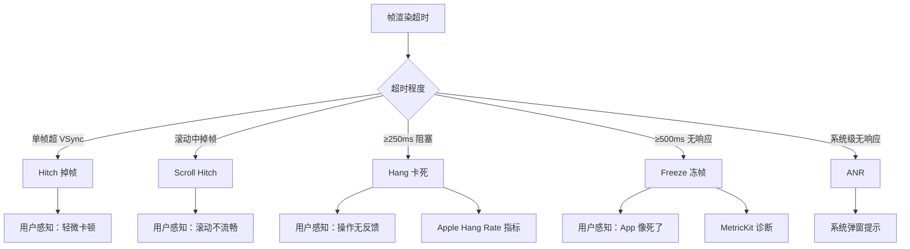
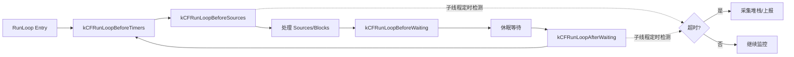
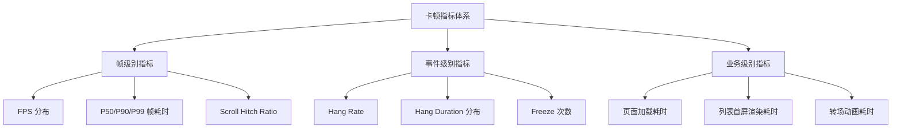

# 卡顿检测与分析技术深度解析

> 全面掌握 iOS 卡顿检测方案：从 RunLoop Observer 到 MetricKit，从帧率监控到堆栈采样，建立系统化的卡顿分析能力

---

## 目录

- [核心结论 TL;DR](#核心结论-tldr)
- [第一部分：卡顿定义与分级](#第一部分卡顿定义与分级)
- [第二部分：卡顿对用户体验的影响](#第二部分卡顿对用户体验的影响)
- [第三部分：检测方案详解](#第三部分检测方案详解)
- [第四部分：堆栈采样与归因](#第四部分堆栈采样与归因)
- [第五部分：卡顿指标体系](#第五部分卡顿指标体系)
- [最佳实践](#最佳实践)
- [常见陷阱](#常见陷阱)
- [面试考点](#面试考点)
- [参考资源](#参考资源)

---

## 核心结论 TL;DR

| 维度 | 核心洞察 |
|------|----------|
| **卡顿本质** | 主线程单帧耗时超过 VSync 周期（16.67ms@60fps / 8.33ms@120fps），导致掉帧或无响应 |
| **分级体系** | Hitch（掉帧）→ Scroll Hitch（滚动掉帧）→ Hang（≥250ms 阻塞）→ Freeze（≥500ms 冻帧） |
| **线上检测首选** | RunLoop Observer 监控主线程 + MetricKit 系统级诊断，二者互补 |
| **线下分析利器** | Instruments Time Profiler + os_signpost，精确定位热点函数 |
| **堆栈归因** | 子线程定频采样 + 聚合分析 + 火焰图可视化，定位 Top-N 热点 |
| **指标体系** | Scroll Hitch Ratio + Hang Rate + P50/P90/P99 帧耗时，构建完整度量 |

---

## 第一部分：卡顿定义与分级

### 1.1 帧率基础与 VSync 周期

**结论先行**：卡顿的本质是单帧渲染耗时超过 VSync 周期，导致显示内容无法按时更新。

iOS 设备的刷新率与对应时间预算：

| 设备类型 | 刷新率 | 帧时间预算 | 代表设备 |
|----------|--------|-----------|----------|
| 标准设备 | 60 Hz | 16.67 ms | iPhone SE、iPad 基础款 |
| ProMotion | 120 Hz | 8.33 ms | iPhone 13 Pro+、iPad Pro |
| 动态刷新 | 1-120 Hz | 自适应 | iPhone 14 Pro+（AOD） |

> **关键认知**：ProMotion 设备的帧时间预算仅为标准设备的一半，意味着对渲染性能要求更高。但 ProMotion 的动态刷新率也意味着系统会根据内容变化自动调整刷新率。

### 1.2 卡顿分级体系

**结论先行**：Apple 对卡顿有明确的分级定义，不同级别对应不同的检测策略和优化优先级。



**各级别详细定义**：

#### Hitch（掉帧）

单帧耗时超过 VSync 周期，导致该帧被延迟显示或丢弃。

```
正常帧序列：  |Frame1|Frame2|Frame3|Frame4|Frame5|
              0ms   16ms   33ms   50ms   66ms   83ms

掉帧场景：    |Frame1|  Frame2(超时)  |Frame3|Frame4|
              0ms   16ms   33ms   50ms   66ms   83ms
                     ↑ Frame2 耗时 25ms，错过第二个 VSync
```

#### Scroll Hitch（滚动掉帧）

滚动过程中发生的掉帧，用户感知最敏感的卡顿类型。

#### Hang（卡死）— Apple 定义 ≥250ms

主线程被阻塞 250ms 以上，用户操作完全无响应。iOS 16+ Apple 进一步细分：

| Hang 类型 | 持续时间 | 严重程度 |
|-----------|---------|---------|
| Micro Hang | 250ms - 500ms | 低 |
| Hang | 500ms - 2s | 中 |
| Severe Hang | 2s - 5s | 高 |
| Critical Hang | > 5s | 极高 |

#### Freeze（冻帧）— ≥500ms 无响应

App 完全冻结，UI 无法响应任何交互。

#### ANR（Application Not Responding）

系统级检测，当 App 长时间无响应时系统可能强制终止。

### 1.3 Hitch Time 与 Hitch Ratio

**结论先行**：Hitch Ratio 比绝对帧率更能反映真实的流畅度体验。

```
Hitch Time = 帧实际耗时 - VSync 周期
Hitch Ratio = 总 Hitch Time / 总滚动持续时间（ms/s）
```

| Hitch Ratio | 质量评级 | 用户感知 |
|-------------|---------|---------|
| < 5 ms/s | 优秀 | 丝滑流畅 |
| 5 - 10 ms/s | 警告 | 偶尔卡顿 |
| > 10 ms/s | 严重 | 明显不流畅 |

```swift
// ✅ Hitch Ratio 计算示例
func calculateHitchRatio(frameDurations: [TimeInterval], vsyncInterval: TimeInterval, scrollDuration: TimeInterval) -> Double {
    var totalHitchTime: TimeInterval = 0
    for duration in frameDurations {
        let hitchTime = max(0, duration - vsyncInterval)
        totalHitchTime += hitchTime
    }
    // 单位：ms/s
    return (totalHitchTime * 1000) / scrollDuration
}
```

---

## 第二部分：卡顿对用户体验的影响

### 2.1 流畅度感知阈值

**结论先行**：人眼对帧率下降的感知是非线性的，60fps→30fps 的体验劣化远大于 120fps→60fps。

| 帧率区间 | 用户感知 | 场景适用性 |
|----------|---------|-----------|
| 120 fps | 极致丝滑 | ProMotion 设备滚动/动画 |
| 60 fps | 流畅 | 标准交互与动画 |
| 45 fps | 轻微卡顿 | 可接受但非最优 |
| 30 fps | 明显卡顿 | 视频播放尚可，交互体验差 |
| < 24 fps | 严重卡顿 | 不可接受 |

### 2.2 卡顿与用户留存的关系

- **首次启动卡顿**：用户流失率增加 20%+
- **列表滚动卡顿**：用户使用时长下降 15%+
- **转场动画卡顿**：用户对 App 质量评价显著下降

### 2.3 Apple 的 Hang Rate 与 App Store 质量标准

Apple 在 Xcode Organizer 中提供 Hang Rate 指标：

- **Hang Rate** = 每小时 Hang 次数
- App Store 质量标准：Hang Rate 应低于 1 次/小时
- iOS 16+ 的 `MXHangDiagnostic` 可采集详细 Hang 信息

---

## 第三部分：检测方案详解

### 3.1 RunLoop Observer 监控

**结论先行**：RunLoop Observer 是最经典的线上卡顿检测方案，通过监控主线程 RunLoop 状态切换耗时来判定卡顿。

**原理**：监控 `kCFRunLoopBeforeSources` 与 `kCFRunLoopAfterWaiting` 之间的耗时，超过阈值则判定为卡顿。



```swift
// ✅ 推荐：Swift RunLoop Observer 卡顿监控完整实现
final class ANRDetector {
    
    static let shared = ANRDetector()
    
    private var observer: CFRunLoopObserver?
    private var semaphore: DispatchSemaphore = DispatchSemaphore(value: 0)
    private var activity: CFRunLoopActivity = .entry
    private var isMonitoring = false
    
    /// 卡顿阈值（毫秒）
    var threshold: TimeInterval = 250
    
    func startMonitoring() {
        guard !isMonitoring else { return }
        isMonitoring = true
        
        // 1. 创建 RunLoop Observer
        let observer = CFRunLoopObserverCreateWithHandler(
            kCFAllocatorDefault,
            CFRunLoopActivity.allActivities.rawValue,
            true,  // 重复
            0      // 优先级
        ) { [weak self] _, activity in
            self?.activity = activity
            self?.semaphore.signal()
        }
        
        self.observer = observer
        CFRunLoopAddObserver(CFRunLoopGetMain(), observer, .commonModes)
        
        // 2. 子线程定时检查
        DispatchQueue.global(qos: .userInitiated).async { [weak self] in
            self?.monitorLoop()
        }
    }
    
    private func monitorLoop() {
        while isMonitoring {
            // 等待信号量，超时即判定为卡顿
            let timeout = semaphore.wait(timeout: .now() + threshold / 1000.0)
            
            if timeout == .timedOut {
                // 检查是否处于耗时阶段
                if activity == .beforeSources || activity == .afterWaiting {
                    // 采集主线程堆栈
                    let callStack = Thread.callStackSymbols
                    reportHang(callStack: callStack, duration: threshold)
                }
            }
        }
    }
    
    private func reportHang(callStack: [String], duration: TimeInterval) {
        // 上报卡顿信息
        print("⚠️ Hang detected: \(duration)ms")
        print("Call stack:\n\(callStack.joined(separator: "\n"))")
    }
    
    func stopMonitoring() {
        isMonitoring = false
        if let observer = observer {
            CFRunLoopRemoveObserver(CFRunLoopGetMain(), observer, .commonModes)
        }
        observer = nil
    }
}
```

```objectivec
// ✅ 推荐：ObjC RunLoop Observer 卡顿监控实现
@interface ANRDetector : NSObject
@property (nonatomic, assign) CFRunLoopObserverRef observer;
@property (nonatomic, strong) dispatch_semaphore_t semaphore;
@property (nonatomic, assign) CFRunLoopActivity currentActivity;
@property (nonatomic, assign) BOOL isMonitoring;
@property (nonatomic, assign) NSTimeInterval threshold; // 毫秒
@end

@implementation ANRDetector

+ (instancetype)sharedInstance {
    static ANRDetector *instance;
    static dispatch_once_t onceToken;
    dispatch_once(&onceToken, ^{ instance = [[self alloc] init]; });
    return instance;
}

- (void)startMonitoring {
    if (self.isMonitoring) return;
    self.isMonitoring = YES;
    self.threshold = 250;
    self.semaphore = dispatch_semaphore_create(0);
    
    __weak typeof(self) weakSelf = self;
    self.observer = CFRunLoopObserverCreateWithHandler(
        kCFAllocatorDefault,
        kCFRunLoopAllActivities,
        YES, 0,
        ^(CFRunLoopObserverRef observer, CFRunLoopActivity activity) {
            weakSelf.currentActivity = activity;
            dispatch_semaphore_signal(weakSelf.semaphore);
        }
    );
    CFRunLoopAddObserver(CFRunLoopGetMain(), self.observer, kCFRunLoopCommonModes);
    
    dispatch_async(dispatch_get_global_queue(QOS_CLASS_USER_INITIATED, 0), ^{
        [weakSelf monitorLoop];
    });
}

- (void)monitorLoop {
    while (self.isMonitoring) {
        long result = dispatch_semaphore_wait(
            self.semaphore,
            dispatch_time(DISPATCH_TIME_NOW, (int64_t)(self.threshold * NSEC_PER_MSEC))
        );
        if (result != 0) {
            if (self.currentActivity == kCFRunLoopBeforeSources ||
                self.currentActivity == kCFRunLoopAfterWaiting) {
                // 采集堆栈并上报
                NSArray<NSString *> *callStack = [NSThread callStackSymbols];
                [self reportHangWithCallStack:callStack duration:self.threshold];
            }
        }
    }
}
@end
```

**优缺点分析**：

| 维度 | 说明 |
|------|------|
| ✅ 优点 | 无侵入、可定制阈值、线上可用、实现简单 |
| ❌ 缺点 | 粒度粗（只能判断是否卡顿，不能精确到哪一帧）、存在假阳性 |
| ⚠️ 注意 | `Thread.callStackSymbols` 不是异步安全的，高频调用有性能开销 |

### 3.2 CADisplayLink 帧率监控

**结论先行**：CADisplayLink 通过监听屏幕刷新回调来计算实际帧率，适合开发阶段的 FPS 悬浮窗展示。

```swift
// ✅ 推荐：FPS 监控悬浮窗实现
final class FPSMonitor {
    
    private var displayLink: CADisplayLink?
    private var lastTimestamp: CFTimeInterval = 0
    private var frameCount: Int = 0
    private var fps: Double = 0
    
    var onFPSUpdate: ((Double) -> Void)?
    
    func start() {
        displayLink = CADisplayLink(target: self, selector: #selector(tick(_:)))
        displayLink?.add(to: .main, forMode: .common)
    }
    
    @objc private func tick(_ link: CADisplayLink) {
        if lastTimestamp == 0 {
            lastTimestamp = link.timestamp
            return
        }
        
        frameCount += 1
        let elapsed = link.timestamp - lastTimestamp
        
        // 每秒更新一次 FPS
        if elapsed >= 1.0 {
            fps = Double(frameCount) / elapsed
            frameCount = 0
            lastTimestamp = link.timestamp
            onFPSUpdate?(fps)
        }
    }
    
    func stop() {
        displayLink?.invalidate()
        displayLink = nil
    }
}

// 使用示例：FPS 悬浮窗
final class FPSLabel: UILabel {
    private let monitor = FPSMonitor()
    
    override init(frame: CGRect) {
        super.init(frame: frame)
        setupUI()
        monitor.onFPSUpdate = { [weak self] fps in
            self?.text = String(format: "%.0f FPS", fps)
            self?.textColor = fps >= 55 ? .green : (fps >= 30 ? .yellow : .red)
        }
        monitor.start()
    }
    
    required init?(coder: NSCoder) { fatalError() }
    
    private func setupUI() {
        font = .monospacedSystemFont(ofSize: 14, weight: .semibold)
        textAlignment = .center
        backgroundColor = UIColor.black.withAlphaComponent(0.7)
        layer.cornerRadius = 5
        clipsToBounds = true
    }
}
```

```objectivec
// ✅ ObjC 版本
@interface FPSMonitor : NSObject
@property (nonatomic, strong) CADisplayLink *displayLink;
@property (nonatomic, assign) CFTimeInterval lastTimestamp;
@property (nonatomic, assign) NSInteger frameCount;
@property (nonatomic, copy) void (^onFPSUpdate)(double fps);
@end

@implementation FPSMonitor
- (void)start {
    self.displayLink = [CADisplayLink displayLinkWithTarget:self selector:@selector(tick:)];
    [self.displayLink addToRunLoop:[NSRunLoop mainRunLoop] forMode:NSRunLoopCommonModes];
}

- (void)tick:(CADisplayLink *)link {
    if (self.lastTimestamp == 0) {
        self.lastTimestamp = link.timestamp;
        return;
    }
    self.frameCount++;
    CFTimeInterval elapsed = link.timestamp - self.lastTimestamp;
    if (elapsed >= 1.0) {
        double fps = (double)self.frameCount / elapsed;
        self.frameCount = 0;
        self.lastTimestamp = link.timestamp;
        if (self.onFPSUpdate) self.onFPSUpdate(fps);
    }
}
@end
```

### 3.3 MetricKit MXHangDiagnostic（iOS 14+）

**结论先行**：MetricKit 是 Apple 官方的系统级性能诊断框架，可以在线上自动采集 Hang 诊断信息，是最权威的卡顿数据来源。

```swift
// ✅ 推荐：MetricKit 订阅与解析
import MetricKit

final class HangDiagnosticSubscriber: NSObject, MXMetricManagerSubscriber {
    
    func start() {
        MXMetricManager.shared.add(self)
    }
    
    // iOS 14+：接收 Diagnostic Payload
    func didReceive(_ payloads: [MXDiagnosticPayload]) {
        for payload in payloads {
            // Hang 诊断
            if let hangDiagnostics = payload.hangDiagnostics {
                for diagnostic in hangDiagnostics {
                    let duration = diagnostic.hangDuration
                    let callStackTree = diagnostic.callStackTree
                    
                    // 解析 Call Stack Tree
                    let jsonData = callStackTree.jsonRepresentation()
                    processHangDiagnostic(duration: duration, stackData: jsonData)
                }
            }
        }
    }
    
    // iOS 13+：接收 Metric Payload
    func didReceive(_ payloads: [MXMetricPayload]) {
        for payload in payloads {
            if let animationMetrics = payload.animationMetrics {
                let scrollHitchRate = animationMetrics.scrollHitchTimeRatio
                print("Scroll Hitch Ratio: \(scrollHitchRate)")
            }
        }
    }
    
    private func processHangDiagnostic(duration: Measurement<UnitDuration>, stackData: Data) {
        // 解析并上报到后端
        let durationMs = duration.converted(to: .milliseconds).value
        print("Hang Duration: \(durationMs)ms")
        
        if let json = try? JSONSerialization.jsonObject(with: stackData) as? [String: Any] {
            // 解析 callStacks 数组
            // 每个 callStack 包含 threadAttributed、callStackRootFrames
            print("Stack Tree: \(json)")
        }
    }
}
```

**MetricKit Diagnostic Payload 结构**：

```
MXDiagnosticPayload
├── hangDiagnostics: [MXHangDiagnostic]
│   ├── hangDuration: Measurement<UnitDuration>
│   └── callStackTree: MXCallStackTree
│       └── jsonRepresentation() → Data
│           ├── callStacks: [CallStack]
│           │   ├── threadAttributed: Bool
│           │   └── callStackRootFrames: [Frame]
│           │       ├── binaryUUID
│           │       ├── offsetIntoBinaryTextSegment
│           │       ├── binaryName
│           │       └── address
│           └── callStackPerThread: Bool
├── cpuExceptionDiagnostics
├── diskWriteExceptionDiagnostics
└── crashDiagnostics
```

### 3.4 Instruments Time Profiler

**结论先行**：Time Profiler 是线下分析卡顿的首选工具，可以精确定位主线程的热点函数和调用链。

**配置与使用最佳实践**：

1. **Recording Settings**：
   - High Frequency Recording: 开启（1ms 采样间隔）
   - Record Waiting Threads: 关闭（减少噪音）
   - Deferred Mode: 开启（减少对目标进程的干扰）

2. **Call Tree 解读技巧**：
   - **Self Weight**：函数自身耗时（不含子函数调用）
   - **Weight**：函数总耗时（含子函数调用）
   - 勾选 **Separate by Thread** → 聚焦主线程
   - 勾选 **Invert Call Tree** → 快速定位叶子函数
   - 勾选 **Hide System Libraries** → 过滤系统调用
   - 使用 **Heaviest Stack Trace** → 直接看最耗时调用链

3. **分析流程**：
   - 触发卡顿场景 → 选中时间区间 → 查看 Call Tree
   - 按 Weight 排序 → 找到耗时最大的自定义函数
   - 双击进入源码 → 定位具体行

### 3.5 os_signpost + Instruments

**结论先行**：os_signpost 允许在代码中标记关键路径，配合 Instruments Points of Interest 模板实现精确的性能分析。

```swift
// ✅ 推荐：os_signpost 关键路径标记
import os.signpost

extension OSLog {
    static let performance = OSLog(subsystem: "com.app.performance", category: "UI")
}

final class CellRenderer {
    
    private let signpostLog = OSLog.performance
    
    func configureCell(_ cell: UITableViewCell, with model: CellModel) {
        let signpostID = OSSignpostID(log: signpostLog)
        
        // 标记开始
        os_signpost(.begin, log: signpostLog, name: "CellConfigure", signpostID: signpostID,
                    "cell: %{public}s", model.identifier)
        
        // Layout 阶段
        os_signpost(.begin, log: signpostLog, name: "CellLayout", signpostID: signpostID)
        cell.textLabel?.text = model.title
        cell.detailTextLabel?.text = model.subtitle
        os_signpost(.end, log: signpostLog, name: "CellLayout", signpostID: signpostID)
        
        // Image 阶段
        os_signpost(.begin, log: signpostLog, name: "CellImage", signpostID: signpostID)
        cell.imageView?.image = model.thumbnailImage
        os_signpost(.end, log: signpostLog, name: "CellImage", signpostID: signpostID)
        
        // 标记结束
        os_signpost(.end, log: signpostLog, name: "CellConfigure", signpostID: signpostID)
    }
}
```

```objectivec
// ✅ ObjC 版本
#import <os/signpost.h>

static os_log_t performanceLog(void) {
    static os_log_t log;
    static dispatch_once_t onceToken;
    dispatch_once(&onceToken, ^{
        log = os_log_create("com.app.performance", "UI");
    });
    return log;
}

- (void)configureCell:(UITableViewCell *)cell withModel:(CellModel *)model {
    os_signpost_id_t spid = os_signpost_id_generate(performanceLog());
    
    os_signpost_interval_begin(performanceLog(), spid, "CellConfigure",
                               "cell: %{public}s", model.identifier.UTF8String);
    
    cell.textLabel.text = model.title;
    cell.imageView.image = model.thumbnailImage;
    
    os_signpost_interval_end(performanceLog(), spid, "CellConfigure");
}
```

### 3.6 检测方案对比

| 方案 | 检测精度 | 性能开销 | 线上可用 | 适用场景 |
|------|---------|---------|---------|---------|
| **RunLoop Observer** | 中（250ms 级） | 极低 | ✅ | 线上 Hang 检测 |
| **CADisplayLink** | 高（帧级别） | 低 | ⚠️ 仅 Debug | 开发阶段 FPS 监控 |
| **MetricKit** | 高（系统级） | 零（系统采集） | ✅ | 线上诊断数据收集 |
| **Time Profiler** | 极高（1ms 级） | 高 | ❌ | 线下精确分析 |
| **os_signpost** | 极高（自定义） | 低（Release 自动关闭） | ❌ | 线下关键路径标记 |
| **堆栈采样** | 中-高 | 中 | ✅ | 线上热点归因 |

---

## 第四部分：堆栈采样与归因

### 4.1 backtrace / backtrace_symbols

**结论先行**：`backtrace` 是最基础的堆栈采集 API，但不是异步信号安全的，不适合在 signal handler 中使用。

```swift
// ✅ 基础堆栈采集
import Darwin

func captureBacktrace() -> [String] {
    var callStack = [UnsafeMutableRawPointer?](repeating: nil, count: 128)
    let frameCount = backtrace(&callStack, Int32(callStack.count))
    
    if let symbols = backtrace_symbols(&callStack, frameCount) {
        defer { free(symbols) }
        return (0..<Int(frameCount)).map { String(cString: symbols[$0]) }
    }
    return []
}
```

```objectivec
// ✅ ObjC 版本
#include <execinfo.h>

- (NSArray<NSString *> *)captureBacktrace {
    void *callStack[128];
    int frameCount = backtrace(callStack, 128);
    char **symbols = backtrace_symbols(callStack, frameCount);
    
    NSMutableArray *result = [NSMutableArray array];
    for (int i = 0; i < frameCount; i++) {
        [result addObject:@(symbols[i])];
    }
    free(symbols);
    return result;
}
```

### 4.2 PLCrashReporter 异步安全采样

**结论先行**：PLCrashReporter 提供异步信号安全的堆栈采集，适合在子线程对主线程进行采样。

```objectivec
// ✅ 推荐：使用 PLCrashReporter 采集主线程堆栈
#import <CrashReporter/CrashReporter.h>

- (void)sampleMainThreadStack {
    // 获取主线程的 thread port
    thread_act_array_t threads;
    mach_msg_type_number_t threadCount;
    task_threads(mach_task_self(), &threads, &threadCount);
    
    // 第一个线程通常是主线程
    thread_t mainThread = threads[0];
    
    // 使用 PLCrashReporter 的异步安全 API 采集堆栈
    plcrash_async_thread_state_t threadState;
    plcrash_async_thread_state_mach_thread_init(&threadState, mainThread);
    
    // 遍历帧
    // ... 使用 compact unwind / DWARF 解析调用栈
    
    // 释放
    for (mach_msg_type_number_t i = 0; i < threadCount; i++) {
        mach_port_deallocate(mach_task_self(), threads[i]);
    }
    vm_deallocate(mach_task_self(), (vm_address_t)threads,
                  threadCount * sizeof(thread_act_t));
}
```

### 4.3 采样频率与性能权衡

| 采样间隔 | 精度 | CPU 开销 | 适用场景 |
|----------|------|---------|---------|
| 10 ms | 高 | ~5% CPU | 短时间精确分析 |
| 50 ms | 中 | ~1% CPU | 线上常规监控 |
| 100 ms | 低 | < 0.5% CPU | 线上长期采集 |

> **推荐策略**：线上使用 100ms 采样间隔，检测到卡顿时动态提升到 10ms 精细采样。

### 4.4 堆栈聚合与 Top-N 热点分析

```swift
// ✅ 堆栈聚合算法
final class StackAggregator {
    
    /// 堆栈 → 出现次数
    private var stackMap: [String: Int] = [:]
    
    func addSample(_ stack: [String]) {
        // 取 Top 5 帧作为堆栈指纹
        let fingerprint = stack.prefix(5).joined(separator: "\n")
        stackMap[fingerprint, default: 0] += 1
    }
    
    /// 返回出现频率最高的 Top-N 堆栈
    func topN(_ n: Int) -> [(stack: String, count: Int)] {
        return stackMap
            .sorted { $0.value > $1.value }
            .prefix(n)
            .map { (stack: $0.key, count: $0.value) }
    }
}
```

### 4.5 火焰图（Flame Graph）生成与解读

火焰图是堆栈聚合的可视化表示：

```
解读方式：
- X 轴：堆栈函数名（按字母排序，不代表时间顺序）
- Y 轴：调用栈深度（越上层越是调用者）
- 宽度：函数在采样中出现的频率（越宽=越热）

关注点：
1. 宽度最大的"平台"（plateau）→ 最可能的性能瓶颈
2. 主线程上宽度大的非系统函数 → 优化目标
3. 锯齿形的窄条 → 调用栈深但不一定是瓶颈
```

**工具链**：
- **Instruments** → Export → 使用 FlameGraph 工具可视化
- **Brendan Gregg 的 FlameGraph 脚本**：将采样数据转换为 SVG 火焰图
- **Xcode 14+ 的 Flame Graph 视图**：Time Profiler 内置

---

## 第五部分：卡顿指标体系

### 5.1 核心指标定义



| 指标名称 | 计算方式 | 优秀标准 | 告警阈值 |
|----------|---------|---------|---------|
| Scroll Hitch Ratio | 总 Hitch Time / 滚动时长 | < 5 ms/s | > 10 ms/s |
| Hang Rate | Hang 次数 / 使用小时数 | < 1 次/h | > 3 次/h |
| P50 帧耗时 | 50% 分位帧耗时 | < 8 ms | > 16 ms |
| P90 帧耗时 | 90% 分位帧耗时 | < 16 ms | > 33 ms |
| P99 帧耗时 | 99% 分位帧耗时 | < 33 ms | > 50 ms |

### 5.2 FPS Distribution

```swift
// ✅ FPS 分布统计
final class FPSDistribution {
    
    private var buckets: [String: Int] = [
        "0-15":  0,
        "15-30": 0,
        "30-45": 0,
        "45-55": 0,
        "55-60": 0,
        "60+":   0
    ]
    
    func record(fps: Double) {
        switch fps {
        case ..<15:  buckets["0-15", default: 0] += 1
        case 15..<30: buckets["15-30", default: 0] += 1
        case 30..<45: buckets["30-45", default: 0] += 1
        case 45..<55: buckets["45-55", default: 0] += 1
        case 55..<60: buckets["55-60", default: 0] += 1
        default:      buckets["60+", default: 0] += 1
        }
    }
    
    var distribution: [String: Double] {
        let total = Double(buckets.values.reduce(0, +))
        guard total > 0 else { return [:] }
        return buckets.mapValues { Double($0) / total * 100 }
    }
}
```

### 5.3 指标采集与上报方案

**采集层设计**：

```
┌─────────────────────────────────────────────────┐
│  业务层                                          │
│  页面耗时 / 列表首屏 / 转场动画                    │
├─────────────────────────────────────────────────┤
│  采集层                                          │
│  RunLoop Monitor + CADisplayLink + MetricKit     │
├─────────────────────────────────────────────────┤
│  聚合层                                          │
│  堆栈聚合 + 分位数计算 + 采样率控制                 │
├─────────────────────────────────────────────────┤
│  上报层                                          │
│  批量上报 + 压缩 + 符号化                          │
└─────────────────────────────────────────────────┘
```

---

## 最佳实践

### ✅ 推荐做法

1. **分层监控**：线上用 RunLoop Observer + MetricKit 采集，线下用 Instruments 深入分析
2. **动态采样**：正常时低频（100ms），检测到卡顿时提升到高频（10ms）
3. **指标分级**：区分 P50/P90/P99，避免只看平均值掩盖长尾问题
4. **堆栈聚合**：相同堆栈合并计数，只上报 Top-N 热点，减少数据量
5. **符号化前置**：在端上完成基础符号化，减少后端压力

### ❌ 避免做法

1. **避免只看 FPS 平均值**：60fps 平均值可能掩盖间歇性掉帧
2. **避免高频采样不降级**：10ms 采样在低端设备上本身会导致卡顿
3. **避免忽略 MetricKit**：这是 Apple 官方推荐的线上诊断方案
4. **避免主线程采集堆栈**：堆栈采集本身有开销，必须在子线程完成

---

## 常见陷阱

### 陷阱 1：RunLoop Observer 的假阳性

```swift
// ❌ 问题：App 进入后台时 RunLoop 活动减少，可能误报
// 子线程等待信号量超时，但 App 实际上处于后台
func monitorLoop() {
    while isMonitoring {
        let timeout = semaphore.wait(timeout: .now() + 0.25)
        if timeout == .timedOut {
            // 可能是后台导致的假阳性！
            reportHang() // ❌
        }
    }
}

// ✅ 修复：增加前后台状态判断
func monitorLoop() {
    while isMonitoring {
        let timeout = semaphore.wait(timeout: .now() + 0.25)
        if timeout == .timedOut {
            // 只在前台时报告
            if UIApplication.shared.applicationState == .active {
                reportHang() // ✅
            }
        }
    }
}
```

### 陷阱 2：CADisplayLink 在后台不回调

```swift
// ❌ CADisplayLink 在 App 进入后台后不再触发回调
// 恢复前台后首帧的 elapsed 会非常大，导致 FPS 计算错误

// ✅ 修复：重置计数器
@objc private func tick(_ link: CADisplayLink) {
    let elapsed = link.timestamp - lastTimestamp
    // 超过 1 秒间隔，说明可能是从后台恢复
    if elapsed > 1.0 {
        lastTimestamp = link.timestamp
        frameCount = 0
        return // 跳过这次计算
    }
    // ... 正常计算
}
```

### 陷阱 3：Thread.callStackSymbols 的线程安全

```swift
// ❌ 在子线程调用 Thread.callStackSymbols 获取的是子线程的堆栈
DispatchQueue.global().async {
    let stack = Thread.callStackSymbols // 这是子线程的堆栈！
}

// ✅ 正确做法：使用 Mach API 采集指定线程的堆栈
// 或使用 PLCrashReporter 的异步安全 API
```

---

## 面试考点

### Q1：iOS 中常见的卡顿检测方案有哪些？各有什么优缺点？

**答题要点**：
- RunLoop Observer：监控主线程状态切换耗时，线上可用但粒度粗
- CADisplayLink：帧级精度，适合开发阶段 FPS 监控
- MetricKit：系统级诊断，零开销，iOS 14+ 可用
- Time Profiler：线下最精确的分析工具
- 堆栈采样：子线程采样 + 聚合分析，线上归因

### Q2：RunLoop Observer 卡顿检测的原理是什么？

**答题要点**：
- 注册 RunLoop Observer 监听所有活动
- 子线程通过信号量等待主线程信号
- 超时未收到信号 → 主线程被阻塞 → 判定为卡顿
- 关键状态：`kCFRunLoopBeforeSources` 和 `kCFRunLoopAfterWaiting`

### Q3：Hitch Ratio 是什么？如何计算？

**答题要点**：
- Hitch Time = 帧耗时 - VSync 周期
- Hitch Ratio = 总 Hitch Time / 总滚动时长（单位 ms/s）
- Apple 标准：< 5 ms/s 优秀，> 10 ms/s 严重
- 比 FPS 更准确地反映滚动流畅度

### Q4：如何在线上采集主线程的卡顿堆栈？

**答题要点**：
- 子线程定频采样主线程堆栈（100ms 常规 / 10ms 精细）
- 使用 Mach API 或 PLCrashReporter 获取指定线程堆栈
- 堆栈聚合 + Top-N 分析，减少数据量
- 注意异步信号安全，避免使用 `Thread.callStackSymbols`

### Q5：MetricKit 能提供哪些卡顿相关的诊断信息？

**答题要点**：
- `MXHangDiagnostic`：Hang 时长 + Call Stack Tree
- `MXAnimationMetric`：Scroll Hitch Time Ratio
- 系统自动采集，零运行时开销
- 24 小时延迟上报，不适合实时监控

---

## 参考资源

### Apple 官方文档
- [Understanding Hangs in Your App - WWDC 2022](https://developer.apple.com/videos/play/wwdc2022/10082/)
- [Improving App Responsiveness - WWDC 2023](https://developer.apple.com/videos/play/wwdc2023/10170/)
- [MetricKit Documentation](https://developer.apple.com/documentation/metrickit)
- [Instruments Help - Time Profiler](https://help.apple.com/instruments/mac/current/)

### 开源工具
- [PLCrashReporter](https://github.com/microsoft/plcrashreporter) — 异步安全的崩溃报告框架
- [GCDWebServer](https://github.com/nicklama/GCDWebServer) — 用于本地调试的 Web 服务器
- [Brendan Gregg FlameGraph](https://github.com/brendangregg/FlameGraph) — 火焰图生成工具

### 交叉引用
- [渲染性能与能耗优化](../../iOS_Framework_Architecture/06_性能优化框架/渲染性能与能耗优化_详细解析.md)
- [渲染性能优化与流畅度治理](./渲染性能优化与流畅度治理_详细解析.md)
