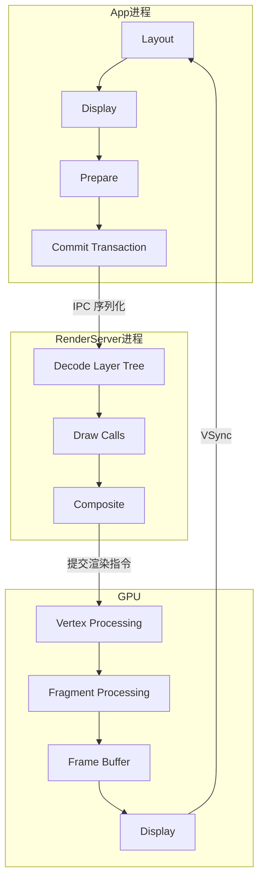
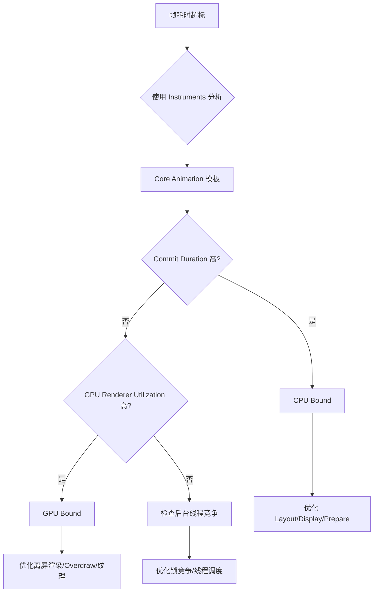
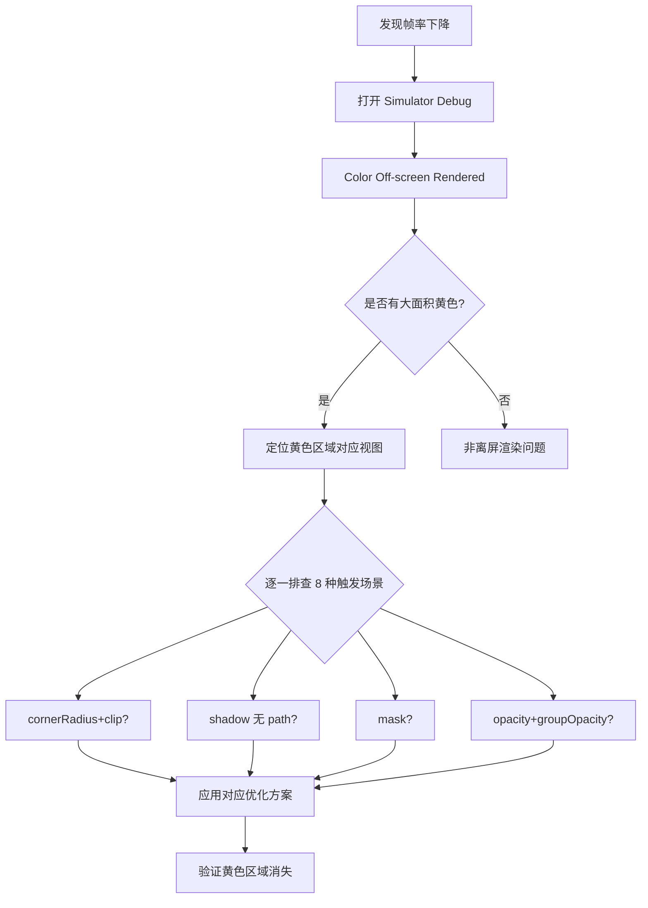
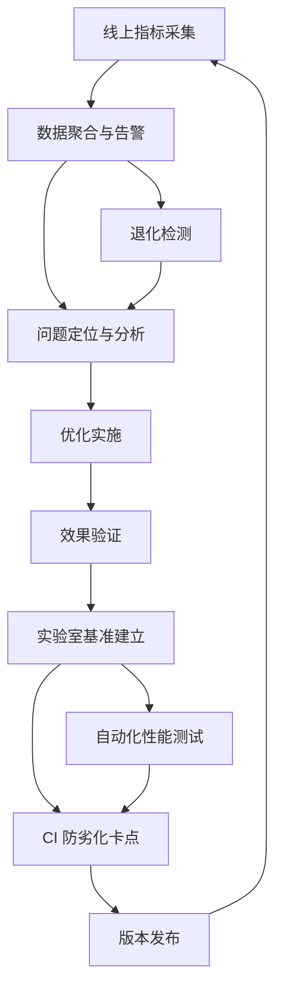

# 渲染性能优化与流畅度治理深度解析

> 从 Core Animation 渲染管线到离屏渲染治理，从主线程优化到列表滚动调优，建立完整的流畅度治理体系

---

## 目录

- [核心结论 TL;DR](#核心结论-tldr)
- [第一部分：Core Animation 渲染管线](#第一部分core-animation-渲染管线)
- [第二部分：渲染瓶颈分析方法论](#第二部分渲染瓶颈分析方法论)
- [第三部分：离屏渲染治理](#第三部分离屏渲染治理)
- [第四部分：主线程阻塞治理](#第四部分主线程阻塞治理)
- [第五部分：列表滚动优化](#第五部分列表滚动优化)
- [第六部分：动画性能优化](#第六部分动画性能优化)
- [第七部分：流畅度治理体系](#第七部分流畅度治理体系)
- [最佳实践](#最佳实践)
- [常见陷阱](#常见陷阱)
- [面试考点](#面试考点)
- [参考资源](#参考资源)

---

## 核心结论 TL;DR

| 维度 | 核心洞察 |
|------|----------|
| **渲染管线** | App 进程 Commit（Layout→Display→Prepare→Commit）→ Render Server 合成 → GPU 渲染，任一阶段超时即掉帧 |
| **瓶颈定位** | CPU Bound 看 Commit Phase，GPU Bound 看 Render Phase；Instruments Core Animation 模板可区分 |
| **离屏渲染** | 8 种触发场景需逐一排查，cornerRadius + clipsToBounds 是最常见的性能杀手 |
| **主线程治理** | I/O 迁移 + 锁优化 + 大数据异步化，三板斧解决 90% 的主线程阻塞 |
| **列表优化** | Cell 预计算 + 异步绘制 + 预加载 + 图片优化，四维联动提升滚动流畅度 |
| **治理闭环** | 线上指标采集 → 实验室基准 → 持续监控 → CI 防劣化，形成完整闭环 |

---

## 第一部分：Core Animation 渲染管线

### 1.1 完整渲染流程

**结论先行**：iOS 的渲染流程跨越 App 进程、Render Server 进程和 GPU 三个阶段，理解完整管线是性能优化的基础。



**各阶段详细职责**：

#### App 进程 — Commit Phase

| 阶段 | 职责 | 常见耗时原因 |
|------|------|------------|
| **Layout** | 调用 `layoutSubviews`，计算视图层级的 frame | 视图层级过深、Auto Layout 约束复杂 |
| **Display** | 调用 `drawRect:`，生成绘制指令 | 自定义绘制逻辑复杂、CoreGraphics 操作 |
| **Prepare** | 图片解码、格式转换 | 大图片首次显示的解码开销 |
| **Commit** | 将 Layer Tree 打包序列化，通过 IPC 发送给 Render Server | Layer 数量过多、属性变更频繁 |

```swift
// ✅ 理解各阶段触发时机
class CustomView: UIView {
    
    // Layout 阶段 — 布局计算
    override func layoutSubviews() {
        super.layoutSubviews()
        // ⚠️ 此方法在每个渲染周期的 Layout 阶段被调用
        // 避免在此做复杂计算
    }
    
    // Display 阶段 — 自定义绘制
    override func draw(_ rect: CGRect) {
        // ⚠️ 此方法在 Display 阶段被调用
        // 绘制内容会被缓存到 backing store
        // 避免不必要的重写（默认不实现时使用 CALayer 直接合成）
    }
}
```

#### Render Server — Render Phase

Render Server 是一个独立进程（`backboardd`），负责：

1. **Decode**：反序列化 App 传来的 Layer Tree
2. **Draw**：生成 GPU 渲染指令（Draw Calls）
3. **Composite**：层合成，处理透明度、遮罩、混合等

> **关键认知**：Render Server 运行在 App 进程之外，App 无法直接优化其耗时，只能通过减少 Layer 复杂度来间接优化。

#### GPU — 渲染执行

1. **Vertex Processing**：顶点变换（位置、旋转、缩放）
2. **Fragment Processing**：像素着色（纹理采样、混合、特效）
3. **Frame Buffer**：写入帧缓冲区，等待 VSync 信号显示

### 1.2 Commit Phase 耗时分析

```swift
// ✅ 使用 Instruments 分析 Commit Phase
// Instruments → Core Animation → 观察以下指标：
// - Commit Duration：整个 Commit 阶段耗时
// - Layout Duration：布局计算耗时
// - Display Duration：绘制耗时
// - Prepare Duration：图片准备耗时

// ❌ 避免：在 layoutSubviews 中触发新的布局
override func layoutSubviews() {
    super.layoutSubviews()
    // ❌ 这会触发额外的布局 pass
    someSubview.frame = calculateFrame()
    anotherSubview.setNeedsLayout() // 再次触发布局！
}

// ✅ 推荐：一次性完成布局计算
override func layoutSubviews() {
    super.layoutSubviews()
    let layout = calculateAllFrames()
    someSubview.frame = layout.someFrame
    anotherSubview.frame = layout.anotherFrame
}
```

### 1.3 Render Phase 耗时分析

GPU 瓶颈通常表现为：

- **Overdraw**：同一像素被多次绘制（半透明层叠加）
- **离屏渲染**：需要额外的帧缓冲区来完成合成
- **大纹理**：超过 GPU 纹理尺寸限制的图片

```objectivec
// ✅ Simulator Debug 工具检测 GPU 瓶颈
// Debug → Color Blended Layers — 检测透明混合（红色=混合区域）
// Debug → Color Off-screen Rendered — 检测离屏渲染（黄色=离屏渲染区域）
// Debug → Color Hits Green and Misses Red — 检测光栅化缓存命中
// Debug → Color Copied Images — 检测图片是否被 CPU 拷贝
```

---

## 第二部分：渲染瓶颈分析方法论

### 2.1 CPU Bound vs GPU Bound 判定

**结论先行**：区分 CPU Bound 和 GPU Bound 是优化方向选择的第一步。



**判定方法**：

| 指标 | CPU Bound 特征 | GPU Bound 特征 |
|------|---------------|---------------|
| Commit Duration | 高（> 8ms） | 正常（< 4ms） |
| GPU Renderer Utilization | 正常（< 50%） | 高（> 70%） |
| Time Profiler 热点 | 主线程有明显热点函数 | 主线程空闲 |
| Color Off-screen Rendered | 无大面积黄色 | 大面积黄色区域 |

### 2.2 Instruments Core Animation 模板使用

**关键指标**：

```
Core Animation 模板核心指标：
├── Frame Rate（帧率）— 实时 FPS
├── Commit Duration — App 进程 Commit 耗时
├── Render Server Duration — Render Server 耗时
├── GPU Duration — GPU 渲染耗时
└── Display Duration — 总帧耗时

分析步骤：
1. 录制包含卡顿的操作
2. 选中掉帧区间
3. 对比 Commit / Render Server / GPU 各阶段耗时
4. 定位瓶颈阶段
5. 使用对应工具深入分析
```

---

## 第三部分：离屏渲染治理

### 3.1 离屏渲染原理

**结论先行**：离屏渲染是 GPU 无法在当前帧缓冲区直接完成合成，需要开辟额外缓冲区进行中间处理，带来显著的性能开销。

```
正常渲染路径：
Layer → 帧缓冲区（On-screen Buffer）→ 显示

离屏渲染路径：
Layer → 离屏缓冲区（Off-screen Buffer）→ 合成回帧缓冲区 → 显示
              ↑ 额外的内存开辟 + 上下文切换开销
```

### 3.2 离屏渲染 8 种触发场景

#### 场景 1：cornerRadius + masksToBounds/clipsToBounds

**最常见的离屏渲染触发源**。

```swift
// ❌ 触发离屏渲染
imageView.layer.cornerRadius = 10
imageView.clipsToBounds = true  // 或 imageView.layer.masksToBounds = true

// ✅ 方案 A：预渲染圆角图片（推荐）
extension UIImage {
    func roundedImage(cornerRadius: CGFloat) -> UIImage {
        let rect = CGRect(origin: .zero, size: size)
        UIGraphicsBeginImageContextWithOptions(size, false, scale)
        UIBezierPath(roundedRect: rect, cornerRadius: cornerRadius).addClip()
        draw(in: rect)
        let result = UIGraphicsGetImageFromCurrentImageContext()
        UIGraphicsEndImageContext()
        return result ?? self
    }
}
// 在后台线程预处理
DispatchQueue.global().async {
    let rounded = originalImage.roundedImage(cornerRadius: 10)
    DispatchQueue.main.async {
        imageView.image = rounded
    }
}

// ✅ 方案 B：使用 CAShapeLayer 遮罩（适合纯色背景）
let maskLayer = CAShapeLayer()
maskLayer.path = UIBezierPath(roundedRect: imageView.bounds,
                               cornerRadius: 10).cgPath
imageView.layer.mask = maskLayer

// ✅ 方案 C：覆盖一张圆角遮罩图片（适合固定背景色）
let maskImageView = UIImageView(image: UIImage(named: "corner_mask"))
imageView.addSubview(maskImageView)

// ✅ 方案 D：iOS 13+ 使用 cornerCurve（仅限不裁剪内容时）
imageView.layer.cornerRadius = 10
imageView.layer.cornerCurve = .continuous  // 不触发离屏渲染（无 clipsToBounds）
```

```objectivec
// ✅ ObjC：预渲染圆角
- (UIImage *)roundedImageWithCornerRadius:(CGFloat)radius {
    CGRect rect = CGRectMake(0, 0, self.size.width, self.size.height);
    UIGraphicsBeginImageContextWithOptions(self.size, NO, self.scale);
    [[UIBezierPath bezierPathWithRoundedRect:rect cornerRadius:radius] addClip];
    [self drawInRect:rect];
    UIImage *result = UIGraphicsGetImageFromCurrentImageContext();
    UIGraphicsEndImageContext();
    return result;
}
```

#### 场景 2：shadow（shadowPath 未设置）

```swift
// ❌ 触发离屏渲染：系统需要遍历 Layer 内容计算阴影形状
view.layer.shadowColor = UIColor.black.cgColor
view.layer.shadowOffset = CGSize(width: 0, height: 2)
view.layer.shadowOpacity = 0.3
view.layer.shadowRadius = 4

// ✅ 设置 shadowPath，避免离屏渲染
view.layer.shadowPath = UIBezierPath(roundedRect: view.bounds,
                                      cornerRadius: view.layer.cornerRadius).cgPath
```

#### 场景 3：mask

```swift
// ❌ layer.mask 始终触发离屏渲染
let maskLayer = CALayer()
maskLayer.contents = maskImage.cgImage
view.layer.mask = maskLayer

// ✅ 如果遮罩形状简单，用 CAShapeLayer 的 path 裁剪
// 或者预渲染带遮罩的图片
```

#### 场景 4：allowsGroupOpacity + opacity < 1

```swift
// ❌ 当 layer 有子层且 allowsGroupOpacity = true 时
// opacity < 1 会触发离屏渲染
view.layer.allowsGroupOpacity = true  // 默认 true
view.alpha = 0.5  // 子层会先合成到离屏缓冲区

// ✅ 设置 allowsGroupOpacity = false
view.layer.allowsGroupOpacity = false
// 或者避免对包含子视图的容器设置透明度
```

#### 场景 5：shouldRasterize

```swift
// ⚠️ shouldRasterize 主动触发离屏渲染用于缓存
// 适用于内容不频繁变化的复杂视图
view.layer.shouldRasterize = true
view.layer.rasterizationScale = UIScreen.main.scale

// ✅ 使用条件：
// - 视图内容不频繁变化
// - 视图层级复杂（减少每帧合成开销）
// ❌ 避免条件：
// - 内容频繁变化（缓存频繁失效，反而更慢）
// - 100ms 内未命中缓存会被释放
```

#### 场景 6：特定 blur 效果

```swift
// ❌ UIVisualEffectView 的模糊效果有离屏渲染开销
let blurView = UIVisualEffectView(effect: UIBlurEffect(style: .light))

// ✅ 缓解策略：
// - 减小模糊视图尺寸
// - 使用 shouldRasterize 缓存
// - 考虑用模糊后的静态图片替代（非实时模糊场景）
```

#### 场景 7：复杂文本渲染

```swift
// ❌ 复杂的 NSAttributedString 可能触发离屏渲染
let attr = NSAttributedString(string: "Hello", attributes: [
    .strokeColor: UIColor.black,
    .strokeWidth: -3,  // 描边 + 填充
    .shadow: shadow     // 文本阴影
])

// ✅ 简化富文本属性，避免同时使用描边和阴影
```

#### 场景 8：drawRect: 自定义绘制

```swift
// ❌ 重写 draw(_:) 会创建额外的 backing store
override func draw(_ rect: CGRect) {
    // 自定义 CoreGraphics 绘制
    let context = UIGraphicsGetCurrentContext()
    // ...
}

// ✅ 优先使用 CALayer 属性实现视觉效果
// 只有确实需要自定义绘制时才重写 draw
// 考虑使用 CAShapeLayer / CAGradientLayer 替代
```

### 3.3 离屏渲染检测排查流程



---

## 第四部分：主线程阻塞治理

### 4.1 I/O 迁移

**结论先行**：所有 I/O 操作（文件、数据库、网络解析）必须在后台线程执行，主线程只负责 UI 更新。

```swift
// ❌ 主线程读文件
func loadConfig() {
    let data = try! Data(contentsOf: configURL) // 主线程 I/O
    let config = try! JSONDecoder().decode(Config.self, from: data)
    updateUI(with: config)
}

// ✅ 后台读文件 + 主线程更新 UI
func loadConfig() {
    DispatchQueue.global(qos: .userInitiated).async { [weak self] in
        guard let data = try? Data(contentsOf: configURL),
              let config = try? JSONDecoder().decode(Config.self, from: data) else { return }
        DispatchQueue.main.async {
            self?.updateUI(with: config)
        }
    }
}
```

```objectivec
// ❌ 主线程数据库操作
- (void)loadMessages {
    NSArray *messages = [self.database queryAllMessages]; // 主线程查询
    [self.tableView reloadData];
}

// ✅ 后台查询 + 主线程刷新
- (void)loadMessages {
    dispatch_async(dispatch_get_global_queue(QOS_CLASS_USER_INITIATED, 0), ^{
        NSArray *messages = [self.database queryAllMessages];
        dispatch_async(dispatch_get_main_queue(), ^{
            self.messages = messages;
            [self.tableView reloadData];
        });
    });
}
```

### 4.2 锁优化

```swift
// ❌ 粗粒度锁：整个操作加锁
class DataStore {
    private let lock = NSLock()
    private var cache: [String: Data] = [:]
    
    func processAndStore(key: String, raw: Data) {
        lock.lock()
        let processed = expensiveProcess(raw)  // ❌ 耗时操作在锁内
        cache[key] = processed
        lock.unlock()
    }
}

// ✅ 细粒度锁：只对共享资源加锁
class DataStore {
    private let lock = NSLock()
    private var cache: [String: Data] = [:]
    
    func processAndStore(key: String, raw: Data) {
        let processed = expensiveProcess(raw)  // 耗时操作在锁外
        lock.lock()
        cache[key] = processed                  // 只锁写入
        lock.unlock()
    }
}

// ✅ 读写锁：读多写少场景
class ThreadSafeCache<Key: Hashable, Value> {
    private var storage: [Key: Value] = [:]
    private let queue = DispatchQueue(label: "cache.queue", attributes: .concurrent)
    
    func read(_ key: Key) -> Value? {
        queue.sync { storage[key] }             // 并发读
    }
    
    func write(_ key: Key, value: Value) {
        queue.async(flags: .barrier) {          // 独占写
            self.storage[key] = value
        }
    }
}
```

```objectivec
// ✅ ObjC 读写锁
@interface ThreadSafeCache : NSObject
@property (nonatomic, strong) dispatch_queue_t queue;
@property (nonatomic, strong) NSMutableDictionary *storage;
@end

@implementation ThreadSafeCache
- (instancetype)init {
    self = [super init];
    if (self) {
        _queue = dispatch_queue_create("cache.queue", DISPATCH_QUEUE_CONCURRENT);
        _storage = [NSMutableDictionary dictionary];
    }
    return self;
}

- (id)objectForKey:(NSString *)key {
    __block id result;
    dispatch_sync(self.queue, ^{
        result = self.storage[key];  // 并发读
    });
    return result;
}

- (void)setObject:(id)obj forKey:(NSString *)key {
    dispatch_barrier_async(self.queue, ^{
        self.storage[key] = obj;     // 独占写
    });
}
@end
```

### 4.3 大数据处理异步化

```swift
// ❌ 主线程 JSON 解析
func handleResponse(_ data: Data) {
    let models = try! JSONDecoder().decode([Model].self, from: data) // 主线程解析
    self.dataSource = models
    tableView.reloadData()
}

// ✅ 后台解析 + 主线程更新
func handleResponse(_ data: Data) {
    DispatchQueue.global(qos: .userInitiated).async { [weak self] in
        guard let models = try? JSONDecoder().decode([Model].self, from: data) else { return }
        DispatchQueue.main.async {
            self?.dataSource = models
            self?.tableView.reloadData()
        }
    }
}

// ✅ 图片后台预解码
func preDecodeImage(_ image: UIImage) -> UIImage {
    guard let cgImage = image.cgImage else { return image }
    let colorSpace = CGColorSpaceCreateDeviceRGB()
    let context = CGContext(
        data: nil,
        width: cgImage.width,
        height: cgImage.height,
        bitsPerComponent: 8,
        bytesPerRow: 0,
        space: colorSpace,
        bitmapInfo: CGImageAlphaInfo.premultipliedFirst.rawValue
    )
    context?.draw(cgImage, in: CGRect(x: 0, y: 0, width: cgImage.width, height: cgImage.height))
    if let decodedCGImage = context?.makeImage() {
        return UIImage(cgImage: decodedCGImage, scale: image.scale, orientation: image.imageOrientation)
    }
    return image
}
```

### 4.4 主线程检测 Assert

```swift
// ✅ 推荐：Debug 模式下检测非主线程 UI 操作
func assertMainThread(file: String = #file, line: Int = #line) {
    #if DEBUG
    assert(Thread.isMainThread, "UI 操作必须在主线程执行 (\(file):\(line))")
    #endif
}

// ✅ 使用 Main Thread Checker（Xcode 内置）
// Edit Scheme → Run → Diagnostics → Main Thread Checker ✅
// 运行时自动检测非主线程的 UI API 调用
```

```objectivec
// ✅ ObjC 版本
#ifdef DEBUG
#define AssertMainThread() NSAssert([NSThread isMainThread], @"必须在主线程执行 UI 操作")
#else
#define AssertMainThread()
#endif
```

---

## 第五部分：列表滚动优化

### 5.1 Cell 预计算

**结论先行**：列表滚动优化的核心是将计算前置，滚动时 Cell 只做赋值操作。

```swift
// ✅ 推荐：Cell 高度预计算 + 缓存
final class CellLayoutCache {
    
    private var heightCache: [String: CGFloat] = [:]
    
    func precalculate(models: [CellModel], width: CGFloat) {
        // 后台线程预计算所有 Cell 高度
        DispatchQueue.global(qos: .userInitiated).async { [weak self] in
            for model in models {
                let height = self?.calculateHeight(for: model, width: width) ?? 0
                self?.heightCache[model.identifier] = height
            }
        }
    }
    
    func height(for identifier: String) -> CGFloat {
        return heightCache[identifier] ?? UITableView.automaticDimension
    }
    
    private func calculateHeight(for model: CellModel, width: CGFloat) -> CGFloat {
        // 使用 NSAttributedString 的 boundingRect 计算文本高度
        let titleHeight = model.title.boundingRect(
            with: CGSize(width: width - 32, height: .greatestFiniteMagnitude),
            options: [.usesLineFragmentOrigin],
            attributes: [.font: UIFont.systemFont(ofSize: 16)],
            context: nil
        ).height
        
        return ceil(titleHeight) + 60 // padding
    }
    
    func invalidate() {
        heightCache.removeAll()
    }
}

// TableView DataSource
func tableView(_ tableView: UITableView, heightForRowAt indexPath: IndexPath) -> CGFloat {
    let model = dataSource[indexPath.row]
    return layoutCache.height(for: model.identifier) // O(1) 查找
}
```

```objectivec
// ✅ ObjC：Layout 预计算
@interface CellLayoutCache : NSObject
@property (nonatomic, strong) NSMutableDictionary<NSString *, NSNumber *> *heightCache;
@end

@implementation CellLayoutCache

- (CGFloat)heightForIdentifier:(NSString *)identifier {
    return self.heightCache[identifier].floatValue;
}

- (void)precalculateWithModels:(NSArray<CellModel *> *)models width:(CGFloat)width {
    dispatch_async(dispatch_get_global_queue(QOS_CLASS_USER_INITIATED, 0), ^{
        for (CellModel *model in models) {
            CGFloat height = [self calculateHeightForModel:model width:width];
            self.heightCache[model.identifier] = @(height);
        }
    });
}
@end
```

### 5.2 异步绘制

```swift
// ✅ Texture (AsyncDisplayKit) 异步绘制示例
import AsyncDisplayKit

final class FeedCellNode: ASCellNode {
    
    let avatarNode = ASNetworkImageNode()
    let titleNode = ASTextNode()
    let contentNode = ASTextNode()
    
    init(model: FeedModel) {
        super.init()
        automaticallyManagesSubnodes = true
        
        avatarNode.url = model.avatarURL
        avatarNode.style.preferredSize = CGSize(width: 40, height: 40)
        avatarNode.cornerRadius = 20
        
        titleNode.attributedText = NSAttributedString(
            string: model.title,
            attributes: [.font: UIFont.boldSystemFont(ofSize: 16)]
        )
        
        contentNode.attributedText = NSAttributedString(
            string: model.content,
            attributes: [.font: UIFont.systemFont(ofSize: 14)]
        )
    }
    
    override func layoutSpecThatFits(_ constrainedSize: ASSizeRange) -> ASLayoutSpec {
        let textStack = ASStackLayoutSpec.vertical()
        textStack.children = [titleNode, contentNode]
        textStack.spacing = 4
        
        let mainStack = ASStackLayoutSpec.horizontal()
        mainStack.children = [avatarNode, textStack]
        mainStack.spacing = 12
        mainStack.alignItems = .start
        
        return ASInsetLayoutSpec(insets: UIEdgeInsets(top: 12, left: 16, bottom: 12, right: 16),
                                  child: mainStack)
    }
}
```

```swift
// ✅ 自定义异步绘制方案（不依赖第三方库）
final class AsyncDrawingView: UIView {
    
    private var drawingQueue = DispatchQueue(label: "com.app.asyncDrawing", qos: .userInteractive)
    private var drawCounter: Int32 = 0
    
    var drawBlock: ((CGContext, CGSize) -> Void)?
    
    func setNeedsAsyncDisplay() {
        let currentCounter = OSAtomicIncrement32(&drawCounter)
        let size = bounds.size
        let scale = UIScreen.main.scale
        
        drawingQueue.async { [weak self] in
            // 检查是否被取消（新的绘制请求已发起）
            guard currentCounter == self?.drawCounter else { return }
            
            UIGraphicsBeginImageContextWithOptions(size, false, scale)
            guard let context = UIGraphicsGetCurrentContext() else { return }
            
            self?.drawBlock?(context, size)
            
            let image = UIGraphicsGetImageFromCurrentImageContext()
            UIGraphicsEndImageContext()
            
            guard currentCounter == self?.drawCounter else { return }
            
            DispatchQueue.main.async {
                self?.layer.contents = image?.cgImage
            }
        }
    }
}
```

### 5.3 预加载策略

```swift
// ✅ UITableViewDataSourcePrefetching 预加载
extension FeedViewController: UITableViewDataSourcePrefetching {
    
    func tableView(_ tableView: UITableView, prefetchRowsAt indexPaths: [IndexPath]) {
        for indexPath in indexPaths {
            let model = dataSource[indexPath.row]
            
            // 预加载图片
            if let imageURL = model.imageURL {
                ImagePrefetcher.shared.prefetch(url: imageURL)
            }
            
            // 预计算 Cell 布局
            layoutCache.precalculateIfNeeded(model: model, width: tableView.bounds.width)
        }
    }
    
    // ✅ 关键：取消不再需要的预加载
    func tableView(_ tableView: UITableView, cancelPrefetchingForRowsAt indexPaths: [IndexPath]) {
        for indexPath in indexPaths {
            let model = dataSource[indexPath.row]
            if let imageURL = model.imageURL {
                ImagePrefetcher.shared.cancelPrefetch(url: imageURL)
            }
        }
    }
}

// 图片预加载器
final class ImagePrefetcher {
    static let shared = ImagePrefetcher()
    
    private var tasks: [URL: URLSessionDataTask] = [:]
    private let cache = NSCache<NSURL, UIImage>()
    
    func prefetch(url: URL) {
        guard cache.object(forKey: url as NSURL) == nil else { return }
        guard tasks[url] == nil else { return }
        
        let task = URLSession.shared.dataTask(with: url) { [weak self] data, _, _ in
            guard let data = data, let image = UIImage(data: data) else { return }
            // 后台解码
            let decoded = image.preDecoded()
            self?.cache.setObject(decoded, forKey: url as NSURL)
            self?.tasks.removeValue(forKey: url)
        }
        tasks[url] = task
        task.resume()
    }
    
    func cancelPrefetch(url: URL) {
        tasks[url]?.cancel()
        tasks.removeValue(forKey: url)
    }
}
```

### 5.4 图片优化

```swift
// ✅ 图片降采样（避免加载原始大图到内存）
func downsample(imageURL: URL, to pointSize: CGSize, scale: CGFloat) -> UIImage? {
    let imageSourceOptions = [kCGImageSourceShouldCache: false] as CFDictionary
    guard let imageSource = CGImageSourceCreateWithURL(imageURL as CFURL, imageSourceOptions) else {
        return nil
    }
    
    let maxDimensionInPixels = max(pointSize.width, pointSize.height) * scale
    let downsampleOptions = [
        kCGImageSourceCreateThumbnailFromImageAlways: true,
        kCGImageSourceShouldCacheImmediately: true,       // 立即解码
        kCGImageSourceCreateThumbnailWithTransform: true,
        kCGImageSourceThumbnailMaxPixelSize: maxDimensionInPixels
    ] as CFDictionary
    
    guard let downsampledImage = CGImageSourceCreateThumbnailAtIndex(imageSource, 0, downsampleOptions) else {
        return nil
    }
    
    return UIImage(cgImage: downsampledImage)
}

// 使用示例：在后台线程降采样
DispatchQueue.global(qos: .userInitiated).async {
    let thumbnail = downsample(imageURL: imageURL,
                                to: CGSize(width: 100, height: 100),
                                scale: UIScreen.main.scale)
    DispatchQueue.main.async {
        cell.imageView.image = thumbnail
    }
}
```

```objectivec
// ✅ ObjC：图片降采样
- (UIImage *)downsampleImageAtURL:(NSURL *)url toSize:(CGSize)pointSize scale:(CGFloat)scale {
    NSDictionary *options = @{(__bridge NSString *)kCGImageSourceShouldCache: @NO};
    CGImageSourceRef source = CGImageSourceCreateWithURL((__bridge CFURLRef)url,
                                                         (__bridge CFDictionaryRef)options);
    if (!source) return nil;
    
    CGFloat maxPixel = MAX(pointSize.width, pointSize.height) * scale;
    NSDictionary *downsampleOpts = @{
        (__bridge NSString *)kCGImageSourceCreateThumbnailFromImageAlways: @YES,
        (__bridge NSString *)kCGImageSourceShouldCacheImmediately: @YES,
        (__bridge NSString *)kCGImageSourceCreateThumbnailWithTransform: @YES,
        (__bridge NSString *)kCGImageSourceThumbnailMaxPixelSize: @(maxPixel)
    };
    
    CGImageRef cgImage = CGImageSourceCreateThumbnailAtIndex(source, 0,
                                                             (__bridge CFDictionaryRef)downsampleOpts);
    CFRelease(source);
    if (!cgImage) return nil;
    
    UIImage *result = [UIImage imageWithCGImage:cgImage];
    CGImageRelease(cgImage);
    return result;
}
```

---

## 第六部分：动画性能优化

### 6.1 CAAnimation vs UIView.animate

**结论先行**：`UIView.animate` 底层使用 `CAAnimation`，二者性能相当。但 `CAAnimation` 提供更细粒度的控制。

```swift
// ✅ UIView.animate — 简单场景首选
UIView.animate(withDuration: 0.3, delay: 0, options: .curveEaseInOut) {
    view.alpha = 1.0
    view.transform = .identity
}

// ✅ CABasicAnimation — 需要精细控制时
let animation = CABasicAnimation(keyPath: "position.y")
animation.fromValue = view.layer.position.y
animation.toValue = view.layer.position.y + 100
animation.duration = 0.3
animation.timingFunction = CAMediaTimingFunction(name: .easeInEaseOut)
animation.isRemovedOnCompletion = true  // ✅ 动画结束自动移除
view.layer.add(animation, forKey: "moveDown")
```

### 6.2 隐式动画开销

```swift
// ❌ 不经意触发隐式动画
// 在 UIView 动画 block 外修改 layer 属性会触发隐式动画
view.layer.opacity = 0.5  // 触发 0.25s 隐式动画

// ✅ 禁用隐式动画
CATransaction.begin()
CATransaction.setDisableActions(true)
view.layer.opacity = 0.5  // 无动画
CATransaction.commit()

// ✅ 或使用 UIView.performWithoutAnimation
UIView.performWithoutAnimation {
    view.layer.opacity = 0.5
}
```

```objectivec
// ✅ ObjC 禁用隐式动画
[CATransaction begin];
[CATransaction setDisableActions:YES];
view.layer.opacity = 0.5;
[CATransaction commit];
```

### 6.3 动画取消与资源回收

```swift
// ✅ 推荐：动画取消策略
class AnimatedView: UIView {
    
    func startAnimation() {
        let animation = CABasicAnimation(keyPath: "transform.rotation.z")
        animation.fromValue = 0
        animation.toValue = Double.pi * 2
        animation.duration = 1.0
        animation.repeatCount = .infinity
        layer.add(animation, forKey: "rotation")
    }
    
    func stopAnimation() {
        layer.removeAnimation(forKey: "rotation")
    }
    
    // ✅ 页面消失时清理动画资源
    func cleanup() {
        layer.removeAllAnimations()
    }
}

// ❌ 避免：动画 Block 循环引用
UIView.animate(withDuration: 0.3) {
    self.view.alpha = 0 // ❌ 强引用 self
} completion: { _ in
    self.removeFromSuperview() // ❌ 可能导致延迟释放
}

// ✅ 修复
UIView.animate(withDuration: 0.3) { [weak self] in
    self?.view.alpha = 0
} completion: { [weak self] _ in
    self?.removeFromSuperview()
}
```

---

## 第七部分：流畅度治理体系

### 7.1 治理闭环

**结论先行**：流畅度治理不是一次性任务，需要建立"采集 → 分析 → 优化 → 防劣化"的持续闭环。



### 7.2 线上指标：自动采集 + 聚合 + 告警

```
线上采集方案：
├── 帧级指标
│   ├── RunLoop Observer → Hang 检测
│   ├── CADisplayLink → FPS 采样
│   └── MetricKit → 系统级诊断
├── 业务指标
│   ├── 页面渲染耗时（viewDidAppear - init）
│   ├── 列表首屏耗时（首屏 Cell 全部渲染完成）
│   └── 转场动画耗时（present/push 完成时间）
└── 聚合策略
    ├── 设备维度（高端/中端/低端）
    ├── 系统版本维度
    ├── 场景维度（首页/列表/详情）
    └── 分位数（P50/P90/P99）
```

### 7.3 实验室基准：自动化测试 + 基准建立

```swift
// ✅ XCTest Performance Test — 建立性能基准
func testScrollPerformance() throws {
    let app = XCUIApplication()
    app.launch()
    
    let measureOptions = XCTMeasureOptions()
    measureOptions.invocationCount = 5
    
    measure(metrics: [XCTOSSignpostMetric.scrollDecelerationMetric],
            options: measureOptions) {
        let table = app.tables.firstMatch
        table.swipeUp(velocity: .fast)
        table.swipeDown(velocity: .fast)
    }
}

// ✅ 设置性能基准线
// Xcode → Edit Scheme → Test → Options → Performance
// 设置 Baseline 和 Max Standard Deviation
```

### 7.4 持续监控：版本趋势 + 退化检测

```
监控看板设计：
├── 版本趋势图
│   ├── FPS P50/P90/P99 随版本变化
│   ├── Hang Rate 随版本变化
│   └── Scroll Hitch Ratio 随版本变化
├── 退化告警
│   ├── 新版本指标 vs 旧版本基准
│   ├── 超过阈值自动创建 Issue
│   └── 关联到具体 Commit
└── 设备分布
    ├── 不同设备型号的性能分布
    └── 重点关注低端设备
```

### 7.5 防劣化：CI 卡点 + 性能准入

```
CI Pipeline 性能卡点：
├── PR 级别
│   ├── 静态检查：离屏渲染属性扫描
│   ├── 主线程 I/O 调用检测
│   └── 大图资源尺寸检查
├── 合入级别
│   ├── 性能测试用例运行
│   ├── 关键场景 FPS 基准对比
│   └── 启动耗时/内存水位对比
└── 发版级别
    ├── 全量性能回归测试
    ├── Monkey Test + 卡顿采集
    └── 性能报告审批
```

---

## 最佳实践

### ✅ 推荐做法

1. **渲染管线意识**：理解 Commit Phase 和 Render Phase 的边界，针对性优化
2. **离屏渲染零容忍**：Simulator Debug 工具定期扫描，消除所有不必要的离屏渲染
3. **主线程极简原则**：主线程只做 UI 赋值和轻量计算，其他全部异步化
4. **Cell 预计算**：高度、布局、文本 Size 全部预计算和缓存
5. **图片降采样**：不要将原始大图直接赋给小尺寸 ImageView
6. **动画资源回收**：页面消失时主动移除所有动画
7. **持续度量**：建立性能基准，通过 CI 卡点防止退化

### ❌ 避免做法

1. **避免在 layoutSubviews 中做复杂计算**：这个方法每帧都会调用
2. **避免频繁修改 shouldRasterize 的视图内容**：缓存失效比不缓存更慢
3. **避免在滚动过程中创建视图**：Cell 复用 + 预创建
4. **避免使用透明背景**：导致 GPU Blending 开销增加
5. **避免忽略低端设备**：性能优化要以最低配设备为基准

---

## 常见陷阱

### 陷阱 1：cornerRadius 优化的误区

```swift
// ❌ 误以为只设置 cornerRadius 会触发离屏渲染
view.layer.cornerRadius = 10
// 仅设置 cornerRadius 不触发离屏渲染！

// ❌ 只有同时设置 clipsToBounds/masksToBounds 才触发
view.layer.cornerRadius = 10
view.clipsToBounds = true  // 此时触发离屏渲染

// ✅ 了解：iOS 9+ 对纯色背景 + cornerRadius 有优化
// 纯色 UIView（无子视图、无图片）设置 cornerRadius + clipsToBounds 不再离屏渲染
```

### 陷阱 2：过度使用异步绘制

```swift
// ❌ 所有视图都用异步绘制
// 简单的文本和纯色视图不需要异步绘制，引入异步反而增加复杂度

// ✅ 只对复杂视图使用异步绘制
// 判断标准：该视图的 draw 耗时是否影响帧率
// 简单场景用 UILabel / UIImageView 即可
```

### 陷阱 3：预加载导致内存暴涨

```swift
// ❌ 无限制预加载
func tableView(_ tableView: UITableView, prefetchRowsAt indexPaths: [IndexPath]) {
    for indexPath in indexPaths {
        loadFullImage(for: indexPath) // 预加载全尺寸图片 → 内存暴涨
    }
}

// ✅ 预加载使用降采样 + 数量限制
func tableView(_ tableView: UITableView, prefetchRowsAt indexPaths: [IndexPath]) {
    let limitedPaths = Array(indexPaths.prefix(5)) // 限制预加载数量
    for indexPath in limitedPaths {
        loadThumbnail(for: indexPath) // 降采样缩略图
    }
}
```

---

## 面试考点

### Q1：iOS 渲染管线的完整流程是什么？

**答题要点**：
- App 进程：Layout → Display → Prepare → Commit（打包 Layer Tree）
- Render Server：Decode → Draw Calls → Composite
- GPU：Vertex → Fragment → Frame Buffer → Display
- 任一阶段超过 VSync 周期即掉帧

### Q2：离屏渲染是什么？有哪些触发场景？

**答题要点**：
- GPU 无法在当前帧缓冲区直接合成，需要额外缓冲区
- 8 种场景：cornerRadius+clip、shadow无path、mask、groupOpacity、shouldRasterize、blur、复杂文本、drawRect
- 检测：Simulator → Color Off-screen Rendered（黄色区域）

### Q3：列表滚动卡顿的常见优化手段？

**答题要点**：
- Cell 高度预计算 + 缓存
- 图片异步解码 + 降采样
- UITableViewDataSourcePrefetching 预加载
- 异步绘制（Texture / 自定义方案）
- 避免离屏渲染、减少 Overdraw

### Q4：如何区分 CPU Bound 和 GPU Bound？

**答题要点**：
- CPU Bound：Commit Duration 高，Time Profiler 有热点函数
- GPU Bound：GPU Renderer Utilization 高，Color Off-screen Rendered 大面积黄色
- 工具：Instruments Core Animation 模板

### Q5：如何建立流畅度治理体系？

**答题要点**：
- 线上：RunLoop Observer + MetricKit 自动采集 + 聚合告警
- 线下：Instruments 分析 + 自动化性能测试 + 基准建立
- 防劣化：CI 卡点（静态检查 + 性能测试）+ 版本趋势监控
- 闭环：采集 → 分析 → 优化 → 验证 → 防劣化

---

## 参考资源

### Apple 官方
- [WWDC 2021 - Explore UI Animation Hitches and the Render Loop](https://developer.apple.com/videos/play/tech-talks/10855/)
- [WWDC 2020 - Eliminate Animation Hitches with XCTest](https://developer.apple.com/videos/play/wwdc2020/10077/)
- [WWDC 2019 - Optimizing App Launch](https://developer.apple.com/videos/play/wwdc2019/423/)
- [Core Animation Programming Guide](https://developer.apple.com/library/archive/documentation/Cocoa/Conceptual/CoreAnimation_guide/)

### 开源框架
- [Texture (AsyncDisplayKit)](https://github.com/TextureGroup/Texture) — 异步 UI 渲染框架
- [YYKit](https://github.com/ibireme/YYKit) — 高性能 iOS 组件库
- [SDWebImage](https://github.com/SDWebImage/SDWebImage) — 图片异步加载与缓存

### 交叉引用
- [卡顿检测与分析技术](./卡顿检测与分析技术_详细解析.md)
- [渲染性能与能耗优化](../../iOS_Framework_Architecture/06_性能优化框架/渲染性能与能耗优化_详细解析.md)
