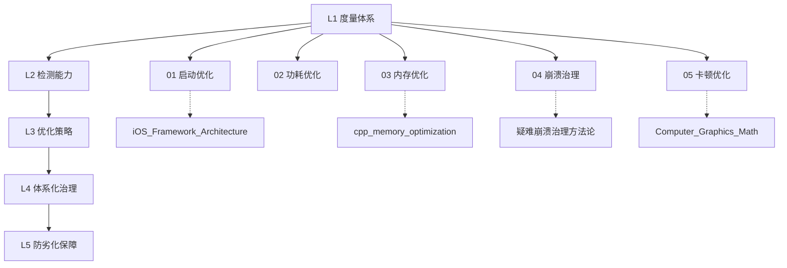

# iOS 性能优化方法论

> "Premature optimization is the root of all evil, but late optimization is the root of all failures."
> — 改编自 Donald Knuth

> "Performance is not just a feature — it's a contract with users."
> — Apple Human Interface Guidelines

---

## 知识库定位

本知识库聚焦 **iOS 客户端性能优化的工程方法论**视角，系统梳理从度量、检测、优化到治理、防劣化的完整闭环。

### 与其他知识库的关系

| 知识库 | 侧重点 | 与本库互补关系 |
|--------|--------|---------------|
| [iOS_Framework_Architecture/06_性能优化框架/](../iOS_Framework_Architecture/) | 技术实现细节（Instruments 内部机制、系统框架 API） | 本库侧重**度量体系、排查决策树、治理流程、防劣化机制** |
| [Swift_Language/](../Swift_Language/) | 语言层面性能特性（ARC、COW、SIL 优化） | 本库从应用层面引用语言优化手段 |
| [cpp_memory_optimization/](../cpp_memory_optimization/) | C++ 内存模型与优化技术 | 本库聚焦 iOS 平台的内存治理方法论 |
| [疑难崩溃问题治理方法论与实践指南](../疑难崩溃问题治理方法论与实践指南.md) | 崩溃治理通用方法论 | 本库在模块 04 中细化 iOS 平台的崩溃防劣化体系 |

---

## 核心结论（TL;DR）

- 本知识库提供一套覆盖 **启动 / 功耗 / 内存 / 崩溃 / 卡顿** 五大领域的 iOS 性能优化工程方法论
- 每个模块围绕「**度量 → 检测 → 优化 → 防劣化**」闭环展开，强调可观测性与工程落地
- 阅读推荐：先读主文档建立全局心智模型，再按业务痛点选择模块深入，并与 `iOS_Framework_Architecture` 等实现类文档交叉参照

---

## 知识金字塔

```
                      ┌───────────────────────┐
                      │   L5 防劣化            │
                      │  CI/CD 卡口 · 基线管理 │
                      │   质量红线 · 自动回归   │
                      ├───────────────────────┤
                    ┌─┤   L4 治理              ├─┐
                    │ │  体系化流程 · 专项运动   │ │
                    │ │  Owner 机制 · 周期复盘   │ │
                    ├─┼───────────────────────┼─┤
                  ┌─┤ │   L3 优化              │ ├─┐
                  │ │ │  策略制定 · 方案实施     │ │ │
                  │ │ │  A/B 验证 · 效果度量    │ │ │
                  ├─┼─┼───────────────────────┼─┼─┤
                ┌─┤ │ │   L2 检测              │ │ ├─┐
                │ │ │ │  线上监控 · 线下检测     │ │ │ │
                │ │ │ │  自动化扫描 · 告警联动   │ │ │ │
                ├─┼─┼─┼───────────────────────┼─┼─┼─┤
                │ │ │ │   L1 度量              │ │ │ │
                │ │ │ │  指标定义 · 工具链搭建   │ │ │ │
                │ │ │ │  数据采集 · 基线建立     │ │ │ │
                └─┴─┴─┴───────────────────────┴─┴─┴─┘
```

**层级说明**：

| 层级 | 名称 | 核心目标 |
|------|------|---------|
| L1 | 度量体系与工具链 | 定义关键指标（KPI），搭建数据采集与可视化基础设施 |
| L2 | 各维度检测技术 | 线上线下双通道发现问题，建立自动化检测能力 |
| L3 | 优化策略与实施方案 | 针对具体维度制定优化方案，量化验证效果 |
| L4 | 体系化治理流程 | 建立组织级治理机制，形成可持续的质量改善闭环 |
| L5 | 持续质量保障（防劣化） | 通过 CI/CD 卡口与基线管理，防止性能回退 |

---

## 文件导航

本知识库包含 5 个模块，共 11 个子文件：

### 模块 01：启动优化方法论

| 文件 | 描述 | 核心内容 |
|------|------|---------|
| [启动流程分析与度量体系_详细解析.md](./01_启动优化方法论/启动流程分析与度量体系_详细解析.md) | 启动阶段划分、耗时度量、线上采集方案 | pre-main / post-main 阶段模型、冷热启动定义、MetricKit 集成 |
| [启动优化策略与实施方案_详细解析.md](./01_启动优化方法论/启动优化策略与实施方案_详细解析.md) | 动态库治理、+load 优化、首屏渲染加速 | dyld 优化、懒加载策略、启动任务调度框架设计 |

### 模块 02：功耗优化方法论

| 文件 | 描述 | 核心内容 |
|------|------|---------|
| [电量消耗模型与监控体系_详细解析.md](./02_功耗优化方法论/电量消耗模型与监控体系_详细解析.md) | iOS 功耗模型、Energy Log 分析、线上监控 | CPU/GPU/Network/Location 功耗归因、Energy Organizer |
| [功耗优化策略与最佳实践_详细解析.md](./02_功耗优化方法论/功耗优化策略与最佳实践_详细解析.md) | 后台任务管控、定位策略、网络请求合并 | Background Modes 治理、计时器合并、暗模式适配 |

### 模块 03：内存优化方法论

| 文件 | 描述 | 核心内容 |
|------|------|---------|
| [iOS内存架构与Jetsam机制_详细解析.md](./03_内存优化方法论/iOS内存架构与Jetsam机制_详细解析.md) | 虚拟内存、Jetsam 机制、内存水位线 | Memory Footprint、Dirty/Clean/Compressed 内存、OOM 分析 |
| [内存泄漏检测与循环引用排查_详细解析.md](./03_内存优化方法论/内存泄漏检测与循环引用排查_详细解析.md) | 泄漏检测工具链、循环引用自动化发现 | Leaks/MLeaksFinder/FBRetainCycleDetector 原理与实践 |
| [常驻内存分析与Footprint优化_详细解析.md](./03_内存优化方法论/常驻内存分析与Footprint优化_详细解析.md) | 大内存对象治理、图片内存优化、缓存策略 | ImageIO 降采样、AutoreleasePool 优化、内存映射 |

### 模块 04：崩溃治理与防劣化

| 文件 | 描述 | 核心内容 |
|------|------|---------|
| [崩溃分析与根因定位方法论_详细解析.md](./04_崩溃治理与防劣化/崩溃分析与根因定位方法论_详细解析.md) | 崩溃分类、符号化流程、根因分析决策树 | Mach Exception/Signal/NSException 分类、Crash 聚合策略 |
| [防劣化体系建设_详细解析.md](./04_崩溃治理与防劣化/防劣化体系建设_详细解析.md) | 崩溃率基线、准入卡口、自动化回归检测 | Crash-free Rate 管理、灰度监控、版本准入标准 |

### 模块 05：UI 卡顿优化方法论

| 文件 | 描述 | 核心内容 |
|------|------|---------|
| [卡顿检测与分析技术_详细解析.md](./05_UI卡顿优化方法论/卡顿检测与分析技术_详细解析.md) | 卡顿度量指标、检测方案、堆栈归因 | RunLoop 检测、CADisplayLink 监控、Hitch Rate、线上采集 |
| [渲染性能优化与流畅度治理_详细解析.md](./05_UI卡顿优化方法论/渲染性能优化与流畅度治理_详细解析.md) | 离屏渲染治理、列表优化、GPU 瓶颈分析 | 预排版/预光栅化、异步绘制、Cell 复用优化、Core Animation 流水线 |

---

## 学习路径

### 路径一：初级开发者（1-2 周）

适合：具备基础 iOS 开发经验，希望建立性能优化意识

```
模块 01 → 启动流程分析与度量体系（理解指标定义）
    │
    ├─→ 模块 03 → iOS内存架构与Jetsam机制（认识内存模型）
    │
    ├─→ 模块 03 → 内存泄漏检测与循环引用排查（掌握基础工具）
    │
    └─→ 模块 05 → 卡顿检测与分析技术（学会用 Instruments）
```

### 路径二：中级开发者（2-3 周）

适合：有一定优化经验，需要系统化方法论

```
模块 01 → 完整阅读（启动优化全流程）
    │
    ├─→ 模块 03 → 完整阅读（内存三篇形成体系）
    │
    ├─→ 模块 05 → 完整阅读（卡顿检测 + 渲染优化）
    │
    └─→ 模块 04 → 崩溃分析与根因定位方法论（问题定位能力）
```

### 路径三：高级开发者 / Tech Lead（3-4 周）

适合：需要建设团队级性能治理体系

```
全部 5 个模块完整阅读
    │
    ├─→ 重点关注：L4 治理流程 + L5 防劣化机制
    │
    ├─→ 模块 04 → 防劣化体系建设（CI/CD 集成）
    │
    └─→ 结合 iOS_Framework_Architecture 深入技术实现
```

---

## 进阶路线图



**推荐进阶顺序**：

1. **度量先行**：每个模块先学习度量体系与指标定义（L1）
2. **工具掌握**：熟练使用 Instruments、MetricKit 等检测工具（L2）
3. **深入优化**：针对业务瓶颈选择对应模块深入优化策略（L3）
4. **体系建设**：从单点优化升级到组织级治理流程（L4）
5. **持续保障**：建立 CI/CD 性能卡口与基线管理机制（L5）

---

## 与已有知识库对照表

| 性能维度 | 本库模块 | iOS_Framework_Architecture 对应 | Swift_Language 对应 | cpp_memory_optimization 对应 |
|---------|---------|-------------------------------|--------------------|-----------------------------|
| 启动优化 | 01_启动优化方法论 | 06_性能优化框架/App 启动 | 08_性能优化与编译技术 | — |
| 功耗优化 | 02_功耗优化方法论 | 06_性能优化框架/Energy | — | — |
| 内存优化 | 03_内存优化方法论 | 06_性能优化框架/Memory | 05_内存管理与资源安全 | 全库对应 |
| 崩溃治理 | 04_崩溃治理与防劣化 | — | — | 03_内存越界检测 |
| 卡顿优化 | 05_UI卡顿优化方法论 | 06_性能优化框架/Rendering | — | — |

**差异说明**：

- **iOS_Framework_Architecture** 侧重"框架 API 怎么用"，本库侧重"什么时候用、怎么决策、如何持续保障"
- **Swift_Language** 提供语言层面优化手段，本库从应用层面选择和组合这些手段
- **cpp_memory_optimization** 深入 C++ 内存模型，本库聚焦 iOS 平台 Objective-C/Swift 混编场景

---

## 核心概念速查表

### 启动与生命周期

| 术语 | 英文 | 简要解释 | 详见 |
|------|------|---------|------|
| Cold Launch | 冷启动 | 进程不在内存中，从 exec() 到首帧渲染 | 模块 01 |
| Warm Launch | 热启动 | 进程在内存中被唤醒 | 模块 01 |
| pre-main | pre-main 阶段 | dyld 加载到 main() 调用前 | 模块 01 |
| DYLD_INSERT | 动态库注入 | dyld 加载动态库的机制 | 模块 01 |

### 内存与稳定性

| 术语 | 英文 | 简要解释 | 详见 |
|------|------|---------|------|
| Jetsam | Jetsam | iOS 内核的内存压力杀进程机制 | 模块 03 |
| Footprint | Memory Footprint | 应用实际占用的物理内存 | 模块 03 |
| Dirty Memory | 脏内存 | 被修改过的内存页，不可被系统回收 | 模块 03 |
| OOM | Out of Memory | 内存超限被系统终止 | 模块 03 |
| Crash-free Rate | 无崩溃率 | 未发生崩溃的用户/会话比例 | 模块 04 |
| Mach Exception | Mach 异常 | 内核级异常（EXC_BAD_ACCESS 等） | 模块 04 |

### 渲染与流畅度

| 术语 | 英文 | 简要解释 | 详见 |
|------|------|---------|------|
| Hitch | 卡顿帧 | 帧未能在 VSync 截止时间前完成 | 模块 05 |
| Hitch Rate | 卡顿率 | 每秒卡顿时间占比（ms/s） | 模块 05 |
| Offscreen Rendering | 离屏渲染 | 需要额外帧缓冲区的渲染操作 | 模块 05 |
| Commit Phase | 提交阶段 | Core Animation 事务提交到 Render Server | 模块 05 |

### 功耗

| 术语 | 英文 | 简要解释 | 详见 |
|------|------|---------|------|
| Energy Impact | 能耗影响 | Xcode Energy Gauge 的综合评分 | 模块 02 |
| Thermal State | 热状态 | 设备温度等级（nominal → critical） | 模块 02 |
| Background Fetch | 后台拉取 | 系统调度的后台数据更新 | 模块 02 |

---

## 写作原则

### 1. 方法论优先
- 先建立度量指标和分析框架，再讨论具体优化手段
- 每个模块包含**排查决策树**，指导问题定位路径
- 强调"度量 → 分析 → 优化 → 验证"的闭环思维

### 2. 工程实践导向
- 所有优化方案附带**效果量化标准**和**验证方法**
- 提供可直接复用的检测脚本与监控配置
- 包含真实场景案例与踩坑经验

### 3. 体系化思维
- 从单点问题修复提升到系统性治理
- 每个维度覆盖"检测 → 优化 → 防劣化"完整链路
- 关注组织协作与流程机制建设

### 4. 渐进深入
- 每个模块从指标定义入手，逐步深入技术细节
- 配合 ASCII 图解辅助理解系统架构与数据流
- 提供跨模块的知识关联与"进一步阅读"指引

---

## 目标读者

| 读者类型 | 背景假设 | 重点模块 |
|---------|---------|---------|
| **初级 iOS 开发者** | 了解 UIKit 基础，初次接触性能优化 | 模块 01（启动）、模块 03（内存泄漏） |
| **中级 iOS 开发者** | 有项目经验，需系统化优化方法论 | 全部模块的 L1-L3 层 |
| **高级开发者 / Tech Lead** | 需建设性能治理体系 | 全部模块，重点关注 L4-L5 层 |
| **面试候选人** | 准备 iOS 性能优化相关面试 | 模块 01（启动）、03（内存）、05（卡顿） |

**前置知识**：
- iOS 开发基础（UIKit / SwiftUI、ARC、RunLoop）
- 了解 Xcode Instruments 基本使用
- 不要求深入的操作系统或编译原理背景（文中会解释必要概念）

---

## 参考资源

### Apple 官方文档
- [Improving Your App's Performance](https://developer.apple.com/documentation/xcode/improving-your-app-s-performance)
- [MetricKit Framework](https://developer.apple.com/documentation/metrickit)
- [Reducing Your App's Launch Time](https://developer.apple.com/documentation/xcode/reducing-your-app-s-launch-time)
- [Gathering Information About Memory Use](https://developer.apple.com/documentation/xcode/gathering-information-about-memory-use)

### WWDC Sessions
- WWDC 2019 - Optimizing App Launch
- WWDC 2020 - Why is My App Getting Killed?
- WWDC 2021 - Detect and Diagnose Memory Issues
- WWDC 2022 - Track Down Hangs with Xcode and On-Device Detection
- WWDC 2023 - Analyze Hangs with Instruments

### 开源工具
- [MLeaksFinder](https://github.com/Tencent/MLeaksFinder) — 腾讯内存泄漏检测
- [FBRetainCycleDetector](https://github.com/facebook/FBRetainCycleDetector) — Facebook 循环引用检测
- [matrix-iOS](https://github.com/nicklama/matrix-ios) — 微信性能监控框架
- [OOMDetector](https://github.com/nicklama/OOMDetector) — 腾讯 OOM 监控组件
- [PLCrashReporter](https://github.com/nicklama/plcrashreporter) — 开源崩溃报告框架

### 推荐阅读
- 《High Performance iOS Apps》 — Gaurav Vaish
- 《iOS and macOS Performance Tuning》 — Marcel Weiher
- 《Pro iOS Apps Performance Optimization》 — Khang Vo
- 美团技术博客 — iOS 性能优化系列
- 字节跳动技术博客 — 抖音性能优化实践
- 微信读书技术博客 — 内存优化与卡顿治理实践

---

## 更新日志

| 日期 | 版本 | 更新内容 |
|------|------|----------|
| 2026-04-18 | v1.0 | 创建 iOS 性能优化方法论知识库目录结构与导航 |

---

## 相关知识库

本知识库是 iOS 性能优化的方法论部分，建议结合以下知识库学习：

- **[../iOS_Framework_Architecture/](../iOS_Framework_Architecture/)** — iOS 框架架构深度解析（性能优化框架的技术实现）
- **[../Swift_Language/](../Swift_Language/)** — Swift 语言深度解析（ARC、编译器优化、值语义）
- **[../cpp_memory_optimization/](../cpp_memory_optimization/)** — C++ 内存优化技术（底层内存模型与优化）
- **[../thread/](../thread/)** — 多线程编程深度解析（GCD / pthread / 锁机制）
- **[../Computer_Graphics_Math/](../Computer_Graphics_Math/)** — 图形学数学基础（渲染管线与 GPU 优化）

---

> 如有问题或建议，欢迎反馈。
