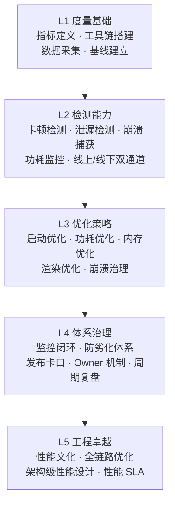
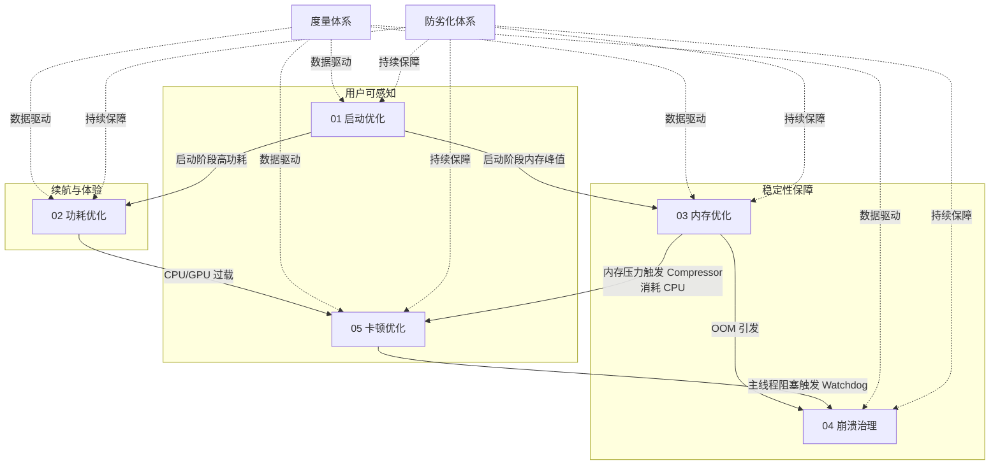
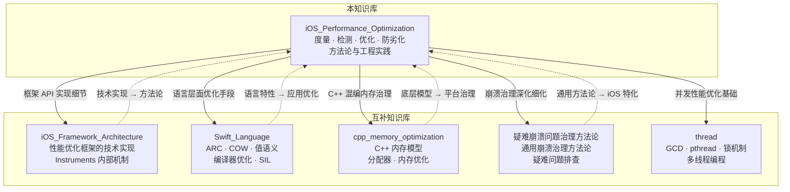

# iOS 性能优化方法论深度解析

> "Premature optimization is the root of all evil, but late optimization is the root of all failures."
> — 改编自 Donald Knuth

> 系统性梳理 iOS 客户端性能优化的度量、检测、优化与防劣化闭环方法论

---

## 核心结论（TL;DR）

**iOS 性能优化的核心方法论是：度量驱动、体系治理（Measure First, Govern Systematically）—— 没有度量就没有优化，没有防劣化就没有可持续性。**

iOS 性能优化方法论基于以下关键支柱：

1. **度量先行（Measure First）**：定义清晰的 KPI 指标体系（TTI、Footprint、Hitch Rate、Crash-free Rate、Energy Impact），让每一次优化都有数据支撑
2. **五维治理（Five Dimensions）**：启动优化、内存优化、卡顿优化、崩溃治理、功耗优化——五个维度相互关联、不可偏废
3. **闭环思维（Closed Loop）**：度量 → 检测 → 优化 → 验证 → 防劣化，形成可持续的质量改善闭环
4. **防劣化优于修复（Prevention over Cure）**：代码阶段预防的成本约为线上修复的 1/100，CI/CD 卡口是最后一道防线
5. **分层策略（Layered Strategy）**：系统层（OS/Runtime）→ 框架层（UIKit/CoreAnimation）→ 业务层（App Code），不同层面采用不同优化手段
6. **工程卓越（Engineering Excellence）**：从单点问题修复提升到组织级性能文化，让性能成为架构设计的一等公民

**一句话理解 iOS 性能优化**：性能优化不是一次性的技术攻坚，而是一套"度量→检测→优化→防劣化"的持续运转体系。**能度量的才能被改善，能防住的才不会回退。**

---

## 目录

- [核心结论（TL;DR）](#核心结论tldr)
- [文章导航](#文章导航)
- [方法论框架：iOS 性能优化知识金字塔](#方法论框架ios-性能优化知识金字塔)
- [概念速览：五大优化领域关系图](#概念速览五大优化领域关系图)
- [Part I：检测与度量体系](#part-i检测与度量体系)
- [Part II：优化策略与工程实践](#part-ii优化策略与工程实践)
- [与已有知识库的关系](#与已有知识库的关系)
- [面试考点速查](#面试考点速查)
- [参考资源](#参考资源)

---

## 文章导航

本文采用金字塔结构组织，主文章提供全景视图，子文件深入各维度的方法论细节：

### 模块 01：启动优化方法论

- [启动流程分析与度量体系_详细解析](./01_启动优化方法论/启动流程分析与度量体系_详细解析.md) - 启动三态模型、pre-main/post-main 阶段划分、TTI 度量、MetricKit 线上采集
- [启动优化策略与实施方案_详细解析](./01_启动优化方法论/启动优化策略与实施方案_详细解析.md) - 动态库治理、+load 迁移、二进制重排、启动任务编排框架、感知优化

### 模块 02：功耗优化方法论

- [电量消耗模型与监控体系_详细解析](./02_功耗优化方法论/电量消耗模型与监控体系_详细解析.md) - iOS 功耗分层模型、Energy Impact 指标、归因分析方法论
- [功耗优化策略与最佳实践_详细解析](./02_功耗优化方法论/功耗优化策略与最佳实践_详细解析.md) - CPU/GPU/网络/定位/后台任务优化策略矩阵、实施优先级决策

### 模块 03：内存优化方法论

- [iOS内存架构与Jetsam机制_详细解析](./03_内存优化方法论/iOS内存架构与Jetsam机制_详细解析.md) - 虚拟内存架构、Clean/Dirty/Compressed 分层、Jetsam 终止策略、COW 机制
- [内存泄漏检测与循环引用排查_详细解析](./03_内存优化方法论/内存泄漏检测与循环引用排查_详细解析.md) - 泄漏三分类、循环引用排查决策树、MLeaksFinder/FBRetainCycleDetector 实战
- [常驻内存分析与Footprint优化_详细解析](./03_内存优化方法论/常驻内存分析与Footprint优化_详细解析.md) - Top-N 消费者归因、图片降采样、分层缓存、内存预算管理

### 模块 04：崩溃治理与防劣化

- [崩溃分析与根因定位方法论_详细解析](./04_崩溃治理与防劣化/崩溃分析与根因定位方法论_详细解析.md) - 五大崩溃类型、符号化流程、根因定位决策树、OOM 专项排查
- [防劣化体系建设_详细解析](./04_崩溃治理与防劣化/防劣化体系建设_详细解析.md) - 三道防线（预防→拦截→止血）、Sanitizer 集成、崩溃率准入卡口

### 模块 05：UI 卡顿优化方法论

- [卡顿检测与分析技术_详细解析](./05_UI卡顿优化方法论/卡顿检测与分析技术_详细解析.md) - 卡顿分级体系、RunLoop 检测、MetricKit 诊断、堆栈采样归因
- [渲染性能优化与流畅度治理_详细解析](./05_UI卡顿优化方法论/渲染性能优化与流畅度治理_详细解析.md) - Core Animation 渲染管线、离屏渲染治理、列表优化、异步绘制

---

## 方法论框架：iOS 性能优化知识金字塔



**金字塔层级说明**：

| 层级 | 名称 | 核心目标 | 关键产出 |
|------|------|---------|---------|
| **L1** | 度量基础 | 定义 KPI，搭建数据采集与可视化基础设施 | TTI、Footprint、Hitch Rate、Crash-free Rate、Energy Impact |
| **L2** | 检测能力 | 线上线下双通道发现问题，建立自动化检测 | RunLoop 监控、Memory Graph、MetricKit、Sanitizer |
| **L3** | 优化策略 | 针对具体维度制定优化方案，量化验证效果 | 二进制重排、图片降采样、离屏渲染治理、启动任务编排 |
| **L4** | 体系治理 | 建立组织级治理机制，形成可持续的质量改善闭环 | CI/CD 卡口、基线管理、灰度监控、崩溃 Owner 机制 |
| **L5** | 工程卓越 | 性能成为架构设计的一等公民，全链路性能感知 | 性能 SLA、架构评审性能卡点、全链路 Trace |

**金字塔阅读指南**：
- **自底向上**学习：先掌握度量指标和工具链，再学习检测技术，最后理解治理体系
- **自顶向下**查阅：遇到线上问题时，从治理流程向下追溯到具体检测和优化手段
- **横向打通**：五个优化维度之间相互关联——内存问题可能引发崩溃，卡顿可能源于内存压力

**各层与模块对应关系**：

```
┌─────────────────────────────────────────────────────────────────┐
│              层级与模块映射                                       │
├──────────┬──────────────────────────────────────────────────────┤
│          │  模块01    模块02    模块03    模块04    模块05       │
│          │  启动优化  功耗优化  内存优化  崩溃治理  卡顿优化     │
├──────────┼──────────────────────────────────────────────────────┤
│ L1 度量  │  TTI      Energy   Footprint CrashFree HitchRate   │
│ L2 检测  │  Signpost EnergyLog MemGraph  Symbolize RunLoop    │
│ L3 优化  │  重排/编排 QoS/合并  降采样    根因定位  离屏治理     │
│ L4 治理  │  任务框架  功耗预算  内存预算  三道防线  流畅度体系   │
│ L5 防劣化│  启动基线  热状态    水位告警  发布卡口  帧率回归     │
└──────────┴──────────────────────────────────────────────────────┘
```

---

## 概念速览：五大优化领域关系图

> 五大领域不是孤立存在的，它们在底层机制上深度交织



### 核心概念速查表

| 维度 | 核心指标 | 业界基线 | 度量工具 | 详见 |
|------|---------|---------|---------|------|
| **启动** | TTI（Time to Interactive） | 冷启动 < 400ms | MetricKit + mach_absolute_time | 模块 01 |
| **功耗** | Energy Impact Level | Overhead（低功耗） | Energy Log + MetricKit | 模块 02 |
| **内存** | Memory Footprint | 低端 ≤150MB / 高端 ≤500MB | VM Tracker + Memory Graph | 模块 03 |
| **崩溃** | Crash-free Rate | ≥ 99.9% | PLCrashReporter + MetricKit | 模块 04 |
| **卡顿** | Hitch Rate | < 5 ms/s | CADisplayLink + RunLoop | 模块 05 |

### 统一工具链矩阵

| 工具 | 类型 | 覆盖维度 | 适用阶段 |
|------|------|---------|---------|
| **Instruments** | 线下 Profiling | 全维度 | 开发 / 测试 |
| **MetricKit** | 线上聚合采集 | 启动/内存/卡顿/功耗/崩溃 | 线上（iOS 13+） |
| **Xcode Memory Graph** | 线下可视化 | 内存引用链 | 开发调试 |
| **Xcode Energy Gauge** | 线下实时监控 | 功耗 | 开发调试 |
| **os_signpost** | 自定义区间标记 | 全维度 | 开发 / 线下 |
| **ASan/TSan/UBSan** | Sanitizer | 内存/线程/UB | CI / 测试 |
| **PLCrashReporter** | 崩溃捕获 | 崩溃 | 线上 |
| **MLeaksFinder** | 泄漏检测 | 内存 | 开发 / CI |

---

## Part I：检测与度量体系

> 没有度量，就没有优化。度量是性能治理的基石。

### 1.1 启动度量

**启动三态模型**：

| 类型 | 定义 | 度量重点 |
|------|------|---------|
| **Cold Launch** | 进程不存在，从 exec() 到首帧渲染 | 完整度量 T1(pre-main) + T2(post-main) |
| **Warm Launch** | 进程在内存中被唤醒 | 度量 T2 阶段 |
| **Resume** | 从后台恢复 | 度量 viewDidAppear 到可交互 |

**关键路径**：

```
kernel → dyld3/4 → Runtime Init → main() → UIApplicationMain
  → didFinishLaunching → rootViewController → 首帧渲染(TTI)
  ├── T1: Pre-main ──────────────────┤
  └── T2: Post-main ────────────────────────────────────────┘
```

**度量手段**：
- **线下**：`DYLD_PRINT_STATISTICS`、Instruments App Launch 模板、`os_signpost` 区间标记
- **线上**：`mach_absolute_time` 埋点 + MetricKit `MXAppLaunchMetric`
- **聚合**：P50 / P90 / P99 分位线，按设备型号、系统版本分桶

```swift
// 启动耗时埋点示例
let processStartTime: UInt64 = {
    var kinfo = kinfo_proc()
    var size = MemoryLayout<kinfo_proc>.stride
    var mib: [Int32] = [CTL_KERN, KERN_PROC, KERN_PROC_PID, getpid()]
    sysctl(&mib, UInt32(mib.count), &kinfo, &size, nil, 0)
    let startSec = kinfo.kp_proc.p_starttime.tv_sec
    let startUsec = kinfo.kp_proc.p_starttime.tv_usec
    return UInt64(startSec) * 1_000_000 + UInt64(startUsec)
}()
```

> 详见 → [启动流程分析与度量体系_详细解析](./01_启动优化方法论/启动流程分析与度量体系_详细解析.md)

### 1.2 内存度量

**核心公式**：

```
Footprint = Dirty Memory + Compressed Memory （不含 Clean Memory）
```

- **Clean Memory**：可丢弃重建（mmap 文件、Framework __TEXT 段）
- **Dirty Memory**：不可回收（堆对象、全局变量、被写入的 mmap 页）
- **Compressed Memory**：Compressor 压缩的不活跃 Dirty 页面（压缩比 1/2~1/5）

**Jetsam 判定**：iOS 无 Swap File，当 Footprint 超过设备阈值时，Jetsam 按优先级终止进程（即 OOM）。

**内存预算参考**：

| 设备分级 | 代表机型 | Jetsam 阈值参考 | 建议 Footprint 预算 |
|---------|---------|-------------|-----------------|
| 低端 | iPhone 7/8 (2GB) | ~600MB | ≤ 150MB |
| 中端 | iPhone 11/12 (4GB) | ~1.2GB | ≤ 300MB |
| 高端 | iPhone 14 Pro+ (6GB) | ~2GB | ≤ 500MB |

**度量工具链**：
- **线下**：Xcode Memory Graph（可视化引用链）、VM Tracker（全景扫描）、Allocations（分配追踪）
- **线上**：`os_proc_available_memory()` 剩余内存查询 + MetricKit `MXMemoryMetric`

```swift
// 运行时内存水位监控
func checkMemoryPressure() {
    let available = os_proc_available_memory()
    let availableMB = available / (1024 * 1024)
    
    switch availableMB {
    case 0..<50:
        // 紧急：主动释放缓存、降级图片质量
        ImageCache.shared.removeAll()
        NotificationCenter.default.post(name: .memoryWarningCritical, object: nil)
    case 50..<150:
        // 警告：清理低优先级缓存
        ImageCache.shared.trimToSize(50 * 1024 * 1024)
    default:
        break  // 安全区间
    }
}
```

> 详见 → [iOS内存架构与Jetsam机制_详细解析](./03_内存优化方法论/iOS内存架构与Jetsam机制_详细解析.md)

### 1.3 卡顿度量

**卡顿分级**：

| 等级 | 阈值 | 用户感知 | 优先级 |
|------|------|---------|--------|
| **Hitch** | 单帧超 16.67ms（@60fps） | 轻微掉帧 | P2 |
| **Scroll Hitch** | 滚动过程掉帧 | 明显不流畅 | P1 |
| **Hang** | ≥ 250ms 主线程阻塞 | 操作无响应 | P0 |
| **Freeze** | ≥ 500ms 冻帧 | 严重卡死 | P0 |

**Hitch Rate** = 卡顿总时长 / 滚动总时长（ms/s），Apple 建议 < 5 ms/s。

**检测方案对比**：

| 方案 | 原理 | 适用场景 |
|------|------|---------|
| RunLoop Observer | 监控 kCFRunLoopBeforeSources → kCFRunLoopAfterWaiting 耗时 | 线上主力方案 |
| CADisplayLink | 监控帧回调间隔 | FPS 统计 |
| MetricKit MXHangDiagnostic | 系统级 Hang 诊断 | iOS 14+ 线上补充 |
| Instruments Time Profiler | 精确采样分析 | 线下定位热点 |

> 详见 → [卡顿检测与分析技术_详细解析](./05_UI卡顿优化方法论/卡顿检测与分析技术_详细解析.md)

### 1.4 功耗度量

**功耗归因模型**：

```
总功耗 = CPU + GPU + Network + Location + Bluetooth + Screen + ...
```

- **CPU Wake Count** 比 CPU 占用率更影响功耗——每次唤醒都伴随电压/频率切换
- **网络与定位**是最易被忽视的功耗大户

**核心指标**：Energy Impact Level（Overhead / High / Very High），由 Xcode Energy Gauge 综合评定。

**工具链**：
- **线下**：Instruments Energy Log + Xcode Energy Gauge
- **线上**：MetricKit `MXCPUMetric` / `MXNetworkTransferMetric` / `MXLocationActivityMetric`

> 详见 → [电量消耗模型与监控体系_详细解析](./02_功耗优化方法论/电量消耗模型与监控体系_详细解析.md)

### 1.5 崩溃率指标

**核心指标**：

| 指标 | 公式 | 行业标杆 |
|------|------|---------|
| **Crash-free User Rate** | 1 - (崩溃用户数 / 总用户数) | ≥ 99.9% |
| **Crash-free Session Rate** | 1 - (崩溃会话数 / 总会话数) | ≥ 99.95% |

**崩溃五大分类**：

| 类型 | 典型场景 | 捕获方式 |
|------|---------|---------|
| Mach Exception | EXC_BAD_ACCESS 野指针 | mach_msg 端口监听 |
| Unix Signal | SIGSEGV / SIGABRT | signal() / sigaction() |
| NSException | NSInvalidArgumentException | NSSetUncaughtExceptionHandler |
| Watchdog | 主线程超时（约 20s） | 无法程序捕获，MetricKit 采集 |
| OOM | Footprint 超限被 Jetsam 杀死 | 排除法 + MetricKit |

> 详见 → [崩溃分析与根因定位方法论_详细解析](./04_崩溃治理与防劣化/崩溃分析与根因定位方法论_详细解析.md)

---

## Part II：优化策略与工程实践

> 检测发现问题，优化解决问题，防劣化守住成果。

### 2.1 启动优化核心策略

**三层优化模型**：

| 层次 | 策略 | ROI |
|------|------|-----|
| **Pre-main** | 动态库转静态库、+load → +initialize 迁移、二进制重排（Order File） | 高（投入小、收益大） |
| **Post-main** | 启动任务依赖图 + 拓扑排序 + 并发调度、懒加载非首屏模块 | 中高（需架构改造） |
| **感知优化** | 骨架屏/占位图 + 首屏数据预加载 + 闪屏时间利用 | 中（提升体感） |

**二进制重排**是 Pre-main 阶段的杀手锏：通过 Clang SanitizerCoverage 采集启动函数调用序列，生成 Order File，将启动热函数排列在连续 Page 中，减少 Page Fault，冷启动可优化 10-30%。

```swift
// 启动任务编排框架核心思路
class LaunchTaskScheduler {
    func register(_ task: LaunchTask, dependencies: [LaunchTask]) { ... }
    func execute() {
        let sorted = topologicalSort(tasks)
        let concurrent = DispatchQueue(label: "launch", attributes: .concurrent)
        for task in sorted {
            if task.canRunConcurrently {
                concurrent.async { task.run() }
            } else {
                DispatchQueue.main.async { task.run() }
            }
        }
    }
}
```

> 详见 → [启动优化策略与实施方案_详细解析](./01_启动优化方法论/启动优化策略与实施方案_详细解析.md)

### 2.2 功耗优化核心策略

**三层优化漏斗**：减少不必要的工作 > 合并工作 > 选择高效方式

| 组件 | 核心策略 | 关键指标 |
|------|---------|---------|
| **CPU** | QoS 合理分级 + Timer Coalescing + 批处理合并 | CPU Wake Count |
| **GPU** | 减少过度绘制 + 避免离屏渲染 + 降低分辨率 | GPU Utilization |
| **网络** | 请求合并 + 压缩 + NSURLSession Background | Network Bytes |
| **定位** | 按需精度 + Significant Location Change + 及时停止 | Location Activity |
| **后台** | Background Task 兜底 + 避免后台持续活动 | Background Time |

**Thermal State 响应**：监听 `ProcessInfo.ThermalState`，在设备过热时主动降级（降帧率、暂停非关键任务）。

```swift
// Thermal State 监听与响应策略
NotificationCenter.default.addObserver(
    forName: ProcessInfo.thermalStateDidChangeNotification,
    object: nil, queue: .main
) { _ in
    switch ProcessInfo.processInfo.thermalState {
    case .nominal:
        // 正常：恢复所有能力
        AnimationConfig.shared.frameRate = .high
    case .fair:
        // 轻微发热：降低非关键动画帧率
        AnimationConfig.shared.frameRate = .medium
    case .serious:
        // 严重发热：暂停后台任务、降低视频分辨率
        BackgroundTaskManager.shared.pauseNonCritical()
        VideoEngine.shared.downgradeResolution()
    case .critical:
        // 临界：最小化所有非核心功能
        FeatureManager.shared.enterMinimalMode()
    @unknown default: break
    }
}
```

> 详见 → [功耗优化策略与最佳实践_详细解析](./02_功耗优化方法论/功耗优化策略与最佳实践_详细解析.md)

### 2.3 内存优化核心策略

**内存优化三部曲**：

```
1. 堵漏洞：检测并修复内存泄漏（循环引用 + 逻辑泄漏）
2. 降水位：治理常驻内存 Top-N 消费者（图片 + 缓存 + 模型）
3. 设预算：按设备分级设定 Footprint 阈值，运行时动态管控
```

**图片内存优化**（占 Footprint 40%+ 的第一大户）：

```swift
// ImageIO 降采样：避免将完整大图解码到内存
func downsample(imageAt url: URL, to pointSize: CGSize, scale: CGFloat) -> UIImage? {
    let imageSourceOptions = [kCGImageSourceShouldCache: false] as CFDictionary
    guard let imageSource = CGImageSourceCreateWithURL(url as CFURL, imageSourceOptions) else { return nil }

    let maxDimensionInPixels = max(pointSize.width, pointSize.height) * scale
    let downsampleOptions = [
        kCGImageSourceCreateThumbnailFromImageAlways: true,
        kCGImageSourceShouldCacheImmediately: true,
        kCGImageSourceCreateThumbnailWithTransform: true,
        kCGImageSourceThumbnailMaxPixelSize: maxDimensionInPixels
    ] as CFDictionary

    guard let downsampledImage = CGImageSourceCreateThumbnailAtIndex(imageSource, 0, downsampleOptions) else { return nil }
    return UIImage(cgImage: downsampledImage)
}
```

**循环引用两大元凶**：
1. 闭包捕获 `self` 未使用 `[weak self]`
2. delegate 属性未声明为 `weak`

```swift
// 反模式：闭包循环引用
class ViewController: UIViewController {
    var timer: Timer?
    
    func startTimer() {
        timer = Timer.scheduledTimer(withTimeInterval: 1.0, repeats: true) { _ in
            self.updateUI()  // ⚠️ 强引用 self，ViewController 和 Timer 互相持有
        }
    }
}

// 正确写法：[weak self] + guard
class ViewController: UIViewController {
    var timer: Timer?
    
    func startTimer() {
        timer = Timer.scheduledTimer(withTimeInterval: 1.0, repeats: true) { [weak self] _ in
            guard let self = self else { return }
            self.updateUI()
        }
    }
    
    deinit {
        timer?.invalidate()  // 别忘了 invalidate
    }
}
```

> 详见 → [内存泄漏检测与循环引用排查_详细解析](./03_内存优化方法论/内存泄漏检测与循环引用排查_详细解析.md) ｜ [常驻内存分析与Footprint优化_详细解析](./03_内存优化方法论/常驻内存分析与Footprint优化_详细解析.md)

### 2.4 崩溃治理与防劣化

**三道防线模型**：

| 防线 | 阶段 | 核心手段 | 目标 |
|------|------|---------|------|
| **第一道** | 代码阶段 | 静态分析（Clang Static Analyzer）+ Code Review + 安全编码规范 | 预防 |
| **第二道** | 测试阶段 | ASan/TSan/UBSan + Monkey Test + Crash 回归测试 | 拦截 |
| **第三道** | 线上阶段 | 实时监控 + 热修复 + 熔断降级 + 灰度回滚 | 止血 |

**崩溃率发布卡口**：

```
灰度准入：Crash-free Rate ≥ 99.9% 方可扩量
全量准入：新增 Top Crash ≤ 0 + 整体崩溃率不高于上一版本
紧急回滚：任意 1h 窗口崩溃率超过阈值 2x 自动触发回滚
```

> 详见 → [防劣化体系建设_详细解析](./04_崩溃治理与防劣化/防劣化体系建设_详细解析.md)

### 2.5 卡顿优化核心策略

**Core Animation 渲染管线**：

```
App 进程                                    Render Server        GPU
┌──────────────────────────────┐     ┌──────────────┐     ┌──────────┐
│ Layout → Display → Prepare   │ ──→ │   合成 Layer  │ ──→ │  像素渲染 │
│         → Commit             │     │    树        │     │  到帧缓冲 │
└──────────────────────────────┘     └──────────────┘     └──────────┘
       Commit Phase                    Render Phase         GPU Phase
    ← CPU Bound →                   ← GPU Bound →
```

**瓶颈定位**：CPU Bound 看 Commit Phase（主线程阻塞），GPU Bound 看 Render Phase（离屏渲染、过度绘制）。

**离屏渲染治理**（最常见的 GPU 性能杀手）：

```swift
// 反模式：cornerRadius + clipsToBounds 触发离屏渲染
view.layer.cornerRadius = 10
view.layer.clipsToBounds = true  // ⚠️ 离屏渲染

// 优化方案1：预切圆角图片（推荐）
let renderer = UIGraphicsImageRenderer(size: imageView.bounds.size)
imageView.image = renderer.image { ctx in
    UIBezierPath(roundedRect: imageView.bounds, cornerRadius: 10).addClip()
    originalImage.draw(in: imageView.bounds)
}

// 优化方案2：iOS 13+ 使用 cornerCurve（系统优化路径）
view.layer.cornerRadius = 10
view.layer.cornerCurve = .continuous
// 对于纯色背景 + 圆角，不设 clipsToBounds，改用 layer.maskedCorners
```

**列表滚动优化三板斧**：预排版（缓存 Cell 高度）、预光栅化（异步绘制）、Cell 复用池优化。

```swift
// 预排版：缓存 Cell 布局计算结果
struct CellLayout {
    let height: CGFloat
    let titleFrame: CGRect
    let contentFrame: CGRect
    let imageFrame: CGRect?
    
    static func calculate(with model: CellModel, width: CGFloat) -> CellLayout {
        // 在后台线程计算布局，结果缓存到 model 中
        let titleHeight = model.title.boundingRect(
            with: CGSize(width: width - 32, height: .greatestFiniteMagnitude),
            options: .usesLineFragmentOrigin,
            attributes: [.font: UIFont.systemFont(ofSize: 16)],
            context: nil
        ).height
        // ... 计算其他元素布局
        return CellLayout(height: titleHeight + contentHeight + padding, ...)
    }
}

// UITableView 高度缓存
func tableView(_ tableView: UITableView, heightForRowAt indexPath: IndexPath) -> CGFloat {
    return cachedLayouts[indexPath.row].height  // O(1) 返回，不触发重新计算
}
```

> 详见 → [渲染性能优化与流畅度治理_详细解析](./05_UI卡顿优化方法论/渲染性能优化与流畅度治理_详细解析.md)

### 2.6 方法论闭环：度量 → 检测 → 优化 → 防劣化

贯穿五大领域的统一方法论：

| 阶段 | 核心动作 | 产出 |
|------|---------|------|
| **度量** | 定义 KPI + 建立基线 + 搭建采集 | 可量化的性能基线 |
| **检测** | 线上监控 + 线下 Instruments + 自动化扫描 | 问题发现与告警 |
| **优化** | 制定策略 + 实施方案 + A/B 验证 | 量化收益报告 |
| **防劣化** | CI/CD 卡口 + 基线管理 + 灰度监控 | 持续质量保障 |

**优化效果验证清单**：

```
✅ 量化验证：优化前后 P50/P90/P99 对比（同机型、同系统版本）
✅ 回归验证：确认优化未引入新问题（Crash Rate / ANR Rate 不劣化）
✅ 灰度验证：小比例灰度观察 24h，核心指标无异常后扩量
✅ 长期验证：入库后 2 个版本持续观察，确认效果稳定
✅ 基线更新：将优化后的数据设为新基线，防止回退
```

**性能治理组织机制**：

| 机制 | 频率 | 参与者 | 目标 |
|------|------|--------|------|
| 性能周报 | 每周 | 全团队 | 各维度指标趋势与异常预警 |
| 专项治理 | 按需 | 专项 Owner | 针对 Top 问题集中攻坚 |
| 版本复盘 | 每版本 | TL + Owner | 回顾版本性能变化与归因 |
| 架构评审 | 每季度 | 架构组 | 评估架构决策对性能的影响 |

---

## 与已有知识库的关系

> 本知识库聚焦方法论视角，与其他知识库形成互补



**知识库互补关系说明**：

| 知识库 | 侧重点 | 与本库互补关系 |
|--------|--------|---------------|
| **iOS_Framework_Architecture** | 技术实现细节（Instruments API、系统框架内部机制） | 本库侧重"什么时候用、怎么决策、如何持续保障" |
| **Swift_Language** | 语言层面性能特性（ARC、COW、SIL 优化） | 本库从应用层面选择和组合这些语言优化手段 |
| **cpp_memory_optimization** | C++ 内存模型与优化技术 | 本库聚焦 iOS 平台 ObjC/Swift 混编场景的内存治理 |
| **疑难崩溃治理** | 崩溃治理通用方法论 | 本库在模块 04 中细化 iOS 平台的三道防线与发布卡口 |
| **thread** | 多线程编程基础 | 并发性能是启动优化和卡顿治理的重要基础 |

**建议学习路径**：
1. 先掌握本文档（性能优化方法论全景）
2. 结合 `iOS_Framework_Architecture` 深入工具链和框架实现
3. 按需深入 `Swift_Language`（语言级优化）或 `thread`（并发优化）

**跨知识库的知识交叉点**：

| 交叉主题 | 涉及知识库 | 说明 |
|---------|-----------|------|
| ARC 与循环引用 | Swift_Language + 本库模块 03 | Swift 的 ARC 机制 → 内存泄漏的根源与检测 |
| RunLoop 机制 | iOS_Framework_Architecture + 本库模块 05 | RunLoop 运行机制 → 卡顿检测的技术基础 |
| GCD 调度 | thread + 本库模块 01/02 | 并发调度 → 启动任务编排与功耗 QoS 策略 |
| C++ 内存模型 | cpp_memory_optimization + 本库模块 03 | C++ 层面内存管理 → ObjC/Swift 混编的内存治理 |
| 渲染管线 | Computer_Graphics_Math + 本库模块 05 | GPU 渲染原理 → 离屏渲染与 GPU 瓶颈分析 |
| Mach 异常 | iOS_Framework_Architecture + 本库模块 04 | 内核异常处理 → 崩溃捕获与符号化 |

---

## 面试考点速查

### 启动优化 Top 3

| 难度 | 考点 | 关键回答要点 |
|------|------|-------------|
| **中级** | iOS 启动流程有哪些阶段？ | kernel → dyld → Runtime → main → didFinishLaunching → 首帧；T1(pre-main) + T2(post-main) = TTI |
| **高级** | 二进制重排的原理和收益？ | Clang SanitizerCoverage 采集 → 生成 Order File → 减少 Page Fault；冷启动优化 10-30% |
| **专家** | 设计一个启动任务编排框架？ | 任务注册 + 依赖图 + 拓扑排序 + 并发调度 + 优先级 + 超时兜底 + 度量埋点 |

### 内存优化 Top 3

| 难度 | 考点 | 关键回答要点 |
|------|------|-------------|
| **中级** | Footprint 和 Resident Size 区别？ | Footprint = Dirty + Compressed（Jetsam 判定依据）；Resident 包含 Clean，不反映真实压力 |
| **高级** | iOS 中 OOM 如何排查？ | 排除法（非 Crash、非 Watchdog、非用户退出）+ MetricKit + 内存水位监控 + 大对象追踪 |
| **专家** | 如何建设内存治理体系？ | 泄漏检测（CI Leaks + MLeaksFinder）+ Footprint 预算（设备分级）+ 水位告警 + 内存快照分析 |

### 卡顿优化 Top 3

| 难度 | 考点 | 关键回答要点 |
|------|------|-------------|
| **中级** | 离屏渲染是什么？常见触发场景？ | 需要额外帧缓冲区；cornerRadius+clipsToBounds、shadow、mask、group opacity 等 |
| **高级** | 线上卡顿监控方案设计？ | RunLoop Observer 超时检测 + 子线程堆栈采样 + 聚合分析 + 火焰图 + MetricKit 补充 |
| **专家** | Core Animation 渲染管线瓶颈定位？ | Commit Phase(CPU) vs Render Phase(GPU)；Instruments Core Animation 模板区分；CPU Bound 优化主线程，GPU Bound 治理离屏渲染 |

### 崩溃治理 Top 3

| 难度 | 考点 | 关键回答要点 |
|------|------|-------------|
| **中级** | iOS 崩溃有哪些类型？ | Mach Exception、Unix Signal、NSException、Watchdog、OOM 五大类 |
| **高级** | 符号化流程和常见问题？ | dSYM UUID 匹配 + ASLR 偏移计算 + atos/symbolicatecrash；Bitcode 需从 ASC 下载 |
| **专家** | 如何将崩溃率从 99.5% 提升到 99.9%？ | 三道防线 + Top Crash 专项 + 防劣化卡口 + 灰度监控 + 安全兜底（Safe Mode） |

### 功耗优化 Top 3

| 难度 | 考点 | 关键回答要点 |
|------|------|-------------|
| **中级** | iOS 功耗主要来源？ | CPU/GPU/网络/定位/蓝牙/屏幕；CPU Wake Count 比占用率更关键 |
| **高级** | 后台功耗如何治理？ | Background Task 兜底 + 定位降级 + 网络合并 + Timer Coalescing + 避免后台音频滥用 |
| **专家** | 如何设计功耗监控体系？ | MetricKit 线上聚合 + Energy Log 线下分析 + os_signpost 归因 + Thermal State 响应 + 分组件功耗预算 |

---

## 参考资源

### Apple 官方文档

- [Improving Your App's Performance](https://developer.apple.com/documentation/xcode/improving-your-app-s-performance)
- [MetricKit Framework](https://developer.apple.com/documentation/metrickit)
- [Reducing Your App's Launch Time](https://developer.apple.com/documentation/xcode/reducing-your-app-s-launch-time)
- [Gathering Information About Memory Use](https://developer.apple.com/documentation/xcode/gathering-information-about-memory-use)
- [Diagnosing Performance Issues Early](https://developer.apple.com/documentation/xcode/diagnosing-performance-issues-early)

### WWDC Sessions

- WWDC 2019 - Optimizing App Launch（启动优化里程碑 Session）
- WWDC 2020 - Why is My App Getting Killed?（Jetsam 与 OOM 机制）
- WWDC 2021 - Detect and Diagnose Memory Issues（内存诊断新工具）
- WWDC 2022 - Track Down Hangs with Xcode and On-Device Detection（卡顿检测新方案）
- WWDC 2023 - Analyze Hangs with Instruments（Hang 分析增强）
- WWDC 2022 - Power Down: Improve Battery Consumption（功耗优化最佳实践）

### 开源工具

- [MLeaksFinder](https://github.com/Tencent/MLeaksFinder) — 腾讯内存泄漏检测
- [FBRetainCycleDetector](https://github.com/facebook/FBRetainCycleDetector) — Facebook 循环引用检测
- [matrix-iOS](https://github.com/nicklama/matrix-ios) — 微信性能监控框架
- [PLCrashReporter](https://github.com/nicklama/plcrashreporter) — 开源崩溃报告框架
- [OOMDetector](https://github.com/nicklama/OOMDetector) — 腾讯 OOM 监控组件

### 推荐书籍

- *High Performance iOS Apps* — Gaurav Vaish
- *iOS and macOS Performance Tuning* — Marcel Weiher
- *Pro iOS Apps Performance Optimization* — Khang Vo

### 社区与博客

- 美团技术博客 — iOS 性能优化系列（启动优化、内存治理实战）
- 字节跳动技术博客 — 抖音性能优化实践（二进制重排、卡顿治理）
- 微信读书技术博客 — 内存优化与卡顿治理实践
- [objc.io Performance](https://www.objc.io/issues/3-views/) — Views 与渲染性能专题
- [WWDC Notes](https://wwdcnotes.com/) — WWDC Session 笔记汇总

---

## 更新日志

| 日期 | 版本 | 更新内容 |
|------|------|----------|
| 2026-04-18 | v1.0 | 创建 iOS 性能优化方法论深度解析主文档（全景视图） |

---

## 附录：常见性能问题快速定位决策树

```
用户反馈性能问题
│
├── “启动慢”
│   ├── 确认是冷启动 or 热启动 → 查看 TTI 指标
│   ├── T1 偏高 → 模块 01: dyld 优化 + 二进制重排
│   └── T2 偏高 → 模块 01: 启动任务编排 + 懒加载
│
├── “卡顿/不流畅”
│   ├── 确认是滚动卡顿 or 操作无响应 → Hitch Rate / Hang Rate
│   ├── CPU Bound → 模块 05: 主线程阻塞治理
│   └── GPU Bound → 模块 05: 离屏渲染治理
│
├── “闪退/崩溃”
│   ├── 有 Crash Log → 模块 04: 符号化 + 根因定位决策树
│   ├── 无 Crash Log → 疑似 OOM → 模块 03: Footprint 排查
│   └── 后台被杀 → Watchdog or Jetsam → 模块 03/04
│
├── “耗电快”
│   ├── Energy Log 查看组件功耗分布 → 模块 02
│   ├── CPU Wake Count 偏高 → Timer Coalescing + QoS 调整
│   └── 后台持续活动 → Background Task 审计
│
└── “占内存大”
    ├── VM Tracker 全景扫描 → Top-N 消费者 → 模块 03
    ├── 图片占比高 → 降采样 + 分层缓存
    └── 泄漏疑似 → Memory Graph + MLeaksFinder
```

---

> 如有问题或建议，欢迎反馈。
