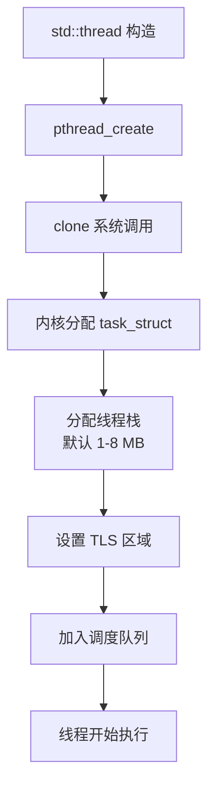
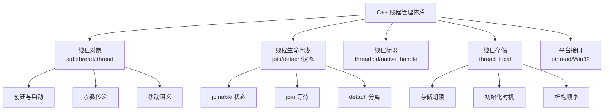
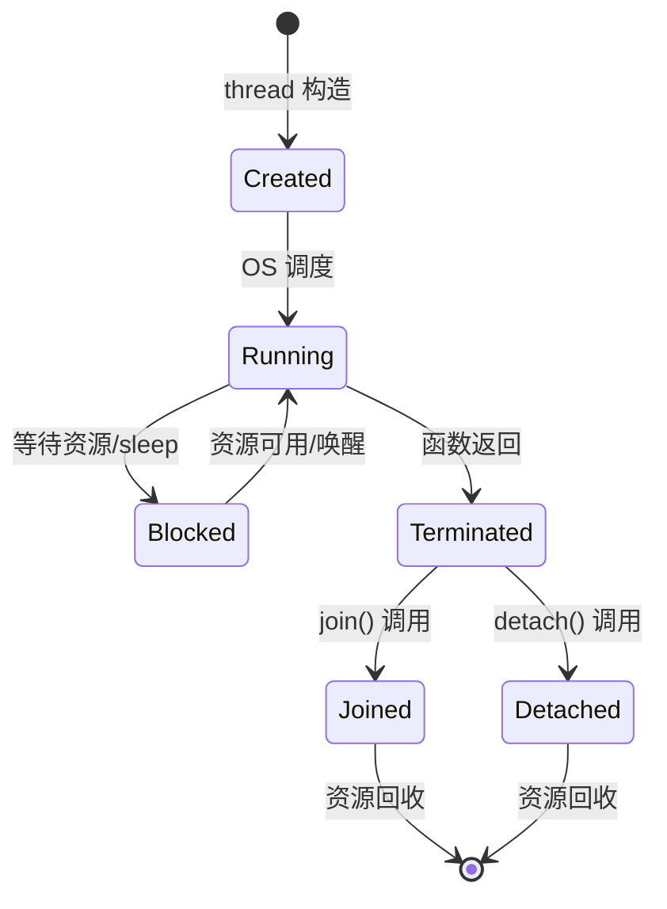
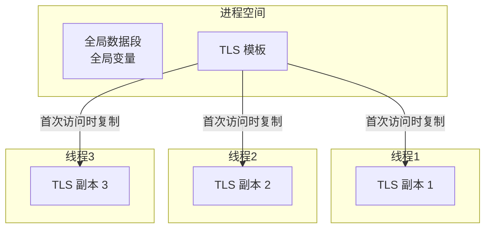
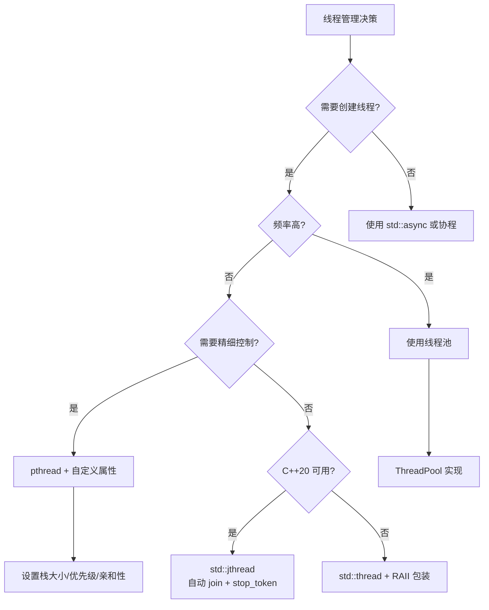

# C++ 线程库与线程管理详细解析

> **核心结论**：线程是操作系统调度的最小单位，C++ 从 C++11 起提供跨平台线程支持。线程创建开销约 20-50μs，栈内存占用 512KB-1MB，因此**高性能场景必须使用线程池复用线程**，并通过 RAII 确保线程安全退出。

---

## 1. Why — 为什么需要理解线程管理

**结论先行**：不理解线程管理，就无法编写正确且高效的多线程程序。线程创建开销、泄漏风险、平台限制是三大核心关注点。

### 1.1 线程创建开销

线程创建不是"免费"的操作，涉及多层系统调用：



**各层开销分解**：

| 阶段 | 耗时 | 说明 |
|-----|------|-----|
| std::thread 包装 | ~1 μs | 对象构造、参数拷贝 |
| pthread_create | ~5 μs | 库函数调用 |
| clone 系统调用 | ~10 μs | 用户态 → 内核态 |
| 栈内存分配 | ~5 μs | mmap 或从缓存获取 |
| TLS 初始化 | ~2 μs | 线程局部存储 |
| **总计** | **20-50 μs** | 视系统负载波动 |

**对比参考**：
- 函数调用：~1 ns
- mutex 加锁：~20 ns
- 线程创建：~30,000 ns（慢 1500 倍！）

### 1.2 线程泄漏的危害

线程泄漏比内存泄漏更严重：

```
┌─────────────────────────────────────────────────────────────┐
│                    线程泄漏的连锁反应                         │
├─────────────────────────────────────────────────────────────┤
│  线程未 join/detach                                          │
│       ↓                                                      │
│  std::terminate() 被调用（C++ 标准要求）                      │
│       ↓                                                      │
│  程序异常终止                                                 │
│                                                              │
│  或者（detach 后忘记控制生命周期）：                          │
│       ↓                                                      │
│  线程持续运行 → 栈内存泄漏 → FD 泄漏 → 句柄耗尽               │
│       ↓                                                      │
│  新线程创建失败 → 系统资源枯竭                                │
└─────────────────────────────────────────────────────────────┘
```

**资源泄漏清单**：

| 泄漏资源 | 单线程占用 | 1000 线程泄漏 |
|---------|-----------|--------------|
| 栈内存 | 1 MB | 1 GB |
| 内核 task_struct | ~2 KB | 2 MB |
| 文件描述符 | 至少 1 个 | 1000+ |
| TLS 区域 | 数 KB | 数 MB |

### 1.3 移动端线程数量限制

移动设备资源受限，线程配额有严格限制：

| 平台 | 默认栈大小 | 最大线程数 | 限制因素 |
|-----|-----------|-----------|---------|
| **Android** | 1 MB (主线程 8MB) | ~500 | `/proc/sys/kernel/threads-max` |
| **iOS** | 512 KB | ~2000 | 虚拟内存限制 |
| **Linux Desktop** | 8 MB | ~32000 | 系统配置 |

**Android 特殊限制**：

```cpp
// Android 线程栈大小查询
#ifdef __ANDROID__
#include <pthread.h>

void check_stack_size() {
    pthread_attr_t attr;
    pthread_attr_init(&attr);
    
    size_t stack_size;
    pthread_attr_getstacksize(&attr, &stack_size);
    // 默认通常是 1MB (1048576 bytes)
    
    pthread_attr_destroy(&attr);
}
#endif
```

---

## 2. What — C++ 线程管理体系

**MECE 分类**：C++ 线程管理分为 5 个互不重叠的子系统。



### 2.1 std::thread 基础

**创建线程的三种方式**：

```cpp
#include <thread>
#include <iostream>
#include <functional>

// 方式1：函数指针
void thread_function(int id) {
    std::cout << "Thread " << id << " running\n";
}

// 方式2：函数对象
class ThreadFunctor {
public:
    void operator()(int id) const {
        std::cout << "Functor thread " << id << " running\n";
    }
};

// 方式3：Lambda 表达式（推荐）
auto thread_lambda = [](int id) {
    std::cout << "Lambda thread " << id << " running\n";
};

int main() {
    // 创建线程
    std::thread t1(thread_function, 1);
    std::thread t2(ThreadFunctor{}, 2);
    std::thread t3(thread_lambda, 3);
    std::thread t4([](int id) {
        std::cout << "Inline lambda thread " << id << " running\n";
    }, 4);
    
    // 等待所有线程完成
    t1.join();
    t2.join();
    t3.join();
    t4.join();
    
    return 0;
}
```

**关键成员函数**：

| 方法 | 说明 | 返回类型 |
|-----|------|---------|
| `join()` | 阻塞等待线程完成 | void |
| `detach()` | 分离线程（后台运行） | void |
| `joinable()` | 检查是否可 join | bool |
| `get_id()` | 获取线程 ID | std::thread::id |
| `native_handle()` | 获取底层句柄 | native_handle_type |
| `hardware_concurrency()` | 获取硬件并发数（静态） | unsigned |

### 2.2 线程生命周期管理

**线程状态机**：



**joinable 的正确理解**：

```cpp
#include <thread>
#include <cassert>

void demo_joinable() {
    std::thread t([]{ /* work */ });
    
    assert(t.joinable() == true);   // 新创建的线程是 joinable 的
    
    t.join();
    assert(t.joinable() == false);  // join 后不再 joinable
    
    // 以下情况线程不是 joinable 的：
    // 1. 默认构造的 thread
    // 2. 已被 move 的 thread
    // 3. 已调用 join() 的 thread
    // 4. 已调用 detach() 的 thread
}
```

**危险：析构 joinable 线程**：

```cpp
void dangerous_code() {
    std::thread t([]{ /* long running work */ });
    // t 析构时仍是 joinable 的
    // C++ 标准要求调用 std::terminate()！
}  // 程序在此终止

// 正确做法
void safe_code() {
    std::thread t([]{ /* work */ });
    if (t.joinable()) {
        t.join();  // 或 t.detach()
    }
}
```

### 2.3 thread_local 存储

**thread_local 原理**：



**完整示例**：

```cpp
#include <thread>
#include <iostream>
#include <vector>

// 线程局部计数器
thread_local int tls_counter = 0;

// 带构造/析构的 TLS 对象
class TLSObject {
public:
    TLSObject() {
        std::cout << "TLSObject constructed in thread " 
                  << std::this_thread::get_id() << "\n";
    }
    ~TLSObject() {
        std::cout << "TLSObject destroyed in thread "
                  << std::this_thread::get_id() << "\n";
    }
    int value = 42;
};

thread_local TLSObject tls_object;

void worker(int thread_id) {
    // 每个线程有自己的 tls_counter 副本
    for (int i = 0; i < 1000; ++i) {
        ++tls_counter;
    }
    std::cout << "Thread " << thread_id 
              << " counter = " << tls_counter << "\n";
    
    // 访问 TLS 对象（触发惰性初始化）
    tls_object.value = thread_id;
}

int main() {
    std::vector<std::thread> threads;
    for (int i = 0; i < 4; ++i) {
        threads.emplace_back(worker, i);
    }
    for (auto& t : threads) {
        t.join();
    }
    // 输出：每个线程的 counter 都是 1000（独立副本）
    return 0;
}
```

**TLS 性能影响**：

| 访问方式 | 延迟 | 说明 |
|---------|------|-----|
| 全局变量 | ~1 ns | 直接地址访问 |
| thread_local (初始访问) | ~50 ns | 需要 TLS 查找 |
| thread_local (缓存后) | ~5 ns | 编译器优化后 |
| pthread_getspecific | ~15 ns | 显式 API 调用 |

### 2.4 std::jthread (C++20)

**jthread 的优势**：

```cpp
#include <thread>
#include <stop_token>
#include <iostream>
#include <chrono>

// C++20 std::jthread 示例
void worker_with_stop(std::stop_token stoken) {
    while (!stoken.stop_requested()) {
        std::cout << "Working...\n";
        std::this_thread::sleep_for(std::chrono::milliseconds(100));
    }
    std::cout << "Stop requested, cleaning up...\n";
}

int main() {
    {
        std::jthread jt(worker_with_stop);
        // jthread 析构时：
        // 1. 自动调用 request_stop()
        // 2. 自动调用 join()
        std::this_thread::sleep_for(std::chrono::milliseconds(500));
    }  // jt 安全析构，无需手动 join
    
    std::cout << "Main thread continues\n";
    return 0;
}
```

**stop_token 协作取消机制**：

```cpp
#include <thread>
#include <stop_token>
#include <condition_variable>
#include <mutex>

class StoppableTask {
public:
    void run(std::stop_token stoken) {
        std::unique_lock<std::mutex> lock(mutex_);
        
        // 使用 stop_token 与条件变量配合
        while (!stoken.stop_requested()) {
            // condition_variable_any 支持 stop_token
            if (cv_.wait(lock, stoken, [this]{ return has_work_; })) {
                process_work();
            }
        }
    }
    
    void add_work() {
        {
            std::lock_guard<std::mutex> lock(mutex_);
            has_work_ = true;
        }
        cv_.notify_one();
    }
    
private:
    void process_work() {
        has_work_ = false;
        // ... 处理工作 ...
    }
    
    std::mutex mutex_;
    std::condition_variable_any cv_;
    bool has_work_ = false;
};
```

### 2.5 pthread 接口

**pthread 与 std::thread 的关系**：

| 特性 | std::thread | pthread |
|-----|------------|---------|
| 标准 | C++11+ | POSIX |
| 可移植性 | 跨平台 | Unix/Linux/macOS |
| 属性配置 | 有限 | 完整 |
| 栈大小设置 | 不支持 | 支持 |
| 优先级设置 | 不支持 | 支持 |
| 取消机制 | C++20 stop_token | pthread_cancel |

**pthread 完整示例**：

```cpp
#include <pthread.h>
#include <cstdio>
#include <cstring>

struct ThreadData {
    int id;
    int result;
};

void* pthread_worker(void* arg) {
    auto* data = static_cast<ThreadData*>(arg);
    printf("pthread worker %d starting\n", data->id);
    data->result = data->id * 100;
    return nullptr;
}

void pthread_example() {
    pthread_t thread;
    pthread_attr_t attr;
    
    // 初始化线程属性
    pthread_attr_init(&attr);
    
    // 设置栈大小（512 KB）
    size_t stack_size = 512 * 1024;
    pthread_attr_setstacksize(&attr, stack_size);
    
    // 设置为分离状态（可选）
    // pthread_attr_setdetachstate(&attr, PTHREAD_CREATE_DETACHED);
    
    // 创建线程
    ThreadData data{42, 0};
    int ret = pthread_create(&thread, &attr, pthread_worker, &data);
    if (ret != 0) {
        fprintf(stderr, "pthread_create failed: %s\n", strerror(ret));
        return;
    }
    
    // 清理属性
    pthread_attr_destroy(&attr);
    
    // 等待线程
    pthread_join(thread, nullptr);
    printf("Result: %d\n", data.result);
}
```

---

## 3. How — 工程实践

### 3.1 RAII 线程包装器

**ThreadGuard：确保线程安全退出**：

```cpp
#include <thread>
#include <utility>
#include <stdexcept>

/**
 * @brief RAII 线程守护类 - 确保线程正确 join/detach
 */
class ThreadGuard {
public:
    enum class Action { Join, Detach };
    
    ThreadGuard(std::thread t, Action action = Action::Join)
        : thread_(std::move(t)), action_(action) {
        if (!thread_.joinable()) {
            throw std::logic_error("Thread is not joinable");
        }
    }
    
    ~ThreadGuard() {
        if (thread_.joinable()) {
            if (action_ == Action::Join) {
                thread_.join();
            } else {
                thread_.detach();
            }
        }
    }
    
    // 禁止拷贝
    ThreadGuard(const ThreadGuard&) = delete;
    ThreadGuard& operator=(const ThreadGuard&) = delete;
    
    // 允许移动
    ThreadGuard(ThreadGuard&& other) noexcept
        : thread_(std::move(other.thread_)), action_(other.action_) {}
    
    ThreadGuard& operator=(ThreadGuard&& other) noexcept {
        if (this != &other) {
            if (thread_.joinable()) {
                if (action_ == Action::Join) {
                    thread_.join();
                } else {
                    thread_.detach();
                }
            }
            thread_ = std::move(other.thread_);
            action_ = other.action_;
        }
        return *this;
    }
    
    std::thread& get() { return thread_; }
    const std::thread& get() const { return thread_; }
    
private:
    std::thread thread_;
    Action action_;
};

// 使用示例
void use_thread_guard() {
    ThreadGuard tg(std::thread([]{ /* work */ }));
    // 即使发生异常，线程也会被正确 join
    throw std::runtime_error("exception");
}  // tg 析构时自动 join
```

**ScopedThread：更简洁的写法**：

```cpp
#include <thread>
#include <utility>

/**
 * @brief 作用域线程 - 析构时自动 join
 */
class ScopedThread {
public:
    template<typename Callable, typename... Args>
    explicit ScopedThread(Callable&& func, Args&&... args)
        : thread_(std::forward<Callable>(func), std::forward<Args>(args)...) {
    }
    
    explicit ScopedThread(std::thread t) : thread_(std::move(t)) {
        if (!thread_.joinable()) {
            throw std::logic_error("No thread");
        }
    }
    
    ~ScopedThread() {
        if (thread_.joinable()) {
            thread_.join();
        }
    }
    
    ScopedThread(const ScopedThread&) = delete;
    ScopedThread& operator=(const ScopedThread&) = delete;
    
    ScopedThread(ScopedThread&&) = default;
    ScopedThread& operator=(ScopedThread&&) = default;
    
    std::thread::id get_id() const { return thread_.get_id(); }
    
private:
    std::thread thread_;
};

// 使用示例
void use_scoped_thread() {
    ScopedThread st([](int x) {
        printf("Computing %d...\n", x);
    }, 42);
    // 无需手动 join
}
```

### 3.2 线程参数传递

**值传递 vs 引用传递**：

```cpp
#include <thread>
#include <iostream>
#include <functional>

void process_by_value(int x) {
    ++x;  // 修改副本，不影响原变量
}

void process_by_ref(int& x) {
    ++x;  // 修改原变量
}

void parameter_passing_demo() {
    int value = 10;
    
    // 值传递（默认行为）
    std::thread t1(process_by_value, value);
    t1.join();
    std::cout << "After value pass: " << value << "\n";  // 输出 10
    
    // 引用传递（必须使用 std::ref）
    std::thread t2(process_by_ref, std::ref(value));
    t2.join();
    std::cout << "After ref pass: " << value << "\n";  // 输出 11
    
    // 常见错误：忘记使用 std::ref
    // std::thread t3(process_by_ref, value);  // 编译错误！
}
```

**移动语义与大对象**：

```cpp
#include <thread>
#include <vector>
#include <memory>
#include <iostream>

void process_data(std::vector<int> data) {
    std::cout << "Processing " << data.size() << " elements\n";
}

void process_unique_ptr(std::unique_ptr<int> ptr) {
    std::cout << "Value: " << *ptr << "\n";
}

void move_semantics_demo() {
    // 移动大对象避免拷贝
    std::vector<int> large_data(1000000);
    std::thread t1(process_data, std::move(large_data));
    // large_data 现在为空
    t1.join();
    
    // unique_ptr 必须移动
    auto ptr = std::make_unique<int>(42);
    std::thread t2(process_unique_ptr, std::move(ptr));
    // ptr 现在为 nullptr
    t2.join();
}
```

### 3.3 线程亲和性设置

**CPU 亲和性（Linux/Android）**：

```cpp
#include <thread>
#include <sched.h>
#include <pthread.h>
#include <cstdio>

#ifdef __linux__
void set_thread_affinity(std::thread& t, int cpu_id) {
    cpu_set_t cpuset;
    CPU_ZERO(&cpuset);
    CPU_SET(cpu_id, &cpuset);
    
    int rc = pthread_setaffinity_np(
        t.native_handle(),
        sizeof(cpu_set_t),
        &cpuset
    );
    
    if (rc != 0) {
        perror("pthread_setaffinity_np failed");
    }
}

// 绑定到特定大核（Android 性能优化）
void bind_to_big_cores() {
    // 获取 CPU 核心数
    int num_cpus = sysconf(_SC_NPROCESSORS_ONLN);
    
    cpu_set_t cpuset;
    CPU_ZERO(&cpuset);
    
    // 假设后 4 个是大核（典型 4+4 配置）
    for (int i = num_cpus / 2; i < num_cpus; ++i) {
        CPU_SET(i, &cpuset);
    }
    
    sched_setaffinity(0, sizeof(cpu_set_t), &cpuset);
}
#endif
```

**iOS QoS 设置**：

```cpp
#ifdef __APPLE__
#include <pthread.h>

void set_ios_qos(pthread_t thread, qos_class_t qos_class) {
    pthread_set_qos_class_self_np(qos_class, 0);
}

// QoS 类别：
// QOS_CLASS_USER_INTERACTIVE - 用户交互（最高优先级）
// QOS_CLASS_USER_INITIATED   - 用户发起
// QOS_CLASS_DEFAULT          - 默认
// QOS_CLASS_UTILITY          - 工具类（长时间运行）
// QOS_CLASS_BACKGROUND       - 后台（最低优先级）

void ios_qos_example() {
    std::thread high_priority_thread([](){
        pthread_set_qos_class_self_np(QOS_CLASS_USER_INTERACTIVE, 0);
        // 高优先级任务
    });
    
    std::thread background_thread([](){
        pthread_set_qos_class_self_np(QOS_CLASS_BACKGROUND, 0);
        // 后台任务
    });
    
    high_priority_thread.join();
    background_thread.join();
}
#endif
```

### 3.4 线程优先级设置

**跨平台优先级封装**：

```cpp
#include <thread>
#include <pthread.h>

#ifdef __ANDROID__
#include <sys/resource.h>
#endif

enum class ThreadPriority {
    Lowest,
    Low,
    Normal,
    High,
    Highest,
    Realtime
};

class ThreadPriorityHelper {
public:
    static void set_priority(std::thread& t, ThreadPriority priority) {
#ifdef __linux__
        set_linux_priority(t.native_handle(), priority);
#elif defined(__APPLE__)
        set_macos_priority(t.native_handle(), priority);
#endif
    }
    
private:
#ifdef __linux__
    static void set_linux_priority(pthread_t handle, ThreadPriority priority) {
        int policy;
        struct sched_param param;
        
        switch (priority) {
            case ThreadPriority::Realtime:
                policy = SCHED_FIFO;
                param.sched_priority = sched_get_priority_max(SCHED_FIFO);
                break;
            case ThreadPriority::Highest:
                policy = SCHED_FIFO;
                param.sched_priority = sched_get_priority_max(SCHED_FIFO) / 2;
                break;
            default:
                policy = SCHED_OTHER;
                param.sched_priority = 0;
                // 使用 nice 值调整
#ifdef __ANDROID__
                int nice_value = priority_to_nice(priority);
                setpriority(PRIO_PROCESS, 0, nice_value);
#endif
                break;
        }
        
        pthread_setschedparam(handle, policy, &param);
    }
    
    static int priority_to_nice(ThreadPriority priority) {
        switch (priority) {
            case ThreadPriority::Lowest:  return 19;
            case ThreadPriority::Low:     return 10;
            case ThreadPriority::Normal:  return 0;
            case ThreadPriority::High:    return -10;
            case ThreadPriority::Highest: return -20;
            default: return 0;
        }
    }
#endif

#ifdef __APPLE__
    static void set_macos_priority(pthread_t handle, ThreadPriority priority) {
        qos_class_t qos;
        switch (priority) {
            case ThreadPriority::Realtime:
            case ThreadPriority::Highest:
                qos = QOS_CLASS_USER_INTERACTIVE;
                break;
            case ThreadPriority::High:
                qos = QOS_CLASS_USER_INITIATED;
                break;
            case ThreadPriority::Normal:
                qos = QOS_CLASS_DEFAULT;
                break;
            case ThreadPriority::Low:
                qos = QOS_CLASS_UTILITY;
                break;
            case ThreadPriority::Lowest:
                qos = QOS_CLASS_BACKGROUND;
                break;
        }
        pthread_set_qos_class_self_np(qos, 0);
    }
#endif
};
```

---

## 4. 跨平台差异

### 4.1 Android NDK 线程特殊考虑

**JNI AttachCurrentThread**：

```cpp
#ifdef __ANDROID__
#include <jni.h>
#include <pthread.h>

// 全局 JavaVM 指针（在 JNI_OnLoad 中初始化）
JavaVM* g_jvm = nullptr;

// JNI_OnLoad 中保存 JavaVM
JNIEXPORT jint JNI_OnLoad(JavaVM* vm, void* reserved) {
    g_jvm = vm;
    return JNI_VERSION_1_6;
}

// 在 C++ 线程中调用 Java 方法
void call_java_from_cpp_thread() {
    JNIEnv* env = nullptr;
    
    // 将当前线程附加到 JVM
    int status = g_jvm->AttachCurrentThread(&env, nullptr);
    if (status != JNI_OK) {
        return;  // 附加失败
    }
    
    // 现在可以使用 env 调用 Java 方法
    jclass cls = env->FindClass("com/example/MyClass");
    jmethodID method = env->GetStaticMethodID(cls, "callback", "()V");
    env->CallStaticVoidMethod(cls, method);
    
    // 分离线程（重要！）
    g_jvm->DetachCurrentThread();
}

// RAII 封装
class JNIThreadAttacher {
public:
    JNIThreadAttacher() {
        if (g_jvm) {
            g_jvm->AttachCurrentThread(&env_, nullptr);
        }
    }
    
    ~JNIThreadAttacher() {
        if (env_) {
            g_jvm->DetachCurrentThread();
        }
    }
    
    JNIEnv* env() { return env_; }
    
private:
    JNIEnv* env_ = nullptr;
};
#endif
```

**线程名称设置**：

```cpp
#include <pthread.h>
#include <cstring>

void set_thread_name(const char* name) {
#ifdef __ANDROID__
    // Android 最多 16 字符（包括 \0）
    char truncated[16];
    strncpy(truncated, name, 15);
    truncated[15] = '\0';
    pthread_setname_np(pthread_self(), truncated);
#elif defined(__APPLE__)
    // macOS/iOS
    pthread_setname_np(name);
#elif defined(__linux__)
    // Linux
    pthread_setname_np(pthread_self(), name);
#endif
}
```

### 4.2 iOS 线程特殊考虑

**NSThread vs pthread**：

```objc
// Objective-C 桥接（iOS 开发中常见）
#import <Foundation/Foundation.h>

@interface ThreadWrapper : NSObject
- (void)startBackgroundThread;
@end

@implementation ThreadWrapper

- (void)startBackgroundThread {
    // 方式1：NSThread
    NSThread *thread = [[NSThread alloc] initWithTarget:self
                                               selector:@selector(threadEntry)
                                                 object:nil];
    thread.name = @"MyBackgroundThread";
    thread.qualityOfService = NSQualityOfServiceUserInitiated;
    [thread start];
}

- (void)threadEntry {
    // 必须创建 autorelease pool
    @autoreleasepool {
        // 线程工作内容
        NSLog(@"Thread running: %@", [NSThread currentThread].name);
    }
}

@end
```

**C++ 与 Objective-C 混合**：

```cpp
// C++ 代码中使用 autorelease pool
#ifdef __APPLE__
#import <Foundation/Foundation.h>

class AutoreleasePoolScope {
public:
    AutoreleasePoolScope() {
        pool_ = [[NSAutoreleasePool alloc] init];
    }
    
    ~AutoreleasePoolScope() {
        [pool_ drain];
    }
    
private:
    NSAutoreleasePool* pool_;
};

void ios_cpp_thread_work() {
    AutoreleasePoolScope pool;
    
    // 现在可以安全地使用会创建 autorelease 对象的 API
    NSString* str = [NSString stringWithFormat:@"Hello %d", 42];
    // str 会在 pool 析构时被释放
}
#endif
```

### 4.3 平台差异对比表

| 特性 | Android (NDK) | iOS/macOS | Linux | Windows |
|-----|--------------|-----------|-------|---------|
| 线程库 | Bionic pthread | libpthread | NPTL | Win32 |
| 默认栈大小 | 1 MB | 512 KB | 8 MB | 1 MB |
| 线程名最大长度 | 16 字符 | 64 字符 | 16 字符 | 无限制 |
| 亲和性 API | `sched_setaffinity` | 不支持 | `sched_setaffinity` | `SetThreadAffinityMask` |
| 优先级 | nice + SCHED_* | QoS class | nice + SCHED_* | Priority levels |
| TLS 实现 | `__thread` / pthread | `__thread` / pthread | `__thread` | `__declspec(thread)` |
| 取消机制 | pthread_cancel | pthread_cancel | pthread_cancel | 无内置支持 |

---

## 5. 性能数据

### 5.1 线程创建/销毁开销对比

| 操作 | std::thread | pthread | GCD (iOS) | NSThread |
|-----|------------|---------|-----------|----------|
| 创建延迟 | 25 μs | 20 μs | 5 μs | 30 μs |
| 销毁延迟 | 10 μs | 8 μs | ~0 μs | 15 μs |
| 内存占用 | 1 MB+ | 1 MB | 共享池 | 512 KB |
| 上下文切换 | 2-10 μs | 2-10 μs | 1-5 μs | 5-15 μs |

### 5.2 thread_local 访问开销

| 访问场景 | 延迟 | 说明 |
|---------|------|-----|
| 全局变量 | 1 ns | 编译时地址 |
| thread_local 首次访问 | 50-100 ns | TLS 查找 + 初始化 |
| thread_local 后续访问 | 3-5 ns | 寄存器缓存 |
| pthread_getspecific | 10-15 ns | 函数调用开销 |

### 5.3 不同栈大小对内存的影响

```
┌────────────────────────────────────────────────────────────┐
│         线程数 vs 内存占用（不同栈大小）                     │
├────────────────────────────────────────────────────────────┤
│  线程数    │  64KB 栈   │  512KB 栈  │  1MB 栈   │  8MB 栈  │
├────────────────────────────────────────────────────────────┤
│    10      │   0.6 MB   │   5 MB     │  10 MB    │  80 MB   │
│   100      │   6.4 MB   │   50 MB    │ 100 MB    │ 800 MB   │
│  1000      │   64 MB    │  500 MB    │   1 GB    │   8 GB   │
│ 10000      │  640 MB    │    5 GB    │  10 GB    │  OOM     │
└────────────────────────────────────────────────────────────┘
```

---

## 6. 常见问题与最佳实践

### 6.1 线程泄漏检测

```cpp
#include <thread>
#include <atomic>
#include <cstdio>

// 简单的线程计数器（调试用）
class ThreadTracker {
public:
    static void on_thread_create() {
        ++active_count_;
        ++total_created_;
        printf("[ThreadTracker] Created: active=%d, total=%d\n",
               active_count_.load(), total_created_.load());
    }
    
    static void on_thread_exit() {
        --active_count_;
        printf("[ThreadTracker] Exited: active=%d\n", active_count_.load());
    }
    
    static int active_count() { return active_count_.load(); }
    static int total_created() { return total_created_.load(); }
    
private:
    static inline std::atomic<int> active_count_{0};
    static inline std::atomic<int> total_created_{0};
};

// 追踪线程包装器
class TrackedThread {
public:
    template<typename F, typename... Args>
    explicit TrackedThread(F&& f, Args&&... args) {
        thread_ = std::thread([func = std::forward<F>(f),
                               ...args = std::forward<Args>(args)]() mutable {
            ThreadTracker::on_thread_create();
            func(args...);
            ThreadTracker::on_thread_exit();
        });
    }
    
    ~TrackedThread() {
        if (thread_.joinable()) {
            thread_.join();
        }
    }
    
    TrackedThread(TrackedThread&&) = default;
    TrackedThread& operator=(TrackedThread&&) = default;
    
private:
    std::thread thread_;
};
```

### 6.2 joinable 检查遗漏导致 std::terminate

**问题代码**：

```cpp
void problematic_code() {
    std::thread t([]{ /* work */ });
    
    if (some_condition) {
        return;  // 忘记 join！-> std::terminate
    }
    
    t.join();
}
```

**解决方案**：

```cpp
void safe_code() {
    ScopedThread t([]{ /* work */ });  // 使用 RAII 包装
    
    if (some_condition) {
        return;  // 安全退出，ScopedThread 析构时自动 join
    }
    // t 在此处也会正确析构
}
```

### 6.3 推荐做法清单

| 场景 | 推荐做法 | 避免 |
|-----|---------|-----|
| 线程创建 | 使用线程池复用 | 频繁创建/销毁 |
| 线程退出 | RAII (ScopedThread/jthread) | 手动 join/detach |
| 参数传递 | std::move 大对象, std::ref 引用 | 不必要的拷贝 |
| 线程数量 | `hardware_concurrency()` 为基准 | 创建过多线程 |
| 线程命名 | 设置有意义的名称 | 匿名线程（难以调试） |
| 错误处理 | try-catch 在线程函数内 | 异常逃逸到 std::terminate |
| 资源清理 | detach 前确保资源独立 | detach 后访问局部变量 |

---

## 总结



**关键结论回顾**：

1. **线程创建开销大**：~30,000 ns，必须使用线程池
2. **RAII 是保障**：使用 ScopedThread 或 jthread 避免泄漏
3. **平台差异显著**：Android 需 JNI 桥接，iOS 需 autorelease pool
4. **thread_local 有开销**：首次访问 ~50 ns，后续 ~5 ns
5. **C++20 首选**：jthread 提供自动 join 和协作取消

---

## 参考资源

- ISO/IEC 14882:2020 - C++20 Standard, Clause 32 (Thread support library)
- Anthony Williams - *C++ Concurrency in Action* (2nd Edition)
- POSIX Threads Programming (pthread)
- Android NDK Threading Documentation
- Apple Threading Programming Guide
