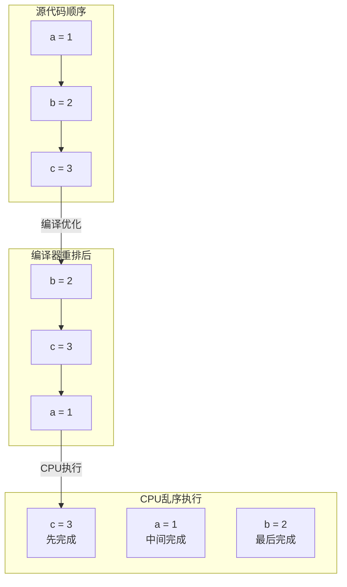
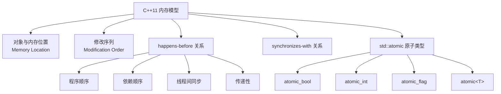
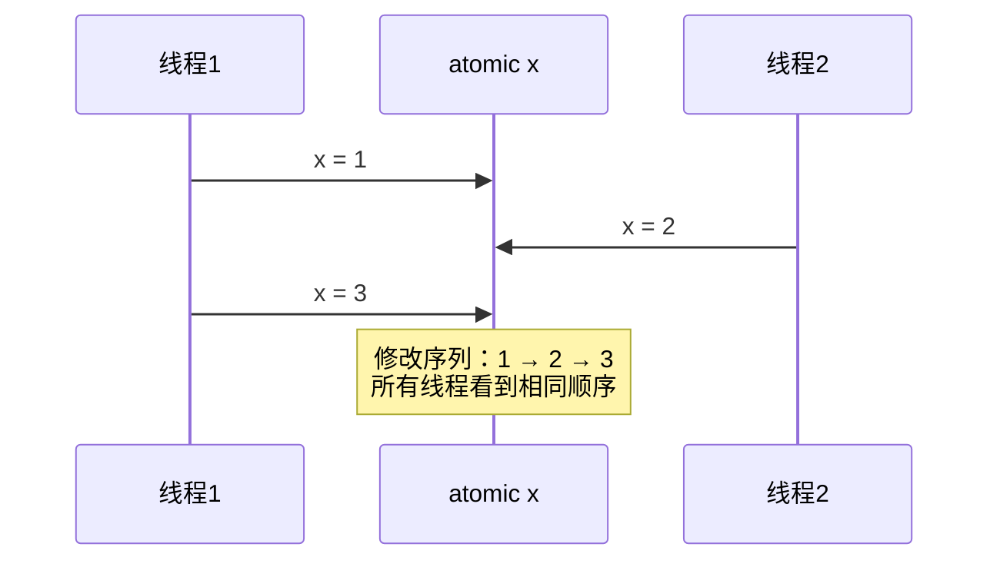
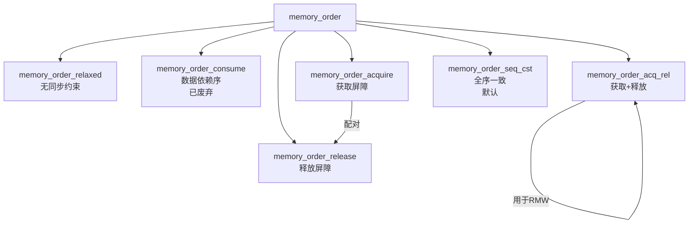
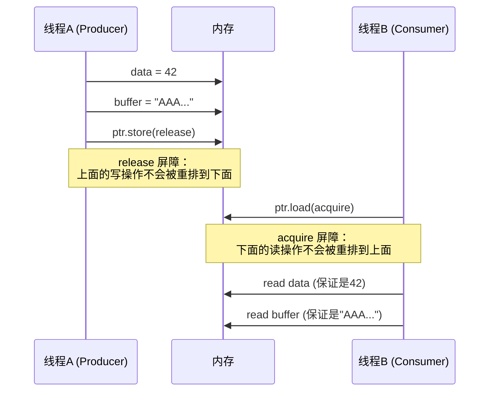
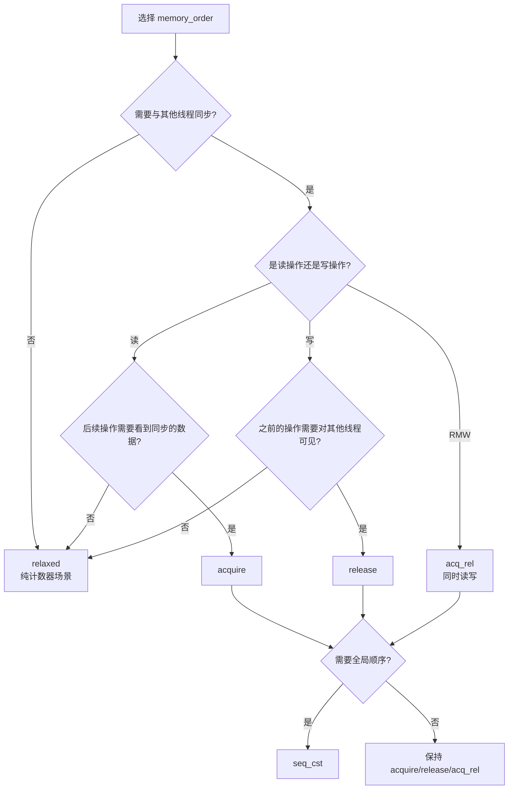
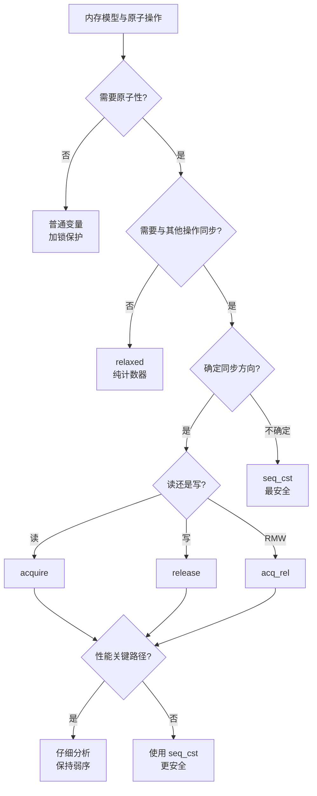

# 内存模型与原子操作详细解析

> **核心结论**：C++11 内存模型定义了多线程程序中内存操作的可见性与顺序性规则。原子操作（std::atomic）是构建无锁算法的基石，但**默认使用 `memory_order_seq_cst` 是最安全的选择**，仅在性能关键路径且充分理解后才考虑使用弱内存序。ARM 平台的弱内存模型比 x86 更容易暴露并发 Bug。

---

## 1. Why — 为什么内存模型如此重要

**结论先行**：不理解内存模型，你的多线程代码可能在 x86 上工作正常，却在 ARM 手机上崩溃。

### 1.1 编译器重排序 + CPU 乱序执行

现代处理器和编译器为了性能会重排指令：



**重排序的三个来源**：

| 来源 | 描述 | 影响范围 |
|-----|------|---------|
| **编译器重排** | 优化指令顺序提高流水线效率 | 所有平台 |
| **CPU 乱序执行** | 超标量 CPU 并行执行无依赖指令 | 所有现代 CPU |
| **存储缓冲区** | 写操作先存入 Store Buffer，延迟刷新 | 多核系统 |

### 1.2 经典 Bug 案例

**案例：flag 变量在另一个线程不可见**

```cpp
// 错误代码：没有同步保护
int data = 0;
bool ready = false;  // 不是 atomic！

// 线程 A（生产者）
void producer() {
    data = 42;        // (1)
    ready = true;     // (2)
}

// 线程 B（消费者）
void consumer() {
    while (!ready);   // (3) 可能永远循环！
    assert(data == 42);  // (4) 即使退出循环，也可能失败！
}
```

**为什么会出问题？**

```
┌─────────────────────────────────────────────────────────────┐
│                    可能的执行序列                            │
├─────────────────────────────────────────────────────────────┤
│  问题1：编译器将 (3) 优化为无限循环                          │
│         while (!ready); → bool cached = ready; while(!cached);│
│         编译器不知道 ready 会被其他线程修改                   │
│                                                              │
│  问题2：即使看到 ready=true，data 可能还没写入               │
│         线程B:  load ready → true                            │
│         但 data 可能还在线程A的 Store Buffer 中              │
│                                                              │
│  问题3：CPU 重排序 (1)(2) 的执行顺序                         │
│         ARM 可能先执行 (2)，后执行 (1)                       │
└─────────────────────────────────────────────────────────────┘
```

### 1.3 ARM vs x86 的内存模型差异

**核心差异**：x86 是强内存模型（TSO），ARM 是弱内存模型。

| 特性 | x86/x64 (TSO) | ARM/ARM64 |
|-----|--------------|-----------|
| Store-Store 重排 | 不允许 | 允许 |
| Load-Load 重排 | 不允许 | 允许 |
| Load-Store 重排 | 不允许 | 允许 |
| Store-Load 重排 | 允许 | 允许 |
| 内存屏障指令 | `mfence`（很少需要） | `dmb`/`dsb`/`isb`（经常需要） |

**实际影响**：

```cpp
// 在 x86 上可能"碰巧"正确，在 ARM 上崩溃
std::atomic<bool> x{false}, y{false};
int r1 = 0, r2 = 0;

// 线程 1
void thread1() {
    x.store(true, std::memory_order_relaxed);
    r1 = y.load(std::memory_order_relaxed);
}

// 线程 2
void thread2() {
    y.store(true, std::memory_order_relaxed);
    r2 = x.load(std::memory_order_relaxed);
}

// x86: 几乎不可能 r1=0 && r2=0
// ARM: r1=0 && r2=0 完全可能发生！
```

---

## 2. What — C++11 内存模型

**MECE 分类**：C++11 内存模型由 5 个互相关联但独立定义的概念组成。



### 2.1 对象与内存位置

**内存位置（Memory Location）定义**：

```cpp
struct Example {
    int a;         // 占用一个内存位置
    int b;         // 占用一个内存位置
    int c : 10;    // 
    int d : 10;    // c 和 d 可能共享一个内存位置（位域）
    int : 0;       // 零宽度位域，强制下一个位域另起一个位置
    int e : 10;    // 新的内存位置
};
```

**数据竞争定义**：

> 如果两个线程访问**同一内存位置**，且至少有一个是写操作，且没有 happens-before 关系，则存在**数据竞争（Data Race）**，这是未定义行为。

### 2.2 修改序列（Modification Order）

每个原子对象都有一个**全局一致的修改序列**，所有线程观察到的修改顺序相同：



### 2.3 happens-before 关系

**建立 happens-before 的六种方式**：

| 方式 | 描述 | 示例 |
|-----|------|-----|
| **程序顺序** | 同一线程内，语句按代码顺序执行 | `a = 1; b = 2;` |
| **同步操作** | release 同步到 acquire | `store(release)` → `load(acquire)` |
| **线程创建** | 父线程创建操作 → 子线程首条语句 | `std::thread` 构造 |
| **线程 join** | 子线程最后语句 → 父线程 join 返回 | `t.join()` |
| **mutex** | unlock → 下一次 lock | `m.unlock()` → `m.lock()` |
| **传递性** | A hb B, B hb C → A hb C | 链式推导 |

```cpp
// happens-before 示例
int data = 0;
std::atomic<bool> ready{false};

void writer() {
    data = 42;                                    // (1)
    ready.store(true, std::memory_order_release); // (2)
}
// (1) happens-before (2) 因为程序顺序

void reader() {
    while (!ready.load(std::memory_order_acquire)); // (3)
    assert(data == 42);                              // (4)
}
// (3) happens-before (4) 因为程序顺序
// (2) synchronizes-with (3) 因为 release-acquire
// 因此 (1) happens-before (4)，断言一定成功
```

### 2.4 synchronizes-with 关系

**synchronizes-with 建立条件**：


**关键要点**：
- `store(release)` 后的 `load(acquire)` **必须读到该 store 的值**才能建立同步
- 如果 load 读到的是更早的值，则不建立同步关系

### 2.5 std::atomic 类型

**原子类型一览**：

| 类型 | 说明 | 是否 lock-free |
|-----|------|---------------|
| `std::atomic_flag` | 最简单的原子类型，保证 lock-free | 总是 |
| `std::atomic_bool` | 原子布尔 | 通常 |
| `std::atomic<int>` | 原子整数 | 通常 |
| `std::atomic<T*>` | 原子指针 | 通常 |
| `std::atomic<T>` | 任意可平凡拷贝类型 | 取决于大小 |
| `std::atomic_ref<T>` (C++20) | 非原子对象的原子视图 | 取决于大小 |

**检查 lock-free 性质**：

```cpp
#include <atomic>
#include <iostream>

void check_lock_free() {
    std::cout << "atomic<bool> is lock-free: " 
              << std::atomic<bool>{}.is_lock_free() << "\n";
    std::cout << "atomic<int> is lock-free: "
              << std::atomic<int>{}.is_lock_free() << "\n";
    std::cout << "atomic<long long> is lock-free: "
              << std::atomic<long long>{}.is_lock_free() << "\n";
    
    // 大结构体可能不是 lock-free
    struct Large { int data[100]; };
    std::cout << "atomic<Large> is lock-free: "
              << std::atomic<Large>{}.is_lock_free() << "\n";  // 可能输出 false
}
```

---

## 3. How — memory_order 六种语义详解

### 3.1 memory_order 总览



**语义强度排序（从弱到强）**：

```
relaxed < consume < acquire = release < acq_rel < seq_cst
```

### 3.2 memory_order_relaxed

**语义**：仅保证原子性，不提供任何顺序保证。

**适用场景**：独立计数器，不需要与其他操作同步。

```cpp
#include <atomic>
#include <thread>
#include <vector>

std::atomic<int> counter{0};

void increment_relaxed() {
    for (int i = 0; i < 10000; ++i) {
        // 仅需要原子性，不需要顺序保证
        counter.fetch_add(1, std::memory_order_relaxed);
    }
}

void relaxed_counter_example() {
    std::vector<std::thread> threads;
    for (int i = 0; i < 4; ++i) {
        threads.emplace_back(increment_relaxed);
    }
    for (auto& t : threads) {
        t.join();
    }
    // counter 一定是 40000，原子性保证
    assert(counter.load(std::memory_order_relaxed) == 40000);
}
```

**内存顺序图**：

```
┌─────────────────────────────────────────────────────────────┐
│                 memory_order_relaxed                         │
├─────────────────────────────────────────────────────────────┤
│  线程A:  a = 1; x.store(2, relaxed); b = 3;                 │
│          ↑       ↑                    ↑                      │
│          可以被重排到 store 之后                              │
│          x.store 也可以被重排到 a=1 之前                     │
│                                                              │
│  线程B:  看到 x=2 时，a 和 b 可能是任意值                    │
└─────────────────────────────────────────────────────────────┘
```

### 3.3 memory_order_acquire / memory_order_release

**语义**：
- `release`：当前线程的所有写操作在 store 之前完成
- `acquire`：当前线程的所有读操作在 load 之后开始

**适用场景**：生产者-消费者模式、自旋锁实现。

```cpp
#include <atomic>
#include <thread>
#include <cassert>

struct Data {
    int value;
    char buffer[1024];
};

std::atomic<Data*> shared_data{nullptr};
Data prepared_data;

void producer() {
    // 准备数据
    prepared_data.value = 42;
    std::memset(prepared_data.buffer, 'A', sizeof(prepared_data.buffer));
    
    // release store：上面的写操作在此之前对其他线程可见
    shared_data.store(&prepared_data, std::memory_order_release);
}

void consumer() {
    Data* data;
    // acquire load：下面的读操作在此之后看到一致的数据
    while ((data = shared_data.load(std::memory_order_acquire)) == nullptr) {
        // 等待
    }
    
    // 保证看到完整的 prepared_data
    assert(data->value == 42);
    assert(data->buffer[0] == 'A');
}
```

**内存顺序图**：



### 3.4 memory_order_acq_rel

**语义**：同时具有 acquire 和 release 语义，用于 Read-Modify-Write 操作。

```cpp
#include <atomic>
#include <thread>

std::atomic<int> sync_var{0};
int shared_data[3] = {0, 0, 0};

void thread1() {
    shared_data[0] = 1;
    // fetch_add 是 RMW 操作，使用 acq_rel
    int old = sync_var.fetch_add(1, std::memory_order_acq_rel);
    // 如果 old >= 1，说明 thread2 已经执行过 fetch_add
    // 此时保证能看到 thread2 的 shared_data[1] = 2
    if (old >= 1) {
        assert(shared_data[1] == 2);
    }
}

void thread2() {
    shared_data[1] = 2;
    int old = sync_var.fetch_add(1, std::memory_order_acq_rel);
    if (old >= 1) {
        assert(shared_data[0] == 1);
    }
}
```

### 3.5 memory_order_seq_cst

**语义**：全序一致性，所有 seq_cst 操作在所有线程看来顺序相同。

**默认选择**：当不确定时，使用 seq_cst 是最安全的。

```cpp
#include <atomic>
#include <thread>
#include <cassert>

std::atomic<bool> x{false}, y{false};
std::atomic<int> z{0};

void write_x() {
    x.store(true, std::memory_order_seq_cst);
}

void write_y() {
    y.store(true, std::memory_order_seq_cst);
}

void read_x_then_y() {
    while (!x.load(std::memory_order_seq_cst));
    if (y.load(std::memory_order_seq_cst)) {
        ++z;
    }
}

void read_y_then_x() {
    while (!y.load(std::memory_order_seq_cst));
    if (x.load(std::memory_order_seq_cst)) {
        ++z;
    }
}

void seq_cst_example() {
    std::thread t1(write_x);
    std::thread t2(write_y);
    std::thread t3(read_x_then_y);
    std::thread t4(read_y_then_x);
    
    t1.join(); t2.join(); t3.join(); t4.join();
    
    // seq_cst 保证：z 不可能是 0
    // 因为 x 和 y 的 store 存在全局顺序
    assert(z.load() != 0);
}
```

### 3.6 memory_order_consume（已废弃）

**原意**：比 acquire 更弱，只对有数据依赖的操作提供顺序保证。

**现状**：所有编译器都将其实现为 acquire，C++17 起不推荐使用。

```cpp
// 不推荐使用
std::atomic<Data*> ptr;

void consumer_with_consume() {
    Data* p = ptr.load(std::memory_order_consume);  // 实际上等同于 acquire
    if (p) {
        // 理论上只保证 p->x 的访问与 load 有序
        // 但实际实现中保证所有后续访问
        int x = p->value;
    }
}
```

### 3.7 语义选择决策树



---

## 4. CAS 操作详解

### 4.1 compare_exchange_weak vs compare_exchange_strong

**函数签名**：

```cpp
bool compare_exchange_weak(T& expected, T desired,
                           memory_order success,
                           memory_order failure);

bool compare_exchange_strong(T& expected, T desired,
                             memory_order success,
                             memory_order failure);
```

**关键差异**：

| 特性 | compare_exchange_weak | compare_exchange_strong |
|-----|----------------------|------------------------|
| 虚假失败 | 可能发生 | 不会发生 |
| 性能 | 通常更快 | 略慢 |
| 使用场景 | 循环中 | 单次调用或非循环 |
| ARM 实现 | 单次 LL/SC | 循环 LL/SC |

**虚假失败（Spurious Failure）**：

```cpp
// weak 版本：即使 *this == expected，也可能返回 false
// 这在 ARM 的 LL/SC 实现中可能发生（缓存行被其他操作干扰）

std::atomic<int> value{0};

void weak_cas_loop() {
    int expected = 0;
    // weak 版本必须在循环中使用
    while (!value.compare_exchange_weak(expected, 1,
                                        std::memory_order_acq_rel)) {
        // 失败时 expected 被更新为当前值
        if (expected != 0) {
            // 真正的失败：值已被其他线程修改
            return;
        }
        // 虚假失败：expected 还是 0，继续尝试
    }
}

void strong_cas_single() {
    int expected = 0;
    // strong 版本可以单次调用
    if (value.compare_exchange_strong(expected, 1,
                                      std::memory_order_acq_rel)) {
        // 成功
    } else {
        // 一定是真正的失败
    }
}
```

### 4.2 无锁计数器实现

```cpp
#include <atomic>

template<typename T>
class LockFreeCounter {
public:
    LockFreeCounter(T initial = 0) : value_(initial) {}
    
    T increment() {
        T old = value_.load(std::memory_order_relaxed);
        while (!value_.compare_exchange_weak(old, old + 1,
                                             std::memory_order_relaxed)) {
            // old 已被更新为当前值，继续尝试
        }
        return old;
    }
    
    // 更简洁的写法（推荐）
    T increment_simple() {
        return value_.fetch_add(1, std::memory_order_relaxed);
    }
    
    T get() const {
        return value_.load(std::memory_order_relaxed);
    }
    
private:
    std::atomic<T> value_;
};
```

### 4.3 自旋锁实现

```cpp
#include <atomic>
#include <thread>

class SpinLock {
public:
    void lock() {
        // 自旋等待直到获取锁
        while (flag_.test_and_set(std::memory_order_acquire)) {
            // 可选：添加 pause 指令降低功耗
            #if defined(__x86_64__) || defined(_M_X64)
            __builtin_ia32_pause();
            #elif defined(__aarch64__)
            asm volatile("yield");
            #endif
        }
    }
    
    void unlock() {
        flag_.clear(std::memory_order_release);
    }
    
    bool try_lock() {
        return !flag_.test_and_set(std::memory_order_acquire);
    }
    
private:
    std::atomic_flag flag_ = ATOMIC_FLAG_INIT;
};

// 改进版：带退避的自旋锁
class BackoffSpinLock {
public:
    void lock() {
        int backoff = 1;
        while (flag_.test_and_set(std::memory_order_acquire)) {
            for (int i = 0; i < backoff; ++i) {
                #if defined(__x86_64__)
                __builtin_ia32_pause();
                #elif defined(__aarch64__)
                asm volatile("yield");
                #endif
            }
            backoff = std::min(backoff * 2, 1024);  // 指数退避
        }
    }
    
    void unlock() {
        flag_.clear(std::memory_order_release);
    }
    
private:
    std::atomic_flag flag_ = ATOMIC_FLAG_INIT;
};
```

### 4.4 ARM 平台 LL/SC 指令

**Load-Link / Store-Conditional**：

```
┌─────────────────────────────────────────────────────────────┐
│                    ARM LL/SC 实现 CAS                        │
├─────────────────────────────────────────────────────────────┤
│  LDXR  x1, [x0]     ; Load-Exclusive：读取并标记            │
│  CMP   x1, x2       ; 比较期望值                            │
│  BNE   fail         ; 不相等则跳转                           │
│  STXR  w3, x4, [x0] ; Store-Exclusive：条件写入             │
│  CBNZ  w3, retry    ; w3!=0 表示失败，重试                   │
│                                                              │
│  失败原因：                                                  │
│  1. 另一个核写入了同一缓存行（预期的竞争）                   │
│  2. 中断/异常打断了 LL/SC 序列（虚假失败）                   │
│  3. 缓存行被驱逐                                             │
└─────────────────────────────────────────────────────────────┘
```

**x86 vs ARM CAS 实现差异**：

| 平台 | 指令 | 虚假失败 | 原子性保证 |
|-----|------|---------|-----------|
| x86 | `lock cmpxchg` | 不会 | 总线锁/缓存锁 |
| ARM | `ldxr`/`stxr` | 可能 | Exclusive Monitor |

---

## 5. std::atomic_thread_fence

### 5.1 fence 类型

```cpp
#include <atomic>

// acquire fence：阻止后面的读写被重排到前面
std::atomic_thread_fence(std::memory_order_acquire);

// release fence：阻止前面的读写被重排到后面
std::atomic_thread_fence(std::memory_order_release);

// seq_cst fence：全屏障
std::atomic_thread_fence(std::memory_order_seq_cst);
```

### 5.2 fence 与 atomic 操作的配合

**用 fence 替代 atomic 的 memory_order**：

```cpp
std::atomic<int> data{0};
std::atomic<bool> ready{false};

// 方式1：使用 atomic 的 memory_order
void producer_v1() {
    data.store(42, std::memory_order_relaxed);
    ready.store(true, std::memory_order_release);
}

void consumer_v1() {
    while (!ready.load(std::memory_order_acquire));
    assert(data.load(std::memory_order_relaxed) == 42);
}

// 方式2：使用 fence（等效但更显式）
void producer_v2() {
    data.store(42, std::memory_order_relaxed);
    std::atomic_thread_fence(std::memory_order_release);
    ready.store(true, std::memory_order_relaxed);
}

void consumer_v2() {
    while (!ready.load(std::memory_order_relaxed));
    std::atomic_thread_fence(std::memory_order_acquire);
    assert(data.load(std::memory_order_relaxed) == 42);
}
```

### 5.3 fence 使用场景与注意事项

**适用场景**：

1. 批量同步多个 relaxed 原子操作
2. 与非原子操作配合（如锁实现中）
3. 更精确控制屏障位置

**示例：批量同步**：

```cpp
std::atomic<int> a{0}, b{0}, c{0};
std::atomic<bool> ready{false};

void batch_producer() {
    a.store(1, std::memory_order_relaxed);
    b.store(2, std::memory_order_relaxed);
    c.store(3, std::memory_order_relaxed);
    
    // 一个 fence 同步所有前面的 relaxed store
    std::atomic_thread_fence(std::memory_order_release);
    ready.store(true, std::memory_order_relaxed);
}

void batch_consumer() {
    while (!ready.load(std::memory_order_relaxed));
    std::atomic_thread_fence(std::memory_order_acquire);
    
    // 保证看到所有 a, b, c 的值
    assert(a.load(std::memory_order_relaxed) == 1);
    assert(b.load(std::memory_order_relaxed) == 2);
    assert(c.load(std::memory_order_relaxed) == 3);
}
```

---

## 6. 跨平台差异

### 6.1 ARM 弱内存序 vs x86 强内存序

```
┌─────────────────────────────────────────────────────────────┐
│              内存模型强度对比                                │
├─────────────────────────────────────────────────────────────┤
│  最强 ─────────────────────────────────────────────── 最弱  │
│                                                              │
│  Sequential   x86/x64     SPARC     ARM      Alpha          │
│  Consistency  (TSO)       (RMO)     (Weak)   (最弱)         │
│                                                              │
│  ←──────── 限制更多，更安全 ────── 限制更少，更快 ────────→  │
└─────────────────────────────────────────────────────────────┘
```

### 6.2 ARM 屏障指令

| 指令 | 全称 | 功能 |
|-----|------|-----|
| `DMB` | Data Memory Barrier | 数据内存屏障，保证内存操作顺序 |
| `DSB` | Data Synchronization Barrier | 数据同步屏障，等待所有内存操作完成 |
| `ISB` | Instruction Synchronization Barrier | 指令同步屏障，刷新流水线 |

**C++ memory_order 到 ARM 指令的映射**：

| memory_order | ARM64 Load | ARM64 Store |
|-------------|------------|-------------|
| relaxed | `LDR` | `STR` |
| acquire | `LDAR` (或 `LDR` + `DMB ISHLD`) | - |
| release | - | `STLR` (或 `DMB ISHST` + `STR`) |
| seq_cst | `LDAR` | `STLR` (+ `DMB ISH`) |

### 6.3 编译器屏障 vs CPU 屏障

```cpp
// 编译器屏障：仅阻止编译器重排，不阻止 CPU 重排
#define COMPILER_BARRIER() asm volatile("" ::: "memory")

// CPU 屏障：阻止 CPU 重排
#ifdef __x86_64__
#define CPU_BARRIER() asm volatile("mfence" ::: "memory")
#elif defined(__aarch64__)
#define CPU_BARRIER() asm volatile("dmb ish" ::: "memory")
#endif

// std::atomic_signal_fence：仅编译器屏障
void signal_handler_example() {
    volatile sig_atomic_t flag = 0;
    
    // 在信号处理器和主线程之间同步
    std::atomic_signal_fence(std::memory_order_release);
    flag = 1;
}
```

### 6.4 典型 Bug 案例：x86 正常，ARM 崩溃

```cpp
// 危险代码：依赖 x86 的强内存模型
class BrokenSingleton {
public:
    static BrokenSingleton* instance() {
        if (instance_ == nullptr) {  // (1) 第一次检查
            std::lock_guard<std::mutex> lock(mutex_);
            if (instance_ == nullptr) {  // (2) 第二次检查
                instance_ = new BrokenSingleton();  // (3) 分配 + 构造 + 赋值
            }
        }
        return instance_;
    }
    
private:
    // 问题：instance_ 不是 atomic
    static BrokenSingleton* instance_;
    static std::mutex mutex_;
};

// 问题分析：
// (3) 可能被重排为：
//   - 分配内存
//   - 赋值给 instance_（此时对象还未构造！）
//   - 构造对象
// 在 x86 上不太可能发生，在 ARM 上很可能发生

// 正确实现
class CorrectSingleton {
public:
    static CorrectSingleton* instance() {
        CorrectSingleton* tmp = instance_.load(std::memory_order_acquire);
        if (tmp == nullptr) {
            std::lock_guard<std::mutex> lock(mutex_);
            tmp = instance_.load(std::memory_order_relaxed);
            if (tmp == nullptr) {
                tmp = new CorrectSingleton();
                instance_.store(tmp, std::memory_order_release);
            }
        }
        return tmp;
    }
    
private:
    static std::atomic<CorrectSingleton*> instance_;
    static std::mutex mutex_;
};

// 最佳实践：使用 C++11 静态局部变量（线程安全）
CorrectSingleton& best_singleton() {
    static CorrectSingleton instance;
    return instance;
}
```

---

## 7. 性能数据

### 7.1 各 memory_order 在 ARM/x86 上的性能开销

| memory_order | x86-64 (ns) | ARM64 (ns) | 说明 |
|-------------|-------------|------------|------|
| relaxed (load) | 1 | 1 | 无屏障 |
| relaxed (store) | 1 | 1 | 无屏障 |
| acquire (load) | 1-2 | 3-5 | ARM 需要 LDAR |
| release (store) | 1-2 | 3-5 | ARM 需要 STLR |
| acq_rel (RMW) | 15-20 | 20-30 | lock 前缀/LL-SC |
| seq_cst (load) | 2-5 | 5-10 | ARM 需要额外 DMB |
| seq_cst (store) | 2-5 | 10-20 | ARM 需要 STLR + DMB |
| seq_cst (RMW) | 20-30 | 30-50 | 最强同步 |

### 7.2 atomic 操作 vs mutex 保护

```
┌────────────────────────────────────────────────────────────┐
│        原子操作 vs Mutex 性能对比（单位：纳秒）             │
├────────────────────────────────────────────────────────────┤
│  操作类型                │  Atomic    │  Mutex            │
├────────────────────────────────────────────────────────────┤
│  无竞争读取              │     3      │     20            │
│  无竞争写入              │     5      │     25            │
│  无竞争 CAS              │    15      │     30            │
├────────────────────────────────────────────────────────────┤
│  4线程竞争读取           │    20      │     80            │
│  4线程竞争写入           │    50      │    200            │
│  4线程竞争 CAS           │   100      │    250            │
├────────────────────────────────────────────────────────────┤
│  8线程竞争（高竞争）     │   200      │    500            │
└────────────────────────────────────────────────────────────┘
```

### 7.3 False Sharing 对 atomic 性能的影响

```cpp
#include <atomic>
#include <thread>
#include <chrono>
#include <vector>

// 坏的布局：两个 atomic 在同一缓存行
struct BadLayout {
    std::atomic<long> counter1{0};
    std::atomic<long> counter2{0};  // 与 counter1 相邻
};

// 好的布局：padding 分离缓存行
struct GoodLayout {
    alignas(64) std::atomic<long> counter1{0};
    alignas(64) std::atomic<long> counter2{0};
};

void benchmark_false_sharing() {
    BadLayout bad;
    GoodLayout good;
    
    constexpr int ITERATIONS = 10000000;
    
    // 测试坏布局
    auto start = std::chrono::high_resolution_clock::now();
    std::thread t1([&]{ for(int i = 0; i < ITERATIONS; ++i) ++bad.counter1; });
    std::thread t2([&]{ for(int i = 0; i < ITERATIONS; ++i) ++bad.counter2; });
    t1.join(); t2.join();
    auto bad_time = std::chrono::high_resolution_clock::now() - start;
    
    // 测试好布局
    start = std::chrono::high_resolution_clock::now();
    std::thread t3([&]{ for(int i = 0; i < ITERATIONS; ++i) ++good.counter1; });
    std::thread t4([&]{ for(int i = 0; i < ITERATIONS; ++i) ++good.counter2; });
    t3.join(); t4.join();
    auto good_time = std::chrono::high_resolution_clock::now() - start;
    
    // GoodLayout 通常快 2-5 倍
    printf("Bad layout:  %ld ms\n", 
           std::chrono::duration_cast<std::chrono::milliseconds>(bad_time).count());
    printf("Good layout: %ld ms\n",
           std::chrono::duration_cast<std::chrono::milliseconds>(good_time).count());
}
```

**典型结果**：

| 场景 | BadLayout | GoodLayout | 性能提升 |
|-----|-----------|------------|---------|
| 2 线程 | 450 ms | 150 ms | 3x |
| 4 线程 | 1200 ms | 200 ms | 6x |
| 8 线程 | 2500 ms | 250 ms | 10x |

---

## 8. 常见问题与最佳实践

### 8.1 常见错误

**错误 1：误解 atomic 的作用范围**

```cpp
// 错误：atomic 不保护结构体成员
struct Data {
    int x;
    int y;
};
std::atomic<Data*> ptr;

void wrong_usage() {
    Data* p = ptr.load();
    p->x = 1;  // 不是原子的！
    p->y = 2;  // 不是原子的！
}
```

**错误 2：忽略 CAS 的返回值**

```cpp
std::atomic<int> value{0};

void wrong_cas() {
    int expected = 0;
    value.compare_exchange_strong(expected, 1);  // 忽略返回值
    // expected 可能已被修改！
}

void correct_cas() {
    int expected = 0;
    if (value.compare_exchange_strong(expected, 1)) {
        // 成功
    } else {
        // 失败，expected 现在是实际值
        printf("CAS failed, actual value: %d\n", expected);
    }
}
```

**错误 3：过度使用 seq_cst**

```cpp
// 不必要的 seq_cst
std::atomic<int> counter{0};

void over_sync() {
    // 纯计数器不需要 seq_cst
    counter.fetch_add(1, std::memory_order_seq_cst);  // 过度同步
}

void optimized() {
    counter.fetch_add(1, std::memory_order_relaxed);  // 足够了
}
```

### 8.2 最佳实践清单

| 场景 | 推荐做法 | 避免 |
|-----|---------|-----|
| 初学者/不确定 | 使用默认 seq_cst | 盲目优化 |
| 纯计数器 | relaxed | 过度同步 |
| 生产者-消费者 | release + acquire | relaxed |
| 单例/双检锁 | C++11 静态局部变量 | 手动实现 |
| 自旋锁 | test_and_set + release/acquire | 忙等待无 pause |
| 无锁结构 | weak CAS 在循环中 | strong CAS 在循环中 |
| 跨平台代码 | 假设最弱内存模型(ARM) | 依赖 x86 行为 |

### 8.3 调试技巧

**使用 ThreadSanitizer (TSan)**：

```bash
# 编译时启用 TSan
g++ -fsanitize=thread -g -o test test.cpp

# 运行
./test

# TSan 会报告数据竞争：
# WARNING: ThreadSanitizer: data race
#   Write of size 4 at 0x... by thread T1:
#     #0 producer() test.cpp:10
#   Previous read of size 4 at 0x... by thread T2:
#     #1 consumer() test.cpp:15
```

---

## 总结



**关键结论回顾**：

1. **默认使用 seq_cst**：安全第一，性能优化是后期工作
2. **ARM 更严格**：在 x86 上工作不代表在 ARM 上工作
3. **理解 happens-before**：这是正确性的基础
4. **weak CAS 用于循环**：strong CAS 用于单次检查
5. **避免 false sharing**：使用 alignas(64) 或 padding
6. **使用 TSan**：CI 中必须启用数据竞争检测

---

## 参考资源

- ISO/IEC 14882:2020 - C++20 Standard, Clause 31 (Atomic operations library)
- Herb Sutter - "atomic Weapons" (CppCon 演讲)
- Jeff Preshing - Memory Reordering Caught in the Act (博客)
- ARM Architecture Reference Manual - Memory Model
- Intel 64 and IA-32 Architectures Software Developer's Manual - Memory Ordering
