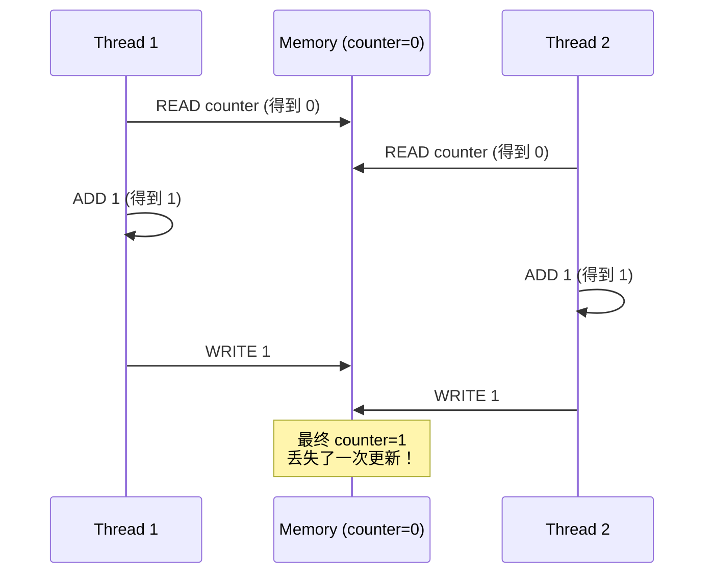
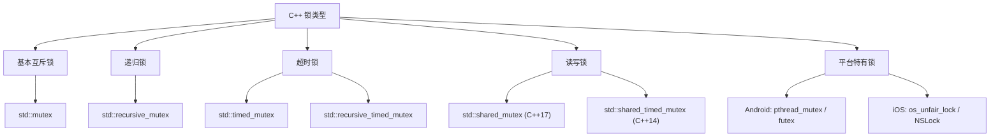
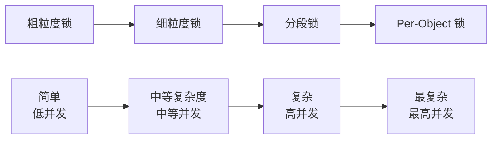
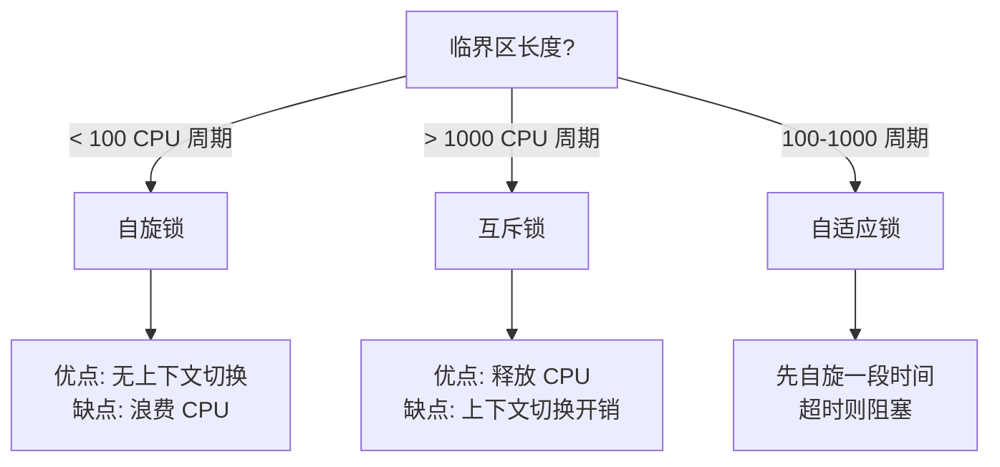
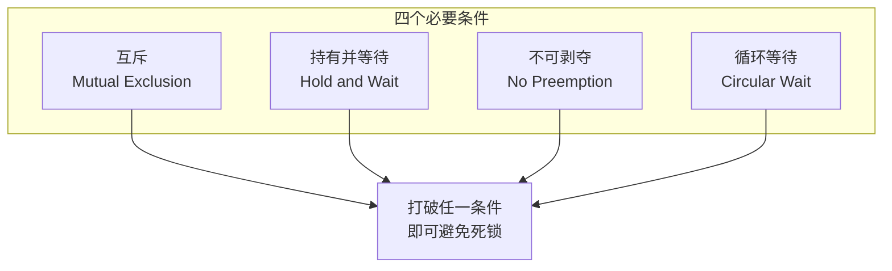
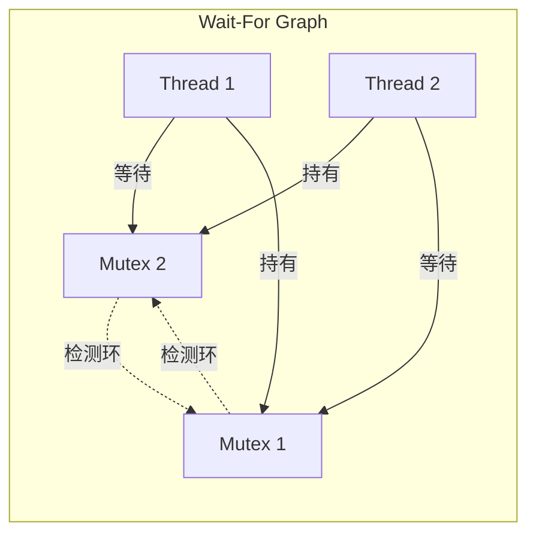
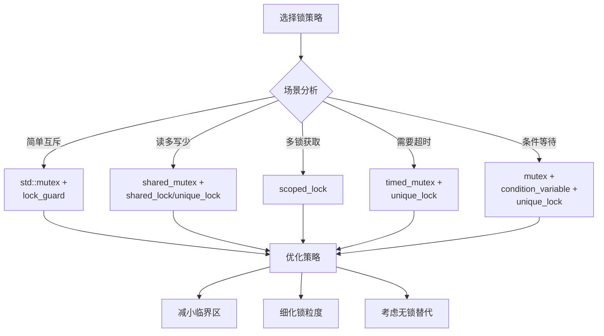

# 互斥锁与读写锁详细解析

> **核心结论**：锁是多线程编程中保护共享数据的基础工具。选择正确的锁类型和 RAII 管理器，配合锁粒度优化和死锁避免策略，可在保证正确性的前提下最大化并发性能。

---

## 核心结论（TL;DR）

| 决策点 | 推荐方案 | 原因 |
|-------|---------|------|
| **简单互斥** | `std::lock_guard<std::mutex>` | 最小开销，自动释放 |
| **需要灵活控制** | `std::unique_lock<std::mutex>` | 支持延迟锁定、条件变量、移动 |
| **读多写少** | `std::shared_mutex` + `shared_lock/unique_lock` | 读操作并发，写操作独占 |
| **多锁获取** | `std::scoped_lock` | 自动避免死锁 |
| **iOS 高性能** | `os_unfair_lock` | 比 pthread_mutex 快 2-3 倍 |
| **临界区极短** | 自旋锁 | 避免上下文切换开销 |

**一句话总结**：优先使用 `std::scoped_lock`，它能处理 90% 的场景；只在需要条件变量或延迟锁定时用 `unique_lock`。

---

## 1. Why — 为什么需要锁

### 1.1 数据竞争的根本原因

**结论先行**：数据竞争源于 read-modify-write 操作的非原子性。看似简单的 `counter++` 实际上是三条独立指令，可能被其他线程打断。

```cpp
// 这段代码存在数据竞争
int counter = 0;

void increment() {
    counter++;  // 非原子操作！
}
```

**汇编层面分析**：

```asm
; counter++ 的汇编代码（x86-64）
mov  eax, DWORD PTR counter[rip]   ; 1. 读取 counter 到寄存器
add  eax, 1                         ; 2. 寄存器值 +1
mov  DWORD PTR counter[rip], eax   ; 3. 写回内存
```

**竞争场景时序图**：



### 1.2 不使用锁的严重后果

**真实崩溃案例：双重检查锁定（Double-Checked Locking）失败**

```cpp
// 错误示例：无锁的单例实现
class Singleton {
    static Singleton* instance;
public:
    static Singleton* getInstance() {
        if (instance == nullptr) {          // 第一次检查
            if (instance == nullptr) {      // 第二次检查（但没有锁！）
                instance = new Singleton(); // 非原子操作
            }
        }
        return instance;
    }
};

// 问题：
// 1. instance = new Singleton() 包含三步：分配内存、构造对象、赋值指针
// 2. 编译器可能重排为：分配内存 → 赋值指针 → 构造对象
// 3. 线程 B 可能拿到指向未构造完成对象的指针 → 崩溃！
```

**后果分类**：

| 后果类型 | 表现 | 检测难度 |
|---------|------|---------|
| **数据损坏** | 数据结构状态不一致，如链表断裂 | 中 |
| **崩溃** | 访问非法内存、空指针解引用 | 易 |
| **静默错误** | 计算结果不正确，但程序继续运行 | 极难 |
| **死锁** | 程序卡住，无响应 | 易检测难定位 |

### 1.3 锁的本质作用

锁提供两个核心保证：

1. **互斥性（Mutual Exclusion）**：同一时刻只有一个线程能进入临界区
2. **可见性（Visibility）**：释放锁前的所有写操作，对获取锁后的线程可见


---

## 2. What — C++ 锁类型体系

**MECE 分类**：按功能特性将 C++ 标准库和平台特有锁分为互不重叠的类别。



### 2.1 std::mutex — 基本互斥锁

**特点**：最基础、最常用、开销最小的锁类型。

```cpp
#include <mutex>
#include <thread>
#include <iostream>

class Counter {
    int value_ = 0;
    std::mutex mutex_;
    
public:
    void increment() {
        mutex_.lock();    // 获取锁
        ++value_;         // 临界区
        mutex_.unlock();  // 释放锁
    }
    
    int get() const {
        // 注意：即使是读操作也需要同步
        // 这里简化处理，实际应使用 const_cast 或 mutable
        return value_;
    }
};
```

**关键规则**：
- 同一线程不能对同一 `mutex` 调用两次 `lock()`（未定义行为）
- `unlock()` 必须由持有锁的线程调用
- 不要手动调用 `lock/unlock`，使用 RAII 包装器

### 2.2 std::recursive_mutex — 递归锁

**适用场景**：同一线程需要多次获取同一锁（如递归函数、回调嵌套）。

```cpp
#include <mutex>

class TreeNode {
    int value_;
    TreeNode* left_ = nullptr;
    TreeNode* right_ = nullptr;
    mutable std::recursive_mutex mutex_;
    
public:
    // 递归遍历需要递归锁
    int sum() const {
        std::lock_guard<std::recursive_mutex> lock(mutex_);
        int result = value_;
        if (left_) result += left_->sum();   // 递归调用，需要再次获取锁
        if (right_) result += right_->sum();
        return result;
    }
};
```

**开销对比**：

| 锁类型 | 无竞争开销 | 内存占用 | 备注 |
|-------|-----------|---------|------|
| `std::mutex` | 15-25 ns | 40 字节 | 基准 |
| `std::recursive_mutex` | 25-40 ns | 48 字节 | 需要维护计数器和所有者线程 |

**最佳实践**：优先重构代码避免递归锁需求，而非直接使用 `recursive_mutex`。

### 2.3 std::timed_mutex — 超时锁

**适用场景**：需要避免无限等待，实现超时机制。

```cpp
#include <mutex>
#include <chrono>
#include <iostream>

std::timed_mutex resource_mutex;

bool try_access_resource(int timeout_ms) {
    // 尝试在指定时间内获取锁
    if (resource_mutex.try_lock_for(std::chrono::milliseconds(timeout_ms))) {
        std::cout << "获取资源成功\n";
        // 使用资源...
        resource_mutex.unlock();
        return true;
    } else {
        std::cout << "获取资源超时\n";
        return false;
    }
}

// 使用绝对时间点
bool try_access_until(std::chrono::steady_clock::time_point deadline) {
    if (resource_mutex.try_lock_until(deadline)) {
        // 成功获取锁
        resource_mutex.unlock();
        return true;
    }
    return false;
}
```

### 2.4 std::shared_mutex (C++17) — 读写锁

**核心思想**：读操作可并发执行，写操作需要独占访问。

```cpp
#include <shared_mutex>
#include <map>
#include <string>

class ThreadSafeCache {
    std::map<std::string, std::string> cache_;
    mutable std::shared_mutex mutex_;
    
public:
    // 读操作：共享锁，多个线程可同时读取
    std::string get(const std::string& key) const {
        std::shared_lock<std::shared_mutex> lock(mutex_);
        auto it = cache_.find(key);
        return (it != cache_.end()) ? it->second : "";
    }
    
    // 写操作：独占锁，阻塞所有其他读写
    void set(const std::string& key, const std::string& value) {
        std::unique_lock<std::shared_mutex> lock(mutex_);
        cache_[key] = value;
    }
    
    // 读取或创建（需要升级锁）
    std::string get_or_create(const std::string& key, 
                               std::function<std::string()> creator) {
        // 先尝试读取
        {
            std::shared_lock<std::shared_mutex> lock(mutex_);
            auto it = cache_.find(key);
            if (it != cache_.end()) {
                return it->second;
            }
        }
        // 需要写入，获取独占锁
        {
            std::unique_lock<std::shared_mutex> lock(mutex_);
            // 双重检查（可能其他线程已创建）
            auto it = cache_.find(key);
            if (it != cache_.end()) {
                return it->second;
            }
            std::string value = creator();
            cache_[key] = value;
            return value;
        }
    }
};
```

**读写锁适用性分析**：

| 读写比例 | shared_mutex | mutex | 推荐 |
|---------|--------------|-------|------|
| 读 > 90% | 优势明显 | 竞争严重 | shared_mutex |
| 读 70-90% | 有优势 | 尚可 | shared_mutex |
| 读 50-70% | 开销可能不值得 | 更简单 | 视情况而定 |
| 读 < 50% | 无优势 | 更简单高效 | mutex |

### 2.5 平台特有锁

#### Android 平台

```cpp
// 1. pthread_mutex 带错误检查
#include <pthread.h>

pthread_mutex_t debug_mutex;

void init_debug_mutex() {
    pthread_mutexattr_t attr;
    pthread_mutexattr_init(&attr);
    // 启用错误检查：重复加锁会返回错误而非死锁
    pthread_mutexattr_settype(&attr, PTHREAD_MUTEX_ERRORCHECK);
    pthread_mutex_init(&debug_mutex, &attr);
    pthread_mutexattr_destroy(&attr);
}

// 2. futex（Fast Userspace muTEX）- 内核级原语
#include <linux/futex.h>
#include <sys/syscall.h>
#include <unistd.h>
#include <atomic>

class SimpleFutex {
    std::atomic<int> state_{0};  // 0=unlocked, 1=locked
    
public:
    void lock() {
        int expected = 0;
        while (!state_.compare_exchange_strong(expected, 1,
                std::memory_order_acquire)) {
            // CAS 失败，等待
            syscall(SYS_futex, &state_, FUTEX_WAIT, 1, nullptr, nullptr, 0);
            expected = 0;
        }
    }
    
    void unlock() {
        state_.store(0, std::memory_order_release);
        syscall(SYS_futex, &state_, FUTEX_WAKE, 1, nullptr, nullptr, 0);
    }
};
```

#### iOS 平台

```objc
// 1. os_unfair_lock（推荐，iOS 10+）
#import <os/lock.h>

os_unfair_lock lock = OS_UNFAIR_LOCK_INIT;

void critical_section() {
    os_unfair_lock_lock(&lock);
    // 临界区代码
    os_unfair_lock_unlock(&lock);
}

// 2. pthread_rwlock
#import <pthread.h>

pthread_rwlock_t rwlock = PTHREAD_RWLOCK_INITIALIZER;

void read_operation() {
    pthread_rwlock_rdlock(&rwlock);
    // 读取操作
    pthread_rwlock_unlock(&rwlock);
}

void write_operation() {
    pthread_rwlock_wrlock(&rwlock);
    // 写入操作
    pthread_rwlock_unlock(&rwlock);
}

// 3. NSLock（Objective-C 封装）
@interface SafeResource : NSObject
@property (nonatomic, strong) NSLock *lock;
@property (nonatomic, assign) int value;
@end

@implementation SafeResource
- (void)safeIncrement {
    [self.lock lock];
    self.value++;
    [self.lock unlock];
}
@end

// 4. @synchronized（最慢，但最方便）
- (void)synchronizedExample {
    @synchronized(self) {
        // 临界区
    }
}
```

---

## 3. How — RAII 锁管理器

**RAII 原则**：Resource Acquisition Is Initialization，构造时获取锁，析构时释放锁，确保异常安全。

### 3.1 std::lock_guard — 最简单的 RAII

```cpp
#include <mutex>

std::mutex mtx;
int shared_data = 0;

void safe_increment() {
    std::lock_guard<std::mutex> guard(mtx);  // 构造时加锁
    ++shared_data;
    // 函数返回或异常时，guard 析构，自动解锁
}

// C++17 CTAD（类模板参数推导）简化
void safe_increment_cpp17() {
    std::lock_guard guard(mtx);  // 自动推导模板参数
    ++shared_data;
}
```

### 3.2 std::unique_lock — 灵活控制

```cpp
#include <mutex>
#include <condition_variable>

std::mutex mtx;
std::condition_variable cv;
bool ready = false;

// 1. 延迟锁定
void deferred_locking() {
    std::unique_lock<std::mutex> lock(mtx, std::defer_lock);
    // 此时未加锁
    // ... 做一些不需要锁的准备工作 ...
    lock.lock();  // 手动加锁
    // 临界区
}

// 2. 尝试锁定
void try_locking() {
    std::unique_lock<std::mutex> lock(mtx, std::try_to_lock);
    if (lock.owns_lock()) {
        // 成功获取锁
    } else {
        // 未能获取锁
    }
}

// 3. 配合条件变量（必须使用 unique_lock）
void wait_for_signal() {
    std::unique_lock<std::mutex> lock(mtx);
    cv.wait(lock, [] { return ready; });  // wait 内部需要解锁再加锁
    // 处理数据
}

// 4. 移动语义：转移锁的所有权
std::unique_lock<std::mutex> get_lock() {
    std::unique_lock<std::mutex> lock(mtx);
    // 准备数据...
    return lock;  // 移动返回
}

void use_transferred_lock() {
    auto lock = get_lock();  // 接收锁的所有权
    // 使用数据，lock 在作用域结束时释放
}
```

### 3.3 std::shared_lock (C++17) — 读锁 RAII

```cpp
#include <shared_mutex>

std::shared_mutex rw_mutex;
std::vector<int> data;

// 读操作：共享锁
int read_data(size_t index) {
    std::shared_lock<std::shared_mutex> lock(rw_mutex);
    return (index < data.size()) ? data[index] : -1;
}

// 写操作：独占锁
void write_data(int value) {
    std::unique_lock<std::shared_mutex> lock(rw_mutex);
    data.push_back(value);
}
```

### 3.4 std::scoped_lock (C++17) — 多锁同时获取

**解决问题**：安全地同时获取多个锁，自动避免死锁。

```cpp
#include <mutex>

class BankAccount {
    double balance_ = 0;
    std::mutex mutex_;
    
public:
    explicit BankAccount(double initial) : balance_(initial) {}
    
    // 错误示例：可能死锁
    void transfer_unsafe(BankAccount& to, double amount) {
        std::lock_guard<std::mutex> lock1(this->mutex_);
        std::lock_guard<std::mutex> lock2(to.mutex_);  // 死锁风险！
        // 如果线程A: A.transfer(B), 线程B: B.transfer(A) 同时执行
        // A 持有 A.mutex，等待 B.mutex
        // B 持有 B.mutex，等待 A.mutex
        // → 死锁
        this->balance_ -= amount;
        to.balance_ += amount;
    }
    
    // 正确示例：使用 scoped_lock
    void transfer_safe(BankAccount& to, double amount) {
        std::scoped_lock lock(this->mutex_, to.mutex_);  // 原子获取两个锁
        this->balance_ -= amount;
        to.balance_ += amount;
    }
    
    double balance() const { return balance_; }
};
```

**scoped_lock 内部机制**：使用死锁避免算法（如 `std::lock`），通过 try-lock 和回退策略打破死锁条件。

---

## 4. 锁优化技术

### 4.1 锁粒度优化



**分段锁示例**：

```cpp
#include <mutex>
#include <array>
#include <functional>

template <typename K, typename V, size_t NumBuckets = 16>
class ConcurrentHashMap {
    struct Bucket {
        std::mutex mutex;
        std::unordered_map<K, V> data;
    };
    
    std::array<Bucket, NumBuckets> buckets_;
    
    size_t bucket_index(const K& key) const {
        return std::hash<K>{}(key) % NumBuckets;
    }
    
public:
    void insert(const K& key, const V& value) {
        auto& bucket = buckets_[bucket_index(key)];
        std::lock_guard<std::mutex> lock(bucket.mutex);
        bucket.data[key] = value;
    }
    
    std::optional<V> get(const K& key) const {
        auto& bucket = buckets_[bucket_index(key)];
        std::lock_guard<std::mutex> lock(bucket.mutex);
        auto it = bucket.data.find(key);
        return (it != bucket.data.end()) 
            ? std::optional<V>(it->second) 
            : std::nullopt;
    }
};
```

### 4.2 减少临界区大小

```cpp
// 错误：临界区过大
void process_bad(std::mutex& mtx, Data& shared_data) {
    std::lock_guard<std::mutex> lock(mtx);
    auto local = expensive_computation();  // 不需要锁！
    shared_data.update(local);
    log_operation();  // 不需要锁！
}

// 正确：最小化临界区
void process_good(std::mutex& mtx, Data& shared_data) {
    auto local = expensive_computation();  // 锁外执行
    {
        std::lock_guard<std::mutex> lock(mtx);
        shared_data.update(local);  // 只保护必要的操作
    }
    log_operation();  // 锁外执行
}
```

### 4.3 自旋锁 vs 互斥锁选择



**自旋锁实现**：

```cpp
#include <atomic>

class SpinLock {
    std::atomic_flag flag_ = ATOMIC_FLAG_INIT;
    
public:
    void lock() {
        while (flag_.test_and_set(std::memory_order_acquire)) {
            // 自旋等待
            // 可选：添加 pause 指令减少功耗
            #if defined(__x86_64__) || defined(_M_X64)
            __builtin_ia32_pause();
            #elif defined(__aarch64__)
            asm volatile("yield");
            #endif
        }
    }
    
    void unlock() {
        flag_.clear(std::memory_order_release);
    }
    
    bool try_lock() {
        return !flag_.test_and_set(std::memory_order_acquire);
    }
};
```

### 4.4 锁消除与锁粗化

**锁消除**：编译器检测到锁保护的数据不可能被其他线程访问时，自动移除锁。

```cpp
void local_lock() {
    std::mutex local_mutex;
    std::lock_guard<std::mutex> lock(local_mutex);
    // 编译器可能消除这个锁，因为 local_mutex 是局部变量
    int x = 42;
}
```

**锁粗化**：合并连续的加锁解锁操作。

```cpp
// 编译器可能优化前
void fine_grained() {
    for (int i = 0; i < 100; ++i) {
        std::lock_guard<std::mutex> lock(mtx);
        data[i] = i;
    }
}

// 编译器可能优化为（锁粗化）
void coarse_grained() {
    std::lock_guard<std::mutex> lock(mtx);
    for (int i = 0; i < 100; ++i) {
        data[i] = i;
    }
}
```

---

## 5. 死锁避免策略

### 5.1 死锁四个必要条件



### 5.2 锁排序法（Lock Ordering）

**原则**：所有线程按相同顺序获取锁。

```cpp
class Resource {
    int id_;
    std::mutex mutex_;
    
public:
    explicit Resource(int id) : id_(id) {}
    int id() const { return id_; }
    std::mutex& mutex() { return mutex_; }
};

// 按 ID 排序获取锁
void safe_operation(Resource& r1, Resource& r2) {
    Resource* first = &r1;
    Resource* second = &r2;
    
    // 确保按 ID 顺序加锁
    if (r1.id() > r2.id()) {
        std::swap(first, second);
    }
    
    std::lock_guard<std::mutex> lock1(first->mutex());
    std::lock_guard<std::mutex> lock2(second->mutex());
    
    // 安全操作
}
```

### 5.3 std::lock 同时获取

```cpp
std::mutex m1, m2;

void safe_lock_multiple() {
    // std::lock 使用死锁避免算法
    std::lock(m1, m2);
    
    // 用 adopt_lock 告诉 lock_guard 锁已被获取
    std::lock_guard<std::mutex> lock1(m1, std::adopt_lock);
    std::lock_guard<std::mutex> lock2(m2, std::adopt_lock);
    
    // 临界区
}

// C++17 更简洁
void safe_lock_cpp17() {
    std::scoped_lock lock(m1, m2);  // 内部调用 std::lock
    // 临界区
}
```

### 5.4 try_lock 超时策略

```cpp
std::timed_mutex m1, m2;

bool try_lock_with_timeout() {
    using namespace std::chrono_literals;
    
    while (true) {
        if (m1.try_lock()) {
            if (m2.try_lock_for(100ms)) {
                // 成功获取两个锁
                return true;
            }
            m1.unlock();  // 释放第一个锁，避免死锁
        }
        
        // 随机等待，打破活锁
        std::this_thread::sleep_for(
            std::chrono::milliseconds(rand() % 10));
    }
    return false;
}
```

### 5.5 死锁检测



**检测算法伪代码**：

```
1. 构建 Wait-For Graph
   - 节点：线程
   - 边：T1 → T2 表示 T1 等待 T2 持有的资源

2. 检测图中是否存在环
   - 使用 DFS 或拓扑排序
   - 存在环 → 死锁

3. 死锁恢复策略
   - 终止环中的一个线程
   - 回滚事务
   - 强制释放资源
```

---

## 6. 性能数据

### 6.1 各锁类型延迟对比

| 锁类型 | 无竞争 (ns) | 低竞争 (ns) | 高竞争 (ns) | 备注 |
|-------|------------|------------|------------|------|
| `std::mutex` | 15-25 | 50-100 | 200-500 | 基准 |
| `std::recursive_mutex` | 25-40 | 60-120 | 250-600 | +50% 开销 |
| `std::shared_mutex` (读) | 20-35 | 40-80 | 100-200 | 读优化 |
| `std::shared_mutex` (写) | 25-45 | 80-150 | 300-800 | 写开销大 |
| `std::timed_mutex` | 20-30 | 55-110 | 220-550 | 超时支持 |
| `os_unfair_lock` (iOS) | 8-15 | 30-60 | 100-250 | 最快 |
| `pthread_mutex` | 15-25 | 50-100 | 200-500 | 等同 std::mutex |
| `@synchronized` (iOS) | 50-80 | 150-300 | 500-1000 | 最慢 |

### 6.2 读写锁在不同读写比下的吞吐量

```
┌────────────────────────────────────────────────────────────┐
│         shared_mutex vs mutex 吞吐量对比                    │
│         (8 线程，100万次操作，单位: ops/ms)                  │
├────────────────────────────────────────────────────────────┤
│  读写比 100:0  shared_mutex ████████████████████████ 2400  │
│                mutex        ████████████            1200  │
│                                                           │
│  读写比 90:10  shared_mutex ██████████████████████   2200  │
│                mutex        ████████████            1200  │
│                                                           │
│  读写比 70:30  shared_mutex ████████████████        1600  │
│                mutex        ████████████            1200  │
│                                                           │
│  读写比 50:50  shared_mutex ████████████            1200  │
│                mutex        ████████████            1200  │
│                                                           │
│  读写比 30:70  shared_mutex ████████                 800  │
│                mutex        ████████████            1200  │
└────────────────────────────────────────────────────────────┘
```

### 6.3 锁竞争对吞吐量的影响

| 并发线程数 | 无锁操作 | 低竞争锁 | 高竞争锁 | 说明 |
|-----------|---------|---------|---------|------|
| 1 | 100 M ops/s | 50 M ops/s | 50 M ops/s | 无竞争 |
| 2 | 200 M ops/s | 45 M ops/s | 30 M ops/s | 轻微竞争 |
| 4 | 400 M ops/s | 35 M ops/s | 15 M ops/s | 竞争加剧 |
| 8 | 800 M ops/s | 20 M ops/s | 8 M ops/s | 严重竞争 |
| 16 | 1.6 G ops/s | 10 M ops/s | 4 M ops/s | 瓶颈明显 |

**结论**：高竞争场景下，增加线程数反而降低吞吐量，因为大量时间花在等待锁上。

---

## 7. 常见问题与最佳实践

### 7.1 常见错误

| 错误类型 | 示例 | 解决方案 |
|---------|------|---------|
| **忘记解锁** | 手动 lock 后异常退出 | 使用 RAII (lock_guard) |
| **双重加锁** | 同一 mutex 调用两次 lock | 使用 recursive_mutex 或重构 |
| **解锁他人的锁** | 线程 A unlock 线程 B 的锁 | 确保 unlock 由持有者调用 |
| **锁的生命周期** | 锁对象先于保护数据销毁 | 确保锁的生命周期覆盖数据 |
| **返回引用** | 返回临界区内数据的引用 | 返回副本或使用 shared_ptr |

### 7.2 最佳实践清单

```cpp
// 1. 优先使用 scoped_lock（C++17）
void best_practice_1() {
    std::scoped_lock lock(mutex1, mutex2);
    // ...
}

// 2. 临界区内禁止调用外部函数
void best_practice_2() {
    std::lock_guard<std::mutex> lock(mtx);
    // 不要调用可能阻塞或获取其他锁的函数
    // external_function();  // 危险！
}

// 3. 使用 mutable 使 const 方法也能加锁
class ThreadSafe {
    mutable std::mutex mutex_;
    int data_;
public:
    int get() const {
        std::lock_guard<std::mutex> lock(mutex_);
        return data_;
    }
};

// 4. 保持锁的顺序一致
// 如果必须同时获取 A 和 B，所有地方都先 A 后 B

// 5. 考虑是否真的需要锁
// 优先考虑：thread_local、消息传递、无锁结构
```

### 7.3 调试技巧

```cpp
// 1. 使用 PTHREAD_MUTEX_ERRORCHECK 检测错误
pthread_mutexattr_t attr;
pthread_mutexattr_init(&attr);
pthread_mutexattr_settype(&attr, PTHREAD_MUTEX_ERRORCHECK);

// 2. 使用 ThreadSanitizer (TSan)
// 编译时添加: -fsanitize=thread

// 3. 记录锁的获取顺序
#ifdef DEBUG
thread_local std::vector<void*> held_locks;

void debug_lock(std::mutex& m) {
    held_locks.push_back(&m);
    m.lock();
}

void debug_unlock(std::mutex& m) {
    assert(held_locks.back() == &m);
    held_locks.pop_back();
    m.unlock();
}
#endif
```

---

## 总结



**核心要点**：
1. **默认选择**：`std::scoped_lock` + `std::mutex`
2. **读多写少**：`std::shared_mutex` 提升读并发
3. **死锁预防**：使用 `scoped_lock` 或严格的锁顺序
4. **性能优化**：最小化临界区，选择合适的锁粒度
5. **调试保障**：启用 TSan，使用 ERRORCHECK mutex
