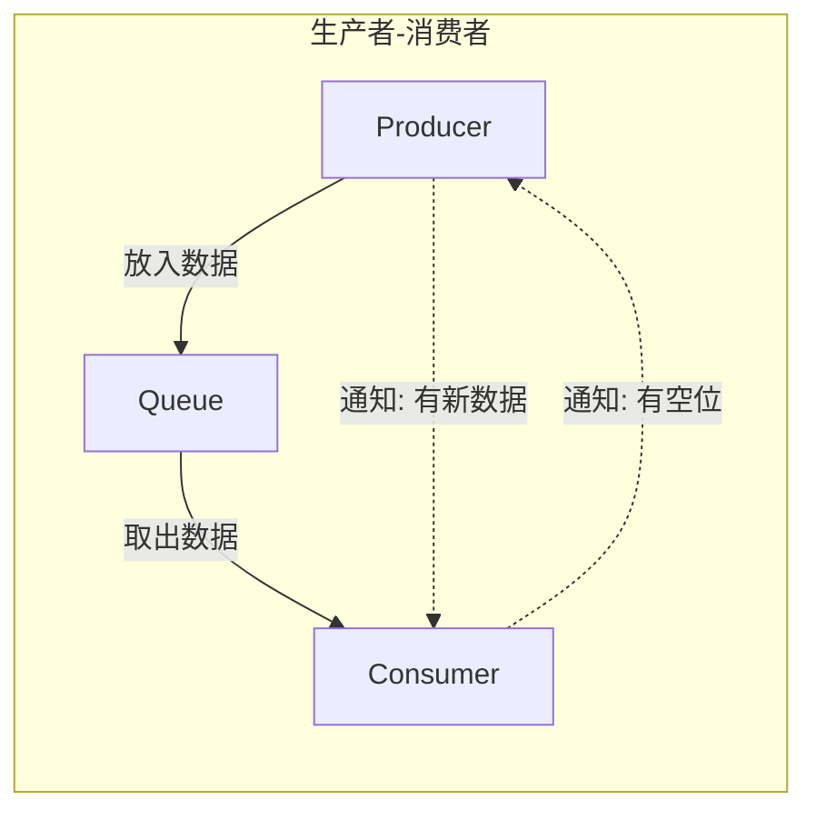
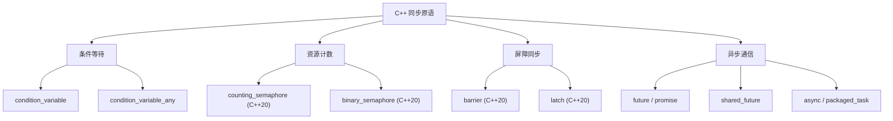
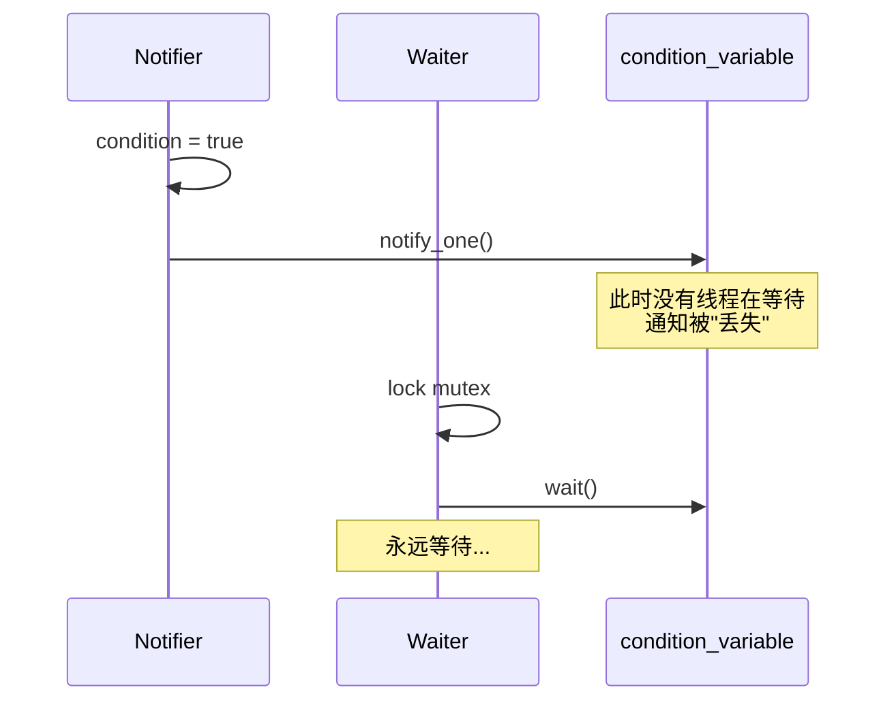
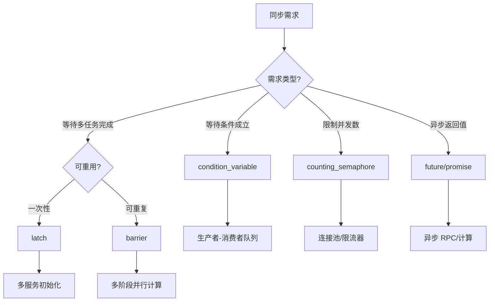
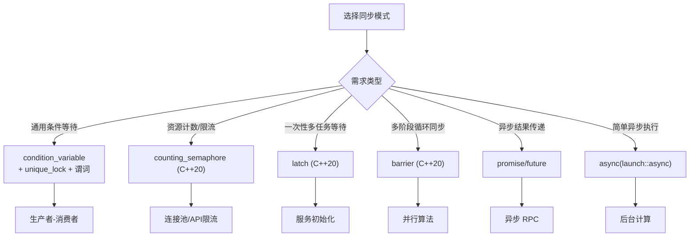

# 条件变量与同步模式详细解析

> **核心结论**：条件变量是线程间协调的基础原语，用于高效地等待特定条件成立。C++20 引入的 semaphore、latch、barrier 提供了更简洁的同步抽象，而 future/promise 则实现了优雅的异步通信。

---

## 核心结论（TL;DR）

| 同步需求 | 推荐方案 | 特点 |
|---------|---------|------|
| **等待条件成立** | `condition_variable` + predicate | 最通用，必须处理虚假唤醒 |
| **资源计数/限流** | `counting_semaphore` (C++20) | 比 CV 更简洁，无需额外 mutex |
| **一次性等待多任务完成** | `latch` (C++20) | 倒计数，不可重用 |
| **多阶段同步屏障** | `barrier` (C++20) | 可重用，支持完成回调 |
| **一次性结果传递** | `promise/future` | 线程间单向通信 |
| **异步任务启动** | `std::async` | 最简单的异步执行方式 |

**一句话总结**：优先使用 C++20 的高级同步原语（semaphore/latch/barrier），它们比手写 condition_variable 更安全、更简洁。

---

## 1. Why — 为什么需要条件变量和高级同步原语

### 1.1 忙等待（Busy-Wait）的问题

**结论先行**：忙等待浪费 CPU 资源，在移动设备上更会导致电池耗尽和发热。

```cpp
// 错误示例：忙等待
std::atomic<bool> ready{false};

// 生产者
void producer() {
    prepare_data();
    ready = true;
}

// 消费者 - 忙等待
void consumer_bad() {
    while (!ready) {
        // 空循环，100% CPU 占用
    }
    process_data();
}
```

**忙等待的代价**：

| 问题 | 影响 | 严重程度 |
|-----|------|---------|
| **CPU 浪费** | 空转消耗 100% 单核资源 | 严重 |
| **功耗增加** | 移动设备电池快速耗尽 | 严重 |
| **优先级反转** | 低优先级线程占用 CPU，高优先级线程无法调度 | 中 |
| **热量问题** | 持续高负载导致 CPU 降频 | 中 |

### 1.2 线程间通知的需求

**真实场景**：



**需求分析**：

| 场景 | 需要的同步机制 |
|-----|--------------|
| 等待数据就绪 | 条件变量 / Future |
| 等待多个任务完成 | Latch / Barrier |
| 限制并发数量 | Semaphore |
| 多阶段流水线同步 | Barrier |
| 请求-响应模式 | Promise/Future |

### 1.3 条件变量的核心价值

```cpp
// 正确示例：使用条件变量
std::mutex mtx;
std::condition_variable cv;
bool ready = false;

void producer() {
    {
        std::lock_guard<std::mutex> lock(mtx);
        prepare_data();
        ready = true;
    }
    cv.notify_one();  // 唤醒等待的线程
}

void consumer_good() {
    std::unique_lock<std::mutex> lock(mtx);
    cv.wait(lock, [] { return ready; });  // 高效等待，不消耗 CPU
    process_data();
}
```

**条件变量 vs 忙等待**：

| 指标 | 忙等待 | 条件变量 |
|-----|-------|---------|
| CPU 占用 | 100% | ~0%（等待时） |
| 唤醒延迟 | ~0 ns | 1-10 μs |
| 功耗 | 高 | 低 |
| 复杂度 | 简单 | 中等 |

---

## 2. What — 同步原语体系

**MECE 分类**：按功能将 C++ 同步原语分为互不重叠的类别。



### 2.1 条件变量

#### std::condition_variable

**特点**：只能与 `std::unique_lock<std::mutex>` 配合使用，性能最优。

```cpp
#include <condition_variable>
#include <mutex>
#include <queue>

template <typename T>
class BlockingQueue {
    std::queue<T> queue_;
    mutable std::mutex mutex_;
    std::condition_variable not_empty_;
    std::condition_variable not_full_;
    size_t max_size_;
    
public:
    explicit BlockingQueue(size_t max_size) : max_size_(max_size) {}
    
    void push(T item) {
        std::unique_lock<std::mutex> lock(mutex_);
        not_full_.wait(lock, [this] { return queue_.size() < max_size_; });
        queue_.push(std::move(item));
        not_empty_.notify_one();
    }
    
    T pop() {
        std::unique_lock<std::mutex> lock(mutex_);
        not_empty_.wait(lock, [this] { return !queue_.empty(); });
        T item = std::move(queue_.front());
        queue_.pop();
        not_full_.notify_one();
        return item;
    }
};
```

#### std::condition_variable_any

**特点**：可与任意满足 BasicLockable 的锁类型配合，灵活性更高但开销稍大。

```cpp
#include <condition_variable>
#include <shared_mutex>

std::shared_mutex rw_mutex;
std::condition_variable_any cv_any;
bool data_ready = false;

void wait_for_data() {
    std::shared_lock<std::shared_mutex> lock(rw_mutex);
    cv_any.wait(lock, [] { return data_ready; });
    // 处理数据
}
```

### 2.2 信号量 (C++20)

#### std::counting_semaphore

**特点**：维护计数器，acquire 减少计数（可能阻塞），release 增加计数。

```cpp
#include <semaphore>
#include <thread>
#include <vector>

// 限制并发连接数
class ConnectionPool {
    std::counting_semaphore<10> available_{10};  // 最多 10 个并发连接
    std::vector<Connection> connections_;
    
public:
    Connection acquire() {
        available_.acquire();  // 如果没有可用连接，阻塞
        return get_connection_from_pool();
    }
    
    void release(Connection conn) {
        return_connection_to_pool(conn);
        available_.release();  // 释放一个信号量
    }
};
```

#### std::binary_semaphore

**特点**：`counting_semaphore<1>` 的别名，类似互斥锁但无所有权概念。

```cpp
#include <semaphore>

std::binary_semaphore sem{0};  // 初始为 0（锁定状态）

void signal_thread() {
    prepare_data();
    sem.release();  // 发出信号（V 操作）
}

void wait_thread() {
    sem.acquire();  // 等待信号（P 操作）
    use_data();
}
```

### 2.3 屏障 (C++20)

#### std::barrier

**特点**：可重复使用的同步点，所有参与线程到达后才能继续。

```cpp
#include <barrier>
#include <thread>
#include <vector>
#include <iostream>

void parallel_algorithm() {
    constexpr int num_threads = 4;
    constexpr int num_iterations = 3;
    
    // 完成回调：所有线程到达屏障后执行
    auto on_completion = []() noexcept {
        std::cout << "所有线程完成一个阶段\n";
    };
    
    std::barrier sync_point(num_threads, on_completion);
    
    auto worker = [&](int id) {
        for (int i = 0; i < num_iterations; ++i) {
            // 阶段 1：计算
            std::cout << "线程 " << id << " 阶段 " << i << " 计算中\n";
            
            sync_point.arrive_and_wait();  // 等待所有线程完成计算
            
            // 阶段 2：使用其他线程的结果
            std::cout << "线程 " << id << " 阶段 " << i << " 合并中\n";
            
            sync_point.arrive_and_wait();  // 等待所有线程完成合并
        }
    };
    
    std::vector<std::jthread> threads;
    for (int i = 0; i < num_threads; ++i) {
        threads.emplace_back(worker, i);
    }
}
```

#### std::latch

**特点**：一次性倒计数器，计数归零后所有等待线程被释放。

```cpp
#include <latch>
#include <thread>
#include <vector>
#include <iostream>

void wait_for_workers() {
    constexpr int num_workers = 5;
    std::latch done{num_workers};
    
    auto worker = [&done](int id) {
        // 模拟工作
        std::this_thread::sleep_for(std::chrono::milliseconds(100 * id));
        std::cout << "Worker " << id << " 完成\n";
        done.count_down();  // 计数减一
    };
    
    std::vector<std::jthread> workers;
    for (int i = 0; i < num_workers; ++i) {
        workers.emplace_back(worker, i);
    }
    
    done.wait();  // 等待所有 worker 完成
    std::cout << "所有 worker 已完成，继续主流程\n";
}
```

### 2.4 Future/Promise

#### std::promise 与 std::future

**特点**：一次性通信通道，promise 设置值，future 获取值。

```cpp
#include <future>
#include <thread>
#include <iostream>

void async_computation() {
    std::promise<int> promise;
    std::future<int> future = promise.get_future();
    
    std::jthread worker([p = std::move(promise)]() mutable {
        // 模拟耗时计算
        std::this_thread::sleep_for(std::chrono::seconds(1));
        p.set_value(42);  // 设置结果
    });
    
    std::cout << "等待结果...\n";
    int result = future.get();  // 阻塞直到结果可用
    std::cout << "结果: " << result << "\n";
}
```

#### std::shared_future

**特点**：允许多个线程等待同一结果。

```cpp
#include <future>
#include <thread>
#include <vector>

void broadcast_result() {
    std::promise<int> promise;
    std::shared_future<int> shared = promise.get_future().share();
    
    // 多个消费者等待同一结果
    std::vector<std::jthread> consumers;
    for (int i = 0; i < 3; ++i) {
        consumers.emplace_back([shared, i]() {
            int result = shared.get();  // 所有消费者都能获取结果
            std::cout << "Consumer " << i << " got: " << result << "\n";
        });
    }
    
    // 生产者设置结果
    promise.set_value(100);
}
```

### 2.5 异步任务

#### std::async

**特点**：最简单的异步执行方式。

```cpp
#include <future>
#include <iostream>

int compute_value(int x) {
    std::this_thread::sleep_for(std::chrono::seconds(1));
    return x * x;
}

void async_example() {
    // launch::async 强制在新线程执行
    auto future1 = std::async(std::launch::async, compute_value, 10);
    
    // launch::deferred 延迟到 get() 时执行（同一线程）
    auto future2 = std::async(std::launch::deferred, compute_value, 20);
    
    // 默认策略：由实现决定
    auto future3 = std::async(compute_value, 30);
    
    // 并行等待结果
    std::cout << "Result 1: " << future1.get() << "\n";
    std::cout << "Result 2: " << future2.get() << "\n";  // 此时才执行
    std::cout << "Result 3: " << future3.get() << "\n";
}
```

#### std::packaged_task

**特点**：将可调用对象包装成异步任务，可与线程池集成。

```cpp
#include <future>
#include <functional>
#include <queue>

class ThreadPool {
    std::queue<std::packaged_task<void()>> tasks_;
    std::mutex mutex_;
    std::condition_variable cv_;
    std::vector<std::jthread> workers_;
    bool stop_ = false;
    
public:
    explicit ThreadPool(size_t num_threads) {
        for (size_t i = 0; i < num_threads; ++i) {
            workers_.emplace_back([this](std::stop_token st) {
                while (!st.stop_requested()) {
                    std::packaged_task<void()> task;
                    {
                        std::unique_lock<std::mutex> lock(mutex_);
                        cv_.wait(lock, [&] { 
                            return stop_ || !tasks_.empty(); 
                        });
                        if (stop_ && tasks_.empty()) return;
                        task = std::move(tasks_.front());
                        tasks_.pop();
                    }
                    task();
                }
            });
        }
    }
    
    template <typename F, typename... Args>
    auto submit(F&& f, Args&&... args) 
        -> std::future<std::invoke_result_t<F, Args...>> 
    {
        using ReturnType = std::invoke_result_t<F, Args...>;
        
        std::packaged_task<ReturnType()> task(
            std::bind(std::forward<F>(f), std::forward<Args>(args)...)
        );
        
        auto future = task.get_future();
        
        {
            std::lock_guard<std::mutex> lock(mutex_);
            tasks_.emplace([t = std::move(task)]() mutable { t(); });
        }
        cv_.notify_one();
        
        return future;
    }
    
    ~ThreadPool() {
        {
            std::lock_guard<std::mutex> lock(mutex_);
            stop_ = true;
        }
        cv_.notify_all();
    }
};
```

---

## 3. How — 条件变量深度解析

### 3.1 标准使用模板

**黄金法则**：`wait` 必须配合谓词（predicate），在循环中检查条件。

```cpp
std::mutex mtx;
std::condition_variable cv;
bool condition = false;

// 等待方
void waiter() {
    std::unique_lock<std::mutex> lock(mtx);
    
    // 标准模板：wait + lambda 谓词
    cv.wait(lock, [] { return condition; });
    
    // 等价于手写循环（不推荐）
    // while (!condition) {
    //     cv.wait(lock);
    // }
    
    // 条件满足，继续执行
}

// 通知方
void notifier() {
    {
        std::lock_guard<std::mutex> lock(mtx);
        condition = true;
    }  // 释放锁后再 notify，减少无谓唤醒
    cv.notify_one();
}
```

### 3.2 Spurious Wakeup（虚假唤醒）

**现象**：线程可能在没有收到 notify 的情况下从 wait 返回。

**原因**：

1. **系统信号**：POSIX 系统中，信号可能中断等待
2. **实现优化**：某些平台为了性能允许虚假唤醒
3. **多核竞争**：内存可见性问题

**解决方案**：始终使用谓词检查条件。

```cpp
// 错误：没有谓词，可能因虚假唤醒错误执行
void bad_wait() {
    std::unique_lock<std::mutex> lock(mtx);
    cv.wait(lock);  // 危险！
    process();  // 可能条件不满足
}

// 正确：带谓词的 wait
void good_wait() {
    std::unique_lock<std::mutex> lock(mtx);
    cv.wait(lock, [] { return condition; });  // 安全
    process();
}
```

### 3.3 Lost Wakeup（唤醒丢失）

**现象**：notify 发生在 wait 之前，导致等待线程永远不会被唤醒。



**解决方案**：在检查条件前先获取锁。

```cpp
// 正确模式：先检查条件再决定是否等待
void safe_wait() {
    std::unique_lock<std::mutex> lock(mtx);
    
    // 谓词版 wait 自动处理
    cv.wait(lock, [] { return condition; });
    
    // 如果 condition 已经为 true，wait 立即返回
    // 不会发生 lost wakeup
}
```

### 3.4 超时处理

```cpp
#include <condition_variable>
#include <chrono>
#include <optional>

template <typename T>
class TimedBlockingQueue {
    std::queue<T> queue_;
    std::mutex mutex_;
    std::condition_variable cv_;
    
public:
    void push(T item) {
        {
            std::lock_guard<std::mutex> lock(mutex_);
            queue_.push(std::move(item));
        }
        cv_.notify_one();
    }
    
    // 带超时的 pop
    std::optional<T> pop(std::chrono::milliseconds timeout) {
        std::unique_lock<std::mutex> lock(mutex_);
        
        // wait_for 返回是否因条件满足而返回
        if (cv_.wait_for(lock, timeout, [this] { return !queue_.empty(); })) {
            T item = std::move(queue_.front());
            queue_.pop();
            return item;
        }
        
        return std::nullopt;  // 超时
    }
    
    // 使用绝对时间点
    std::optional<T> pop_until(std::chrono::steady_clock::time_point deadline) {
        std::unique_lock<std::mutex> lock(mutex_);
        
        if (cv_.wait_until(lock, deadline, [this] { return !queue_.empty(); })) {
            T item = std::move(queue_.front());
            queue_.pop();
            return item;
        }
        
        return std::nullopt;
    }
};
```

### 3.5 完整生产者-消费者队列

```cpp
#include <condition_variable>
#include <mutex>
#include <queue>
#include <optional>
#include <atomic>

template <typename T>
class ProducerConsumerQueue {
public:
    explicit ProducerConsumerQueue(size_t max_size = 100)
        : max_size_(max_size) {}
    
    // 生产者：放入数据（阻塞直到有空间）
    bool push(T item, std::chrono::milliseconds timeout = 
              std::chrono::milliseconds::max()) {
        std::unique_lock<std::mutex> lock(mutex_);
        
        auto deadline = std::chrono::steady_clock::now() + timeout;
        
        if (!not_full_.wait_until(lock, deadline, [this] {
            return queue_.size() < max_size_ || closed_;
        })) {
            return false;  // 超时
        }
        
        if (closed_) return false;
        
        queue_.push(std::move(item));
        not_empty_.notify_one();
        return true;
    }
    
    // 消费者：取出数据（阻塞直到有数据）
    std::optional<T> pop(std::chrono::milliseconds timeout = 
                          std::chrono::milliseconds::max()) {
        std::unique_lock<std::mutex> lock(mutex_);
        
        auto deadline = std::chrono::steady_clock::now() + timeout;
        
        if (!not_empty_.wait_until(lock, deadline, [this] {
            return !queue_.empty() || closed_;
        })) {
            return std::nullopt;  // 超时
        }
        
        if (queue_.empty()) return std::nullopt;  // closed 且队列空
        
        T item = std::move(queue_.front());
        queue_.pop();
        not_full_.notify_one();
        return item;
    }
    
    // 关闭队列
    void close() {
        {
            std::lock_guard<std::mutex> lock(mutex_);
            closed_ = true;
        }
        not_empty_.notify_all();
        not_full_.notify_all();
    }
    
    bool is_closed() const {
        std::lock_guard<std::mutex> lock(mutex_);
        return closed_;
    }
    
    size_t size() const {
        std::lock_guard<std::mutex> lock(mutex_);
        return queue_.size();
    }
    
private:
    std::queue<T> queue_;
    mutable std::mutex mutex_;
    std::condition_variable not_empty_;
    std::condition_variable not_full_;
    size_t max_size_;
    bool closed_ = false;
};
```

---

## 4. How — C++20 新同步原语

### 4.1 counting_semaphore 实现限流器

```cpp
#include <semaphore>
#include <thread>
#include <chrono>
#include <iostream>

// API 限流器：每秒最多 N 个请求
class RateLimiter {
    std::counting_semaphore<100> permits_;
    std::jthread refiller_;
    std::atomic<bool> stop_{false};
    
public:
    explicit RateLimiter(int permits_per_second)
        : permits_(permits_per_second) 
    {
        // 后台线程定期补充许可
        refiller_ = std::jthread([this, permits_per_second](std::stop_token st) {
            while (!st.stop_requested()) {
                std::this_thread::sleep_for(std::chrono::seconds(1));
                // 补充到最大值
                for (int i = 0; i < permits_per_second; ++i) {
                    permits_.release();
                }
            }
        });
    }
    
    // 获取许可（阻塞）
    void acquire() {
        permits_.acquire();
    }
    
    // 尝试获取许可（非阻塞）
    bool try_acquire() {
        return permits_.try_acquire();
    }
    
    // 带超时获取
    bool try_acquire_for(std::chrono::milliseconds timeout) {
        return permits_.try_acquire_for(timeout);
    }
};

void rate_limiter_demo() {
    RateLimiter limiter(5);  // 每秒 5 个请求
    
    for (int i = 0; i < 20; ++i) {
        limiter.acquire();
        std::cout << "Request " << i << " at " 
                  << std::chrono::steady_clock::now().time_since_epoch().count()
                  << "\n";
    }
}
```

### 4.2 barrier 实现多阶段并行计算

```cpp
#include <barrier>
#include <thread>
#include <vector>
#include <iostream>
#include <numeric>

// 并行矩阵计算示例
void parallel_matrix_computation() {
    constexpr int rows = 4;
    constexpr int cols = 4;
    constexpr int iterations = 3;
    
    std::vector<std::vector<double>> matrix(rows, std::vector<double>(cols, 1.0));
    std::vector<std::vector<double>> temp(rows, std::vector<double>(cols));
    
    auto print_matrix = [&]() noexcept {
        std::cout << "Matrix state:\n";
        for (const auto& row : matrix) {
            for (double val : row) {
                std::cout << val << " ";
            }
            std::cout << "\n";
        }
        std::cout << "---\n";
    };
    
    std::barrier sync(rows, print_matrix);
    
    auto worker = [&](int row_id) {
        for (int iter = 0; iter < iterations; ++iter) {
            // 阶段 1：计算本行的新值
            for (int j = 0; j < cols; ++j) {
                double sum = 0;
                // 简单的邻居平均
                if (row_id > 0) sum += matrix[row_id - 1][j];
                if (row_id < rows - 1) sum += matrix[row_id + 1][j];
                if (j > 0) sum += matrix[row_id][j - 1];
                if (j < cols - 1) sum += matrix[row_id][j + 1];
                temp[row_id][j] = sum / 4.0;
            }
            
            sync.arrive_and_wait();  // 等待所有行计算完毕
            
            // 阶段 2：更新本行
            matrix[row_id] = temp[row_id];
            
            sync.arrive_and_wait();  // 等待所有行更新完毕
        }
    };
    
    std::vector<std::jthread> threads;
    for (int i = 0; i < rows; ++i) {
        threads.emplace_back(worker, i);
    }
}
```

### 4.3 latch 实现多线程初始化等待

```cpp
#include <latch>
#include <thread>
#include <vector>
#include <iostream>

class Application {
    std::latch startup_latch_;
    std::vector<std::jthread> services_;
    
public:
    explicit Application(int num_services) 
        : startup_latch_(num_services) {}
    
    void start() {
        // 启动数据库服务
        services_.emplace_back([this] {
            std::cout << "Database: initializing...\n";
            std::this_thread::sleep_for(std::chrono::milliseconds(500));
            std::cout << "Database: ready\n";
            startup_latch_.count_down();
        });
        
        // 启动缓存服务
        services_.emplace_back([this] {
            std::cout << "Cache: initializing...\n";
            std::this_thread::sleep_for(std::chrono::milliseconds(300));
            std::cout << "Cache: ready\n";
            startup_latch_.count_down();
        });
        
        // 启动网络服务
        services_.emplace_back([this] {
            std::cout << "Network: initializing...\n";
            std::this_thread::sleep_for(std::chrono::milliseconds(200));
            std::cout << "Network: ready\n";
            startup_latch_.count_down();
        });
        
        // 等待所有服务就绪
        startup_latch_.wait();
        std::cout << "All services started, application ready!\n";
    }
};

void latch_demo() {
    Application app(3);
    app.start();
}
```

### 4.4 与传统方式的性能对比

| 同步方式 | 场景 | 代码复杂度 | 性能 | 推荐度 |
|---------|------|-----------|------|--------|
| condition_variable + mutex | 通用 | 中 | 基准 | ⭐⭐⭐ |
| counting_semaphore | 资源计数 | 低 | +10-20% | ⭐⭐⭐⭐⭐ |
| latch | 一次性等待 | 低 | +15-25% | ⭐⭐⭐⭐⭐ |
| barrier | 多阶段同步 | 低 | +20-30% | ⭐⭐⭐⭐⭐ |

---

## 5. How — Future/Promise 异步模式

### 5.1 Promise/Future 一次性通信

```cpp
#include <future>
#include <thread>
#include <stdexcept>
#include <iostream>

// 基本用法
void basic_promise_future() {
    std::promise<std::string> promise;
    std::future<std::string> future = promise.get_future();
    
    std::jthread producer([p = std::move(promise)]() mutable {
        try {
            // 模拟计算
            std::this_thread::sleep_for(std::chrono::seconds(1));
            p.set_value("Hello from another thread!");
        } catch (...) {
            p.set_exception(std::current_exception());
        }
    });
    
    // 消费者等待结果
    try {
        std::string result = future.get();  // 阻塞
        std::cout << result << "\n";
    } catch (const std::exception& e) {
        std::cout << "Error: " << e.what() << "\n";
    }
}

// 使用 set_value_at_thread_exit 确保线程退出前设置值
void promise_at_exit() {
    std::promise<int> promise;
    std::future<int> future = promise.get_future();
    
    std::jthread worker([p = std::move(promise)]() mutable {
        // 即使这里抛出异常，值也会在线程退出时设置
        p.set_value_at_thread_exit(42);
        // 线程继续执行其他清理工作...
    });
    
    int result = future.get();
}
```

### 5.2 Shared_future 多消费者广播

```cpp
#include <future>
#include <thread>
#include <vector>
#include <iostream>

void shared_future_broadcast() {
    std::promise<int> promise;
    std::shared_future<int> shared = promise.get_future().share();
    
    // 创建多个消费者
    std::vector<std::jthread> consumers;
    for (int i = 0; i < 5; ++i) {
        consumers.emplace_back([shared, i]() {
            // 所有消费者可以同时调用 get()
            int result = shared.get();
            std::cout << "Consumer " << i << " received: " << result << "\n";
        });
    }
    
    // 短暂延迟后设置值
    std::this_thread::sleep_for(std::chrono::milliseconds(100));
    promise.set_value(42);
}
```

### 5.3 std::async 的 launch 策略

```cpp
#include <future>
#include <iostream>
#include <chrono>

int expensive_computation() {
    std::this_thread::sleep_for(std::chrono::seconds(1));
    return 42;
}

void async_launch_policies() {
    // 1. launch::async - 强制新线程执行
    {
        auto start = std::chrono::steady_clock::now();
        auto future = std::async(std::launch::async, expensive_computation);
        
        // 并行执行其他工作
        std::cout << "Main thread working...\n";
        
        int result = future.get();
        auto elapsed = std::chrono::steady_clock::now() - start;
        std::cout << "Async result: " << result 
                  << ", elapsed: " << std::chrono::duration<double>(elapsed).count() 
                  << "s\n";
    }
    
    // 2. launch::deferred - 延迟到 get() 时执行（同一线程）
    {
        auto start = std::chrono::steady_clock::now();
        auto future = std::async(std::launch::deferred, expensive_computation);
        
        std::cout << "Main thread working (deferred not started yet)...\n";
        std::this_thread::sleep_for(std::chrono::milliseconds(500));
        
        int result = future.get();  // 此时才开始执行
        auto elapsed = std::chrono::steady_clock::now() - start;
        std::cout << "Deferred result: " << result 
                  << ", elapsed: " << std::chrono::duration<double>(elapsed).count() 
                  << "s\n";
    }
    
    // 3. 默认策略 - 由实现决定
    {
        auto future = std::async(expensive_computation);
        // 注意：默认策略可能是 deferred，需要检查 future 状态
        
        // 使用 wait_for 检查是否使用了 deferred
        if (future.wait_for(std::chrono::seconds(0)) == std::future_status::deferred) {
            std::cout << "Task was deferred\n";
        }
        
        int result = future.get();
    }
}
```

### 5.4 Packaged_task 与线程池集成

```cpp
#include <future>
#include <functional>
#include <queue>
#include <thread>
#include <vector>

class SimpleThreadPool {
    std::vector<std::jthread> workers_;
    std::queue<std::function<void()>> tasks_;
    std::mutex mutex_;
    std::condition_variable cv_;
    bool stop_ = false;
    
public:
    explicit SimpleThreadPool(size_t num_threads) {
        for (size_t i = 0; i < num_threads; ++i) {
            workers_.emplace_back([this](std::stop_token st) {
                while (true) {
                    std::function<void()> task;
                    {
                        std::unique_lock lock(mutex_);
                        cv_.wait(lock, [&] { 
                            return stop_ || !tasks_.empty(); 
                        });
                        if (stop_ && tasks_.empty()) return;
                        task = std::move(tasks_.front());
                        tasks_.pop();
                    }
                    task();
                }
            });
        }
    }
    
    template <typename F, typename... Args>
    auto enqueue(F&& f, Args&&... args) 
        -> std::future<std::invoke_result_t<F, Args...>> 
    {
        using return_type = std::invoke_result_t<F, Args...>;
        
        auto task = std::make_shared<std::packaged_task<return_type()>>(
            std::bind(std::forward<F>(f), std::forward<Args>(args)...)
        );
        
        std::future<return_type> result = task->get_future();
        
        {
            std::lock_guard lock(mutex_);
            if (stop_) {
                throw std::runtime_error("enqueue on stopped pool");
            }
            tasks_.emplace([task]() { (*task)(); });
        }
        cv_.notify_one();
        
        return result;
    }
    
    ~SimpleThreadPool() {
        {
            std::lock_guard lock(mutex_);
            stop_ = true;
        }
        cv_.notify_all();
    }
};

void thread_pool_demo() {
    SimpleThreadPool pool(4);
    
    std::vector<std::future<int>> results;
    
    for (int i = 0; i < 10; ++i) {
        results.push_back(pool.enqueue([i] {
            std::this_thread::sleep_for(std::chrono::milliseconds(100));
            return i * i;
        }));
    }
    
    for (auto& result : results) {
        std::cout << result.get() << " ";
    }
    std::cout << "\n";
}
```

### 5.5 异常在线程间传播

```cpp
#include <future>
#include <stdexcept>
#include <iostream>

void exception_propagation() {
    std::promise<int> promise;
    std::future<int> future = promise.get_future();
    
    std::jthread worker([p = std::move(promise)]() mutable {
        try {
            // 模拟失败
            throw std::runtime_error("Computation failed!");
        } catch (...) {
            // 捕获异常并传递给 future
            p.set_exception(std::current_exception());
        }
    });
    
    try {
        int result = future.get();  // 重新抛出异常
    } catch (const std::exception& e) {
        std::cout << "Caught exception: " << e.what() << "\n";
    }
}

// 使用 async 自动传播异常
void async_exception() {
    auto future = std::async(std::launch::async, []() -> int {
        throw std::logic_error("Something went wrong");
        return 42;  // 永远不会执行
    });
    
    try {
        int result = future.get();
    } catch (const std::logic_error& e) {
        std::cout << "Logic error: " << e.what() << "\n";
    }
}
```

---

## 6. 跨平台同步原语

### 6.1 Android NDK

```cpp
// Android JNI 中使用 CountDownLatch
#include <jni.h>

class AndroidLatch {
    JNIEnv* env_;
    jobject latch_;
    
public:
    AndroidLatch(JNIEnv* env, int count) : env_(env) {
        jclass cls = env->FindClass("java/util/concurrent/CountDownLatch");
        jmethodID ctor = env->GetMethodID(cls, "<init>", "(I)V");
        latch_ = env->NewGlobalRef(env->NewObject(cls, ctor, count));
    }
    
    void countDown() {
        jclass cls = env->GetObjectClass(latch_);
        jmethodID method = env->GetMethodID(cls, "countDown", "()V");
        env->CallVoidMethod(latch_, method);
    }
    
    void await() {
        jclass cls = env->GetObjectClass(latch_);
        jmethodID method = env->GetMethodID(cls, "await", "()V");
        env->CallVoidMethod(latch_, method);
    }
    
    ~AndroidLatch() {
        env_->DeleteGlobalRef(latch_);
    }
};
```

### 6.2 iOS/macOS GCD

```objc
// dispatch_semaphore - 信号量
#import <dispatch/dispatch.h>

void ios_semaphore_example() {
    // 创建信号量，初始值为 0
    dispatch_semaphore_t sem = dispatch_semaphore_create(0);
    
    dispatch_async(dispatch_get_global_queue(DISPATCH_QUEUE_PRIORITY_DEFAULT, 0), ^{
        // 异步工作
        [NSThread sleepForTimeInterval:1.0];
        NSLog(@"Work done");
        
        // 发出信号
        dispatch_semaphore_signal(sem);
    });
    
    // 等待信号（带超时）
    dispatch_time_t timeout = dispatch_time(DISPATCH_TIME_NOW, 2 * NSEC_PER_SEC);
    if (dispatch_semaphore_wait(sem, timeout) == 0) {
        NSLog(@"Signal received");
    } else {
        NSLog(@"Timeout");
    }
}

// dispatch_group - 任务组
void ios_group_example() {
    dispatch_group_t group = dispatch_group_create();
    dispatch_queue_t queue = dispatch_get_global_queue(DISPATCH_QUEUE_PRIORITY_DEFAULT, 0);
    
    // 添加多个任务到组
    for (int i = 0; i < 5; i++) {
        dispatch_group_async(group, queue, ^{
            [NSThread sleepForTimeInterval:0.1 * i];
            NSLog(@"Task %d done", i);
        });
    }
    
    // 等待所有任务完成
    dispatch_group_wait(group, DISPATCH_TIME_FOREVER);
    NSLog(@"All tasks completed");
    
    // 或者使用回调
    dispatch_group_notify(group, dispatch_get_main_queue(), ^{
        NSLog(@"All tasks completed (async notification)");
    });
}

// dispatch_barrier - 屏障
void ios_barrier_example() {
    dispatch_queue_t queue = dispatch_queue_create("com.example.rwqueue", 
                                                     DISPATCH_QUEUE_CONCURRENT);
    
    // 读操作（并发）
    for (int i = 0; i < 5; i++) {
        dispatch_async(queue, ^{
            NSLog(@"Read %d", i);
        });
    }
    
    // 写操作（独占，等待所有读完成）
    dispatch_barrier_async(queue, ^{
        NSLog(@"Write operation");
    });
    
    // 后续读操作（等待写完成）
    dispatch_async(queue, ^{
        NSLog(@"Read after write");
    });
}
```

### 6.3 平台对比表

| 功能 | C++ 标准 | Android (Java) | iOS (GCD) |
|-----|---------|---------------|-----------|
| **信号量** | `counting_semaphore` | `Semaphore` | `dispatch_semaphore` |
| **倒计数** | `latch` | `CountDownLatch` | `dispatch_group` |
| **屏障** | `barrier` | `CyclicBarrier` | `dispatch_barrier` |
| **Future** | `std::future` | `CompletableFuture` | GCD blocks |
| **条件等待** | `condition_variable` | `Condition` | `dispatch_semaphore` |

---

## 7. 性能数据

### 7.1 同步原语唤醒延迟对比

| 原语 | 无竞争 (ns) | 有竞争 (ns) | 备注 |
|-----|------------|------------|------|
| `condition_variable::notify` | 50-100 | 1000-5000 | 包含系统调用 |
| `counting_semaphore::release` | 20-40 | 100-300 | 更轻量 |
| `binary_semaphore::release` | 15-30 | 80-200 | 最轻量 |
| busy-wait + atomic | ~5 | ~5 | 浪费 CPU |

### 7.2 std::async vs 线程池

| 场景 | std::async | 手动线程池 | 性能差距 |
|-----|-----------|-----------|---------|
| 单个长任务 | 适合 | 适合 | 无明显差距 |
| 大量短任务 | 不适合（频繁创建线程） | 适合 | 10-100x |
| 递归任务 | 可能栈溢出 | 可控 | - |
| 任务依赖 | 难以表达 | 可灵活处理 | - |

### 7.3 同步模式适用场景决策表



---

## 8. 常见问题与最佳实践

### 8.1 常见错误

| 错误 | 后果 | 解决方案 |
|-----|------|---------|
| wait 不带谓词 | 虚假唤醒导致错误执行 | 始终使用谓词版 wait |
| notify 在 lock 内 | 可能导致不必要的阻塞 | 先 unlock 再 notify |
| future::get 多次调用 | 未定义行为 | 使用 shared_future |
| async 默认策略 | 可能不并行执行 | 明确指定 launch::async |
| 忘记移动 promise | 编译错误/死锁 | 使用 std::move |

### 8.2 最佳实践

```cpp
// 1. 条件变量标准模式
void cv_best_practice() {
    std::unique_lock<std::mutex> lock(mtx);
    cv.wait(lock, [] { return condition; });  // 始终使用谓词
}

// 2. notify 在 lock 外
void notify_outside_lock() {
    {
        std::lock_guard<std::mutex> lock(mtx);
        condition = true;
    }  // 先释放锁
    cv.notify_one();  // 再通知
}

// 3. 优先使用 C++20 原语
void prefer_cpp20() {
    // 用 latch 替代 condition_variable + counter
    std::latch done{3};
    // ...
    done.count_down();
    done.wait();
}

// 4. async 明确策略
void explicit_async() {
    auto future = std::async(std::launch::async, task);  // 明确指定
}

// 5. 使用 shared_future 多消费者
void multiple_consumers() {
    std::shared_future<int> sf = promise.get_future().share();
    // 多个线程可安全调用 sf.get()
}
```

### 8.3 调试技巧

```cpp
// 1. 添加超时防止死锁
template <typename Predicate>
bool timed_wait(std::condition_variable& cv, 
                std::unique_lock<std::mutex>& lock,
                Predicate pred,
                std::chrono::milliseconds timeout = std::chrono::seconds(30)) {
    if (!cv.wait_for(lock, timeout, pred)) {
        std::cerr << "Warning: wait timed out!\n";
        return false;
    }
    return true;
}

// 2. 使用 RAII 跟踪等待状态
class WaitTracker {
    static std::atomic<int> waiting_count;
public:
    WaitTracker() { ++waiting_count; }
    ~WaitTracker() { --waiting_count; }
    static int count() { return waiting_count.load(); }
};

// 3. 日志记录
#define CV_WAIT(cv, lock, pred) \
    do { \
        std::cerr << "Wait start: " << __FILE__ << ":" << __LINE__ << "\n"; \
        cv.wait(lock, pred); \
        std::cerr << "Wait end: " << __FILE__ << ":" << __LINE__ << "\n"; \
    } while(0)
```

---

## 总结



**核心要点**：
1. **优先 C++20**：latch/barrier/semaphore 比 condition_variable 更简洁安全
2. **谓词必须有**：condition_variable::wait 必须带谓词处理虚假唤醒
3. **async 要明确**：使用 `launch::async` 确保真正并行
4. **shared_future 广播**：多消费者场景使用 shared_future
5. **超时保护**：长时间等待应加超时，便于调试和恢复
