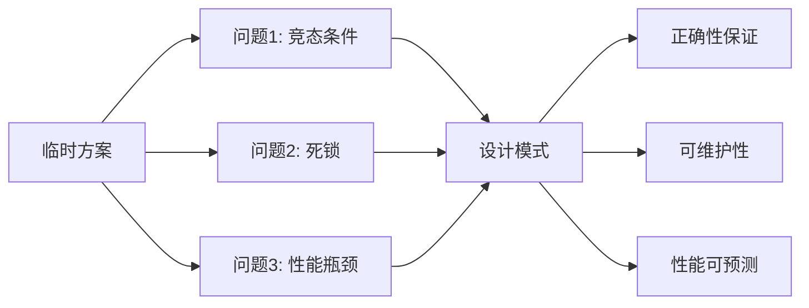
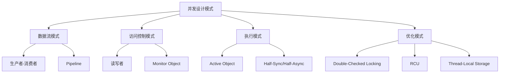
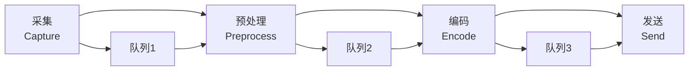
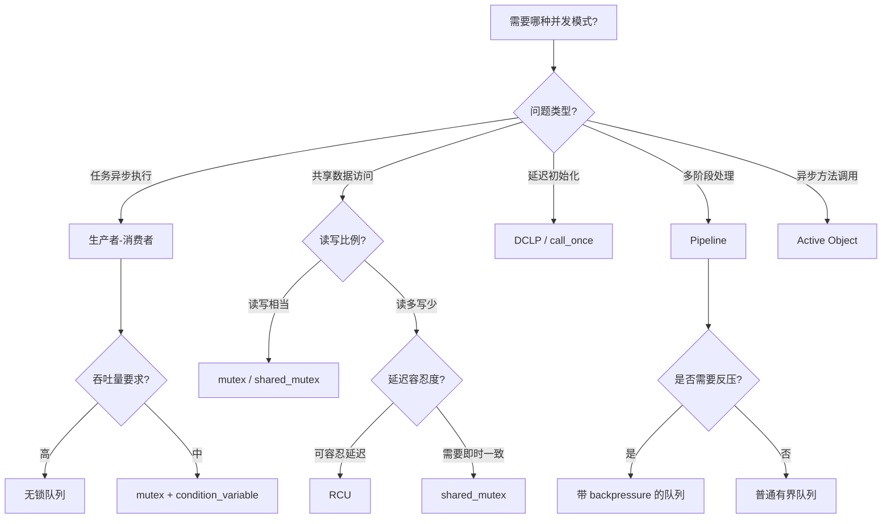
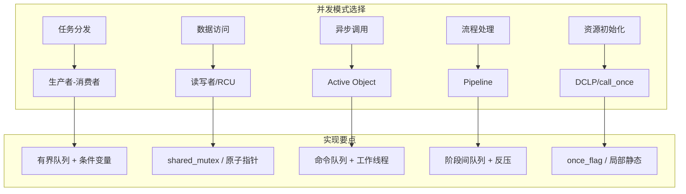

# 并发设计模式详细解析

> **核心结论**：并发设计模式是经过验证的多线程问题解决方案。掌握 6 种核心模式（生产者-消费者、读写者、Active Object、DCLP、Pipeline、RCU）可覆盖 90% 的并发场景，避免从零设计带来的正确性风险。

---

## 核心结论（TL;DR）

| 模式 | 核心思想 | 典型场景 | C++ 实现要点 |
|-----|---------|---------|-------------|
| **生产者-消费者** | 解耦生产与消费的速率差 | 任务队列、帧缓冲 | condition_variable + 有界队列 |
| **读写者** | 读共享、写独占 | 配置热更新、缓存 | shared_mutex 或 RCU |
| **Active Object** | 异步方法调用 | 事件循环、Handler | 命令队列 + 工作线程 |
| **DCLP** | 延迟初始化 | 单例、资源懒加载 | call_once 或 atomic + acquire-release |
| **Pipeline** | 流水线并行 | 音视频处理 | 阶段间有界队列 + 反压 |
| **RCU** | 读不阻塞、写延迟回收 | 高读低写场景 | 原子指针 + epoch-based 回收 |

---

## 1. Why — 为什么需要并发设计模式

**结论先行**：并发编程的复杂性在于状态共享与时序不确定性。设计模式提供经过验证的解决方案，避免重复踩坑。

### 1.1 从临时方案到系统设计



**常见的"临时方案"问题**：

```cpp
// 反模式1：到处加锁
class BadCounter {
    std::mutex mtx_;
    int value_ = 0;
public:
    int get() { 
        std::lock_guard<std::mutex> lock(mtx_);  // 读也加锁？
        return value_; 
    }
    void increment() {
        std::lock_guard<std::mutex> lock(mtx_);
        value_++;
    }
};
// 问题：读操作也需要等待锁，高读场景性能差

// 反模式2：忙等待
void bad_wait() {
    while (!ready) {
        // 空转，浪费 CPU
    }
}

// 反模式3：粗粒度锁
class BadService {
    std::mutex big_lock_;  // 一把大锁保护所有数据
    // ... 大量成员
public:
    void operation1() { std::lock_guard<std::mutex> lock(big_lock_); /* ... */ }
    void operation2() { std::lock_guard<std::mutex> lock(big_lock_); /* ... */ }
    // 即使 operation1 和 operation2 不冲突也要排队
};
```

### 1.2 模式的复用价值

| 价值维度 | 说明 |
|---------|------|
| **正确性** | 经过形式化验证或广泛实践检验 |
| **可沟通** | 团队成员可快速理解设计意图 |
| **可维护** | 标准化结构便于后续修改 |
| **性能可预测** | 已知的性能特征和瓶颈 |

---

## 2. What — 并发模式 MECE 分类



### 2.1 模式选择速查表

| 场景 | 推荐模式 | 原因 |
|-----|---------|------|
| 任务异步执行 | 生产者-消费者 | 解耦、缓冲、限流 |
| 配置热更新 | RCU / 读写者 | 读不阻塞 |
| 单例初始化 | DCLP / call_once | 线程安全延迟初始化 |
| 音视频处理 | Pipeline | 阶段并行 |
| 事件驱动系统 | Active Object | 异步调用、消息循环 |
| 高读低写缓存 | RCU | 读零开销 |

---

## 3. How — 生产者-消费者模式

**结论先行**：生产者-消费者是最基础的并发模式，通过队列解耦生产者和消费者，实现速率匹配和负载均衡。

### 3.1 有界缓冲区实现（mutex + condition_variable）

```cpp
#include <queue>
#include <mutex>
#include <condition_variable>
#include <optional>
#include <chrono>

template <typename T>
class BoundedBlockingQueue {
private:
    std::queue<T> queue_;
    std::mutex mutex_;
    std::condition_variable not_full_;
    std::condition_variable not_empty_;
    std::size_t capacity_;
    bool shutdown_ = false;
    
public:
    explicit BoundedBlockingQueue(std::size_t capacity)
        : capacity_(capacity) {}
    
    // 阻塞式放入
    bool put(T item) {
        std::unique_lock<std::mutex> lock(mutex_);
        
        // 等待直到有空间或关闭
        not_full_.wait(lock, [this]() {
            return queue_.size() < capacity_ || shutdown_;
        });
        
        if (shutdown_) return false;
        
        queue_.push(std::move(item));
        not_empty_.notify_one();
        return true;
    }
    
    // 带超时的放入
    bool put(T item, std::chrono::milliseconds timeout) {
        std::unique_lock<std::mutex> lock(mutex_);
        
        if (!not_full_.wait_for(lock, timeout, [this]() {
            return queue_.size() < capacity_ || shutdown_;
        })) {
            return false;  // 超时
        }
        
        if (shutdown_) return false;
        
        queue_.push(std::move(item));
        not_empty_.notify_one();
        return true;
    }
    
    // 阻塞式取出
    std::optional<T> take() {
        std::unique_lock<std::mutex> lock(mutex_);
        
        not_empty_.wait(lock, [this]() {
            return !queue_.empty() || shutdown_;
        });
        
        if (queue_.empty()) return std::nullopt;  // shutdown 且空
        
        T item = std::move(queue_.front());
        queue_.pop();
        not_full_.notify_one();
        return item;
    }
    
    // 非阻塞尝试取出
    std::optional<T> try_take() {
        std::lock_guard<std::mutex> lock(mutex_);
        
        if (queue_.empty()) return std::nullopt;
        
        T item = std::move(queue_.front());
        queue_.pop();
        not_full_.notify_one();
        return item;
    }
    
    void shutdown() {
        std::lock_guard<std::mutex> lock(mutex_);
        shutdown_ = true;
        not_full_.notify_all();
        not_empty_.notify_all();
    }
    
    std::size_t size() const {
        std::lock_guard<std::mutex> lock(mutex_);
        return queue_.size();
    }
};
```

### 3.2 无锁版本（Ring Buffer）

```cpp
#include <atomic>
#include <array>
#include <optional>

template <typename T, std::size_t Capacity>
class LockFreeQueue {
    static_assert((Capacity & (Capacity - 1)) == 0, 
                  "Capacity must be power of 2");
    
private:
    struct Slot {
        std::atomic<std::size_t> sequence;
        T data;
    };
    
    std::array<Slot, Capacity> buffer_;
    alignas(64) std::atomic<std::size_t> enqueue_pos_{0};
    alignas(64) std::atomic<std::size_t> dequeue_pos_{0};
    
    static constexpr std::size_t mask_ = Capacity - 1;
    
public:
    LockFreeQueue() {
        for (std::size_t i = 0; i < Capacity; ++i) {
            buffer_[i].sequence.store(i, std::memory_order_relaxed);
        }
    }
    
    bool try_enqueue(const T& value) {
        std::size_t pos = enqueue_pos_.load(std::memory_order_relaxed);
        
        while (true) {
            Slot& slot = buffer_[pos & mask_];
            std::size_t seq = slot.sequence.load(std::memory_order_acquire);
            
            if (seq == pos) {
                if (enqueue_pos_.compare_exchange_weak(
                        pos, pos + 1, std::memory_order_relaxed)) {
                    slot.data = value;
                    slot.sequence.store(pos + 1, std::memory_order_release);
                    return true;
                }
            } else if (seq < pos) {
                return false;  // 队列满
            } else {
                pos = enqueue_pos_.load(std::memory_order_relaxed);
            }
        }
    }
    
    std::optional<T> try_dequeue() {
        std::size_t pos = dequeue_pos_.load(std::memory_order_relaxed);
        
        while (true) {
            Slot& slot = buffer_[pos & mask_];
            std::size_t seq = slot.sequence.load(std::memory_order_acquire);
            
            if (seq == pos + 1) {
                if (dequeue_pos_.compare_exchange_weak(
                        pos, pos + 1, std::memory_order_relaxed)) {
                    T value = std::move(slot.data);
                    slot.sequence.store(pos + Capacity, std::memory_order_release);
                    return value;
                }
            } else if (seq < pos + 1) {
                return std::nullopt;  // 队列空
            } else {
                pos = dequeue_pos_.load(std::memory_order_relaxed);
            }
        }
    }
};
```

### 3.3 音视频帧缓冲应用案例

```cpp
#include <memory>
#include <functional>

// 视频帧结构
struct VideoFrame {
    std::unique_ptr<uint8_t[]> data;
    std::size_t size;
    int64_t pts;  // Presentation Time Stamp
    int width, height;
    
    VideoFrame() = default;
    VideoFrame(int w, int h) : width(w), height(h) {
        size = w * h * 3 / 2;  // YUV420
        data = std::make_unique<uint8_t[]>(size);
    }
};

// 帧缓冲池
class FrameBufferPool {
private:
    BoundedBlockingQueue<std::unique_ptr<VideoFrame>> free_frames_;
    BoundedBlockingQueue<std::unique_ptr<VideoFrame>> pending_frames_;
    int width_, height_;
    
public:
    FrameBufferPool(int width, int height, std::size_t pool_size)
        : free_frames_(pool_size), pending_frames_(pool_size),
          width_(width), height_(height) {
        // 预分配帧
        for (std::size_t i = 0; i < pool_size; ++i) {
            free_frames_.put(std::make_unique<VideoFrame>(width, height));
        }
    }
    
    // 采集线程调用：获取空闲帧
    std::unique_ptr<VideoFrame> acquire_free_frame() {
        auto frame = free_frames_.take();
        return frame ? std::move(*frame) : nullptr;
    }
    
    // 采集线程调用：提交填充好的帧
    void submit_frame(std::unique_ptr<VideoFrame> frame) {
        pending_frames_.put(std::move(frame));
    }
    
    // 编码线程调用：获取待处理帧
    std::unique_ptr<VideoFrame> acquire_pending_frame() {
        auto frame = pending_frames_.take();
        return frame ? std::move(*frame) : nullptr;
    }
    
    // 编码线程调用：归还已处理帧
    void release_frame(std::unique_ptr<VideoFrame> frame) {
        // 重置帧状态
        frame->pts = 0;
        free_frames_.put(std::move(frame));
    }
    
    void shutdown() {
        free_frames_.shutdown();
        pending_frames_.shutdown();
    }
};

// 使用示例
void video_capture_thread(FrameBufferPool& pool) {
    while (running) {
        auto frame = pool.acquire_free_frame();
        if (!frame) break;
        
        // 填充帧数据（从摄像头读取）
        capture_from_camera(frame->data.get(), frame->size);
        frame->pts = get_current_pts();
        
        pool.submit_frame(std::move(frame));
    }
}

void video_encode_thread(FrameBufferPool& pool, Encoder& encoder) {
    while (running) {
        auto frame = pool.acquire_pending_frame();
        if (!frame) break;
        
        // 编码帧
        encoder.encode(frame->data.get(), frame->size, frame->pts);
        
        pool.release_frame(std::move(frame));
    }
}
```

---

## 4. How — 读写者模式

**结论先行**：读写者模式允许多个读者同时访问，但写者独占访问。适用于读多写少的场景，如配置、缓存。

### 4.1 shared_mutex 实现

```cpp
#include <shared_mutex>
#include <unordered_map>
#include <string>
#include <optional>

template <typename K, typename V>
class ConcurrentCache {
private:
    std::unordered_map<K, V> cache_;
    mutable std::shared_mutex mutex_;
    
public:
    // 读操作：共享锁
    std::optional<V> get(const K& key) const {
        std::shared_lock<std::shared_mutex> lock(mutex_);
        
        auto it = cache_.find(key);
        if (it != cache_.end()) {
            return it->second;
        }
        return std::nullopt;
    }
    
    // 写操作：独占锁
    void put(const K& key, const V& value) {
        std::unique_lock<std::shared_mutex> lock(mutex_);
        cache_[key] = value;
    }
    
    // 条件写：先读后写
    bool put_if_absent(const K& key, const V& value) {
        // 先尝试读
        {
            std::shared_lock<std::shared_mutex> lock(mutex_);
            if (cache_.find(key) != cache_.end()) {
                return false;  // 已存在
            }
        }
        
        // 升级为写锁
        std::unique_lock<std::shared_mutex> lock(mutex_);
        // 双重检查（可能其他线程已插入）
        if (cache_.find(key) != cache_.end()) {
            return false;
        }
        cache_[key] = value;
        return true;
    }
    
    void remove(const K& key) {
        std::unique_lock<std::shared_mutex> lock(mutex_);
        cache_.erase(key);
    }
    
    std::size_t size() const {
        std::shared_lock<std::shared_mutex> lock(mutex_);
        return cache_.size();
    }
};
```

### 4.2 读优先 vs 写优先策略

```cpp
// 写优先的读写锁实现
class WritePriorityRWLock {
private:
    std::mutex mutex_;
    std::condition_variable reader_cv_;
    std::condition_variable writer_cv_;
    
    int readers_ = 0;
    int waiting_writers_ = 0;
    bool writer_active_ = false;
    
public:
    void read_lock() {
        std::unique_lock<std::mutex> lock(mutex_);
        
        // 如果有等待的写者或活跃的写者，读者等待
        reader_cv_.wait(lock, [this]() {
            return waiting_writers_ == 0 && !writer_active_;
        });
        
        ++readers_;
    }
    
    void read_unlock() {
        std::unique_lock<std::mutex> lock(mutex_);
        --readers_;
        
        if (readers_ == 0) {
            writer_cv_.notify_one();
        }
    }
    
    void write_lock() {
        std::unique_lock<std::mutex> lock(mutex_);
        ++waiting_writers_;
        
        writer_cv_.wait(lock, [this]() {
            return readers_ == 0 && !writer_active_;
        });
        
        --waiting_writers_;
        writer_active_ = true;
    }
    
    void write_unlock() {
        std::unique_lock<std::mutex> lock(mutex_);
        writer_active_ = false;
        
        // 优先唤醒等待的写者
        if (waiting_writers_ > 0) {
            writer_cv_.notify_one();
        } else {
            reader_cv_.notify_all();
        }
    }
};
```

### 4.3 RCU（Read-Copy-Update）详解


**RCU 核心思想**：
1. 读操作无锁、无等待
2. 写操作创建副本，修改后原子替换
3. 旧数据在所有读者退出后回收

```cpp
#include <atomic>
#include <memory>
#include <thread>
#include <vector>

// 简化版 RCU 实现
template <typename T>
class RCUProtected {
private:
    std::atomic<T*> data_;
    
    // 宽限期管理
    std::atomic<uint64_t> global_epoch_{0};
    
    struct ThreadRecord {
        std::atomic<uint64_t> epoch{0};
        std::atomic<bool> active{false};
    };
    
    static thread_local ThreadRecord* local_record_;
    std::vector<ThreadRecord*> thread_records_;
    std::mutex records_mutex_;
    
    // 待回收列表
    struct RetiredData {
        T* data;
        uint64_t epoch;
    };
    std::vector<RetiredData> retired_;
    std::mutex retired_mutex_;
    
public:
    explicit RCUProtected(T* initial_data)
        : data_(initial_data) {}
    
    ~RCUProtected() {
        delete data_.load();
        for (auto& rd : retired_) {
            delete rd.data;
        }
    }
    
    // 读临界区开始
    void read_lock() {
        ensure_registered();
        local_record_->active.store(true, std::memory_order_release);
        local_record_->epoch.store(
            global_epoch_.load(std::memory_order_acquire),
            std::memory_order_release);
    }
    
    // 读临界区内获取数据
    T* read() const {
        return data_.load(std::memory_order_acquire);
    }
    
    // 读临界区结束
    void read_unlock() {
        local_record_->active.store(false, std::memory_order_release);
    }
    
    // RAII 读保护
    class ReadGuard {
        RCUProtected& rcu_;
    public:
        explicit ReadGuard(RCUProtected& rcu) : rcu_(rcu) {
            rcu_.read_lock();
        }
        ~ReadGuard() { rcu_.read_unlock(); }
        T* operator->() const { return rcu_.read(); }
        T& operator*() const { return *rcu_.read(); }
    };
    
    ReadGuard read_guard() { return ReadGuard(*this); }
    
    // 更新数据
    void update(std::function<T*(const T*)> updater) {
        T* old_data = data_.load(std::memory_order_acquire);
        T* new_data = updater(old_data);
        
        // 原子替换
        data_.store(new_data, std::memory_order_release);
        
        // 记录待回收
        uint64_t retire_epoch = global_epoch_.fetch_add(1, 
            std::memory_order_acq_rel);
        
        {
            std::lock_guard<std::mutex> lock(retired_mutex_);
            retired_.push_back({old_data, retire_epoch});
        }
        
        // 尝试回收
        try_reclaim();
    }
    
private:
    void ensure_registered() {
        if (local_record_) return;
        
        local_record_ = new ThreadRecord();
        std::lock_guard<std::mutex> lock(records_mutex_);
        thread_records_.push_back(local_record_);
    }
    
    void try_reclaim() {
        uint64_t safe_epoch = global_epoch_.load(std::memory_order_acquire);
        
        // 找到所有活跃读者中最小的 epoch
        {
            std::lock_guard<std::mutex> lock(records_mutex_);
            for (auto* record : thread_records_) {
                if (record->active.load(std::memory_order_acquire)) {
                    safe_epoch = std::min(safe_epoch,
                        record->epoch.load(std::memory_order_acquire));
                }
            }
        }
        
        // 回收安全 epoch 之前的数据
        std::lock_guard<std::mutex> lock(retired_mutex_);
        auto it = std::remove_if(retired_.begin(), retired_.end(),
            [safe_epoch](const RetiredData& rd) {
                if (rd.epoch < safe_epoch) {
                    delete rd.data;
                    return true;
                }
                return false;
            });
        retired_.erase(it, retired_.end());
    }
};

template <typename T>
thread_local typename RCUProtected<T>::ThreadRecord* 
    RCUProtected<T>::local_record_ = nullptr;
```

### 4.4 配置热更新场景案例

```cpp
#include <string>
#include <unordered_map>

struct AppConfig {
    std::string server_url;
    int timeout_ms;
    bool feature_enabled;
    std::unordered_map<std::string, std::string> properties;
};

class ConfigManager {
private:
    RCUProtected<AppConfig> config_;
    
public:
    ConfigManager() 
        : config_(new AppConfig{"http://default", 5000, false, {}}) {}
    
    // 读取配置（高频操作）
    std::string get_server_url() const {
        auto guard = config_.read_guard();
        return guard->server_url;
    }
    
    int get_timeout() const {
        auto guard = config_.read_guard();
        return guard->timeout_ms;
    }
    
    bool is_feature_enabled() const {
        auto guard = config_.read_guard();
        return guard->feature_enabled;
    }
    
    // 更新配置（低频操作）
    void update_config(const AppConfig& new_config) {
        config_.update([&new_config](const AppConfig* old) {
            return new AppConfig(new_config);
        });
    }
    
    // 部分更新
    void set_timeout(int timeout_ms) {
        config_.update([timeout_ms](const AppConfig* old) {
            auto* new_config = new AppConfig(*old);
            new_config->timeout_ms = timeout_ms;
            return new_config;
        });
    }
};
```

---

## 5. How — Active Object 模式

**结论先行**：Active Object 将方法调用与方法执行解耦，通过命令队列实现异步方法调用。这是 Android Handler/Looper 的核心设计思想。

### 5.1 完整 C++ 实现

```cpp
#include <queue>
#include <mutex>
#include <condition_variable>
#include <thread>
#include <functional>
#include <future>
#include <memory>

class ActiveObject {
public:
    using Task = std::function<void()>;
    
private:
    std::queue<Task> task_queue_;
    std::mutex mutex_;
    std::condition_variable cv_;
    std::thread worker_thread_;
    bool shutdown_ = false;
    
public:
    ActiveObject() {
        worker_thread_ = std::thread([this]() { run(); });
    }
    
    ~ActiveObject() {
        shutdown();
    }
    
    // 提交无返回值任务
    void post(Task task) {
        {
            std::lock_guard<std::mutex> lock(mutex_);
            if (shutdown_) return;
            task_queue_.push(std::move(task));
        }
        cv_.notify_one();
    }
    
    // 提交有返回值任务
    template <typename F, typename... Args>
    auto submit(F&& func, Args&&... args) 
        -> std::future<std::invoke_result_t<F, Args...>> {
        
        using ReturnType = std::invoke_result_t<F, Args...>;
        
        auto task = std::make_shared<std::packaged_task<ReturnType()>>(
            std::bind(std::forward<F>(func), std::forward<Args>(args)...)
        );
        
        std::future<ReturnType> future = task->get_future();
        
        {
            std::lock_guard<std::mutex> lock(mutex_);
            if (shutdown_) {
                throw std::runtime_error("ActiveObject is shut down");
            }
            task_queue_.push([task]() { (*task)(); });
        }
        cv_.notify_one();
        
        return future;
    }
    
    // 延迟任务
    void post_delayed(Task task, std::chrono::milliseconds delay) {
        std::thread([this, task = std::move(task), delay]() {
            std::this_thread::sleep_for(delay);
            post(task);
        }).detach();
    }
    
    void shutdown() {
        {
            std::lock_guard<std::mutex> lock(mutex_);
            if (shutdown_) return;
            shutdown_ = true;
        }
        cv_.notify_all();
        
        if (worker_thread_.joinable()) {
            worker_thread_.join();
        }
    }
    
private:
    void run() {
        while (true) {
            Task task;
            
            {
                std::unique_lock<std::mutex> lock(mutex_);
                cv_.wait(lock, [this]() {
                    return shutdown_ || !task_queue_.empty();
                });
                
                if (shutdown_ && task_queue_.empty()) {
                    return;
                }
                
                task = std::move(task_queue_.front());
                task_queue_.pop();
            }
            
            // 执行任务（不持有锁）
            task();
        }
    }
};

// 使用示例：异步日志服务
class AsyncLogger {
private:
    ActiveObject active_object_;
    std::ofstream log_file_;
    
public:
    explicit AsyncLogger(const std::string& filename)
        : log_file_(filename, std::ios::app) {}
    
    void log(const std::string& message) {
        active_object_.post([this, message]() {
            log_file_ << "[" << get_timestamp() << "] " << message << "\n";
            log_file_.flush();
        });
    }
    
    std::future<std::size_t> get_file_size() {
        return active_object_.submit([this]() -> std::size_t {
            log_file_.seekp(0, std::ios::end);
            return log_file_.tellp();
        });
    }
    
private:
    std::string get_timestamp() {
        // 简化实现
        return "2024-01-01 12:00:00";
    }
};
```

### 5.2 与 Android Handler/Looper 的关系

```cpp
// Android Handler/Looper 的 C++ 简化版

class Message {
public:
    int what;
    std::any data;
    std::chrono::steady_clock::time_point when;
    std::function<void()> callback;
};

class MessageQueue {
private:
    std::priority_queue<Message, std::vector<Message>,
        std::function<bool(const Message&, const Message&)>> messages_;
    std::mutex mutex_;
    std::condition_variable cv_;
    bool quit_ = false;
    
public:
    MessageQueue() : messages_(
        [](const Message& a, const Message& b) {
            return a.when > b.when;  // 小顶堆
        }) {}
    
    void enqueue(Message msg) {
        std::lock_guard<std::mutex> lock(mutex_);
        messages_.push(std::move(msg));
        cv_.notify_one();
    }
    
    std::optional<Message> dequeue() {
        std::unique_lock<std::mutex> lock(mutex_);
        
        while (!quit_) {
            if (messages_.empty()) {
                cv_.wait(lock);
                continue;
            }
            
            auto now = std::chrono::steady_clock::now();
            const Message& front = messages_.top();
            
            if (front.when <= now) {
                Message msg = messages_.top();
                messages_.pop();
                return msg;
            }
            
            // 等待到消息时间
            cv_.wait_until(lock, front.when);
        }
        
        return std::nullopt;
    }
    
    void quit() {
        std::lock_guard<std::mutex> lock(mutex_);
        quit_ = true;
        cv_.notify_all();
    }
};

class Looper {
private:
    MessageQueue queue_;
    std::function<void(const Message&)> handler_;
    
public:
    void set_handler(std::function<void(const Message&)> handler) {
        handler_ = std::move(handler);
    }
    
    void loop() {
        while (auto msg = queue_.dequeue()) {
            if (msg->callback) {
                msg->callback();
            } else if (handler_) {
                handler_(*msg);
            }
        }
    }
    
    void quit() {
        queue_.quit();
    }
    
    MessageQueue& get_queue() { return queue_; }
};

class Handler {
private:
    Looper& looper_;
    
public:
    explicit Handler(Looper& looper) : looper_(looper) {}
    
    void post(std::function<void()> runnable) {
        Message msg;
        msg.when = std::chrono::steady_clock::now();
        msg.callback = std::move(runnable);
        looper_.get_queue().enqueue(std::move(msg));
    }
    
    void post_delayed(std::function<void()> runnable, 
                      std::chrono::milliseconds delay) {
        Message msg;
        msg.when = std::chrono::steady_clock::now() + delay;
        msg.callback = std::move(runnable);
        looper_.get_queue().enqueue(std::move(msg));
    }
    
    void send_message(int what, std::any data = {}) {
        Message msg;
        msg.what = what;
        msg.data = std::move(data);
        msg.when = std::chrono::steady_clock::now();
        looper_.get_queue().enqueue(std::move(msg));
    }
};
```

---

## 6. How — Double-Checked Locking Pattern (DCLP)

**结论先行**：DCLP 用于延迟初始化场景，但经典实现在 C++11 前是错误的。现代 C++ 应使用 `std::call_once` 或 Meyer's Singleton。

### 6.1 经典错误实现及其问题

```cpp
// 错误的 DCLP 实现（C++11 前）
class BadSingleton {
private:
    static BadSingleton* instance_;
    static std::mutex mutex_;
    
    BadSingleton() = default;
    
public:
    static BadSingleton* get_instance() {
        if (instance_ == nullptr) {           // 第一次检查（无锁）
            std::lock_guard<std::mutex> lock(mutex_);
            if (instance_ == nullptr) {       // 第二次检查（有锁）
                instance_ = new BadSingleton();  // 问题在这里！
            }
        }
        return instance_;
    }
};

/*
问题分析：
instance_ = new BadSingleton(); 不是原子操作，包含三步：
1. 分配内存
2. 构造对象
3. 将地址赋给 instance_

编译器/CPU 可能重排为：1 -> 3 -> 2

线程 A 执行到步骤 3 时，instance_ 已非空，
但构造（步骤 2）尚未完成。
线程 B 此时读取 instance_，得到未完全构造的对象！
*/
```

### 6.2 C++11 正确实现

```cpp
#include <mutex>
#include <atomic>
#include <memory>

// 方案1：std::call_once（推荐）
class Singleton1 {
private:
    static std::unique_ptr<Singleton1> instance_;
    static std::once_flag flag_;
    
    Singleton1() = default;
    
public:
    static Singleton1& get_instance() {
        std::call_once(flag_, []() {
            instance_.reset(new Singleton1());
        });
        return *instance_;
    }
};

std::unique_ptr<Singleton1> Singleton1::instance_;
std::once_flag Singleton1::flag_;

// 方案2：atomic + acquire-release
class Singleton2 {
private:
    static std::atomic<Singleton2*> instance_;
    static std::mutex mutex_;
    
    Singleton2() = default;
    
public:
    static Singleton2* get_instance() {
        Singleton2* tmp = instance_.load(std::memory_order_acquire);
        
        if (tmp == nullptr) {
            std::lock_guard<std::mutex> lock(mutex_);
            tmp = instance_.load(std::memory_order_relaxed);
            
            if (tmp == nullptr) {
                tmp = new Singleton2();
                instance_.store(tmp, std::memory_order_release);
            }
        }
        return tmp;
    }
};

std::atomic<Singleton2*> Singleton2::instance_{nullptr};
std::mutex Singleton2::mutex_;

// 方案3：Meyer's Singleton（最简洁，C++11 保证线程安全）
class Singleton3 {
private:
    Singleton3() = default;
    
public:
    static Singleton3& get_instance() {
        static Singleton3 instance;  // C++11 保证线程安全的局部静态初始化
        return instance;
    }
    
    // 禁止拷贝
    Singleton3(const Singleton3&) = delete;
    Singleton3& operator=(const Singleton3&) = delete;
};
```

### 6.3 延迟初始化模板

```cpp
template <typename T>
class LazyInit {
private:
    std::once_flag flag_;
    std::unique_ptr<T> value_;
    std::function<T*()> initializer_;
    
public:
    explicit LazyInit(std::function<T*()> init)
        : initializer_(std::move(init)) {}
    
    T& get() {
        std::call_once(flag_, [this]() {
            value_.reset(initializer_());
        });
        return *value_;
    }
    
    bool is_initialized() const {
        return value_ != nullptr;
    }
};

// 使用示例
class ExpensiveResource {
public:
    ExpensiveResource() {
        // 耗时初始化
        std::this_thread::sleep_for(std::chrono::seconds(1));
    }
    
    void use() { /* ... */ }
};

LazyInit<ExpensiveResource> resource([]() {
    return new ExpensiveResource();
});

void some_function() {
    resource.get().use();  // 首次调用时初始化
}
```

---

## 7. How — Pipeline 模式

**结论先行**：Pipeline 模式将处理过程分解为多个阶段，每个阶段独立线程执行，阶段间通过队列传递数据。音视频处理是典型应用场景。

### 7.1 音视频处理 Pipeline 案例



```cpp
#include <thread>
#include <atomic>
#include <functional>
#include <vector>

// Pipeline 阶段基类
template <typename Input, typename Output>
class PipelineStage {
protected:
    BoundedBlockingQueue<Input>* input_queue_ = nullptr;
    BoundedBlockingQueue<Output>* output_queue_ = nullptr;
    std::thread worker_;
    std::atomic<bool> running_{false};
    std::string name_;
    
public:
    explicit PipelineStage(std::string name) : name_(std::move(name)) {}
    
    virtual ~PipelineStage() {
        stop();
    }
    
    void set_input_queue(BoundedBlockingQueue<Input>* queue) {
        input_queue_ = queue;
    }
    
    void set_output_queue(BoundedBlockingQueue<Output>* queue) {
        output_queue_ = queue;
    }
    
    void start() {
        running_ = true;
        worker_ = std::thread([this]() { run(); });
    }
    
    void stop() {
        running_ = false;
        if (worker_.joinable()) {
            worker_.join();
        }
    }
    
protected:
    virtual Output process(Input input) = 0;
    
private:
    void run() {
        while (running_) {
            auto input = input_queue_->take();
            if (!input) continue;
            
            Output output = process(std::move(*input));
            
            if (output_queue_) {
                output_queue_->put(std::move(output));
            }
        }
    }
};

// 具体阶段实现
struct RawFrame {
    std::vector<uint8_t> data;
    int64_t timestamp;
};

struct ProcessedFrame {
    std::vector<uint8_t> data;
    int64_t timestamp;
    int width, height;
};

struct EncodedPacket {
    std::vector<uint8_t> data;
    int64_t pts, dts;
    bool is_keyframe;
};

// 采集阶段
class CaptureStage : public PipelineStage<int, RawFrame> {
public:
    CaptureStage() : PipelineStage("Capture") {}
    
protected:
    RawFrame process(int) override {
        RawFrame frame;
        // 从摄像头读取数据
        frame.timestamp = get_current_timestamp();
        frame.data.resize(1920 * 1080 * 3 / 2);
        // capture_from_device(frame.data.data(), frame.data.size());
        return frame;
    }
    
private:
    int64_t get_current_timestamp() {
        return std::chrono::duration_cast<std::chrono::milliseconds>(
            std::chrono::steady_clock::now().time_since_epoch()).count();
    }
};

// 预处理阶段
class PreprocessStage : public PipelineStage<RawFrame, ProcessedFrame> {
public:
    PreprocessStage() : PipelineStage("Preprocess") {}
    
protected:
    ProcessedFrame process(RawFrame input) override {
        ProcessedFrame output;
        output.timestamp = input.timestamp;
        output.width = 1920;
        output.height = 1080;
        
        // 应用滤镜、缩放等
        output.data = std::move(input.data);
        // apply_filters(output.data);
        
        return output;
    }
};

// 编码阶段
class EncodeStage : public PipelineStage<ProcessedFrame, EncodedPacket> {
private:
    int frame_count_ = 0;
    
public:
    EncodeStage() : PipelineStage("Encode") {}
    
protected:
    EncodedPacket process(ProcessedFrame input) override {
        EncodedPacket packet;
        packet.pts = input.timestamp;
        packet.dts = input.timestamp;
        packet.is_keyframe = (frame_count_++ % 30 == 0);
        
        // 编码
        // encoder_.encode(input.data, packet.data);
        packet.data.resize(input.data.size() / 10);  // 模拟压缩
        
        return packet;
    }
};

// Pipeline 管理器
class VideoPipeline {
private:
    BoundedBlockingQueue<int> trigger_queue_{8};
    BoundedBlockingQueue<RawFrame> raw_queue_{4};
    BoundedBlockingQueue<ProcessedFrame> processed_queue_{4};
    BoundedBlockingQueue<EncodedPacket> encoded_queue_{8};
    
    CaptureStage capture_;
    PreprocessStage preprocess_;
    EncodeStage encode_;
    
    std::atomic<bool> running_{false};
    
public:
    VideoPipeline() {
        // 连接阶段
        capture_.set_input_queue(&trigger_queue_);
        capture_.set_output_queue(&raw_queue_);
        
        preprocess_.set_input_queue(&raw_queue_);
        preprocess_.set_output_queue(&processed_queue_);
        
        encode_.set_input_queue(&processed_queue_);
        encode_.set_output_queue(&encoded_queue_);
    }
    
    void start() {
        running_ = true;
        capture_.start();
        preprocess_.start();
        encode_.start();
    }
    
    void stop() {
        running_ = false;
        
        // 关闭队列，让阶段退出
        trigger_queue_.shutdown();
        raw_queue_.shutdown();
        processed_queue_.shutdown();
        encoded_queue_.shutdown();
        
        capture_.stop();
        preprocess_.stop();
        encode_.stop();
    }
    
    // 触发采集
    void trigger_capture() {
        trigger_queue_.put(1);
    }
    
    // 获取编码后的数据
    std::optional<EncodedPacket> get_encoded_packet() {
        return encoded_queue_.take();
    }
};
```

### 7.2 反压（Backpressure）机制

```cpp
// 带反压的队列
template <typename T>
class BackpressureQueue {
private:
    BoundedBlockingQueue<T> queue_;
    std::atomic<std::size_t> pending_count_{0};
    std::size_t high_watermark_;
    std::size_t low_watermark_;
    std::atomic<bool> backpressure_active_{false};
    std::function<void(bool)> backpressure_callback_;
    
public:
    BackpressureQueue(std::size_t capacity,
                      std::size_t high_watermark,
                      std::size_t low_watermark)
        : queue_(capacity),
          high_watermark_(high_watermark),
          low_watermark_(low_watermark) {}
    
    void set_backpressure_callback(std::function<void(bool)> callback) {
        backpressure_callback_ = std::move(callback);
    }
    
    bool put(T item) {
        if (!queue_.put(std::move(item))) {
            return false;
        }
        
        std::size_t count = ++pending_count_;
        
        // 触发反压
        if (count >= high_watermark_ && !backpressure_active_) {
            backpressure_active_ = true;
            if (backpressure_callback_) {
                backpressure_callback_(true);  // 通知上游减速
            }
        }
        
        return true;
    }
    
    std::optional<T> take() {
        auto item = queue_.take();
        if (!item) return item;
        
        std::size_t count = --pending_count_;
        
        // 解除反压
        if (count <= low_watermark_ && backpressure_active_) {
            backpressure_active_ = false;
            if (backpressure_callback_) {
                backpressure_callback_(false);  // 通知上游恢复
            }
        }
        
        return item;
    }
    
    bool is_backpressure_active() const {
        return backpressure_active_;
    }
};
```

---

## 8. 模式选择决策树



---

## 9. 常见问题与最佳实践

### 9.1 条件变量的虚假唤醒

```cpp
// 错误：if 检查条件
void wrong_wait() {
    std::unique_lock<std::mutex> lock(mutex_);
    if (!condition_met) {  // 错误！
        cv_.wait(lock);
    }
    // 可能条件仍不满足
}

// 正确：while 检查条件
void correct_wait() {
    std::unique_lock<std::mutex> lock(mutex_);
    while (!condition_met) {  // 正确
        cv_.wait(lock);
    }
}

// 更简洁：使用谓词
void best_wait() {
    std::unique_lock<std::mutex> lock(mutex_);
    cv_.wait(lock, [this]() { return condition_met; });
}
```

### 9.2 避免死锁的原则

```cpp
// 原则1：按固定顺序加锁
void avoid_deadlock_order() {
    // 假设有多个锁，按地址排序加锁
    std::mutex* m1 = &mutex_a;
    std::mutex* m2 = &mutex_b;
    
    if (m1 > m2) std::swap(m1, m2);
    
    std::lock_guard<std::mutex> lock1(*m1);
    std::lock_guard<std::mutex> lock2(*m2);
}

// 原则2：使用 scoped_lock（C++17）
void avoid_deadlock_scoped_lock() {
    std::scoped_lock lock(mutex_a, mutex_b);  // 自动避免死锁
}

// 原则3：使用 try_lock 超时
bool avoid_deadlock_timeout() {
    std::unique_lock<std::timed_mutex> lock(timed_mutex, std::chrono::seconds(1));
    return lock.owns_lock();
}
```

### 9.3 性能优化要点

| 优化点 | 方法 | 效果 |
|-------|------|------|
| **减少锁粒度** | 分段锁、读写锁分离 | 提高并行度 |
| **减少临界区** | 预处理数据后再加锁 | 减少锁持有时间 |
| **避免伪共享** | alignas(64) 缓存行对齐 | 消除无谓的缓存失效 |
| **批量操作** | 一次性提交多个任务 | 减少同步开销 |
| **选择合适模式** | RCU 替代读写锁 | 读操作零开销 |

### 9.4 调试与测试

```cpp
// 死锁检测辅助类
class DeadlockDetector {
private:
    std::unordered_map<std::thread::id, std::set<std::mutex*>> held_locks_;
    std::unordered_map<std::mutex*, std::thread::id> lock_owners_;
    std::mutex detector_mutex_;
    
public:
    void on_lock_acquire(std::mutex* m) {
        std::lock_guard<std::mutex> lock(detector_mutex_);
        
        auto tid = std::this_thread::get_id();
        held_locks_[tid].insert(m);
        lock_owners_[m] = tid;
        
        // 检测循环等待（简化版）
        // 实际实现需要构建等待图并检测环
    }
    
    void on_lock_release(std::mutex* m) {
        std::lock_guard<std::mutex> lock(detector_mutex_);
        
        auto tid = std::this_thread::get_id();
        held_locks_[tid].erase(m);
        lock_owners_.erase(m);
    }
};

// 使用 ThreadSanitizer 检测数据竞争
// 编译选项: -fsanitize=thread
```

---

## 总结



**关键结论**：
1. 并发模式是经过验证的解决方案，优先使用而非从零设计
2. 生产者-消费者是最基础的模式，掌握它能解决大部分问题
3. RCU 是读多写少场景的最优选择，读操作几乎零开销
4. Pipeline 是音视频处理的标准架构，配合反压机制确保稳定性
5. C++11 的 call_once 和局部静态变量是实现单例的最佳方式
6. 条件变量必须在循环中检查条件，防范虚假唤醒
