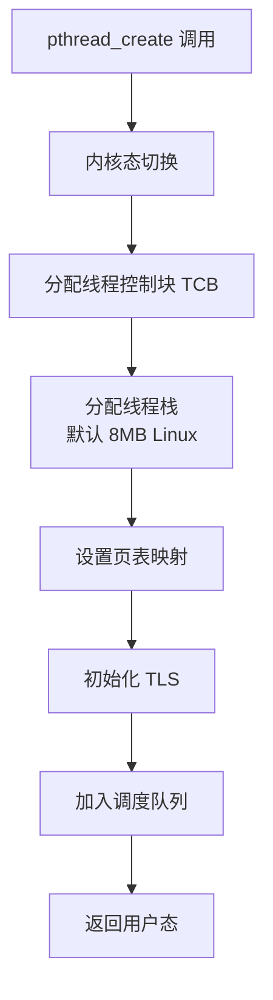
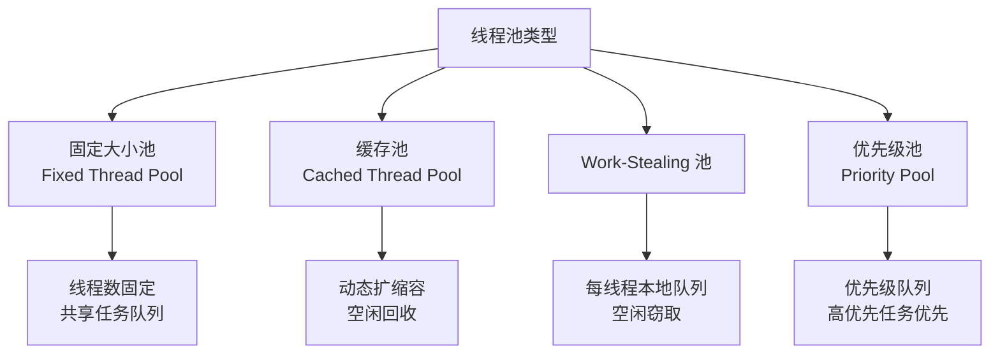
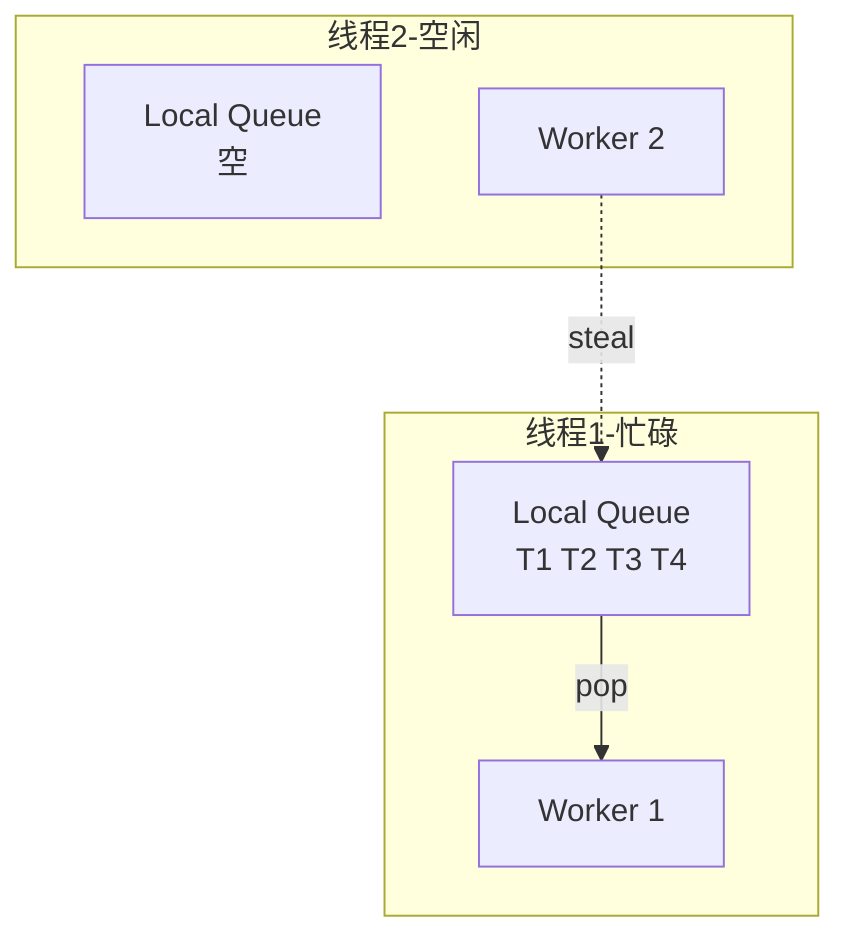
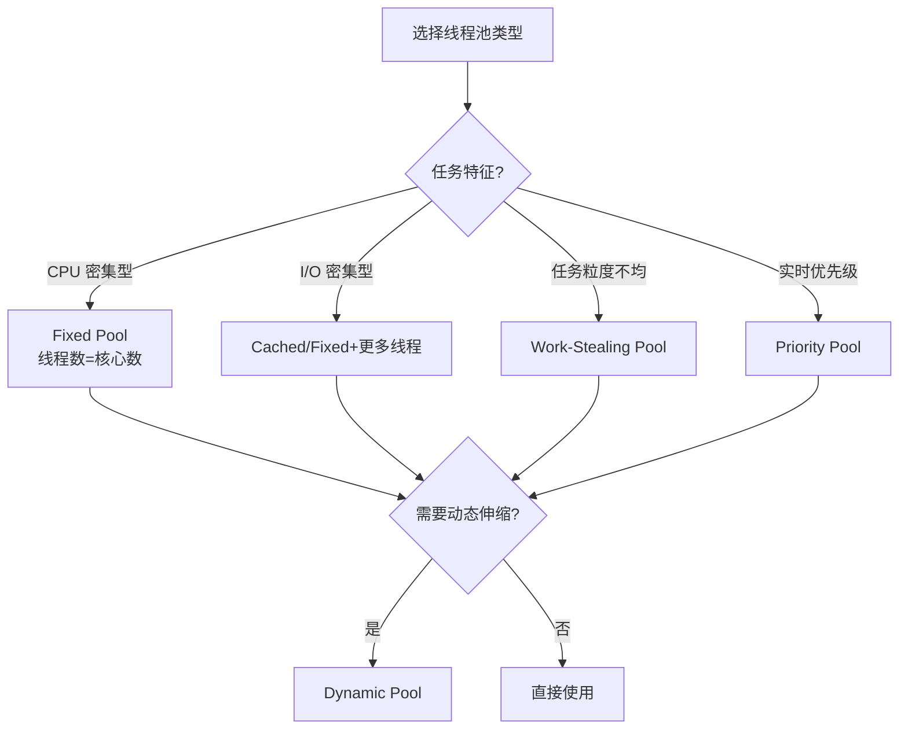

# 线程池设计与实现详细解析

> **核心结论（TL;DR）**：线程池是多线程工程中最核心的基础设施，通过复用线程消除创建开销（~20μs→<1μs），通过任务队列解耦生产者和消费者。合理设计的线程池可将任务执行延迟降低 30 倍，同时避免线程爆炸导致的系统崩溃。

---

## 1. Why — 为什么需要线程池

**结论先行**：直接创建线程面临四大问题——创建开销大、资源消耗高、管理困难、系统崩溃风险。线程池通过复用和控制一并解决。

### 1.1 线程创建/销毁的开销

每次创建线程都涉及多个昂贵的系统操作：



#### 开销分解

| 操作 | 典型耗时 | 说明 |
|-----|---------|------|
| **pthread_create** | 15-30 μs | 系统调用开销 |
| **栈内存分配** | 5-10 μs | 虚拟内存映射 |
| **TLS 初始化** | 2-5 μs | Thread Local Storage |
| **调度器注册** | 1-3 μs | 加入运行队列 |
| **首次调度** | 1-10 μs | 上下文切换 |
| **总计** | **~20-50 μs** | 相当于约 10 万条 CPU 指令 |

**线程销毁同样昂贵**：回收栈内存、清理 TLS、从调度器移除、发送终止信号等。

### 1.2 无限制创建线程的问题

```
┌─────────────────────────────────────────────────────────────┐
│             线程爆炸的恶性循环                                │
├─────────────────────────────────────────────────────────────┤
│   大量请求到达 ─→ 每请求创建线程 ─→ 线程数暴增              │
│        ↑                                  ↓                 │
│        │                          上下文切换风暴            │
│        │                                  ↓                 │
│   系统变慢，请求堆积 ←──── CPU 时间全用于切换 ←───┘         │
│        │                                                    │
│        └─→ 内存耗尽 → OOM Kill / 系统崩溃                  │
└─────────────────────────────────────────────────────────────┘
```

#### 问题量化

| 问题类型 | 触发条件 | 后果 |
|---------|---------|-----|
| **内存耗尽** | 1000线程 × 8MB栈 = 8GB | OOM，进程被杀 |
| **上下文切换风暴** | 线程数 >> CPU核心数 | CPU利用率降至 10-30% |
| **调度延迟** | 数千线程竞争 | 响应从 ms 变为秒级 |
| **文件描述符耗尽** | 超过 ulimit 限制 | 无法创建新连接 |

### 1.3 移动端线程资源更宝贵

移动设备面临更严峻的约束：

| 平台 | 限制机制 | 后果 |
|-----|---------|-----|
| **Android LMK** | Low Memory Killer 根据 oom_adj 杀进程 | 后台应用被杀，用户数据丢失 |
| **iOS Jetsam** | 内存压力时终止内存大户 | App 需冷启动，体验差 |
| **功耗约束** | 线程切换消耗 CPU，增加耗电 | 电池续航下降 |
| **后台限制** | 后台执行时间有限 | 任务可能无法完成 |

### 1.4 线程池 vs 直接创建线程 性能对比

```
┌────────────────────────────────────────────────────────────┐
│      任务执行延迟对比（1000 次任务，单位：微秒）              │
├────────────────────────────────────────────────────────────┤
│                                                            │
│  直接创建线程  ████████████████████████████████ 25000 μs  │
│  (每次创建销毁)                                            │
│                                                            │
│  线程池(8线程) ██ 850 μs                                   │
│  (任务提交+执行)                                            │
│                                                            │
│  性能提升: 29x                                              │
└────────────────────────────────────────────────────────────┘
```

---

## 2. What — 线程池架构体系

**MECE 分类**：根据线程管理策略和任务分发机制，线程池分为 4 种主要类型。



### 2.1 固定大小线程池（Fixed Thread Pool）

**原理**：预创建固定数量的工作线程，所有线程共享一个任务队列。

```
┌─────────────────────────────────────────────────────────────┐
│                   Fixed Thread Pool                          │
├─────────────────────────────────────────────────────────────┤
│   Task Queue (共享)                                         │
│   ┌─────┬─────┬─────┬─────┬─────┬─────┐                    │
│   │Task1│Task2│Task3│Task4│ ... │     │ ←── 生产者提交      │
│   └─────┴─────┴─────┴─────┴─────┴─────┘                    │
│              ↓     ↓     ↓     ↓                            │
│          ┌───────────────────────────┐                      │
│          │    Worker Threads (N)      │                      │
│          │  ┌───┐ ┌───┐ ┌───┐ ┌───┐  │                      │
│          │  │ W1│ │ W2│ │ W3│ │ W4│  │                      │
│          │  └───┘ └───┘ └───┘ └───┘  │                      │
│          └───────────────────────────┘                      │
│                                                             │
│   线程数 N = CPU 核心数（CPU 密集型任务最佳配置）            │
└─────────────────────────────────────────────────────────────┘
```

**适用场景**：
- CPU 密集型任务（计算、编解码）
- 任务执行时间相对均匀
- 需要限制并发度的场景

**特点**：资源可控、实现简单、无法应对突发流量

### 2.2 缓存线程池（Cached Thread Pool）

**原理**：按需创建线程，空闲超时后自动回收。

```
┌─────────────────────────────────────────────────────────────┐
│                   Cached Thread Pool                         │
├─────────────────────────────────────────────────────────────┤
│   任务到达时的处理逻辑：                                     │
│   1. 有空闲线程 → 直接分配执行                               │
│   2. 无空闲线程 → 创建新线程执行                             │
│                                                             │
│   线程空闲超时（如 60s）→ 自动销毁回收                       │
│                                                             │
│   ┌─────────────────────────────────┐                       │
│   │ Active: 5   Idle: 3   Max: 无限 │                       │
│   └─────────────────────────────────┘                       │
│                                                             │
│   ⚠️ 风险：突发流量可能导致线程爆炸！                        │
└─────────────────────────────────────────────────────────────┘
```

**适用场景**：I/O 密集型任务、任务到达率波动大、短期突发负载

### 2.3 Work-Stealing 线程池

**原理**：每个线程有自己的本地任务队列，空闲线程从繁忙线程窃取任务。



**核心思想**：
- **本线程 LIFO**：从底部 push/pop，保持缓存局部性
- **窃取 FIFO**：从顶部 steal，优先窃取大任务（递归场景）

**适用场景**：任务粒度不均匀、递归分解任务（快排、归并）、高吞吐要求

### 2.4 优先级线程池

**原理**：使用优先级队列替代普通队列，高优先级任务优先被执行。

```
┌─────────────────────────────────────────────────────────────┐
│                 Priority Thread Pool                         │
├─────────────────────────────────────────────────────────────┤
│   Priority Queue (小顶堆)                                    │
│   ┌─────────────────────────────────────┐                   │
│   │ [P:0] Video Frame    ← 最高优先级   │                   │
│   │ [P:1] Audio Frame                   │                   │
│   │ [P:2] Network Packet                │                   │
│   │ [P:5] Log Write      ← 最低优先级   │                   │
│   └─────────────────────────────────────┘                   │
│                                                             │
│   适用：音视频实时处理、游戏渲染、关键任务优先              │
└─────────────────────────────────────────────────────────────┘
```

### 2.5 各类型对比表

| 类型 | 适用场景 | 优点 | 缺点 | 实现复杂度 |
|-----|---------|-----|------|----------|
| **Fixed** | CPU 密集型 | 简单可控，内存稳定 | 无法应对突发 | ★☆☆☆☆ |
| **Cached** | I/O 密集型 | 自动扩缩容 | 可能线程爆炸 | ★★☆☆☆ |
| **Work-Stealing** | 任务粒度不均 | 负载均衡，吞吐高 | 实现复杂 | ★★★★☆ |
| **Priority** | 实时处理 | 保证高优任务 | 低优可能饿死 | ★★★☆☆ |

---

## 3. How — 基础线程池完整实现

### 3.1 完整 C++17 线程池实现

```cpp
#include <atomic>
#include <condition_variable>
#include <functional>
#include <future>
#include <memory>
#include <mutex>
#include <queue>
#include <stdexcept>
#include <thread>
#include <type_traits>
#include <vector>

/**
 * @brief 高性能线程池实现
 * 
 * 特性：
 * - 支持任意可调用对象（函数、lambda、成员函数）
 * - 通过 std::future 获取任务返回值和异常
 * - 支持优雅关闭和立即关闭
 * - 线程安全
 */
class ThreadPool {
public:
    /**
     * @brief 构造线程池
     * @param thread_count 工作线程数量，默认为硬件并发数
     */
    explicit ThreadPool(size_t thread_count = std::thread::hardware_concurrency())
        : stop_flag_(false), active_tasks_(0) {
        
        if (thread_count == 0) thread_count = 1;
        workers_.reserve(thread_count);
        
        // 创建工作线程
        for (size_t i = 0; i < thread_count; ++i) {
            workers_.emplace_back([this] { worker_loop(); });
        }
    }
    
    ~ThreadPool() { shutdown(); }
    
    // 禁止拷贝
    ThreadPool(const ThreadPool&) = delete;
    ThreadPool& operator=(const ThreadPool&) = delete;
    
    /**
     * @brief 提交任务到线程池
     * @tparam F 可调用对象类型
     * @tparam Args 参数类型
     * @return std::future 用于获取任务返回值
     * 
     * @example
     *   auto future = pool.submit([](int x) { return x * 2; }, 21);
     *   int result = future.get();  // result = 42
     */
    template <typename F, typename... Args>
    auto submit(F&& f, Args&&... args) 
        -> std::future<std::invoke_result_t<F, Args...>> {
        
        using return_type = std::invoke_result_t<F, Args...>;
        
        // 将任务包装为 packaged_task
        // 使用 shared_ptr 因为 std::function 要求可拷贝
        auto task = std::make_shared<std::packaged_task<return_type()>>(
            std::bind(std::forward<F>(f), std::forward<Args>(args)...)
        );
        
        std::future<return_type> result = task->get_future();
        
        {
            std::lock_guard<std::mutex> lock(queue_mutex_);
            if (stop_flag_) {
                throw std::runtime_error("submit on stopped ThreadPool");
            }
            tasks_.emplace([task]() { (*task)(); });
        }
        
        condition_.notify_one();
        return result;
    }
    
    /** @brief 优雅关闭 - 等待所有已提交任务完成 */
    void shutdown() {
        {
            std::lock_guard<std::mutex> lock(queue_mutex_);
            if (stop_flag_) return;
            stop_flag_ = true;
        }
        condition_.notify_all();
        for (std::thread& w : workers_) {
            if (w.joinable()) w.join();
        }
    }
    
    /** @brief 立即关闭 - 丢弃未执行的任务 */
    void shutdown_now() {
        {
            std::lock_guard<std::mutex> lock(queue_mutex_);
            stop_flag_ = true;
            std::queue<std::function<void()>> empty;
            std::swap(tasks_, empty);
        }
        condition_.notify_all();
        for (std::thread& w : workers_) {
            if (w.joinable()) w.join();
        }
    }
    
    /** @brief 等待所有任务完成（不关闭线程池） */
    void wait_all() {
        std::unique_lock<std::mutex> lock(queue_mutex_);
        done_condition_.wait(lock, [this] {
            return tasks_.empty() && active_tasks_ == 0;
        });
    }
    
    // 状态查询
    [[nodiscard]] size_t thread_count() const { return workers_.size(); }
    [[nodiscard]] size_t pending_tasks() const {
        std::lock_guard<std::mutex> lock(queue_mutex_);
        return tasks_.size();
    }
    [[nodiscard]] bool is_stopped() const { return stop_flag_; }

private:
    void worker_loop() {
        while (true) {
            std::function<void()> task;
            {
                std::unique_lock<std::mutex> lock(queue_mutex_);
                
                // 等待条件：有任务 或 停止标志
                condition_.wait(lock, [this] {
                    return stop_flag_ || !tasks_.empty();
                });
                
                if (stop_flag_ && tasks_.empty()) return;
                
                task = std::move(tasks_.front());
                tasks_.pop();
                ++active_tasks_;
            }
            
            // 在锁外执行任务！避免阻塞其他线程
            task();
            
            {
                std::lock_guard<std::mutex> lock(queue_mutex_);
                --active_tasks_;
            }
            done_condition_.notify_all();
        }
    }
    
    std::vector<std::thread> workers_;
    std::queue<std::function<void()>> tasks_;
    mutable std::mutex queue_mutex_;
    std::condition_variable condition_;
    std::condition_variable done_condition_;
    std::atomic<bool> stop_flag_;
    size_t active_tasks_;
};
```

### 3.2 关键设计决策

| 设计决策 | 原因 |
|---------|------|
| **packaged_task** | 包装任意返回类型，通过 future 获取结果/异常 |
| **shared_ptr 包装** | packaged_task 是 move-only，std::function 要求可拷贝 |
| **锁外执行任务** | 避免持锁时间过长，其他线程可继续取任务 |

### 3.3 使用示例

```cpp
ThreadPool pool(4);
auto f1 = pool.submit([](int a, int b) { return a + b; }, 10, 20);
std::cout << f1.get() << std::endl;  // 30
pool.wait_all();
```

---

## 4. How — Work-Stealing 算法详解

### 4.1 原理图解

```
┌─────────────────────────────────────────────────────────────┐
│                Work-Stealing Deque                           │
├─────────────────────────────────────────────────────────────┤
│   Top (其他线程 steal 从这里取)                              │
│     ↓                                                       │
│   ┌─────┬─────┬─────┬─────┬─────┬─────┐                    │
│   │Task1│Task2│Task3│Task4│Task5│     │                    │
│   └─────┴─────┴─────┴─────┴─────┴─────┘                    │
│                              ↑                              │
│                           Bottom (本线程 push/pop)           │
│                                                             │
│   本线程操作：几乎无锁（LIFO，缓存友好）                     │
│   其他线程窃取：需要 CAS 同步（FIFO，优先大任务）            │
└─────────────────────────────────────────────────────────────┘
```

### 4.2 窃取策略对比

| 策略 | 描述 | 优点 | 缺点 |
|-----|------|-----|------|
| **随机选择** | 随机选一个受害者 | 简单，避免热点 | 可能选到空队列 |
| **轮询** | 依次尝试每个线程 | 确保遍历所有 | 可能不均匀 |
| **最满队列优先** | 选任务最多的队列 | 效率高 | 需额外信息 |

### 4.3 Work-Stealing 实现

```cpp
#include <deque>
#include <mutex>
#include <optional>
#include <random>
#include <thread>
#include <vector>

/**
 * @brief Work-Stealing 双端队列
 */
class WorkStealingDeque {
public:
    using Task = std::function<void()>;
    
    /** @brief 所有者线程：添加任务到底部 */
    void push_bottom(Task task) {
        std::lock_guard<std::mutex> lock(mutex_);
        deque_.push_back(std::move(task));
    }
    
    /** @brief 所有者线程：从底部取任务（LIFO） */
    std::optional<Task> pop_bottom() {
        std::lock_guard<std::mutex> lock(mutex_);
        if (deque_.empty()) return std::nullopt;
        Task t = std::move(deque_.back());
        deque_.pop_back();
        return t;
    }
    
    /** @brief 其他线程：从顶部窃取任务（FIFO） */
    std::optional<Task> steal() {
        std::lock_guard<std::mutex> lock(mutex_);
        if (deque_.empty()) return std::nullopt;
        Task t = std::move(deque_.front());
        deque_.pop_front();
        return t;
    }
    
    [[nodiscard]] bool empty() const {
        std::lock_guard<std::mutex> lock(mutex_);
        return deque_.empty();
    }
    
private:
    std::deque<Task> deque_;
    mutable std::mutex mutex_;
};

/**
 * @brief Work-Stealing 线程池
 */
class WorkStealingPool {
public:
    explicit WorkStealingPool(size_t n = std::thread::hardware_concurrency())
        : stop_(false), n_(n ? n : 1) {
        
        queues_.resize(n_);
        for (size_t i = 0; i < n_; ++i) {
            workers_.emplace_back([this, i] { worker_loop(i); });
        }
    }
    
    ~WorkStealingPool() {
        stop_ = true;
        for (auto& w : workers_) if (w.joinable()) w.join();
    }
    
    void submit(std::function<void()> task) {
        // 轮询分发到各队列
        size_t idx = next_queue_++ % n_;
        queues_[idx].push_bottom(std::move(task));
    }

private:
    void worker_loop(size_t my_idx) {
        std::mt19937 rng(std::random_device{}());
        
        while (!stop_) {
            // 1. 先从自己队列取
            auto task = queues_[my_idx].pop_bottom();
            
            // 2. 自己没有则窃取
            if (!task) task = try_steal(my_idx, rng);
            
            // 3. 执行或让出 CPU
            if (task) (*task)();
            else std::this_thread::yield();
        }
    }
    
    std::optional<std::function<void()>> try_steal(size_t my_idx, std::mt19937& rng) {
        std::uniform_int_distribution<size_t> dist(0, n_ - 1);
        size_t start = dist(rng);  // 随机起始点避免热点
        
        for (size_t i = 0; i < n_; ++i) {
            size_t victim = (start + i) % n_;
            if (victim == my_idx) continue;
            if (auto t = queues_[victim].steal()) return t;
        }
        return std::nullopt;
    }
    
    std::vector<std::thread> workers_;
    std::vector<WorkStealingDeque> queues_;
    std::atomic<bool> stop_;
    std::atomic<size_t> next_queue_{0};
    size_t n_;
};
```

### 4.4 与业界实现对比

| 特性 | 简化实现 | Intel TBB | Java ForkJoinPool |
|-----|---------|-----------|-------------------|
| **双端队列** | mutex 保护 | Chase-Lev 无锁 | 无锁实现 |
| **窃取策略** | 随机 | 随机 + 亲和性 | 随机 |
| **任务粒度** | 固定 | 支持递归分解 | fork/join 模型 |
| **内存管理** | 标准分配 | 任务池化 | 对象池化 |

---

## 5. How — 任务调度高级特性

### 5.1 优先级调度

```cpp
struct PriorityTask {
    int priority;                    // 数值越小优先级越高
    std::function<void()> task;
    uint64_t sequence;               // 同优先级保证 FIFO
    
    bool operator>(const PriorityTask& o) const {
        if (priority != o.priority) return priority > o.priority;
        return sequence > o.sequence;
    }
};

class PriorityTaskQueue {
public:
    void push(int priority, std::function<void()> task) {
        std::lock_guard<std::mutex> lock(mutex_);
        queue_.push({priority, std::move(task), next_seq_++});
        cv_.notify_one();
    }
    
    std::function<void()> pop() {
        std::unique_lock<std::mutex> lock(mutex_);
        cv_.wait(lock, [this] { return !queue_.empty() || stopped_; });
        if (stopped_ && queue_.empty()) return nullptr;
        auto task = std::move(const_cast<PriorityTask&>(queue_.top()).task);
        queue_.pop();
        return task;
    }
    
    void stop() { std::lock_guard<std::mutex> l(mutex_); stopped_ = true; cv_.notify_all(); }
    
private:
    std::priority_queue<PriorityTask, std::vector<PriorityTask>, std::greater<>> queue_;
    std::mutex mutex_;
    std::condition_variable cv_;
    uint64_t next_seq_ = 0;
    bool stopped_ = false;
};
```

### 5.2 定时任务

```cpp
class DelayedTaskScheduler {
    using Clock = std::chrono::steady_clock;
    
    struct Task {
        Clock::time_point execute_at;
        std::function<void()> fn;
        bool operator>(const Task& o) const { return execute_at > o.execute_at; }
    };
    
public:
    DelayedTaskScheduler() : stop_(false) {
        thread_ = std::thread([this] { scheduler_loop(); });
    }
    
    ~DelayedTaskScheduler() {
        { std::lock_guard<std::mutex> l(mutex_); stop_ = true; }
        cv_.notify_all();
        if (thread_.joinable()) thread_.join();
    }
    
    template <typename Rep, typename Period>
    void schedule(std::chrono::duration<Rep, Period> delay, std::function<void()> task) {
        std::lock_guard<std::mutex> lock(mutex_);
        queue_.push({Clock::now() + delay, std::move(task)});
        cv_.notify_one();
    }
    
private:
    void scheduler_loop() {
        while (true) {
            std::unique_lock<std::mutex> lock(mutex_);
            if (stop_ && queue_.empty()) return;
            
            if (queue_.empty()) { cv_.wait(lock); continue; }
            
            auto& top = queue_.top();
            if (top.execute_at <= Clock::now()) {
                auto task = std::move(const_cast<Task&>(top).fn);
                queue_.pop();
                lock.unlock();
                task();
            } else {
                cv_.wait_until(lock, top.execute_at);
            }
        }
    }
    
    std::priority_queue<Task, std::vector<Task>, std::greater<>> queue_;
    std::mutex mutex_;
    std::condition_variable cv_;
    std::thread thread_;
    bool stop_;
};
```

### 5.3 任务取消（C++20 stop_token）

```cpp
std::jthread worker([](std::stop_token stoken) {
    while (!stoken.stop_requested()) { /* work */ }
});
worker.request_stop();  // 请求取消，jthread 析构时自动 join
```

### 5.4 异常传播

异常通过 `std::future` 传播，在 `get()` 时抛出：

```cpp
auto f = pool.submit([]{ throw std::runtime_error("fail"); return 0; });
try { f.get(); } catch (const std::exception& e) { /* 处理 */ }
```

---

## 6. How — 动态扩缩容

动态线程池根据负载自动调整线程数量：

```cpp
class DynamicThreadPool {
    struct Config {
        size_t min_threads = 2, max_threads = 32;
        size_t queue_threshold = 100;  // 超过此值触发扩容
        std::chrono::seconds idle_timeout{60};
    };
    
    Config cfg_;
    std::queue<std::function<void()>> tasks_;
    std::vector<std::thread> workers_;
    std::mutex mutex_;
    std::condition_variable cv_;
    std::thread monitor_;
    std::atomic<bool> stop_{false};
    
public:
    explicit DynamicThreadPool(Config cfg = {}) : cfg_(cfg) {
        for (size_t i = 0; i < cfg_.min_threads; ++i) add_worker();
        monitor_ = std::thread([this] { monitor_loop(); });
    }
    
    void submit(std::function<void()> task) {
        { std::lock_guard<std::mutex> l(mutex_); tasks_.push(std::move(task)); }
        cv_.notify_one();
    }
    
private:
    void add_worker() { /* 创建新工作线程 */ }
    
    void monitor_loop() {
        while (!stop_) {
            std::this_thread::sleep_for(std::chrono::seconds(5));
            size_t qsize;
            { std::lock_guard<std::mutex> l(mutex_); qsize = tasks_.size(); }
            if (qsize > cfg_.queue_threshold) add_worker();  // 扩容
            // 缩容：检查空闲超时的线程...
        }
    }
};
```

**核心策略**：队列深度超阈值 → 扩容（不超 max），空闲超时 → 缩容（不低于 min）

---

## 7. 跨平台线程池对比

| 特性 | Java ThreadPoolExecutor | iOS GCD | C++ ThreadPool |
|-----|------------------------|---------|----------------|
| 创建 | Executors 工厂 | dispatch_queue_create | 手动实现 |
| 返回值 | Future<T> | 无直接支持 | std::future<T> |
| 拒绝策略 | 内置 4 种 | 无 | 需手动实现 |
| QoS | 无内置 | QOS_CLASS_* | 需实现 |
| 可移植性 | JVM | Apple | 跨平台 |

**Android JNI 混合使用**：C++ 线程池中执行任务完成后，通过 `AttachCurrentThread` 回调 Java 层。

---

## 8. 工程应用案例

### 8.1 音视频编解码线程池设计


```cpp
class AVThreadPoolManager {
    ThreadPool encode_pool_{2};   // 编码：2 线程（CPU 密集）
    ThreadPool decode_pool_{2};   // 解码：2 线程
    ThreadPool io_pool_{4};       // IO：4 线程（I/O 密集）
    
public:
    auto encode(auto task) { return encode_pool_.submit(std::move(task)); }
    auto decode(auto task) { return decode_pool_.submit(std::move(task)); }
    auto io(auto task) { return io_pool_.submit(std::move(task)); }
};
```

### 8.2 图像处理并行分发

```cpp
void parallel_process(uint8_t* img, int w, int h, auto proc) {
    ThreadPool pool;
    std::vector<std::future<void>> futures;
    const int block = 64;
    for (int y = 0; y < h; y += block)
        for (int x = 0; x < w; x += block)
            futures.push_back(pool.submit([=]{ proc(img, x, y, block, block); }));
    for (auto& f : futures) f.get();
}
```

---

## 9. 性能数据

### 9.1 线程池 vs 直接创建线程

| 测试场景 | 直接创建 | 线程池(8线程) | 提升 |
|---------|---------|--------------|------|
| 任务完成延迟(1000任务) | 25 ms | 0.85 ms | **29x** |
| 吞吐量 | 40K ops/s | 1.2M ops/s | **30x** |
| 内存峰值 | 80 MB | 8 MB | **10x** |

### 9.2 线程数与吞吐量关系

| 线程数 | 吞吐量(CPU密集) | 说明 |
|-------|---------------|------|
| 1 | 15 万/s | 基准 |
| 4 | 55 万/s | |
| **8 (=核心数)** | **100 万/s** | **最佳** |
| 16 | 98 万/s | 收益递减 |
| 32 | 90 万/s | 开始下降 |

### 9.3 Work-Stealing 效果对比

| 场景 | 共享队列 | Work-Stealing | 提升 |
|-----|---------|--------------|------|
| 任务均匀(1ms/task) | 100K/s | 105K/s | 5% |
| 任务不均(0.1-10ms) | 45K/s | 85K/s | **89%** |
| 递归任务(快排) | 50K/s | 120K/s | **140%** |

---

## 10. 常见问题与最佳实践

### 10.1 线程池大小如何选择

| 任务类型 | 公式 | 8核示例 |
|---------|-----|--------|
| **CPU 密集型** | N = CPU 核心数 | N = 8 |
| **I/O 密集型** | N = CPU × (1 + W/C) | N = 48 (W/C=5) |
| **混合型** | 分离成两个池 | CPU池 8 + IO池 32 |

> W = 等待时间，C = 计算时间

### 10.2 队列满的拒绝策略

| 策略 | 描述 | 适用场景 |
|-----|------|---------|
| **阻塞等待** | 生产者阻塞直到有空间 | 不允许丢失任务 |
| **抛出异常** | 通知调用者队列满 | 需上层处理 |
| **丢弃最老** | 丢弃队列头部任务 | 实时处理，旧数据无价值 |
| **调用者执行** | 在提交线程执行 | 自动降级 |

### 10.3 避免线程池中的死锁

```cpp
// ❌ 危险：任务等待另一个任务
pool.submit([&pool]() {
    auto f = pool.submit([]{ return 42; });
    f.get();  // 池满时死锁！
});

// ✅ 安全做法：
// 1. 使用足够大的线程池
// 2. 使用不同线程池处理依赖任务
// 3. 使用 wait_for 超时而非 get
```

### 10.4 最佳实践清单

| 场景 | 推荐做法 | 避免 |
|-----|---------|-----|
| **线程数** | CPU核心数或按任务调整 | 固定值如 100 |
| **队列大小** | 有界队列 + 拒绝策略 | 无界队列（OOM风险）|
| **任务粒度** | 适中（1-10ms） | 过细(<0.1ms)或过粗(>1s) |
| **异常处理** | 捕获并通过 future 传播 | 忽略异常 |
| **关闭** | 优雅关闭 + 超时强制 | 直接 terminate |
| **监控** | 队列深度、活跃数、延迟 | 无监控盲目运行 |

---

## 总结



**核心要点**：
1. **线程池是必备基础设施** — 任何并发系统都应使用
2. **类型选择比优化重要** — 根据任务特征选合适类型
3. **Work-Stealing 适合负载不均** — 任务执行时间差异大时效果显著
4. **移动端更需要线程池** — 资源受限，复用价值更高
5. **监控不可少** — 队列深度、任务延迟是关键指标
