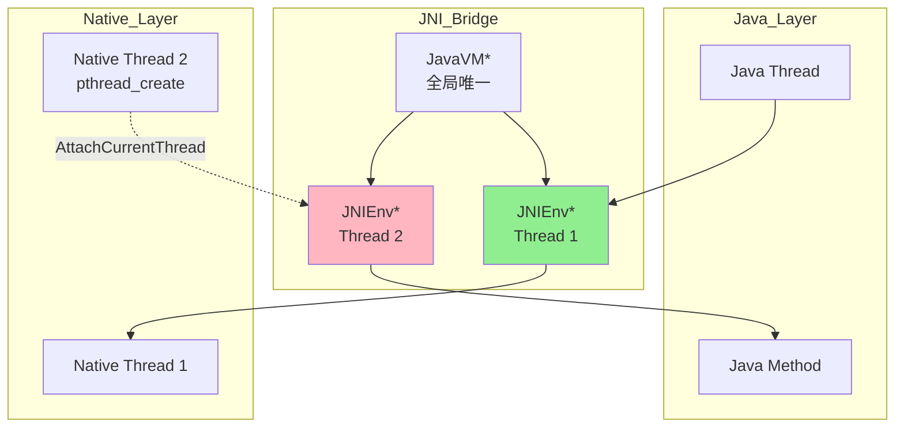
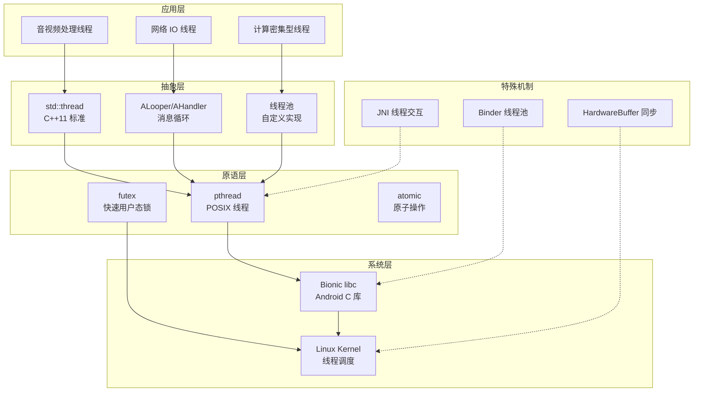
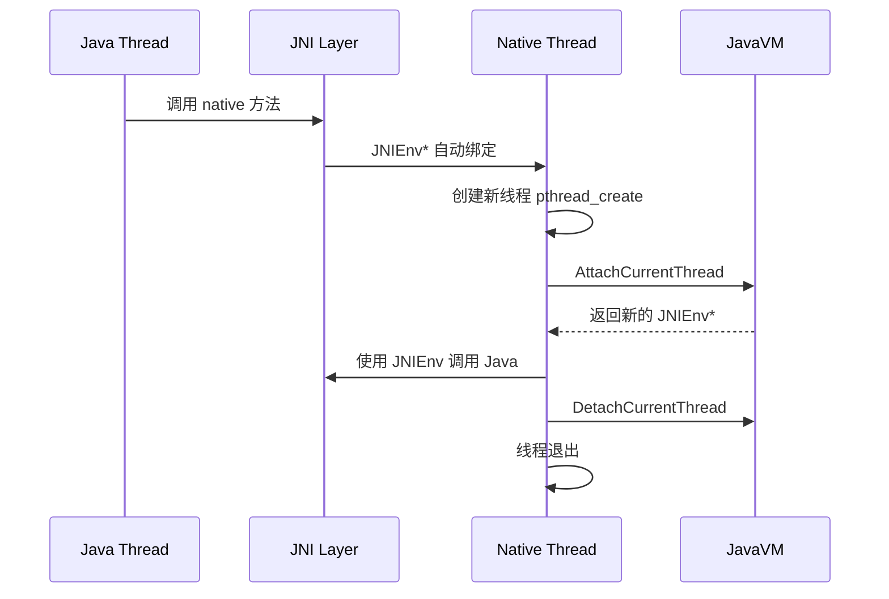
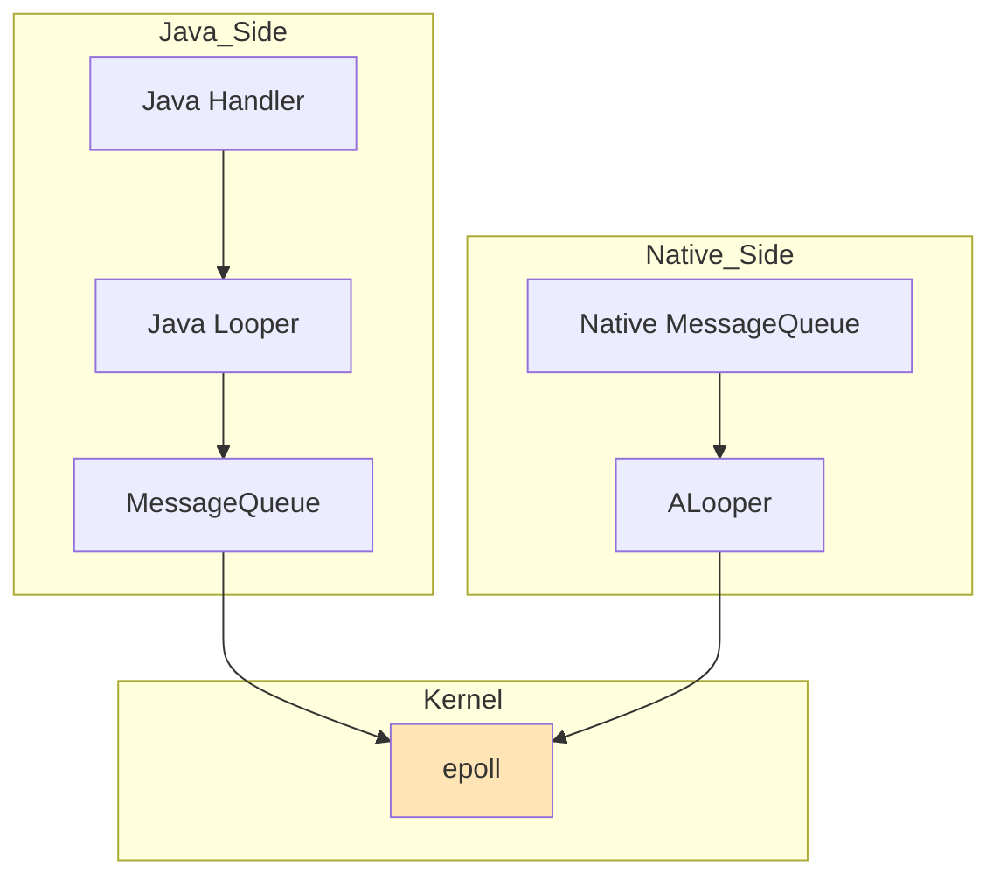
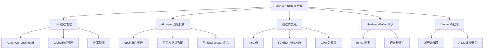

# Android NDK 多线程详细解析

> **核心结论**：Android NDK 多线程开发的核心挑战是 JNI 线程模型约束——JNIEnv 是线程局部的，Native 线程必须通过 AttachCurrentThread 才能调用 Java 方法。正确理解 JNI 线程交互、ALooper 消息机制和 Binder 线程池，是构建高性能音视频应用的基础。

---

## 核心结论（TL;DR）

| 主题 | 关键结论 |
|------|---------|
| **JNI 线程模型** | JNIEnv 指针是线程局部的，不能跨线程传递；Native 线程需 AttachCurrentThread |
| **pthread vs std::thread** | NDK 中 std::thread 底层就是 pthread，推荐使用 std::thread 以保持 C++ 风格 |
| **ALooper 机制** | 基于 epoll 的事件循环，是 NDK 层实现消息驱动的核心工具 |
| **线程优先级** | 音频线程需设置 SCHED_FIFO + 高优先级；使用 setpriority 或 sched_setscheduler |
| **HardwareBuffer** | 跨进程零拷贝的关键，多线程使用需配合 fence 同步 |
| **最佳实践** | 命名线程（便于调试）、控制栈大小、正确处理 ANR |

---

## 1. Why — Android NDK 多线程的特殊性

**结论先行**：Android NDK 多线程与标准 C++ 多线程的核心差异在于 JNI 线程模型限制、Android 进程生命周期管理，以及系统资源（如 AHardwareBuffer）的跨进程共享需求。

### 1.1 JNI 线程模型限制



**JNIEnv 的线程亲和性**：

| 特性 | 说明 |
|------|------|
| **线程局部** | 每个线程拥有独立的 JNIEnv 指针 |
| **不可跨线程** | 在线程 A 获取的 JNIEnv 不能在线程 B 中使用 |
| **生命周期** | 与线程绑定，线程退出时自动失效 |
| **获取方式** | Java 调用：参数传入；Native 线程：AttachCurrentThread |

### 1.2 Native 线程与 Java 线程的关系

```cpp
// Java 线程调用 Native 方法时的 JNIEnv
JNIEXPORT void JNICALL Java_com_example_MyClass_nativeMethod(
    JNIEnv* env,    // 自动传入，与调用线程绑定
    jobject thiz
) {
    // env 只在当前线程有效
}

// Native 线程需要手动 Attach
void native_thread_func(JavaVM* jvm) {
    JNIEnv* env = nullptr;
    // 必须 Attach 才能获取有效的 JNIEnv
    jvm->AttachCurrentThread(&env, nullptr);
    
    // 使用 env 调用 Java 方法...
    
    // 线程退出前必须 Detach
    jvm->DetachCurrentThread();
}
```

### 1.3 Android 进程模型对线程的影响

```
┌────────────────────────────────────────────────────────────────┐
│                    Android 进程优先级模型                        │
├────────────────────────────────────────────────────────────────┤
│  Foreground Process  (前台进程)    ← 用户正在交互                │
│  Visible Process     (可见进程)    ← 可见但非前台                │
│  Service Process     (服务进程)    ← 运行 Service                │
│  Cached Process      (缓存进程)    ← 后台，可能被杀              │
├────────────────────────────────────────────────────────────────┤
│  Native 线程影响：                                               │
│  - 进程被杀时，所有 Native 线程立即终止（无清理机会）             │
│  - 后台线程可能被 Doze 模式限制 CPU 时间片                       │
│  - 需要考虑进程重建后的状态恢复                                   │
└────────────────────────────────────────────────────────────────┘
```

**关键注意点**：

1. **进程突然终止**：App 进入后台后可能被系统杀死，Native 线程没有机会执行析构函数
2. **Doze 模式**：Android 6.0+ 的深度休眠模式会大幅限制后台 CPU 时间
3. **Low Memory Killer**：内存不足时按优先级杀进程，Native 内存泄漏加速被杀

---

## 2. What — Android NDK 线程技术体系

**MECE 分类**：Android NDK 中的多线程技术可分为 5 个互不重叠的层次。



### 2.1 pthread on Android（与标准 POSIX 差异）

| 特性 | 标准 POSIX | Android Bionic |
|------|-----------|----------------|
| **线程栈大小** | 通常 8 MB | 默认 1 MB（主线程）/ 1 MB（子线程） |
| **pthread_cancel** | 支持 | ❌ 不支持 |
| **pthread_cleanup_push** | 支持 | 部分支持（无 cancel 意义有限） |
| **线程命名** | pthread_setname_np | ✅ 支持（16 字符限制） |
| **线程亲和性** | sched_setaffinity | ✅ 支持 |
| **实时调度** | SCHED_FIFO/RR | ✅ 支持（需 root 或 CAP_SYS_NICE） |

```cpp
// Android pthread 栈大小配置
pthread_attr_t attr;
pthread_attr_init(&attr);

// 设置栈大小为 512 KB（对于轻量级线程足够）
pthread_attr_setstacksize(&attr, 512 * 1024);

pthread_t thread;
pthread_create(&thread, &attr, thread_func, nullptr);
pthread_attr_destroy(&attr);
```

### 2.2 std::thread on Android NDK

**编译器/STL 支持情况**：

| NDK 版本 | 默认 STL | std::thread 支持 |
|----------|----------|-----------------|
| r16b 之前 | gnustl | 需手动启用 |
| r17+ | libc++ | ✅ 完整支持 |
| r21+ | libc++ only | ✅ 推荐使用 |

```cmake
# CMakeLists.txt 配置
cmake_minimum_required(VERSION 3.18)

# 确保使用 C++17
set(CMAKE_CXX_STANDARD 17)
set(CMAKE_CXX_STANDARD_REQUIRED ON)

# Android NDK 会自动链接 libc++
```

```cpp
#include <thread>
#include <mutex>
#include <condition_variable>

// NDK 中的 std::thread 完整可用
void example() {
    std::mutex mtx;
    std::condition_variable cv;
    bool ready = false;
    
    std::thread worker([&]() {
        std::unique_lock<std::mutex> lock(mtx);
        cv.wait(lock, [&] { return ready; });
        // 处理任务...
    });
    
    {
        std::lock_guard<std::mutex> lock(mtx);
        ready = true;
    }
    cv.notify_one();
    
    worker.join();
}
```

### 2.3 JNI 线程交互机制



### 2.4 ALooper/AHandler 消息循环

ALooper 是 Android NDK 提供的事件循环机制，底层基于 Linux epoll。

```
┌─────────────────────────────────────────────────────────────────┐
│                     ALooper 架构                                 │
├─────────────────────────────────────────────────────────────────┤
│                                                                  │
│   ┌─────────────┐    ┌─────────────┐    ┌─────────────┐        │
│   │ File Desc 1 │    │ File Desc 2 │    │ Message Pipe│        │
│   └──────┬──────┘    └──────┬──────┘    └──────┬──────┘        │
│          │                  │                  │                │
│          └──────────────────┼──────────────────┘                │
│                             │                                    │
│                     ┌───────▼───────┐                           │
│                     │    epoll      │                           │
│                     │  (内核级等待)  │                           │
│                     └───────┬───────┘                           │
│                             │                                    │
│                     ┌───────▼───────┐                           │
│                     │  ALooper      │                           │
│                     │ pollOnce/All  │                           │
│                     └───────┬───────┘                           │
│                             │                                    │
│                     ┌───────▼───────┐                           │
│                     │   Callback    │                           │
│                     └───────────────┘                           │
│                                                                  │
└─────────────────────────────────────────────────────────────────┘
```

### 2.5 Binder 线程池

Binder 是 Android IPC 的核心机制，每个进程维护一个 Binder 线程池。

```
┌──────────────────────────────────────────────────────────────┐
│                    Binder 线程池模型                          │
├──────────────────────────────────────────────────────────────┤
│                                                               │
│  Client Process                    Server Process            │
│  ┌───────────────┐                ┌───────────────┐         │
│  │ App Thread    │                │ Binder Pool   │         │
│  │               │                │ ┌───────────┐ │         │
│  │ proxy.call() ─┼───Binder───────┼►│ Thread 1  │ │         │
│  │               │   Driver       │ ├───────────┤ │         │
│  │               │                │ │ Thread 2  │ │         │
│  │               │                │ ├───────────┤ │         │
│  │               │                │ │ Thread N  │ │         │
│  │               │                │ └───────────┘ │         │
│  └───────────────┘                └───────────────┘         │
│                                                               │
│  默认线程池大小：16 线程 (可通过 ProcessState 调整)            │
│                                                               │
└──────────────────────────────────────────────────────────────┘
```

---

## 3. How — JNI 线程管理

### 3.1 AttachCurrentThread / DetachCurrentThread

**完整的 JNI 线程管理流程**：

```cpp
#include <jni.h>
#include <pthread.h>
#include <android/log.h>

#define LOG_TAG "JNIThread"
#define LOGI(...) __android_log_print(ANDROID_LOG_INFO, LOG_TAG, __VA_ARGS__)
#define LOGE(...) __android_log_print(ANDROID_LOG_ERROR, LOG_TAG, __VA_ARGS__)

// 全局 JavaVM 指针（进程内唯一）
static JavaVM* g_jvm = nullptr;

// JNI_OnLoad 中保存 JavaVM
JNIEXPORT jint JNI_OnLoad(JavaVM* vm, void* reserved) {
    g_jvm = vm;
    
    JNIEnv* env;
    if (vm->GetEnv(reinterpret_cast<void**>(&env), JNI_VERSION_1_6) != JNI_OK) {
        return JNI_ERR;
    }
    
    LOGI("JNI_OnLoad: JavaVM saved");
    return JNI_VERSION_1_6;
}

// RAII 风格的 JNI Attach 管理器
class JNIAttachGuard {
public:
    explicit JNIAttachGuard(JavaVM* jvm, const char* thread_name = nullptr) 
        : jvm_(jvm), env_(nullptr), attached_(false) {
        
        // 检查当前线程是否已经 Attach
        jint result = jvm_->GetEnv(reinterpret_cast<void**>(&env_), JNI_VERSION_1_6);
        
        if (result == JNI_EDETACHED) {
            // 需要 Attach
            JavaVMAttachArgs args;
            args.version = JNI_VERSION_1_6;
            args.name = thread_name;
            args.group = nullptr;
            
            result = jvm_->AttachCurrentThread(&env_, &args);
            if (result == JNI_OK) {
                attached_ = true;
                LOGI("Thread attached: %s", thread_name ? thread_name : "unnamed");
            } else {
                LOGE("AttachCurrentThread failed: %d", result);
            }
        } else if (result == JNI_OK) {
            // 已经 Attach（Java 线程调用）
            LOGI("Thread already attached");
        }
    }
    
    ~JNIAttachGuard() {
        if (attached_ && jvm_) {
            jvm_->DetachCurrentThread();
            LOGI("Thread detached");
        }
    }
    
    JNIEnv* env() const { return env_; }
    bool valid() const { return env_ != nullptr; }
    
    // 禁止拷贝
    JNIAttachGuard(const JNIAttachGuard&) = delete;
    JNIAttachGuard& operator=(const JNIAttachGuard&) = delete;
    
private:
    JavaVM* jvm_;
    JNIEnv* env_;
    bool attached_;
};
```

### 3.2 Native 线程回调 Java 方法的正确姿势

```cpp
// 缓存 Java 类和方法 ID（避免重复查找）
struct JavaCallbackCache {
    jclass callback_class;      // GlobalRef
    jmethodID on_progress_method;
    jmethodID on_complete_method;
    jmethodID on_error_method;
    jobject callback_object;    // GlobalRef
    
    void init(JNIEnv* env, jobject callback) {
        // 创建 GlobalRef（跨线程使用必须）
        callback_object = env->NewGlobalRef(callback);
        
        jclass local_class = env->GetObjectClass(callback);
        callback_class = (jclass)env->NewGlobalRef(local_class);
        env->DeleteLocalRef(local_class);
        
        // 缓存方法 ID
        on_progress_method = env->GetMethodID(callback_class, "onProgress", "(I)V");
        on_complete_method = env->GetMethodID(callback_class, "onComplete", "([B)V");
        on_error_method = env->GetMethodID(callback_class, "onError", "(ILjava/lang/String;)V");
    }
    
    void release(JNIEnv* env) {
        if (callback_object) {
            env->DeleteGlobalRef(callback_object);
            callback_object = nullptr;
        }
        if (callback_class) {
            env->DeleteGlobalRef(callback_class);
            callback_class = nullptr;
        }
    }
};

// Native 线程中调用 Java 回调
void worker_thread(JavaVM* jvm, JavaCallbackCache* cache) {
    JNIAttachGuard guard(jvm, "WorkerThread");
    if (!guard.valid()) return;
    
    JNIEnv* env = guard.env();
    
    // 模拟耗时操作
    for (int progress = 0; progress <= 100; progress += 10) {
        // 回调进度
        env->CallVoidMethod(cache->callback_object, 
                           cache->on_progress_method, 
                           progress);
        
        // 检查异常
        if (env->ExceptionCheck()) {
            env->ExceptionDescribe();
            env->ExceptionClear();
            break;
        }
        
        usleep(100000);  // 100ms
    }
    
    // 完成回调
    jbyteArray result = env->NewByteArray(1024);
    env->CallVoidMethod(cache->callback_object,
                       cache->on_complete_method,
                       result);
    env->DeleteLocalRef(result);
}
```

### 3.3 JNI GlobalRef / LocalRef 线程安全

| 引用类型 | 生命周期 | 跨线程 | 典型用途 |
|---------|---------|--------|---------|
| **LocalRef** | 当前 native 方法调用期间 | ❌ | 临时对象 |
| **GlobalRef** | 直到显式 DeleteGlobalRef | ✅ | 缓存 Class/Object |
| **WeakGlobalRef** | 可能被 GC 回收 | ✅ | 缓存（允许失效） |

```cpp
// 错误示例：跨线程使用 LocalRef
void wrong_example(JNIEnv* env, jobject callback) {
    // callback 是 LocalRef，传递给其他线程使用会导致崩溃！
    std::thread([=]() {
        // 错误：env 和 callback 都不能在这里使用
        env->CallVoidMethod(callback, ...);  // CRASH!
    }).detach();
}

// 正确示例：使用 GlobalRef
void correct_example(JNIEnv* env, jobject callback) {
    jobject global_callback = env->NewGlobalRef(callback);
    
    std::thread([global_callback]() {
        JNIAttachGuard guard(g_jvm, "CallbackThread");
        JNIEnv* env = guard.env();
        
        // 使用 GlobalRef 是安全的
        jclass cls = env->GetObjectClass(global_callback);
        jmethodID method = env->GetMethodID(cls, "onResult", "()V");
        env->CallVoidMethod(global_callback, method);
        
        // 使用完毕后释放
        env->DeleteGlobalRef(global_callback);
        env->DeleteLocalRef(cls);
    }).detach();
}
```

---

## 4. How — ALooper/AHandler 消息机制

### 4.1 ALooper 原理（基于 epoll）

```cpp
#include <android/looper.h>
#include <unistd.h>

// ALooper 状态常量
// ALOOPER_POLL_WAKE     = -1  // 被 ALooper_wake 唤醒
// ALOOPER_POLL_CALLBACK = -2  // 回调已执行
// ALOOPER_POLL_TIMEOUT  = -3  // 超时
// ALOOPER_POLL_ERROR    = -4  // 错误

// 创建消息循环线程
class MessageLoopThread {
public:
    void start() {
        running_ = true;
        thread_ = std::thread(&MessageLoopThread::loop, this);
    }
    
    void stop() {
        running_ = false;
        if (looper_) {
            ALooper_wake(looper_);  // 唤醒等待中的 looper
        }
        if (thread_.joinable()) {
            thread_.join();
        }
    }
    
    ALooper* looper() const { return looper_; }
    
private:
    void loop() {
        // 为当前线程准备 Looper
        looper_ = ALooper_prepare(ALOOPER_PREPARE_ALLOW_NON_CALLBACKS);
        
        while (running_) {
            // 等待事件，超时 1000ms
            int result = ALooper_pollOnce(1000, nullptr, nullptr, nullptr);
            
            switch (result) {
                case ALOOPER_POLL_WAKE:
                    LOGI("Looper woken up");
                    break;
                case ALOOPER_POLL_CALLBACK:
                    LOGI("Callback executed");
                    break;
                case ALOOPER_POLL_TIMEOUT:
                    LOGI("Poll timeout");
                    break;
                case ALOOPER_POLL_ERROR:
                    LOGE("Looper error");
                    running_ = false;
                    break;
                default:
                    if (result >= 0) {
                        LOGI("Got event: fd=%d", result);
                    }
                    break;
            }
        }
        
        // 释放 Looper
        ALooper_release(looper_);
        looper_ = nullptr;
    }
    
    std::thread thread_;
    ALooper* looper_ = nullptr;
    std::atomic<bool> running_{false};
};
```

### 4.2 ALooper_pollOnce / ALooper_pollAll

| 函数 | 行为 | 适用场景 |
|------|------|---------|
| **ALooper_pollOnce** | 处理一个事件后立即返回 | 需要精细控制的场景 |
| **ALooper_pollAll** | 处理所有待处理事件后返回 | 批量处理场景 |

```cpp
// pollOnce vs pollAll 对比
void poll_comparison() {
    // pollOnce: 处理一个事件
    // timeout = -1: 无限等待
    // timeout = 0:  立即返回（非阻塞）
    // timeout > 0:  等待指定毫秒
    int result = ALooper_pollOnce(100, nullptr, nullptr, nullptr);
    
    // pollAll: 处理所有事件
    // 当有多个事件就绪时，一次性处理完毕
    result = ALooper_pollAll(0, nullptr, nullptr, nullptr);  // 非阻塞处理所有
}
```

### 4.3 自定义消息管道

```cpp
#include <android/looper.h>
#include <unistd.h>
#include <fcntl.h>

class NativeMessageQueue {
public:
    struct Message {
        int what;
        int arg1;
        int arg2;
        void* data;
    };
    
    bool init(ALooper* looper) {
        // 创建管道
        if (pipe(pipe_fd_) < 0) {
            return false;
        }
        
        // 设置非阻塞
        fcntl(pipe_fd_[0], F_SETFL, O_NONBLOCK);
        fcntl(pipe_fd_[1], F_SETFL, O_NONBLOCK);
        
        // 注册到 Looper
        int result = ALooper_addFd(
            looper,
            pipe_fd_[0],           // 读端
            ALOOPER_POLL_CALLBACK, // 使用回调
            ALOOPER_EVENT_INPUT,   // 监听可读事件
            message_callback,      // 回调函数
            this                   // 用户数据
        );
        
        return result == 1;
    }
    
    void send(const Message& msg) {
        write(pipe_fd_[1], &msg, sizeof(msg));
    }
    
    void destroy(ALooper* looper) {
        if (pipe_fd_[0] >= 0) {
            ALooper_removeFd(looper, pipe_fd_[0]);
            close(pipe_fd_[0]);
            close(pipe_fd_[1]);
            pipe_fd_[0] = pipe_fd_[1] = -1;
        }
    }
    
private:
    static int message_callback(int fd, int events, void* data) {
        auto* queue = static_cast<NativeMessageQueue*>(data);
        
        Message msg;
        while (read(fd, &msg, sizeof(msg)) == sizeof(msg)) {
            queue->handle_message(msg);
        }
        
        return 1;  // 继续监听
    }
    
    void handle_message(const Message& msg) {
        LOGI("Message: what=%d, arg1=%d, arg2=%d", msg.what, msg.arg1, msg.arg2);
        // 处理消息...
    }
    
    int pipe_fd_[2] = {-1, -1};
};
```

### 4.4 与 Java Handler/Looper 的关系



| 特性 | Java Looper | ALooper (NDK) |
|------|-------------|---------------|
| **底层实现** | MessageQueue + epoll | 直接封装 epoll |
| **消息类型** | Message 对象 | 文件描述符事件 |
| **跨层调用** | 可通过 JNI 调用 Native | 需自行实现消息协议 |
| **主线程** | ActivityThread 自动创建 | 无（需手动创建） |

### 4.5 音视频场景中的事件循环设计

```cpp
// 音视频处理线程的事件循环设计
class AVProcessThread {
public:
    enum MsgType {
        MSG_START = 1,
        MSG_STOP,
        MSG_PROCESS_FRAME,
        MSG_FLUSH,
        MSG_SEEK,
    };
    
    void start() {
        thread_ = std::thread([this]() {
            looper_ = ALooper_prepare(0);
            msg_queue_.init(looper_);
            
            ready_.store(true);
            cv_.notify_all();
            
            while (!quit_.load()) {
                // 处理事件，超时后检查是否有帧需要处理
                ALooper_pollOnce(10, nullptr, nullptr, nullptr);
                
                // 处理视频帧队列
                process_pending_frames();
            }
            
            msg_queue_.destroy(looper_);
            ALooper_release(looper_);
        });
        
        // 等待线程准备完成
        std::unique_lock<std::mutex> lock(mutex_);
        cv_.wait(lock, [this] { return ready_.load(); });
    }
    
    void post_message(int what, void* data = nullptr) {
        NativeMessageQueue::Message msg{what, 0, 0, data};
        msg_queue_.send(msg);
    }
    
private:
    void process_pending_frames() {
        // 从帧队列取帧处理...
    }
    
    std::thread thread_;
    ALooper* looper_ = nullptr;
    NativeMessageQueue msg_queue_;
    std::atomic<bool> ready_{false};
    std::atomic<bool> quit_{false};
    std::mutex mutex_;
    std::condition_variable cv_;
};
```

---

## 5. How — 线程优先级与调度

### 5.1 nice 值设置（setpriority）

```cpp
#include <sys/resource.h>
#include <unistd.h>

// nice 值范围：-20（最高优先级）到 19（最低优先级）
// 默认值：0
// 非 root 用户只能提高 nice 值（降低优先级）

void set_thread_nice(int nice_value) {
    // 设置当前线程的 nice 值
    int result = setpriority(PRIO_PROCESS, 0, nice_value);
    if (result < 0) {
        LOGE("setpriority failed: %s", strerror(errno));
    }
}

// Android 优先级常量
// ANDROID_PRIORITY_LOWEST         = 19
// ANDROID_PRIORITY_BACKGROUND     = 10
// ANDROID_PRIORITY_NORMAL         = 0
// ANDROID_PRIORITY_FOREGROUND     = -2
// ANDROID_PRIORITY_DISPLAY        = -4
// ANDROID_PRIORITY_URGENT_DISPLAY = -8
// ANDROID_PRIORITY_AUDIO          = -16
// ANDROID_PRIORITY_URGENT_AUDIO   = -19
```

### 5.2 sched_setscheduler（实时调度）

```cpp
#include <sched.h>
#include <pthread.h>

// 实时调度策略
// SCHED_OTHER: 普通时间片轮转（CFS）
// SCHED_FIFO:  先进先出实时调度
// SCHED_RR:    带时间片的实时轮转

bool set_realtime_priority(pthread_t thread, int policy, int priority) {
    struct sched_param param;
    param.sched_priority = priority;
    
    int result = pthread_setschedparam(thread, policy, &param);
    if (result != 0) {
        LOGE("pthread_setschedparam failed: %s", strerror(result));
        return false;
    }
    return true;
}

// 音频线程的实时优先级设置
void setup_audio_thread() {
    // SCHED_FIFO 优先级范围：1-99（99 最高）
    // 音频线程通常设置在中等偏高的位置
    set_realtime_priority(pthread_self(), SCHED_FIFO, 50);
}
```

### 5.3 cgroup 对线程调度的影响

```
┌────────────────────────────────────────────────────────────────┐
│                   Android cgroup 调度限制                       │
├────────────────────────────────────────────────────────────────┤
│                                                                 │
│  /dev/cpuctl/                                                   │
│  ├── top-app/        ← 前台 App，CPU 份额最大                   │
│  ├── foreground/     ← 可见 App                                │
│  ├── background/     ← 后台 App，CPU 份额受限                   │
│  └── system-background/ ← 系统后台服务                          │
│                                                                 │
│  CPU 份额示例：                                                  │
│  - top-app:     1024                                            │
│  - foreground:  512                                             │
│  - background:  52  (约 5% CPU)                                 │
│                                                                 │
│  影响：后台线程即使设置高优先级，也会被 cgroup 限制              │
│                                                                 │
└────────────────────────────────────────────────────────────────┘
```

### 5.4 音频线程的实时优先级设置（完整示例）

```cpp
#include <sys/resource.h>
#include <sys/prctl.h>
#include <sched.h>
#include <pthread.h>
#include <unistd.h>

class AudioThread {
public:
    void start() {
        thread_ = std::thread([this]() {
            setup_thread_properties();
            audio_loop();
        });
    }
    
private:
    void setup_thread_properties() {
        // 1. 设置线程名（便于调试）
        pthread_setname_np(pthread_self(), "AudioCallback");
        
        // 2. 尝试设置实时调度（可能需要 root 权限）
        struct sched_param param;
        param.sched_priority = 40;  // 中等实时优先级
        
        if (pthread_setschedparam(pthread_self(), SCHED_FIFO, &param) != 0) {
            // 回退到高 nice 值
            LOGW("SCHED_FIFO failed, falling back to nice");
            setpriority(PRIO_PROCESS, 0, -19);  // ANDROID_PRIORITY_URGENT_AUDIO
        }
        
        // 3. 设置 CPU 亲和性（可选，绑定到大核）
        cpu_set_t cpuset;
        CPU_ZERO(&cpuset);
        // 假设 CPU 4-7 是大核（实际需要检测）
        for (int i = 4; i < 8; ++i) {
            CPU_SET(i, &cpuset);
        }
        sched_setaffinity(0, sizeof(cpuset), &cpuset);
        
        LOGI("Audio thread setup complete");
    }
    
    void audio_loop() {
        while (running_.load()) {
            // 音频处理...
            process_audio_buffer();
        }
    }
    
    void process_audio_buffer() {
        // 实际音频处理逻辑
    }
    
    std::thread thread_;
    std::atomic<bool> running_{true};
};
```

---

## 6. How — HardwareBuffer 线程安全

### 6.1 AHardwareBuffer 在多线程中的使用

```cpp
#include <android/hardware_buffer.h>
#include <android/hardware_buffer_jni.h>

class HardwareBufferWrapper {
public:
    bool create(uint32_t width, uint32_t height) {
        AHardwareBuffer_Desc desc = {};
        desc.width = width;
        desc.height = height;
        desc.layers = 1;
        desc.format = AHARDWAREBUFFER_FORMAT_R8G8B8A8_UNORM;
        desc.usage = AHARDWAREBUFFER_USAGE_CPU_READ_OFTEN |
                    AHARDWAREBUFFER_USAGE_CPU_WRITE_OFTEN |
                    AHARDWAREBUFFER_USAGE_GPU_SAMPLED_IMAGE;
        
        int result = AHardwareBuffer_allocate(&desc, &buffer_);
        return result == 0;
    }
    
    // 线程安全的锁定操作
    void* lock_for_read() {
        std::lock_guard<std::mutex> lock(mutex_);
        
        void* data = nullptr;
        AHardwareBuffer_lock(buffer_, 
                            AHARDWAREBUFFER_USAGE_CPU_READ_OFTEN,
                            -1,      // fence
                            nullptr, // rect
                            &data);
        return data;
    }
    
    void* lock_for_write() {
        std::lock_guard<std::mutex> lock(mutex_);
        
        void* data = nullptr;
        AHardwareBuffer_lock(buffer_,
                            AHARDWAREBUFFER_USAGE_CPU_WRITE_OFTEN,
                            -1,
                            nullptr,
                            &data);
        return data;
    }
    
    void unlock() {
        std::lock_guard<std::mutex> lock(mutex_);
        AHardwareBuffer_unlock(buffer_, nullptr);
    }
    
    ~HardwareBufferWrapper() {
        if (buffer_) {
            AHardwareBuffer_release(buffer_);
        }
    }
    
private:
    AHardwareBuffer* buffer_ = nullptr;
    std::mutex mutex_;
};
```

### 6.2 GPU/CPU 同步（fence）

```cpp
#include <android/sync.h>

// Fence 同步机制
class FenceSynchronizer {
public:
    // 等待 GPU 完成
    bool wait_for_gpu(int fence_fd, int timeout_ms = 3000) {
        if (fence_fd < 0) {
            return true;  // 无效 fence，无需等待
        }
        
        int result = sync_wait(fence_fd, timeout_ms);
        close(fence_fd);
        
        return result == 0;
    }
    
    // 使用 fence 锁定 HardwareBuffer
    void* lock_with_fence(AHardwareBuffer* buffer, int fence_fd) {
        void* data = nullptr;
        
        // 传入 fence_fd，内部会等待 GPU 完成
        int result = AHardwareBuffer_lock(
            buffer,
            AHARDWAREBUFFER_USAGE_CPU_READ_OFTEN,
            fence_fd,  // 输入 fence
            nullptr,
            &data
        );
        
        // fence_fd 所有权已转移，无需手动关闭
        return (result == 0) ? data : nullptr;
    }
    
    // 解锁并获取新 fence
    int unlock_and_get_fence(AHardwareBuffer* buffer) {
        int fence_fd = -1;
        AHardwareBuffer_unlock(buffer, &fence_fd);
        return fence_fd;  // 返回供消费者等待
    }
};
```

### 6.3 跨进程共享

```cpp
// 将 HardwareBuffer 传递给其他进程
jobject send_to_java(JNIEnv* env, AHardwareBuffer* buffer) {
    // 转换为 Java HardwareBuffer 对象
    return AHardwareBuffer_toHardwareBuffer(env, buffer);
}

// 从 Java 获取 Native HardwareBuffer
AHardwareBuffer* receive_from_java(JNIEnv* env, jobject hardware_buffer) {
    AHardwareBuffer* buffer = AHardwareBuffer_fromHardwareBuffer(env, hardware_buffer);
    // 增加引用计数
    AHardwareBuffer_acquire(buffer);
    return buffer;
}
```

---

## 7. How — Binder 线程池

### 7.1 Binder 线程池机制

```cpp
#include <binder/ProcessState.h>
#include <binder/IPCThreadState.h>

// 配置 Binder 线程池
void setup_binder_thread_pool() {
    // 设置线程池最大线程数（默认 15 + 1 主线程 = 16）
    android::ProcessState::self()->setThreadPoolMaxThreadCount(4);
    
    // 启动线程池
    android::ProcessState::self()->startThreadPool();
    
    // 当前线程加入线程池（阻塞）
    android::IPCThreadState::self()->joinThreadPool();
}
```

### 7.2 AIDL 线程安全注意事项

```cpp
// AIDL 服务实现的线程安全
class MyService : public BnMyService {
public:
    // AIDL 方法可能被多个 Binder 线程同时调用
    binder::Status processData(const std::vector<uint8_t>& input,
                               std::vector<uint8_t>* output) override {
        // 必须保护共享状态
        std::lock_guard<std::mutex> lock(mutex_);
        
        // 处理数据...
        
        return binder::Status::ok();
    }
    
private:
    std::mutex mutex_;
    // 共享状态...
};
```

---

## 8. NDK 多线程最佳实践

### 8.1 线程命名

```cpp
#include <pthread.h>
#include <sys/prctl.h>

// 方法 1：pthread_setname_np（推荐）
void set_thread_name_pthread(const char* name) {
    pthread_setname_np(pthread_self(), name);  // 最多 16 字符（含 \0）
}

// 方法 2：prctl（更底层）
void set_thread_name_prctl(const char* name) {
    prctl(PR_SET_NAME, name, 0, 0, 0);
}

// 在线程启动时立即命名
void thread_func() {
    set_thread_name_pthread("VideoDecoder");
    // 后续工作...
}
```

### 8.2 线程栈大小配置

```cpp
// 不同场景的推荐栈大小
constexpr size_t STACK_SIZE_SMALL  = 256 * 1024;   // 256 KB - 轻量级线程
constexpr size_t STACK_SIZE_NORMAL = 512 * 1024;   // 512 KB - 普通线程
constexpr size_t STACK_SIZE_LARGE  = 1024 * 1024;  // 1 MB - 深递归/大局部变量

std::thread create_thread_with_stack(size_t stack_size, std::function<void()> func) {
    pthread_attr_t attr;
    pthread_attr_init(&attr);
    pthread_attr_setstacksize(&attr, stack_size);
    
    pthread_t thread;
    struct ThreadData {
        std::function<void()> func;
    };
    
    auto* data = new ThreadData{std::move(func)};
    
    pthread_create(&thread, &attr, [](void* arg) -> void* {
        auto* data = static_cast<ThreadData*>(arg);
        data->func();
        delete data;
        return nullptr;
    }, data);
    
    pthread_attr_destroy(&attr);
    
    return std::thread();  // 注意：这里简化了，实际需要包装 pthread_t
}
```

### 8.3 崩溃信号处理

```cpp
#include <signal.h>
#include <unwind.h>
#include <dlfcn.h>

// 信号处理（在 Native 线程中捕获崩溃）
struct SignalHandler {
    static void install() {
        struct sigaction sa;
        sa.sa_sigaction = signal_handler;
        sa.sa_flags = SA_SIGINFO | SA_ONSTACK;
        sigemptyset(&sa.sa_mask);
        
        sigaction(SIGSEGV, &sa, &old_sigsegv_);
        sigaction(SIGABRT, &sa, &old_sigabrt_);
        sigaction(SIGBUS, &sa, &old_sigbus_);
    }
    
    static void uninstall() {
        sigaction(SIGSEGV, &old_sigsegv_, nullptr);
        sigaction(SIGABRT, &old_sigabrt_, nullptr);
        sigaction(SIGBUS, &old_sigbus_, nullptr);
    }
    
private:
    static void signal_handler(int sig, siginfo_t* info, void* context) {
        LOGE("Native crash: signal=%d, fault_addr=%p", sig, info->si_addr);
        
        // 打印堆栈（简化版）
        print_backtrace();
        
        // 重新抛出信号，让系统处理
        signal(sig, SIG_DFL);
        raise(sig);
    }
    
    static void print_backtrace() {
        void* buffer[64];
        int count = backtrace(buffer, 64);
        
        for (int i = 0; i < count; ++i) {
            Dl_info info;
            if (dladdr(buffer[i], &info)) {
                LOGE("  #%d: %s (%s+%p)", i, 
                     info.dli_fname, 
                     info.dli_sname ? info.dli_sname : "?",
                     (void*)((char*)buffer[i] - (char*)info.dli_saddr));
            }
        }
    }
    
    static struct sigaction old_sigsegv_;
    static struct sigaction old_sigabrt_;
    static struct sigaction old_sigbus_;
};
```

### 8.4 ANR 避免策略

```cpp
// ANR 的常见原因及解决方案
/*
┌─────────────────────────────────────────────────────────────────┐
│                      ANR 避免策略                                │
├─────────────────────────────────────────────────────────────────┤
│ 原因                           │ 解决方案                        │
├───────────────────────────────┼─────────────────────────────────┤
│ 主线程执行耗时 JNI 调用        │ 将 Native 工作移到后台线程       │
│ Native 线程持锁导致主线程等待  │ 减小锁粒度，使用无锁数据结构     │
│ Native 死锁                    │ 统一加锁顺序，使用 try_lock      │
│ 大量 JNI 调用开销              │ 批量处理，减少 JNI 调用次数      │
│ I/O 操作阻塞                   │ 使用异步 I/O 或独立 I/O 线程     │
└─────────────────────────────────────────────────────────────────┘
*/

// 示例：带超时的锁获取，避免死锁导致 ANR
class ANRSafeLock {
public:
    bool try_lock_for(std::chrono::milliseconds timeout) {
        auto deadline = std::chrono::steady_clock::now() + timeout;
        
        while (std::chrono::steady_clock::now() < deadline) {
            if (mutex_.try_lock()) {
                return true;
            }
            std::this_thread::sleep_for(std::chrono::microseconds(100));
        }
        
        LOGW("Lock acquisition timed out after %lld ms", timeout.count());
        return false;
    }
    
    void unlock() {
        mutex_.unlock();
    }
    
private:
    std::mutex mutex_;
};
```

### 8.5 推荐做法清单

| 类别 | 推荐做法 | 避免 |
|------|---------|------|
| **线程创建** | 使用线程池复用线程 | 频繁创建/销毁线程 |
| **JNI 调用** | 缓存 jclass/jmethodID | 每次调用都 FindClass |
| **GlobalRef** | 用完立即 DeleteGlobalRef | 忘记释放导致内存泄漏 |
| **锁** | 使用 RAII (lock_guard) | 手动 lock/unlock |
| **线程命名** | 所有线程都命名 | 匿名线程（难以调试） |
| **优先级** | 音频线程设实时优先级 | 默认优先级处理音频 |
| **异常处理** | 检查 JNI ExceptionCheck | 忽略 Java 异常 |

---

## 9. 常见问题排查

### 9.1 JNI 线程崩溃

**问题现象**：Native 线程调用 Java 方法时崩溃

```
Fatal signal 6 (SIGABRT), code -6 in tid xxx
JNI DETECTED ERROR IN APPLICATION: a]
```

**排查步骤**：

```cpp
// 检查点 1：是否正确 Attach
void check_attachment() {
    JNIEnv* env = nullptr;
    jint result = g_jvm->GetEnv((void**)&env, JNI_VERSION_1_6);
    
    if (result == JNI_EDETACHED) {
        LOGE("Thread not attached!");
        // 需要调用 AttachCurrentThread
    } else if (result == JNI_EVERSION) {
        LOGE("JNI version not supported!");
    }
}

// 检查点 2：是否使用错误的 JNIEnv
void check_env(JNIEnv* env) {
    // env 是否与当前线程匹配
    JNIEnv* current_env = nullptr;
    g_jvm->GetEnv((void**)&current_env, JNI_VERSION_1_6);
    
    if (env != current_env) {
        LOGE("Using wrong JNIEnv! Expected %p, got %p", current_env, env);
    }
}

// 检查点 3：是否使用 LocalRef 跨线程
// LocalRef 只能在创建它的线程中使用
```

### 9.2 Native 线程内存泄漏

**检测方法**：

```cpp
// 使用 Android Profiler 或 malloc_debug

// 方法 1：启用 malloc_debug
// adb shell setprop libc.debug.malloc.options backtrace=16
// adb shell setprop libc.debug.malloc.program myapp

// 方法 2：代码内跟踪
class MemoryTracker {
public:
    void track_alloc(void* ptr, size_t size, const char* tag) {
        std::lock_guard<std::mutex> lock(mutex_);
        allocations_[ptr] = {size, tag, std::chrono::steady_clock::now()};
    }
    
    void track_free(void* ptr) {
        std::lock_guard<std::mutex> lock(mutex_);
        allocations_.erase(ptr);
    }
    
    void dump_leaks() {
        std::lock_guard<std::mutex> lock(mutex_);
        for (const auto& [ptr, info] : allocations_) {
            auto age = std::chrono::steady_clock::now() - info.time;
            auto age_ms = std::chrono::duration_cast<std::chrono::milliseconds>(age).count();
            LOGW("Leak: %p, size=%zu, tag=%s, age=%lld ms",
                 ptr, info.size, info.tag, age_ms);
        }
    }
    
private:
    struct AllocInfo {
        size_t size;
        const char* tag;
        std::chrono::steady_clock::time_point time;
    };
    std::map<void*, AllocInfo> allocations_;
    std::mutex mutex_;
};
```

### 9.3 线程优先级不生效

**原因分析**：

```cpp
// 原因 1：没有权限设置实时优先级
// 解决：使用 nice 值替代
void set_priority_fallback() {
    struct sched_param param;
    param.sched_priority = 50;
    
    if (pthread_setschedparam(pthread_self(), SCHED_FIFO, &param) != 0) {
        // EPERM: 没有权限
        // 回退到 nice 值
        if (errno == EPERM) {
            setpriority(PRIO_PROCESS, 0, -16);  // ANDROID_PRIORITY_AUDIO
            LOGW("Using nice value instead of SCHED_FIFO");
        }
    }
}

// 原因 2：被 cgroup 限制
// 解决：只有前台 App 的优先级设置才有意义

// 原因 3：CPU 亲和性设置不当
// 检查是否绑定到了小核
void check_cpu_affinity() {
    cpu_set_t cpuset;
    CPU_ZERO(&cpuset);
    
    if (sched_getaffinity(0, sizeof(cpuset), &cpuset) == 0) {
        for (int i = 0; i < 8; ++i) {
            if (CPU_ISSET(i, &cpuset)) {
                LOGI("Thread can run on CPU %d", i);
            }
        }
    }
}
```

---

## 总结



**核心要点回顾**：

1. **JNI 线程模型**是 NDK 多线程的最大特殊性，必须正确处理 Attach/Detach 和引用类型
2. **ALooper** 是 NDK 层事件驱动编程的核心，基于 epoll 高效实现
3. **线程优先级**在 Android 上受 cgroup 限制，音频线程应尽量使用实时调度
4. **HardwareBuffer** 跨进程零拷贝需要正确处理 fence 同步
5. **最佳实践**：命名线程、控制栈大小、正确处理异常、避免 ANR

---

> 本文是 C++ 多线程系列的 Android NDK 专题。如需了解更多跨平台实践，请参考 [iOS多线程_详细解析](./iOS多线程_详细解析.md)。
