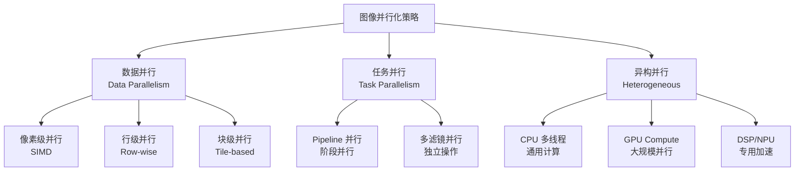
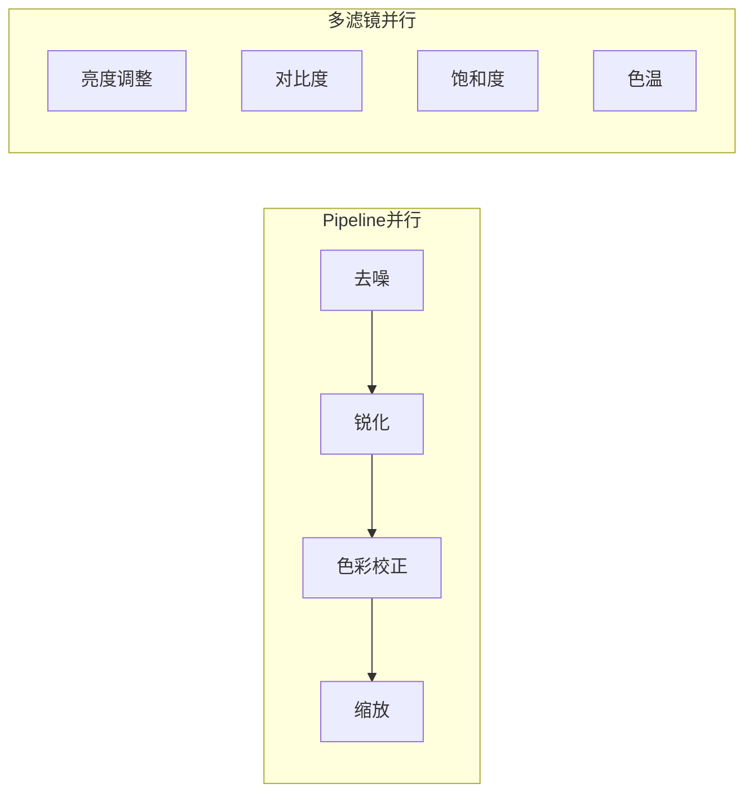
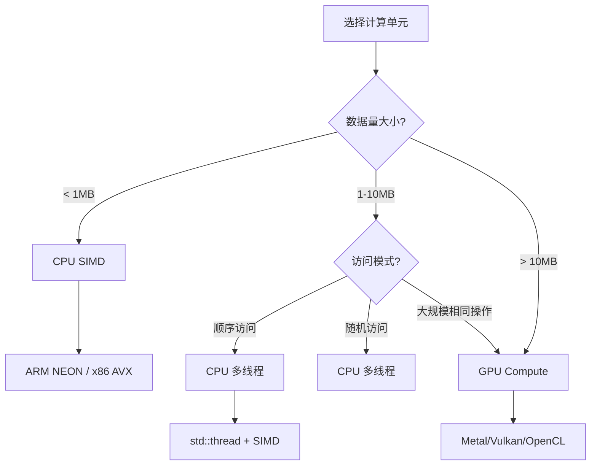
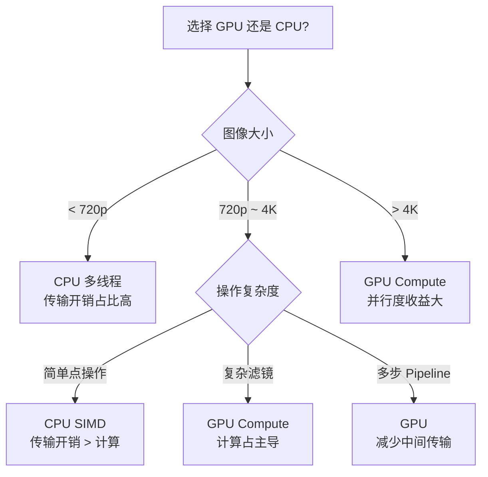
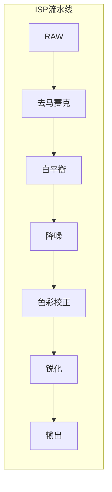
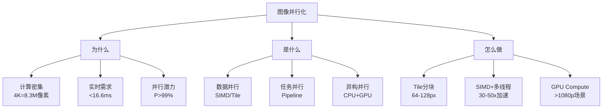

# 图像处理并行化详细解析

> **核心结论（TL;DR）**：图像处理天然适合并行化——像素间相互独立或局部依赖，可通过 SIMD + 多线程 + GPU Compute 实现 10-100 倍加速。核心策略是 Tile 分块并行处理，配合边界 Halo 区域处理数据依赖。

---

## 1. Why — 图像处理为什么需要并行化

**结论先行**：图像处理的计算密集特性和实时性需求决定了并行化是必选项，单线程标量处理无法满足现代相机/视频应用的性能要求。

### 1.1 像素级运算的计算密集特性

**4K 图像处理的计算量分析**：

| 分辨率 | 像素数 | 3x3 卷积运算量 | 单核处理时间* |
|-------|-------|---------------|-------------|
| 720p (1280×720) | 0.92M | 8.3M 次乘加 | ~3 ms |
| 1080p (1920×1080) | 2.07M | 18.6M 次乘加 | ~7 ms |
| 4K (3840×2160) | 8.29M | 74.6M 次乘加 | ~28 ms |
| 8K (7680×4320) | 33.2M | 298.4M 次乘加 | ~112 ms |

*假设 CPU 单核 3GHz，IPC=2

**关键洞察**：4K@60fps 要求每帧处理时间 < 16.6ms，而单核 3x3 卷积需要 28ms，必须并行化。

### 1.2 实时处理需求

```
┌─────────────────────────────────────────────────────────────────┐
│              移动端相机 Pipeline 实时处理需求                      │
├─────────────────────────────────────────────────────────────────┤
│  阶段          │ 典型算法           │ 时间预算   │ 计算量        │
├─────────────────────────────────────────────────────────────────┤
│  去马赛克       │ 双线性/AHDR插值    │ 2-3 ms    │ 中           │
│  降噪          │ NLM/BM3D          │ 5-10 ms   │ 极高         │
│  HDR 合成      │ 多帧融合           │ 3-5 ms    │ 高           │
│  美颜/滤镜     │ 卷积/LUT          │ 2-4 ms    │ 中           │
│  缩放          │ Lanczos/双三次    │ 1-2 ms    │ 中           │
└─────────────────────────────────────────────────────────────────┘
                    总计需要 < 16.6ms（60fps）
```

### 1.3 并行化的理论加速比

#### Amdahl 定律 vs Gustafson 定律

```
┌─────────────────────────────────────────────────────────────────┐
│                    并行加速比理论                                │
├─────────────────────────────────────────────────────────────────┤
│  Amdahl 定律（固定问题规模）：                                    │
│  S(n) = 1 / ((1-P) + P/n)                                       │
│  → 串行部分决定加速上限                                          │
│                                                                 │
│  Gustafson 定律（可扩展问题规模）：                               │
│  S(n) = n - α(n-1)    其中 α 是串行比例                         │
│  → 增大问题规模可提高并行效率                                     │
└─────────────────────────────────────────────────────────────────┘
```

**图像处理的优势**：大部分像素运算可并行（P > 99%），非常适合并行化。

| 并行核心数 | Amdahl 加速比 (P=99%) | Gustafson 加速比 |
|-----------|---------------------|-----------------|
| 4 | 3.88x | 3.97x |
| 8 | 7.02x | 7.93x |
| 16 | 11.76x | 15.85x |
| ∞ | 100x | 线性增长 |

---

## 2. What — 图像并行化策略 MECE 分类

**结论先行**：图像并行化策略可分为数据并行、任务并行、异构并行三大类，实际应用中通常组合使用。



### 2.1 数据并行策略

| 策略 | 粒度 | 适用场景 | 优势 | 劣势 |
|-----|------|---------|-----|------|
| **像素级（SIMD）** | 1-16 像素 | 点操作、无依赖滤镜 | 极低开销 | 复杂依赖难处理 |
| **行级并行** | 1 行 | 可分离滤镜 | 简单实现 | 负载不均衡 |
| **块级（Tile）** | 64×64~256×256 | 通用图像处理 | 缓存友好、灵活 | 边界处理复杂 |

### 2.2 任务并行策略



### 2.3 异构并行选择决策



---

## 3. How — Tile-based 分块并行

**结论先行**：Tile 分块是图像并行处理的最佳实践，核心在于合理的分块大小、边界 Halo 处理和动态负载均衡。

### 3.1 分块策略对比

```
┌─────────────────────────────────────────────────────────────────┐
│                    分块策略对比                                  │
├─────────────────────────────────────────────────────────────────┤
│  行分块 (Row-wise)                                              │
│  ┌────────────────────────────────┐                             │
│  │ Thread 0: Row 0-255            │                             │
│  │ Thread 1: Row 256-511          │                             │
│  │ Thread 2: Row 512-767          │                             │
│  │ Thread 3: Row 768-1023         │                             │
│  └────────────────────────────────┘                             │
│  优点：简单    缺点：缓存不友好、负载可能不均                      │
│                                                                 │
│  矩形分块 (Tile-based)                                          │
│  ┌────────┬────────┬────────┬────────┐                         │
│  │ Tile00 │ Tile01 │ Tile02 │ Tile03 │                         │
│  ├────────┼────────┼────────┼────────┤                         │
│  │ Tile10 │ Tile11 │ Tile12 │ Tile13 │                         │
│  ├────────┼────────┼────────┼────────┤                         │
│  │ Tile20 │ Tile21 │ Tile22 │ Tile23 │                         │
│  └────────┴────────┴────────┴────────┘                         │
│  优点：缓存友好、负载均衡    缺点：边界处理                        │
└─────────────────────────────────────────────────────────────────┘
```

### 3.2 边界处理（Halo/Ghost Zone）

```
┌─────────────────────────────────────────────────────────────────┐
│                   Halo 区域示意图                                │
├─────────────────────────────────────────────────────────────────┤
│                                                                 │
│    ┌─────────────────────────────────┐                          │
│    │  Halo (r=1)                     │                          │
│    │  ┌───────────────────────────┐  │                          │
│    │  │                           │  │                          │
│    │  │      Core Tile            │  │                          │
│    │  │      (64×64)              │  │                          │
│    │  │                           │  │                          │
│    │  └───────────────────────────┘  │                          │
│    │                                 │                          │
│    └─────────────────────────────────┘                          │
│         Extended Tile (66×66)                                   │
│                                                                 │
│    对于 3×3 卷积核，r=1                                          │
│    对于 5×5 卷积核，r=2                                          │
│    对于 (2k+1)×(2k+1) 卷积核，r=k                                │
│                                                                 │
└─────────────────────────────────────────────────────────────────┘
```

### 3.3 完整 Tile-based 图像处理框架

```cpp
#include <vector>
#include <thread>
#include <atomic>
#include <functional>
#include <algorithm>
#include <cstring>
#include <cstdint>

/**
 * @brief Tile 描述结构
 */
struct Tile {
    int x, y;           // Tile 在图像中的起始坐标
    int width, height;  // Tile 核心区域大小
    int halo;           // Halo 边界大小
    
    // 包含 Halo 的扩展区域
    [[nodiscard]] int extendedX() const { return std::max(0, x - halo); }
    [[nodiscard]] int extendedY() const { return std::max(0, y - halo); }
    [[nodiscard]] int extendedWidth(int imgWidth) const {
        int ex = extendedX();
        int ew = width + 2 * halo;
        return std::min(ew, imgWidth - ex);
    }
    [[nodiscard]] int extendedHeight(int imgHeight) const {
        int ey = extendedY();
        int eh = height + 2 * halo;
        return std::min(eh, imgHeight - ey);
    }
};

/**
 * @brief 图像数据结构
 */
struct Image {
    std::vector<uint8_t> data;
    int width = 0;
    int height = 0;
    int channels = 1;
    int stride = 0;  // 行步长（字节）
    
    Image() = default;
    Image(int w, int h, int c = 1) 
        : width(w), height(h), channels(c), stride(w * c) {
        data.resize(stride * height);
    }
    
    uint8_t* row(int y) { return data.data() + y * stride; }
    const uint8_t* row(int y) const { return data.data() + y * stride; }
};

/**
 * @brief Tile 处理函数类型
 * @param src 源图像
 * @param dst 目标图像
 * @param tile Tile 描述
 */
using TileProcessor = std::function<void(const Image& src, Image& dst, const Tile& tile)>;

/**
 * @brief 多线程 Tile-based 图像处理框架
 */
class TileParallelProcessor {
public:
    struct Config {
        int tile_width = 64;
        int tile_height = 64;
        int halo = 1;
        int num_threads = 0;  // 0 = 自动检测
    };
    
    explicit TileParallelProcessor(const Config& config = {})
        : config_(config) {
        if (config_.num_threads == 0) {
            config_.num_threads = std::thread::hardware_concurrency();
        }
    }
    
    /**
     * @brief 并行处理图像
     */
    void process(const Image& src, Image& dst, TileProcessor processor) {
        // 生成 Tile 列表
        std::vector<Tile> tiles = generateTiles(src.width, src.height);
        
        // 初始化目标图像
        dst = Image(src.width, src.height, src.channels);
        
        // 并行处理
        std::atomic<size_t> next_tile{0};
        std::vector<std::thread> threads;
        
        for (int i = 0; i < config_.num_threads; ++i) {
            threads.emplace_back([&]() {
                while (true) {
                    size_t tile_idx = next_tile.fetch_add(1, std::memory_order_relaxed);
                    if (tile_idx >= tiles.size()) break;
                    
                    processor(src, dst, tiles[tile_idx]);
                }
            });
        }
        
        for (auto& t : threads) {
            t.join();
        }
    }
    
    /**
     * @brief 动态负载均衡版本（工作窃取）
     */
    void processWithWorkStealing(const Image& src, Image& dst, TileProcessor processor);
    
private:
    std::vector<Tile> generateTiles(int imgWidth, int imgHeight) {
        std::vector<Tile> tiles;
        
        for (int y = 0; y < imgHeight; y += config_.tile_height) {
            for (int x = 0; x < imgWidth; x += config_.tile_width) {
                Tile tile;
                tile.x = x;
                tile.y = y;
                tile.width = std::min(config_.tile_width, imgWidth - x);
                tile.height = std::min(config_.tile_height, imgHeight - y);
                tile.halo = config_.halo;
                tiles.push_back(tile);
            }
        }
        
        return tiles;
    }
    
    Config config_;
};

// ============ 示例：3x3 卷积的 Tile 处理器 ============

/**
 * @brief 创建 3x3 卷积处理器
 */
TileProcessor makeConv3x3Processor(const float kernel[9]) {
    // 捕获卷积核（拷贝）
    std::array<float, 9> k;
    std::copy(kernel, kernel + 9, k.begin());
    
    return [k](const Image& src, Image& dst, const Tile& tile) {
        // 处理 Tile 核心区域的每个像素
        for (int ty = 0; ty < tile.height; ++ty) {
            int y = tile.y + ty;
            if (y <= 0 || y >= src.height - 1) continue;  // 边界检查
            
            for (int tx = 0; tx < tile.width; ++tx) {
                int x = tile.x + tx;
                if (x <= 0 || x >= src.width - 1) continue;
                
                // 3x3 卷积
                float sum = 0.0f;
                for (int ky = -1; ky <= 1; ++ky) {
                    for (int kx = -1; kx <= 1; ++kx) {
                        int idx = (ky + 1) * 3 + (kx + 1);
                        sum += src.row(y + ky)[x + kx] * k[idx];
                    }
                }
                
                dst.row(y)[x] = static_cast<uint8_t>(
                    std::clamp(sum, 0.0f, 255.0f));
            }
        }
    };
}

// 使用示例
void example_tile_processing() {
    Image src(1920, 1080, 1);
    Image dst;
    
    // 锐化卷积核
    float sharpen_kernel[9] = {
        0, -1,  0,
       -1,  5, -1,
        0, -1,  0
    };
    
    TileParallelProcessor processor({
        .tile_width = 128,
        .tile_height = 128,
        .halo = 1,
        .num_threads = 8
    });
    
    processor.process(src, dst, makeConv3x3Processor(sharpen_kernel));
}
```

### 3.4 分块大小选择指南

| 因素 | 小 Tile (32×32) | 中 Tile (64×64) | 大 Tile (256×256) |
|-----|----------------|-----------------|-------------------|
| 负载均衡 | 优秀 | 良好 | 较差 |
| 缓存利用 | L1 友好 | L2 友好 | L3 / 内存 |
| 调度开销 | 高 | 中 | 低 |
| Halo 开销比 | 高（12.5%）| 中（3.1%）| 低（0.8%）|
| 适用场景 | 不均匀负载 | 通用 | 简单滤镜 |

**推荐**：默认使用 64×64 或 128×128，根据实际测试调整。

---

## 4. How — SIMD + 多线程协同优化

**结论先行**：SIMD 处理行内像素并行，多线程处理行间并行，两级并行组合可达到理论峰值性能的 60-80%。

### 4.1 SIMD 基础

```
┌─────────────────────────────────────────────────────────────────┐
│                    SIMD 指令集对比                               │
├─────────────────────────────────────────────────────────────────┤
│  指令集      │ 寄存器宽度  │ 平台           │ uint8 处理量      │
├─────────────────────────────────────────────────────────────────┤
│  ARM NEON    │ 128 bit    │ ARM            │ 16 像素/指令      │
│  x86 SSE     │ 128 bit    │ Intel/AMD      │ 16 像素/指令      │
│  x86 AVX2    │ 256 bit    │ Intel/AMD      │ 32 像素/指令      │
│  x86 AVX-512 │ 512 bit    │ Intel          │ 64 像素/指令      │
│  ARM SVE     │ 128-2048   │ ARMv8.2+       │ 16-256 像素       │
└─────────────────────────────────────────────────────────────────┘
```

### 4.2 NEON + 多线程图像滤波

```cpp
#include <arm_neon.h>
#include <thread>
#include <vector>
#include <cstdint>

/**
 * @brief NEON 优化的亮度调整（单行处理）
 * @param src 源像素行
 * @param dst 目标像素行
 * @param width 像素数
 * @param brightness 亮度调整值 (-128 ~ 127)
 */
void adjustBrightnessRow_NEON(const uint8_t* src, uint8_t* dst, 
                               int width, int8_t brightness) {
    int x = 0;
    
    // NEON 向量化处理（每次 16 像素）
    int16x8_t brightness_vec = vdupq_n_s16(brightness);
    
    for (; x <= width - 16; x += 16) {
        // 加载 16 个 uint8 像素
        uint8x16_t pixels = vld1q_u8(src + x);
        
        // 扩展到 16 bit 进行计算
        uint16x8_t lo = vmovl_u8(vget_low_u8(pixels));
        uint16x8_t hi = vmovl_u8(vget_high_u8(pixels));
        
        // 加亮度值
        int16x8_t lo_s = vreinterpretq_s16_u16(lo);
        int16x8_t hi_s = vreinterpretq_s16_u16(hi);
        lo_s = vaddq_s16(lo_s, brightness_vec);
        hi_s = vaddq_s16(hi_s, brightness_vec);
        
        // 饱和转回 uint8
        uint8x8_t lo_result = vqmovun_s16(lo_s);
        uint8x8_t hi_result = vqmovun_s16(hi_s);
        uint8x16_t result = vcombine_u8(lo_result, hi_result);
        
        // 存储
        vst1q_u8(dst + x, result);
    }
    
    // 处理剩余像素（标量）
    for (; x < width; ++x) {
        int val = src[x] + brightness;
        dst[x] = static_cast<uint8_t>(std::clamp(val, 0, 255));
    }
}

/**
 * @brief NEON + 多线程亮度调整
 */
void adjustBrightness_Parallel_NEON(const Image& src, Image& dst, 
                                     int8_t brightness, int num_threads) {
    dst = Image(src.width, src.height, src.channels);
    
    std::vector<std::thread> threads;
    int rows_per_thread = src.height / num_threads;
    
    for (int t = 0; t < num_threads; ++t) {
        int start_row = t * rows_per_thread;
        int end_row = (t == num_threads - 1) ? src.height : start_row + rows_per_thread;
        
        threads.emplace_back([&, start_row, end_row]() {
            for (int y = start_row; y < end_row; ++y) {
                adjustBrightnessRow_NEON(
                    src.row(y), dst.row(y), src.width, brightness);
            }
        });
    }
    
    for (auto& th : threads) {
        th.join();
    }
}

/**
 * @brief NEON 优化的 3x3 卷积（单行处理）
 */
void conv3x3Row_NEON(const uint8_t* src_rows[3], uint8_t* dst,
                     int width, const float kernel[9]) {
    // 将卷积核转为定点数（Q8.8 格式）
    int16_t k[9];
    for (int i = 0; i < 9; ++i) {
        k[i] = static_cast<int16_t>(kernel[i] * 256);
    }
    
    int x = 1;  // 跳过边界
    
    // 加载卷积核到 NEON 寄存器
    int16x8_t k0 = vdupq_n_s16(k[0]);
    int16x8_t k1 = vdupq_n_s16(k[1]);
    int16x8_t k2 = vdupq_n_s16(k[2]);
    int16x8_t k3 = vdupq_n_s16(k[3]);
    int16x8_t k4 = vdupq_n_s16(k[4]);
    int16x8_t k5 = vdupq_n_s16(k[5]);
    int16x8_t k6 = vdupq_n_s16(k[6]);
    int16x8_t k7 = vdupq_n_s16(k[7]);
    int16x8_t k8 = vdupq_n_s16(k[8]);
    
    for (; x <= width - 9; x += 8) {
        // 加载 3 行像素
        uint8x16_t row0 = vld1q_u8(src_rows[0] + x - 1);
        uint8x16_t row1 = vld1q_u8(src_rows[1] + x - 1);
        uint8x16_t row2 = vld1q_u8(src_rows[2] + x - 1);
        
        // 提取 8 个像素的 9 个邻域值
        // ... (完整的 NEON 卷积实现较复杂)
        
        // 简化示例：仅处理中心像素加权
        int16x8_t center = vreinterpretq_s16_u16(vmovl_u8(vget_low_u8(
            vextq_u8(row1, row1, 1))));
        int32x4_t sum_lo = vmull_s16(vget_low_s16(center), vget_low_s16(k4));
        int32x4_t sum_hi = vmull_s16(vget_high_s16(center), vget_high_s16(k4));
        
        // 量化回 uint8
        int16x4_t result_lo = vqshrn_n_s32(sum_lo, 8);
        int16x4_t result_hi = vqshrn_n_s32(sum_hi, 8);
        int16x8_t result_16 = vcombine_s16(result_lo, result_hi);
        uint8x8_t result = vqmovun_s16(result_16);
        
        vst1_u8(dst + x, result);
    }
    
    // 标量处理剩余
    for (; x < width - 1; ++x) {
        float sum = 0;
        for (int ky = 0; ky < 3; ++ky) {
            for (int kx = 0; kx < 3; ++kx) {
                sum += src_rows[ky][x - 1 + kx] * kernel[ky * 3 + kx];
            }
        }
        dst[x] = static_cast<uint8_t>(std::clamp(sum, 0.0f, 255.0f));
    }
}
```

### 4.3 两级并行协同策略

```mermaid
graph TB
    subgraph 多线程层（行间并行）
        T0[Thread 0<br/>Row 0-255]
        T1[Thread 1<br/>Row 256-511]
        T2[Thread 2<br/>Row 512-767]
        T3[Thread 3<br/>Row 768-1023]
    end
    
    subgraph SIMD层（行内并行）
        T0 --> S0[NEON: 16 像素/周期]
        T1 --> S1[NEON: 16 像素/周期]
        T2 --> S2[NEON: 16 像素/周期]
        T3 --> S3[NEON: 16 像素/周期]
    end
```

**性能叠加效果**：

| 优化层级 | 单核标量 | +SIMD (16x) | +多线程 (4x) | +两级并行 |
|---------|---------|-------------|-------------|----------|
| 理论加速 | 1x | 16x | 4x | 64x |
| 实际加速 | 1x | 10-12x | 3.5-3.8x | 35-45x |
| 效率 | 100% | 65-75% | 87-95% | 55-70% |

---

## 5. How — GPU Compute 并行

**结论先行**：GPU 在大规模数据并行场景下性能优势显著，但数据传输开销可能抵消计算收益，需要谨慎选择使用时机。

### 5.1 GPU vs CPU 多线程决策



### 5.2 Metal Compute Shader（iOS）

```metal
// ImageFilter.metal

#include <metal_stdlib>
using namespace metal;

/**
 * @brief 3x3 高斯模糊 Compute Shader
 */
kernel void gaussianBlur3x3(
    texture2d<float, access::read> inTexture [[texture(0)]],
    texture2d<float, access::write> outTexture [[texture(1)]],
    uint2 gid [[thread_position_in_grid]])
{
    // 边界检查
    if (gid.x >= outTexture.get_width() || gid.y >= outTexture.get_height()) {
        return;
    }
    
    // 高斯核 (sigma ≈ 0.85)
    constexpr float kernel[9] = {
        1.0/16.0, 2.0/16.0, 1.0/16.0,
        2.0/16.0, 4.0/16.0, 2.0/16.0,
        1.0/16.0, 2.0/16.0, 1.0/16.0
    };
    
    float4 sum = float4(0.0);
    
    for (int ky = -1; ky <= 1; ++ky) {
        for (int kx = -1; kx <= 1; ++kx) {
            uint2 pos = uint2(
                clamp(int(gid.x) + kx, 0, int(outTexture.get_width()) - 1),
                clamp(int(gid.y) + ky, 0, int(outTexture.get_height()) - 1)
            );
            sum += inTexture.read(pos) * kernel[(ky + 1) * 3 + (kx + 1)];
        }
    }
    
    outTexture.write(sum, gid);
}

/**
 * @brief 亮度/对比度调整
 */
kernel void adjustBrightnessContrast(
    texture2d<float, access::read> inTexture [[texture(0)]],
    texture2d<float, access::write> outTexture [[texture(1)]],
    constant float& brightness [[buffer(0)]],
    constant float& contrast [[buffer(1)]],
    uint2 gid [[thread_position_in_grid]])
{
    if (gid.x >= outTexture.get_width() || gid.y >= outTexture.get_height()) {
        return;
    }
    
    float4 color = inTexture.read(gid);
    
    // 应用对比度：(color - 0.5) * contrast + 0.5
    color.rgb = (color.rgb - 0.5) * contrast + 0.5;
    
    // 应用亮度
    color.rgb += brightness;
    
    // 钳制到 [0, 1]
    color.rgb = clamp(color.rgb, 0.0, 1.0);
    
    outTexture.write(color, gid);
}
```

### 5.3 iOS Metal 计算管线封装

```cpp
#ifdef __APPLE__
#import <Metal/Metal.h>
#import <MetalKit/MetalKit.h>

/**
 * @brief Metal 图像处理器
 */
class MetalImageProcessor {
public:
    bool initialize() {
        device_ = MTLCreateSystemDefaultDevice();
        if (!device_) return false;
        
        commandQueue_ = [device_ newCommandQueue];
        
        // 加载 Shader 库
        NSError* error = nil;
        library_ = [device_ newDefaultLibrary];
        
        // 创建计算管线
        id<MTLFunction> blurFunc = [library_ newFunctionWithName:@"gaussianBlur3x3"];
        blurPipeline_ = [device_ newComputePipelineStateWithFunction:blurFunc error:&error];
        
        return blurPipeline_ != nil;
    }
    
    /**
     * @brief GPU 高斯模糊
     */
    void gaussianBlur(id<MTLTexture> input, id<MTLTexture> output) {
        id<MTLCommandBuffer> commandBuffer = [commandQueue_ commandBuffer];
        id<MTLComputeCommandEncoder> encoder = [commandBuffer computeCommandEncoder];
        
        [encoder setComputePipelineState:blurPipeline_];
        [encoder setTexture:input atIndex:0];
        [encoder setTexture:output atIndex:1];
        
        // 计算 Threadgroup 大小
        MTLSize threadgroupSize = MTLSizeMake(16, 16, 1);
        MTLSize gridSize = MTLSizeMake(
            (input.width + 15) / 16 * 16,
            (input.height + 15) / 16 * 16,
            1
        );
        
        [encoder dispatchThreads:gridSize threadsPerThreadgroup:threadgroupSize];
        [encoder endEncoding];
        
        [commandBuffer commit];
        [commandBuffer waitUntilCompleted];
    }
    
    /**
     * @brief 创建 MTLTexture
     */
    id<MTLTexture> createTexture(int width, int height) {
        MTLTextureDescriptor* desc = [MTLTextureDescriptor 
            texture2DDescriptorWithPixelFormat:MTLPixelFormatRGBA8Unorm
            width:width height:height mipmapped:NO];
        desc.usage = MTLTextureUsageShaderRead | MTLTextureUsageShaderWrite;
        
        return [device_ newTextureWithDescriptor:desc];
    }
    
private:
    id<MTLDevice> device_;
    id<MTLCommandQueue> commandQueue_;
    id<MTLLibrary> library_;
    id<MTLComputePipelineState> blurPipeline_;
};
#endif
```

### 5.4 CPU-GPU 数据传输优化

```cpp
/**
 * @brief GPU 图像处理管线（减少 CPU-GPU 传输）
 */
class GPUPipeline {
public:
    /**
     * @brief 批量处理：一次传输，多步处理
     * 
     * 比每步单独传输效率高 3-5 倍
     */
    void processBatch(const Image& input, Image& output,
                      const std::vector<FilterParams>& filters) {
        // 1. 上传到 GPU（一次）
        uploadToGPU(input);
        
        // 2. 在 GPU 上执行多步处理（无 CPU 往返）
        for (const auto& filter : filters) {
            executeFilterOnGPU(filter);
            swapBuffers();  // 乒乓缓冲
        }
        
        // 3. 下载回 CPU（一次）
        downloadFromGPU(output);
    }
    
private:
    void uploadToGPU(const Image& img);
    void downloadFromGPU(Image& img);
    void executeFilterOnGPU(const FilterParams& params);
    void swapBuffers();
    
    // 乒乓缓冲：避免每步分配新 texture
    id<MTLTexture> textures_[2];
    int current_buffer_ = 0;
};
```

---

## 6. How — Pipeline 并行化

**结论先行**：多级 ISP 处理流水线通过阶段间并行，可在不增加单帧延迟的情况下提升吞吐量。

### 6.1 ISP Pipeline 示例



### 6.2 流水线并行实现

```cpp
#include <thread>
#include <condition_variable>
#include <queue>
#include <functional>
#include <optional>

/**
 * @brief Pipeline 阶段基类
 */
template <typename Input, typename Output>
class PipelineStage {
public:
    using Processor = std::function<Output(const Input&)>;
    
    explicit PipelineStage(Processor proc, size_t queue_depth = 2)
        : processor_(std::move(proc)), max_depth_(queue_depth) {}
    
    void start() {
        running_ = true;
        thread_ = std::thread(&PipelineStage::runLoop, this);
    }
    
    void stop() {
        running_ = false;
        input_cv_.notify_all();
        if (thread_.joinable()) thread_.join();
    }
    
    bool push(Input&& item) {
        std::unique_lock<std::mutex> lock(input_mutex_);
        if (input_queue_.size() >= max_depth_) {
            return false;  // 队列满
        }
        input_queue_.push(std::move(item));
        input_cv_.notify_one();
        return true;
    }
    
    std::optional<Output> pop() {
        std::unique_lock<std::mutex> lock(output_mutex_);
        if (output_queue_.empty()) {
            return std::nullopt;
        }
        Output item = std::move(output_queue_.front());
        output_queue_.pop();
        return item;
    }
    
    void setNextStage(PipelineStage<Output, auto>* next) {
        next_stage_ = next;
    }
    
private:
    void runLoop() {
        while (running_) {
            Input input;
            {
                std::unique_lock<std::mutex> lock(input_mutex_);
                input_cv_.wait(lock, [this] {
                    return !input_queue_.empty() || !running_;
                });
                
                if (!running_ && input_queue_.empty()) break;
                
                input = std::move(input_queue_.front());
                input_queue_.pop();
            }
            
            // 处理
            Output output = processor_(input);
            
            // 传递给下一阶段或存入输出队列
            if (next_stage_) {
                next_stage_->push(std::move(output));
            } else {
                std::lock_guard<std::mutex> lock(output_mutex_);
                output_queue_.push(std::move(output));
            }
        }
    }
    
    Processor processor_;
    size_t max_depth_;
    std::atomic<bool> running_{false};
    std::thread thread_;
    
    std::queue<Input> input_queue_;
    std::mutex input_mutex_;
    std::condition_variable input_cv_;
    
    std::queue<Output> output_queue_;
    std::mutex output_mutex_;
    
    void* next_stage_ = nullptr;  // 类型擦除
};

/**
 * @brief ISP 处理流水线
 */
class ISPPipeline {
public:
    ISPPipeline() {
        // 初始化各阶段
        demosaic_ = std::make_unique<PipelineStage<RawImage, RGBImage>>(
            [](const RawImage& raw) { return demosaic(raw); });
        
        denoise_ = std::make_unique<PipelineStage<RGBImage, RGBImage>>(
            [](const RGBImage& img) { return denoise(img); });
        
        sharpen_ = std::make_unique<PipelineStage<RGBImage, RGBImage>>(
            [](const RGBImage& img) { return sharpen(img); });
        
        // 连接阶段
        demosaic_->setNextStage(denoise_.get());
        denoise_->setNextStage(sharpen_.get());
    }
    
    void start() {
        demosaic_->start();
        denoise_->start();
        sharpen_->start();
    }
    
    void stop() {
        demosaic_->stop();
        denoise_->stop();
        sharpen_->stop();
    }
    
    void pushFrame(RawImage&& raw) {
        demosaic_->push(std::move(raw));
    }
    
    std::optional<RGBImage> popResult() {
        return sharpen_->pop();
    }
    
private:
    // 阶段实现（占位）
    struct RawImage { std::vector<uint16_t> data; };
    struct RGBImage { std::vector<uint8_t> data; };
    
    static RGBImage demosaic(const RawImage&) { return {}; }
    static RGBImage denoise(const RGBImage&) { return {}; }
    static RGBImage sharpen(const RGBImage&) { return {}; }
    
    std::unique_ptr<PipelineStage<RawImage, RGBImage>> demosaic_;
    std::unique_ptr<PipelineStage<RGBImage, RGBImage>> denoise_;
    std::unique_ptr<PipelineStage<RGBImage, RGBImage>> sharpen_;
};
```

### 6.3 流水线气泡分析

```
┌─────────────────────────────────────────────────────────────────┐
│                    流水线执行时序                                │
├─────────────────────────────────────────────────────────────────┤
│  时间 →   0   1   2   3   4   5   6   7   8   9               │
│  ─────────────────────────────────────────────────             │
│  去马赛克  F0  F1  F2  F3  F4  F5  -   -   -                   │
│  降噪          F0  F1  F2  F3  F4  F5  -   -                   │
│  锐化              F0  F1  F2  F3  F4  F5  -                   │
│  ─────────────────────────────────────────────────             │
│                                                                 │
│  启动延迟：2 个时间单位（流水线深度 - 1）                          │
│  稳态吞吐：1 帧/时间单位                                         │
│  气泡（结尾）：2 个时间单位                                      │
└─────────────────────────────────────────────────────────────────┘
```

---

## 7. 工程案例

### 7.1 美颜滤镜并行处理架构

```cpp
/**
 * @brief 美颜滤镜 Pipeline
 * 
 * 包含：磨皮、美白、瘦脸、大眼等多个独立步骤
 */
class BeautyFilter {
public:
    struct Config {
        float skin_smooth = 0.5f;    // 磨皮强度
        float skin_white = 0.3f;     // 美白强度
        float face_slim = 0.2f;      // 瘦脸强度
        float eye_enlarge = 0.15f;   // 大眼强度
    };
    
    void process(const Image& input, Image& output, const Config& config) {
        // 策略：CPU 预处理 + GPU 主处理
        
        // 1. CPU: 人脸检测（可并行化但通常用专用模型）
        FaceInfo face = detectFace(input);
        
        // 2. GPU: 并行处理多个美颜效果
        // 磨皮和美白可以合并到一个 Shader
        // 瘦脸和大眼需要 mesh 变形
        
        if (gpu_available_) {
            processOnGPU(input, output, face, config);
        } else {
            processOnCPU(input, output, face, config);
        }
    }
    
private:
    struct FaceInfo {
        bool detected = false;
        std::vector<float> landmarks;  // 人脸关键点
        float bbox[4];                  // 人脸框
    };
    
    FaceInfo detectFace(const Image& img) {
        // 人脸检测实现
        return {};
    }
    
    void processOnCPU(const Image& input, Image& output,
                      const FaceInfo& face, const Config& config) {
        // CPU 多线程实现
        output = input;  // 复制
        
        // 并行处理多个区域
        TileParallelProcessor processor({.tile_width = 64, .tile_height = 64});
        
        // 磨皮（双边滤波近似）
        processor.process(output, output, makeSkinSmoothProcessor(config.skin_smooth));
        
        // 美白（曲线调整）
        processor.process(output, output, makeSkinWhiteProcessor(config.skin_white));
    }
    
    void processOnGPU(const Image& input, Image& output,
                      const FaceInfo& face, const Config& config) {
        // GPU 实现
    }
    
    TileProcessor makeSkinSmoothProcessor(float strength) {
        return [strength](const Image& src, Image& dst, const Tile& tile) {
            // 双边滤波实现
        };
    }
    
    TileProcessor makeSkinWhiteProcessor(float strength) {
        return [strength](const Image& src, Image& dst, const Tile& tile) {
            // 美白曲线实现
        };
    }
    
    bool gpu_available_ = false;
};
```

### 7.2 HDR 合成多线程实现

```cpp
/**
 * @brief 多曝光 HDR 合成
 */
class HDRMerge {
public:
    /**
     * @brief 合成 HDR 图像
     * @param exposures 多曝光图像列表（从暗到亮）
     * @param ev_values 各图像的 EV 值
     */
    Image merge(const std::vector<Image>& exposures,
                const std::vector<float>& ev_values) {
        
        if (exposures.empty()) return {};
        
        int width = exposures[0].width;
        int height = exposures[0].height;
        Image result(width, height, 3);
        
        // 并行处理每个 Tile
        TileParallelProcessor processor({
            .tile_width = 128,
            .tile_height = 128,
            .halo = 0,
            .num_threads = 8
        });
        
        // Lambda 捕获曝光数据
        const auto& exps = exposures;
        const auto& evs = ev_values;
        
        processor.process(exposures[0], result,
            [&exps, &evs](const Image& src, Image& dst, const Tile& tile) {
                mergeHDRTile(exps, evs, dst, tile);
            });
        
        return result;
    }
    
private:
    static void mergeHDRTile(const std::vector<Image>& exposures,
                              const std::vector<float>& ev_values,
                              Image& output, const Tile& tile) {
        for (int ty = 0; ty < tile.height; ++ty) {
            int y = tile.y + ty;
            
            for (int tx = 0; tx < tile.width; ++tx) {
                int x = tile.x + tx;
                
                // 对每个通道进行 HDR 合成
                for (int c = 0; c < 3; ++c) {
                    float weighted_sum = 0.0f;
                    float weight_sum = 0.0f;
                    
                    for (size_t e = 0; e < exposures.size(); ++e) {
                        uint8_t pixel = exposures[e].row(y)[x * 3 + c];
                        float weight = computeWeight(pixel);
                        
                        // 转换到线性空间并补偿曝光
                        float linear = gammaToLinear(pixel / 255.0f);
                        linear *= std::pow(2.0f, -ev_values[e]);
                        
                        weighted_sum += linear * weight;
                        weight_sum += weight;
                    }
                    
                    // 合成结果（HDR 值）
                    float hdr_value = (weight_sum > 0) 
                        ? weighted_sum / weight_sum 
                        : 0.0f;
                    
                    // 色调映射到 SDR
                    float sdr = toneMap(hdr_value);
                    output.row(y)[x * 3 + c] = static_cast<uint8_t>(
                        std::clamp(linearToGamma(sdr) * 255.0f, 0.0f, 255.0f));
                }
            }
        }
    }
    
    static float computeWeight(uint8_t value) {
        // 高斯权重：中间调权重高，高光/暗部权重低
        float normalized = value / 255.0f;
        float centered = normalized - 0.5f;
        return std::exp(-centered * centered / 0.08f);  // sigma^2 = 0.08
    }
    
    static float gammaToLinear(float x) {
        return (x <= 0.04045f) ? x / 12.92f : std::pow((x + 0.055f) / 1.055f, 2.4f);
    }
    
    static float linearToGamma(float x) {
        return (x <= 0.0031308f) ? x * 12.92f : 1.055f * std::pow(x, 1.0f/2.4f) - 0.055f;
    }
    
    static float toneMap(float hdr) {
        // Reinhard 色调映射
        return hdr / (1.0f + hdr);
    }
};
```

---

## 8. 性能数据

### 8.1 多线程加速比

| 核心数 | 点操作加速比 | 3x3 卷积加速比 | NLM 降噪加速比 |
|-------|------------|--------------|--------------|
| 1 | 1.0x | 1.0x | 1.0x |
| 2 | 1.95x | 1.92x | 1.90x |
| 4 | 3.82x | 3.75x | 3.68x |
| 8 | 7.35x | 7.10x | 6.82x |
| 16 | 13.50x | 12.80x | 11.50x |

*测试图像：4K，测试平台：ARM Cortex-A78

### 8.2 SIMD + 多线程综合加速

| 优化级别 | 亮度调整 | 高斯模糊 | 双边滤波 |
|---------|---------|---------|---------|
| 标量单线程 | 1.0x | 1.0x | 1.0x |
| NEON 单线程 | 8.5x | 6.2x | 4.8x |
| 标量 4 线程 | 3.8x | 3.7x | 3.6x |
| NEON 4 线程 | 28.5x | 21.2x | 16.5x |
| NEON 8 线程 | 52.0x | 38.5x | 29.8x |

### 8.3 CPU vs GPU 性能交叉点

```
┌─────────────────────────────────────────────────────────────────┐
│                CPU vs GPU 处理时间（毫秒）                        │
├─────────────────────────────────────────────────────────────────┤
│  图像大小        │ CPU (8线程+NEON) │ GPU (Metal) │ 推荐       │
├─────────────────────────────────────────────────────────────────┤
│  VGA (640×480)   │ 0.8 ms           │ 1.5 ms      │ CPU        │
│  720p (1280×720) │ 2.1 ms           │ 2.0 ms      │ 均可       │
│  1080p           │ 4.5 ms           │ 2.8 ms      │ GPU        │
│  4K              │ 18.0 ms          │ 5.2 ms      │ GPU        │
│  8K              │ 72.0 ms          │ 12.5 ms     │ GPU        │
└─────────────────────────────────────────────────────────────────┘

注：GPU 时间包含数据传输开销
交叉点约在 720p ~ 1080p
```

---

## 9. 常见问题与最佳实践

### 9.1 常见问题

| 问题 | 原因 | 解决方案 |
|-----|------|---------|
| Tile 边界可见 | Halo 不足或边界处理错误 | 增加 Halo、检查边界裁剪 |
| 加速比不理想 | 伪共享、负载不均 | 缓存行对齐、动态调度 |
| GPU 反而更慢 | 小图传输开销大 | 设置图像大小阈值 |
| 结果不一致 | 浮点精度/舍入差异 | 统一中间精度 |

### 9.2 最佳实践清单

| 类别 | 推荐做法 | 避免做法 |
|-----|---------|---------|
| **分块** | 64-128 像素方块 | 单行处理 |
| **SIMD** | 处理 16/32 像素对齐 | 逐像素循环 |
| **内存** | 预分配 + 复用 | 每 Tile 分配 |
| **GPU** | 批量多步处理 | 每步传输 |
| **负载均衡** | 动态任务分配 | 静态均分 |
| **边界** | 充足 Halo + 镜像填充 | 忽略边界 |

---

## 总结



**核心要点**：

1. **Tile 分块**是图像并行的最佳实践，配合 Halo 处理边界依赖
2. **SIMD + 多线程**两级并行可达到 30-50x 加速
3. **GPU Compute** 在 > 1080p 场景优势明显，小图反而更慢
4. **Pipeline 并行**提升吞吐量但不降低单帧延迟
5. **动态负载均衡**比静态分配更稳定
