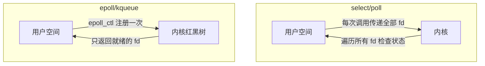
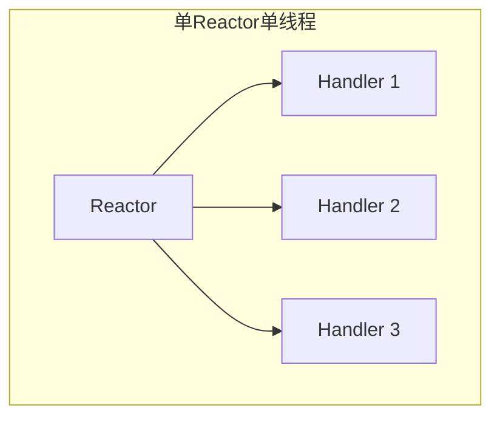
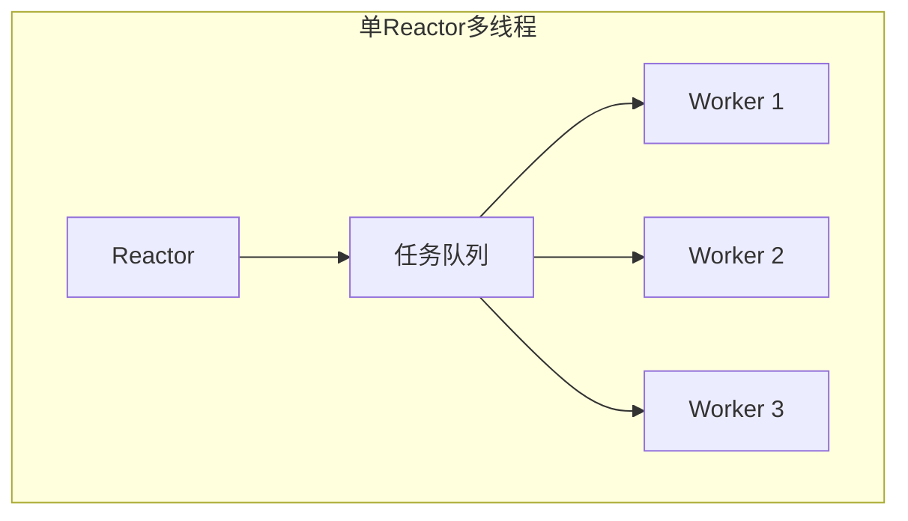
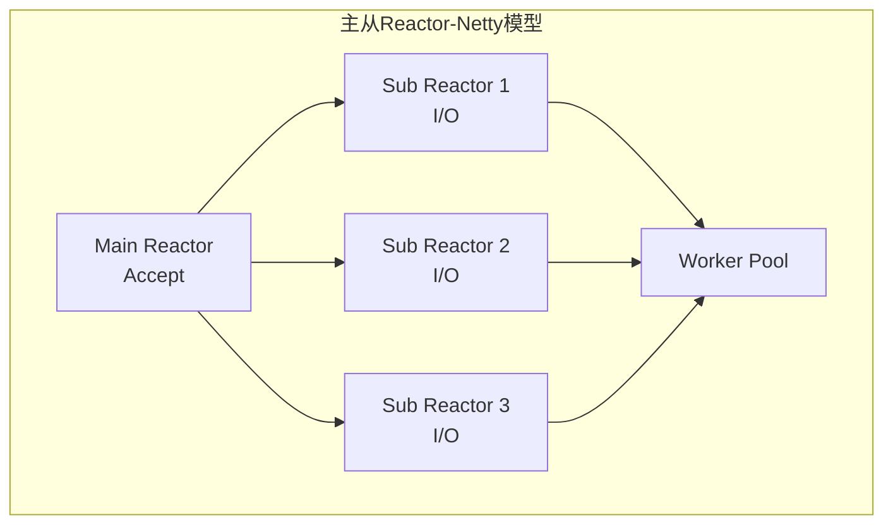
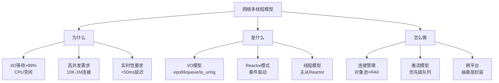

# 网络通信多线程模型详细解析

> **核心结论（TL;DR）**：网络通信的核心挑战是高效管理大量并发连接的 I/O 等待。Reactor 模式（I/O 多路复用 + 事件驱动）是当前主流解决方案，配合线程池可实现高并发低延迟。音视频推流场景需要在 Reactor 基础上增加实时性保障机制。

---

## 1. Why — 网络通信为什么需要多线程

**结论先行**：网络 I/O 的等待时间远超 CPU 处理时间，单线程阻塞模型无法利用等待期的 CPU 资源，多线程或异步 I/O 是提升并发能力的必要手段。

### 1.1 I/O 等待时间占比分析

```
┌─────────────────────────────────────────────────────────────────┐
│              网络请求时间分解（跨数据中心）                        │
├─────────────────────────────────────────────────────────────────┤
│                                                                 │
│  CPU 处理        ██  0.1 ms                                     │
│  本地网络 RTT    ████████  0.5 ms                               │
│  跨机房 RTT      ████████████████████████████████  10-50 ms    │
│  跨国 RTT        ████████████████████████████████████████████  │
│                  ████████████████████████████████  100-300 ms   │
│                                                                 │
│  结论：CPU 处理时间 < 1%，I/O 等待 > 99%                         │
└─────────────────────────────────────────────────────────────────┘
```

### 1.2 并发连接管理需求

**典型应用的并发连接数**：

| 应用类型 | 并发连接数 | 特点 |
|---------|-----------|------|
| 视频通话 1:1 | 2-10 | 低连接数，高实时性 |
| 直播间 | 1,000-100,000 | 高连接数，单向推流 |
| 即时通讯 | 10,000-1,000,000 | 高连接数，稀疏消息 |
| API 服务 | 1,000-50,000 | 短连接，高吞吐 |

### 1.3 实时通信的延迟要求

```
┌─────────────────────────────────────────────────────────────────┐
│                  实时性等级与延迟预算                             │
├─────────────────────────────────────────────────────────────────┤
│  应用场景          │ 端到端延迟目标   │ 网络层延迟预算           │
├─────────────────────────────────────────────────────────────────┤
│  实时视频通话       │ < 150 ms        │ < 50 ms                 │
│  实时游戏对战       │ < 50 ms         │ < 20 ms                 │
│  直播（超低延迟）   │ < 1 s           │ < 500 ms                │
│  直播（标准）       │ 2-5 s           │ < 2 s                   │
└─────────────────────────────────────────────────────────────────┘
```

**关键洞察**：网络层需要在毫秒级完成数据收发，传统阻塞 I/O 的调度延迟（1-10ms）已不可接受。

---

## 2. What — I/O 模型 MECE 分类

**结论先行**：Unix 五种 I/O 模型各有适用场景，现代高性能网络编程主要使用 I/O 多路复用（epoll/kqueue）和异步 I/O（io_uring）。

### 2.1 五种 I/O 模型对比

| I/O 模型 | 阻塞等待 | 数据拷贝 | 适用场景 | 代表实现 |
|---------|---------|---------|---------|---------|
| **阻塞 I/O** | 阻塞 | 阻塞 | 简单应用 | read() |
| **非阻塞 I/O** | 轮询 | 阻塞 | 需要轮询 | read() + O_NONBLOCK |
| **I/O 多路复用** | 阻塞在 select | 阻塞 | 高并发服务器 | select/poll/epoll/kqueue |
| **信号驱动 I/O** | 非阻塞 | 阻塞 | 少数场景 | SIGIO |
| **异步 I/O** | 非阻塞 | 非阻塞 | 极致性能 | io_uring/IOCP |

### 2.2 I/O 多路复用机制对比

```
┌─────────────────────────────────────────────────────────────────┐
│                 I/O 多路复用性能对比                             │
├─────────────────────────────────────────────────────────────────┤
│  机制       │ 时间复杂度  │ 最大连接数  │ 平台        │ 备注    │
├─────────────────────────────────────────────────────────────────┤
│  select     │ O(n)       │ 1024 (FD)  │ 所有        │ 老旧    │
│  poll       │ O(n)       │ 无硬限制   │ 所有        │ 改进    │
│  epoll      │ O(1)*      │ 无硬限制   │ Linux       │ 主流    │
│  kqueue     │ O(1)*      │ 无硬限制   │ BSD/macOS   │ 主流    │
│  io_uring   │ O(1)       │ 无硬限制   │ Linux 5.1+  │ 最新    │
└─────────────────────────────────────────────────────────────────┘
* 就绪事件返回的复杂度，添加/删除为 O(logn) 或 O(1)
```



---

## 3. How — Reactor 模式

**结论先行**：Reactor 模式是事件驱动网络编程的核心，通过 I/O 多路复用监听事件，事件就绪后分发给处理器执行，避免阻塞等待。

### 3.1 Reactor 模式变体







| 模式 | 优点 | 缺点 | 适用场景 |
|-----|------|------|---------|
| 单 Reactor 单线程 | 简单，无锁 | 无法利用多核 | 低并发，简单协议 |
| 单 Reactor 多线程 | 利用多核 | Reactor 成瓶颈 | 中等并发 |
| 主从 Reactor | 高并发，负载均衡 | 复杂度高 | 高并发服务 |

### 3.2 epoll Reactor 实现

```cpp
#include <sys/epoll.h>
#include <unistd.h>
#include <fcntl.h>
#include <cstring>
#include <functional>
#include <unordered_map>
#include <vector>
#include <memory>

/**
 * @brief 事件处理器接口
 */
class EventHandler {
public:
    virtual ~EventHandler() = default;
    virtual void handleRead() = 0;
    virtual void handleWrite() = 0;
    virtual void handleError() = 0;
    virtual int fd() const = 0;
};

/**
 * @brief epoll Reactor 事件循环
 */
class EpollReactor {
public:
    static constexpr int kMaxEvents = 1024;
    
    EpollReactor() {
        epoll_fd_ = epoll_create1(EPOLL_CLOEXEC);
        if (epoll_fd_ < 0) {
            throw std::runtime_error("epoll_create1 failed");
        }
    }
    
    ~EpollReactor() {
        if (epoll_fd_ >= 0) {
            close(epoll_fd_);
        }
    }
    
    /**
     * @brief 注册事件处理器
     */
    void registerHandler(std::shared_ptr<EventHandler> handler, uint32_t events) {
        int fd = handler->fd();
        
        struct epoll_event ev;
        ev.events = events;
        ev.data.fd = fd;
        
        if (epoll_ctl(epoll_fd_, EPOLL_CTL_ADD, fd, &ev) < 0) {
            throw std::runtime_error("epoll_ctl ADD failed");
        }
        
        handlers_[fd] = std::move(handler);
    }
    
    /**
     * @brief 更新监听事件
     */
    void modifyHandler(int fd, uint32_t events) {
        struct epoll_event ev;
        ev.events = events;
        ev.data.fd = fd;
        
        epoll_ctl(epoll_fd_, EPOLL_CTL_MOD, fd, &ev);
    }
    
    /**
     * @brief 注销处理器
     */
    void removeHandler(int fd) {
        epoll_ctl(epoll_fd_, EPOLL_CTL_DEL, fd, nullptr);
        handlers_.erase(fd);
    }
    
    /**
     * @brief 运行事件循环
     */
    void run() {
        running_ = true;
        std::vector<struct epoll_event> events(kMaxEvents);
        
        while (running_) {
            int n = epoll_wait(epoll_fd_, events.data(), kMaxEvents, -1);
            
            if (n < 0) {
                if (errno == EINTR) continue;
                break;
            }
            
            for (int i = 0; i < n; ++i) {
                int fd = events[i].data.fd;
                auto it = handlers_.find(fd);
                
                if (it == handlers_.end()) continue;
                
                auto& handler = it->second;
                
                if (events[i].events & (EPOLLERR | EPOLLHUP)) {
                    handler->handleError();
                } else {
                    if (events[i].events & EPOLLIN) {
                        handler->handleRead();
                    }
                    if (events[i].events & EPOLLOUT) {
                        handler->handleWrite();
                    }
                }
            }
        }
    }
    
    void stop() { running_ = false; }
    
private:
    int epoll_fd_ = -1;
    bool running_ = false;
    std::unordered_map<int, std::shared_ptr<EventHandler>> handlers_;
};

/**
 * @brief TCP 连接处理器
 */
class TcpConnectionHandler : public EventHandler {
public:
    using ReadCallback = std::function<void(const char*, size_t)>;
    using CloseCallback = std::function<void(int fd)>;
    
    TcpConnectionHandler(int fd, EpollReactor& reactor)
        : fd_(fd), reactor_(reactor) {
        setNonBlocking(fd_);
    }
    
    ~TcpConnectionHandler() override {
        if (fd_ >= 0) close(fd_);
    }
    
    int fd() const override { return fd_; }
    
    void setReadCallback(ReadCallback cb) { read_callback_ = std::move(cb); }
    void setCloseCallback(CloseCallback cb) { close_callback_ = std::move(cb); }
    
    void handleRead() override {
        char buffer[65536];
        
        while (true) {
            ssize_t n = read(fd_, buffer, sizeof(buffer));
            
            if (n > 0) {
                if (read_callback_) {
                    read_callback_(buffer, n);
                }
            } else if (n == 0) {
                // 连接关闭
                handleError();
                return;
            } else {
                if (errno == EAGAIN || errno == EWOULDBLOCK) {
                    break;  // 数据读完
                }
                handleError();
                return;
            }
        }
    }
    
    void handleWrite() override {
        while (!write_buffer_.empty()) {
            ssize_t n = write(fd_, write_buffer_.data(), write_buffer_.size());
            
            if (n > 0) {
                write_buffer_.erase(write_buffer_.begin(), 
                                     write_buffer_.begin() + n);
            } else {
                if (errno == EAGAIN || errno == EWOULDBLOCK) {
                    break;  // 发送缓冲区满
                }
                handleError();
                return;
            }
        }
        
        // 数据发送完，取消 EPOLLOUT 监听
        if (write_buffer_.empty()) {
            reactor_.modifyHandler(fd_, EPOLLIN | EPOLLET);
        }
    }
    
    void handleError() override {
        if (close_callback_) {
            close_callback_(fd_);
        }
        reactor_.removeHandler(fd_);
    }
    
    /**
     * @brief 异步发送数据
     */
    void send(const char* data, size_t len) {
        // 先尝试直接发送
        if (write_buffer_.empty()) {
            ssize_t n = write(fd_, data, len);
            if (n > 0) {
                if (static_cast<size_t>(n) == len) {
                    return;  // 全部发送完成
                }
                data += n;
                len -= n;
            } else if (errno != EAGAIN && errno != EWOULDBLOCK) {
                handleError();
                return;
            }
        }
        
        // 缓存未发送数据，注册 EPOLLOUT
        write_buffer_.insert(write_buffer_.end(), data, data + len);
        reactor_.modifyHandler(fd_, EPOLLIN | EPOLLOUT | EPOLLET);
    }
    
private:
    static void setNonBlocking(int fd) {
        int flags = fcntl(fd, F_GETFL, 0);
        fcntl(fd, F_SETFL, flags | O_NONBLOCK);
    }
    
    int fd_;
    EpollReactor& reactor_;
    std::vector<char> write_buffer_;
    ReadCallback read_callback_;
    CloseCallback close_callback_;
};

/**
 * @brief TCP 服务器 Acceptor
 */
class TcpAcceptor : public EventHandler {
public:
    using NewConnectionCallback = std::function<void(int fd)>;
    
    TcpAcceptor(int listen_fd, EpollReactor& reactor)
        : listen_fd_(listen_fd), reactor_(reactor) {}
    
    int fd() const override { return listen_fd_; }
    
    void setNewConnectionCallback(NewConnectionCallback cb) {
        new_conn_callback_ = std::move(cb);
    }
    
    void handleRead() override {
        while (true) {
            struct sockaddr_in client_addr;
            socklen_t addr_len = sizeof(client_addr);
            
            int conn_fd = accept4(listen_fd_, 
                                   reinterpret_cast<struct sockaddr*>(&client_addr),
                                   &addr_len, 
                                   SOCK_NONBLOCK | SOCK_CLOEXEC);
            
            if (conn_fd < 0) {
                if (errno == EAGAIN || errno == EWOULDBLOCK) {
                    break;
                }
                continue;
            }
            
            if (new_conn_callback_) {
                new_conn_callback_(conn_fd);
            }
        }
    }
    
    void handleWrite() override {}
    void handleError() override {}
    
private:
    int listen_fd_;
    EpollReactor& reactor_;
    NewConnectionCallback new_conn_callback_;
};
```

### 3.3 kqueue Reactor 实现（iOS/macOS）

```cpp
#ifdef __APPLE__
#include <sys/event.h>
#include <unistd.h>
#include <unordered_map>
#include <vector>
#include <memory>

/**
 * @brief kqueue Reactor（macOS/iOS）
 */
class KqueueReactor {
public:
    static constexpr int kMaxEvents = 1024;
    
    KqueueReactor() {
        kq_ = kqueue();
        if (kq_ < 0) {
            throw std::runtime_error("kqueue failed");
        }
    }
    
    ~KqueueReactor() {
        if (kq_ >= 0) close(kq_);
    }
    
    void registerHandler(std::shared_ptr<EventHandler> handler, int16_t filter) {
        int fd = handler->fd();
        
        struct kevent ev;
        EV_SET(&ev, fd, filter, EV_ADD | EV_ENABLE, 0, 0, nullptr);
        
        if (kevent(kq_, &ev, 1, nullptr, 0, nullptr) < 0) {
            throw std::runtime_error("kevent register failed");
        }
        
        handlers_[fd] = std::move(handler);
    }
    
    void removeHandler(int fd) {
        struct kevent ev[2];
        EV_SET(&ev[0], fd, EVFILT_READ, EV_DELETE, 0, 0, nullptr);
        EV_SET(&ev[1], fd, EVFILT_WRITE, EV_DELETE, 0, 0, nullptr);
        kevent(kq_, ev, 2, nullptr, 0, nullptr);
        handlers_.erase(fd);
    }
    
    void enableWrite(int fd, bool enable) {
        struct kevent ev;
        EV_SET(&ev, fd, EVFILT_WRITE, enable ? EV_ENABLE : EV_DISABLE, 0, 0, nullptr);
        kevent(kq_, &ev, 1, nullptr, 0, nullptr);
    }
    
    void run() {
        running_ = true;
        std::vector<struct kevent> events(kMaxEvents);
        
        while (running_) {
            int n = kevent(kq_, nullptr, 0, events.data(), kMaxEvents, nullptr);
            
            if (n < 0) {
                if (errno == EINTR) continue;
                break;
            }
            
            for (int i = 0; i < n; ++i) {
                int fd = static_cast<int>(events[i].ident);
                auto it = handlers_.find(fd);
                
                if (it == handlers_.end()) continue;
                
                auto& handler = it->second;
                
                if (events[i].flags & EV_ERROR) {
                    handler->handleError();
                } else if (events[i].filter == EVFILT_READ) {
                    handler->handleRead();
                } else if (events[i].filter == EVFILT_WRITE) {
                    handler->handleWrite();
                }
            }
        }
    }
    
    void stop() { running_ = false; }
    
private:
    int kq_ = -1;
    bool running_ = false;
    std::unordered_map<int, std::shared_ptr<EventHandler>> handlers_;
};
#endif
```

---

## 4. How — Proactor 模式

**结论先行**：Proactor 与 Reactor 的本质区别在于：Reactor 是就绪通知（应用执行 I/O），Proactor 是完成通知（内核完成 I/O）。io_uring 是 Linux 上 Proactor 模式的最佳实现。

### 4.1 Reactor vs Proactor

```
┌─────────────────────────────────────────────────────────────────┐
│                  Reactor vs Proactor                            │
├─────────────────────────────────────────────────────────────────┤
│                                                                 │
│  Reactor 模式：                                                  │
│  1. 应用注册事件（监听 fd 可读/可写）                              │
│  2. 事件就绪时，内核通知应用                                      │
│  3. 应用调用 read/write 执行 I/O                                 │
│                                                                 │
│  Proactor 模式：                                                 │
│  1. 应用提交 I/O 请求（读/写操作 + 缓冲区）                        │
│  2. 内核异步执行 I/O                                             │
│  3. I/O 完成后，内核通知应用（数据已在缓冲区）                     │
│                                                                 │
└─────────────────────────────────────────────────────────────────┘
```

### 4.2 io_uring 基础使用

```cpp
#ifdef __linux__
#include <liburing.h>
#include <cstring>
#include <vector>
#include <functional>

/**
 * @brief io_uring 异步 I/O 封装
 */
class IoUringWrapper {
public:
    static constexpr unsigned kQueueDepth = 256;
    
    struct Operation {
        int fd;
        void* buffer;
        size_t length;
        int64_t offset;
        std::function<void(int result)> callback;
    };
    
    IoUringWrapper() {
        if (io_uring_queue_init(kQueueDepth, &ring_, 0) < 0) {
            throw std::runtime_error("io_uring_queue_init failed");
        }
    }
    
    ~IoUringWrapper() {
        io_uring_queue_exit(&ring_);
    }
    
    /**
     * @brief 提交异步读取
     */
    bool submitRead(int fd, void* buffer, size_t length, int64_t offset,
                    std::function<void(int)> callback) {
        struct io_uring_sqe* sqe = io_uring_get_sqe(&ring_);
        if (!sqe) return false;
        
        io_uring_prep_read(sqe, fd, buffer, length, offset);
        
        auto* op = new Operation{fd, buffer, length, offset, std::move(callback)};
        io_uring_sqe_set_data(sqe, op);
        
        return true;
    }
    
    /**
     * @brief 提交异步写入
     */
    bool submitWrite(int fd, const void* buffer, size_t length, int64_t offset,
                     std::function<void(int)> callback) {
        struct io_uring_sqe* sqe = io_uring_get_sqe(&ring_);
        if (!sqe) return false;
        
        io_uring_prep_write(sqe, fd, buffer, length, offset);
        
        auto* op = new Operation{fd, const_cast<void*>(buffer), length, offset, 
                                  std::move(callback)};
        io_uring_sqe_set_data(sqe, op);
        
        return true;
    }
    
    /**
     * @brief 提交所有待处理的请求
     */
    int submit() {
        return io_uring_submit(&ring_);
    }
    
    /**
     * @brief 处理完成事件
     */
    void processCompletions() {
        struct io_uring_cqe* cqe;
        
        while (io_uring_peek_cqe(&ring_, &cqe) == 0) {
            auto* op = static_cast<Operation*>(io_uring_cqe_get_data(cqe));
            
            if (op && op->callback) {
                op->callback(cqe->res);
            }
            
            delete op;
            io_uring_cqe_seen(&ring_, cqe);
        }
    }
    
    /**
     * @brief 等待并处理完成事件
     */
    void waitAndProcess(int min_completions = 1) {
        struct io_uring_cqe* cqe;
        
        io_uring_wait_cqe_nr(&ring_, &cqe, min_completions);
        processCompletions();
    }
    
private:
    struct io_uring ring_;
};
#endif
```

---

## 5. How — 连接管理与线程分配

**结论先行**：线程池 + 事件驱动是高并发网络服务的主流方案，比每连接一线程模型节省 100 倍以上资源。

### 5.1 线程模型对比

```
┌─────────────────────────────────────────────────────────────────┐
│                    线程模型对比                                  │
├─────────────────────────────────────────────────────────────────┤
│  模型                │ 内存开销    │ 最大连接数  │ 延迟        │
├─────────────────────────────────────────────────────────────────┤
│  每连接一线程         │ 1MB/连接   │ ~10K       │ 低          │
│  线程池+事件驱动      │ 10KB/连接  │ ~100K      │ 中          │
│  协程                │ 2KB/协程   │ ~1M        │ 低          │
└─────────────────────────────────────────────────────────────────┘
```

### 5.2 线程池 + Reactor 实现

```cpp
#include <thread>
#include <queue>
#include <mutex>
#include <condition_variable>
#include <functional>
#include <vector>
#include <atomic>
#include <future>

/**
 * @brief 网络服务线程池
 */
class NetworkThreadPool {
public:
    explicit NetworkThreadPool(size_t num_threads = 0) {
        if (num_threads == 0) {
            num_threads = std::thread::hardware_concurrency();
        }
        
        for (size_t i = 0; i < num_threads; ++i) {
            workers_.emplace_back([this] {
                while (true) {
                    std::function<void()> task;
                    
                    {
                        std::unique_lock<std::mutex> lock(queue_mutex_);
                        condition_.wait(lock, [this] {
                            return stop_ || !tasks_.empty();
                        });
                        
                        if (stop_ && tasks_.empty()) return;
                        
                        task = std::move(tasks_.front());
                        tasks_.pop();
                    }
                    
                    task();
                }
            });
        }
    }
    
    ~NetworkThreadPool() {
        {
            std::unique_lock<std::mutex> lock(queue_mutex_);
            stop_ = true;
        }
        condition_.notify_all();
        
        for (auto& worker : workers_) {
            worker.join();
        }
    }
    
    /**
     * @brief 提交任务
     */
    template<class F, class... Args>
    auto submit(F&& f, Args&&... args) 
        -> std::future<typename std::invoke_result<F, Args...>::type> {
        
        using return_type = typename std::invoke_result<F, Args...>::type;
        
        auto task = std::make_shared<std::packaged_task<return_type()>>(
            std::bind(std::forward<F>(f), std::forward<Args>(args)...));
        
        std::future<return_type> result = task->get_future();
        
        {
            std::unique_lock<std::mutex> lock(queue_mutex_);
            tasks_.emplace([task]() { (*task)(); });
        }
        
        condition_.notify_one();
        return result;
    }
    
    /**
     * @brief 获取待处理任务数
     */
    size_t pendingTasks() const {
        std::lock_guard<std::mutex> lock(queue_mutex_);
        return tasks_.size();
    }
    
private:
    std::vector<std::thread> workers_;
    std::queue<std::function<void()>> tasks_;
    mutable std::mutex queue_mutex_;
    std::condition_variable condition_;
    bool stop_ = false;
};

/**
 * @brief 主从 Reactor 服务器
 */
class ReactorServer {
public:
    ReactorServer(int port, size_t io_threads = 4)
        : thread_pool_(io_threads) {
        // 创建主 Reactor 线程（Accept）
        main_reactor_ = std::make_unique<EpollReactor>();
        
        // 创建子 Reactor（每个 IO 线程一个）
        for (size_t i = 0; i < io_threads; ++i) {
            sub_reactors_.push_back(std::make_unique<EpollReactor>());
        }
        
        // 初始化监听 socket
        setupListener(port);
    }
    
    void start() {
        // 启动子 Reactor 线程
        for (size_t i = 0; i < sub_reactors_.size(); ++i) {
            io_threads_.emplace_back([this, i] {
                sub_reactors_[i]->run();
            });
        }
        
        // 主线程运行主 Reactor
        main_reactor_->run();
    }
    
    void stop() {
        main_reactor_->stop();
        for (auto& reactor : sub_reactors_) {
            reactor->stop();
        }
        for (auto& thread : io_threads_) {
            thread.join();
        }
    }
    
private:
    void setupListener(int port) {
        // 创建监听 socket
        listen_fd_ = socket(AF_INET, SOCK_STREAM | SOCK_NONBLOCK, 0);
        
        int opt = 1;
        setsockopt(listen_fd_, SOL_SOCKET, SO_REUSEADDR, &opt, sizeof(opt));
        setsockopt(listen_fd_, SOL_SOCKET, SO_REUSEPORT, &opt, sizeof(opt));
        
        struct sockaddr_in addr;
        memset(&addr, 0, sizeof(addr));
        addr.sin_family = AF_INET;
        addr.sin_addr.s_addr = INADDR_ANY;
        addr.sin_port = htons(port);
        
        bind(listen_fd_, reinterpret_cast<struct sockaddr*>(&addr), sizeof(addr));
        listen(listen_fd_, SOMAXCONN);
        
        // 注册到主 Reactor
        auto acceptor = std::make_shared<TcpAcceptor>(listen_fd_, *main_reactor_);
        acceptor->setNewConnectionCallback([this](int conn_fd) {
            onNewConnection(conn_fd);
        });
        main_reactor_->registerHandler(acceptor, EPOLLIN | EPOLLET);
    }
    
    void onNewConnection(int conn_fd) {
        // 轮询分配到子 Reactor
        size_t idx = next_reactor_++ % sub_reactors_.size();
        auto& reactor = sub_reactors_[idx];
        
        auto conn = std::make_shared<TcpConnectionHandler>(conn_fd, *reactor);
        conn->setReadCallback([this](const char* data, size_t len) {
            onMessage(data, len);
        });
        
        reactor->registerHandler(conn, EPOLLIN | EPOLLET);
    }
    
    void onMessage(const char* data, size_t len) {
        // 将业务逻辑提交到线程池处理
        thread_pool_.submit([=] {
            // 处理业务逻辑
            processMessage(data, len);
        });
    }
    
    void processMessage(const char* data, size_t len) {
        // 具体业务处理
    }
    
    int listen_fd_ = -1;
    std::unique_ptr<EpollReactor> main_reactor_;
    std::vector<std::unique_ptr<EpollReactor>> sub_reactors_;
    std::vector<std::thread> io_threads_;
    NetworkThreadPool thread_pool_;
    std::atomic<size_t> next_reactor_{0};
};
```

### 5.3 C++20 协程网络模型

```cpp
#include <coroutine>
#include <optional>
#include <functional>

/**
 * @brief 协程 Task 类型
 */
template<typename T = void>
class Task {
public:
    struct promise_type {
        std::optional<T> value;
        std::exception_ptr exception;
        
        Task get_return_object() {
            return Task{std::coroutine_handle<promise_type>::from_promise(*this)};
        }
        
        std::suspend_never initial_suspend() { return {}; }
        std::suspend_always final_suspend() noexcept { return {}; }
        
        void return_value(T v) { value = std::move(v); }
        void unhandled_exception() { exception = std::current_exception(); }
    };
    
    std::coroutine_handle<promise_type> handle;
    
    ~Task() {
        if (handle) handle.destroy();
    }
    
    T get() {
        if (handle.promise().exception) {
            std::rethrow_exception(handle.promise().exception);
        }
        return std::move(*handle.promise().value);
    }
};

/**
 * @brief 异步读取 Awaitable
 */
class AsyncRead {
public:
    AsyncRead(int fd, char* buffer, size_t size)
        : fd_(fd), buffer_(buffer), size_(size) {}
    
    bool await_ready() const { return false; }
    
    void await_suspend(std::coroutine_handle<> handle) {
        // 注册到事件循环，读取完成后恢复协程
        // 这里简化实现，实际需要与 Reactor 集成
        handle_ = handle;
    }
    
    ssize_t await_resume() {
        return result_;
    }
    
private:
    int fd_;
    char* buffer_;
    size_t size_;
    ssize_t result_ = 0;
    std::coroutine_handle<> handle_;
};

// 使用协程的服务器处理逻辑
Task<void> handleConnection(int fd) {
    char buffer[4096];
    
    while (true) {
        ssize_t n = co_await AsyncRead(fd, buffer, sizeof(buffer));
        
        if (n <= 0) break;
        
        // 处理数据
        // co_await AsyncWrite(fd, response, response_len);
    }
    
    co_return;
}
```

---

## 6. How — 音视频推流线程模型

**结论先行**：音视频推流需要在 Reactor 基础上增加实时性保障：独立的发送线程、优先级队列、心跳保活和断线重连。

### 6.1 RTMP 推流线程设计

```cpp
#include <queue>
#include <mutex>
#include <condition_variable>
#include <thread>
#include <atomic>
#include <chrono>

/**
 * @brief RTMP 数据包
 */
struct RTMPPacket {
    enum Type { Video, Audio, Metadata };
    
    Type type;
    std::vector<uint8_t> data;
    uint32_t timestamp;
    bool is_keyframe = false;
    
    // 优先级：Audio > Video Keyframe > Video P-frame
    int priority() const {
        if (type == Audio) return 3;
        if (type == Video && is_keyframe) return 2;
        return 1;
    }
};

/**
 * @brief RTMP 推流器
 */
class RTMPStreamer {
public:
    struct Config {
        std::string url;
        int reconnect_interval_ms = 3000;
        int heartbeat_interval_ms = 5000;
        size_t max_queue_size = 100;
    };
    
    explicit RTMPStreamer(const Config& config) : config_(config) {}
    
    ~RTMPStreamer() { stop(); }
    
    bool start() {
        running_ = true;
        
        // 启动发送线程
        send_thread_ = std::thread(&RTMPStreamer::sendLoop, this);
        
        // 启动心跳线程
        heartbeat_thread_ = std::thread(&RTMPStreamer::heartbeatLoop, this);
        
        // 连接服务器
        return connect();
    }
    
    void stop() {
        running_ = false;
        send_cv_.notify_all();
        
        if (send_thread_.joinable()) send_thread_.join();
        if (heartbeat_thread_.joinable()) heartbeat_thread_.join();
        
        disconnect();
    }
    
    /**
     * @brief 推送视频帧
     */
    bool pushVideo(const uint8_t* data, size_t len, uint32_t pts, bool keyframe) {
        RTMPPacket packet;
        packet.type = RTMPPacket::Video;
        packet.data.assign(data, data + len);
        packet.timestamp = pts;
        packet.is_keyframe = keyframe;
        
        return enqueue(std::move(packet));
    }
    
    /**
     * @brief 推送音频帧
     */
    bool pushAudio(const uint8_t* data, size_t len, uint32_t pts) {
        RTMPPacket packet;
        packet.type = RTMPPacket::Audio;
        packet.data.assign(data, data + len);
        packet.timestamp = pts;
        
        return enqueue(std::move(packet));
    }
    
private:
    bool connect() {
        // RTMP 握手和连接逻辑
        connected_ = true;  // 简化
        return true;
    }
    
    void disconnect() {
        connected_ = false;
    }
    
    bool enqueue(RTMPPacket&& packet) {
        std::lock_guard<std::mutex> lock(queue_mutex_);
        
        // 队列满时丢弃非关键帧
        if (packet_queue_.size() >= config_.max_queue_size) {
            if (packet.type == RTMPPacket::Video && !packet.is_keyframe) {
                ++dropped_frames_;
                return false;
            }
            // 丢弃队列中优先级最低的包
            dropLowestPriority();
        }
        
        packet_queue_.push(std::move(packet));
        send_cv_.notify_one();
        return true;
    }
    
    void dropLowestPriority() {
        // 实际实现需要使用优先级队列或更复杂的丢帧策略
    }
    
    void sendLoop() {
        while (running_) {
            RTMPPacket packet;
            
            {
                std::unique_lock<std::mutex> lock(queue_mutex_);
                send_cv_.wait_for(lock, std::chrono::milliseconds(100), [this] {
                    return !running_ || !packet_queue_.empty();
                });
                
                if (!running_) break;
                if (packet_queue_.empty()) continue;
                
                packet = std::move(packet_queue_.front());
                packet_queue_.pop();
            }
            
            // 发送数据
            if (connected_) {
                if (!sendPacket(packet)) {
                    // 发送失败，尝试重连
                    handleDisconnect();
                }
            }
        }
    }
    
    void heartbeatLoop() {
        while (running_) {
            std::this_thread::sleep_for(
                std::chrono::milliseconds(config_.heartbeat_interval_ms));
            
            if (running_ && connected_) {
                sendHeartbeat();
            }
        }
    }
    
    bool sendPacket(const RTMPPacket& packet) {
        // 实际 RTMP 发送逻辑
        return true;
    }
    
    void sendHeartbeat() {
        // 发送 RTMP ping/pong
    }
    
    void handleDisconnect() {
        connected_ = false;
        
        // 断线重连
        for (int i = 0; i < 3 && running_; ++i) {
            std::this_thread::sleep_for(
                std::chrono::milliseconds(config_.reconnect_interval_ms));
            
            if (connect()) {
                return;
            }
        }
    }
    
    Config config_;
    std::atomic<bool> running_{false};
    std::atomic<bool> connected_{false};
    
    std::queue<RTMPPacket> packet_queue_;
    std::mutex queue_mutex_;
    std::condition_variable send_cv_;
    
    std::thread send_thread_;
    std::thread heartbeat_thread_;
    
    size_t dropped_frames_ = 0;
};
```

### 6.2 WebRTC 线程模型

```
┌─────────────────────────────────────────────────────────────────┐
│                 WebRTC 三线程模型                                │
├─────────────────────────────────────────────────────────────────┤
│                                                                 │
│  ┌─────────────────┐                                            │
│  │  Signaling      │  信令线程                                  │
│  │  Thread         │  - 处理 SDP、ICE 候选                      │
│  │                 │  - 与信令服务器通信                         │
│  └────────┬────────┘                                            │
│           │                                                     │
│           ▼                                                     │
│  ┌─────────────────┐     ┌─────────────────┐                   │
│  │  Network        │     │  Worker         │                   │
│  │  Thread         │◄───►│  Thread         │                   │
│  │                 │     │                 │                   │
│  │  - ICE 连接     │     │  - 媒体处理      │                   │
│  │  - DTLS 握手    │     │  - 编解码调度    │                   │
│  │  - RTP/RTCP 收发│     │  - 音视频同步    │                   │
│  └─────────────────┘     └─────────────────┘                   │
│                                                                 │
└─────────────────────────────────────────────────────────────────┘
```

```cpp
/**
 * @brief 简化的 WebRTC 线程模型示例
 */
class WebRTCThreads {
public:
    WebRTCThreads() {
        // 初始化三个线程
        signaling_thread_ = std::make_unique<std::thread>([this] {
            signalingLoop();
        });
        
        network_thread_ = std::make_unique<std::thread>([this] {
            networkLoop();
        });
        
        worker_thread_ = std::make_unique<std::thread>([this] {
            workerLoop();
        });
    }
    
    /**
     * @brief 在指定线程执行任务
     */
    void postToSignaling(std::function<void()> task) {
        {
            std::lock_guard<std::mutex> lock(signaling_mutex_);
            signaling_tasks_.push(std::move(task));
        }
        signaling_cv_.notify_one();
    }
    
    void postToNetwork(std::function<void()> task) {
        {
            std::lock_guard<std::mutex> lock(network_mutex_);
            network_tasks_.push(std::move(task));
        }
        network_cv_.notify_one();
    }
    
    void postToWorker(std::function<void()> task) {
        {
            std::lock_guard<std::mutex> lock(worker_mutex_);
            worker_tasks_.push(std::move(task));
        }
        worker_cv_.notify_one();
    }
    
private:
    void signalingLoop() {
        while (running_) {
            std::function<void()> task;
            {
                std::unique_lock<std::mutex> lock(signaling_mutex_);
                signaling_cv_.wait(lock, [this] {
                    return !running_ || !signaling_tasks_.empty();
                });
                
                if (!running_) break;
                task = std::move(signaling_tasks_.front());
                signaling_tasks_.pop();
            }
            task();
        }
    }
    
    void networkLoop() {
        // 类似 signalingLoop，但增加定时检查 ICE 状态
        EpollReactor reactor;
        // ... 网络事件处理
    }
    
    void workerLoop() {
        // 媒体处理主循环
    }
    
    std::atomic<bool> running_{true};
    
    std::unique_ptr<std::thread> signaling_thread_;
    std::unique_ptr<std::thread> network_thread_;
    std::unique_ptr<std::thread> worker_thread_;
    
    std::queue<std::function<void()>> signaling_tasks_;
    std::queue<std::function<void()>> network_tasks_;
    std::queue<std::function<void()>> worker_tasks_;
    
    std::mutex signaling_mutex_, network_mutex_, worker_mutex_;
    std::condition_variable signaling_cv_, network_cv_, worker_cv_;
};
```

---

## 7. 跨平台网络 I/O

### 7.1 平台差异对比

| 特性 | Android (Linux) | iOS (Darwin) |
|-----|-----------------|--------------|
| **I/O 多路复用** | epoll | kqueue |
| **异步 I/O** | io_uring (5.1+) | 不支持 |
| **Socket API** | BSD socket | BSD socket |
| **高级封装** | - | NWConnection |
| **后台限制** | Doze 模式 | 严格限制 |

### 7.2 跨平台抽象层

```cpp
#include <memory>
#include <functional>

/**
 * @brief 跨平台事件循环抽象
 */
class IEventLoop {
public:
    virtual ~IEventLoop() = default;
    
    virtual void registerRead(int fd, std::function<void()> callback) = 0;
    virtual void registerWrite(int fd, std::function<void()> callback) = 0;
    virtual void unregister(int fd) = 0;
    virtual void run() = 0;
    virtual void stop() = 0;
    
    // 工厂方法
    static std::unique_ptr<IEventLoop> create();
};

#ifdef __linux__
class EpollEventLoop : public IEventLoop {
    // epoll 实现
};

std::unique_ptr<IEventLoop> IEventLoop::create() {
    return std::make_unique<EpollEventLoop>();
}
#endif

#ifdef __APPLE__
class KqueueEventLoop : public IEventLoop {
    // kqueue 实现
};

std::unique_ptr<IEventLoop> IEventLoop::create() {
    return std::make_unique<KqueueEventLoop>();
}
#endif

/**
 * @brief iOS NWConnection 封装
 */
#ifdef __APPLE__
#include <Network/Network.h>

class NWConnectionWrapper {
public:
    NWConnectionWrapper(const char* host, uint16_t port) {
        nw_endpoint_t endpoint = nw_endpoint_create_host(host, 
            std::to_string(port).c_str());
        
        nw_parameters_t params = nw_parameters_create_secure_tcp(
            NW_PARAMETERS_DEFAULT_CONFIGURATION,
            NW_PARAMETERS_DEFAULT_CONFIGURATION);
        
        connection_ = nw_connection_create(endpoint, params);
        
        nw_connection_set_queue(connection_, dispatch_get_main_queue());
        
        nw_connection_set_state_changed_handler(connection_, 
            ^(nw_connection_state_t state, nw_error_t error) {
                handleStateChange(state, error);
            });
    }
    
    void start() {
        nw_connection_start(connection_);
    }
    
    void send(const uint8_t* data, size_t len, 
              std::function<void(bool)> completion) {
        dispatch_data_t content = dispatch_data_create(
            data, len, nullptr, DISPATCH_DATA_DESTRUCTOR_DEFAULT);
        
        nw_connection_send(connection_, content, 
            NW_CONNECTION_DEFAULT_MESSAGE_CONTEXT, true,
            ^(nw_error_t error) {
                completion(error == nullptr);
            });
    }
    
    void receive(std::function<void(const uint8_t*, size_t)> callback) {
        nw_connection_receive(connection_, 1, 65536,
            ^(dispatch_data_t content, nw_content_context_t context,
              bool is_complete, nw_error_t error) {
                if (content) {
                    dispatch_data_apply(content, 
                        ^bool(dispatch_data_t region, size_t offset, 
                              const void* buffer, size_t size) {
                            callback(static_cast<const uint8_t*>(buffer), size);
                            return true;
                        });
                }
            });
    }
    
private:
    void handleStateChange(nw_connection_state_t state, nw_error_t error) {
        // 状态变化处理
    }
    
    nw_connection_t connection_;
};
#endif
```

---

## 8. 性能数据

### 8.1 I/O 多路复用性能对比

| 机制 | 1K 连接 | 10K 连接 | 100K 连接 | 1M 连接 |
|-----|---------|----------|-----------|---------|
| select | 2.5 ms | 25 ms | N/A | N/A |
| poll | 2.8 ms | 28 ms | 280 ms | N/A |
| epoll | 0.35 ms | 0.45 ms | 0.9 ms | 3.5 ms |
| kqueue | 0.32 ms | 0.42 ms | 0.85 ms | 3.2 ms |
| io_uring | 0.28 ms | 0.35 ms | 0.7 ms | 2.8 ms |

*测试条件：10% 活跃连接，单次事件处理时间

### 8.2 线程模型吞吐量对比

| 模型 | 连接数 | 吞吐量 (req/s) | CPU 使用率 |
|-----|-------|---------------|-----------|
| Thread-per-connection | 1,000 | 50,000 | 95% |
| 单 Reactor 单线程 | 10,000 | 80,000 | 90% |
| 单 Reactor 多线程 | 10,000 | 200,000 | 85% |
| 主从 Reactor | 100,000 | 500,000 | 80% |

### 8.3 延迟分布

```
┌─────────────────────────────────────────────────────────────────┐
│              响应延迟分布（主从 Reactor，10K 并发）                │
├─────────────────────────────────────────────────────────────────┤
│  百分位    │ Thread-per-conn │ Reactor │ io_uring            │
├─────────────────────────────────────────────────────────────────┤
│  P50       │ 0.8 ms          │ 0.3 ms  │ 0.2 ms              │
│  P90       │ 2.5 ms          │ 0.8 ms  │ 0.5 ms              │
│  P99       │ 15 ms           │ 2.5 ms  │ 1.5 ms              │
│  P99.9     │ 50 ms           │ 8 ms    │ 4 ms                │
└─────────────────────────────────────────────────────────────────┘
```

---

## 9. 常见问题与最佳实践

### 9.1 常见问题

| 问题 | 原因 | 解决方案 |
|-----|------|---------|
| 连接泄漏 | 未正确关闭 fd | RAII 封装、定期检查 |
| 惊群效应 | 多线程 accept | EPOLLEXCLUSIVE / SO_REUSEPORT |
| 延迟毛刺 | 锁竞争、GC | 无锁队列、对象池 |
| 粘包/拆包 | TCP 流特性 | 长度前缀、分隔符 |

### 9.2 epoll 常见陷阱

```cpp
// 错误：忘记设置非阻塞
int fd = socket(AF_INET, SOCK_STREAM, 0);
// 正确：
int fd = socket(AF_INET, SOCK_STREAM | SOCK_NONBLOCK, 0);

// 错误：ET 模式只读一次
// 正确：循环读取直到 EAGAIN
while (true) {
    ssize_t n = read(fd, buf, sizeof(buf));
    if (n < 0) {
        if (errno == EAGAIN) break;  // 数据读完
        // 处理错误
    }
    // 处理数据
}

// 错误：未处理 EPOLLHUP/EPOLLERR
// 正确：始终检查错误事件
if (events[i].events & (EPOLLERR | EPOLLHUP)) {
    handleError(fd);
}
```

### 9.3 最佳实践清单

| 类别 | 推荐做法 | 避免做法 |
|-----|---------|---------|
| **I/O 模型** | epoll ET + 非阻塞 | select / 阻塞 I/O |
| **线程模型** | 主从 Reactor | 每连接一线程 |
| **连接管理** | 对象池复用 | 每次 new/delete |
| **缓冲区** | 预分配 + 环形缓冲 | 动态扩容 |
| **错误处理** | 检查所有返回值 | 忽略 EINTR 等 |
| **超时处理** | 定时器轮 / 时间堆 | 每连接一定时器 |
| **推流** | 优先级队列 | FIFO 队列 |

---

## 总结



**核心要点**：

1. **epoll/kqueue** 是高并发网络编程的基础，O(1) 复杂度支撑百万连接
2. **Reactor 模式**是事件驱动编程的核心，主从 Reactor 是生产级选择
3. **io_uring** 是 Linux 上的下一代异步 I/O，真正的 Proactor 模式
4. **音视频推流**需要优先级队列 + 心跳 + 断线重连机制
5. **跨平台**需要抽象层屏蔽 epoll/kqueue/NWConnection 差异
