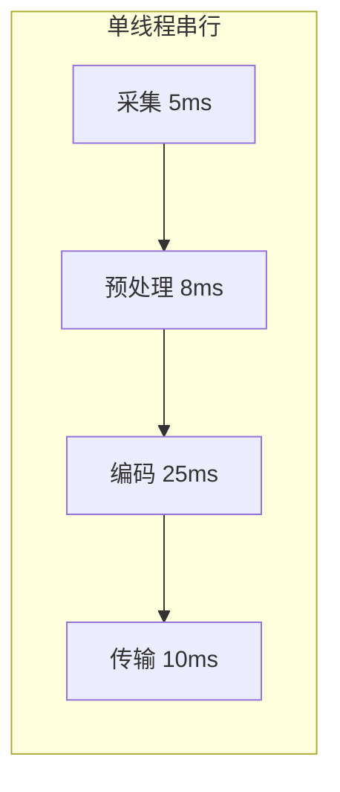
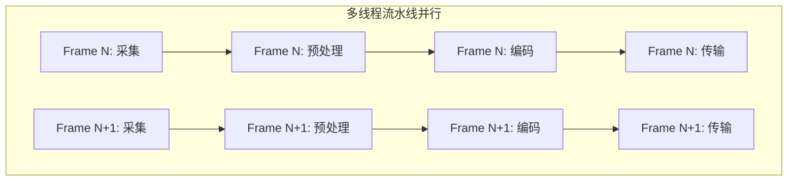
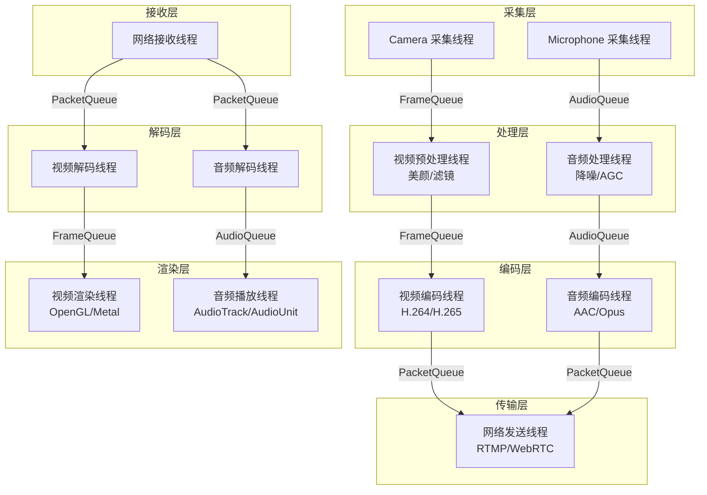
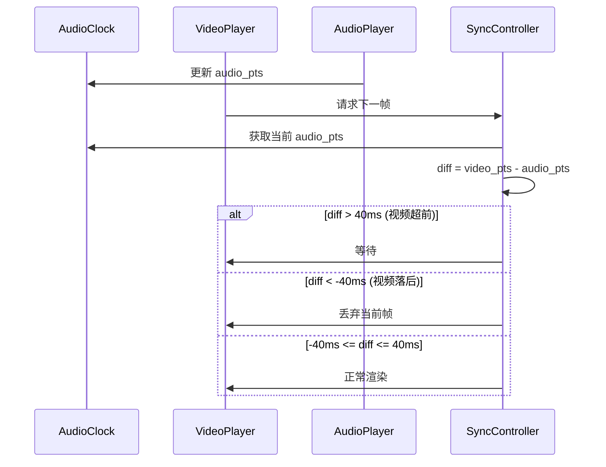
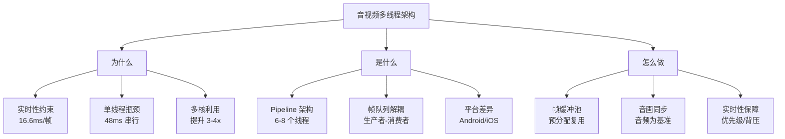

# 音视频多线程架构详细解析

> **核心结论（TL;DR）**：音视频系统的多线程架构是一个典型的多级 Pipeline 问题，核心挑战是在实时性约束下保证线程间高效协作。通过采集-处理-编码-传输的流水线并行，可将端到端延迟从串行的 150ms+ 降至 50ms 以内，同时实现 CPU 多核利用率最大化。

---

## 1. Why — 音视频为什么必须多线程

**结论先行**：音视频处理存在严格的实时性约束，单线程架构无法在帧预算时间内完成采集、处理、编码、传输的完整链路，多线程流水线是唯一解。

### 1.1 实时性约束：帧预算分析

视频帧率决定了每帧的时间预算：

| 帧率 | 帧间隔 | 典型场景 |
|-----|-------|---------|
| 24 fps | 41.7 ms | 电影 |
| 30 fps | 33.3 ms | 标准视频通话 |
| 60 fps | 16.6 ms | 高帧率直播/游戏 |
| 120 fps | 8.3 ms | 高刷屏幕录制 |

**关键洞察**：在 60fps 场景下，从采集到渲染的整个链路必须在 16.6ms 内完成，而单次 H.264 软编码可能需要 20-40ms，这在单线程下是不可能完成的。

### 1.2 单线程瓶颈分析

```
┌─────────────────────────────────────────────────────────────────┐
│              单线程串行处理一帧的时间分解                          │
├─────────────────────────────────────────────────────────────────┤
│  采集     │  预处理   │  编码     │  传输     │  总计             │
│  5ms      │  8ms      │  25ms     │  10ms     │  48ms             │
│           │ (美颜)    │ (H.264)   │ (RTMP)    │                   │
└─────────────────────────────────────────────────────────────────┘
                    ↓
           单线程只能达到 ~20fps
           无法满足 30fps 实时通话需求
```

### 1.3 多线程流水线的吞吐量提升





**流水线并行的核心优势**：

| 指标 | 单线程 | 4 级流水线 | 提升倍数 |
|-----|-------|-----------|---------|
| 帧处理时间 | 48 ms | 48 ms | 1x（不变） |
| 吞吐量 | 20.8 fps | 40 fps* | ~2x |
| 端到端延迟 | 48 ms | 48 ms | 需要优化 |
| CPU 利用率 | 25% | 80%+ | 3x+ |

*流水线吞吐量受最慢阶段（编码 25ms）限制

### 1.4 延迟 vs 吞吐量的权衡

音视频系统需要同时优化两个指标：
- **吞吐量（Throughput）**：每秒处理帧数，决定画质和流畅度
- **延迟（Latency）**：端到端时间，决定实时交互体验

```
┌─────────────────────────────────────────────────────────────────┐
│                    延迟优化 vs 吞吐量优化                         │
├─────────────────────────────────────────────────────────────────┤
│  场景              │ 优先级        │ 策略                        │
├─────────────────────────────────────────────────────────────────┤
│  实时视频通话       │ 延迟优先      │ 减少缓冲、跳帧、B帧关闭      │
│  直播推流          │ 平衡         │ 适当缓冲、GOP优化            │
│  视频录制          │ 吞吐量优先    │ 深队列、批处理              │
└─────────────────────────────────────────────────────────────────┘
```

---

## 2. What — 音视频 Pipeline 多线程架构

**结论先行**：完整的音视频系统通常包含 6-8 个核心线程，各司其职，通过帧队列解耦。

### 2.1 完整架构图



### 2.2 各线程职责边界

| 线程 | 职责 | 实时性要求 | 典型优先级 |
|-----|------|-----------|-----------|
| **Camera 采集** | 获取原始 YUV/RGBA 数据 | 硬实时 | 最高 |
| **Microphone 采集** | 获取 PCM 音频数据 | 硬实时 | 最高 |
| **视频预处理** | 美颜、滤镜、缩放、格式转换 | 软实时 | 高 |
| **音频处理** | 降噪、AGC、回声消除 | 软实时 | 高 |
| **视频编码** | H.264/H.265/VP9 编码 | 软实时 | 中高 |
| **音频编码** | AAC/Opus 编码 | 软实时 | 中高 |
| **网络发送** | RTMP/WebRTC 推流 | 尽力而为 | 中 |
| **网络接收** | 数据包接收、解封装 | 尽力而为 | 中 |
| **视频解码** | 硬解/软解 | 软实时 | 中高 |
| **音频解码** | AAC/Opus 解码 | 软实时 | 中高 |
| **视频渲染** | OpenGL/Metal/Vulkan 显示 | 硬实时（VSync） | 高 |
| **音频播放** | AudioTrack/AudioUnit 输出 | 硬实时 | 最高 |

### 2.3 数据流向与队列设计

```
┌─────────────────────────────────────────────────────────────────┐
│                     推流端数据流                                  │
├─────────────────────────────────────────────────────────────────┤
│                                                                 │
│  Camera ──→ [RawFrameQ] ──→ 预处理 ──→ [ProcessedQ] ──→ 编码    │
│              (3帧)                      (2帧)                   │
│                                                    ↓            │
│  Mic ────→ [AudioInQ] ───→ 音频处理 ──→ [ProcessedAudioQ]      │
│             (10帧)                       (5帧)        ↓         │
│                                                    Muxer        │
│                                                      ↓          │
│                                              [PacketQ] ──→ 网络  │
│                                                (20个)           │
└─────────────────────────────────────────────────────────────────┘
```

---

## 3. How — 帧缓冲与线程间通信

**结论先行**：帧缓冲池 + 无锁/低锁队列是音视频线程间通信的核心模式，零拷贝传递是性能优化的关键。

### 3.1 帧缓冲池设计（Ring Buffer）

```cpp
#include <atomic>
#include <array>
#include <optional>
#include <cstdint>
#include <memory>
#include <cstring>

/**
 * @brief 视频帧结构体
 */
struct VideoFrame {
    std::unique_ptr<uint8_t[]> data;    // YUV 数据
    uint32_t width = 0;
    uint32_t height = 0;
    int64_t pts = 0;                     // 显示时间戳（微秒）
    int64_t dts = 0;                     // 解码时间戳
    uint32_t stride = 0;                 // 行步长
    uint32_t format = 0;                 // 像素格式
    std::atomic<int> ref_count{0};       // 引用计数
    
    void addRef() { ref_count.fetch_add(1, std::memory_order_relaxed); }
    bool release() { return ref_count.fetch_sub(1, std::memory_order_acq_rel) == 1; }
};

/**
 * @brief 线程安全的 SPSC（单生产者单消费者）环形帧队列
 * 
 * 适用于：采集线程 -> 处理线程 这种单对单场景
 */
template <typename T, size_t Capacity>
class SPSCFrameQueue {
    static_assert((Capacity & (Capacity - 1)) == 0, "Capacity must be power of 2");
    
public:
    SPSCFrameQueue() = default;
    
    // 禁止拷贝
    SPSCFrameQueue(const SPSCFrameQueue&) = delete;
    SPSCFrameQueue& operator=(const SPSCFrameQueue&) = delete;
    
    /**
     * @brief 生产者：入队
     * @return true 成功，false 队列已满
     */
    [[nodiscard]] bool try_push(T&& item) {
        const size_t head = head_.load(std::memory_order_relaxed);
        const size_t next_head = (head + 1) & (Capacity - 1);
        
        if (next_head == tail_.load(std::memory_order_acquire)) {
            return false;  // 队列已满
        }
        
        buffer_[head] = std::move(item);
        head_.store(next_head, std::memory_order_release);
        return true;
    }
    
    /**
     * @brief 消费者：出队
     * @return std::optional 包含数据或 nullopt
     */
    [[nodiscard]] std::optional<T> try_pop() {
        const size_t tail = tail_.load(std::memory_order_relaxed);
        
        if (tail == head_.load(std::memory_order_acquire)) {
            return std::nullopt;  // 队列为空
        }
        
        T item = std::move(buffer_[tail]);
        tail_.store((tail + 1) & (Capacity - 1), std::memory_order_release);
        return item;
    }
    
    /**
     * @brief 获取当前队列大小（近似值）
     */
    [[nodiscard]] size_t size() const {
        const size_t head = head_.load(std::memory_order_relaxed);
        const size_t tail = tail_.load(std::memory_order_relaxed);
        return (head - tail + Capacity) & (Capacity - 1);
    }
    
    [[nodiscard]] bool empty() const { return size() == 0; }
    [[nodiscard]] bool full() const { return size() == Capacity - 1; }
    
private:
    std::array<T, Capacity> buffer_;
    alignas(64) std::atomic<size_t> head_{0};  // 缓存行对齐，避免伪共享
    alignas(64) std::atomic<size_t> tail_{0};
};
```

### 3.2 帧缓冲池完整实现

```cpp
#include <mutex>
#include <stack>
#include <functional>
#include <condition_variable>

/**
 * @brief 视频帧缓冲池
 * 
 * 预分配帧内存，避免运行时频繁 malloc/free
 */
class VideoFramePool {
public:
    /**
     * @brief 构造帧缓冲池
     * @param pool_size 池中帧数量
     * @param width 帧宽度
     * @param height 帧高度
     * @param format 像素格式（决定内存大小）
     */
    VideoFramePool(size_t pool_size, uint32_t width, uint32_t height, uint32_t format)
        : width_(width), height_(height), format_(format) {
        
        const size_t frame_size = calculateFrameSize(width, height, format);
        
        for (size_t i = 0; i < pool_size; ++i) {
            auto frame = std::make_shared<VideoFrame>();
            frame->data = std::make_unique<uint8_t[]>(frame_size);
            frame->width = width;
            frame->height = height;
            frame->format = format;
            frame->stride = width;  // 假设无 padding
            
            free_frames_.push(frame);
        }
        
        total_count_ = pool_size;
    }
    
    /**
     * @brief 从池中获取帧（阻塞版本）
     * @param timeout_ms 超时时间（毫秒），0 表示无限等待
     */
    [[nodiscard]] std::shared_ptr<VideoFrame> acquire(uint32_t timeout_ms = 0) {
        std::unique_lock<std::mutex> lock(mutex_);
        
        auto wait_predicate = [this] { return !free_frames_.empty(); };
        
        if (timeout_ms == 0) {
            cv_.wait(lock, wait_predicate);
        } else {
            if (!cv_.wait_for(lock, std::chrono::milliseconds(timeout_ms), wait_predicate)) {
                return nullptr;  // 超时
            }
        }
        
        auto frame = free_frames_.top();
        free_frames_.pop();
        ++acquired_count_;
        
        return frame;
    }
    
    /**
     * @brief 尝试获取帧（非阻塞）
     */
    [[nodiscard]] std::shared_ptr<VideoFrame> try_acquire() {
        std::lock_guard<std::mutex> lock(mutex_);
        
        if (free_frames_.empty()) {
            return nullptr;
        }
        
        auto frame = free_frames_.top();
        free_frames_.pop();
        ++acquired_count_;
        
        return frame;
    }
    
    /**
     * @brief 归还帧到池中
     */
    void release(std::shared_ptr<VideoFrame> frame) {
        if (!frame) return;
        
        // 重置帧状态
        frame->pts = 0;
        frame->dts = 0;
        frame->ref_count.store(0, std::memory_order_relaxed);
        
        {
            std::lock_guard<std::mutex> lock(mutex_);
            free_frames_.push(std::move(frame));
            ++released_count_;
        }
        
        cv_.notify_one();
    }
    
    // 统计信息
    [[nodiscard]] size_t free_count() const {
        std::lock_guard<std::mutex> lock(mutex_);
        return free_frames_.size();
    }
    
    [[nodiscard]] size_t used_count() const {
        return total_count_ - free_count();
    }
    
private:
    static size_t calculateFrameSize(uint32_t width, uint32_t height, uint32_t format) {
        // 简化：假设 YUV420 格式，实际应根据 format 计算
        return width * height * 3 / 2;
    }
    
    uint32_t width_, height_, format_;
    size_t total_count_ = 0;
    size_t acquired_count_ = 0;
    size_t released_count_ = 0;
    
    std::stack<std::shared_ptr<VideoFrame>> free_frames_;
    mutable std::mutex mutex_;
    std::condition_variable cv_;
};
```

### 3.3 零拷贝帧传递

```cpp
#ifdef __ANDROID__
#include <android/hardware_buffer.h>

/**
 * @brief Android HardwareBuffer 零拷贝帧
 * 
 * CPU/GPU/编码器 共享同一块物理内存
 */
class HardwareBufferFrame {
public:
    static std::shared_ptr<HardwareBufferFrame> create(uint32_t width, uint32_t height) {
        AHardwareBuffer_Desc desc = {
            .width = width,
            .height = height,
            .layers = 1,
            .format = AHARDWAREBUFFER_FORMAT_Y8Cb8Cr8_420,
            .usage = AHARDWAREBUFFER_USAGE_CPU_READ_OFTEN |
                     AHARDWAREBUFFER_USAGE_CPU_WRITE_OFTEN |
                     AHARDWAREBUFFER_USAGE_GPU_SAMPLED_IMAGE |
                     AHARDWAREBUFFER_USAGE_VIDEO_ENCODE,
            .stride = 0,
        };
        
        AHardwareBuffer* buffer = nullptr;
        if (AHardwareBuffer_allocate(&desc, &buffer) != 0) {
            return nullptr;
        }
        
        auto frame = std::make_shared<HardwareBufferFrame>();
        frame->buffer_ = buffer;
        frame->width_ = width;
        frame->height_ = height;
        return frame;
    }
    
    ~HardwareBufferFrame() {
        if (buffer_) {
            AHardwareBuffer_release(buffer_);
        }
    }
    
    /**
     * @brief 锁定缓冲区进行 CPU 访问
     */
    void* lock(uint64_t usage) {
        void* data = nullptr;
        AHardwareBuffer_lock(buffer_, usage, -1, nullptr, &data);
        return data;
    }
    
    void unlock() {
        AHardwareBuffer_unlock(buffer_, nullptr);
    }
    
    AHardwareBuffer* nativeBuffer() const { return buffer_; }
    
private:
    AHardwareBuffer* buffer_ = nullptr;
    uint32_t width_ = 0;
    uint32_t height_ = 0;
    int64_t pts_ = 0;
};
#endif

#ifdef __APPLE__
#include <CoreVideo/CoreVideo.h>

/**
 * @brief iOS CVPixelBuffer 零拷贝帧
 */
class CVPixelBufferFrame {
public:
    static std::shared_ptr<CVPixelBufferFrame> create(
            CVPixelBufferPoolRef pool, uint32_t width, uint32_t height) {
        CVPixelBufferRef pixelBuffer = nullptr;
        
        CVReturn status = CVPixelBufferPoolCreatePixelBuffer(
            kCFAllocatorDefault, pool, &pixelBuffer);
        
        if (status != kCVReturnSuccess) {
            return nullptr;
        }
        
        auto frame = std::make_shared<CVPixelBufferFrame>();
        frame->pixelBuffer_ = pixelBuffer;
        return frame;
    }
    
    ~CVPixelBufferFrame() {
        if (pixelBuffer_) {
            CVPixelBufferRelease(pixelBuffer_);
        }
    }
    
    void* lockBaseAddress(CVPixelBufferLockFlags flags) {
        CVPixelBufferLockBaseAddress(pixelBuffer_, flags);
        return CVPixelBufferGetBaseAddress(pixelBuffer_);
    }
    
    void unlockBaseAddress(CVPixelBufferLockFlags flags) {
        CVPixelBufferUnlockBaseAddress(pixelBuffer_, flags);
    }
    
    CVPixelBufferRef nativeBuffer() const { return pixelBuffer_; }
    
private:
    CVPixelBufferRef pixelBuffer_ = nullptr;
    int64_t pts_ = 0;
};
#endif
```

---

## 4. How — 音画同步

**结论先行**：音频为基准的同步策略是业界标准，通过 Master Clock 统一时间基准，视频根据音频进度动态调整播放。

### 4.1 时间戳体系

```
┌─────────────────────────────────────────────────────────────────┐
│                   音视频时间戳体系                                │
├─────────────────────────────────────────────────────────────────┤
│  PTS (Presentation Time Stamp)                                  │
│  └── 显示时间戳：帧应该被渲染的时间                               │
│                                                                 │
│  DTS (Decode Time Stamp)                                        │
│  └── 解码时间戳：帧应该被解码的时间                               │
│  └── 对于 B 帧：DTS ≠ PTS（B 帧需要参考后续 P 帧）                │
│                                                                 │
│  时间基（time_base）                                             │
│  └── 时间戳的单位，如 1/90000 秒（MPEG-TS）或 1/1000 秒           │
└─────────────────────────────────────────────────────────────────┘
```

### 4.2 音频为基准的同步策略



### 4.3 同步时钟实现

```cpp
#include <chrono>
#include <atomic>
#include <cmath>

/**
 * @brief 音视频同步时钟
 */
class AVSyncClock {
public:
    // 同步阈值配置
    static constexpr int64_t kSyncThresholdUs = 40000;    // 40ms
    static constexpr int64_t kFrameDropThresholdUs = 100000; // 100ms
    
    enum class SyncAction {
        Render,     // 正常渲染
        Wait,       // 等待（视频超前）
        Drop,       // 丢帧（视频落后）
        Repeat      // 重复上一帧（音频数据不足）
    };
    
    /**
     * @brief 初始化时钟
     */
    void start() {
        base_time_ = std::chrono::steady_clock::now();
        audio_pts_.store(0, std::memory_order_release);
        paused_.store(false, std::memory_order_release);
    }
    
    /**
     * @brief 音频线程调用：更新音频播放进度
     * @param pts_us 当前音频 PTS（微秒）
     */
    void updateAudioPts(int64_t pts_us) {
        audio_pts_.store(pts_us, std::memory_order_release);
        audio_update_time_ = std::chrono::steady_clock::now();
    }
    
    /**
     * @brief 视频线程调用：获取同步决策
     * @param video_pts_us 待渲染视频帧的 PTS（微秒）
     * @return 同步动作
     */
    [[nodiscard]] SyncAction getSyncAction(int64_t video_pts_us) const {
        if (paused_.load(std::memory_order_acquire)) {
            return SyncAction::Wait;
        }
        
        // 获取当前音频时钟位置（考虑音频更新后经过的时间）
        int64_t audio_pts = audio_pts_.load(std::memory_order_acquire);
        auto now = std::chrono::steady_clock::now();
        auto elapsed = std::chrono::duration_cast<std::chrono::microseconds>(
            now - audio_update_time_).count();
        
        int64_t current_audio_pos = audio_pts + elapsed;
        int64_t diff = video_pts_us - current_audio_pos;
        
        if (diff > kSyncThresholdUs) {
            // 视频超前音频，等待
            return SyncAction::Wait;
        } else if (diff < -kFrameDropThresholdUs) {
            // 视频严重落后，丢帧
            return SyncAction::Drop;
        } else if (diff < -kSyncThresholdUs) {
            // 视频轻微落后，加速但不丢帧（可选策略）
            return SyncAction::Render;
        } else {
            // 同步范围内，正常渲染
            return SyncAction::Render;
        }
    }
    
    /**
     * @brief 计算视频帧应等待的时间
     */
    [[nodiscard]] int64_t getWaitTimeUs(int64_t video_pts_us) const {
        int64_t audio_pts = audio_pts_.load(std::memory_order_acquire);
        auto now = std::chrono::steady_clock::now();
        auto elapsed = std::chrono::duration_cast<std::chrono::microseconds>(
            now - audio_update_time_).count();
        
        int64_t current_audio_pos = audio_pts + elapsed;
        int64_t wait_time = video_pts_us - current_audio_pos - kSyncThresholdUs / 2;
        
        return std::max<int64_t>(0, wait_time);
    }
    
    void pause() { paused_.store(true, std::memory_order_release); }
    void resume() { paused_.store(false, std::memory_order_release); }
    
private:
    std::chrono::steady_clock::time_point base_time_;
    std::chrono::steady_clock::time_point audio_update_time_;
    std::atomic<int64_t> audio_pts_{0};
    std::atomic<bool> paused_{false};
};
```

### 4.4 视频渲染循环集成同步

```cpp
/**
 * @brief 视频渲染线程主循环
 */
void videoRenderLoop(
        SPSCFrameQueue<std::shared_ptr<VideoFrame>, 8>& frame_queue,
        AVSyncClock& sync_clock,
        std::atomic<bool>& running) {
    
    std::shared_ptr<VideoFrame> last_frame = nullptr;
    
    while (running.load(std::memory_order_acquire)) {
        auto frame_opt = frame_queue.try_pop();
        
        if (!frame_opt) {
            // 队列为空，休眠一小段时间
            std::this_thread::sleep_for(std::chrono::milliseconds(1));
            continue;
        }
        
        auto frame = std::move(*frame_opt);
        
        // 获取同步决策
        auto action = sync_clock.getSyncAction(frame->pts);
        
        switch (action) {
            case AVSyncClock::SyncAction::Wait: {
                // 等待到合适时间
                int64_t wait_us = sync_clock.getWaitTimeUs(frame->pts);
                if (wait_us > 1000) {
                    std::this_thread::sleep_for(std::chrono::microseconds(wait_us));
                }
                // 重新检查同步状态
                action = sync_clock.getSyncAction(frame->pts);
                if (action != AVSyncClock::SyncAction::Drop) {
                    renderFrame(frame.get());
                    last_frame = frame;
                }
                break;
            }
            
            case AVSyncClock::SyncAction::Drop:
                // 丢弃当前帧，统计丢帧数
                // metrics.dropped_frames++;
                break;
                
            case AVSyncClock::SyncAction::Render:
                renderFrame(frame.get());
                last_frame = frame;
                break;
                
            case AVSyncClock::SyncAction::Repeat:
                // 重复上一帧
                if (last_frame) {
                    renderFrame(last_frame.get());
                }
                break;
        }
    }
}

void renderFrame(VideoFrame* frame) {
    // 实际渲染逻辑：OpenGL/Metal/Vulkan
    // ...
}
```

---

## 5. How — 实时性保障

**结论先行**：通过线程优先级分级、无锁队列、背压机制和优雅降级策略，确保音视频系统在各种负载下保持流畅。

### 5.1 线程优先级配置

```cpp
#include <pthread.h>
#include <sched.h>

/**
 * @brief 音视频线程优先级配置
 */
class ThreadPriorityConfig {
public:
    // 优先级等级（从高到低）
    enum class Priority {
        AudioCapture,    // 音频采集：最高优先级
        AudioRender,     // 音频播放
        VideoCapture,    // 视频采集
        VideoRender,     // 视频渲染
        Encoder,         // 编码
        Decoder,         // 解码
        Network,         // 网络 I/O
        Default          // 默认
    };
    
    static void setPriority(pthread_t thread, Priority priority) {
#ifdef __ANDROID__
        setAndroidPriority(thread, priority);
#elif defined(__APPLE__)
        setApplePriority(thread, priority);
#else
        setLinuxPriority(thread, priority);
#endif
    }
    
private:
#ifdef __ANDROID__
    static void setAndroidPriority(pthread_t thread, Priority priority) {
        // Android 使用 nice 值，范围 -20（最高）到 19（最低）
        int nice_value = 0;
        
        switch (priority) {
            case Priority::AudioCapture:
            case Priority::AudioRender:
                nice_value = -19;  // ANDROID_PRIORITY_AUDIO
                break;
            case Priority::VideoCapture:
            case Priority::VideoRender:
                nice_value = -10;  // ANDROID_PRIORITY_VIDEO
                break;
            case Priority::Encoder:
            case Priority::Decoder:
                nice_value = -4;   // ANDROID_PRIORITY_DISPLAY
                break;
            case Priority::Network:
                nice_value = 0;    // ANDROID_PRIORITY_NORMAL
                break;
            default:
                nice_value = 0;
                break;
        }
        
        // 设置线程调度策略
        struct sched_param param;
        param.sched_priority = 0;
        pthread_setschedparam(thread, SCHED_OTHER, &param);
        
        // 使用 setpriority 设置 nice 值（需要 tid）
        // setpriority(PRIO_PROCESS, gettid(), nice_value);
    }
#endif

#ifdef __APPLE__
    static void setApplePriority(pthread_t thread, Priority priority) {
        // macOS/iOS 使用 QoS 类
        qos_class_t qos_class = QOS_CLASS_DEFAULT;
        
        switch (priority) {
            case Priority::AudioCapture:
            case Priority::AudioRender:
                qos_class = QOS_CLASS_USER_INTERACTIVE;
                break;
            case Priority::VideoCapture:
            case Priority::VideoRender:
                qos_class = QOS_CLASS_USER_INITIATED;
                break;
            case Priority::Encoder:
            case Priority::Decoder:
                qos_class = QOS_CLASS_USER_INITIATED;
                break;
            case Priority::Network:
                qos_class = QOS_CLASS_UTILITY;
                break;
            default:
                qos_class = QOS_CLASS_DEFAULT;
                break;
        }
        
        pthread_set_qos_class_self_np(qos_class, 0);
    }
#endif

    static void setLinuxPriority(pthread_t thread, Priority priority) {
        struct sched_param param;
        int policy = SCHED_OTHER;
        
        switch (priority) {
            case Priority::AudioCapture:
            case Priority::AudioRender:
                policy = SCHED_FIFO;
                param.sched_priority = 80;
                break;
            case Priority::VideoCapture:
            case Priority::VideoRender:
                policy = SCHED_FIFO;
                param.sched_priority = 60;
                break;
            default:
                policy = SCHED_OTHER;
                param.sched_priority = 0;
                break;
        }
        
        pthread_setschedparam(thread, policy, &param);
    }
};
```

### 5.2 背压（Backpressure）机制

```cpp
/**
 * @brief 带背压控制的帧队列
 * 
 * 当下游处理不过来时，通知上游降速
 */
template <typename T, size_t Capacity>
class BackpressureQueue {
public:
    // 背压阈值
    static constexpr size_t kHighWaterMark = Capacity * 3 / 4;
    static constexpr size_t kLowWaterMark = Capacity / 4;
    
    enum class PressureLevel {
        Normal,      // 正常
        Warning,     // 队列较满，警告
        Critical     // 即将满，需要降速
    };
    
    [[nodiscard]] bool try_push(T&& item) {
        std::lock_guard<std::mutex> lock(mutex_);
        
        if (queue_.size() >= Capacity) {
            ++dropped_count_;
            return false;
        }
        
        queue_.push(std::move(item));
        updatePressure();
        cv_.notify_one();
        return true;
    }
    
    [[nodiscard]] std::optional<T> try_pop() {
        std::lock_guard<std::mutex> lock(mutex_);
        
        if (queue_.empty()) {
            return std::nullopt;
        }
        
        T item = std::move(queue_.front());
        queue_.pop();
        updatePressure();
        return item;
    }
    
    [[nodiscard]] PressureLevel getPressureLevel() const {
        return pressure_level_.load(std::memory_order_acquire);
    }
    
    /**
     * @brief 上游生产者查询是否应该降速
     */
    [[nodiscard]] bool shouldThrottle() const {
        return getPressureLevel() == PressureLevel::Critical;
    }
    
private:
    void updatePressure() {
        size_t current_size = queue_.size();
        PressureLevel new_level;
        
        if (current_size >= kHighWaterMark) {
            new_level = PressureLevel::Critical;
        } else if (current_size >= kLowWaterMark) {
            new_level = PressureLevel::Warning;
        } else {
            new_level = PressureLevel::Normal;
        }
        
        pressure_level_.store(new_level, std::memory_order_release);
    }
    
    std::queue<T> queue_;
    std::mutex mutex_;
    std::condition_variable cv_;
    std::atomic<PressureLevel> pressure_level_{PressureLevel::Normal};
    size_t dropped_count_ = 0;
};
```

### 5.3 帧丢弃策略（优雅降级）

```cpp
/**
 * @brief 智能帧丢弃策略
 */
class FrameDropPolicy {
public:
    enum class DropStrategy {
        None,           // 不丢帧
        DropOldest,     // 丢弃最旧的帧
        DropNonKey,     // 优先丢弃非关键帧
        Adaptive        // 自适应策略
    };
    
    struct DropDecision {
        bool should_drop = false;
        std::string reason;
    };
    
    /**
     * @brief 决定是否丢弃当前帧
     * @param queue_depth 当前队列深度
     * @param is_keyframe 是否为关键帧
     * @param pts 帧时间戳
     */
    [[nodiscard]] DropDecision shouldDrop(
            size_t queue_depth,
            bool is_keyframe,
            int64_t pts) {
        
        DropDecision decision;
        
        // 队列深度检查
        if (queue_depth > max_queue_depth_) {
            if (is_keyframe) {
                // 关键帧尽量保留
                if (queue_depth > max_queue_depth_ * 2) {
                    decision.should_drop = true;
                    decision.reason = "Queue overflow, dropping keyframe";
                }
            } else {
                decision.should_drop = true;
                decision.reason = "Queue depth exceeded";
            }
            return decision;
        }
        
        // 时间戳检查（跳过过期帧）
        int64_t current_time = getCurrentTimeUs();
        if (pts < current_time - max_delay_us_) {
            decision.should_drop = true;
            decision.reason = "Frame too old";
            return decision;
        }
        
        // 连续非关键帧检查
        if (!is_keyframe) {
            ++consecutive_non_keyframes_;
            if (consecutive_non_keyframes_ > max_consecutive_non_keyframes_) {
                decision.should_drop = true;
                decision.reason = "Too many non-keyframes";
            }
        } else {
            consecutive_non_keyframes_ = 0;
        }
        
        return decision;
    }
    
private:
    int64_t getCurrentTimeUs() {
        auto now = std::chrono::steady_clock::now();
        return std::chrono::duration_cast<std::chrono::microseconds>(
            now.time_since_epoch()).count();
    }
    
    size_t max_queue_depth_ = 10;
    int64_t max_delay_us_ = 500000;  // 500ms
    size_t max_consecutive_non_keyframes_ = 30;
    size_t consecutive_non_keyframes_ = 0;
};
```

---

## 6. How — 平台实现差异

### 6.1 Android 实现

```cpp
#ifdef __ANDROID__
#include <media/NdkMediaCodec.h>
#include <camera/NdkCameraDevice.h>

/**
 * @brief Android MediaCodec 异步编码器
 */
class AndroidAsyncEncoder {
public:
    void start(const EncoderConfig& config) {
        codec_ = AMediaCodec_createEncoderByType("video/avc");
        
        AMediaFormat* format = AMediaFormat_new();
        AMediaFormat_setString(format, AMEDIAFORMAT_KEY_MIME, "video/avc");
        AMediaFormat_setInt32(format, AMEDIAFORMAT_KEY_WIDTH, config.width);
        AMediaFormat_setInt32(format, AMEDIAFORMAT_KEY_HEIGHT, config.height);
        AMediaFormat_setInt32(format, AMEDIAFORMAT_KEY_BIT_RATE, config.bitrate);
        AMediaFormat_setInt32(format, AMEDIAFORMAT_KEY_FRAME_RATE, config.fps);
        AMediaFormat_setInt32(format, AMEDIAFORMAT_KEY_I_FRAME_INTERVAL, 2);
        
        AMediaCodec_configure(codec_, format, nullptr, nullptr, 
                              AMEDIACODEC_CONFIGURE_FLAG_ENCODE);
        
        // 设置异步回调
        AMediaCodecOnAsyncNotifyCallback callback = {
            .onAsyncInputAvailable = onInputAvailable,
            .onAsyncOutputAvailable = onOutputAvailable,
            .onAsyncFormatChanged = onFormatChanged,
            .onAsyncError = onError
        };
        AMediaCodec_setAsyncNotifyCallback(codec_, callback, this);
        
        AMediaCodec_start(codec_);
        AMediaFormat_delete(format);
    }
    
private:
    static void onInputAvailable(AMediaCodec* codec, void* userdata, int32_t index) {
        auto* self = static_cast<AndroidAsyncEncoder*>(userdata);
        // 在编码线程中处理输入
        self->handleInputAvailable(index);
    }
    
    static void onOutputAvailable(AMediaCodec* codec, void* userdata,
                                   int32_t index, AMediaCodecBufferInfo* info) {
        auto* self = static_cast<AndroidAsyncEncoder*>(userdata);
        // 在编码线程中处理输出
        self->handleOutputAvailable(index, info);
    }
    
    static void onFormatChanged(AMediaCodec* codec, void* userdata, 
                                 AMediaFormat* format) {
        // 格式变化处理
    }
    
    static void onError(AMediaCodec* codec, void* userdata,
                        media_status_t error, int32_t actionCode,
                        const char* detail) {
        // 错误处理
    }
    
    void handleInputAvailable(int32_t index) {
        // 从帧队列获取数据，写入编码器
    }
    
    void handleOutputAvailable(int32_t index, AMediaCodecBufferInfo* info) {
        // 获取编码后数据，发送到网络
    }
    
    AMediaCodec* codec_ = nullptr;
};
#endif
```

### 6.2 iOS 实现

```cpp
#ifdef __APPLE__
#include <VideoToolbox/VideoToolbox.h>

/**
 * @brief iOS VideoToolbox 硬编码器
 */
class iOSVideoEncoder {
public:
    bool start(const EncoderConfig& config) {
        // 创建编码会话
        CFMutableDictionaryRef encoderSpec = CFDictionaryCreateMutable(
            kCFAllocatorDefault, 0,
            &kCFTypeDictionaryKeyCallBacks,
            &kCFTypeDictionaryValueCallBacks);
        
        // 配置硬件加速
        CFDictionarySetValue(encoderSpec,
            kVTVideoEncoderSpecification_EnableHardwareAcceleratedVideoEncoder,
            kCFBooleanTrue);
        
        OSStatus status = VTCompressionSessionCreate(
            kCFAllocatorDefault,
            config.width,
            config.height,
            kCMVideoCodecType_H264,
            encoderSpec,
            nullptr,  // sourceImageBufferAttributes
            kCFAllocatorDefault,
            compressionOutputCallback,
            this,
            &session_);
        
        CFRelease(encoderSpec);
        
        if (status != noErr) {
            return false;
        }
        
        // 设置编码参数
        VTSessionSetProperty(session_, 
            kVTCompressionPropertyKey_RealTime, kCFBooleanTrue);
        VTSessionSetProperty(session_,
            kVTCompressionPropertyKey_ProfileLevel,
            kVTProfileLevel_H264_High_AutoLevel);
        
        // 设置码率
        SInt32 bitrate = config.bitrate;
        CFNumberRef bitrateRef = CFNumberCreate(
            kCFAllocatorDefault, kCFNumberSInt32Type, &bitrate);
        VTSessionSetProperty(session_,
            kVTCompressionPropertyKey_AverageBitRate, bitrateRef);
        CFRelease(bitrateRef);
        
        VTCompressionSessionPrepareToEncodeFrames(session_);
        return true;
    }
    
    void encode(CVPixelBufferRef pixelBuffer, int64_t pts) {
        CMTime presentationTime = CMTimeMake(pts, 1000000);
        
        VTCompressionSessionEncodeFrame(
            session_,
            pixelBuffer,
            presentationTime,
            kCMTimeInvalid,
            nullptr,
            nullptr,
            nullptr);
    }
    
private:
    static void compressionOutputCallback(
            void* outputCallbackRefCon,
            void* sourceFrameRefCon,
            OSStatus status,
            VTEncodeInfoFlags infoFlags,
            CMSampleBufferRef sampleBuffer) {
        
        if (status != noErr || !sampleBuffer) {
            return;
        }
        
        auto* self = static_cast<iOSVideoEncoder*>(outputCallbackRefCon);
        self->handleEncodedData(sampleBuffer);
    }
    
    void handleEncodedData(CMSampleBufferRef sampleBuffer) {
        // 获取编码数据
        CMBlockBufferRef blockBuffer = CMSampleBufferGetDataBuffer(sampleBuffer);
        size_t length = 0;
        char* data = nullptr;
        CMBlockBufferGetDataPointer(blockBuffer, 0, nullptr, &length, &data);
        
        // 发送到网络线程
        // ...
    }
    
    VTCompressionSessionRef session_ = nullptr;
};
#endif
```

---

## 7. 性能数据

### 7.1 单线程 vs Pipeline 多线程延迟对比

| 处理方式 | 帧处理时间 | 最大帧率 | 端到端延迟 | CPU 利用率 |
|---------|-----------|---------|-----------|-----------|
| 单线程串行 | 48 ms | 20.8 fps | 48 ms | 25% |
| 2 级流水线 | 48 ms | 33.3 fps | 48 ms | 50% |
| 4 级流水线 | 48 ms | 40 fps* | 48 ms | 80% |
| 4 级 + 优化 | 35 ms | 57 fps | 35 ms | 85% |

*受最慢阶段（编码 25ms）限制

### 7.2 帧缓冲策略对比

| 缓冲策略 | 队列深度 | 额外延迟 | 内存开销 | 抗抖动能力 |
|---------|---------|---------|---------|-----------|
| 单缓冲 | 1 | 0 ms | 1 帧 | 差 |
| 双缓冲 | 2 | 16.6 ms | 2 帧 | 中 |
| 三缓冲 | 3 | 33.3 ms | 3 帧 | 好 |
| 环形队列 (5) | 5 | 83.3 ms | 5 帧 | 优 |

### 7.3 同步策略性能影响

| 同步策略 | 音画同步误差 | CPU 开销 | 适用场景 |
|---------|------------|---------|---------|
| 无同步 | ±500ms | 低 | 录制/非实时 |
| 音频基准 | ±40ms | 中 | 直播/通话 |
| 视频基准 | ±100ms | 中 | 视频编辑 |
| 外部时钟 | ±20ms | 高 | 专业广播 |

---

## 8. 常见问题与最佳实践

### 8.1 音视频线程死锁案例

```cpp
// 错误示例：可能导致死锁
class DeadlockExample {
    std::mutex audio_mutex_;
    std::mutex video_mutex_;
    
    void processAudio() {
        std::lock_guard<std::mutex> lock1(audio_mutex_);
        // ...处理音频...
        std::lock_guard<std::mutex> lock2(video_mutex_);  // 获取 video 锁
        // 同步操作
    }
    
    void processVideo() {
        std::lock_guard<std::mutex> lock1(video_mutex_);
        // ...处理视频...
        std::lock_guard<std::mutex> lock2(audio_mutex_);  // 获取 audio 锁 → 死锁！
        // 同步操作
    }
};

// 正确做法：使用 scoped_lock 同时获取多个锁
class NoDeadlockExample {
    std::mutex audio_mutex_;
    std::mutex video_mutex_;
    
    void processAudio() {
        std::scoped_lock lock(audio_mutex_, video_mutex_);  // 原子获取两个锁
        // 安全处理
    }
    
    void processVideo() {
        std::scoped_lock lock(audio_mutex_, video_mutex_);  // 相同顺序
        // 安全处理
    }
};
```

### 8.2 帧缓冲泄漏排查

```cpp
/**
 * @brief 带泄漏检测的帧缓冲池
 */
class DebugFramePool : public VideoFramePool {
public:
    std::shared_ptr<VideoFrame> acquire(uint32_t timeout_ms = 0) {
        auto frame = VideoFramePool::acquire(timeout_ms);
        if (frame) {
            std::lock_guard<std::mutex> lock(debug_mutex_);
            outstanding_frames_[frame.get()] = {
                std::chrono::steady_clock::now(),
                captureStackTrace()
            };
        }
        return frame;
    }
    
    void release(std::shared_ptr<VideoFrame> frame) {
        if (frame) {
            std::lock_guard<std::mutex> lock(debug_mutex_);
            outstanding_frames_.erase(frame.get());
        }
        VideoFramePool::release(std::move(frame));
    }
    
    void reportLeaks() {
        std::lock_guard<std::mutex> lock(debug_mutex_);
        auto now = std::chrono::steady_clock::now();
        
        for (const auto& [ptr, info] : outstanding_frames_) {
            auto age = std::chrono::duration_cast<std::chrono::seconds>(
                now - info.acquire_time).count();
            
            if (age > 5) {  // 超过 5 秒未归还
                printf("Potential leak: frame %p held for %lld seconds\n", 
                       ptr, age);
                printf("Acquired at:\n%s\n", info.stack_trace.c_str());
            }
        }
    }
    
private:
    struct FrameInfo {
        std::chrono::steady_clock::time_point acquire_time;
        std::string stack_trace;
    };
    
    std::string captureStackTrace() {
        // 平台相关的栈回溯实现
        return "";
    }
    
    std::unordered_map<VideoFrame*, FrameInfo> outstanding_frames_;
    std::mutex debug_mutex_;
};
```

### 8.3 推荐做法清单

| 类别 | 推荐做法 | 避免做法 |
|-----|---------|---------|
| **线程设计** | 采集/处理/编码/传输独立线程 | 在采集回调中做编码 |
| **队列设计** | SPSC 无锁队列（单对单） | 全局大锁队列 |
| **帧管理** | 帧缓冲池预分配 | 每帧 new/delete |
| **零拷贝** | HardwareBuffer/CVPixelBuffer | 逐帧 memcpy |
| **同步** | 音频为基准的软同步 | 严格帧对帧硬同步 |
| **优先级** | 音频线程最高优先级 | 所有线程默认优先级 |
| **背压** | 队列满时丢弃旧帧 | 无限缓冲等待 |
| **错误处理** | 优雅降级（降帧率/分辨率） | 直接崩溃或卡死 |

---

## 总结



**核心要点**：
1. **Pipeline 并行**是音视频多线程的基本模式，吞吐量受最慢阶段限制
2. **帧缓冲池 + 无锁队列**是线程间通信的最佳实践
3. **音频为基准**的同步策略是业界标准，视频根据音频动态调整
4. **优雅降级**（丢帧、降分辨率）比卡顿更可接受
5. **平台差异**需要针对性处理：Android MediaCodec 异步模式、iOS VideoToolbox 回调
