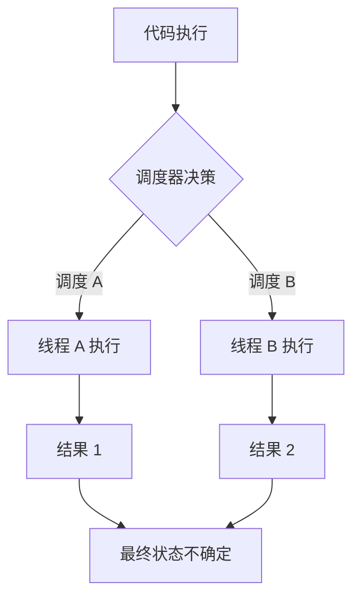
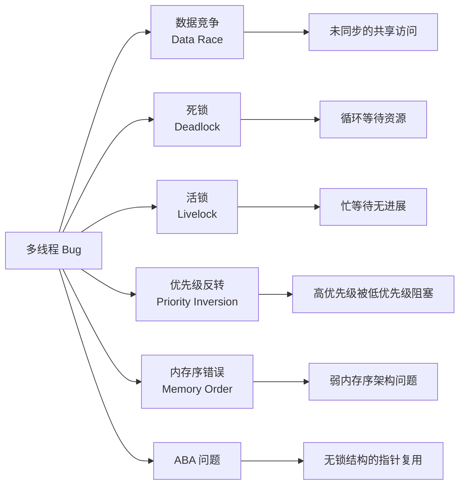
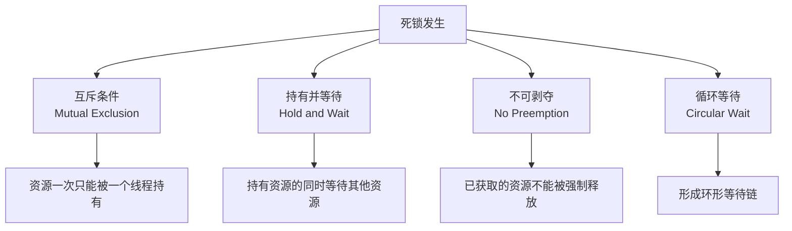
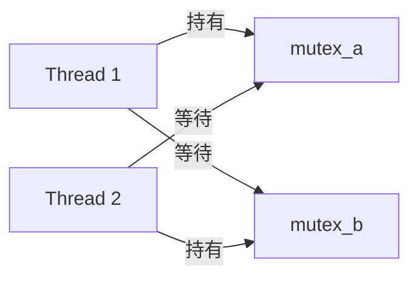
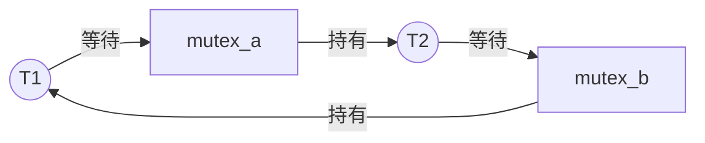
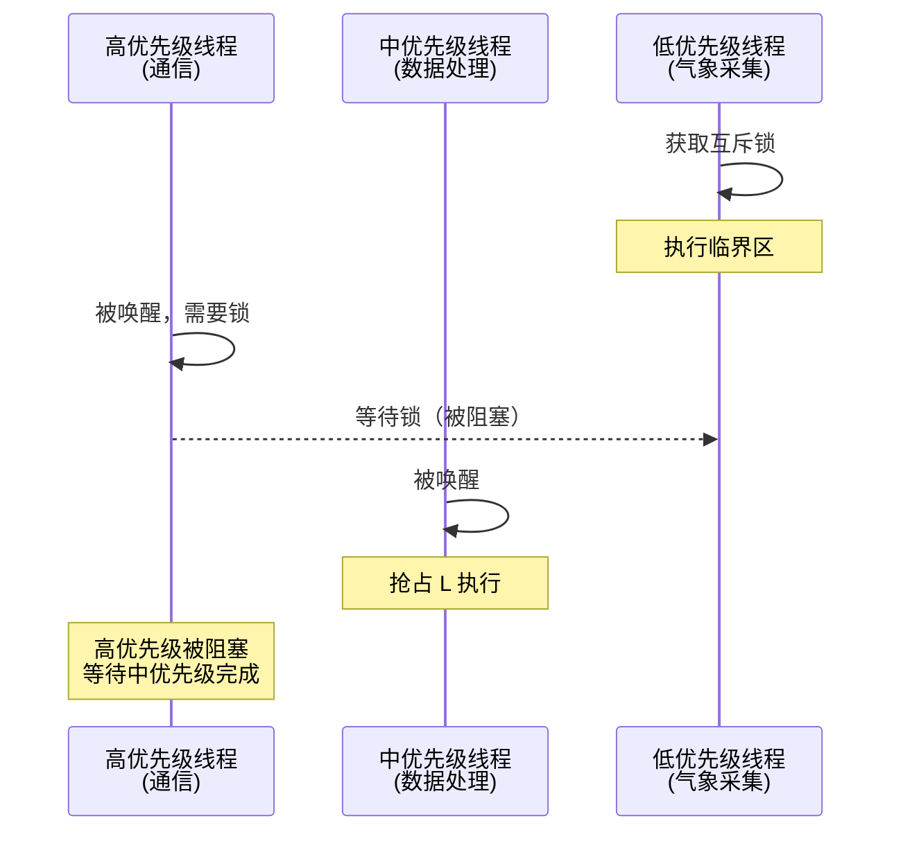
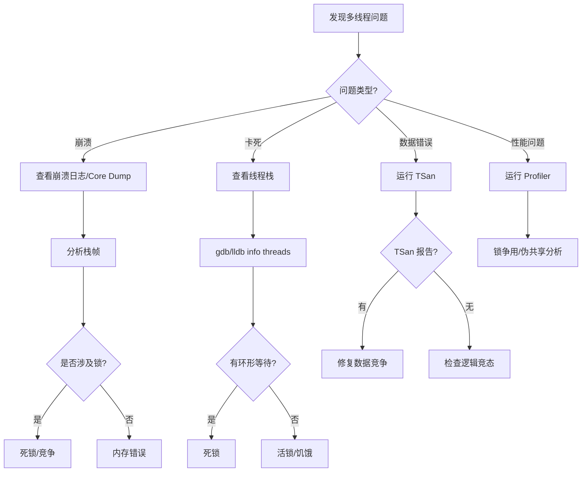

# 多线程 Bug 排查详细解析

> **核心结论（TL;DR）**：多线程 Bug 具有非确定性和难以复现的特点，系统化的排查方法论比"碰运气"调试效率高 10 倍以上。掌握 TSan、gdb/lldb、Instruments 等工具的使用，结合 MECE 分类法定位问题类型，是高效排查多线程问题的关键。

---

## 1. Why — 多线程 Bug 为什么难排查

**结论先行**：多线程 Bug 的难点在于其非确定性——同样的代码、同样的输入，每次运行结果可能不同。传统的"打印调试法"不仅效率低，还可能改变 Bug 的表现（Heisenbug）。

### 1.1 非确定性：同样的代码每次运行结果不同



**根因分析**：
- **OS 调度不可控**：线程何时执行、执行多久由操作系统决定
- **CPU 乱序执行**：指令可能被重排序
- **缓存时序差异**：缓存刷新时机不确定
- **外部中断干扰**：任何中断都可能改变执行顺序

### 1.2 Heisenbug：观测行为会改变 Bug 表现

**Heisenbug 命名来源于海森堡不确定性原理**——观测本身会改变被观测对象的状态。

| 调试手段 | 对时序的影响 | 可能导致 |
|---------|------------|---------|
| `printf` / `NSLog` | 引入 100μs-1ms 延迟 | Bug 消失或改变 |
| 断点调试 | 线程完全暂停 | 竞态条件无法复现 |
| 内存检查工具 | 降低执行速度 10-100x | 时序完全改变 |
| 增加 sleep | 人为改变调度 | 掩盖真实问题 |

```cpp
// 经典 Heisenbug 示例
int counter = 0;
bool ready = false;

void producer() {
    counter = 42;
    // printf("counter set\n");  // 加上这行，Bug 可能消失！
    ready = true;
}

void consumer() {
    while (!ready);
    assert(counter == 42);  // 偶尔失败，加日志后就好了
}
```

### 1.3 时间窗口极小：竞态条件可能只在特定时序下触发

**典型竞态窗口**：

```
时间线 →
Thread A: ────[读 counter]──[+1]──[写 counter]────
Thread B: ────────────[读 counter]──[+1]──[写 counter]────
                        ↑
                    竞态窗口（纳秒级）
```

**触发概率估算**：
- 假设竞态窗口为 10ns
- 两线程各执行 100μs
- 单次触发概率 ≈ 10ns / 100μs = 0.01%
- 1000 次执行才可能触发 1 次

### 1.4 多线程 Bug MECE 分类



---

## 2. 数据竞争（Data Race）排查

### 2.1 什么是数据竞争（C++ 标准定义）

**C++ 标准 [intro.races]**：当以下条件同时满足时，构成数据竞争（未定义行为）：

1. 两个或更多线程并发访问同一内存位置
2. 至少有一个是写操作
3. 访问之间没有同步关系（happens-before）

```cpp
// 数据竞争示例
int shared_data = 0;

// Thread A
void writer() {
    shared_data = 42;  // 写操作，无同步
}

// Thread B
void reader() {
    int local = shared_data;  // 读操作，无同步
    // 未定义行为！可能读到任意值
}
```

### 2.2 数据竞争 vs 竞态条件的区别

| 概念 | 定义 | 后果 | 示例 |
|-----|------|-----|-----|
| **数据竞争** | C++ 标准定义的 UB | 程序行为完全不可预测，可能崩溃 | 两线程同时写同一 int |
| **竞态条件** | 程序正确性依赖执行顺序 | 逻辑错误，结果非预期但程序"运行" | 检查-然后-操作 (TOCTOU) |

```cpp
// 竞态条件（非数据竞争）示例
std::atomic<int> balance{100};

// 两线程同时执行
void withdraw(int amount) {
    if (balance >= amount) {    // 检查
        balance -= amount;       // 操作
    }
}
// 初始 balance=100，两线程各取 80，可能都成功！
// 这是逻辑错误（竞态条件），但不是数据竞争
```

### 2.3 经典案例分析

#### 案例 1：共享计数器

```cpp
// 错误代码
class Counter {
    int value = 0;
public:
    void increment() { value++; }  // 非原子操作
    int get() { return value; }
};

// 修复方案 1：互斥锁
class CounterMutex {
    int value = 0;
    std::mutex mtx;
public:
    void increment() {
        std::lock_guard<std::mutex> lock(mtx);
        value++;
    }
};

// 修复方案 2：原子操作
class CounterAtomic {
    std::atomic<int> value{0};
public:
    void increment() { value.fetch_add(1, std::memory_order_relaxed); }
};
```

#### 案例 2：延迟初始化（双检锁陷阱）

```cpp
// 错误的双检锁（C++11 前）
class Singleton {
    static Singleton* instance;
    static std::mutex mtx;
public:
    static Singleton* get() {
        if (instance == nullptr) {           // 第一次检查（无锁）
            std::lock_guard<std::mutex> lock(mtx);
            if (instance == nullptr) {       // 第二次检查（有锁）
                instance = new Singleton();  // 数据竞争！
            }
        }
        return instance;
    }
};
// 问题：new 可能被重排序为：分配内存 → 赋值指针 → 构造对象
// 另一线程可能看到非 nullptr 但未构造完成的对象

// 正确方案：使用 C++11 局部静态变量（线程安全）
class Singleton {
public:
    static Singleton& get() {
        static Singleton instance;  // C++11 保证线程安全
        return instance;
    }
};
```

#### 案例 3：STL 容器并发访问

```cpp
// 错误：多线程同时修改 vector
std::vector<int> vec;

void producer() {
    for (int i = 0; i < 1000; ++i) {
        vec.push_back(i);  // 数据竞争！可能导致崩溃
    }
}

// 修复：使用互斥锁或并发容器
std::vector<int> vec;
std::mutex vec_mtx;

void producer_safe() {
    for (int i = 0; i < 1000; ++i) {
        std::lock_guard<std::mutex> lock(vec_mtx);
        vec.push_back(i);
    }
}
```

### 2.4 排查方法

#### ThreadSanitizer (TSan) 报告解读

**编译命令**：

```bash
# Clang / GCC
clang++ -fsanitize=thread -g -O1 -o program program.cpp

# Android NDK (需要 NDK r21+)
$NDK/toolchains/llvm/prebuilt/linux-x86_64/bin/clang++ \
    -target aarch64-linux-android21 \
    -fsanitize=thread -g -O1 -o program program.cpp
```

**TSan 报告示例**：

```
==================
WARNING: ThreadSanitizer: data race (pid=12345)
  Write of size 4 at 0x7f8c12345678 by thread T1:
    #0 Counter::increment() counter.cpp:5 (program+0x123456)
    #1 worker_thread() main.cpp:15 (program+0x234567)
    #2 std::thread::_Invoker<...> /usr/include/c++/11/thread:253

  Previous read of size 4 at 0x7f8c12345678 by thread T2:
    #0 Counter::get() counter.cpp:8 (program+0x345678)
    #1 main() main.cpp:25 (program+0x456789)

  Location is global 'counter' of size 4 at 0x7f8c12345678

  Thread T1 (tid=12346, running) created by main thread at:
    #0 pthread_create (program+0x567890)
    #1 main() main.cpp:20 (program+0x678901)
==================
```

**报告解读**：
1. **Write of size 4**：线程 T1 执行了 4 字节写操作
2. **Previous read**：线程 T2 之前读取了同一位置
3. **Location**：冲突发生在全局变量 `counter`
4. **Stack trace**：完整的调用栈帮助定位代码位置

#### 代码审查检查清单

| 检查项 | 问题特征 | 修复方向 |
|-------|---------|---------|
| 共享变量无保护 | 非 atomic、无 mutex | 加锁或改用 atomic |
| 容器并发修改 | vector/map 多线程写 | 加锁或用并发容器 |
| 指针/引用传递 | 可能被多线程访问 | 明确所有权、加锁 |
| 延迟初始化 | 非原子初始化标志 | 用 call_once 或静态局部 |
| 回调跨线程 | 回调中访问共享数据 | 确认线程安全 |

#### 压力测试技巧

```cpp
// 压力测试增加冲突概率
#include <thread>
#include <vector>

void stress_test(int iterations, int thread_count) {
    for (int run = 0; run < iterations; ++run) {
        // 重置共享状态
        shared_counter = 0;
        
        std::vector<std::thread> threads;
        
        // 同时启动所有线程（增加冲突概率）
        std::atomic<bool> start_flag{false};
        for (int i = 0; i < thread_count; ++i) {
            threads.emplace_back([&]() {
                while (!start_flag.load(std::memory_order_acquire));
                // 执行并发操作
                for (int j = 0; j < 10000; ++j) {
                    increment_counter();
                }
            });
        }
        
        start_flag.store(true, std::memory_order_release);
        
        for (auto& t : threads) t.join();
        
        // 验证结果
        int expected = thread_count * 10000;
        if (shared_counter != expected) {
            printf("RACE DETECTED: got %d, expected %d\n", 
                   shared_counter, expected);
        }
    }
}
```

### 2.5 修复策略

| 策略 | 适用场景 | 性能影响 | 复杂度 |
|-----|---------|---------|-------|
| **std::mutex** | 复杂数据结构 | 中等 | 低 |
| **std::atomic** | 单一变量 | 低 | 低 |
| **消除共享** | 可重构时 | 无 | 高 |
| **线程局部存储** | 每线程独立数据 | 无 | 中 |
| **不可变对象** | 只读数据 | 无 | 中 |

---

## 3. 死锁（Deadlock）排查

### 3.1 四个必要条件回顾



**打破任意一个条件即可避免死锁**。

### 3.2 经典死锁场景

#### AB-BA 死锁

```cpp
std::mutex mutex_a, mutex_b;

// Thread 1
void thread1() {
    std::lock_guard<std::mutex> lock_a(mutex_a);
    std::this_thread::sleep_for(1ms);  // 增加死锁概率
    std::lock_guard<std::mutex> lock_b(mutex_b);  // 等待 mutex_b
}

// Thread 2
void thread2() {
    std::lock_guard<std::mutex> lock_b(mutex_b);
    std::this_thread::sleep_for(1ms);
    std::lock_guard<std::mutex> lock_a(mutex_a);  // 等待 mutex_a
}
```



#### 嵌套锁死锁

```cpp
std::recursive_mutex rmtx;
std::mutex mtx;

void outer() {
    std::lock_guard<std::recursive_mutex> lock1(rmtx);
    inner();
}

void inner() {
    std::lock_guard<std::mutex> lock2(mtx);  // 某些路径
    // ...
    std::lock_guard<std::recursive_mutex> lock1(rmtx);  // 另一路径
    // 如果 mtx 被其他线程持有且等待 rmtx，死锁！
}
```

#### 回调中的死锁

```cpp
class Observable {
    std::mutex mtx;
    std::vector<std::function<void()>> callbacks;
    
public:
    void addCallback(std::function<void()> cb) {
        std::lock_guard<std::mutex> lock(mtx);
        callbacks.push_back(cb);
    }
    
    void notify() {
        std::lock_guard<std::mutex> lock(mtx);
        for (auto& cb : callbacks) {
            cb();  // 如果回调中又调用 addCallback，死锁！
        }
    }
};
```

### 3.3 排查方法

#### gdb / lldb 查看线程栈

**gdb 命令**：

```bash
# 附加到进程
gdb -p <pid>

# 或启动程序
gdb ./program

# 查看所有线程
(gdb) info threads

# 切换到特定线程
(gdb) thread 2

# 查看当前线程栈
(gdb) bt

# 查看所有线程栈
(gdb) thread apply all bt

# 查看锁状态（需要 glibc debug 符号）
(gdb) print mutex_a
$1 = {__data = {__lock = 2, __count = 0, __owner = 12345, ...}}
```

**lldb 命令**：

```bash
# 附加到进程
lldb -p <pid>

# 查看所有线程
(lldb) thread list

# 查看所有线程栈
(lldb) thread backtrace all

# 查看特定线程
(lldb) thread select 2
(lldb) bt
```

**死锁栈特征**：

```
Thread 1:
#0 __lll_lock_wait () at pthread_mutex_lock.c:80
#1 pthread_mutex_lock () at pthread_mutex_lock.c:115
#2 std::mutex::lock() at mutex:135
#3 thread1() at main.cpp:15     <-- 等待 mutex_b

Thread 2:
#0 __lll_lock_wait () at pthread_mutex_lock.c:80
#1 pthread_mutex_lock () at pthread_mutex_lock.c:115
#2 std::mutex::lock() at mutex:135
#3 thread2() at main.cpp:25     <-- 等待 mutex_a
```

#### Wait-for Graph 分析



**检测算法**：在 Wait-for Graph 中检测环路。

#### Android tombstone 分析

```
*** *** *** *** *** *** *** *** *** *** *** *** *** *** *** ***
Build fingerprint: 'google/sargo/...'
pid: 12345, tid: 12346, name: WorkerThread  >>> com.example.app <<<
signal 6 (SIGABRT), code -6 (SI_TKILL), fault addr --------

backtrace:
      #00 pc 0001234  /apex/com.android.runtime/lib64/bionic/libc.so (abort+123)
      #01 pc 0002345  /data/app/com.example.app/lib/arm64/libnative.so (deadlock_func+456)

--- --- --- --- --- --- --- --- --- --- --- --- --- --- --- ---
Mutex state: owner=12347, state=2 (contended)
Waiting threads: 12346, 12348

Thread 12346 stack:
      #00 pc 0003456  /apex/.../libc.so (__futex_wait_ex+78)
      #01 pc 0004567  /apex/.../libc.so (pthread_mutex_lock+234)
```

#### iOS crash log 分析

```
Exception Type:  EXC_CRASH (SIGKILL)
Exception Codes: 0x0000000000000000, 0x0000000000000000
Termination Reason: Namespace ASSERTIOND, Code 0x8badf00d
Termination Description: SPRINGBOARD, 
    com.example.app failed to scene-update in time

Thread 0 (crashed):
0   libsystem_kernel.dylib    __psynch_mutexwait + 8
1   libsystem_pthread.dylib   _pthread_mutex_firstfit_lock_wait + 84
2   MyApp                     -[DataManager processData:] + 156
3   MyApp                     -[ViewController viewDidLoad] + 234
```

**注意**：`0x8badf00d`（"ate bad food"）表示应用响应超时，常由主线程死锁导致。

### 3.4 修复策略

#### 锁排序

```cpp
// 错误：无序加锁
void transfer(Account& from, Account& to, int amount) {
    std::lock_guard<std::mutex> lock1(from.mtx);
    std::lock_guard<std::mutex> lock2(to.mtx);
    // ...
}

// 正确：按地址排序
void transfer_safe(Account& from, Account& to, int amount) {
    Account* first = &from < &to ? &from : &to;
    Account* second = &from < &to ? &to : &from;
    
    std::lock_guard<std::mutex> lock1(first->mtx);
    std::lock_guard<std::mutex> lock2(second->mtx);
    // ...
}
```

#### scoped_lock（C++17）

```cpp
// 最佳方案：std::scoped_lock 自动避免死锁
void transfer_best(Account& from, Account& to, int amount) {
    std::scoped_lock lock(from.mtx, to.mtx);  // 原子获取两把锁
    from.balance -= amount;
    to.balance += amount;
}
```

#### try_lock + 退避

```cpp
void try_lock_with_backoff() {
    while (true) {
        if (mutex_a.try_lock()) {
            if (mutex_b.try_lock()) {
                // 成功获取两把锁
                // ... 临界区 ...
                mutex_b.unlock();
                mutex_a.unlock();
                return;
            }
            mutex_a.unlock();
        }
        // 随机退避，避免活锁
        std::this_thread::sleep_for(
            std::chrono::microseconds(rand() % 100));
    }
}
```

---

## 4. 活锁（Livelock）排查

### 4.1 活锁 vs 死锁的区别

| 特征 | 死锁 | 活锁 |
|-----|------|-----|
| 线程状态 | 阻塞等待 | 持续运行 |
| CPU 使用 | 低（线程 sleep） | 高（忙等待） |
| 可检测性 | 相对容易 | 较难发现 |
| 表现 | 程序挂起 | 程序看似运行但无进展 |

### 4.2 典型案例：两个线程互相礼让

```cpp
std::atomic<int> owner{-1};

void polite_thread(int id, int other_id) {
    while (true) {
        while (owner.load() == other_id) {
            // 礼让：等待对方先走
        }
        
        owner.store(id);
        
        if (owner.load() == other_id) {
            // 发现对方也在等，继续礼让
            continue;
        }
        
        // 进入临界区
        do_work();
        owner.store(-1);
        break;
    }
}
// 两个线程可能无限互相礼让，永远无法进入临界区
```

### 4.3 排查方法

**症状**：
- CPU 利用率很高
- 程序无明显进展
- 日志显示重复的重试操作

**排查命令**：

```bash
# 检查 CPU 使用
top -H -p <pid>

# 查看系统调用（应该看到大量 futex 或自旋）
strace -p <pid> -f -c

# perf 分析热点
perf record -g -p <pid> -- sleep 10
perf report
```

### 4.4 修复策略

#### 随机退避

```cpp
void with_random_backoff(int id) {
    std::random_device rd;
    std::mt19937 gen(rd());
    std::uniform_int_distribution<> dis(1, 100);
    
    while (!try_acquire()) {
        // 随机退避打破对称性
        std::this_thread::sleep_for(
            std::chrono::microseconds(dis(gen)));
    }
    do_work();
    release();
}
```

#### 优先级仲裁

```cpp
void with_priority(int my_priority) {
    while (true) {
        if (try_acquire()) {
            do_work();
            release();
            break;
        }
        
        int contender_priority = get_contender_priority();
        if (my_priority > contender_priority) {
            // 高优先级直接等待
            continue;
        } else {
            // 低优先级主动退让
            std::this_thread::yield();
        }
    }
}
```

---

## 5. 优先级反转（Priority Inversion）排查

### 5.1 经典场景（Mars Pathfinder 案例）

1997 年火星探路者号多次重启，根因是优先级反转：



**问题**：高优先级线程被低优先级间接阻塞，导致实时性丧失。

### 5.2 在移动端的表现

```cpp
// 音频线程（实时优先级）被低优先级线程阻塞
class AudioEngine {
    std::mutex config_mutex;
    
    // 在音频回调线程（实时优先级）
    void audioCallback(float* buffer, int frames) {
        std::lock_guard<std::mutex> lock(config_mutex);  // 可能被阻塞！
        processAudio(buffer, frames);
    }
    
    // 在 UI 线程（普通优先级）
    void updateConfig(const Config& config) {
        std::lock_guard<std::mutex> lock(config_mutex);
        // 长时间持有锁
        parseConfig(config);
    }
};
// 结果：音频回调被阻塞 → 音频卡顿（glitch）
```

### 5.3 排查方法

#### Instruments System Trace（iOS/macOS）

1. 打开 Instruments，选择 System Trace 模板
2. 录制并复现问题
3. 查看线程状态视图
4. 寻找高优先级线程被阻塞的时段
5. 检查阻塞原因（等待锁、等待信号等）

#### systrace / Perfetto（Android）

```bash
# 录制 systrace
python systrace.py --time=10 -o trace.html sched freq idle

# 或使用 Perfetto
adb shell perfetto \
  -c - --txt \
  -o /data/misc/perfetto-traces/trace \
  <<EOF
buffers: {
    size_kb: 63488
}
data_sources: {
    config {
        name: "linux.ftrace"
        ftrace_config {
            ftrace_events: "sched/sched_switch"
            ftrace_events: "sched/sched_waking"
        }
    }
}
duration_ms: 10000
EOF

adb pull /data/misc/perfetto-traces/trace trace.perfetto
# 在 https://ui.perfetto.dev 打开
```

### 5.4 修复策略

#### 优先级继承（PI Mutex）

```cpp
// POSIX: 使用优先级继承互斥锁
pthread_mutexattr_t attr;
pthread_mutexattr_init(&attr);
pthread_mutexattr_setprotocol(&attr, PTHREAD_PRIO_INHERIT);

pthread_mutex_t pi_mutex;
pthread_mutex_init(&pi_mutex, &attr);

// 当高优先级线程等待此锁时，持有锁的低优先级线程
// 会临时提升到高优先级
```

#### 优先级天花板

```cpp
// 设置优先级天花板
pthread_mutexattr_setprotocol(&attr, PTHREAD_PRIO_PROTECT);
pthread_mutexattr_setprioceiling(&attr, REALTIME_PRIORITY);

// 任何获取此锁的线程都会提升到天花板优先级
```

#### 避免在实时线程中加锁

```cpp
// 最佳方案：无锁设计
class AudioEngineLockFree {
    std::atomic<Config*> current_config;
    
    void audioCallback(float* buffer, int frames) {
        Config* config = current_config.load(std::memory_order_acquire);
        processAudio(buffer, frames, config);
    }
    
    void updateConfig(Config* new_config) {
        Config* old = current_config.exchange(new_config,
                                               std::memory_order_release);
        // 延迟释放 old config（使用 hazard pointer 或 RCU）
    }
};
```

---

## 6. 内存序错误排查

### 6.1 典型案例：x86 开发正常，ARM 上崩溃

```cpp
std::atomic<bool> ready{false};
int data = 0;

// 生产者
void producer() {
    data = 42;
    ready.store(true, std::memory_order_relaxed);  // 错误！
}

// 消费者
void consumer() {
    while (!ready.load(std::memory_order_relaxed));
    assert(data == 42);  // ARM 上可能失败
}
```

**原因**：
- x86 是强内存序架构，store-load 不会重排
- ARM/ARM64 是弱内存序架构，允许重排
- `memory_order_relaxed` 不提供同步保证

### 6.2 排查方法

1. **TSan**：可以检测部分内存序问题
2. **代码审查**：检查所有 atomic 操作的内存序
3. **ARM 设备压测**：在真实弱内存序设备上测试

```cpp
// 代码审查检查清单
// 1. store-load 对是否使用 release-acquire？
// 2. relaxed 是否只用于独立计数器？
// 3. 是否存在发布-订阅模式？
```

### 6.3 修复策略

```cpp
// 正确方案：使用 release-acquire
void producer_correct() {
    data = 42;
    ready.store(true, std::memory_order_release);
}

void consumer_correct() {
    while (!ready.load(std::memory_order_acquire));
    assert(data == 42);  // 保证成功
}
```

---

## 7. ABA 问题实际案例

### 7.1 无锁栈中的 ABA Bug 详解

```cpp
template<typename T>
class LockFreeStack {
    struct Node {
        T data;
        Node* next;
    };
    
    std::atomic<Node*> head{nullptr};
    
public:
    void push(T value) {
        Node* new_node = new Node{value, nullptr};
        new_node->next = head.load();
        while (!head.compare_exchange_weak(new_node->next, new_node));
    }
    
    bool pop(T& result) {
        Node* old_head = head.load();
        while (old_head) {
            Node* new_head = old_head->next;
            if (head.compare_exchange_weak(old_head, new_head)) {
                result = old_head->data;
                delete old_head;  // 危险！
                return true;
            }
        }
        return false;
    }
};
```

**ABA 问题场景**：

```
初始状态: head -> A -> B -> C

Thread 1:                          Thread 2:
1. old_head = A
2. new_head = B
   (被抢占)
                                   3. pop() 成功，删除 A
                                   4. pop() 成功，删除 B
                                   5. push(D) 使用了 A 的内存
                                      head -> A(D) -> C
   (恢复执行)
6. CAS(head, A, B) 成功！
   // 但 B 已被删除！head 指向野指针
```

### 7.2 修复方案

#### 使用带版本号的指针

```cpp
template<typename T>
class LockFreeStackABA {
    struct Node {
        T data;
        Node* next;
    };
    
    struct TaggedPointer {
        Node* ptr;
        uintptr_t tag;
    };
    
    std::atomic<TaggedPointer> head{{nullptr, 0}};
    
public:
    bool pop(T& result) {
        TaggedPointer old_head = head.load();
        while (old_head.ptr) {
            TaggedPointer new_head{old_head.ptr->next, old_head.tag + 1};
            if (head.compare_exchange_weak(old_head, new_head)) {
                result = old_head.ptr->data;
                // 延迟删除（使用 hazard pointer）
                return true;
            }
        }
        return false;
    }
};
```

#### 使用 Hazard Pointer

```cpp
// Hazard Pointer 基本原理
thread_local Node* hazard_ptr = nullptr;

bool pop_safe(T& result) {
    Node* old_head;
    do {
        old_head = head.load();
        if (!old_head) return false;
        hazard_ptr = old_head;  // 声明正在访问
        // 内存屏障
    } while (old_head != head.load());
    
    Node* new_head = old_head->next;
    if (head.compare_exchange_strong(old_head, new_head)) {
        result = old_head->data;
        hazard_ptr = nullptr;
        // 将 old_head 加入待删除列表（稍后安全删除）
        retire(old_head);
        return true;
    }
    hazard_ptr = nullptr;
    return false;
}
```

---

## 8. Android/iOS 平台常见多线程崩溃

### 8.1 Android 平台

#### JNI 线程未 Attach

```cpp
// 错误：在非 Java 线程直接调用 JNI
void native_callback(JNIEnv* env, jobject obj) {
    // 如果当前线程未 Attach，env 无效，崩溃！
    jclass cls = env->GetObjectClass(obj);
}

// 正确：Attach 当前线程
void native_callback_safe() {
    JNIEnv* env;
    JavaVM* jvm = get_cached_jvm();
    
    jint result = jvm->GetEnv((void**)&env, JNI_VERSION_1_6);
    bool attached = false;
    
    if (result == JNI_EDETACHED) {
        jvm->AttachCurrentThread(&env, nullptr);
        attached = true;
    }
    
    // 安全调用 JNI
    jclass cls = env->FindClass("com/example/MyClass");
    // ...
    
    if (attached) {
        jvm->DetachCurrentThread();
    }
}
```

**崩溃日志特征**：

```
signal 11 (SIGSEGV), code 1 (SEGV_MAPERR)
backtrace:
  #00 pc 00012345 /system/lib64/libart.so (art::JNI::GetObjectClass+12)
```

#### Binder 死锁

```cpp
// 服务端
class MyService : public BnMyService {
    std::mutex mtx;
    
    Status doSomething() override {
        std::lock_guard<std::mutex> lock(mtx);
        // 回调客户端
        client->onResult();  // 如果客户端也在等服务端，死锁！
        return Status::ok();
    }
};
```

**ANR 日志特征**：

```
"Binder:12345_1" prio=5 tid=12 Blocked
  | group="main" sCount=1 dsCount=0 flags=1 obj=0x12345678
  | held mutexes=
  at com.example.Service.doSomething(Service.java:50)
  - waiting to lock <0x87654321> held by thread 15
```

### 8.2 iOS 平台

#### 主线程 UI 访问

```objc
// 错误：在后台线程更新 UI
dispatch_async(dispatch_get_global_queue(QOS_CLASS_DEFAULT, 0), ^{
    self.label.text = @"Updated";  // 崩溃或未定义行为
});

// 正确：切换到主线程
dispatch_async(dispatch_get_global_queue(QOS_CLASS_DEFAULT, 0), ^{
    NSString* result = [self heavyComputation];
    dispatch_async(dispatch_get_main_queue(), ^{
        self.label.text = result;
    });
});
```

#### GCD sync 死锁

```objc
// 死锁示例
dispatch_queue_t queue = dispatch_queue_create("com.example", DISPATCH_QUEUE_SERIAL);

dispatch_async(queue, ^{
    dispatch_sync(queue, ^{  // 死锁！同一队列 sync
        NSLog(@"This will never execute");
    });
});

// 主线程死锁
- (void)viewDidLoad {
    dispatch_sync(dispatch_get_main_queue(), ^{
        // 主线程 sync 到主线程，立即死锁
    });
}
```

**崩溃日志特征**：

```
Application Specific Information:
BUG IN CLIENT OF LIBDISPATCH: dispatch_sync called on queue already owned by current thread
```

#### autorelease 泄漏

```objc
// 在后台线程创建大量 autorelease 对象
dispatch_async(dispatch_get_global_queue(0, 0), ^{
    for (int i = 0; i < 1000000; i++) {
        NSString* str = [NSString stringWithFormat:@"Item %d", i];
        // 每个 str 都是 autorelease，没有 autoreleasepool 时会泄漏
    }
});

// 正确：添加 autoreleasepool
dispatch_async(dispatch_get_global_queue(0, 0), ^{
    @autoreleasepool {
        for (int i = 0; i < 1000000; i++) {
            NSString* str = [NSString stringWithFormat:@"Item %d", i];
        }
    }  // 这里释放所有 autorelease 对象
});
```

---

## 9. 排查工具速查表

### 9.1 各平台可用工具对比

| 工具 | 平台 | 功能 | 性能开销 | 使用场景 |
|-----|------|-----|---------|---------|
| **TSan** | Linux/macOS/Android | 数据竞争检测 | 5-15x | 开发/CI |
| **Helgrind** | Linux | 数据竞争+锁序 | 20-50x | 深度分析 |
| **Instruments** | macOS/iOS | 全面性能分析 | 2-5x | 开发调试 |
| **gdb** | Linux/Android | 交互式调试 | 1x | 死锁分析 |
| **lldb** | macOS/iOS/Linux | 交互式调试 | 1x | 死锁分析 |
| **systrace** | Android | 系统级追踪 | <2% | 调度分析 |
| **Perfetto** | Android/Linux | 现代追踪工具 | <2% | 全面分析 |

### 9.2 推荐排查流程



---

## 10. 最佳实践总结

### 10.1 预防性编码

| 原则 | 具体做法 |
|-----|---------|
| **最小共享** | 尽量使用线程局部存储、消息传递 |
| **不可变数据** | 共享数据尽量设计为只读 |
| **RAII 锁管理** | 始终使用 lock_guard/scoped_lock |
| **避免嵌套锁** | 设计上消除多锁场景 |
| **统一锁顺序** | 文档化并强制执行锁获取顺序 |

### 10.2 CI/CD 集成

```yaml
# GitHub Actions 示例
jobs:
  tsan:
    runs-on: ubuntu-latest
    steps:
      - uses: actions/checkout@v3
      - name: Build with TSan
        run: |
          cmake -DCMAKE_CXX_FLAGS="-fsanitize=thread -g" .
          make
      - name: Run tests
        run: ./run_tests
        env:
          TSAN_OPTIONS: "halt_on_error=1"
```

### 10.3 问题定位检查清单

- [ ] 是否有未保护的共享变量？
- [ ] 是否存在 AB-BA 加锁顺序？
- [ ] 回调是否可能在持锁时被调用？
- [ ] 是否在实时线程中使用了锁？
- [ ] atomic 操作的内存序是否正确？
- [ ] 是否在非 Java 线程调用了 JNI？
- [ ] 是否在非主线程更新了 UI？
- [ ] 是否有 GCD sync 到当前队列？

---

## 参考资源

- **书籍**：Anthony Williams - *C++ Concurrency in Action*
- **工具文档**：[ThreadSanitizer](https://clang.llvm.org/docs/ThreadSanitizer.html)
- **Apple 文档**：[Threading Programming Guide](https://developer.apple.com/library/archive/documentation/Cocoa/Conceptual/Multithreading/)
- **Android 文档**：[NDK Threading](https://developer.android.com/ndk/guides/concepts)
