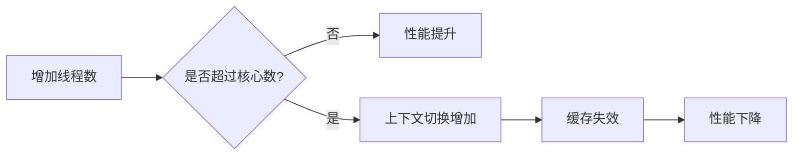
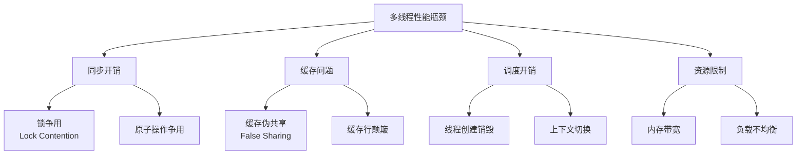
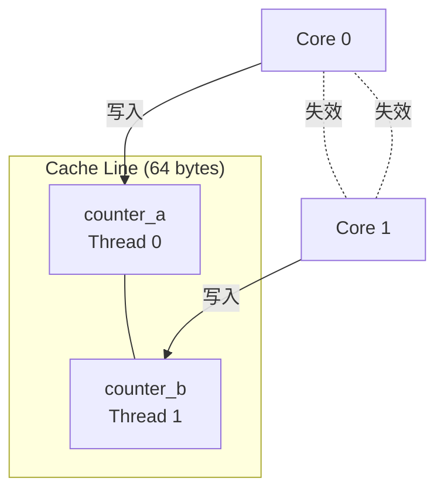
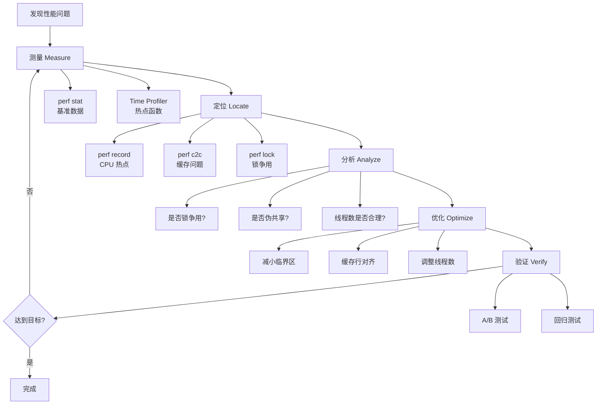

# 性能分析与调优详细解析

> **核心结论（TL;DR）**：多线程性能优化的核心不是"加线程"，而是"减开销"。锁争用、缓存伪共享、线程过多导致的上下文切换是最常见的性能瓶颈。系统化的测量→定位→分析→优化→验证流程，配合 TSan、perf、Instruments 等工具，可将并发程序性能提升 2-10 倍。

---

## 1. Why — 为什么需要多线程性能分析

**结论先行**：多线程不等于高性能。错误的并发设计可能比单线程更慢，因为同步开销会抵消并行收益。

### 1.1 线程数不是越多越好



**实测数据**（8 核 CPU，计算密集型任务）：

| 线程数 | 总耗时 | 加速比 | CPU 利用率 |
|-------|-------|-------|-----------|
| 1 | 8000 ms | 1.0x | 12.5% |
| 4 | 2100 ms | 3.8x | 50% |
| 8 | 1050 ms | 7.6x | 100% |
| 16 | 1200 ms | 6.7x | 100% |
| 32 | 1500 ms | 5.3x | 100% |

**结论**：线程数超过核心数后，性能反而下降。

### 1.2 同步开销可能抵消并行收益

```cpp
// 过度同步示例
std::mutex mtx;
std::vector<int> shared_vec;

void bad_parallel_sum() {
    #pragma omp parallel for
    for (int i = 0; i < 1000000; ++i) {
        std::lock_guard<std::mutex> lock(mtx);
        shared_vec.push_back(i);  // 每次迭代都加锁
    }
}
// 比单线程慢 10 倍！
```

**同步原语开销**：

| 操作 | 无竞争延迟 | 有竞争延迟 |
|-----|-----------|-----------|
| mutex lock/unlock | 15-25 ns | 100-500 ns |
| atomic CAS | 10-20 ns | 50-200 ns |
| 上下文切换 | - | 1-10 μs |

### 1.3 Amdahl 定律的实际意义

$$
S(n) = \frac{1}{(1-P) + \frac{P}{n}}
$$

**关键洞察**：

```
┌───────────────────────────────────────────────────────────────┐
│           Amdahl 定律：并行加速比上限                           │
├───────────────────────────────────────────────────────────────┤
│                                                               │
│  加速比                                                        │
│    20 ┤                              ·················· 95%   │
│       │                    ···········                        │
│    15 ┤              ·····                                    │
│       │         ····                                          │
│    10 ┤     ···                          ········ 90%         │
│       │   ··                     ········                     │
│     5 ┤ ··               ········                             │
│       │·         ········        ······· 75%                  │
│     0 ┼─────┬─────┬─────┬─────┬─────────────                  │
│       0     8    16    24    32   核心数                       │
│                                                               │
│  结论：5% 的串行代码将加速比限制在 20x，无论多少核心              │
└───────────────────────────────────────────────────────────────┘
```

**实际工程含义**：
- 优化串行部分比增加核心更有效
- 识别并行化瓶颈比盲目加线程更重要

---

## 2. What — 多线程性能瓶颈 MECE 分类



### 2.1 锁争用（Lock Contention）

**定义**：多个线程频繁竞争同一把锁，导致大量时间花费在等待锁上。

**症状**：
- CPU 利用率低但程序慢
- 大量线程处于 BLOCKED 状态
- perf 显示高 `futex` 调用比例

### 2.2 缓存伪共享（False Sharing）

**定义**：不同线程访问的不同变量位于同一缓存行，导致不必要的缓存失效。

```
┌─────────────────────────────────────────────────────────────┐
│                    缓存行 (64 bytes)                         │
├─────────────────────────────────────────────────────────────┤
│  [counter_a] [counter_b] [padding...                    ]   │
│      ↑           ↑                                          │
│   Thread A    Thread B                                      │
│   写入        写入                                           │
│                                                             │
│  Thread A 写入 counter_a 后，Thread B 的缓存行失效            │
│  Thread B 必须重新从内存/L3 获取整个缓存行                     │
└─────────────────────────────────────────────────────────────┘
```

### 2.3 线程创建/上下文切换开销

| 操作 | 典型耗时 | 隐藏开销 |
|-----|---------|---------|
| 线程创建 | 20-50 μs | 栈分配、内核对象 |
| 线程销毁 | 10-20 μs | 资源回收 |
| 上下文切换 | 1-10 μs | 缓存污染、TLB 刷新 |

### 2.4 内存带宽瓶颈

**典型带宽数据**：

| 来源 | 带宽 |
|-----|------|
| L1 Cache | 1-2 TB/s |
| L2 Cache | 400-800 GB/s |
| L3 Cache | 100-300 GB/s |
| 主存 DDR4 | 25-50 GB/s |
| 主存 DDR5 | 50-100 GB/s |

**当多线程同时大量访问内存时，容易成为瓶颈。**

### 2.5 负载不均衡

```
┌─────────────────────────────────────────────────────────────┐
│                   负载不均衡示意                              │
├─────────────────────────────────────────────────────────────┤
│  Thread 0: ████████████████████████████████████  100%       │
│  Thread 1: ████████████████████                   50%       │
│  Thread 2: ████████████████████████████          70%       │
│  Thread 3: ██████████                             25%       │
│                                                             │
│  总耗时取决于最慢的线程！其他线程空闲等待。                     │
└─────────────────────────────────────────────────────────────┘
```

---

## 3. How — ThreadSanitizer (TSan) 使用指南

### 3.1 编译选项

```bash
# Clang / GCC
clang++ -fsanitize=thread -g -O1 main.cpp -o program

# CMake
set(CMAKE_CXX_FLAGS "${CMAKE_CXX_FLAGS} -fsanitize=thread -g -O1")

# 注意：-O1 是推荐的优化级别
# -O0 太慢，-O2 以上可能优化掉竞争
```

### 3.2 报告格式解读

**完整 TSan 报告示例**：

```
==================
WARNING: ThreadSanitizer: data race (pid=12345)
  Write of size 4 at 0x7f8c12345678 by thread T1:
    #0 increment(int*) race.cpp:10 (program+0x123456)
    #1 worker() race.cpp:20 (program+0x234567)
    #2 void std::__invoke_impl<...> /usr/include/c++/11/bits/invoke.h:61
    #3 std::thread::_Invoker<...>::_M_invoke<0ul> /usr/include/c++/11/thread:253

  Previous write of size 4 at 0x7f8c12345678 by thread T2:
    #0 increment(int*) race.cpp:10 (program+0x123456)
    #1 worker() race.cpp:20 (program+0x234567)
    #2 void std::__invoke_impl<...> /usr/include/c++/11/bits/invoke.h:61

  Location is global 'counter' of size 4 at 0x7f8c12345678 (program+0x345678)

  Thread T1 (tid=12346, running) created by main thread at:
    #0 pthread_create (program+0x456789)
    #1 std::thread::thread<...> /usr/include/c++/11/thread:130
    #2 main() race.cpp:30 (program+0x567890)

  Thread T2 (tid=12347, running) created by main thread at:
    #0 pthread_create (program+0x456789)
    #1 std::thread::thread<...> /usr/include/c++/11/thread:130
    #2 main() race.cpp:31 (program+0x678901)

SUMMARY: ThreadSanitizer: data race race.cpp:10 in increment(int*)
==================
```

**解读要点**：
1. **Write of size 4**：写操作的大小（4 字节 = int）
2. **两个栈帧**：分别是两个冲突访问的调用栈
3. **Location**：冲突发生的变量名和地址
4. **Thread 创建信息**：帮助追踪线程来源

### 3.3 误报排除

```cpp
// 方法 1：函数级抑制
__attribute__((no_sanitize("thread")))
void false_positive_function() {
    // 已知安全但 TSan 误报的代码
}

// 方法 2：黑名单文件
// 创建 tsan_suppressions.txt
// race:false_positive_function
// 运行时指定：
// TSAN_OPTIONS="suppressions=tsan_suppressions.txt" ./program

// 方法 3：注解
#include <sanitizer/tsan_interface.h>

void custom_sync_function() {
    __tsan_acquire(&lock);
    // 临界区
    __tsan_release(&lock);
}
```

### 3.4 与 CI/CD 集成

```yaml
# .github/workflows/tsan.yml
name: ThreadSanitizer

on: [push, pull_request]

jobs:
  tsan:
    runs-on: ubuntu-22.04
    steps:
      - uses: actions/checkout@v3
      
      - name: Install dependencies
        run: sudo apt-get install -y clang-14
        
      - name: Build with TSan
        run: |
          mkdir build && cd build
          cmake -DCMAKE_CXX_COMPILER=clang++-14 \
                -DCMAKE_CXX_FLAGS="-fsanitize=thread -g -O1" ..
          make -j$(nproc)
          
      - name: Run tests with TSan
        run: |
          cd build
          TSAN_OPTIONS="halt_on_error=1:second_deadlock_stack=1" \
          ctest --output-on-failure
```

### 3.5 Android NDK TSan 使用

```bash
# 确保 NDK r21 或更高版本
export NDK=/path/to/android-ndk-r25

# 编译
$NDK/toolchains/llvm/prebuilt/linux-x86_64/bin/clang++ \
    -target aarch64-linux-android24 \
    -fsanitize=thread \
    -g -O1 \
    -o libmylib.so \
    -shared mylib.cpp

# 在设备上运行需要 TSan 运行时库
adb push $NDK/toolchains/llvm/prebuilt/linux-x86_64/lib64/clang/14.0.6/lib/linux/libclang_rt.tsan-aarch64-android.so /data/local/tmp/

# 设置环境变量运行
adb shell "LD_PRELOAD=/data/local/tmp/libclang_rt.tsan-aarch64-android.so ./program"
```

---

## 4. How — Helgrind 使用指南

### 4.1 Valgrind + Helgrind 使用方法

```bash
# 安装 Valgrind
sudo apt-get install valgrind  # Ubuntu/Debian
brew install valgrind          # macOS (有限支持)

# 编译（需要调试符号，不要使用 -fsanitize）
g++ -g -O1 -o program program.cpp -lpthread

# 运行 Helgrind
valgrind --tool=helgrind ./program

# 更详细的输出
valgrind --tool=helgrind \
    --history-level=full \
    --conflict-cache-size=10000000 \
    ./program
```

### 4.2 锁序检测

Helgrind 可以检测潜在的死锁（即使尚未发生）：

```
==12345== Thread #1: lock order "0x1234 before 0x5678" violated
==12345==    at 0x483DFAF: mutex_lock (in /usr/lib/valgrind/vgpreload_helgrind-amd64-linux.so)
==12345==    by 0x109234: thread_func_a (main.cpp:15)
==12345== 
==12345==  Required order was established by acquisition of lock at 0x1234
==12345==    at 0x483DFAF: mutex_lock (in /usr/lib/valgrind/vgpreload_helgrind-amd64-linux.so)
==12345==    by 0x109345: thread_func_b (main.cpp:25)
==12345==  followed by a later acquisition of lock at 0x5678
==12345==    at 0x483DFAF: mutex_lock (in /usr/lib/valgrind/vgpreload_helgrind-amd64-linux.so)
==12345==    by 0x109456: thread_func_b (main.cpp:26)
```

### 4.3 与 TSan 的对比

| 特性 | TSan | Helgrind |
|-----|------|----------|
| **性能开销** | 5-15x | 20-50x |
| **内存开销** | 5-10x | 5-10x |
| **检测能力** | 数据竞争 | 数据竞争 + 锁序 |
| **误报率** | 低 | 较低 |
| **支持语言** | C/C++/Go | C/C++ |
| **平台支持** | Linux/macOS/Windows | Linux/macOS |
| **推荐场景** | 日常开发、CI | 深度分析 |

---

## 5. How — Instruments Thread Checker（iOS/macOS）

### 5.1 Thread Checker 工具使用

1. 在 Xcode 中打开项目
2. Product → Profile（⌘I）
3. 选择 "Thread Checker" 模板
4. 点击 Record 运行应用
5. 复现多线程问题
6. 停止录制，分析结果

**Thread Checker 可检测**：
- 主线程 UI 访问问题
- 数据竞争
- Swift 并发问题

### 5.2 Time Profiler 线程视图

```
┌─────────────────────────────────────────────────────────────┐
│ Time Profiler - Thread States                                │
├─────────────────────────────────────────────────────────────┤
│ Main Thread      [████████░░░░████████████████░░░░░░]       │
│                     Running   Blocked      Running          │
│                                                             │
│ Worker Thread 1  [░░░░████████████████████████████░░]       │
│                   Wait    Running                   Done    │
│                                                             │
│ Worker Thread 2  [░░░░░░████████░░░░████████████░░░░]       │
│                    Wait  Running Wait  Running     Done     │
└─────────────────────────────────────────────────────────────┘
```

### 5.3 System Trace 线程分析

1. 打开 Instruments
2. 选择 "System Trace" 模板
3. 配置追踪选项：
   - Thread States
   - System Calls
   - Scheduling
4. 录制并分析

**重要指标**：
- **Context Switches**：上下文切换次数
- **Thread Preemptions**：线程被抢占次数
- **Priority Inversions**：优先级反转次数

### 5.4 线程状态可视化

| 状态 | 颜色 | 含义 |
|-----|------|-----|
| **Running** | 绿色 | 正在 CPU 上执行 |
| **Runnable** | 黄色 | 就绪但等待 CPU |
| **Blocked** | 红色 | 等待资源（锁、I/O） |
| **Preempted** | 橙色 | 被更高优先级抢占 |
| **Interrupted** | 紫色 | 被中断打断 |

---

## 6. How — perf/ftrace 线程分析（Android/Linux）

### 6.1 perf stat / perf record 线程级分析

```bash
# 基础统计
perf stat -e task-clock,context-switches,cpu-migrations,page-faults \
    -p <pid> -- sleep 10

# 示例输出：
#  Performance counter stats for process id '12345':
#
#      15,234.56 msec task-clock            #    1.523 CPUs utilized
#         12,345      context-switches      #  810.234 /sec
#            567      cpu-migrations        #   37.234 /sec
#          8,901      page-faults           #  584.567 /sec
#
#       10.000123456 seconds time elapsed

# 按线程统计
perf record -e cycles -p <pid> -g --per-thread -- sleep 10
perf report --sort=tid,symbol

# 锁争用分析
perf record -e sched:sched_switch -p <pid> -- sleep 10
perf script | grep -E "futex|mutex"
```

### 6.2 ftrace 调度事件追踪

```bash
# 启用调度追踪
echo 1 > /sys/kernel/debug/tracing/events/sched/sched_switch/enable
echo 1 > /sys/kernel/debug/tracing/events/sched/sched_wakeup/enable

# 设置过滤（可选）
echo "prev_comm ~ 'my_app*'" > /sys/kernel/debug/tracing/events/sched/sched_switch/filter

# 开始追踪
echo 1 > /sys/kernel/debug/tracing/tracing_on

# 运行测试...

# 停止追踪
echo 0 > /sys/kernel/debug/tracing/tracing_on

# 获取结果
cat /sys/kernel/debug/tracing/trace > sched_trace.txt
```

### 6.3 systrace / Perfetto 线程可视化

```bash
# Android systrace
python $ANDROID_HOME/platform-tools/systrace/systrace.py \
    --time=10 \
    -o trace.html \
    sched freq idle am wm gfx view

# Perfetto（推荐）
cat > /tmp/perfetto_config.txt << EOF
buffers {
    size_kb: 65536
    fill_policy: RING_BUFFER
}
data_sources {
    config {
        name: "linux.ftrace"
        ftrace_config {
            ftrace_events: "sched/sched_switch"
            ftrace_events: "sched/sched_waking"
            ftrace_events: "sched/sched_blocked_reason"
            ftrace_events: "power/cpu_frequency"
        }
    }
}
duration_ms: 10000
EOF

adb shell perfetto -c - --txt -o /data/misc/perfetto-traces/trace < /tmp/perfetto_config.txt
adb pull /data/misc/perfetto-traces/trace trace.perfetto

# 在 https://ui.perfetto.dev 打开分析
```

### 6.4 锁争用热点分析

```bash
# perf lock 分析
perf lock record -p <pid> -- sleep 10
perf lock report

# 输出示例：
#                  Name   acquired  contended   avg wait (ns)   total wait (ns)
# ----------------------------------------------------------------
#        &obj->mutex       125000      15000            5000          75000000
#        global_lock        80000      25000           12000         300000000
```

---

## 7. How — 锁争用分析与优化

### 7.1 锁争用检测方法

```cpp
// 方法 1：封装锁，记录争用时间
class InstrumentedMutex {
    std::mutex mtx;
    std::atomic<uint64_t> contention_count{0};
    std::atomic<uint64_t> total_wait_ns{0};
    
public:
    void lock() {
        auto start = std::chrono::high_resolution_clock::now();
        
        if (!mtx.try_lock()) {
            contention_count.fetch_add(1, std::memory_order_relaxed);
            mtx.lock();
        }
        
        auto end = std::chrono::high_resolution_clock::now();
        auto wait = std::chrono::duration_cast<std::chrono::nanoseconds>(end - start);
        total_wait_ns.fetch_add(wait.count(), std::memory_order_relaxed);
    }
    
    void unlock() { mtx.unlock(); }
    
    void report() {
        printf("Contentions: %llu, Total wait: %llu ns\n",
               contention_count.load(), total_wait_ns.load());
    }
};
```

### 7.2 热点锁定位

```bash
# 使用 perf 定位热点
perf record -e cycles:u -g -- ./program
perf report --sort=symbol

# 查找 mutex 相关符号
perf report | grep -E "mutex|lock|futex"
```

### 7.3 优化策略

#### 策略 1：减小临界区

```cpp
// 优化前：临界区包含非必要操作
void process_bad(Data& data) {
    std::lock_guard<std::mutex> lock(mtx);
    auto result = expensive_computation(data);  // 不需要锁保护
    shared_result = result;  // 只有这行需要保护
}

// 优化后：最小化临界区
void process_good(Data& data) {
    auto result = expensive_computation(data);  // 锁外计算
    
    std::lock_guard<std::mutex> lock(mtx);
    shared_result = result;  // 只保护必要部分
}
```

#### 策略 2：锁分离

```cpp
// 优化前：全局大锁
class BadCache {
    std::mutex mtx;
    std::unordered_map<int, Data> cache;
    
public:
    Data get(int key) {
        std::lock_guard<std::mutex> lock(mtx);
        return cache[key];
    }
};

// 优化后：分段锁
class GoodCache {
    static constexpr int NUM_SHARDS = 16;
    
    struct Shard {
        std::mutex mtx;
        std::unordered_map<int, Data> data;
    };
    
    std::array<Shard, NUM_SHARDS> shards;
    
    Shard& get_shard(int key) {
        return shards[std::hash<int>{}(key) % NUM_SHARDS];
    }
    
public:
    Data get(int key) {
        auto& shard = get_shard(key);
        std::lock_guard<std::mutex> lock(shard.mtx);
        return shard.data[key];
    }
};
```

#### 策略 3：读写锁

```cpp
// 适用于读多写少场景
class ReadHeavyData {
    std::shared_mutex mtx;
    std::vector<int> data;
    
public:
    int read(size_t index) {
        std::shared_lock<std::shared_mutex> lock(mtx);  // 共享锁
        return data[index];
    }
    
    void write(size_t index, int value) {
        std::unique_lock<std::shared_mutex> lock(mtx);  // 独占锁
        data[index] = value;
    }
};
```

#### 策略 4：无锁替换

```cpp
// 用原子操作替换锁
class Counter {
    // 有锁版本
    // std::mutex mtx;
    // int value = 0;
    
    // 无锁版本
    std::atomic<int> value{0};
    
public:
    void increment() {
        value.fetch_add(1, std::memory_order_relaxed);
    }
    
    int get() {
        return value.load(std::memory_order_relaxed);
    }
};
```

### 7.4 优化前后性能对比（Case Study）

**场景**：高并发计数器，8 线程，每线程 1000 万次操作

| 实现方式 | 总耗时 | 吞吐量 |
|---------|-------|--------|
| 全局 mutex | 3200 ms | 25M ops/s |
| 分段锁 (16段) | 420 ms | 190M ops/s |
| 原子操作 | 180 ms | 444M ops/s |
| 线程局部 + 合并 | 85 ms | 941M ops/s |

---

## 8. How — 缓存伪共享检测与消除

### 8.1 什么是伪共享



**问题**：两个独立变量共享缓存行，一个核心写入导致另一个核心缓存失效。

### 8.2 检测方法

#### perf c2c 检测

```bash
# Linux perf c2c (Cache-to-Cache)
perf c2c record -p <pid> -- sleep 10
perf c2c report

# 输出示例：
# =================================================
#            Shared Data Cache Line Table
# =================================================
# Index  Total  Rmt   Lcl  Rmt Hitm  Lcl Hitm   Symbol
#     0  15234  8234  7000     5234      2000   counter_array
```

#### perf stat cache-misses

```bash
perf stat -e cache-misses,cache-references,L1-dcache-load-misses \
    -p <pid> -- sleep 10

# 高 cache-miss 率可能指示伪共享
```

### 8.3 消除方法

#### 方法 1：alignas(64) 对齐

```cpp
// 伪共享问题
struct BadCounters {
    int counter_a;  // Thread 0
    int counter_b;  // Thread 1
    // 两者在同一缓存行！
};

// 修复：强制对齐
struct GoodCounters {
    alignas(64) int counter_a;
    alignas(64) int counter_b;
};

static_assert(sizeof(GoodCounters) >= 128, "Counters should be in different cache lines");
```

#### 方法 2：手动 padding

```cpp
struct PaddedCounter {
    int value;
    char padding[64 - sizeof(int)];  // 填充到缓存行大小
};

struct Counters {
    PaddedCounter counter_a;
    PaddedCounter counter_b;
};
```

#### 方法 3：std::hardware_destructive_interference_size (C++17)

```cpp
#include <new>

struct AlignedCounter {
    alignas(std::hardware_destructive_interference_size) int value;
};

// 典型值：
// x86-64: 64 bytes
// ARM64: 64 或 128 bytes（取决于 CPU）
```

### 8.4 优化前后性能对比

**场景**：4 线程，每线程独立计数器，1 亿次操作

| 实现方式 | 总耗时 | Cache Miss 率 |
|---------|-------|---------------|
| 紧凑数组 | 2800 ms | 45% |
| alignas(64) | 280 ms | 0.5% |

**性能提升：10 倍！**

---

## 9. How — 线程数量调优

### 9.1 CPU 密集型：线程数 = 核心数

```cpp
unsigned int optimal_threads_cpu_bound() {
    return std::thread::hardware_concurrency();
}

// 典型值：
// 8 核 CPU → 8 线程
// 超线程 8 核 → 16 线程（但效果因任务而异）
```

### 9.2 I/O 密集型公式

$$
线程数 = 核心数 \times (1 + \frac{I/O等待时间}{CPU时间})
$$

```cpp
// 假设 I/O 等待时间是 CPU 时间的 4 倍
unsigned int optimal_threads_io_bound() {
    unsigned int cores = std::thread::hardware_concurrency();
    double io_wait_ratio = 4.0;  // 根据实际测量调整
    return static_cast<unsigned int>(cores * (1 + io_wait_ratio));
}

// 8 核 CPU，I/O 等待 4 倍 → 40 线程
```

### 9.3 混合型：分池策略

```cpp
class HybridThreadPool {
    // CPU 密集型任务池
    ThreadPool cpu_pool{std::thread::hardware_concurrency()};
    
    // I/O 密集型任务池
    ThreadPool io_pool{std::thread::hardware_concurrency() * 4};
    
public:
    template<typename F>
    void submit_cpu_task(F&& task) {
        cpu_pool.submit(std::forward<F>(task));
    }
    
    template<typename F>
    void submit_io_task(F&& task) {
        io_pool.submit(std::forward<F>(task));
    }
};
```

### 9.4 实验验证方法

```cpp
void benchmark_thread_count() {
    std::vector<int> thread_counts = {1, 2, 4, 8, 16, 32, 64};
    
    for (int count : thread_counts) {
        auto start = std::chrono::high_resolution_clock::now();
        
        run_workload(count);
        
        auto end = std::chrono::high_resolution_clock::now();
        auto ms = std::chrono::duration_cast<std::chrono::milliseconds>(end - start);
        
        printf("Threads: %2d, Time: %6lld ms, Throughput: %.2f ops/s\n",
               count, ms.count(), 
               static_cast<double>(TOTAL_OPS) / ms.count() * 1000);
    }
}
```

### 9.5 移动端特殊考虑

#### 大小核架构

```cpp
// Android: 获取大小核信息
int get_big_core_count() {
    // 读取 /sys/devices/system/cpu/cpu*/cpufreq/cpuinfo_max_freq
    // 高频核心 = 大核
    int big_cores = 0;
    for (int i = 0; i < sysconf(_SC_NPROCESSORS_CONF); ++i) {
        char path[128];
        snprintf(path, sizeof(path), 
                 "/sys/devices/system/cpu/cpu%d/cpufreq/cpuinfo_max_freq", i);
        
        FILE* f = fopen(path, "r");
        if (f) {
            int freq;
            fscanf(f, "%d", &freq);
            fclose(f);
            if (freq > 2000000) ++big_cores;  // > 2GHz 视为大核
        }
    }
    return big_cores;
}

// 策略：CPU 密集型任务只用大核
void set_thread_affinity_big_cores(pthread_t thread) {
    cpu_set_t cpuset;
    CPU_ZERO(&cpuset);
    
    // 假设 CPU 4-7 是大核
    for (int i = 4; i < 8; ++i) {
        CPU_SET(i, &cpuset);
    }
    
    pthread_setaffinity_np(thread, sizeof(cpuset), &cpuset);
}
```

#### 功耗限制

```cpp
// 功耗敏感场景：限制并发度
class PowerAwareThreadPool {
    std::atomic<bool> low_power_mode{false};
    int max_threads;
    int low_power_threads;
    
public:
    PowerAwareThreadPool(int max, int low_power)
        : max_threads(max), low_power_threads(low_power) {}
    
    void set_low_power_mode(bool enable) {
        low_power_mode.store(enable, std::memory_order_release);
        // 动态调整活跃线程数
    }
    
    int active_thread_count() {
        return low_power_mode.load(std::memory_order_acquire)
               ? low_power_threads
               : max_threads;
    }
};
```

---

## 10. 性能调优工作流

### 10.1 完整调优流程图



### 10.2 各阶段使用的工具

| 阶段 | 目标 | 推荐工具 |
|-----|------|---------|
| **测量** | 获取基准数据 | perf stat, time, Instruments |
| **定位** | 找到热点 | perf record, Time Profiler |
| **分析** | 理解瓶颈原因 | perf c2c, perf lock, TSan |
| **优化** | 实施改进 | 代码修改、架构调整 |
| **验证** | 确认效果 | 基准测试、回归测试 |

### 10.3 调优清单

**性能分析前**：
- [ ] 确认编译优化级别（Release build）
- [ ] 禁用调试宏和断言
- [ ] 准备代表性测试数据
- [ ] 建立性能基准

**锁相关**：
- [ ] 临界区是否最小化？
- [ ] 是否可以用读写锁？
- [ ] 是否可以用分段锁？
- [ ] 是否可以用无锁结构？

**缓存相关**：
- [ ] 热点数据是否对齐缓存行？
- [ ] 是否存在伪共享？
- [ ] 访问模式是否缓存友好？

**线程相关**：
- [ ] 线程数是否与核心数匹配？
- [ ] 是否存在负载不均衡？
- [ ] 是否过多上下文切换？

---

## 11. 常见问题与最佳实践

### 11.1 常见问题

#### Q1：加了更多线程为什么更慢？

**可能原因**：
1. 线程数超过核心数，上下文切换开销
2. 锁争用加剧
3. 缓存伪共享
4. 内存带宽瓶颈

**排查方法**：
```bash
# 检查上下文切换
perf stat -e context-switches ./program

# 检查 CPU 利用率分布
top -H -p <pid>
```

#### Q2：TSan 报告太多如何处理？

**优先级排序**：
1. 先修复 `data race`（最危险）
2. 再处理 `lock-order-inversion`（潜在死锁）
3. 最后处理警告级别问题

**批量抑制已知安全的代码**：
```
# tsan_suppressions.txt
race:third_party/*
race:legacy_code.cpp
```

#### Q3：如何判断是 CPU bound 还是 I/O bound？

```bash
# 方法 1：观察 CPU 利用率
top -p <pid>
# CPU 利用率 ~100%：CPU bound
# CPU 利用率低但程序慢：I/O bound

# 方法 2：perf stat
perf stat -e cycles,instructions,cache-misses ./program
# IPC (instructions/cycle) 低：可能是内存/I/O bound
```

### 11.2 最佳实践总结

| 实践 | 原因 |
|-----|------|
| **先测量后优化** | 避免过早优化和优化错误位置 |
| **一次只改一处** | 便于验证效果和定位问题 |
| **保持基准测试** | 防止性能回归 |
| **CI 集成 TSan** | 早期发现并发问题 |
| **文档化线程模型** | 便于维护和审查 |
| **优先无锁设计** | 避免锁相关的复杂问题 |
| **注意移动端特性** | 考虑大小核、功耗限制 |

### 11.3 性能数据参考

**常见操作延迟基准（现代 x86-64 CPU）**：

| 操作 | 延迟 |
|-----|------|
| L1 缓存命中 | 1 ns |
| L2 缓存命中 | 3-4 ns |
| L3 缓存命中 | 10-12 ns |
| 主存访问 | 60-100 ns |
| mutex lock（无竞争） | 15-25 ns |
| mutex lock（有竞争） | 100-500 ns |
| atomic CAS | 10-20 ns |
| 线程创建 | 20-50 μs |
| 上下文切换 | 1-10 μs |

---

## 参考资源

- **工具文档**：
  - [perf wiki](https://perf.wiki.kernel.org/)
  - [Instruments User Guide](https://help.apple.com/instruments/)
  - [Perfetto Documentation](https://perfetto.dev/docs/)

- **书籍**：
  - Scott Meyers - *Effective Modern C++* (并发章节)
  - Anthony Williams - *C++ Concurrency in Action*

- **在线资源**：
  - [What Every Programmer Should Know About Memory](https://people.freebsd.org/~lstewart/articles/cpumemory.pdf)
  - [CppCon 并发编程演讲](https://www.youtube.com/results?search_query=cppcon+concurrency)
