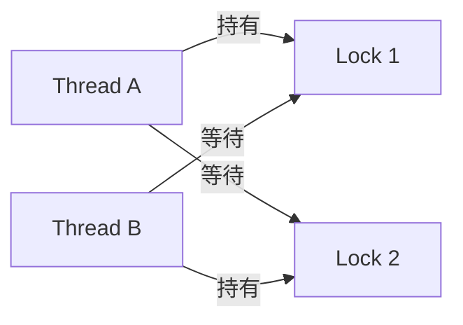
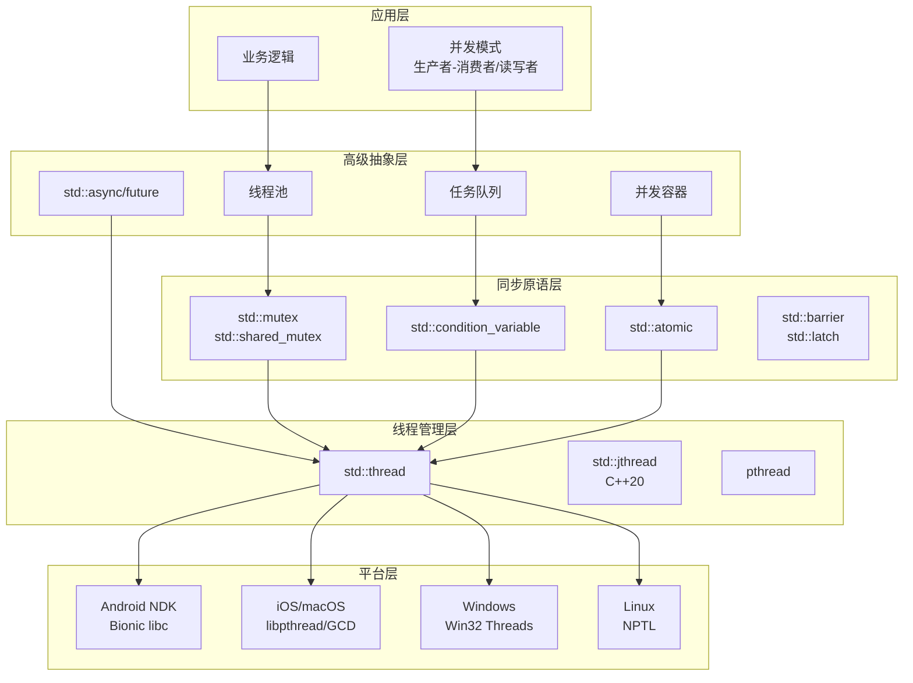
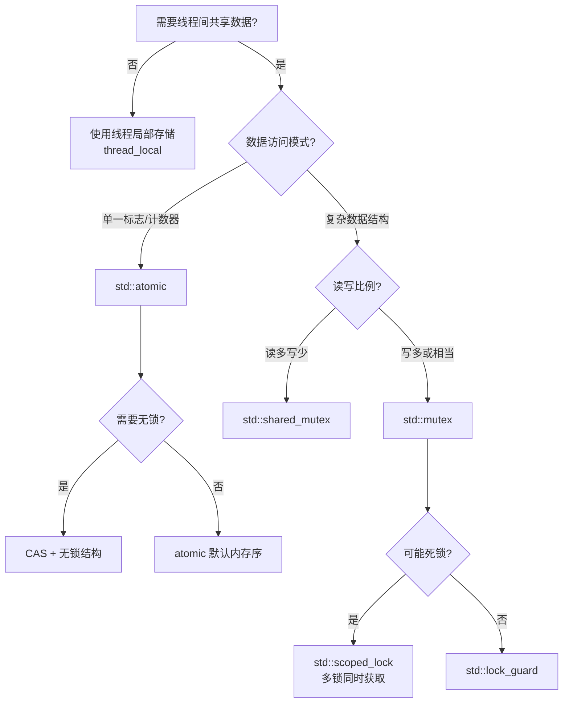

# C++ 多线程编程深度解析

> 系统性梳理 C++ 多线程核心概念、同步机制、无锁编程与跨平台工程实践

---

## 核心结论（TL;DR）

**高性能多线程编程的核心目标是：在充分利用多核 CPU 并行计算能力的同时，确保数据一致性与程序正确性，并最小化线程间同步开销。**

现代 C++ 多线程技术基于以下关键支柱：

1. **内存模型（Memory Model）**：C++11 定义的多线程内存访问规则，决定操作的可见性与有序性，是并发编程正确性的理论基础
2. **同步原语（Synchronization Primitives）**：mutex、condition_variable、atomic 等工具，用于协调线程间的访问顺序与数据共享
3. **无锁编程（Lock-Free Programming）**：通过原子操作实现高性能并发数据结构，避免锁的开销与死锁风险
4. **线程池与任务调度（Thread Pool & Task Scheduling）**：复用线程资源，降低创建销毁开销，实现高效任务分发

**一句话理解多线程**：多线程不是让代码"跑得更快"，而是让代码"同时做更多事"——关键在于**如何安全地共享数据**和**如何高效地分配任务**。

---

## 文章导航

本文采用金字塔结构组织，主文章提供全景视图，子文件深入关键概念：

### 线程基础与内存模型

- [C++线程库与线程管理_详细解析](./01_线程基础与内存模型/C++线程库与线程管理_详细解析.md) - std::thread、线程状态、joinable/detach、线程属性
- [内存模型与原子操作_详细解析](./01_线程基础与内存模型/内存模型与原子操作_详细解析.md) - happens-before、memory_order、acquire-release 语义

### 同步机制与锁优化

- [互斥锁与读写锁_详细解析](./02_同步机制与锁优化/互斥锁与读写锁_详细解析.md) - mutex 家族、lock_guard/unique_lock/scoped_lock、死锁避免
- [条件变量与同步模式_详细解析](./02_同步机制与锁优化/条件变量与同步模式_详细解析.md) - condition_variable、spurious wakeup、counting_semaphore

### 无锁编程与高性能并发

- [无锁数据结构_详细解析](./03_无锁编程与高性能并发/无锁数据结构_详细解析.md) - lock-free queue/stack、hazard pointer、RCU
- [并发设计模式_详细解析](./03_无锁编程与高性能并发/并发设计模式_详细解析.md) - std::atomic、compare_exchange、ABA 问题

### 线程池与任务调度

- [线程池设计与实现_详细解析](./04_线程池与任务调度/线程池设计与实现_详细解析.md) - 工作窃取、任务队列、动态伸缩、std::future/promise、异步编程

### 跨平台多线程实践

- [Android_NDK多线程_详细解析](./05_跨平台多线程实践/Android_NDK多线程_详细解析.md) - NDK 线程、JNI 回调、Looper/Handler 协作
- [iOS多线程_详细解析](./05_跨平台多线程实践/iOS多线程_详细解析.md) - GCD、dispatch_queue、pthread 与 C++ 互操作

### 工程应用实战

- [音视频多线程架构_详细解析](./06_工程应用实战/音视频多线程架构_详细解析.md) - 采集/编码/传输流水线、帧同步策略
- [图像处理并行化_详细解析](./06_工程应用实战/图像处理并行化_详细解析.md) - 图像处理多线程、并行算法、任务分解
- [网络通信多线程模型_详细解析](./06_工程应用实战/网络通信多线程模型_详细解析.md) - Reactor/Proactor、IO 多路复用、线程模型

### 调试测试与性能分析

- [多线程Bug排查_详细解析](./07_调试测试与性能分析/多线程Bug排查_详细解析.md) - TSan、死锁检测、race condition 定位
- [性能分析与调优_详细解析](./07_调试测试与性能分析/性能分析与调优_详细解析.md) - 伪共享、锁竞争分析、CPU 亲和性

---

## 第一部分：为什么需要多线程

### 1.1 多核时代的性能需求

CPU 单核性能提升已遇到物理极限（功耗墙、散热、量子隧穿效应），摩尔定律从"频率翻倍"转向"核心数翻倍"。

**典型设备的 CPU 核心数**：

| 设备类型 | 核心数 | 典型场景 |
|---------|-------|---------|
| 旗舰手机（Snapdragon 8 Gen3） | 8 核 | 1+5+2 大中小核架构 |
| 桌面 PC（i9-14900K） | 24 核 | 8P+16E 混合架构 |
| 服务器（EPYC 9654） | 96 核 | 高密度计算 |

**如果程序只使用单线程，意味着 87.5%~99% 的 CPU 资源被浪费。**

### 1.2 移动端实时处理需求

音视频、图像处理等实时场景对延迟极为敏感：

```
┌─────────────────────────────────────────────────────────────┐
│           视频通话端到端延迟预算（目标 < 150ms）               │
├─────────────────────────────────────────────────────────────┤
│  采集 │ 编码 │ 网络传输 │ 解码 │ 渲染                        │
│  16ms │ 20ms│  50-80ms │ 15ms │ 16ms                        │
│   ↓      ↓       ↓        ↓      ↓                          │
│  Camera │ Encoder │ Network │ Decoder │ Display             │
│  Thread │ Thread  │ Thread  │ Thread  │ Thread              │
└─────────────────────────────────────────────────────────────┘
```

**流水线并行**：各阶段在不同线程中同时执行，总延迟 ≈ 最长单阶段延迟 + 同步开销，而非各阶段之和。

### 1.3 Amdahl 定律：并行化的天花板

Amdahl 定律揭示了并行加速的理论上限：

$$
S(n) = \frac{1}{(1-P) + \frac{P}{n}}
$$

其中：
- $S(n)$：n 核并行时的加速比
- $P$：可并行化的代码比例
- $n$：处理器核心数

**关键洞察**：

| 可并行比例 P | 4 核加速比 | 8 核加速比 | 无限核加速比 |
|-------------|-----------|-----------|-------------|
| 50% | 1.6x | 1.78x | 2x |
| 75% | 2.29x | 2.91x | 4x |
| 90% | 3.08x | 4.71x | 10x |
| 95% | 3.48x | 5.93x | 20x |
| 99% | 3.88x | 7.02x | 100x |

**结论**：串行部分是并行性能的瓶颈。10% 的串行代码会将加速比限制在 10x 以内，无论有多少核心。

---

## 第二部分：多线程核心挑战

### 2.1 竞态条件（Race Condition）

**定义**：多个线程同时访问共享数据，且至少有一个是写操作，最终结果依赖于执行顺序。

```cpp
// 经典竞态条件示例
int counter = 0;

void increment() {
    for (int i = 0; i < 100000; ++i) {
        counter++;  // 非原子操作：读-改-写
    }
}

// 两个线程各执行 increment()
// 预期结果：200000
// 实际结果：可能是 100000 ~ 200000 之间的任意值
```

**根因分析**：`counter++` 在汇编层面是三条指令：

```asm
mov eax, [counter]   ; 1. 读取
add eax, 1           ; 2. 修改
mov [counter], eax   ; 3. 写回
```

两个线程的指令可能交错执行，导致更新丢失。

### 2.2 死锁（Deadlock）

**定义**：两个或多个线程相互等待对方持有的资源，导致所有线程永久阻塞。



**死锁四个必要条件（Coffman 条件）**：

| 条件 | 描述 | 打破方法 |
|-----|------|---------|
| **互斥** | 资源一次只能被一个线程持有 | 使用无锁结构 |
| **持有并等待** | 持有资源的同时等待其他资源 | 一次性获取所有资源 |
| **不可剥夺** | 已获取的资源不能被强制释放 | 使用 try_lock |
| **循环等待** | 形成环形等待链 | 按固定顺序加锁 |

### 2.3 数据竞争（Data Race）

**定义**：C++ 标准中的未定义行为（UB），发生在两个线程并发访问同一内存位置，且至少一个是写操作，且没有同步。

**数据竞争 vs 竞态条件**：

| 概念 | 性质 | 后果 |
|-----|------|-----|
| **数据竞争** | C++ 标准定义的 UB | 程序行为完全不可预测 |
| **竞态条件** | 逻辑错误 | 结果不符合预期但程序仍"运行" |

### 2.4 缓存一致性与伪共享

**缓存一致性问题**：多核 CPU 各有独立缓存，同一数据可能存在多份副本。

```
┌─────────────────────────────────────────────────────────────┐
│                    多核缓存架构                              │
├─────────────────────────────────────────────────────────────┤
│   Core 0          Core 1          Core 2          Core 3    │
│   ┌─────┐        ┌─────┐        ┌─────┐        ┌─────┐     │
│   │ L1d │        │ L1d │        │ L1d │        │ L1d │     │
│   └──┬──┘        └──┬──┘        └──┬──┘        └──┬──┘     │
│      │              │              │              │         │
│   ┌──┴──┐        ┌──┴──┐        ┌──┴──┐        ┌──┴──┐     │
│   │ L2  │        │ L2  │        │ L2  │        │ L2  │     │
│   └──┬──┘        └──┬──┘        └──┬──┘        └──┬──┘     │
│      └──────────────┴──────────────┴──────────────┘         │
│                          │                                   │
│                     ┌────┴────┐                              │
│                     │   L3    │  (共享)                      │
│                     └────┬────┘                              │
│                          │                                   │
│                     ┌────┴────┐                              │
│                     │  内存    │                              │
│                     └─────────┘                              │
└─────────────────────────────────────────────────────────────┘
```

**MESI 协议**：维护缓存一致性的经典协议

| 状态 | 含义 | 读操作 | 写操作 |
|-----|------|-------|-------|
| **M (Modified)** | 已修改，与内存不一致 | 直接读 | 直接写 |
| **E (Exclusive)** | 独占，与内存一致 | 直接读 | 转为 M |
| **S (Shared)** | 共享，多核持有相同副本 | 直接读 | 需广播无效化 |
| **I (Invalid)** | 无效 | 需从其他核/内存获取 | 需从其他核/内存获取 |

**伪共享（False Sharing）**：不同线程访问的不同变量恰好位于同一缓存行（64字节），导致不必要的缓存失效。

```cpp
// 伪共享示例
struct BadCounter {
    int count1;  // 线程 1 频繁写
    int count2;  // 线程 2 频繁写
    // 两者在同一缓存行，互相干扰
};

// 解决方案：缓存行填充
struct GoodCounter {
    alignas(64) int count1;
    alignas(64) int count2;
};
```

### 2.5 内存可见性（Memory Visibility）

**问题**：一个线程的写操作何时对另一个线程可见？

```cpp
int data = 0;
bool ready = false;

// Thread A
void writer() {
    data = 42;        // (1)
    ready = true;     // (2)
}

// Thread B
void reader() {
    while (!ready);   // (3)
    assert(data == 42);  // (4) 可能失败！
}
```

**为什么可能失败？**
1. **编译器重排**：编译器可能将 (1)(2) 重排为 (2)(1)
2. **CPU 重排**：CPU 乱序执行可能先完成 (2)
3. **存储缓冲区**：写操作可能暂存在 Store Buffer，尚未刷新到缓存

**解决方案**：使用 `std::atomic` 配合适当的内存序。

---

## 第三部分：C++ 多线程技术体系总览



### 3.1 同步原语性能开销

| 原语 | 无竞争延迟 | 有竞争延迟 | 适用场景 |
|-----|-----------|-----------|---------|
| **std::mutex** | 15-25 ns | 100-500 ns | 通用互斥 |
| **std::shared_mutex** | 20-40 ns | 80-200 ns (读) | 读多写少 |
| **std::atomic (load/store)** | 1-5 ns | 20-100 ns | 简单标志/计数器 |
| **std::atomic (CAS)** | 10-20 ns | 50-200 ns | 无锁结构 |
| **std::condition_variable** | 50-100 ns | 1-10 μs | 等待/通知 |
| **std::counting_semaphore** | 20-40 ns | 100-300 ns | 资源计数 |

### 3.2 C++ 标准演进中的多线程支持

| 标准 | 新增特性 |
|-----|---------|
| **C++11** | thread, mutex, condition_variable, atomic, future/promise |
| **C++14** | shared_timed_mutex, 泛型 lambda 捕获 |
| **C++17** | shared_mutex, scoped_lock, 并行算法 |
| **C++20** | jthread, stop_token, latch, barrier, semaphore, atomic_ref |
| **C++23** | atomic_flag::test, hazard_pointer (提案中) |

---

## 第四部分：各子主题核心结论

| 主题 | 核心结论 |
|-----|---------|
| **线程生命周期** | 线程创建开销约 20-50 μs，应使用线程池复用；jthread 自动 join 更安全 |
| **C++ 内存模型** | 默认使用 `memory_order_seq_cst`，只在性能关键路径考虑弱内存序 |
| **互斥量与锁** | 优先使用 `scoped_lock` 避免死锁；临界区应尽可能短 |
| **条件变量** | 必须在循环中检查条件，防范虚假唤醒；notify 前可以释放锁 |
| **原子操作** | atomic 保证原子性和可见性，但不保证不会产生竞态条件 |
| **无锁数据结构** | 复杂度高、调试困难，只在性能关键路径且充分测试后使用 |
| **线程池** | 线程数通常设为 CPU 核心数；I/O 密集型可适当增加 |
| **异步编程** | `std::async` 默认可能使用延迟执行，明确指定 `launch::async` |
| **Android NDK** | JNI 回调必须在主线程或 AttachCurrentThread 后的线程执行 |
| **iOS GCD** | dispatch_queue 是轻量级任务调度的首选，避免过度使用 pthread |
| **音视频架构** | 采集/编码/传输/解码/渲染应使用独立线程，通过队列解耦 |
| **调试工具** | TSan 是检测数据竞争的必备工具，CI 中应常态化启用 |

---

## 第五部分：跨平台差异速览

### Android vs iOS 多线程关键差异

| 特性 | Android (NDK) | iOS |
|-----|--------------|-----|
| **线程库** | Bionic libc (pthread 兼容) | libpthread / GCD |
| **推荐方式** | std::thread + JNI | GCD dispatch_queue |
| **主线程** | UI 线程，不可阻塞 | Main Thread，不可阻塞 |
| **后台限制** | Doze 模式限制后台活动 | 后台任务有严格时间限制 |
| **线程优先级** | SCHED_FIFO/RR, nice 值 | QoS (Quality of Service) 类 |
| **线程命名** | pthread_setname_np | pthread_setname_np |
| **JNI 约束** | 非 Java 线程需 AttachCurrentThread | 无此问题 |
| **定时器** | timerfd / AlarmManager | dispatch_source / NSTimer |

### 优先级设置对比

```cpp
// Android NDK
#include <pthread.h>
#include <sched.h>

void set_android_priority(pthread_t thread, int priority) {
    struct sched_param param;
    param.sched_priority = priority;
    pthread_setschedparam(thread, SCHED_FIFO, &param);
}

// iOS/macOS
#include <dispatch/dispatch.h>

void submit_with_qos() {
    dispatch_queue_attr_t attr = dispatch_queue_attr_make_with_qos_class(
        DISPATCH_QUEUE_SERIAL,
        QOS_CLASS_USER_INTERACTIVE,  // 最高优先级
        0
    );
    dispatch_queue_t queue = dispatch_queue_create("com.example.high", attr);
    dispatch_async(queue, ^{
        // 高优先级任务
    });
}
```

---

## 第六部分：性能数据总览

### 6.1 各操作延迟基准（x86-64, 3.5GHz）

| 操作 | 延迟 | 说明 |
|-----|------|-----|
| L1 Cache 命中 | 1 ns | ~4 cycles |
| L2 Cache 命中 | 3-4 ns | ~12 cycles |
| L3 Cache 命中 | 10-12 ns | ~40 cycles |
| 主存访问 | 60-100 ns | ~200+ cycles |
| **mutex lock (无竞争)** | 15-25 ns | 用户态 futex |
| **mutex lock (有竞争)** | 100-500 ns | 可能涉及内核态 |
| **atomic load (seq_cst)** | 1-5 ns | 内存屏障开销 |
| **atomic CAS (无竞争)** | 10-20 ns | lock cmpxchg |
| **atomic CAS (有竞争)** | 50-200 ns | 缓存行争用 |
| **线程创建** | 20-50 μs | 包括栈分配 |
| **上下文切换** | 1-10 μs | 取决于 Cache 污染 |
| **系统调用 (getpid)** | 50-100 ns | 最轻量级 |
| **系统调用 (read)** | 200-500 ns | 无数据时 |

### 6.2 内存序性能对比

```cpp
std::atomic<int> x{0};

// 不同内存序的性能（单位：ns，x86-64）
// relaxed:     1-2 ns    无屏障
// acquire:     2-5 ns    load 屏障
// release:     2-5 ns    store 屏障
// acq_rel:     3-6 ns    双向屏障
// seq_cst:     4-8 ns    全序屏障 + mfence
```

**注意**：在 x86 架构上差异较小，但在 ARM 等弱内存序架构上差异显著（可达 5-10 倍）。

### 6.3 锁粒度对性能的影响

| 锁粒度 | 吞吐量 (ops/s) | 适用场景 |
|-------|---------------|---------|
| 全局大锁 | 1M | 简单场景，低并发 |
| 分段锁 (16段) | 8M | HashMap、连接池 |
| 读写锁 | 5M (读) / 1M (写) | 读多写少 |
| 无锁 CAS | 20M+ | 高并发热点数据 |

---

## 第七部分：快速参考

### 7.1 常见问题决策树



### 7.2 最佳实践速查

| 场景 | 推荐方案 | 避免 |
|-----|---------|-----|
| 简单互斥 | `std::lock_guard<std::mutex>` | 手动 lock/unlock |
| 多锁获取 | `std::scoped_lock` | 手动排序获取 |
| 等待条件 | `condition_variable` + while | if 判断 |
| 单次初始化 | `std::call_once` | 双检锁（除非使用 atomic） |
| 线程安全单例 | C++11 局部静态变量 | 手动实现 |
| 生产者-消费者 | 有界队列 + 条件变量 | 忙等待 |

---

## 参考资源

### 标准文档
- ISO/IEC 14882:2020 (C++20 Standard) - Clause 32 (Thread support library)
- ISO/IEC 14882:2017 (C++17 Standard) - Clause 30 (Thread support library)

### 权威书籍
- Anthony Williams - *C++ Concurrency in Action* (2nd Edition)
- Herb Sutter - *Effective Concurrency* (文章系列)
- Jeff Preshing - *A Primer on Memory Consistency and Cache Coherence*

### 开源项目
- **folly** (Facebook): https://github.com/facebook/folly - 高性能并发组件
- **concurrencpp**: https://github.com/David-Haim/concurrencpp - 现代 C++ 并发库
- **libcds**: https://github.com/khizmax/libcds - 无锁数据结构库

### 在线资源
- cppreference.com - C++ 线程支持库文档
- Preshing on Programming - 内存模型与无锁编程博客
- CppCon 演讲 - 并发编程相关议题

---

> 本文是 C++ 多线程系列的顶层概览。如需深入了解特定主题，请参考对应的子文件。建议学习路径：线程基础 → 内存模型 → 同步原语 → 无锁编程 → 工程实践。
