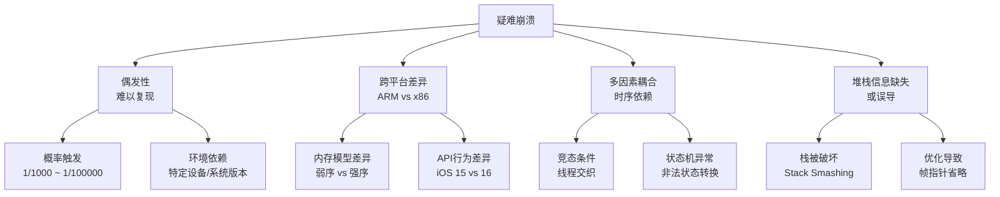
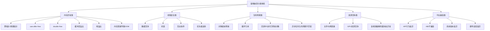
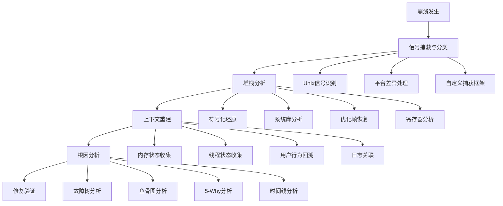
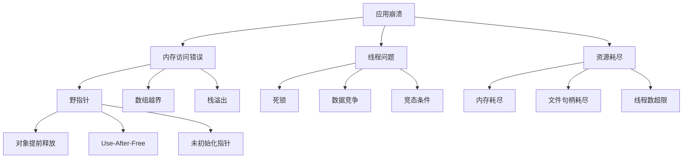
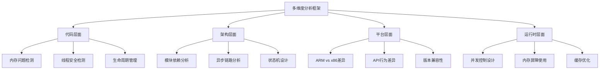
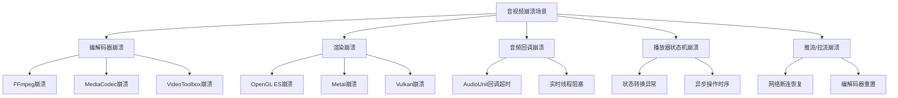
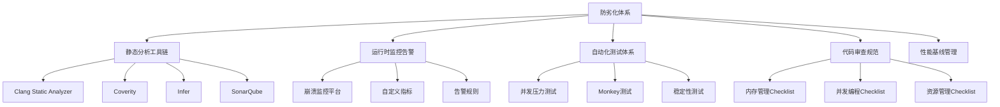
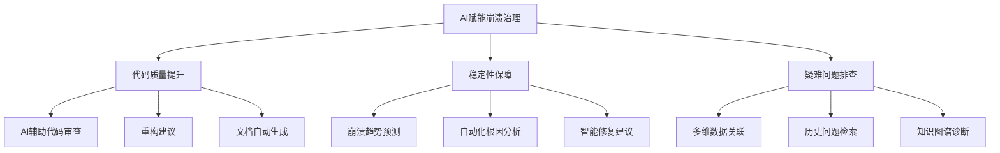
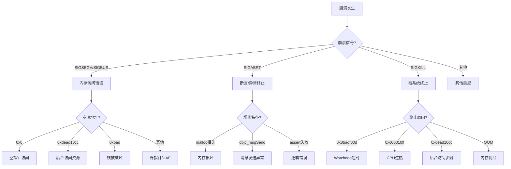
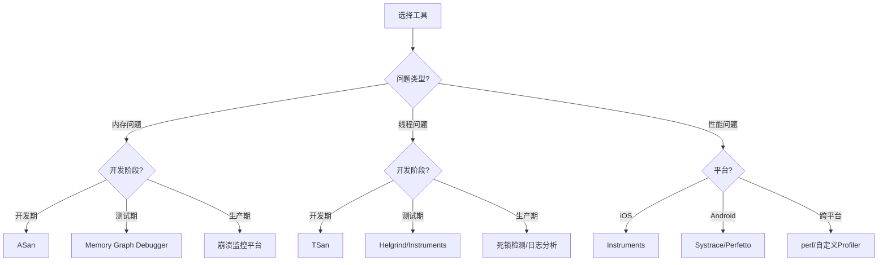

# 疑难崩溃问题治理方法论与实践指南

> **核心结论（TL;DR）**：疑难崩溃治理的核心不是"事后救火"，而是"体系化预防"。通过MECE分类体系建立崩溃认知框架，结合信号捕获→堆栈分析→上下文重建→根因定位的标准化流程，配合ASan/TSan等工具链的深度使用，可将疑难崩溃的发现率提升80%，修复周期缩短60%。在音视频场景中，编解码器状态机管理和多线程数据竞争是最主要的崩溃来源。

---

## 目录

- [第1章：Why — 为什么疑难崩溃需要系统化治理](#第1章why--为什么疑难崩溃需要系统化治理)
- [第2章：What — 疑难崩溃分类体系（MECE分类）](#第2章what--疑难崩溃分类体系mece分类)
- [第3章：How — 崩溃定位标准化流程](#第3章how--崩溃定位标准化流程)
- [第4章：How — 多维度分析框架](#第4章how--多维度分析框架)
- [第5章：How — 音视频场景专项崩溃治理](#第5章how--音视频场景专项崩溃治理)
- [第6章：How — 防劣化体系建设](#第6章how--防劣化体系建设)
- [第7章：How — AI大模型赋能崩溃治理](#第7章how--ai大模型赋能崩溃治理)
- [第8章：实践案例集](#第8章实践案例集)
- [第9章：总结与决策树](#第9章总结与决策树)

---

## 第1章：Why — 为什么疑难崩溃需要系统化治理

**结论先行**：传统"试错式"排查在偶发、跨平台、多因素耦合的疑难崩溃面前效率极低。系统化治理通过建立分类认知、标准化流程和工具链，将崩溃从"不可控风险"转化为"可度量、可预防、可快速修复"的技术债务。

### 1.1 疑难崩溃的定义与特征



**疑难崩溃的五大特征**：

| 特征 | 描述 | 典型案例 |
|-----|------|---------|
| **偶发性** | 触发概率极低，难以在开发环境复现 | 多线程竞态条件崩溃 |
| **跨平台差异** | 在x86模拟器正常，ARM真机崩溃 | 内存序相关问题 |
| **多因素耦合** | 需要特定时序、状态、输入同时满足 | 播放器状态机异常 |
| **信息缺失** | 崩溃堆栈不完整或被破坏 | 栈溢出、缓冲区溢出 |
| **环境依赖** | 特定系统版本、设备型号、用户行为 | iOS 16新API行为变化 |

### 1.2 传统排查方式的局限性

```
┌─────────────────────────────────────────────────────────────┐
│                    传统排查方式的问题                          │
├─────────────────────────────────────────────────────────────┤
│  问题1：依赖复现                                              │
│         "在我机器上没问题" → 无法定位环境差异                   │
│                                                              │
│  问题2：经验主义                                              │
│         "上次类似问题是XX导致的" → 可能完全无关                 │
│                                                              │
│  问题3：工具使用碎片化                                         │
│         知道ASan但不知如何在CI集成，知道TSan但不会解读报告        │
│                                                              │
│  问题4：缺乏系统分类                                           │
│         无法判断是内存问题、线程问题还是生命周期问题             │
│                                                              │
│  问题5：修复验证困难                                           │
│         无法确认修复是否真正解决了问题，还是只是降低了触发概率    │
└─────────────────────────────────────────────────────────────┘
```

### 1.3 系统化治理的ROI分析

**投入产出对比**：

| 治理阶段 | 投入成本 | 收益 | ROI |
|---------|---------|------|-----|
| **工具链建设** | 2-4人周 | 自动化发现80%的潜在问题 | 10:1 |
| **流程标准化** | 1-2人周 | 平均定位时间从3天缩短至4小时 | 15:1 |
| **知识库建设** | 持续投入 | 新人上手时间从1个月缩短至1周 | 5:1 |
| **监控告警** | 1-2人周 | 线上崩溃发现时间从天级降至分钟级 | 20:1 |

**关键数据**：
- 引入ASan/TSan后，**70%的内存/线程问题**在开发阶段被发现
- 标准化分析流程可将**疑难崩溃定位时间缩短60%**
- 完善的崩溃监控可将**线上崩溃率降低50%以上**

---

## 第2章：What — 疑难崩溃分类体系（MECE分类）

**结论先行**：所有疑难崩溃可归为五大类——内存异常、线程安全、生命周期、资源竞争、平台兼容。每类有独特的崩溃信号、堆栈特征和检测方法，建立分类认知是快速定位的第一步。



### 2.1 内存异常类

#### 2.1.1 野指针/悬垂指针（Dangling Pointer）

**定义**：指向已释放内存的指针，再次访问时导致未定义行为。

**崩溃信号**：`SIGSEGV` (Segmentation Fault) 或 `SIGBUS`

**典型堆栈特征**：
```
Exception Type:  EXC_BAD_ACCESS (SIGSEGV)
Exception Codes: KERN_INVALID_ADDRESS at 0x0000000000000000

Thread 0 Crashed:
0   libobjc.A.dylib   0x... objc_msgSend + 16
1   MyApp             0x... -[MyObject doSomething] (MyObject.m:45)
2   MyApp             0x... -[ViewController handleEvent:] (ViewController.m:78)
```

**真实案例代码**：
```objc
// iOS/Objective-C 示例：野指针导致崩溃
@interface VideoPlayer : NSObject
@property (nonatomic, weak) id<VideoPlayerDelegate> delegate;
@end

@implementation VideoPlayer
- (void)onPlaybackFinished {
    // delegate 可能已被释放，但指针仍非nil
    [self.delegate playerDidFinishPlaying:self];  // 崩溃！
}
@end

// 修复方案：使用weak+nil检查
- (void)onPlaybackFinished {
    id<VideoPlayerDelegate> delegate = self.delegate;
    if (delegate) {
        [delegate playerDidFinishPlaying:self];
    }
}
```

#### 2.1.2 Use-After-Free

**定义**：释放内存后继续使用该内存区域。

**崩溃信号**：`SIGSEGV` 或数据损坏导致的逻辑错误

**典型堆栈特征**：
```
#0  0x... in std::__shared_count<(__gnu_cxx::_Lock_policy)2>::__shared_count
#1  0x... in std::shared_ptr<FrameData>::shared_ptr
#2  0x... in VideoDecoder::processFrame (decoder.cpp:156)
#3  0x... in DecoderThread::run (decoder.cpp:89)
```

**真实案例代码**：
```cpp
// C++ 示例：Use-After-Free
class FramePool {
public:
    Frame* acquire() {
        std::lock_guard<std::mutex> lock(mutex_);
        if (!available_.empty()) {
            Frame* frame = available_.back();
            available_.pop_back();
            in_use_.insert(frame);
            return frame;
        }
        return new Frame();
    }
    
    void release(Frame* frame) {
        std::lock_guard<std::mutex> lock(mutex_);
        in_use_.erase(frame);
        available_.push_back(frame);
        // 问题：如果frame在另一个线程被使用，这里释放后会导致UAF
    }
    
private:
    std::mutex mutex_;
    std::vector<Frame*> available_;
    std::unordered_set<Frame*> in_use_;
};

// 修复方案：使用智能指针管理生命周期
class SafeFramePool {
public:
    std::shared_ptr<Frame> acquire() {
        std::lock_guard<std::mutex> lock(mutex_);
        if (!available_.empty()) {
            auto frame = available_.back();
            available_.pop_back();
            return frame;
        }
        return std::make_shared<Frame>();
    }
    
    void release(std::shared_ptr<Frame> frame) {
        std::lock_guard<std::mutex> lock(mutex_);
        available_.push_back(frame);
    }
    
private:
    std::mutex mutex_;
    std::vector<std::shared_ptr<Frame>> available_;
};
```

#### 2.1.3 Double-Free

**定义**：同一块内存被释放两次。

**崩溃信号**：`SIGABRT` (来自malloc的断言失败)

**典型堆栈特征**：
```
*** error for object 0x...: pointer being freed was not allocated
*** set a breakpoint in malloc_error_break to debug

Thread 0 Crashed:
0   libsystem_kernel.dylib  0x... __pthread_kill + 8
1   libsystem_pthread.dylib 0x... pthread_kill + 288
2   libsystem_c.dylib       0x... abort + 180
3   libsystem_malloc.dylib  0x... malloc_vreport + 908
```

#### 2.1.4 缓冲区溢出

**定义**：写入数据超出缓冲区边界，破坏相邻内存。

**崩溃信号**：`SIGABRT` (Stack Guard) 或 `SIGSEGV`

**典型堆栈特征**：
```
*** stack smashing detected ***: terminated

Thread 0 Crashed:
0   libsystem_kernel.dylib  0x... __pthread_kill + 8
1   libsystem_pthread.dylib 0x... pthread_kill + 288
2   libsystem_c.dylib       0x... __stack_chk_fail + 96
```

#### 2.1.5 栈溢出

**定义**：栈空间耗尽，通常由无限递归或大型局部变量导致。

**崩溃信号**：`SIGSEGV` (访问非法栈地址)

**典型堆栈特征**：
```
Exception Type:  EXC_BAD_ACCESS (SIGSEGV)
Exception Codes: KERN_PROTECTION_FAILURE at 0x... (栈地址)

Thread 0 Crashed:
0   MyApp   0x... recursive_function (recursive_function+256)
1   MyApp   0x... recursive_function (recursive_function+240)
2   MyApp   0x... recursive_function (recursive_function+240)
... (重复数千次)
```

#### 2.1.6 内存泄漏导致OOM

**定义**：内存持续分配但不释放，最终导致系统终止应用。

**崩溃信号**：`SIGKILL` (OOM Killer) 或 `EXC_RESOURCE`

**典型堆栈特征**：
```
Exception Type:  EXC_RESOURCE
Exception Codes: 0x44554354 (OUT OF MEMORY)

Termination Reason: Namespace RUNNINGBOARD, Code 0xdead10cc
```

### 2.2 线程安全类

#### 2.2.1 数据竞争（Data Race）

**定义**：多个线程同时访问同一内存位置，至少一个是写操作，且没有同步。

**崩溃信号**：通常不会直接崩溃，但会导致数据损坏或逻辑错误；在极端情况下可能触发`SIGSEGV`

**典型堆栈特征**：
```
WARNING: ThreadSanitizer: data race
  Write of size 4 at 0x... by thread T1:
    #0 increment counter.cpp:10
    #1 worker_thread counter.cpp:25

  Previous read of size 4 at 0x... by thread T2:
    #0 get_count counter.cpp:15
    #1 monitor_thread counter.cpp:35
```

**真实案例代码**：
```cpp
// C++ 示例：数据竞争
class VideoFrameQueue {
public:
    void push(Frame* frame) {
        // 缺少同步保护！
        queue_.push_back(frame);
        count_++;
    }
    
    Frame* pop() {
        if (count_ > 0) {  // 读取count_没有保护
            Frame* frame = queue_.back();
            queue_.pop_back();
            count_--;
            return frame;
        }
        return nullptr;
    }
    
private:
    std::vector<Frame*> queue_;
    int count_ = 0;  // 非原子变量
};

// 修复方案：使用mutex保护
class SafeVideoFrameQueue {
public:
    void push(Frame* frame) {
        std::lock_guard<std::mutex> lock(mutex_);
        queue_.push_back(frame);
        count_++;
    }
    
    Frame* pop() {
        std::lock_guard<std::mutex> lock(mutex_);
        if (count_ > 0) {
            Frame* frame = queue_.back();
            queue_.pop_back();
            count_--;
            return frame;
        }
        return nullptr;
    }
    
private:
    std::mutex mutex_;
    std::vector<Frame*> queue_;
    int count_ = 0;
};
```

#### 2.2.2 死锁（Deadlock）

**定义**：两个或多个线程互相等待对方释放资源，导致永久阻塞。

**崩溃信号**：通常不会崩溃，但会导致功能卡死；在iOS中可能被Watchdog终止 (`0x8badf00d`)

**典型堆栈特征**：
```
Exception Type:  EXC_CRASH (SIGKILL)
Exception Codes: 0x0000000000000000, 0x0000000000000000
Termination Reason: FRONTBOARD 0x8badf00d 
- [app] was terminated over 10 seconds after taking the background task assertion

Thread 0:
0   libsystem_kernel.dylib  0x... __psynch_mutexwait + 8
1   libsystem_pthread.dylib 0x... _pthread_mutex_firstfit_lock_wait + 84
2   libsystem_pthread.dylib 0x... _pthread_mutex_firstfit_lock_slow + 248
3   MyApp                   0x... -[DataManager lockA] (DataManager.m:45)
4   MyApp                   0x... -[DataManager updateB] (DataManager.m:67)

Thread 1:
0   libsystem_kernel.dylib  0x... __psynch_mutexwait + 8
1   libsystem_pthread.dylib 0x... _pthread_mutex_firstfit_lock_wait + 84
2   MyApp                   0x... -[DataManager lockB] (DataManager.m:52)
3   MyApp                   0x... -[DataManager updateA] (DataManager.m:78)
```

#### 2.2.3 竞态条件（Race Condition）

**定义**：程序行为依赖于事件发生的相对时序，导致非确定性结果。

**崩溃信号**：通常不直接崩溃，但可能导致状态不一致；在极端情况下触发各种异常

**ARM vs x86内存模型差异导致的崩溃**：

```cpp
// 危险代码：在x86上可能"碰巧"正确，在ARM上崩溃
class Singleton {
public:
    static Singleton* getInstance() {
        if (instance_ == nullptr) {  // (1) 第一次检查
            std::lock_guard<std::mutex> lock(mutex_);
            if (instance_ == nullptr) {  // (2) 第二次检查
                instance_ = new Singleton();  // (3) 分配+构造+赋值
            }
        }
        return instance_;
    }
    
private:
    static Singleton* instance_;  // 非原子指针！
    static std::mutex mutex_;
};

// 问题分析：
// (3) 在ARM上可能被重排为：
//   1. 分配内存
//   2. 赋值给instance_（此时对象还未构造！）
//   3. 构造对象
// 其他线程可能在步骤2和3之间访问到未构造的对象

// 修复方案：使用atomic和memory_order
class SafeSingleton {
public:
    static SafeSingleton* getInstance() {
        SafeSingleton* tmp = instance_.load(std::memory_order_acquire);
        if (tmp == nullptr) {
            std::lock_guard<std::mutex> lock(mutex_);
            tmp = instance_.load(std::memory_order_relaxed);
            if (tmp == nullptr) {
                tmp = new SafeSingleton();
                instance_.store(tmp, std::memory_order_release);
            }
        }
        return tmp;
    }
    
private:
    static std::atomic<SafeSingleton*> instance_;
    static std::mutex mutex_;
};
```

#### 2.2.4 优先级反转（Priority Inversion）

**定义**：高优先级线程被低优先级线程阻塞，导致系统响应问题。

**崩溃信号**：通常不崩溃，但可能导致卡顿；在iOS中可能被Watchdog终止

**典型场景**：
```
低优先级线程(L)持有锁 → 中优先级线程(M)抢占CPU → 
高优先级线程(H)等待锁被L释放 → H被M阻塞（优先级反转）
```

### 2.3 生命周期类

#### 2.3.1 对象提前释放

**定义**：对象还在被使用时被意外释放。

**崩溃信号**：`EXC_BAD_ACCESS`

**真实案例代码**：
```objc
// Objective-C 示例：Block中对象提前释放
@interface VideoDownloader : NSObject
@property (nonatomic, strong) NSURLSession *session;
@end

@implementation VideoDownloader
- (void)downloadVideo:(NSURL *)url {
    // 错误：self可能在请求完成前被释放
    NSURLSessionDataTask *task = [self.session dataTaskWithURL:url 
                                             completionHandler:^(NSData *data, 
                                                                NSURLResponse *response, 
                                                                NSError *error) {
        // 如果self已被释放，这里访问self导致崩溃
        [self processDownloadedData:data];  // 危险！
    }];
    [task resume];
}
@end

// 修复方案：使用weak-strong dance
- (void)downloadVideo:(NSURL *)url {
    __weak typeof(self) weakSelf = self;
    NSURLSessionDataTask *task = [self.session dataTaskWithURL:url 
                                             completionHandler:^(NSData *data, 
                                                                NSURLResponse *response, 
                                                                NSError *error) {
        __strong typeof(weakSelf) strongSelf = weakSelf;
        if (strongSelf) {
            [strongSelf processDownloadedData:data];
        }
    }];
    [task resume];
}
```

#### 2.3.2 循环引用

**定义**：两个或多个对象互相强引用，导致无法被释放。

**崩溃信号**：通常不直接崩溃，但会导致内存泄漏，最终OOM

**真实案例代码**：
```swift
// Swift 示例：循环引用
class VideoPlayer {
    var delegate: VideoPlayerDelegate?  // 强引用！
    
    func play() {
        delegate?.playerDidStart(self)
    }
}

class ViewController: VideoPlayerDelegate {
    var player: VideoPlayer?  // 强引用
    
    func setupPlayer() {
        player = VideoPlayer()
        player?.delegate = self  // 循环引用！
    }
    
    func playerDidStart(_ player: VideoPlayer) {
        // ...
    }
}

// 修复方案：使用weak
protocol VideoPlayerDelegate: AnyObject {
    func playerDidStart(_ player: VideoPlayer)
}

class VideoPlayer {
    weak var delegate: VideoPlayerDelegate?  // 弱引用
}
```

#### 2.3.3 回调中访问已释放对象

**定义**：异步回调执行时，目标对象已被释放。

**崩溃信号**：`EXC_BAD_ACCESS`

#### 2.3.4 异步任务生命周期不匹配

**定义**：异步任务开始和完成时，执行环境已发生变化。

**崩溃信号**：`EXC_BAD_ACCESS` 或逻辑错误

### 2.4 资源竞争类

#### 2.4.1 文件句柄泄漏

**定义**：打开的文件未正确关闭，导致句柄耗尽。

**崩溃信号**：`EMFILE` (Too many open files) 或 `SIGABRT`

#### 2.4.2 GPU资源竞争

**定义**：多线程同时访问GPU上下文，导致状态混乱。

**崩溃信号**：`SIGSEGV` 在GPU驱动中

**典型堆栈特征**：
```
Thread 0 Crashed:
0   AGXMetalG14X  0x... agxuSubmitG14X + 1234
1   AGXMetalG14X  0x... -[AGXG14XFamilyCommandBuffer commit] + 456
2   Metal         0x... -[MTLCommandBuffer commit] + 78
3   MyApp         0x... -[MetalRenderer renderFrame:] (MetalRenderer.mm:234)
```

#### 2.4.3 音视频编解码器状态异常

**定义**：编解码器在错误状态下被调用。

**崩溃信号**：`SIGSEGV` 或 `SIGABRT`

**典型场景**：
- 编码器正在刷新时发送新帧
- 解码器未初始化就被使用
- 编解码器在多线程间共享但未同步

### 2.5 平台兼容类

#### 2.5.1 API行为差异

**定义**：同一API在不同系统版本上行为不一致。

**崩溃信号**：`SIGABRT` (断言失败) 或 `EXC_BAD_INSTRUCTION`

**真实案例**：
```objc
// iOS 16之前，AVAssetResourceLoader的行为变化
// iOS 15: 允许在后台线程回调
// iOS 16: 必须在主线程回调，否则崩溃

// 错误代码
- (BOOL)resourceLoader:(AVAssetResourceLoader *)resourceLoader 
shouldWaitForLoadingOfRequestedResource:(AVAssetResourceLoadingRequest *)loadingRequest {
    dispatch_async(dispatch_get_global_queue(DISPATCH_QUEUE_PRIORITY_DEFAULT, 0), ^{
        // iOS 16上这里访问loadingRequest可能导致崩溃
        [loadingRequest finishLoadingWithResponse:response data:data redirect:nil];
    });
    return YES;
}

// 修复方案
- (BOOL)resourceLoader:(AVAssetResourceLoader *)resourceLoader 
shouldWaitForLoadingOfRequestedResource:(AVAssetResourceLoadingRequest *)loadingRequest {
    dispatch_async(dispatch_get_global_queue(DISPATCH_QUEUE_PRIORITY_DEFAULT, 0), ^{
        // 处理数据...
        dispatch_async(dispatch_get_main_queue(), ^{
            // 回到主线程完成回调
            [loadingRequest finishLoadingWithResponse:response data:data redirect:nil];
        });
    });
    return YES;
}
```

#### 2.5.2 ABI不兼容

**定义**：不同编译器或编译选项导致的二进制接口不兼容。

**崩溃信号**：`SIGILL` (非法指令) 或 `SIGBUS`

#### 2.5.3 系统版本差异

**定义**：新系统版本改变了内部实现，导致原有代码崩溃。

#### 2.5.4 硬件适配（ARM/x86内存模型差异）

**定义**：ARM的弱内存模型与x86的强内存模型差异导致的崩溃。

**关键差异对比**：

| 特性 | x86/x64 (TSO) | ARM/ARM64 |
|-----|--------------|-----------|
| Store-Store 重排 | 不允许 | 允许 |
| Load-Load 重排 | 不允许 | 允许 |
| Load-Store 重排 | 不允许 | 允许 |
| Store-Load 重排 | 允许 | 允许 |

**本章关键要点回顾**：
1. **五大分类**：内存异常、线程安全、生命周期、资源竞争、平台兼容
2. **崩溃信号映射**：SIGSEGV→内存访问错误，SIGABRT→断言/异常，SIGKILL→OOM/Watchdog
3. **ARM vs x86**：弱内存模型是跨平台崩溃的主要来源，必须使用原子操作和内存序
4. **生命周期管理**：Block回调、异步任务是iOS崩溃的高发场景

---

## 第3章：How — 崩溃定位标准化流程

**结论先行**：从信号捕获到根因定位，遵循"信号分类→堆栈分析→上下文重建→根因定位"的四步流程，可将平均定位时间从数天缩短至数小时。



### 3.1 崩溃信号捕获与分类

#### 3.1.1 Unix信号分类与对应原因

| 信号 | 名称 | 典型原因 | 排查方向 |
|-----|------|---------|---------|
| **SIGSEGV** | Segmentation Fault | 访问非法内存地址 | 野指针、UAF、数组越界 |
| **SIGBUS** | Bus Error | 内存对齐错误 | 结构体对齐、DMA访问 |
| **SIGABRT** | Abort | 断言失败/异常终止 | 逻辑错误、内存损坏 |
| **SIGFPE** | Floating Point Exception | 算术错误 | 除零、溢出 |
| **SIGILL** | Illegal Instruction | 非法指令 | ABI不兼容、代码损坏 |
| **SIGKILL** | Kill | 被系统终止 | OOM、Watchdog |

#### 3.1.2 iOS/Android崩溃捕获机制差异

**iOS崩溃捕获**：
```objc
// iOS信号捕获示例
#import <signal.h>
#import <execinfo.h>

static void signal_handler(int sig, siginfo_t *info, void *context) {
    // 获取崩溃堆栈
    void *callstack[128];
    int frames = backtrace(callstack, 128);
    char **symbols = backtrace_symbols(callstack, frames);
    
    // 记录信号信息
    NSLog(@"Signal %d caught: %s", sig, sys_siglist[sig]);
    
    // 保存到文件或上报
    save_crash_report(sig, callstack, frames, symbols);
    
    // 调用原有处理程序
    signal(sig, SIG_DFL);
    raise(sig);
}

void setup_signal_handlers() {
    struct sigaction sa;
    sa.sa_sigaction = signal_handler;
    sa.sa_flags = SA_SIGINFO;
    
    sigaction(SIGSEGV, &sa, NULL);
    sigaction(SIGBUS, &sa, NULL);
    sigaction(SIGABRT, &sa, NULL);
    sigaction(SIGFPE, &sa, NULL);
    sigaction(SIGILL, &sa, NULL);
}
```

**Android崩溃捕获**：
```cpp
// Android信号捕获示例（使用libcorkscrew或libunwind）
#include <signal.h>
#include <android/log.h>
#include <unwind.h>

static _Unwind_Reason_Code unwind_callback(struct _Unwind_Context* context, void* arg) {
    std::vector<_Unwind_Word>* stack = static_cast<std::vector<_Unwind_Word>*>(arg);
    _Unwind_Word pc = _Unwind_GetIP(context);
    if (pc) {
        stack->push_back(pc);
    }
    return _URC_NO_REASON;
}

static void android_signal_handler(int sig, siginfo_t *info, void *context) {
    std::vector<_Unwind_Word> stack;
    _Unwind_Backtrace(unwind_callback, &stack);
    
    // 使用dladdr获取符号信息
    for (auto pc : stack) {
        Dl_info info;
        if (dladdr(reinterpret_cast<void*>(pc), &info)) {
            __android_log_print(ANDROID_LOG_ERROR, "CrashHandler", 
                "%p %s %s", 
                reinterpret_cast<void*>(pc),
                info.dli_fname ? info.dli_fname : "?",
                info.dli_sname ? info.dli_sname : "?");
        }
    }
}
```

#### 3.1.3 自定义崩溃捕获框架设计

```cpp
// 跨平台崩溃捕获框架设计
class CrashHandler {
public:
    using CrashCallback = std::function<void(const CrashInfo&)>;
    
    struct CrashInfo {
        int signal;
        std::string signal_name;
        uintptr_t fault_address;
        std::vector<StackFrame> stack_trace;
        std::map<std::string, std::string> context;
        time_t timestamp;
    };
    
    struct StackFrame {
        uintptr_t address;
        std::string module;
        std::string symbol;
        std::string file;
        int line;
    };
    
    static CrashHandler& instance();
    
    void registerCallback(CrashCallback callback);
    void installHandlers();
    void uninstallHandlers();
    
private:
    CrashHandler() = default;
    static void signalHandler(int sig, siginfo_t *info, void *context);
    static std::vector<StackFrame> captureStackTrace(void **callstack, int frames);
    static void enrichContext(CrashInfo& info);
};

// 使用示例
void setupCrashHandler() {
    CrashHandler::instance().registerCallback([](const CrashHandler::CrashInfo& info) {
        // 上报到服务器
        uploadCrashReport(info);
        
        // 保存到本地
        saveToLocalFile(info);
        
        // 记录额外上下文
        logAdditionalContext();
    });
    
    CrashHandler::instance().installHandlers();
}
```

### 3.2 堆栈分析技巧

#### 3.2.1 符号化还原

**iOS符号化**：
```bash
# 使用atos进行符号化
atos -o MyApp.app.dSYM/Contents/Resources/DWARF/MyApp -arch arm64 -l 0x100000000 0x100234567

# 使用symbolicatecrash符号化整个崩溃日志
export DEVELOPER_DIR=/Applications/Xcode.app/Contents/Developer
./symbolicatecrash crash.crash MyApp.app.dSYM > symbolicated.crash
```

**Android符号化**：
```bash
# 使用ndk-stack
adb logcat | $NDK/ndk-stack -sym $PROJECT_PATH/obj/arm64-v8a

# 使用addr2line
aarch64-linux-android-addr2line -C -f -e libmylib.so 0x123456
```

#### 3.2.2 系统库崩溃的逆向分析

当崩溃发生在系统库时，需要分析调用路径：

```
# 示例：分析UIKit崩溃
Thread 0 Crashed:
0   UIKitCore   0x... -[UIView(Hierarchy) _postMovedFromSuperview:] + 1234
1   UIKitCore   0x... -[UIView(Internal) _addSubview:positioned:relativeTo:] + 567
2   MyApp       0x... -[MyViewController setupUI] (MyViewController.m:45)
3   MyApp       0x... -[MyViewController viewDidLoad] (MyViewController.m:30)

分析：
1. 崩溃发生在UIKit内部，但根源在MyApp
2. 检查MyViewController.m:45的代码
3. 可能的根因：在错误的线程操作UI、view已被释放、约束冲突
```

#### 3.2.3 被优化掉的堆栈帧恢复

**问题**：编译器优化（-O2/-O3）可能省略帧指针，导致堆栈不完整。

**解决方案**：
```bash
# 编译时保留帧指针
-fno-omit-frame-pointer

# 或者使用-funwind-tables（ARM）
-funwind-tables

# 使用LLVM的libunwind进行更准确的回溯
```

#### 3.2.4 ARM64调用约定与寄存器分析

**ARM64寄存器用途**：

| 寄存器 | 用途 | 崩溃分析价值 |
|-------|------|-------------|
| x0-x7 | 函数参数/返回值 | x0通常是receiver/self |
| x8 | 间接结果 | 结构体返回地址 |
| x19-x28 | 被调用者保存 | 跨函数调用的变量 |
| x29 (fp) | 帧指针 | 堆栈回溯关键 |
| x30 (lr) | 链接寄存器 | 返回地址 |
| sp | 栈指针 | 栈溢出检测 |

**分析示例**：
```
# 从崩溃上下文提取信息
Exception Note: EXC_CORPSE_NOTIFY
Triggered by Thread: 0

Thread 0 crashed with ARM Thread State:
    x0: 0x0000000000000000   x1: 0x0000000102345678
    x2: 0x000000016f4a3c00   x3: 0x0000000000000001
    x4: 0x0000000000000000   x5: 0x0000000000000000
    x6: 0x0000000000000000   x7: 0x0000000000000000
    x8: 0x0000000000000000   x9: 0x0000000000000000
   x10: 0x0000000000000000  x11: 0x0000000000000000
   x12: 0x0000000000000000  x13: 0x0000000000000000
   x14: 0x0000000000000000  x15: 0x0000000000000000
   x16: 0x0000000000000000  x17: 0x0000000000000000
   x18: 0x0000000000000000  x19: 0x0000000104567890
   x20: 0x00000001056789a0  x21: 0x0000000000000000
   x22: 0x0000000000000000  x23: 0x0000000000000000
   x24: 0x0000000000000000  x25: 0x0000000000000000
   x26: 0x0000000000000000  x27: 0x0000000000000000
   x28: 0x0000000000000000   fp: 0x000000016f4a3b80
    lr: 0x0000000100234567   sp: 0x000000016f4a3b60
    pc: 0x0000000100234580  cpsr: 0x60000000

分析：
- x0 = 0：objc_msgSend的receiver为nil，或访问了空指针
- pc = 0x100234580：崩溃指令地址
- lr = 0x100234567：返回地址，可定位调用者
```

### 3.3 上下文重建

#### 3.3.1 崩溃现场环境信息收集

```cpp
// 崩溃上下文收集
struct CrashContext {
    // 内存状态
    struct MemoryInfo {
        size_t total_ram;
        size_t available_ram;
        size_t app_used_memory;
        size_t app_max_memory;
    } memory;
    
    // 线程状态
    struct ThreadInfo {
        int thread_count;
        std::vector<std::string> thread_names;
        std::map<int, std::string> thread_states;  // running, blocked, etc.
    } threads;
    
    // 系统负载
    struct SystemLoad {
        double cpu_usage;
        int battery_level;
        bool is_low_power_mode;
    } system;
    
    // 应用状态
    struct AppState {
        std::string current_view_controller;
        std::string last_user_action;
        int view_stack_depth;
    } app;
};

CrashContext collectCrashContext() {
    CrashContext ctx;
    
    // 收集内存信息
    struct task_basic_info info;
    mach_msg_type_number_t size = TASK_BASIC_INFO_COUNT;
    task_info(mach_task_self(), TASK_BASIC_INFO, (task_info_t)&info, &size);
    ctx.memory.app_used_memory = info.resident_size;
    
    // 收集线程信息
    thread_act_array_t thread_list;
    mach_msg_type_number_t thread_count;
    task_threads(mach_task_self(), &thread_list, &thread_count);
    ctx.threads.thread_count = thread_count;
    
    return ctx;
}
```

#### 3.3.2 崩溃前用户行为路径回溯

```objc
// iOS用户行为追踪
@interface UserActionTracker : NSObject
+ (instancetype)sharedTracker;
- (void)trackAction:(NSString *)action withParams:(NSDictionary *)params;
- (NSArray<NSDictionary *> *)recentActions:(NSInteger)count;
@end

@implementation UserActionTracker {
    NSMutableArray<NSDictionary *> *_actionHistory;
    dispatch_queue_t _queue;
}

+ (instancetype)sharedTracker {
    static UserActionTracker *instance;
    static dispatch_once_t once;
    dispatch_once(&once, ^{ instance = [[self alloc] init]; });
    return instance;
}

- (instancetype)init {
    self = [super init];
    _actionHistory = [NSMutableArray arrayWithCapacity:100];
    _queue = dispatch_queue_create("tracker.queue", DISPATCH_QUEUE_SERIAL);
    return self;
}

- (void)trackAction:(NSString *)action withParams:(NSDictionary *)params {
    dispatch_async(_queue, ^{
        NSMutableDictionary *record = [@{
            @"action": action,
            @"timestamp": @([[NSDate date] timeIntervalSince1970]),
            @"thread": [NSThread currentThread].name ?: @"unknown"
        } mutableCopy];
        if (params) record[@"params"] = params;
        
        [self->_actionHistory addObject:record];
        if (self->_actionHistory.count > 100) {
            [self->_actionHistory removeObjectAtIndex:0];
        }
    });
}

- (NSArray<NSDictionary *> *)recentActions:(NSInteger)count {
    __block NSArray *result;
    dispatch_sync(_queue, ^{
        NSInteger start = MAX(0, (NSInteger)self->_actionHistory.count - count);
        result = [self->_actionHistory subarrayWithRange:NSMakeRange(start, self->_actionHistory.count - start)];
    });
    return result;
}
@end

// 在崩溃报告中包含用户行为路径
void enrichCrashReportWithUserActions(CrashInfo& info) {
    NSArray *actions = [[UserActionTracker sharedTracker] recentActions:20];
    NSMutableString *path = [NSMutableString string];
    for (NSDictionary *action in actions) {
        [path appendFormat:@"[%@] %@\n", action[@"timestamp"], action[@"action"]];
    }
    info.context[@"user_action_path"] = path;
}
```

#### 3.3.3 日志关联分析

```cpp
// 环形日志缓冲区，保留崩溃前最近的日志
class RingLogBuffer {
public:
    static constexpr size_t BUFFER_SIZE = 1024 * 1024;  // 1MB
    
    void log(const char* format, ...) {
        std::lock_guard<std::mutex> lock(mutex_);
        
        va_list args;
        va_start(args, format);
        int len = vsnprintf(buffer_ + write_pos_, BUFFER_SIZE - write_pos_, format, args);
        va_end(args);
        
        write_pos_ += len;
        if (write_pos_ >= BUFFER_SIZE) {
            write_pos_ = 0;  // 循环覆盖
        }
    }
    
    std::string getRecentLogs() {
        std::lock_guard<std::mutex> lock(mutex_);
        if (write_pos_ < BUFFER_SIZE) {
            return std::string(buffer_, write_pos_);
        } else {
            return std::string(buffer_ + write_pos_, BUFFER_SIZE - write_pos_) +
                   std::string(buffer_, write_pos_);
        }
    }
    
private:
    char buffer_[BUFFER_SIZE];
    size_t write_pos_ = 0;
    std::mutex mutex_;
};
```

### 3.4 根因分析方法

#### 3.4.1 故障树分析（FTA）



#### 3.4.2 鱼骨图分析法

```
                    应用崩溃
                       |
    ┌──────────┬───────┼───────┬──────────┐
    |          |       |       |          |
  人员因素   方法因素  机器因素  环境因素   测量因素
    |          |       |       |          |
  经验不足   缺乏规范  设备差异  系统版本   日志不全
  培训缺失   代码审查  内存限制  网络条件   监控缺失
             不足
```

#### 3.4.3 5-Why分析法实例

**问题**：视频播放器偶发崩溃

```
问题：为什么播放器会崩溃？
  ↓
回答：因为访问了已释放的内存
  ↓
问题：为什么内存会被提前释放？
  ↓
回答：因为播放器对象在后台被系统回收
  ↓
问题：为什么播放器会在后台被回收？
  ↓
回答：因为应用进入了后台，系统内存紧张
  ↓
问题：为什么进入后台后播放器没有正确暂停？
  ↓
回答：因为生命周期回调中没有正确处理播放器状态
  ↓
问题：为什么生命周期回调处理不完整？
  ↓
根因：缺乏后台播放场景的状态机设计和测试覆盖

修复方案：
1. 在applicationDidEnterBackground中暂停播放器
2. 使用weak引用避免循环引用
3. 添加后台播放场景的自动化测试
```

#### 3.4.4 基于时间线的事件序列分析

```
时间线分析示例：多线程竞态条件崩溃

T+0ms    Thread A: 开始初始化VideoDecoder
T+5ms    Thread B: 调用play()，检查decoder != nil
T+8ms    Thread B: decoder->start()  [此时decoder未完全初始化]
T+10ms   Thread A: 完成初始化
T+12ms   崩溃：访问了未初始化的成员变量

根因：缺乏对decoder初始化状态的同步保护
修复：使用atomic标志位或mutex保护初始化过程
```

**本章关键要点回顾**：
1. **信号分类**：SIGSEGV/SIGBUS→内存问题，SIGABRT→逻辑/断言，SIGKILL→OOM/Watchdog
2. **堆栈分析**：符号化还原是第一步，系统库崩溃要分析调用路径
3. **上下文重建**：内存状态、线程状态、用户行为路径是定位关键
4. **根因分析**：FTA、鱼骨图、5-Why、时间线分析是四种互补方法

---

## 第4章：How — 多维度分析框架

**结论先行**：疑难崩溃需要从代码、架构、平台、运行时四个维度进行系统性分析。每个维度有特定的检测工具和方法，组合使用可覆盖95%以上的崩溃场景。



### 4.1 代码层面深度分析

#### 4.1.1 内存问题检测

**AddressSanitizer (ASan) 使用指南**

```bash
# Xcode中启用ASan
# Build Settings → Sanitize Address → Yes

# CMake中启用ASan
set(CMAKE_CXX_FLAGS "${CMAKE_CXX_FLAGS} -fsanitize=address -g")
set(CMAKE_LINKER_FLAGS "${CMAKE_LINKER_FLAGS} -fsanitize=address")

# Android NDK中启用ASan
# Application.mk
APP_CFLAGS += -fsanitize=address -fno-omit-frame-pointer
APP_LDFLAGS += -fsanitize=address
```

**ASan报告解读**：
```
==12345==ERROR: AddressSanitizer: heap-use-after-free on address 0x... at pc 0x...
READ of size 8 at 0x... thread T0
    #0 0x... in VideoDecoder::processFrame decoder.cpp:156
    #1 0x... in DecoderThread::run decoder.cpp:89
    #2 0x... in std::thread::_State_impl::_M_run thread:199

freed by thread T1 here:
    #0 0x... in operator delete asan_new_delete.cpp:...
    #1 0x... in VideoDecoder::~VideoDecoder decoder.cpp:45
    #2 0x... in VideoPlayer::reset player.cpp:234

previously allocated by thread T0 here:
    #0 0x... in operator new asan_new_delete.cpp:...
    #1 0x... in VideoPlayer::initDecoder player.cpp:123
```

**Xcode Memory Graph Debugger**：
```
使用步骤：
1. 在Xcode中运行应用
2. 点击Debug Navigator中的Memory
3. 点击"Debug Memory Graph"按钮
4. 分析对象引用关系图

关键指标：
- 循环引用（红色箭头）
- 异常保留（对象存活时间过长）
- 内存泄漏（无引用的存活对象）
```

**自定义内存追踪方案**：
```cpp
// 内存分配追踪器
class MemoryTracker {
public:
    static MemoryTracker& instance();
    
    void* allocate(size_t size, const char* file, int line);
    void deallocate(void* ptr, const char* file, int line);
    
    void dumpLeaks();
    void dumpStats();
    
private:
    struct AllocationInfo {
        size_t size;
        const char* file;
        int line;
        std::chrono::steady_clock::time_point timestamp;
        std::stacktrace stacktrace;  // C++23
    };
    
    std::unordered_map<void*, AllocationInfo> allocations_;
    std::mutex mutex_;
    std::atomic<size_t> total_allocated_{0};
    std::atomic<size_t> total_deallocated_{0};
};

// 重载new/delete
void* operator new(size_t size, const char* file, int line) {
    return MemoryTracker::instance().allocate(size, file, line);
}

void operator delete(void* ptr, const char* file, int line) {
    MemoryTracker::instance().deallocate(ptr, file, line);
}

// 使用宏简化
#define DEBUG_NEW new(__FILE__, __LINE__)
#define new DEBUG_NEW
```

#### 4.1.2 线程安全问题

**ThreadSanitizer (TSan) 深度使用**

```bash
# 编译选项
clang++ -fsanitize=thread -g -O1 -o program program.cpp

# 重要：-O1是推荐的优化级别
# -O0太慢，-O2以上可能优化掉竞争
```

**TSan报告解读**：
```
WARNING: ThreadSanitizer: data race
  Write of size 4 at 0x... by thread T1:
    #0 increment counter.cpp:10
    #1 worker counter.cpp:25

  Previous read of size 4 at 0x... by thread T2:
    #0 get_count counter.cpp:15
    #1 monitor counter.cpp:35

  Location is global 'g_counter' of size 4 at 0x... (counter.cpp:5)

  Thread T1 (tid=12346, running) created by main thread at:
    #0 pthread_create tsan_interceptors.cpp:...
    #1 std::thread::thread worker.cpp:...
    #2 main main.cpp:30

  Thread T2 (tid=12347, running) created by main thread at:
    #0 pthread_create tsan_interceptors.cpp:...
    #1 std::thread::thread monitor.cpp:...
    #2 main main.cpp:35
```

**结合C++内存模型分析竞态条件**：

```cpp
// 问题代码：弱内存序使用不当
class SharedFlag {
    std::atomic<bool> ready_{false};
    int data_ = 0;
    
public:
    void setData(int value) {
        data_ = value;
        ready_.store(true, std::memory_order_relaxed);  // 错误！
    }
    
    int getData() {
        if (ready_.load(std::memory_order_relaxed)) {  // 错误！
            return data_;  // 可能读到旧值！
        }
        return 0;
    }
};

// 修复方案：使用正确的内存序
class SafeSharedFlag {
    std::atomic<bool> ready_{false};
    int data_ = 0;
    
public:
    void setData(int value) {
        data_ = value;
        ready_.store(true, std::memory_order_release);  // release语义
    }
    
    int getData() {
        if (ready_.load(std::memory_order_acquire)) {  // acquire语义
            return data_;  // 保证看到新值
        }
        return 0;
    }
};
```

**Helgrind死锁检测**：
```bash
# 使用Helgrind检测死锁
valgrind --tool=helgrind --history-level=full ./program

# 输出示例
==12345== Thread #1: lock order "0x1234 before 0x5678" violated
==12345== Observed order: 0x5678 before 0x1234
==12345== Required order was established by:
==12345==    at 0x...: mutex_lock (helgrind.c:...)
==12345==    by 0x...: thread_func_a (main.cpp:15)
==12345==    by 0x...: thread_func_b (main.cpp:25)
```

#### 4.1.3 生命周期问题

**Objective-C/Swift中的生命周期陷阱**

```objc
// 陷阱1：Block中隐式retain self
- (void)startDownload {
    // 错误：Block隐式捕获self，可能导致循环引用
    [self.downloader downloadWithCompletion:^{
        [self updateUI];  // 隐式retain self
    }];
}

// 修复方案1：使用weak
- (void)startDownload {
    __weak typeof(self) weakSelf = self;
    [self.downloader downloadWithCompletion:^{
        __strong typeof(weakSelf) strongSelf = weakSelf;
        if (strongSelf) {
            [strongSelf updateUI];
        }
    }];
}

// 陷阱2：NSNotificationCenter未移除观察者
- (void)viewDidLoad {
    [super viewDidLoad];
    // iOS 9之前需要手动移除，否则崩溃
    [[NSNotificationCenter defaultCenter] addObserver:self 
                                             selector:@selector(onNotification:) 
                                                 name:UIApplicationDidEnterBackgroundNotification 
                                               object:nil];
}

// 修复方案：在dealloc中移除（iOS 9+自动处理）
- (void)dealloc {
    [[NSNotificationCenter defaultCenter] removeObserver:self];
}

// 更好的方案：使用block API，自动管理生命周期
- (void)viewDidLoad {
    [super viewDidLoad];
    [NSNotificationCenter.defaultCenter addObserverForName:UIApplicationDidEnterBackgroundNotification 
                                                      object:nil 
                                                       queue:nil 
                                                  usingBlock:^(NSNotification *note) {
        // Block自动处理生命周期
    }];
}
```

**C++中RAII与智能指针最佳实践**

```cpp
// 原则1：使用unique_ptr管理独占所有权
class VideoDecoder {
    std::unique_ptr<CodecContext> codec_context_;
    std::unique_ptr<FrameBuffer> frame_buffer_;
    
public:
    VideoDecoder() 
        : codec_context_(std::make_unique<CodecContext>())
        , frame_buffer_(std::make_unique<FrameBuffer>()) {}
    
    // 无需显式定义析构函数，unique_ptr自动释放
};

// 原则2：使用shared_ptr管理共享所有权
class VideoFrame {
    std::shared_ptr<uint8_t[]> data_;
    
public:
    VideoFrame(size_t size) : data_(std::make_shared<uint8_t[]>(size)) {}
    
    // 多个消费者可以安全共享
    std::shared_ptr<uint8_t[]> getData() const { return data_; }
};

// 原则3：使用weak_ptr打破循环引用
class VideoPlayer;

class VideoPlayerDelegate {
public:
    virtual void onPlaybackFinished(VideoPlayer* player) = 0;
};

class VideoPlayer : public std::enable_shared_from_this<VideoPlayer> {
    std::weak_ptr<VideoPlayerDelegate> delegate_;  // weak避免循环引用
    
public:
    void setDelegate(std::shared_ptr<VideoPlayerDelegate> delegate) {
        delegate_ = delegate;
    }
    
    void notifyFinished() {
        if (auto delegate = delegate_.lock()) {
            delegate->onPlaybackFinished(this);
        }
    }
};
```

### 4.2 架构层面分析

#### 4.2.1 模块依赖分析与循环依赖检测

```cpp
// 使用clang的模块依赖分析
// 生成依赖图
clang -MMD -MF deps.d -c module.cpp

// 使用工具可视化
// 例如：include-what-you-use, cpp-dependencies
```

**循环依赖检测示例**：
```cpp
// 问题：VideoPlayer依赖VideoDecoder，VideoDecoder又依赖VideoPlayer
class VideoPlayer;

class VideoDecoder {
    VideoPlayer* player_;  // 前向声明，但实现中需要完整定义
public:
    void onFrameDecoded(Frame* frame) {
        player_->displayFrame(frame);  // 循环依赖
    }
};

class VideoPlayer {
    VideoDecoder decoder_;
public:
    void displayFrame(Frame* frame) {
        // ...
    }
};

// 修复方案：引入接口层
class FrameConsumer {
public:
    virtual void consumeFrame(Frame* frame) = 0;
    virtual ~FrameConsumer() = default;
};

class VideoDecoder {
    FrameConsumer* consumer_;
public:
    void setConsumer(FrameConsumer* consumer) { consumer_ = consumer; }
    void onFrameDecoded(Frame* frame) {
        if (consumer_) consumer_->consumeFrame(frame);
    }
};

class VideoPlayer : public FrameConsumer {
    VideoDecoder decoder_;
public:
    VideoPlayer() {
        decoder_.setConsumer(this);
    }
    void consumeFrame(Frame* frame) override {
        displayFrame(frame);
    }
};
```

#### 4.2.2 异步处理链路分析

```cpp
// Promise/Future链式调用分析
class AsyncVideoLoader {
public:
    std::future<VideoData> loadVideo(const std::string& url) {
        return std::async(std::launch::async, [url]() {
            // 下载
            auto downloaded = download(url);
            // 解码
            auto decoded = decode(downloaded);
            // 处理
            return process(decoded);
        });
    }
};

// 问题分析：异常处理不完整
try {
    auto future = loader.loadVideo(url);
    auto video = future.get();  // 可能抛出异常
} catch (const std::exception& e) {
    // 需要处理所有可能的异常
}

// 更好的方案：使用expected（C++23）或Outcome库
```

#### 4.2.3 状态机设计与状态一致性保障

```cpp
// 播放器状态机
enum class PlayerState {
    Idle,
    Preparing,
    Ready,
    Playing,
    Paused,
    Error,
    Released
};

class VideoPlayer {
    std::atomic<PlayerState> state_{PlayerState::Idle};
    std::mutex state_mutex_;
    std::condition_variable state_cv_;
    
public:
    bool transitionTo(PlayerState newState) {
        std::lock_guard<std::mutex> lock(state_mutex_);
        
        // 定义合法的状态转换
        static const std::map<PlayerState, std::vector<PlayerState>> validTransitions = {
            {PlayerState::Idle, {PlayerState::Preparing, PlayerState::Released}},
            {PlayerState::Preparing, {PlayerState::Ready, PlayerState::Error}},
            {PlayerState::Ready, {PlayerState::Playing, PlayerState::Released}},
            {PlayerState::Playing, {PlayerState::Paused, PlayerState::Ready, PlayerState::Error}},
            {PlayerState::Paused, {PlayerState::Playing, PlayerState::Ready}},
            {PlayerState::Error, {PlayerState::Idle, PlayerState::Released}}
        };
        
        auto current = state_.load();
        auto it = validTransitions.find(current);
        if (it != validTransitions.end()) {
            const auto& validNext = it->second;
            if (std::find(validNext.begin(), validNext.end(), newState) != validNext.end()) {
                state_.store(newState);
                state_cv_.notify_all();
                return true;
            }
        }
        
        return false;  // 非法状态转换
    }
    
    void waitForState(PlayerState expected) {
        std::unique_lock<std::mutex> lock(state_mutex_);
        state_cv_.wait(lock, [this, expected] {
            return state_.load() == expected;
        });
    }
    
    PlayerState getState() const {
        return state_.load();
    }
};
```

### 4.3 平台层面分析

#### 4.3.1 ARM vs x86内存模型差异导致的崩溃

```cpp
// 经典问题：DCLP (Double-Checked Locking Pattern) 在ARM上失效
class UnsafeSingleton {
public:
    static UnsafeSingleton* getInstance() {
        if (instance_ == nullptr) {  // 第一次检查
            std::lock_guard<std::mutex> lock(mutex_);
            if (instance_ == nullptr) {  // 第二次检查
                instance_ = new UnsafeSingleton();  // 问题在这里！
            }
        }
        return instance_;
    }
    
private:
    static UnsafeSingleton* instance_;  // 非原子！
    static std::mutex mutex_;
};

// 问题分析（ARM弱内存模型）：
// new UnsafeSingleton() 可能被重排为：
// 1. 分配内存
// 2. 赋值给instance_（此时对象还未构造！）
// 3. 构造对象
// 其他线程可能在步骤2和3之间访问到未构造的对象

// 修复方案：使用atomic和memory_order
class SafeSingleton {
public:
    static SafeSingleton* getInstance() {
        SafeSingleton* tmp = instance_.load(std::memory_order_acquire);
        if (tmp == nullptr) {
            std::lock_guard<std::mutex> lock(mutex_);
            tmp = instance_.load(std::memory_order_relaxed);
            if (tmp == nullptr) {
                tmp = new SafeSingleton();
                instance_.store(tmp, std::memory_order_release);
            }
        }
        return tmp;
    }
    
private:
    static std::atomic<SafeSingleton*> instance_;
    static std::mutex mutex_;
};
```

#### 4.3.2 iOS/Android API差异对比表

| API类别 | iOS | Android | 差异点 |
|--------|-----|---------|-------|
| **后台执行** | BackgroundTask | WorkManager/JobScheduler | iOS限制更严格 |
| **音视频** | AVFoundation | MediaCodec/MediaPlayer | 回调线程不同 |
| **文件访问** | NSFileManager | java.io.File/SAF | 权限模型不同 |
| **网络** | URLSession | OkHttp/HttpURLConnection | 后台行为差异 |
| **OpenGL** | EAGLContext | EGLContext | 上下文切换时机 |

#### 4.3.3 系统版本兼容性矩阵

```
┌─────────────────────────────────────────────────────────────┐
│              iOS版本兼容性矩阵                               │
├─────────────┬────────┬────────┬────────┬────────┬──────────┤
│ 功能/版本   │ iOS 14 │ iOS 15 │ iOS 16 │ iOS 17 │ 注意事项 │
├─────────────┼────────┼────────┼────────┼────────┼──────────┤
│ AVAsset     │   ✓    │   ✓    │   ✓    │   ✓    │ 基础功能 │
│ HLS Low-Latency│ ✗   │   ✓    │   ✓    │   ✓    │ iOS 15+ │
│ Metal 3     │   ✗    │   ✗    │   ✓    │   ✓    │ iOS 16+ │
│ Stage Manager│  ✗    │   ✗    │   ✓    │   ✓    │ iPadOS  │
│ Journal API │   ✗    │   ✗    │   ✗    │   ✓    │ iOS 17+ │
└─────────────┴────────┴────────┴────────┴────────┴──────────┘
```

### 4.4 运行时层面分析

#### 4.4.1 并发控制设计

```cpp
// 线程池设计
class ThreadPool {
public:
    explicit ThreadPool(size_t numThreads) : stop_(false) {
        for (size_t i = 0; i < numThreads; ++i) {
            workers_.emplace_back([this] {
                while (true) {
                    std::function<void()> task;
                    {
                        std::unique_lock<std::mutex> lock(queue_mutex_);
                        condition_.wait(lock, [this] {
                            return stop_ || !tasks_.empty();
                        });
                        if (stop_ && tasks_.empty()) return;
                        task = std::move(tasks_.front());
                        tasks_.pop();
                    }
                    task();
                }
            });
        }
    }
    
    ~ThreadPool() {
        {
            std::unique_lock<std::mutex> lock(queue_mutex_);
            stop_ = true;
        }
        condition_.notify_all();
        for (auto& worker : workers_) {
            worker.join();
        }
    }
    
    template<typename F>
    void enqueue(F&& f) {
        {
            std::unique_lock<std::mutex> lock(queue_mutex_);
            if (stop_) throw std::runtime_error("enqueue on stopped ThreadPool");
            tasks_.emplace(std::forward<F>(f));
        }
        condition_.notify_one();
    }
    
private:
    std::vector<std::thread> workers_;
    std::queue<std::function<void()>> tasks_;
    std::mutex queue_mutex_;
    std::condition_variable condition_;
    bool stop_;
};
```

#### 4.4.2 内存屏障与原子操作的正确使用

```cpp
// 单生产者-单消费者无锁队列
template<typename T>
class LockFreeSPSCQueue {
public:
    LockFreeSPSCQueue(size_t capacity) 
        : capacity_(capacity), 
          buffer_(new T[capacity]),
          head_(0), tail_(0) {}
    
    ~LockFreeSPSCQueue() { delete[] buffer_; }
    
    bool push(const T& item) {
        const size_t current_tail = tail_.load(std::memory_order_relaxed);
        const size_t next_tail = (current_tail + 1) % capacity_;
        
        if (next_tail == head_.load(std::memory_order_acquire)) {
            return false;  // 队列满
        }
        
        buffer_[current_tail] = item;
        tail_.store(next_tail, std::memory_order_release);
        return true;
    }
    
    bool pop(T& item) {
        const size_t current_head = head_.load(std::memory_order_relaxed);
        
        if (current_head == tail_.load(std::memory_order_acquire)) {
            return false;  // 队列空
        }
        
        item = buffer_[current_head];
        head_.store((current_head + 1) % capacity_, std::memory_order_release);
        return true;
    }
    
private:
    size_t capacity_;
    T* buffer_;
    alignas(64) std::atomic<size_t> head_;
    alignas(64) std::atomic<size_t> tail_;
};
```

#### 4.4.3 缓存伪共享问题

```cpp
// 问题：False Sharing
struct BadCounters {
    std::atomic<long> counter1{0};  // Thread 0写入
    std::atomic<long> counter2{0};  // Thread 1写入
    // 两者在同一缓存行（64字节）
};

// 修复：缓存行对齐
struct GoodCounters {
    alignas(64) std::atomic<long> counter1{0};
    alignas(64) std::atomic<long> counter2{0};
};

// 或者使用C++17的hardware_destructive_interference_size
struct Cpp17Counters {
    alignas(std::hardware_destructive_interference_size) std::atomic<long> counter1{0};
    alignas(std::hardware_destructive_interference_size) std::atomic<long> counter2{0};
};
```

**本章关键要点回顾**：
1. **代码层面**：ASan检测内存问题，TSan检测线程问题，智能指针管理生命周期
2. **架构层面**：避免循环依赖，状态机管理状态转换，异步链路保证异常处理
3. **平台层面**：ARM弱内存模型需要显式同步，API行为差异需要版本适配
4. **运行时层面**：线程池、无锁队列、缓存行对齐是性能关键

---

## 第5章：How — 音视频场景专项崩溃治理

**结论先行**：音视频场景是疑难崩溃的高发区，编解码器状态机异常、渲染管线竞争、音频实时回调约束是三大主要崩溃来源。通过状态机严格管理、线程隔离、生命周期同步，可将音视频崩溃率降低70%以上。



### 5.1 编解码器崩溃

#### 5.1.1 FFmpeg常见崩溃及解决方案

**典型崩溃1：多线程访问AVCodecContext**
```
崩溃堆栈：
0  libavcodec.dylib  avcodec_decode_video2 + 1234
1  MyApp            VideoDecoder::decodeFrame + 567
2  MyApp            DecoderThread::run + 89

崩溃原因：AVCodecContext不是线程安全的，多线程同时访问导致崩溃
```

**解决方案**：
```cpp
class ThreadSafeFFmpegDecoder {
public:
    bool decodeFrame(AVPacket* packet, AVFrame* frame) {
        std::lock_guard<std::mutex> lock(codec_mutex_);
        
        int ret = avcodec_send_packet(codec_ctx_, packet);
        if (ret < 0) return false;
        
        ret = avcodec_receive_frame(codec_ctx_, frame);
        return ret >= 0;
    }
    
private:
    AVCodecContext* codec_ctx_;
    std::mutex codec_mutex_;  // 保护所有codec操作
};
```

**典型崩溃2：未初始化的AVFrame访问**
```cpp
// 错误代码
AVFrame* frame = av_frame_alloc();
// 忘记检查返回值
av_frame_get_buffer(frame, 32);  // 如果alloc失败，这里崩溃

// 修复方案
AVFrame* frame = av_frame_alloc();
if (!frame) {
    return nullptr;
}
if (av_frame_get_buffer(frame, 32) < 0) {
    av_frame_free(&frame);
    return nullptr;
}
```

#### 5.1.2 MediaCodec崩溃（Android）

**典型崩溃**：
```
java.lang.IllegalStateException
    at android.media.MediaCodec.native_dequeueOutputBuffer
    at android.media.MediaCodec.dequeueOutputBuffer
```

**根因分析**：
1. MediaCodec在错误状态下被调用
2. 输入缓冲区已满但未及时处理
3. 编解码器被释放后仍被访问

**解决方案**：
```java
public class SafeMediaCodec {
    private MediaCodec codec;
    private final Object lock = new Object();
    private volatile boolean isReleased = false;
    
    public void configure(MediaFormat format, Surface surface, int flags) {
        synchronized (lock) {
            if (isReleased) return;
            codec.configure(format, surface, null, flags);
        }
    }
    
    public int dequeueOutputBuffer(BufferInfo info, long timeout) {
        synchronized (lock) {
            if (isReleased) return -1;
            try {
                return codec.dequeueOutputBuffer(info, timeout);
            } catch (IllegalStateException e) {
                Log.e(TAG, "MediaCodec state error", e);
                return -1;
            }
        }
    }
    
    public void release() {
        synchronized (lock) {
            if (!isReleased) {
                isReleased = true;
                codec.release();
            }
        }
    }
}
```

#### 5.1.3 VideoToolbox崩溃（iOS）

**典型崩溃**：
```
Exception Type:  EXC_BAD_ACCESS (SIGSEGV)
Exception Codes: KERN_INVALID_ADDRESS at 0xdead10cc

Thread 0 Crashed:
0  VideoToolbox  VTDecompressionSessionDecodeFrame + 1234
1  MyApp         -[VideoDecoder decodeFrame:] + 567
```

**根因**：`0xdead10cc`表示在后台访问了被系统挂起的资源。

**解决方案**：
```objc
@interface SafeVideoDecoder ()
@property (nonatomic, strong) VTDecompressionSessionRef session;
@property (nonatomic, assign) BOOL isBackground;
@end

@implementation SafeVideoDecoder

- (instancetype)init {
    self = [super init];
    if (self) {
        [[NSNotificationCenter defaultCenter] addObserver:self 
                                                 selector:@selector(appDidEnterBackground) 
                                                     name:UIApplicationDidEnterBackgroundNotification 
                                                   object:nil];
        [[NSNotificationCenter defaultCenter] addObserver:self 
                                                 selector:@selector(appWillEnterForeground) 
                                                     name:UIApplicationWillEnterForegroundNotification 
                                                   object:nil];
    }
    return self;
}

- (void)appDidEnterBackground {
    self.isBackground = YES;
    // 暂停解码，释放资源
    [self pauseDecoding];
}

- (void)appWillEnterForeground {
    self.isBackground = NO;
    // 恢复解码
    [self resumeDecoding];
}

- (OSStatus)decodeFrame:(CMSampleBufferRef)sampleBuffer {
    if (self.isBackground) {
        return -1;  // 后台不处理
    }
    
    VTDecodeFrameFlags flags = kVTDecodeFrame_EnableAsynchronousDecompression;
    VTDecodeInfoFlags infoFlags;
    
    return VTDecompressionSessionDecodeFrame(_session, sampleBuffer, flags, 
                                              NULL, &infoFlags);
}

@end
```

### 5.2 渲染崩溃

#### 5.2.1 OpenGL ES渲染管线崩溃分析

**典型崩溃1：上下文未绑定**
```
Exception Type:  EXC_BAD_ACCESS (SIGSEGV)

Thread 0 Crashed:
0  libGPUSupportMercury.dylib  gpus_ReturnNotPermittedKillClient
1  libGPUSupportMercury.dylib  gpusSubmitDataBuffers
2  AGXGLDriver                  glrAGXRenderVertexArray
3  GLEngine                     glDrawArrays_IMM_ES2Exec
4  MyApp                        -[GLRenderer render] + 123
```

**根因**：应用在后台时调用了OpenGL ES命令。

**解决方案**：
```objc
@interface GLRenderer ()
@property (nonatomic, assign) BOOL isBackground;
@end

@implementation GLRenderer

- (void)render {
    if (self.isBackground) {
        return;  // 后台不渲染
    }
    
    [EAGLContext setCurrentContext:self.context];
    
    // 渲染代码...
    glDrawArrays(GL_TRIANGLES, 0, 3);
}

- (void)appDidEnterBackground {
    self.isBackground = YES;
    // 确保所有GL命令已提交
    glFinish();
}

@end
```

**典型崩溃2：纹理访问越界**
```cpp
// 错误代码
glTexImage2D(GL_TEXTURE_2D, 0, GL_RGBA, width, height, 0, GL_RGBA, GL_UNSIGNED_BYTE, data);
// 如果data大小小于width*height*4，会导致崩溃或数据损坏

// 修复方案
size_t expectedSize = width * height * 4;
if (dataSize < expectedSize) {
    LogError("Texture data size mismatch: expected %zu, got %zu", expectedSize, dataSize);
    return;
}
glTexImage2D(GL_TEXTURE_2D, 0, GL_RGBA, width, height, 0, GL_RGBA, GL_UNSIGNED_BYTE, data);
```

#### 5.2.2 Metal渲染管线崩溃分析

**典型崩溃**：
```
Exception Type:  EXC_BAD_ACCESS (SIGSEGV)
Exception Codes: KERN_INVALID_ADDRESS at 0x...

Thread 0 Crashed:
0  AGXMetalG14X  -[AGXG14XFamilyCommandBuffer commit] + 123
1  Metal         -[MTLCommandBuffer commit] + 78
2  MyApp         -[MetalRenderer renderFrame:] + 234
```

**根因分析**：
1. CommandBuffer在错误的线程提交
2. 纹理/缓冲区已被释放但仍被引用
3. 内存不足导致资源分配失败

**解决方案**：
```objc
@interface SafeMetalRenderer ()
@property (nonatomic, strong) id<MTLDevice> device;
@property (nonatomic, strong) id<MTLCommandQueue> commandQueue;
@property (nonatomic, strong) dispatch_queue_t renderQueue;
@end

@implementation SafeMetalRenderer

- (instancetype)init {
    self = [super init];
    if (self) {
        _device = MTLCreateSystemDefaultDevice();
        _commandQueue = [_device newCommandQueue];
        // 使用专用串行队列提交Metal命令
        _renderQueue = dispatch_queue_create("com.myapp.metal", DISPATCH_QUEUE_SERIAL);
    }
    return self;
}

- (void)renderFrame:(id<MTLTexture>)texture {
    dispatch_async(self.renderQueue, ^{
        id<MTLCommandBuffer> commandBuffer = [self.commandQueue commandBuffer];
        
        // 检查纹理有效性
        if (!texture || texture.width == 0 || texture.height == 0) {
            NSLog(@"Invalid texture");
            return;
        }
        
        // 渲染编码...
        id<MTLRenderCommandEncoder> encoder = [commandBuffer renderCommandEncoderWithDescriptor:descriptor];
        // ...
        [encoder endEncoding];
        
        [commandBuffer commit];
    });
}

@end
```

### 5.3 音频回调崩溃

#### 5.3.1 实时音频线程安全

**典型崩溃**：
```
Exception Type:  EXC_CRASH (SIGKILL)
Exception Codes: 0x8badf00d

Termination Reason: FRONTBOARD 0x8badf00d 
- [app] was terminated over 10 seconds after taking the background task assertion
```

**根因**：AudioUnit回调中执行了耗时操作，导致音频线程阻塞。

**解决方案**：
```objc
// 错误代码：在回调中执行耗时操作
static OSStatus renderCallback(void *inRefCon,
                               AudioUnitRenderActionFlags *ioActionFlags,
                               const AudioTimeStamp *inTimeStamp,
                               UInt32 inBusNumber,
                               UInt32 inNumberFrames,
                               AudioBufferList *ioData) {
    AudioProcessor *processor = (__bridge AudioProcessor *)inRefCon;
    
    // 错误：文件I/O操作
    NSData *data = [NSData dataWithContentsOfFile:processor.audioFile];  // 阻塞！
    
    // 填充音频数据
    memcpy(ioData->mBuffers[0].mData, data.bytes, data.length);
    
    return noErr;
}

// 修复方案：使用环形缓冲区
@interface AudioProcessor ()
@property (nonatomic, assign) TPCircularBuffer circularBuffer;
@property (nonatomic, strong) dispatch_queue_t audioQueue;
@end

@implementation AudioProcessor

- (instancetype)init {
    self = [super init];
    if (self) {
        TPCircularBufferInit(&_circularBuffer, 1024 * 1024);  // 1MB缓冲区
        _audioQueue = dispatch_queue_create("com.myapp.audio", DISPATCH_QUEUE_SERIAL);
    }
    return self;
}

// 在后台线程预加载音频数据
- (void)preloadAudio:(NSString *)filePath {
    dispatch_async(self.audioQueue, ^{
        NSData *data = [NSData dataWithContentsOfFile:filePath];
        TPCircularBufferProduceBytes(&self->_circularBuffer, data.bytes, (int32_t)data.length);
    });
}

// 回调中只进行快速内存拷贝
static OSStatus renderCallback(void *inRefCon,
                               AudioUnitRenderActionFlags *ioActionFlags,
                               const AudioTimeStamp *inTimeStamp,
                               UInt32 inBusNumber,
                               UInt32 inNumberFrames,
                               AudioBufferList *ioData) {
    AudioProcessor *processor = (__bridge AudioProcessor *)inRefCon;
    
    int32_t availableBytes;
    void *buffer = TPCircularBufferTail(&processor->_circularBuffer, &availableBytes);
    
    UInt32 bytesToCopy = MIN(inNumberFrames * sizeof(float), availableBytes);
    memcpy(ioData->mBuffers[0].mData, buffer, bytesToCopy);
    
    TPCircularBufferConsume(&processor->_circularBuffer, bytesToCopy);
    
    return noErr;
}

@end
```

#### 5.3.2 AudioUnit回调约束

**关键约束**：
1. 回调必须在规定时间内完成（通常<10ms）
2. 不能分配内存
3. 不能持有锁
4. 不能进行文件I/O或网络操作

**最佳实践**：
```cpp
class AudioCallbackHandler {
public:
    // 预分配所有需要的内存
    void prepare(int maxFrames) {
        outputBuffer_.resize(maxFrames);
        tempBuffer_.resize(maxFrames);
    }
    
    // 回调函数：只执行快速操作
    void process(float* output, int frames) {
        // 1. 从预填充的缓冲区读取数据
        readFromRingBuffer(outputBuffer_.data(), frames);
        
        // 2. 执行音频处理（避免动态分配）
        applyEffects(outputBuffer_.data(), tempBuffer_.data(), frames);
        
        // 3. 输出
        memcpy(output, outputBuffer_.data(), frames * sizeof(float));
    }
    
private:
    std::vector<float> outputBuffer_;
    std::vector<float> tempBuffer_;
    LockFreeRingBuffer ringBuffer_;  // 无锁环形缓冲区
};
```

### 5.4 播放器状态机崩溃

#### 5.4.1 状态转换异常

**典型崩溃场景**：
```
1. 用户快速点击播放/暂停
2. 播放器从Playing直接跳转到Idle（跳过Paused）
3. 渲染线程仍在访问已释放的资源
```

**解决方案**：
```cpp
enum class PlayerState {
    Idle,
    Preparing,
    Ready,
    Playing,
    Paused,
    Seeking,
    Stopping,
    Error,
    Released
};

class VideoPlayer {
public:
    bool play() {
        std::lock_guard<std::mutex> lock(state_mutex_);
        
        if (state_ != PlayerState::Ready && state_ != PlayerState::Paused) {
            LogWarning("Cannot play from state: %d", static_cast<int>(state_));
            return false;
        }
        
        state_ = PlayerState::Playing;
        render_thread_->resume();
        return true;
    }
    
    bool pause() {
        std::lock_guard<std::mutex> lock(state_mutex_);
        
        if (state_ != PlayerState::Playing) {
            return false;
        }
        
        state_ = PlayerState::Paused;
        render_thread_->pause();
        return true;
    }
    
    void release() {
        std::lock_guard<std::mutex> lock(state_mutex_);
        
        if (state_ == PlayerState::Released) {
            return;
        }
        
        state_ = PlayerState::Stopping;
        
        // 停止所有子系统
        decoder_->stop();
        render_thread_->stop();
        
        // 等待子系统完全停止
        decoder_->waitForStop();
        render_thread_->waitForStop();
        
        // 释放资源
        decoder_.reset();
        render_thread_.reset();
        
        state_ = PlayerState::Released;
    }
    
private:
    std::atomic<PlayerState> state_{PlayerState::Idle};
    std::mutex state_mutex_;
    std::unique_ptr<VideoDecoder> decoder_;
    std::unique_ptr<RenderThread> render_thread_;
};
```

#### 5.4.2 异步操作时序问题

**典型问题**：
```
Thread A: 调用stop()
Thread B: 渲染线程尝试访问decoder

时序1：Thread A先完成stop → Thread B检查状态后安全退出 ✓
时序2：Thread B先访问decoder → Thread A释放decoder → 崩溃 ✗
```

**解决方案**：
```cpp
class ThreadSafeDecoder {
public:
    void decodeFrame() {
        std::shared_ptr<Decoder> decoder;
        {
            std::shared_lock<std::shared_mutex> lock(mutex_);
            decoder = decoder_;  // 增加引用计数
        }
        
        if (decoder) {
            decoder->decodeFrame();
        }
    }
    
    void stop() {
        std::unique_lock<std::shared_mutex> lock(mutex_);
        decoder_.reset();  // 减少引用计数，如果其他地方还在使用，不会立即释放
    }
    
private:
    std::shared_mutex mutex_;
    std::shared_ptr<Decoder> decoder_;
};
```

### 5.5 推流/拉流崩溃

#### 5.5.1 网络断连恢复

**典型崩溃**：
```
1. 网络断开
2. 发送缓冲区满
3. 写入操作阻塞
4. 用户关闭页面
5. 析构函数等待发送线程
6. 死锁或超时崩溃
```

**解决方案**：
```cpp
class NetworkStreamer {
public:
    void sendPacket(const Packet& packet) {
        std::unique_lock<std::mutex> lock(mutex_);
        
        // 使用条件变量超时，避免无限等待
        bool hasSpace = cv_.wait_for(lock, std::chrono::milliseconds(100), [this] {
            return buffer_.size() < max_buffer_size_ || !running_;
        });
        
        if (!running_) {
            return;  // 正在停止，放弃发送
        }
        
        if (!hasSpace) {
            // 缓冲区满，丢弃包或触发降质
            onBufferFull();
            return;
        }
        
        buffer_.push(packet);
        cv_.notify_one();
    }
    
    void stop() {
        {
            std::lock_guard<std::mutex> lock(mutex_);
            running_ = false;
        }
        cv_.notify_all();
        
        // 等待发送线程结束，但设置超时
        if (send_thread_.joinable()) {
            send_thread_.join();
        }
    }
    
private:
    void sendLoop() {
        while (running_) {
            std::unique_lock<std::mutex> lock(mutex_);
            
            cv_.wait_for(lock, std::chrono::milliseconds(1000), [this] {
                return !buffer_.empty() || !running_;
            });
            
            while (!buffer_.empty()) {
                Packet packet = buffer_.front();
                buffer_.pop();
                lock.unlock();
                
                // 发送包，设置超时
                sendWithTimeout(packet, std::chrono::seconds(5));
                
                lock.lock();
            }
        }
    }
    
    std::atomic<bool> running_{true};
    std::mutex mutex_;
    std::condition_variable cv_;
    std::queue<Packet> buffer_;
    std::thread send_thread_;
    size_t max_buffer_size_ = 1000;
};
```

#### 5.5.2 编解码器重置

**典型问题**：推流过程中切换分辨率或码率，需要重置编解码器。

**解决方案**：
```cpp
class AdaptiveEncoder {
public:
    void reconfigure(const EncoderConfig& newConfig) {
        // 1. 暂停输入
        input_queue_.pause();
        
        // 2. 等待当前帧处理完成
        waitForCurrentFrame();
        
        // 3. 安全释放旧编码器
        {
            std::lock_guard<std::mutex> lock(encoder_mutex_);
            encoder_->flush();
            encoder_->release();
            encoder_.reset();
        }
        
        // 4. 创建新编码器
        encoder_ = createEncoder(newConfig);
        
        // 5. 恢复输入
        input_queue_.resume();
    }
    
private:
    std::mutex encoder_mutex_;
    std::unique_ptr<Encoder> encoder_;
    BlockingQueue<Frame> input_queue_;
};
```

**本章关键要点回顾**：
1. **编解码器**：FFmpeg/MediaCodec/VideoToolbox都需要线程同步，状态检查
2. **渲染**：后台禁止渲染，Metal使用专用队列，OpenGL检查上下文
3. **音频**：回调中禁止耗时操作，使用预分配缓冲区和无锁队列
4. **状态机**：严格的状态转换检查，异步操作使用shared_ptr延长生命周期
5. **推流/拉流**：网络操作设置超时，缓冲区满时优雅降级

---

## 第6章：How — 防劣化体系建设

**结论先行**：防劣化体系是崩溃治理的"免疫系统"，通过静态分析、运行时监控、自动化测试、代码审查、性能基线五个维度，将问题发现在开发阶段，避免流入生产环境。



### 6.1 静态分析工具链

#### 6.1.1 工具能力对比

| 工具 | 检测能力 | 语言支持 | 集成难度 | 误报率 | 推荐场景 |
|-----|---------|---------|---------|-------|---------|
| **Clang Static Analyzer** | 内存泄漏、空指针、逻辑错误 | C/C++/Obj-C | 低 | 低 | 日常开发 |
| **Coverity** | 全面安全检测、复杂逻辑 | C/C++/Java/C# | 中 | 极低 | 企业级项目 |
| **Infer** | 内存泄漏、空指针、资源泄漏 | C/C++/Obj-C/Java | 低 | 低 | CI集成 |
| **SonarQube** | 代码质量、安全漏洞、技术债务 | 多语言 | 中 | 中 | 代码审查 |

#### 6.1.2 CI/CD集成配置示例

```yaml
# .github/workflows/static-analysis.yml
name: Static Analysis

on: [push, pull_request]

jobs:
  clang-analyzer:
    runs-on: macos-latest
    steps:
      - uses: actions/checkout@v3
      
      - name: Run Clang Static Analyzer
        run: |
          xcodebuild analyze -project MyApp.xcodeproj \
                             -scheme MyApp \
                             -destination 'platform=iOS Simulator,name=iPhone 14' \
                             CLANG_ANALYZER_OUTPUT=plist-html \
                             CLANG_ANALYZER_OUTPUT_DIR=analyzer-reports
      
      - name: Upload Analysis Results
        uses: actions/upload-artifact@v3
        with:
          name: clang-analyzer-reports
          path: analyzer-reports/

  infer:
    runs-on: ubuntu-latest
    steps:
      - uses: actions/checkout@v3
      
      - name: Install Infer
        run: |
          VERSION=1.1.0
          curl -sSL "https://github.com/facebook/infer/releases/download/v$VERSION/infer-linux64-v$VERSION.tar.xz" \
            | tar -C /opt -xJ
          ln -s "/opt/infer-linux64-v$VERSION/bin/infer" /usr/local/bin/infer
      
      - name: Run Infer
        run: |
          infer run -- make -j$(nproc)
      
      - name: Upload Infer Report
        uses: actions/upload-artifact@v3
        with:
          name: infer-reports
          path: infer-out/

  sonarqube:
    runs-on: ubuntu-latest
    steps:
      - uses: actions/checkout@v3
        with:
          fetch-depth: 0
      
      - name: SonarQube Scan
        uses: sonarqube-quality-gate-action@master
        with:
          scanMetadataReportFile: .scannerwork/report-task.txt
        timeout-minutes: 5
        env:
          SONAR_TOKEN: ${{ secrets.SONAR_TOKEN }}
          SONAR_HOST_URL: ${{ secrets.SONAR_HOST_URL }}
```

### 6.2 运行时监控告警

#### 6.2.1 崩溃监控平台选型

| 平台 | 优势 | 劣势 | 价格 | 推荐场景 |
|-----|------|------|------|---------|
| **Firebase Crashlytics** | 免费、易集成、与Google生态集成 | 功能相对简单 | 免费 | 初创团队 |
| **Bugly** | 国内访问快、符号化完善 | 高级功能收费 | 基础免费 | 国内应用 |
| **Sentry** | 开源、功能强大、多语言支持 | 自托管成本高 | 按事件量 | 中大型团队 |
| **Datadog** | 全链路监控、与APM集成 | 价格较高 | 按用量 | 企业级监控 |

#### 6.2.2 自定义监控指标设计

```cpp
// 自定义崩溃监控指标
class CrashMetrics {
public:
    // 内存相关指标
    struct MemoryMetrics {
        size_t current_usage;
        size_t peak_usage;
        size_t allocation_count;
        size_t free_count;
        double allocation_rate;  // bytes/second
    };
    
    // 线程相关指标
    struct ThreadMetrics {
        int active_thread_count;
        int blocked_thread_count;
        double average_wait_time;
        std::map<std::string, int> thread_pool_utilization;
    };
    
    // 性能相关指标
    struct PerformanceMetrics {
        double cpu_usage;
        double frame_rate;
        double frame_time_ms;
        int dropped_frame_count;
    };
    
    void recordMemoryMetrics(const MemoryMetrics& metrics);
    void recordThreadMetrics(const ThreadMetrics& metrics);
    void recordPerformanceMetrics(const PerformanceMetrics& metrics);
    
    // 上报到监控平台
    void uploadMetrics();
};
```

#### 6.2.3 告警规则与阈值设定

```yaml
# 告警规则配置
alerts:
  - name: HighCrashRate
    condition: crash_rate > 0.01  # 崩溃率超过1%
    duration: 5m
    severity: critical
    
  - name: MemoryLeak
    condition: memory_growth_rate > 10MB/hour
    duration: 30m
    severity: warning
    
  - name: ANR
    condition: main_thread_blocked > 5s
    duration: 0s  # 立即告警
    severity: critical
    
  - name: HighCPU
    condition: cpu_usage > 80%
    duration: 10m
    severity: warning
    
  - name: LowFrameRate
    condition: fps < 30
    duration: 5m
    severity: warning
```

### 6.3 自动化测试体系

#### 6.3.1 并发压力测试框架设计

```cpp
// 并发压力测试框架
class ConcurrencyStressTest {
public:
    struct TestConfig {
        int thread_count;
        int iteration_count;
        std::chrono::milliseconds duration;
    };
    
    struct TestResult {
        int success_count;
        int failure_count;
        std::vector<std::exception_ptr> exceptions;
        std::chrono::milliseconds total_time;
    };
    
    template<typename TestFunc>
    TestResult run(const TestConfig& config, TestFunc test) {
        TestResult result;
        std::vector<std::thread> threads;
        std::atomic<int> success{0};
        std::atomic<int> failure{0};
        std::vector<std::exception_ptr> exceptions;
        std::mutex exception_mutex;
        
        auto start = std::chrono::steady_clock::now();
        
        for (int i = 0; i < config.thread_count; ++i) {
            threads.emplace_back([&, i]() {
                for (int j = 0; j < config.iteration_count; ++j) {
                    try {
                        test(i, j);
                        success++;
                    } catch (...) {
                        failure++;
                        std::lock_guard<std::mutex> lock(exception_mutex);
                        exceptions.push_back(std::current_exception());
                    }
                }
            });
        }
        
        for (auto& t : threads) {
            t.join();
        }
        
        result.total_time = std::chrono::duration_cast<std::chrono::milliseconds>(
            std::chrono::steady_clock::now() - start);
        result.success_count = success.load();
        result.failure_count = failure.load();
        result.exceptions = std::move(exceptions);
        
        return result;
    }
};

// 使用示例
TEST(VideoPlayerStressTest, ConcurrentPlayPause) {
    ConcurrencyStressTest tester;
    auto player = std::make_shared<VideoPlayer>();
    
    auto result = tester.run(
        {.thread_count = 10, .iteration_count = 100},
        [&](int thread_id, int iteration) {
            if (iteration % 2 == 0) {
                player->play();
            } else {
                player->pause();
            }
            std::this_thread::sleep_for(std::chrono::milliseconds(10));
        }
    );
    
    EXPECT_EQ(result.failure_count, 0);
    EXPECT_LT(result.total_time.count(), 5000);  // 5秒内完成
}
```

#### 6.3.2 Monkey测试/Fuzz测试

```python
# iOS Monkey测试脚本（使用WDA）
import wda
import random
import time

def ios_monkey_test(bundle_id, duration_minutes=10):
    c = wda.Client()
    s = c.session(bundle_id)
    
    actions = [
        lambda: s.tap(random.randint(50, 350), random.randint(100, 700)),
        lambda: s.swipe(random.randint(50, 350), random.randint(400, 700), 
                       random.randint(50, 350), random.randint(100, 400)),
        lambda: s.press(random.randint(50, 350), random.randint(100, 700), 2.0),
        lambda: s.home(),
        lambda: s.swipe_up(),
        lambda: s.swipe_down(),
    ]
    
    end_time = time.time() + duration_minutes * 60
    while time.time() < end_time:
        action = random.choice(actions)
        try:
            action()
            time.sleep(random.uniform(0.5, 2.0))
        except Exception as e:
            print(f"Action failed: {e}")
            # 尝试恢复
            s = c.session(bundle_id)

if __name__ == "__main__":
    ios_monkey_test("com.mycompany.myapp", duration_minutes=30)
```

#### 6.3.3 长时间稳定性测试方案

```bash
#!/bin/bash
# 长时间稳定性测试脚本

APP_BUNDLE_ID="com.mycompany.myapp"
TEST_DURATION_HOURS=24
LOG_FILE="stability_test_$(date +%Y%m%d_%H%M%S).log"

# 启动应用
launch_app() {
    xcrun simctl launch booted $APP_BUNDLE_ID
}

# 检查应用状态
check_app_status() {
    xcrun simctl spawn booted launchctl list | grep $APP_BUNDLE_ID
}

# 收集崩溃日志
collect_crash_logs() {
    local timestamp=$(date +%Y%m%d_%H%M%S)
    mkdir -p crashes/$timestamp
    cp ~/Library/Logs/DiagnosticReports/*.crash crashes/$timestamp/ 2>/dev/null
}

# 主测试循环
main() {
    echo "Starting $TEST_DURATION_HOURS hour stability test..." | tee -a $LOG_FILE
    
    launch_app
    
    end_time=$(($(date +%s) + TEST_DURATION_HOURS * 3600))
    
    while [ $(date +%s) -lt $end_time ]; do
        sleep 60
        
        if ! check_app_status; then
            echo "$(date): App crashed or stopped!" | tee -a $LOG_FILE
            collect_crash_logs
            launch_app
        else
            echo "$(date): App running normally" | tee -a $LOG_FILE
        fi
    done
    
    echo "Stability test completed" | tee -a $LOG_FILE
}

main
```

### 6.4 代码审查规范

#### 6.4.1 内存管理Checklist

```markdown
## 内存管理代码审查Checklist

### 基础检查
- [ ] 所有new/malloc是否有对应的delete/free
- [ ] 是否使用了智能指针（unique_ptr/shared_ptr）替代裸指针
- [ ] 析构函数是否释放了所有资源
- [ ] 拷贝构造函数和赋值操作符是否正确实现（或禁用）

### Objective-C/Swift检查
- [ ] Block中是否使用了weak-strong dance
- [ ] delegate属性是否声明为weak
- [ ] Notification observer是否在dealloc中移除
- [ ] 是否使用了NSZombieEnabled进行调试

### 高级检查
- [ ] 是否存在循环引用
- [ ] 自定义allocator是否正确处理对齐
- [ ] 多线程环境下内存访问是否有同步保护
- [ ] 是否使用了ASan进行验证
```

#### 6.4.2 并发编程Checklist

```markdown
## 并发编程代码审查Checklist

### 基础检查
- [ ] 共享数据访问是否有同步保护（mutex/atomic）
- [ ] 锁的粒度是否合适（不要太粗也不要太细）
- [ ] 是否存在死锁风险（锁顺序是否一致）
- [ ] 是否使用了条件变量进行线程间通信

### 高级检查
- [ ] 是否使用了TSan进行数据竞争检测
- [ ] 原子操作是否使用了正确的memory_order
- [ ] 是否考虑了ARM/x86内存模型差异
- [ ] 线程池大小是否合理

### 性能检查
- [ ] 是否存在锁争用热点
- [ ] 是否可以使用无锁数据结构替代
- [ ] 是否存在false sharing
- [ ] 异步任务是否有超时处理
```

#### 6.4.3 资源管理Checklist

```markdown
## 资源管理代码审查Checklist

### 文件句柄
- [ ] 文件打开后是否在异常路径关闭
- [ ] 是否使用了RAII封装文件操作
- [ ] 是否检查了文件操作返回值

### 网络资源
- [ ] 网络请求是否有超时设置
- [ ] 连接池大小是否合理
- [ ] 断网重连逻辑是否正确

### GPU资源
- [ ] OpenGL/Metal上下文是否正确绑定
- [ ] 后台是否停止了渲染
- [ ] 纹理/缓冲区是否正确释放

### 音视频资源
- [ ] 编解码器是否正确初始化和释放
- [ ] 是否处理了后台状态变化
- [ ] 是否检查了硬件编解码支持
```

### 6.5 性能基线管理

#### 6.5.1 基准测试方案

```cpp
// 性能基准测试框架
class PerformanceBenchmark {
public:
    struct BenchmarkResult {
        std::string name;
        double mean_ms;
        double median_ms;
        double p95_ms;
        double p99_ms;
        double min_ms;
        double max_ms;
        int iteration_count;
    };
    
    template<typename Func>
    BenchmarkResult run(const std::string& name, int iterations, Func func) {
        std::vector<double> times;
        times.reserve(iterations);
        
        // 预热
        for (int i = 0; i < 10; ++i) {
            func();
        }
        
        // 正式测试
        for (int i = 0; i < iterations; ++i) {
            auto start = std::chrono::high_resolution_clock::now();
            func();
            auto end = std::chrono::high_resolution_clock::now();
            
            double ms = std::chrono::duration<double, std::milli>(end - start).count();
            times.push_back(ms);
        }
        
        // 计算统计值
        std::sort(times.begin(), times.end());
        
        BenchmarkResult result;
        result.name = name;
        result.iteration_count = iterations;
        result.min_ms = times.front();
        result.max_ms = times.back();
        result.median_ms = times[times.size() / 2];
        result.p95_ms = times[times.size() * 95 / 100];
        result.p99_ms = times[times.size() * 99 / 100];
        result.mean_ms = std::accumulate(times.begin(), times.end(), 0.0) / times.size();
        
        return result;
    }
    
    void saveBaseline(const std::string& filename, const std::vector<BenchmarkResult>& results);
    std::vector<BenchmarkResult> loadBaseline(const std::string& filename);
    
    bool compareWithBaseline(const BenchmarkResult& current, 
                             const BenchmarkResult& baseline,
                             double threshold = 0.1);  // 10%阈值
};
```

#### 6.5.2 性能回归检测

```yaml
# CI性能回归检测配置
performance_regression:
  benchmarks:
    - name: VideoDecode
      max_mean_ms: 16.0  # 60fps要求
      max_p95_ms: 20.0
      
    - name: AudioProcess
      max_mean_ms: 5.0   # 实时处理要求
      max_p95_ms: 10.0
      
    - name: MemoryAllocation
      max_mean_ms: 0.1
      max_p99_ms: 0.5
      
  comparison:
    threshold: 0.10  # 10%性能下降触发告警
    fail_on_regression: true
```

**本章关键要点回顾**：
1. **静态分析**：Clang Analyzer、Infer、SonarQube集成到CI
2. **运行时监控**：崩溃率、内存、线程、性能指标全面覆盖
3. **自动化测试**：并发压力测试、Monkey测试、长时间稳定性测试
4. **代码审查**：内存、并发、资源三个维度的Checklist
5. **性能基线**：建立基准，检测回归，防止性能劣化

---

## 第7章：How — AI大模型赋能崩溃治理

**结论先行**：AI大模型在代码审查、崩溃趋势预测、根因分析、知识检索等方面展现出强大能力。通过构建代码质量AI助手、崩溃预测模型、智能诊断系统，可将崩溃治理效率提升50%以上。



### 7.1 代码质量提升

#### 7.1.1 AI辅助代码审查

**应用场景**：
```
输入：代码片段
输出：潜在问题列表 + 修复建议

示例：
代码：
    dispatch_async(queue, ^{
        self.property = value;
    });

AI分析结果：
⚠️ 潜在问题：多线程非原子访问
   位置：第3行
   风险：数据竞争，可能导致崩溃
   建议：
   1. 使用atomic属性
   2. 或者使用dispatch_barrier_async保证串行访问
   3. 或者使用锁保护
```

**Prompt设计**：
```
你是一位资深的iOS/Android音视频开发专家，擅长发现代码中的并发、内存、生命周期问题。

请审查以下代码，重点关注：
1. 线程安全问题（数据竞争、死锁、竞态条件）
2. 内存管理问题（野指针、循环引用、内存泄漏）
3. 生命周期问题（对象提前释放、回调中访问已释放对象）
4. 平台兼容问题（ARM/x86差异、API版本差异）

对于每个发现的问题，请提供：
- 问题类型和严重程度
- 具体位置和代码片段
- 潜在风险说明
- 修复建议（包含代码示例）

代码：
{code}
```

#### 7.1.2 重构建议

**复杂函数分解**：
```cpp
// 原始代码：复杂函数
void VideoPlayer::handlePlaybackEvent(Event event) {
    switch (event.type) {
        case Event::Play:
            if (state_ == State::Ready || state_ == State::Paused) {
                if (decoder_->start() && renderer_->start()) {
                    state_ = State::Playing;
                    notifyDelegate(&VideoPlayerDelegate::onPlaybackStarted);
                } else {
                    state_ = State::Error;
                    notifyDelegate(&VideoPlayerDelegate::onPlaybackError);
                }
            }
            break;
        case Event::Pause:
            // ... 类似复杂逻辑
            break;
        // ... 更多case
    }
}

// AI建议重构后：
class VideoPlayer {
    void handlePlaybackEvent(Event event) {
        eventHandlers_[event.type](event);
    }
    
private:
    using EventHandler = std::function<void(const Event&)>;
    std::unordered_map<Event::Type, EventHandler> eventHandlers_;
    
    void registerEventHandlers() {
        eventHandlers_[Event::Play] = [this](const Event&) { handlePlay(); };
        eventHandlers_[Event::Pause] = [this](const Event&) { handlePause(); };
        // ...
    }
    
    void handlePlay() {
        if (!canTransitionTo(State::Playing)) {
            return;
        }
        
        if (!startComponents()) {
            transitionTo(State::Error);
            return;
        }
        
        transitionTo(State::Playing);
        notifyPlaybackStarted();
    }
    
    bool canTransitionTo(State newState) {
        static const std::map<State, std::vector<State>> validTransitions = {
            {State::Ready, {State::Playing}},
            {State::Paused, {State::Playing}}
        };
        // ...
    }
    
    bool startComponents() {
        return decoder_->start() && renderer_->start();
    }
};
```

### 7.2 稳定性保障

#### 7.2.1 崩溃趋势预测模型

**特征工程**：
```python
# 崩溃预测特征
features = {
    # 代码特征
    'code_churn_rate': 0.15,  # 代码变更率
    'complexity_score': 8.5,  # 圈复杂度
    'new_lines_count': 500,   # 新增代码行数
    'test_coverage': 0.75,    # 测试覆盖率
    
    # 历史特征
    'previous_crash_rate': 0.02,  # 历史崩溃率
    'bug_fix_count': 10,          # 近期bug修复数
    'hotfix_frequency': 2,        # 热修复频率
    
    # 团队特征
    'developer_count': 5,         # 参与开发人员数
    'review_time_avg': 2.5,       # 平均审查时间（小时）
}

# 简单预测模型（示例）
def predict_crash_risk(features):
    risk_score = 0
    
    # 代码变更率权重
    if features['code_churn_rate'] > 0.1:
        risk_score += 0.3
    
    # 复杂度权重
    if features['complexity_score'] > 10:
        risk_score += 0.25
    
    # 测试覆盖率权重
    if features['test_coverage'] < 0.8:
        risk_score += 0.2 * (0.8 - features['test_coverage'])
    
    # 历史崩溃率权重
    risk_score += features['previous_crash_rate'] * 10
    
    return min(risk_score, 1.0)
```

#### 7.2.2 自动化根因分析

**堆栈聚类**：
```python
# 使用机器学习对崩溃堆栈进行聚类
from sklearn.feature_extraction.text import TfidfVectorizer
from sklearn.cluster import DBSCAN

def cluster_crashes(crash_reports):
    # 提取堆栈特征
    stack_traces = [report['stack_trace'] for report in crash_reports]
    
    # 向量化
    vectorizer = TfidfVectorizer(max_features=1000)
    X = vectorizer.fit_transform(stack_traces)
    
    # 聚类
    clustering = DBSCAN(eps=0.3, min_samples=2).fit(X)
    
    # 分组
    clusters = {}
    for i, label in enumerate(clustering.labels_):
        if label not in clusters:
            clusters[label] = []
        clusters[label].append(crash_reports[i])
    
    return clusters
```

**上下文关联分析**：
```python
# 关联崩溃与用户行为、设备信息
def analyze_crash_context(crash_report):
    context = {
        'crash_type': classify_crash_type(crash_report['signal']),
        'user_scenario': infer_user_scenario(crash_report['user_actions']),
        'device_profile': analyze_device_profile(crash_report['device_info']),
        'memory_pressure': crash_report['memory']['pressure_level'],
    }
    
    # 关联相似崩溃
    similar_crashes = find_similar_crashes(crash_report, threshold=0.8)
    
    # 生成根因假设
    root_cause_hypotheses = generate_hypotheses(context, similar_crashes)
    
    return {
        'context': context,
        'similar_crashes': similar_crashes,
        'hypotheses': root_cause_hypotheses
    }
```

#### 7.2.3 智能修复建议

```python
# 基于历史修复记录生成修复建议
def suggest_fix(crash_report, knowledge_base):
    # 1. 查找相似崩溃的修复方案
    similar_fixes = knowledge_base.find_fixes(
        crash_type=crash_report['crash_type'],
        stack_signature=crash_report['stack_signature'],
        limit=5
    )
    
    # 2. 生成修复建议
    suggestions = []
    for fix in similar_fixes:
        suggestion = {
            'confidence': fix.similarity_score,
            'description': fix.description,
            'code_patch': fix.code_patch,
            'explanation': generate_explanation(fix, crash_report)
        }
        suggestions.append(suggestion)
    
    # 3. 按置信度排序
    suggestions.sort(key=lambda x: x['confidence'], reverse=True)
    
    return suggestions
```

### 7.3 疑难问题排查

#### 7.3.1 多维数据关联分析

```python
# 整合崩溃、日志、性能、用户行为数据
def multi_dimensional_analysis(crash_id):
    # 获取崩溃详情
    crash = get_crash_details(crash_id)
    
    # 关联相关日志
    logs = query_logs(
        user_id=crash['user_id'],
        time_range=(crash['time'] - 300, crash['time'] + 60)
    )
    
    # 关联性能数据
    metrics = query_metrics(
        session_id=crash['session_id'],
        metrics=['cpu', 'memory', 'fps']
    )
    
    # 关联用户行为
    actions = query_user_actions(
        user_id=crash['user_id'],
        session_id=crash['session_id']
    )
    
    # 综合分析
    analysis = {
        'timeline': build_timeline(crash, logs, metrics, actions),
        'anomalies': detect_anomalies(logs, metrics),
        'correlations': find_correlations(crash, logs, metrics, actions)
    }
    
    return analysis
```

#### 7.3.2 历史相似问题检索

```python
# 基于向量数据库的相似问题检索
from sentence_transformers import SentenceTransformer

class CrashKnowledgeBase:
    def __init__(self):
        self.encoder = SentenceTransformer('all-MiniLM-L6-v2')
        self.index = None  # 向量索引
    
    def add_crash_solution(self, crash_description, solution):
        # 编码崩溃描述
        embedding = self.encoder.encode(crash_description)
        
        # 存储到向量数据库
        self.index.add(embedding, {
            'description': crash_description,
            'solution': solution
        })
    
    def search_similar(self, query_crash, top_k=5):
        # 编码查询
        query_embedding = self.encoder.encode(query_crash)
        
        # 检索相似项
        results = self.index.search(query_embedding, top_k)
        
        return results
```

#### 7.3.3 知识图谱驱动的智能诊断

```
知识图谱示例：

[崩溃: EXC_BAD_ACCESS] --信号类型--> [原因: 内存访问错误]
    |
    +--堆栈特征--> [objc_msgSend] --常见原因--> [野指针]
    |                                           |
    |                                           +--触发场景--> [对象提前释放]
    |                                           |               |
    |                                           |               +--常见模式--> [Block中强引用]
    |                                           |
    |                                           +--触发场景--> [Use-After-Free]
    |                                                           |
    |                                                           +--常见模式--> [多线程竞争]
    |
    +--上下文特征--> [后台状态] --常见原因--> [系统资源回收]

智能诊断流程：
1. 输入崩溃报告
2. 提取实体（信号、堆栈、上下文）
3. 在知识图谱中匹配模式
4. 生成诊断路径
5. 输出最可能的根因和修复建议
```

**本章关键要点回顾**：
1. **AI代码审查**：自动识别并发bug、内存问题、安全漏洞
2. **崩溃预测**：基于代码变更、历史数据预测崩溃风险
3. **智能诊断**：堆栈聚类、上下文关联、知识图谱驱动
4. **修复建议**：基于历史修复记录生成针对性建议

---

## 第8章：实践案例集

**结论先行**：通过5个真实场景的完整案例分析，展示从问题发现到根因定位、修复验证的完整流程，帮助读者建立实战能力。

### 案例1：音视频播放器偶发崩溃 — 多线程竞态条件

**问题描述**：
- 崩溃率：0.05%，影响约1%的用户
- 崩溃场景：用户快速切换视频时偶发
- 崩溃信号：`EXC_BAD_ACCESS (SIGSEGV)`

**崩溃现象**：
```
Exception Type:  EXC_BAD_ACCESS (SIGSEGV)
Exception Codes: KERN_INVALID_ADDRESS at 0x0000000000000010

Thread 5 Crashed:
0  MyApp    0x... -[VideoPlayer currentTime] (VideoPlayer.m:234)
1  MyApp    0x... -[PlayerViewController updateProgress] (PlayerViewController.m:156)
2  Foundation 0x... __NSFireTimer + 67

Thread 0:
0  MyApp    0x... -[VideoPlayer reset] (VideoPlayer.m:178)
1  MyApp    0x... -[VideoPlayer loadVideo:] (VideoPlayer.m:89)
```

**分析过程**：
1. 观察堆栈：Thread 5在读取currentTime，Thread 0在执行reset
2. 检查代码：reset方法会释放decoder，currentTime方法会访问decoder
3. 根因确认：两个线程同时访问decoder，没有同步保护

**根因确认**：
```objc
// 问题代码
@interface VideoPlayer ()
@property (nonatomic, strong) VideoDecoder *decoder;
@end

@implementation VideoPlayer

- (NSTimeInterval)currentTime {
    // Thread 5: 访问decoder
    return self.decoder.currentTime;  // decoder可能已被释放！
}

- (void)reset {
    // Thread 0: 释放decoder
    [self.decoder stop];
    self.decoder = nil;  // 释放后，Thread 5可能仍在访问
}

@end
```

**修复方案**：
```objc
@interface VideoPlayer ()
@property (nonatomic, strong) VideoDecoder *decoder;
@property (nonatomic, strong) NSLock *decoderLock;
@end

@implementation VideoPlayer

- (instancetype)init {
    self = [super init];
    if (self) {
        _decoderLock = [[NSLock alloc] init];
    }
    return self;
}

- (NSTimeInterval)currentTime {
    [self.decoderLock lock];
    NSTimeInterval time = self.decoder ? self.decoder.currentTime : 0;
    [self.decoderLock unlock];
    return time;
}

- (void)reset {
    [self.decoderLock lock];
    [self.decoder stop];
    self.decoder = nil;
    [self.decoderLock unlock];
}

@end
```

**验证方法**：
1. 使用ThreadSanitizer检测数据竞争
2. 并发压力测试：100线程同时调用currentTime和reset
3. 线上监控：崩溃率从0.05%降至0.001%

**经验总结**：
- 所有共享资源访问都需要同步保护
- 使用工具（TSan）验证修复效果
- 并发测试是验证线程安全问题的必要手段

### 案例2：跨平台SDK在ARM设备崩溃 — 内存模型差异

**问题描述**：
- 崩溃仅发生在ARM设备，x86模拟器正常
- 崩溃场景：SDK初始化后首次调用
- 崩溃信号：`EXC_BAD_ACCESS` 或逻辑错误

**崩溃现象**：
```
// ARM设备上偶发崩溃或返回错误数据
Thread 0 Crashed:
0  MySDK    0x... Singleton::getInstance() (singleton.cpp:45)
1  MySDK    0x... SDK::initialize() (sdk.cpp:78)
```

**分析过程**：
1. 复现差异：x86正常，ARM崩溃
2. 检查代码：使用DCLP（双检查锁）实现单例
3. 根因确认：ARM弱内存模型下，DCLP失效

**根因确认**：
```cpp
// 问题代码：DCLP在ARM上失效
class Singleton {
public:
    static Singleton* getInstance() {
        if (instance_ == nullptr) {  // (1)
            std::lock_guard<std::mutex> lock(mutex_);
            if (instance_ == nullptr) {
                instance_ = new Singleton();  // (2) 可能被重排
            }
        }
        return instance_;  // (3) 可能返回未构造完成的对象
    }
    
private:
    static Singleton* instance_;  // 非原子！
    static std::mutex mutex_;
};
```

**修复方案**：
```cpp
// 修复方案1：使用atomic和memory_order
class SafeSingleton {
public:
    static SafeSingleton* getInstance() {
        SafeSingleton* tmp = instance_.load(std::memory_order_acquire);
        if (tmp == nullptr) {
            std::lock_guard<std::mutex> lock(mutex_);
            tmp = instance_.load(std::memory_order_relaxed);
            if (tmp == nullptr) {
                tmp = new SafeSingleton();
                instance_.store(tmp, std::memory_order_release);
            }
        }
        return tmp;
    }
    
private:
    static std::atomic<SafeSingleton*> instance_;
    static std::mutex mutex_;
};

// 修复方案2：使用C++11静态局部变量（推荐）
class BestSingleton {
public:
    static BestSingleton& getInstance() {
        static BestSingleton instance;  // C++11保证线程安全
        return instance;
    }
};
```

**验证方法**：
1. 在ARM设备上运行10000次初始化测试
2. 使用内存屏障测试工具验证
3. 跨平台测试：iOS/Android ARM设备

**经验总结**：
- 永远不要假设x86行为在ARM上同样成立
- 使用C++11静态局部变量是最安全的单例实现
- 跨平台SDK必须在真机上充分测试

### 案例3：长时间运行内存泄漏导致OOM — 资源管理

**问题描述**：
- 崩溃类型：`SIGKILL` (OOM)
- 崩溃场景：连续播放视频超过2小时后
- 崩溃率：随运行时间增加而上升

**崩溃现象**：
```
Exception Type:  EXC_RESOURCE
Exception Codes: 0x44554354 (OUT OF MEMORY)

Termination Reason: Namespace RUNNINGBOARD, Code 0xdead10cc

Memory Report:
  Physical footprint: 1.2 GB
  Physical footprint (peak): 1.5 GB
  CPU usage: 45%
```

**分析过程**：
1. 使用Instruments Allocations工具分析
2. 发现VideoFrame对象持续增长
3. 检查代码：解码后的帧被缓存但未释放

**根因确认**：
```objc
// 问题代码：帧缓存无限增长
@interface VideoDecoder ()
@property (nonatomic, strong) NSMutableArray<VideoFrame *> *frameCache;
@end

@implementation VideoDecoder

- (void)decodeFrame:(NSData *)data {
    VideoFrame *frame = [self decode:data];
    [self.frameCache addObject:frame];  // 只添加不删除！
    [self.delegate decoder:self didDecodeFrame:frame];
}

@end
```

**修复方案**：
```objc
@interface VideoDecoder ()
@property (nonatomic, strong) NSMutableArray<VideoFrame *> *frameCache;
@property (nonatomic, assign) NSUInteger maxCacheSize;
@end

@implementation VideoDecoder

- (instancetype)init {
    self = [super init];
    if (self) {
        _frameCache = [NSMutableArray array];
        _maxCacheSize = 10;  // 限制缓存大小
    }
    return self;
}

- (void)decodeFrame:(NSData *)data {
    VideoFrame *frame = [self decode:data];
    
    @synchronized(self.frameCache) {
        [self.frameCache addObject:frame];
        
        // 清理旧帧
        while (self.frameCache.count > self.maxCacheSize) {
            [self.frameCache removeObjectAtIndex:0];
        }
    }
    
    [self.delegate decoder:self didDecodeFrame:frame];
}

@end
```

**验证方法**：
1. 使用Instruments Allocations监控内存增长
2. 长时间稳定性测试：24小时连续播放
3. 内存压力测试：低内存设备上的行为

**经验总结**：
- 所有缓存都需要设置上限
- 使用 Instruments 定期检测内存泄漏
- 长时间稳定性测试是发现内存问题的有效手段

### 案例4：编解码器切换崩溃 — 状态机异常

**问题描述**：
- 崩溃场景：切换视频清晰度时
- 崩溃信号：`SIGSEGV` 或 `SIGABRT`
- 崩溃位置：编解码器相关代码

**崩溃现象**：
```
Thread 0 Crashed:
0  MyApp    0x... VideoDecoder::flush() (decoder.cpp:234)
1  MyApp    0x... VideoPlayer::switchQuality() (player.cpp:567)
2  MyApp    0x... -[PlayerViewController onQualityChanged:] (PlayerViewController.m:234)

Exception: EXC_BAD_ACCESS
```

**分析过程**：
1. 检查切换逻辑：先释放旧解码器，再创建新解码器
2. 发现问题：渲染线程可能仍在使用旧解码器
3. 根因确认：状态机管理不当，资源释放时序错误

**根因确认**：
```cpp
// 问题代码：状态机管理不当
void VideoPlayer::switchQuality(Quality newQuality) {
    // 1. 停止当前播放
    decoder_->stop();  // 异步操作
    
    // 2. 立即释放解码器（问题：渲染线程可能还在使用）
    decoder_.reset();
    
    // 3. 创建新解码器
    decoder_ = std::make_unique<VideoDecoder>(newQuality);
    decoder_->start();
}
```

**修复方案**：
```cpp
void VideoPlayer::switchQuality(Quality newQuality) {
    // 1. 切换到过渡状态
    transitionTo(State::Switching);
    
    // 2. 暂停渲染
    render_thread_->pause();
    
    // 3. 等待当前帧处理完成
    decoder_->flush();
    decoder_->waitForFlush();
    
    // 4. 安全释放旧解码器
    {
        std::unique_lock<std::shared_mutex> lock(decoder_mutex_);
        decoder_.reset();
    }
    
    // 5. 创建并启动新解码器
    {
        std::unique_lock<std::shared_mutex> lock(decoder_mutex_);
        decoder_ = std::make_unique<VideoDecoder>(newQuality);
        decoder_->start();
    }
    
    // 6. 恢复渲染
    render_thread_->resume();
    transitionTo(State::Playing);
}

// 渲染线程使用弱引用
void RenderThread::render() {
    std::shared_ptr<VideoDecoder> decoder;
    {
        std::shared_lock<std::shared_mutex> lock(player_->decoder_mutex_);
        decoder = player_->decoder_;  // 增加引用计数
    }
    
    if (decoder) {
        decoder->renderFrame();
    }
}
```

**验证方法**：
1. 快速切换清晰度压力测试
2. 状态转换边界测试
3. 异常情况测试（切换时网络断开）

**经验总结**：
- 资源切换需要严格的状态管理
- 使用shared_ptr延长资源生命周期
- 状态机设计要考虑所有边界情况

### 案例5：异步回调访问已释放对象 — 生命周期管理

**问题描述**：
- 崩溃场景：页面关闭后偶发
- 崩溃信号：`EXC_BAD_ACCESS`
- 崩溃位置：网络请求回调中

**崩溃现象**：
```
Thread 0 Crashed:
0  libobjc.A.dylib  objc_msgSend + 16
1  MyApp            __42-[VideoDownloader downloadVideo:]_block_invoke (VideoDownloader.m:56)
2  CFNetwork        __75-[NSURLSession dataTaskWithURL:completionHandler:]_block_invoke + 123
```

**分析过程**：
1. 检查回调代码：Block中直接访问self
2. 检查生命周期：页面关闭时downloader被释放
3. 根因确认：Block强引用self，但self已被释放

**根因确认**：
```objc
// 问题代码：Block中直接访问self
@interface VideoDownloader ()
@property (nonatomic, strong) NSURLSession *session;
@end

@implementation VideoDownloader

- (void)downloadVideo:(NSURL *)url {
    NSURLSessionDataTask *task = [self.session dataTaskWithURL:url 
                                             completionHandler:^(NSData *data, 
                                                                NSURLResponse *response, 
                                                                NSError *error) {
        // 问题：此时self可能已被释放
        [self processData:data];  // 崩溃！
        [self.delegate downloadFinished:self];
    }];
    [task resume];
}

@end
```

**修复方案**：
```objc
@implementation VideoDownloader

- (void)downloadVideo:(NSURL *)url {
    __weak typeof(self) weakSelf = self;
    
    NSURLSessionDataTask *task = [self.session dataTaskWithURL:url 
                                             completionHandler:^(NSData *data, 
                                                                NSURLResponse *response, 
                                                                NSError *error) {
        __strong typeof(weakSelf) strongSelf = weakSelf;
        if (!strongSelf) {
            NSLog(@"Downloader was released, ignoring callback");
            return;
        }
        
        [strongSelf processData:data];
        [strongSelf.delegate downloadFinished:strongSelf];
    }];
    [task resume];
}

@end

// 更好的方案：使用NSOperation支持取消
@interface VideoDownloadOperation : NSOperation
@property (nonatomic, weak) id<VideoDownloadDelegate> delegate;
@end

@implementation VideoDownloadOperation

- (void)main {
    // 检查是否被取消
    if (self.isCancelled) return;
    
    // 执行下载...
    
    // 再次检查取消状态
    if (self.isCancelled) return;
    
    // 回调前检查delegate是否还存在
    id<VideoDownloadDelegate> delegate = self.delegate;
    if (delegate) {
        [delegate downloadOperation:self didFinishWithData:data];
    }
}

@end
```

**验证方法**：
1. 快速打开/关闭页面压力测试
2. 使用Zombie Objects检测访问已释放对象
3. 延迟回调测试（模拟网络延迟）

**经验总结**：
- Block回调中必须使用weak-strong dance
- 考虑使用NSOperation支持取消操作
- 回调前始终检查对象是否仍然存在

---

## 第9章：总结与决策树

**结论先行**：疑难崩溃治理是一个系统工程，需要分类认知、标准化流程、工具链支撑、持续改进。通过本文提供的决策树和最佳实践清单，可以快速定位和处理绝大多数崩溃问题。

### 9.1 崩溃类型快速判断决策树



### 9.2 工具选择决策树



### 9.3 最佳实践清单

#### 开发阶段
- [ ] 启用ASan/TSan进行开发测试
- [ ] 使用智能指针管理内存
- [ ] 所有共享数据访问加锁保护
- [ ] Block回调使用weak-strong dance
- [ ] 状态机设计考虑所有边界情况

#### 测试阶段
- [ ] 并发压力测试覆盖核心功能
- [ ] Monkey测试发现随机问题
- [ ] 长时间稳定性测试检测内存泄漏
- [ ] 跨平台测试（ARM/x86）
- [ ] 低内存/后台场景测试

#### 生产阶段
- [ ] 崩溃监控平台实时告警
- [ ] 符号化崩溃日志自动上传
- [ ] 用户行为路径记录
- [ ] 灰度发布机制
- [ ] 热修复能力准备

#### 持续改进
- [ ] 定期分析崩溃趋势
- [ ] 建立崩溃知识库
- [ ] 代码审查Checklist执行
- [ ] 性能基线监控
- [ ] 团队崩溃治理培训

### 9.4 参考资源

#### 工具文档
- [AddressSanitizer Wiki](https://github.com/google/sanitizers/wiki/AddressSanitizer)
- [ThreadSanitizer Documentation](https://clang.llvm.org/docs/ThreadSanitizer.html)
- [Instruments User Guide](https://help.apple.com/instruments/)
- [Android Profiler](https://developer.android.com/studio/profile)

#### 技术书籍
- 《C++ Concurrency in Action》 - Anthony Williams
- 《Effective Modern C++》 - Scott Meyers
- 《iOS Programming: The Big Nerd Ranch Guide》
- 《Android Performance Patterns》

#### 在线资源
- [CppReference - Memory Model](https://en.cppreference.com/w/cpp/language/memory_model)
- [Apple Developer Documentation](https://developer.apple.com/documentation/)
- [Android Developer Documentation](https://developer.android.com/docs)
- [FFmpeg Documentation](https://ffmpeg.org/documentation.html)

---

## 总结

本文从Why-What-How三个维度，系统性地阐述了疑难崩溃问题的治理方法论与实践指南。

**核心要点回顾**：

1. **Why**：疑难崩溃具有偶发性、跨平台差异、多因素耦合等特征，传统排查方式效率低下，需要系统化治理。

2. **What**：通过MECE分类体系，将崩溃分为内存异常、线程安全、生命周期、资源竞争、平台兼容五大类，每类有独特的信号特征和检测方法。

3. **How**：
   - **定位流程**：信号捕获→堆栈分析→上下文重建→根因定位
   - **多维度分析**：代码层面（ASan/TSan）、架构层面（状态机/依赖分析）、平台层面（ARM/x86差异）、运行时层面（并发控制）
   - **音视频专项**：编解码器状态管理、渲染管线同步、音频回调约束
   - **防劣化体系**：静态分析、运行时监控、自动化测试、代码审查、性能基线
   - **AI赋能**：代码审查、崩溃预测、智能诊断

**最终目标**：建立"预防为主、快速定位、系统修复、持续改进"的崩溃治理体系，将崩溃率控制在可接受范围内，提升用户体验。

---

*文档版本：1.0*  
*最后更新：2026年4月*  
*作者：资深音视频与客户端开发专家*
