# 腾讯音视频SDK岗位 — 面试方法论与评估体系

> **核心结论（TL;DR）**：本文档是腾讯音视频SDK架构岗位的系统性面试指南，采用**递进式深挖策略**（广度→深度→边界）和**6维评估体系**（基础功底30%、音视频专业深度25%、架构设计能力20%、工程实践15%、行业视野5%、软素质5%）。面试流程设计为5轮递进：简历筛选→电话初筛→技术一面（框架广度）→技术二面（深度与架构）→架构面（系统设计与综合）→HR面。每轮面试聚焦特定维度，通过开放题、场景题、设计题的组合，全面评估候选人的技术深度、架构思维和工程实践能力。

---

## 第1章：面试整体设计

**结论先行**：面试设计遵循"分层筛选、逐层深入"原则，每轮面试有明确的评估目标和通过标准，避免重复考察，确保在有限时间内获取候选人的全面技术画像。

### 1.1 面试流程设计

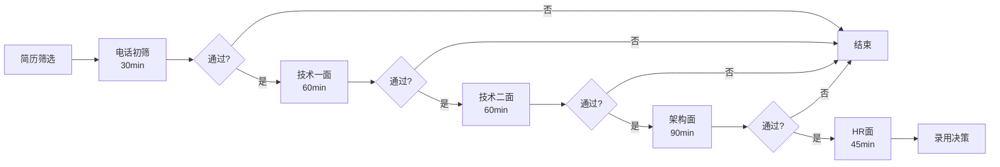

**各轮面试详细设计**：

| 轮次 | 时长 | 侧重点 | 核心考察维度 | 通过标准 |
|-----|------|--------|-------------|---------|
| **简历筛选** | 异步 | 背景匹配度 | 学历、工作经历、项目相关性 | 3年+音视频经验，有SDK/框架开发经历 |
| **电话初筛** | 30min | 基础沟通、动机匹配 | 软素质、职业规划、技术广度 | 沟通清晰，对岗位有明确认知 |
| **技术一面** | 60min | 技术框架广度、行业视野 | 音视频全链路、行业趋势、竞品认知 | 对音视频全链路有系统认知 |
| **技术二面** | 60min | 深度技术、架构设计 | 编解码原理、架构设计、性能优化 | 能深入技术细节，有架构思维 |
| **架构面** | 90min | 系统设计、综合场景 | 复杂场景解决、技术选型、权衡能力 | 能设计完整系统，考虑全面 |
| **HR面** | 45min | 价值观、稳定性、期望 | 软素质、文化匹配、薪酬期望 | 价值观匹配，期望合理 |

**面试官配置建议**：

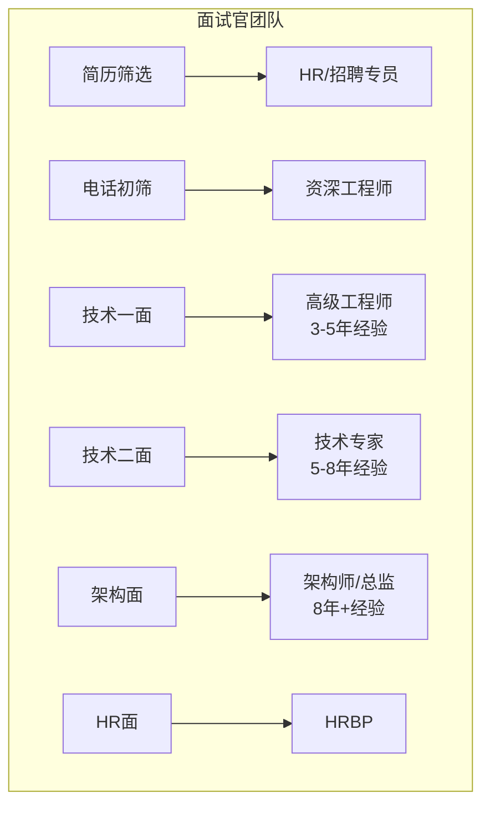

### 1.2 评估维度体系

**MECE分类**：6大评估维度，权重分配体现岗位核心要求。

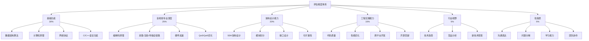

**评分标准（1-5分制）**：

| 维度 | 1分（不合格） | 2分（较差） | 3分（合格） | 4分（良好） | 5分（优秀） |
|-----|--------------|------------|------------|------------|------------|
| **基础功底** | 基本概念不清 | 理解表面，无法深入 | 基础扎实，能解决问题 | 深入理解原理，能优化 | 精通原理，有创新思路 |
| **音视频专业** | 不了解基本概念 | 了解概念，无实践经验 | 熟悉全链路，有项目经验 | 深入原理，能优化性能 | 专家级，能架构创新 |
| **架构设计** | 无架构思维 | 能描述，缺乏系统性 | 能设计基本架构 | 考虑全面，权衡得当 | 架构大师级，前瞻性 |
| **工程实践** | 代码质量差 | 能写代码，不规范 | 代码规范，有优化意识 | 工程经验丰富，质量高 | 工程专家，最佳实践 |
| **行业视野** | 不了解行业 | 了解基本概念 | 关注趋势，有分析 | 深入洞察，有预判 | 行业专家，引领趋势 |
| **软素质** | 沟通困难 | 表达不清 | 沟通顺畅 | 逻辑清晰，影响他人 | 卓越沟通，团队核心 |

**各轮面试维度权重分配**：

| 维度 | 电话初筛 | 技术一面 | 技术二面 | 架构面 | HR面 | 综合权重 |
|-----|---------|---------|---------|--------|------|---------|
| 基础功底 | 10% | 25% | 30% | 15% | - | 30% |
| 音视频专业 | 20% | 35% | 30% | 20% | - | 25% |
| 架构设计 | - | 10% | 25% | 45% | - | 20% |
| 工程实践 | 10% | 20% | 15% | 20% | - | 15% |
| 行业视野 | 30% | 10% | - | - | - | 5% |
| 软素质 | 30% | - | - | - | 100% | 5% |

### 1.3 面试官指导原则

#### 1.3.1 递进式提问策略

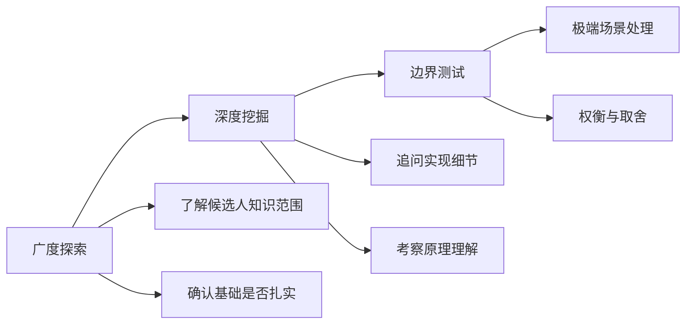

**提问层次示例**（以H.264编码为例）：

| 层次 | 问题 | 考察目标 |
|-----|------|---------|
| **What** | "H.264中有哪几种帧类型？" | 基础概念掌握 |
| **How** | "P帧是如何进行运动估计的？" | 实现原理理解 |
| **Why** | "为什么H.265的CTU比H.264的宏块更大？带来什么好处？" | 设计意图理解 |
| **Trade-off** | "编码复杂度和压缩率之间如何权衡？实时场景下怎么选？" | 实际决策能力 |

#### 1.3.2 识别"背答案"vs"真正理解"

**红旗信号（Red Flags）**：

| 信号 | 表现 | 应对策略 |
|-----|------|---------|
| **机械背诵** | 回答像背书，缺乏停顿思考 | 打断追问细节："这个参数具体是多少？" |
| **回避细节** | 总是停留在概念层面 | 要求画图或写伪代码 |
| **过度使用术语** | 堆砌术语但解释不清 | 要求用通俗语言解释 |
| **无法举一反三** | 换种问法就不会 | 改变问题角度再验证 |
| **缺乏实践经验** | 只讲理论，无实际案例 | 追问"你实际遇到过吗？怎么解决的？" |

**绿旗信号（Green Flags）**：

| 信号 | 表现 | 评价 |
|-----|------|------|
| **结构化回答** | 先给框架，再填细节 | 思维清晰 |
| **承认不知道** | 坦诚表示不了解某部分 | 诚实可信 |
| **主动补充** | 回答后主动补充相关知识点 | 知识面广 |
| **结合实际** | 每个理论都结合实际案例 | 实践经验丰富 |
| **提出质疑** | 对问题本身提出合理质疑 | 批判性思维 |

#### 1.3.3 追问技巧

**漏斗式追问法**：

```
开放问题 → 具体实现 → 边界情况 → 性能优化 → 故障处理
   ↓          ↓          ↓          ↓          ↓
 概念层     实现层     边界层     优化层     运维层
```

**追问话术模板**：

| 场景 | 话术示例 |
|-----|---------|
| **深入原理** | "这个机制背后的原理是什么？" |
| **验证理解** | "如果XXX情况发生，会怎么样？" |
| **考察经验** | "你在实际项目中遇到过这种情况吗？" |
| **测试边界** | "如果数据量增大100倍，这个方案还适用吗？" |
| **评估权衡** | "这个方案有什么缺点？什么场景不适用？" |

---

## 第2章：行业宏观视角评估（技术一面 · 开放题）

**结论先行**：通过开放性行业问题，评估候选人的技术视野、行业认知深度和独立思考能力。优秀候选人应展现出对技术趋势的洞察力、对竞品的客观分析能力，以及对行业痛点的深刻理解。

### 2.1 音视频技术发展趋势

#### 问题1：音视频技术发展趋势

**题目**：请谈谈你对当前音视频技术发展趋势的看法，哪些技术方向你认为最有价值？为什么？

**考察意图**：
- 是否关注行业前沿动态
- 是否有独立的技术判断力
- 是否能将技术趋势与业务价值关联

**参考答案要点**：

| 档次 | 表现 | 参考内容 |
|-----|------|---------|
| **优秀** | 有深度洞察，能关联业务 | 提到AI+音视频融合（如AI编码、实时超分）、超低延迟技术、云渲染/云游戏、空间音频/VR/AR音视频、端侧智能等方向，并能分析每个方向的技术挑战和商业价值 |
| **良好** | 了解趋势，分析较浅 | 能列举3-4个趋势方向，如AV1普及、WebRTC发展、5G+边缘计算等，但缺乏深度分析 |
| **合格** | 了解基本概念 | 能提到H.265/AV1、WebRTC等，但仅停留在概念层面 |
| **不合格** | 不了解行业趋势 | 无法回答或回答偏离主题 |

**追问方向**：
1. "你提到AI编码，具体了解哪些AI编码技术？与传统编码相比优势在哪？"
2. "云游戏场景下的音视频技术有什么特殊挑战？"
3. "你觉得这些技术趋势中，哪个对腾讯的业务最有价值？"

#### 问题2：编码标准对比分析

**题目**：AV1 vs H.265/HEVC vs VVC(H.266)，从技术特点、生态支持、应用场景三个维度对比分析。

**考察意图**：
- 对编码标准的系统性理解
- 技术选型的分析能力
- 对生态和专利问题的认知

**参考答案框架**：

| 维度 | AV1 | H.265/HEVC | VVC/H.266 |
|-----|-----|-----------|-----------|
| **技术特点** | 免专利费、压缩率比H.264高30-50%、编码复杂度高 | 压缩率比H.264高50%、专利费用高、硬件支持成熟 | 压缩率比H.265高50%、编码复杂度极高、2020年发布 |
| **生态支持** | 谷歌/苹果/微软支持、浏览器支持好、硬件加速逐步普及 | 硬件支持最成熟、专利池复杂(3个专利池) | 生态初期、硬件支持有限 |
| **应用场景** | 流媒体(YouTube/Netflix)、RTC、浏览器场景 | 广播电视、4K/8K视频、监控 | 8K视频、专业制作、未来应用 |

**评分标准**：

| 档次 | 表现 |
|-----|------|
| **优秀** | 能详细对比三个标准，提到专利费用、编码复杂度、硬件支持等关键因素，能给出具体选型建议 |
| **良好** | 能对比主要差异，但缺少细节（如具体压缩率数据、专利细节） |
| **合格** | 了解基本概念，能说出AV1免费、H.265收费等 |
| **不合格** | 混淆概念或无法回答 |

**追问方向**：
1. "AV1的编码复杂度具体有多高？在移动端实时编码可行吗？"
2. "H.265的专利费用对中小公司有什么影响？"
3. "如果让你为实时通信场景选择编码标准，你会怎么选？"

#### 问题3：WebRTC的优劣分析

**题目**：WebRTC在实时通信领域的优势和局限性是什么？如果让你设计一个比WebRTC更好的方案，你会从哪些方面入手？

**考察意图**：
- 对WebRTC的深入理解
- 批判性思维和创新意识
- 架构设计能力

**参考答案框架**：

**WebRTC优势**：
- 开源免费，生态成熟
- 内置ICE/STUN/TURN，NAT穿越能力强
- 支持端到端加密（DTLS-SRTP）
- 浏览器原生支持，无需插件

**WebRTC局限性**：
- 信令层未标准化，各厂商实现不一
- 移动端性能优化空间有限
- 大规模部署时SFU/MCU架构复杂
- 与现有音视频系统对接成本高
- 定制化需求难以满足

**改进方向**：
- 更灵活的编解码器选择机制
- 更高效的移动端实现
- 更好的QoS/QoE自适应策略
- 更简单的服务端架构
- 更强的可观测性和调试能力

**追问方向**：
1. "WebRTC的ICE机制具体是如何工作的？"
2. "WebRTC在移动端有哪些性能瓶颈？如何优化？"
3. "你觉得自研传输协议相比WebRTC有什么优势和风险？"

#### 问题4：HDR与SDR处理差异

**题目**：HDR和SDR在音视频链路中的处理差异有哪些？端到端HDR支持的技术挑战是什么？

**考察意图**：
- 对色彩管理的理解
- 对端到端系统的认知
- 对技术复杂度的评估能力

**参考答案框架**：

**处理差异**：

| 环节 | SDR | HDR |
|-----|-----|-----|
| **采集** | 8bit/10bit，BT.709色域 | 10bit/12bit，BT.2020色域 |
| **编码** | 传统Gamma编码 | PQ(HLG)传递函数，元数据 |
| **传输** | 无需额外信息 | 需传递HDR元数据 |
| **解码** | 直接Gamma解码 | 需解析元数据，Tone Mapping |
| **渲染** | 直接显示 | 需根据显示设备能力调整 |

**技术挑战**：
1. **元数据传递**：HDR10的静态元数据、Dolby Vision的动态元数据如何在全链路传递
2. **Tone Mapping**：不同显示设备的亮度能力差异（100nit vs 1000nit vs 4000nit）
3. **兼容性**：SDR设备如何显示HDR内容（兼容性问题）
4. **性能**：HDR处理计算量大，移动端功耗高
5. **标准不统一**：HDR10、HLG、Dolby Vision等多标准并存

### 2.2 行业竞品分析

#### 问题5：音视频SDK产品对比

**题目**：你了解哪些音视频SDK/PaaS产品？请从技术架构、功能特性、性能指标三个维度对比分析。

**考察意图**：
- 行业认知广度
- 竞品分析能力
- 技术判断力

**参考答案框架**：

**主要竞品**：

| 产品 | 厂商 | 技术架构特点 | 核心优势 | 局限性 |
|-----|------|-------------|---------|--------|
| **声网Agora SDK** | 声网 | SD-RTN全球网络、自研编解码 | 低延迟、抗弱网能力强、全球覆盖 | 价格较高、定制化受限 |
| **腾讯TRTC** | 腾讯 | 基于标准WebRTC、云原生架构 | 与腾讯云生态集成好、性价比高 | 全球化能力待提升 |
| **阿里RTC** | 阿里云 | 边缘计算架构、智能调度 | 与阿里云生态集成、AI能力 | 起步较晚，生态待完善 |
| **Twilio** | Twilio | 基于Kurento、WebRTC标准 | 开发者友好、文档完善 | 国内体验一般 |
| **Daily.co** | Daily | 简化WebRTC封装 | 易用性强、快速集成 | 功能相对简单 |

**评分标准**：

| 档次 | 表现 |
|-----|------|
| **优秀** | 能对比3+产品，深入分析架构差异，有实际使用经验，能客观评价优劣势 |
| **良好** | 能对比2-3个主要产品，了解基本差异 |
| **合格** | 知道1-2个产品，能说出基本功能 |
| **不合格** | 不了解竞品 |

**追问方向**：
1. "声网的SD-RTN网络相比标准WebRTC有什么优势？"
2. "你觉得腾讯TRTC相比声网，应该在哪些方面重点突破？"
3. "这些产品的定价模式有什么不同？对选型有什么影响？"

### 2.3 行业痛点与挑战

#### 问题6：实时音视频技术挑战

**题目**：当前实时音视频领域最大的技术挑战是什么？你认为未来3-5年会有哪些突破？

**考察意图**：
- 对技术难点的认知
- 技术趋势预判能力
- 创新思维

**参考答案框架**：

**当前最大挑战**：

1. **弱网环境下的体验保障**
   - 高丢包、高抖动、低带宽下的音视频质量
   - 端到端延迟与质量的权衡

2. **海量并发下的成本控制**
   - 千万级并发下的服务器成本
   - 边缘计算与中心计算的平衡

3. **端侧性能与功耗优化**
   - 移动端编解码功耗
   - AI算法与音视频处理的资源竞争

4. **跨平台一致性**
   - 不同平台（iOS/Android/Web/PC）的体验差异
   - 硬件能力差异的适配

**未来突破方向**：

| 方向 | 预期突破 | 时间预估 |
|-----|---------|---------|
| **AI编码** | 基于神经网络的编码器商用 | 3-5年 |
| **端侧AI** | 实时超分、降噪普及 | 2-3年 |
| **空间音频** | 沉浸式音频标准化 | 2-3年 |
| **云渲染** | 云游戏/云桌面普及 | 3-5年 |
| **6DoF视频** | 自由视角视频成熟 | 5年+ |

---

## 第3章：技术框架把控能力（技术一面 · 核心题）

**结论先行**：音视频全链路是SDK架构师的核心知识域，需要系统掌握从采集到渲染的每个环节的技术原理、优化手段和平台差异。面试通过递进式问题链，评估候选人对全链路的系统性认知深度。

### 3.1 音视频全链路技术考察

**完整链路架构**：

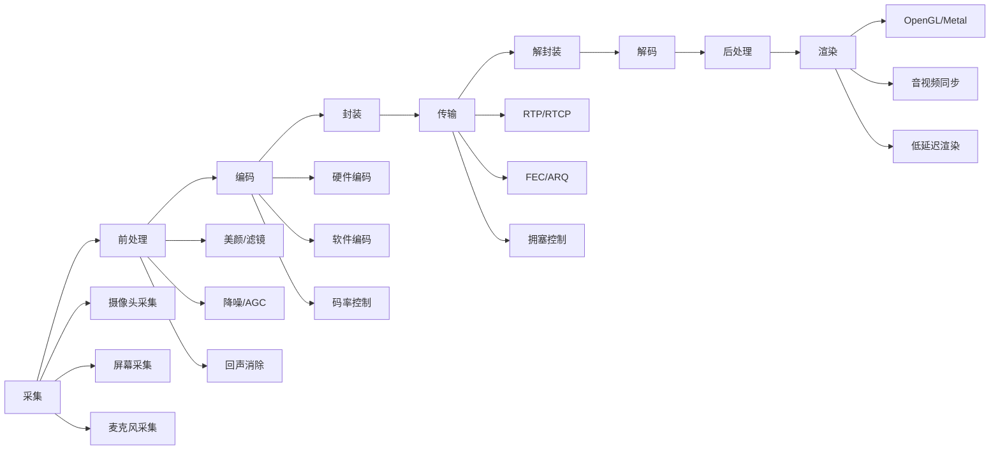

#### 3.1.1 采集环节

**问题1（基础）**：描述一下iOS/Android平台上摄像头采集的技术方案，各有什么优劣？

**参考答案要点**：

| 平台 | API | 特点 | 优势 | 劣势 |
|-----|-----|------|-----|------|
| **iOS** | AVFoundation | 高级抽象，功能完整 | 稳定、文档完善、性能优化好 | 灵活性受限 |
| **iOS** | CoreMediaIO | 底层访问 | 更灵活、可获取原始数据 | 复杂度高 |
| **Android** | Camera2 API | 现代推荐API | 功能强大、支持手动控制 | 碎片化严重 |
| **Android** | CameraX | Jetpack封装 | 易用、向后兼容 | 高级功能受限 |
| **Android** | Camera API (旧) | 已废弃 | - | 功能有限 |

**追问方向**：
- "Camera2的Session机制是什么？为什么这样设计？"
- "如何在Android上实现高帧率（120fps/240fps）采集？"
- "不同厂商的Camera2实现有什么差异？如何处理？"

**问题2（进阶）**：如何实现低延迟的摄像头采集？从硬件缓冲到应用层数据的全链路延迟怎么优化？

**参考答案要点**：

**延迟来源分析**：

```
传感器曝光 → ISP处理 → 帧缓冲 → 驱动传输 → 应用层获取 → 格式转换 → 编码器输入
   5ms       5-10ms      1ms        1-2ms        1-2ms        2-5ms        1ms
```

**优化策略**：

1. **硬件层优化**
   - 使用零拷贝（Zero-copy）缓冲区
   - 选择合适的预览分辨率（避免过度缩放）
   - 减少ISP处理（如关闭不必要的降噪）

2. **驱动层优化**
   - 减少缓冲队列深度（trade-off：可能丢帧）
   - 使用SurfaceTexture/Surface直接输出到GPU

3. **应用层优化**
   - 避免不必要的格式转换（YUV直接传递）
   - 使用共享内存减少拷贝

**问题3（深入）**：屏幕采集场景下，如何处理高分辨率和高帧率的性能压力？系统限制有哪些？

**参考答案要点**：

| 平台 | 采集方式 | 性能瓶颈 | 系统限制 |
|-----|---------|---------|---------|
| **iOS** | ReplayKit | 内存带宽、GPU | 仅支持App内录制（iOS 11+支持系统级） |
| **iOS** | ScreenCaptureKit (macOS) | CPU编码压力 | macOS 12.5+ |
| **Android** | MediaProjection | 内存拷贝、编码 | Android 5.0+，需用户授权 |
| **Android** | VirtualDisplay | GPU渲染压力 | 受限于GPU性能 |

**优化策略**：
- 动态分辨率调整（根据内容变化率）
- 硬件编码器优先
- 帧率自适应（内容静止时降帧率）
- 差分编码（只传输变化区域）

#### 3.1.2 编码环节

**问题1（基础）**：H.264编码中I帧、P帧、B帧的作用和区别？GOP结构如何影响延迟和画质？

**参考答案要点**：

| 帧类型 | 编码方式 | 压缩率 | 解码依赖 | 适用场景 |
|-------|---------|--------|---------|---------|
| **I帧** | 帧内编码 | 低 | 无 | 随机访问点、场景切换 |
| **P帧** | 前向预测 | 中 | 依赖I/P帧 | 一般帧 |
| **B帧** | 双向预测 | 高 | 依赖前后帧 | 非实时场景 |

**GOP结构影响**：

```
GOP大小 ↑ → 压缩率 ↑ → 延迟 ↑ → 抗丢包能力 ↓
GOP大小 ↓ → 压缩率 ↓ → 延迟 ↓ → 抗丢包能力 ↑
```

**实时场景推荐**：
- 低延迟：GOP=1-2秒（如30fps时GOP=30-60）
- 禁用B帧（减少延迟和解码依赖）
- 使用Intra Refresh替代完整I帧

**问题2（进阶）**：硬件编码vs软件编码的选型考量？什么场景下应该优先使用哪种？如何做到graceful fallback？

**参考答案要点**：

| 维度 | 硬件编码 | 软件编码 |
|-----|---------|---------|
| **性能** | 高（专用电路） | 低（CPU计算） |
| **功耗** | 低 | 高 |
| **延迟** | 低 | 较高 |
| **灵活性** | 低（参数受限） | 高（完全可控） |
| **兼容性** | 依赖硬件 | 跨平台 |
| **画质** | 同码率略差 | 同码率更好 |

**选型策略**：

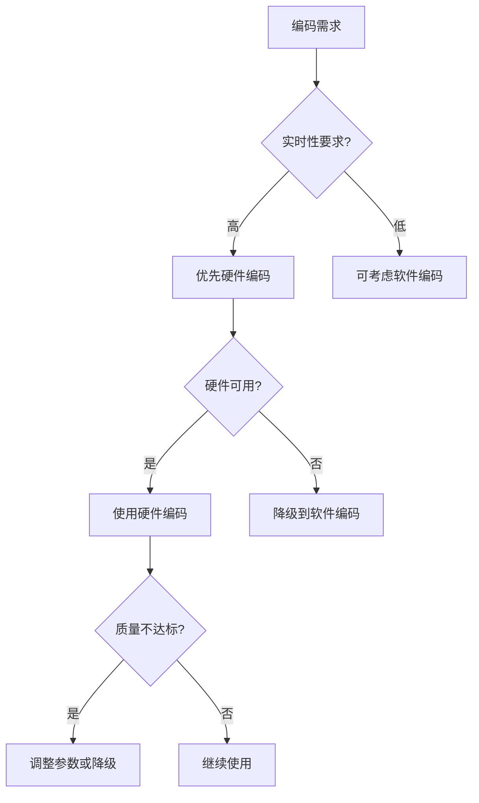

**Graceful Fallback机制**：
1. 初始化时检测硬件编码器可用性
2. 运行时监控编码质量（码率控制偏差）
3. 异常时（编码失败、质量不达标）自动切换到软件编码
4. 提供手动强制模式选择接口

**问题3（深入）**：如何设计一个自适应码率控制策略？在实时通信场景下CBR和VBR哪个更合适？为什么？

**参考答案要点**：

**实时通信场景推荐CBR**：
- 网络带宽预测相对稳定
- 缓冲区小，VBR的码率波动容易导致拥塞
- 延迟敏感，需要稳定的码率输出

**自适应码率控制设计**：

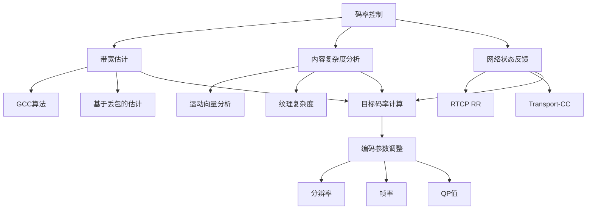

**关键参数调整策略**：

| 网络状态 | 分辨率 | 帧率 | QP范围 |
|---------|--------|------|--------|
| 良好 | 1080p | 30fps | 20-30 |
| 一般 | 720p | 24fps | 25-35 |
| 较差 | 480p | 15fps | 30-40 |
| 极差 | 360p | 10fps | 35-45 |

#### 3.1.3 传输环节

**问题1（基础）**：RTP/RTCP协议的核心机制是什么？RTCP反馈对质量控制有什么作用？

**参考答案要点**：

**RTP核心机制**：
- 序号（Sequence Number）：检测丢包、排序
- 时间戳（Timestamp）：音视频同步、抖动计算
- SSRC/CSRC：流标识
- Payload Type：编码格式标识

**RTCP反馈类型及作用**：

| 反馈类型 | 作用 | 应用场景 |
|---------|------|---------|
| **RR (Receiver Report)** | 丢包率、抖动、延迟 | 带宽估计、拥塞控制 |
| **SR (Sender Report)** | 发送统计、NTP/RTP时间映射 | 音视频同步 |
| **NACK** | 丢包重传请求 | 丢包恢复 |
| **PLI/FIR** | 请求关键帧 | 解码错误恢复 |
| **REMB** | 接收端带宽估计 | 码率控制 |
| **Transport-CC** | 传输层拥塞控制 | 更精确的带宽估计 |

**问题2（进阶）**：弱网环境下的传输优化策略有哪些？FEC和ARQ各适用什么场景？

**参考答案要点**：

**弱网优化策略**：

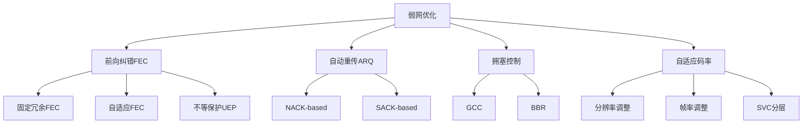

**FEC vs ARQ对比**：

| 特性 | FEC | ARQ |
|-----|-----|-----|
| **延迟** | 低（无往返） | 高（需RTT） |
| **带宽开销** | 固定冗余 | 按需重传 |
| **适用丢包率** | 低-中（<10%） | 中-高 |
| **适用场景** | 实时通信、低延迟直播 | 文件传输、点播 |
| **实现复杂度** | 中 | 低 |

**混合策略（推荐）**：
- 低延迟场景：FEC为主，ARQ为辅（仅重传关键帧）
- 自适应：根据RTT动态调整FEC冗余度和ARQ策略

**问题3（深入）**：如何设计一个端到端的拥塞控制算法？GCC(Google Congestion Control)的原理是什么？

**参考答案要点**：

**GCC原理**：

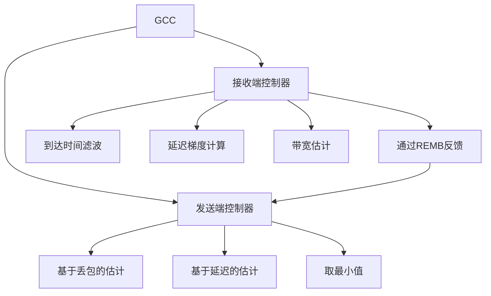

**关键机制**：

1. **基于延迟的估计（接收端）**
   - 测量包组间延迟梯度
   - 使用Kalman滤波平滑
   - 判断网络拥塞趋势

2. **基于丢包的估计（发送端）**
   - 统计RTCP RR中的丢包率
   - 丢包率<2%：增加码率
   - 丢包率2-10%：保持
   - 丢包率>10%：降低码率

3. **带宽估计融合**
   - 最终码率 = min(延迟估计, 丢包估计)

#### 3.1.4 渲染环节

**问题1（基础）**：OpenGL ES/Metal/Vulkan在移动端渲染中的选型考量？

**参考答案要点**：

| API | 平台支持 | 性能 | 易用性 | 适用场景 |
|-----|---------|------|--------|---------|
| **OpenGL ES** | 跨平台 | 中 | 中 | 通用、兼容性优先 |
| **Metal** | iOS/macOS | 高 | 高 | iOS高性能渲染 |
| **Vulkan** | Android/跨平台 | 最高 | 低 | 极致性能、游戏引擎 |

**选型建议**：
- iOS：优先Metal，OpenGL ES作为fallback
- Android：OpenGL ES为主，Vulkan逐步引入
- 跨平台SDK：抽象渲染层，支持多后端

**问题2（进阶）**：音视频同步的实现方案？如何处理网络抖动对同步的影响？

**参考答案要点**：

**同步方案对比**：

| 方案 | 原理 | 优点 | 缺点 |
|-----|------|-----|------|
| **音频主导** | 音频时间戳为基准，视频追赶 | 音频不能卡顿 | 视频可能跳帧 |
| **视频主导** | 视频时间戳为基准，音频追赶 | 视频流畅 | 音频可能变调 |
| **外部时钟** | 独立时钟，两者都调整 | 最灵活 | 实现复杂 |

**推荐方案**：音频主导（音频对延迟更敏感）

**抖动处理**：

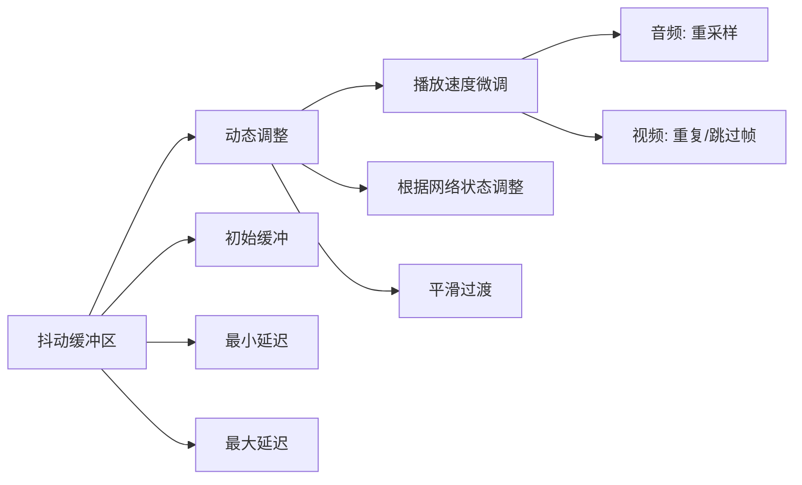

**问题3（深入）**：如何实现低延迟渲染？从解码输出到屏幕显示的链路延迟怎么优化？

**参考答案要点**：

**延迟来源**：

```
解码完成 → 后处理 → GPU上传 → 渲染 → 显示刷新
   1ms       2-5ms      1ms       5ms      8-16ms
```

**优化策略**：

1. **零拷贝渲染**
   - 解码器直接输出到GPU纹理
   - 避免CPU-GPU内存拷贝

2. **后处理优化**
   - 将后处理（缩放、色彩空间转换）合并到GPU Shader
   - 减少Pass数

3. **渲染时序优化**
   - 预测下一帧显示时间点
   - 在合适时机提交渲染

4. **显示同步**
   - 理解VSYNC机制
   - 避免撕裂和额外延迟

### 3.2 跨平台兼容性

**问题1**：设计一个跨平台音视频SDK需要考虑哪些关键差异？如何抽象平台差异？

**参考答案要点**：

**关键差异点**：

| 维度 | iOS | Android | Windows | macOS |
|-----|-----|---------|---------|-------|
| **采集** | AVFoundation | Camera2/CameraX | DirectShow/MediaFoundation | AVFoundation |
| **编码** | VideoToolbox | MediaCodec | Media Foundation | VideoToolbox |
| **渲染** | Metal/OpenGL | OpenGL/Vulkan | DirectX/OpenGL | Metal/OpenGL |
| **线程** | GCD | HandlerThread/线程池 | std::thread | GCD/std::thread |
| **内存** | 统一内存架构 | 独立GPU内存 | 独立GPU内存 | 统一内存架构 |

**抽象层设计**：

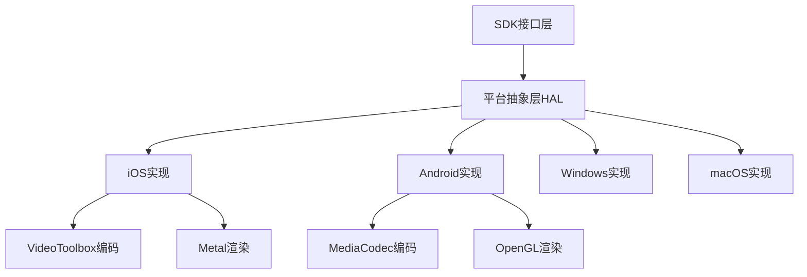

### 3.3 性能优化体系

**问题1**：音视频SDK中最常见的性能瓶颈有哪些？你是如何定位和优化的？

**参考答案要点**：

**常见瓶颈**：

| 瓶颈类型 | 症状 | 定位工具 | 优化策略 |
|---------|------|---------|---------|
| **CPU过载** | 帧率下降、卡顿 | Profiler、Systrace | 算法优化、硬件加速、降分辨率 |
| **内存带宽** | 高延迟、卡顿 | Instruments、Perfetto | 零拷贝、减少缓冲、压缩 |
| **GPU瓶颈** | 渲染卡顿 | GPU Profiler | 简化Shader、降低复杂度 |
| **线程争用** | 偶发卡顿 | TSan、锁分析 | 无锁设计、线程分离 |
| **网络延迟** | 端到端延迟高 | 网络抓包 | 拥塞控制、FEC优化 |

**问题2**：移动端功耗优化在音视频场景中有哪些挑战？如何在画质和功耗之间取得平衡？

**参考答案要点**：

**功耗来源**：

```
摄像头ISP: 10-15%
视频编码: 20-30%
网络传输: 15-20%
屏幕显示: 30-40%
其他: 10-15%
```

**优化策略**：

1. **动态质量调整**
   - 根据温度调整编码参数
   - 低电量模式下降质量

2. **硬件加速优先**
   - 优先使用硬件编码器
   - GPU后处理替代CPU

3. **智能调度**
   - 内容静止时降帧率
   - 后台时暂停非必要处理

---

## 第4章：架构设计思维（技术二面 · 重点）

**结论先行**：架构设计能力是音视频SDK架构师的核心竞争力，需要体现分层设计思想、模块解耦能力、接口抽象水平和可扩展性考量。通过系统设计题和模块设计题，评估候选人的架构思维和工程判断力。

### 4.1 SDK架构设计

#### 设计题1：实时音视频SDK整体架构

**题目**：请设计一个实时音视频SDK的整体架构，需要支持1v1通话、多人会议、直播推流三种场景。

**期望答案要点**：

**1. 分层架构设计**：

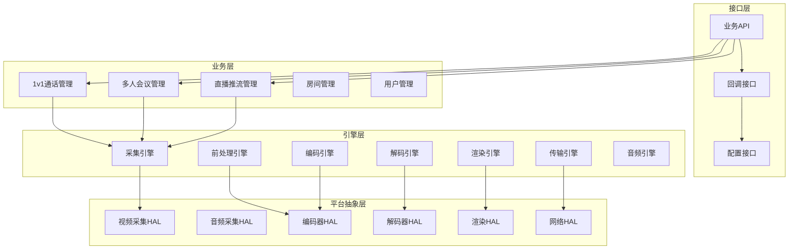

**2. 核心模块划分**：

| 模块 | 职责 | 关键接口 |
|-----|------|---------|
| **采集模块** | 摄像头/麦克风数据采集 | StartCapture/StopCapture |
| **前处理模块** | 美颜、滤镜、降噪 | ProcessFrame |
| **编码模块** | 视频/音频编码 | Encode |
| **传输模块** | RTP打包、网络发送 | SendPacket |
| **信令模块** | 房间管理、状态同步 | JoinRoom/LeaveRoom |
| **解码模块** | 视频/音频解码 | Decode |
| **渲染模块** | 视频显示、音频播放 | Render |

**3. 模块间通信机制**：

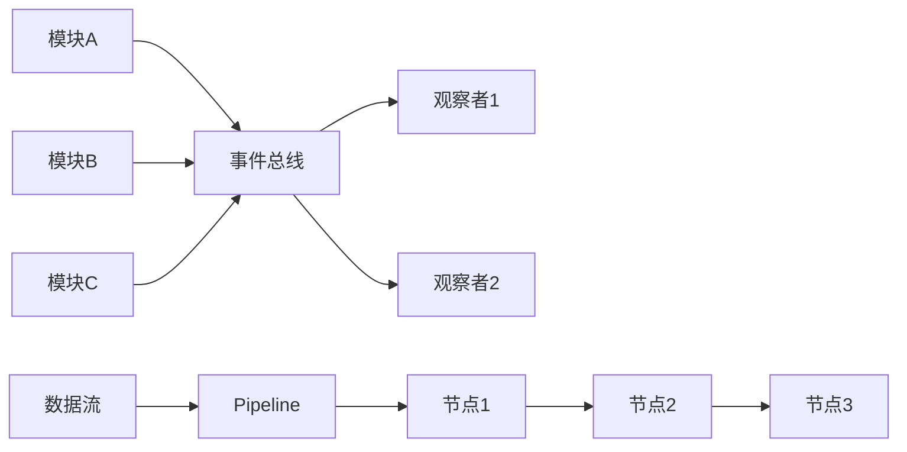

- **事件通知**：观察者模式、事件总线
- **数据流转**：Pipeline模式、环形缓冲区

**4. 线程模型设计**：

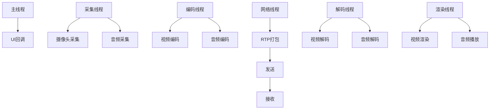

**线程职责与同步**：

| 线程 | 职责 | 同步机制 |
|-----|------|---------|
| **采集线程** | 采集原始数据 | 生产者-消费者队列 |
| **编码线程** | 编码处理 | 输入队列+信号量 |
| **网络线程** | 收发数据 | 无锁队列 |
| **解码线程** | 解码处理 | 抖动缓冲区 |
| **渲染线程** | 显示/播放 | 同步屏障 |

**5. 可扩展性设计**：

- **插件机制**：编解码器插件、前处理插件
- **策略模式**：码率控制策略、拥塞控制策略
- **配置驱动**：通过配置调整行为，无需改代码

**6. 异常处理和容错机制**：

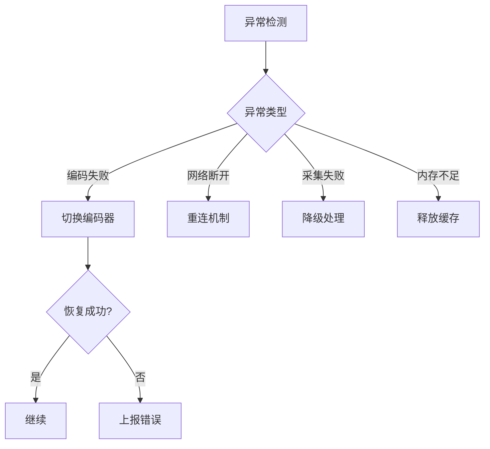

**评估标准**：

| 维度 | 优秀 | 良好 | 合格 | 不合格 |
|-----|------|------|------|--------|
| **分层清晰** | 4+层明确分层，职责清晰 | 3层分层，基本清晰 | 有分层意识 | 无分层 |
| **模块划分** | 模块内聚高、耦合低 | 模块划分合理 | 有模块概念 | 模块混乱 |
| **线程设计** | 线程职责明确，同步机制合理 | 线程设计基本合理 | 有线程意识 | 线程设计混乱 |
| **可扩展性** | 插件化、策略模式 | 有扩展考虑 | 简单提及 | 无考虑 |
| **异常处理** | 完整的容错机制 | 有异常处理 | 简单提及 | 无考虑 |

#### 设计题2：多人会议性能优化

**题目**：现有音视频SDK在多人视频会议场景下出现性能问题（CPU占用过高、延迟增大、画质下降），请分析可能的原因并设计优化方案。

**期望答案要点**：

**1. 问题分析**：

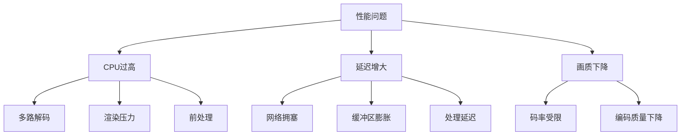

**2. 优化方案**：

| 问题 | 根因 | 优化方案 |
|-----|------|---------|
| **CPU过高** | 多路解码 | SFU架构、大小流、SVC分层 |
| **延迟增大** | 网络拥塞 | 自适应码率、优先级队列 |
| **画质下降** | 带宽不足 | Simulcast、智能路由 |

**3. SFU架构设计**：

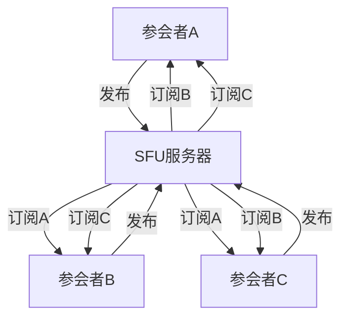

**4. 大小流策略**：

- 每路视频发布多个分辨率（如180p/360p/720p）
- 接收端根据带宽和布局选择合适流
- 大屏显示用高清，小屏用低清

### 4.2 模块设计与接口设计

**问题1**：如何设计音视频SDK的编解码器抽象层？需要支持多种编解码标准和硬件/软件实现的切换。

**参考答案要点**：

**抽象接口设计**：

```cpp
// 编码器接口
class IVideoEncoder {
public:
    virtual ~IVideoEncoder() = default;
    
    // 初始化
    virtual bool Init(const EncoderConfig& config) = 0;
    
    // 编码
    virtual bool Encode(const VideoFrame& frame, 
                       std::vector<uint8_t>& output) = 0;
    
    // 动态码率调整
    virtual bool SetBitrate(int bitrate_bps) = 0;
    
    // 请求关键帧
    virtual bool RequestKeyFrame() = 0;
    
    // 释放
    virtual void Release() = 0;
    
    // 获取编码器信息
    virtual EncoderInfo GetInfo() const = 0;
};

// 编码器工厂
class VideoEncoderFactory {
public:
    static std::unique_ptr<IVideoEncoder> Create(
        CodecType codec,
        EncoderImplementation impl);
};
```

**问题2**：设计一个音频处理Pipeline的接口，需要支持回声消除、降噪、AGC等模块的灵活组合。

**参考答案要点**：

```cpp
// 音频处理节点接口
class IAudioProcessor {
public:
    virtual ~IAudioProcessor() = default;
    virtual bool Process(AudioFrame& frame) = 0;
    virtual bool Initialize(const AudioConfig& config) = 0;
    virtual void Release() = 0;
};

// Pipeline构建器
class AudioPipelineBuilder {
public:
    AudioPipelineBuilder& AddAEC();
    AudioPipelineBuilder& AddNS();
    AudioPipelineBuilder& AddAGC();
    AudioPipelineBuilder& AddVAD();
    
    std::unique_ptr<AudioPipeline> Build();
};

// 使用示例
auto pipeline = AudioPipelineBuilder()
    .AddAEC()
    .AddNS()
    .AddAGC()
    .Build();
```

### 4.3 技术选型与权衡

**问题1**：自研传输协议 vs 基于WebRTC二次开发，你会如何选择？各有什么优缺点？

**参考答案要点**：

| 维度 | 自研协议 | 基于WebRTC |
|-----|---------|-----------|
| **开发周期** | 长（1-2年） | 短（3-6个月） |
| **技术风险** | 高 | 低 |
| **可控性** | 完全可控 | 受限于WebRTC架构 |
| **性能上限** | 可针对业务优化 | 通用设计，优化空间有限 |
| **维护成本** | 高 | 低 |
| **生态兼容** | 需自建生态 | 浏览器原生支持 |

**选型建议**：
- 快速验证/MVP：基于WebRTC
- 长期战略/差异化：自研协议
- 混合方案：WebRTC兼容层 + 自研传输

**问题2**：如果需要在SDK中引入AI能力（超分辨率、降噪、虚拟背景），架构层面需要做哪些设计？

**参考答案要点**：

**架构设计要点**：

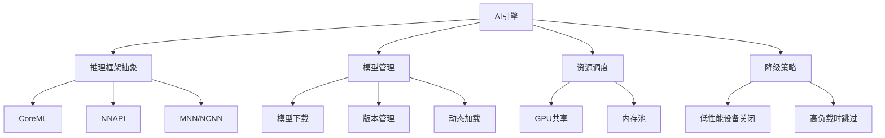

**关键设计**：
1. **推理框架抽象**：屏蔽平台差异（CoreML/NNAPI/TFLite）
2. **模型管理**：热更新、版本控制、按需下载
3. **资源调度**：与音视频处理共享GPU资源
4. **降级策略**：设备性能不足时自动关闭AI功能

---

## 第5章：深度技术问题（技术二面/架构面 · 递进式深挖）

**结论先行**：通过递进式问题链，从基础概念逐步深入到实现原理、优化手段和边界情况，评估候选人的技术深度和知识体系的完整性。优秀候选人应能清晰解释原理、准确回答细节、并展现对技术演进的理解。

### 5.1 音视频编解码深度

#### 问题链1：宏块与CTU机制

**问题1.1（基础）**：解释H.264的宏块划分机制。

**参考答案要点**：

- H.264将帧划分为16x16像素的宏块（Macroblock）
- 每个宏块可进一步划分为更小的子块（8x8、4x4）
- 支持帧内预测（Intra）和帧间预测（Inter）
- 运动估计以宏块为单位进行

**问题1.2（进阶）**：H.265的CTU相比H.264的宏块有什么改进？

**参考答案要点**：

| 特性 | H.264宏块 | H.265 CTU |
|-----|----------|-----------|
| **最大尺寸** | 16x16 | 64x64 |
| **划分方式** | 固定4种 | 递归四叉树划分 |
| **最小单元** | 4x4 | 4x4 |
| **灵活性** | 低 | 高（自适应内容） |

**CTU（Coding Tree Unit）优势**：
- 平坦区域使用大块，减少开销
- 复杂区域使用小块，提高精度
- 更灵活的运动补偿

**问题1.3（深入）**：这些改进带来了多少编码效率提升？代价是什么？

**参考答案要点**：

**编码效率**：
- 相同质量下，H.265比H.264节省约50%码率
- 主要收益来自：更大的CTU、更精细的帧内预测、更多的参考帧

**代价**：
- **计算复杂度**：编码复杂度增加约3-5倍
- **内存需求**：需要更大的参考帧缓冲区
- **延迟增加**：更大的CTU处理需要更多的lookahead

#### 问题链2：变换量化

**问题2.1（基础）**：什么是变换量化？DCT变换在视频编码中的作用是什么？

**参考答案要点**：

**变换量化流程**：

```
残差数据 → DCT变换 → 系数 → 量化 → 熵编码
```

**DCT作用**：
- 将空间域信号转换到频域
- 能量集中在低频系数，便于压缩
- 去除空间相关性

**问题2.2（进阶）**：为什么H.265引入了DST？

**参考答案要点**：

**DST（Discrete Sine Transform）**：
- 用于4x4帧内预测残差的变换
- 相比DCT，DST更适合帧内预测残差的特性
- 帧内预测残差在边界处相关性更强，DST在此场景下效率更高

**使用场景**：
- H.265：4x4帧内亮度块使用DST
- H.264：全部使用DCT

**问题2.3（深入）**：量化步长QP和码率之间是什么关系？

**参考答案要点**：

**QP（Quantization Parameter）**：
- QP值越大 → 量化越粗糙 → 码率越低 → 质量越差
- QP值越小 → 量化越精细 → 码率越高 → 质量越好

**码率与QP的关系（近似）**：

```
码率 ∝ 2^(-QP/6)
```

即QP每增加6，码率约减半。

**实际应用**：
- CBR模式下，通过调整QP控制码率
- 质量敏感区域使用较小QP
- 背景区域使用较大QP

#### 问题链3：帧间预测

**问题3.1（基础）**：帧内预测和帧间预测的原理？

**参考答案要点**：

**帧内预测（Intra Prediction）**：
- 利用空间相关性
- 使用当前帧已编码的相邻像素预测当前块
- H.264支持9种预测模式（4x4亮度块）
- H.265支持35种预测模式

**帧间预测（Inter Prediction）**：
- 利用时间相关性
- 在参考帧中搜索最佳匹配块（运动估计）
- 记录运动向量（MV）和残差

**问题3.2（进阶）**：运动估计的搜索算法有哪些？

**参考答案要点**：

| 算法 | 原理 | 复杂度 | 适用场景 |
|-----|------|--------|---------|
| **全搜索** | 遍历所有可能位置 | 最高 | 质量要求极高 |
| **三步搜索** | 由粗到精的三步搜索 | 低 | 快速编码 |
| **钻石搜索** | 菱形搜索模式 | 中 | 通用场景 |
| **六边形搜索** | 六边形搜索模式 | 中 | H.264默认 |
| **TZ搜索** | 预测向量+多模式搜索 | 中高 | H.265默认 |

**问题3.3（深入）**：H.265的merge模式是什么？解决什么问题？

**参考答案要点**：

**Merge模式**：
- 复用相邻已编码块的运动向量
- 不需要传输运动向量差（MVD）
- 从候选列表中选择最佳MV

**解决的问题**：
- 减少运动向量编码开销
- 相邻块通常有相似运动
- 在静止或缓慢运动区域效果显著

**候选列表来源**：
- 空间相邻块（左、上、右上）
- 时域相邻块（同位置参考帧）
- 零运动向量

### 5.2 硬件加速与全链路优化

#### 问题1：iOS VideoToolbox

**题目**：iOS平台VideoToolbox的使用经验？如何处理硬编码的各种异常情况？

**参考答案要点**：

**VideoToolbox使用流程**：

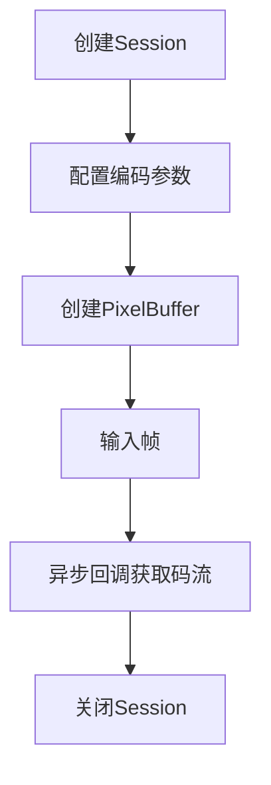

**常见异常及处理**：

| 异常 | 原因 | 处理策略 |
|-----|------|---------|
| **编码失败** | 分辨率不支持 | 降级到软件编码 |
| **内存不足** | 缓冲区过大 | 减少缓冲深度 |
| **码率控制偏差** | 场景突变 | 动态调整QP |
| **关键帧丢失** | 编码器错误 | 强制IDR帧 |
| **Session失效** | 后台切换 | 重建Session |

**关键代码片段**：

```objc
// 处理编码回调中的错误
void encodeCallback(void *outputCallbackRefCon,
                   void *sourceFrameRefCon,
                   OSStatus status,
                   VTEncodeInfoFlags infoFlags,
                   CMSampleBufferRef sampleBuffer) {
    if (status != noErr) {
        // 记录错误码，触发降级
        handleEncodeError(status);
        return;
    }
    // 正常处理码流
}
```

#### 问题2：Android MediaCodec

**题目**：Android MediaCodec的坑有哪些？不同厂商的兼容性问题如何处理？

**参考答案要点**：

**MediaCodec常见问题**：

| 问题 | 表现 | 解决方案 |
|-----|------|---------|
| **配置失败** | createCodec失败 | 检查MIME类型和分辨率支持 |
| **输入缓冲区阻塞** | dequeueInputBuffer超时 | 使用非阻塞模式或超时处理 |
| **输出格式变化** | 分辨率切换 | 监听format-change事件 |
| **缓冲区泄漏** | 内存持续增长 | 及时releaseOutputBuffer |
| **异步模式兼容** | Android 5.0+ | 提供同步模式fallback |

**厂商兼容性问题**：

| 厂商 | 问题 | 处理方案 |
|-----|------|---------|
| **华为** | 某些分辨率不支持 | 黑名单机制 |
| **小米** | 码率控制偏差大 | 动态调整策略 |
| **三星** | 后台编码限制 | 前台服务保活 |
| **OPPO/vivo** | 特定机型crash | 白名单机制 |

**兼容性处理框架**：

```java
public class MediaCodecCompat {
    private static final Set<String> BLACKLIST = Set.of(
        "HUAWEI-XXX", "XIAOMI-YYY"
    );
    
    public static boolean isHardwareEncodeSupported() {
        // 检查机型黑名单
        // 检查分辨率支持
        // 测试编码功能
    }
}
```

#### 问题3：GPU加速与Zero-copy

**题目**：GPU加速在音视频处理中有哪些应用？如何设计CPU-GPU之间的数据流转？

**参考答案要点**：

**GPU加速应用场景**：

| 场景 | 计算类型 | 加速效果 |
|-----|---------|---------|
| **视频滤镜** | 像素级并行 | 10-50x |
| **色彩空间转换** | 矩阵运算 | 5-10x |
| **缩放/旋转** | 纹理采样 | 10-20x |
| **AI推理** | 矩阵乘法 | 10-100x |

**CPU-GPU数据流转设计**：

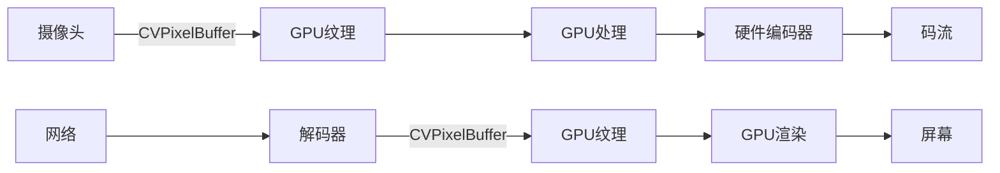

**Zero-copy关键**：
- iOS：使用CVPixelBuffer的IOSurface支持
- Android：使用Surface/SurfaceTexture
- 避免CPU-GPU内存拷贝

### 5.3 多线程与并发设计

#### 问题1：音视频SDK线程模型

**题目**：音视频SDK的线程模型一般如何设计？各线程间如何同步？

**参考答案要点**：

**典型线程模型**：

```mermaid
graph TB
    subgraph "采集层"
        A1[Camera Thread]
        A2[Audio Thread]
    end
    
    subgraph "处理层"
        B1[Video Process Thread]
        B2[Audio Process Thread]
    end
    
    subgraph "编码层"
        C1[Video Encode Thread]
        C2[Audio Encode Thread]
    end
    
    subgraph "网络层"
        D1[Send Thread]
        D2[Receive Thread]
    end
    
    subgraph "解码层"
        E1[Decode Thread]
    end
    
    subgraph "渲染层"
        F1[Render Thread]
    end
    
    A1 -->|Frame Queue| B1
    B1 -->|Frame Queue| C1
    C1 -->|Packet Queue| D1
    D2 -->|Packet Queue| E1
    E1 -->|Frame Queue| F1
```

**同步机制选择**：

| 场景 | 机制 | 原因 |
|-----|------|------|
| **采集→处理** | 无锁环形缓冲区 | 高频、低延迟 |
| **编码→网络** | 阻塞队列 | 流量控制 |
| **网络→解码** | 抖动缓冲区 | 抗抖动 |
| **跨模块事件** | 原子标志+条件变量 | 状态同步 |

#### 问题2：音频回调线程

**题目**：在实时音频处理中，为什么不能在音频回调线程中使用锁？应该怎么做？

**参考答案要点**：

**为什么不能使用锁**：

1. **实时性要求**：音频回调有严格的时间要求（如10ms周期）
2. **优先级反转**：低优先级线程持有锁会阻塞高优先级音频线程
3. **死锁风险**：回调上下文复杂，容易死锁

**解决方案**：

```cpp
// 方案1：无锁队列
class LockFreeAudioQueue {
    std::atomic<size_t> head_{0};
    std::atomic<size_t> tail_{0};
    std::array<AudioFrame, 1024> buffer_;
    
public:
    bool Push(const AudioFrame& frame) {
        size_t tail = tail_.load(std::memory_order_relaxed);
        size_t next = (tail + 1) % buffer_.size();
        
        if (next == head_.load(std::memory_order_acquire)) {
            return false; // 队列满
        }
        
        buffer_[tail] = frame;
        tail_.store(next, std::memory_order_release);
        return true;
    }
    
    bool Pop(AudioFrame& frame) {
        size_t head = head_.load(std::memory_order_relaxed);
        
        if (head == tail_.load(std::memory_order_acquire)) {
            return false; // 队列空
        }
        
        frame = buffer_[head];
        head_.store((head + 1) % buffer_.size(), std::memory_order_release);
        return true;
    }
};

// 方案2：双缓冲
class DoubleBufferAudio {
    std::atomic<AudioFrame*> write_buffer_;
    std::atomic<AudioFrame*> read_buffer_;
    AudioFrame buffer1_, buffer2_;
    
public:
    void Write(const AudioFrame& frame) {
        *write_buffer_.load(std::memory_order_relaxed) = frame;
        // 原子交换
        write_buffer_.store(read_buffer_.exchange(write_buffer_.load()), 
                           std::memory_order_release);
    }
    
    bool Read(AudioFrame& frame) {
        frame = *read_buffer_.load(std::memory_order_acquire);
        return true;
    }
};
```

#### 问题3：无锁队列设计

**题目**：如何设计一个无锁的音视频帧缓冲队列？（结合atomic操作和memory_order）

**参考答案要点**：

**SPSC（单生产者单消费者）无锁队列**：

```cpp
template<typename T, size_t Size>
class SPSCQueue {
    static_assert((Size & (Size - 1)) == 0, "Size must be power of 2");
    
    alignas(64) std::atomic<size_t> head_{0};
    alignas(64) std::atomic<size_t> tail_{0};
    std::array<T, Size> buffer_;
    
public:
    bool Push(const T& item) {
        size_t tail = tail_.load(std::memory_order_relaxed);
        size_t next = (tail + 1) & (Size - 1);
        
        if (next == head_.load(std::memory_order_acquire)) {
            return false; // 满
        }
        
        buffer_[tail] = item;
        tail_.store(next, std::memory_order_release);
        return true;
    }
    
    bool Pop(T& item) {
        size_t head = head_.load(std::memory_order_relaxed);
        
        if (head == tail_.load(std::memory_order_acquire)) {
            return false; // 空
        }
        
        item = buffer_[head];
        head_.store((head + 1) & (Size - 1), std::memory_order_release);
        return true;
    }
};
```

**Memory Order选择理由**：

| 操作 | Memory Order | 理由 |
|-----|--------------|------|
| **tail load** | relaxed | 只需原子性，无需同步 |
| **head load** | acquire | 与Push的release配对，确保看到完整数据 |
| **tail store** | release | 确保数据写入对Pop可见 |
| **head store** | release | 确保消费完成被Push感知 |

#### 问题4：跨平台内存模型

**题目**：跨平台多线程编程中，ARM和x86的内存模型差异会导致什么问题？如何避免？

**参考答案要点**：

**内存模型差异**：

| 特性 | x86 (TSO) | ARM (Weak) |
|-----|-----------|------------|
| Store-Store重排 | 不允许 | 允许 |
| Load-Load重排 | 不允许 | 允许 |
| Load-Store重排 | 不允许 | 允许 |
| Store-Load重排 | 允许 | 允许 |

**可能导致的问题**：

```cpp
// 在x86上可能"碰巧"正确，在ARM上崩溃
std::atomic<bool> flag{false};
int data = 0;

// 线程1
void Thread1() {
    data = 42;
    flag.store(true, std::memory_order_relaxed); // 危险！
}

// 线程2
void Thread2() {
    while (!flag.load(std::memory_order_relaxed)); // 危险！
    assert(data == 42); // ARM上可能失败！
}
```

**正确做法**：

```cpp
// 线程1
void Thread1() {
    data = 42;
    flag.store(true, std::memory_order_release); // release语义
}

// 线程2
void Thread2() {
    while (!flag.load(std::memory_order_acquire)); // acquire语义
    assert(data == 42); // 现在安全了
}
```

**最佳实践**：
1. **默认使用seq_cst**：除非性能关键路径
2. **测试在ARM上**：CI必须包含ARM平台
3. **使用TSan**：检测数据竞争

### 5.4 网络传输与QoS

#### 问题1：自适应FEC

**题目**：如何实现自适应的FEC保护策略？

**参考答案要点**：

**自适应FEC设计**：

```mermaid
graph TB
    A[网络状态监测] --> B[丢包率估计]
    A --> C[RTT测量]
    A --> D[带宽估计]
    
    B --> E[FEC策略计算]
    C --> E
    D --> E
    
    E --> F{丢包率 < 1%?}
    F -->|是| G[低冗余: 5%]
    F -->|否| H{丢包率 < 5%?}
    H -->|是| I[中冗余: 15%]
    H -->|否| J[高冗余: 25%]
    
    G --> K[FEC编码]
    I --> K
    J --> K
```

**关键参数**：

| 网络状态 | 丢包率 | FEC冗余度 | 编码参数 |
|---------|--------|----------|---------|
| 优秀 | <1% | 5% | 1个FEC包/20个媒体包 |
| 良好 | 1-5% | 15% | 3个FEC包/20个媒体包 |
| 较差 | 5-10% | 25% | 5个FEC包/20个媒体包 |
| 极差 | >10% | 40%+ARQ | 8个FEC包/20个媒体包 |

#### 问题2：Jitter Buffer设计

**题目**：Jitter Buffer的设计考量？如何平衡延迟和流畅性？

**参考答案要点**：

**Jitter Buffer架构**：

```mermaid
graph LR
    A[网络输入] --> B[抖动估计]
    B --> C[动态缓冲区]
    C --> D[播放调度]
    D --> E[解码渲染]
    
    F[NACK/PLC] --> C
```

**关键设计点**：

| 考量 | 策略 | 效果 |
|-----|------|------|
| **初始缓冲** | 基于历史抖动计算 | 快速启动 |
| **动态调整** | 根据网络状态增减 | 适应变化 |
| **加速播放** | 轻微加速消耗缓冲 | 降低延迟 |
| **丢包隐藏** | PLC/NACK | 掩盖丢包 |

**延迟-流畅性权衡**：

```
目标延迟 = 基础延迟 + 2-3倍抖动标准差

低延迟模式：目标延迟 = 50ms
平衡模式：目标延迟 = 100ms
流畅优先：目标延迟 = 200ms
```

#### 问题3：SVC vs Simulcast

**题目**：SVC(可伸缩视频编码)在多人会议中的应用？相比Simulcast有什么优势？

**参考答案要点**：

**Simulcast**：
- 同时编码多个分辨率（180p/360p/720p）
- 每路独立编码，带宽开销大
- 服务端选择合适流转发

**SVC**：
- 单层编码，分层传输
- 基础层+增强层
- 服务端可丢弃增强层

**对比**：

| 特性 | Simulcast | SVC |
|-----|-----------|-----|
| **编码开销** | 3x（三路编码） | 1.2-1.5x |
| **带宽效率** | 低 | 高 |
| **灵活性** | 固定档位 | 连续可调 |
| **复杂度** | 低 | 高 |
| **兼容性** | 好 | 差（需SVC解码器） |

**SVC优势场景**：
- 大规模会议（16+人）
- 带宽波动大的场景
- 需要精细质量控制的场景

---

## 第6章：实战场景考察（架构面 · 综合题）

**结论先行**：实战场景题是评估候选人综合能力的最佳方式，通过贴近真实业务的问题，考察候选人的问题分析能力、方案设计能力、技术选型能力和权衡决策能力。

### 场景1：弱网优化

**题目**：用户在地铁中使用视频通话，网络带宽在200kbps-2Mbps之间波动，丢包率5%-30%，延迟100-500ms。请设计一套端到端的弱网优化方案。

**期望答案要点**：

**1. 问题分析**：

```mermaid
graph TB
    A[弱网问题] --> B[带宽波动]
    A --> C[高丢包]
    A --> D[高延迟]
    
    B --> B1[码率自适应]
    C --> C1[FEC+ARQ]
    D --> D1[低延迟策略]
```

**2. 优化方案**：

| 层面 | 策略 | 具体措施 |
|-----|------|---------|
| **编码层** | 自适应编码 | 动态调整分辨率、帧率、QP |
| **传输层** | 混合FEC/ARQ | 高冗余FEC+选择性重传 |
| **网络层** | 拥塞控制 | GCC+BBR混合算法 |
| **应用层** | 体验优化 | 智能降质、语音优先 |

**3. 自适应策略**：

```
带宽 < 300kbps: 180p@10fps, 音频优先
带宽 300-800kbps: 360p@15fps, 中等质量
带宽 800kbps-1.5Mbps: 480p@24fps, 良好质量
带宽 > 1.5Mbps: 720p@30fps, 高质量
```

**4. 评估标准**：

| 维度 | 优秀 | 良好 | 合格 | 不合格 |
|-----|------|------|------|--------|
| **问题分析** | 全面分析各层面问题 | 分析主要问题 | 简单提及 | 分析错误 |
| **方案完整性** | 端到端方案，各层都有优化 | 主要层面有优化 | 部分层面 | 方案不完整 |
| **技术深度** | 深入技术细节 | 有技术细节 | 概念层面 | 缺乏技术 |
| **可落地性** | 考虑实际约束 | 基本可行 | 理想化 | 不可行 |

### 场景2：多人会议性能优化

**题目**：一个16人视频会议，每路视频720p@30fps，如何在移动端实现流畅的渲染和交互？

**期望答案要点**：

**1. 架构选择**：

```mermaid
graph TB
    A[16人会议] --> B[SFU架构]
    B --> C[大小流]
    C --> D[选择性订阅]
    
    D --> E[大屏: 720p]
    D --> F[小屏: 180p]
```

**2. 渲染优化**：

| 优化点 | 策略 | 效果 |
|-------|------|------|
| **分层渲染** | 活跃说话者大屏，其他小屏 | 减少渲染像素数 |
| **硬件解码** | 多路硬件解码 | 降低CPU占用 |
| **GPU合成** | 单Pass渲染所有画面 | 减少DrawCall |
| **帧率控制** | 非活跃画面降帧率 | 节省功耗 |

**3. 服务端配合**：

- 提供Simulcast/SVC
- 智能路由（就近接入）
- 混音（减少音频流数）

### 场景3：音视频质量问题排查

**题目**：线上收到用户反馈：视频通话中偶尔出现画面卡顿、花屏、音画不同步。请描述你的排查思路和方法。

**期望答案要点**：

**1. 排查流程**：

```mermaid
graph TB
    A[问题反馈] --> B[日志分析]
    B --> C[指标分析]
    C --> D[问题定位]
    D --> E[复现验证]
    E --> F[修复上线]
```

**2. 关键指标**：

| 问题 | 关键指标 | 诊断方法 |
|-----|---------|---------|
| **卡顿** | 帧率、渲染间隔 | 查看渲染线程耗时 |
| **花屏** | 丢包率、解码错误 | 检查关键帧丢失 |
| **不同步** | 音视频差值、延迟 | 分析时间戳漂移 |

**3. 日志设计**：

```cpp
// 关键事件日志
LOG_EVENT("video_frame_dropped", "reason=decoder_lag, "
          "timestamp=123456, queue_size=10");

LOG_EVENT("audio_video_sync", "diff_ms=120, "
          "audio_pts=1000, video_pts=1120");
```

### 场景4：跨平台SDK架构升级

**题目**：现有SDK架构老旧，采集/编码/传输模块耦合严重，需要重构为插件化架构，同时不能中断现有业务。请描述你的升级策略。

**期望答案要点**：

**1. 渐进式重构策略**：

```mermaid
graph LR
    A[现状] --> B[抽象接口层]
    B --> C[新模块并行开发]
    C --> D[灰度切换]
    D --> E[老模块下线]
```

**2. 具体步骤**：

| 阶段 | 工作 | 风险管控 |
|-----|------|---------|
| **Phase 1** | 定义新接口，老代码适配 | 保持接口兼容 |
| **Phase 2** | 新模块开发，单元测试 | 独立测试 |
| **Phase 3** | A/B测试，灰度发布 | 可快速回滚 |
| **Phase 4** | 全面切换，老代码下线 | 监控指标 |

**3. 接口兼容设计**：

```cpp
// 适配器模式
class LegacyEncoderAdapter : public IVideoEncoder {
    std::unique_ptr<LegacyEncoder> legacy_;
public:
    bool Encode(const VideoFrame& frame) override {
        // 转换参数，调用老接口
        return legacy_->EncodeLegacy(frame);
    }
};
```

### 场景5：低延迟直播

**题目**：需要实现端到端延迟小于500ms的超低延迟直播，请设计技术方案。

**期望答案要点**：

**1. 延迟分解**：

```
采集: 30ms
编码: 50ms
传输: 100ms (RTT/2)
服务端: 20ms
播放缓冲: 100ms
解码渲染: 100ms
总计: ~400ms
```

**2. 优化措施**：

| 环节 | 优化 | 延迟减少 |
|-----|------|---------|
| **编码** | 零延迟模式、关闭B帧 | 30ms |
| **传输** | WebRTC DataChannel/QUIC | 50ms |
| **缓冲** | 动态JitterBuffer | 50ms |
| **渲染** | 预测渲染 | 20ms |

**3. 技术选型**：

- 传输：WebRTC或自研基于QUIC的协议
- 服务端：边缘节点部署
- 播放器：定制化低延迟播放器

### 场景6：AI+音视频融合

**题目**：需要在音视频SDK中集成实时AI能力（虚拟背景、美颜、实时翻译），请设计架构方案。

**期望答案要点**：

**1. 架构设计**：

```mermaid
graph TB
    A[AI引擎] --> B[推理框架抽象]
    B --> C[CoreML]
    B --> D[NNAPI]
    B --> E[TFLite]
    
    A --> F[模型管理]
    A --> G[资源调度]
    A --> H[效果Pipeline]
```

**2. 关键设计**：

| 设计点 | 方案 | 考虑因素 |
|-------|------|---------|
| **推理框架** | 抽象层+平台实现 | 性能、包大小 |
| **模型管理** | 云端下发、版本控制 | 热更新、兼容性 |
| **资源调度** | GPU共享、优先级队列 | 避免影响主流程 |
| **降级策略** | 性能不足时关闭 | 保证基础体验 |

**3. 性能优化**：

- 模型量化（INT8）
- 推理与渲染合并
- 异步推理（非阻塞）
- 关键帧触发（虚拟背景）

---

## 第7章：基础功底考察（可穿插在各轮面试中）

**结论先行**：扎实的计算机基础是音视频架构师的根基。通过算法题、C++深度问题和网络基础问题，评估候选人的基本功是否扎实。基础功底不扎实的候选人，即使音视频经验丰富，也难以胜任架构设计工作。

### 7.1 数据结构与算法

#### 算法题1：音视频帧排序缓冲区

**题目**：设计一个支持O(1)时间复杂度的音视频帧排序缓冲区。要求：支持乱序到达的帧，能够按序输出，支持超时丢弃。

**参考答案要点**：

```cpp
template<typename Frame>
class FrameReorderBuffer {
    static constexpr size_t BUFFER_SIZE = 1024; // 2的幂次
    static constexpr uint16_t SEQ_MASK = BUFFER_SIZE - 1;
    
    struct Slot {
        Frame frame;
        std::atomic<bool> valid{false};
    };
    
    alignas(64) std::array<Slot, BUFFER_SIZE> buffer_;
    std::atomic<uint16_t> expected_seq_{0};
    
public:
    // O(1)插入
    bool Insert(uint16_t seq, Frame&& frame) {
        uint16_t expected = expected_seq_.load(std::memory_order_acquire);
        
        // 检查是否在有效窗口内
        int16_t diff = seq - expected;
        if (diff < 0 || diff >= BUFFER_SIZE / 2) {
            return false; // 太旧或太新
        }
        
        size_t idx = seq & SEQ_MASK;
        buffer_[idx].frame = std::move(frame);
        buffer_[idx].valid.store(true, std::memory_order_release);
        return true;
    }
    
    // O(k)获取可播放帧，k为连续帧数
    std::vector<Frame> GetPlayableFrames() {
        std::vector<Frame> result;
        uint16_t expected = expected_seq_.load(std::memory_order_relaxed);
        
        while (true) {
            size_t idx = expected & SEQ_MASK;
            if (!buffer_[idx].valid.load(std::memory_order_acquire)) {
                break;
            }
            
            result.push_back(std::move(buffer_[idx].frame));
            buffer_[idx].valid.store(false, std::memory_order_relaxed);
            ++expected;
        }
        
        if (!result.empty()) {
            expected_seq_.store(expected, std::memory_order_release);
        }
        
        return result;
    }
};
```

**复杂度分析**：
- 插入：O(1)
- 获取：O(k)，k为连续帧数
- 空间：O(n)，n为缓冲区大小

#### 算法题2：环形缓冲区

**题目**：实现一个高效的环形缓冲区(Ring Buffer)，用于音频PCM数据的生产者-消费者模型。

**参考答案要点**：

```cpp
class AudioRingBuffer {
    std::vector<uint8_t> buffer_;
    size_t capacity_;
    
    alignas(64) std::atomic<size_t> write_pos_{0};
    alignas(64) std::atomic<size_t> read_pos_{0};
    
public:
    explicit AudioRingBuffer(size_t capacity) 
        : buffer_(capacity), capacity_(capacity) {}
    
    // 生产者写入
    size_t Write(const uint8_t* data, size_t len) {
        size_t write_pos = write_pos_.load(std::memory_order_relaxed);
        size_t read_pos = read_pos_.load(std::memory_order_acquire);
        
        size_t available = capacity_ - (write_pos - read_pos);
        size_t to_write = std::min(len, available);
        
        for (size_t i = 0; i < to_write; ++i) {
            buffer_[(write_pos + i) % capacity_] = data[i];
        }
        
        write_pos_.store(write_pos + to_write, std::memory_order_release);
        return to_write;
    }
    
    // 消费者读取
    size_t Read(uint8_t* data, size_t len) {
        size_t read_pos = read_pos_.load(std::memory_order_relaxed);
        size_t write_pos = write_pos_.load(std::memory_order_acquire);
        
        size_t available = write_pos - read_pos;
        size_t to_read = std::min(len, available);
        
        for (size_t i = 0; i < to_read; ++i) {
            data[i] = buffer_[(read_pos + i) % capacity_];
        }
        
        read_pos_.store(read_pos + to_read, std::memory_order_release);
        return to_read;
    }
    
    size_t Available() const {
        size_t write_pos = write_pos_.load(std::memory_order_relaxed);
        size_t read_pos = read_pos_.load(std::memory_order_relaxed);
        return write_pos - read_pos;
    }
};
```

#### 算法题3：LRU缓存

**题目**：LRU缓存在视频解码参考帧管理中的应用。

**参考答案要点**：

```cpp
template<typename Key, typename Value>
class LRUCache {
    struct Node {
        Key key;
        Value value;
        Node* prev;
        Node* next;
    };
    
    size_t capacity_;
    std::unordered_map<Key, Node*> map_;
    Node* head_; // 最近使用
    Node* tail_; // 最久未使用
    
public:
    explicit LRUCache(size_t capacity) : capacity_(capacity) {
        head_ = new Node{};
        tail_ = new Node{};
        head_->next = tail_;
        tail_->prev = head_;
    }
    
    Value* Get(const Key& key) {
        auto it = map_.find(key);
        if (it == map_.end()) return nullptr;
        
        MoveToHead(it->second);
        return &it->second->value;
    }
    
    void Put(const Key& key, const Value& value) {
        if (auto it = map_.find(key); it != map_.end()) {
            it->second->value = value;
            MoveToHead(it->second);
            return;
        }
        
        if (map_.size() >= capacity_) {
            EvictLRU();
        }
        
        Node* node = new Node{key, value, nullptr, nullptr};
        AddToHead(node);
        map_[key] = node;
    }
    
private:
    void MoveToHead(Node* node) {
        RemoveNode(node);
        AddToHead(node);
    }
    
    void AddToHead(Node* node) {
        node->prev = head_;
        node->next = head_->next;
        head_->next->prev = node;
        head_->next = node;
    }
    
    void RemoveNode(Node* node) {
        node->prev->next = node->next;
        node->next->prev = node->prev;
    }
    
    void EvictLRU() {
        Node* lru = tail_->prev;
        RemoveNode(lru);
        map_.erase(lru->key);
        delete lru;
    }
};

// 参考帧管理应用
class ReferenceFrameManager {
    LRUCache<int, DecodedFrame> cache_{16}; // 最大16个参考帧
    
public:
    DecodedFrame* GetReferenceFrame(int frame_num) {
        return cache_.Get(frame_num);
    }
    
    void StoreReferenceFrame(int frame_num, const DecodedFrame& frame) {
        cache_.Put(frame_num, frame);
    }
};
```

### 7.2 C/C++语言深度

#### 问题1：内存管理

**题目**：音视频SDK中的内存管理策略？RAII、智能指针、内存池的应用场景？

**参考答案要点**：

**内存管理策略对比**：

| 策略 | 适用场景 | 实现方式 |
|-----|---------|---------|
| **RAII** | 资源管理 | 构造函数获取，析构函数释放 |
| **智能指针** | 对象生命周期 | unique_ptr/shared_ptr |
| **内存池** | 频繁分配的小对象 | 预分配+自由列表 |
| **对象池** | 帧对象、包对象 | 复用避免频繁构造 |

**内存池实现**：

```cpp
class FramePool {
    struct Frame {
        alignas(64) uint8_t data[MAX_FRAME_SIZE];
        Frame* next;
    };
    
    std::atomic<Frame*> free_list_{nullptr};
    
public:
    uint8_t* Allocate() {
        Frame* frame = free_list_.load(std::memory_order_acquire);
        while (frame && !free_list_.compare_exchange_weak(
            frame, frame->next,
            std::memory_order_release,
            std::memory_order_relaxed)) {}
        
        if (!frame) {
            frame = new Frame();
        }
        return frame->data;
    }
    
    void Deallocate(uint8_t* data) {
        Frame* frame = reinterpret_cast<Frame*>(
            data - offsetof(Frame, data));
        
        frame->next = free_list_.load(std::memory_order_relaxed);
        while (!free_list_.compare_exchange_weak(
            frame->next, frame,
            std::memory_order_release,
            std::memory_order_relaxed)) {}
    }
};
```

#### 问题2：SIMD优化

**题目**：音视频处理中常用的SIMD优化技术？

**参考答案要点**：

**常见SIMD应用**：

| 操作 | 指令集 | 加速比 |
|-----|--------|--------|
| **YUV→RGB转换** | NEON/SSE | 4-8x |
| **图像缩放** | NEON/SSE | 3-5x |
| **音频混音** | NEON/SSE | 4x |
| **卷积运算** | NEON/SSE | 5-10x |

**NEON示例（YUV→RGB）**：

```cpp
// ARM NEON实现YUV转RGB
void YUV420ToRGB_NEON(const uint8_t* y, const uint8_t* u, const uint8_t* v,
                      uint8_t* rgb, int width, int height) {
    for (int i = 0; i < height; ++i) {
        for (int j = 0; j < width; j += 8) {
            uint8x8_t vy = vld1_u8(y + i * width + j);
            uint8x8_t vu = vld1_u8(u + (i/2) * (width/2) + j/2);
            uint8x8_t vv = vld1_u8(v + (i/2) * (width/2) + j/2);
            
            // 展开并转换为16位
            int16x8_t y16 = vreinterpretq_s16_u16(vmovl_u8(vy));
            int16x8_t u16 = vreinterpretq_s16_u16(vmovl_u8(vu));
            int16x8_t v16 = vreinterpretq_s16_u16(vmovl_u8(vv));
            
            // 转换计算...
            // R = Y + 1.402 * (V - 128)
            // G = Y - 0.344 * (U - 128) - 0.714 * (V - 128)
            // B = Y + 1.772 * (U - 128)
            
            // 存储结果
            vst3_u8(rgb + (i * width + j) * 3, rgb_vals);
        }
    }
}
```

### 7.3 网络基础

#### 问题1：TCP vs UDP选择

**题目**：TCP vs UDP在音视频场景中的选择？

**参考答案要点**：

| 特性 | TCP | UDP |
|-----|-----|-----|
| **可靠性** | 可靠传输 | 不可靠 |
| **延迟** | 高（重传、拥塞控制） | 低 |
| **拥塞控制** | 内核控制 | 应用层控制 |
| **头部开销** | 20字节 | 8字节 |
| **适用场景** | 信令、文件传输 | 实时音视频 |

**音视频场景选择**：
- **实时通信**：UDP + 应用层QoS
- **直播推流**：TCP（可靠性优先）或UDP（低延迟优先）
- **文件传输/点播**：TCP

#### 问题2：NAT穿越

**题目**：NAT穿越的原理和实现？

**参考答案要点**：

**NAT类型**：

| 类型 | 特性 | 穿越难度 |
|-----|------|---------|
| **Full Cone** | 任意外部地址可访问 | 容易 |
| **Restricted Cone** | 需先向外发送 | 中等 |
| **Port Restricted** | 需特定端口 | 较难 |
| **Symmetric** | 每连接不同映射 | 最难 |

**穿越方案**：

```mermaid
graph LR
    A[STUN] --> B[获取公网地址]
    B --> C{直接连接?}
    C -->|是| D[P2P连接]
    C -->|否| E[TURN中继]
    
    F[ICE] --> G[收集候选地址]
    G --> H[连通性检测]
    H --> I[选择最优路径]
```

**ICE流程**：
1. 收集候选地址（Host/Server Reflexive/Relayed）
2. 候选地址配对
3. 连通性检测（STUN Binding Request）
4. 选择最优路径

---

## 第8章：面试评估汇总

**结论先行**：建立标准化的评估体系和决策流程，确保面试的公平性、一致性和有效性。通过结构化评分表、明确的录用标准和面试官校准机制，降低主观偏差，提高招聘质量。

### 8.1 评分表模板

**综合评分表**：

| 评估维度 | 权重 | 评分(1-5) | 加权得分 | 评价要点 |
|---------|------|----------|---------|---------|
| **基础功底** | 30% | | | 数据结构、算法、C++、网络 |
| **音视频专业深度** | 25% | | | 编解码、全链路、硬件加速 |
| **架构设计能力** | 20% | | | 分层设计、模块划分、可扩展性 |
| **工程实践能力** | 15% | | | 代码质量、性能优化、跨平台 |
| **行业视野** | 5% | | | 技术趋势、竞品分析 |
| **软素质** | 5% | | | 沟通、学习、协作 |
| **总分** | 100% | | | |

**详细评分标准**：

| 维度 | 5分(优秀) | 4分(良好) | 3分(合格) | 2分(较差) | 1分(不合格) |
|-----|----------|----------|----------|----------|------------|
| **基础功底** | 精通原理，能优化创新 | 深入理解，能解决问题 | 基础扎实，应用熟练 | 理解表面，无法深入 | 基本概念不清 |
| **音视频专业** | 专家级，能架构创新 | 深入原理，能优化性能 | 熟悉全链路，有项目经验 | 了解概念，无实践经验 | 不了解基本概念 |
| **架构设计** | 架构大师级，前瞻性 | 考虑全面，权衡得当 | 能设计基本架构 | 能描述，缺乏系统性 | 无架构思维 |
| **工程实践** | 工程专家，最佳实践 | 工程经验丰富，质量高 | 代码规范，有优化意识 | 能写代码，不规范 | 代码质量差 |
| **行业视野** | 行业专家，引领趋势 | 深入洞察，有预判 | 关注趋势，有分析 | 了解基本概念 | 不了解行业 |
| **软素质** | 卓越沟通，团队核心 | 逻辑清晰，影响他人 | 沟通顺畅 | 表达不清 | 沟通困难 |

**亮点与风险记录**：

| 类型 | 描述 | 影响 |
|-----|------|------|
| **亮点1** | | |
| **亮点2** | | |
| **风险1** | | |
| **风险2** | | |

**综合评价**：

```
技术能力：[ ] 超出预期  [ ] 符合预期  [ ] 低于预期
架构思维：[ ] 超出预期  [ ] 符合预期  [ ] 低于预期
工程能力：[ ] 超出预期  [ ] 符合预期  [ ] 低于预期
文化匹配：[ ] 超出预期  [ ] 符合预期  [ ] 低于预期
```

**录用建议**：

- [ ] **强烈推荐** - 优秀候选人，应积极争取
- [ ] **推荐** - 符合要求，建议录用
- [ ] **待定** - 部分维度存疑，需进一步评估
- [ ] **不推荐** - 不符合要求，建议拒绝

### 8.2 录用决策参考

#### 必须达标项（Not Negotiable）

以下任何一项不满足，原则上不予录用：

| 项 | 要求 | 评估方式 |
|---|------|---------|
| **基础功底** | ≥3分 | 算法题+C++问题 |
| **音视频基础** | ≥3分 | 全链路问题 |
| **架构思维** | ≥3分 | 设计题 |
| **代码能力** | 能写出可运行代码 | 算法题实现 |
| **沟通表达** | ≥3分 | 全程观察 |
| **诚信** | 无造假/夸大 | 背景调查 |

#### 加分项（Nice to Have）

| 项 | 加分 | 说明 |
|---|------|------|
| **开源贡献** | +0.5-1分 | WebRTC/FFmpeg等知名项目 |
| **专利/论文** | +0.5-1分 | 音视频相关 |
| **大厂经验** | +0.5分 | 腾讯/阿里/字节等音视频团队 |
| **全栈能力** | +0.5分 | 客户端+服务端 |
| **AI+音视频** | +0.5分 | AI编码、实时AI经验 |

#### 不同级别预期表现

| 级别 | 工作年限 | 基础功底 | 专业深度 | 架构能力 | 预期薪资 |
|-----|---------|---------|---------|---------|---------|
| **初级** | 3-5年 | 3-4分 | 3分 | 2-3分 | 市场中等 |
| **中级** | 5-8年 | 4分 | 3-4分 | 3-4分 | 市场中上 |
| **高级** | 8年+ | 4-5分 | 4-5分 | 4-5分 | 市场顶尖 |

#### 团队互补性考量

```mermaid
graph TB
    A[录用决策] --> B[技术能力]
    A --> C[团队互补]
    A --> D[文化匹配]
    
    B --> B1[是否填补技术空白?]
    B --> B2[是否带来新技术?]
    
    C --> C1[是否平衡团队结构?]
    C --> C2[是否带来多样性?]
    
    D --> D1[价值观是否一致?]
    D --> D2[工作风格是否匹配?]
```

### 8.3 面试官校准指南

#### 常见偏差及应对

| 偏差类型 | 表现 | 应对策略 |
|---------|------|---------|
| **光环效应** | 因某一亮点而整体高估 | 分项独立评分，强制分布 |
| **刻板印象** | 因学历/公司背景产生偏见 | 聚焦实际表现，盲评 |
| **近因效应** | 只记得最近的表现 | 结构化记录，全程笔记 |
| **从众效应** | 受其他面试官影响 | 独立评分后再讨论 |
| **相似性偏差** | 偏好与自己相似的候选人 | 多元化面试官团队 |
| **对比效应** | 受前一个候选人影响 | 以标准为准，而非对比 |

#### 多面试官对齐机制

**面试前校准**：
1. 统一评分标准解读
2. 明确本轮考察重点
3. 分配提问领域（避免重复）

**面试中记录**：
1. 实时记录关键回答
2. 标注追问点
3. 记录红旗/绿旗信号

**面试后讨论**：
1. 各面试官独立评分
2. 分享关键观察
3. 讨论分歧点
4. 达成共识建议

#### 边界Case处理

| Case类型 | 处理建议 |
|---------|---------|
| **某方面特别优秀，其他方面不足** | 评估优秀方面是否为核心需求，不足方面是否可培养 |
| **经验丰富但基础薄弱** | 谨慎录用，基础难以短期提升 |
| **基础扎实但缺乏音视频经验** | 可考虑，评估学习能力和转岗潜力 |
| **技术优秀但沟通困难** | 评估岗位对沟通的要求，架构师需良好沟通能力 |
| **薪资期望过高** | 评估性价比，是否值得溢价 |

---

## 第9章：总结

### 9.1 面试方法论核心要点

**面试评估决策树**：

```mermaid
graph TB
    A[候选人评估] --> B{基础功底 >= 3?}
    B -->|否| Z[拒绝]
    B -->|是| C{音视频专业 >= 3?}
    
    C -->|否| D{可培养?}
    D -->|是| E[初级岗位考虑]
    D -->|否| Z
    
    C -->|是| F{架构能力 >= 3?}
    F -->|否| G[工程师岗位]
    F -->|是| H{有亮点?}
    
    H -->|否| I[标准录用]
    H -->|是| J{亮点匹配需求?}
    
    J -->|是| K[优先录用/溢价]
    J -->|否| I
```

**核心原则**：

1. **基础优先**：基础功底不扎实，再丰富的经验也不建议录用
2. **深度为王**：音视频领域需要深入理解原理，而非只会调用API
3. **架构思维**：架构师岗位必须具备系统性思考和设计能力
4. **工程实践**：能写出高质量、可维护的代码
5. **持续学习**：技术快速迭代，学习能力比当前知识更重要

### 9.2 快速参考卡

**面试前准备清单**：

- [ ] 阅读简历，标记疑问点
- [ ] 确定本轮考察重点
- [ ] 准备2-3个递进式问题
- [ ] 准备1个设计题或场景题
- [ ] 熟悉评分标准

**面试中检查清单**：

- [ ] 开场破冰，让候选人放松
- [ ] 从广度开始，逐步深入
- [ ] 至少追问3层（What→How→Why）
- [ ] 让候选人画图/写代码
- [ ] 观察沟通表达和思维方式
- [ ] 记录红旗/绿旗信号

**面试后评估清单**：

- [ ] 独立填写评分表
- [ ] 列出3个亮点
- [ ] 列出2个风险点
- [ ] 给出明确录用建议
- [ ] 24小时内提交反馈

**红旗信号速查**：

| 信号 | 严重程度 | 说明 |
|-----|---------|------|
| 无法解释基本概念 | 高 | 基础不扎实 |
| 所有回答都是"我们团队做了..." | 高 | 缺乏个人贡献 |
| 无法写出基本代码 | 高 | 工程能力不足 |
| 过度使用术语但解释不清 | 中 | 可能背书 |
| 回避技术细节 | 中 | 可能经验不足 |
| 对失败项目避而不谈 | 中 | 缺乏反思 |

**绿旗信号速查**：

| 信号 | 价值 | 说明 |
|-----|------|------|
| 结构化回答 | 高 | 思维清晰 |
| 主动补充边界情况 | 高 | 考虑全面 |
| 坦诚承认不知道 | 高 | 诚实可信 |
| 结合实际案例 | 高 | 经验丰富 |
| 提出优化思路 | 高 | 有优化意识 |
| 对技术有热情 | 中 | 自驱力强 |

### 9.3 参考资源

#### 技术书籍

| 领域 | 书名 | 作者 | 推荐度 |
|-----|------|------|--------|
| **视频编码** | 《H.264/AVC视频编解码技术详解》 | 毕厚杰 | 必读 |
| **视频编码** | 《新一代视频压缩编码标准H.265》 | 毕厚杰 | 必读 |
| **音频处理** | 《数字音频信号处理》 | Udo Zolzer | 推荐 |
| **网络传输** | 《WebRTC权威指南》 | Alan Johnston | 必读 |
| **C++并发** | 《C++ Concurrency in Action》 | Anthony Williams | 必读 |
| **性能优化** | 《Computer Systems: A Programmer's Perspective》 | Randal Bryant | 推荐 |
| **系统设计** | 《Designing Data-Intensive Applications》 | Martin Kleppmann | 推荐 |

#### 在线资源

| 资源 | 链接 | 说明 |
|-----|------|------|
| **WebRTC官方文档** | https://webrtc.org/ | 实时通信标准 |
| **FFmpeg文档** | https://ffmpeg.org/documentation.html | 音视频处理库 |
| **x264文档** | https://www.videolan.org/developers/x264.html | H.264编码器 |
| **VideoLAN Wiki** | https://wiki.videolan.org/ | 音视频知识 |
| **Mozilla Hacks** | https://hacks.mozilla.org/ | Web技术前沿 |
| **WebRTC Weekly** | https://webrtcweekly.com/ | 技术周报 |

#### 开源项目

| 项目 | 说明 | 学习价值 |
|-----|------|---------|
| **WebRTC** | Google实时通信框架 | 架构设计、网络传输 |
| **FFmpeg** | 音视频处理框架 | 编解码、格式处理 |
| **GStreamer** | 流媒体框架 | Pipeline设计 |
| **obs-studio** | 直播推流软件 | 采集、编码、推流 |
| **janus-gateway** | WebRTC服务端 | SFU/MCU架构 |
| **mediasoup** | WebRTC SFU | 现代SFU设计 |

#### 标准与规范

| 标准 | 说明 |
|-----|------|
| **H.264/AVC** | ITU-T视频编码标准 |
| **H.265/HEVC** | ITU-T高效视频编码标准 |
| **AV1** | AOMedia开源视频编码标准 |
| **RTP/RTCP** | IETF实时传输协议 |
| **WebRTC标准** | W3C/IETF联合标准 |
| **SIP** | IETF会话初始协议 |

---

## 附录：面试题目速查表

### 开放题清单

| 编号 | 题目 | 考察维度 | 难度 |
|-----|------|---------|------|
| O1 | 音视频技术发展趋势 | 行业视野 | 中 |
| O2 | AV1 vs H.265 vs VVC | 专业深度 | 中 |
| O3 | WebRTC优劣分析 | 专业深度 | 中 |
| O4 | HDR与SDR处理差异 | 专业深度 | 高 |
| O5 | 音视频SDK产品对比 | 行业视野 | 中 |
| O6 | 实时音视频技术挑战 | 行业视野 | 中 |

### 技术框架题清单

| 编号 | 题目 | 考察维度 | 难度 |
|-----|------|---------|------|
| T1 | iOS/Android采集方案对比 | 专业深度 | 中 |
| T2 | 低延迟采集优化 | 工程实践 | 高 |
| T3 | I/P/B帧与GOP结构 | 专业深度 | 低 |
| T4 | 硬件vs软件编码选型 | 架构设计 | 中 |
| T5 | 自适应码率控制 | 专业深度 | 高 |
| T6 | RTP/RTCP机制 | 专业深度 | 中 |
| T7 | 弱网传输优化 | 工程实践 | 高 |
| T8 | GCC拥塞控制原理 | 专业深度 | 高 |
| T9 | OpenGL/Metal/Vulkan选型 | 工程实践 | 中 |
| T10 | 音视频同步方案 | 专业深度 | 中 |

### 架构设计题清单

| 编号 | 题目 | 考察维度 | 难度 |
|-----|------|---------|------|
| A1 | 实时音视频SDK整体架构 | 架构设计 | 高 |
| A2 | 多人会议性能优化 | 架构设计 | 高 |
| A3 | 编解码器抽象层设计 | 架构设计 | 中 |
| A4 | 音频处理Pipeline设计 | 架构设计 | 中 |
| A5 | 自研vs WebRTC选型 | 架构设计 | 高 |
| A6 | AI+音视频融合架构 | 架构设计 | 高 |

### 深度技术题清单

| 编号 | 题目 | 考察维度 | 难度 |
|-----|------|---------|------|
| D1 | H.264宏块vs H.265 CTU | 专业深度 | 中 |
| D2 | DCT vs DST | 专业深度 | 高 |
| D3 | QP与码率关系 | 专业深度 | 中 |
| D4 | 运动估计算法 | 专业深度 | 中 |
| D5 | H.265 Merge模式 | 专业深度 | 高 |
| D6 | iOS VideoToolbox异常处理 | 工程实践 | 高 |
| D7 | Android MediaCodec兼容性 | 工程实践 | 高 |
| D8 | CPU-GPU Zero-copy | 工程实践 | 高 |
| D9 | 音视频SDK线程模型 | 架构设计 | 高 |
| D10 | 音频回调线程无锁设计 | 工程实践 | 高 |
| D11 | 无锁队列设计 | 基础功底 | 高 |
| D12 | ARM vs x86内存模型 | 基础功底 | 高 |
| D13 | 自适应FEC策略 | 专业深度 | 高 |
| D14 | Jitter Buffer设计 | 专业深度 | 高 |
| D15 | SVC vs Simulcast | 专业深度 | 高 |

### 场景题清单

| 编号 | 题目 | 考察维度 | 难度 |
|-----|------|---------|------|
| S1 | 地铁弱网优化 | 综合 | 高 |
| S2 | 16人会议性能优化 | 综合 | 高 |
| S3 | 质量问题排查 | 综合 | 中 |
| S4 | SDK架构升级 | 综合 | 高 |
| S5 | 低延迟直播 | 综合 | 高 |
| S6 | AI+音视频融合 | 综合 | 高 |

### 算法题清单

| 编号 | 题目 | 考察维度 | 难度 |
|-----|------|---------|------|
| AL1 | 音视频帧排序缓冲区 | 基础功底 | 中 |
| AL2 | 环形缓冲区 | 基础功底 | 中 |
| AL3 | LRU缓存应用 | 基础功底 | 中 |

---

**文档版本**：v1.0  
**最后更新**：2026年4月  
**适用范围**：腾讯音视频SDK架构岗位面试  
**维护团队**：技术招聘团队

