# 采集优化详细解析

> **TL;DR：采集是音视频链路的第一环，其质量直接决定后续处理的上限。核心优化策略包括：① 摄像头参数精细化配置（分辨率/帧率/曝光联动）；② Zero-copy数据通路（避免内存拷贝带来的延迟和功耗）；③ 平台API深度适配（iOS AVCaptureSession、Android Camera2）；④ 动态采集策略（根据网络/设备状态自适应调整）。工程实践表明，合理的采集优化可降低30-50ms延迟，减少20-40%功耗。**

---

## 核心结论（TL;DR）

**采集优化的本质是在质量、延迟、功耗三者之间取得平衡。**

现代音视频系统中采集优化的关键支柱：

1. **参数协同**：分辨率、帧率、曝光时间必须联动配置，避免单一参数优化带来的副作用
2. **零拷贝优先**：CVPixelBuffer/Surface直接传递给编码器，消除不必要的内存拷贝
3. **平台深度适配**：充分利用各平台硬件特性（如iOS的VideoToolbox直通、Android的Camera2 FULL级别能力）
4. **动态自适应**：基于设备性能、网络状况、电量状态的实时参数调整
5. **兼容性兜底**：完善的降级策略应对不同厂商、不同版本的兼容性差异

**一句话理解采集优化**：与其追求"最高画质采集"，不如确保"稳定、低延迟、低功耗的合适画质采集"——采集优化本质上是一种**资源约束下的平衡**艺术。

---

## 第1章 Why — 采集环节为什么重要

### 1.1 采集是音视频链路的第一环

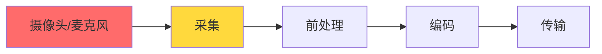

**采集质量的决定性作用**：

| 采集问题 | 对后续环节影响 | 能否在后续环节修复 |
|---------|--------------|------------------|
| 曝光不足/过曝 | 编码效率下降、噪点放大 | 部分修复（3A算法） |
| 帧率不稳 | 编码码率波动、卡顿 | 难以修复 |
| 分辨率不匹配 | 需要额外缩放、画质损失 | 可以修复但有损失 |
| 延迟抖动 | 端到端延迟不可控 | 难以修复 |
| 色彩空间错误 | 色彩还原失真 | 难以修复 |

**关键洞察**：采集环节的缺陷往往无法在后续环节完全修复，因此采集优化具有**前置决定性**。

### 1.2 采集延迟在端到端延迟中的占比

**典型RTC系统延迟分布**：

| 环节 | 理想延迟 | 典型延迟 | 劣化延迟 | 占比（典型） |
|-----|---------|---------|---------|------------|
| **采集** | 8ms | 16ms | 33ms | **10-20%** |
| 前处理 | 5ms | 10ms | 30ms | 5-10% |
| 编码 | 5ms | 15ms | 50ms | 10-15% |
| 封装/发送 | 1ms | 3ms | 10ms | 2-5% |
| 网络传输 | 20ms | 50ms | 200ms | 30-50% |
| 接收缓冲 | 20ms | 50ms | 200ms | 20-30% |
| 解码 | 5ms | 10ms | 40ms | 5-10% |
| 渲染 | 8ms | 16ms | 33ms | 10-15% |
| **总计** | **72ms** | **170ms** | **596ms** | **100%** |

**采集延迟的构成**：

```
总采集延迟 = 曝光时间 + 传感器读出时间 + ISP处理时间 + 数据传输时间
          ≈ (1/帧率) + 2-5ms + 3-8ms + 1-3ms
```

**不同帧率下的理论最小延迟**：

| 帧率 | 帧间隔 | 理论最小延迟 | 实际典型延迟 |
|-----|-------|------------|------------|
| 15fps | 66.7ms | 70-80ms | 80-100ms |
| 30fps | 33.3ms | 38-48ms | 45-60ms |
| 60fps | 16.7ms | 22-32ms | 25-35ms |
| 120fps | 8.3ms | 14-24ms | 16-25ms |

### 1.3 常见采集问题与影响

#### 1.3.1 帧率不稳定

**表现**：实际输出帧率波动，目标30fps但实际在25-35fps之间跳动

**根因分析**：

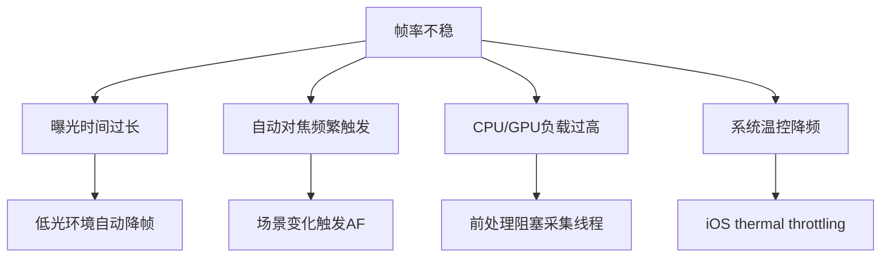

**量化影响**：
- 帧率波动±10% → 编码码率波动±15% → 网络拥塞概率增加
- 帧率不稳 → 播放端抖动缓冲增加 → 端到端延迟+20-50ms

#### 1.3.2 采集延迟过大

**典型场景延迟数据**：

| 场景 | 正常延迟 | 异常延迟 | 用户感知 |
|-----|---------|---------|---------|
| 普通通话 | < 50ms | > 100ms | 明显延迟感 |
| 游戏直播 | < 30ms | > 60ms | 操作不同步 |
| 屏幕共享 | < 100ms | > 200ms | 鼠标拖影 |

#### 1.3.3 功耗过高

**采集功耗占比**（以iPhone 14视频通话为例）：

```
总功耗 ≈ 2500mW
├── 摄像头采集：~400mW (16%)
├── 编码器：~600mW (24%)
├── 网络传输：~800mW (32%)
├── 屏幕显示：~500mW (20%)
└── 其他：~200mW (8%)
```

**功耗优化收益**：采集环节功耗降低30% → 整体续航提升5-8%

#### 1.3.4 设备兼容性差

**Android碎片化问题**：

| 厂商 | Camera2支持级别 | 常见问题 |
|-----|----------------|---------|
| Google Pixel | FULL/LEVEL_3 | 标准行为 |
| Samsung Galaxy | FULL | 部分机型预览/录制分辨率不一致 |
| Xiaomi | LIMITED/FULL | 高帧率支持不完整 |
| OPPO/vivo | LIMITED | 某些分辨率下帧率不达标 |
| 低端机型 | LEGACY | 仅支持Camera1 API |

---

## 第2章 What — 采集优化MECE分类

### 2.1 采集优化全景图

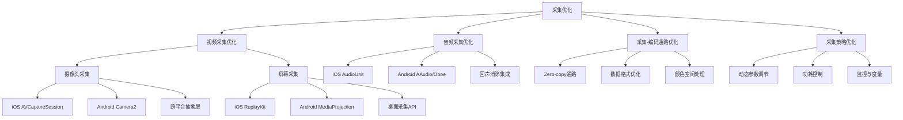

### 2.2 采集优化分类详解

| 优化方向 | 核心目标 | 关键技术 | 典型收益 | 实施难度 |
|---------|---------|---------|---------|---------|
| **视频采集优化** | 稳定帧率、低延迟、高质量 | API选型、参数配置、Zero-copy | 延迟-15ms，帧率稳定性+30% | 中 |
| **音频采集优化** | 低延迟、高音质、回声消除 | AudioUnit/AAudio、3A算法 | 延迟-20ms，音质MOS+0.3 | 中 |
| **采集-编码通路** | 消除数据拷贝开销 | Surface直通、CVPixelBuffer复用 | CPU-20%，延迟-10ms | 中 |
| **采集策略优化** | 自适应调节、功耗控制 | 动态分辨率、帧率自适应 | 功耗-30%，体验+20% | 高 |

### 2.3 优化优先级矩阵

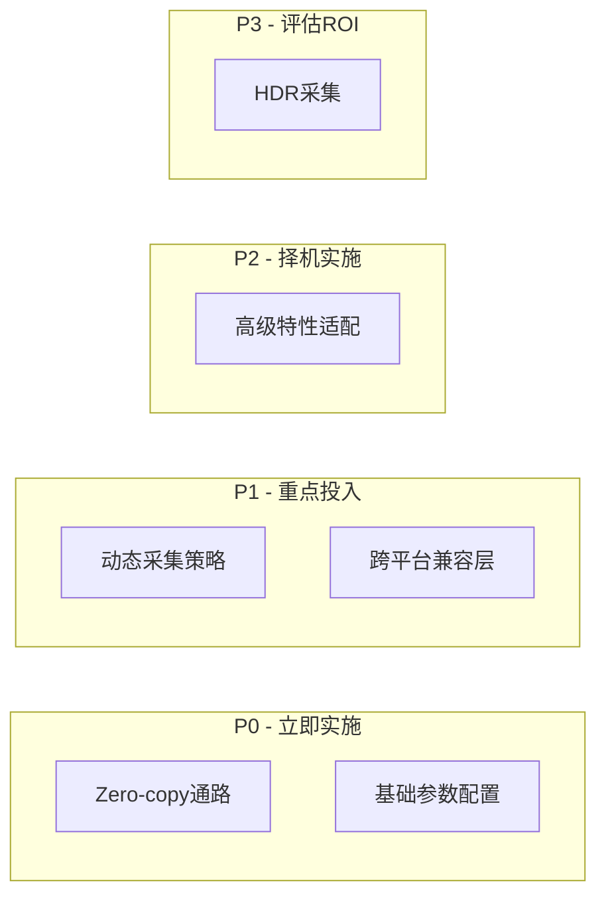

---

## 第3章 How — 摄像头采集深度优化

### 3.1 iOS 摄像头采集（AVCaptureSession）

#### 3.1.1 API选型与配置最佳实践

**AVCaptureSession核心配置**：

```objc
// Objective-C: AVCaptureSession最佳实践配置
@interface CameraCapture : NSObject

@property (nonatomic, strong) AVCaptureSession *captureSession;
@property (nonatomic, strong) AVCaptureDeviceInput *videoInput;
@property (nonatomic, strong) AVCaptureVideoDataOutput *videoOutput;

@end

@implementation CameraCapture

- (void)setupCaptureSession {
    self.captureSession = [[AVCaptureSession alloc] init];
    
    // 1. 预设选择：根据需求选择合适预设
    // 优先使用SessionPreset而非手动设置分辨率，系统会自动选择最优格式
    if ([self.captureSession canSetSessionPreset:AVCaptureSessionPreset1280x720]) {
        self.captureSession.sessionPreset = AVCaptureSessionPreset1280x720;
    }
    
    // 2. 配置输入设备
    AVCaptureDevice *device = [AVCaptureDevice defaultDeviceWithMediaType:AVMediaTypeVideo];
    NSError *error = nil;
    self.videoInput = [AVCaptureDeviceInput deviceInputWithDevice:device error:&error];
    
    if ([self.captureSession canAddInput:self.videoInput]) {
        [self.captureSession addInput:self.videoInput];
    }
    
    // 3. 配置输出 - 关键优化点
    self.videoOutput = [[AVCaptureVideoDataOutput alloc] init];
    
    // 设置像素格式：优先使用YUV420，避免不必要的颜色转换
    // kCVPixelFormatType_420YpCbCr8BiPlanarVideoRange: 视频范围(16-235)，节省带宽
    // kCVPixelFormatType_420YpCbCr8BiPlanarFullRange: 全范围(0-255)，适合处理
    NSDictionary *outputSettings = @{
        (id)kCVPixelBufferPixelFormatTypeKey: @(kCVPixelFormatType_420YpCbCr8BiPlanarVideoRange),
        (id)kCVPixelBufferWidthKey: @1280,
        (id)kCVPixelBufferHeightKey: @720
    };
    self.videoOutput.videoSettings = outputSettings;
    
    // 4. 设置队列 - 使用专用串行队列，避免阻塞主线程
    dispatch_queue_t captureQueue = dispatch_queue_create("com.example.capture", DISPATCH_QUEUE_SERIAL);
    [self.videoOutput setSampleBufferDelegate:self queue:captureQueue];
    
    // 5. 关键优化：允许丢弃延迟帧，保证实时性
    self.videoOutput.alwaysDiscardsLateVideoFrames = YES;
    
    if ([self.captureSession canAddOutput:self.videoOutput]) {
        [self.captureSession addOutput:self.videoOutput];
    }
}

@end
```

```swift
// Swift: AVCaptureSession配置
class CameraCapture: NSObject {
    private var captureSession: AVCaptureSession?
    private var videoOutput: AVCaptureVideoDataOutput?
    
    func setupCaptureSession() {
        let session = AVCaptureSession()
        
        // 配置会话预设
        if session.canSetSessionPreset(.hd1280x720) {
            session.sessionPreset = .hd1280x720
        }
        
        // 获取默认摄像头
        guard let device = AVCaptureDevice.default(.builtInWideAngleCamera, 
                                                    for: .video, 
                                                    position: .front),
              let input = try? AVCaptureDeviceInput(device: device),
              session.canAddInput(input) else {
            return
        }
        
        session.addInput(input)
        
        // 配置输出
        let output = AVCaptureVideoDataOutput()
        
        // 像素格式选择
        let pixelFormat = kCVPixelFormatType_420YpCbCr8BiPlanarVideoRange
        output.videoSettings = [
            kCVPixelBufferPixelFormatTypeKey as String: pixelFormat,
            kCVPixelBufferWidthKey as String: 1280,
            kCVPixelBufferHeightKey as String: 720
        ]
        
        // 设置采集队列
        let captureQueue = DispatchQueue(label: "com.example.capture", qos: .userInitiated)
        output.setSampleBufferDelegate(self, queue: captureQueue)
        
        // 关键：丢弃延迟帧
        output.alwaysDiscardsLateVideoFrames = true
        
        if session.canAddOutput(output) {
            session.addOutput(output)
        }
        
        self.captureSession = session
        self.videoOutput = output
    }
}

extension CameraCapture: AVCaptureVideoDataOutputSampleBufferDelegate {
    func captureOutput(_ output: AVCaptureOutput, 
                       didOutput sampleBuffer: CMSampleBuffer,
                       from connection: AVCaptureConnection) {
        // 处理采集帧
        processVideoSampleBuffer(sampleBuffer)
    }
}
```

#### 3.1.2 像素格式选择策略

| 像素格式 | 数据布局 | 适用场景 | 编码器兼容性 | 内存占用 |
|---------|---------|---------|------------|---------|
| `kCVPixelFormatType_420YpCbCr8BiPlanarVideoRange` | YUV420 Bi-Planar, 16-235 | 直接编码传输 | VideoToolbox原生支持 | 1.5 bytes/pixel |
| `kCVPixelFormatType_420YpCbCr8BiPlanarFullRange` | YUV420 Bi-Planar, 0-255 | 需要图像处理 | VideoToolbox支持 | 1.5 bytes/pixel |
| `kCVPixelFormatType_32BGRA` | BGRA 32bit | GPU处理 | 需转换后编码 | 4 bytes/pixel |
| `kCVPixelFormatType_420YpCbCr8Planar` | YUV420 Tri-Planar | 兼容旧系统 | 需格式转换 | 1.5 bytes/pixel |

**选择建议**：
- **RTC场景**：使用VideoRange格式，减少带宽，VideoToolbox原生支持
- **需要美颜/滤镜**：使用FullRange格式，避免色域压缩损失
- **GPU处理需求**：使用BGRA格式，直接纹理上传

#### 3.1.3 采集参数优化

**帧率与曝光联动配置**：

```objc
// Objective-C: 帧率和曝光优化
- (void)configureFrameRateAndExposure:(AVCaptureDevice *)device 
                           targetFPS:(int32_t)fps {
    NSError *error = nil;
    
    // 1. 锁定配置
    if (![device lockForConfiguration:&error]) {
        NSLog(@"Failed to lock device: %@", error.localizedDescription);
        return;
    }
    
    // 2. 设置帧率范围（先设置范围，再设置活跃帧率）
    AVCaptureDeviceFormat *format = device.activeFormat;
    CMFrameRateRange *targetRange = nil;
    
    for (AVFrameRateRange *range in format.videoSupportedFrameRateRanges) {
        if (range.minFrameRate <= fps && range.maxFrameRate >= fps) {
            targetRange = (CMFrameRateRange *)range;
            break;
        }
    }
    
    if (!targetRange) {
        NSLog(@"Target FPS %d not supported by current format", fps);
        [device unlockForConfiguration];
        return;
    }
    
    // 3. 配置活跃帧率
    device.activeVideoMinFrameDuration = targetRange.minFrameDuration;
    device.activeVideoMaxFrameDuration = targetRange.maxFrameDuration;
    
    // 4. 配置曝光模式（联动帧率）
    if ([device isExposureModeSupported:AVCaptureExposureModeContinuousAutoExposure]) {
        device.exposureMode = AVCaptureExposureModeContinuousAutoExposure;
    }
    
    // 5. 低光环境特殊处理
    AVCaptureExposureMode exposureMode = device.exposureMode;
    if (exposureMode == AVCaptureExposureModeLockedExpose) {
        CMTime exposureDuration = device.exposureDuration;
        double durationMs = CMTimeGetSeconds(exposureDuration) * 1000;
        double frameIntervalMs = 1000.0 / fps;
        if (durationMs > frameIntervalMs * 0.8) {
            NSLog(@"Warning: Exposure duration (%.1fms) exceeds frame interval (%.1fms)", 
                  durationMs, frameIntervalMs);
        }
    }
    
    [device unlockForConfiguration];
    NSLog(@"Frame rate configured: %d fps", fps);
}

// 帧率动态调整（基于场景变化）
- (void)adjustFrameRateForLightingCondition:(AVCaptureDevice *)device
                                  isLowLight:(BOOL)isLowLight {
    int32_t targetFPS = isLowLight ? 24 : 30;  // 低光降帧保证曝光
    [self configureFrameRateAndExposure:device targetFPS:targetFPS];
}
```

**曝光与帧率关系的关键原则**：

```
有效帧率 ≤ min(配置帧率, 1000 / 曝光时间ms)

示例：
- 配置30fps，曝光20ms → 实际可达30fps
- 配置30fps，曝光50ms → 实际只能达20fps（传感器限制）
```

**分辨率选择策略**：

| 目标分辨率 | 推荐采集分辨率 | 用途场景 | 注意事项 |
|-----------|--------------|---------|----------|
| 1080p | 1920x1080 | 高清直播、录制 | 注意功耗和发热 |
| 720p | 1280x720 | 普通RTC通话 | 性能与质量平衡 |
| 480p | 854x480 | 低带宽场景 | 移动网络优先 |
| 360p | 640x360 | 极低带宽 | 兜底方案 |

**采集分辨率与编码分辨率分离**：

```objc
// 采集使用较高分辨率，编码时动态缩放
- (void)configureSession:(AVCaptureSession *)session {
    // 采集固定1080p，保证质量
    AVCaptureDevice *device = [AVCaptureDevice defaultDeviceWithMediaType:AVMediaTypeVideo];
    NSArray *formats = device.formats;
    
    for (AVCaptureDeviceFormat *format in formats) {
        CMFormatDescriptionRef desc = format.formatDescription;
        CMVideoDimensions dims = CMVideoFormatDescriptionGetDimensions(desc);
        
        if (dims.width == 1920 && dims.height == 1080) {
            // 检查帧率支持
            for (AVFrameRateRange *range in format.videoSupportedFrameRateRanges) {
                if (range.maxFrameRate >= 30) {
                    device.activeFormat = format;
                    break;
                }
            }
            break;
        }
    }
    // 编码分辨率根据网络状况动态调整（在编码环节处理）
}
```

#### 3.1.4 Zero-copy数据通路

**iOS Zero-copy的核心机制**：

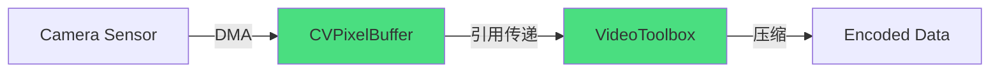

**传统方式 vs Zero-copy对比**：

| 方式 | 数据流 | 内存拷贝次数 | CPU开销 | 延迟 |
|-----|-------|------------|---------|------|
| 传统方式 | PixelBuffer → NSData → Encoder | 2-3次 | 高 | +5-10ms |
| Zero-copy | CVPixelBuffer → VTCompressionSession | 0次 | 低 | 0ms |

**实现Zero-copy的关键配置**：

```objc
// 配置CVPixelBuffer池（VideoToolbox兼容格式）
- (CVPixelBufferPoolRef)createPixelBufferPool {
    CVPixelBufferPoolRef pool = NULL;
    
    NSDictionary *options = @{
        (__bridge id)kCVPixelBufferPixelFormatTypeKey: @(kCVPixelFormatType_420YpCbCr8BiPlanarVideoRange),
        (__bridge id)kCVPixelBufferWidthKey: @1920,
        (__bridge id)kCVPixelBufferHeightKey: @1080,
        // 关键：启用IOSurface，支持GPU直接访问
        (__bridge id)kCVPixelBufferIOSurfacePropertiesKey: @{},
        // 关键：设置OpenGLES/Metal兼容性
        (__bridge id)kCVPixelBufferOpenGLESCompatibilityKey: @YES,
        (__bridge id)kCVPixelBufferMetalCompatibilityKey: @YES,
    };
    
    CVReturn status = CVPixelBufferPoolCreate(
        kCFAllocatorDefault,
        0,
        (__bridge CFDictionaryRef)options,
        &pool
    );
    
    if (status != kCVReturnSuccess) {
        NSLog(@"Failed to create pixel buffer pool: %d", status);
        return NULL;
    }
    
    return pool;
}

// 配置VideoToolbox编码器接收CVPixelBuffer
- (VTCompressionSessionRef)createCompressionSession {
    VTCompressionSessionRef session = NULL;
    
    CMVideoCodecType codecType = kCMVideoCodecType_H264;
    
    // 编码器配置
    NSDictionary *encoderSpec = @{
        (__bridge id)kVTVideoEncoderSpecification_EncoderID: @"com.apple.videotoolbox.videoencoder.h264.gva",
    };
    
    NSDictionary *sourceImageBufferAttrs = @{
        // 关键：指定像素格式，确保编码器直接接受CVPixelBuffer
        (__bridge id)kCVPixelBufferPixelFormatTypeKey: @(kCVPixelFormatType_420YpCbCr8BiPlanarVideoRange),
        (__bridge id)kCVPixelBufferIOSurfacePropertiesKey: @{},
    };
    
    VTCompressionSessionCreate(
        kCFAllocatorDefault,
        1920, 1080,
        codecType,
        (__bridge CFDictionaryRef)encoderSpec,
        (__bridge CFDictionaryRef)sourceImageBufferAttrs,
        NULL, NULL,
        encodeCallback, NULL,
        &session
    );
    
    return session;
}

// 采集回调中直接传递CVPixelBuffer（Zero-copy）
- (void)captureOutput:(AVCaptureOutput *)output 
didOutputSampleBuffer:(CMSampleBufferRef)sampleBuffer 
       fromConnection:(AVCaptureConnection *)connection {
    
    // 直接获取CVPixelBuffer，不进行任何拷贝
    CVImageBufferRef imageBuffer = CMSampleBufferGetImageBuffer(sampleBuffer);
    
    // 直接传递给编码器，仍为Zero-copy
    VTCompressionSessionEncodeFrame(
        _compressionSession,
        imageBuffer,
        kCMTimeInvalid, kCMTimeInvalid,
        NULL, NULL, NULL
    );
    
    // 注意：不要手动retain/release imageBuffer
    // VTCompressionSession会自动管理引用计数
}
```

**IOSurface共享机制**：

```
IOSurface是跨进程共享的内存缓冲区，支持：
1. Camera → GPU纹理（Metal/OpenGLES）
2. Camera → VideoToolbox编码
3. Camera → 前处理（CoreImage/Metal）

关键属性：
- 所有参与者共享同一块物理内存
- 通过引用计数管理生命周期
- GPU可直接访问，无需CPU拷贝
```

**Zero-copy的注意事项**：

1. **线程安全**：CVPixelBuffer传递到其他线程时，需要正确管理引用计数
2. **格式兼容**：采集格式必须与编码器要求的格式一致
3. **生命周期**：编码异步完成前，PixelBuffer被编码器持有

#### 3.1.5 多摄像头采集

**AVCaptureMultiCamSession简介**：

iOS 13+引入多摄像头同时采集能力，支持前后摄像头同时工作。

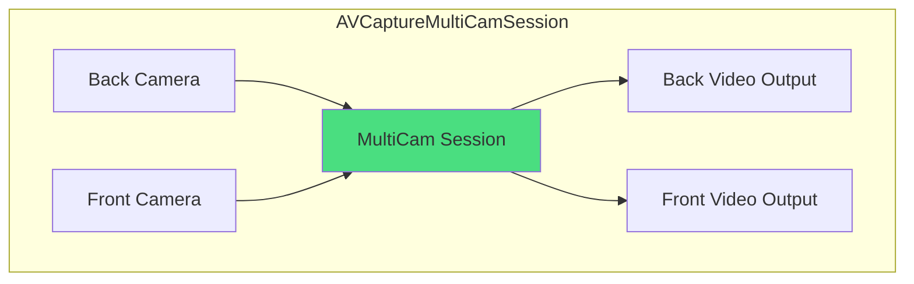

**多摄像头采集代码示例**：

```objc
@interface MultiCameraCapture ()
@property (nonatomic, strong) AVCaptureMultiCamSession *session;
@property (nonatomic, strong) AVCaptureDeviceInput *backCameraInput;
@property (nonatomic, strong) AVCaptureDeviceInput *frontCameraInput;
@property (nonatomic, strong) AVCaptureVideoDataOutput *backOutput;
@property (nonatomic, strong) AVCaptureVideoDataOutput *frontOutput;
@end

@implementation MultiCameraCapture

- (instancetype)init {
    self = [super init];
    if (self) {
        [self setupMultiCameraSession];
    }
    return self;
}

- (void)setupMultiCameraSession {
    // 1. 创建MultiCamSession
    self.session = [[AVCaptureMultiCamSession alloc] init];
    
    [self.session beginConfiguration];
    
    // 2. 获取摄像头设备
    AVCaptureDevice *backCamera = [AVCaptureDevice defaultDeviceWithDeviceType:AVCaptureDeviceTypeBuiltInWideAngleCamera
                                                                mediaType:AVMediaTypeVideo
                                                                 position:AVCaptureDevicePositionBack];
    
    AVCaptureDevice *frontCamera = [AVCaptureDevice defaultDeviceWithDeviceType:AVCaptureDeviceTypeBuiltInWideAngleCamera
                                                                mediaType:AVMediaTypeVideo
                                                                 position:AVCaptureDevicePositionFront];
    
    // 3. 创建输入
    self.backCameraInput = [AVCaptureDeviceInput deviceInputWithDevice:backCamera error:nil];
    self.frontCameraInput = [AVCaptureDeviceInput deviceInputWithDevice:frontCamera error:nil];
    
    // 4. 创建输出
    self.backOutput = [[AVCaptureVideoDataOutput alloc] init];
    self.frontOutput = [[AVCaptureVideoDataOutput alloc] init];
    
    self.backOutput.videoSettings = @{
        (__bridge id)kCVPixelBufferPixelFormatTypeKey: @(kCVPixelFormatType_420YpCbCr8BiPlanarVideoRange)
    };
    self.frontOutput.videoSettings = @{
        (__bridge id)kCVPixelBufferPixelFormatTypeKey: @(kCVPixelFormatType_420YpCbCr8BiPlanarVideoRange)
    };
    
    // 5. 连接输入输出
    if ([self.session canAddInput:self.backCameraInput]) {
        [self.session addInput:self.backCameraInput];
    }
    if ([self.session canAddInput:self.frontCameraInput]) {
        [self.session addInput:self.frontCameraInput];
    }
    if ([self.session canAddOutput:self.backOutput]) {
        [self.session addOutput:self.backOutput];
    }
    if ([self.session canAddOutput:self.frontOutput]) {
        [self.session addOutput:self.frontOutput];
    }
    
    // 6. 配置摄像头参数
    [self configureCamera:backCamera fps:30 resolution:1280x720];
    [self configureCamera:frontCamera fps:30 resolution:1280x720];
    
    [self.session commitConfiguration];
    
    // 7. 设置代理
    dispatch_queue_t queue = dispatch_get_global_queue(DISPATCH_QUEUE_PRIORITY_HIGH, 0);
    [self.backOutput setSampleBufferDelegate:self queue:queue];
    [self.frontOutput setSampleBufferDelegate:self queue:queue];
}

- (void)configureCamera:(AVCaptureDevice *)device 
                    fps:(int)fps 
            resolution:(int)width :(int)height {
    [device lockForConfiguration:nil];
    
    for (AVCaptureDeviceFormat *format in device.formats) {
        CMVideoDimensions dims = CMVideoFormatDescriptionGetDimensions(format.formatDescription);
        if (dims.width == width && dims.height == height) {
            device.activeFormat = format;
            break;
        }
    }
    
    [device unlockForConfiguration];
}

// 采集回调
- (void)captureOutput:(AVCaptureOutput *)output 
didOutputSampleBuffer:(CMSampleBufferRef)sampleBuffer 
       fromConnection:(AVCaptureConnection *)connection {
    
    if (output == self.backOutput) {
        // 后摄帧处理
        [self processBackCameraFrame:sampleBuffer];
    } else if (output == self.frontOutput) {
        // 前摄帧处理
        [self processFrontCameraFrame:sampleBuffer];
    }
}

@end
```

**多摄像头采集的限制**：

| 限制项 | 说明 | 应对策略 |
|-------|------|----------|
| 系统版本要求 | iOS 13+ | 功能检测降级 |
| 分辨率限制 | 双摄同时采集，单摄分辨率受限 | 合理配置分辨率 |
| 帧率限制 | 双摄帧率可能低于单摄 | 接受较低帧率 |
| 发热功耗 | 双摄功耗约2倍单摄 | 监控温度，动态关闭 |
| 部分设备不支持 | 旧款iPhone不支持 | AVCaptureMultiCamSession.isMultiCamSupported |

**多摄像头应用场景**：

```objc
// 检查多摄像头支持
- (BOOL)isMultiCameraSupported {
    if (@available(iOS 13.0, *)) {
        return AVCaptureMultiCamSession.isMultiCamSupported;
    }
    return NO;
}

// 常见场景：双摄直播（主播+演示）
- (void)startDualCameraStreaming {
    if (![self isMultiCameraSupported]) {
        NSLog(@"Multi-camera not supported on this device");
        // 降级为单摄像头方案
        return;
    }
    
    [self.session startRunning];
}
```

---

### 3.2 Android 摄像头采集（Camera2 API）

#### 3.2.1 Camera2 vs CameraX选型对比

**API演进历程**：

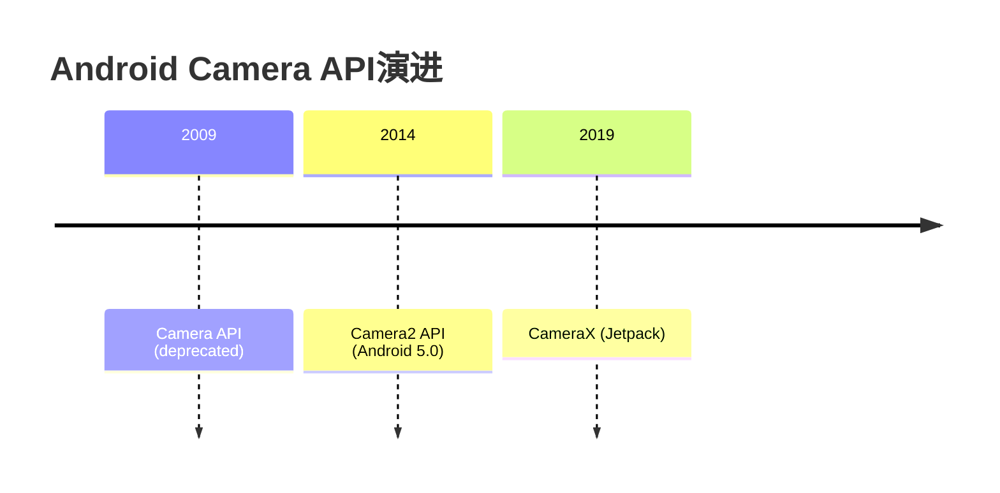

**Camera2 vs CameraX对比**：

| 对比维度 | Camera2 | CameraX |
|---------|---------|----------|
| **抽象层级** | 底层API，暴露硬件能力 | 高层封装，简化使用 |
| **设备兼容性** | 需自行处理厂商差异 | 内置兼容性处理 |
| **学习曲线** | 陡峭，概念复杂 | 平缓，API简洁 |
| **功能控制** | 精细控制所有参数 | 常用功能封装良好 |
| **生命周期** | 需手动管理 | 自动绑定Lifecycle |
| **性能优化** | 可深度优化 | 优化封装在内部 |
| **适用场景** | 专业相机、深度优化 | 快速集成、业务开发 |
| **维护成本** | 高（需处理兼容性） | 低（Google维护） |

**选型建议**：

```
选择Camera2的场景：
- 需要精细控制采集参数（曝光、对焦、帧率）
- 需要获取原始数据做深度处理
- 需要实现Zero-copy优化
- 性能要求极高的RTC场景

选择CameraX的场景：
- 快速开发，降低维护成本
- 不需要深度控制采集参数
- 需要良好的设备兼容性保障
- 团队对Camera2不熟悉
```

**CameraX在RTC场景的局限**：

1. **无法直接控制帧率范围**：CameraX封装了帧率控制
2. **Surface配置受限**：无法精确控制Surface配置用于Zero-copy
3. **性能调优受限**：底层优化细节被封装

**结论**：对于高性能RTC采集，推荐使用Camera2 API。

#### 3.2.2 Camera2 Pipeline设计

**Camera2核心架构**：

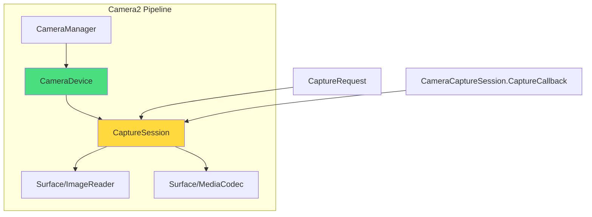

**ImageReader vs SurfaceTexture选型**：

| 对比维度 | ImageReader | SurfaceTexture |
|---------|-------------|----------------|
| **数据访问** | 可直接获取Image对象 | 需要通过OpenGL渲染获取 |
| **格式支持** | YUV_420_888, PRIVATE | 依赖外部纹理格式 |
| **Zero-copy** | 支持Surface直连编码器 | 需要额外处理 |
| **延迟** | 较低 | 稍高（纹理更新） |
| **GPU处理** | 需额外转换 | 直接支持纹理 |
| **适用场景** | 需要CPU访问数据 | 需要GPU直接处理 |

**RTC场景推荐**：ImageReader + Surface直连编码器

**Camera2采集代码示例**：

```kotlin
// Kotlin: Camera2采集Pipeline
class Camera2Capture(private val context: Context) {
    
    private val cameraManager: CameraManager by lazy {
        context.getSystemService(Context.CAMERA_SERVICE) as CameraManager
    }
    
    private var cameraDevice: CameraDevice? = null
    private var captureSession: CameraCaptureSession? = null
    private var imageReader: ImageReader? = null
    
    // 配置参数
    private val targetWidth = 1280
    private val targetHeight = 720
    private val targetFps = 30
    
    fun startCapture(cameraId: String = getBackCameraId()) {
        // 1. 检查权限
        if (ContextCompat.checkSelfPermission(context, Manifest.permission.CAMERA) 
            != PackageManager.PERMISSION_GRANTED) {
            throw SecurityException("Camera permission not granted")
        }
        
        // 2. 创建ImageReader
        imageReader = ImageReader.newInstance(
            targetWidth, targetHeight,
            ImageFormat.YUV_420_888,
            2  // maxImages
        ).apply {
            setOnImageAvailableListener({ reader ->
                val image = reader.acquireLatestImage()
                image?.let {
                    processImage(it)
                    it.close()
                }
            }, null)
        }
        
        // 3. 打开摄像头
        cameraManager.openCamera(cameraId, object : CameraDevice.StateCallback() {
            override fun onOpened(camera: CameraDevice) {
                cameraDevice = camera
                createCaptureSession()
            }
            
            override fun onDisconnected(camera: CameraDevice) {
                camera.close()
                cameraDevice = null
            }
            
            override fun onError(camera: CameraDevice, error: Int) {
                camera.close()
                cameraDevice = null
                Log.e("Camera2Capture", "Camera open error: $error")
            }
        }, null)
    }
    
    private fun createCaptureSession() {
        val surfaces = listOfNotNull(imageReader?.surface)
        
        cameraDevice?.createCaptureSession(surfaces, object : CameraCaptureSession.StateCallback() {
            override fun onConfigured(session: CameraCaptureSession) {
                captureSession = session
                startRepeatingRequest()
            }
            
            override fun onConfigureFailed(session: CameraCaptureSession) {
                Log.e("Camera2Capture", "Session configuration failed")
            }
        }, null)
    }
    
    private fun startRepeatingRequest() {
        val requestBuilder = cameraDevice?.createCaptureRequest(
            CameraDevice.TEMPLATE_RECORD
        )?.apply {
            // 添加目标Surface
            addTarget(imageReader?.surface)
            
            // 配置帧率
            set(CaptureRequest.CONTROL_AE_TARGET_FPS_RANGE, Range(targetFps, targetFps))
            
            // 配置自动曝光
            set(CaptureRequest.CONTROL_AE_MODE, CaptureRequest.CONTROL_AE_MODE_ON)
            
            // 配置自动对焦（连续）
            set(CaptureRequest.CONTROL_AF_MODE, 
                CaptureRequest.CONTROL_AF_MODE_CONTINUOUS_VIDEO)
            
            // 关闭视频防抖（避免额外延迟）
            set(CaptureRequest.CONTROL_VIDEO_STABILIZATION_MODE,
                CaptureRequest.CONTROL_VIDEO_STABILIZATION_MODE_OFF)
        }
        
        requestBuilder?.build()?.let { request ->
            captureSession?.setRepeatingRequest(request, captureCallback, null)
        }
    }
    
    private val captureCallback = object : CameraCaptureSession.CaptureCallback() {
        override fun onCaptureCompleted(
            session: CameraCaptureSession,
            request: CaptureRequest,
            result: TotalCaptureResult
        ) {
            // 可从result中获取采集元数据
            val exposureTime = result.get(CaptureResult.SENSOR_EXPOSURE_TIME)
            val sensitivity = result.get(CaptureResult.SENSOR_SENSITIVITY)
        }
    }
    
    private fun processImage(image: Image) {
        // YUV_420_888格式处理
        val yBuffer = image.planes[0].buffer
        val uBuffer = image.planes[1].buffer
        val vBuffer = image.planes[2].buffer
        
        // 获取stride信息（可能有padding）
        val yStride = image.planes[0].rowStride
        val uvStride = image.planes[1].rowStride
        val uvPixelStride = image.planes[1].pixelStride
        
        // 处理帧数据...
        // 注意：这里是CPU访问，如果只需要编码，应该使用Surface直连
    }
    
    private fun getBackCameraId(): String {
        return cameraManager.cameraIdList.find { id ->
            val characteristics = cameraManager.getCameraCharacteristics(id)
            characteristics.get(CameraCharacteristics.LENS_FACING) == 
                CameraCharacteristics.LENS_FACING_BACK
        } ?: throw IllegalStateException("No back camera found")
    }
    
    fun stopCapture() {
        captureSession?.close()
        captureSession = null
        cameraDevice?.close()
        cameraDevice = null
        imageReader?.close()
        imageReader = null
    }
}
```

**关键配置说明**：

1. **TEMPLATE_RECORD**：录制模板，优先考虑帧率稳定性
2. **YUV_420_888**：Android推荐的YUV格式，兼容性最好
3. **maxImages = 2**：缓冲2帧足够，过多增加内存和延迟

#### 3.2.3 硬件级Zero-copy

**Android Zero-copy的核心：Surface直连MediaCodec**

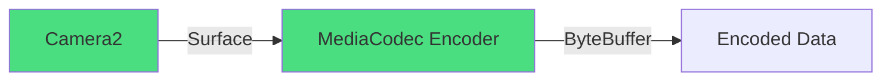

**对比CPU路径与Surface直连**：

| 方式 | 数据流 | 内存拷贝 | CPU开销 | 延迟 |
|-----|-------|---------|---------|------|
| CPU路径 | Image → byte[] → MediaCodec | 2-3次 | 高 | +8-15ms |
| Surface直连 | Camera Surface → MediaCodec | 0次 | 低 | 0ms |

**Surface直连MediaCodec代码示例**：

```kotlin
// Kotlin: Surface直连MediaCodec编码器
class Camera2ZeroCopyCapture(private val context: Context) {
    
    private var mediaCodec: MediaCodec? = null
    private var cameraDevice: CameraDevice? = null
    private var captureSession: CameraCaptureSession? = null
    
    fun startCaptureWithEncoder(cameraId: String) {
        // 1. 创建MediaCodec编码器
        mediaCodec = MediaCodec.createEncoderByType(MediaFormat.MIMETYPE_VIDEO_AVC).apply {
            val format = MediaFormat.createVideoFormat(
                MediaFormat.MIMETYPE_VIDEO_AVC,
                1280, 720
            ).apply {
                setInteger(MediaFormat.KEY_BIT_RATE, 2_000_000)
                setInteger(MediaFormat.KEY_FRAME_RATE, 30)
                setInteger(MediaFormat.KEY_I_FRAME_INTERVAL, 2)
                setInteger(MediaFormat.KEY_COLOR_FORMAT, 
                    MediaCodecInfo.CodecCapabilities.COLOR_FormatSurface)
            }
            
            configure(format, null, null, MediaCodec.CONFIGURE_FLAG_ENCODE)
        }
        
        // 2. 获取编码器输入Surface（这是Zero-copy的关键）
        val encoderSurface = mediaCodec!!.createInputSurface()
        mediaCodec!!.start()
        
        // 3. 配置Camera2使用这个Surface
        cameraManager.openCamera(cameraId, object : CameraDevice.StateCallback() {
            override fun onOpened(camera: CameraDevice) {
                cameraDevice = camera
                
                // 创建CaptureSession，直接使用编码器Surface
                camera.createCaptureSession(
                    listOf(encoderSurface),
                    object : CameraCaptureSession.StateCallback() {
                        override fun onConfigured(session: CameraCaptureSession) {
                            captureSession = session
                            startRepeatingRequest(encoderSurface)
                        }
                        
                        override fun onConfigureFailed(session: CameraCaptureSession) {
                            Log.e(TAG, "Session config failed")
                        }
                    },
                    null
                )
            }
            
            override fun onDisconnected(camera: CameraDevice) {
                camera.close()
            }
            
            override fun onError(camera: CameraDevice, error: Int) {
                Log.e(TAG, "Camera error: $error")
            }
        }, null)
        
        // 4. 启动编码器输出线程
        startEncoderOutputThread()
    }
    
    private fun startRepeatingRequest(surface: Surface) {
        val request = cameraDevice!!.createCaptureRequest(
            CameraDevice.TEMPLATE_RECORD
        ).apply {
            addTarget(surface)
            set(CaptureRequest.CONTROL_AE_TARGET_FPS_RANGE, Range(30, 30))
            set(CaptureRequest.CONTROL_AE_MODE, CaptureRequest.CONTROL_AE_MODE_ON)
            set(CaptureRequest.CONTROL_AF_MODE, 
                CaptureRequest.CONTROL_AF_MODE_CONTINUOUS_VIDEO)
        }.build()
        
        captureSession!!.setRepeatingRequest(request, null, null)
    }
    
    private fun startEncoderOutputThread() {
        Thread {
            val bufferInfo = MediaCodec.BufferInfo()
            while (true) {
                val outputIndex = mediaCodec!!.dequeueOutputBuffer(bufferInfo, 10_000)
                if (outputIndex >= 0) {
                    val outputBuffer = mediaCodec!!.getOutputBuffer(outputIndex)
                    // 处理编码数据（H.264 NAL units）
                    processEncodedData(outputBuffer, bufferInfo)
                    mediaCodec!!.releaseOutputBuffer(outputIndex, false)
                }
            }
        }.start()
    }
    
    private fun processEncodedData(buffer: ByteBuffer, info: MediaCodec.BufferInfo) {
        // 处理编码后的H.264数据
        // 发送到网络或写入文件
    }
    
    companion object {
        private const val TAG = "Camera2ZeroCopy"
    }
}
```

**Zero-copy的关键点**：

1. **MediaCodec.createInputSurface()**：创建编码器输入Surface
2. **CaptureSession直接使用编码器Surface**：Camera2输出直接进入编码器
3. **无CPU数据访问**：整个过程数据不经过CPU

**如果需要同时CPU访问和编码**：

```kotlin
// 同时获取CPU数据和编码器输入
fun setupDualOutput(): Pair<Surface, ImageReader> {
    val encoderSurface = mediaCodec.createInputSurface()
    
    val imageReader = ImageReader.newInstance(
        1280, 720, ImageFormat.YUV_420_888, 2
    )
    
    // CaptureSession同时使用两个Surface
    cameraDevice.createCaptureSession(
        listOf(encoderSurface, imageReader.surface),
        // ...
    )
    
    return Pair(encoderSurface, imageReader)
}
```

**注意**：双输出会增加性能开销，非必要不使用。

#### 3.2.4 设备兼容性处理

**Camera2硬件级别**：

```kotlin
// 获取设备硬件级别
fun getHardwareLevel(cameraId: String): Int {
    val characteristics = cameraManager.getCameraCharacteristics(cameraId)
    return characteristics.get(CameraCharacteristics.INFO_SUPPORTED_HARDWARE_LEVEL) 
        ?: CameraCharacteristics.INFO_SUPPORTED_HARDWARE_LEVEL_LEGACY
}
```

**硬件级别对比**：

| 级别 | 数值 | 能力描述 | 设备示例 |
|-----|------|---------|----------|
| LEGACY | 2 | 仅支持Camera1 API兼容层 | Android 5.0早期设备 |
| LIMITED | 0 | 支持部分Camera2特性 | 中低端机型 |
| FULL | 1 | 支持所有Camera2特性 | 旗舰机型（2015+） |
| LEVEL_3 | 3 | 支持高级特性（RAW、多帧） | 高端旗舰 |

**不同级别的兼容性处理**：

```kotlin
// 兼容性检查与降级策略
fun checkCamera2Support(cameraId: String): CameraSupportLevel {
    val characteristics = cameraManager.getCameraCharacteristics(cameraId)
    val hardwareLevel = characteristics.get(
        CameraCharacteristics.INFO_SUPPORTED_HARDWARE_LEVEL
    ) ?: CameraCharacteristics.INFO_SUPPORTED_HARDWARE_LEVEL_LEGACY
    
    return when (hardwareLevel) {
        CameraCharacteristics.INFO_SUPPORTED_HARDWARE_LEVEL_LEGACY -> {
            // LEGACY设备：建议使用Camera1 API
            CameraSupportLevel.LEGACY
        }
        CameraCharacteristics.INFO_SUPPORTED_HARDWARE_LEVEL_LIMITED -> {
            // LIMITED设备：检查具体能力
            val capabilities = characteristics.get(
                CameraCharacteristics.REQUEST_AVAILABLE_CAPABILITIES
            ) ?: intArrayOf()
            
            if (capabilities.contains(
                CameraCharacteristics.REQUEST_AVAILABLE_CAPABILITIES_MANUAL_SENSOR)) {
                CameraSupportLevel.LIMITED_MANUAL
            } else {
                CameraSupportLevel.LIMITED_BASIC
            }
        }
        CameraCharacteristics.INFO_SUPPORTED_HARDWARE_LEVEL_FULL -> {
            CameraSupportLevel.FULL
        }
        CameraCharacteristics.INFO_SUPPORTED_HARDWARE_LEVEL_3 -> {
            CameraSupportLevel.LEVEL_3
        }
        else -> CameraSupportLevel.LEGACY
    }
}

enum class CameraSupportLevel {
    LEGACY,           // 使用Camera1
    LIMITED_BASIC,    // 使用Camera2基础功能
    LIMITED_MANUAL,   // LIMITED但支持手动控制
    FULL,             // 完整Camera2支持
    LEVEL_3           // 高级特性支持
}
```

**厂商兼容性问题与解决方案**：

| 问题 | 厂商/机型 | 表现 | 解决方案 |
|-----|----------|------|----------|
| 帧率范围不支持 | 三星部分机型 | 设置帧率崩溃 | 遍历有效范围，选择最接近 |
| YUV格式异常 | 华为部分机型 | U/V分量颠倒 | 运行时检测并交换 |
| 对焦闪烁 | OPPO部分机型 | 连续对焦闪烁 | 降低对焦频率 |
| 曝光不稳定 | 小米部分机型 | 自动曝光跳变 | 锁定曝光后微调 |
| 权限异常 | 部分国产ROM | 后台采集失败 | 引导用户设置后台权限 |
| LEGACY级别特性 | 低端机型 | 部分API崩溃 | 功能检测降级 |

**兼容性处理代码示例**：

```kotlin
// 获取有效帧率范围
fun getValidFpsRange(cameraId: String, targetFps: Int): Range<Int> {
    val characteristics = cameraManager.getCameraCharacteristics(cameraId)
    val fpsRanges = characteristics.get(
        CameraCharacteristics.CONTROL_AE_AVAILABLE_TARGET_FPS_RANGES
    ) ?: arrayOf(Range(15, 30))
    
    // 找到包含目标帧率的范围
    return fpsRanges.find { range ->
        targetFps in range.lower..range.upper
    } ?: fpsRanges.first()  // 默认使用第一个有效范围
}

// 检测U/V分量顺序（部分华为机型需要）
fun detectYuvPlaneOrder(image: Image): Boolean {
    val uPlane = image.planes[1]
    val vPlane = image.planes[2]
    
    // 通过特定厂商判断
    val manufacturer = Build.MANUFACTURER.lowercase()
    if (manufacturer.contains("huawei") || manufacturer.contains("honor")) {
        // 部分华为机型U/V顺序相反
        return true  // 需要交换
    }
    return false
}
```

#### 3.2.5 帧率稳定性优化

**帧率不稳定的原因**：

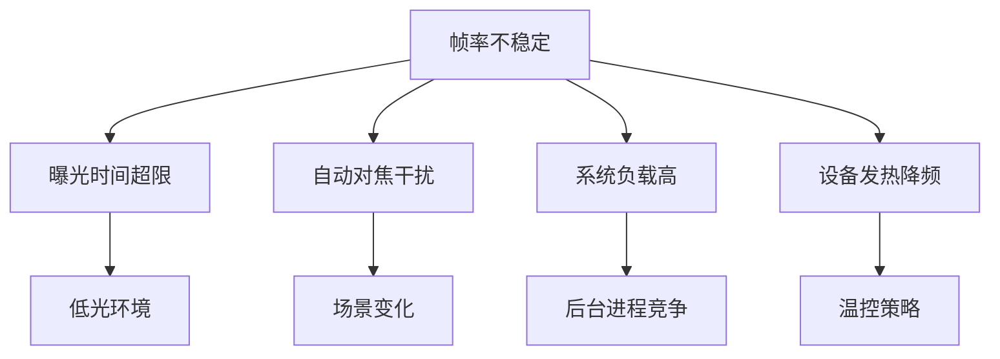

**帧率稳定性优化策略**：

```kotlin
// 帧率稳定性管理
class FrameRateStabilizer(
    private val cameraDevice: CameraDevice,
    private val characteristics: CameraCharacteristics
) {
    
    private var currentFps: Int = 30
    private var lastAdjustTime: Long = 0
    
    fun configureStableFps(targetFps: Int) {
        // 1. 获取有效帧率范围
        val fpsRanges = characteristics.get(
            CameraCharacteristics.CONTROL_AE_AVAILABLE_TARGET_FPS_RANGES
        ) ?: return
        
        // 2. 选择最稳定的范围（固定帧率优先）
        val bestRange = fpsRanges.sortedByDescending { range ->
            // 优先选择固定帧率范围（lower == upper）
            val isFixed = if (range.lower == range.upper) 1 else 0
            val closeness = if (targetFps in range.lower..range.upper) 1 else 0
            isFixed * 10 + closeness
        }.first()
        
        // 3. 应用帧率范围
        val request = cameraDevice.createCaptureRequest(
            CameraDevice.TEMPLATE_RECORD
        ).apply {
            set(CaptureRequest.CONTROL_AE_TARGET_FPS_RANGE, bestRange)
            
            // 4. 配置曝光优先帧率（而非画质）
            if (Build.VERSION.SDK_INT >= Build.VERSION_CODES.R) {
                set(CaptureRequest.CONTROL_AE_MODE,
                    CaptureRequest.CONTROL_AE_MODE_ON)
            }
            
            // 5. 禁用视频防抖（增加延迟）
            set(CaptureRequest.CONTROL_VIDEO_STABILIZATION_MODE,
                CaptureRequest.CONTROL_VIDEO_STABILIZATION_MODE_OFF)
        }
        
        currentFps = bestRange.lower
    }
    
    // 动态帧率调整（基于场景）
    fun adjustFpsForScene(isLowLight: Boolean, isHighMotion: Boolean): Int {
        val newFps = when {
            isLowLight -> 24  // 低光降帧保证曝光
            isHighMotion -> 30  // 高动态保持帧率
            else -> 30
        }
        
        // 防止频繁调整
        val now = System.currentTimeMillis()
        if (now - lastAdjustTime < 3000) return currentFps
        
        if (newFps != currentFps) {
            configureStableFps(newFps)
            lastAdjustTime = now
        }
        
        return currentFps
    }
    
    // 监控实际帧率
    private val frameTimestamps = ArrayDeque<Long>(60)
    
    fun recordFrame() {
        val now = System.nanoTime()
        frameTimestamps.addLast(now)
        
        // 保留最近60帧的时间戳
        while (frameTimestamps.size > 60) {
            frameTimestamps.removeFirst()
        }
    }
    
    fun getActualFps(): Float {
        if (frameTimestamps.size < 2) return 0f
        
        val oldest = frameTimestamps.first()
        val newest = frameTimestamps.last()
        val durationMs = (newest - oldest) / 1_000_000f
        val frameCount = frameTimestamps.size - 1
        
        return frameCount * 1000f / durationMs
    }
}
```

**帧率稳定性监控指标**：

| 指标 | 计算方式 | 健康阈值 | 劣化表现 |
|-----|---------|---------|----------|
| 平均帧率 | 1秒内总帧数 | 目标值±2fps | 偏离>5fps |
| 帧率标准差 | 帧间隔标准差 | <3ms | >5ms |
| 帧间隔最大值 | 连续帧最大间隔 | <2×平均间隔 | >2×平均 |
| 帧丢失率 | 缺失帧/应输出帧 | <1% | >5% |

---

### 3.3 跨平台采集抽象层设计

**抽象层架构**：

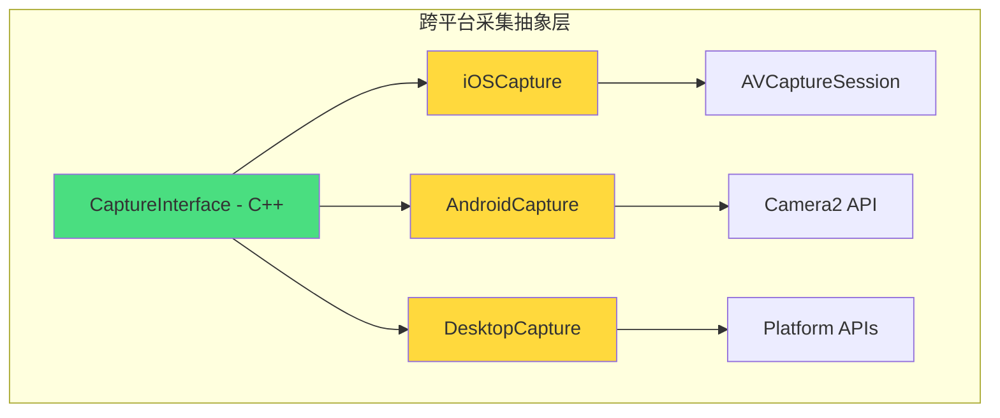

**统一接口定义（C++）**：

```cpp
// capture_interface.h
#pragma once

#include <memory>
#include <functional>
#include <cstdint>

namespace capture {

// 像素格式
enum class PixelFormat {
    NV12,       // 420YpCbCr8BiPlanar
    NV21,       // Android默认
    I420,       // YUV420Planar
    BGRA,       // 32位BGRA
    RGBA,       // 32位RGBA
};

// 帧数据
struct VideoFrame {
    uint8_t* data[3] = {nullptr, nullptr, nullptr};  // Y/U/V or Y/UV
    int32_t width = 0;
    int32_t height = 0;
    int32_t stride[3] = {0, 0, 0};
    int64_t timestampUs = 0;  // 微秒
    int64_t frameId = 0;
    PixelFormat format = PixelFormat::NV12;
    
    // 是否由外部管理内存（Zero-copy场景）
    bool externalBuffer = false;
    void* nativeHandle = nullptr;  // CVPixelBuffer/Surface等
};

// 采集配置
struct CaptureConfig {
    int32_t width = 1280;
    int32_t height = 720;
    int32_t fps = 30;
    PixelFormat preferredFormat = PixelFormat::NV12;
    bool enableZeroCopy = true;
    int32_t cameraIndex = 0;  // 0=back, 1=front
};

// 采集状态
enum class CaptureState {
    Idle,
    Starting,
    Running,
    Paused,
    Stopping,
    Error,
};

// 错误类型
enum class CaptureError {
    None = 0,
    PermissionDenied,
    DeviceNotFound,
    DeviceBusy,
    ConfigurationFailed,
    BufferAllocationFailed,
    InternalError,
};

// 回调接口
class CaptureCallback {
public:
    virtual ~CaptureCallback() = default;
    
    virtual void onFrameCaptured(const VideoFrame& frame) = 0;
    virtual void onStateChanged(CaptureState state) = 0;
    virtual void onError(CaptureError error, const char* message) = 0;
    virtual void onFrameRateChanged(int32_t actualFps) = 0;
};

// 采集抽象接口
class ICaptureDevice {
public:
    virtual ~ICaptureDevice() = default;
    
    // 生命周期管理
    virtual bool initialize(const CaptureConfig& config) = 0;
    virtual bool start() = 0;
    virtual bool stop() = 0;
    virtual void release() = 0;
    
    // 状态查询
    virtual CaptureState getState() const = 0;
    virtual bool isSupported(const CaptureConfig& config) const = 0;
    virtual void getSupportedFormats(std::vector<CaptureConfig>& formats) const = 0;
    
    // 参数控制
    virtual bool setFps(int32_t fps) = 0;
    virtual bool setResolution(int32_t width, int32_t height) = 0;
    virtual bool setCameraIndex(int32_t index) = 0;
    
    // 回调注册
    virtual void setCallback(CaptureCallback* callback) = 0;
};

// 工厂函数
typedef ICaptureDevice* (*CreateCaptureDeviceFunc)();

}  // namespace capture
```

**平台实现示例（iOS）**：

```objc
// ios_capture.h (Objective-C++)
#import <AVFoundation/AVFoundation.h>
#import "capture_interface.h"

@interface iOSCaptureDevice : NSObject<AVCaptureVideoDataOutputSampleBufferDelegate>
@end

// ios_capture.mm
#import "ios_capture.h"

@interface iOSCaptureDevice () {
    AVCaptureSession* _session;
    AVCaptureDeviceInput* _input;
    AVCaptureVideoDataOutput* _output;
    dispatch_queue_t _queue;
    
    capture::CaptureConfig _config;
    capture::CaptureCallback* _callback;
    capture::CaptureState _state;
}
@end

@implementation iOSCaptureDevice

- (instancetype)init {
    self = [super init];
    if (self) {
        _state = capture::CaptureState::Idle;
        _queue = dispatch_queue_create("com.capture.ios", DISPATCH_QUEUE_SERIAL);
    }
    return self;
}

- (bool)initialize:(const capture::CaptureConfig&)config {
    _config = config;
    
    // 创建AVCaptureSession
    _session = [[AVCaptureSession alloc] init];
    
    // 配置采集设备
    AVCaptureDevicePosition position = 
        config.cameraIndex == 0 ? AVCaptureDevicePositionBack : AVCaptureDevicePositionFront;
    AVCaptureDevice* device = [AVCaptureDevice defaultDeviceWithMediaType:AVMediaTypeVideo
                                                                  position:position
                                                            inDeviceTypes:@[AVCaptureDeviceTypeBuiltInWideAngleCamera]];
    
    if (!device) return false;
    
    // 配置格式
    [_session beginConfiguration];
    
    NSError* error = nil;
    _input = [AVCaptureDeviceInput deviceInputWithDevice:device error:&error];
    if (error || ![_session canAddInput:_input]) {
        [_session commitConfiguration];
        return false;
    }
    [_session addInput:_input];
    
    // 配置输出
    _output = [[AVCaptureVideoDataOutput alloc] init];
    OSType pixelFormat = [self mapPixelFormat:config.preferredFormat];
    _output.videoSettings = @{(__bridge id)kCVPixelBufferPixelFormatTypeKey: @(pixelFormat)};
    [_session addOutput:_output];
    
    // 配置帧率和分辨率
    [self configureDevice:device fps:config.fps width:config.width height:config.height];
    
    [_session commitConfiguration];
    
    [_output setSampleBufferDelegate:self queue:_queue];
    
    return true;
}

- (OSType)mapPixelFormat:(capture::PixelFormat)format {
    switch (format) {
        case capture::PixelFormat::NV12:
            return kCVPixelFormatType_420YpCbCr8BiPlanarVideoRange;
        case capture::PixelFormat::I420:
            return kCVPixelFormatType_420YpCbCr8Planar;
        case capture::PixelFormat::BGRA:
            return kCVPixelFormatType_32BGRA;
        default:
            return kCVPixelFormatType_420YpCbCr8BiPlanarVideoRange;
    }
}

- (void)captureOutput:(AVCaptureOutput *)output
didOutputSampleBuffer:(CMSampleBufferRef)sampleBuffer
       fromConnection:(AVCaptureConnection *)connection {
    
    if (!_callback) return;
    
    CVImageBufferRef imageBuffer = CMSampleBufferGetImageBuffer(sampleBuffer);
    
    capture::VideoFrame frame;
    frame.nativeHandle = imageBuffer;
    frame.externalBuffer = true;  // Zero-copy
    
    frame.width = (int32_t)CVPixelBufferGetWidth(imageBuffer);
    frame.height = (int32_t)CVPixelBufferGetHeight(imageBuffer);
    frame.timestampUs = CMTimeGetSeconds(CMSampleBufferGetPresentationTimeStamp(sampleBuffer)) * 1e6;
    
    // iOS使用NV12格式
    frame.format = capture::PixelFormat::NV12;
    
    _callback->onFrameCaptured(frame);
}

- (bool)start {
    [_session startRunning];
    _state = capture::CaptureState::Running;
    if (_callback) _callback->onStateChanged(_state);
    return true;
}

- (bool)stop {
    [_session stopRunning];
    _state = capture::CaptureState::Idle;
    if (_callback) _callback->onStateChanged(_state);
    return true;
}

@end
```

**平台差异屏蔽策略**：

| 差异点 | iOS处理 | Android处理 | 抽象层策略 |
|-------|---------|-------------|-----------|
| 像素格式 | NV12 (BiPlanar) | NV21 (Android) | 统一转换或双格式支持 |
| 帧率控制 | activeVideoMinFrameDuration | CONTROL_AE_TARGET_FPS_RANGE | 封装统一接口 |
| Zero-copy | CVPixelBuffer | Surface | 通过nativeHandle传递 |
| 权限处理 | Info.plist + 运行时权限 | 运行时权限请求 | 统一错误回调 |
| 设备枚举 | AVCaptureDeviceDiscoverySession | CameraManager.getCameraIdList | 统一枚举接口 |
| 多摄像头 | AVCaptureMultiCamSession | 多CameraDevice | 统一多摄接口 |

---

## 第4章 How — 屏幕采集优化

### 4.1 iOS 屏幕采集（ReplayKit）

**ReplayKit架构**：

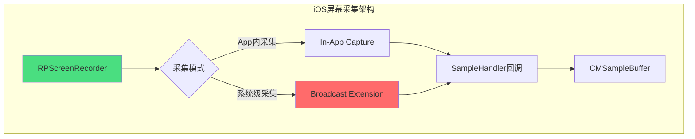

**RPScreenRecorder vs Broadcast Extension对比**：

| 对比维度 | RPScreenRecorder | Broadcast Extension |
|---------|-----------------|-------------------|
| **采集范围** | 仅当前App | 系统全局（含其他App） |
| **系统版本** | iOS 9+ | iOS 10+ |
| **用户授权** | 系统弹窗确认 | 控制中心启动 |
| **后台采集** | 不支持 | 支持（独立进程） |
| **性能影响** | 较低 | 独立进程，影响更低 |
| **适用场景** | App内录制 | 直播、远程协作 |
| **权限要求** | 无特殊权限 | 需配置Broadcast Extension |

**RPScreenRecorder基础采集**：

```objc
// Objective-C: App内屏幕采集
@interface ScreenCapture : NSObject <RPScreenRecorderDelegate>
@property (nonatomic, strong) RPScreenRecorder *recorder;
@property (nonatomic, copy) void (^sampleBufferHandler)(CMSampleBufferRef);
@end

@implementation ScreenCapture

- (instancetype)init {
    self = [super init];
    if (self) {
        _recorder = RPScreenRecorder.sharedRecorder;
        _recorder.delegate = self;
    }
    return self;
}

- (void)startCapture {
    // 检查可用性
    if (![RPScreenRecorder sharedRecorder].available) {
        NSLog(@"Screen recording not available");
        return;
    }
    
    RPScreenRecorder *recorder = RPScreenRecorder.sharedRecorder;
    
    [recorder startCaptureWithHandler:^(CMSampleBufferRef sampleBuffer, RPSampleBufferType bufferType, NSError *error) {
        if (error) {
            NSLog(@"Capture error: %@", error);
            return;
        }
        
        switch (bufferType) {
            case RPSampleBufferTypeVideo:
                if (self.sampleBufferHandler) {
                    self.sampleBufferHandler(sampleBuffer);
                }
                break;
            case RPSampleBufferTypeAudioApp:
                // App音频
                break;
            case RPSampleBufferTypeAudioMic:
                // 麦克风音频
                break;
            default:
                break;
        }
    } completionHandler:^(NSError *error) {
        if (error) {
            NSLog(@"Start capture failed: %@", error);
        } else {
            NSLog(@"Screen capture started");
        }
    }];
}

- (void)stopCapture {
    [RPScreenRecorder.sharedRecorder stopCaptureWithHandler:^(NSError *error) {
        NSLog(@"Screen capture stopped");
    }];
}

#pragma mark - RPScreenRecorderDelegate

- (void)screenRecorder:(RPScreenRecorder *)screenRecorder didStopRecordingWithError:(NSError *)error previewViewController:(nullable UIViewController *)previewViewController {
    NSLog(@"Recording stopped with error: %@", error);
}

- (void)screenRecorderDidChangeAvailability:(RPScreenRecorder *)screenRecorder {
    NSLog(@"Screen recorder availability changed: %d", screenRecorder.available);
}

@end
```

**Broadcast Extension实现**：

```objc
// SampleHandler.m (Broadcast Extension)
#import <ReplayKit/ReplayKit.h>

@interface SampleHandler () <RPScreenRecorderDelegate>
@end

@implementation SampleHandler

- (void)broadcastStartedWithSetupInfo:(NSDictionary<NSString *,NSObject *> *)setupInfo {
    NSLog(@"Broadcast started");
}

- (void)broadcastPaused {
    NSLog(@"Broadcast paused");
}

- (void)broadcastResumed {
    NSLog(@"Broadcast resumed");
}

- (void)broadcastFinished {
    NSLog(@"Broadcast finished");
}

- (void)processSampleBuffer:(CMSampleBufferRef)sampleBuffer withType:(RPSampleBufferType)sampleBufferType {
    switch (sampleBufferType) {
        case RPSampleBufferTypeVideo: {
            CVImageBufferRef imageBuffer = CMSampleBufferGetImageBuffer(sampleBuffer);
            CMTime timestamp = CMSampleBufferGetPresentationTimeStamp(sampleBuffer);
            [self processVideoFrame:imageBuffer timestamp:timestamp];
            break;
        }
        case RPSampleBufferTypeAudioApp:
            [self processAudioSample:sampleBuffer type:@"app"];
            break;
        case RPSampleBufferTypeAudioMic:
            [self processAudioSample:sampleBuffer type:@"mic"];
            break;
        default:
            break;
    }
}

- (void)processVideoFrame:(CVImageBufferRef)imageBuffer timestamp:(CMTime)timestamp {
    // Zero-copy传递给编码器
}

- (void)processAudioSample:(CMSampleBufferRef)sampleBuffer type:(NSString *)type {
    // 处理音频数据
}

@end
```

**帧率和分辨率控制**：

```objc
// iOS 15+支持帧率控制
- (void)configureCaptureFrameRate:(int32_t)fps {
    if (@available(iOS 15.0, *)) {
        RPScreenRecorder *recorder = RPScreenRecorder.sharedRecorder;
        recorder.captureFrameRate = fps;
    }
}
```

**系统限制与兼容性**：

| 限制项 | 说明 | 应对策略 |
|-------|------|----------|
| 系统弹窗 | 首次使用需用户确认 | 提前引导用户 |
| 录制指示器 | iOS 11+显示红条/指示器 | 无法隐藏，属于安全机制 |
| 后台限制 | App内采集不可后台运行 | 使用Broadcast Extension |
| 内存限制 | Extension有严格内存限制 | 及时释放缓冲区 |

### 4.2 Android 屏幕采集（MediaProjection）

**MediaProjection架构**：

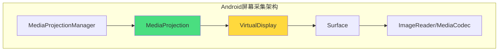

**VirtualDisplay + Surface方案**：

```kotlin
// Kotlin: Android屏幕采集
class ScreenCapture(private val context: Context) {
    
    private var mediaProjection: MediaProjection? = null
    private var virtualDisplay: VirtualDisplay? = null
    private var imageReader: ImageReader? = null
    
    fun startCapture(resultCode: Int, data: Intent) {
        val manager = context.getSystemService(Context.MEDIA_PROJECTION_SERVICE) as MediaProjectionManager
        mediaProjection = manager.getMediaProjection(resultCode, data)
        
        mediaProjection?.registerCallback(object : MediaProjection.Callback() {
            override fun onStop() {
                releaseResources()
            }
        }, null)
        
        setupImageReader()
        createVirtualDisplay()
    }
    
    private fun setupImageReader() {
        val metrics = context.resources.displayMetrics
        imageReader = ImageReader.newInstance(
            metrics.widthPixels, metrics.heightPixels,
            PixelFormat.RGBA_8888, 2
        ).apply {
            setOnImageAvailableListener({ reader ->
                val image = reader.acquireLatestImage()
                image?.let {
                    processImage(it)
                    it.close()
                }
            }, null)
        }
    }
    
    private fun createVirtualDisplay() {
        val metrics = context.resources.displayMetrics
        virtualDisplay = mediaProjection?.createVirtualDisplay(
            "ScreenCapture",
            metrics.widthPixels, metrics.heightPixels, metrics.densityDpi,
            DisplayManager.VIRTUAL_DISPLAY_FLAG_AUTO_MIRROR,
            imageReader?.surface,
            null, null
        )
    }
    
    private fun processImage(image: Image) {
        val planes = image.planes
        val buffer = planes[0].buffer
        // 处理RGBA数据
    }
    
    // Zero-copy方案：直接连接MediaCodec
    fun startCaptureWithEncoder(resultCode: Int, data: Intent) {
        val manager = context.getSystemService(Context.MEDIA_PROJECTION_SERVICE) as MediaProjectionManager
        mediaProjection = manager.getMediaProjection(resultCode, data)
        
        mediaCodec = MediaCodec.createEncoderByType(MediaFormat.MIMETYPE_VIDEO_AVC).apply {
            val format = MediaFormat.createVideoFormat(
                MediaFormat.MIMETYPE_VIDEO_AVC,
                screenWidth, screenHeight
            ).apply {
                setInteger(MediaFormat.KEY_BIT_RATE, 4_000_000)
                setInteger(MediaFormat.KEY_FRAME_RATE, 30)
                setInteger(MediaFormat.KEY_I_FRAME_INTERVAL, 2)
                setInteger(MediaFormat.KEY_COLOR_FORMAT,
                    MediaCodecInfo.CodecCapabilities.COLOR_FormatSurface)
            }
            configure(format, null, null, MediaCodec.CONFIGURE_FLAG_ENCODE)
            start()
        }
        
        val encoderSurface = mediaCodec!!.createInputSurface()
        virtualDisplay = mediaProjection?.createVirtualDisplay(
            "ScreenCapture",
            screenWidth, screenHeight, screenDensity,
            DisplayManager.VIRTUAL_DISPLAY_FLAG_AUTO_MIRROR,
            encoderSurface,
            null, null
        )
        
        startEncoderOutput()
    }
    
    private fun releaseResources() {
        virtualDisplay?.release()
        imageReader?.close()
        mediaProjection?.stop()
    }
}
```

**Android 10+权限变化处理**：

```kotlin
// Android 10+ 需要前台服务
@RequiresApi(Build.VERSION_CODES.Q)
class ScreenCaptureService : Service() {
    
    private var screenCapture: ScreenCapture? = null
    
    override fun onStartCommand(intent: Intent?, flags: Int, startId: Int): Int {
        val notification = createNotification()
        startForeground(NOTIFICATION_ID, notification)
        
        val resultCode = intent?.getIntExtra("resultCode", Activity.RESULT_CANCELED) 
            ?: Activity.RESULT_CANCELED
        val data = intent?.getParcelableExtra<Intent>("data")
        
        if (data != null) {
            screenCapture = ScreenCapture(this)
            screenCapture?.startCapture(resultCode, data)
        }
        
        return START_STICKY
    }
    
    private fun createNotification(): Notification {
        val channelId = "screen_capture_channel"
        if (Build.VERSION.SDK_INT >= Build.VERSION_CODES.O) {
            val channel = NotificationChannel(
                channelId, "Screen Capture", NotificationManager.IMPORTANCE_LOW
            )
            getSystemService(NotificationManager::class.java).createNotificationChannel(channel)
        }
        
        return NotificationCompat.Builder(this, channelId)
            .setContentTitle("Screen Capture Active")
            .setSmallIcon(R.drawable.ic_notification)
            .build()
    }
    
    override fun onBind(intent: Intent?): IBinder? = null
    
    companion object {
        private const val NOTIFICATION_ID = 1001
    }
}
```

### 4.3 桌面端屏幕采集

#### 4.3.1 Windows DXGI Desktop Duplication

```cpp
// C++: Windows Desktop Duplication API
#include <dxgi1_2.h>
#include <d3d11.h>

class DesktopDuplicationCapture {
public:
    bool initialize() {
        // 1. 创建D3D11设备
        D3D_FEATURE_LEVEL featureLevel;
        HRESULT hr = D3D11CreateDevice(
            nullptr, D3D_DRIVER_TYPE_HARDWARE,
            nullptr, 0,
            nullptr, 0, D3D11_SDK_VERSION,
            &d3dDevice_, &featureLevel, &d3dContext_
        );
        if (FAILED(hr)) return false;
        
        // 2. 获取DXGI输出
        CComPtr<IDXGIDevice> dxgiDevice;
        d3dDevice_->QueryInterface(__uuidof(IDXGIDevice), (void**)&dxgiDevice);
        
        CComPtr<IDXGIAdapter> adapter;
        dxgiDevice->GetAdapter(&adapter);
        
        CComPtr<IDXGIOutput> output;
        adapter->EnumOutputs(0, &output);
        
        // 3. 创建Desktop Duplication
        CComPtr<IDXGIOutput1> output1;
        output->QueryInterface(__uuidof(IDXGIOutput1), (void**)&output1);
        output1->DuplicateOutput(d3dDevice_, &desktopDuplication_);
        
        if (!desktopDuplication_) return false;
        
        // 4. 获取输出描述
        DXGI_OUTDUPL_DESC desc;
        desktopDuplication_->GetDesc(&desc);
        width_ = desc.ModeDesc.Width;
        height_ = desc.ModeDesc.Height;
        
        return true;
    }
    
    bool captureFrame() {
        DXGI_OUTDUPL_FRAME_INFO frameInfo;
        CComPtr<IDXGIResource> resource;
        
        if (currentFrame_) {
            desktopDuplication_->ReleaseFrame();
            currentFrame_.Release();
        }
        
        HRESULT hr = desktopDuplication_->AcquireNextFrame(1000, &frameInfo, &resource);
        
        if (hr == DXGI_ERROR_WAIT_TIMEOUT) return false;
        if (FAILED(hr)) return false;
        
        resource->QueryInterface(__uuidof(ID3D11Texture2D), (void**)&currentFrame_);
        return true;
    }
    
private:
    CComPtr<ID3D11Device> d3dDevice_;
    CComPtr<ID3D11DeviceContext> d3dContext_;
    CComPtr<IDXGIOutputDuplication> desktopDuplication_;
    CComPtr<ID3D11Texture2D> currentFrame_;
    int width_ = 0, height_ = 0;
};
```

#### 4.3.2 macOS ScreenCaptureKit

```swift
// Swift: macOS ScreenCaptureKit (macOS 12.3+)
import ScreenCaptureKit

class MacOScreenCapture: NSObject, SCStreamDelegate, SCStreamOutput {
    
    private var stream: SCStream?
    
    func startCapture() async throws {
        // 1. 获取可共享内容
        let content = try await SCShareableContent.excludingDesktopWindows(
            false, onScreenWindowsOnly: true
        )
        
        guard let display = content.displays.first else {
            throw CaptureError.noDisplay
        }
        
        // 2. 配置滤镜
        let filter = SCContentFilter(display: display, excludingWindows: [])
        
        // 3. 配置流
        let config = SCStreamConfiguration()
        config.width = display.width
        config.height = display.height
        config.minimumFrameInterval = CMTime(value: 1, timescale: 30)  // 30fps
        config.pixelFormat = kCVPixelFormatType_420YpCbCr8BiPlanarVideoRange
        
        // 4. 创建流
        stream = SCStream(filter: filter, configuration: config, delegate: self)
        try stream?.addStreamOutput(self, type: .screen, sampleHandlerQueue: .global())
        
        // 5. 启动采集
        try await stream?.startCapture()
    }
    
    func stream(_ stream: SCStream, didOutputSampleBuffer sampleBuffer: CMSampleBuffer, of type: SCStreamOutputType) {
        guard let imageBuffer = sampleBuffer.imageBuffer else { return }
        // 处理视频帧
    }
    
    func stopCapture() async {
        try? await stream?.stopCapture()
    }
}
```

---

## 第5章 How — 音频采集优化

### 5.1 iOS 音频采集

**AudioUnit（RemoteIO）低延迟采集**：

```objc
// Objective-C: AudioUnit低延迟采集
@interface AudioCapture : NSObject {
    AudioUnit _audioUnit;
}
@property (nonatomic, copy) void (^audioDataHandler)(const AudioBufferList*, UInt32);
@end

@implementation AudioCapture

- (void)setupAudioSession {
    AVAudioSession *session = [AVAudioSession sharedInstance];
    [session setCategory:AVAudioSessionCategoryPlayAndRecord
                    mode:AVAudioSessionModeVoiceChat
                 options:AVAudioSessionCategoryOptionDefaultToSpeaker
                   error:nil];
    [session setPreferredIOBufferDuration:0.005 error:nil];  // 5ms
    [session setPreferredSampleRate:48000 error:nil];
    [session setActive:YES error:nil];
}

- (void)setupAudioUnit {
    AudioComponentDescription desc = {
        .componentType = kAudioUnitType_Output,
        .componentSubType = kAudioUnitSubType_RemoteIO,
        .componentManufacturer = kAudioUnitManufacturer_Apple,
    };
    
    AudioComponent component = AudioComponentFindNext(NULL, &desc);
    AudioComponentInstanceNew(component, &_audioUnit);
    
    // 配置格式
    AudioStreamBasicDescription format = {
        .mSampleRate = 48000,
        .mFormatID = kAudioFormatLinearPCM,
        .mFormatFlags = kAudioFormatFlagIsSignedInteger | kAudioFormatFlagIsPacked,
        .mBitsPerChannel = 16,
        .mBytesPerFrame = 2,
        .mFramesPerPacket = 1,
        .mBytesPerPacket = 2,
        .mChannelsPerFrame = 1,
    };
    
    AudioUnitSetProperty(_audioUnit, kAudioUnitProperty_StreamFormat,
                          kAudioUnitScope_Output, 1, &format, sizeof(format));
    
    // 配置回调
    AURenderCallbackStruct callbackStruct = {
        .inputProc = audioInputCallback,
        .inputProcRefCon = (__bridge void *)(self)
    };
    AudioUnitSetProperty(_audioUnit, kAudioOutputUnitProperty_SetInputCallback,
                          kAudioUnitScope_Global, 1, &callbackStruct, sizeof(callbackStruct));
    
    AudioUnitInitialize(_audioUnit);
}

static OSStatus audioInputCallback(void *inRefCon,
                                   AudioUnitRenderActionFlags *ioActionFlags,
                                   const AudioTimeStamp *inTimeStamp,
                                   UInt32 inBusNumber,
                                   UInt32 inNumberFrames,
                                   AudioBufferList *ioData) {
    AudioCapture *capture = (__bridge AudioCapture *)inRefCon;
    
    AudioBufferList bufferList;
    bufferList.mNumberBuffers = 1;
    bufferList.mBuffers[0].mNumberChannels = 1;
    bufferList.mBuffers[0].mDataByteSize = inNumberFrames * 2;
    bufferList.mBuffers[0].mData = malloc(inNumberFrames * 2);
    
    OSStatus status = AudioUnitRender(capture->_audioUnit, ioActionFlags,
                                       inTimeStamp, inBusNumber, inNumberFrames, &bufferList);
    
    if (status == noErr && capture.audioDataHandler) {
        capture.audioDataHandler(&bufferList, inNumberFrames);
    }
    
    free(bufferList.mBuffers[0].mData);
    return status;
}

- (void)start { AudioOutputUnitStart(_audioUnit); }
- (void)stop { AudioOutputUnitStop(_audioUnit); }

@end
```

**AVAudioSession配置最佳实践**：

| 配置项 | 推荐值 | 说明 |
|-------|-------|------|
| Category | PlayAndRecord | 同时录音和播放 |
| Mode | VoiceChat | RTC场景，内置AEC |
| BufferDuration | 5-10ms | 低延迟 |
| SampleRate | 48000Hz | 高质量，兼容性好 |

### 5.2 Android 音频采集

**AAudio vs OpenSL ES vs AudioRecord对比**：

| 对比维度 | AAudio | OpenSL ES | AudioRecord |
|---------|--------|-----------|-------------|
| **系统版本** | Android 8.0+ | Android 2.3+ | Android 1.5+ |
| **性能** | 最优 | 优秀 | 一般 |
| **延迟** | 低延迟模式<10ms | 10-20ms | 20-50ms |
| **维护状态** | 活跃维护 | 已停止维护 | 维护 |

**Oboe库使用示例**：

```cpp
// C++: Oboe音频采集
#include <oboe/Oboe.h>

class AudioEngine : public oboe::AudioStreamDataCallback {
public:
    void start() {
        oboe::AudioStreamBuilder builder;
        builder.setDirection(oboe::Direction::Input)
               ->setPerformanceMode(oboe::PerformanceMode::LowLatency)
               ->setSharingMode(oboe::SharingMode::Exclusive)
               ->setFormat(oboe::AudioFormat::Float)
               ->setChannelCount(oboe::ChannelCount::Mono)
               ->setSampleRate(48000)
               ->setDataCallback(this);
        
        oboe::Result result = builder.openStream(&stream);
        if (result == oboe::Result::OK) {
            stream->requestStart();
        }
    }
    
    oboe::DataCallbackResult onAudioReady(
        oboe::AudioStream *audioStream,
        void *audioData,
        int32_t numFrames) override {
        float *floatData = static_cast<float*>(audioData);
        processAudio(floatData, numFrames);
        return oboe::DataCallbackResult::Continue;
    }
    
private:
    oboe::AudioStream *stream = nullptr;
};
```

### 5.3 音频采集工程问题

**回声消除（AEC）工程集成**：

```objc
// iOS 13+ 内置VoiceProcessing
- (void)enableBuiltInAEC {
    if (@available(iOS 13.0, *)) {
        AVAudioSession *session = [AVAudioSession sharedInstance];
        session.isVoiceProcessingEnabled = YES;
    }
}
```

```kotlin
// Android AcousticEchoCanceler
fun enableAEC(audioSessionId: Int): Boolean {
    if (AcousticEchoCanceler.isAvailable()) {
        val aec = AcousticEchoCanceler.create(audioSessionId)
        aec?.enabled = true
        return aec != null
    }
    return false
}
```

**蓝牙设备兼容性**：

| 设备类型 | 延迟 | 音质 | 双向支持 |
|---------|------|------|----------|
| A2DP | 100-200ms | 高 | 仅播放 |
| HFP/HSP | 20-50ms | 中 | 支持 |
| LE Audio | 20-40ms | 中高 | 支持 |

---

## 第6章 How — 采集-编码通路优化

### 6.1 Zero-copy数据通路设计

**性能对比数据**：

| 方案 | 延迟 | CPU占用 | 内存带宽 |
|-----|------|---------|----------|
| CPU拷贝+软编 | +15-30ms | 20-40% | 高 |
| CPU拷贝+硬编 | +8-15ms | 10-20% | 中 |
| Zero-copy硬编 | 0ms | 2-5% | 低 |

### 6.2 数据格式与颜色空间

**格式选择策略**：

| 格式 | 内存占用 | 编码兼容 | GPU处理 | 推荐场景 |
|-----|---------|---------|---------|----------|
| NV12 | 1.5 bytes/pixel | iOS原生 | 较好 | iOS采集首选 |
| NV21 | 1.5 bytes/pixel | Android原生 | 较好 | Android采集首选 |
| I420 | 1.5 bytes/pixel | 通用 | 一般 | 跨平台处理 |
| BGRA | 4 bytes/pixel | 需转换 | 最佳 | GPU美颜/滤镜 |

**HDR采集的特殊处理**：

| 项目 | SDR | HDR |
|-----|-----|-----|
| 色彩空间 | BT.601/BT.709 | BT.2020 |
| 像素格式 | 8-bit | 10-bit/12-bit |
| 编码支持 | 广泛 | H.265 Main10 |

---

## 第7章 How — 采集策略优化

### 7.1 动态分辨率/帧率调节

**基于网络状况的采集参数动态调整**：

| 网络质量 | 分辨率 | 帧率 | 码率 |
|---------|-------|------|------|
| 优秀 (>5Mbps) | 1920x1080 | 30 | 4Mbps |
| 良好 (2-5Mbps) | 1280x720 | 30 | 2Mbps |
| 较差 (500Kbps-2Mbps) | 640x480 | 24 | 800Kbps |
| 极差 (<500Kbps) | 320x240 | 15 | 300Kbps |

### 7.2 功耗优化

**采集帧率与功耗的关系**：

| 帧率 | 相对功耗 | 采集延迟 | 适用场景 |
|-----|---------|---------|----------|
| 15fps | 60% | 66ms | 低功耗模式 |
| 30fps | 100% | 33ms | 标准RTC |
| 60fps | 160% | 17ms | 游戏/高流畅 |

---

## 第8章 监控与度量

### 8.1 采集帧率稳定性指标

| 指标名称 | 计算方式 | 健康阈值 | 劣化阈值 |
|---------|---------|---------|----------|
| 平均帧率 | 1秒内帧数 | 目标±2fps | 目标±5fps |
| 帧率标准差 | σ(frameInterval) | <3ms | >5ms |
| 帧间隔最大值 | max(frameInterval) | <2×平均 | >3×平均 |
| 帧丢失率 | 丢失帧/应出帧 | <1% | >5% |

### 8.2 采集延迟测量方法

**延迟测量方案**：

1. **时间戳注入**：请求帧时记录时间，收到帧时计算差值
2. **双重缓冲对比**：CPU渲染递增计数器，检测帧中计数器对比

### 8.3 采集异常检测与告警

| 异常类型 | 检测条件 | 告警级别 | 处理建议 |
|---------|---------|---------|----------|
| 帧率骤降 | 平均帧率<目标帧率50% | 高 | 检查设备/系统状态 |
| 帧率抖动 | 标准差>平均间隔50% | 中 | 检查曝光/对焦 |
| 帧丢失 | 连续丢失>3帧 | 高 | 检查缓冲区/处理能力 |
| 延迟突增 | 延迟>历史均值3倍 | 高 | 检查系统负载 |

---

## 第9章 最佳实践清单

### 9.1 采集优化Checklist

| 检查项 | 平台 | 优先级 |
|-------|------|-------|
| **参数配置** |||
| 使用合适的采集分辨率 | 全平台 | 高 |
| 配置帧率并检测实际帧率 | 全平台 | 高 |
| 曝光模式与帧率联动 | iOS/Android | 高 |
| 选择合适的像素格式 | 全平台 | 中 |
| **Zero-copy** |||
| CVPixelBuffer直接传递VideoToolbox | iOS | 高 |
| Surface直连MediaCodec | Android | 高 |
| 避免不必要的格式转换 | 全平台 | 高 |
| **兼容性** |||
| 检测Camera2硬件级别 | Android | 高 |
| 处理厂商特定问题 | Android | 中 |
| 低版本系统降级策略 | 全平台 | 中 |
| **性能监控** |||
| 实现帧率监控 | 全平台 | 高 |
| 实现延迟测量 | 全平台 | 中 |
| 异常检测与告警 | 全平台 | 中 |

### 9.2 常见踩坑与解决方案

| 踩坑 | 表现 | 根因 | 解决方案 |
|-----|------|------|----------|
| 帧率不达标 | 配置30fps实际只有15fps | 曝光时间过长 | 降低帧率或增加光照 |
| 颜色偏差 | 采集画面偏红/偏绿 | 色彩空间不匹配 | 检查并统一色彩空间 |
| 画面闪烁 | 画面周期性闪烁 | 曝光/白平衡反复调整 | 锁定曝光或降低调整频率 |
| 延迟累积 | 延迟逐渐增加 | 处理速度跟不上采集速度 | 丢弃帧或降低采集帧率 |
| 内存增长 | 内存持续增加 | 帧缓冲未释放 | 检查引用计数/缓冲池管理 |
| 后台采集中断 | App进入后台后停止采集 | 系统后台限制 | 使用前台服务/Broadcast Extension |
| 烫手 | 设备温度高 | 高帧率+高分辨率持续采集 | 动态降频/降分辨率 |

### 9.3 优化收益总结

| 优化项 | 延迟改善 | CPU降低 | 功耗降低 |
|-------|---------|---------|----------|
| Zero-copy通路 | 10-20ms | 15-25% | 10-15% |
| 合适的帧率/分辨率 | 5-10ms | 10-20% | 15-25% |
| 动态采集策略 | 不确定 | 10-30% | 20-40% |
| 平台API深度适配 | 5-15ms | 5-15% | 5-10% |
| **综合优化** | **20-40ms** | **30-50%** | **30-50%** |

---

## 参考资源

### Apple官方文档
- [AVCaptureSession Programming Guide](https://developer.apple.com/documentation/avfoundation/cameras_and_media_capture)
- [VideoToolbox Framework](https://developer.apple.com/documentation/videotoolbox)
- [ReplayKit Framework](https://developer.apple.com/documentation/replaykit)
- [AudioUnit Framework](https://developer.apple.com/documentation/audiounit)

### Android官方文档
- [Camera2 API Guide](https://developer.android.com/training/camera2)
- [CameraX Overview](https://developer.android.com/training/camerax)
- [MediaProjection API](https://developer.android.com/reference/android/media/projection/MediaProjection)
- [Oboe Library](https://github.com/google/oboe)

### WebRTC源码
- [WebRTC Video Capture Module](https://source.chromium.org/chromium/chromium/src/+/main:media/capture/)
- [WebRTC Audio Device Module](https://source.chromium.org/chromium/chromium/src/+/main:modules/audio_device/)

### 相关RFC/标准
- [ITU-T H.264 Advanced Video Coding](https://www.itu.int/rec/T-REC-H.264)
- [ITU-T H.265 High Efficiency Video Coding](https://www.itu.int/rec/T-REC-H.265)
- [ITU-R BT.601/BT.709/BT.2020 Color Space Standards](https://www.itu.int/rec/R-REC-BT)

---

> **文档版本**：v1.0  
> **最后更新**：2026年4月  
> **作者**：AI-Learn Knowledge Base