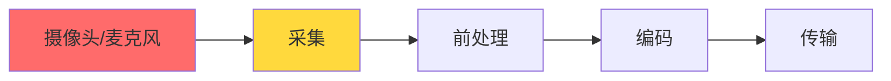
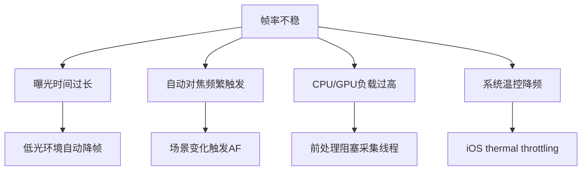
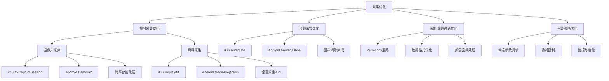
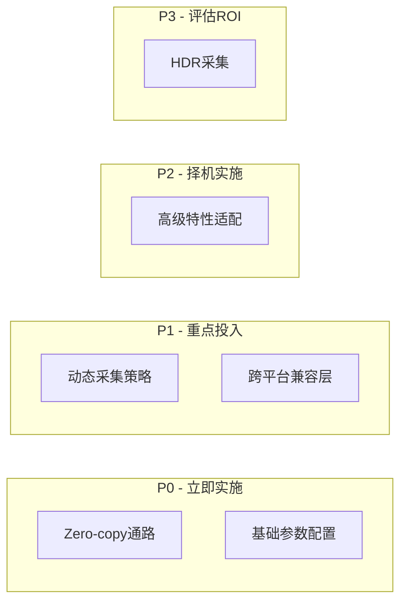

# 采集优化详细解析

> **TL;DR：采集是音视频链路的第一环，其质量直接决定后续处理的上限。核心优化策略包括：① 摄像头参数精细化配置（分辨率/帧率/曝光联动）；② Zero-copy数据通路（避免内存拷贝带来的延迟和功耗）；③ 平台API深度适配（iOS AVCaptureSession、Android Camera2）；④ 动态采集策略（根据网络/设备状态自适应调整）。工程实践表明，合理的采集优化可降低30-50ms延迟，减少20-40%功耗。**

---

## 核心结论（TL;DR）

**采集优化的本质是在质量、延迟、功耗三者之间取得平衡。**

现代音视频系统中采集优化的关键支柱：

1. **参数协同**：分辨率、帧率、曝光时间必须联动配置，避免单一参数优化带来的副作用
2. **零拷贝优先**：CVPixelBuffer/Surface直接传递给编码器，消除不必要的内存拷贝
3. **平台深度适配**：充分利用各平台硬件特性（如iOS的VideoToolbox直通、Android的Camera2 FULL级别能力）
4. **动态自适应**：基于设备性能、网络状况、电量状态的实时参数调整
5. **兼容性兜底**：完善的降级策略应对不同厂商、不同版本的兼容性差异

**一句话理解采集优化**：与其追求"最高画质采集"，不如确保"稳定、低延迟、低功耗的合适画质采集"——采集优化本质上是一种**资源约束下的平衡**艺术。

---

## 第1章 Why — 采集环节为什么重要

### 1.1 采集是音视频链路的第一环



**采集质量的决定性作用**：

| 采集问题 | 对后续环节影响 | 能否在后续环节修复 |
|---------|--------------|------------------|
| 曝光不足/过曝 | 编码效率下降、噪点放大 | 部分修复（3A算法） |
| 帧率不稳 | 编码码率波动、卡顿 | 难以修复 |
| 分辨率不匹配 | 需要额外缩放、画质损失 | 可以修复但有损失 |
| 延迟抖动 | 端到端延迟不可控 | 难以修复 |
| 色彩空间错误 | 色彩还原失真 | 难以修复 |

**关键洞察**：采集环节的缺陷往往无法在后续环节完全修复，因此采集优化具有**前置决定性**。

### 1.2 采集延迟在端到端延迟中的占比

**典型RTC系统延迟分布**：

| 环节 | 理想延迟 | 典型延迟 | 劣化延迟 | 占比（典型） |
|-----|---------|---------|---------|------------|
| **采集** | 8ms | 16ms | 33ms | **10-20%** |
| 前处理 | 5ms | 10ms | 30ms | 5-10% |
| 编码 | 5ms | 15ms | 50ms | 10-15% |
| 封装/发送 | 1ms | 3ms | 10ms | 2-5% |
| 网络传输 | 20ms | 50ms | 200ms | 30-50% |
| 接收缓冲 | 20ms | 50ms | 200ms | 20-30% |
| 解码 | 5ms | 10ms | 40ms | 5-10% |
| 渲染 | 8ms | 16ms | 33ms | 10-15% |
| **总计** | **72ms** | **170ms** | **596ms** | **100%** |

**采集延迟的构成**：

```
总采集延迟 = 曝光时间 + 传感器读出时间 + ISP处理时间 + 数据传输时间
          ≈ (1/帧率) + 2-5ms + 3-8ms + 1-3ms
```

**不同帧率下的理论最小延迟**：

| 帧率 | 帧间隔 | 理论最小延迟 | 实际典型延迟 |
|-----|-------|------------|------------|
| 15fps | 66.7ms | 70-80ms | 80-100ms |
| 30fps | 33.3ms | 38-48ms | 45-60ms |
| 60fps | 16.7ms | 22-32ms | 25-35ms |
| 120fps | 8.3ms | 14-24ms | 16-25ms |

### 1.3 常见采集问题与影响

#### 1.3.1 帧率不稳定

**表现**：实际输出帧率波动，目标30fps但实际在25-35fps之间跳动

**根因分析**：



**量化影响**：
- 帧率波动±10% → 编码码率波动±15% → 网络拥塞概率增加
- 帧率不稳 → 播放端抖动缓冲增加 → 端到端延迟+20-50ms

#### 1.3.2 采集延迟过大

**典型场景延迟数据**：

| 场景 | 正常延迟 | 异常延迟 | 用户感知 |
|-----|---------|---------|---------|
| 普通通话 | < 50ms | > 100ms | 明显延迟感 |
| 游戏直播 | < 30ms | > 60ms | 操作不同步 |
| 屏幕共享 | < 100ms | > 200ms | 鼠标拖影 |

#### 1.3.3 功耗过高

**采集功耗占比**（以iPhone 14视频通话为例）：

```
总功耗 ≈ 2500mW
├── 摄像头采集：~400mW (16%)
├── 编码器：~600mW (24%)
├── 网络传输：~800mW (32%)
├── 屏幕显示：~500mW (20%)
└── 其他：~200mW (8%)
```

**功耗优化收益**：采集环节功耗降低30% → 整体续航提升5-8%

#### 1.3.4 设备兼容性差

**Android碎片化问题**：

| 厂商 | Camera2支持级别 | 常见问题 |
|-----|----------------|---------|
| Google Pixel | FULL/LEVEL_3 | 标准行为 |
| Samsung Galaxy | FULL | 部分机型预览/录制分辨率不一致 |
| Xiaomi | LIMITED/FULL | 高帧率支持不完整 |
| OPPO/vivo | LIMITED | 某些分辨率下帧率不达标 |
| 低端机型 | LEGACY | 仅支持Camera1 API |

---

## 第2章 What — 采集优化MECE分类

### 2.1 采集优化全景图



### 2.2 采集优化分类详解

| 优化方向 | 核心目标 | 关键技术 | 典型收益 | 实施难度 |
|---------|---------|---------|---------|---------|
| **视频采集优化** | 稳定帧率、低延迟、高质量 | API选型、参数配置、Zero-copy | 延迟-15ms，帧率稳定性+30% | 中 |
| **音频采集优化** | 低延迟、高音质、回声消除 | AudioUnit/AAudio、3A算法 | 延迟-20ms，音质MOS+0.3 | 中 |
| **采集-编码通路** | 消除数据拷贝开销 | Surface直通、CVPixelBuffer复用 | CPU-20%，延迟-10ms | 中 |
| **采集策略优化** | 自适应调节、功耗控制 | 动态分辨率、帧率自适应 | 功耗-30%，体验+20% | 高 |

### 2.3 优化优先级矩阵



---

## 第3章 How — 摄像头采集深度优化

### 3.1 iOS 摄像头采集（AVCaptureSession）

#### 3.1.1 API选型与配置最佳实践

**AVCaptureSession核心配置**：

```objc
// Objective-C: AVCaptureSession最佳实践配置
@interface CameraCapture : NSObject

@property (nonatomic, strong) AVCaptureSession *captureSession;
@property (nonatomic, strong) AVCaptureDeviceInput *videoInput;
@property (nonatomic, strong) AVCaptureVideoDataOutput *videoOutput;

@end

@implementation CameraCapture

- (void)setupCaptureSession {
    self.captureSession = [[AVCaptureSession alloc] init];
    
    // 1. 预设选择：根据需求选择合适预设
    // 优先使用SessionPreset而非手动设置分辨率，系统会自动选择最优格式
    if ([self.captureSession canSetSessionPreset:AVCaptureSessionPreset1280x720]) {
        self.captureSession.sessionPreset = AVCaptureSessionPreset1280x720;
    }
    
    // 2. 配置输入设备
    AVCaptureDevice *device = [AVCaptureDevice defaultDeviceWithMediaType:AVMediaTypeVideo];
    NSError *error = nil;
    self.videoInput = [AVCaptureDeviceInput deviceInputWithDevice:device error:&error];
    
    if ([self.captureSession canAddInput:self.videoInput]) {
        [self.captureSession addInput:self.videoInput];
    }
    
    // 3. 配置输出 - 关键优化点
    self.videoOutput = [[AVCaptureVideoDataOutput alloc] init];
    
    // 设置像素格式：优先使用YUV420，避免不必要的颜色转换
    // kCVPixelFormatType_420YpCbCr8BiPlanarVideoRange: 视频范围(16-235)，节省带宽
    // kCVPixelFormatType_420YpCbCr8BiPlanarFullRange: 全范围(0-255)，适合处理
    NSDictionary *outputSettings = @{
        (id)kCVPixelBufferPixelFormatTypeKey: @(kCVPixelFormatType_420YpCbCr8BiPlanarVideoRange),
        (id)kCVPixelBufferWidthKey: @1280,
        (id)kCVPixelBufferHeightKey: @720
    };
    self.videoOutput.videoSettings = outputSettings;
    
    // 4. 设置队列 - 使用专用串行队列，避免阻塞主线程
    dispatch_queue_t captureQueue = dispatch_queue_create("com.example.capture", DISPATCH_QUEUE_SERIAL);
    [self.videoOutput setSampleBufferDelegate:self queue:captureQueue];
    
    // 5. 关键优化：允许丢弃延迟帧，保证实时性
    self.videoOutput.alwaysDiscardsLateVideoFrames = YES;
    
    if ([self.captureSession canAddOutput:self.videoOutput]) {
        [self.captureSession addOutput:self.videoOutput];
    }
}

@end
```

```swift
// Swift: AVCaptureSession配置
class CameraCapture: NSObject {
    private var captureSession: AVCaptureSession?
    private var videoOutput: AVCaptureVideoDataOutput?
    
    func setupCaptureSession() {
        let session = AVCaptureSession()
        
        // 配置会话预设
        if session.canSetSessionPreset(.hd1280x720) {
            session.sessionPreset = .hd1280x720
        }
        
        // 获取默认摄像头
        guard let device = AVCaptureDevice.default(.builtInWideAngleCamera, 
                                                    for: .video, 
                                                    position: .front),
              let input = try? AVCaptureDeviceInput(device: device),
              session.canAddInput(input) else {
            return
        }
        
        session.addInput(input)
        
        // 配置输出
        let output = AVCaptureVideoDataOutput()
        
        // 像素格式选择
        let pixelFormat = kCVPixelFormatType_420YpCbCr8BiPlanarVideoRange
        output.videoSettings = [
            kCVPixelBufferPixelFormatTypeKey as String: pixelFormat,
            kCVPixelBufferWidthKey as String: 1280,
            kCVPixelBufferHeightKey as String: 720
        ]
        
        // 设置采集队列
        let captureQueue = DispatchQueue(label: "com.example.capture", qos: .userInitiated)
        output.setSampleBufferDelegate(self, queue: captureQueue)
        
        // 关键：丢弃延迟帧
        output.alwaysDiscardsLateVideoFrames = true
        
        if session.canAddOutput(output) {
            session.addOutput(output)
        }
        
        self.captureSession = session
        self.videoOutput = output
    }
}

extension CameraCapture: AVCaptureVideoDataOutputSampleBufferDelegate {
    func captureOutput(_ output: AVCaptureOutput, 
                       didOutput sampleBuffer: CMSampleBuffer,
                       from connection: AVCaptureConnection) {
        // 处理采集帧
        processVideoSampleBuffer(sampleBuffer)
    }
}
```

#### 3.1.2 像素格式选择策略

| 像素格式 | 数据布局 | 适用场景 | 编码器兼容性 | 内存占用 |
|---------|---------|---------|------------|---------|
| `kCVPixelFormatType_420YpCbCr8BiPlanarVideoRange` | YUV420 Bi-Planar, 16-235 | 直接编码传输 | VideoToolbox原生支持 | 1.5 bytes/pixel |
| `kCVPixelFormatType_420YpCbCr8BiPlanarFullRange` | YUV420 Bi-Planar, 0-255 | 需要图像处理 | VideoToolbox支持 | 1.5 bytes/pixel |
| `kCVPixelFormatType_32BGRA` | BGRA 32bit | GPU处理 | 需转换后编码 | 4 bytes/pixel |
| `kCVPixelFormatType_420YpCbCr8Planar` | YUV420 Tri-Planar | 兼容旧系统 | 需格式转换 | 1.5 bytes/pixel |

**选择建议**：
- **RTC场景**：使用VideoRange格式，减少带宽，VideoToolbox原生支持
- **需要美颜/滤镜**：使用FullRange格式，避免色域压缩损失
- **GPU处理需求**：使用BGRA格式，直接纹理上传

#### 3.1.3 采集参数优化

**帧率与曝光联动配置**：

```objc
// Objective-C: 帧率和曝光优化
- (void)configureFrameRateAndExposure:(AVCaptureDevice *)device 
                           targetFPS:(int32_t)fps {
    NSError *error = nil;
    
    // 1. 锁定配置
    if (![device lockForConfiguration:&error]) {
        NSLog(@