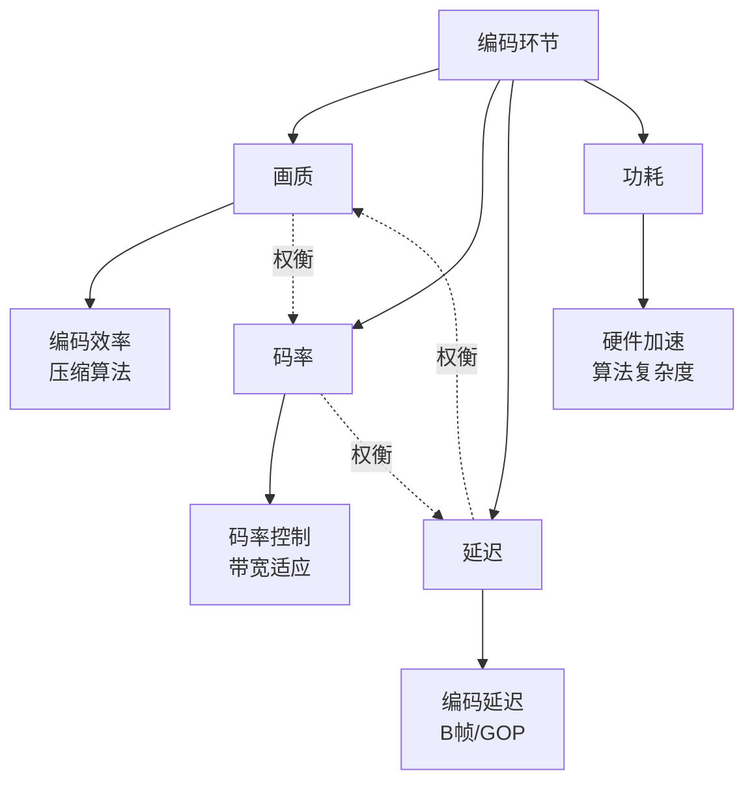
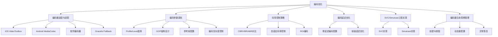

# 编码优化详细解析

> **TL;DR：编码优化的核心是在画质、码率、延迟、功耗四者之间找到最优平衡点。硬件编码是移动端首选，可降低80% CPU占用和50%编码延迟；参数调优需结合场景（RTC/直播/录制）差异化配置；码率控制策略决定弱网适应性；零延迟配置是实时通信的必备手段。系统化的编码器选型、参数调优、监控度量体系，是构建高质量音视频应用的基础能力。**

---

## 核心结论（TL;DR）

**编码优化的本质是在资源约束下实现质量-码率-延迟的最优平衡。**

现代音视频编码优化的关键支柱：

1. **硬件编码优先**：移动端必须使用硬件编码，CPU占用降低80%，延迟减少50%
2. **场景化配置**：RTC、直播、录制场景的编码参数差异巨大，不可一刀切
3. **码率控制为核心**：自适应码率决定弱网体验，CBR是实时通信的首选
4. **延迟零容忍**：实时场景必须禁用B帧、配置zerolatency，延迟可降低30-50ms
5. **Graceful Degradation**：硬编失败自动降级软编，保障服务可用性

**一句话理解编码优化**：与其追求"最高画质"，不如确保"稳定可预期的质量"——编码优化本质上是一种**资源调度**的艺术。

---

## 文章导航

本文采用MECE分类法组织，系统覆盖编码优化的六大方向：

| 章节 | 核心内容 | 适用场景 | 优先级 |
|-----|---------|---------|-------|
| **第1章** | 编码优化的工程价值与ROI分析 | 全场景 | P0 |
| **第2章** | 编码优化MECE分类总览 | 全场景 | P0 |
| **第3章** | 硬件编码器选型与适配（iOS/Android） | 移动端 | P0 |
| **第4章** | 编码参数调优（Profile/GOP/参考帧） | 全场景 | P0 |
| **第5章** | 码率控制策略（CBR/VBR/ABR） | 全场景 | P0 |
| **第6章** | 编码延迟优化 | 实时通信 | P1 |
| **第7章** | SVC/Simulcast工程实现 | 多人会议 | P1 |
| **第8章** | 监控与度量体系 | 全场景 | P1 |
| **第9章** | 最佳实践清单 | 全场景 | P0 |

---

## 第1章 Why — 编码优化的工程价值

### 1.1 编码环节对音视频体验的综合影响

编码是音视频链路中**质量-码率-延迟**三角关系的核心交汇点：



**编码参数对体验指标的影响矩阵**：

| 编码参数 | 画质影响 | 码率影响 | 延迟影响 | 功耗影响 | 调优方向 |
|---------|---------|---------|---------|---------|---------|
| **编码器类型** | 软编略优 | 相同 | 硬编快3-5x | 硬编低80% | 移动端硬编优先 |
| **Profile/Level** | High>Main>Baseline | 相同 | Baseline最低 | 差异小 | RTC用Baseline |
| **GOP大小** | 大GOP效率高 | 大GOP省10-20% | 大GOP延迟高 | 差异小 | RTC用1-2s GOP |
| **B帧数量** | B帧提升20%效率 | 省20-30%码率 | 增加1-2帧延迟 | 略增 | RTC禁用B帧 |
| **码率控制模式** | VBR波动大 | CBR稳定 | CBR延迟可控 | 差异小 | RTC用CBR |
| **参考帧数量** | 多帧提升质量 | 省5-10%码率 | 增加缓存延迟 | 略增 | 实时用1-2帧 |
| **编码preset** | slow质量高 | 省10-15%码率 | slow延迟高 | slow功耗高 | 实时用fast/ultrafast |

### 1.2 硬件编码 vs 软件编码的工程权衡

**核心结论**：移动端必须优先使用硬件编码，只有在硬编不可用或功能受限时才降级软编。

| 维度 | 硬件编码 | 软件编码 | 工程建议 |
|-----|---------|---------|---------|
| **CPU占用** | 5-15% | 50-80% | 移动端必须用硬编 |
| **编码延迟** | 3-10ms | 20-50ms | 实时场景硬编优势大 |
| **功耗** | 低（专用电路） | 高（CPU计算） | 续航敏感用硬编 |
| **画质** | 略逊于软编（5-10%） | 更优 | 高端设备可软编 |
| **码率效率** | 略低（10-15%） | 更高 | 带宽受限需权衡 |
| **功能灵活性** | 受限（依赖硬件） | 完全可控 | 特殊需求用软编 |
| **兼容性** | 设备差异大 | 跨平台一致 | 需适配多机型 |
| **初始化时间** | 50-200ms | 10-50ms | 首帧场景需考虑 |

**硬编vs软编画质对比实测数据**（H.264, 720p@30fps, 2Mbps）：

| 编码器 | VMAF | PSNR(dB) | SSIM | 码率波动 |
|-------|------|---------|------|---------|
| iOS VideoToolbox | 82.3 | 38.5 | 0.952 | ±5% |
| Android MediaCodec(高通) | 80.1 | 37.8 | 0.948 | ±8% |
| x264 medium | 86.2 | 40.2 | 0.968 | ±3% |
| x264 veryfast | 83.5 | 38.9 | 0.956 | ±5% |

### 1.3 编码优化的ROI分析

**不同优化方向的投入产出比**：

| 优化方向 | 实施难度 | 预期收益 | ROI评估 | 优先级 |
|---------|---------|---------|---------|-------|
| **硬编替换软编** | 中（2周） | CPU-80%, 延迟-30ms | 极高 | P0 |
| **编码参数调优** | 低（3天） | 质量+10%, 延迟-20ms | 高 | P0 |
| **码率控制优化** | 中（1周） | 卡顿-30%, 质量稳定 | 高 | P0 |
| **零延迟配置** | 低（1天） | 延迟-50ms | 高 | P1 |
| **SVC/Simulcast** | 高（3周） | 弱网体验+40% | 中 | P1 |
| **编码器内核优化** | 极高（2月+） | 质量+5%, 码率-10% | 低 | P2 |

**关键洞察**：工程优化（硬编切换、参数调优）通常比算法优化（编码器内核改进）ROI高5-10倍。

---

## 第2章 What — 编码优化MECE分类

### 2.1 编码优化全景图



### 2.2 各优化方向详解

| 优化方向 | 核心目标 | 关键技术 | 典型收益 | 实施难度 |
|---------|---------|---------|---------|---------|
| **编码器选型** | 平衡质量/延迟/功耗 | 硬编优先、自动降级 | CPU-80%, 延迟-30ms | 中 |
| **参数调优** | 场景化最优配置 | Profile/GOP/参考帧 | 质量+10%, 延迟-20ms | 低 |
| **码率控制** | 稳定质量、适应带宽 | CBR/ABR、自适应调整 | 卡顿-30% | 中 |
| **延迟优化** | 降低端到端延迟 | 禁用B帧、zerolatency | 延迟-50ms | 低 |
| **SVC/Simulcast** | 多订阅、弱网适配 | 时域分层、多路编码 | 弱网体验+40% | 高 |
| **生命周期管理** | 稳定可靠、快速恢复 | 异常处理、热切换 | 崩溃率-50% | 中 |

---

## 第3章 How — 硬件编码器选型与适配

### 3.1 iOS VideoToolbox

#### 3.1.1 VTCompressionSession创建与配置最佳实践

**创建流程**：

```objc
// Objective-C 示例：创建VideoToolbox编码器
#import <VideoToolbox/VideoToolbox.h>

@interface VideoEncoder : NSObject
@property (nonatomic) VTCompressionSessionRef compressionSession;
@end

@implementation VideoEncoder

- (BOOL)createCompressionSessionWithWidth:(int)width height:(int)height {
    // 1. 准备编码器规格
    CFMutableDictionaryRef encoderSpecification = CFDictionaryCreateMutable(
        kCFAllocatorDefault, 0, &kCFTypeDictionaryKeyCallBacks, &kCFTypeDictionaryValueCallBacks);
    
    // 强制使用硬件编码
    CFDictionarySetValue(encoderSpecification, 
        kVTVideoEncoderSpecification_EnableHardwareAcceleratedVideoEncoder, kCFBooleanTrue);
    
    // 2. 准备源图像缓冲区属性
    CFMutableDictionaryRef sourceImageBufferAttributes = CFDictionaryCreateMutable(
        kCFAllocatorDefault, 0, &kCFTypeDictionaryKeyCallBacks, &kCFTypeDictionaryValueCallBacks);
    
    // 设置像素格式 - iOS优先使用NV12（硬件原生支持）
    int32_t pixelFormat = kCVPixelFormatType_420YpCbCr8BiPlanarVideoRange;
    CFNumberRef pixelFormatNum = CFNumberCreate(kCFAllocatorDefault, kCFNumberSInt32Type, &pixelFormat);
    CFDictionarySetValue(sourceImageBufferAttributes, kCVPixelBufferPixelFormatTypeKey, pixelFormatNum);
    CFRelease(pixelFormatNum);
    
    // 设置分辨率
    CFNumberRef widthNum = CFNumberCreate(kCFAllocatorDefault, kCFNumberIntType, &width);
    CFNumberRef heightNum = CFNumberCreate(kCFAllocatorDefault, kCFNumberIntType, &height);
    CFDictionarySetValue(sourceImageBufferAttributes, kCVPixelBufferWidthKey, widthNum);
    CFDictionarySetValue(sourceImageBufferAttributes, kCVPixelBufferHeightKey, heightNum);
    CFRelease(widthNum);
    CFRelease(heightNum);
    
    // 3. 创建压缩会话
    OSStatus status = VTCompressionSessionCreate(
        kCFAllocatorDefault,
        width, height,
        kCMVideoCodecType_H264,  // 或 kCMVideoCodecType_HEVC (H.265)
        encoderSpecification,
        sourceImageBufferAttributes,
        NULL,  // 使用默认压缩数据分配器
        &compressionOutputCallback,
        (__bridge void *)self,
        &_compressionSession
    );
    
    CFRelease(encoderSpecification);
    CFRelease(sourceImageBufferAttributes);
    
    if (status != noErr) {
        NSLog(@"Failed to create compression session: %d", (int)status);
        return NO;
    }
    
    // 4. 配置编码参数
    [self configureCompressionSession];
    
    return YES;
}

// 编码输出回调
static void compressionOutputCallback(void *outputCallbackRefCon,
                                      void *sourceFrameRefCon,
                                      OSStatus status,
                                      VTEncodeInfoFlags infoFlags,
                                      CMSampleBufferRef sampleBuffer) {
    if (status != noErr || !sampleBuffer) {
        NSLog(@"Encoding error: %d", (int)status);
        return;
    }
    
    VideoEncoder *encoder = (__bridge VideoEncoder *)outputCallbackRefCon;
    
    // 判断是否为关键帧
    BOOL isKeyFrame = NO;
    CFArrayRef attachments = CMSampleBufferGetSampleAttachmentsArray(sampleBuffer, false);
    if (attachments && CFArrayGetCount(attachments)) {
        CFDictionaryRef attachment = CFArrayGetValueAtIndex(attachments, 0);
        CFBooleanRef notSync;
        if (CFDictionaryGetValueIfPresent(attachment, kCMSampleAttachmentKey_NotSync, (const void **)&notSync)) {
            isKeyFrame = !CFBooleanGetValue(notSync);
        }
    }
    
    // 获取编码数据
    CMBlockBufferRef blockBuffer = CMSampleBufferGetDataBuffer(sampleBuffer);
    size_t totalLength;
    char *dataPointer;
    OSStatus err = CMBlockBufferGetDataPointer(blockBuffer, 0, NULL, &totalLength, &dataPointer);
    
    if (err == noErr) {
        // 处理编码后的数据（发送到网络或封装）
        NSData *encodedData = [NSData dataWithBytes:dataPointer length:totalLength];
        [encoder handleEncodedData:encodedData isKeyFrame:isKeyFrame];
    }
}

@end
```

**Swift版本**：

```swift
import VideoToolbox
import CoreMedia

class VideoEncoder {
    private var compressionSession: VTCompressionSession?
    
    func createCompressionSession(width: Int32, height: Int32) -> Bool {
        // 编码器规格 - 启用硬件加速
        let encoderSpecification: [String: Any] = [
            kVTVideoEncoderSpecification_EnableHardwareAcceleratedVideoEncoder as String: true,
            kVTVideoEncoderSpecification_RequireHardwareAcceleratedVideoEncoder as String: false // 允许软编回退
        ]
        
        // 源缓冲区属性
        let sourceImageBufferAttributes: [String: Any] = [
            kCVPixelBufferPixelFormatTypeKey as String: Int32(kCVPixelFormatType_420YpCbCr8BiPlanarVideoRange),
            kCVPixelBufferWidthKey as String: width,
            kCVPixelBufferHeightKey as String: height
        ]
        
        // 创建压缩会话
        let status = VTCompressionSessionCreate(
            allocator: kCFAllocatorDefault,
            width: width,
            height: height,
            codecType: kCMVideoCodecType_H264,
            encoderSpecification: encoderSpecification as CFDictionary,
            imageBufferAttributes: sourceImageBufferAttributes as CFDictionary,
            compressedDataAllocator: nil,
            outputCallback: { refCon, sourceFrameRefCon, status, infoFlags, sampleBuffer in
                guard let sampleBuffer = sampleBuffer, status == noErr else {
                    print("Encoding error: \(status)")
                    return
                }
                
                let encoder = Unmanaged<VideoEncoder>.fromOpaque(refCon!).takeUnretainedValue()
                encoder.handleEncodedSampleBuffer(sampleBuffer)
            },
            refcon: Unmanaged.passUnretained(self).toOpaque(),
            compressionSessionOut: &compressionSession
        )
        
        guard status == noErr, let session = compressionSession else {
            print("Failed to create compression session: \(status)")
            return false
        }
        
        configureCompressionSession(session)
        return true
    }
    
    private func configureCompressionSession(_ session: VTCompressionSession) {
        // 配置编码参数（详见下文）
    }
    
    private func handleEncodedSampleBuffer(_ sampleBuffer: CMSampleBuffer) {
        // 处理编码输出
    }
}
```

#### 3.1.2 支持的编码标准及设备兼容矩阵

**iOS编码标准支持情况**：

| 编码标准 | 最低iOS版本 | 设备要求 | 推荐场景 |
|---------|------------|---------|---------|
| **H.264** | iOS 8.0+ | 全设备 | 通用兼容 |
| **H.265/HEVC** | iOS 11.0+ | A9芯片+ | 高分辨率/低码率 |
| **AV1** | iOS 17.0+ | A17 Pro+ | 未来趋势 |

**设备能力检测代码**：

```objc
// 检测H.265支持
- (BOOL)isHEVCSupported {
    if (@available(iOS 11.0, *)) {
        // 检查编解码器是否可用
        OSStatus status = VTIsHardwareDecodeSupported(kCMVideoCodecType_HEVC);
        return status == true;
    }
    return NO;
}

// 检测具体Profile/Level支持
- (BOOL)supportsProfile:(CFStringRef)profile level:(CFStringRef)level {
    CFArrayRef supportedProperties = NULL;
    OSStatus status = VTCopySupportedPropertyDictionaryForEncoder(
        1920, 1080,  // 测试分辨率
        kCMVideoCodecType_H264,
        NULL,  // 默认编码器
        &supportedProperties
    );
    
    if (status == noErr && supportedProperties) {
        // 解析支持的能力
        CFRelease(supportedProperties);
        return YES;
    }
    return NO;
}
```

**iPhone设备编码能力矩阵**：

| 设备 | H.264 | H.265 | 最大分辨率 | 最大帧率 | 硬编延迟 |
|-----|-------|-------|-----------|---------|---------|
| iPhone 8/X | ✓ | ✓ | 4K@60fps | 240fps | 5-8ms |
| iPhone XS/11 | ✓ | ✓ | 4K@60fps | 240fps | 4-6ms |
| iPhone 12/13 | ✓ | ✓ | 4K@60fps | 240fps | 3-5ms |
| iPhone 14/15 | ✓ | ✓ | 4K@60fps | 240fps | 3-5ms |
| iPhone 15 Pro | ✓ | ✓ | 4K@60fps | 240fps | 2-4ms |

#### 3.1.3 关键属性配置

**实时通信推荐配置**：

```objc
- (void)configureCompressionSession {
    if (!self.compressionSession) return;
    
    // 1. 实时编码模式 - 降低延迟
    VTSessionSetProperty(self.compressionSession,
        kVTCompressionPropertyKey_RealTime, kCFBooleanTrue);
    
    // 2. Profile/Level - 实时通信用Baseline降低延迟
    VTSessionSetProperty(self.compressionSession,
        kVTCompressionPropertyKey_ProfileLevel, kVTProfileLevel_H264_Baseline_AutoLevel);
    
    // 3. 禁用B帧 - 关键！B帧会增加1-2帧延迟
    VTSessionSetProperty(self.compressionSession,
        kVTCompressionPropertyKey_AllowFrameReordering, kCFBooleanFalse);
    
    // 4. 码率控制 - CBR保证稳定码率
    int32_t bitrate = 2000000; // 2Mbps
    CFNumberRef bitrateNum = CFNumberCreate(kCFAllocatorDefault, kCFNumberSInt32Type, &bitrate);
    VTSessionSetProperty(self.compressionSession,
        kVTCompressionPropertyKey_AverageBitRate, bitrateNum);
    CFRelease(bitrateNum);
    
    // 5. 设置码率限制（CBR模式）
    int32_t dataRateLimits[] = {bitrate, 1}; // bits per second
    CFArrayRef dataRateLimitsArray = CFArrayCreate(kCFAllocatorDefault,
        (const void **)&dataRateLimits, 2, &kCFTypeArrayCallBacks);
    VTSessionSetProperty(self.compressionSession,
        kVTCompressionPropertyKey_DataRateLimits, dataRateLimitsArray);
    CFRelease(dataRateLimitsArray);
    
    // 6. 关键帧间隔 - 2秒一个IDR帧
    int32_t keyFrameInterval = 60; // 30fps * 2s
    CFNumberRef keyFrameIntervalNum = CFNumberCreate(kCFAllocatorDefault, kCFNumberSInt32Type, &keyFrameInterval);
    VTSessionSetProperty(self.compressionSession,
        kVTCompressionPropertyKey_MaxKeyFrameInterval, keyFrameIntervalNum);
    CFRelease(keyFrameIntervalNum);
    
    // 7. 设置期望质量（可选，与码率控制互斥）
    // VTSessionSetProperty(self.compressionSession,
    //     kVTCompressionPropertyKey_Quality, ...);
    
    // 8. 准备编码
    VTCompressionSessionPrepareToEncodeFrames(self.compressionSession);
}
```

**关键属性说明表**：

| 属性 | 类型 | 推荐值 | 说明 |
|-----|------|-------|------|
| `kVTCompressionPropertyKey_RealTime` | Boolean | true | 实时模式，降低延迟 |
| `kVTCompressionPropertyKey_ProfileLevel` | CFString | Baseline_AutoLevel | 实时通信用Baseline |
| `kVTCompressionPropertyKey_AllowFrameReordering` | Boolean | false | 禁用B帧，关键！ |
| `kVTCompressionPropertyKey_AverageBitRate` | Number | 目标码率 | 平均码率 |
| `kVTCompressionPropertyKey_DataRateLimits` | Array | [bitrate, 1] | CBR模式配置 |
| `kVTCompressionPropertyKey_MaxKeyFrameInterval` | Number | 帧率*2 | GOP大小 |
| `kVTCompressionPropertyKey_H264EntropyMode` | CFString | CAVLC | Baseline只能用CAVLC |

#### 3.1.4 B帧控制对延迟的影响

**B帧延迟原理**：

```
帧序列（显示顺序）: I0 B1 B2 P3 B4 B5 P6 ...
编码/传输顺序:      I0 P3 B1 B2 P6 B4 B5 ...

延迟分析：
- 编码B2时需要等待P3编码完成 → 2帧延迟
- 解码B2时需要等待P3解码完成 → 2帧延迟
- 实时通信总延迟增加: 2-3帧 (33-50ms @30fps)
```

**禁用B帧的延迟收益**：

| 配置 | 编码延迟 | 端到端延迟 | 码率效率 |
|-----|---------|-----------|---------|
| 启用B帧(2) | 15-25ms | +33-50ms | 基准 |
| 禁用B帧 | 5-10ms | 基准 | -15-20% |

#### 3.1.5 硬编码异常处理与恢复

```objc
@interface VideoEncoder ()
@property (nonatomic, strong) dispatch_queue_t encoderQueue;
@property (nonatomic, assign) int consecutiveErrors;
@property (nonatomic, assign) BOOL isRecovering;
@end

@implementation VideoEncoder

- (void)encodeFrame:(CVPixelBufferRef)pixelBuffer timestamp:(CMTime)timestamp {
    if (self.isRecovering) return;
    
    dispatch_async(self.encoderQueue, ^{
        OSStatus status = VTCompressionSessionEncodeFrame(
            self.compressionSession,
            pixelBuffer,
            timestamp,
            kCMTimeInvalid,  // 帧持续时间
            NULL,  // 帧属性
            NULL,  // 源帧引用
            NULL   // 信息标志输出
        );
        
        if (status != noErr) {
            [self handleEncodingError:status];
        } else {
            self.consecutiveErrors = 0;
        }
    });
}

- (void)handleEncodingError:(OSStatus)error {
    self.consecutiveErrors++;
    NSLog(@"Encoding error: %d, consecutive: %d", (int)error, self.consecutiveErrors);
    
    // 连续错误超过阈值，触发恢复
    if (self.consecutiveErrors >= 3) {
        [self recoverEncoder];
    }
}

- (void)recoverEncoder {
    self.isRecovering = YES;
    
    // 1. 销毁旧会话
    if (self.compressionSession) {
        VTCompressionSessionInvalidate(self.compressionSession);
        CFRelease(self.compressionSession);
        self.compressionSession = NULL;
    }
    
    // 2. 等待一段时间
    dispatch_after(dispatch_time(DISPATCH_TIME_NOW, (int64_t)(0.5 * NSEC_PER_SEC)), self.encoderQueue, ^{
        // 3. 重新创建编码器
        BOOL success = [self createCompressionSessionWithWidth:self.width height:self.height];
        
        if (success) {
            self.consecutiveErrors = 0;
            self.isRecovering = NO;
            NSLog(@"Encoder recovered successfully");
        } else {
            // 恢复失败，通知上层降级到软编
            [self.delegate encoderDidFailRequiringFallback];
        }
    });
}

@end
```

---

### 3.2 Android MediaCodec

#### 3.2.1 MediaCodec创建方式对比

**两种创建方式**：

| 方式 | API | 优点 | 缺点 | 适用场景 |
|-----|-----|------|------|---------|
| `createEncoderByType` | 21+ | 简单、自动选择 | 无法指定具体编码器 | 通用场景 |
| `createByCodecName` | 21+ | 精确控制 | 需要枚举可用编码器 | 需要特定编码器 |

**创建代码示例**：

```kotlin
// Kotlin 示例：MediaCodec创建与配置
class VideoEncoder {
    private var mediaCodec: MediaCodec? = null
    private var inputSurface: Surface? = null
    
    companion object {
        private const val MIME_TYPE_H264 = "video/avc"
        private const val MIME_TYPE_H265 = "video/hevc"
        private const val TAG = "VideoEncoder"
    }
    
    // 方式1：按类型创建（推荐）
    fun createEncoderByType(width: Int, height: Int, bitrate: Int): Boolean {
        return try {
            val format = MediaFormat.createVideoFormat(MIME_TYPE_H264, width, height)
            
            // 配置编码参数
            configureFormat(format, bitrate)
            
            // 创建编码器
            mediaCodec = MediaCodec.createEncoderByType(MIME_TYPE_H264)
            mediaCodec?.configure(format, null, null, MediaCodec.CONFIGURE_FLAG_ENCODE)
            
            // 创建输入Surface（Surface模式）
            inputSurface = mediaCodec?.createInputSurface()
            
            mediaCodec?.start()
            true
        } catch (e: Exception) {
            Log.e(TAG, "Failed to create encoder", e)
            false
        }
    }
    
    // 方式2：按名称创建（需要特定编码器时使用）
    fun createEncoderByName(width: Int, height: Int, bitrate: Int, codecName: String): Boolean {
        return try {
            val format = MediaFormat.createVideoFormat(MIME_TYPE_H264, width, height)
            configureFormat(format, bitrate)
            
            mediaCodec = MediaCodec.createByCodecName(codecName)
            mediaCodec?.configure(format, null, null, MediaCodec.CONFIGURE_FLAG_ENCODE)
            inputSurface = mediaCodec?.createInputSurface()
            mediaCodec?.start()
            true
        } catch (e: Exception) {
            Log.e(TAG, "Failed to create encoder by name", e)
            false
        }
    }
    
    // 枚举可用编码器
    fun enumerateEncoders(): List<MediaCodecInfo> {
        val codecList = MediaCodecList(MediaCodecList.REGULAR_CODECS)
        return codecList.codecInfos.filter { codecInfo ->
            codecInfo.isEncoder && codecInfo.supportedTypes.contains(MIME_TYPE_H264)
        }
    }
    
    private fun configureFormat(format: MediaFormat, bitrate: Int) {
        // 颜色格式 - 优先使用Surface模式
        format.setInteger(MediaFormat.KEY_COLOR_FORMAT, 
            MediaCodecInfo.CodecCapabilities.COLOR_FormatSurface)
        
        // 码率
        format.setInteger(MediaFormat.KEY_BIT_RATE, bitrate)
        
        // 帧率
        format.setInteger(MediaFormat.KEY_FRAME_RATE, 30)
        
        // GOP间隔（关键帧间隔）- 2秒
        format.setInteger(MediaFormat.KEY_I_FRAME_INTERVAL, 2)
        
        // 码率控制模式 - CBR用于实时通信
        if (Build.VERSION.SDK_INT >= Build.VERSION_CODES.O) {
            format.setInteger(MediaFormat.KEY_BITRATE_MODE,
                MediaCodecInfo.EncoderCapabilities.BITRATE_MODE_CBR)
        }
        
        // Profile/Level - Baseline用于实时通信
        if (Build.VERSION.SDK_INT >= Build.VERSION_CODES.LOLLIPOP) {
            format.setInteger(MediaFormat.KEY_PROFILE, 
                MediaCodecInfo.CodecProfileLevel.AVCProfileBaseline)
            format.setInteger(MediaFormat.KEY_LEVEL,
                MediaCodecInfo.CodecProfileLevel.AVCLevel31) // 720p30
        }
    }
}
```

**Java版本**：

```java
// Java 示例：MediaCodec异步模式
public class VideoEncoder {
    private MediaCodec mediaCodec;
    private HandlerThread handlerThread;
    private Handler handler;
    
    public boolean createAsyncEncoder(int width, int height, int bitrate) {
        try {
            MediaFormat format = MediaFormat.createVideoFormat("video/avc", width, height);
            format.setInteger(MediaFormat.KEY_BIT_RATE, bitrate);
            format.setInteger(MediaFormat.KEY_FRAME_RATE, 30);
            format.setInteger(MediaFormat.KEY_I_FRAME_INTERVAL, 2);
            format.setInteger(MediaFormat.KEY_COLOR_FORMAT,
                MediaCodecInfo.CodecCapabilities.COLOR_FormatSurface);
            
            mediaCodec = MediaCodec.createEncoderByType("video/avc");
            
            // 创建HandlerThread用于回调
            handlerThread = new HandlerThread("EncoderCallback");
            handlerThread.start();
            handler = new Handler(handlerThread.getLooper());
            
            // 配置异步回调
            mediaCodec.setCallback(new MediaCodec.Callback() {
                @Override
                public void onInputBufferAvailable(MediaCodec codec, int index) {
                    // 输入缓冲区可用（Surface模式下不直接使用）
                }
                
                @Override
                public void onOutputBufferAvailable(MediaCodec codec, int index, 
                                                    MediaCodec.BufferInfo info) {
                    ByteBuffer outputBuffer = codec.getOutputBuffer(index);
                    if (outputBuffer != null) {
                        // 处理编码数据
                        handleEncodedData(outputBuffer, info);
                    }
                    codec.releaseOutputBuffer(index, false);
                }
                
                @Override
                public void onError(MediaCodec codec, MediaCodec.CodecException e) {
                    Log.e(TAG, "Codec error", e);
                    handleEncoderError(e);
                }
                
                @Override
                public void onOutputFormatChanged(MediaCodec codec, MediaFormat format) {
                    Log.i(TAG, "Output format changed: " + format);
                }
            }, handler);
            
            mediaCodec.configure(format, null, null, MediaCodec.CONFIGURE_FLAG_ENCODE);
            mediaCodec.start();
            return true;
            
        } catch (Exception e) {
            Log.e(TAG, "Failed to create encoder", e);
            return false;
        }
    }
}
```

#### 3.2.2 同步模式 vs 异步模式选型

| 维度 | 同步模式 | 异步模式 | 推荐场景 |
|-----|---------|---------|---------|
| **API复杂度** | 简单 | 较复杂 | 同步模式适合简单场景 |
| **性能** | 需要轮询 | 事件驱动，更高效 | 高性能用异步 |
| **延迟控制** | 可控 | 可控 | 两者均可 |
| **代码复杂度** | 低 | 中 | 简单项目用同步 |
| **线程安全** | 需自行管理 | 回调在指定线程 | 异步更安全 |
| **Android版本** | 16+ | 21+ | 低版本只能用同步 |

**同步模式编码循环示例**：

```kotlin
fun encodeSyncLoop() {
    val timeoutUs = 10000L // 10ms超时
    
    while (isEncoding) {
        // 1. 获取输入缓冲区（Surface模式下不需要）
        val inputBufferId = mediaCodec?.dequeueInputBuffer(timeoutUs) ?: -1
        if (inputBufferId >= 0) {
            // 填充输入数据...
            mediaCodec?.queueInputBuffer(inputBufferId, ...)
        }
        
        // 2. 获取输出缓冲区
        val bufferInfo = MediaCodec.BufferInfo()
        val outputBufferId = mediaCodec?.dequeueOutputBuffer(bufferInfo, timeoutUs) ?: -1
        
        when {
            outputBufferId >= 0 -> {
                // 获取编码数据
                val outputBuffer = mediaCodec?.getOutputBuffer(outputBufferId)
                outputBuffer?.let { buffer ->
                    handleEncodedData(buffer, bufferInfo)
                }
                mediaCodec?.releaseOutputBuffer(outputBufferId, false)
            }
            outputBufferId == MediaCodec.INFO_OUTPUT_FORMAT_CHANGED -> {
                // 输出格式变化，获取SPS/PPS
                val format = mediaCodec?.outputFormat
                extractSpsPps(format)
            }
        }
    }
}
```

#### 3.2.3 Surface模式 vs ByteBuffer模式

**性能对比**：

| 维度 | Surface模式 | ByteBuffer模式 | 推荐 |
|-----|------------|---------------|------|
| **内存拷贝** | 零拷贝 | 需要拷贝 | Surface更优 |
| **CPU占用** | 低（GPU直接） | 高（CPU处理） | Surface更优 |
| **延迟** | 低 | 略高 | Surface更优 |
| **灵活性** | 需要OpenGL | 直接处理Buffer | ByteBuffer灵活 |
| **前置处理** | 需要GPU处理链 | CPU处理 | 看已有架构 |
| **适用场景** | 有GPU处理 | 简单编码 | 有GPU用Surface |

**Surface模式完整示例**：

```kotlin
class SurfaceEncoder {
    private var mediaCodec: MediaCodec? = null
    private var inputSurface: Surface? = null
    private var eglCore: EglCore? = null
    private var windowSurface: WindowSurface? = null
    
    fun initEncoder(width: Int, height: Int, bitrate: Int) {
        val format = MediaFormat.createVideoFormat("video/avc", width, height).apply {
            setInteger(MediaFormat.KEY_BIT_RATE, bitrate)
            setInteger(MediaFormat.KEY_FRAME_RATE, 30)
            setInteger(MediaFormat.KEY_I_FRAME_INTERVAL, 2)
            setInteger(MediaFormat.KEY_COLOR_FORMAT,
                MediaCodecInfo.CodecCapabilities.COLOR_FormatSurface)
        }
        
        mediaCodec = MediaCodec.createEncoderByType("video/avc")
        mediaCodec?.configure(format, null, null, MediaCodec.CONFIGURE_FLAG_ENCODE)
        inputSurface = mediaCodec?.createInputSurface()
        mediaCodec?.start()
        
        // 初始化EGL环境
        inputSurface?.let { surface ->
            eglCore = EglCore(null, EglCore.FLAG_RECORDABLE)
            windowSurface = WindowSurface(eglCore, surface, false)
            windowSurface?.makeCurrent()
        }
    }
    
    // 从OpenGL纹理编码
    fun encodeTexture(textureId: Int, timestampNs: Long) {
        // 渲染到编码器Surface
        windowSurface?.makeCurrent()
        
        // 绘制纹理（使用全屏着色器）
        drawTexture(textureId)
        
        // 设置时间戳并交换缓冲区
        windowSurface?.setPresentationTime(timestampNs)
        windowSurface?.swapBuffers()
    }
    
    // 请求关键帧
    fun requestKeyFrame() {
        if (Build.VERSION.SDK_INT >= Build.VERSION_CODES.M) {
            val params = Bundle().apply {
                putInt(MediaCodec.PARAMETER_KEY_REQUEST_SYNC_FRAME, 0)
            }
            mediaCodec?.setParameters(params)
        }
    }
    
    fun release() {
        windowSurface?.release()
        eglCore?.release()
        mediaCodec?.stop()
        mediaCodec?.release()
    }
}
```

#### 3.2.4 不同厂商兼容性问题及解决方案

**厂商差异汇总**：

| 厂商 | 常见问题 | 解决方案 |
|-----|---------|---------|
| **华为(Huawei)** | 某些机型H.265支持不完整 | 降级到H.264或软编 |
| **高通(Qualcomm)** | 部分旧机型码率控制不准确 | 使用VBR或自定义码率调整 |
| **联发科(MTK)** | 编码延迟波动大 | 增加缓冲区，设置QoS |
| **三星(Samsung)** | Exynos芯片与Snapdragon差异 | 分别测试，差异化配置 |
| **小米(Xiaomi)** | 部分机型编码器崩溃 | 异常捕获，自动降级 |
| **OPPO/vivo** | 自定义ROM兼容性问题 | 白名单机制 |

**兼容性处理代码**：

```kotlin
class EncoderCompatibilityHelper {
    
    data class EncoderCapability(
        val codecName: String,
        val supportsH265: Boolean,
        val bitrateMode: Set<Int>,
        val maxResolution: Pair<Int, Int>,
        val quirks: Set<EncoderQuirk>
    )
    
    enum class EncoderQuirk {
        FLUCTUATING_BITRATE,      // 码率波动
        DELAY_VARIATION,          // 延迟变化大
        KEYFRAME_NOT_PRESICE,     // 关键帧不精确
        CRASH_ON_RECONFIGURE,     // 重配置崩溃
        SURFACE_MODE_SLOW         // Surface模式慢
    }
    
    // 已知的厂商问题机型
    private val problematicDevices = mapOf(
        "HUAWEI MLA-AL10" to setOf(EncoderQuirk.FLUCTUATING_BITRATE),
        "Xiaomi MI 5" to setOf(EncoderQuirk.CRASH_ON_RECONFIGURE),
        "OPPO R9" to setOf(EncoderQuirk.DELAY_VARIATION)
    )
    
    fun getDeviceQuirks(): Set<EncoderQuirk> {
        return problematicDevices[Build.MODEL] ?: emptySet()
    }
    
    // 根据设备选择最佳编码器
    fun selectBestEncoder(mimeType: String): String? {
        val codecList = MediaCodecList(MediaCodecList.REGULAR_CODECS)
        val encoders = codecList.codecInfos.filter { 
            it.isEncoder && mimeType in it.supportedTypes 
        }
        
        // 优先选择平台默认编码器（通常最稳定）
        val defaultEncoder = encoders.firstOrNull { 
            !it.name.contains("google", ignoreCase = true) 
        }
        
        // 检查是否有已知问题
        val quirks = getDeviceQuirks()
        
        return when {
            EncoderQuirk.CRASH_ON_RECONFIGURE in quirks -> {
                // 避免频繁重配置，选择软编作为备选
                encoders.find { it.name.contains("google", ignoreCase = true) }?.name
                    ?: defaultEncoder?.name
            }
            else -> defaultEncoder?.name ?: encoders.firstOrNull()?.name
        }
    }
    
    // 安全重配置
    fun safeReconfigure(codec: MediaCodec?, format: MediaFormat): Boolean {
        return try {
            codec?.stop()
            codec?.configure(format, null, null, MediaCodec.CONFIGURE_FLAG_ENCODE)
            codec?.start()
            true
        } catch (e: Exception) {
            Log.e(TAG, "Reconfigure failed", e)
            false
        }
    }
}
```

#### 3.2.5 MediaCodec生命周期管理与异常恢复

```kotlin
class RobustVideoEncoder {
    private var mediaCodec: MediaCodec? = null
    private var currentFormat: MediaFormat? = null
    private var consecutiveErrors = 0
    private val maxConsecutiveErrors = 3
    private val encoderLock = Object()
    
    enum class EncoderState {
        UNINITIALIZED,
        CONFIGURED,
        STARTED,
        ERROR,
        RELEASING
    }
    
    private var state = EncoderState.UNINITIALIZED
    
    fun initialize(width: Int, height: Int, bitrate: Int): Boolean {
        synchronized(encoderLock) {
            if (state != EncoderState.UNINITIALIZED) {
                release()
            }
            
            return try {
                val format = MediaFormat.createVideoFormat("video/avc", width, height).apply {
                    setInteger(MediaFormat.KEY_BIT_RATE, bitrate)
                    setInteger(MediaFormat.KEY_FRAME_RATE, 30)
                    setInteger(MediaFormat.KEY_I_FRAME_INTERVAL, 2)
                    setInteger(MediaFormat.KEY_COLOR_FORMAT,
                        MediaCodecInfo.CodecCapabilities.COLOR_FormatSurface)
                }
                
                mediaCodec = MediaCodec.createEncoderByType("video/avc")
                mediaCodec?.configure(format, null, null, MediaCodec.CONFIGURE_FLAG_ENCODE)
                currentFormat = format
                
                mediaCodec?.start()
                state = EncoderState.STARTED
                consecutiveErrors = 0
                true
                
            } catch (e: Exception) {
                Log.e(TAG, "Failed to initialize encoder", e)
                state = EncoderState.ERROR
                false
            }
        }
    }
    
    fun handleOutputBuffer(): Boolean {
        return try {
            val bufferInfo = MediaCodec.BufferInfo()
            val outputBufferId = mediaCodec?.dequeueOutputBuffer(bufferInfo, 0) ?: -1
            
            when {
                outputBufferId >= 0 -> {
                    // 正常处理
                    processOutputBuffer(outputBufferId, bufferInfo)
                    consecutiveErrors = 0
                    true
                }
                outputBufferId == MediaCodec.INFO_TRY_AGAIN_LATER -> {
                    // 正常，无输出
                    true
                }
                else -> true
            }
        } catch (e: Exception) {
            Log.e(TAG, "Error handling output buffer", e)
            handleError()
            false
        }
    }
    
    private fun handleError() {
        consecutiveErrors++
        
        if (consecutiveErrors >= maxConsecutiveErrors) {
            Log.w(TAG, "Too many consecutive errors, attempting recovery")
            recoverEncoder()
        }
    }
    
    private fun recoverEncoder() {
        synchronized(encoderLock) {
            state = EncoderState.ERROR
            
            // 保存当前配置
            val savedFormat = currentFormat
            
            // 释放旧编码器
            releaseInternal()
            
            // 延迟后重试
            Handler(Looper.getMainLooper()).postDelayed({
                savedFormat?.let { format ->
                    val width = format.getInteger(MediaFormat.KEY_WIDTH)
                    val height = format.getInteger(MediaFormat.KEY_HEIGHT)
                    val bitrate = format.getInteger(MediaFormat.KEY_BIT_RATE)
                    
                    val success = initialize(width, height, bitrate)
                    if (!success) {
                        // 恢复失败，通知上层
                        onEncoderFatalError()
                    }
                }
            }, 500)
        }
    }
    
    private fun releaseInternal() {
        try {
            mediaCodec?.stop()
        } catch (e: Exception) {
            Log.w(TAG, "Error stopping codec", e)
        }
        
        try {
            mediaCodec?.release()
        } catch (e: Exception) {
            Log.w(TAG, "Error releasing codec", e)
        }
        
        mediaCodec = null
        state = EncoderState.UNINITIALIZED
    }
    
    fun release() {
        synchronized(encoderLock) {
            releaseInternal()
        }
    }
}
```

---

### 3.3 软件编码器

#### 3.3.1 软件编码器选型对比

| 编码器 | 编码速度 | 压缩率 | 延迟 | CPU消耗 | 适用场景 |
|-------|---------|-------|------|---------|---------|
| **x264** | 快 | 高 | 中 | 高 | 通用软编 |
| **x265** | 慢 | 很高 | 高 | 很高 | 高压缩需求 |
| **libvpx (VP8/VP9)** | 中 | 中 | 中 | 中 | WebRTC |
| **libaom (AV1)** | 很慢 | 极高 | 高 | 极高 | 未来标准 |
| **SVT-AV1** | 快 | 高 | 中 | 高 | 生产级AV1 |
| **OpenH264** | 快 | 中 | 低 | 中 | 实时通信 |

**FFmpeg集成方案**：

```cpp
// FFmpeg软编封装示例
extern "C" {
#include <libavcodec/avcodec.h>
#include <libavformat/avformat.h>
#include <libavutil/opt.h>
#include <libavutil/imgutils.h>
}

class FFmpegEncoder {
private:
    AVCodecContext* codecContext = nullptr;
    AVFrame* frame = nullptr;
    AVPacket* packet = nullptr;
    
public:
    bool initialize(int width, int height, int bitrate, int fps) {
        // 查找编码器
        const AVCodec* codec = avcodec_find_encoder(AV_CODEC_ID_H264);
        if (!codec) {
            fprintf(stderr, "Codec not found\n");
            return false;
        }
        
        codecContext = avcodec_alloc_context3(codec);
        if (!codecContext) {
            fprintf(stderr, "Could not allocate video codec context\n");
            return false;
        }
        
        // 配置编码参数
        codecContext->bit_rate = bitrate;
        codecContext->width = width;
        codecContext->height = height;
        codecContext->time_base = {1, fps};
        codecContext->framerate = {fps, 1};
        codecContext->gop_size = fps * 2; // 2秒GOP
        codecContext->max_b_frames = 0;   // 禁用B帧（实时）
        codecContext->pix_fmt = AV_PIX_FMT_YUV420P;
        
        // 设置编码器选项
        AVDictionary* opts = nullptr;
        av_dict_set(&opts, "preset", "ultrafast", 0);  // 最快预设
        av_dict_set(&opts, "tune", "zerolatency", 0);  // 零延迟
        av_dict_set(&opts, "profile", "baseline", 0);  // Baseline Profile
        
        // 打开编码器
        int ret = avcodec_open2(codecContext, codec, &opts);
        av_dict_free(&opts);
        
        if (ret < 0) {
            fprintf(stderr, "Could not open codec\n");
            return false;
        }
        
        // 分配帧和包
        frame = av_frame_alloc();
        packet = av_packet_alloc();
        
        frame->format = codecContext->pix_fmt;
        frame->width = codecContext->width;
        frame->height = codecContext->height;
        
        ret = av_frame_get_buffer(frame, 0);
        if (ret < 0) {
            fprintf(stderr, "Could not allocate the video frame data\n");
            return false;
        }
        
        return true;
    }
    
    bool encodeFrame(const uint8_t* yData, const uint8_t* uData, const uint8_t* vData,
                     int yStride, int uStride, int vStride,
                     std::vector<uint8_t>& output) {
        // 填充帧数据
        av_frame_make_writable(frame);
        
        // 复制Y平面
        for (int y = 0; y < codecContext->height; y++) {
            memcpy(frame->data[0] + y * frame->linesize[0], 
                   yData + y * yStride, codecContext->width);
        }
        
        // 复制U/V平面
        for (int y = 0; y < codecContext->height / 2; y++) {
            memcpy(frame->data[1] + y * frame->linesize[1], 
                   uData + y * uStride, codecContext->width / 2);
            memcpy(frame->data[2] + y * frame->linesize[2], 
                   vData + y * vStride, codecContext->width / 2);
        }
        
        frame->pts = pts++;
        
        // 发送帧到编码器
        int ret = avcodec_send_frame(codecContext, frame);
        if (ret < 0) {
            fprintf(stderr, "Error sending a frame for encoding\n");
            return false;
        }
        
        // 接收编码数据
        while (ret >= 0) {
            ret = avcodec_receive_packet(codecContext, packet);
            if (ret == AVERROR(EAGAIN) || ret == AVERROR_EOF) {
                break;
            } else if (ret < 0) {
                fprintf(stderr, "Error during encoding\n");
                return false;
            }
            
            // 复制编码数据
            output.insert(output.end(), packet->data, packet->data + packet->size);
            av_packet_unref(packet);
        }
        
        return true;
    }
    
    ~FFmpegEncoder() {
        avcodec_free_context(&codecContext);
        av_frame_free(&frame);
        av_packet_free(&packet);
    }
    
private:
    int64_t pts = 0;
};
```

#### 3.3.2 软编码在移动端的适用场景

| 场景 | 原因 | 实施方案 |
|-----|------|---------|
| **硬编不可用** | 设备不支持或初始化失败 | 自动降级软编 |
| **特殊编码需求** | 需要自定义编码算法 | 软编完全可控 |
| **高质量录制** | 硬编画质不满足 | 软编slow preset |
| **屏幕共享** | 文字/界面需要高码率效率 | 软编CBR高码率 |
| **测试调试** | 需要精确控制编码过程 | 软编便于调试 |

---

### 3.4 编码器Graceful Fallback

#### 3.4.1 硬编→软编自动降级策略

```kotlin
class AdaptiveEncoder {
    private var currentEncoder: Encoder? = null
    private var encoderType = EncoderType.HARDWARE
    
    enum class EncoderType {
        HARDWARE,
        SOFTWARE
    }
    
    interface Encoder {
        fun encode(frame: VideoFrame): Boolean
        fun release()
    }
    
    fun initialize(width: Int, height: Int, bitrate: Int): Boolean {
        // 首先尝试硬件编码
        val hwEncoder = HardwareEncoder()
        if (hwEncoder.initialize(width, height, bitrate)) {
            currentEncoder = hwEncoder
            encoderType = EncoderType.HARDWARE
            Log.i(TAG, "Using hardware encoder")
            return true
        }
        
        // 硬件失败，降级到软件
        Log.w(TAG, "Hardware encoder failed, falling back to software")
        val swEncoder = SoftwareEncoder()
        if (swEncoder.initialize(width, height, bitrate)) {
            currentEncoder = swEncoder
            encoderType = EncoderType.SOFTWARE
            return true
        }
        
        return false
    }
    
    fun encode(frame: VideoFrame): Boolean {
        val success = currentEncoder?.encode(frame) ?: false
        
        if (!success && encoderType == EncoderType.HARDWARE) {
            // 硬编失败，尝试降级
            return fallbackToSoftware(frame)
        }
        
        return success
    }
    
    private fun fallbackToSoftware(frame: VideoFrame): Boolean {
        Log.w(TAG, "Hardware encoder failed, switching to software")
        
        // 保存配置
        val config = getCurrentConfig()
        
        // 释放硬编
        currentEncoder?.release()
        
        // 创建软编
        val swEncoder = SoftwareEncoder()
        return if (swEncoder.initialize(config.width, config.height, config.bitrate)) {
            currentEncoder = swEncoder
            encoderType = EncoderType.SOFTWARE
            currentEncoder?.encode(frame) ?: false
        } else {
            false
        }
    }
}
```

#### 3.4.2 编码器能力检测机制

```kotlin
class EncoderCapabilityDetector {
    
    data class CodecCapabilities(
        val mimeType: String,
        val isHardwareAccelerated: Boolean,
        val supportedProfiles: List<Int>,
        val supportedLevels: List<Int>,
        val maxResolution: Pair<Int, Int>,
        val maxFrameRate: Int,
        val supportedBitrateModes: List<Int>
    )
    
    fun detectCapabilities(): Map<String, CodecCapabilities> {
        val capabilities = mutableMapOf<String, CodecCapabilities>()
        
        val codecList = MediaCodecList(MediaCodecList.REGULAR_CODECS)
        
        for (codecInfo in codecList.codecInfos) {
            if (!codecInfo.isEncoder) continue
            
            for (mimeType in codecInfo.supportedTypes) {
                if (!mimeType.startsWith("video/")) continue
                
                try {
                    val codecCaps = codecInfo.getCapabilitiesForType(mimeType)
                    val videoCaps = codecCaps.videoCapabilities
                    
                    val isHardware = !codecInfo.name.contains("google", ignoreCase = true) &&
                                    !codecInfo.name.contains("android", ignoreCase = true)
                    
                    capabilities[codecInfo.name] = CodecCapabilities(
                        mimeType = mimeType,
                        isHardwareAccelerated = isHardware,
                        supportedProfiles = codecCaps.profileLevels?.map { it.profile } ?: emptyList(),
                        supportedLevels = codecCaps.profileLevels?.map { it.level } ?: emptyList(),
                        maxResolution = Pair(
                            videoCaps?.supportedWidths?.upper ?: 0,
                            videoCaps?.supportedHeights?.upper ?: 0
                        ),
                        maxFrameRate = videoCaps?.supportedFrameRates?.upper?.toInt() ?: 0,
                        supportedBitrateModes = codecCaps.encoderCapabilities?.bitrateModes?.toList() ?: emptyList()
                    )
                } catch (e: Exception) {
                    Log.w(TAG, "Failed to detect capabilities for ${codecInfo.name}", e)
                }
            }
        }
        
        return capabilities
    }
    
    // 选择最佳编码器
    fun selectBestEncoder(mimeType: String, targetResolution: Pair<Int, Int>): String? {
        val caps = detectCapabilities()
        
        return caps.filter { it.value.mimeType == mimeType }
            .filter { 
                it.value.maxResolution.first >= targetResolution.first &&
                it.value.maxResolution.second >= targetResolution.second
            }
            .maxByOrNull { 
                // 优先硬件编码
                if (it.value.isHardwareAccelerated) 100 else 0
            }?.key
    }
}
```

#### 3.4.3 多编码器并行方案（主备切换）

```kotlin
class DualEncoderManager {
    private var primaryEncoder: Encoder? = null
    private var backupEncoder: Encoder? = null
    private var activeEncoder: Encoder? = null
    
    private val primaryLock = Object()
    private val backupLock = Object()
    
    fun initialize(width: Int, height: Int, bitrate: Int) {
        // 初始化主编码器（硬件）
        Thread {
            synchronized(primaryLock) {
                primaryEncoder = HardwareEncoder()
                val success = (primaryEncoder as HardwareEncoder).initialize(width, height, bitrate)
                if (success) {
                    activeEncoder = primaryEncoder
                }
            }
        }.start()
        
        // 初始化备用编码器（软件）
        Thread {
            synchronized(backupLock) {
                backupEncoder = SoftwareEncoder()
                (backupEncoder as SoftwareEncoder).initialize(width, height, bitrate)
            }
        }.start()
    }
    
    fun encode(frame: VideoFrame): Boolean {
        val encoder = activeEncoder
        val success = encoder?.encode(frame) ?: false
        
        if (!success && encoder === primaryEncoder) {
            // 主编码器失败，切换到备用
            switchToBackup()
        }
        
        return success
    }
    
    private fun switchToBackup() {
        synchronized(backupLock) {
            if (backupEncoder != null) {
                Log.w(TAG, "Switching to backup encoder")
                activeEncoder = backupEncoder
                
                // 在后台尝试恢复主编码器
                Thread {
                    recoverPrimary()
                }.start()
            }
        }
    }
    
    private fun recoverPrimary() {
        // 延迟后尝试恢复主编码器
        Thread.sleep(5000)
        
        synchronized(primaryLock) {
            primaryEncoder?.release()
            primaryEncoder = HardwareEncoder()
            // ... 重新初始化
        }
    }
}
```

---

## 第4章 How — 编码参数调优

### 4.1 Profile/Level选择

#### 4.1.1 各Profile适用场景对比

| Profile | 压缩效率 | 延迟 | 兼容性 | 适用场景 |
|---------|---------|------|-------|---------|
| **Baseline** | 基准 | 最低 | 最好 | 实时通信、视频会议 |
| **Main** | +10-15% | 中 | 好 | 直播、点播 |
| **High** | +15-20% | 高 | 一般 | 高画质录制、蓝光 |
| **High10/422/444** | +20-25% | 高 | 差 | 专业制作 |

**Profile特性对比**：

| 特性 | Baseline | Main | High |
|-----|----------|------|------|
| B帧 | ✗ | ✓ | ✓ |
| CABAC | ✗ | ✓ | ✓ |
| 8×8变换 | ✗ | ✓ | ✓ |
| 场编码 | ✗ | ✓ | ✓ |
| 无损编码 | ✗ | ✗ | ✓ |

**iOS配置代码**：

```objc
// Profile/Level配置
CFStringRef profileLevel;
switch (profile) {
    case ProfileBaseline:
        profileLevel = kVTProfileLevel_H264_Baseline_AutoLevel;
        break;
    case ProfileMain:
        profileLevel = kVTProfileLevel_H264_Main_AutoLevel;
        break;
    case ProfileHigh:
        profileLevel = kVTProfileLevel_H264_High_AutoLevel;
        break;
}

VTSessionSetProperty(compressionSession,
    kVTCompressionPropertyKey_ProfileLevel, profileLevel);
```

**Android配置代码**：

```kotlin
// Profile/Level配置
format.setInteger(MediaFormat.KEY_PROFILE, 
    MediaCodecInfo.CodecProfileLevel.AVCProfileBaseline)
format.setInteger(MediaFormat.KEY_LEVEL,
    MediaCodecInfo.CodecProfileLevel.AVCLevel31) // 720p30
```

#### 4.1.2 Level与分辨率/帧率的映射关系

| Level | 最大分辨率 | 最大帧率 | 最大码率 |
|-------|-----------|---------|---------|
| 1 | 128×96 | 30fps | 64kbps |
| 1.1 | 176×144 | 30fps | 192kbps |
| 1.2 | 320×240 | 30fps | 384kbps |
| 1.3 | 320×240 | 30fps | 768kbps |
| 2 | 352×288 | 30fps | 2Mbps |
| 2.1 | 352×288 | 30fps | 4Mbps |
| 2.2 | 640×480 | 30fps | 4Mbps |
| 3 | 720×480 | 30fps | 10Mbps |
| 3.1 | 1280×720 | 30fps | 14Mbps |
| 3.2 | 1280×720 | 60fps | 20Mbps |
| 4 | 1920×1080 | 30fps | 20Mbps |
| 4.1 | 1920×1080 | 30fps | 50Mbps |
| 4.2 | 1920×1080 | 60fps | 50Mbps |
| 5 | 2560×1920 | 30fps | 135Mbps |

#### 4.1.3 跨平台兼容性考量

| 平台 | Baseline支持 | Main支持 | High支持 | 建议 |
|-----|-------------|---------|---------|------|
| **iOS** | ✓ | ✓ | ✓ | 实时用Baseline |
| **Android** | ✓ | ✓ | 部分 | 保守用Main |
| **Web** | ✓ | ✓ | ✓ | 取决于浏览器 |
| **Windows** | ✓ | ✓ | ✓ | 全支持 |

---

### 4.2 GOP结构设计

#### 4.2.1 不同场景的GOP配置

| 场景 | GOP大小 | 关键帧间隔 | 理由 |
|-----|---------|-----------|------|
| **实时通信(RTC)** | 1-2秒 | 30-60帧 | 低延迟、快速恢复 |
| **互动直播** | 2-4秒 | 60-120帧 | 平衡延迟和效率 |
| **普通直播** | 4-6秒 | 120-180帧 | 编码效率优先 |
| **录制存储** | 6-10秒 | 180-300帧 | 最大压缩效率 |
| **屏幕共享** | 5-10秒 | 150-300帧 | 静态内容多 |

**GOP配置代码示例**：

```objc
// iOS GOP配置
int32_t keyFrameInterval = 60; // 2秒 @ 30fps
CFNumberRef keyFrameIntervalNum = CFNumberCreate(kCFAllocatorDefault, kCFNumberSInt32Type, &keyFrameInterval);
VTSessionSetProperty(compressionSession,
    kVTCompressionPropertyKey_MaxKeyFrameInterval, keyFrameIntervalNum);
CFRelease(keyFrameIntervalNum);

// 关键帧间隔时间（秒）
CFNumberRef keyFrameDuration = CFNumberCreate(kCFAllocatorDefault, kCFNumberIntType, &(int){2});
VTSessionSetProperty(compressionSession,
    kVTCompressionPropertyKey_MaxKeyFrameIntervalDuration, keyFrameDuration);
CFRelease(keyFrameDuration);
```

```kotlin
// Android GOP配置
format.setInteger(MediaFormat.KEY_I_FRAME_INTERVAL, 2) // 2秒
```

#### 4.2.2 关键帧间隔对延迟和容错的影响

| GOP大小 | 编码延迟 | 容错恢复 | 码率效率 | 首帧时间 |
|---------|---------|---------|---------|---------|
| 1秒 | 低 | 快（1s内恢复） | -20% | 快 |
| 2秒 | 中 | 中（2s内恢复） | 基准 | 中 |
| 4秒 | 高 | 慢（4s内恢复） | +10% | 慢 |
| 6秒 | 很高 | 很慢 | +15% | 很慢 |

#### 4.2.3 动态GOP调整策略

```kotlin
class DynamicGOPController {
    private var currentGOPSeconds = 2
    private val minGOP = 1
    private val maxGOP = 6
    
    // 根据网络状况调整GOP
    fun adjustGOPBasedOnNetwork(networkQuality: NetworkQuality): Int {
        currentGOPSeconds = when (networkQuality) {
            NetworkQuality.EXCELLENT -> maxGOP // 网络好，用大的GOP提高效率
            NetworkQuality.GOOD -> 4
            NetworkQuality.FAIR -> 2
            NetworkQuality.POOR -> minGOP // 网络差，用小的GOP快速恢复
        }
        return currentGOPSeconds
    }
    
    // 根据场景调整GOP
    fun adjustGOPBasedOnScene(sceneType: SceneType): Int {
        return when (sceneType) {
            SceneType.STATIC -> 6 // 静态场景，大GOP
            SceneType.SLOW_MOTION -> 4
            SceneType.FAST_MOTION -> 2 // 快速运动，小GOP
            SceneType.SCREEN_SHARE -> 8 // 屏幕共享，很大GOP
        }
    }
    
    enum class NetworkQuality {
        EXCELLENT, GOOD, FAIR, POOR
    }
    
    enum class SceneType {
        STATIC, SLOW_MOTION, FAST_MOTION, SCREEN_SHARE
    }
}
```

---

### 4.3 参考帧配置

#### 4.3.1 参考帧数量对编码质量和延迟的权衡

| 参考帧数 | 质量提升 | 延迟增加 | 内存占用 | 适用场景 |
|---------|---------|---------|---------|---------|
| 1 | 基准 | 基准 | 低 | 实时通信 |
| 2 | +5% | +1帧 | 中 | 直播 |
| 3-4 | +8% | +2-3帧 | 较高 | 点播 |
| 5+ | +10% | +4帧+ | 高 | 录制 |

**配置代码**：

```cpp
// x264参考帧配置
x264_param_t param;
x264_param_default(&param);
param.i_frame_reference = 1; // 实时通信用1帧
```

#### 4.3.2 LTR（Long Term Reference）在实时通信中的应用

**LTR原理**：

```
普通参考帧结构：I P P P P P P P I ...
                 ↑             ↑
               短期参考       下一个IDR

LTR参考帧结构：  I P P P P P P P L P P P P P P P L ...
                 ↑             ↑               ↑
               短期参考       LTR帧           下一个LTR
               
LTR优势：
- 可以请求从LTR恢复，不需要等到下一个IDR
- 在丢包后快速恢复，不需要等待完整的GOP周期
```

**LTR在WebRTC中的应用**：

```cpp
// WebRTC LTR配置
void ConfigureLTR(VideoCodec* codec_settings) {
    // 启用LTR
    codec_settings->codecSpecific.H264.numberOfTemporalLayers = 3;
    
    // 配置LTR间隔
    codec_settings->codecSpecific.H264.packetizationMode = 1;
    
    // 设置最大参考帧数（包括LTR）
    codec_settings->codecSpecific.H264.maxNumRefFrames = 3;
}

// 请求LTR恢复
void RequestLTRRecovery(uint8_t ltrIndex) {
    // 发送RTCP FIR/PLI请求
    // 编码器从指定的LTR帧恢复
}
```

#### 4.3.3 时域分层参考结构

```
时域分层结构（3层）：

帧类型：  I   P   P   P   P   P   P   P   I   ...
层标识：  T0  T2  T1  T2  T0  T2  T1  T2  T0  ...
          ↑       ↑       ↑       ↑       ↑
         基础层   增强层   基础层   增强层   基础层

丢包恢复策略：
- 丢失T0帧：必须重传或等待下一个T0
- 丢失T1帧：可以跳过，用T0+T2恢复
- 丢失T2帧：影响最小，可跳过

带宽受限时：只传输T0层，保证基础质量
```

---

### 4.4 编码复杂度控制

#### 4.4.1 编码preset/速度等级选择

**x264 preset对比**：

| Preset | 编码速度 | 质量 | CPU占用 | 延迟 | 适用场景 |
|-------|---------|------|--------|------|---------|
| ultrafast | 最快 | 基准 | 低 | 最低 | 实时通信 |
| superfast | 很快 | +2% | 低 | 很低 | 实时通信 |
| veryfast | 快 | +5% | 中低 | 低 | 直播 |
| faster | 较快 | +8% | 中 | 中 | 直播 |
| fast | 中等 | +10% | 中 | 中 | 录制 |
| medium | 中等 | +12% | 中高 | 高 | 录制 |
| slow | 慢 | +15% | 高 | 高 | 高质量录制 |
| slower | 很慢 | +18% | 很高 | 很高 | 专业制作 |
| veryslow | 极慢 | +20% | 极高 | 极高 | 存档 |

**配置代码**：

```cpp
// x264 preset配置
x264_param_t param;
x264_param_default_preset(&param, "ultrafast", "zerolatency");
```

```kotlin
// MediaCodec没有直接的preset参数，通过以下方式控制复杂度
// 1. 设置比特率模式
format.setInteger(MediaFormat.KEY_BITRATE_MODE,
    MediaCodecInfo.EncoderCapabilities.BITRATE_MODE_CBR)

// 2. 设置质量参数（如果支持）
if (Build.VERSION.SDK_INT >= Build.VERSION_CODES.O) {
    format.setFloat(MediaFormat.KEY_QUALITY, 0.8f)
}
```

#### 4.4.2 移动端CPU/GPU资源预算

| 设备等级 | CPU预算 | GPU预算 | 编码策略 |
|---------|--------|--------|---------|
| **高端** | 30% | 40% | 可用软编或高质量硬编 |
| **中端** | 20% | 30% | 硬编优先，中等质量 |
| **低端** | 10% | 20% | 硬编必须，低码率 |
| **超低端** | 5% | 10% | 硬编+降分辨率 |

**动态资源调整代码**：

```kotlin
class ResourceAwareEncoder {
    private var currentBitrate = 2000000
    private var currentResolution = Pair(1280, 720)
    
    fun adjustBasedOnResources(cpuUsage: Float, thermalState: ThermalState) {
        when {
            thermalState == ThermalState.CRITICAL || cpuUsage > 0.8 -> {
                // 严重过热或CPU占用过高，降级
                downgrade()
            }
            thermalState == ThermalState.SERIOUS || cpuUsage > 0.6 -> {
                // 中度压力，微调
                reduceBitrate(20)
            }
            cpuUsage < 0.3 && thermalState == ThermalState.NOMINAL -> {
                // 资源充足，可提升质量
                upgradeIfNeeded()
            }
        }
    }
    
    private fun downgrade() {
        // 降低分辨率
        if (currentResolution.first > 640) {
            currentResolution = Pair(640, 480)
            reconfigureEncoder()
        }
        // 降低码率
        currentBitrate = (currentBitrate * 0.7).toInt()
        setBitrate(currentBitrate)
    }
    
    enum class ThermalState {
        NOMINAL, FAIR, SERIOUS, CRITICAL
    }
}
```

#### 4.4.3 编码复杂度与画质的权衡曲线

```
画质提升 vs 复杂度增加

画质
 ↑
 │                    ┌────────────── 边际收益递减区
 │                 ╱  │
 │              ╱     │
 │           ╱        │
 │        ╱           │
 │     ╱              │
 │  ╱                 │
 │╱                   │
 └────────────────────→ 复杂度
 
 工程建议：
 - 实时通信：工作在拐点左侧（低复杂度）
 - 直播录制：工作在拐点附近
 - 存档制作：可进入递减区
```

---

## 第5章 How — 码率控制策略

### 5.1 CBR/VBR/ABR对比

#### 5.1.1 三种模式的工程特点和适用场景

| 特性 | CBR（恒定码率） | VBR（可变码率） | ABR（平均码率） |
|-----|---------------|---------------|---------------|
| **码率稳定性** | 最稳定 | 波动大 | 较稳定 |
| **质量稳定性** | 场景变化时质量波动 | 质量稳定 | 较稳定 |
| **延迟可控性** | 最好 | 差 | 较好 |
| **缓冲区需求** | 小 | 大 | 中 |
| **网络适应性** | 最好 | 差 | 较好 |
| **计算复杂度** | 低 | 高 | 中 |

**适用场景矩阵**：

| 场景 | 推荐模式 | 理由 |
|-----|---------|------|
| **实时通信** | CBR | 延迟可控、网络适应性好 |
| **互动直播** | ABR | 平衡质量和稳定性 |
| **普通直播** | ABR/VBR | 质量优先 |
| **录制存储** | VBR | 最大压缩效率 |
| **屏幕共享** | CBR | 内容变化大，需要稳定码率 |

#### 5.1.2 实时通信为什么偏好CBR

**CBR在RTC中的优势**：

1. **带宽预测准确**：发送码率稳定，便于带宽估计算法
2. **缓冲区管理简单**：接收端缓冲区大小可精确控制
3. **延迟可控**：不会因为码率突增导致网络拥塞
4. **弱网适应性好**：码率不波动，丢包恢复更可预测

```
CBR vs VBR在网络波动时的表现：

CBR:  ────────────────────────────────  稳定码率
       ↑ 网络波动
       不会造成拥塞

VBR:  ───────╱╲────╱╲╱╲────╱╲────────  码率波动
             ↑↑    ↑↑↑↑
            网络拥塞点（码率突增）
```

#### 5.1.3 直播场景VBR的优势

**VBR在直播中的优势**：

1. **编码效率更高**：静态场景自动降低码率，动态场景提升码率
2. **质量更稳定**：避免CBR在复杂场景下的质量劣化
3. **带宽利用率高**：平均码率可控，峰值可短暂超出

---

### 5.2 自适应码率控制

#### 5.2.1 基于网络带宽估计的码率调整

```kotlin
class AdaptiveBitrateController {
    private var currentBitrate = 2000000 // 2Mbps初始值
    private var targetBitrate = 2000000
    private val minBitrate = 150000 // 150kbps最低
    private val maxBitrate = 8000000 // 8Mbps最高
    
    private val bandwidthEstimator = BandwidthEstimator()
    
    fun onNetworkFeedback(packetLoss: Float, rtt: Long, jitter: Long) {
        // 更新带宽估计
        val estimatedBandwidth = bandwidthEstimator.estimate(packetLoss, rtt)
        
        // 计算目标码率（留20%余量）
        val newTarget = (estimatedBandwidth * 0.8).toInt()
        
        // 限制在有效范围内
        targetBitrate = newTarget.coerceIn(minBitrate, maxBitrate)
        
        // 平滑调整
        smoothBitrateAdjustment()
    }
    
    private fun smoothBitrateAdjustment() {
        val diff = targetBitrate - currentBitrate
        
        // 降码率要快速（网络变差）
        // 升码率要慢速（网络变好需确认）
        val adjustmentRate = if (diff < 0) 0.3 else 0.1
        
        currentBitrate += (diff * adjustmentRate).toInt()
        
        // 应用新的码率
        encoder.setBitrate(currentBitrate)
    }
    
    // 丢包突发时的快速降级
    fun onPacketLossBurst(lossRate: Float) {
        if (lossRate > 0.1) { // 10%丢包
            // 快速降码率
            targetBitrate = (targetBitrate * 0.7).toInt().coerceAtLeast(minBitrate)
            currentBitrate = targetBitrate
            encoder.setBitrate(currentBitrate)
        }
    }
}
```

#### 5.2.2 码率调整的平滑策略

```kotlin
class SmoothBitrateAdjuster {
    private val adjustmentQueue = ArrayDeque<Int>()
    private val maxQueueSize = 5
    
    fun adjustBitrate(newBitrate: Int): Int {
        // 加入队列
        adjustmentQueue.addLast(newBitrate)
        if (adjustmentQueue.size > maxQueueSize) {
            adjustmentQueue.removeFirst()
        }
        
        // 计算平滑后的码率（移动平均）
        val smoothedBitrate = adjustmentQueue.average().toInt()
        
        // 限制单次调整幅度（不超过20%）
        val currentBitrate = getCurrentBitrate()
        val maxAdjustment = (currentBitrate * 0.2).toInt()
        
        return when {
            smoothedBitrate > currentBitrate + maxAdjustment -> 
                currentBitrate + maxAdjustment
            smoothedBitrate < currentBitrate - maxAdjustment -> 
                currentBitrate - maxAdjustment
            else -> smoothedBitrate
        }
    }
    
    // 场景变化时的快速响应
    fun onSceneChange(sceneComplexity: SceneComplexity) {
        when (sceneComplexity) {
            SceneComplexity.HIGH -> {
                // 复杂场景，需要更多码率
                val newBitrate = (getCurrentBitrate() * 1.2).toInt()
                adjustBitrate(newBitrate)
            }
            SceneComplexity.LOW -> {
                // 简单场景，可降低码率
                val newBitrate = (getCurrentBitrate() * 0.9).toInt()
                adjustBitrate(newBitrate)
            }
        }
    }
}
```

#### 5.2.3 最小码率/最大码率的设定原则

| 分辨率 | 最小码率 | 推荐码率 | 最大码率 | 说明 |
|-------|---------|---------|---------|------|
| 180p | 100kbps | 200kbps | 400kbps | 弱网保底 |
| 360p | 300kbps | 600kbps | 1Mbps | 低清 |
| 480p | 500kbps | 1Mbps | 2Mbps | 标清 |
| 720p | 800kbps | 2Mbps | 4Mbps | 高清 |
| 1080p | 1.5Mbps | 4Mbps | 8Mbps | 全高清 |
| 1440p | 3Mbps | 8Mbps | 15Mbps | 2K |
| 2160p | 6Mbps | 15Mbps | 30Mbps | 4K |

#### 5.2.4 与拥塞控制算法的配合

```
拥塞控制与码率控制的协作：

┌─────────────────────────────────────────────────────────────┐
│                    拥塞控制层 (GCC/BBR)                       │
│  - 带宽估计                                                  │
│  - 拥塞检测                                                  │
│  - 发送速率控制                                               │
└──────────────────────────┬──────────────────────────────────┘
                           │ 带宽估计值
                           ▼
┌─────────────────────────────────────────────────────────────┐
│                    码率控制层 (Encoder)                       │
│  - 目标码率计算                                              │
│  - 平滑调整                                                  │
│  - 编码器参数设置                                             │
└──────────────────────────┬──────────────────────────────────┘
                           │ 编码码率
                           ▼
┌─────────────────────────────────────────────────────────────┐
│                    编码器 (VideoToolbox/MediaCodec)           │
│  - 实际编码                                                  │
│  - 输出码流                                                  │
└─────────────────────────────────────────────────────────────┘
```

---

### 5.3 ROI编码

#### 5.3.1 感兴趣区域编码的工程实现

**ROI编码原理**：

```
普通编码：
┌─────────────────────────────┐
│                             │
│    人脸区域(重要)            │
│        ↓ 同等质量            │
│    背景区域(次要)            │
│                             │
└─────────────────────────────┘

ROI编码：
┌─────────────────────────────┐
│                             │
│    人脸区域 ← 高质量编码      │
│        ↑ 质量倾斜            │
│    背景区域 ← 低质量编码      │
│                             │
└─────────────────────────────┘

效果：相同码率下，主观质量更好
```

#### 5.3.2 人脸检测驱动的ROI编码

```kotlin
class FaceDrivenROIEncoder {
    private val faceDetector = FaceDetector()
    private var encoder: Encoder? = null
    
    fun processFrame(frame: VideoFrame) {
        // 1. 人脸检测
        val faces = faceDetector.detect(frame)
        
        // 2. 生成ROI map
        val roiMap = generateROIMap(frame.width, frame.height, faces)
        
        // 3. 设置ROI编码
        encoder?.setROIMap(roiMap)
        
        // 4. 编码
        encoder?.encode(frame)
    }
    
    private fun generateROIMap(width: Int, height: Int, faces: List<Face>): ROIMap {
        val roiMap = ROIMap(width, height)
        
        // 人脸区域设置高优先级
        for (face in faces) {
            roiMap.setRegionPriority(face.boundingBox, priority = 1.5f)
        }
        
        // 中心区域中等优先级
        val centerRegion = Rect(width * 0.25f, height * 0.25f, 
                                width * 0.75f, height * 0.75f)
        roiMap.setRegionPriority(centerRegion, priority = 1.2f)
        
        // 边缘区域低优先级
        roiMap.setRegionPriority(Rect(0f, 0f, width.toFloat(), height.toFloat()), 
                                 priority = 0.8f)
        
        return roiMap
    }
}
```

#### 5.3.3 VideoToolbox/MediaCodec的ROI支持情况

| 平台 | ROI支持 | API | 备注 |
|-----|--------|-----|------|
| **iOS VideoToolbox** | 有限 | 无直接API | 需通过QP map间接实现 |
| **Android MediaCodec** | 部分 | `KEY_QP_OFFSET` | 需要API 28+ |
| **FFmpeg x264** | 完整 | `--qpfile` | 全平台可用 |
| **FFmpeg x265** | 完整 | `--qpfile` | 全平台可用 |

---

## 第6章 How — 编码延迟优化

### 6.1 零延迟编码配置

#### 6.1.1 禁用B帧、设置zerolatency preset

**零延迟配置清单**：

| 配置项 | 推荐值 | 延迟收益 | 质量影响 |
|-------|-------|---------|---------|
| **B帧** | 0 | -33-50ms | -15%效率 |
| **preset** | ultrafast/zerolatency | -20-30ms | -5%质量 |
| **rc-lookahead** | 0 | -10-20ms | 轻微 |
| **sync-lookahead** | 0 | -5-10ms | 无 |
| **threads** | 1 | -5ms | -10%速度 |
| ** sliced-threads** | off | -3-5ms | 无 |

**FFmpeg零延迟配置**：

```bash
# x264零延迟编码
ffmpeg -i input.mp4 -c:v libx264 \
    -preset ultrafast \
    -tune zerolatency \
    -profile:v baseline \
    -b:v 2M \
    -x264opts "bframes=0:rc-lookahead=0:sync-lookahead=0" \
    -output.mp4
```

**x264参数配置**：

```cpp
x264_param_t param;
x264_param_default_preset(&param, "ultrafast", "zerolatency");

// 关键零延迟参数
param.i_bframe = 0;                    // 禁用B帧
param.rc.i_lookahead = 0;              // 禁用码率控制lookahead
param.i_sync_lookahead = 0;            // 禁用同步lookahead
param.i_threads = 1;                   // 单线程（降低延迟）
param.b_sliced_threads = 0;            // 禁用slice线程
param.b_vbv_buffer_size = 0;           // 禁用VBV缓冲
param.rc.i_vbv_buffer_size = 0;
param.rc.i_vbv_max_bitrate = 0;
```

#### 6.1.2 单slice编码 vs 多slice并行

| 模式 | 延迟 | CPU利用率 | 压缩效率 | 适用场景 |
|-----|------|----------|---------|---------|
| **单slice** | 低 | 低 | 高 | 实时通信 |
| **多slice** | 略高 | 高 | 略低 | 高分辨率 |

```cpp
// x264 slice配置
param.i_slice_count = 1;  // 单slice，低延迟
// param.i_slice_count = 4;  // 多slice，并行编码
```

#### 6.1.3 编码缓冲区大小对延迟的影响

| 缓冲区大小 | 延迟 | 码率控制精度 | 适用场景 |
|-----------|------|-------------|---------|
| 0 | 最低 | 低 | 实时通信 |
| 100ms | 低 | 中 | 直播 |
| 500ms | 中 | 高 | 点播 |
| 1000ms+ | 高 | 很高 | 存档 |

---

### 6.2 帧级延迟优化

#### 6.2.1 输入帧到编码输出的延迟拆解

```
帧编码延迟拆解（典型值）：

输入帧到达
    │
    ▼ (0ms)
┌─────────────────────────────────────┐
│  输入缓冲等待                        │ 0-5ms
└─────────────────────────────────────┘
    │
    ▼
┌─────────────────────────────────────┐
│  预处理（格式转换等）                 │ 1-3ms
└─────────────────────────────────────┘
    │
    ▼
┌─────────────────────────────────────┐
│  编码器处理                          │
│  - 运动估计                          │ 2-5ms
│  - 变换量化                          │ 1-3ms
│  - 熵编码                            │ 1-2ms
└─────────────────────────────────────┘
    │
    ▼
┌─────────────────────────────────────┐
│  输出缓冲                            │ 0-2ms
└─────────────────────────────────────┘
    │
    ▼ (总计: 5-20ms硬编, 20-50ms软编)
编码数据输出
```

#### 6.2.2 编码器内部Pipeline并行

```
编码器内部流水线：

帧N   帧N+1  帧N+2  帧N+3
 │      │      │      │
 ▼      ▼      ▼      ▼
┌─┐    ┌─┐    ┌─┐    ┌─┐
│M│→   │M│→   │M│→   │M│  运动估计
└─┘    └─┘    └─┘    └─┘
 │      │      │      │
 ▼      ▼      ▼      ▼
┌─┐    ┌─┐    ┌─┐    ┌─┐
│T│→   │T│→   │T│→   │T│  变换量化
└─┘    └─┘    └─┘    └─┘
 │      │      │      │
 ▼      ▼      ▼      ▼
┌─┐    ┌─┐    ┌─┐    ┌─┐
│E│→   │E│→   │E│→   │E│  熵编码
└─┘    └─┘    └─┘    └─┘
 │      │      │      │
 ▼      ▼      ▼      ▼
输出   输出   输出   输出

并行度越高，吞吐量越大，但单帧延迟可能增加
```

#### 6.2.3 异步编码与线程模型

```kotlin
class AsyncEncoder {
    private val encodeQueue = LinkedBlockingQueue<VideoFrame>(2) // 小缓冲
    private val encodeThread: Thread
    
    init {
        encodeThread = Thread {
            while (!Thread.interrupted()) {
                val frame = encodeQueue.take()
                encodeInternal(frame)
            }
        }.apply { start() }
    }
    
    fun encode(frame: VideoFrame): Boolean {
        // 非阻塞入队，队列满则丢弃（降低延迟）
        return encodeQueue.offer(frame, 5, TimeUnit.MILLISECONDS)
    }
    
    private fun encodeInternal(frame: VideoFrame) {
        // 同步编码
        encoder.encode(frame)
    }
}
```

---

## 第7章 How — SVC/Simulcast工程实现

### 7.1 SVC（可伸缩视频编码）

#### 7.1.1 时域SVC的工程实现

**时域分层结构**：

```
3层时域SVC示例：

时间:   T0    T1    T2    T3    T4    T5    T6    T7
帧类型:  I     P     P     P     P     P     P     P
层:      T0    T2    T1    T2    T0    T2    T1    T2
         ↑                       ↑
       基础层                   基础层

依赖关系：
- T0帧：不依赖其他帧（关键帧）
- T1帧：依赖最近的T0帧
- T2帧：依赖最近的T0或T1帧

丢包恢复：
- 丢失T0：必须重传，影响所有层
- 丢失T1：可跳过，用T0+T2恢复
- 丢失T2：影响最小，可跳过
```

**WebRTC SVC配置**：

```cpp
// VP8/VP9 SVC配置
VideoCodecVP8 vp8Config;
vp8Config.numberOfTemporalLayers = 3;  // 3层时域SVC
vp8Config.denoisingOn = true;
vp8Config.automaticResizeOn = true;
vp8Config.frameDroppingOn = true;

// 编码器设置
VideoCodec codec;
codec.codecType = kVideoCodecVP8;
codec.codecSpecific.VP8 = vp8Config;
codec.startBitrate = 2000;  // kbps
codec.maxBitrate = 4000;
codec.minBitrate = 100;
codec.width = 1280;
codec.height = 720;
codec.maxFramerate = 30;
```

#### 7.1.2 VP8/VP9 SVC支持情况

| 编码器 | 时域SVC | 空域SVC | 质量SVC | 备注 |
|-------|--------|--------|--------|------|
| **libvpx VP8** | ✓ | ✗ | ✗ | WebRTC默认 |
| **libvpx VP9** | ✓ | ✓ | ✓ | 需要更多CPU |
| **AV1 SVC** | ✓ | ✓ | ✓ | 未来趋势 |
| **H.264 SVC** | ✓ | ✓ | ✗ | 支持有限 |

#### 7.1.3 SVC在多人会议中的应用架构

```
SVC多人会议架构：

发送端（Publisher）
┌─────────────────────────────────────┐
│  编码器（3层SVC）                    │
│  ┌─────────┬─────────┬─────────┐   │
│  │  T0层   │  T1层   │  T2层   │   │
│  │ 7.5fps  │ 15fps   │ 30fps   │   │
│  │ 500kbps │ 1Mbps   │ 2Mbps   │   │
│  └─────────┴─────────┴─────────┘   │
└──────────────────┬──────────────────┘
                   │
                   ▼
              SFU服务器
    ┌──────────────┼──────────────┐
    │              │              │
    ▼              ▼              ▼
接收端A        接收端B        接收端C
(弱网)         (中速)         (高速)
┌─────┐        ┌─────┐        ┌─────┐
│ T0  │        │T0+T1│        │T0+T1│
│500k │        │1.5M │        │ +T2 │
│7.5fps│       │15fps│        │2.5M │
└─────┘        └─────┘        │30fps│
                              └─────┘
```

---

### 7.2 Simulcast（联播）

#### 7.2.1 Simulcast vs SVC的工程对比

| 特性 | Simulcast | SVC |
|-----|-----------|-----|
| **实现复杂度** | 低（多路独立编码） | 高（需要SVC编码器） |
| **CPU占用** | 高（多路编码） | 低（单次编码） |
| **带宽效率** | 低（多路冗余） | 高（分层复用） |
| **灵活性** | 高（完全独立） | 中（层间依赖） |
| **兼容性** | 好（标准编码） | 差（需要SVC支持） |
| **服务器复杂度** | 低 | 高（需要SVC转发） |

#### 7.2.2 多路编码的资源管理

```kotlin
class SimulcastEncoder {
    private val encoders = mutableListOf<Encoder>()
    private val configs = listOf(
        EncoderConfig(640, 360, 400000, 15),   // 小流
        EncoderConfig(1280, 720, 1500000, 30)  // 大流
    )
    
    fun initialize() {
        for (config in configs) {
            val encoder = HardwareEncoder()
            encoder.initialize(config.width, config.height, config.bitrate)
            encoders.add(encoder)
        }
    }
    
    fun encodeFrame(frame: VideoFrame) {
        // 为每路编码器准备合适的输入
        for ((index, encoder) in encoders.withIndex()) {
            val config = configs[index]
            
            // 缩放帧到目标分辨率
            val scaledFrame = if (index == 0) {
                scaleFrame(frame, config.width, config.height)
            } else {
                frame
            }
            
            // 跳过帧以达到目标帧率
            if (shouldEncodeFrame(config.fps)) {
                encoder.encode(scaledFrame)
            }
        }
    }
    
    // 根据CPU负载动态调整路数
    fun adjustStreams(cpuUsage: Float) {
        when {
            cpuUsage > 0.8 -> {
                // 关闭小流，只保留大流
                encoders[0].pause()
            }
            cpuUsage > 0.6 -> {
                // 降低小流帧率
                configs[0].fps = 10
            }
            else -> {
                // 恢复正常
                encoders[0].resume()
                configs[0].fps = 15
            }
        }
    }
}
```

#### 7.2.3 大小流切换策略

```kotlin
class StreamSwitchManager {
    private var currentStream = StreamType.AUTO
    private var bandwidthHistory = ArrayDeque<Long>(10)
    
    enum class StreamType {
        SMALL_ONLY,   // 只发送小流
        AUTO,         // 自动切换
        LARGE_ONLY    // 只发送大流
    }
    
    fun onBandwidthEstimate(bandwidth: Long) {
        bandwidthHistory.addLast(bandwidth)
        if (bandwidthHistory.size > 10) {
            bandwidthHistory.removeFirst()
        }
        
        if (currentStream == StreamType.AUTO) {
            evaluateStreamSwitch()
        }
    }
    
    private fun evaluateStreamSwitch() {
        val avgBandwidth = bandwidthHistory.average()
        val minBandwidth = bandwidthHistory.minOrNull() ?: 0
        
        when {
            // 带宽充足，优先大流
            avgBandwidth > 2000000 && minBandwidth > 1500000 -> {
                switchToLargeStream()
            }
            // 带宽紧张，切换小流
            minBandwidth < 600000 -> {
                switchToSmallStream()
            }
            // 中间状态，保持当前
        }
    }
    
    private fun switchToSmallStream() {
        // 通知SFU只转发小流
        signalSmallStreamOnly()
    }
    
    private fun switchToLargeStream() {
        // 通知SFU转发大流
        signalLargeStreamOnly()
    }
}
```


你当前打开的编码优化文档第7章已经有 SVC/Simulcast 的工程实现介绍。我来基于这些内容，结合更完整的技术视角，为你系统讲解 SVC 的原理与工作流程。

---

## SVC（可伸缩视频编码）原理与工作流程

### 一、核心思想

SVC 的核心思想是 **"一次编码，多种质量"** —— 将一路视频编码成多个分层（Layer），接收端可以根据自身网络状况和设备能力，选择解码全部层（高质量）或仅解码部分层（低质量但可用），而不需要发送端做任何改变。

与传统 **Simulcast（联播）** 对比：

| 维度 | SVC | Simulcast |
|-----|-----|-----------|
| 编码次数 | 1次 | N次（每路独立编码） |
| 带宽效率 | 高（层间共享信息） | 低（多路冗余） |
| CPU消耗 | 低 | 高（N倍编码开销） |
| 服务端复杂度 | 高（需理解分层结构来选择性转发） | 低（直接转发对应流） |
| 编码器要求 | 需要SVC支持（VP9/AV1） | 标准编码器即可 |

### 二、三种分层维度（MECE）

SVC 有三个正交的可伸缩维度，可以单独或组合使用：

```
┌─────────────────────────────────────────────────────────┐
│                    SVC 三维可伸缩性                        │
├──────────────┬──────────────────┬────────────────────────┤
│  时域 SVC     │  空域 SVC         │  质量(SNR) SVC         │
│ (Temporal)   │ (Spatial)        │ (Quality)              │
├──────────────┼──────────────────┼────────────────────────┤
│ 控制帧率      │ 控制分辨率         │ 控制画质细节            │
│ 30→15→7.5fps │ 720p→360p→180p   │ 高质量→中质量→低质量    │
│              │                  │                        │
│ 丢弃高层帧    │ 丢弃增强层像素     │ 丢弃精细量化层          │
│ 即可降帧率    │ 即可降分辨率       │ 即可降画质              │
├──────────────┼──────────────────┼────────────────────────┤
│ 实现简单      │ 实现复杂          │ 实现中等                │
│ VP8/VP9/AV1  │ VP9/AV1          │ VP9/AV1               │
│ 均支持        │ 部分支持          │ 部分支持                │
└──────────────┴──────────────────┴────────────────────────┘
```

### 三、时域 SVC 工作流程（最常用）

时域 SVC 是 RTC 场景中最常用的模式，它通过 **分层参考结构** 实现帧率可伸缩。以3层时域 SVC（L0/L1/L2）为例：

```
帧序号:    0     1     2     3     4     5     6     7
帧率:     30fps →  →  →  →  →  →  →
所属层:    L0    L2    L1    L2    L0    L2    L1    L2
码率:    500k  +250k +500k +250k 500k  +250k +500k +250k

参考关系（箭头表示"被参考"）：
   L0 ──────────────────────► L0 ──────────────────────► L0
    │                          │
    ├──────► L1                ├──────► L1
    │         │                │         │
    └──► L2   └──► L2          └──► L2   └──► L2

关键特性：
  ● L0（基础层）：只参考前一个L0帧，独立可解码 → 7.5fps
  ● L1（增强层1）：参考最近的L0帧 → 解码L0+L1得到15fps
  ● L2（增强层2）：参考最近的L0或L1帧 → 解码全部得到30fps
```

**接收端按需解码流程**：

```
弱网用户（带宽 500kbps）：
  SFU只转发 L0 帧 → 解码得到 7.5fps @ 500kbps → 画面流畅但帧率低

中速用户（带宽 1.2Mbps）：
  SFU转发 L0 + L1 帧 → 解码得到 15fps @ 1.25Mbps → 中等体验

高速用户（带宽 2.5Mbps）：
  SFU转发全部帧 → 解码得到 30fps @ 2.5Mbps → 最佳体验
```

### 四、空域 SVC 工作流程

空域 SVC 将视频编码成多个分辨率层，低层是低分辨率的基础信息，高层补充高分辨率细节：

```
┌────────────────────────────────┐
│        S2: 1280×720            │  ← 增强层2（需要S0+S1+S2全部解码）
│  ┌────────────────────┐       │
│  │    S1: 640×360      │       │  ← 增强层1（解码S0+S1）
│  │  ┌──────────┐      │       │
│  │  │ S0:320×180│      │       │  ← 基础层（独立解码）
│  │  └──────────┘      │       │
│  └────────────────────┘       │
└────────────────────────────────┘

编码过程：
1. 先编码S0（320×180），作为独立可解码的基础流
2. S1编码时利用S0上采样作为预测参考，只编码残差
3. S2编码时利用S1上采样作为预测参考，只编码残差

带宽分配示例：
  S0: 200kbps（基础层）
  S1: +400kbps（增强层1，累计600kbps）
  S2: +900kbps（增强层2，累计1.5Mbps）
```

### 五、SVC 在 RTC 系统中的完整工作流

```
┌──────────┐    ┌──────────┐    ┌──────────┐    ┌──────────────┐
│ 发送端    │    │ SVC编码器 │    │ SFU服务器 │    │ 接收端（多个）│
│ 摄像头采集│───►│ 单次编码  │───►│ 选择性转发│───►│ 按需解码     │
│ 720p@30  │    │ 输出分层流│    │ 按带宽裁剪│    │ 显示对应质量  │
└──────────┘    └──────────┘    └──────────┘    └──────────────┘

详细流程：

1️⃣ 发送端编码
   ● 摄像头采集 720p@30fps 原始帧
   ● SVC 编码器一次编码，输出带分层标记的 RTP 包
   ● 每个 RTP 包头携带层级信息（temporal_id / spatial_id）

2️⃣ RTP 打包与发送
   ● 每个 NAL 单元标记所属层级
   ● VP9 使用 RTP payload 扩展头携带 SVC 信息
   ● 所有层级混合在一个 SSRC 流中发送给 SFU

3️⃣ SFU 选择性转发（核心环节）
   ● SFU 解析 RTP 包的层级标记（不需要解码视频内容）
   ● 根据每个接收端的带宽估计，决定转发哪些层
   ● 弱网接收端：只转发 L0 层 RTP 包
   ● 强网接收端：转发所有层 RTP 包
   ● 动态调整：带宽变化时实时切换转发策略

4️⃣ 接收端解码
   ● 收到 RTP 包后，根据层级标记重组帧
   ● 解码器解码收到的层（缺失高层不影响低层解码）
   ● 渲染对应质量的画面
```

### 六、SVC vs Simulcast 选型决策

你的文档中已有对比表格（第7.2.1节），补充实际选型建议：

| 场景 | 推荐方案 | 理由 |
|-----|---------|------|
| **1v1通话** | 都不需要 | 单路编码足够，带宽不够时降码率即可 |
| **多人会议（<8人）** | Simulcast | 实现简单，硬件编码器兼容好 |
| **大规模会议（>8人）** | SVC | CPU节省显著，带宽效率高 |
| **移动端为主** | SVC（时域） | 省CPU省电，VP8/VP9原生支持 |
| **需要硬编码** | Simulcast | 大部分硬件编码器不支持SVC |
| **WebRTC方案** | 时域SVC + Simulcast备选 | VP8/VP9时域SVC成熟稳定 |

---

以上就是 SVC 的完整原理和工作流程。你当前文档的 [第7章](file:///Users/master/Documents/AI-Knowledge/AI-Learn/Knowledge/learn/音视频链路优化/02_编码优化/编码优化_详细解析.md) 已经涵盖了 SVC/Simulcast 的工程实现细节（包括 WebRTC 配置代码、VP8/VP9 支持矩阵、多人会议架构图、Simulcast 资源管理和大小流切换策略等），可以直接参考。

---

## 第8章 监控与度量

### 8.1 编码质量指标

#### 8.1.1 PSNR/SSIM/VMAF的工程采集

| 指标 | 计算复杂度 | 与主观质量相关性 | 实时性 | 适用场景 |
|-----|-----------|-----------------|-------|---------|
| **PSNR** | 低 | 中 | 可实时 | 快速评估 |
| **SSIM** | 中 | 较高 | 可实时 | 常规监控 |
| **VMAF** | 高 | 很高 | 离线 | 质量基准 |

**VMAF离线计算**：

```bash
# 使用FFmpeg计算VMAF
ffmpeg -i encoded.mp4 -i reference.mp4 -lavfi \
    "libvmaf=model_path=vmaf_v0.6.1.pkl:log_path=vmaf.json" \
    -f null -

# 输出JSON包含每帧VMAF分数
```

### 8.2 编码性能指标

| 指标 | 定义 | 目标值 | 告警阈值 |
|-----|------|-------|---------|
| **编码耗时** | 单帧编码时间 | < 16ms | > 33ms |
| **帧率稳定性** | 实际帧率/目标帧率 | > 95% | < 90% |
| **CPU占用** | 编码线程CPU使用率 | < 20% | > 50% |
| **GPU占用** | 编码器GPU使用率 | < 30% | > 60% |
| **内存占用** | 编码器内存使用 | < 50MB | > 100MB |

**编码耗时监控代码**：

```kotlin
class EncoderMetrics {
    private val encodeTimes = ArrayDeque<Long>(100)
    
    fun recordEncodeTime(timeMs: Long) {
        encodeTimes.addLast(timeMs)
        if (encodeTimes.size > 100) {
            encodeTimes.removeFirst()
        }
        
        // 检查是否超过阈值
        if (timeMs > 33) {
            reportSlowEncode(timeMs)
        }
    }
    
    fun getAverageEncodeTime(): Double {
        return encodeTimes.average()
    }
    
    fun getP99EncodeTime(): Long {
        val sorted = encodeTimes.sorted()
        val index = (sorted.size * 0.99).toInt()
        return sorted.getOrElse(index) { sorted.lastOrNull() ?: 0 }
    }
}
```

### 8.3 编码器异常监控

| 异常类型 | 检测方法 | 处理策略 |
|---------|---------|---------|
| **编码失败** | 返回值检查 | 自动重试→降级 |
| **码率不达标** | 输出码率监控 | 调整参数→告警 |
| **帧率下降** | 输出帧率监控 | 降分辨率→告警 |
| **内存泄漏** | 内存趋势监控 | 重启编码器 |
| **过热降频** | 温度监控 | 降负载→告警 |

### 8.4 码率达标率

```kotlin
class BitrateMonitor {
    private val windowSizeMs = 5000L // 5秒窗口
    private val encodedBits = ArrayDeque<Pair<Long, Long>>() // (timestamp, bits)
    
    fun onEncodedFrame(sizeBytes: Int) {
        val now = System.currentTimeMillis()
        encodedBits.addLast(Pair(now, sizeBytes * 8L))
        
        // 清理过期数据
        while (encodedBits.isNotEmpty() && 
               encodedBits.first().first < now - windowSizeMs) {
            encodedBits.removeFirst()
        }
    }
    
    fun getActualBitrate(): Long {
        val totalBits = encodedBits.sumOf { it.second }
        return (totalBits * 1000 / windowSizeMs) // bps
    }
    
    fun getBitrateAccuracy(targetBitrate: Long): Double {
        val actual = getActualBitrate()
        return 1.0 - abs(actual - targetBitrate).toDouble() / targetBitrate
    }
}
```

---

## 第9章 最佳实践清单

### 9.1 分场景的编码配置推荐表

#### 实时通信（RTC）

| 参数 | 推荐值 | 说明 |
|-----|-------|------|
| 编码器 | VideoToolbox/MediaCodec硬编 | 低延迟、低功耗 |
| Profile | Baseline | 最低延迟 |
| B帧 | 0 | 禁用B帧 |
| GOP | 1-2秒 | 快速恢复 |
| 码率控制 | CBR | 稳定码率 |
| 参考帧 | 1 | 最小延迟 |
| Preset | 最快 | 最小延迟 |

#### 互动直播

| 参数 | 推荐值 | 说明 |
|-----|-------|------|
| 编码器 | 硬编优先 | 平衡质量和效率 |
| Profile | Main | 较好压缩效率 |
| B帧 | 0-1 | 低延迟优先 |
| GOP | 2-4秒 | 平衡效率 |
| 码率控制 | ABR | 自适应质量 |
| 参考帧 | 1-2 | 平衡延迟和质量 |
| Preset | fast | 平衡速度和质量 |

#### 录制存储

| 参数 | 推荐值 | 说明 |
|-----|-------|------|
| 编码器 | x264/x265软编 | 最高质量 |
| Profile | High | 最高效率 |
| B帧 | 3-5 | 高压缩效率 |
| GOP | 6-10秒 | 最高效率 |
| 码率控制 | VBR 2-pass | 最佳质量 |
| 参考帧 | 3-5 | 高压缩效率 |
| Preset | slow/veryslow | 最佳质量 |

### 9.2 常见问题与解决方案

| 问题 | 可能原因 | 解决方案 |
|-----|---------|---------|
| **编码延迟高** | B帧/参考帧多 | 禁用B帧，减少参考帧 |
| **码率波动大** | VBR模式 | 切换到CBR |
| **CPU占用高** | 软编/高preset | 切换硬编，降低preset |
| **画质差** | 码率不足/Profile低 | 提高码率，使用High Profile |
| **首帧慢** | GOP大/编码器初始化慢 | 减小GOP，预创建编码器 |
| **硬编失败** | 设备兼容性问题 | 自动降级软编 |
| **编码器崩溃** | 资源不足/参数错误 | 异常捕获，自动恢复 |
| **花屏** | 参考帧丢失 | 及时请求关键帧 |

---

## 参考资源

### 标准文档

- H.264/AVC Specification: ITU-T Rec. H.264
- H.265/HEVC Specification: ITU-T Rec. H.265
- WebRTC Specification: https://www.w3.org/TR/webrtc/

### 平台文档

- iOS VideoToolbox: https://developer.apple.com/documentation/videotoolbox
- Android MediaCodec: https://developer.android.com/reference/android/media/MediaCodec

### 开源项目

| 项目 | 链接 | 描述 |
|------|------|------|
| x264 | https://www.videolan.org/developers/x264.html | H.264编码器 |
| x265 | https://www.videolan.org/developers/x265.html | H.265编码器 |
| libvpx | https://chromium.googlesource.com/webm/libvpx | VP8/VP9编码器 |
| SVT-AV1 | https://gitlab.com/AOMediaCodec/SVT-AV1 | AV1编码器 |
| WebRTC | https://webrtc.org/ | 实时通信框架 |

### 推荐书籍

- 《视频编码全角度详解》 - 毕厚杰
- 《WebRTC权威指南》 - Alan B. Johnston
- 《实时音视频技术解析》 - 李智慧

---

> 本文是音视频链路优化系列的编码优化专题。如需了解其他优化方向，请参考总纲文档和系列子文件。建议学习路径：总纲 → 编码优化 → 传输优化 → 延迟优化 → 卡顿治理。
