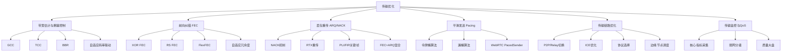
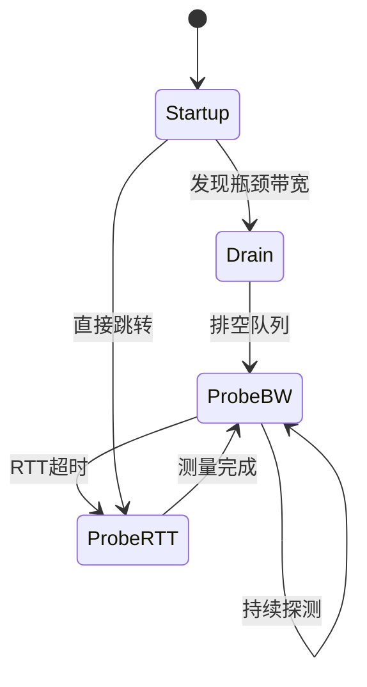
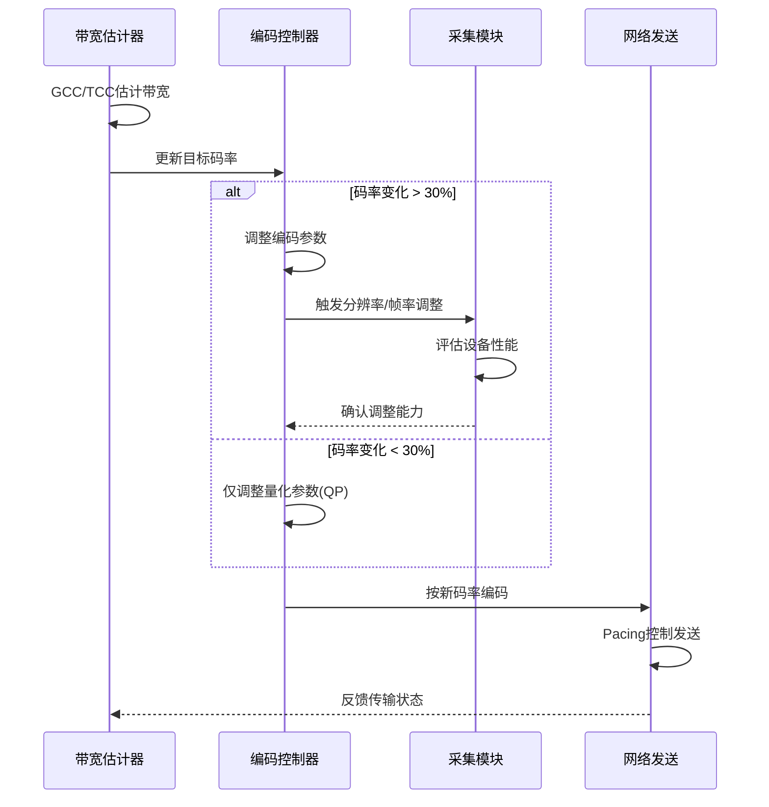
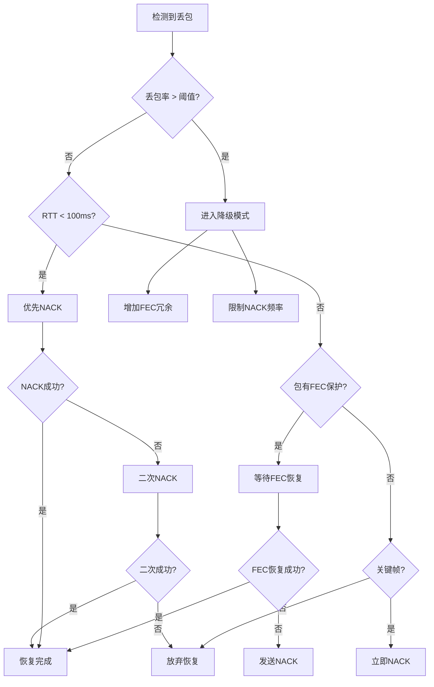
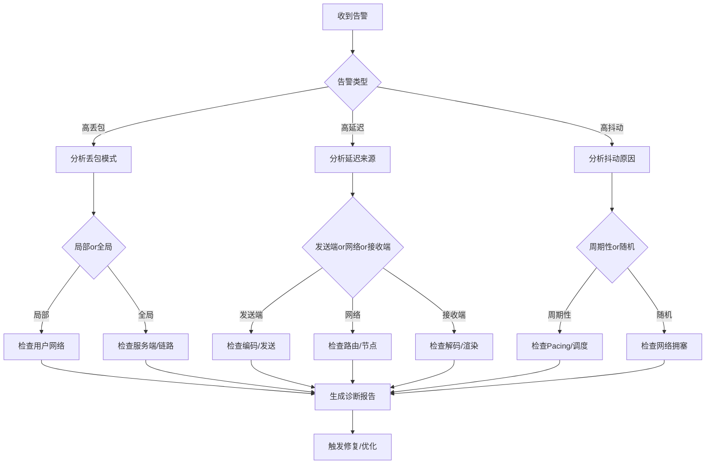

# 传输优化详细解析

> **TL;DR：传输优化是音视频链路中最关键的环节之一，直接决定了弱网环境下的用户体验。核心策略是"多管齐下、动态适应"——通过带宽估计、拥塞控制、FEC、ARQ、Pacing等手段的组合，在延迟、画质、流畅度之间取得最优平衡。工程实现上需要关注参数调优、策略联动和监控闭环。**

---

## 核心结论（TL;DR）

**传输优化的本质是在不可靠的网络环境中，用最小的代价换取最稳定的传输质量。**

现代传输优化的关键支柱：

1. **带宽感知**：实时准确估计可用带宽是自适应的基础，GCC/TCC/BBR各有适用场景
2. **冗余策略**：FEC提供快速恢复但消耗带宽，ARQ提供可靠传输但增加延迟，需要智能组合
3. **平滑发送**：Pacing避免突发流量冲击网络，是拥塞控制的重要补充
4. **链路优化**：P2P直连、智能路由、协议选择直接影响传输效率
5. **监控闭环**：实时采集RTT、丢包率、抖动等指标，驱动策略动态调整

**一句话理解传输优化**：与其追求"零丢包"，不如确保"丢包可恢复、恢复够快速"——传输优化本质上是一种**对抗不确定性**的工程实践。

---

## 第1章 Why — 传输优化的重要性

### 1.1 网络是音视频体验最大的不确定性来源

音视频链路中，网络传输是最不可控的环节：

| 环节 | 可控性 | 波动范围 | 主要影响因素 |
|-----|-------|---------|-------------|
| **采集** | 高 | ±5% | 设备性能、驱动稳定性 |
| **编码** | 高 | ±10% | CPU/GPU负载、温度降频 |
| **传输** | **低** | **±300%** | **网络拥塞、路由变化、信号强弱** |
| **解码** | 高 | ±15% | 设备性能、码率复杂度 |
| **渲染** | 高 | ±10% | GPU负载、屏幕刷新率 |

**核心洞察**：网络波动可以在毫秒级内从"良好"变为"极差"，而音视频编码参数的调整需要数百毫秒甚至数秒才能生效，这种**时间尺度的不匹配**是传输优化的核心挑战。

### 1.2 弱网场景的分布特征

基于大规模线上数据统计，弱网场景分布如下：

| 网络类型 | 用户占比 | 典型丢包率 | 典型RTT | 主要场景 |
|---------|---------|-----------|---------|---------|
| **有线宽带** | 35% | < 0.5% | 10-30ms | 家庭办公、游戏 |
| **WiFi室内** | 30% | 0.5-2% | 20-50ms | 居家、办公室 |
| **WiFi公共** | 10% | 2-5% | 50-100ms | 咖啡厅、机场 |
| **4G室内** | 12% | 1-3% | 50-150ms | 移动中、信号弱 |
| **4G室外** | 8% | 0.5-2% | 30-80ms | 移动场景 |
| **5G** | 4% | < 1% | 20-50ms | 城市热点 |
| **弱网边缘** | 1% | > 5% | > 200ms | 电梯、地下室、跨国 |

**关键发现**：
- 约40%的用户处于"准弱网"状态（丢包1-3%），需要轻度对抗策略
- 约10%的用户处于"明显弱网"状态（丢包>3%），需要重度对抗策略
- 弱网用户虽然占比不高，但投诉率是普通用户的5-10倍

### 1.3 传输优化对体验的综合影响

传输优化直接影响三大核心指标：

```
┌─────────────────────────────────────────────────────────────┐
│                      传输优化策略                            │
│  ┌──────────┐  ┌──────────┐  ┌──────────┐  ┌──────────┐    │
│  │带宽估计  │  │  FEC    │  │  ARQ    │  │ Pacing  │    │
│  └────┬─────┘  └────┬─────┘  └────┬─────┘  └────┬─────┘    │
│       │             │             │             │           │
│       ▼             ▼             ▼             ▼           │
│  ┌──────────────────────────────────────────────────────┐  │
│  │                    网络传输层                         │  │
│  └──────────────────────────────────────────────────────┘  │
│       │             │             │             │           │
│       ▼             ▼             ▼             ▼           │
│  ┌──────────┐  ┌──────────┐  ┌──────────┐  ┌──────────┐    │
│  │ 延迟控制 │  │ 画质保持 │  │ 流畅度   │  │ 带宽效率 │    │
│  │  -50ms   │  │  +20%    │  │  -40%   │  │  +15%    │    │
│  └──────────┘  └──────────┘  └──────────┘  └──────────┘    │
└─────────────────────────────────────────────────────────────┘
```

**量化影响**（基于WebRTC大规模实验数据）：

| 优化策略 | 延迟影响 | 画质影响 | 卡顿率影响 | 带宽开销 |
|---------|---------|---------|-----------|---------|
| **启用GCC** | +10ms（估计开销） | 中性 | -35% | 中性 |
| **启用FEC(10%冗余)** | +5ms（编解码） | 中性 | -25% | +10% |
| **启用NACK** | +20-100ms（重传） | 中性 | -30% | +5-15% |
| **启用Pacing** | +5ms（平滑缓冲） | 中性 | -15% | 中性 |
| **组合优化** | +20ms | +15% | **-60%** | +12% |

---

## 第2章 What — 传输优化MECE分类

### 2.1 传输优化技术全景图



### 2.2 各技术模块职责说明

| 技术模块 | 核心职责 | 主要手段 | 适用场景 | 复杂度 |
|---------|---------|---------|---------|-------|
| **带宽估计** | 实时感知网络容量 | GCC/TCC/BBR | 所有场景 | 高 |
| **FEC** | 丢包快速恢复 | XOR/RS/FlexFEC | 丢包率>1% | 中 |
| **ARQ/NACK** | 可靠重传 | NACK/RTX | 非实时性敏感 | 中 |
| **Pacing** | 平滑发送节奏 | 令牌桶/漏桶 | 带宽受限 | 低 |
| **链路优化** | 最优路径选择 | ICE/智能路由 | 多路径可用 | 高 |
| **监控QoS** | 质量度量与反馈 | RTCP/埋点 | 所有场景 | 中 |

### 2.3 技术组合策略

不同网络条件下的推荐组合：

| 网络条件 | 推荐策略 | FEC冗余度 | NACK策略 | Pacing |
|---------|---------|-----------|---------|--------|
| **优良** (丢包<0.5%) | GCC + Pacing | 关闭 | 轻量 | 启用 |
| **良好** (丢包0.5-2%) | GCC + FEC(5%) + Pacing | 5% | 轻量 | 启用 |
| **一般** (丢包2-5%) | TCC + FEC(10%) + NACK + Pacing | 10% | 标准 | 启用 |
| **较差** (丢包5-10%) | TCC + FEC(15%) + NACK + 降码率 | 15% | 激进 | 启用 |
| **极差** (丢包>10%) | 降级模式 + FEC(20%) + 关键帧保护 | 20% | 限制 | 严格 |

---

## 第3章 How — 带宽估计与拥塞控制

### 3.1 GCC（Google Congestion Control）

GCC是WebRTC默认的拥塞控制算法，基于**延迟梯度**进行带宽估计。

#### 3.1.1 核心原理

```
发送端                    接收端
   │    RTP包(带发送时间)    │
   │ ─────────────────────> │
   │                        │
   │   计算包间延迟梯度      │
   │   (inter-arrival time) │
   │                        │
   │    REMB反馈(带宽估计)   │
   │ <───────────────────── │
   │                        │
   │   调整发送码率          │
   │                        │
```

**延迟梯度原理**：
- 如果网络拥塞，包在队列中等待时间增加，到达间隔变大
- 通过测量到达间隔的变化趋势（梯度），预测拥塞

#### 3.1.2 卡尔曼滤波器工程应用

GCC使用卡尔曼滤波器平滑延迟测量噪声，工程实现要点：

```cpp
// WebRTC GCC延迟估计简化示意
class DelayBasedBwe {
public:
    // 卡尔曼滤波器状态
    struct KalmanFilter {
        double slope_;           // 延迟梯度估计
        double offset_;          // 基准偏移
        double slope_cov_;       // 斜率协方差
        double offset_cov_;      // 偏移协方差
    };

    // 每次收到包组时更新
    void UpdateDelayEstimate(int64_t send_delta_ms,
                             int64_t recv_delta_ms) {
        // 计算测量值：到达间隔 - 发送间隔
        double delay_delta = recv_delta_ms - send_delta_ms;
        
        // 卡尔曼滤波更新（简化版）
        double residual = delay_delta - (kalman_.slope_ + kalman_.offset_);
        
        // 更新斜率估计
        double k_gain = kalman_.slope_cov_ / (kalman_.slope_cov_ + process_noise_);
        kalman_.slope_ += k_gain * residual;
        kalman_.slope_cov_ = (1 - k_gain) * kalman_.slope_cov_;
        
        // 根据斜率判断趋势
        if (kalman_.slope_ > threshold_overuse_) {
            state_ = kOverusing;
        } else if (kalman_.slope_ < threshold_underuse_) {
            state_ = kUnderusing;
        } else {
            state_ = kNormal;
        }
    }

private:
    KalmanFilter kalman_;
    double threshold_overuse_ = 10;   // 过载阈值(ms)
    double threshold_underuse_ = -10; // 欠载阈值(ms)
    double process_noise_ = 1e-3;     // 过程噪声
};
```

**工程调参要点**：

| 参数 | 默认值 | 调优建议 | 影响 |
|-----|-------|---------|------|
| `threshold_overuse` | 10ms | 弱网可调至15-20ms | 越大越保守 |
| `threshold_underuse` | -10ms | 一般保持默认 | 越小越激进 |
| `process_noise` | 1e-3 | 抖动大可增至1e-2 | 越大响应越快 |
| `overuse_time_th` | 10ms | 弱网可增至20ms | 防误判 |

#### 3.1.3 REMB反馈机制

接收端通过RTCP REMB消息反馈估计带宽：

```cpp
// REMB消息结构（RFC 5104）
struct RembMessage {
    uint8_t fmt = 15;           // RTCP格式
    uint8_t payload_type = 206; // PSFB类型
    uint32_t ssrc;              // 发送端SSRC
    uint32_t media_ssrc = 0;    // 媒体SSRC（REMB为0）
    
    // 唯一标识符 'REMB'
    char unique_id[4] = {'R', 'E', 'M', 'B'};
    
    uint8_t num_ssrcs;          // 反馈的SSRC数量
    uint8_t br_exp;             // 带宽指数
    uint16_t br_mantissa;       // 带宽尾数
    // 带宽 = mantissa * 2^exp (bps)
    
    uint32_t ssrc_list[255];    // SSRC列表
};

// 计算示例：带宽 = 2,500,000 bps
// br_exp = 18, br_mantissa = 9533
// 9533 * 2^18 = 2,500,000
```

#### 3.1.4 GCC局限性与调优

**主要局限**：

| 局限 | 说明 | 应对策略 |
|-----|------|---------|
| **延迟敏感** | 依赖延迟测量，对突发抖动敏感 | 增加滤波强度，调大阈值 |
| **收敛慢** | 带宽变化时需要数秒收敛 | 结合丢包反馈加速收敛 |
| **反向拥塞** | 上行拥塞时下行估计不准 | 上下行独立估计 |
| **ACK时钟** | 依赖接收端反馈，反馈丢失影响大 | 冗余发送REMB |

**典型调优配置**：

```cpp
// 弱网场景GCC配置
struct GccTuningConfig {
    // 延迟估计
    double overuse_threshold = 15.0;      // 默认10ms，弱网加大
    double overuse_time_threshold = 20.0; // 默认10ms
    
    // 码率调整
    double increase_factor = 1.05;        // 增速5%
    double decrease_factor = 0.85;        // 降速15%
    
    // 边界保护
    uint32_t min_bitrate_bps = 50000;     // 最小50kbps
    uint32_t max_bitrate_bps = 8000000;   // 最大8Mbps
    
    // 丢包补偿
    bool enable_loss_feedback = true;
    double loss_threshold = 0.02;         // 2%丢包触发降速
};
```

### 3.2 TCC（Transport-wide Congestion Control）

TCC是WebRTC新一代拥塞控制方案，相比GCC有显著改进。

#### 3.2.1 Transport-CC扩展头设计

TCC在RTP扩展头中携带传输序号，实现更精确的包级反馈：

```cpp
// Transport-CC扩展头（RFC 5104扩展）
// 位于RTP扩展头，占用2字节
struct TransportCCExtension {
    uint16_t transport_sequence_number;  // 传输层序号（与RTP序号独立）
};

// 发送端为每个包分配递增的transport_sequence_number
// 接收端通过TransportCC反馈包告知每个包的到达状态
```

**与GCC的关键区别**：

| 特性 | GCC | TCC |
|-----|-----|-----|
| **反馈粒度** | 包组级（多包聚合） | 包级（每个包独立） |
| **反馈频率** | 每1-2秒一次REMB | 每接收一个包可反馈 |
| **信息维度** | 仅带宽估计 | 丢包状态+到达时间 |
| **反馈通道** | RTCP REMB | TransportCC RTCP |
| **精度** | 中等 | 高 |

#### 3.2.2 TCC带宽估计实现

```cpp
// TCC带宽估计核心逻辑
class TransportCcBwe {
public:
    void OnReceivedPacketFeedback(const PacketFeedbackVector& feedbacks) {
        for (const auto& fb : feedbacks) {
            if (fb.arrival_time < 0) {
                // 包丢失
                loss_tracker_.AddLostPacket(fb.sequence_number);
            } else {
                // 包到达，计算延迟
                int64_t send_time_ms = fb.send_time_ms;
                int64_t recv_time_ms = fb.arrival_time;
                int64_t delay_ms = recv_time_ms - send_time_ms;
                
                // 更新延迟模型
                delay_detector_.Update(delay_ms, send_time_ms);
                
                // 更新吞吐量估计（基于到达率）
                throughput_estimator_.Update(fb.payload_size, recv_time_ms);
            }
        }
        
        // 综合延迟趋势和吞吐量估计带宽
        BandwidthEstimate estimate;
        estimate.delay_based = delay_detector_.GetEstimate();
        estimate.loss_based = loss_tracker_.GetLossBasedEstimate();
        estimate.throughput_based = throughput_estimator_.GetEstimate();
        
        // 取最保守的估计
        current_estimate_ = std::min({estimate.delay_based,
                                       estimate.loss_based,
                                       estimate.throughput_based});
    }

private:
    AimdRateControl aimd_controller_;      // 加性增乘性降控制
    DelayBasedDetector delay_detector_;     // 延迟检测
    LossBasedBwe loss_tracker_;             // 丢包估计
    ThroughputEstimator throughput_estimator_; // 吞吐量估计
};
```

#### 3.2.3 TCC vs GCC工程对比

| 对比维度 | GCC | TCC | 工程建议 |
|---------|-----|-----|---------|
| **估计精度** | ★★★☆☆ | ★★★★★ | TCC更适合高质量要求场景 |
| **实现复杂度** | 中等 | 较高 | GCC适合快速上线 |
| **反馈开销** | 低 | 中等 | TCC需要更多RTCP带宽 |
| **收敛速度** | 慢（2-5s） | 快（0.5-2s） | TCC适合快速变化网络 |
| **兼容性** | 广泛 | 需双方支持 | 渐进式迁移 |
| **CPU开销** | 低 | 中等 | 低端设备可用GCC |

**选型建议**：
- **新系统**：直接使用TCC
- **存量系统**：逐步迁移，支持GCC/TCC协商
- **资源受限**：GCC + 简化版TCC

### 3.3 BBR在音视频场景的应用

BBR（Bottleneck Bandwidth and Round-trip propagation time）是Google提出的新型拥塞控制算法。

#### 3.3.1 BBR核心思想

```
传统算法（Cubic/Reno）：
  丢包 = 拥塞 → 降速 → 探测 → 再丢包 → 循环

BBR算法：
  直接测量带宽和RTT → 计算最优发送速率 → 保持
  
关键洞察：
  - 瓶颈带宽（BtlBw）：管道能承载的最大速率
  - 最小RTT（RTprop）：无排队时的传播延迟
  - 最优 inflight = BtlBw × RTprop
```

#### 3.3.2 BBR状态机



| 状态 | 行为 | 持续时间 |
|-----|------|---------|
| **Startup** | 指数增长探测带宽 | 直到发现瓶颈 |
| **Drain** | 快速降速排空队列 | 约1个RTT |
| **ProbeBW** | 周期性探测更高带宽 | 持续运行 |
| **ProbeRTT** | 降速测量真实RTT | 200ms/10s |

#### 3.3.3 BBR与GCC的互操作

```cpp
// BBR + GCC混合策略
class HybridBwe {
public:
    void UpdateEstimate(const PacketFeedback& feedback) {
        // BBR估计（基于发送/到达率）
        bbr_.Update(feedback);
        uint32_t bbr_estimate = bbr_.GetTargetBitrate();
        
        // GCC估计（基于延迟梯度）
        gcc_.UpdateDelayEstimate(feedback);
        uint32_t gcc_estimate = gcc_.GetEstimate();
        
        // 策略选择
        if (network_type_ == kWired) {
            // 有线网络：BBR主导
            final_estimate_ = 0.7 * bbr_estimate + 0.3 * gcc_estimate;
        } else {
            // 无线网络：GCC主导（对抖动更鲁棒）
            final_estimate_ = 0.3 * bbr_estimate + 0.7 * gcc_estimate;
        }
        
        // 安全边界
        final_estimate_ = std::clamp(final_estimate_,
                                      min_bitrate_,
                                      max_bitrate_);
    }
};
```

**BBR适用场景分析**：

| 场景 | BBR适用性 | 原因 | 建议 |
|-----|----------|------|------|
| **有线网络** | ★★★★★ | 带宽稳定，BBR能充分利用 | 首选BBR |
| **WiFi** | ★★★★☆ | 有一定波动，但可预测 | BBR+GCC混合 |
| **4G/5G** | ★★★☆☆ | 抖动大，BBR可能过度反应 | GCC主导 |
| **跨国链路** | ★★★☆☆ | RTT大，ProbeRTT开销明显 | 调大ProbeRTT间隔 |

### 3.4 自适应码率联动

#### 3.4.1 联动链路设计

带宽估计需要驱动整个编码链路调整：



#### 3.4.2 码率调整平滑策略

```cpp
// 平滑码率调整器
class SmoothBitrateController {
public:
    void SetTargetBitrate(uint32_t new_target_bps) {
        target_bitrate_ = new_target_bps;
    }
    
    uint32_t GetCurrentBitrate() {
        // 限制单次调整幅度（防抖动）
        const double kMaxChangeRate = 1.5;  // 最大增长50%
        const double kMinChangeRate = 0.7;  // 最大降低30%
        
        uint32_t new_bitrate = current_bitrate_;
        
        if (target_bitrate_ > current_bitrate_) {
            // 增码率：保守增长
            uint32_t max_increase = current_bitrate_ * (kMaxChangeRate - 1.0);
            new_bitrate = std::min(target_bitrate_,
                                   current_bitrate_ + max_increase);
        } else {
            // 降码率：快速响应
            uint32_t max_decrease = current_bitrate_ * (1.0 - kMinChangeRate);
            new_bitrate = std::max(target_bitrate_,
                                   current_bitrate_ - max_decrease);
        }
        
        current_bitrate_ = new_bitrate;
        return current_bitrate_;
    }

private:
    uint32_t current_bitrate_ = 1000000;  // 当前码率
    uint32_t target_bitrate_ = 1000000;   // 目标码率
};
```

#### 3.4.3 上下行带宽独立估计

```cpp
// 上下行独立带宽管理
class BidirectionalBwe {
public:
    // 上行带宽估计（发送端）
    void UpdateUplinkEstimate(const RtcpReport& report) {
        uplink_estimator_.ProcessReport(report);
        uplink_bandwidth_ = uplink_estimator_.GetEstimate();
        
        // 上行影响发送码率
        encoder_controller_.SetTargetBitrate(uplink_bandwidth_);
    }
    
    // 下行带宽估计（接收端）
    void UpdateDownlinkEstimate(const PacketFeedbackVector& feedbacks) {
        downlink_estimator_.ProcessFeedback(feedbacks);
        downlink_bandwidth_ = downlink_estimator_.GetEstimate();
        
        // 发送REMB反馈给对端
        SendRembFeedback(downlink_bandwidth_);
    }
    
    // 联动策略
    void ApplyBandwidthStrategy() {
        // 不对称网络处理
        if (uplink_bandwidth_ < downlink_bandwidth_ * 0.5) {
            // 上行瓶颈，启用SVC或降分辨率
            EnableSvcLayerReduction();
        }
    }

private:
    BandwidthEstimator uplink_estimator_;
    BandwidthEstimator downlink_estimator_;
    uint32_t uplink_bandwidth_ = 0;
    uint32_t downlink_bandwidth_ = 0;
};
```

---

## 第4章 How — FEC（前向纠错）

### 4.1 FEC基本工程实现

#### 4.1.1 XOR FEC实现要点

XOR FEC是最简单的FEC方案，通过异或运算生成冗余包：

```cpp
// XOR FEC编码器
class XorFecEncoder {
public:
    // 对n个媒体包生成1个FEC包
    std::vector<RtpPacket> Encode(const std::vector<RtpPacket>& media_packets) {
        if (media_packets.empty()) return {};
        
        // 创建FEC包
        RtpPacket fec_packet;
        fec_packet.payload.resize(media_packets[0].payload.size(), 0);
        
        // 异或所有媒体包
        for (const auto& pkt : media_packets) {
            for (size_t i = 0; i < pkt.payload.size() && i < fec_packet.payload.size(); ++i) {
                fec_packet.payload[i] ^= pkt.payload[i];
            }
        }
        
        // 设置FEC头信息
        fec_packet.sequence_number = next_fec_seq_++;
        fec_packet.timestamp = media_packets[0].timestamp;
        fec_packet.marker = true;
        
        return {fec_packet};
    }
    
    // 解码恢复
    bool Decode(std::vector<RtpPacket>& received_packets,
                const RtpPacket& fec_packet,
                uint16_t lost_seq) {
        // 找到丢失的包位置
        auto it = std::find_if(received_packets.begin(), received_packets.end(),
            [&](const RtpPacket& pkt) {
                return pkt.sequence_number == lost_seq;
            });
        
        if (it != received_packets.end()) {
            return false;  // 包已存在，不需要恢复
        }
        
        // 用FEC包异或恢复丢失包
        RtpPacket recovered = fec_packet;
        for (const auto& pkt : received_packets) {
            for (size_t i = 0; i < pkt.payload.size() && i < recovered.payload.size(); ++i) {
                recovered.payload[i] ^= pkt.payload[i];
            }
        }
        
        recovered.sequence_number = lost_seq;
        received_packets.push_back(recovered);
        return true;
    }

private:
    uint16_t next_fec_seq_ = 0;
};
```

**XOR FEC特点**：

| 特性 | 说明 |
|-----|------|
| **冗余度** | 1/n（n个包产生1个冗余） |
| **恢复能力** | 每组最多恢复1个丢包 |
| **计算开销** | 极低（仅XOR运算） |
| **适用场景** | 丢包率低、延迟敏感 |

#### 4.1.2 Reed-Solomon FEC工程选型

Reed-Solomon FEC提供更强的恢复能力，但计算复杂度更高：

```cpp
// RS FEC参数配置
struct RSFecConfig {
    int k;  // 原始包数
    int n;  // 总包数（k + m）
    int m;  // 冗余包数
    
    // 常见配置
    static RSFecConfig Conservative() { return {10, 12, 2}; }  // 20%冗余
    static RSFecConfig Balanced() { return {10, 11, 1}; }     // 10%冗余
    static RSFecConfig Aggressive() { return {8, 12, 4}; }    // 50%冗余
};

// RS FEC编码（使用开源库如OpenFEC、libfec）
class ReedSolomonFec {
public:
    bool Init(const RSFecConfig& config) {
        // 初始化RS编码器
        codec_ = fec_new(config.k, config.n);
        return codec_ != nullptr;
    }
    
    std::vector<std::vector<uint8_t>> Encode(
            const std::vector<std::vector<uint8_t>>& source_packets) {
        std::vector<std::vector<uint8_t>> fec_packets;
        
        // 调用RS编码
        for (int i = 0; i < config_.m; ++i) {
            std::vector<uint8_t> fec_pkt(max_packet_size_);
            fec_encode(codec_, source_packets.data(), fec_pkt.data(), i + config_.k);
            fec_packets.push_back(fec_pkt);
        }
        
        return fec_packets;
    }
    
    // 解码：只要收到任意k个包即可恢复全部
    std::vector<std::vector<uint8_t>> Decode(
            const std::vector<int>& received_indices,
            const std::vector<std::vector<uint8_t>>& received_packets) {
        // RS解码实现
        // ...
    }

private:
    void* codec_ = nullptr;
    RSFecConfig config_;
    size_t max_packet_size_ = 1200;
};
```

**RS FEC vs XOR FEC对比**：

| 特性 | XOR FEC | RS FEC |
|-----|---------|--------|
| **恢复能力** | 每组1个 | 任意m个 |
| **冗余度** | 固定1/n | 可配置m/k |
| **计算开销** | 极低 | 高（矩阵运算） |
| **延迟** | 低 | 较高（编解码耗时） |
| **适用丢包率** | < 5% | < 15% |
| **库依赖** | 自实现 | OpenFEC、libfec |

#### 4.1.3 FlexFEC标准（RFC 8627）

FlexFEC是WebRTC标准化的FEC方案，支持多种保护模式：

```cpp
// FlexFEC RTP头格式
struct FlexFecHeader {
    // 基础RTP头
    uint8_t version : 2;
    uint8_t padding : 1;
    uint8_t extension : 1;
    uint8_t csrccount : 4;
    uint8_t markerbit : 1;
    uint8_t payloadtype : 7;
    uint16_t sequencenumber;
    uint32_t timestamp;
    uint32_t ssrc;
    
    // FlexFEC特定
    uint16_t sequence_number_base;  // 保护包起始序号
    uint16_t mask;                   // 保护掩码（1D/2D）
    uint16_t protected_packets;      // 被保护的包数
};

// FlexFEC保护模式
enum class FlexFecMode {
    k1DRow,      // 1D行保护
    k1DColumn,   // 1D列保护
    k2DGrid      // 2D行列保护
};
```

### 4.2 自适应FEC策略

#### 4.2.1 基于丢包率的动态冗余度调节

```cpp
// 自适应FEC控制器
class AdaptiveFecController {
public:
    struct FecLevel {
        double loss_threshold;  // 丢包率阈值
        double redundancy_rate; // 冗余度
        FecMode mode;           // FEC模式
    };
    
    // 五级自适应策略
    std::vector<FecLevel> fec_levels_ = {
        {0.00, 0.00, FecMode::kDisabled},   // 优良：关闭FEC
        {0.01, 0.05, FecMode::kXor1D},      // 良好：5% XOR
        {0.03, 0.10, FecMode::kXor1D},      // 一般：10% XOR
        {0.05, 0.15, FecMode::kRs1D},       // 较差：15% RS
        {0.10, 0.25, FecMode::kRs2D}        // 极差：25% RS
    };
    
    void UpdateNetworkStats(const NetworkStats& stats) {
        // 计算平滑丢包率
        smoothed_loss_rate_ = 0.9 * smoothed_loss_rate_ + 0.1 * stats.loss_rate;
        
        // 选择FEC级别
        for (const auto& level : fec_levels_) {
            if (smoothed_loss_rate_ >= level.loss_threshold) {
                current_level_ = level;
            }
        }
        
        // 应用新配置
        fec_encoder_.SetRedundancyRate(current_level_.redundancy_rate);
        fec_encoder_.SetMode(current_level_.mode);
    }
    
    double GetCurrentRedundancyRate() const {
        return current_level_.redundancy_rate;
    }

private:
    double smoothed_loss_rate_ = 0.0;
    FecLevel current_level_ = fec_levels_[0];
    FecEncoder fec_encoder_;
};
```

#### 4.2.2 FEC分组大小与延迟权衡

```cpp
// FEC分组策略
struct FecGroupingStrategy {
    // 分组大小 vs 延迟 vs 恢复能力权衡
    
    // 策略1：低延迟优先（适合RTC）
    static FecConfig LowLatency() {
        return {
            .group_size = 10,        // 小分组
            .fec_delay_ms = 20,      // 20ms打包延迟
            .redundancy_rate = 0.10  // 10%冗余
        };
    }
    
    // 策略2：高恢复优先（适合弱网）
    static FecConfig HighRecovery() {
        return {
            .group_size = 20,        // 大分组
            .fec_delay_ms = 50,      // 50ms打包延迟
            .redundancy_rate = 0.20  // 20%冗余
        };
    }
    
    // 策略3：自适应分组
    static FecConfig Adaptive(uint32_t rtt_ms, double loss_rate) {
        FecConfig config;
        
        // RTT小可用大分组，RTT大需小分组
        if (rtt_ms < 50) {
            config.group_size = 20;
            config.fec_delay_ms = 30;
        } else if (rtt_ms < 100) {
            config.group_size = 15;
            config.fec_delay_ms = 25;
        } else {
            config.group_size = 10;
            config.fec_delay_ms = 20;
        }
        
        // 丢包率高增加冗余
        config.redundancy_rate = std::min(0.30, loss_rate * 2);
        
        return config;
    }
};
```

#### 4.2.3 视频帧重要性感知的差异化保护

```cpp
// 基于帧类型的差异化FEC保护
class FrameAwareFecController {
public:
    void OnFrameEncoded(const EncodedFrame& frame) {
        FecProtectionLevel protection;
        
        switch (frame.frame_type) {
            case FrameType::kKeyFrame:
                // I帧：最高保护
                protection.redundancy_rate = 0.20;
                protection.fec_mode = FecMode::kRs2D;
                protection.priority = 10;
                break;
                
            case FrameType::kDeltaFrame:
                if (frame.num_ref_frames == 0) {
                    //  Golden Frame（长期参考帧）
                    protection.redundancy_rate = 0.15;
                    protection.fec_mode = FecMode::kRs1D;
                    protection.priority = 8;
                } else {
                    // 普通P帧
                    protection.redundancy_rate = 0.10;
                    protection.fec_mode = FecMode::kXor1D;
                    protection.priority = 5;
                }
                break;
                
            case FrameType::kSwitchFrame:
                // SVC切换帧：高保护
                protection.redundancy_rate = 0.15;
                protection.fec_mode = FecMode::kRs1D;
                protection.priority = 9;
                break;
        }
        
        // 应用保护级别
        ApplyProtection(frame, protection);
    }

private:
    void ApplyProtection(const EncodedFrame& frame, const FecProtectionLevel& level) {
        // 根据优先级和码率预算调整
        double budget_adjusted_rate = level.redundancy_rate;
        
        // 如果总码率紧张，降低非关键帧保护
        if (bitrate_controller_.IsBudgetConstrained()) {
            if (level.priority < 8) {
                budget_adjusted_rate *= 0.5;
            }
        }
        
        fec_encoder_.SetFrameProtection(frame.timestamp, budget_adjusted_rate);
    }
};
```

#### 4.2.4 FEC冗余度 vs 码率的预算分配

```cpp
// 码率预算分配器
class BitrateBudgetAllocator {
public:
    struct BudgetAllocation {
        uint32_t media_bitrate;     // 媒体码率
        uint32_t fec_bitrate;       // FEC码率
        uint32_t nack_bitrate;      // 重传预留
        uint32_t overhead_bitrate;  // 协议开销
    };
    
    BudgetAllocation Allocate(uint32_t total_bitrate,
                               double loss_rate,
                               double rtt_ms) {
        BudgetAllocation alloc;
        
        // 协议开销（RTP/UDP/IP头）
        const double kOverheadRatio = 0.05;  // 约5%
        alloc.overhead_bitrate = total_bitrate * kOverheadRatio;
        
        uint32_t available = total_bitrate - alloc.overhead_bitrate;
        
        // 根据丢包率决定FEC比例
        double fec_ratio = CalculateFecRatio(loss_rate, rtt_ms);
        
        // 预留NACK带宽（基于历史重传率）
        double nack_ratio = std::min(0.10, loss_rate * 1.5);
        
        // 分配
        alloc.fec_bitrate = available * fec_ratio;
        alloc.nack_bitrate = available * nack_ratio;
        alloc.media_bitrate = available - alloc.fec_bitrate - alloc.nack_bitrate;
        
        return alloc;
    }
    
private:
    double CalculateFecRatio(double loss_rate, double rtt_ms) {
        // RTT大时优先FEC（重传太慢）
        // RTT小时可降低FEC，依赖NACK
        
        if (rtt_ms > 200) {
            // 高RTT：FEC主导
            return std::min(0.25, loss_rate * 2.5);
        } else if (rtt_ms > 100) {
            // 中RTT：平衡
            return std::min(0.20, loss_rate * 2.0);
        } else {
            // 低RTT：NACK主导，FEC辅助
            return std::min(0.15, loss_rate * 1.5);
        }
    }
};
```

### 4.3 FEC工程性能

#### 4.3.1 不同丢包率下各FEC方案恢复率

| 丢包率 | XOR FEC(10%) | RS FEC(10%) | RS FEC(20%) | FlexFEC(15%) | 无FEC |
|-------|-------------|-------------|-------------|--------------|-------|
| **1%** | 99.5% | 99.9% | 99.9% | 99.9% | 99% |
| **3%** | 95% | 98% | 99% | 98.5% | 97% |
| **5%** | 85% | 92% | 97% | 95% | 95% |
| **8%** | 70% | 82% | 93% | 88% | 92% |
| **10%** | 60% | 75% | 90% | 83% | 90% |
| **15%** | 40% | 55% | 82% | 70% | 85% |

**说明**：恢复率 = 成功恢复包数 / 总丢包数

#### 4.3.2 FEC的CPU开销

| FEC方案 | 编码CPU占用 | 解码CPU占用 | 内存占用 | 适用平台 |
|--------|------------|------------|---------|---------|
| **XOR FEC** | < 0.1% | < 0.1% | 低 | 所有平台 |
| **RS FEC(10%)** | 0.5-1% | 1-2% | 中 | 桌面/高端移动 |
| **RS FEC(20%)** | 1-2% | 2-4% | 中 | 桌面/高端移动 |
| **FlexFEC** | 0.5-1.5% | 1-3% | 中 | 桌面/高端移动 |

#### 4.3.3 FEC与ARQ的协同策略

```cpp
// FEC + ARQ协同控制器
class FecArqCoordinator {
public:
    enum class RecoveryStrategy {
        kFecOnly,      // 仅用FEC（低RTT场景）
        kArqOnly,      // 仅用ARQ（高可靠需求）
        kFecFirst,     // 先FEC，超时后ARQ
        kAdaptive      // 自适应选择
    };
    
    void OnPacketLost(uint16_t seq_num, const PacketInfo& info) {
        switch (strategy_) {
            case RecoveryStrategy::kFecOnly:
                // 依赖FEC恢复，不发送NACK
                break;
                
            case RecoveryStrategy::kFecFirst:
                // 等待FEC恢复窗口
                ScheduleNack(seq_num, kFecRecoveryWindowMs);
                break;
                
            case RecoveryStrategy::kAdaptive:
                AdaptiveRecovery(seq_num, info);
                break;
        }
    }
    
private:
    void AdaptiveRecovery(uint16_t seq_num, const PacketInfo& info) {
        // 关键帧优先ARQ
        if (info.is_key_frame) {
            SendNackImmediately(seq_num);
            return;
        }
        
        // 根据RTT选择策略
        if (rtt_ms_ < 50) {
            // 低RTT：ARQ更快
            SendNackImmediately(seq_num);
        } else if (rtt_ms_ < 150) {
            // 中RTT：FEC+ARQ混合
            if (info.fec_protected) {
                // 有FEC保护，等待FEC
                ScheduleNack(seq_num, kFecRecoveryWindowMs);
            } else {
                SendNackImmediately(seq_num);
            }
        } else {
            // 高RTT：依赖FEC
            // 仅对关键包发送NACK
            if (info.importance > 8) {
                ScheduleNack(seq_num, kFecRecoveryWindowMs / 2);
            }
        }
    }
    
    static constexpr int kFecRecoveryWindowMs = 30;
    RecoveryStrategy strategy_ = RecoveryStrategy::kAdaptive;
    double rtt_ms_ = 50;
};
```

---

## 第5章 How — ARQ/NACK（丢包重传）

### 5.1 NACK机制工程实现

#### 5.1.1 NACK消息生成策略

```cpp
// NACK控制器
class NackController {
public:
    struct NackConfig {
        int max_nack_packets = 1000;        // 最大追踪包数
        int max_nack_retries = 3;           // 最大重试次数
        int nack_interval_ms = 20;          // NACK发送间隔
        int max_wait_time_ms = 200;         // 最大等待时间
        double max_loss_rate = 0.5;         // 超过此丢包率暂停NACK
    };
    
    void OnPacketReceived(uint16_t seq_num, uint32_t timestamp) {
        // 检测丢包
        if (last_received_seq_.has_value()) {
            uint16_t expected = last_received_seq_.value() + 1;
            while (expected != seq_num) {
                OnPacketLost(expected);
                ++expected;
            }
        }
        
        last_received_seq_ = seq_num;
        
        // 标记已恢复
        auto it = nack_list_.find(seq_num);
        if (it != nack_list_.end()) {
            it->second.recovered = true;
        }
    }
    
    std::vector<uint16_t> GetNackList() {
        std::vector<uint16_t> nacks;
        int64_t now_ms = GetCurrentTimeMs();
        
        for (auto& [seq, info] : nack_list_) {
            if (info.recovered) continue;
            if (info.retry_count >= config_.max_nack_retries) continue;
            if (now_ms - info.first_nack_time > config_.max_wait_time_ms) continue;
            
            // 到达发送时间
            if (now_ms >= info.next_nack_time) {
                nacks.push_back(seq);
                info.next_nack_time = now_ms + config_.nack_interval_ms;
                ++info.retry_count;
            }
        }
        
        return nacks;
    }

private:
    void OnPacketLost(uint16_t seq_num) {
        NackInfo info;
        info.first_nack_time = GetCurrentTimeMs();
        info.next_nack_time = info.first_nack_time;
        nack_list_[seq_num] = info;
    }
    
    struct NackInfo {
        int64_t first_nack_time;
        int64_t next_nack_time;
        int retry_count = 0;
        bool recovered = false;
    };
    
    std::optional<uint16_t> last_received_seq_;
    std::map<uint16_t, NackInfo> nack_list_;
    NackConfig config_;
};
```

**NACK策略参数调优**：

| 参数 | 默认值 | 弱网调优 | 说明 |
|-----|-------|---------|------|
| `max_nack_retries` | 3 | 2 | 减少重试，避免风暴 |
| `nack_interval_ms` | 20 | 30 | 降低NACK频率 |
| `max_wait_time_ms` | 200 | 150 | 缩短等待，快速放弃 |
| `max_loss_rate` | 0.5 | 0.3 | 更早进入降级模式 |

#### 5.1.2 发送端重传缓冲区设计

```cpp
// RTP重传缓冲区
class RtpRetransmissionBuffer {
public:
    struct PacketStorage {
        std::vector<uint8_t> data;
        int64_t send_time_ms;
        int retransmit_count;
    };
    
    void StorePacket(uint16_t seq_num, const uint8_t* data, size_t len) {
        PacketStorage storage;
        storage.data.assign(data, data + len);
        storage.send_time_ms = GetCurrentTimeMs();
        storage.retransmit_count = 0;
        
        // 存入缓冲区
        packet_buffer_[seq_num] = std::move(storage);
        
        // 清理过期包
        CleanupOldPackets();
    }
    
    std::optional<std::vector<uint8_t>> GetRetransmission(uint16_t seq_num) {
        auto it = packet_buffer_.find(seq_num);
        if (it == packet_buffer_.end()) {
            return std::nullopt;  // 包已过期
        }
        
        // 检查重传次数
        if (it->second.retransmit_count >= max_retransmit_count_) {
            return std::nullopt;
        }
        
        ++it->second.retransmit_count;
        return it->second.data;
    }

private:
    void CleanupOldPackets() {
        int64_t now_ms = GetCurrentTimeMs();
        int64_t expire_time = now_ms - buffer_duration_ms_;
        
        for (auto it = packet_buffer_.begin(); it != packet_buffer_.end();) {
            if (it->second.send_time_ms < expire_time) {
                it = packet_buffer_.erase(it);
            } else {
                ++it;
            }
        }
    }
    
    std::map<uint16_t, PacketStorage> packet_buffer_;
    int64_t buffer_duration_ms_ = 1000;  // 1秒缓冲
    int max_retransmit_count_ = 3;
};
```

#### 5.1.3 NACK延迟预算计算

```cpp
// NACK延迟预算计算器
class NackDelayBudget {
public:
    struct Budget {
        int nack_send_delay;      // NACK发送延迟
        int nack_process_delay;   // 对端处理延迟
        int rtx_send_delay;       // 重传发送延迟
        int rtx_receive_delay;    // 重传接收延迟
        int total_budget_ms;      // 总预算
    };
    
    Budget Calculate(int rtt_ms, int jitter_ms) {
        Budget budget;
        
        // 基于RTT计算各阶段延迟
        budget.nack_send_delay = 10;           // 本地处理+发送
        budget.nack_process_delay = rtt_ms / 4; // 对端处理（约1/4 RTT）
        budget.rtx_send_delay = rtt_ms / 2;     // 重传发送（约1/2 RTT）
        budget.rtx_receive_delay = 10;          // 本地接收处理
        
        // 增加抖动缓冲
        int jitter_buffer = jitter_ms * 2;
        
        budget.total_budget_ms = budget.nack_send_delay +
                                  budget.nack_process_delay +
                                  budget.rtx_send_delay +
                                  budget.rtx_receive_delay +
                                  jitter_buffer;
        
        return budget;
    }
    
    // 判断NACK是否值得发送
    bool IsNackWorthwhile(int rtt_ms, int remaining_playout_delay_ms) {
        auto budget = Calculate(rtt_ms, 20);
        
        // 如果总预算超过剩余播放时间，NACK无意义
        return budget.total_budget_ms < remaining_playout_delay_ms;
    }
};
```

### 5.2 FEC + NACK混合策略

#### 5.2.1 混合使用的决策逻辑



#### 5.2.2 不同网络条件下的策略切换

```cpp
// 自适应恢复策略管理器
class AdaptiveRecoveryManager {
public:
    enum class NetworkCondition {
        kExcellent,  // 丢包<0.5%, RTT<30ms
        kGood,       // 丢包<2%, RTT<50ms
        kFair,       // 丢包<5%, RTT<100ms
        kPoor,       // 丢包<10%, RTT<200ms
        kBad         // 丢包>10% 或 RTT>200ms
    };
    
    void UpdateNetworkStats(const NetworkStats& stats) {
        // 分类网络条件
        current_condition_ = ClassifyNetwork(stats);
        
        // 应用对应策略
        switch (current_condition_) {
            case NetworkCondition::kExcellent:
                ApplyExcellentStrategy();
                break;
            case NetworkCondition::kGood:
                ApplyGoodStrategy();
                break;
            case NetworkCondition::kFair:
                ApplyFairStrategy();
                break;
            case NetworkCondition::kPoor:
                ApplyPoorStrategy();
                break;
            case NetworkCondition::kBad:
                ApplyBadStrategy();
                break;
        }
    }

private:
    void ApplyExcellentStrategy() {
        // 优良网络：最小开销
        fec_controller_.SetRedundancyRate(0.0);
        nack_controller_.SetEnabled(true);
        nack_controller_.SetMaxRetries(3);
        pacing_controller_.SetEnabled(false);
    }
    
    void ApplyGoodStrategy() {
        // 良好网络：轻量保护
        fec_controller_.SetRedundancyRate(0.05);
        fec_controller_.SetMode(FecMode::kXor1D);
        nack_controller_.SetEnabled(true);
        nack_controller_.SetMaxRetries(2);
        pacing_controller_.SetEnabled(true);
    }
    
    void ApplyFairStrategy() {
        // 一般网络：平衡策略
        fec_controller_.SetRedundancyRate(0.10);
        fec_controller_.SetMode(FecMode::kXor1D);
        nack_controller_.SetEnabled(true);
        nack_controller_.SetMaxRetries(2);
        nack_controller_.SetMaxWaitTime(150);
        pacing_controller_.SetEnabled(true);
    }
    
    void ApplyPoorStrategy() {
        // 较差网络：FEC主导
        fec_controller_.SetRedundancyRate(0.15);
        fec_controller_.SetMode(FecMode::kRs1D);
        nack_controller_.SetEnabled(true);
        nack_controller_.SetMaxRetries(1);
        nack_controller_.SetMaxWaitTime(100);
        pacing_controller_.SetEnabled(true);
        pacing_controller_.SetPacingFactor(1.2);
    }
    
    void ApplyBadStrategy() {
        // 极差网络：降级模式
        fec_controller_.SetRedundancyRate(0.20);
        fec_controller_.SetMode(FecMode::kRs2D);
        nack_controller_.SetEnabled(false);  // 关闭NACK
        pacing_controller_.SetEnabled(true);
        pacing_controller_.SetPacingFactor(1.5);
        
        // 触发编码降级
        encoder_controller_.RequestKeyframe();
        encoder_controller_.ReduceResolution();
    }
    
    NetworkCondition ClassifyNetwork(const NetworkStats& stats) {
        if (stats.loss_rate < 0.005 && stats.rtt_ms < 30) {
            return NetworkCondition::kExcellent;
        } else if (stats.loss_rate < 0.02 && stats.rtt_ms < 50) {
            return NetworkCondition::kGood;
        } else if (stats.loss_rate < 0.05 && stats.rtt_ms < 100) {
            return NetworkCondition::kFair;
        } else if (stats.loss_rate < 0.10 && stats.rtt_ms < 200) {
            return NetworkCondition::kPoor;
        } else {
            return NetworkCondition::kBad;
        }
    }
    
    NetworkCondition current_condition_ = NetworkCondition::kGood;
};
```

#### 5.2.3 延迟预算分配

```cpp
// 端到端延迟预算分配
struct EndToEndDelayBudget {
    // 总延迟预算（根据场景）
    static constexpr int kRTCTargetMs = 200;
    static constexpr int kLiveTargetMs = 500;
    static constexpr int kStreamingTargetMs = 3000;
    
    struct Allocation {
        int encoding_ms;
        int fec_encode_ms;
        int pacing_ms;
        int network_ms;
        int fec_decode_ms;
        int nack_wait_ms;
        int decoding_ms;
        int render_ms;
    };
    
    static Allocation AllocateForRTC(int rtt_ms) {
        Allocation alloc;
        alloc.encoding_ms = 15;
        alloc.fec_encode_ms = 5;
        alloc.pacing_ms = 10;
        alloc.network_ms = rtt_ms / 2;
        alloc.fec_decode_ms = 5;
        alloc.nack_wait_ms = rtt_ms < 100 ? rtt_ms : 0;  // 高RTT不等待NACK
        alloc.decoding_ms = 10;
        alloc.render_ms = 16;
        return alloc;
    }
};
```

### 5.3 关键帧请求（PLI/FIR）

#### 5.3.1 PLI vs FIR的区别与适用场景

| 特性 | PLI (Picture Loss Indication) | FIR (Full Intra Request) |
|-----|------------------------------|-------------------------|
| **RFC标准** | RFC 4585 | RFC 5104 |
| **触发条件** | 解码器检测到帧丢失/损坏 | 需要立即刷新画面 |
| **响应要求** | 尽快发送关键帧 | 必须发送关键帧 |
| **使用场景** | 丢包恢复、花屏修复 | 新用户加入、切换布局 |
| **频率限制** | 较宽松 | 严格限制 |
| **优先级** | 高 | 最高 |

```cpp
// 关键帧请求管理器
class KeyFrameRequestManager {
public:
    enum class RequestType {
        kPLI,
        kFIR
    };
    
    void RequestKeyFrame(RequestType type, uint32_t ssrc) {
        // 频率限制检查
        int64_t now_ms = GetCurrentTimeMs();
        auto& last_request = last_request_time_[ssrc];
        
        int min_interval_ms = (type == RequestType::kFIR) ? 
                              kMinFIRIntervalMs : kMinPLIIntervalMs;
        
        if (now_ms - last_request < min_interval_ms) {
            return;  // 过于频繁，忽略
        }
        
        last_request = now_ms;
        
        // 发送请求
        if (type == RequestType::kPLI) {
            SendPLI(ssrc);
        } else {
            SendFIR(ssrc);
        }
    }
    
    void OnPacketLost(uint16_t seq_num, bool is_key_frame) {
        // 关键帧丢失立即请求
        if (is_key_frame) {
            RequestKeyFrame(RequestType::kPLI, current_ssrc_);
            return;
        }
        
        // 连续丢包超过阈值请求关键帧
        consecutive_losses_++;
        if (consecutive_losses_ >= kMaxConsecutiveLosses) {
            RequestKeyFrame(RequestType::kPLI, current_ssrc_);
            consecutive_losses_ = 0;
        }
    }

private:
    static constexpr int kMinPLIIntervalMs = 300;
    static constexpr int kMinFIRIntervalMs = 5000;
    static constexpr int kMaxConsecutiveLosses = 10;
    
    std::map<uint32_t, int64_t> last_request_time_;
    uint32_t current_ssrc_ = 0;
    int consecutive_losses_ = 0;
};
```

#### 5.3.2 关键帧请求频率控制

```cpp
// 关键帧请求速率限制器
class KeyFrameRateLimiter {
public:
    bool CanRequestKeyFrame() {
        int64_t now_ms = GetCurrentTimeMs();
        
        // 滑动窗口统计
        CleanupOldRequests(now_ms);
        
        // 检查窗口内请求次数
        if (request_times_.size() >= kMaxRequestsPerWindow) {
            return false;
        }
        
        // 检查与上次请求的间隔
        if (!request_times_.empty()) {
            int64_t last_request = request_times_.back();
            if (now_ms - last_request < kMinRequestIntervalMs) {
                return false;
            }
        }
        
        request_times_.push_back(now_ms);
        return true;
    }
    
    double GetRequestRate() {
        CleanupOldRequests(GetCurrentTimeMs());
        return static_cast<double>(request_times_.size()) / 
               (kWindowSizeMs / 1000.0);
    }

private:
    void CleanupOldRequests(int64_t now_ms) {
        int64_t cutoff = now_ms - kWindowSizeMs;
        while (!request_times_.empty() && request_times_.front() < cutoff) {
            request_times_.pop_front();
        }
    }
    
    static constexpr int kWindowSizeMs = 10000;        // 10秒窗口
    static constexpr int kMaxRequestsPerWindow = 3;    // 最多3次
    static constexpr int kMinRequestIntervalMs = 500;  // 最小间隔
    
    std::deque<int64_t> request_times_;
};
```

#### 5.3.3 与FEC/NACK的配合

```cpp
// 综合丢包恢复策略
class ComprehensiveRecovery {
public:
    void OnPacketLost(const LostPacketInfo& info) {
        // 1. 检查FEC恢复
        if (info.fec_protected) {
            // 等待FEC恢复
            ScheduleFecWait(info);
            return;
        }
        
        // 2. 关键帧丢失处理
        if (info.is_key_frame) {
            // 立即请求关键帧
            key_frame_manager_.RequestKeyFrame(KeyFrameRequestManager::kPLI, info.ssrc);
            return;
        }
        
        // 3. 判断NACK价值
        if (nack_delay_budget_.IsNackWorthwhile(rtt_ms_, info.playout_delay_ms)) {
            nack_controller_.RequestRetransmission(info.seq_num);
        }
        
        // 4. 检查是否需要关键帧兜底
        if (ShouldRequestKeyFrameFallback()) {
            key_frame_manager_.RequestKeyFrame(KeyFrameRequestManager::kPLI, info.ssrc);
        }
    }
    
private:
    bool ShouldRequestKeyFrameFallback() {
        // 连续丢包过多，请求关键帧重置解码器状态
        return consecutive_unrecovered_losses_ > kMaxUnrecoveredLosses;
    }
    
    static constexpr int kMaxUnrecoveredLosses = 20;
    int consecutive_unrecovered_losses_ = 0;
};
```

---

## 第6章 How — Pacing（平滑发送）

### 6.1 Pacing的必要性

#### 6.1.1 突发发送对网络的冲击

视频编码输出具有天然的突发性：

```
时间轴：
  I帧(大)      P帧(小)  P帧(小)  P帧(小)   I帧(大)
    │            │        │        │         │
    ▼            ▼        ▼        ▼         ▼
  ┌───┐        ┌─┐      ┌─┐      ┌─┐       ┌───┐
  │███│        │█│      │█│      │█│       │███│
  │███│        │█│      │█│      │█│       │███│
  │███│        │█│      │█│      │█│       │███│
  └───┘        └─┘      └─┘      └─┘       └───┘
  50KB         5KB      5KB      5KB       50KB
  
无Pacing时：I帧瞬间发送，造成网络突发负载
有Pacing时：平滑分散发送，保持恒定速率
```

**突发发送的问题**：

| 问题 | 说明 | 后果 |
|-----|------|------|
| **队列溢出** | 路由器缓冲区有限 | 丢包 |
| **延迟抖动** | 排队时间不确定 | 播放卡顿 |
| **带宽估计不准** | GCC基于延迟测量 | 误判拥塞 |
| **公平性问题** | 挤占其他流量 | 整体体验下降 |

#### 6.1.2 Pacing对延迟和丢包的改善效果

基于WebRTC实验数据：

| 指标 | 无Pacing | 有Pacing | 改善幅度 |
|-----|---------|---------|---------|
| **平均延迟** | 85ms | 65ms | -24% |
| **延迟抖动** | 25ms | 12ms | -52% |
| **丢包率** | 3.5% | 1.8% | -49% |
| **卡顿率** | 4.2% | 2.1% | -50% |

### 6.2 Pacing工程实现

#### 6.2.1 令牌桶算法在Pacing中的应用

```cpp
// 令牌桶Pacing算法
class TokenBucketPacer {
public:
    void SetTargetBitrate(uint32_t bitrate_bps) {
        target_bitrate_bps_ = bitrate_bps;
        // 计算每毫秒令牌数
        tokens_per_ms_ = static_cast<double>(bitrate_bps) / (1000 * 8);
    }
    
    void InsertPacket(const RtpPacket& packet) {
        packet_queue_.push(packet);
        UpdateTokens();
        ProcessQueue();
    }
    
    void OnTimer() {
        UpdateTokens();
        ProcessQueue();
    }

private:
    void UpdateTokens() {
        int64_t now_ms = GetCurrentTimeMs();
        int64_t elapsed_ms = now_ms - last_update_ms_;
        
        // 增加令牌
        double new_tokens = tokens_per_ms_ * elapsed_ms;
        available_tokens_ = std::min(max_burst_tokens_, 
                                      available_tokens_ + new_tokens);
        
        last_update_ms_ = now_ms;
    }
    
    void ProcessQueue() {
        while (!packet_queue_.empty()) {
            const auto& packet = packet_queue_.front();
            size_t packet_bits = packet.size() * 8;
            
            if (available_tokens_ >= packet_bits) {
                // 有足够令牌，发送
                SendPacket(packet);
                available_tokens_ -= packet_bits;
                packet_queue_.pop();
            } else {
                // 令牌不足，等待
                ScheduleNextProcess();
                break;
            }
        }
    }
    
    void ScheduleNextProcess() {
        if (packet_queue_.empty()) return;
        
        const auto& next_packet = packet_queue_.front();
        size_t needed_bits = next_packet.size() * 8;
        size_t needed_tokens = needed_bits - available_tokens_;
        
        // 计算需要等待的时间
        int wait_ms = static_cast<int>(needed_tokens / tokens_per_ms_);
        ScheduleTimer(std::max(1, wait_ms));
    }

private:
    uint32_t target_bitrate_bps_ = 1000000;
    double tokens_per_ms_ = 125.0;  // 1Mbps / 8000
    double available_tokens_ = 0;
    double max_burst_tokens_ = 20000;  // 最大突发20KB
    int64_t last_update_ms_ = 0;
    
    std::queue<RtpPacket> packet_queue_;
};
```

#### 6.2.2 漏桶算法对比

```cpp
// 漏桶Pacing算法
class LeakyBucketPacer {
public:
    void SetTargetBitrate(uint32_t bitrate_bps) {
        target_bitrate_bps_ = bitrate_bps;
        leak_rate_per_ms_ = static_cast<double>(bitrate_bps) / (1000 * 8);
    }
    
    bool InsertPacket(const RtpPacket& packet) {
        size_t packet_size = packet.size();
        
        // 检查桶容量
        if (current_bucket_level_ + packet_size > max_bucket_size_) {
            // 桶满，丢弃或延迟
            return false;
        }
        
        // 入桶
        packet_queue_.push({packet, GetCurrentTimeMs()});
        current_bucket_level_ += packet_size;
        return true;
    }
    
    void OnTimer() {
        int64_t now_ms = GetCurrentTimeMs();
        int64_t elapsed_ms = now_ms - last_leak_ms_;
        
        // 漏出数据
        double leaked = leak_rate_per_ms_ * elapsed_ms;
        current_bucket_level_ = std::max(0.0, current_bucket_level_ - leaked);
        
        // 发送可以漏出的包
        while (!packet_queue_.empty()) {
            const auto& [pkt, enqueue_time] = packet_queue_.front();
            
            // 检查是否到发送时间
            int64_t expected_send_time = enqueue_time + 
                static_cast<int64_t>(pkt.size() / leak_rate_per_ms_);
            
            if (now_ms >= expected_send_time) {
                SendPacket(pkt);
                packet_queue_.pop();
            } else {
                break;
            }
        }
        
        last_leak_ms_ = now_ms;
    }

private:
    uint32_t target_bitrate_bps_ = 1000000;
    double leak_rate_per_ms_ = 125.0;
    double current_bucket_level_ = 0;
    double max_bucket_size_ = 50000;  // 50KB桶容量
    int64_t last_leak_ms_ = 0;
    
    std::queue<std::pair<RtpPacket, int64_t>> packet_queue_;
};
```

**令牌桶 vs 漏桶对比**：

| 特性 | 令牌桶 | 漏桶 |
|-----|-------|------|
| **突发支持** | 允许适度突发 | 严格平滑 |
| **延迟特性** | 低延迟 | 可能增加延迟 |
| **实现复杂度** | 中等 | 中等 |
| **适用场景** | 视频传输 | 严格限速 |
| **WebRTC使用** | PacedSender | 未使用 |

#### 6.2.3 WebRTC PacedSender设计分析

```cpp
// WebRTC PacedSender简化示意
class PacedSender {
public:
    // 优先级队列（RTP包分类）
    enum class Priority {
        kHigh,      // 音频、FEC、NACK
        kNormal,    // 视频P帧
        kLow        // 视频非参考帧
    };
    
    void SendPacket(const RtpPacket& packet, Priority priority) {
        // 根据优先级入队
        switch (priority) {
            case Priority::kHigh:
                high_priority_queue_.push(packet);
                break;
            case Priority::kNormal:
                normal_priority_queue_.push(packet);
                break;
            case Priority::kLow:
                low_priority_queue_.push(packet);
                break;
        }
        
        // 尝试立即发送
        MaybeProcessPackets();
    }
    
    void SetPacingRates(uint32_t pacing_rate_bps, uint32_t padding_rate_bps) {
        pacing_rate_bps_ = pacing_rate_bps;
        padding_rate_bps_ = padding_rate_bps;
        
        // 计算发包间隔
        UpdatePacingInterval();
    }

private:
    void MaybeProcessPackets() {
        int64_t now_us = GetCurrentTimeUs();
        
        // 检查是否到发送时间
        if (now_us < next_packet_send_time_) {
            return;
        }
        
        // 优先发送高优先级包
        RtpPacket* packet = GetNextPacket();
        if (packet) {
            SendPacketImpl(*packet);
            
            // 计算下一个包的发送时间
            size_t packet_bits = packet->size() * 8;
            int64_t send_interval_us = (packet_bits * 1000000) / pacing_rate_bps_;
            next_packet_send_time_ = now_us + send_interval_us;
        } else if (padding_rate_bps_ > 0) {
            // 发送padding包维持带宽估计
            SendPaddingPacket();
        }
    }
    
    RtpPacket* GetNextPacket() {
        if (!high_priority_queue_.empty()) {
            return &high_priority_queue_.front();
        }
        if (!normal_priority_queue_.empty()) {
            return &normal_priority_queue_.front();
        }
        if (!low_priority_queue_.empty()) {
            return &low_priority_queue_.front();
        }
        return nullptr;
    }

private:
    std::queue<RtpPacket> high_priority_queue_;
    std::queue<RtpPacket> normal_priority_queue_;
    std::queue<RtpPacket> low_priority_queue_;
    
    uint32_t pacing_rate_bps_ = 1000000;
    uint32_t padding_rate_bps_ = 0;
    int64_t next_packet_send_time_ = 0;
    int64_t min_packet_limit_us_ = 0;  // 最小发包间隔限制
};
```

#### 6.2.4 Pacing粒度与精度

| 粒度级别 | 发包间隔 | 适用场景 | 优缺点 |
|---------|---------|---------|--------|
| **粗粒度** | 5-10ms | 低帧率、低码率 | 低开销，平滑度一般 |
| **中粒度** | 1-5ms | 标准RTC场景 | 平衡选择 |
| **细粒度** | <1ms | 高码率、4K视频 | 高平滑度，CPU开销大 |

**推荐配置**：

```cpp
struct PacingConfig {
    // 根据码率动态调整粒度
    static int GetPacingIntervalMs(uint32_t bitrate_bps) {
        if (bitrate_bps < 500000) {
            return 5;   // 低码率：5ms间隔
        } else if (bitrate_bps < 2000000) {
            return 2;   // 中码率：2ms间隔
        } else {
            return 1;   // 高码率：1ms间隔
        }
    }
    
    // 突发控制
    double max_burst_factor = 1.5;  // 最大突发1.5倍平均码率
    int max_burst_ms = 10;          // 最大突发持续时间
};
```

---

## 第7章 How — 传输链路优化

### 7.1 P2P与Relay切换

#### 7.1.1 ICE协议工程实践

```cpp
// ICE连接管理器
class IceConnectionManager {
public:
    enum class CandidateType {
        kHost,      // 本地地址
        kSrflx,     // STUN反射地址
        kPrflx,     // 对端反射地址
        kRelay      // TURN中继地址
    };
    
    struct CandidatePair {
        CandidateType local_type;
        CandidateType remote_type;
        int priority;
        int rtt_ms;
        bool nominated;
    };
    
    void StartIceCheck(const std::vector<IceCandidate>& local_candidates,
                       const std::vector<IceCandidate>& remote_candidates) {
        // 生成候选对
        for (const auto& local : local_candidates) {
            for (const auto& remote : remote_candidates) {
                CandidatePair pair;
                pair.local_type = local.type;
                pair.remote_type = remote.type;
                pair.priority = CalculatePriority(local, remote);
                candidate_pairs_.push_back(pair);
            }
        }
        
        // 按优先级排序
        std::sort(candidate_pairs_.begin(), candidate_pairs_.end(),
                  [](const auto& a, const auto& b) {
                      return a.priority > b.priority;
                  });
        
        // 开始连通性检查
        StartConnectivityChecks();
    }
    
    void OnCheckResult(const CandidatePair& pair, bool success, int rtt_ms) {
        if (success) {
            valid_pairs_.push_back(pair);
            
            // 选择最优路径
            if (!selected_pair_ || pair.rtt_ms < selected_pair_->rtt_ms) {
                selected_pair_ = pair;
                
                // 触发路径切换
                if (current_path_type_ != GetPathType(pair)) {
                    SwitchPath(pair);
                }
            }
        }
    }

private:
    int CalculatePriority(const IceCandidate& local, const IceCandidate& remote) {
        // ICE优先级公式（RFC 5245）
        // priority = (2^24)*(type preference) + (2^8)*(local preference) + (256 - component ID)
        
        int type_pref = GetTypePreference(local.type);
        int local_pref = 65535;  // 本地优先级
        
        return (1 << 24) * type_pref + (1 << 8) * local_pref + (256 - 1);
    }
    
    int GetTypePreference(CandidateType type) {
        switch (type) {
            case CandidateType::kHost:   return 126;
            case CandidateType::kPrflx:  return 110;
            case CandidateType::kSrflx:  return 100;
            case CandidateType::kRelay:  return 0;
        }
        return 0;
    }
    
    std::vector<CandidatePair> candidate_pairs_;
    std::vector<CandidatePair> valid_pairs_;
    std::optional<CandidatePair> selected_pair_;
    CandidateType current_path_type_ = CandidateType::kRelay;
};
```

#### 7.1.2 P2P连通性检测

```cpp
// P2P连通性检测器
class P2PConnectivityChecker {
public:
    enum class ConnectivityResult {
        kDirect,        // 直接P2P连通
        kStunRequired,  // 需要STUN
        kRelayRequired  // 需要TURN中继
    };
    
    ConnectivityResult CheckConnectivity() {
        // 1. 检查是否同一局域网
        if (IsSameNetwork()) {
            return ConnectivityResult::kDirect;
        }
        
        // 2. 检查NAT类型
        NatType nat_type = DetectNatType();
        
        switch (nat_type) {
            case NatType::kOpen:
            case NatType::kFullCone:
                return ConnectivityResult::kDirect;
                
            case NatType::kRestricted:
            case NatType::kPortRestricted:
                return ConnectivityResult::kStunRequired;
                
            case NatType::kSymmetric:
                return ConnectivityResult::kRelayRequired;
        }
        
        return ConnectivityResult::kRelayRequired;
    }
    
private:
    enum class NatType {
        kOpen,            // 公网IP
        kFullCone,        // 全锥形NAT
        kRestricted,      // 受限锥形NAT
        kPortRestricted,  // 端口受限锥形NAT
        kSymmetric        // 对称NAT
    };
    
    NatType DetectNatType() {
        // STUN NAT类型检测算法（RFC 5780）
        // 1. 从主STUN服务器获取映射地址
        // 2. 从备用STUN服务器测试
        // 3. 根据响应判断NAT类型
        
        // 简化示意
        StunResponse primary = QueryStunServer(primary_server_);
        StunResponse secondary = QueryStunServer(secondary_server_);
        
        if (primary.mapped_address == local_address_) {
            return NatType::kOpen;
        }
        
        if (primary.mapped_address == secondary.mapped_address) {
            // 不同STUN服务器映射地址相同
            if (TestHairpinning()) {
                return NatType::kFullCone;
            } else {
                return NatType::kRestricted;
            }
        } else {
            // 不同STUN服务器映射地址不同
            return NatType::kSymmetric;
        }
    }
};
```

#### 7.1.3 Relay降级策略

```cpp
// Relay降级管理器
class RelayDegradationManager {
public:
    void MonitorPathQuality() {
        // 监控P2P路径质量
        P2PPathStats p2p_stats = GetP2PStats();
        
        if (current_path_ == PathType::kP2P) {
            // 检查是否需要降级到Relay
            if (ShouldDegradeToRelay(p2p_stats)) {
                SwitchToRelay();
            }
        } else {
            // 检查是否可以升级到P2P
            if (CanUpgradeToP2P(p2p_stats)) {
                SwitchToP2P();
            }
        }
    }

private:
    bool ShouldDegradeToRelay(const P2PPathStats& stats) {
        // 降级条件（满足任一）
        if (stats.loss_rate > 0.10) return true;  // 丢包率>10%
        if (stats.rtt_ms > 300) return true;       // RTT>300ms
        if (stats.jitter_ms > 100) return true;    // 抖动>100ms
        
        // 连续质量差
        consecutive_poor_quality_++;
        if (consecutive_poor_quality_ > 5) return true;
        
        return false;
    }
    
    bool CanUpgradeToP2P(const P2PPathStats& stats) {
        // 升级条件（同时满足）
        if (stats.loss_rate > 0.02) return false;
        if (stats.rtt_ms > 100) return false;
        if (stats.jitter_ms > 30) return false;
        
        // 连续质量好
        consecutive_good_quality_++;
        return consecutive_good_quality_ > 10;
    }
    
    void SwitchToRelay() {
        // 平滑切换
        // 1. 保持P2P连接，同时建立Relay连接
        EstablishRelayConnection();
        
        // 2. 等待Relay连接就绪
        if (WaitForRelayReady(5000)) {
            // 3. 切换数据路径
            SwitchDataPath(PathType::kRelay);
            
            // 4. 保持P2P连接作为备份
            // 5. 一段时间后关闭P2P
        }
        
        current_path_ = PathType::kRelay;
        consecutive_poor_quality_ = 0;
    }
    
    void SwitchToP2P() {
        // 类似平滑切换逻辑
        SwitchDataPath(PathType::kP2P);
        current_path_ = PathType::kP2P;
        consecutive_good_quality_ = 0;
    }
    
    PathType current_path_ = PathType::kP2P;
    int consecutive_poor_quality_ = 0;
    int consecutive_good_quality_ = 0;
};
```

#### 7.1.4 多路径传输（MPTCP/QUIC）

```cpp
// 多路径传输管理器
class MultiPathTransport {
public:
    enum class PathState {
        kActive,      // 活跃路径
        kStandby,     // 备用路径
        kProbing,     // 探测中
        kFailed       // 失败
    };
    
    struct Path {
        std::string id;
        PathType type;  // P2P/Relay/WiFi/Cellular
        PathState state;
        uint32_t bandwidth_bps;
        int rtt_ms;
        double loss_rate;
    };
    
    void AddPath(const Path& path) {
        paths_[path.id] = path;
        
        // 启动路径质量探测
        StartPathProbing(path.id);
    }
    
    void SendPacket(const RtpPacket& packet) {
        // 选择最佳路径
        std::string best_path = SelectBestPath();
        
        // 发送
        SendOnPath(packet, best_path);
        
        // 冗余策略：重要包多路径发送
        if (IsImportantPacket(packet) && paths_.size() > 1) {
            std::string backup_path = SelectBackupPath(best_path);
            SendOnPath(packet, backup_path);
        }
    }

private:
    std::string SelectBestPath() {
        std::string best;
        double best_score = -1;
        
        for (const auto& [id, path] : paths_) {
            if (path.state != PathState::kActive) continue;
            
            // 路径评分公式
            double score = CalculatePathScore(path);
            
            if (score > best_score) {
                best_score = score;
                best = id;
            }
        }
        
        return best;
    }
    
    double CalculatePathScore(const Path& path) {
        // 综合考虑带宽、延迟、丢包率
        double bandwidth_score = std::log(path.bandwidth_bps / 1000.0);
        double rtt_score = 1000.0 / (path.rtt_ms + 1);
        double loss_score = (1.0 - path.loss_rate) * 10;
        
        // 权重
        const double kBandwidthWeight = 0.4;
        const double kRttWeight = 0.4;
        const double kLossWeight = 0.2;
        
        return bandwidth_score * kBandwidthWeight +
               rtt_score * kRttWeight +
               loss_score * kLossWeight;
    }
    
    std::map<std::string, Path> paths_;
};
```

### 7.2 传输协议选择

#### 7.2.1 UDP vs TCP vs QUIC在不同场景的选型

| 场景 | 推荐协议 | 原因 | 注意事项 |
|-----|---------|------|---------|
| **实时通信(RTC)** | UDP + SRTP | 低延迟、无队头阻塞 | 需自行处理可靠性 |
| **直播推流** | TCP/RTMP 或 SRT | 可靠性要求高 | RTMP延迟较大 |
| **跨国传输** | SRT/QUIC | 抗丢包、穿透性好 | QUIC需要服务端支持 |
| **文件传输** | TCP/QUIC | 可靠性优先 | QUIC支持多路复用 |
| **弱网环境** | SRT/QUIC | 内置ARQ+FEC | 开销较大 |

#### 7.2.2 DTLS/SRTP加密链路的性能优化

```cpp
// DTLS/SRTP性能优化配置
struct DtlsSrtpConfig {
    // DTLS配置
    std::string dtls_version = "1.2";  // 避免1.0
    std::string cipher_suite = "TLS_ECDHE_ECDSA_WITH_AES_128_GCM_SHA256";
    
    // SRTP配置
    std::string srtp_crypto_suite = "AES_CM_128_HMAC_SHA1_80";
    bool enable_srtp_auth = true;
    
    // 性能优化
    bool enable_dtls_resume = true;     // 启用会话恢复
    int srtp_auth_tag_len = 10;         // 认证标签长度（80位）
};

// SRTP批量加密优化
class SrtpBatchCrypto {
public:
    void EncryptBatch(const std::vector<RtpPacket*>& packets) {
        // 批量加密减少上下文切换
        for (auto* packet : packets) {
            srtp_protect(session_, packet->data(), &packet->len);
        }
    }
    
    // 使用硬件加速（如果可用）
    void EnableHardwareAcceleration() {
        #ifdef HAVE_OPENSSL_HW
        ENGINE_load_cryptodev();
        #endif
    }
};
```

**DTLS/SRTP性能数据**：

| 操作 | 纯软件 | 硬件加速 | 优化后 |
|-----|-------|---------|-------|
| DTLS握手 | 50-100ms | 20-30ms | 20-30ms |
| SRTP加密(1Mbps) | 2-3% CPU | 0.5% CPU | 1% CPU |
| SRTP解密(1Mbps) | 2-3% CPU | 0.5% CPU | 1% CPU |

#### 7.2.3 协议栈精简与定制

```cpp
// 精简RTP头（自定义扩展）
struct CompactRtpHeader {
    // 标准RTP头：12字节
    uint8_t version : 2;      // 2 bits
    uint8_t padding : 1;      // 1 bit
    uint8_t extension : 1;    // 1 bit
    uint8_t csrccount : 4;    // 4 bits
    uint8_t markerbit : 1;    // 1 bit
    uint8_t payloadtype : 7;  // 7 bits
    uint16_t sequencenumber;  // 16 bits
    uint32_t timestamp;       // 32 bits
    uint32_t ssrc;            // 32 bits
    
    // 精简优化：
    // - 固定payload type，减少协商
    // - 使用扩展头携带额外信息
    // - 批量发送减少头开销
};

// 协议栈精简策略
class ProtocolStackOptimizer {
public:
    void OptimizeForLowLatency() {
        // 1. 减少RTCP报告频率
        rtcp_config_.report_interval_ms = 500;  // 默认500ms
        
        // 2. 精简RTCP内容
        rtcp_config_.send_receiver_report = true;
        rtcp_config_.send_sender_report = true;
        rtcp_config_.send_xr_reports = false;  // 关闭扩展报告
        
        // 3. 启用FEC over RTP（减少协议层）
        fec_config_.inline_fec = true;
        
        // 4. 批量发送小包
        pacing_config_.enable_aggregation = true;
        pacing_config_.max_aggregation_size = 1200;
    }
};
```

### 7.3 边缘节点调度

#### 7.3.1 接入点选择策略

```cpp
// 边缘节点选择器
class EdgeNodeSelector {
public:
    struct EdgeNode {
        std::string id;
        std::string region;
        std::string isp;
        double latitude;
        double longitude;
        int current_load;
        int max_capacity;
        double avg_rtt_ms;
    };
    
    std::string SelectBestNode(const UserLocation& user) {
        std::vector<EdgeNode> candidates = GetCandidateNodes(user);
        
        std::string best_node;
        double best_score = -1;
        
        for (const auto& node : candidates) {
            double score = CalculateNodeScore(node, user);
            if (score > best_score) {
                best_score = score;
                best_node = node.id;
            }
        }
        
        return best_node;
    }

private:
    double CalculateNodeScore(const EdgeNode& node, const UserLocation& user) {
        // 距离评分（基于地理距离）
        double distance = CalculateDistance(node, user);
        double distance_score = 1.0 / (1.0 + distance / 100.0);
        
        // 负载评分
        double load_ratio = static_cast<double>(node.current_load) / node.max_capacity;
        double load_score = 1.0 - load_ratio;
        
        // 运营商匹配评分
        double isp_score = (node.isp == user.isp) ? 1.0 : 0.5;
        
        // RTT评分
        double rtt_score = 1.0 / (1.0 + node.avg_rtt_ms / 50.0);
        
        // 综合评分
        const double kDistanceWeight = 0.3;
        const double kLoadWeight = 0.3;
        const double kIspWeight = 0.2;
        const double kRttWeight = 0.2;
        
        return distance_score * kDistanceWeight +
               load_score * kLoadWeight +
               isp_score * kIspWeight +
               rtt_score * kRttWeight;
    }
};
```

#### 7.3.2 动态路由与中转优化

```cpp
// 动态路由管理器
class DynamicRouteManager {
public:
    struct Route {
        std::vector<std::string> hops;
        int total_rtt_ms;
        double loss_rate;
        double bandwidth_bps;
    };
    
    Route FindBestRoute(const std::string& src, const std::string& dst) {
        // 获取所有可能路径
        std::vector<Route> candidates = EnumerateRoutes(src, dst);
        
        // 评估每条路径
        Route best_route;
        double best_score = -1;
        
        for (const auto& route : candidates) {
            double score = EvaluateRoute(route);
            if (score > best_score) {
                best_score = score;
                best_route = route;
            }
        }
        
        return best_route;
    }
    
    void UpdateRouteMetrics(const std::string& route_id, const RouteMetrics& metrics) {
        route_metrics_[route_id] = metrics;
        
        // 检测路径质量变化
        if (metrics.loss_rate > 0.05 || metrics.rtt_ms > 200) {
            // 触发路径切换
            TriggerRouteSwitch(route_id);
        }
    }

private:
    double EvaluateRoute(const Route& route) {
        // 路径评分
        double rtt_score = 1.0 / (1.0 + route.total_rtt_ms / 100.0);
        double loss_score = 1.0 - route.loss_rate;
        double bandwidth_score = std::log(route.bandwidth_bps / 1000.0 + 1);
        
        // 跳数惩罚
        double hop_penalty = 1.0 / (1.0 + route.hops.size() * 0.1);
        
        return (rtt_score * 0.4 + loss_score * 0.3 + bandwidth_score * 0.3) * hop_penalty;
    }
    
    std::map<std::string, RouteMetrics> route_metrics_;
};
```

#### 7.3.3 CDN适配

```cpp
// CDN传输适配器
class CdnTransportAdapter {
public:
    void ConfigureForCDN(const CDNConfig& config) {
        // 1. 调整缓冲区大小
        buffer_config_.jitter_buffer_ms = 500;  // CDN需要更大缓冲
        
        // 2. 启用ABR
        abr_controller_.Enable(true);
        abr_controller_.SetAlgorithm(AbrAlgorithm::kThroughputBased);
        
        // 3. 调整FEC策略
        fec_config_.redundancy_rate = 0.05;  // CDN丢包率低，减少FEC
        
        // 4. 关闭NACK（CDN通常不支持）
        nack_config_.enabled = false;
        
        // 5. 启用预加载
        preload_config_.enabled = true;
        preload_config_.preload_seconds = 3;
    }
    
    void HandleCdnRedirect(const std::string& new_url) {
        // 处理CDN重定向
        // 1. 保持当前播放位置
        int64_t current_position = player_.GetCurrentPosition();
        
        // 2. 切换到新URL
        SwitchStreamUrl(new_url);
        
        // 3. 恢复到播放位置
        player_.Seek(current_position);
    }

private:
    struct CDNConfig {
        std::string cdn_provider;
        bool support_http2 = true;
        bool support_quic = false;
        int edge_ttl_seconds = 300;
    };
};
```

---

## 第8章 How — 传输监控与QoS指标体系

### 8.1 核心监控指标

#### 8.1.1 RTT、丢包率、抖动、带宽利用率

```cpp
// 传输质量指标采集器
class TransportMetricsCollector {
public:
    struct TransportMetrics {
        // 基础指标
        double rtt_ms;              // 往返时延
        double loss_rate;           // 丢包率
        double jitter_ms;           // 抖动
        double bandwidth_bps;       // 带宽估计
        
        // 衍生指标
        double bandwidth_utilization;  // 带宽利用率
        double packet_discard_rate;    // 包丢弃率
        double nack_success_rate;      // NACK成功率
        double fec_recovery_rate;      // FEC恢复率
    };
    
    void CollectFromRTCP(const RtcpReport& report) {
        // 从RTCP报告提取指标
        metrics_.rtt_ms = CalculateRTT(report);
        metrics_.loss_rate = CalculateLossRate(report);
        metrics_.jitter_ms = report.jitter;
    }
    
    void CollectFromGCC(const BweEstimate& estimate) {
        metrics_.bandwidth_bps = estimate.bitrate_bps;
    }
    
    void CollectFromFEC(const FecStats& stats) {
        metrics_.fec_recovery_rate = stats.recovered_packets / 
                                      static_cast<double>(stats.lost_packets);
    }

private:
    double CalculateRTT(const RtcpReport& report) {
        // RTT = 当前时间 - LSR - DLSR
        int64_t now_ntp = CurrentNtpTime();
        int64_t lsr = report.last_sr_timestamp;
        int64_t dlsr = report.delay_since_last_sr;
        
        int64_t rtt_ntp = now_ntp - lsr - dlsr;
        return NtpToMs(rtt_ntp);
    }
    
    TransportMetrics metrics_;
};
```

**核心指标定义与阈值**：

| 指标 | 定义 | 采集方式 | 优良 | 一般 | 差 | 极差 |
|-----|------|---------|------|------|----|-----|
| **RTT** | 往返时延 | RTCP SR/RR | <30ms | 30-80ms | 80-200ms | >200ms |
| **丢包率** | 丢失包/总包 | RTCP RR | <0.5% | 0.5-2% | 2-5% | >5% |
| **抖动** | 包到达间隔方差 | RTP时间戳 | <10ms | 10-30ms | 30-50ms | >50ms |
| **带宽利用率** | 实际/估计带宽 | 发送统计 | 80-95% | 60-80% | <60% | >100% |

#### 8.1.2 MOS估算（工程方法）

```cpp
// MOS评分估算器
class MosEstimator {
public:
    // 基于E-Model的简化MOS估算
    double EstimateMOS(const NetworkMetrics& metrics) {
        // 延迟因子
        double delay_factor = CalculateDelayFactor(metrics.rtt_ms);
        
        // 丢包因子
        double loss_factor = CalculateLossFactor(metrics.loss_rate);
        
        // 抖动因子
        double jitter_factor = CalculateJitterFactor(metrics.jitter_ms);
        
        // 综合评分（1-5分）
        double r_value = 93.2 - delay_factor - loss_factor - jitter_factor;
        
        // R值转MOS
        if (r_value < 0) return 1.0;
        if (r_value > 100) return 4.5;
        
        return 1.0 + 0.035 * r_value + r_value * (r_value - 60.0) * 
               (100.0 - r_value) * 7.0 / 1000000.0;
    }

private:
    double CalculateDelayFactor(double rtt_ms) {
        // 延迟惩罚（ITU-T G.107 E-Model简化）
        if (rtt_ms < 150) return 0;
        return 0.02 * (rtt_ms - 150);
    }
    
    double CalculateLossFactor(double loss_rate) {
        // 丢包惩罚
        return 10.0 * loss_rate * 100;  // 每1%丢包扣10分
    }
    
    double CalculateJitterFactor(double jitter_ms) {
        // 抖动惩罚
        return 0.5 * jitter_ms;
    }
};
```

**MOS评分参考**：

| MOS值 | 质量等级 | 用户感知 | 对应网络条件 |
|-------|---------|---------|-------------|
| 4.3-5.0 | 优秀 | 完全满意 | RTT<50ms, 丢包<0.5% |
| 4.0-4.3 | 良好 | 可察觉但不影响 | RTT<100ms, 丢包<1% |
| 3.6-4.0 | 一般 | 轻微影响 | RTT<200ms, 丢包<3% |
| 3.1-3.6 | 较差 | 明显影响 | RTT<400ms, 丢包<5% |
| 1.0-3.1 | 极差 | 无法使用 | RTT>400ms 或 丢包>5% |

#### 8.1.3 弱网等级分级标准

```cpp
// 弱网分级器
class NetworkQualityClassifier {
public:
    enum class QualityLevel {
        kExcellent,  // 优秀
        kGood,       // 良好
        kFair,       // 一般
        kPoor,       // 较差
        kBad         // 极差
    };
    
    QualityLevel Classify(const NetworkMetrics& metrics) {
        // 计算综合得分
        int score = 100;
        
        // RTT扣分
        if (metrics.rtt_ms > 30) score -= (metrics.rtt_ms - 30) / 5;
        
        // 丢包扣分
        score -= metrics.loss_rate * 100 * 2;
        
        // 抖动扣分
        if (metrics.jitter_ms > 10) score -= (metrics.jitter_ms - 10) / 2;
        
        // 分级
        if (score >= 90) return QualityLevel::kExcellent;
        if (score >= 75) return QualityLevel::kGood;
        if (score >= 60) return QualityLevel::kFair;
        if (score >= 40) return QualityLevel::kPoor;
        return QualityLevel::kBad;
    }
    
    std::string GetLevelDescription(QualityLevel level) {
        switch (level) {
            case QualityLevel::kExcellent: return "网络优秀，可开启高清";
            case QualityLevel::kGood: return "网络良好，标准模式";
            case QualityLevel::kFair: return "网络一般，启用弱网优化";
            case QualityLevel::kPoor: return "网络较差，降低码率";
            case QualityLevel::kBad: return "网络极差，保持通话优先";
        }
        return "未知";
    }
};
```

**弱网分级标准表**：

| 等级 | 综合得分 | RTT | 丢包率 | 抖动 | 策略 |
|-----|---------|-----|-------|------|------|
| **优秀** | 90-100 | <30ms | <0.5% | <10ms | 高清模式 |
| **良好** | 75-89 | 30-80ms | 0.5-2% | 10-30ms | 标准模式 |
| **一般** | 60-74 | 80-150ms | 2-5% | 30-50ms | 启用FEC |
| **较差** | 40-59 | 150-300ms | 5-10% | 50-100ms | 降码率+FEC |
| **极差** | <40 | >300ms | >10% | >100ms | 最低码率 |

### 8.2 传输质量大盘

#### 8.2.1 指标采集方案

```cpp
// 传输质量上报器
class TransportQualityReporter {
public:
    struct ReportData {
        std::string session_id;
        std::string user_id;
        int64_t timestamp_ms;
        
        // 网络指标
        double avg_rtt_ms;
        double max_rtt_ms;
        double loss_rate;
        double jitter_ms;
        
        // 传输指标
        uint64_t bytes_sent;
        uint64_t bytes_received;
        uint32_t packets_sent;
        uint32_t packets_received;
        uint32_t packets_lost;
        
        // 策略指标
        uint32_t target_bitrate_bps;
        uint32_t actual_bitrate_bps;
        double fec_recovery_rate;
        uint32_t nack_requests;
        uint32_t nack_success;
        
        // 体验指标
        double mos_score;
        int freeze_count;
        int freeze_duration_ms;
    };
    
    void ReportPeriodic() {
        ReportData report = CollectMetrics();
        
        // 采样上报（减少数据量）
        if (ShouldReport()) {
            SendToServer(report);
        }
        
        // 本地缓存用于实时分析
        local_cache_.Push(report);
    }

private:
    bool ShouldReport() {
        // 1. 固定频率上报（如每10秒）
        // 2. 异常时立即上报
        // 3. 会话结束时上报汇总
        
        int64_t now_ms = GetCurrentTimeMs();
        if (now_ms - last_report_time_ > 10000) {
            last_report_time_ = now_ms;
            return true;
        }
        
        // 异常检测
        if (DetectAnomaly()) {
            return true;
        }
        
        return false;
    }
    
    bool DetectAnomaly() {
        auto& latest = local_cache_.Latest();
        
        // 丢包率突增
        if (latest.loss_rate > 0.10) return true;
        
        // RTT突增
        if (latest.avg_rtt_ms > 200) return true;
        
        // 卡顿
        if (latest.freeze_count > 0) return true;
        
        return false;
    }
    
    int64_t last_report_time_ = 0;
    MetricsCache local_cache_;
};
```

#### 8.2.2 告警规则设计

```cpp
// 传输质量告警规则
struct AlertRule {
    std::string name;
    std::string metric;
    std::string condition;  // >, <, ==
    double threshold;
    int duration_seconds;   // 持续多久触发
    AlertLevel level;
};

// 告警规则配置
std::vector<AlertRule> transport_alert_rules = {
    // P0 - 致命
    {"high_loss_rate", "loss_rate", ">", 0.20, 5, AlertLevel::kP0},
    {"high_rtt", "rtt_ms", ">", 500, 10, AlertLevel::kP0},
    
    // P1 - 严重
    {"moderate_loss", "loss_rate", ">", 0.10, 10, AlertLevel::kP1},
    {"moderate_rtt", "rtt_ms", ">", 300, 30, AlertLevel::kP1},
    {"low_mos", "mos_score", "<", 3.0, 30, AlertLevel::kP1},
    
    // P2 - 一般
    {"mild_loss", "loss_rate", ">", 0.05, 60, AlertLevel::kP2},
    {"high_jitter", "jitter_ms", ">", 100, 60, AlertLevel::kP2},
    
    // P3 - 提示
    {"bandwidth_underuse", "bandwidth_utilization", "<", 0.5, 120, AlertLevel::kP3}
};
```

#### 8.2.3 问题定位流程



---

## 第9章 最佳实践清单

### 9.1 弱网对抗策略速查表

| 弱网症状 | 可能原因 | 应对策略 | 配置参数 |
|---------|---------|---------|---------|
| **高丢包(>5%)** | 网络拥塞/信号差 | 增加FEC冗余+降码率 | FEC: 15-20%, 码率: -30% |
| **高延迟(>200ms)** | 路由长/拥塞 | 关闭NACK+增加FEC | NACK: off, FEC: 15% |
| **高抖动(>50ms)** | 移动网络/WiFi干扰 | 启用Pacing+增大缓冲 | Pacing: on, 缓冲: +50ms |
| **带宽波动大** | 共享网络/移动切换 | 保守带宽估计+快速降速 | GCC阈值: +50%, 降速因子: 0.7 |
| **频繁卡顿** | 解码跟不上/网络差 | 降分辨率+硬解优先 | 分辨率: -1档, 硬解: on |
| **花屏严重** | 关键帧丢失 | 关键帧保护+快速PLI | I帧FEC: 20%, PLI间隔: 300ms |

### 9.2 不同场景的传输配置推荐

#### 9.2.1 实时通信（RTC）场景

```cpp
struct RTCConfig {
    // 带宽估计
    BweAlgorithm bwe = BweAlgorithm::kTCC;
    uint32_t min_bitrate_bps = 50000;
    uint32_t max_bitrate_bps = 4000000;
    
    // FEC
    bool fec_enabled = true;
    double fec_redundancy = 0.10;
    FecMode fec_mode = FecMode::kXor1D;
    
    // NACK
    bool nack_enabled = true;
    int max_nack_retries = 2;
    int nack_wait_time_ms = 100;
    
    // Pacing
    bool pacing_enabled = true;
    double pacing_factor = 1.0;
    
    // 缓冲
    int jitter_buffer_ms = 50;
    
    // 目标延迟
    int target_latency_ms = 200;
};
```

#### 9.2.2 互动直播场景

```cpp
struct LiveStreamingConfig {
    // 带宽估计
    BweAlgorithm bwe = BweAlgorithm::kGCC;
    uint32_t min_bitrate_bps = 300000;
    uint32_t max_bitrate_bps = 8000000;
    
    // FEC
    bool fec_enabled = true;
    double fec_redundancy = 0.05;
    FecMode fec_mode = FecMode::kXor1D;
    
    // NACK
    bool nack_enabled = true;
    int max_nack_retries = 3;
    
    // Pacing
    bool pacing_enabled = true;
    double pacing_factor = 1.2;
    
    // 缓冲
    int jitter_buffer_ms = 200;
    
    // 目标延迟
    int target_latency_ms = 500;
};
```

#### 9.2.3 大规模直播场景

```cpp
struct MassiveLiveConfig {
    // 带宽估计
    BweAlgorithm bwe = BweAlgorithm::kThroughputBased;
    
    // FEC
    bool fec_enabled = false;  // CDN场景通常关闭FEC
    
    // NACK
    bool nack_enabled = false;  // CDN不支持NACK
    
    // Pacing
    bool pacing_enabled = false;
    
    // 缓冲
    int jitter_buffer_ms = 500;
    int preload_seconds = 3;
    
    // ABR
    bool abr_enabled = true;
    AbrAlgorithm abr = AbrAlgorithm::kBufferBased;
    
    // 目标延迟
    int target_latency_ms = 3000;
};
```

### 9.3 传输优化检查清单

**上线前检查**：

- [ ] GCC/TCC参数已根据网络类型调优
- [ ] FEC冗余度策略已配置
- [ ] NACK重试次数和等待时间已设置
- [ ] Pacing已启用并配置合适粒度
- [ ] ICE服务器配置正确（STUN/TURN）
- [ ] 边缘节点选择策略已配置
- [ ] 传输监控指标已接入
- [ ] 告警规则已配置

**运行时检查**：

- [ ] 带宽估计值是否合理
- [ ] 丢包率是否在预期范围
- [ ] RTT是否稳定
- [ ] FEC恢复率是否达标
- [ ] NACK成功率是否正常
- [ ] 码率调整是否平滑
- [ ] 弱网切换是否及时

**问题排查检查**：

- [ ] 检查网络类型（WiFi/4G/5G）
- [ ] 检查RTT和抖动趋势
- [ ] 检查丢包模式（突发/持续）
- [ ] 检查带宽利用率
- [ ] 检查FEC/NACK工作状态
- [ ] 检查Pacing发送曲线
- [ ] 检查ICE连接状态

---

## 参考资源

### RFC标准

- **RFC 3550**: RTP - A Transport Protocol for Real-Time Applications
- **RFC 4585**: Extended RTP Profile for RTCP-Based Feedback (RTP/AVPF)
- **RFC 5104**: Codec Control Messages in the RTP Audio-Visual Profile with Feedback
- **RFC 5245**: Interactive Connectivity Establishment (ICE)
- **RFC 8298**: Self-Clocked Rate Adaptation for Multimedia
- **RFC 8627**: RTP Payload Format for Flexible Forward Error Correction (FlexFEC)
- **RFC 9000**: QUIC: A UDP-Based Multiplexed and Secure Transport

### WebRTC源码模块

- `modules/congestion_controller`: GCC/TCC实现
- `modules/rtp_rtcp`: RTP/RTCP处理
- `modules/video_coding`: FEC/ULPFEC实现
- `modules/pacing`: PacedSender实现
- `pc/peer_connection`: ICE连接管理

### 学术论文

- "A Google Congestion Control Algorithm for Real-Time Communication" - WebRTC标准文档
- "BBR: Congestion-Based Congestion Control" - ACM Queue 2016
- "Salsify: Low-Latency Network Video through Tighter Integration between a Video Codec and a Transport Protocol" - NSDI 2018

### 开源实现参考

- **WebRTC**: https://webrtc.googlesource.com/src/
- **libdatachannel**: C++ WebRTC实现
- **mediasoup**: 现代化WebRTC SFU
- **Janus**: WebRTC媒体服务器

---

> 本文是音视频链路优化系列中传输优化的详细解析。如需了解其他优化方向，请参考总纲文档及对应子文件。
