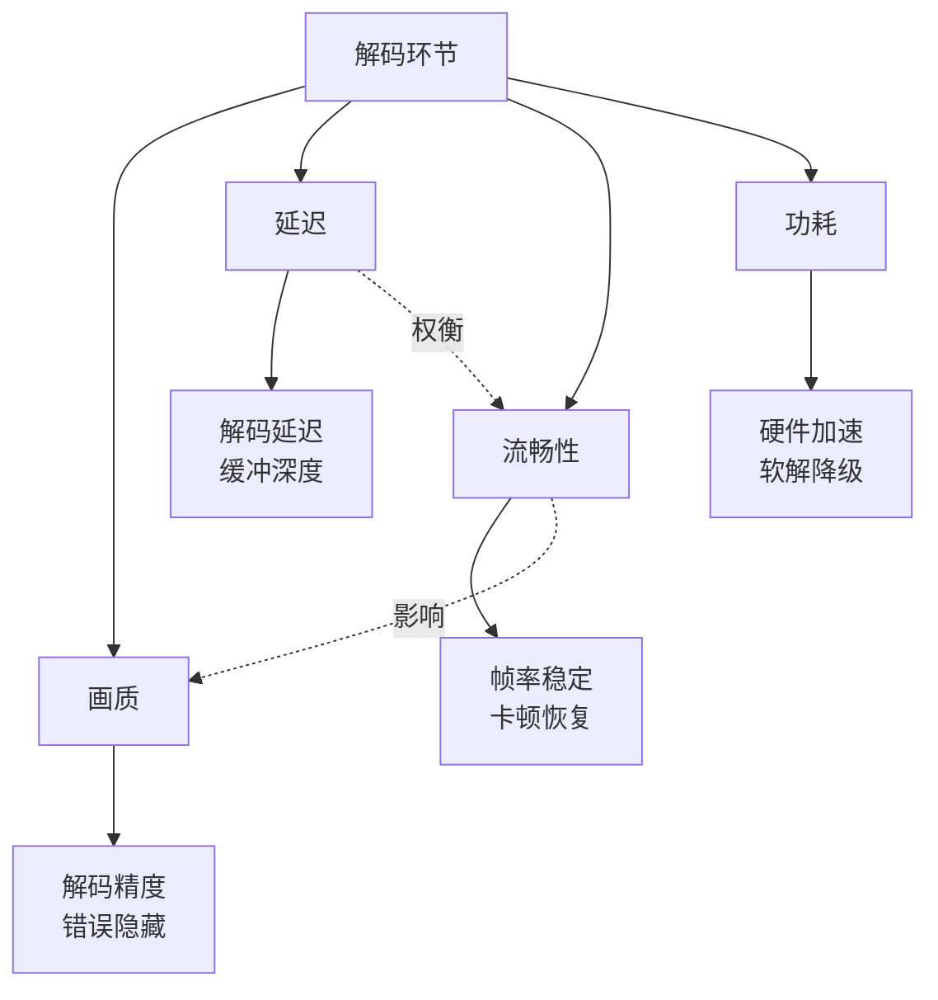
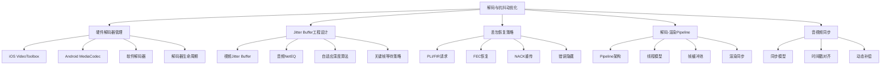
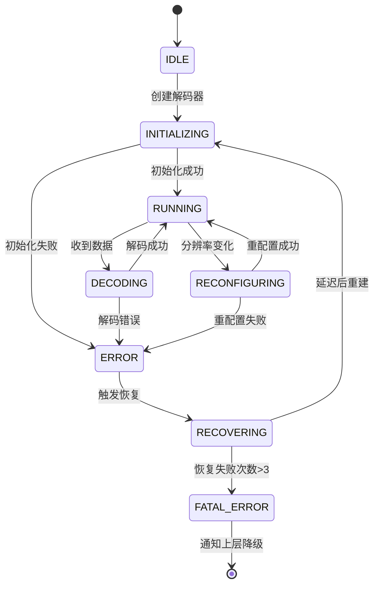

# 解码与抗抖动优化详细解析

> **TL;DR：解码与抗抖动优化的核心是在延迟与流畅性之间找到最优平衡点。硬件解码可降低70% CPU占用和50%解码延迟；Jitter Buffer是平滑网络抖动的关键枢纽，自适应深度算法是工程核心；丢包恢复策略（PLI/FIR/FEC/NACK）直接决定弱网下的画面连续性。系统化的解码器生命周期管理、Pipeline架构设计、音视频同步机制，是构建高质量播放体验的基础能力。**

---

## 核心结论（TL;DR）

**解码与抗抖动优化的本质是在延迟容忍度与播放流畅性之间实现动态平衡。**

现代音视频解码与抗抖动优化的关键支柱：

1. **硬件解码优先**：移动端必须使用硬件解码，CPU占用降低70%，延迟减少50%，同时支持直接渲染零拷贝
2. **Jitter Buffer是核心枢纽**：自适应缓冲深度算法决定了延迟与流畅性的平衡点，是工程实现的重点
3. **丢包恢复多策略协同**：PLI/FIR快速恢复、FEC预防性保护、NACK选择性重传，需根据场景组合使用
4. **Pipeline并行架构**：解码→后处理→渲染多线程并行，配合无锁队列和帧池管理，最大化吞吐量
5. **解码器容错设计**：异常检测、自动恢复、Graceful Degradation，保障播放稳定性

**一句话理解解码优化**：与其追求"最低延迟"，不如确保"可预期的稳定体验"——解码优化本质上是一种**流控与容错**的艺术。

---

## 文章导航

本文采用MECE分类法组织，系统覆盖解码与抗抖动优化的五大方向：

| 章节 | 核心内容 | 适用场景 | 优先级 |
|-----|---------|---------|-------|
| **第1章** | 解码与抗抖动优化的工程价值 | 全场景 | P0 |
| **第2章** | 解码与抗抖动优化MECE分类总览 | 全场景 | P0 |
| **第3章** | 硬件解码器管理（iOS/Android/软解） | 移动端 | P0 |
| **第4章** | Jitter Buffer工程设计 | 实时通信/直播 | P0 |
| **第5章** | 丢包恢复策略 | 弱网场景 | P0 |
| **第6章** | 解码-渲染Pipeline设计 | 全场景 | P1 |
| **第7章** | 音视频同步工程方案 | 全场景 | P1 |
| **第8章** | 监控与度量体系 | 全场景 | P1 |
| **第9章** | 最佳实践清单 | 全场景 | P0 |

---

## 第1章 Why — 解码与抗抖动优化的工程价值

### 1.1 解码环节对播放体验的直接影响

解码是音视频链路中**画质-延迟-流畅性**三角关系的关键交汇点：



**解码问题对用户体验的影响矩阵**：

| 解码问题 | 现象 | 用户感知 | 根因 | 优化方向 |
|---------|------|---------|------|---------|
| **解码延迟高** | 端到端延迟大 | 对话不同步 | 软解/缓冲过大 | 硬解优先、优化缓冲 |
| **解码卡顿** | 画面停顿 | 明显卡顿 | 解码能力不足 | 硬解、降级策略 |
| **解码花屏** | 画面破碎 | 严重质量问题 | 丢包/解码错误 | 错误恢复、关键帧请求 |
| **解码崩溃** | 播放中断 | 应用闪退 | 解码器异常 | 异常捕获、自动恢复 |
| **音画不同步** | 唇音不匹配 | 体验割裂 | 同步机制失效 | 同步算法优化 |

### 1.2 Jitter Buffer是流畅性和延迟的平衡枢纽

**Jitter Buffer的核心作用**：

```
网络抖动场景（无Jitter Buffer）：
包到达时间:  ├─0ms─┼─50ms─┼─10ms─┼─80ms─┼─20ms─┤
播放表现:     播放→停顿→快进→停顿→快进→（严重卡顿）

网络抖动场景（有Jitter Buffer）：
包到达时间:  ├─0ms─┼─50ms─┼─10ms─┼─80ms─┼─20ms─┤
缓冲等待:    [等待100ms深度]
播放表现:    →→→→→→→→→→→→→→→→→→（平滑播放）
```

**Jitter Buffer的权衡关系**：

| 缓冲深度 | 延迟增加 | 抗抖动能力 | 适用场景 |
|---------|---------|-----------|---------|
| **0ms（无缓冲）** | 0ms | 无 | 超低延迟RTC（实验室环境） |
| **50ms** | 50ms | 弱 | 实时通信（理想网络） |
| **100-200ms** | 100-200ms | 中 | 普通RTC、互动直播 |
| **300-500ms** | 300-500ms | 强 | 普通直播、弱网环境 |
| **1000ms+** | 1s+ | 很强 | 点播、高抖动网络 |

**关键洞察**：Jitter Buffer不是越大越好，需要根据业务场景和网络条件**动态调整**。

### 1.3 丢包恢复直接决定画面连续性

**丢包对视频的影响分析**：

```
GOP结构:     I----P----P----P----P----I----P----P...
             ↑                        ↑
           关键帧                    下一个关键帧

场景1: I帧丢包
影响: 整个GOP无法解码 → 画面完全丢失 → 必须等待下一个I帧
恢复时间: 平均GOP/2 (如2秒GOP，平均等待1秒)

场景2: P帧丢包
影响: 当前帧及后续参考帧错误 → 花屏/马赛克
恢复时间: 直到下一个I帧或错误隐藏生效
```

**丢包率与画质退化关系**（实测数据，H.264 720p@30fps）：

| 丢包率 | 视觉影响 | 卡顿率 | 恢复策略 |
|-------|---------|-------|---------|
| **< 1%** | 几乎无感知 | < 0.5% | FEC即可 |
| **1-3%** | 偶发卡顿 | 1-3% | FEC + NACK |
| **3-5%** | 明显卡顿 | 5-10% | FEC + NACK + 关键帧请求 |
| **5-10%** | 严重花屏 | 15-30% | 全策略 + 降码率 |
| **> 10%** | 几乎不可用 | > 50% | 降级音频通话 |

### 1.4 解码与抗抖动优化的ROI分析

**不同优化方向的投入产出比**：

| 优化方向 | 实施难度 | 预期收益 | ROI评估 | 优先级 |
|---------|---------|---------|---------|-------|
| **硬解替换软解** | 中（2周） | CPU-70%, 延迟-15ms | 极高 | P0 |
| **Jitter Buffer自适应** | 中（2周） | 卡顿-35%, 延迟可控 | 高 | P0 |
| **丢包恢复策略优化** | 中（1周） | 弱网体验+40% | 高 | P0 |
| **解码Pipeline并行** | 中（1周） | 吞吐量+30% | 中高 | P1 |
| **音视频同步优化** | 低（3天） | 同步偏差-50% | 高 | P1 |
| **解码器容错设计** | 中（1周） | 崩溃率-60% | 高 | P0 |

**关键洞察**：工程优化（硬解切换、缓冲策略、错误恢复）通常比算法优化（解码器内核改进）ROI高3-5倍，且风险更可控。

---

## 第2章 What — 解码与抗抖动优化MECE分类

### 2.1 解码与抗抖动优化全景图



### 2.2 各优化方向详解

| 优化方向 | 核心目标 | 关键技术 | 典型收益 | 实施难度 |
|---------|---------|---------|---------|---------|
| **硬件解码器管理** | 降低解码延迟和CPU占用 | 硬解优先、实例池化、异常恢复 | CPU-70%, 延迟-15ms | 中 |
| **Jitter Buffer** | 平滑网络抖动，平衡延迟 | 自适应深度、加速播放、关键帧等待 | 卡顿-35% | 中 |
| **丢包恢复** | 快速恢复画面连续性 | PLI/FIR、FEC、NACK协同 | 弱网体验+40% | 中 |
| **Pipeline设计** | 最大化解码吞吐量 | 多线程并行、无锁队列、帧池 | 吞吐量+30% | 中 |
| **音视频同步** | 消除唇音不同步 | 时间戳对齐、动态补偿 | 同步偏差-50% | 低 |
| **解码器容错** | 保障播放稳定性 | 异常检测、自动恢复、降级 | 崩溃率-60% | 中 |

### 2.3 解码链路延迟拆解

**接收端延迟分布**：

| 环节 | 理想值 | 典型值 | 劣化值 | 优化重点 |
|-----|-------|-------|-------|---------|
| **网络抖动缓冲** | 20ms | 50-100ms | 200ms+ | 自适应缓冲深度 |
| **解封装** | 1ms | 3ms | 10ms | 快速解析 |
| **帧组装** | 5ms | 10ms | 30ms | 乱序处理优化 |
| **解码延迟** | 5ms（硬解） | 10ms | 40ms（软解） | 硬解优先 |
| **后处理** | 3ms | 8ms | 20ms | GPU加速 |
| **渲染延迟** | 8ms | 16ms | 33ms | VSync对齐 |
| **同步等待** | 0ms | 5ms | 20ms | 同步算法优化 |
| **总计** | **42ms** | **102ms** | **353ms** | - |

---

## 第3章 How — 硬件解码器管理

### 3.1 iOS VideoToolbox解码

#### 3.1.1 VTDecompressionSession创建与配置

**创建流程**：

```objc
// Objective-C 示例：创建VideoToolbox解码器
#import <VideoToolbox/VideoToolbox.h>

@interface VideoDecoder : NSObject
@property (nonatomic) VTDecompressionSessionRef decompressionSession;
@property (nonatomic) CMVideoFormatDescriptionRef formatDescription;
@property (nonatomic, weak) id<VideoDecoderDelegate> delegate;
@end

@implementation VideoDecoder

- (BOOL)createDecompressionSessionWithSPS:(NSData *)sps PPS:(NSData *)pps {
    // 1. 创建视频格式描述
    const uint8_t *spsData = (const uint8_t *)sps.bytes;
    const uint8_t *ppsData = (const uint8_t *)pps.bytes;
    size_t spsSize = sps.length;
    size_t ppsSize = pps.length;
    
    const uint8_t *parameterSetPointers[2] = {spsData, ppsData};
    size_t parameterSetSizes[2] = {spsSize, ppsSize};
    
    OSStatus status = CMVideoFormatDescriptionCreateFromH264ParameterSets(
        kCFAllocatorDefault,
        2,  // 参数集数量
        parameterSetPointers,
        parameterSetSizes,
        4,  // NALU起始码长度
        &_formatDescription
    );
    
    if (status != noErr) {
        NSLog(@"Failed to create format description: %d", (int)status);
        return NO;
    }
    
    // 2. 配置解码器规格 - 启用硬件加速
    CFMutableDictionaryRef decoderSpecification = CFDictionaryCreateMutable(
        kCFAllocatorDefault, 0, &kCFTypeDictionaryKeyCallBacks, &kCFTypeDictionaryValueCallBacks);
    
    // 强制使用硬件解码
    CFDictionarySetValue(decoderSpecification,
        kVTVideoDecoderSpecification_EnableHardwareAcceleratedVideoDecoder, kCFBooleanTrue);
    
    // 3. 配置输出像素缓冲区属性
    CFMutableDictionaryRef outputImageBufferAttributes = CFDictionaryCreateMutable(
        kCFAllocatorDefault, 0, &kCFTypeDictionaryKeyCallBacks, &kCFTypeDictionaryValueCallBacks);
    
    // 设置输出像素格式 - 优先使用NV12（硬件原生支持）
    int32_t pixelFormat = kCVPixelFormatType_420YpCbCr8BiPlanarVideoRange;
    CFNumberRef pixelFormatNum = CFNumberCreate(kCFAllocatorDefault, kCFNumberSInt32Type, &pixelFormat);
    CFDictionarySetValue(outputImageBufferAttributes, kCVPixelBufferPixelFormatTypeKey, pixelFormatNum);
    CFRelease(pixelFormatNum);
    
    // 设置像素缓冲区内存分配方式 - 使用IOSurface支持零拷贝
    CFDictionarySetValue(outputImageBufferAttributes,
        kCVPixelBufferIOSurfacePropertiesKey, kCFBooleanTrue);
    
    // 4. 创建解压会话
    VTDecompressionOutputCallbackRecord callbackRecord;
    callbackRecord.decompressionOutputCallback = decompressionOutputCallback;
    callbackRecord.decompressionOutputRefCon = (__bridge void *)self;
    
    status = VTDecompressionSessionCreate(
        kCFAllocatorDefault,
        self.formatDescription,
        decoderSpecification,
        outputImageBufferAttributes,
        &callbackRecord,
        &_decompressionSession
    );
    
    CFRelease(decoderSpecification);
    CFRelease(outputImageBufferAttributes);
    
    if (status != noErr) {
        NSLog(@"Failed to create decompression session: %d", (int)status);
        return NO;
    }
    
    return YES;
}

// 解码输出回调
static void decompressionOutputCallback(void *decompressionOutputRefCon,
                                        void *sourceFrameRefCon,
                                        OSStatus status,
                                        VTDecodeInfoFlags infoFlags,
                                        CVImageBufferRef imageBuffer,
                                        CMTime presentationTimeStamp,
                                        CMTime presentationDuration) {
    if (status != noErr || !imageBuffer) {
        NSLog(@"Decoding error: %d", (int)status);
        return;
    }
    
    VideoDecoder *decoder = (__bridge VideoDecoder *)decompressionOutputRefCon;
    
    // 获取解码后的CVPixelBuffer
    CVPixelBufferRef pixelBuffer = (CVPixelBufferRef)imageBuffer;
    
    // 直接渲染或回调给上层
    [decoder.delegate decoder:decoder didOutputPixelBuffer:pixelBuffer 
         presentationTimeStamp:presentationTimeStamp];
}

@end
```

**Swift版本**：

```swift
import VideoToolbox
import CoreMedia
import CoreVideo

class VideoDecoder {
    private var decompressionSession: VTDecompressionSession?
    private var formatDescription: CMVideoFormatDescription?
    weak var delegate: VideoDecoderDelegate?
    
    func createDecompressionSession(sps: Data, pps: Data) -> Bool {
        // 1. 创建视频格式描述
        let spsPointer = [UInt8](sps)
        let ppsPointer = [UInt8](pps)
        
        var formatDesc: CMVideoFormatDescription?
        let parameterPointers: [UnsafePointer<UInt8>] = [
            UnsafePointer(spsPointer),
            UnsafePointer(ppsPointer)
        ]
        let parameterSizes: [Int] = [sps.count, pps.count]
        
        let status = CMVideoFormatDescriptionCreateFromH264ParameterSets(
            allocator: kCFAllocatorDefault,
            parameterSetCount: 2,
            parameterSetPointers: parameterPointers,
            parameterSetSizes: parameterSizes,
            nalUnitHeaderLength: 4,
            formatDescriptionOut: &formatDesc
        )
        
        guard status == noErr, let format = formatDesc else {
            print("Failed to create format description: \(status)")
            return false
        }
        self.formatDescription = format
        
        // 2. 配置解码器规格
        let decoderSpecification: [String: Any] = [
            kVTVideoDecoderSpecification_EnableHardwareAcceleratedVideoDecoder as String: true,
            kVTVideoDecoderSpecification_RequireHardwareAcceleratedVideoDecoder as String: false
        ]
        
        // 3. 配置输出属性
        let outputAttributes: [String: Any] = [
            kCVPixelBufferPixelFormatTypeKey as String: Int32(kCVPixelFormatType_420YpCbCr8BiPlanarVideoRange),
            kCVPixelBufferIOSurfacePropertiesKey as String: true
        ]
        
        // 4. 创建解压会话
        var session: VTDecompressionSession?
        let callback = VTDecompressionOutputCallbackRecord(
            decompressionOutputCallback: { refCon, _, status, _, imageBuffer, pts, _ in
                guard status == noErr, let buffer = imageBuffer else {
                    print("Decoding error: \(status)")
                    return
                }
                
                let decoder = Unmanaged<VideoDecoder>.fromOpaque(refCon!).takeUnretainedValue()
                decoder.delegate?.decoder(decoder, didOutputPixelBuffer: buffer, presentationTimeStamp: pts)
            },
            decompressionOutputRefCon: Unmanaged.passUnretained(self).toOpaque()
        )
        
        let createStatus = VTDecompressionSessionCreate(
            allocator: kCFAllocatorDefault,
            formatDescription: format,
            decoderSpecification: decoderSpecification as CFDictionary,
            imageBufferAttributes: outputAttributes as CFDictionary,
            outputCallback: &callback,
            decompressionSessionOut: &session
        )
        
        guard createStatus == noErr else {
            print("Failed to create decompression session: \(createStatus)")
            return false
        }
        
        self.decompressionSession = session
        return true
    }
    
    func decodeFrame(nalData: Data, timestamp: CMTime) {
        guard let session = decompressionSession else { return }
        
        // 创建CMBlockBuffer
        var blockBuffer: CMBlockBuffer?
        let dataPointer = UnsafeMutablePointer<UInt8>.allocate(capacity: nalData.count)
        nalData.copyBytes(to: dataPointer, count: nalData.count)
        
        let status = CMBlockBufferCreateWithMemoryBlock(
            allocator: kCFAllocatorDefault,
            memoryBlock: dataPointer,
            blockLength: nalData.count,
            blockAllocator: nil,
            customBlockSource: nil,
            offsetToData: 0,
            dataLength: nalData.count,
            flags: 0,
            blockBufferOut: &blockBuffer
        )
        
        guard status == noErr, let buffer = blockBuffer else {
            dataPointer.deallocate()
            return
        }
        
        // 创建CMSampleBuffer
        var sampleBuffer: CMSampleBuffer?
        let sampleStatus = CMSampleBufferCreate(
            allocator: kCFAllocatorDefault,
            dataBuffer: buffer,
            dataReady: true,
            makeDataReadyCallback: nil,
            refcon: nil,
            formatDescription: formatDescription,
            sampleCount: 1,
            sampleTimingEntryCount: 1,
            sampleTimingArray: &timestamp,
            sampleSizeEntryCount: 1,
            sampleSizeArray: [nalData.count],
            sampleBufferOut: &sampleBuffer
        )
        
        guard sampleStatus == noErr, let sample = sampleBuffer else {
            return
        }
        
        // 提交解码
        VTDecompressionSessionDecodeFrame(
            session,
            sampleBuffer: sample,
            flags: [._EnableAsynchronousDecompression],
            frameRefcon: nil,
            infoFlagsOut: nil
        )
    }
}

protocol VideoDecoderDelegate: AnyObject {
    func decoder(_ decoder: VideoDecoder, didOutputPixelBuffer pixelBuffer: CVPixelBuffer, 
                 presentationTimeStamp: CMTime)
}
```

#### 3.1.2 异步解码回调处理

**异步解码模式的优势**：

| 模式 | 延迟 | CPU占用 | 吞吐量 | 适用场景 |
|-----|------|--------|-------|---------|
| **同步解码** | 可预测 | 高 | 低 | 简单场景 |
| **异步解码** | 略不可控 | 低 | 高 | 高性能场景 |

**异步解码最佳实践**：

```objc
@interface VideoDecoder ()
@property (nonatomic, strong) dispatch_queue_t decodeQueue;
@property (nonatomic, assign) int32_t pendingFrames;
@property (nonatomic, assign) int32_t maxPendingFrames;
@end

@implementation VideoDecoder

- (instancetype)init {
    self = [super init];
    if (self) {
        // 创建专用解码队列
        _decodeQueue = dispatch_queue_create("com.example.videodecoder", DISPATCH_QUEUE_SERIAL);
        _maxPendingFrames = 3;  // 最大待解码帧数
    }
    return self;
}

- (void)decodeFrame:(NSData *)nalData timestamp:(CMTime)timestamp {
    // 流量控制 - 避免解码队列积压
    if (self.pendingFrames >= self.maxPendingFrames) {
        NSLog(@"Decoder queue full, dropping frame");
        return;
    }
    
    OSAtomicIncrement32(&_pendingFrames);
    
    dispatch_async(self.decodeQueue, ^{
        // 执行解码
        [self decodeFrameInternal:nalData timestamp:timestamp];
    });
}

static void decompressionOutputCallback(void *decompressionOutputRefCon,
                                        void *sourceFrameRefCon,
                                        OSStatus status,
                                        VTDecodeInfoFlags infoFlags,
                                        CVImageBufferRef imageBuffer,
                                        CMTime presentationTimeStamp,
                                        CMTime presentationDuration) {
    VideoDecoder *decoder = (__bridge VideoDecoder *)decompressionOutputRefCon;
    OSAtomicDecrement32(&decoder->_pendingFrames);
    
    if (status != noErr) {
        [decoder handleDecodeError:status];
        return;
    }
    
    // 检查是否为硬件解码
    BOOL isHardwareDecoded = (infoFlags & kVTDecodeInfo_Asynchronous) != 0;
    
    // 获取CVPixelBuffer
    CVPixelBufferRef pixelBuffer = (CVPixelBufferRef)imageBuffer;
    
    // 直接渲染或传递
    dispatch_async(dispatch_get_main_queue(), ^{
        [decoder.delegate decoder:decoder didOutputPixelBuffer:pixelBuffer 
             presentationTimeStamp:presentationTimeStamp
                    isHardwareDecoded:isHardwareDecoded];
    });
}

@end
```

#### 3.1.3 解码器异常检测与自动恢复

**常见解码错误码处理**：

| 错误码 | 含义 | 处理策略 |
|-------|------|---------|
| `kVTVideoDecoderBadDataErr` (-12910) | 数据损坏 | 请求关键帧，丢弃损坏帧 |
| `kVTVideoDecoderMalfunctionErr` (-12911) | 解码器故障 | 重建解码器 |
| `kVTVideoDecoderDecoderFailedErr` (-12909) | 解码失败 | 重建解码器 |
| `kVTVideoDecoderUnknownErr` (-12908) | 未知错误 | 重建解码器 |
| `kVTVideoDecoderExtensionNotFoundErr` (-12912) | 扩展不支持 | 降级到软解 |

**异常恢复实现**：

```objc
@interface VideoDecoder ()
@property (nonatomic, assign) int consecutiveErrors;
@property (nonatomic, assign) BOOL isRecovering;
@property (nonatomic, strong) NSData *savedSPS;
@property (nonatomic, strong) NSData *savedPPS;
@end

@implementation VideoDecoder

- (void)handleDecodeError:(OSStatus)error {
    self.consecutiveErrors++;
    NSLog(@"Decode error: %d, consecutive: %d", (int)error, self.consecutiveErrors);
    
    // 根据错误类型处理
    switch (error) {
        case kVTVideoDecoderBadDataErr:
            // 数据错误，请求关键帧
            [self requestKeyFrame];
            break;
            
        case kVTVideoDecoderMalfunctionErr:
        case kVTVideoDecoderDecoderFailedErr:
            // 解码器故障，需要重建
            if (self.consecutiveErrors >= 3) {
                [self recoverDecoder];
            }
            break;
            
        default:
            if (self.consecutiveErrors >= 5) {
                [self recoverDecoder];
            }
            break;
    }
}

- (void)recoverDecoder {
    if (self.isRecovering) return;
    self.isRecovering = YES;
    
    NSLog(@"Starting decoder recovery...");
    
    // 1. 销毁旧解码器
    [self destroyDecoder];
    
    // 2. 延迟后重建
    dispatch_after(dispatch_time(DISPATCH_TIME_NOW, (int64_t)(0.5 * NSEC_PER_SEC)), 
                   dispatch_get_global_queue(DISPATCH_QUEUE_PRIORITY_DEFAULT, 0), ^{
        // 3. 重新创建解码器
        BOOL success = [self createDecompressionSessionWithSPS:self.savedSPS PPS:self.savedPPS];
        
        if (success) {
            self.consecutiveErrors = 0;
            self.isRecovering = NO;
            NSLog(@"Decoder recovered successfully");
            
            // 请求关键帧以快速恢复画面
            [self requestKeyFrame];
        } else {
            // 恢复失败，通知上层
            [self.delegate decoderDidFailRecovery:self];
        }
    });
}

- (void)destroyDecoder {
    if (self.decompressionSession) {
        VTDecompressionSessionInvalidate(self.decompressionSession);
        CFRelease(self.decompressionSession);
        self.decompressionSession = NULL;
    }
    if (self.formatDescription) {
        CFRelease(self.formatDescription);
        self.formatDescription = NULL;
    }
}

@end
```

#### 3.1.4 解码输出CVPixelBuffer的直接渲染

**零拷贝渲染方案**：

```objc
// 直接渲染CVPixelBuffer到MTLTexture（Metal渲染）
- (id<MTLTexture>)textureFromPixelBuffer:(CVPixelBufferRef)pixelBuffer {
    CVMetalTextureRef cvTexture = NULL;
    size_t width = CVPixelBufferGetWidth(pixelBuffer);
    size_t height = CVPixelBufferGetHeight(pixelBuffer);
    
    // 创建CVMetalTexture
    CVMetalTextureCacheCreateTextureFromImage(
        kCFAllocatorDefault,
        self.textureCache,
        pixelBuffer,
        NULL,
        MTLPixelFormatBGRA8Unorm,
        width,
        height,
        0,
        &cvTexture
    );
    
    id<MTLTexture> texture = CVMetalTextureGetTexture(cvTexture);
    
    // 注意：cvTexture需要在渲染完成后释放
    // CFRelease(cvTexture);
    
    return texture;
}

// 直接渲染CVPixelBuffer到OpenGL ES纹理
- (GLuint)glTextureFromPixelBuffer:(CVPixelBufferRef)pixelBuffer {
    CVOpenGLESTextureRef cvTexture = NULL;
    size_t width = CVPixelBufferGetWidth(pixelBuffer);
    size_t height = CVPixelBufferGetHeight(pixelBuffer);
    
    // 创建CVOpenGLESTexture
    CVOpenGLESTextureCacheCreateTextureFromImage(
        kCFAllocatorDefault,
        self.glTextureCache,
        pixelBuffer,
        NULL,
        GL_TEXTURE_2D,
        GL_RGBA,
        (GLsizei)width,
        (GLsizei)height,
        GL_BGRA,
        GL_UNSIGNED_BYTE,
        0,
        &cvTexture
    );
    
    GLuint texture = CVOpenGLESTextureGetName(cvTexture);
    
    // 配置纹理参数
    glBindTexture(GL_TEXTURE_2D, texture);
    glTexParameteri(GL_TEXTURE_2D, GL_TEXTURE_MIN_FILTER, GL_LINEAR);
    glTexParameteri(GL_TEXTURE_2D, GL_TEXTURE_MAG_FILTER, GL_LINEAR);
    glTexParameteri(GL_TEXTURE_2D, GL_TEXTURE_WRAP_S, GL_CLAMP_TO_EDGE);
    glTexParameteri(GL_TEXTURE_2D, GL_TEXTURE_WRAP_T, GL_CLAMP_TO_EDGE);
    
    return texture;
}
```

---

### 3.2 Android MediaCodec解码

#### 3.2.1 异步模式解码最佳实践

**异步模式创建与配置**：

```kotlin
// Kotlin 示例：MediaCodec异步解码
class VideoDecoder {
    private var mediaCodec: MediaCodec? = null
    private var surface: Surface? = null
    private var handlerThread: HandlerThread? = null
    private var handler: Handler? = null
    
    companion object {
        private const val MIME_TYPE_H264 = "video/avc"
        private const val MIME_TYPE_H265 = "video/hevc"
        private const val TAG = "VideoDecoder"
        private const val MAX_INPUT_BUFFERS = 8
    }
    
    fun initialize(width: Int, height: Int, surface: Surface): Boolean {
        this.surface = surface
        
        return try {
            // 创建MediaCodec
            mediaCodec = MediaCodec.createDecoderByType(MIME_TYPE_H264)
            
            // 配置格式
            val format = MediaFormat.createVideoFormat(MIME_TYPE_H264, width, height)
            
            // 异步模式需要API 21+
            if (Build.VERSION.SDK_INT >= Build.VERSION_CODES.LOLLIPOP) {
                setupAsyncMode()
            }
            
            // 配置解码器
            mediaCodec?.configure(format, surface, null, 0)
            mediaCodec?.start()
            
            true
        } catch (e: Exception) {
            Log.e(TAG, "Failed to initialize decoder", e)
            false
        }
    }
    
    @RequiresApi(Build.VERSION_CODES.LOLLIPOP)
    private fun setupAsyncMode() {
        // 创建HandlerThread用于回调
        handlerThread = HandlerThread("DecoderCallback").apply { start() }
        handler = Handler(handlerThread!!.looper)
        
        mediaCodec?.setCallback(object : MediaCodec.Callback() {
            override fun onInputBufferAvailable(codec: MediaCodec, index: Int) {
                // 输入缓冲区可用，等待数据填入
                onInputBufferAvailable(index)
            }
            
            override fun onOutputBufferAvailable(codec: MediaCodec, index: Int, info: MediaCodec.BufferInfo) {
                // 输出缓冲区可用（Surface模式下自动渲染）
                codec.releaseOutputBuffer(index, info.presentationTimeUs * 1000)
            }
            
            override fun onError(codec: MediaCodec, e: MediaCodec.CodecException) {
                Log.e(TAG, "Codec error", e)
                handleDecoderError(e)
            }
            
            override fun onOutputFormatChanged(codec: MediaCodec, format: MediaFormat) {
                Log.i(TAG, "Output format changed: $format")
                // 获取输出格式信息
                val outputWidth = format.getInteger(MediaFormat.KEY_WIDTH)
                val outputHeight = format.getInteger(MediaFormat.KEY_HEIGHT)
                Log.i(TAG, "Output resolution: ${outputWidth}x${outputHeight}")
            }
        }, handler)
    }
    
    private val pendingInputs = ConcurrentLinkedQueue<DecodeTask>()
    
    data class DecodeTask(
        val data: ByteArray,
        val pts: Long,
        val flags: Int
    )
    
    fun queueInputBuffer(data: ByteArray, pts: Long, flags: Int = 0) {
        if (Build.VERSION.SDK_INT >= Build.VERSION_CODES.LOLLIPOP) {
            // 异步模式：加入队列等待回调处理
            pendingInputs.offer(DecodeTask(data, pts, flags))
        } else {
            // 同步模式：直接处理
            syncQueueInputBuffer(data, pts, flags)
        }
    }
    
    private fun onInputBufferAvailable(index: Int) {
        val task = pendingInputs.poll() ?: return
        
        try {
            val inputBuffer = mediaCodec?.getInputBuffer(index) ?: return
            inputBuffer.clear()
            inputBuffer.put(task.data)
            
            mediaCodec?.queueInputBuffer(
                index,
                0,
                task.data.size,
                task.pts,
                task.flags
            )
        } catch (e: Exception) {
            Log.e(TAG, "Error queuing input buffer", e)
        }
    }
    
    // 同步模式输入
    private fun syncQueueInputBuffer(data: ByteArray, pts: Long, flags: Int) {
        try {
            val timeoutUs = 10000L // 10ms
            val inputBufferId = mediaCodec?.dequeueInputBuffer(timeoutUs) ?: return
            
            val inputBuffer = mediaCodec?.getInputBuffer(inputBufferId) ?: return
            inputBuffer.clear()
            inputBuffer.put(data)
            
            mediaCodec?.queueInputBuffer(inputBufferId, 0, data.size, pts, flags)
        } catch (e: Exception) {
            Log.e(TAG, "Error in sync queue input", e)
        }
    }
}
```

**Java版本**：

```java
// Java 示例：MediaCodec异步解码完整实现
public class VideoDecoder {
    private MediaCodec mediaCodec;
    private HandlerThread handlerThread;
    private Handler handler;
    private Surface surface;
    
    private static final String MIME_TYPE = "video/avc";
    private static final String TAG = "VideoDecoder";
    
    public boolean initialize(int width, int height, Surface surface) {
        this.surface = surface;
        
        try {
            mediaCodec = MediaCodec.createDecoderByType(MIME_TYPE);
            MediaFormat format = MediaFormat.createVideoFormat(MIME_TYPE, width, height);
            
            // 设置异步回调
            if (Build.VERSION.SDK_INT >= Build.VERSION_CODES.LOLLIPOP) {
                setupAsyncCallback();
            }
            
            mediaCodec.configure(format, surface, null, 0);
            mediaCodec.start();
            return true;
            
        } catch (Exception e) {
            Log.e(TAG, "Failed to initialize decoder", e);
            return false;
        }
    }
    
    @RequiresApi(api = Build.VERSION_CODES.LOLLIPOP)
    private void setupAsyncCallback() {
        handlerThread = new HandlerThread("DecoderCallback");
        handlerThread.start();
        handler = new Handler(handlerThread.getLooper());
        
        mediaCodec.setCallback(new MediaCodec.Callback() {
            @Override
            public void onInputBufferAvailable(MediaCodec codec, int index) {
                // 输入缓冲区可用
            }
            
            @Override
            public void onOutputBufferAvailable(MediaCodec codec, int index, MediaCodec.BufferInfo info) {
                // Surface模式下，releaseOutputBuffer会触发渲染
                codec.releaseOutputBuffer(index, true);
            }
            
            @Override
            public void onError(MediaCodec codec, MediaCodec.CodecException e) {
                Log.e(TAG, "Codec error", e);
                handleDecoderError(e);
            }
            
            @Override
            public void onOutputFormatChanged(MediaCodec codec, MediaFormat format) {
                Log.i(TAG, "Output format changed: " + format);
            }
        }, handler);
    }
    
    public void release() {
        try {
            mediaCodec.stop();
            mediaCodec.release();
        } catch (Exception e) {
            Log.w(TAG, "Error releasing decoder", e);
        }
        
        if (handlerThread != null) {
            handlerThread.quitSafely();
        }
    }
}
```

#### 3.2.2 Surface直接输出渲染（Zero-copy）

**Surface模式配置**：

```kotlin
class SurfaceDecoder {
    private var mediaCodec: MediaCodec? = null
    private var surface: Surface? = null
    private var textureRenderer: TextureRenderer? = null
    
    fun initialize(width: Int, height: Int, outputSurface: Surface) {
        this.surface = outputSurface
        
        val format = MediaFormat.createVideoFormat("video/avc", width, height)
        
        mediaCodec = MediaCodec.createDecoderByType("video/avc")
        
        // Surface模式配置 - 输出直接渲染到Surface
        mediaCodec?.configure(format, outputSurface, null, 0)
        mediaCodec?.start()
    }
    
    // 输入数据解码，输出自动渲染到Surface
    fun decode(nalData: ByteArray, pts: Long) {
        val timeoutUs = 10000L
        val inputBufferId = mediaCodec?.dequeueInputBuffer(timeoutUs) ?: -1
        
        if (inputBufferId >= 0) {
            val inputBuffer = mediaCodec?.getInputBuffer(inputBufferId)
            inputBuffer?.clear()
            inputBuffer?.put(nalData)
            
            mediaCodec?.queueInputBuffer(inputBufferId, 0, nalData.size, pts, 0)
        }
        
        // 处理输出 - Surface模式下输出缓冲区包含渲染指令
        val bufferInfo = MediaCodec.BufferInfo()
        val outputBufferId = mediaCodec?.dequeueOutputBuffer(bufferInfo, timeoutUs) ?: -1
        
        when {
            outputBufferId >= 0 -> {
                // Surface模式：releaseOutputBuffer触发渲染
                // render=true表示立即渲染
                mediaCodec?.releaseOutputBuffer(outputBufferId, true)
            }
            outputBufferId == MediaCodec.INFO_OUTPUT_FORMAT_CHANGED -> {
                val outputFormat = mediaCodec?.outputFormat
                Log.i(TAG, "Output format: $outputFormat")
            }
        }
    }
}
```

#### 3.2.3 解码器实例池化管理

**多路解码场景下的池化管理**：

```kotlin
class DecoderPool {
    private val availableDecoders = ConcurrentLinkedQueue<PooledDecoder>()
    private val activeDecoders = ConcurrentHashMap<String, PooledDecoder>()
    private val maxPoolSize = 4
    
    data class PooledDecoder(
        val decoderId: String,
        val mediaCodec: MediaCodec,
        var lastUsedTime: Long,
        var isAvailable: Boolean = true
    )
    
    fun acquireDecoder(streamId: String, width: Int, height: Int): MediaCodec? {
        // 检查是否已有该流的解码器
        activeDecoders[streamId]?.let { pooled ->
            return pooled.mediaCodec
        }
        
        // 从池中获取可用解码器
        val pooled = availableDecoders.poll()
        
        return if (pooled != null) {
            // 复用现有解码器
            reconfigureDecoder(pooled.mediaCodec, width, height)
            pooled.lastUsedTime = System.currentTimeMillis()
            pooled.isAvailable = false
            activeDecoders[streamId] = pooled
            pooled.mediaCodec
        } else {
            // 创建新解码器
            if (activeDecoders.size + availableDecoders.size >= maxPoolSize) {
                // 池已满，回收最久未使用的
                recycleOldestDecoder()
            }
            createNewDecoder(streamId, width, height)
        }
    }
    
    fun releaseDecoder(streamId: String) {
        activeDecoders.remove(streamId)?.let { pooled ->
            pooled.isAvailable = true
            pooled.lastUsedTime = System.currentTimeMillis()
            availableDecoders.offer(pooled)
        }
    }
    
    private fun createNewDecoder(streamId: String, width: Int, height: Int): MediaCodec? {
        return try {
            val codec = MediaCodec.createDecoderByType("video/avc")
            val format = MediaFormat.createVideoFormat("video/avc", width, height)
            codec.configure(format, null, null, 0)
            codec.start()
            
            val pooled = PooledDecoder(
                decoderId = UUID.randomUUID().toString(),
                mediaCodec = codec,
                lastUsedTime = System.currentTimeMillis(),
                isAvailable = false
            )
            activeDecoders[streamId] = pooled
            codec
        } catch (e: Exception) {
            Log.e(TAG, "Failed to create decoder", e)
            null
        }
    }
    
    private fun reconfigureDecoder(codec: MediaCodec, width: Int, height: Int) {
        try {
            codec.stop()
            val format = MediaFormat.createVideoFormat("video/avc", width, height)
            codec.configure(format, null, null, 0)
            codec.start()
        } catch (e: Exception) {
            Log.e(TAG, "Failed to reconfigure decoder", e)
        }
    }
    
    private fun recycleOldestDecoder() {
        val oldest = availableDecoders.minByOrNull { it.lastUsedTime }
        oldest?.let {
            availableDecoders.remove(it)
            try {
                it.mediaCodec.release()
            } catch (e: Exception) {
                Log.w(TAG, "Error releasing decoder", e)
            }
        }
    }
}
```

#### 3.2.4 不同厂商兼容性问题

**厂商差异汇总**：

| 厂商 | 常见问题 | 解决方案 |
|-----|---------|---------|
| **华为(Huawei)** | 部分机型H.265解码花屏 | 降级到H.264 |
| **高通(Qualcomm)** | 某些旧机型解码延迟高 | 使用低延迟配置 |
| **联发科(MTK)** | 解码器偶尔崩溃 | 异常捕获 + 自动恢复 |
| **三星(Samsung)** | Exynos与Snapdragon差异大 | 分别测试，差异化配置 |
| **小米(Xiaomi)** | 部分机型Surface模式异常 | 回退到ByteBuffer模式 |
| **OPPO/vivo** | 自定义ROM兼容性问题 | 白名单机制 |

**兼容性处理代码**：

```kotlin
class DecoderCompatibilityHelper {
    
    enum class DecoderQuirk {
        SURFACE_MODE_UNSTABLE,    // Surface模式不稳定
        H265_DECODING_BROKEN,     // H.265解码损坏
        DELAY_VARIATION,          // 延迟变化大
        CRASH_ON_RECONFIGURE,     // 重配置崩溃
        OUTPUT_FORMAT_CHANGE_BUG  // 格式变化Bug
    }
    
    // 已知问题机型列表
    private val problematicDevices = mapOf(
        "HUAWEI MLA-AL10" to setOf(DecoderQuirk.H265_DECODING_BROKEN),
        "Xiaomi MI 5" to setOf(DecoderQuirk.CRASH_ON_RECONFIGURE),
        "OPPO R9" to setOf(DecoderQuirk.SURFACE_MODE_UNSTABLE),
        "samsung SM-G9300" to setOf(DecoderQuirk.DELAY_VARIATION)
    )
    
    fun getDeviceQuirks(): Set<DecoderQuirk> {
        return problematicDevices[Build.MODEL] ?: emptySet()
    }
    
    fun shouldUseSurfaceMode(): Boolean {
        return DecoderQuirk.SURFACE_MODE_UNSTABLE !in getDeviceQuirks()
    }
    
    fun shouldAvoidH265(): Boolean {
        return DecoderQuirk.H265_DECODING_BROKEN in getDeviceQuirks()
    }
    
    fun shouldAvoidReconfigure(): Boolean {
        return DecoderQuirk.CRASH_ON_RECONFIGURE in getDeviceQuirks()
    }
    
    // 安全重配置
    fun safeReconfigure(codec: MediaCodec?, format: MediaFormat, surface: Surface?): Boolean {
        if (shouldAvoidReconfigure()) {
            // 避免重配置，直接重建
            return false
        }
        
        return try {
            codec?.stop()
            codec?.configure(format, surface, null, 0)
            codec?.start()
            true
        } catch (e: Exception) {
            Log.e(TAG, "Reconfigure failed", e)
            false
        }
    }
}
```

#### 3.2.5 MediaCodec reset vs release的选择

**两种恢复策略对比**：

| 策略 | 耗时 | 资源占用 | 适用场景 |
|-----|------|---------|---------|
| **reset()** | 50-100ms | 保持分配 | 分辨率变化、格式变化 |
| **release() + create()** | 100-300ms | 完全释放 | 严重错误、内存压力 |

**选择策略**：

```kotlin
class DecoderRecoveryManager {
    
    fun recoverDecoder(codec: MediaCodec?, error: Exception, severity: ErrorSeverity): MediaCodec? {
        return when (severity) {
            ErrorSeverity.LIGHT -> {
                // 轻量错误，尝试reset
                tryReset(codec)
            }
            ErrorSeverity.MEDIUM -> {
                // 中等错误，尝试stop/configure/start
                tryReconfigure(codec)
            }
            ErrorSeverity.SEVERE -> {
                // 严重错误，完全重建
                recreateDecoder()
            }
        }
    }
    
    private fun tryReset(codec: MediaCodec?): MediaCodec? {
        return try {
            codec?.reset()
            codec
        } catch (e: Exception) {
            Log.w(TAG, "Reset failed, trying reconfigure", e)
            tryReconfigure(codec)
        }
    }
    
    private fun tryReconfigure(codec: MediaCodec?): MediaCodec? {
        return try {
            codec?.stop()
            // 重新configure和start在调用方处理
            codec
        } catch (e: Exception) {
            Log.w(TAG, "Reconfigure failed, recreating decoder", e)
            recreateDecoder()
        }
    }
    
    private fun recreateDecoder(): MediaCodec? {
        return try {
            MediaCodec.createDecoderByType("video/avc")
        } catch (e: Exception) {
            Log.e(TAG, "Failed to recreate decoder", e)
            null
        }
    }
    
    enum class ErrorSeverity {
        LIGHT,    // 轻微错误，如单帧解码失败
        MEDIUM,   // 中等错误，如格式不匹配
        SEVERE    // 严重错误，如解码器崩溃
    }
}
```

---

### 3.3 软件解码器

#### 3.3.1 FFmpeg/libavcodec集成

**FFmpeg软解封装**：

```cpp
// FFmpeg软解封装示例
extern "C" {
#include <libavcodec/avcodec.h>
#include <libavformat/avformat.h>
#include <libavutil/imgutils.h>
#include <libavutil/opt.h>
}

class FFmpegDecoder {
private:
    AVCodecContext* codecContext = nullptr;
    AVFrame* frame = nullptr;
    AVPacket* packet = nullptr;
    const AVCodec* codec = nullptr;
    
public:
    bool initialize(AVCodecID codecId, int width, int height) {
        // 查找解码器
        codec = avcodec_find_decoder(codecId);
        if (!codec) {
            fprintf(stderr, "Codec not found\n");
            return false;
        }
        
        codecContext = avcodec_alloc_context3(codec);
        if (!codecContext) {
            fprintf(stderr, "Could not allocate video codec context\n");
            return false;
        }
        
        // 配置解码参数
        codecContext->width = width;
        codecContext->height = height;
        codecContext->pix_fmt = AV_PIX_FMT_YUV420P;
        
        // 多线程解码配置
        codecContext->thread_count = 4;  // 使用4线程
        codecContext->thread_type = FF_THREAD_FRAME;  // 帧级并行
        
        // 低延迟配置
        av_opt_set(codecContext->priv_data, "tune", "zerolatency", 0);
        
        // 打开解码器
        if (avcodec_open2(codecContext, codec, nullptr) < 0) {
            fprintf(stderr, "Could not open codec\n");
            return false;
        }
        
        frame = av_frame_alloc();
        packet = av_packet_alloc();
        
        return true;
    }
    
    bool decodeFrame(const uint8_t* data, int size, int64_t pts,
                     std::function<void(AVFrame*)> onFrame) {
        // 填充packet
        packet->data = const_cast<uint8_t*>(data);
        packet->size = size;
        packet->pts = pts;
        
        // 发送packet到解码器
        int ret = avcodec_send_packet(codecContext, packet);
        if (ret < 0) {
            fprintf(stderr, "Error sending packet for decoding\n");
            return false;
        }
        
        // 接收解码后的帧
        while (ret >= 0) {
            ret = avcodec_receive_frame(codecContext, frame);
            if (ret == AVERROR(EAGAIN) || ret == AVERROR_EOF) {
                break;
            } else if (ret < 0) {
                fprintf(stderr, "Error during decoding\n");
                return false;
            }
            
            // 处理解码后的帧
            onFrame(frame);
        }
        
        return true;
    }
    
    ~FFmpegDecoder() {
        avcodec_free_context(&codecContext);
        av_frame_free(&frame);
        av_packet_free(&packet);
    }
};
```

#### 3.3.2 多线程解码配置

**线程配置策略**：

| 配置 | 线程数 | 延迟 | CPU占用 | 适用场景 |
|-----|-------|------|--------|---------|
| **单线程** | 1 | 低 | 低 | 低分辨率、低延迟 |
| **帧级并行** | 4-8 | 中 | 高 | 高分辨率 |
| **切片级并行** | 4-8 | 低 | 高 | 需要低延迟的高分辨率 |

```cpp
// 多线程解码配置
void configureMultiThreadDecoding(AVCodecContext* ctx, int threadCount) {
    // 帧级并行 - 适合高延迟容忍场景
    ctx->thread_count = threadCount;
    ctx->thread_type = FF_THREAD_FRAME;
    
    // 切片级并行 - 适合低延迟场景
    // ctx->thread_type = FF_THREAD_SLICE;
}
```

#### 3.3.3 软解码在低端设备的降级策略

**降级策略**：

```kotlin
class AdaptiveDecoder {
    private var hardwareDecoder: VideoDecoder? = null
    private var softwareDecoder: FFmpegDecoder? = null
    private var currentDecoder: DecoderType = DecoderType.HARDWARE
    
    enum class DecoderType {
        HARDWARE,
        SOFTWARE
    }
    
    fun initialize(width: Int, height: Int, surface: Surface) {
        // 检测设备性能
        val isLowEndDevice = isLowEndDevice()
        
        if (isLowEndDevice) {
            // 低端设备直接使用软解（硬解可能更慢或不稳定）
            currentDecoder = DecoderType.SOFTWARE
            softwareDecoder = createSoftwareDecoder(width, height)
        } else {
            // 先尝试硬解
            hardwareDecoder = VideoDecoder()
            val success = hardwareDecoder?.initialize(width, height, surface) ?: false
            
            currentDecoder = if (success) {
                DecoderType.HARDWARE
            } else {
                // 硬解失败，降级到软解
                softwareDecoder = createSoftwareDecoder(width, height)
                DecoderType.SOFTWARE
            }
        }
    }
    
    private fun isLowEndDevice(): Boolean {
        val cpuCount = Runtime.getRuntime().availableProcessors()
        val memoryMB = getAvailableMemoryMB()
        
        // 2核以下或内存小于2GB认为是低端设备
        return cpuCount < 4 || memoryMB < 2048
    }
    
    private fun createSoftwareDecoder(width: Int, height: Int): FFmpegDecoder? {
        // 低端设备降低分辨率解码
        val decodeWidth = if (width > 1280) width / 2 else width
        val decodeHeight = if (height > 720) height / 2 else height
        
        return FFmpegDecoder().apply {
            initialize(AV_CODEC_ID_H264, decodeWidth, decodeHeight)
        }
    }
}
```

---

### 3.4 解码器生命周期管理

#### 3.4.1 编解码器切换策略

**分辨率变化时的重建策略**：

```kotlin
class DecoderLifecycleManager {
    private var currentDecoder: MediaCodec? = null
    private var currentWidth = 0
    private var currentHeight = 0
    
    fun onResolutionChanged(newWidth: Int, newHeight: Int, surface: Surface) {
        if (currentWidth == newWidth && currentHeight == newHeight) {
            return  // 分辨率未变化
        }
        
        // 策略1: 如果分辨率变化小，尝试重配置
        if (shouldReconfigure(currentWidth, currentHeight, newWidth, newHeight)) {
            if (reconfigureDecoder(newWidth, newHeight, surface)) {
                currentWidth = newWidth
                currentHeight = newHeight
                return
            }
        }
        
        // 策略2: 重建解码器
        recreateDecoder(newWidth, newHeight, surface)
        currentWidth = newWidth
        currentHeight = newHeight
    }
    
    private fun shouldReconfigure(oldW: Int, oldH: Int, newW: Int, newH: Int): Boolean {
        // 分辨率变化在20%以内，尝试重配置
        val ratioChange = kotlin.math.abs(newW * newH - oldW * oldH).toFloat() / (oldW * oldH)
        return ratioChange < 0.2
    }
    
    private fun reconfigureDecoder(width: Int, height: Int, surface: Surface): Boolean {
        return try {
            currentDecoder?.stop()
            val format = MediaFormat.createVideoFormat("video/avc", width, height)
            currentDecoder?.configure(format, surface, null, 0)
            currentDecoder?.start()
            true
        } catch (e: Exception) {
            Log.e(TAG, "Reconfigure failed", e)
            false
        }
    }
    
    private fun recreateDecoder(width: Int, height: Int, surface: Surface) {
        // 释放旧解码器
        try {
            currentDecoder?.stop()
            currentDecoder?.release()
        } catch (e: Exception) {
            Log.w(TAG, "Error releasing decoder", e)
        }
        
        // 创建新解码器
        currentDecoder = MediaCodec.createDecoderByType("video/avc")
        val format = MediaFormat.createVideoFormat("video/avc", width, height)
        currentDecoder?.configure(format, surface, null, 0)
        currentDecoder?.start()
    }
}
```

#### 3.4.2 解码器异常恢复状态机



**状态机实现**：

```kotlin
class DecoderStateMachine {
    private var state: DecoderState = DecoderState.IDLE
    private var errorCount = 0
    private val maxRecoveryAttempts = 3
    
    enum class DecoderState {
        IDLE,
        INITIALIZING,
        RUNNING,
        DECODING,
        RECONFIGURING,
        ERROR,
        RECOVERING,
        FATAL_ERROR
    }
    
    fun transition(event: DecoderEvent): Boolean {
        val newState = when (state) {
            DecoderState.IDLE -> when (event) {
                DecoderEvent.CREATE -> DecoderState.INITIALIZING
                else -> null
            }
            DecoderState.INITIALIZING -> when (event) {
                DecoderEvent.INIT_SUCCESS -> DecoderState.RUNNING
                DecoderEvent.INIT_FAILURE -> DecoderState.ERROR
                else -> null
            }
            DecoderState.RUNNING -> when (event) {
                DecoderEvent.RECEIVE_DATA -> DecoderState.DECODING
                DecoderEvent.RECONFIG -> DecoderState.RECONFIGURING
                else -> null
            }
            DecoderState.DECODING -> when (event) {
                DecoderEvent.DECODE_SUCCESS -> DecoderState.RUNNING
                DecoderEvent.DECODE_ERROR -> DecoderState.ERROR
                else -> null
            }
            DecoderState.RECONFIGURING -> when (event) {
                DecoderEvent.RECONFIG_SUCCESS -> DecoderState.RUNNING
                DecoderEvent.RECONFIG_FAILURE -> DecoderState.ERROR
                else -> null
            }
            DecoderState.ERROR -> when (event) {
                DecoderEvent.RECOVER -> {
                    errorCount++
                    if (errorCount > maxRecoveryAttempts) {
                        DecoderState.FATAL_ERROR
                    } else {
                        DecoderState.RECOVERING
                    }
                }
                else -> null
            }
            DecoderState.RECOVERING -> when (event) {
                DecoderEvent.RECOVERY_DELAY_COMPLETE -> DecoderState.INITIALIZING
                else -> null
            }
            DecoderState.FATAL_ERROR -> null  // 终止状态
        }
        
        return if (newState != null) {
            Log.i(TAG, "State transition: $state -> $newState (event: $event)")
            state = newState
            true
        } else {
            Log.w(TAG, "Invalid transition: $state with event $event")
            false
        }
    }
    
    fun getState(): DecoderState = state
    fun resetErrorCount() { errorCount = 0 }
}

enum class DecoderEvent {
    CREATE,
    INIT_SUCCESS,
    INIT_FAILURE,
    RECEIVE_DATA,
    DECODE_SUCCESS,
    DECODE_ERROR,
    RECONFIG,
    RECONFIG_SUCCESS,
    RECONFIG_FAILURE,
    RECOVER,
    RECOVERY_DELAY_COMPLETE
}
```

#### 3.4.3 多路解码资源管理

**资源限制与调度**：

```kotlin
class MultiStreamDecoderManager {
    private val decoders = ConcurrentHashMap<String, StreamDecoder>()
    private val maxConcurrentDecoders = 4
    private val maxTotalResolution = 3840 * 2160  // 4K总分辨率限制
    
    data class StreamDecoder(
        val streamId: String,
        val decoder: MediaCodec,
        val width: Int,
        val height: Int,
        var priority: Int = 0,
        var lastActiveTime: Long = System.currentTimeMillis()
    )
    
    fun addStream(streamId: String, width: Int, height: Int, priority: Int = 0): Boolean {
        // 检查资源限制
        if (!canAddStream(width, height)) {
            // 尝试释放低优先级流
            if (!freeResourcesForStream(width, height, priority)) {
                return false
            }
        }
        
        val decoder = createDecoder(width, height)
        decoders[streamId] = StreamDecoder(streamId, decoder, width, height, priority)
        return true
    }
    
    private fun canAddStream(width: Int, height: Int): Boolean {
        if (decoders.size >= maxConcurrentDecoders) {
            return false
        }
        
        val currentTotalResolution = decoders.values.sumOf { it.width * it.height }
        return currentTotalResolution + width * height <= maxTotalResolution
    }
    
    private fun freeResourcesForStream(width: Int, height: Int, priority: Int): Boolean {
        // 按优先级排序，尝试释放低优先级流
        val sortedStreams = decoders.values.sortedBy { it.priority }
        
        var freedResolution = 0
        val toRemove = mutableListOf<String>()
        
        for (stream in sortedStreams) {
            if (stream.priority < priority) {
                freedResolution += stream.width * stream.height
                toRemove.add(stream.streamId)
                
                if (decoders.size - toRemove.size < maxConcurrentDecoders &&
                    decoders.values.sumOf { it.width * it.height } - freedResolution + width * height <= maxTotalResolution) {
                    break
                }
            }
        }
        
        // 释放选中的流
        toRemove.forEach { removeStream(it) }
        
        return toRemove.isNotEmpty()
    }
    
    fun removeStream(streamId: String) {
        decoders.remove(streamId)?.let { streamDecoder ->
            try {
                streamDecoder.decoder.stop()
                streamDecoder.decoder.release()
            } catch (e: Exception) {
                Log.w(TAG, "Error releasing decoder for $streamId", e)
            }
        }
    }
    
    private fun createDecoder(width: Int, height: Int): MediaCodec {
        return MediaCodec.createDecoderByType("video/avc").apply {
            val format = MediaFormat.createVideoFormat("video/avc", width, height)
            configure(format, null, null, 0)
            start()
        }
    }
}
```

---

## 第4章 How — Jitter Buffer工程设计

### 4.1 Jitter Buffer核心原理（工程视角）

#### 4.1.1 为什么需要Jitter Buffer

**网络抖动的本质**：

网络传输中，数据包到达时间存在随机波动，这种波动称为**抖动（Jitter）**。抖动的主要来源：

| 抖动来源 | 典型幅度 | 特征 |
|---------|---------|------|
| **路由变化** | 10-50ms | 突发、不频繁 |
| **拥塞排队** | 5-100ms | 与网络负载相关 |
| **无线信道** | 10-200ms | 高波动、突发 |
| **设备处理** | 1-10ms | 相对稳定 |

**抖动对播放的影响**（无Jitter Buffer）：

```
时间轴(ms):    0    20    40    60    80   100   120   140   160
包到达:        ●           ●  ●              ●     ●  ●
播放时刻:      ●     ●     ●     ●     ●     ●     ●     ●

问题分析:
- t=40ms: 包提前到达，可以播放
- t=60ms: 包提前到达，可以播放  
- t=80ms: 无包到达 → 卡顿
- t=100ms: 包到达但已错过播放时刻 → 丢弃或延迟
```

**Jitter Buffer的作用**：

```
时间轴(ms):    0    20    40    60    80   100   120   140   160   180   200
包到达:        ●           ●  ●              ●     ●  ●
缓冲队列:      [等待100ms目标延迟]
播放时刻:                              ●     ●     ●     ●     ●     ●

效果:
- 所有包在缓冲期内到达，按序平滑播放
- 增加了100ms延迟，但消除了卡顿
```

#### 4.1.2 Jitter Buffer延迟 vs 流畅性的权衡

**权衡关系图**：

```
流畅性 ↑
       │
  100% ┤                    ┌──────────
       │                 ╱
   80% ┤              ╱
       │           ╱
   60% ┤        ╱
       │     ╱
   40% ┤  ╱
       │╱
   20% ┤
       │
    0% ┼────┬────┬────┬────┬────┬────┬────┬────┬────→ 延迟
       0   50  100  150  200  250  300  400  500 (ms)

最优工作区: 100-200ms (RTC场景)
           200-500ms (直播场景)
```

**不同场景的权衡选择**：

| 场景 | 目标延迟 | 缓冲深度 | 流畅性目标 | 策略 |
|-----|---------|---------|-----------|------|
| **实时通信(RTC)** | < 200ms | 50-100ms | 95% | 小缓冲 + 快速恢复 |
| **互动直播** | < 500ms | 100-200ms | 98% | 中等缓冲 + 自适应 |
| **普通直播** | < 3s | 200-500ms | 99% | 大缓冲 + 预加载 |
| **弱网环境** | 动态 | 自适应 | 90%+ | 动态扩展缓冲 |

#### 4.1.3 固定深度 vs 自适应深度

**固定深度Jitter Buffer**：

```cpp
class FixedJitterBuffer {
private:
    std::priority_queue<Frame, std::vector<Frame>, FrameCompare> frameQueue;
    int targetDelayMs;
    int64_t firstPacketTime = -1;
    
public:
    FixedJitterBuffer(int delayMs) : targetDelayMs(delayMs) {}
    
    void insertFrame(const Frame& frame) {
        if (firstPacketTime < 0) {
            firstPacketTime = frame.receiveTime;
        }
        frameQueue.push(frame);
    }
    
    std::optional<Frame> getFrameForPlayback(int64_t currentTime) {
        int64_t playbackTime = firstPacketTime + targetDelayMs;
        
        if (currentTime < playbackTime) {
            return std::nullopt;  // 还未到播放时间
        }
        
        if (frameQueue.empty()) {
            return std::nullopt;  // 无帧可播放
        }
        
        Frame frame = frameQueue.top();
        frameQueue.pop();
        return frame;
    }
};
```

**固定深度的问题**：

| 问题 | 场景 | 影响 |
|-----|------|------|
| **延迟浪费** | 网络稳定时 | 固定延迟造成不必要的延迟 |
| **缓冲不足** | 网络抖动大时 | 固定深度无法应对突发抖动 |
| **适应性差** | 网络变化时 | 无法自动调整 |

**自适应深度Jitter Buffer**：

```cpp
class AdaptiveJitterBuffer {
private:
    std::priority_queue<Frame> frameQueue;
    
    // 自适应参数
    int minDelayMs = 50;
    int maxDelayMs = 500;
    int currentTargetDelayMs = 100;
    
    // 抖动估计
    std::deque<int> delayHistory;
    const int historySize = 100;
    double jitterEstimate = 0;
    
    // 统计
    int lateFrames = 0;
    int totalFrames = 0;
    
public:
    void insertFrame(const Frame& frame) {
        updateJitterEstimate(frame);
        frameQueue.push(frame);
    }
    
    std::optional<Frame> getFrameForPlayback(int64_t currentTime) {
        adjustTargetDelay();
        
        if (frameQueue.empty()) {
            return std::nullopt;
        }
        
        Frame frame = frameQueue.top();
        int64_t expectedPlaybackTime = frame.timestamp + currentTargetDelayMs;
        
        if (currentTime < expectedPlaybackTime) {
            return std::nullopt;  // 等待
        }
        
        // 检查是否迟到
        if (currentTime > expectedPlaybackTime + 50) {
            lateFrames++;
        }
        totalFrames++;
        
        frameQueue.pop();
        return frame;
    }
    
private:
    void updateJitterEstimate(const Frame& frame) {
        // 计算传输延迟
        int transitTime = frame.receiveTime - frame.sendTime;
        delayHistory.push_back(transitTime);
        
        if (delayHistory.size() > historySize) {
            delayHistory.pop_front();
        }
        
        // 计算抖动（延迟变化的标准差）
        if (delayHistory.size() >= 2) {
            double mean = std::accumulate(delayHistory.begin(), delayHistory.end(), 0.0) / delayHistory.size();
            double variance = 0;
            for (int delay : delayHistory) {
                variance += (delay - mean) * (delay - mean);
            }
            variance /= delayHistory.size();
            jitterEstimate = std::sqrt(variance);
        }
    }
    
    void adjustTargetDelay() {
        // 根据抖动估计调整目标延迟
        // 目标延迟 = 基础延迟 + 抖动估计 × 安全系数
        int newTargetDelay = static_cast<int>(jitterEstimate * 2.0);
        newTargetDelay = std::max(minDelayMs, std::min(maxDelayMs, newTargetDelay));
        
        // 平滑调整
        currentTargetDelayMs = (currentTargetDelayMs * 7 + newTargetDelay) / 8;
        
        // 根据迟到率微调
        if (totalFrames > 100) {
            double lateRate = static_cast<double>(lateFrames) / totalFrames;
            if (lateRate > 0.05) {
                // 迟到率过高，增加延迟
                currentTargetDelayMs = std::min(maxDelayMs, currentTargetDelayMs + 10);
            } else if (lateRate < 0.01 && currentTargetDelayMs > minDelayMs) {
                // 迟到率很低，可以尝试减少延迟
                currentTargetDelayMs--;
            }
        }
    }
};
```

---

### 4.2 视频Jitter Buffer设计

#### 4.2.1 帧排序与组装

**RTP包乱序处理**：

```cpp
struct RTPPacket {
    uint16_t sequenceNumber;
    uint32_t timestamp;
    std::vector<uint8_t> payload;
    bool marker;  // 帧结束标志
};

class FrameAssembler {
private:
    // 按序列号组织的包缓冲区
    std::map<uint16_t, RTPPacket> packetBuffer;
    
    // 当前处理的帧
    std::vector<RTPPacket> currentFramePackets;
    uint32_t currentFrameTimestamp = 0;
    
    // 序列号管理
    uint16_t expectedSeqNum = 0;
    const uint16_t maxSeqNumGap = 100;  // 最大允许的序列号间隔
    
public:
    void insertPacket(const RTPPacket& packet) {
        // 检查序列号是否过时
        if (isSeqNumTooOld(packet.sequenceNumber)) {
            return;  // 丢弃过时的包
        }
        
        // 存储包
        packetBuffer[packet.sequenceNumber] = packet;
        
        // 尝试组装帧
        tryAssembleFrames();
    }
    
    std::optional<VideoFrame> getNextFrame() {
        // 返回已组装好的帧
        // 实现略...
        return std::nullopt;
    }
    
private:
    bool isSeqNumTooOld(uint16_t seqNum) {
        // 处理序列号回绕
        int16_t diff = seqNum - expectedSeqNum;
        return diff < -maxSeqNumGap;
    }
    
    void tryAssembleFrames() {
        // 按序列号顺序处理
        while (!packetBuffer.empty()) {
            auto it = packetBuffer.begin();
            const RTPPacket& packet = it->second;
            
            if (currentFramePackets.empty()) {
                // 开始新帧
                currentFrameTimestamp = packet.timestamp;
                currentFramePackets.push_back(packet);
                expectedSeqNum = packet.sequenceNumber + 1;
                packetBuffer.erase(it);
            } else if (packet.timestamp == currentFrameTimestamp) {
                // 同一帧的包
                currentFramePackets.push_back(packet);
                expectedSeqNum = packet.sequenceNumber + 1;
                packetBuffer.erase(it);
            } else {
                // 时间戳变化，当前帧结束
                finalizeCurrentFrame();
                break;
            }
            
            // 检查marker位
            if (packet.marker) {
                finalizeCurrentFrame();
                break;
            }
        }
    }
    
    void finalizeCurrentFrame() {
        if (currentFramePackets.empty()) return;
        
        // 按序列号排序
        std::sort(currentFramePackets.begin(), currentFramePackets.end(),
            [](const RTPPacket& a, const RTPPacket& b) {
                return a.sequenceNumber < b.sequenceNumber;
            });
        
        // 组装NAL单元
        std::vector<uint8_t> frameData;
        for (const auto& packet : currentFramePackets) {
            frameData.insert(frameData.end(), packet.payload.begin(), packet.payload.end());
        }
        
        // 创建帧并加入Jitter Buffer
        VideoFrame frame;
        frame.timestamp = currentFrameTimestamp;
        frame.data = std::move(frameData);
        frame.isComplete = true;
        
        // 清空当前帧
        currentFramePackets.clear();
    }
};
```

#### 4.2.2 帧完整性检测

```cpp
struct FrameIntegrity {
    bool isComplete;        // 是否完整
    bool hasIDR;           // 是否包含IDR帧
    int receivedPackets;   // 收到的包数
    int expectedPackets;   // 期望的包数
    int missingSeqNums;    // 缺失的序列号数
};

class FrameIntegrityChecker {
public:
    FrameIntegrity checkFrameIntegrity(const std::vector<RTPPacket>& packets) {
        FrameIntegrity result = {};
        
        if (packets.empty()) {
            result.isComplete = false;
            return result;
        }
        
        result.receivedPackets = packets.size();
        
        // 检查序列号连续性
        std::set<uint16_t> seqNums;
        for (const auto& packet : packets) {
            seqNums.insert(packet.sequenceNumber);
            
            // 检查是否包含IDR帧（H.264）
            if (isIDRPacket(packet)) {
                result.hasIDR = true;
            }
        }
        
        // 计算缺失的包
        uint16_t minSeq = *seqNums.begin();
        uint16_t maxSeq = *seqNums.rbegin();
        result.expectedPackets = maxSeq - minSeq + 1;
        result.missingSeqNums = result.expectedPackets - result.receivedPackets;
        
        // 完整性判断
        result.isComplete = (result.missingSeqNums == 0);
        
        return result;
    }
    
private:
    bool isIDRPacket(const RTPPacket& packet) {
        if (packet.payload.size() < 5) return false;
        
        // H.264 NAL单元类型检查
        uint8_t nalUnitType = packet.payload[4] & 0x1F;
        return nalUnitType == 5;  // NAL type 5 = IDR slice
    }
};
```

#### 4.2.3 不完整帧的处理策略

| 策略 | 适用场景 | 优点 | 缺点 |
|-----|---------|------|------|
| **等待** | 丢包率低、延迟容忍 | 可能恢复完整帧 | 增加延迟 |
| **丢弃** | 丢包率高、实时性强 | 不增加延迟 | 画面跳帧 |
| **部分解码** | 部分数据可用 | 可能恢复部分画面 | 可能花屏 |
| **错误隐藏** | 任何场景 | 平滑过渡 | 画面质量下降 |

**策略选择实现**：

```cpp
class IncompleteFrameHandler {
public:
    enum class Strategy {
        WAIT,           // 等待
        DROP,           // 丢弃
        PARTIAL_DECODE, // 部分解码
        CONCEAL        // 错误隐藏
    };
    
    struct Decision {
        Strategy strategy;
        int waitTimeMs;     // WAIT策略的等待时间
        std::string reason;
    };
    
    Decision decideStrategy(const FrameIntegrity& integrity, 
                           const JitterBufferStats& stats,
                           int currentDelayMs) {
        // 策略决策逻辑
        
        // 场景1: 关键帧不完整，必须等待或请求重传
        if (integrity.hasIDR && !integrity.isComplete) {
            if (stats.averageWaitSuccessRate > 0.8 && currentDelayMs < 200) {
                return {Strategy::WAIT, 50, "IDR frame incomplete, waiting"};
            } else {
                return {Strategy::DROP, 0, "IDR frame incomplete, dropping"};
            }
        }
        
        // 场景2: P帧少量丢包，尝试部分解码
        if (integrity.missingSeqNums <= 2 && integrity.receivedPackets >= 5) {
            return {Strategy::PARTIAL_DECODE, 0, "Minor packet loss, partial decode"};
        }
        
        // 场景3: 丢包严重，使用错误隐藏
        if (integrity.missingSeqNums > integrity.receivedPackets / 2) {
            return {Strategy::CONCEAL, 0, "Severe packet loss, concealing"};
        }
        
        // 场景4: 默认等待
        if (currentDelayMs < stats.maxTargetDelayMs) {
            return {Strategy::WAIT, 30, "Waiting for missing packets"};
        }
        
        // 场景5: 延迟超限，丢弃
        return {Strategy::DROP, 0, "Delay limit exceeded, dropping"};
    }
};
```

#### 4.2.4 缓冲区深度自适应算法

**完整自适应算法实现**：

```cpp
class AdaptiveJitterBuffer {
public:
    struct Config {
        int minDelayMs = 50;
        int maxDelayMs = 500;
        int initialDelayMs = 100;
        double jitterMultiplier = 2.0;  // 抖动估计乘数
        int adjustmentIntervalMs = 1000; // 调整间隔
    };
    
    struct Stats {
        int currentDelayMs;
        double jitterEstimateMs;
        double lateFrameRate;
        int bufferedFrames;
        int64_t totalFrames;
        int64_t lateFrames;
    };
    
private:
    Config config;
    
    // 缓冲区
    std::priority_queue<VideoFrame, std::vector<VideoFrame>, 
        std::greater<VideoFrame>> frameQueue;
    
    // 延迟估计
    std::deque<double> delayHistory;
    std::deque<double> jitterHistory;
    double smoothedJitter = 0;
    int currentTargetDelayMs;
    
    // 统计
    int64_t totalFrames = 0;
    int64_t lateFrames = 0;
    int64_t lastAdjustmentTime = 0;
    
    // 播放时间基准
    int64_t firstFrameTime = -1;
    bool isPlaying = false;
    
public:
    explicit AdaptiveJitterBuffer(const Config& cfg = Config()) : config(cfg) {
        currentTargetDelayMs = config.initialDelayMs;
    }
    
    void insertFrame(const VideoFrame& frame) {
        // 记录接收时间
        int64_t receiveTime = getCurrentTimeMs();
        
        // 计算传输延迟
        if (frame.sendTime > 0) {
            double transitDelay = receiveTime - frame.sendTime;
            updateDelayStatistics(transitDelay);
        }
        
        // 加入队列
        frameQueue.push(frame);
        totalFrames++;
        
        // 定期调整目标延迟
        if (receiveTime - lastAdjustmentTime > config.adjustmentIntervalMs) {
            adjustTargetDelay();
            lastAdjustmentTime = receiveTime;
        }
    }
    
    std::optional<VideoFrame> getFrameForPlayback() {
        int64_t currentTime = getCurrentTimeMs();
        
        if (frameQueue.empty()) {
            return std::nullopt;
        }
        
        // 初始化播放时间
        if (firstFrameTime < 0) {
            firstFrameTime = currentTime;
            isPlaying = false;
        }
        
        const VideoFrame& nextFrame = frameQueue.top();
        
        // 计算目标播放时间
        int64_t targetPlaybackTime = nextFrame.timestamp + currentTargetDelayMs;
        
        // 检查是否到播放时间
        if (currentTime < targetPlaybackTime && !isPlaying) {
            // 预缓冲期
            int64_t bufferDuration = currentTime - firstFrameTime;
            if (bufferDuration < currentTargetDelayMs) {
                return std::nullopt;  // 继续缓冲
            }
            isPlaying = true;
        }
        
        // 检查是否迟到
        if (currentTime > targetPlaybackTime + 50) {
            lateFrames++;
        }
        
        VideoFrame frame = frameQueue.top();
        frameQueue.pop();
        return frame;
    }
    
    Stats getStats() const {
        Stats stats;
        stats.currentDelayMs = currentTargetDelayMs;
        stats.jitterEstimateMs = smoothedJitter;
        stats.lateFrameRate = totalFrames > 0 ? 
            static_cast<double>(lateFrames) / totalFrames : 0;
        stats.bufferedFrames = frameQueue.size();
        stats.totalFrames = totalFrames;
        stats.lateFrames = lateFrames;
        return stats;
    }
    
private:
    void updateDelayStatistics(double transitDelay) {
        delayHistory.push_back(transitDelay);
        if (delayHistory.size() > 100) {
            delayHistory.pop_front();
        }
        
        // 计算抖动（使用滑动窗口方差）
        if (delayHistory.size() >= 2) {
            double mean = std::accumulate(delayHistory.begin(), delayHistory.end(), 0.0) 
                         / delayHistory.size();
            
            double variance = 0;
            for (double delay : delayHistory) {
                variance += (delay - mean) * (delay - mean);
            }
            variance /= delayHistory.size();
            
            double jitter = std::sqrt(variance);
            jitterHistory.push_back(jitter);
            if (jitterHistory.size() > 10) {
                jitterHistory.pop_front();
            }
            
            // 平滑抖动估计
            smoothedJitter = smoothedJitter * 0.9 + jitter * 0.1;
        }
    }
    
    void adjustTargetDelay() {
        // 基于抖动估计计算目标延迟
        int jitterBasedDelay = static_cast<int>(smoothedJitter * config.jitterMultiplier);
        
        // 基于迟到率调整
        double lateRate = totalFrames > 0 ? 
            static_cast<double>(lateFrames) / totalFrames : 0;
        
        int lateRateAdjustment = 0;
        if (lateRate > 0.05) {
            lateRateAdjustment = 20;  // 迟到率高，增加延迟
        } else if (lateRate < 0.01) {
            lateRateAdjustment = -5;  // 迟到率低，减少延迟
        }
        
        // 计算新目标延迟
        int newTargetDelay = std::max(config.minDelayMs,
            std::min(config.maxDelayMs, jitterBasedDelay + lateRateAdjustment));
        
        // 平滑过渡（避免突变）
        currentTargetDelayMs = (currentTargetDelayMs * 3 + newTargetDelay) / 4;
        
        // 重置迟到计数
        if (totalFrames > 1000) {
            lateFrames = lateFrames / 2;
            totalFrames = totalFrames / 2;
        }
    }
    
    int64_t getCurrentTimeMs() {
        using namespace std::chrono;
        return duration_cast<milliseconds>(steady_clock::now().time_since_epoch()).count();
    }
};
```

#### 4.2.5 关键帧等待策略

**关键帧等待的必要性**：

```
场景: P帧丢失导致错误传播

GOP:    I0    P1    P2    P3    P4    I5    P6    P7
        ↑                         ↑
      参考帧                   下一个参考帧

如果P2丢失:
- P3, P4, P5, P6, P7 都会受到影响（参考链断裂）
- 必须等待I5才能恢复正确画面

关键帧等待策略:
1. 检测到参考帧丢失
2. 暂停播放，等待下一个关键帧
3. 可选择显示最后一帧或错误隐藏
4. 收到关键帧后恢复正常播放
```

**关键帧等待实现**：

```cpp
class KeyFrameWaitStrategy {
public:
    enum class State {
        NORMAL,         // 正常播放
        WAITING_KEYFRAME, // 等待关键帧
        CONCEALING      // 错误隐藏中
    };
    
private:
    State currentState = State::NORMAL;
    VideoFrame lastValidFrame;
    int64_t waitStartTime = 0;
    int maxWaitTimeMs = 1000;  // 最大等待时间
    
public:
    std::optional<VideoFrame> processFrame(const VideoFrame& frame) {
        switch (currentState) {
            case State::NORMAL:
                if (frame.isComplete) {
                    lastValidFrame = frame;
                    return frame;
                } else {
                    // 帧不完整，进入等待状态
                    enterWaitState();
                    return generateConcealedFrame();
                }
                
            case State::WAITING_KEYFRAME:
                if (frame.isKeyFrame && frame.isComplete) {
                    // 收到完整关键帧，恢复正常
                    exitWaitState();
                    lastValidFrame = frame;
                    return frame;
                } else if (getCurrentTimeMs() - waitStartTime > maxWaitTimeMs) {
                    // 等待超时，尝试继续播放
                    exitWaitState();
                    return frame.isComplete ? std::optional(frame) : generateConcealedFrame();
                } else {
                    // 继续等待
                    return generateConcealedFrame();
                }
                
            case State::CONCEALING:
                if (frame.isKeyFrame && frame.isComplete) {
                    exitWaitState();
                    lastValidFrame = frame;
                    return frame;
                }
                return generateConcealedFrame();
        }
        return std::nullopt;
    }
    
    void onReferenceFrameLost() {
        enterWaitState();
    }
    
    State getState() const { return currentState; }
    
private:
    void enterWaitState() {
        currentState = State::WAITING_KEYFRAME;
        waitStartTime = getCurrentTimeMs();
    }
    
    void exitWaitState() {
        currentState = State::NORMAL;
    }
    
    std::optional<VideoFrame> generateConcealedFrame() {
        // 返回最后一帧或生成插值帧
        if (lastValidFrame.data.empty()) {
            return std::nullopt;
        }
        
        VideoFrame concealed = lastValidFrame;
        concealed.isConcealed = true;
        return concealed;
    }
    
    int64_t getCurrentTimeMs() {
        using namespace std::chrono;
        return duration_cast<milliseconds>(steady_clock::now().time_since_epoch()).count();
    }
};
```

---

### 4.3 音频Jitter Buffer（NetEQ）

#### 4.3.1 WebRTC NetEQ架构分析

**NetEQ核心组件**：

```
┌─────────────────────────────────────────────────────────────┐
│                        NetEQ架构                             │
├─────────────────────────────────────────────────────────────┤
│  输入侧                                                      │
│  ┌──────────────┐  ┌──────────────┐  ┌──────────────┐      │
│  │ RTP包接收    │→│ 包缓冲区     │→│ 解码器       │      │
│  │              │  │ (Packet Buf) │  │ (Decoder)    │      │
│  └──────────────┘  └──────────────┘  └──────────────┘      │
│                                              ↓              │
├─────────────────────────────────────────────────────────────┤
│  处理侧                                                      │
│  ┌──────────────┐  ┌──────────────┐  ┌──────────────┐      │
│  │ 抖动估计     │  │ 缓冲水平管理 │  │ 决策逻辑     │      │
│  │ (Jitter Est) │  │ (Buffer Level)│  │ (Decision)   │      │
│  └──────────────┘  └──────────────┘  └──────────────┘      │
│                                              ↓              │
├─────────────────────────────────────────────────────────────┤
│  输出侧                                                      │
│  ┌──────────────┐  ┌──────────────┐  ┌──────────────┐      │
│  │ 加速/减速    │  │ PLC生成      │  │ 混音输出     │      │
│  │ (Accel/Decel)│  │ (PLC)        │  │ (Audio Out)  │      │
│  └──────────────┘  └──────────────┘  └──────────────┘      │
└─────────────────────────────────────────────────────────────┘
```

**NetEQ关键特性**：

| 特性 | 说明 | 工程价值 |
|-----|------|---------|
| **自适应缓冲** | 动态调整缓冲深度 | 平衡延迟与流畅性 |
| **加速/减速播放** | 时间拉伸/压缩 | 平滑缓冲波动 |
| **PLC** | 丢包隐藏 | 维持音频连续性 |
| **合并/扩展** | 帧级操作 | 精细控制播放速度 |

#### 4.3.2 自适应播放速度调节

**加速/减速播放原理**：

```
正常播放:     ├─20ms─┼─20ms─┼─20ms─┼─20ms─┼─20ms─┤
              [====][====][====][====][====]

加速播放(×1.1): ├─18ms─┼─18ms─┼─18ms─┼─18ms─┼─18ms─┤
                [===][===][===][===][===]
                时间压缩，消除累积延迟

减速播放(×0.9): ├─22ms─┼─22ms─┼─22ms─┼─22ms─┼─22ms─┤
                [=====][=====][=====][=====][=====]
                时间扩展，积累缓冲
```

**实现代码**：

```cpp
class AudioTimeStretcher {
public:
    enum class SpeedMode {
        NORMAL,     // 1.0x
        ACCELERATE, // 1.1-1.5x
        DECELERATE  // 0.7-0.9x
    };
    
    struct Config {
        float maxAccelerateRatio = 1.5f;
        float maxDecelerateRatio = 0.7f;
        int sampleRate = 48000;
        int channels = 2;
    };
    
private:
    Config config;
    SpeedMode currentMode = SpeedMode::NORMAL;
    float currentRatio = 1.0f;
    
    // WSOLA算法状态
    std::vector<float> inputBuffer;
    std::vector<float> outputBuffer;
    
public:
    explicit AudioTimeStretcher(const Config& cfg) : config(cfg) {}
    
    void setSpeedMode(SpeedMode mode) {
        if (currentMode == mode) return;
        
        currentMode = mode;
        switch (mode) {
            case SpeedMode::NORMAL:
                currentRatio = 1.0f;
                break;
            case SpeedMode::ACCELERATE:
                currentRatio = config.maxAccelerateRatio;
                break;
            case SpeedMode::DECELERATE:
                currentRatio = config.maxDecelerateRatio;
                break;
        }
    }
    
    std::vector<float> process(const std::vector<float>& input) {
        if (currentRatio == 1.0f) {
            return input;  // 无需处理
        }
        
        // 使用WSOLA算法进行时域拉伸/压缩
        return wsolaProcess(input, currentRatio);
    }
    
private:
    std::vector<float> wsolaProcess(const std::vector<float>& input, float ratio) {
        // WSOLA (Waveform Similarity Overlap-Add) 算法简化实现
        // 实际工程中可使用SoundTouch或RubberBand等库
        
        int inputSamples = input.size();
        int outputSamples = static_cast<int>(inputSamples / ratio);
        
        std::vector<float> output(outputSamples);
        
        // 简化线性插值（实际应使用WSOLA）
        for (int i = 0; i < outputSamples; i++) {
            float srcIdx = i * ratio;
            int srcIdxInt = static_cast<int>(srcIdx);
            float frac = srcIdx - srcIdxInt;
            
            if (srcIdxInt + 1 < inputSamples) {
                output[i] = input[srcIdxInt] * (1 - frac) + input[srcIdxInt + 1] * frac;
            } else {
                output[i] = input[srcIdxInt];
            }
        }
        
        return output;
    }
};
```

#### 4.3.3 PCM Buffer管理

```cpp
class PCMCircularBuffer {
private:
    std::vector<float> buffer;
    size_t writePos = 0;
    size_t readPos = 0;
    size_t bufferedSamples = 0;
    size_t capacity;
    
public:
    explicit PCMCircularBuffer(size_t capacityMs, int sampleRate, int channels) {
        capacity = sampleRate * channels * capacityMs / 1000;
        buffer.resize(capacity);
    }
    
    bool write(const float* data, size_t samples) {
        if (samples > availableWrite()) {
            return false;  // 空间不足
        }
        
        for (size_t i = 0; i < samples; i++) {
            buffer[writePos] = data[i];
            writePos = (writePos + 1) % capacity;
        }
        
        bufferedSamples += samples;
        return true;
    }
    
    size_t read(float* output, size_t samples) {
        size_t toRead = std::min(samples, bufferedSamples);
        
        for (size_t i = 0; i < toRead; i++) {
            output[i] = buffer[readPos];
            readPos = (readPos + 1) % capacity;
        }
        
        bufferedSamples -= toRead;
        return toRead;
    }
    
    size_t availableRead() const { return bufferedSamples; }
    size_t availableWrite() const { return capacity - bufferedSamples; }
    
    void clear() {
        writePos = 0;
        readPos = 0;
        bufferedSamples = 0;
    }
};
```

#### 4.3.4 丢包补偿（PLC）工程实现

**PLC算法选择**：

| 算法 | 复杂度 | 质量 | 延迟 | 适用场景 |
|-----|-------|------|------|---------|
| **零填充** | 极低 | 差 | 0 | 测试 |
| **重复** | 低 | 一般 | 0 | 简单场景 |
| **外推** | 中 | 较好 | 低 | 通用 |
| **波形替换** | 中 | 好 | 低 | 语音 |
| **基于模型** | 高 | 很好 | 中 | 高质量要求 |

**PLC实现**：

```cpp
class PacketLossConcealment {
public:
    struct Config {
        int sampleRate = 48000;
        int channels = 1;
        int frameSize = 480;  // 10ms @ 48kHz
    };
    
private:
    Config config;
    std::vector<float> historyBuffer;
    std::vector<float> lastFrame;
    int consecutiveLosses = 0;
    const int maxConsecutiveLosses = 10;
    
public:
    explicit PacketLossConcealment(const Config& cfg) : config(cfg) {
        historyBuffer.resize(config.frameSize * 4);  // 40ms历史
    }
    
    std::vector<float> generateConcealment() {
        consecutiveLosses++;
        
        if (consecutiveLosses == 1) {
            // 首次丢包：使用波形外推
            return waveformExtrapolation();
        } else if (consecutiveLosses < 3) {
            // 连续丢包：衰减重复
            return attenuatedRepetition();
        } else {
            // 严重丢包：舒适噪声
            return comfortNoise();
        }
    }
    
    void onFrameReceived(const std::vector<float>& frame) {
        consecutiveLosses = 0;
        lastFrame = frame;
        
        // 更新历史缓冲区
        updateHistory(frame);
    }
    
private:
    std::vector<float> waveformExtrapolation() {
        std::vector<float> output(config.frameSize);
        
        if (historyBuffer.size() < config.frameSize * 2) {
            // 历史不足，简单重复
            std::copy(lastFrame.begin(), lastFrame.end(), output.begin());
            return output;
        }
        
        // 基于基音周期的波形外推
        int pitchPeriod = estimatePitchPeriod();
        
        for (int i = 0; i < config.frameSize; i++) {
            int srcIdx = historyBuffer.size() - pitchPeriod + i;
            if (srcIdx >= 0 && srcIdx < historyBuffer.size()) {
                output[i] = historyBuffer[srcIdx];
            } else {
                output[i] = 0;
            }
        }
        
        // 应用淡入淡出
        applyFadeInOut(output);
        
        return output;
    }
    
    std::vector<float> attenuatedRepetition() {
        std::vector<float> output = lastFrame;
        
        // 随连续丢包次数增加衰减
        float attenuation = std::pow(0.9f, consecutiveLosses);
        for (float& sample : output) {
            sample *= attenuation;
        }
        
        return output;
    }
    
    std::vector<float> comfortNoise() {
        std::vector<float> output(config.frameSize);
        
        // 生成舒适噪声（类似背景噪声）
        float noiseLevel = 0.01f;  // 噪声电平
        
        std::random_device rd;
        std::mt19937 gen(rd());
        std::normal_distribution<float> dist(0.0f, noiseLevel);
        
        for (float& sample : output) {
            sample = dist(gen);
        }
        
        return output;
    }
    
    int estimatePitchPeriod() {
        // 简化基音周期估计（实际应使用自相关算法）
        // 默认假设基音周期为 2.5ms - 10ms
        int minPeriod = config.sampleRate / 400;  // 2.5ms
        int maxPeriod = config.sampleRate / 100;  // 10ms
        
        // 简化为固定值
        return (minPeriod + maxPeriod) / 2;
    }
    
    void updateHistory(const std::vector<float>& frame) {
        // 滑动窗口更新
        size_t toRemove = std::min(frame.size(), historyBuffer.size());
        historyBuffer.erase(historyBuffer.begin(), historyBuffer.begin() + toRemove);
        historyBuffer.insert(historyBuffer.end(), frame.begin(), frame.end());
    }
    
    void applyFadeInOut(std::vector<float>& buffer) {
        int fadeSamples = config.frameSize / 4;
        
        // 淡入
        for (int i = 0; i < fadeSamples && i < buffer.size(); i++) {
            buffer[i] *= static_cast<float>(i) / fadeSamples;
        }
        
        // 淡出
        for (int i = 0; i < fadeSamples && i < buffer.size(); i++) {
            int idx = buffer.size() - 1 - i;
            buffer[idx] *= static_cast<float>(i) / fadeSamples;
        }
    }
};
```

---

### 4.4 Jitter Buffer调优参数

#### 4.4.1 最小/最大缓冲深度设定

**参数设定原则**：

| 参数 | RTC场景 | 直播场景 | 说明 |
|-----|--------|---------|------|
| **minDelayMs** | 50ms | 100ms | 最小延迟，网络极好时使用 |
| **maxDelayMs** | 200ms | 500ms | 最大延迟，弱网容忍上限 |
| **initialDelayMs** | 80ms | 150ms | 初始延迟，快速启动 |
| **targetLateRate** | 1% | 0.5% | 目标迟到率 |

#### 4.4.2 目标延迟计算方法

```cpp
int calculateTargetDelay(double jitterEstimate, double packetLossRate, 
                        int minDelay, int maxDelay) {
    // 基础延迟：抖动估计 × 安全系数
    int baseDelay = static_cast<int>(jitterEstimate * 2.0);
    
    // 丢包补偿：丢包率越高，需要更多缓冲
    int lossCompensation = static_cast<int>(packetLossRate * 100);  // 每1%丢包增加1ms
    
    // 计算目标延迟
    int targetDelay = baseDelay + lossCompensation;
    
    // 限制在范围内
    return std::max(minDelay, std::min(maxDelay, targetDelay));
}
```

#### 4.4.3 抖动估计算法

```cpp
double estimateJitter(const std::deque<double>& delayHistory) {
    if (delayHistory.size() < 2) return 0;
    
    // 计算均值
    double sum = std::accumulate(delayHistory.begin(), delayHistory.end(), 0.0);
    double mean = sum / delayHistory.size();
    
    // 计算方差
    double variance = 0;
    for (double delay : delayHistory) {
        variance += (delay - mean) * (delay - mean);
    }
    variance /= delayHistory.size();
    
    // 标准差作为抖动估计
    return std::sqrt(variance);
}
```

#### 4.4.4 不同场景的配置建议

| 场景 | minDelay | maxDelay | initialDelay | jitterMultiplier | 特殊配置 |
|-----|---------|---------|-------------|-----------------|---------|
| **RTC-理想网络** | 30ms | 100ms | 50ms | 1.5 | 快速启动 |
| **RTC-普通网络** | 50ms | 200ms | 100ms | 2.0 | 标准配置 |
| **RTC-弱网** | 80ms | 400ms | 150ms | 2.5 | 启用PLC |
| **直播-高清** | 100ms | 300ms | 150ms | 2.0 | 高质量优先 |
| **直播-流畅** | 150ms | 500ms | 200ms | 2.5 | 流畅优先 |
| **点播** | 200ms | 2000ms | 500ms | 3.0 | 大缓冲 |

---

## 第5章 How — 丢包恢复策略

### 5.1 丢包对视频的影响分析

#### 5.1.1 I帧丢包 vs P帧丢包的影响差异

**帧类型与丢包影响关系**：

```
GOP结构示例（2秒GOP，30fps）:

帧序列:  I0    P1    P2    P3    P4    P5    ...    P58    P59    I60
类型:    IDR   P     P     P     P     P            P      P      IDR
参考:    ─     I0    P1    P2    P3    P4           P58    P59    ─

影响分析:
┌─────────────┬─────────────────────────────────────────────────────┐
│ 丢包类型    │ 影响范围                                            │
├─────────────┼─────────────────────────────────────────────────────┤
│ I0 (IDR)    │ 整个GOP (60帧) 无法解码 → 必须等待I60              │
│ P1          │ P1-P59 共59帧受影响 → 直到I60恢复                  │
│ P30 (中间)  │ P30-P59 共30帧受影响 → 后半GOP损坏                 │
│ P59 (末尾)  │ 仅P59受影响 → 影响最小                              │
└─────────────┴─────────────────────────────────────────────────────┘
```

**关键结论**：

| 丢包位置 | 影响帧数 | 恢复时间 | 严重程度 |
|---------|---------|---------|---------|
| **I帧（关键帧）** | 整个GOP | 平均GOP/2 | 极高 |
| **P帧（开头）** | GOP-1 | 接近GOP | 高 |
| **P帧（中间）** | GOP/2 | GOP/2 | 中 |
| **P帧（末尾）** | 1 | 1帧 | 低 |

#### 5.1.2 错误传播与花屏机制

**错误传播原理**：

```
时间线 →

帧n (I帧):     [完整画面]
                ↓ 参考
帧n+1 (P帧):   [预测 + 残差] = [完整画面]
                ↓ 参考
帧n+2 (P帧):   [预测 + 残差] ← 基于n+1的预测
                ↓
帧n+3 (P帧丢包): [X] ← 无法解码
                ↓
帧n+4 (P帧):   [预测错误] ← 基于错误参考的预测 = [花屏]
                ↓
帧n+5 (P帧):   [错误累积] ← 错误继续传播 = [更严重花屏]

直到下一个I帧才能恢复正确画面
```

**花屏类型**：

| 花屏类型 | 现象 | 原因 | 恢复策略 |
|---------|------|------|---------|
| **马赛克** | 块状失真 | 宏块数据丢失 | 错误隐藏 |
| **画面撕裂** | 图像断裂 | 运动向量错误 | 等待关键帧 |
| **颜色异常** | 色彩偏移 | 色度数据损坏 | 错误隐藏 |
| **全屏花屏** | 完全不可识别 | 关键帧丢失 | 必须等待I帧 |

#### 5.1.3 丢包率与画质退化的关系

**实测数据**（H.264 720p@30fps, 2Mbps）：

| 丢包率 | VMAF下降 | 卡顿率 | 主观体验 | 恢复策略 |
|-------|---------|-------|---------|---------|
| **0%** | 基准 | 0% | 优秀 | 无需恢复 |
| **1%** | -2 | <1% | 良好 | FEC即可 |
| **3%** | -8 | 3-5% | 可接受 | FEC+NACK |
| **5%** | -15 | 8-12% | 较差 | 全策略 |
| **10%** | -30 | 20-30% | 很差 | 全策略+降码率 |
| **20%** | -50 | >50% | 不可用 | 降级音频 |

---

### 5.2 关键帧请求机制

#### 5.2.1 PLI（Picture Loss Indication）工程实现

**PLI原理**：

```
接收端检测到画面丢失:
1. 检测到帧丢失或解码错误
2. 发送PLI RTCP反馈包
3. 发送端收到PLI后立即编码IDR帧
4. 接收端收到IDR帧恢复画面

延迟分析:
- PLI发送: ~10ms
- 网络传输: RTT/2
- 编码IDR: 1帧时间(33ms@30fps)
- 传输返回: RTT/2
- 总延迟: RTT + 43ms
```

**PLI实现代码**：

```cpp
// RTCP PLI包结构
struct RtcpPLI {
    uint8_t version:2;      // 2 bits
    uint8_t padding:1;      // 1 bit
    uint8_t rc:5;           // 5 bits (FMT=1)
    uint8_t pt;             // 8 bits (RTCP_PSFB = 206)
    uint16_t length;        // 16 bits
    uint32_t ssrc;          // 32 bits (sender SSRC)
    uint32_t mediaSsrc;     // 32 bits (media SSRC)
};

class PLIManager {
private:
    uint32_t localSsrc;
    uint32_t remoteSsrc;
    
    // PLI节流控制
    int64_t lastPLITime = 0;
    const int minPLIIntervalMs = 200;  // 最小PLI间隔
    int consecutivePLI = 0;
    const int maxConsecutivePLI = 3;   // 最大连续PLI次数
    
public:
    PLIManager(uint32_t localSsrc, uint32_t remoteSsrc) 
        : localSsrc(localSsrc), remoteSsrc(remoteSsrc) {}
    
    std::optional<std::vector<uint8_t>> generatePLI() {
        int64_t now = getCurrentTimeMs();
        
        // 节流检查
        if (now - lastPLITime < minPLIIntervalMs) {
            return std::nullopt;  // 太频繁，忽略
        }
        
        // 连续请求检查
        if (consecutivePLI >= maxConsecutivePLI) {
            consecutivePLI = 0;  // 重置计数
            return std::nullopt;  // 请求过多，暂停
        }
        
        // 构建PLI包
        std::vector<uint8_t> packet(12);
        
        // Version (2) + Padding (0) + FMT (1)
        packet[0] = (2 << 6) | 1;
        // Packet Type = 206 (PSFB)
        packet[1] = 206;
        // Length (in 32-bit words minus one)
        uint16_t length = 2;
        packet[2] = (length >> 8) & 0xFF;
        packet[3] = length & 0xFF;
        // Sender SSRC
        packet[4] = (localSsrc >> 24) & 0xFF;
        packet[5] = (localSsrc >> 16) & 0xFF;
        packet[6] = (localSsrc >> 8) & 0xFF;
        packet[7] = localSsrc & 0xFF;
        // Media SSRC
        packet[8] = (remoteSsrc >> 24) & 0xFF;
        packet[9] = (remoteSsrc >> 16) & 0xFF;
        packet[10] = (remoteSsrc >> 8) & 0xFF;
        packet[11] = remoteSsrc & 0xFF;
        
        lastPLITime = now;
        consecutivePLI++;
        
        return packet;
    }
    
    void onKeyFrameReceived() {
        consecutivePLI = 0;  // 收到关键帧，重置计数
    }
    
private:
    int64_t getCurrentTimeMs() {
        using namespace std::chrono;
        return duration_cast<milliseconds>(steady_clock::now().time_since_epoch()).count();
    }
};
```

#### 5.2.2 FIR（Full Intra Request）使用场景

**PLI vs FIR对比**：

| 特性 | PLI | FIR |
|-----|-----|-----|
| **协议** | RTCP PSFB (FMT=1) | RTCP PSFB (FMT=4) |
| **携带信息** | 仅请求 | 请求+序列号 |
| **适用场景** | 通用丢包恢复 | 新订阅者、切换 |
| **响应要求** | 尽快发送IDR | 按序列号响应 |
| **复杂度** | 简单 | 稍复杂 |

**FIR使用场景**：

1. **新订阅者加入**：新观众需要立即看到画面
2. **视频切换**：从其他流切换过来
3. **录制开始**：需要IDR作为起始点
4. **截图请求**：需要完整帧

**FIR实现**：

```cpp
// RTCP FIR包结构（RFC 5104）
struct RtcpFIR {
    uint8_t version:2;
    uint8_t padding:1;
    uint8_t fmt:5;          // FMT = 4
    uint8_t pt;             // RTCP_PSFB = 206
    uint16_t length;
    uint32_t ssrc;          // Sender SSRC
    uint32_t mediaSsrc;     // Media SSRC (0)
    // FIR Entry
    uint32_t requestSsrc;   // 请求的SSRC
    uint8_t seqNum;         // FIR序列号
    uint8_t reserved[3];
};

class FIRManager {
private:
    uint8_t firSeqNum = 0;
    uint32_t localSsrc;
    
public:
    explicit FIRManager(uint32_t ssrc) : localSsrc(ssrc) {}
    
    std::vector<uint8_t> generateFIR(uint32_t requestSsrc) {
        std::vector<uint8_t> packet(20);
        
        // Header
        packet[0] = (2 << 6) | 4;  // Version + FMT=4
        packet[1] = 206;            // PT=PSFB
        packet[2] = 0;              // Length high
        packet[3] = 4;              // Length low (4 words = 16 bytes)
        
        // Sender SSRC
        writeUint32(packet, 4, localSsrc);
        // Media SSRC (always 0 for FIR)
        writeUint32(packet, 8, 0);
        
        // FIR Entry
        writeUint32(packet, 12, requestSsrc);
        packet[16] = firSeqNum++;   // FIR序列号
        packet[17] = 0;
        packet[18] = 0;
        packet[19] = 0;
        
        return packet;
    }
    
private:
    void writeUint32(std::vector<uint8_t>& buf, size_t offset, uint32_t value) {
        buf[offset] = (value >> 24) & 0xFF;
        buf[offset + 1] = (value >> 16) & 0xFF;
        buf[offset + 2] = (value >> 8) & 0xFF;
        buf[offset + 3] = value & 0xFF;
    }
};
```

#### 5.2.3 关键帧请求的频率控制

**防止PLI风暴**：

```cpp
class KeyFrameRequestController {
private:
    struct RequestRecord {
        int64_t timestamp;
        RequestType type;
    };
    
    enum class RequestType { PLI, FIR }
    
    std::deque<RequestRecord> requestHistory;
    const int maxRequestsPerSecond = 3;
    const int maxBurstRequests = 5;
    const int burstWindowMs = 2000;
    
    int64_t lastRequestTime = 0;
    const int minRequestIntervalMs = 100;
    
public:
    bool canSendRequest() {
        int64_t now = getCurrentTimeMs();
        
        // 1. 检查最小间隔
        if (now - lastRequestTime < minRequestIntervalMs) {
            return false;
        }
        
        // 2. 清理过期记录
        cleanOldRecords(now);
        
        // 3. 检查每秒限制
        if (requestHistory.size() >= maxRequestsPerSecond) {
            return false;
        }
        
        // 4. 检查突发限制
        int burstCount = countRequestsInWindow(now, burstWindowMs);
        if (burstCount >= maxBurstRequests) {
            return false;
        }
        
        return true;
    }
    
    void recordRequest(RequestType type) {
        int64_t now = getCurrentTimeMs();
        requestHistory.push_back({now, type});
        lastRequestTime = now;
    }
    
private:
    void cleanOldRecords(int64_t now) {
        while (!requestHistory.empty() && 
               now - requestHistory.front().timestamp > 1000) {
            requestHistory.pop_front();
        }
    }
    
    int countRequestsInWindow(int64_t now, int windowMs) {
        int count = 0;
        for (const auto& record : requestHistory) {
            if (now - record.timestamp <= windowMs) {
                count++;
            }
        }
        return count;
    }
    
    int64_t getCurrentTimeMs() {
        using namespace std::chrono;
        return duration_cast<milliseconds>(steady_clock::now().time_since_epoch()).count();
    }
};
```

#### 5.2.4 关键帧请求到画面恢复的延迟分析

**延迟组成**：

| 阶段 | 典型延迟 | 优化方向 |
|-----|---------|---------|
| **检测丢包** | 10-30ms | 快速检测算法 |
| **发送PLI/FIR** | 5-10ms | 立即发送 |
| **网络传输** | RTT/2 | 优化路由 |
| **编码IDR** | 16-33ms | 预编码IDR |
| **IDR传输** | RTT/2 | 优化路由 |
| **解码渲染** | 10-20ms | 硬解优化 |
| **总计** | RTT + 60-100ms | - |

**优化策略**：

1. **预编码IDR**：提前准备IDR帧，收到请求立即发送
2. **快速检测**：基于RTP序列号间隙快速检测丢包
3. **优先级传输**：IDR帧使用高优先级队列

---

### 5.3 FEC恢复与NACK重传的协同

#### 5.3.1 接收端恢复逻辑

**FEC恢复流程**：

```
发送端:                    接收端:
┌─────────┐               ┌─────────┐
│ 数据包A │──┐            │ 接收A   │
│ 数据包B │──┼──→ 网络 ──→│ 接收B   │
│ 数据包C │──┤   (丢包)   │ 丢失C   │
│ FEC包   │──┘            │ 接收FEC │
└─────────┘               └────┬────┘
                               │
                               ↓ FEC恢复
                          ┌─────────┐
                          │ 恢复C   │
                          └─────────┘
```

**恢复优先级设计**：

```cpp
enum class RecoveryPriority {
    CRITICAL,   // I帧、重要P帧
    HIGH,       // 参考帧
    MEDIUM,     // 普通P帧
    LOW         // 可丢弃帧
};

class RecoveryManager {
public:
    struct RecoveryTask {
        uint16_t seqNum;
        RecoveryPriority priority;
        int64_t deadline;
    };
    
private:
    // 优先级队列
    std::priority_queue<RecoveryTask> recoveryQueue;
    
    // FEC恢复器
    FECDecoder fecDecoder;
    
    // NACK管理器
    NACKManager nackManager;
    
public:
    void onPacketLost(uint16_t seqNum, RecoveryPriority priority) {
        // 1. 首先尝试FEC恢复
        if (fecDecoder.canRecover(seqNum)) {
            auto recovered = fecDecoder.recover(seqNum);
            if (recovered) {
                onPacketRecovered(*recovered);
                return;
            }
        }
        
        // 2. FEC无法恢复，加入NACK队列
        int64_t deadline = getCurrentTimeMs() + getDeadlineByPriority(priority);
        recoveryQueue.push({seqNum, priority, deadline});
        
        // 3. 发送NACK
        nackManager.requestRetransmission(seqNum);
    }
    
private:
    int getDeadlineByPriority(RecoveryPriority priority) {
        switch (priority) {
            case RecoveryPriority::CRITICAL: return 50;   // 50ms
            case RecoveryPriority::HIGH:     return 100;  // 100ms
            case RecoveryPriority::MEDIUM:   return 200;  // 200ms
            case RecoveryPriority::LOW:      return 500;  // 500ms
        }
        return 200;
    }
};
```

#### 5.3.2 恢复超时处理

```cpp
class RecoveryTimeoutHandler {
private:
    struct PendingRecovery {
        uint16_t seqNum;
        int64_t requestTime;
        int retryCount;
        RecoveryPriority priority;
    };
    
    std::map<uint16_t, PendingRecovery> pendingRecoveries;
    
    const int maxRetries = 3;
    const int baseTimeoutMs = 50;
    
public:
    void onNACKSent(uint16_t seqNum, RecoveryPriority priority) {
        pendingRecoveries[seqNum] = {
            seqNum,
            getCurrentTimeMs(),
            0,
            priority
        };
    }
    
    void checkTimeouts() {
        int64_t now = getCurrentTimeMs();
        
        for (auto it = pendingRecoveries.begin(); it != pendingRecoveries.end();) {
            auto& pending = it->second;
            int timeoutMs = baseTimeoutMs * (1 << pending.retryCount);
            
            if (now - pending.requestTime > timeoutMs) {
                // 超时
                if (pending.retryCount < maxRetries) {
                    // 重试
                    pending.retryCount++;
                    pending.requestTime = now;
                    sendNACK(pending.seqNum);
                    ++it;
                } else {
                    // 放弃恢复
                    onRecoveryFailed(pending.seqNum, pending.priority);
                    it = pendingRecoveries.erase(it);
                }
            } else {
                ++it;
            }
        }
    }
    
    void onPacketReceived(uint16_t seqNum) {
        pendingRecoveries.erase(seqNum);
    }
    
private:
    void sendNACK(uint16_t seqNum) {
        // 发送NACK请求
    }
    
    void onRecoveryFailed(uint16_t seqNum, RecoveryPriority priority) {
        // 恢复失败处理
        if (priority == RecoveryPriority::CRITICAL) {
            // 关键帧丢失，请求关键帧
            requestKeyFrame();
        }
    }
    
    int64_t getCurrentTimeMs() {
        using namespace std::chrono;
        return duration_cast<milliseconds>(steady_clock::now().time_since_epoch()).count();
    }
};
```

---

### 5.4 错误隐藏（Error Concealment）

#### 5.4.1 帧冻结 vs 帧重复 vs 运动补偿

**错误隐藏策略对比**：

| 策略 | 延迟 | CPU占用 | 效果 | 适用场景 |
|-----|------|--------|------|---------|
| **帧冻结** | 0 | 极低 | 画面静止 | 简单场景 |
| **帧重复** | 0 | 低 | 轻微卡顿感 | 通用 |
| **运动补偿** | 1-2帧 | 中 | 较好 | 运动场景 |
| **时域插值** | 2-3帧 | 高 | 好 | 高质量要求 |

**策略选择**：

```cpp
class ErrorConcealmentStrategy {
public:
    enum class Strategy {
        FREEZE,      // 帧冻结
        REPEAT,      // 帧重复
        MOTION_COMPENSATION,  // 运动补偿
        TEMPORAL_INTERPOLATION // 时域插值
    };
    
    struct ConcealmentDecision {
        Strategy strategy;
        int duration;  // 隐藏持续时间（帧数）
    };
    
private:
    std::vector<VideoFrame> frameHistory;
    MotionEstimator motionEstimator;
    
public:
    ConcealmentDecision decideStrategy(const FrameLossInfo& lossInfo) {
        // 根据丢失帧数选择策略
        if (lossInfo.consecutiveLostFrames == 1) {
            // 单帧丢失：帧重复
            return {Strategy::REPEAT, 1};
        } else if (lossInfo.consecutiveLostFrames <= 3) {
            // 少量连续丢失：运动补偿
            if (motionEstimator.hasReliableMotion()) {
                return {Strategy::MOTION_COMPENSATION, lossInfo.consecutiveLostFrames};
            } else {
                return {Strategy::REPEAT, lossInfo.consecutiveLostFrames};
            }
        } else {
            // 大量连续丢失：帧冻结
            return {Strategy::FREEZE, lossInfo.consecutiveLostFrames};
        }
    }
    
    VideoFrame generateConcealedFrame(const ConcealmentDecision& decision) {
        switch (decision.strategy) {
            case Strategy::FREEZE:
                return generateFrozenFrame();
            case Strategy::REPEAT:
                return generateRepeatedFrame();
            case Strategy::MOTION_COMPENSATION:
                return generateMotionCompensatedFrame();
            case Strategy::TEMPORAL_INTERPOLATION:
                return generateInterpolatedFrame();
        }
        return VideoFrame();
    }
    
private:
    VideoFrame generateFrozenFrame() {
        // 返回最后一帧
        return frameHistory.empty() ? VideoFrame() : frameHistory.back();
    }
    
    VideoFrame generateRepeatedFrame() {
        // 返回最后一帧（可添加轻微衰减）
        return generateFrozenFrame();
    }
    
    VideoFrame generateMotionCompensatedFrame() {
        // 基于运动向量外推
        if (frameHistory.size() < 2) {
            return generateRepeatedFrame();
        }
        
        // 使用前两帧估计运动
        auto motion = motionEstimator.estimateMotion(
            frameHistory[frameHistory.size() - 2],
            frameHistory[frameHistory.size() - 1]
        );
        
        // 应用运动补偿
        return motionEstimator.compensate(
            frameHistory.back(),
            motion
        );
    }
    
    VideoFrame generateInterpolatedFrame() {
        // 时域插值（需要前后帧）
        if (frameHistory.size() < 2) {
            return generateRepeatedFrame();
        }
        
        // 简化的线性插值
        // 实际工程中可使用更复杂的算法
        return generateRepeatedFrame();
    }
};
```

#### 5.4.2 工程实现选择

**推荐策略**：

1. **实时通信场景**：
   - 首选：帧重复（简单、低延迟）
   - 备选：帧冻结（极端情况）

2. **直播场景**：
   - 首选：运动补偿（平衡效果与复杂度）
   - 备选：帧重复（低端设备）

3. **点播场景**：
   - 首选：时域插值（最佳效果）
   - 可等待缓冲恢复

---

## 第6章 How — 解码-渲染Pipeline设计

### 6.1 Pipeline架构

#### 6.1.1 解码线程 → 后处理线程 → 渲染线程 的设计

**三线程Pipeline架构**：

```
┌─────────────────────────────────────────────────────────────────────────┐
│                         解码-渲染Pipeline                                │
├─────────────────────────────────────────────────────────────────────────┤
│                                                                         │
│  网络接收    ┌─────────────┐    ┌─────────────┐    ┌─────────────┐     │
│     ↓        │  解码线程   │    │ 后处理线程  │    │  渲染线程   │     │
│  RTP包  ───→ │             │───→│             │───→│             │     │
│              │ • 解封装    │    │ • 色彩调整  │    │ • VSync对齐 │     │
│              │ • 解码      │    │ • 缩放      │    │ • 上屏渲染  │     │
│              │ • 帧组装    │    │ • 滤镜      │    │ • 帧率控制  │     │
│              └──────┬──────┘    └──────┬──────┘    └──────┬──────┘     │
│                     │                  │                  │            │
│                     ↓                  ↓                  ↓            │
│              ┌─────────────────────────────────────────────────────┐   │
│              │              无锁帧队列 (Lock-free Queue)            │   │
│              └─────────────────────────────────────────────────────┘   │
│                                                                         │
│  数据流: 压缩数据 → YUV帧 → RGB/处理后帧 → 屏幕                        │
│  延迟:    ~10ms      ~5ms       ~5ms        ~16ms                       │
│                                                                         │
└─────────────────────────────────────────────────────────────────────────┘
```

**线程职责划分**：

| 线程 | 职责 | 典型耗时 | 关键要求 |
|-----|------|---------|---------|
| **解码线程** | RTP解封装、视频解码、帧组装 | 10-20ms | 实时性、低延迟 |
| **后处理线程** | 色彩空间转换、缩放、滤镜 | 5-15ms | GPU加速、异步 |
| **渲染线程** | VSync对齐、Surface渲染 | 8-16ms | 稳定帧率、不掉帧 |

#### 6.1.2 线程间数据传递（无锁队列）

**无锁队列实现**：

```cpp
// 基于原子操作的无锁队列（简化版）
template<typename T>
class LockFreeQueue {
private:
    struct Node {
        T data;
        std::atomic<Node*> next;
        
        Node() : next(nullptr) {}
        explicit Node(const T& val) : data(val), next(nullptr) {}
    };
    
    std::atomic<Node*> head;
    std::atomic<Node*> tail;
    std::atomic<size_t> size;
    
public:
    LockFreeQueue() {
        Node* dummy = new Node();
        head.store(dummy);
        tail.store(dummy);
        size.store(0);
    }
    
    ~LockFreeQueue() {
        while (Node* oldHead = head.load()) {
            head.store(oldHead->next);
            delete oldHead;
        }
    }
    
    void enqueue(const T& value) {
        Node* newNode = new Node(value);
        Node* oldTail = tail.load();
        
        while (true) {
            Node* next = oldTail->next.load();
            if (oldTail == tail.load()) {
                if (next == nullptr) {
                    if (oldTail->next.compare_exchange_weak(next, newNode)) {
                        tail.compare_exchange_weak(oldTail, newNode);
                        size.fetch_add(1);
                        return;
                    }
                } else {
                    tail.compare_exchange_weak(oldTail, next);
                }
            }
            oldTail = tail.load();
        }
    }
    
    bool dequeue(T& result) {
        Node* oldHead = head.load();
        
        while (true) {
            Node* oldTail = tail.load();
            Node* next = oldHead->next.load();
            
            if (oldHead == head.load()) {
                if (oldHead == oldTail) {
                    if (next == nullptr) {
                        return false;  // 队列为空
                    }
                    tail.compare_exchange_weak(oldTail, next);
                } else {
                    result = next->data;
                    if (head.compare_exchange_weak(oldHead, next)) {
                        size.fetch_sub(1);
                        delete oldHead;
                        return true;
                    }
                }
            }
            oldHead = head.load();
        }
    }
    
    size_t getSize() const {
        return size.load();
    }
};
```

**帧队列专用实现**：

```cpp
struct VideoFrame {
    std::shared_ptr<uint8_t[]> data;
    size_t size;
    int width;
    int height;
    int64_t timestamp;
    int64_t decodeTime;
    bool isKeyFrame;
};

class FrameQueue {
private:
    LockFreeQueue<VideoFrame> queue;
    std::atomic<size_t> maxSize{10};
    std::atomic<size_t> droppedFrames{0};
    
public:
    bool push(VideoFrame&& frame) {
        if (queue.getSize() >= maxSize.load()) {
            // 队列满，丢弃最老的帧
            VideoFrame dummy;
            if (queue.dequeue(dummy)) {
                droppedFrames.fetch_add(1);
            }
        }
        
        queue.enqueue(frame);
        return true;
    }
    
    bool pop(VideoFrame& frame) {
        return queue.dequeue(frame);
    }
    
    size_t size() const {
        return queue.getSize();
    }
    
    size_t getDroppedFrames() const {
        return droppedFrames.load();
    }
    
    void setMaxSize(size_t size) {
        maxSize.store(size);
    }
};
```

#### 6.1.3 帧缓冲池设计

**对象池实现**：

```cpp
class FramePool {
private:
    struct PooledFrame {
        std::unique_ptr<uint8_t[]> data;
        size_t capacity;
        bool inUse;
    };
    
    std::vector<PooledFrame> pool;
    std::mutex mutex;
    std::condition_variable cv;
    
    size_t defaultWidth = 1920;
    size_t defaultHeight = 1080;
    size_t defaultCapacity;
    
public:
    FramePool(size_t poolSize = 10) {
        // YUV420P: width * height * 1.5
        defaultCapacity = defaultWidth * defaultHeight * 3 / 2;
        
        pool.reserve(poolSize);
        for (size_t i = 0; i < poolSize; i++) {
            pool.push_back({
                std::make_unique<uint8_t[]>(defaultCapacity),
                defaultCapacity,
                false
            });
        }
    }
    
    // 获取帧
    std::unique_ptr<uint8_t[], std::function<void(uint8_t*)>> acquire(size_t requiredSize) {
        std::unique_lock<std::mutex> lock(mutex);
        
        // 等待可用帧
        cv.wait(lock, [this, requiredSize] {
            for (auto& frame : pool) {
                if (!frame.inUse && frame.capacity >= requiredSize) {
                    return true;
                }
            }
            return false;
        });
        
        // 找到可用帧
        for (auto& frame : pool) {
            if (!frame.inUse && frame.capacity >= requiredSize) {
                frame.inUse = true;
                
                // 返回带自定义删除器的智能指针
                return std::unique_ptr<uint8_t[], std::function<void(uint8_t*)>>(
                    frame.data.get(),
                    [this, &frame](uint8_t*) {
                        std::lock_guard<std::mutex> lock(this->mutex);
                        frame.inUse = false;
                        this->cv.notify_one();
                    }
                );
            }
        }
        
        // 不应该到达这里
        return nullptr;
    }
    
    // 扩展池大小
    void expand(size_t newSize) {
        std::lock_guard<std::mutex> lock(mutex);
        
        size_t currentSize = pool.size();
        for (size_t i = currentSize; i < newSize; i++) {
            pool.push_back({
                std::make_unique<uint8_t[]>(defaultCapacity),
                defaultCapacity,
                false
            });
        }
    }
    
    size_t getAvailableCount() const {
        std::lock_guard<std::mutex> lock(mutex);
        size_t count = 0;
        for (const auto& frame : pool) {
            if (!frame.inUse) count++;
        }
        return count;
    }
};
```

---

### 6.2 渲染同步

#### 6.2.1 VSync对齐渲染

**VSync原理**：

```
屏幕刷新周期 (60Hz = 16.67ms):

VSync信号:  ↑     ↑     ↑     ↑     ↑     ↑     ↑
            │     │     │     │     │     │     │
帧提交:     ├────→├────→├────→├────→├────→├────→
            │     │     │     │     │     │     │
屏幕显示:   [  帧1  ][  帧2  ][  帧3  ][  帧4  ]

未对齐情况（撕裂）:
帧提交:     ───┬────┬────┬────┬────┬────┬────┬───
              ↓    ↓    ↓    ↓    ↓    ↓
屏幕显示:   [ 1上半 ][ 1下半+2上半 ][ 2下半+3上半 ] ← 撕裂
```

**Android VSync对齐**：

```kotlin
class VSyncRenderer(private val surfaceView: SurfaceView) {
    private var choreographer: Choreographer? = null
    private val frameCallback = Choreographer.FrameCallback { frameTimeNanos ->
        renderFrame(frameTimeNanos)
        // 请求下一帧
        choreographer?.postFrameCallback(this)
    }
    
    private val frameQueue = LinkedBlockingQueue<VideoFrame>(3)
    private var lastFrame: VideoFrame? = null
    
    fun start() {
        choreographer = Choreographer.getInstance()
        choreographer?.postFrameCallback(frameCallback)
    }
    
    fun stop() {
        choreographer?.removeFrameCallback(frameCallback)
    }
    
    fun queueFrame(frame: VideoFrame) {
        // 如果队列满，丢弃最老的帧
        if (frameQueue.remainingCapacity() == 0) {
            frameQueue.poll()
        }
        frameQueue.offer(frame)
    }
    
    private fun renderFrame(frameTimeNanos: Long) {
        val canvas = surfaceView.holder.lockCanvas() ?: return
        
        try {
            // 获取待渲染帧
            val frame = frameQueue.poll()
            
            if (frame != null) {
                // 渲染新帧
                renderToCanvas(canvas, frame)
                lastFrame = frame
            } else if (lastFrame != null) {
                // 重复上一帧
                renderToCanvas(canvas, lastFrame!!)
            }
        } finally {
            surfaceView.holder.unlockCanvasAndPost(canvas)
        }
    }
    
    private fun renderToCanvas(canvas: Canvas, frame: VideoFrame) {
        // 渲染实现
    }
}
```

**iOS VSync对齐（CADisplayLink）**：

```objc
@interface VSyncRenderer : NSObject
@property (nonatomic, weak) id<VSyncRendererDelegate> delegate;
- (void)start;
- (void)stop;
- (void)queueFrame:(VideoFrame *)frame;
@end

@implementation VSyncRenderer {
    CADisplayLink *_displayLink;
    NSMutableArray<VideoFrame *> *_frameQueue;
    VideoFrame *_lastFrame;
    dispatch_queue_t _renderQueue;
}

- (instancetype)init {
    self = [super init];
    if (self) {
        _frameQueue = [NSMutableArray arrayWithCapacity:3];
        _renderQueue = dispatch_queue_create("com.example.render", DISPATCH_QUEUE_SERIAL);
    }
    return self;
}

- (void)start {
    _displayLink = [CADisplayLink displayLinkWithTarget:self 
                                                selector:@selector(renderFrame:)];
    [_displayLink addToRunLoop:[NSRunLoop mainRunLoop] 
                       forMode:NSRunLoopCommonModes];
}

- (void)stop {
    [_displayLink invalidate];
    _displayLink = nil;
}

- (void)queueFrame:(VideoFrame *)frame {
    dispatch_async(_renderQueue, ^{
        if (self->_frameQueue.count >= 3) {
            [self->_frameQueue removeObjectAtIndex:0];
        }
        [self->_frameQueue addObject:frame];
    });
}

- (void)renderFrame:(CADisplayLink *)displayLink {
    __block VideoFrame *frame = nil;
    
    dispatch_sync(_renderQueue, ^{
        if (self->_frameQueue.count > 0) {
            frame = self->_frameQueue[0];
            [self->_frameQueue removeObjectAtIndex:0];
            self->_lastFrame = frame;
        } else {
            frame = self->_lastFrame;
        }
    });
    
    if (frame) {
        [self.delegate renderer:self shouldRenderFrame:frame];
    }
}

@end
```

#### 6.2.2 帧调度策略（丢帧 vs 等待）

**帧调度决策**：

```cpp
class FrameScheduler {
public:
    enum class Decision {
        RENDER,     // 立即渲染
        DROP,       // 丢弃
        WAIT        // 等待下一VSync
    };
    
    struct FrameInfo {
        int64_t pts;
        int64_t currentTime;
        int64_t vsyncTime;
        bool isLate;
    };
    
private:
    int64_t lastRenderedPts = -1;
    int targetFps = 30;
    int64_t frameIntervalMs;
    
public:
    FrameScheduler(int fps = 30) : targetFps(fps) {
        frameIntervalMs = 1000 / fps;
    }
    
    Decision schedule(const FrameInfo& info) {
        // 计算帧延迟
        int64_t delay = info.currentTime - info.pts;
        
        // 场景1: 帧严重迟到（>1帧间隔），丢弃
        if (delay > frameIntervalMs * 2) {
            return Decision::DROP;
        }
        
        // 场景2: 帧轻微迟到（<1帧间隔），立即渲染
        if (delay > 0 && delay <= frameIntervalMs) {
            return Decision::RENDER;
        }
        
        // 场景3: 帧提前到达，等待到正确时机
        if (delay < 0) {
            // 检查是否能在正确时机渲染
            int64_t timeToRender = info.vsyncTime - info.currentTime;
            if (timeToRender >= -delay) {
                return Decision::WAIT;
            } else {
                // 下一VSync太晚，立即渲染
                return Decision::RENDER;
            }
        }
        
        return Decision::RENDER;
    }
    
    void onFrameRendered(int64_t pts) {
        lastRenderedPts = pts;
    }
};
```

**自适应帧率**：

```cpp
class AdaptiveFrameRate {
private:
    int currentFps = 30;
    int minFps = 15;
    int maxFps = 60;
    
    std::deque<int64_t> renderTimes;
    const int historySize = 60;
    
public:
    void onFrameRendered(int64_t timestamp) {
        renderTimes.push_back(timestamp);
        if (renderTimes.size() > historySize) {
            renderTimes.pop_front();
        }
        
        adjustFrameRate();
    }
    
    int getTargetFps() const {
        return currentFps;
    }
    
private:
    void adjustFrameRate() {
        if (renderTimes.size() < 10) return;
        
        // 计算实际帧率
        int64_t duration = renderTimes.back() - renderTimes.front();
        double actualFps = static_cast<double>(renderTimes.size() - 1) / duration * 1000;
        
        // 如果实际帧率远低于目标，降低目标
        if (actualFps < currentFps * 0.8 && currentFps > minFps) {
            currentFps = std::max(minFps, currentFps - 5);
        }
        
        // 如果系统负载低，可以尝试提高帧率
        if (actualFps >= currentFps * 0.95 && currentFps < maxFps) {
            currentFps = std::min(maxFps, currentFps + 5);
        }
    }
};
```

#### 6.2.3 渲染时钟管理

**时钟同步**：

```cpp
class RenderClock {
private:
    int64_t startTime = -1;
    double playbackSpeed = 1.0;
    int64_t pausedTime = 0;
    bool isPaused = false;
    
public:
    void start() {
        startTime = getCurrentTimeMs();
    }
    
    void pause() {
        if (!isPaused) {
            pausedTime = getCurrentTimeMs();
            isPaused = true;
        }
    }
    
    void resume() {
        if (isPaused) {
            int64_t pauseDuration = getCurrentTimeMs() - pausedTime;
            startTime += pauseDuration;
            isPaused = false;
        }
    }
    
    void setPlaybackSpeed(double speed) {
        int64_t now = getCurrentTimeMs();
        int64_t elapsed = now - startTime;
        
        // 调整起始时间以保持当前位置
        startTime = now - static_cast<int64_t>(elapsed * playbackSpeed / speed);
        playbackSpeed = speed;
    }
    
    int64_t getCurrentPosition() const {
        if (isPaused) {
            return static_cast<int64_t>((pausedTime - startTime) * playbackSpeed);
        }
        return static_cast<int64_t>((getCurrentTimeMs() - startTime) * playbackSpeed);
    }
    
    bool shouldRenderFrame(int64_t framePts) const {
        int64_t currentPos = getCurrentPosition();
        // 允许±16ms的误差
        return std::abs(currentPos - framePts) <= 16;
    }
    
private:
    int64_t getCurrentTimeMs() const {
        using namespace std::chrono;
        return duration_cast<milliseconds>(steady_clock::now().time_since_epoch()).count();
    }
};
```

---

## 第7章 How — 音视频同步

### 7.1 同步模型

#### 7.1.1 音频驱动 vs 视频驱动 vs 独立时钟

**三种同步模型对比**：

| 模型 | 主时钟 | 从时钟调整 | 适用场景 | 优点 | 缺点 |
|-----|-------|-----------|---------|------|------|
| **音频驱动** | 音频 | 视频追赶/等待 | 通用播放 | 音频连续性最重要 | 视频可能丢帧 |
| **视频驱动** | 视频 | 音频加速/减速 | 特殊场景 | 视频流畅 | 音频可能失真 |
| **独立时钟** | 外部参考 | 两者都调整 | 直播、RTC | 精确同步 | 复杂度高 |

**音频驱动模型详解**：

```
音频驱动同步流程:

音频时钟:   ●──────●──────●──────●──────●──────●
            ↓      ↓      ↓      ↓      ↓      ↓
音频播放:   [====][====][====][====][====][====]

视频帧:     [帧1]  [帧2]  [帧3]  [帧4]  [帧5]
            ↓      ↓      ↓      ↓      ↓
同步检查:   匹配   匹配   迟到   提前   匹配
                              ↓
                         调整: 等待或加速
```

**选择建议**：

- **RTC/直播**：音频驱动（人对音频断续更敏感）
- **视频编辑**：独立时钟（精确同步）
- **慢动作播放**：视频驱动（视频优先）

#### 7.1.2 NTP时间戳同步

**NTP同步原理**：

```
发送端NTP时间戳:
- 采集时间戳: RTP包中的绝对时间
- 基于NTP时钟，精度微秒级

接收端同步:
- 将本地音频/视频时间戳映射到NTP时间轴
- 计算相对偏移进行同步
```

**NTP时间戳提取**：

```cpp
// RTP包中的NTP时间戳处理
struct NTPTimestamp {
    uint32_t seconds;   // NTP秒（从1900年开始）
    uint32_t fraction;  // 小数部分
    
    // 转换为毫秒（从Unix纪元）
    int64_t toMilliseconds() const {
        // NTP纪元 (1900) 到 Unix 纪元 (1970) 的秒数差
        const uint32_t NTP_UNIX_EPOCH_DIFF = 2208988800U;
        
        int64_t ms = (static_cast<int64_t>(seconds) - NTP_UNIX_EPOCH_DIFF) * 1000;
        ms += (static_cast<int64_t>(fraction) * 1000) >> 32;
        
        return ms;
    }
    
    // 从毫秒创建
    static NTPTimestamp fromMilliseconds(int64_t ms) {
        const uint32_t NTP_UNIX_EPOCH_DIFF = 2208988800U;
        
        NTPTimestamp ntp;
        ntp.seconds = static_cast<uint32_t>(ms / 1000 + NTP_UNIX_EPOCH_DIFF);
        ntp.fraction = static_cast<uint32_t>((ms % 1000) << 32) / 1000;
        
        return ntp;
    }
};

// RTP时间戳到NTP的映射
class RTPTimestampMapper {
private:
    // RTP时间戳与NTP的对应点
    struct TimestampPair {
        uint32_t rtpTimestamp;
        NTPTimestamp ntpTimestamp;
    };
    
    std::deque<TimestampPair> mappings;
    uint32_t rtpClockRate = 90000;  // 视频默认90kHz
    
public:
    void addMapping(uint32_t rtpTimestamp, NTPTimestamp ntpTimestamp) {
        mappings.push_back({rtpTimestamp, ntpTimestamp});
        
        // 保持最近10个映射点
        if (mappings.size() > 10) {
            mappings.pop_front();
        }
    }
    
    int64_t rtpToNTPMs(uint32_t rtpTimestamp) {
        if (mappings.empty()) return 0;
        
        // 使用最近的映射点
        const auto& reference = mappings.back();
        
        // 计算RTP时间差
        int32_t rtpDiff = static_cast<int32_t>(rtpTimestamp - reference.rtpTimestamp);
        
        // 转换为毫秒
        int64_t msDiff = static_cast<int64_t>(rtpDiff) * 1000 / rtpClockRate;
        
        return reference.ntpTimestamp.toMilliseconds() + msDiff;
    }
};
```

#### 7.1.3 RTCP SR用于同步

**RTCP Sender Report**：

```
RTCP SR包结构:

 0                   1                   2                   3
 0 1 2 3 4 5 6 7 8 9 0 1 2 3 4 5 6 7 8 9 0 1 2 3 4 5 6 7 8 9 0 1
+-+-+-+-+-+-+-+-+-+-+-+-+-+-+-+-+-+-+-+-+-+-+-+-+-+-+-+-+-+-+-+-+
|V=2|P|    RC   |   PT=SR=200   |             length            |
+-+-+-+-+-+-+-+-+-+-+-+-+-+-+-+-+-+-+-+-+-+-+-+-+-+-+-+-+-+-+-+-+
|                         SSRC of sender                        |
+=+=+=+=+=+=+=+=+=+=+=+=+=+=+=+=+=+=+=+=+=+=+=+=+=+=+=+=+=+=+=+=+
|              NTP timestamp, most significant word             |
+-+-+-+-+-+-+-+-+-+-+-+-+-+-+-+-+-+-+-+-+-+-+-+-+-+-+-+-+-+-+-+-+
|             NTP timestamp, least significant word             |
+-+-+-+-+-+-+-+-+-+-+-+-+-+-+-+-+-+-+-+-+-+-+-+-+-+-+-+-+-+-+-+-+
|                         RTP timestamp                         |
+-+-+-+-+-+-+-+-+-+-+-+-+-+-+-+-+-+-+-+-+-+-+-+-+-+-+-+-+-+-+-+-+
|                     sender's packet count                     |
+-+-+-+-+-+-+-+-+-+-+-+-+-+-+-+-+-+-+-+-+-+-+-+-+-+-+-+-+-+-+-+-+
|                      sender's octet count                     |
+=+=+=+=+=+=+=+=+=+=+=+=+=+=+=+=+=+=+=+=+=+=+=+=+=+=+=+=+=+=+=+=+
```

**SR解析**：

```cpp
class RTCPSRParser {
public:
    struct SenderReport {
        uint32_t ssrc;
        NTPTimestamp ntpTimestamp;
        uint32_t rtpTimestamp;
        uint32_t packetCount;
        uint32_t octetCount;
    };
    
    static std::optional<SenderReport> parse(const uint8_t* data, size_t size) {
        if (size < 28) return std::nullopt;
        
        SenderReport sr;
        
        // 解析SSRC
        sr.ssrc = (data[4] << 24) | (data[5] << 16) | (data[6] << 8) | data[7];
        
        // 解析NTP时间戳
        sr.ntpTimestamp.seconds = (data[8] << 24) | (data[9] << 16) | 
                                   (data[10] << 8) | data[11];
        sr.ntpTimestamp.fraction = (data[12] << 24) | (data[13] << 16) | 
                                    (data[14] << 8) | data[15];
        
        // 解析RTP时间戳
        sr.rtpTimestamp = (data[16] << 24) | (data[17] << 16) | 
                          (data[18] << 8) | data[19];
        
        // 解析包计数
        sr.packetCount = (data[20] << 24) | (data[21] << 16) | 
                         (data[22] << 8) | data[23];
        
        // 解析字节计数
        sr.octetCount = (data[24] << 24) | (data[25] << 16) | 
                        (data[26] << 8) | data[27];
        
        return sr;
    }
};
```

---

### 7.2 同步工程实现

#### 7.2.1 音视频时间戳对齐算法

**时间戳对齐流程**：

```cpp
class AVSyncAligner {
private:
    struct StreamContext {
        int64_t firstTimestamp = -1;
        int64_t baseTime = -1;
        bool isInitialized = false;
    };
    
    StreamContext audioContext;
    StreamContext videoContext;
    
public:
    // 处理音频时间戳
    int64_t alignAudioTimestamp(int64_t originalTimestamp) {
        return alignTimestamp(originalTimestamp, audioContext);
    }
    
    // 处理视频时间戳
    int64_t alignVideoTimestamp(int64_t originalTimestamp) {
        return alignTimestamp(originalTimestamp, videoContext);
    }
    
private:
    int64_t alignTimestamp(int64_t timestamp, StreamContext& ctx) {
        if (!ctx.isInitialized) {
            ctx.firstTimestamp = timestamp;
            ctx.baseTime = getCurrentTimeMs();
            ctx.isInitialized = true;
            return 0;  // 第一个时间戳对齐到0
        }
        
        // 计算相对时间戳
        return timestamp - ctx.firstTimestamp;
    }
    
    int64_t getCurrentTimeMs() {
        using namespace std::chrono;
        return duration_cast<milliseconds>(steady_clock::now().time_since_epoch()).count();
    }
};
```

#### 7.2.2 同步偏差的动态补偿

**同步控制器**：

```cpp
class AVSyncController {
public:
    enum class SyncMode {
        AUDIO_MASTER,   // 音频为主
        VIDEO_MASTER,   // 视频为主
        EXTERNAL_MASTER // 外部时钟
    };
    
    struct SyncState {
        int64_t audioPts;
        int64_t videoPts;
        int64_t diff;  // 视频-音频差值（正表示视频超前）
    };
    
private:
    SyncMode mode = SyncMode::AUDIO_MASTER;
    
    // 同步阈值
    const int64_t SYNC_THRESHOLD_MIN = 40;   // 40ms内认为同步
    const int64_t SYNC_THRESHOLD_MAX = 100;  // 100ms需要调整
    const int64_t SYNC_THRESHOLD_DROP = 500; // 500ms直接丢帧
    
    // 平滑处理
    std::deque<int64_t> diffHistory;
    const int historySize = 10;
    
    // 累计调整
    int64_t cumulativeAdjustment = 0;
    
public:
    void setMode(SyncMode newMode) {
        mode = newMode;
    }
    
    struct Adjustment {
        enum class Action {
            NONE,       // 无需调整
            WAIT,       // 视频等待
            DROP,       // 视频丢帧
            REPEAT,     // 视频重复
            SPEED_UP,   // 音频加速
            SLOW_DOWN   // 音频减速
        };
        
        Action action;
        int64_t value;  // 等待时间或调整量
    };
    
    Adjustment calculateAdjustment(const SyncState& state) {
        // 平滑差异
        diffHistory.push_back(state.diff);
        if (diffHistory.size() > historySize) {
            diffHistory.pop_front();
        }
        
        int64_t smoothedDiff = calculateSmoothedDiff();
        
        // 根据模式处理
        switch (mode) {
            case SyncMode::AUDIO_MASTER:
                return adjustVideo(smoothedDiff);
            case SyncMode::VIDEO_MASTER:
                return adjustAudio(smoothedDiff);
            case SyncMode::EXTERNAL_MASTER:
                return adjustBoth(smoothedDiff);
        }
        
        return {Adjustment::Action::NONE, 0};
    }
    
private:
    int64_t calculateSmoothedDiff() {
        if (diffHistory.empty()) return 0;
        
        int64_t sum = 0;
        for (int64_t diff : diffHistory) {
            sum += diff;
        }
        return sum / static_cast<int64_t>(diffHistory.size());
    }
    
    Adjustment adjustVideo(int64_t diff) {
        // diff > 0: 视频超前
        // diff < 0: 视频滞后
        
        if (std::abs(diff) < SYNC_THRESHOLD_MIN) {
            return {Adjustment::Action::NONE, 0};
        }
        
        if (diff > SYNC_THRESHOLD_DROP) {
            // 视频严重超前，丢帧
            return {Adjustment::Action::DROP, 0};
        }
        
        if (diff > SYNC_THRESHOLD_MAX) {
            // 视频超前，等待
            return {Adjustment::Action::WAIT, diff};
        }
        
        if (diff < -SYNC_THRESHOLD_MAX) {
            // 视频滞后，重复上一帧
            return {Adjustment::Action::REPEAT, 0};
        }
        
        return {Adjustment::Action::NONE, 0};
    }
    
    Adjustment adjustAudio(int64_t diff) {
        // diff > 0: 视频超前（音频滞后）
        // diff < 0: 视频滞后（音频超前）
        
        if (std::abs(diff) < SYNC_THRESHOLD_MIN) {
            return {Adjustment::Action::NONE, 0};
        }
        
        if (diff > SYNC_THRESHOLD_MAX) {
            // 音频滞后，加速播放
            return {Adjustment::Action::SPEED_UP, 50};  // 加速50ms
        }
        
        if (diff < -SYNC_THRESHOLD_MAX) {
            // 音频超前，减速播放
            return {Adjustment::Action::SLOW_DOWN, 50};  // 减速50ms
        }
        
        return {Adjustment::Action::NONE, 0};
    }
    
    Adjustment adjustBoth(int64_t diff) {
        // 外部时钟模式：两者都调整
        if (std::abs(diff) < SYNC_THRESHOLD_MIN) {
            return {Adjustment::Action::NONE, 0};
        }
        
        // 各调整一半
        if (diff > 0) {
            // 视频超前：视频等待一半，音频加速一半
            // 简化处理：优先调整视频
            return adjustVideo(diff / 2);
        } else {
            return adjustVideo(diff / 2);
        }
    }
};
```

#### 7.2.3 唇音同步（lip-sync）容忍范围

**容忍范围标准**：

| 偏差范围 | 用户感知 | 处理策略 |
|---------|---------|---------|
| **< 20ms** | 无感知 | 无需处理 |
| **20-40ms** | 几乎无感知 | 轻微调整 |
| **40-80ms** | 轻微不同步 | 需要调整 |
| **80-160ms** | 明显不同步 | 必须调整 |
| **> 160ms** | 严重不同步 | 强制同步 |

**ITU-T标准**：
- 可接受范围：-125ms ~ +45ms（音频超前/滞后）
- 理想范围：-45ms ~ +15ms

#### 7.2.4 代码示例

**完整同步实现**：

```cpp
class AVSynchronizer {
public:
    AVSynchronizer() : audioClock(48000), videoClock(90000) {}
    
    // 音频回调
    void onAudioFrame(const AudioFrame& frame) {
        int64_t pts = audioClock.ptsToMs(frame.pts);
        
        std::lock_guard<std::mutex> lock(mutex);
        audioQueue.push({pts, frame});
        
        processSync();
    }
    
    // 视频回调
    void onVideoFrame(const VideoFrame& frame) {
        int64_t pts = videoClock.ptsToMs(frame.pts);
        
        std::lock_guard<std::mutex> lock(mutex);
        videoQueue.push({pts, frame});
        
        processSync();
    }
    
private:
    struct TimedAudioFrame {
        int64_t pts;
        AudioFrame frame;
    };
    
    struct TimedVideoFrame {
        int64_t pts;
        VideoFrame frame;
    };
    
    std::queue<TimedAudioFrame> audioQueue;
    std::queue<TimedVideoFrame> videoQueue;
    std::mutex mutex;
    
    class MediaClock {
    private:
        int64_t basePts = -1;
        int64_t baseTime = 0;
        int clockRate;
        
    public:
        explicit MediaClock(int rate) : clockRate(rate) {}
        
        int64_t ptsToMs(int64_t pts) {
            if (basePts < 0) {
                basePts = pts;
                baseTime = getCurrentTimeMs();
                return 0;
            }
            
            int64_t diff = pts - basePts;
            return diff * 1000 / clockRate;
        }
        
    private:
        int64_t getCurrentTimeMs() {
            using namespace std::chrono;
            return duration_cast<milliseconds>(
                steady_clock::now().time_since_epoch()).count();
        }
    };
    
    MediaClock audioClock;
    MediaClock videoClock;
    
    void processSync() {
        while (!audioQueue.empty() && !videoQueue.empty()) {
            auto& audio = audioQueue.front();
            auto& video = videoQueue.front();
            
            int64_t diff = video.pts - audio.pts;  // 视频-音频差
            
            if (std::abs(diff) <= 40) {
                // 同步，同时输出
                renderAudio(audio.frame);
                renderVideo(video.frame);
                audioQueue.pop();
                videoQueue.pop();
            } else if (diff > 40) {
                // 视频超前，先输出音频
                renderAudio(audio.frame);
                audioQueue.pop();
            } else {
                // 视频滞后，先输出视频
                renderVideo(video.frame);
                videoQueue.pop();
            }
        }
    }
    
    void renderAudio(const AudioFrame& frame) {
        // 音频渲染
    }
    
    void renderVideo(const VideoFrame& frame) {
        // 视频渲染
    }
};
```

---

## 第8章 监控与度量

### 8.1 核心指标定义

#### 8.1.1 解码成功率/失败率

**指标定义**：

| 指标 | 计算公式 | 目标值 | 告警阈值 |
|-----|---------|-------|---------|
| **解码成功率** | 成功解码帧数 / 总接收帧数 × 100% | > 99% | < 95% |
| **解码失败率** | 失败帧数 / 总接收帧数 × 100% | < 1% | > 5% |
| **硬解占比** | 硬件解码帧数 / 总解码帧数 × 100% | > 90% | < 70% |
| **解码器崩溃率** | 崩溃次数 / 会话数 × 100% | 0% | > 0.1% |

**埋点实现**：

```cpp
struct DecodeMetrics {
    std::atomic<int64_t> totalFrames{0};
    std::atomic<int64_t> successFrames{0};
    std::atomic<int64_t> failedFrames{0};
    std::atomic<int64_t> hardwareFrames{0};
    std::atomic<int64_t> softwareFrames{0};
    std::atomic<int64_t> decoderCrashes{0};
    
    void recordSuccess(bool isHardware) {
        totalFrames++;
        successFrames++;
        if (isHardware) {
            hardwareFrames++;
        } else {
            softwareFrames++;
        }
    }
    
    void recordFailure() {
        totalFrames++;
        failedFrames++;
    }
    
    void recordCrash() {
        decoderCrashes++;
    }
    
    json toJson() const {
        int64_t total = totalFrames.load();
        int64_t success = successFrames.load();
        int64_t failed = failedFrames.load();
        
        return json{
            {"total_frames", total},
            {"success_frames", success},
            {"failed_frames", failed},
            {"hardware_frames", hardwareFrames.load()},
            {"software_frames", softwareFrames.load()},
            {"decoder_crashes", decoderCrashes.load()},
            {"success_rate", total > 0 ? static_cast<double>(success) / total : 0},
            {"hardware_ratio", success > 0 ? static_cast<double>(hardwareFrames) / success : 0}
        };
    }
};
```

#### 8.1.2 解码延迟分布

**延迟分位数统计**：

```cpp
class LatencyDistribution {
private:
    std::vector<int> latencyBuckets;  // 延迟分布桶
    std::deque<int> recentLatencies;  // 最近延迟
    const int maxRecentSize = 1000;
    
    // 分位点
    std::map<std::string, double> percentiles = {
        {"p50", 0},
        {"p90", 0},
        {"p95", 0},
        {"p99", 0}
    };
    
public:
    LatencyDistribution() {
        // 0-100ms, 每5ms一个桶
        latencyBuckets.resize(21, 0);
    }
    
    void recordLatency(int latencyMs) {
        // 记录到桶
        int bucket = latencyMs / 5;
        if (bucket < latencyBuckets.size()) {
            latencyBuckets[bucket]++;
        }
        
        // 记录最近值
        recentLatencies.push_back(latencyMs);
        if (recentLatencies.size() > maxRecentSize) {
            recentLatencies.pop_front();
        }
        
        // 定期计算分位数
        if (recentLatencies.size() % 100 == 0) {
            calculatePercentiles();
        }
    }
    
    json getDistribution() const {
        return json{
            {"buckets", latencyBuckets},
            {"percentiles", percentiles},
            {"recent_count", recentLatencies.size()}
        };
    }
    
private:
    void calculatePercentiles() {
        if (recentLatencies.empty()) return;
        
        std::vector<int> sorted(recentLatencies.begin(), recentLatencies.end());
        std::sort(sorted.begin(), sorted.end());
        
        percentiles["p50"] = getPercentile(sorted, 0.50);
        percentiles["p90"] = getPercentile(sorted, 0.90);
        percentiles["p95"] = getPercentile(sorted, 0.95);
        percentiles["p99"] = getPercentile(sorted, 0.99);
    }
    
    double getPercentile(const std::vector<int>& sorted, double p) {
        size_t index = static_cast<size_t>(sorted.size() * p);
        if (index >= sorted.size()) index = sorted.size() - 1;
        return sorted[index];
    }
};
```

#### 8.1.3 Jitter Buffer深度统计

```cpp
struct JitterBufferMetrics {
    std::atomic<int64_t> totalSamples{0};
    std::atomic<int64_t> sumDepthMs{0};
    std::atomic<int> minDepthMs{INT_MAX};
    std::atomic<int> maxDepthMs{0};
    std::atomic<int64_t> underrunCount{0};  // 欠载次数
    std::atomic<int64_t> overrunCount{0};  // 过载次数
    
    void recordDepth(int depthMs) {
        totalSamples++;
        sumDepthMs += depthMs;
        
        // 更新最小值
        int currentMin = minDepthMs.load();
        while (depthMs < currentMin && 
               !minDepthMs.compare_exchange_weak(currentMin, depthMs)) {}
        
        // 更新最大值
        int currentMax = maxDepthMs.load();
        while (depthMs > currentMax && 
               !maxDepthMs.compare_exchange_weak(currentMax, depthMs)) {}
    }
    
    void recordUnderrun() { underrunCount++; }
    void recordOverrun() { overrunCount++; }
    
    double getAverageDepth() const {
        int64_t samples = totalSamples.load();
        return samples > 0 ? static_cast<double>(sumDepthMs.load()) / samples : 0;
    }
    
    json toJson() const {
        return json{
            {"average_depth_ms", getAverageDepth()},
            {"min_depth_ms", minDepthMs.load()},
            {"max_depth_ms", maxDepthMs.load()},
            {"underrun_count", underrunCount.load()},
            {"overrun_count", overrunCount.load()}
        };
    }
};
```

#### 8.1.4 丢包恢复率

```cpp
struct RecoveryMetrics {
    std::atomic<int64_t> totalLostPackets{0};
    std::atomic<int64_t> fecRecovered{0};
    std::atomic<int64_t> nackRecovered{0};
    std::atomic<int64_t> pliRecovered{0};
    std::atomic<int64_t> unrecovered{0};
    
    void recordFECRecovery() {
        totalLostPackets++;
        fecRecovered++;
    }
    
    void recordNACKRecovery() {
        totalLostPackets++;
        nackRecovered++;
    }
    
    void recordPLIRecovery() {
        totalLostPackets++;
        pliRecovered++;
    }
    
    void recordUnrecovered() {
        totalLostPackets++;
        unrecovered++;
    }
    
    double getRecoveryRate() const {
        int64_t total = totalLostPackets.load();
        int64_t recovered = fecRecovered.load() + nackRecovered.load() + pliRecovered.load();
        return total > 0 ? static_cast<double>(recovered) / total : 0;
    }
    
    json toJson() const {
        return json{
            {"total_lost", totalLostPackets.load()},
            {"fec_recovered", fecRecovered.load()},
            {"nack_recovered", nackRecovered.load()},
            {"pli_recovered", pliRecovered.load()},
            {"unrecovered", unrecovered.load()},
            {"recovery_rate", getRecoveryRate()}
        };
    }
};
```

#### 8.1.5 音视频同步偏差

```cpp
struct SyncMetrics {
    std::atomic<int64_t> totalSamples{0};
    std::atomic<int64_t> sumDeviationUs{0};  // 微秒
    std::atomic<int64_t> maxDeviationUs{0};
    std::atomic<int64_t> outOfSyncCount{0};  // 超出容忍范围次数
    
    const int64_t SYNC_TOLERANCE_US = 40000;  // 40ms容忍范围
    
    void recordDeviation(int64_t deviationUs) {
        totalSamples++;
        sumDeviationUs += std::abs(deviationUs);
        
        // 更新最大值
        int64_t currentMax = maxDeviationUs.load();
        int64_t absDeviation = std::abs(deviationUs);
        while (absDeviation > currentMax && 
               !maxDeviationUs.compare_exchange_weak(currentMax, absDeviation)) {}
        
        // 检查是否超出容忍范围
        if (absDeviation > SYNC_TOLERANCE_US) {
            outOfSyncCount++;
        }
    }
    
    double getAverageDeviationMs() const {
        int64_t samples = totalSamples.load();
        return samples > 0 ? static_cast<double>(sumDeviationUs.load()) / samples / 1000 : 0;
    }
    
    json toJson() const {
        return json{
            {"average_deviation_ms", getAverageDeviationMs()},
            {"max_deviation_ms", maxDeviationUs.load() / 1000},
            {"out_of_sync_count", outOfSyncCount.load()},
            {"out_of_sync_rate", totalSamples.load() > 0 ? 
                static_cast<double>(outOfSyncCount.load()) / totalSamples.load() : 0}
        };
    }
};
```

### 8.2 监控看板设计

**实时看板指标**：

| 模块 | 指标 | 刷新频率 | 告警条件 |
|-----|------|---------|---------|
| **解码质量** | 解码成功率、硬解占比 | 5s | 成功率<95% |
| **延迟分布** | 平均解码延迟、p99延迟 | 5s | p99>50ms |
| **缓冲状态** | Jitter Buffer深度、欠载率 | 5s | 欠载率>1% |
| **丢包恢复** | 丢包率、恢复率 | 5s | 丢包率>5% |
| **同步状态** | 音视频偏差、失步次数 | 5s | 偏差>80ms |

---

## 第9章 最佳实践清单

### 9.1 Checklist表格

#### 解码器管理Checklist

| 检查项 | 重要性 | 验证方法 |
|-------|-------|---------|
| [ ] 硬件解码器优先使用 | P0 | 监控硬解占比>90% |
| [ ] 解码器异常自动恢复 | P0 | 模拟解码错误，验证恢复 |
| [ ] 多路解码资源限制 | P1 | 测试最大并发路数 |
| [ ] 解码器实例池化 | P1 | 多路切换测试 |
| [ ] 厂商兼容性测试 | P1 | 覆盖主流机型 |
| [ ] 解码输出零拷贝 | P1 | 性能测试对比 |

#### Jitter Buffer Checklist

| 检查项 | 重要性 | 验证方法 |
|-------|-------|---------|
| [ ] 自适应深度算法 | P0 | 网络抖动测试 |
| [ ] 帧乱序处理 | P0 | 乱序包注入测试 |
| [ ] 不完整帧策略 | P0 | 丢包场景测试 |
| [ ] 关键帧等待机制 | P0 | I帧丢包测试 |
| [ ] 缓冲区溢出保护 | P1 | 大抖动场景测试 |
| [ ] 延迟-流畅平衡 | P1 | 主观体验测试 |

#### 丢包恢复Checklist

| 检查项 | 重要性 | 验证方法 |
|-------|-------|---------|
| [ ] PLI/FIR节流控制 | P0 | 高频丢包测试 |
| [ ] FEC+NACK协同 | P0 | 弱网场景测试 |
| [ ] 恢复超时处理 | P0 | 极端丢包测试 |
| [ ] 错误隐藏实现 | P1 | 花屏场景测试 |
| [ ] 恢复优先级 | P1 | 多流场景测试 |

#### 同步Checklist

| 检查项 | 重要性 | 验证方法 |
|-------|-------|---------|
| [ ] 音频驱动模式 | P0 | 长时间播放测试 |
| [ ] 同步偏差监控 | P0 | 实时偏差查看 |
| [ ] 动态补偿机制 | P0 | 变速播放测试 |
| [ ] 唇音同步范围 | P1 | 主观体验测试 |
| [ ] 时钟漂移处理 | P1 | 长时间播放测试 |

### 9.2 常见问题与解决方案

| 问题现象 | 可能原因 | 解决方案 |
|---------|---------|---------|
| **解码花屏** | 丢包/参考帧丢失 | 1. 优化丢包恢复策略<br>2. 缩短GOP大小<br>3. 增强错误隐藏 |
| **频繁卡顿** | Jitter Buffer不足 | 1. 增加缓冲深度<br>2. 优化自适应算法<br>3. 检查网络质量 |
| **音画不同步** | 时钟漂移/处理延迟 | 1. 启用音频驱动模式<br>2. 优化同步算法<br>3. 检查解码延迟 |
| **解码器崩溃** | 厂商兼容性问题 | 1. 异常捕获与恢复<br>2. 软解降级<br>3. 厂商白名单 |
| **延迟过高** | 缓冲过大/处理慢 | 1. 减小Jitter Buffer<br>2. 启用硬解<br>3. 优化Pipeline |
| **首帧慢** | 解码器初始化慢 | 1. 预创建解码器<br>2. 优化关键帧请求<br>3. 首帧优先策略 |
| **CPU占用高** | 软解/后处理重 | 1. 切换硬解<br>2. 降低分辨率<br>3. 简化后处理 |
| **内存泄漏** | 缓冲未释放 | 1. 检查帧池管理<br>2. 定期清理缓冲<br>3. 内存监控 |

### 9.3 性能优化建议

**延迟优化优先级**：

1. **P0 - 必须优化**：
   - 启用硬件解码（-15ms）
   - 优化Jitter Buffer初始深度（-30ms）
   - 零拷贝渲染（-5ms）

2. **P1 - 建议优化**：
   - Pipeline并行化（-10ms）
   - 快速关键帧请求（-50ms恢复时间）
   - 解码器预创建（-100ms首帧）

3. **P2 - 可选优化**：
   - 自定义解码器参数
   - 高级错误隐藏算法
   - 智能码率切换

---

## 参考资源

### 标准文档

- **RFC 3550** - RTP: A Transport Protocol for Real-Time Applications
- **RFC 4585** - Extended RTP Profile for RTCP-Based Feedback
- **RFC 5104** - Codec Control Messages in the RTP Audio-Visual Profile with Feedback
- **RFC 6184** - RTP Payload Format for H.264 Video

### WebRTC资源

- **WebRTC Documentation** - https://webrtc.org/documentation/
- **WebRTC Internals** - chrome://webrtc-internals/ (Chrome调试)
- **WebRTC Samples** - https://webrtc.github.io/samples/

### 开源项目

| 项目 | 链接 | 描述 |
|------|------|------|
| **WebRTC** | https://webrtc.googlesource.com/src | Google开源RTC框架 |
| **FFmpeg** | https://ffmpeg.org/ | 多媒体处理工具 |
| **GStreamer** | https://gstreamer.freedesktop.org/ | 流媒体框架 |
| **mediasoup** | https://mediasoup.org/ | 现代化WebRTC服务器 |

### 推荐书籍

- 《WebRTC权威指南》- Alan B. Johnston
- 《实时音视频技术解析》- 李智慧
- 《视频编码全角度详解》- 毕厚杰
- 《H.264 and MPEG-4 Video Compression》- Iain E. Richardson

---

> 本文是音视频链路优化系列的解码与抗抖动优化详解。如需了解其他优化方向，请参考同系列文档。建议学习路径：总纲 → 硬件解码器管理 → Jitter Buffer → 丢包恢复 → Pipeline优化 → 音视频同步。
