# 延时优化详细解析

> **TL;DR：延时优化的核心在于全链路系统化治理。端到端延迟是各环节延迟的累加，单点优化往往事倍功半。关键策略包括：① 零延迟编码配置（禁用B帧、低延迟preset）；② 硬件编解码（降低50%以上延迟）；③ 自适应Jitter Buffer（平衡延迟与流畅）；④ 全链路Pipeline并行（消除串行等待）；⑤ Zero-copy数据通路（消除内存拷贝开销）。工程实践表明，系统化的延时优化可将端到端延迟从500ms降低至150ms以下。**

---

## 核心结论（TL;DR）

**延时优化的本质是在实时性、流畅度、画质三者之间寻找最优平衡。**

现代音视频系统中延时优化的关键支柱：

1. **全链路视角**：端到端延迟 = 采集 + 编码 + 传输 + 缓冲 + 解码 + 渲染，必须系统性地优化每个环节
2. **零延迟配置**：实时通信场景必须禁用B帧、配置zerolatency preset，可降低30-50ms延迟
3. **硬件加速优先**：硬编硬解可降低50%以上处理延迟，同时减少80% CPU占用
4. **自适应缓冲**：Jitter Buffer需要根据网络状况动态调整，平衡延迟与抗抖动能力
5. **Pipeline并行**：全链路异步流水线设计，消除串行等待，提升吞吐降低延迟
6. **Zero-copy通路**：消除不必要的内存拷贝，降低10-20ms延迟，减少功耗

**一句话理解延时优化**：与其追求"每个环节都做到极致"，不如确保"各环节协同配合、瓶颈及时消除"——延时优化本质上是一种**系统性平衡**的艺术。

---

## 文章导航

本文采用端到端链路拆解法组织，系统覆盖延时优化的十大方向：

| 章节 | 核心内容 | 适用场景 | 优先级 |
|-----|---------|---------|-------|
| **第1章** | 延迟对音视频体验的影响 | 全场景 | P0 |
| **第2章** | 端到端延迟拆解模型 | 全场景 | P0 |
| **第3章** | 采集延迟优化 | 移动端 | P1 |
| **第4章** | 编码延迟优化 | 全场景 | P0 |
| **第5章** | 网络延迟优化 | 全场景 | P0 |
| **第6章** | Jitter Buffer延迟优化 | 接收端 | P0 |
| **第7章** | 解码延迟优化 | 接收端 | P1 |
| **第8章** | 渲染延迟优化 | 接收端 | P1 |
| **第9章** | 管道化/流水线设计 | 架构层 | P0 |
| **第10章** | 延迟测量与监控 | 全场景 | P0 |
| **第11章** | 最佳实践清单 | 全场景 | P0 |

---

## 第1章 Why — 延迟对音视频体验的影响

### 1.1 延迟等级的用户感知

延迟对用户体验的影响呈非线性关系，不同延迟区间用户感知差异显著：

| 延迟等级 | 延迟范围 | 用户感知 | 适用场景 | 体验评分 |
|---------|---------|---------|---------|---------|
| **极优** | < 100ms | 完全无感知，如面对面交流 | 专业电竞、远程手术 | ★★★★★ |
| **优秀** | 100-150ms | 几乎无感知，交互自然流畅 | 实时通话、在线K歌 | ★★★★☆ |
| **良好** | 150-300ms | 轻微感知，不影响正常交流 | 视频会议、互动直播 | ★★★☆☆ |
| **可接受** | 300-400ms | 明显感知，有轻微停顿感 | 普通直播、在线教育 | ★★☆☆☆ |
| **较差** | 400-800ms | 明显延迟，对话需要等待 | 传统直播、监控 | ★☆☆☆☆ |
| **不可接受** | > 800ms | 严重延迟，无法正常交互 | 需要优化或更换方案 | ☆☆☆☆☆ |

**关键洞察**：
- 150ms是感知阈值，超过此值用户开始察觉延迟
- 400ms是容忍阈值，超过此值用户满意度急剧下降
- 实时通信（RTC）必须控制在200ms以内

### 1.2 各应用场景的延迟要求

不同业务场景对延迟的敏感度差异巨大：

| 应用场景 | 目标延迟 | 可接受延迟 | 延迟敏感原因 | 技术特征 |
|---------|---------|-----------|-------------|---------|
| **实时通话（1v1）** | < 150ms | < 300ms | 双向交互，需要自然对话 | 低延迟编码、P2P直连 |
| **视频会议（多人）** | < 200ms | < 400ms | 多人互动，避免抢话 | SFU架构、自适应码率 |
| **互动直播（连麦）** | < 300ms | < 500ms | 主播观众互动 | 边缘节点、低延迟CDN |
| **游戏直播** | < 100ms | < 200ms | 操作同步，避免拖影 | 超低延迟编码、专线 |
| **在线教育** | < 300ms | < 500ms | 师生互动，白板同步 | 智能路由、本地缓存 |
| **云游戏** | < 50ms | < 100ms | 操作响应，避免卡顿 | 边缘计算、帧预测 |
| **远程控制** | < 30ms | < 100ms | 实时控制，安全要求 | 专用网络、硬实时 |
| **普通直播（观看）** | < 3s | < 5s | 单向传输，可接受缓冲 | CDN分发、大缓冲 |
| **视频监控** | < 500ms | < 2s | 实时监控，告警响应 | 本地存储、按需拉流 |

**场景化延迟优化策略**：

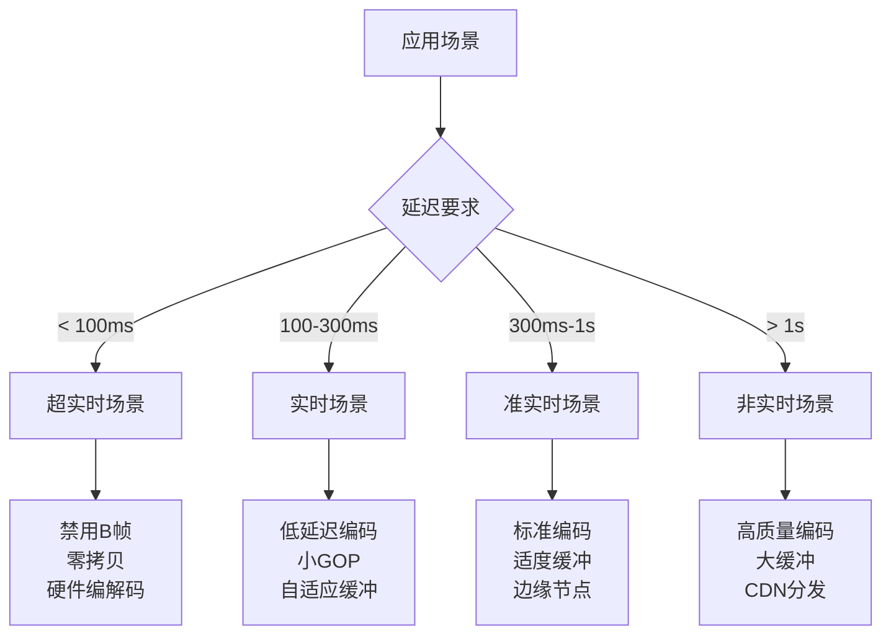

### 1.3 延迟与卡顿的权衡关系

延迟和卡顿是一对矛盾指标，降低延迟往往意味着减少缓冲，增加卡顿风险：

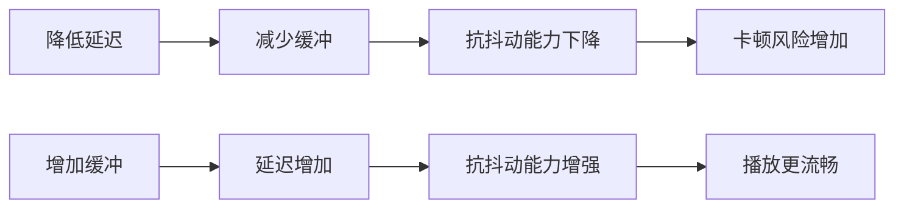

**权衡策略矩阵**：

| 策略 | 延迟影响 | 卡顿影响 | 适用场景 |
|-----|---------|---------|---------|
| **大缓冲（200ms+）** | +100-200ms | 显著降低 | 直播观看、点播 |
| **中等缓冲（50-100ms）** | +50-100ms | 适度降低 | 互动直播、在线教育 |
| **小缓冲（20-50ms）** | +20-50ms | 轻微增加 | 实时通话、视频会议 |
| **零缓冲** | 无增加 | 风险最高 | 专业场景、局域网 |
| **自适应缓冲** | 动态调整 | 智能平衡 | 通用方案 |

---

## 第2章 What — 端到端延迟拆解模型

### 2.1 完整链路延迟拆解

端到端延迟由多个环节累加而成，需要系统性地拆解和优化：

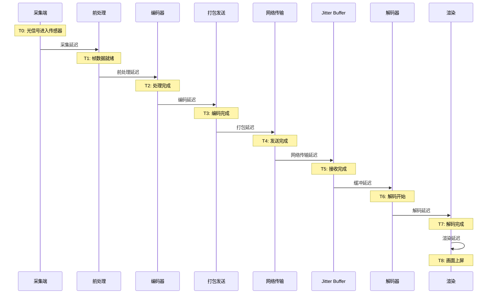

**各环节延迟定义**：

| 环节 | 定义 | 计算公式 | 典型占比 |
|-----|------|---------|---------|
| **采集延迟** | 光信号到采集帧输出 | T1 - T0 | 5-10% |
| **前处理延迟** | 美颜/滤镜/3A处理 | T2 - T1 | 3-8% |
| **编码延迟** | 帧编码耗时 | T3 - T2 | 5-15% |
| **打包延迟** | 封装到发送完成 | T4 - T3 | 1-3% |
| **网络延迟** | 发送到接收耗时 | T5 - T4 | 30-50% |
| **缓冲延迟** | Jitter Buffer等待 | T6 - T5 | 15-30% |
| **解码延迟** | 帧解码耗时 | T7 - T6 | 5-10% |
| **渲染延迟** | 解码完成到上屏 | T8 - T7 | 5-15% |

### 2.2 各环节典型延迟数据

**发送端（上行链路）延迟分布**：

| 环节 | 理想值 | 典型值 | 劣化值 | 优化重点 |
|-----|-------|-------|-------|---------|
| 采集延迟 | 8ms | 16ms | 33ms | 帧率控制、曝光同步 |
| 前处理延迟 | 3ms | 8ms | 25ms | GPU加速、算法裁剪 |
| 编码延迟（硬编） | 3ms | 8ms | 20ms | 硬件编码、零延迟配置 |
| 编码延迟（软编） | 15ms | 30ms | 80ms | 切换硬编、降低复杂度 |
| 封装发送 | 1ms | 3ms | 10ms | 零拷贝、批量发送 |
| **上行总计** | **15ms** | **35ms** | **98ms** | - |

**网络传输延迟分布**：

| 场景 | RTT | 单向延迟 | 抖动 | 优化重点 |
|-----|-----|---------|------|---------|
| 同城同运营商 | 10ms | 5ms | < 5ms | 直连优先 |
| 跨省同运营商 | 30ms | 15ms | 5-15ms | 边缘节点部署 |
| 跨运营商 | 50ms | 25ms | 10-30ms | 智能路由、中转优化 |
| 跨国 | 150ms | 75ms | 20-50ms | 专线、海外节点 |
| 弱网（4G/5G） | 100ms | 50ms | 30-100ms | 弱网对抗、自适应 |

**接收端（下行链路）延迟分布**：

| 环节 | 理想值 | 典型值 | 劣化值 | 优化重点 |
|-----|-------|-------|-------|---------|
| 接收缓冲 | 20ms | 50ms | 200ms | 自适应缓冲、抖动消除 |
| 解封装 | 1ms | 2ms | 8ms | 快速解析、错误恢复 |
| 解码延迟（硬解） | 3ms | 6ms | 15ms | 硬件解码、解码线程 |
| 解码延迟（软解） | 10ms | 20ms | 50ms | 切换硬解、降低分辨率 |
| 后处理 | 2ms | 5ms | 15ms | GPU加速、异步处理 |
| 渲染延迟 | 8ms | 16ms | 33ms | 同步机制、丢帧策略 |
| **下行总计** | **34ms** | **79ms** | **271ms** | - |

**端到端延迟汇总**：

| 场景 | 理想延迟 | 典型延迟 | 劣化延迟 | 目标场景 |
|-----|---------|---------|---------|---------|
| **局域网RTC** | 50ms | 100ms | 200ms | 企业内部、本地会议 |
| **公网RTC** | 100ms | 200ms | 400ms | 实时通话、视频会议 |
| **互动直播** | 200ms | 500ms | 1s | 主播连麦、互动课堂 |
| **普通直播** | 1s | 3s | 5s | 直播观看、赛事直播 |

### 2.3 延迟瀑布图可视化

```mermaid
%%{init: {'theme': 'base', 'themeVariables': { 'primaryColor': '#ff6b6b', 'primaryTextColor': '#fff', 'primaryBorderColor': '#c92a2a', 'lineColor': '#495057', 'secondaryColor': '#4dabf7', 'tertiaryColor': '#69db7c'}}}%%
gantt
    title 端到端延迟瀑布图（典型RTC场景，总计约200ms）
    dateFormat X
    axisFormat %s ms
    
    section 发送端
    采集延迟           :a1, 0, 16ms
    前处理延迟         :a2, after a1, 8ms
    编码延迟           :a3, after a2, 10ms
    打包发送           :a4, after a3, 3ms
    
    section 网络传输
    网络延迟           :b1, after a4, 50ms
    
    section 接收端
    Jitter Buffer      :c1, after b1, 50ms
    解码延迟           :c2, after c1, 8ms
    渲染延迟           :c3, after c2, 16ms
```

**延迟瀑布图分析**：
- 网络传输和Jitter Buffer是延迟大户，合计占比约50%
- 编码/解码延迟可通过硬件加速大幅降低
- 采集/渲染延迟与帧率强相关，60fps比30fps延迟减半

---

## 第3章 How — 采集延迟优化

### 3.1 摄像头采集延迟来源

摄像头采集延迟由多个阶段组成：

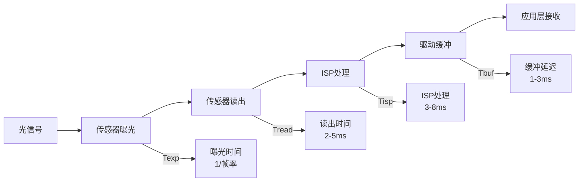

**采集延迟构成公式**：

```
总采集延迟 = 曝光时间 + 传感器读出时间 + ISP处理时间 + 驱动缓冲时间
          ≈ (1000ms / 帧率) + 2-5ms + 3-8ms + 1-3ms
```

**不同帧率下的理论最小延迟**：

| 帧率 | 帧间隔 | 理论最小延迟 | 实际典型延迟 | 适用场景 |
|-----|-------|------------|------------|---------|
| 15fps | 66.7ms | 72-83ms | 80-100ms | 低功耗场景 |
| 30fps | 33.3ms | 39-50ms | 45-60ms | 标准通话 |
| 60fps | 16.7ms | 23-34ms | 28-40ms | 游戏直播 |
| 120fps | 8.3ms | 15-26ms | 20-30ms | 专业电竞 |

### 3.2 iOS平台采集优化

**AVCaptureSession低延迟配置**：

```objc
// Objective-C: iOS采集延迟优化
- (void)configureLowLatencyCapture {
    AVCaptureSession *session = [[AVCaptureSession alloc] init];
    
    // 1. 使用高帧率降低曝光时间
    // 60fps相比30fps，曝光时间减半，延迟降低约16ms
    if ([session canSetSessionPreset:AVCaptureSessionPreset1280x720]) {
        session.sessionPreset = AVCaptureSessionPreset1280x720;
    }
    
    // 2. 配置输出 - 关键优化点
    AVCaptureVideoDataOutput *output = [[AVCaptureVideoDataOutput alloc] init];
    
    // 3. 设置像素格式为NV12（硬件原生支持，避免转换）
    NSDictionary *outputSettings = @{
        (id)kCVPixelBufferPixelFormatTypeKey: @(kCVPixelFormatType_420YpCbCr8BiPlanarVideoRange)
    };
    output.videoSettings = outputSettings;
    
    // 4. 关键：允许丢弃延迟帧，保证实时性
    output.alwaysDiscardsLateVideoFrames = YES;
    
    // 5. 使用专用高优先级队列
    dispatch_queue_t captureQueue = dispatch_queue_create("com.example.capture", DISPATCH_QUEUE_SERIAL);
    dispatch_set_target_queue(captureQueue, dispatch_get_global_queue(QOS_CLASS_USER_INTERACTIVE, 0));
    [output setSampleBufferDelegate:self queue:captureQueue];
    
    // 6. 帧率和曝光联动配置
    AVCaptureDevice *device = [AVCaptureDevice defaultDeviceWithMediaType:AVMediaTypeVideo];
    NSError *error = nil;
    if ([device lockForConfiguration:&error]) {
        // 设置目标帧率
        CMTime frameDuration = CMTimeMake(1, 60); // 60fps
        device.activeVideoMinFrameDuration = frameDuration;
        device.activeVideoMaxFrameDuration = frameDuration;
        
        // 固定曝光时间（避免自动曝光调整带来的延迟抖动）
        if (device.isExposureModeSupported:AVCaptureExposureModeLocked) {
            device.exposureMode = AVCaptureExposureModeLocked;
        }
        
        [device unlockForConfiguration];
    }
}
```

**Swift版本**：

```swift
// Swift: iOS采集延迟优化
func configureLowLatencyCapture() {
    let session = AVCaptureSession()
    
    // 配置输出
    let output = AVCaptureVideoDataOutput()
    output.videoSettings = [
        kCVPixelBufferPixelFormatTypeKey as String: kCVPixelFormatType_420YpCbCr8BiPlanarVideoRange
    ]
    
    // 关键：丢弃延迟帧
    output.alwaysDiscardsLateVideoFrames = true
    
    // 高优先级队列
    let captureQueue = DispatchQueue(label: "com.example.capture", qos: .userInteractive)
    output.setSampleBufferDelegate(self, queue: captureQueue)
    
    // 帧率和曝光配置
    guard let device = AVCaptureDevice.default(.builtInWideAngleCamera, for: .video, position: .front) else { return }
    
    do {
        try device.lockForConfiguration()
        
        // 固定60fps
        let frameDuration = CMTime(value: 1, timescale: 60)
        device.activeVideoMinFrameDuration = frameDuration
        device.activeVideoMaxFrameDuration = frameDuration
        
        // 锁定曝光
        if device.isExposureModeSupported(.locked) {
            device.exposureMode = .locked
        }
        
        device.unlockForConfiguration()
    } catch {
        print("Configuration error: \(error)")
    }
}
```

### 3.3 Android平台采集优化

**Camera2低延迟配置**：

```java
// Java: Android Camera2采集延迟优化
public class LowLatencyCamera {
    private CameraDevice cameraDevice;
    private CaptureRequest.Builder captureRequestBuilder;
    
    public void configureLowLatencyCapture(CameraManager cameraManager, String cameraId) {
        try {
            // 1. 获取摄像头特性
            CameraCharacteristics characteristics = cameraManager.getCameraCharacteristics(cameraId);
            StreamConfigurationMap map = characteristics.get(
                CameraCharacteristics.SCALER_STREAM_CONFIGURATION_MAP);
            
            // 2. 选择合适的分辨率（避免过高分辨率增加ISP处理时间）
            Size[] outputSizes = map.getOutputSizes(ImageFormat.YUV_420_888);
            Size optimalSize = chooseOptimalSize(outputSizes, 1280, 720);
            
            // 3. 创建ImageReader（使用YUV_420_888格式，直接编码）
            ImageReader imageReader = ImageReader.newInstance(
                optimalSize.getWidth(), 
                optimalSize.getHeight(),
                ImageFormat.YUV_420_888, 
                2  // 缓冲队列深度，避免过大增加延迟
            );
            imageReader.setOnImageAvailableListener(imageListener, backgroundHandler);
            
            // 4. 打开摄像头
            cameraManager.openCamera(cameraId, stateCallback, backgroundHandler);
            
        } catch (CameraAccessException e) {
            e.printStackTrace();
        }
    }
    
    private void createCaptureSession() {
        try {
            // 5. 创建捕获请求 - 关键优化
            captureRequestBuilder = cameraDevice.createCaptureRequest(CameraDevice.TEMPLATE_RECORD);
            captureRequestBuilder.addTarget(imageReader.getSurface());
            
            // 6. 设置帧率范围（固定高帧率）
            captureRequestBuilder.set(CaptureRequest.CONTROL_AE_TARGET_FPS_RANGE, 
                new Range<>(60, 60));
            
            // 7. 禁用自动曝光调整（减少延迟抖动）
            captureRequestBuilder.set(CaptureRequest.CONTROL_AE_MODE, 
                CaptureRequest.CONTROL_AE_MODE_OFF);
            captureRequestBuilder.set(CaptureRequest.SENSOR_EXPOSURE_TIME, 16666666L); // 1/60s
            
            // 8. 禁用自动对焦（避免对焦过程延迟）
            captureRequestBuilder.set(CaptureRequest.CONTROL_AF_MODE, 
                CaptureRequest.CONTROL_AF_MODE_OFF);
            
            // 9. 设置重复请求
            cameraDevice.createCaptureSession(
                Arrays.asList(imageReader.getSurface()),
                sessionCallback,
                backgroundHandler
            );
            
        } catch (CameraAccessException e) {
            e.printStackTrace();
        }
    }
    
    private final ImageReader.OnImageAvailableListener imageListener = reader -> {
        Image image = reader.acquireLatestImage(); // 使用acquireLatestImage丢弃旧帧
        if (image != null) {
            // 处理帧数据
            processImage(image);
            image.close();
        }
    };
}
```

**Kotlin版本**：

```kotlin
// Kotlin: Android Camera2采集延迟优化
class LowLatencyCamera(private val cameraManager: CameraManager) {
    private var captureRequestBuilder: CaptureRequest.Builder? = null
    
    fun configureLowLatencyCapture(cameraId: String) {
        val characteristics = cameraManager.getCameraCharacteristics(cameraId)
        val map = characteristics.get(CameraCharacteristics.SCALER_STREAM_CONFIGURATION_MAP)
        
        // 选择最优分辨率
        val outputSizes = map?.getOutputSizes(ImageFormat.YUV_420_888)
        val optimalSize = outputSizes?.find { it.width == 1280 && it.height == 720 } 
            ?: outputSizes?.first()
        
        // 创建ImageReader
        val imageReader = ImageReader.newInstance(
            optimalSize!!.width, optimalSize.height,
            ImageFormat.YUV_420_888, 2
        )
        
        imageReader.setOnImageAvailableListener({ reader ->
            reader.acquireLatestImage()?.use { image ->
                processImage(image)
            }
        }, backgroundHandler)
        
        // 打开摄像头
        cameraManager.openCamera(cameraId, object : CameraDevice.StateCallback() {
            override fun onOpened(camera: CameraDevice) {
                createCaptureSession(camera, imageReader.surface)
            }
            override fun onDisconnected(camera: CameraDevice) {}
            override fun onError(camera: CameraDevice, error: Int) {}
        }, backgroundHandler)
    }
    
    private fun createCaptureSession(camera: CameraDevice, surface: Surface) {
        captureRequestBuilder = camera.createCaptureRequest(CameraDevice.TEMPLATE_RECORD).apply {
            addTarget(surface)
            
            // 固定60fps
            set(CaptureRequest.CONTROL_AE_TARGET_FPS_RANGE, Range(60, 60))
            
            // 关闭自动曝光
            set(CaptureRequest.CONTROL_AE_MODE, CaptureRequest.CONTROL_AE_MODE_OFF)
            set(CaptureRequest.SENSOR_EXPOSURE_TIME, 16_666_666L)
            
            // 关闭自动对焦
            set(CaptureRequest.CONTROL_AF_MODE, CaptureRequest.CONTROL_AF_MODE_OFF)
        }
        
        camera.createCaptureSession(
            listOf(surface),
            object : CameraCaptureSession.StateCallback() {
                override fun onConfigured(session: CameraCaptureSession) {
                    captureRequestBuilder?.let {
                        session.setRepeatingRequest(it.build(), null, backgroundHandler)
                    }
                }
                override fun onConfigureFailed(session: CameraCaptureSession) {}
            },
            backgroundHandler
        )
    }
}
```

### 3.4 采集时间戳精确打点

精确的时间戳打点是延迟测量的基础：

```cpp
// C++: 采集时间戳打点方案
struct CaptureTimestamp {
    int64_t exposure_start_us;    // 曝光开始时间
    int64_t exposure_end_us;      // 曝光结束时间
    int64_t isp_complete_us;      // ISP处理完成时间
    int64_t app_receive_us;       // 应用层接收时间
    int64_t encode_start_us;      // 编码开始时间
    
    int64_t getCaptureLatency() const {
        return app_receive_us - exposure_start_us;
    }
    
    int64_t getPreprocessLatency() const {
        return encode_start_us - app_receive_us;
    }
};

// iOS时间戳获取
#if TARGET_OS_IOS
#import <mach/mach_time.h>

static inline int64_t getMonotonicTimeUs() {
    static mach_timebase_info_data_t timebase;
    if (timebase.denom == 0) {
        mach_timebase_info(&timebase);
    }
    uint64_t ticks = mach_absolute_time();
    return (int64_t)(ticks * timebase.numer / timebase.denom / 1000);
}
#endif

// Android时间戳获取
#if defined(__ANDROID__)
#include <time.h>

static inline int64_t getMonotonicTimeUs() {
    struct timespec ts;
    clock_gettime(CLOCK_MONOTONIC, &ts);
    return (int64_t)ts.tv_sec * 1000000 + ts.tv_nsec / 1000;
}
#endif
```

---

## 第4章 How — 编码延迟优化

### 4.1 零延迟编码配置

实时通信场景必须配置零延迟编码，禁用B帧是关键：

**B帧延迟原理**：

```
帧序列（显示顺序）: I0 B1 B2 P3 B4 B5 P6 ...
编码/传输顺序:      I0 P3 B1 B2 P6 B4 B5 ...

延迟分析：
- 编码B2时需要等待P3编码完成 → 2帧延迟
- 解码B2时需要等待P3解码完成 → 2帧延迟
- 实时通信总延迟增加: 2-3帧 (33-50ms @30fps)
```

**iOS VideoToolbox零延迟配置**：

```objc
// Objective-C: iOS零延迟编码配置
- (void)configureZeroLatencyEncoding {
    // 1. 实时编码模式
    VTSessionSetProperty(compressionSession,
        kVTCompressionPropertyKey_RealTime, kCFBooleanTrue);
    
    // 2. 禁用B帧 - 关键！
    VTSessionSetProperty(compressionSession,
        kVTCompressionPropertyKey_AllowFrameReordering, kCFBooleanFalse);
    
    // 3. 使用Baseline Profile（不支持B帧）
    VTSessionSetProperty(compressionSession,
        kVTCompressionPropertyKey_ProfileLevel, 
        kVTProfileLevel_H264_Baseline_AutoLevel);
    
    // 4. 设置低延迟关键帧间隔
    int32_t keyFrameInterval = 60; // 2秒 @30fps
    CFNumberRef keyFrameNum = CFNumberCreate(kCFAllocatorDefault, kCFNumberSInt32Type, &keyFrameInterval);
    VTSessionSetProperty(compressionSession,
        kVTCompressionPropertyKey_MaxKeyFrameInterval, keyFrameNum);
    CFRelease(keyFrameNum);
    
    // 5. CBR模式保证稳定码率
    int32_t bitrate = 2000000; // 2Mbps
    CFNumberRef bitrateNum = CFNumberCreate(kCFAllocatorDefault, kCFNumberSInt32Type, &bitrate);
    VTSessionSetProperty(compressionSession,
        kVTCompressionPropertyKey_AverageBitRate, bitrateNum);
    CFRelease(bitrateNum);
    
    // 6. 设置码率限制实现严格CBR
    int32_t dataRateLimits[] = {bitrate, 1};
    CFArrayRef dataRateLimitsArray = CFArrayCreate(kCFAllocatorDefault,
        (const void **)&dataRateLimits, 2, &kCFTypeArrayCallBacks);
    VTSessionSetProperty(compressionSession,
        kVTCompressionPropertyKey_DataRateLimits, dataRateLimitsArray);
    CFRelease(dataRateLimitsArray);
}
```

**Android MediaCodec零延迟配置**：

```java
// Java: Android零延迟编码配置
public class ZeroLatencyEncoder {
    private MediaCodec encoder;
    
    public void configureZeroLatencyEncoder(int width, int height, int bitrate) {
        try {
            // 创建H.264编码器
            encoder = MediaCodec.createEncoderByType("video/avc");
            
            MediaFormat format = MediaFormat.createVideoFormat("video/avc", width, height);
            
            // 1. 设置码率
            format.setInteger(MediaFormat.KEY_BIT_RATE, bitrate);
            
            // 2. 设置帧率
            format.setInteger(MediaFormat.KEY_FRAME_RATE, 30);
            
            // 3. 设置颜色格式（使用Surface模式实现零拷贝）
            format.setInteger(MediaFormat.KEY_COLOR_FORMAT, 
                MediaCodecInfo.CodecCapabilities.COLOR_FormatSurface);
            
            // 4. 关键：设置低延迟标志
            if (Build.VERSION.SDK_INT >= Build.VERSION_CODES.O) {
                format.setInteger(MediaFormat.KEY_LATENCY, 0); // 零延迟
            }
            
            // 5. 关键帧间隔（2秒）
            format.setInteger(MediaFormat.KEY_I_FRAME_INTERVAL, 2);
            
            // 6. 配置编码器 - 使用编码模式而非实时模式（某些设备实时模式延迟更高）
            encoder.configure(format, null, null, MediaCodec.CONFIGURE_FLAG_ENCODE);
            
            // 7. 创建输入Surface（零拷贝输入）
            Surface inputSurface = encoder.createInputSurface();
            
            encoder.start();
            
        } catch (IOException e) {
            e.printStackTrace();
        }
    }
}
```

**FFmpeg/x264零延迟配置**：

```cpp
// C++: FFmpeg零延迟编码配置
AVCodecContext* configureZeroLatencyEncoder() {
    const AVCodec* codec = avcodec_find_encoder(AV_CODEC_ID_H264);
    AVCodecContext* ctx = avcodec_alloc_context3(codec);
    
    // 基础配置
    ctx->width = 1280;
    ctx->height = 720;
    ctx->time_base = (AVRational){1, 30}; // 30fps
    ctx->framerate = (AVRational){30, 1};
    ctx->pix_fmt = AV_PIX_FMT_YUV420P;
    ctx->bit_rate = 2000000; // 2Mbps
    
    // 零延迟关键配置
    AVDictionary* opts = nullptr;
    
    // 1. 使用ultrafast preset（最快，延迟最低）
    av_dict_set(&opts, "preset", "ultrafast", 0);
    
    // 2. 使用zerolatency tune（零延迟调优）
    av_dict_set(&opts, "tune", "zerolatency", 0);
    
    // 3. 禁用B帧
    av_dict_set(&opts, "bf", "0", 0);
    
    // 4. 使用Baseline Profile（无B帧）
    av_dict_set(&opts, "profile", "baseline", 0);
    
    // 5. 设置GOP大小
    av_dict_set(&opts, "g", "60", 0); // 2秒 GOP
    
    // 6. 设置参考帧数量（减少延迟）
    av_dict_set(&opts, "ref", "1", 0);
    
    // 7. 禁用场景切换检测（避免额外延迟）
    av_dict_set(&opts, "sc_threshold", "0", 0);
    
    avcodec_open2(ctx, codec, &opts);
    av_dict_free(&opts);
    
    return ctx;
}
```

### 4.2 编码器内部延迟拆解

编码器内部延迟由多个阶段组成：

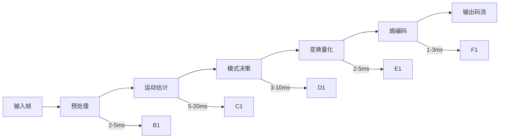

**各阶段延迟分析**：

| 阶段 | 软编延迟 | 硬编延迟 | 优化手段 |
|-----|---------|---------|---------|
| 预处理 | 2-5ms | 1-2ms | 简化预处理 |
| 运动估计 | 5-20ms | 2-4ms | 降低搜索范围 |
| 模式决策 | 3-10ms | 1-2ms | 快速模式决策 |
| 变换量化 | 2-5ms | 1-2ms | 硬件加速 |
| 熵编码 | 1-3ms | 1ms | CABAC优化 |
| **总计** | **13-43ms** | **6-11ms** | - |

### 4.3 帧级Pipeline并行

通过Pipeline并行提升编码吞吐，降低单帧延迟：

```cpp
// C++: 编码Pipeline并行架构
class ParallelEncoderPipeline {
public:
    struct FrameTask {
        int64_t pts;
        std::shared_ptr<VideoFrame> frame;
        std::promise<EncodedPacket> promise;
    };
    
    ParallelEncoderPipeline(int numThreads = 2) 
        : numThreads_(numThreads), stopFlag_(false) {
        // 启动编码线程池
        for (int i = 0; i < numThreads_; i++) {
            encoderThreads_.emplace_back(&ParallelEncoderPipeline::encoderLoop, this, i);
        }
    }
    
    // 异步编码接口
    std::future<EncodedPacket> encodeAsync(std::shared_ptr<VideoFrame> frame, int64_t pts) {
        FrameTask task;
        task.pts = pts;
        task.frame = frame;
        
        auto future = task.promise.get_future();
        
        {
            std::lock_guard<std::mutex> lock(queueMutex_);
            taskQueue_.push(std::move(task));
        }
        queueCV_.notify_one();
        
        return future;
    }
    
private:
    void encoderLoop(int threadId) {
        // 每个线程独立编码器实例
        auto encoder = createEncoderInstance();
        
        while (!stopFlag_) {
            FrameTask task;
            {
                std::unique_lock<std::mutex> lock(queueMutex_);
                queueCV_.wait(lock, [this] { return !taskQueue_.empty() || stopFlag_; });
                
                if (stopFlag_) break;
                
                task = std::move(taskQueue_.front());
                taskQueue_.pop();
            }
            
            // 执行编码
            auto packet = encoder->encode(task.frame, task.pts);
            task.promise.set_value(packet);
        }
    }
    
    int numThreads_;
    std::atomic<bool> stopFlag_;
    std::queue<FrameTask> taskQueue_;
    std::mutex queueMutex_;
    std::condition_variable queueCV_;
    std::vector<std::thread> encoderThreads_;
};
```

### 4.4 硬编码 vs 软编码延迟对比

**延迟对比实测数据**（H.264, 720p@30fps, 2Mbps）：

| 编码器类型 | 编码延迟 | CPU占用 | 功耗 | 适用场景 |
|-----------|---------|--------|------|---------|
| iOS VideoToolbox | 3-8ms | 5-10% | 低 | iOS RTC首选 |
| Android MediaCodec(高通) | 5-12ms | 8-15% | 低 | Android RTC首选 |
| Android MediaCodec(联发科) | 8-20ms | 10-20% | 中 | 中端设备 |
| x264 ultrafast | 15-25ms | 60-80% | 高 | 软编备用 |
| x264 veryfast | 25-40ms | 40-60% | 高 | 质量优先 |
| x264 medium | 50-100ms | 30-50% | 高 | 录制场景 |

**选型建议**：
- **RTC场景**：必须优先使用硬件编码，延迟降低50%以上
- **直播场景**：硬编为主，弱网时降级软编保证质量
- **录制场景**：软编可获得更高质量，延迟不敏感

---

## 第5章 How — 网络延迟优化

### 5.1 传输协议选择对延迟的影响

不同传输协议的延迟特性差异显著：

| 协议 | 典型延迟 | 可靠性 | 适用场景 | 延迟优化手段 |
|-----|---------|-------|---------|-------------|
| **UDP** | 5-20ms | 无保障 | RTC首选 | FEC、NACK |
| **TCP** | 20-100ms | 可靠 | 文件传输 | 禁用Nagle |
| **RTP/RTCP** | 5-25ms | 部分保障 | 音视频传输 | 头部压缩 |
| **SRT** | 30-120ms | 可靠 | 直播推流 | 自适应重传 |
| **QUIC** | 10-50ms | 可靠 | Web传输 | 0-RTT握手 |
| **WebRTC DataChannel** | 10-40ms | 可配置 | P2P数据传输 | 拥塞控制 |

**协议选择决策树**：

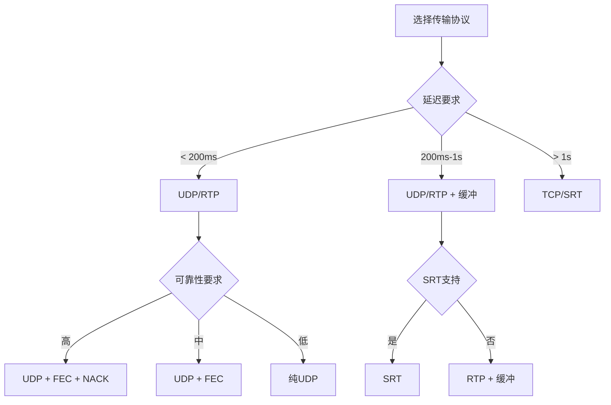

### 5.2 RTT优化

**RTT构成分析**：

```
RTT = 传播延迟 × 2 + 处理延迟 × 2 + 排队延迟 × 2
    = (距离 / 光速) × 2 + 处理时间 × 2 + 队列等待 × 2
```

**接入点选择优化**：

```cpp
// C++: 智能接入点选择
class AccessPointSelector {
public:
    struct AccessPoint {
        std::string endpoint;
        std::string region;
        int64_t measuredRtt;
        double packetLoss;
        int score;
    };
    
    // 测量各接入点RTT
    void probeAccessPoints(const std::vector<std::string>& endpoints) {
        for (const auto& endpoint : endpoints) {
            // 发送探测包
            auto startTime = getMonotonicTimeMs();
            sendProbePacket(endpoint);
            
            // 等待响应
            waitForResponse(endpoint, [this, endpoint, startTime](bool success) {
                if (success) {
                    int64_t rtt = getMonotonicTimeMs() - startTime;
                    updateRttMeasurement(endpoint, rtt);
                }
            });
        }
    }
    
    // 选择最优接入点
    std::string selectBestAccessPoint() {
        std::lock_guard<std::mutex> lock(mutex_);
        
        AccessPoint* best = nullptr;
        int bestScore = INT_MIN;
        
        for (auto& ap : accessPoints_) {
            // 综合评分：RTT权重60%，丢包权重40%
            int score = calculateScore(ap);
            if (score > bestScore) {
                bestScore = score;
                best = &ap;
            }
        }
        
        return best ? best->endpoint : "";
    }
    
private:
    int calculateScore(AccessPoint& ap) {
        // RTT评分：越低越好，线性衰减
        int rttScore = std::max(0, 100 - (int)(ap.measuredRtt / 5));
        
        // 丢包评分：越低越好
        int lossScore = std::max(0, 100 - (int)(ap.packetLoss * 100));
        
        // 综合评分
        return (int)(rttScore * 0.6 + lossScore * 0.4);
    }
    
    std::vector<AccessPoint> accessPoints_;
    std::mutex mutex_;
};
```

**路由优化策略**：

| 策略 | 延迟降低 | 实现复杂度 | 适用场景 |
|-----|---------|-----------|---------|
| **边缘节点部署** | 20-50ms | 中 | 全球服务 |
| **智能DNS解析** | 10-30ms | 低 | 多地域部署 |
| **Anycast路由** | 15-40ms | 高 | 大规模服务 |
| **专线接入** | 30-100ms | 高 | 企业客户 |
| **P2P直连** | 10-30ms | 中 | 1v1通话 |

### 5.3 Pacing对延迟的改善

Pacing通过平滑发送节奏，避免突发流量冲击网络：

```cpp
// C++: Pacing发送控制器
class PacingController {
public:
    PacingController() 
        : pacingRate_(0),
          lastProcessTime_(0),
          pendingBytes_(0) {
    }
    
    // 设置目标发送码率
    void setPacingRate(uint32_t bitrateBps) {
        pacingRate_ = bitrateBps;
    }
    
    // 添加待发送包
    void enqueuePacket(const RTPPacket& packet) {
        std::lock_guard<std::mutex> lock(mutex_);
        packetQueue_.push(packet);
        pendingBytes_ += packet.size();
    }
    
    // 处理发送（定期调用）
    void process() {
        auto now = getMonotonicTimeMs();
        
        if (lastProcessTime_ == 0) {
            lastProcessTime_ = now;
            return;
        }
        
        // 计算本次可发送的字节数
        int64_t elapsedMs = now - lastProcessTime_;
        size_t bytesCanSend = (pacingRate_ * elapsedMs) / 8000; // bps to bytes/ms
        
        size_t bytesSent = 0;
        
        std::lock_guard<std::mutex> lock(mutex_);
        while (!packetQueue_.empty() && bytesSent < bytesCanSend) {
            auto& packet = packetQueue_.front();
            
            if (bytesSent + packet.size() > bytesCanSend) {
                break; // 超过本次配额，等待下次
            }
            
            // 发送包
            sendPacket(packet);
            bytesSent += packet.size();
            pendingBytes_ -= packet.size();
            packetQueue_.pop();
        }
        
        lastProcessTime_ = now;
    }
    
    // 获取队列延迟估计
    int64_t getQueueDelayMs() const {
        if (pacingRate_ == 0) return 0;
        return (pendingBytes_ * 8000) / pacingRate_; // bytes to ms
    }
    
private:
    uint32_t pacingRate_;  // bps
    int64_t lastProcessTime_;
    size_t pendingBytes_;
    std::queue<RTPPacket> packetQueue_;
    mutable std::mutex mutex_;
};
```

**Pacing参数调优**：

| 参数 | 默认值 | 调优建议 | 影响 |
|-----|-------|---------|------|
| 发送间隔 | 5ms | 延迟敏感可降至2ms | 越小越平滑，CPU开销越大 |
| 突发容忍 | 10ms | 弱网可增大 | 越大越容忍突发，延迟越高 |
| 最小发送量 | 1 packet | 保持默认 | 避免过度碎片 |
| 最大队列深度 | 200ms | 延迟敏感可降至100ms | 越小延迟越低，丢包风险越大 |

### 5.4 NACK重传延迟预算

NACK重传需要合理的延迟预算：

```cpp
// C++: NACK重传管理器
class NackController {
public:
    struct NackConfig {
        int64_t maxNackDelayMs = 200;      // 最大NACK延迟
        int64_t rttMultiplier = 2;          // RTT乘数
        int maxRetransmissions = 3;         // 最大重传次数
        int maxNackListSize = 100;          // 最大NACK列表大小
    };
    
    NackController(const NackConfig& config) : config_(config) {}
    
    // 处理丢包检测
    void onPacketLost(uint16_t seqNum, int64_t nowMs) {
        std::lock_guard<std::mutex> lock(mutex_);
        
        NackInfo info;
        info.seqNum = seqNum;
        info.firstNackTime = nowMs;
        info.lastNackTime = nowMs;
        info.retries = 0;
        
        nackList_[seqNum] = info;
    }
    
    // 生成NACK请求（定期调用）
    std::vector<uint16_t> generateNackList(int64_t nowMs, int64_t rttMs) {
        std::lock_guard<std::mutex> lock(mutex_);
        std::vector<uint16_t> nackSeqNums;
        
        int64_t nackThreshold = rttMs * config_.rttMultiplier;
        
        for (auto it = nackList_.begin(); it != nackList_.end();) {
            auto& info = it->second;
            
            // 检查是否超过最大延迟
            if (nowMs - info.firstNackTime > config_.maxNackDelayMs) {
                it = nackList_.erase(it);
                continue;
            }
            
            // 检查是否需要重发NACK
            if (nowMs - info.lastNackTime >= nackThreshold) {
                if (info.retries < config_.maxRetransmissions) {
                    nackSeqNums.push_back(info.seqNum);
                    info.lastNackTime = nowMs;
                    info.retries++;
                } else {
                    // 超过重试次数，放弃
                    it = nackList_.erase(it);
                    continue;
                }
            }
            
            ++it;
        }
        
        return nackSeqNums;
    }
    
    // 收到重传包
    void onRetransmissionReceived(uint16_t seqNum) {
        std::lock_guard<std::mutex> lock(mutex_);
        nackList_.erase(seqNum);
    }
    
    // 获取当前NACK延迟预算
    int64_t getNackDelayBudget(int64_t rttMs) const {
        return std::min(config_.maxNackDelayMs, rttMs * config_.rttMultiplier);
    }
    
private:
    struct NackInfo {
        uint16_t seqNum;
        int64_t firstNackTime;
        int64_t lastNackTime;
        int retries;
    };
    
    NackConfig config_;
    std::map<uint16_t, NackInfo> nackList_;
    mutable std::mutex mutex_;
};
```

**NACK延迟预算配置**：

| 场景 | RTT | NACK延迟预算 | 重传次数 | 说明 |
|-----|-----|-------------|---------|------|
| 局域网 | 10ms | 20-30ms | 2-3次 | 快速重传 |
| 城域网 | 30ms | 60-90ms | 2次 | 标准配置 |
| 跨省 | 50ms | 100-150ms | 2次 | 适度重传 |
| 跨国 | 150ms | 200-300ms | 1-2次 | 保守重传 |
| 弱网 | 200ms+ | 200ms（上限） | 1次 | 快速放弃 |

---

## 第6章 How — Jitter Buffer延迟优化

### 6.1 自适应Jitter Buffer深度

Jitter Buffer需要根据网络抖动动态调整：

```cpp
// C++: 自适应Jitter Buffer实现
class AdaptiveJitterBuffer {
public:
    struct JitterConfig {
        int64_t minDelayMs = 20;        // 最小缓冲延迟
        int64_t maxDelayMs = 200;       // 最大缓冲延迟
        int64_t targetDelayMs = 50;     // 目标缓冲延迟
        double alpha = 0.9;              // 指数平滑系数
    };
    
    AdaptiveJitterBuffer(const JitterConfig& config) 
        : config_(config),
          currentDelayMs_(config.targetDelayMs),
          jitterEstimateMs_(0) {
    }
    
    // 计算目标播放时间
    int64_t calculateTargetTime(int64_t packetTimestamp, int64_t arrivalTime) {
        std::lock_guard<std::mutex> lock(mutex_);
        
        if (!initialized_) {
            // 第一个包，初始化
            firstPacketTimestamp_ = packetTimestamp;
            firstPacketArrivalTime_ = arrivalTime;
            initialized_ = true;
            return arrivalTime + currentDelayMs_;
        }
        
        // 计算相对时间
        int64_t relativeTimestamp = packetTimestamp - firstPacketTimestamp_;
        int64_t relativeArrival = arrivalTime - firstPacketArrivalTime_;
        
        // 计算到达延迟
        int64_t arrivalDelay = relativeArrival - relativeTimestamp;
        
        // 更新抖动估计（指数平滑）
        updateJitterEstimate(arrivalDelay);
        
        // 计算目标延迟
        int64_t targetDelay = std::max(config_.minDelayMs,
            std::min(config_.maxDelayMs, 
                static_cast<int64_t>(jitterEstimateMs_ * 2)));
        
        // 平滑调整当前延迟
        currentDelayMs_ = static_cast<int64_t>(
            config_.alpha * currentDelayMs_ + (1 - config_.alpha) * targetDelay);
        
        // 计算目标播放时间
        return firstPacketArrivalTime_ + relativeTimestamp + currentDelayMs_;
    }
    
    // 获取当前缓冲延迟
    int64_t getCurrentDelayMs() const {
        std::lock_guard<std::mutex> lock(mutex_);
        return currentDelayMs_;
    }
    
    // 获取抖动估计
    int64_t getJitterEstimateMs() const {
        std::lock_guard<std::mutex> lock(mutex_);
        return static_cast<int64_t>(jitterEstimateMs_);
    }
    
private:
    void updateJitterEstimate(int64_t arrivalDelay) {
        // 使用RFC 3550抖动计算公式
        int64_t diff = std::abs(arrivalDelay - lastArrivalDelay_);
        jitterEstimateMs_ = jitterEstimateMs_ + (diff - jitterEstimateMs_) / 16.0;
        lastArrivalDelay_ = arrivalDelay;
    }
    
    JitterConfig config_;
    
    bool initialized_ = false;
    int64_t firstPacketTimestamp_ = 0;
    int64_t firstPacketArrivalTime_ = 0;
    
    int64_t currentDelayMs_;
    double jitterEstimateMs_;
    int64_t lastArrivalDelay_ = 0;
    
    mutable std::mutex mutex_;
};
```

**Jitter Buffer深度配置**：

| 网络条件 | 抖动范围 | 推荐缓冲深度 | 延迟增加 |
|---------|---------|-------------|---------|
| 优良 | < 5ms | 20-30ms | +20-30ms |
| 良好 | 5-15ms | 40-60ms | +40-60ms |
| 一般 | 15-30ms | 60-100ms | +60-100ms |
| 较差 | 30-50ms | 100-150ms | +100-150ms |
| 极差 | > 50ms | 150-200ms | +150-200ms |

### 6.2 最小化缓冲策略

延迟敏感场景需要最小化缓冲：

```cpp
// C++: 最小化缓冲模式
class MinimalLatencyJitterBuffer {
public:
    // 切换到最小延迟模式
    void enableMinimalLatencyMode() {
        std::lock_guard<std::mutex> lock(mutex_);
        minimalLatencyMode_ = true;
        minBufferDepth_ = 1;  // 最少1帧缓冲
        maxBufferDepth_ = 3;  // 最多3帧缓冲
    }
    
    // 获取待解码帧（最小延迟模式）
    std::shared_ptr<VideoFrame> getFrameForDecode() {
        std::lock_guard<std::mutex> lock(mutex_);
        
        if (frameQueue_.empty()) {
            return nullptr;
        }
        
        if (minimalLatencyMode_) {
            // 最小延迟模式：只要有帧就解码
            auto frame = frameQueue_.front();
            frameQueue_.pop();
            return frame;
        } else {
            // 正常模式：等待缓冲足够
            if (frameQueue_.size() < minBufferDepth_) {
                return nullptr;  // 缓冲不足，继续等待
            }
            auto frame = frameQueue_.front();
            frameQueue_.pop();
            return frame;
        }
    }
    
    // 处理丢包（最小延迟模式下快速追帧）
    void handlePacketLoss(uint16_t lostSeqNum) {
        std::lock_guard<std::mutex> lock(mutex_);
        
        if (minimalLatencyMode_) {
            // 最小延迟模式：跳过丢失帧，继续播放
            waitingForKeyframe_ = true;
        }
    }
    
private:
    bool minimalLatencyMode_ = false;
    size_t minBufferDepth_ = 3;
    size_t maxBufferDepth_ = 10;
    std::queue<std::shared_ptr<VideoFrame>> frameQueue_;
    bool waitingForKeyframe_ = false;
    mutable std::mutex mutex_;
};
```

### 6.3 加速追帧（倍速播放追赶）

当缓冲积累过多时，通过加速播放追赶：

```cpp
// C++: 加速追帧控制器
class CatchUpController {
public:
    struct CatchUpConfig {
        int64_t targetBufferMs = 50;        // 目标缓冲深度
        int64_t maxBufferMs = 100;          // 最大缓冲深度（触发追帧）
        double maxSpeedUp = 1.5;             // 最大加速倍数
        double minSpeedDown = 0.9;           // 最小减速倍数
        int64_t catchUpStepMs = 10;         // 每次追赶时间
    };
    
    CatchUpController(const CatchUpConfig& config) 
        : config_(config),
          currentPlaybackSpeed_(1.0) {
    }
    
    // 更新缓冲状态并计算播放速度
    double updateBufferState(int64_t currentBufferMs) {
        std::lock_guard<std::mutex> lock(mutex_);
        
        if (currentBufferMs > config_.maxBufferMs) {
            // 缓冲过大，加速追赶
            double speedUp = std::min(config_.maxSpeedUp,
                1.0 + (currentBufferMs - config_.targetBufferMs) / 200.0);
            currentPlaybackSpeed_ = speedUp;
            
            LOGI("Buffer too large ({}ms), speed up to {:.2f}x", 
                 currentBufferMs, currentPlaybackSpeed_);
                 
        } else if (currentBufferMs < config_.targetBufferMs / 2) {
            // 缓冲过小，减速积累
            currentPlaybackSpeed_ = config_.minSpeedDown;
            
            LOGI("Buffer too small ({}ms), slow down to {:.2f}x",
                 currentBufferMs, currentPlaybackSpeed_);
                 
        } else {
            // 缓冲正常，恢复正常速度
            currentPlaybackSpeed_ = 1.0;
        }
        
        return currentPlaybackSpeed_;
    }
    
    // 获取当前播放速度
    double getPlaybackSpeed() const {
        std::lock_guard<std::mutex> lock(mutex_);
        return currentPlaybackSpeed_;
    }
    
    // 计算帧显示时间（考虑加速）
    int64_t calculateDisplayTime(int64_t framePts, int64_t baseTime) {
        std::lock_guard<std::mutex> lock(mutex_);
        return baseTime + static_cast<int64_t>((framePts - baseTime) / currentPlaybackSpeed_);
    }
    
private:
    CatchUpConfig config_;
    double currentPlaybackSpeed_;
    mutable std::mutex mutex_;
};
```

**加速追帧策略**：

| 缓冲深度 | 播放速度 | 追赶策略 | 用户体验 |
|---------|---------|---------|---------|
| < 30ms | 0.9x | 减速积累 | 轻微慢放 |
| 30-60ms | 1.0x | 正常播放 | 无感知 |
| 60-100ms | 1.2x | 轻度加速 | 轻微快放 |
| 100-150ms | 1.3x | 中度加速 | 可感知快放 |
| > 150ms | 1.5x | 重度加速 | 明显快放/跳帧 |

---

## 第7章 How — 解码延迟优化

### 7.1 异步解码Pipeline

异步解码避免阻塞渲染线程：

```cpp
// C++: 异步解码Pipeline
class AsyncDecodePipeline {
public:
    AsyncDecodePipeline() : stopFlag_(false) {
        decodeThread_ = std::thread(&AsyncDecodePipeline::decodeLoop, this);
    }
    
    ~AsyncDecodePipeline() {
        stopFlag_ = true;
        queueCV_.notify_all();
        if (decodeThread_.joinable()) {
            decodeThread_.join();
        }
    }
    
    // 提交解码任务
    void submitDecodeTask(std::shared_ptr<EncodedPacket> packet) {
        {
            std::lock_guard<std::mutex> lock(queueMutex_);
            decodeQueue_.push(packet);
        }
        queueCV_.notify_one();
    }
    
    // 获取解码完成的帧（非阻塞）
    std::shared_ptr<VideoFrame> getDecodedFrame() {
        std::lock_guard<std::mutex> lock(outputMutex_);
        if (outputQueue_.empty()) {
            return nullptr;
        }
        auto frame = outputQueue_.front();
        outputQueue_.pop();
        return frame;
    }
    
private:
    void decodeLoop() {
        while (!stopFlag_) {
            std::shared_ptr<EncodedPacket> packet;
            
            {
                std::unique_lock<std::mutex> lock(queueMutex_);
                queueCV_.wait(lock, [this] { 
                    return !decodeQueue_.empty() || stopFlag_; 
                });
                
                if (stopFlag_) break;
                
                packet = decodeQueue_.front();
                decodeQueue_.pop();
            }
            
            // 执行解码
            auto frame = decoder_->decode(packet);
            
            if (frame) {
                std::lock_guard<std::mutex> lock(outputMutex_);
                outputQueue_.push(frame);
            }
        }
    }
    
    std::atomic<bool> stopFlag_;
    std::thread decodeThread_;
    
    std::queue<std::shared_ptr<EncodedPacket>> decodeQueue_;
    std::mutex queueMutex_;
    std::condition_variable queueCV_;
    
    std::queue<std::shared_ptr<VideoFrame>> outputQueue_;
    std::mutex outputMutex_;
    
    std::unique_ptr<VideoDecoder> decoder_;
};
```

### 7.2 解码-渲染并行

解码和渲染并行执行，降低端到端延迟：

```cpp
// C++: 解码渲染并行架构
class DecodeRenderParallel {
public:
    DecodeRenderParallel() 
        : decodeThread_(&DecodeRenderParallel::decodeLoop, this),
          renderThread_(&DecodeRenderParallel::renderLoop, this) {
    }
    
    // 提交解码任务
    void submitPacket(std::shared_ptr<EncodedPacket> packet) {
        decodeQueue_.enqueue(packet);
    }
    
private:
    void decodeLoop() {
        while (running_) {
            auto packet = decodeQueue_.dequeue();
            if (!packet) continue;
            
            // 解码
            auto frame = decoder_->decode(packet);
            if (frame) {
                // 解码完成，送入渲染队列
                renderQueue_.enqueue(frame);
            }
        }
    }
    
    void renderLoop() {
        while (running_) {
            auto frame = renderQueue_.dequeue();
            if (!frame) continue;
            
            // 等待显示时间
            waitUntilDisplayTime(frame->pts);
            
            // 渲染
            renderer_->render(frame);
        }
    }
    
    void waitUntilDisplayTime(int64_t pts) {
        int64_t now = getMonotonicTimeMs();
        int64_t waitTime = pts - now;
        
        if (waitTime > 0) {
            std::this_thread::sleep_for(std::chrono::milliseconds(waitTime));
        }
    }
    
    std::atomic<bool> running_{true};
    
    ThreadQueue<std::shared_ptr<EncodedPacket>> decodeQueue_;
    ThreadQueue<std::shared_ptr<VideoFrame>> renderQueue_;
    
    std::thread decodeThread_;
    std::thread renderThread_;
    
    std::unique_ptr<VideoDecoder> decoder_;
    std::unique_ptr<VideoRenderer> renderer_;
};
```

### 7.3 Zero-copy解码输出

避免解码输出时的内存拷贝：

```objc
// Objective-C: iOS Zero-copy解码输出
- (void)configureZeroCopyDecoder {
    // 使用CVPixelBufferPool管理缓冲区
    NSDictionary *pixelBufferAttributes = @{
        (id)kCVPixelBufferPixelFormatTypeKey: @(kCVPixelFormatType_420YpCbCr8BiPlanarVideoRange),
        (id)kCVPixelBufferWidthKey: @1280,
        (id)kCVPixelBufferHeightKey: @720,
        (id)kCVPixelBufferIOSurfacePropertiesKey: @{},
        (id)kCVPixelBufferMetalCompatibilityKey: @YES  // Metal兼容
    };
    
    CVPixelBufferPoolRef pixelBufferPool;
    CVPixelBufferPoolCreate(kCFAllocatorDefault, NULL, 
        (__bridge CFDictionaryRef)pixelBufferAttributes, &pixelBufferPool);
    
    // 配置VTDecompressionSession
    VTDecompressionOutputCallbackRecord callbackRecord;
    callbackRecord.decompressionOutputCallback = decompressionOutputCallback;
    callbackRecord.decompressionOutputRefCon = (__bridge void *)self;
    
    VTDecompressionSessionRef session;
    VTDecompressionSessionCreate(
        kCFAllocatorDefault,
        videoFormatDescription_,
        NULL,  // 解码器规格
        pixelBufferAttributes,
        &callbackRecord,
        &session
    );
    
    // 解码回调中直接获取CVPixelBuffer，无需拷贝
    static void decompressionOutputCallback(
        void *decompressionOutputRefCon,
        void *sourceFrameRefCon,
        OSStatus status,
        VTDecodeInfoFlags infoFlags,
        CVImageBufferRef imageBuffer,
        CMTime presentationTimeStamp,
        CMTime presentationDuration) {
        
        if (status == noErr && imageBuffer) {
            // imageBuffer 是 CVPixelBufferRef，可直接用于渲染
            // 无需内存拷贝，直接传递给Metal/OpenGL渲染
            [(id)decompressionOutputRefCon renderPixelBuffer:imageBuffer 
                                                   withPTS:presentationTimeStamp];
        }
    }
}
```

```java
// Java: Android Zero-copy解码输出（Surface模式）
public class ZeroCopyDecoder {
    private MediaCodec decoder;
    private Surface outputSurface;
    
    public void configureZeroCopyDecoder(Surface surface) {
        try {
            decoder = MediaCodec.createDecoderByType("video/avc");
            
            MediaFormat format = MediaFormat.createVideoFormat("video/avc", 1280, 720);
            
            // 使用Surface模式，解码输出直接到Surface，零拷贝
            decoder.configure(format, surface, null, 0);
            decoder.start();
            
        } catch (IOException e) {
            e.printStackTrace();
        }
    }
    
    // 解码循环
    public void decodeLoop() {
        MediaCodec.BufferInfo bufferInfo = new MediaCodec.BufferInfo();
        
        while (running) {
            // 获取输入缓冲区
            int inputBufferId = decoder.dequeueInputBuffer(TIMEOUT_US);
            if (inputBufferId >= 0) {
                ByteBuffer inputBuffer = decoder.getInputBuffer(inputBufferId);
                // 填充编码数据
                fillInputBuffer(inputBuffer);
                
                decoder.queueInputBuffer(inputBufferId, 0, size, pts, 0);
            }
            
            // 获取输出缓冲区（Surface模式下直接渲染）
            int outputBufferId = decoder.dequeueOutputBuffer(bufferInfo, TIMEOUT_US);
            if (outputBufferId >= 0) {
                // Surface模式下，releaseOutputBuffer后自动渲染到Surface
                decoder.releaseOutputBuffer(outputBufferId, true);
            }
        }
    }
}
```

---

## 第8章 How — 渲染延迟优化

### 8.1 低延迟渲染路径

**iOS MetalLayer低延迟渲染**：

```objc
// Objective-C: iOS Metal低延迟渲染
@interface LowLatencyRenderer : NSObject
@property (nonatomic, strong) CAMetalLayer *metalLayer;
@property (nonatomic, strong) id<MTLDevice> device;
@property (nonatomic, strong) id<MTLCommandQueue> commandQueue;
@end

@implementation LowLatencyRenderer

- (void)setupMetalLayer:(UIView *)view {
    // 创建MetalLayer
    self.metalLayer = [CAMetalLayer layer];
    self.metalLayer.device = self.device;
    self.metalLayer.pixelFormat = MTLPixelFormatBGRA8Unorm;
    self.metalLayer.framebufferOnly = YES;  // 仅用于渲染，优化性能
    
    // 关键：设置低延迟呈现
    self.metalLayer.presentsWithTransaction = NO;  // 异步呈现
    self.metalLayer.contentsScale = [UIScreen mainScreen].scale;
    
    view.layer = self.metalLayer;
}

- (void)renderFrame:(CVPixelBufferRef)pixelBuffer {
    // 获取可绘制纹理
    id<CAMetalDrawable> drawable = [self.metalLayer nextDrawable];
    
    // 创建命令缓冲区
    id<MTLCommandBuffer> commandBuffer = [self.commandQueue commandBuffer];
    
    // 创建渲染描述符
    MTLRenderPassDescriptor *passDescriptor = [MTLRenderPassDescriptor renderPassDescriptor];
    passDescriptor.colorAttachments[0].texture = drawable.texture;
    passDescriptor.colorAttachments[0].loadAction = MTLLoadActionClear;
    passDescriptor.colorAttachments[0].clearColor = MTLClearColorMake(0, 0, 0, 1);
    passDescriptor.colorAttachments[0].storeAction = MTLStoreActionStore;
    
    // 创建渲染编码器
    id<MTLRenderCommandEncoder> encoder = [commandBuffer renderCommandEncoderWithDescriptor:passDescriptor];
    
    // 绑定纹理并渲染
    [encoder setFragmentTexture:cvPixelBufferToMTLTexture(pixelBuffer) atIndex:0];
    [encoder drawPrimitives:MTLPrimitiveTypeTriangle vertexStart:0 vertexCount:6];
    [encoder endEncoding];
    
    // 呈现（低延迟路径）
    [commandBuffer presentDrawable:drawable];
    [commandBuffer commit];
    
    // 可选：强制立即提交
    [commandBuffer waitUntilScheduled];
}

@end
```

**Android SurfaceView vs TextureView延迟对比**：

| 特性 | SurfaceView | TextureView | 延迟差异 |
|-----|-------------|-------------|---------|
| **渲染延迟** | 8-16ms | 16-33ms | SurfaceView快约10ms |
| **合成方式** | 独立Surface | View层级合成 | SurfaceView直接上屏 |
| **动画支持** | 不支持 | 支持 | TextureView更灵活 |
| **截图支持** | 不支持 | 支持 | TextureView可读取 |
| **功耗** | 较低 | 较高 | SurfaceView更省电 |
| **适用场景** | 全屏视频 | 小窗/动画 | 延迟敏感用SurfaceView |

```java
// Java: Android SurfaceView低延迟渲染
public class LowLatencySurfaceView extends SurfaceView implements SurfaceHolder.Callback {
    private SurfaceHolder surfaceHolder;
    
    public LowLatencySurfaceView(Context context) {
        super(context);
        init();
    }
    
    private void init() {
        surfaceHolder = getHolder();
        surfaceHolder.addCallback(this);
        
        // 关键：使用RGB_565减少颜色转换延迟
        surfaceHolder.setFormat(PixelFormat.RGB_565);
        
        // 关键：设置低延迟标志
        if (Build.VERSION.SDK_INT >= Build.VERSION_CODES.R) {
            surfaceHolder.setFrameRate(60, Surface.FRAME_RATE_COMPATIBILITY_FIXED_SOURCE);
        }
    }
    
    @Override
    public void surfaceCreated(SurfaceHolder holder) {
        // Surface创建完成，可以开始渲染
    }
    
    // 直接渲染到Surface
    public void renderFrame(byte[] yuvData, int width, int height) {
        Canvas canvas = surfaceHolder.lockCanvas();
        if (canvas != null) {
            try {
                // 将YUV转换为Bitmap并绘制
                Bitmap bitmap = yuvToBitmap(yuvData, width, height);
                canvas.drawBitmap(bitmap, null, canvas.getClipBounds(), null);
            } finally {
                surfaceHolder.unlockCanvasAndPost(canvas);
            }
        }
    }
}
```

### 8.2 VSync对齐与延迟的权衡

VSync对齐可以消除画面撕裂，但会增加延迟：

```cpp
// C++: VSync对齐控制
class VSyncController {
public:
    enum VSyncMode {
        VSYNC_MODE_OFF,       // 关闭VSync，最低延迟，可能撕裂
        VSYNC_MODE_ON,        // 开启VSync，无撕裂，增加延迟
        VSYNC_MODE_ADAPTIVE   // 自适应，平衡延迟和流畅
    };
    
    void setVSyncMode(VSyncMode mode) {
        mode_ = mode;
        
        switch (mode) {
            case VSYNC_MODE_OFF:
                // 关闭VSync，立即呈现
                enableVSync(false);
                targetBufferCount_ = 1;
                break;
                
            case VSYNC_MODE_ON:
                // 开启VSync，2-3帧缓冲
                enableVSync(true);
                targetBufferCount_ = 2;
                break;
                
            case VSYNC_MODE_ADAPTIVE:
                // 自适应：流畅时开VSync，延迟敏感时关
                enableVSync(true);
                targetBufferCount_ = 2;
                break;
        }
    }
    
    // 计算最佳渲染时机
    int64_t calculateRenderTime(int64_t targetDisplayTime) {
        if (mode_ == VSYNC_MODE_OFF) {
            // 无VSync：立即渲染
            return getMonotonicTimeMs();
        }
        
        // 计算下一个VSync时间点
        int64_t nextVSync = getNextVSyncTime();
        
        // 提前一帧开始渲染
        int64_t renderStartTime = nextVSync - estimatedRenderTime_;
        
        return renderStartTime;
    }
    
private:
    VSyncMode mode_ = VSYNC_MODE_ON;
    int targetBufferCount_ = 2;
    int64_t estimatedRenderTime_ = 5;  // 估计渲染耗时5ms
};
```

**VSync配置建议**：

| 场景 | VSync模式 | 预期延迟 | 画面质量 |
|-----|----------|---------|---------|
| 游戏直播 | OFF | 最低 | 可能有撕裂 |
| 实时通话 | ADAPTIVE | 低 | 良好 |
| 视频播放 | ON | 中等 | 最佳 |
| 普通直播 | ON | 中等 | 最佳 |

### 8.3 渲染线程优先级

提升渲染线程优先级，减少调度延迟：

```cpp
// C++: 渲染线程优先级设置
void setRenderThreadPriority() {
#if defined(__ANDROID__)
    // Android: 设置实时优先级
    pid_t tid = gettid();
    int ret = setpriority(PRIO_PROCESS, tid, -10);  // 高优先级
    
    // 或者使用更激进的实时调度
    struct sched_param param;
    param.sched_priority = sched_get_priority_max(SCHED_FIFO);
    ret = sched_setscheduler(0, SCHED_FIFO, &param);
    
#elif defined(__APPLE__)
    // iOS/macOS: 设置QoS等级
    qos_class_t qos = QOS_CLASS_USER_INTERACTIVE;
    pthread_set_qos_class_self_np(qos, 0);
    
    // 或者设置线程优先级
    struct sched_param param;
    param.sched_priority = 63;  // 最高优先级
    pthread_setschedparam(pthread_self(), SCHED_FIFO, &param);
#endif
}
```

```java
// Java: Android渲染线程优先级
public class RenderThread extends Thread {
    @Override
    public void run() {
        // 设置线程名称（便于调试）
        Process.setThreadPriority(Process.THREAD_PRIORITY_URGENT_DISPLAY);
        
        // 或者使用更精确的控制
        Process.setThreadPriority(Process.myTid(), -10);
        
        while (running) {
            renderFrame();
        }
    }
}
```

---

## 第9章 How — 管道化/流水线设计

### 9.1 全链路Pipeline并行架构

全链路Pipeline并行是降低端到端延迟的关键：

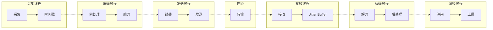

**Pipeline并行架构代码**：

```cpp
// C++: 全链路Pipeline并行架构
class FullPipeline {
public:
    FullPipeline() {
        // 创建各阶段线程
        captureThread_ = std::thread(&FullPipeline::captureLoop, this);
        encodeThread_ = std::thread(&FullPipeline::encodeLoop, this);
        sendThread_ = std::thread(&FullPipeline::sendLoop, this);
        receiveThread_ = std::thread(&FullPipeline::receiveLoop, this);
        decodeThread_ = std::thread(&FullPipeline::decodeLoop, this);
        renderThread_ = std::thread(&FullPipeline::renderLoop, this);
    }
    
private:
    // 采集线程
    void captureLoop() {
        setThreadPriority("capture");
        while (running_) {
            auto frame = captureDevice_->captureFrame();
            frame->timestamp = getMonotonicTimeUs();
            captureToEncodeQueue_.enqueue(frame);
        }
    }
    
    // 编码线程
    void encodeLoop() {
        setThreadPriority("encode");
        while (running_) {
            auto frame = captureToEncodeQueue_.dequeue();
            
            // 前处理
            preprocessor_->process(frame);
            
            // 编码
            auto packet = encoder_->encode(frame);
            packet->encodeTimestamp = getMonotonicTimeUs();
            
            encodeToSendQueue_.enqueue(packet);
        }
    }
    
    // 发送线程
    void sendLoop() {
        setThreadPriority("send");
        while (running_) {
            auto packet = encodeToSendQueue_.dequeue();
            
            // 封装
            auto rtpPacket = packetizer_->packetize(packet);
            
            // 发送
            network_->send(rtpPacket);
        }
    }
    
    // 接收线程
    void receiveLoop() {
        setThreadPriority("receive");
        while (running_) {
            auto rtpPacket = network_->receive();
            
            // 解封装
            auto packet = depacketizer_->depacketize(rtpPacket);
            
            // Jitter Buffer
            jitterBuffer_->insert(packet);
            
            // 触发解码（当缓冲足够时）
            if (jitterBuffer_->hasDecodableFrame()) {
                auto readyPacket = jitterBuffer_->getDecodableFrame();
                receiveToDecodeQueue_.enqueue(readyPacket);
            }
        }
    }
    
    // 解码线程
    void decodeLoop() {
        setThreadPriority("decode");
        while (running_) {
            auto packet = receiveToDecodeQueue_.dequeue();
            
            // 解码
            auto frame = decoder_->decode(packet);
            frame->decodeTimestamp = getMonotonicTimeUs();
            
            // 后处理
            postprocessor_->process(frame);
            
            decodeToRenderQueue_.enqueue(frame);
        }
    }
    
    // 渲染线程
    void renderLoop() {
        setThreadPriority("render");
        while (running_) {
            auto frame = decodeToRenderQueue_.dequeue();
            
            // 等待显示时间
            waitUntilDisplayTime(frame->pts);
            
            // 渲染
            renderer_->render(frame);
            
            // 记录渲染完成时间
            frame->renderTimestamp = getMonotonicTimeUs();
            
            // 上报延迟统计
            reportLatency(frame);
        }
    }
    
    void setThreadPriority(const std::string& role) {
        // 根据角色设置优先级
        if (role == "render") {
            // 渲染线程最高优先级
            setHighPriority();
        } else if (role == "capture" || role == "decode") {
            // 采集解码次高优先级
            setMediumPriority();
        }
    }
    
    std::atomic<bool> running_{true};
    
    // 线程间队列
    ThreadQueue<std::shared_ptr<VideoFrame>> captureToEncodeQueue_;
    ThreadQueue<std::shared_ptr<EncodedPacket>> encodeToSendQueue_;
    ThreadQueue<std::shared_ptr<EncodedPacket>> receiveToDecodeQueue_;
    ThreadQueue<std::shared_ptr<VideoFrame>> decodeToRenderQueue_;
    
    // 线程
    std::thread captureThread_;
    std::thread encodeThread_;
    std::thread sendThread_;
    std::thread receiveThread_;
    std::thread decodeThread_;
    std::thread renderThread_;
};
```

### 9.2 线程模型设计

各线程职责与优先级分配：

| 线程 | 职责 | 优先级 | CPU亲和性 | 说明 |
|-----|------|-------|----------|------|
| **采集线程** | 摄像头数据采集 | 高 | 大核 | 避免丢帧 |
| **编码线程** | 前处理+编码 | 中高 | 大核 | 保证编码实时性 |
| **发送线程** | 封装+网络发送 | 中 | 任意 | 受网络影响 |
| **接收线程** | 网络接收+解封装 | 中 | 任意 | 及时接收数据 |
| **解码线程** | 解码+后处理 | 高 | 大核 | 避免解码延迟 |
| **渲染线程** | 视频渲染 | 最高 | 大核 | 保证流畅显示 |
| **控制线程** | 码率控制+状态管理 | 低 | 小核 | 后台任务 |

### 9.3 Zero-copy全链路实践

Zero-copy贯穿采集→编码→传输→解码→渲染全流程：

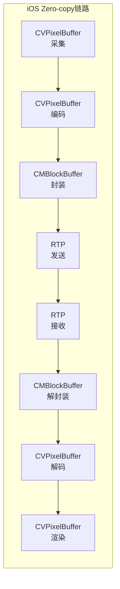

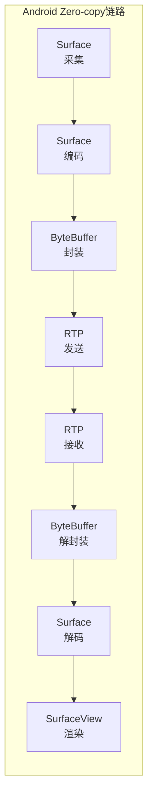

**iOS Zero-copy实现**：

```objc
// Objective-C: iOS全链路Zero-copy
// 1. 采集：使用CVPixelBufferPool
CVPixelBufferPoolRef captureBufferPool;
CVPixelBufferPoolCreate(NULL, NULL, bufferAttributes, &captureBufferPool);

// 2. 编码：直接传递CVPixelBuffer
VTCompressionSessionEncodeFrame(
    compressionSession,
    pixelBuffer,  // 从采集获取的CVPixelBuffer
    presentationTimeStamp,
    duration,
    frameProperties,
    sourceFrameRefCon,
    &infoFlagsOut
);

// 3. 解码：输出到CVPixelBuffer
VTDecompressionSessionDecodeFrame(
    decompressionSession,
    sampleBuffer,
    decodeFlags,
    sourceFrameRefCon,
    &infoFlagsOut
);
// 回调中直接获取CVPixelBuffer

// 4. 渲染：CVPixelBuffer直接上屏
CVMetalTextureRef metalTexture;
CVMetalTextureCacheCreateTextureFromImage(
    NULL,
    metalTextureCache,
    pixelBuffer,
    NULL,
    MTLPixelFormatBGRA8Unorm,
    width,
    height,
    0,
    &metalTexture
);
// 使用metalTexture渲染
```

**Android Zero-copy实现**：

```java
// Java: Android全链路Zero-copy
// 1. 采集：使用ImageReader获取Image
ImageReader imageReader = ImageReader.newInstance(
    width, height, ImageFormat.YUV_420_888, 2);

// 2. 编码：使用Surface模式
MediaCodec encoder = MediaCodec.createEncoderByType("video/avc");
encoder.configure(format, null, null, MediaCodec.CONFIGURE_FLAG_ENCODE);
Surface inputSurface = encoder.createInputSurface();
encoder.start();

// 3. 解码：使用Surface模式
MediaCodec decoder = MediaCodec.createDecoderByType("video/avc");
decoder.configure(format, outputSurface, null, 0);
decoder.start();

// 4. 渲染：直接渲染到SurfaceView/TextureView
SurfaceHolder holder = surfaceView.getHolder();
Canvas canvas = holder.lockCanvas();
// 绘制
canvas.drawBitmap(bitmap, 0, 0, null);
holder.unlockCanvasAndPost(canvas);
```

### 9.4 线程间通信与同步机制

高效的线程间通信是Pipeline并行的基础：

```cpp
// C++: 无锁队列实现（线程间通信）
template<typename T>
class LockFreeQueue {
public:
    LockFreeQueue(size_t capacity) 
        : capacity_(capacity),
          buffer_(new std::atomic<T*>[capacity]),
          head_(0),
          tail_(0) {
        for (size_t i = 0; i < capacity; i++) {
            buffer_[i].store(nullptr, std::memory_order_relaxed);
        }
    }
    
    ~LockFreeQueue() {
        delete[] buffer_;
    }
    
    // 入队（生产者调用）
    bool enqueue(T* item) {
        size_t currentTail = tail_.load(std::memory_order_relaxed);
        size_t nextTail = (currentTail + 1) % capacity_;
        
        if (nextTail == head_.load(std::memory_order_acquire)) {
            return false;  // 队列满
        }
        
        buffer_[currentTail].store(item, std::memory_order_release);
        tail_.store(nextTail, std::memory_order_release);
        return true;
    }
    
    // 出队（消费者调用）
    T* dequeue() {
        size_t currentHead = head_.load(std::memory_order_relaxed);
        
        if (currentHead == tail_.load(std::memory_order_acquire)) {
            return nullptr;  // 队列空
        }
        
        T* item = buffer_[currentHead].load(std::memory_order_acquire);
        buffer_[currentHead].store(nullptr, std::memory_order_relaxed);
        head_.store((currentHead + 1) % capacity_, std::memory_order_release);
        return item;
    }
    
private:
    size_t capacity_;
    std::atomic<T*>* buffer_;
    std::atomic<size_t> head_;
    std::atomic<size_t> tail_;
};

// 使用信号量的阻塞队列
template<typename T>
class SemaphoreQueue {
public:
    void enqueue(T item) {
        {
            std::lock_guard<std::mutex> lock(mutex_);
            queue_.push(std::move(item));
        }
        semaphore_.release();
    }
    
    T dequeue() {
        semaphore_.acquire();
        std::lock_guard<std::mutex> lock(mutex_);
        T item = std::move(queue_.front());
        queue_.pop();
        return item;
    }
    
private:
    std::queue<T> queue_;
    std::mutex mutex_;
    std::counting_semaphore<> semaphore_{0};
};
```

---

## 第10章 How — 延迟测量与监控

### 10.1 端到端延迟测量方法

**画面打点法**（最准确的延迟测量）：

```cpp
// C++: 画面打点法延迟测量
class FrameTimestampOverlay {
public:
    // 在发送端画面嵌入时间戳
    void embedTimestamp(VideoFrame* frame, int64_t timestamp) {
        // 将时间戳编码为二维码或数字水印嵌入画面
        // 格式：HH:MM:SS.mmm
        char timestampStr[16];
        formatTimestamp(timestamp, timestampStr, sizeof(timestampStr));
        
        // 在画面角落绘制时间戳
        drawText(frame, timestampStr, 10, 30);
    }
    
    // 在接收端识别时间戳并计算延迟
    int64_t measureLatency(VideoFrame* receivedFrame) {
        // 从画面中识别时间戳
        int64_t sentTimestamp = recognizeTimestamp(receivedFrame);
        int64_t receivedTimestamp = getMonotonicTimeMs();
        
        return receivedTimestamp - sentTimestamp;
    }
};
```

**时间戳差值法**（工程常用）：

```cpp
// C++: 时间戳差值法延迟测量
class LatencyTracker {
public:
    struct LatencyMetrics {
        int64_t captureToEncode;    // 采集到编码
        int64_t encodeToSend;       // 编码到发送
        int64_t sendToReceive;      // 发送到接收（网络延迟）
        int64_t receiveToDecode;    // 接收到解码
        int64_t decodeToRender;     // 解码到渲染
        int64_t endToEnd;           // 端到端延迟
    };
    
    // 发送端打点
    void markCapture(int64_t frameId, int64_t timestamp) {
        auto& record = frameRecords_[frameId];
        record.captureTime = timestamp;
    }
    
    void markEncodeComplete(int64_t frameId, int64_t timestamp) {
        auto& record = frameRecords_[frameId];
        record.encodeCompleteTime = timestamp;
    }
    
    void markSend(int64_t frameId, int64_t timestamp, int64_t rtpTimestamp) {
        auto& record = frameRecords_[frameId];
        record.sendTime = timestamp;
        record.rtpTimestamp = rtpTimestamp;
        
        // 通过RTCP或自定义协议同步时间戳
        sendTimestampMapping(rtpTimestamp, timestamp);
    }
    
    // 接收端打点
    void markReceive(int64_t rtpTimestamp, int64_t timestamp) {
        // 查找对应的frameId
        int64_t frameId = findFrameIdByRtpTimestamp(rtpTimestamp);
        auto& record = frameRecords_[frameId];
        record.receiveTime = timestamp;
    }
    
    void markDecodeComplete(int64_t frameId, int64_t timestamp) {
        auto& record = frameRecords_[frameId];
        record.decodeCompleteTime = timestamp;
    }
    
    void markRender(int64_t frameId, int64_t timestamp) {
        auto& record = frameRecords_[frameId];
        record.renderTime = timestamp;
        
        // 计算并上报延迟
        LatencyMetrics metrics = calculateMetrics(record);
        reportLatency(frameId, metrics);
        
        // 清理记录
        frameRecords_.erase(frameId);
    }
    
private:
    LatencyMetrics calculateMetrics(const FrameRecord& record) {
        LatencyMetrics metrics;
        metrics.captureToEncode = record.encodeCompleteTime - record.captureTime;
        metrics.encodeToSend = record.sendTime - record.encodeCompleteTime;
        metrics.sendToReceive = record.receiveTime - record.sendTime;
        metrics.receiveToDecode = record.decodeCompleteTime - record.receiveTime;
        metrics.decodeToRender = record.renderTime - record.decodeCompleteTime;
        metrics.endToEnd = record.renderTime - record.captureTime;
        return metrics;
    }
    
    struct FrameRecord {
        int64_t captureTime = 0;
        int64_t encodeCompleteTime = 0;
        int64_t sendTime = 0;
        int64_t rtpTimestamp = 0;
        int64_t receiveTime = 0;
        int64_t decodeCompleteTime = 0;
        int64_t renderTime = 0;
    };
    
    std::unordered_map<int64_t, FrameRecord> frameRecords_;
    mutable std::mutex mutex_;
};
```

### 10.2 各环节延迟埋点方案

**全链路埋点位置**：

```
采集 → [埋点:采集完成] → 前处理 → [埋点:处理完成] → 编码 → [埋点:编码完成]
  → 封装 → [埋点:发送完成] → 网络 → [埋点:接收完成] → 解封装
  → [埋点:解码开始] → 解码 → [埋点:解码完成] → 后处理 → [埋点:渲染完成]
```

**埋点代码示例**：

```cpp
// C++: 延迟埋点实现
#define TRACE_LATENCY(event, frameId, timestamp) \
    LatencyTracer::instance().trace(event, frameId, timestamp)

class LatencyTracer {
public:
    static LatencyTracer& instance() {
        static LatencyTracer instance;
        return instance;
    }
    
    enum Event {
        CAPTURE_COMPLETE,
        PREPROCESS_COMPLETE,
        ENCODE_COMPLETE,
        SEND_COMPLETE,
        RECEIVE_COMPLETE,
        DECODE_START,
        DECODE_COMPLETE,
        RENDER_COMPLETE
    };
    
    void trace(Event event, int64_t frameId, int64_t timestamp) {
        if (timestamp == 0) {
            timestamp = getMonotonicTimeUs();
        }
        
        LatencyEvent latencyEvent;
        latencyEvent.event = event;
        latencyEvent.frameId = frameId;
        latencyEvent.timestamp = timestamp;
        latencyEvent.threadId = std::this_thread::get_id();
        
        // 批量上报，减少开销
        std::lock_guard<std::mutex> lock(bufferMutex_);
        eventBuffer_.push_back(latencyEvent);
        
        if (eventBuffer_.size() >= BATCH_SIZE) {
            flushBuffer();
        }
    }
    
    void flushBuffer() {
        if (eventBuffer_.empty()) return;
        
        // 上报到监控系统
        reportToMonitor(eventBuffer_);
        eventBuffer_.clear();
    }
    
private:
    struct LatencyEvent {
        Event event;
        int64_t frameId;
        int64_t timestamp;
        std::thread::id threadId;
    };
    
    static constexpr size_t BATCH_SIZE = 100;
    std::vector<LatencyEvent> eventBuffer_;
    std::mutex bufferMutex_;
};

// 使用示例
void captureCallback(VideoFrame* frame) {
    TRACE_LATENCY(LatencyTracer::CAPTURE_COMPLETE, frame->id, frame->timestamp);
    
    // 前处理
    preprocessor->process(frame);
    TRACE_LATENCY(LatencyTracer::PREPROCESS_COMPLETE, frame->id, 0);
    
    // 编码
    encoder->encode(frame);
    TRACE_LATENCY(LatencyTracer::ENCODE_COMPLETE, frame->id, 0);
}
```

### 10.3 延迟告警与治理

**延迟告警阈值配置**：

| 指标 | 正常范围 | 警告阈值 | 严重阈值 | 处理策略 |
|-----|---------|---------|---------|---------|
| **端到端延迟** | < 200ms | 300ms | 500ms | 降级码率/分辨率 |
| **采集延迟** | < 20ms | 30ms | 50ms | 降低帧率/分辨率 |
| **编码延迟** | < 15ms | 25ms | 40ms | 切换硬编/降复杂度 |
| **网络延迟** | < 100ms | 150ms | 250ms | 切换线路/降码率 |
| **缓冲延迟** | < 80ms | 120ms | 200ms | 调整缓冲策略 |
| **解码延迟** | < 15ms | 25ms | 40ms | 切换硬解/降分辨率 |
| **渲染延迟** | < 20ms | 30ms | 50ms | 优化渲染路径 |

**延迟治理流程**：

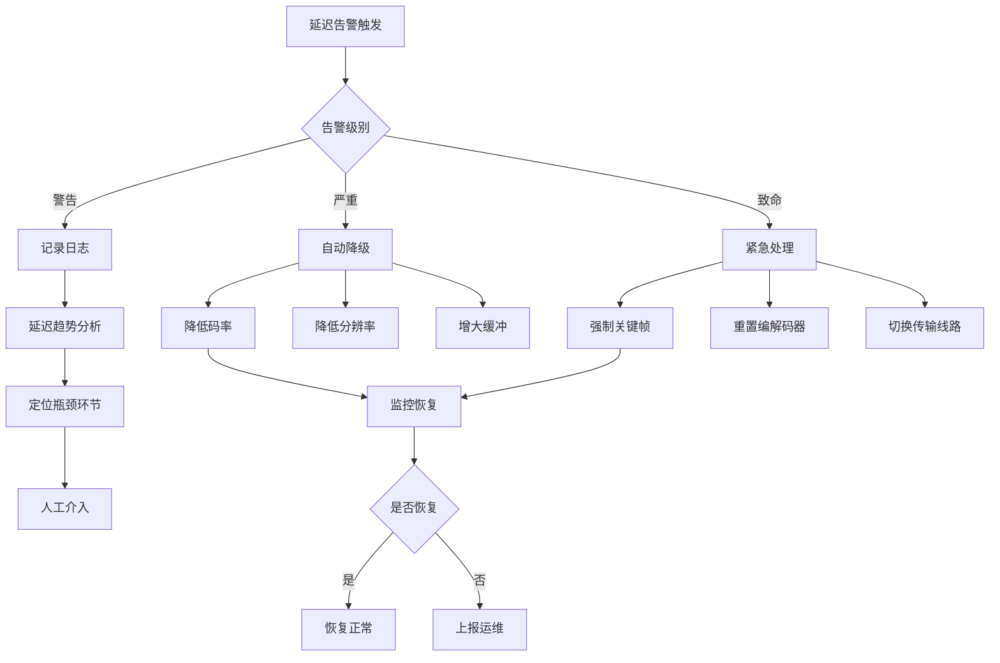

---

## 第11章 最佳实践清单

### 11.1 分场景延迟优化配置推荐

**实时通话场景（RTC）**：

| 配置项 | 推荐值 | 说明 |
|-------|-------|------|
| 帧率 | 30fps | 平衡延迟和流畅度 |
| 分辨率 | 720p | 清晰度和编码延迟平衡 |
| 编码器 | 硬件编码 | 延迟最低 |
| B帧 | 禁用 | 消除B帧延迟 |
| GOP | 2秒 | 合理的随机访问能力 |
| 码率控制 | CBR | 稳定码率 |
| Jitter Buffer | 自适应（20-80ms） | 根据网络动态调整 |
| 目标延迟 | < 200ms | 用户无感知 |

**互动直播场景**：

| 配置项 | 推荐值 | 说明 |
|-------|-------|------|
| 帧率 | 30fps | 标准帧率 |
| 分辨率 | 1080p | 高清体验 |
| 编码器 | 硬件编码 | 保证流畅 |
| B帧 | 1-2帧 | 提升压缩效率 |
| GOP | 2-4秒 | 适应CDN分发 |
| 码率控制 | ABR | 自适应带宽 |
| Jitter Buffer | 自适应（50-150ms） | 平衡延迟和流畅 |
| 目标延迟 | < 500ms | 可接受延迟 |

**游戏直播场景**：

| 配置项 | 推荐值 | 说明 |
|-------|-------|------|
| 帧率 | 60fps | 流畅体验 |
| 分辨率 | 1080p | 高清 |
| 编码器 | 硬件编码 | 低延迟 |
| B帧 | 禁用 | 超低延迟 |
| GOP | 1秒 | 快速恢复 |
| 码率控制 | CBR | 稳定 |
| Jitter Buffer | 最小化（20-50ms） | 延迟优先 |
| 目标延迟 | < 100ms | 操作同步 |

### 11.2 延迟优化Checklist

**采集优化**：
- [ ] 使用硬件原生格式（NV12/YUV420）避免转换
- [ ] 固定帧率和曝光时间，避免自动调整抖动
- [ ] 禁用自动对焦或使用连续对焦
- [ ] 使用专用高优先级采集线程
- [ ] 启用丢弃延迟帧选项

**编码优化**：
- [ ] 优先使用硬件编码
- [ ] 禁用B帧（实时场景）
- [ ] 使用zerolatency tune
- [ ] 配置合理的GOP大小
- [ ] 使用CBR码率控制

**传输优化**：
- [ ] 启用Pacing平滑发送
- [ ] 配置合理的NACK延迟预算
- [ ] 选择最优接入点
- [ ] 启用FEC对抗丢包
- [ ] 配置自适应码率

**接收端优化**：
- [ ] 使用自适应Jitter Buffer
- [ ] 启用加速追帧机制
- [ ] 优先使用硬件解码
- [ ] 解码渲染并行
- [ ] 使用低延迟渲染路径

**Pipeline优化**：
- [ ] 全链路Pipeline并行
- [ ] Zero-copy数据通路
- [ ] 合理的线程优先级
- [ ] 无锁队列通信
- [ ] 完善的延迟埋点

**监控治理**：
- [ ] 端到端延迟测量
- [ ] 各环节延迟埋点
- [ ] 延迟告警配置
- [ ] 自动降级策略
- [ ] 延迟趋势分析

---

## 参考资源

### 标准文档

- WebRTC Specification: https://www.w3.org/TR/webrtc/
- RTP/RTCP Specification: RFC 3550, RFC 4585
- GCC Congestion Control: RFC 8298
- NACK机制: RFC 4585

### 权威书籍

- 《WebRTC权威指南》 - Alan B. Johnston
- 《实时音视频技术解析》 - 李智慧
- 《视频编码全角度详解》 - 毕厚杰
- 《High Performance Browser Networking》 - Ilya Grigorik

### 开源项目

| 项目 | 链接 | 描述 |
|------|------|------|
| WebRTC | https://webrtc.org/ | Google开源RTC框架 |
| FFmpeg | https://ffmpeg.org/ | 多媒体处理工具 |
| x264/x265 | https://www.videolan.org/developers/x264.html | H.264/H.265编码器 |
| SRT | https://github.com/Haivision/srt | 安全可靠传输协议 |

### 在线资源

- WebRTC Internals: chrome://webrtc-internals/
- TestRTC: https://testrtc.com/
- WebRTC Samples: https://webrtc.github.io/samples/

---

> 本文是音视频链路优化系列的延时优化专题。延时优化需要全链路系统化思维，单点优化往往事倍功半。建议结合[采集优化](../01_采集优化/采集优化_详细解析.md)、[编码优化](../02_编码优化/编码优化_详细解析.md)、[传输优化](../03_传输优化/传输优化_详细解析.md)等文档，建立完整的优化体系。
