# 秒出优化详细解析

> **TL;DR：秒出优化的核心在于"预"与"并"——预加载关键资源、预建立网络连接、预初始化编解码器，同时并行化处理信令与媒体通道。通过全链路的精细化优化，可将首帧时间从3-5秒降至500ms以内，实现真正的"秒开"体验。本文档提供从信令到渲染的完整优化方案，涵盖iOS/Android/C++的工程实践。**

---

## 核心结论（TL;DR）

**秒出优化的本质是在用户感知前完成所有准备工作。**

现代秒出技术的关键支柱：

1. **预加载策略**：在业务可预见的场景提前加载播放器、建立连接、缓存关键帧
2. **并行化处理**：打破串行依赖，信令与媒体通道同时建立、编解码器与网络同时初始化
3. **关键帧优先**：GOP设计、服务端缓存、快速请求机制确保首帧必是IDR帧
4. **资源池化**：编解码器实例池、连接池复用，避免冷启动开销
5. **全链路度量**：从点击到渲染的完整埋点，精准定位瓶颈环节

**一句话理解秒出优化**：与其让用户"等待加载"，不如让系统"提前准备"——秒出优化本质上是一种**时间换空间**的工程艺术。

---

## 第1章 Why — 首帧体验的重要性

### 1.1 首帧时间对用户留存的影响

首帧时间是用户进入音视频场景的第一感知，直接影响用户留存和转化率：

| 首帧时间 | 用户感知 | 留存率影响 | 跳出率变化 | 业务影响 |
|---------|---------|-----------|-----------|---------|
| < 500ms | 秒开，无感知 | 基准值 | 基准值 | 体验优秀 |
| 500ms - 1s | 较快，可接受 | -5% | +10% | 体验良好 |
| 1s - 3s | 明显等待 | -15% | +30% | 体验一般 |
| 3s - 5s | 漫长等待 | -35% | +60% | 体验较差 |
| > 5s | 极度不耐烦 | -50% | +100% | 体验极差 |

**关键数据支撑**：

- Google研究显示：页面加载时间从1s增加到3s，跳出率增加32%
- 亚马逊统计：每增加100ms延迟，转化率下降1%
- 音视频场景：首帧时间每减少1s，直播观看时长平均增加15%

**用户心理阈值**：

```
0-100ms  : 即时响应感知阈值
100-300ms: 流畅操作感知阈值
300-500ms: 秒开体验感知阈值
500ms-1s : 可接受等待阈值
1s-3s    : 明显等待感知
> 3s     : 用户开始流失
```

### 1.2 不同场景的首帧要求

不同业务场景对首帧时间的要求差异显著：

| 场景类型 | 目标首帧 | 可接受首帧 | 技术特征 | 优化重点 |
|---------|---------|-----------|---------|---------|
| **1v1实时通话** | < 300ms | < 800ms | 双向建立、P2P优先 | 信令加速、ICE快速收集 |
| **多人会议** | < 500ms | < 1s | SFU架构、多路流 | 并行订阅、选择性订阅 |
| **互动直播** | < 500ms | < 1s | 单向分发、CDN边缘 | 预连接、GOP缓存 |
| **普通直播** | < 1s | < 3s | CDN分发、大并发 | 边缘节点、播放器预加载 |
| **短视频** | < 200ms | < 500ms | 本地优先、预加载 | 本地缓存、预解码 |
| **直播回放** | < 1s | < 3s | 点播特性、seekable | 预加载、关键帧索引 |

**场景化优化策略**：

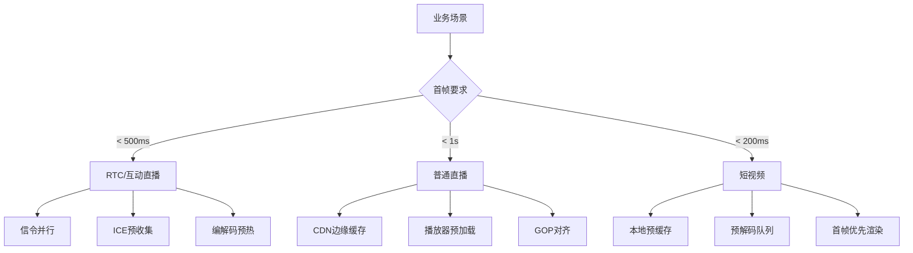
```mermaid
graph TD
    A[业务场景] --> B{首帧要求}
    B -->|< 500ms| C[RTC/互动直播]
    B -->|< 1s| D[普通直播]
    B -->|< 200ms| E[短视频]
    
    C --> C1[信令并行]
    C --> C2[ICE预收集]
    C --> C3[编解码预热]
    
    D --> D1[CDN边缘缓存]
    D --> D2[播放器预加载]
    D --> D3[GOP对齐]
    
    E --> E1[本地预缓存]
    E --> E2[预解码队列]
    E --> E3[首帧优先渲染]
```

### 1.3 首帧时间的定义与测量标准

**首帧时间的精确定义**：

```
首帧时间 = 首帧渲染完成时间戳 - 用户触发播放时间戳
```

**测量起点争议与选择**：

| 测量起点 | 定义 | 适用场景 | 优缺点 |
|---------|------|---------|-------|
| 用户点击 | 用户点击播放按钮 | 点播、直播 | 最贴近用户感知，但包含UI响应时间 |
| 开始加载 | 调用播放器load() | 统一标准 | 排除UI差异，但可能遗漏准备时间 |
| 首包到达 | 收到第一个媒体包 | 技术测量 | 纯网络指标，不包含解码渲染 |
| 首帧解码 | 解码器输出首帧 | 解码优化 | 聚焦解码性能，不包含网络 |

**推荐测量方案**：

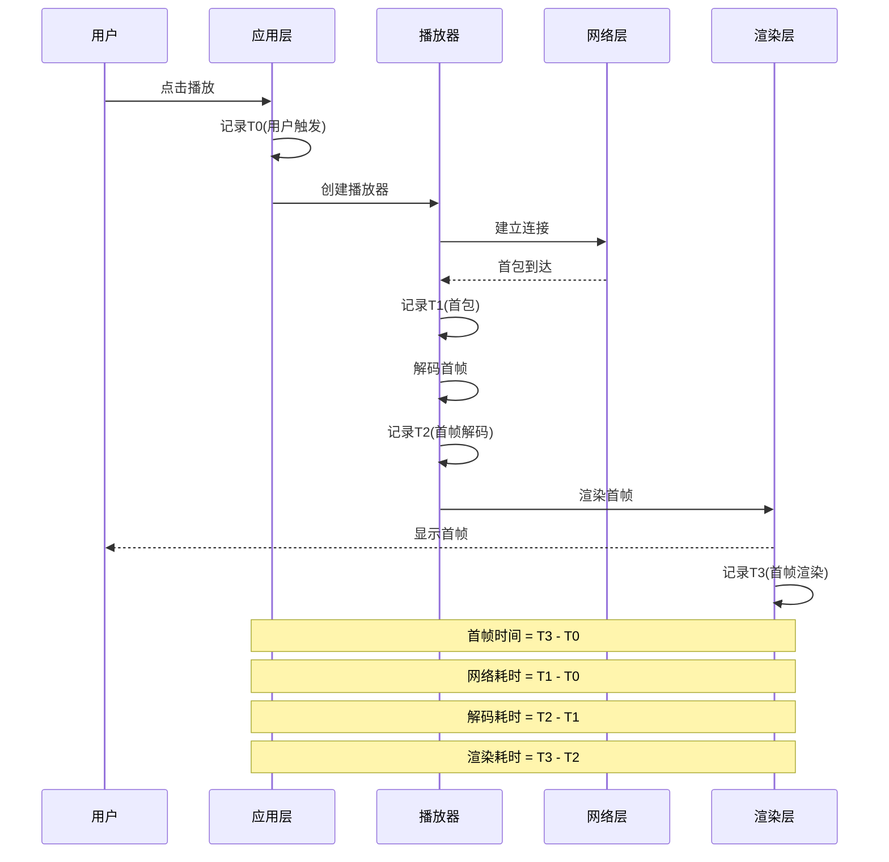
```mermaid
sequenceDiagram
    participant U as 用户
    participant App as 应用层
    participant Player as 播放器
    participant Net as 网络层
    participant Render as 渲染层
    
    U->>App: 点击播放
    App->>App: 记录T0(用户触发)
    App->>Player: 创建播放器
    Player->>Net: 建立连接
    Net-->>Player: 首包到达
    Player->>Player: 记录T1(首包)
    Player->>Player: 解码首帧
    Player->>Player: 记录T2(首帧解码)
    Player->>Render: 渲染首帧
    Render-->>U: 显示首帧
    Render->>Render: 记录T3(首帧渲染)
    
    Note over App,Render: 首帧时间 = T3 - T0
    Note over App,Render: 网络耗时 = T1 - T0
    Note over App,Render: 解码耗时 = T2 - T1
    Note over App,Render: 渲染耗时 = T3 - T2
```

**核心指标定义**：

| 指标名称 | 定义 | 目标值 | 告警阈值 |
|---------|------|-------|---------|
| 首帧时间(TTF) | T3 - T0 | < 500ms | > 1s |
| 网络准备时间 | T1 - T0 | < 300ms | > 500ms |
| 解码准备时间 | T2 - T1 | < 100ms | > 200ms |
| 渲染准备时间 | T3 - T2 | < 50ms | > 100ms |
| 首帧成功率 | 首帧成功次数/总尝试 | > 99% | < 95% |

---

## 第2章 What — 首帧延迟拆解

### 2.1 首帧链路时序图

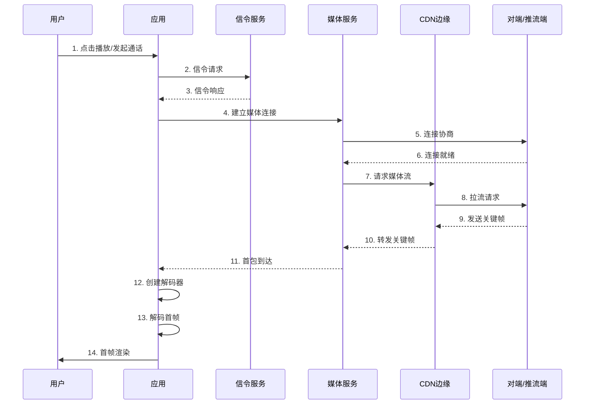
```mermaid
sequenceDiagram
    participant U as 用户
    participant App as 应用
    participant Sig as 信令服务
    participant Media as 媒体服务
    participant CDN as CDN边缘
    participant Peer as 对端/推流端
    
    U->>App: 1. 点击播放/发起通话
    App->>Sig: 2. 信令请求
    Sig-->>App: 3. 信令响应
    
    App->>Media: 4. 建立媒体连接
    Media->>Peer: 5. 连接协商
    Peer-->>Media: 6. 连接就绪
    
    Media->>CDN: 7. 请求媒体流
    CDN->>Peer: 8. 拉流请求
    Peer-->>CDN: 9. 发送关键帧
    CDN-->>Media: 10. 转发关键帧
    Media-->>App: 11. 首包到达
    
    App->>App: 12. 创建解码器
    App->>App: 13. 解码首帧
    App->>U: 14. 首帧渲染
```

### 2.2 各环节耗时占比分析

**典型RTC场景首帧耗时分布**：

| 环节 | 理想值 | 典型值 | 劣化值 | 占比 | 优化潜力 |
|-----|-------|-------|-------|------|---------|
| **信令交互** | 50ms | 100ms | 300ms | 20% | 高 |
| **连接建立** | 100ms | 200ms | 500ms | 40% | 极高 |
| **首帧获取** | 50ms | 100ms | 300ms | 20% | 高 |
| **解码器创建** | 30ms | 50ms | 150ms | 10% | 中 |
| **首帧解码** | 20ms | 30ms | 80ms | 6% | 低 |
| **渲染准备** | 10ms | 20ms | 50ms | 4% | 中 |
| **总计** | **260ms** | **500ms** | **1.5s** | 100% | - |

**直播场景首帧耗时分布**：

| 环节 | 理想值 | 典型值 | 劣化值 | 占比 | 优化潜力 |
|-----|-------|-------|-------|------|---------|
| **DNS解析** | 10ms | 50ms | 200ms | 10% | 中 |
| **TCP/TLS握手** | 100ms | 200ms | 500ms | 40% | 高 |
| **播放器初始化** | 50ms | 100ms | 300ms | 20% | 高 |
| **首帧获取** | 50ms | 100ms | 300ms | 20% | 高 |
| **解码渲染** | 50ms | 100ms | 300ms | 10% | 中 |
| **总计** | **260ms** | **550ms** | **1.6s** | 100% | - |

**耗时分布可视化**：

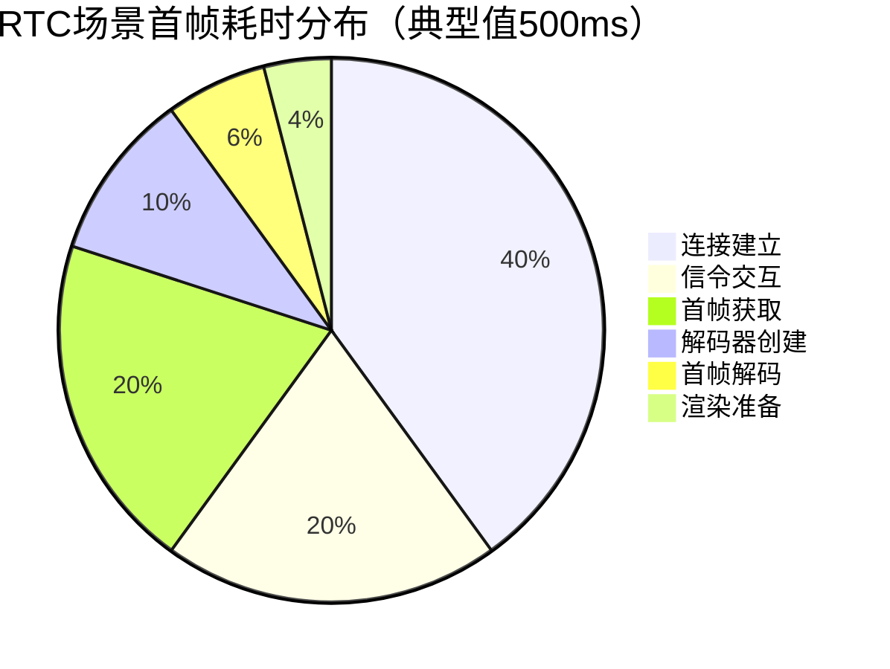
```mermaid
pie title RTC场景首帧耗时分布（典型值500ms）
    "连接建立" : 200
    "信令交互" : 100
    "首帧获取" : 100
    "解码器创建" : 50
    "首帧解码" : 30
    "渲染准备" : 20
```

### 2.3 首帧优化MECE分类


```mermaid
graph TD
    A[首帧优化] --> B[信令链路优化]
    A --> C[连接建立优化]
    A --> D[编解码器优化]
    A --> E[关键帧获取优化]
    A --> F[播放器优化]
    A --> G[服务端优化]
    
    B --> B1[协议选型]
    B --> B2[预建立]
    B --> B3[消息精简]
    B --> B4[并行化]
    
    C --> C1[ICE加速]
    C --> C2[预连接]
    C --> C3[握手优化]
    C --> C4[连接池]
    
    D --> D1[编码器预热]
    D --> D2[解码器预创建]
    D --> D3[参数预配置]
    D --> D4[实例池化]
    
    E --> E1[GOP设计]
    E --> E2[快速请求]
    E --> E3[服务端缓存]
    E --> E4[IDR立即发送]
    
    F --> F1[组件预加载]
    F --> F2[缓冲区预分配]
    F --> F3[Surface预创建]
    F --> F4[后处理跳过]
    
    G --> G1[边缘缓存]
    G --> G2[GOP对齐]
    G --> G3[快速转发]
    G --> G4[就近接入]
```

**优化手段收益预估**：

| 优化方向 | 具体手段 | 预期收益 | 实施难度 | 优先级 |
|---------|---------|---------|---------|-------|
| 连接预建立 | WebSocket长连接复用 | -100ms | 低 | P0 |
| ICE加速 | 预收集候选、relay优先 | -150ms | 中 | P0 |
| 编解码预热 | 提前初始化编码器 | -50ms | 中 | P1 |
| GOP优化 | 短GOP+服务端缓存 | -200ms | 低 | P0 |
| 播放器预加载 | 提前创建播放器实例 | -100ms | 低 | P0 |
| 信令并行 | 信令媒体并行建立 | -80ms | 中 | P1 |

---

## 第3章 How — 信令链路加速

### 3.1 信令协议选型

不同信令协议的首帧性能对比：

| 协议 | 连接建立延迟 | 首包延迟 | 适用场景 | 秒出优化建议 |
|-----|------------|---------|---------|-------------|
| **WebSocket** | 1-RTT | 低 | RTC、实时游戏 | 长连接复用 |
| **HTTP/1.1** | 1-RTT | 中 | 传统直播 | 连接池、Keep-Alive |
| **HTTP/2** | 1-RTT | 低 | 多路复用场景 | 多路复用、头部压缩 |
| **HTTP/3(QUIC)** | 0-RTT | 极低 | 弱网环境 | 0-RTT连接建立 |
| **TCP自定义** | 1-RTT | 低 | 私有协议 | 连接预建立 |
| **UDP自定义** | 0-RTT | 极低 | 超低延迟 | 并行建立 |

**协议选型决策树**：

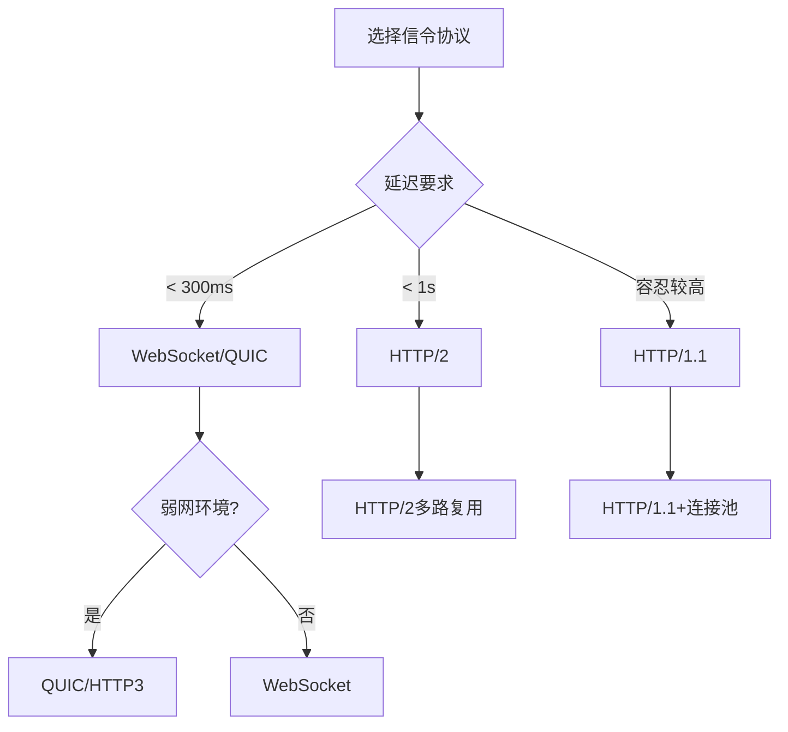
```mermaid
graph TD
    A[选择信令协议] --> B{延迟要求}
    B -->|< 300ms| C[WebSocket/QUIC]
    B -->|< 1s| D[HTTP/2]
    B -->|容忍较高| E[HTTP/1.1]
    
    C --> C1{弱网环境?}
    C1 -->|是| C2[QUIC/HTTP3]
    C1 -->|否| C3[WebSocket]
    
    D --> D1[HTTP/2多路复用]
    
    E --> E1[HTTP/1.1+连接池]
```

### 3.2 信令连接预建立

**预建立策略**：

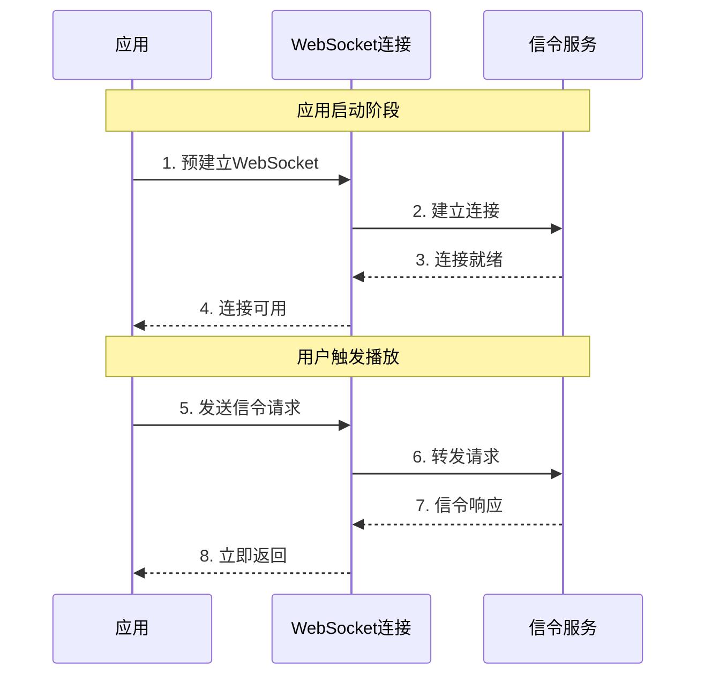
```mermaid
sequenceDiagram
    participant App as 应用
    participant WS as WebSocket连接
    participant Sig as 信令服务
    
    Note over App,Sig: 应用启动阶段
    App->>WS: 1. 预建立WebSocket
    WS->>Sig: 2. 建立连接
    Sig-->>WS: 3. 连接就绪
    WS-->>App: 4. 连接可用
    
    Note over App,Sig: 用户触发播放
    App->>WS: 5. 发送信令请求
    WS->>Sig: 6. 转发请求
    Sig-->>WS: 7. 信令响应
    WS-->>App: 8. 立即返回
```

**iOS WebSocket预建立示例**：

```objc
// WebSocketManager.h
@interface WebSocketManager : NSObject

+ (instancetype)sharedManager;

// 预建立连接
- (void)preconnect;

// 发送信令（复用已有连接）
- (void)sendSignaling:(NSDictionary *)message 
           completion:(void (^)(NSDictionary *response))completion;

// 断开连接
- (void)disconnect;

@end

// WebSocketManager.m
@implementation WebSocketManager

- (void)preconnect {
    if (self.webSocket.readyState == SR_OPEN) {
        return; // 已连接
    }
    
    NSURLRequest *request = [NSURLRequest requestWithURL:
        [NSURL URLWithString:@"wss://signal.example.com/ws"]];
    
    self.webSocket = [[SRWebSocket alloc] initWithURLRequest:request];
    self.webSocket.delegate = self;
    [self.webSocket open];
    
    // 记录预建立时间
    self.preconnectStartTime = CACurrentMediaTime();
}

- (void)webSocketDidOpen:(SRWebSocket *)webSocket {
    NSTimeInterval cost = CACurrentMediaTime() - self.preconnectStartTime;
    NSLog(@"WebSocket预建立完成，耗时: %.3fms", cost * 1000);
    
    // 上报埋点
    [self reportMetric:@"ws_preconnect_time" value:@(cost * 1000)];
}

- (void)sendSignaling:(NSDictionary *)message 
           completion:(void (^)(NSDictionary *))completion {
    // 确保连接已建立
    if (self.webSocket.readyState != SR_OPEN) {
        [self preconnect];
        // 等待连接就绪后发送
        [self.pendingMessages addObject:@{message: completion}];
        return;
    }
    
    NSData *data = [NSJSONSerialization dataWithJSONObject:message options:0 error:nil];
    [self.webSocket send:data];
    
    // 存储回调
    NSString *msgId = message[@"msg_id"];
    self.pendingCompletions[msgId] = completion;
}

@end
```

**Android WebSocket预建立示例**：

```kotlin
// WebSocketManager.kt
class WebSocketManager private constructor() {
    
    private var webSocket: WebSocket? = null
    private val client = OkHttpClient.Builder()
        .pingInterval(30, TimeUnit.SECONDS)
        .build()
    
    companion object {
        @Volatile
        private var instance: WebSocketManager? = null
        
        fun getInstance(): WebSocketManager {
            return instance ?: synchronized(this) {
                instance ?: WebSocketManager().also { instance = it }
            }
        }
    }
    
    // 预建立连接
    fun preconnect() {
        if (webSocket != null) return
        
        val request = Request.Builder()
            .url("wss://signal.example.com/ws")
            .build()
            
        val startTime = System.currentTimeMillis()
        
        webSocket = client.newWebSocket(request, object : WebSocketListener() {
            override fun onOpen(ws: WebSocket, response: Response) {
                val cost = System.currentTimeMillis() - startTime
                Log.d("WebSocket", "预建立完成，耗时: ${cost}ms")
                reportMetric("ws_preconnect_time", cost.toDouble())
            }
            
            override fun onMessage(ws: WebSocket, text: String) {
                handleResponse(text)
            }
        })
    }
    
    // 发送信令
    fun sendSignaling(message: Map<String, Any>, callback: (Map<String, Any>) -> Unit) {
        webSocket?.let {
            val json = JSONObject(message).toString()
            it.send(json)
            pendingCallbacks[message["msg_id"] as String] = callback
        } ?: run {
            preconnect()
            // 延迟发送
            pendingMessages.add(message to callback)
        }
    }
}
```

### 3.3 信令消息精简

**消息精简策略**：

| 优化手段 | 说明 | 收益 | 实施方式 |
|---------|------|------|---------|
| **字段裁剪** | 移除不必要的字段 | -30%大小 | 协议设计审查 |
| **字段压缩** | 使用短字段名 | -20%大小 | 字段命名规范 |
| **二进制协议** | 替代JSON | -50%大小 | Protobuf/FlatBuffers |
| **批量发送** | 合并多个消息 | 减少RTT | 消息队列 |

**JSON vs Protobuf对比**：

```protobuf
// 信令协议定义 (signaling.proto)
syntax = "proto3";

message JoinRoomRequest {
    string room_id = 1;
    string user_id = 2;
    int32 role = 3;  // 0:观众 1:主播
    DeviceInfo device = 4;
}

message DeviceInfo {
    string platform = 1;  // ios/android/web
    string version = 2;
    string device_id = 3;
}

message JoinRoomResponse {
    int32 code = 1;
    string message = 2;
    repeated MediaServer servers = 3;
    string token = 4;
}

message MediaServer {
    string url = 1;
    int32 priority = 2;
}
```

**大小对比**：

| 消息类型 | JSON大小 | Protobuf大小 | 压缩率 |
|---------|---------|-------------|-------|
| JoinRoomRequest | 245 bytes | 68 bytes | 72% |
| JoinRoomResponse | 512 bytes | 156 bytes | 70% |
| ICE候选交换 | 380 bytes | 95 bytes | 75% |

### 3.4 并行化处理

**信令与媒体通道并行建立**：

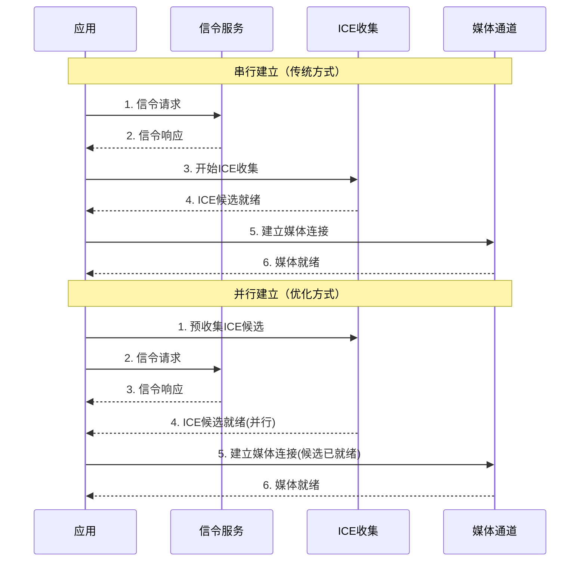
```mermaid
sequenceDiagram
    participant App as 应用
    participant Sig as 信令服务
    participant ICE as ICE收集
    participant Media as 媒体通道
    
    Note over App,Media: 串行建立（传统方式）
    App->>Sig: 1. 信令请求
    Sig-->>App: 2. 信令响应
    App->>ICE: 3. 开始ICE收集
    ICE-->>App: 4. ICE候选就绪
    App->>Media: 5. 建立媒体连接
    Media-->>App: 6. 媒体就绪
    
    Note over App,Media: 并行建立（优化方式）
    App->>ICE: 1. 预收集ICE候选
    App->>Sig: 2. 信令请求
    Sig-->>App: 3. 信令响应
    ICE-->>App: 4. ICE候选就绪(并行)
    App->>Media: 5. 建立媒体连接(候选已就绪)
    Media-->>App: 6. 媒体就绪
```

**并行化实现代码（C++）**：

```cpp
// ParallelConnectionManager.h
class ParallelConnectionManager {
public:
    struct ConnectionResult {
        bool signalingReady = false;
        bool iceReady = false;
        bool mediaReady = false;
        int64_t totalTimeMs = 0;
    };
    
    // 并行建立连接
    void connectParallel(const std::string& roomId, 
                        std::function<void(ConnectionResult)> callback);
    
private:
    void startSignaling(const std::string& roomId);
    void startIceCollection();
    void startMediaConnection();
    void checkAllReady();
    
    std::atomic<bool> signalingReady_{false};
    std::atomic<bool> iceReady_{false};
    std::atomic<bool> mediaReady_{false};
    std::chrono::steady_clock::time_point startTime_;
    std::function<void(ConnectionResult)> completionCallback_;
};

// ParallelConnectionManager.cpp
void ParallelConnectionManager::connectParallel(
    const std::string& roomId,
    std::function<void(ConnectionResult)> callback) {
    
    startTime_ = std::chrono::steady_clock::now();
    completionCallback_ = callback;
    
    // 并行启动三个任务
    std::thread sigThread([this, roomId]() { startSignaling(roomId); });
    std::thread iceThread([this]() { startIceCollection(); });
    
    sigThread.detach();
    iceThread.detach();
}

void ParallelConnectionManager::startSignaling(const std::string& roomId) {
    // 发送信令请求
    auto response = signalingClient_->joinRoom(roomId);
    
    signalingReady_ = true;
    
    // 信令完成后，启动媒体连接
    if (response.success) {
        startMediaConnection();
    }
    
    checkAllReady();
}

void ParallelConnectionManager::startIceCollection() {
    // ICE候选预收集
    iceAgent_->gatherCandidates([this]() {
        iceReady_ = true;
        checkAllReady();
    });
}

void ParallelConnectionManager::startMediaConnection() {
    // 等待ICE候选就绪后建立媒体连接
    while (!iceReady_.load()) {
        std::this_thread::sleep_for(std::chrono::milliseconds(10));
    }
    
    mediaClient_->connect([this](bool success) {
        mediaReady_ = true;
        checkAllReady();
    });
}

void ParallelConnectionManager::checkAllReady() {
    if (signalingReady_ && iceReady_ && mediaReady_) {
        auto endTime = std::chrono::steady_clock::now();
        auto duration = std::chrono::duration_cast<std::chrono::milliseconds>(
            endTime - startTime_).count();
        
        ConnectionResult result;
        result.signalingReady = true;
        result.iceReady = true;
        result.mediaReady = true;
        result.totalTimeMs = duration;
        
        completionCallback_(result);
    }
}
```

---

## 第4章 How — 连接建立加速

### 4.1 ICE候选收集加速

**ICE收集优化策略**：

| 策略 | 说明 | 收益 | 注意事项 |
|-----|------|------|---------|
| **候选预收集** | 应用启动时开始收集 | -200ms | 消耗额外资源 |
| **Trickle ICE** | 边收集边发送 | -100ms | 需要服务端支持 |
| **Relay优先** | 优先尝试relay候选 | -150ms | 增加服务器负载 |
| **候选裁剪** | 只收集IPv4或IPv6 | -50ms | 可能影响连通性 |
| **超时优化** | 缩短收集超时时间 | -100ms | 可能遗漏有效候选 |

**候选预收集实现（WebRTC）**：

```cpp
// IceCandidateCollector.h
class IceCandidateCollector {
public:
    // 预收集ICE候选
    void precollectCandidates();
    
    // 获取已收集的候选
    std::vector<IceCandidate> getCachedCandidates();
    
    // 清空缓存
    void clearCache();
    
private:
    std::vector<IceCandidate> cachedCandidates_;
    std::unique_ptr<webrtc::PeerConnectionInterface> pc_;
};

// IceCandidateCollector.cpp
void IceCandidateCollector::precollectCandidates() {
    // 创建临时的PeerConnection仅用于收集候选
    webrtc::PeerConnectionInterface::RTCConfiguration config;
    config.servers = stunServers_;
    config.servers.insert(config.servers.end(), turnServers_.begin(), turnServers_.end());
    
    pc_ = peerConnectionFactory_->CreatePeerConnection(
        config, nullptr, nullptr, this);
    
    // 创建offer触发候选收集
    auto observer = new CreateSessionDescriptionObserver();
    pc_->CreateOffer(observer, webrtc::PeerConnectionInterface::RTCOfferAnswerOptions());
}

void IceCandidateCollector::OnIceCandidate(
    const webrtc::IceCandidateInterface* candidate) {
    
    IceCandidate cached;
    cached.sdp_mid = candidate->sdp_mid();
    cached.sdp_mline_index = candidate->sdp_mline_index();
    candidate->ToString(&cached.sdp);
    
    cachedCandidates_.push_back(cached);
    
    LOG(INFO) << "预收集ICE候选: " << cached.sdp.substr(0, 50);
}

// 实际使用时直接获取缓存候选
std::vector<IceCandidate> IceCandidateCollector::getCachedCandidates() {
    return cachedCandidates_;
}
```

### 4.2 预连接/连接池复用

**连接池设计**：

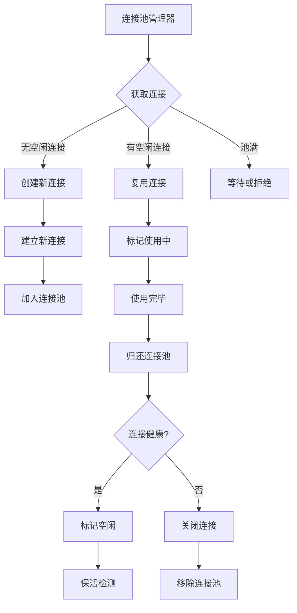
```mermaid
graph TD
    A[连接池管理器] --> B{获取连接}
    B -->|有空闲连接| C[复用连接]
    B -->|无空闲连接| D[创建新连接]
    B -->|池满| E[等待或拒绝]
    
    C --> F[标记使用中]
    D --> G[建立新连接]
    G --> H[加入连接池]
    
    F --> I[使用完毕]
    I --> J[归还连接池]
    J --> K{连接健康?}
    K -->|是| L[标记空闲]
    K -->|否| M[关闭连接]
    
    L --> N[保活检测]
    M --> O[移除连接池]
```

**C++连接池实现**：

```cpp
// ConnectionPool.h
template<typename Connection>
class ConnectionPool {
public:
    struct Config {
        size_t maxConnections = 10;
        size_t minConnections = 2;
        std::chrono::seconds maxIdleTime{300};
        std::chrono::seconds keepAliveInterval{30};
    };
    
    ConnectionPool(Config config);
    
    // 获取连接
    std::shared_ptr<Connection> acquire();
    
    // 预建立连接
    void preconnect(size_t count);
    
    // 归还连接
    void release(std::shared_ptr<Connection> conn);
    
private:
    struct PooledConnection {
        std::shared_ptr<Connection> connection;
        std::chrono::steady_clock::time_point lastUsed;
        std::atomic<bool> inUse{false};
    };
    
    Config config_;
    std::mutex mutex_;
    std::vector<std::unique_ptr<PooledConnection>> pool_;
    std::condition_variable cv_;
    
    void maintainPool();
    bool isHealthy(const Connection& conn);
};

// ConnectionPool.cpp
template<typename Connection>
std::shared_ptr<Connection> ConnectionPool<Connection>::acquire() {
    std::unique_lock<std::mutex> lock(mutex_);
    
    // 尝试获取空闲连接
    for (auto& pooled : pool_) {
        if (!pooled->inUse.load() && isHealthy(*pooled->connection)) {
            pooled->inUse = true;
            pooled->lastUsed = std::chrono::steady_clock::now();
            return pooled->connection;
        }
    }
    
    // 创建新连接
    if (pool_.size() < config_.maxConnections) {
        auto conn = createConnection();
        auto pooled = std::make_unique<PooledConnection>();
        pooled->connection = conn;
        pooled->inUse = true;
        pooled->lastUsed = std::chrono::steady_clock::now();
        
        auto result = conn;
        pool_.push_back(std::move(pooled));
        return result;
    }
    
    // 等待可用连接
    cv_.wait(lock, [this]() {
        for (auto& pooled : pool_) {
            if (!pooled->inUse.load()) return true;
        }
        return false;
    });
    
    return acquire();
}

template<typename Connection>
void ConnectionPool<Connection>::preconnect(size_t count) {
    std::lock_guard<std::mutex> lock(mutex_);
    
    size_t toCreate = std::min(count, config_.maxConnections - pool_.size());
    
    for (size_t i = 0; i < toCreate; ++i) {
        auto conn = createConnection();
        auto pooled = std::make_unique<PooledConnection>();
        pooled->connection = conn;
        pooled->inUse = false;
        pooled->lastUsed = std::chrono::steady_clock::now();
        pool_.push_back(std::move(pooled));
    }
    
    LOG(INFO) << "预建立 " << toCreate << " 个连接，当前池大小: " << pool_.size();
}
```

### 4.3 DTLS握手优化

**DTLS握手加速策略**：

| 优化手段 | 说明 | 收益 | 实现方式 |
|---------|------|------|---------|
| **TLS 1.3** | 减少握手RTT | -1 RTT | 升级OpenSSL/BoringSSL |
| **会话恢复** | 复用之前的TLS会话 | -2 RTT | Session ID/Ticket |
| **0-RTT** | 早期数据发送 | -1 RTT | TLS 1.3 0-RTT |
| **证书优化** | 减小证书链大小 | -50ms | 证书裁剪、OCSP Stapling |

**TLS会话恢复实现**：

```cpp
// DtlsOptimizer.h
class DtlsOptimizer {
public:
    // 保存会话信息
    void saveSession(const std::string& peerId, 
                     SSL_SESSION* session);
    
    // 恢复会话
    SSL_SESSION* restoreSession(const std::string& peerId);
    
    // 配置0-RTT
    void configureEarlyData(SSL* ssl);
    
private:
    std::unordered_map<std::string, std::vector<uint8_t>> sessionCache_;
    std::mutex cacheMutex_;
};

// DtlsOptimizer.cpp
void DtlsOptimizer::saveSession(const std::string& peerId, 
                                 SSL_SESSION* session) {
    if (!session) return;
    
    // 序列化会话
    uint8_t* data = nullptr;
    int len = i2d_SSL_SESSION(session, &data);
    
    if (len > 0) {
        std::lock_guard<std::mutex> lock(cacheMutex_);
        sessionCache_[peerId] = std::vector<uint8_t>(data, data + len);
    }
    
    OPENSSL_free(data);
}

SSL_SESSION* DtlsOptimizer::restoreSession(const std::string& peerId) {
    std::lock_guard<std::mutex> lock(cacheMutex_);
    
    auto it = sessionCache_.find(peerId);
    if (it == sessionCache_.end()) return nullptr;
    
    const uint8_t* data = it->second.data();
    return d2i_SSL_SESSION(nullptr, &data, it->second.size());
}

void DtlsOptimizer::configureEarlyData(SSL* ssl) {
    // 配置TLS 1.3 0-RTT
    SSL_set_max_early_data(ssl, 16384); // 16KB早期数据限制
    
    // 设置早期数据回调
    SSL_set_allow_early_data_cb(ssl, earlyDataCallback, this);
}
```

### 4.4 TCP vs UDP首帧时间对比

**协议选择对比**：

| 维度 | TCP | UDP | 优化建议 |
|-----|-----|-----|---------|
| **连接建立** | 1-RTT + TLS握手 | 无连接 | UDP更适合首帧 |
| **可靠性** | 内置重传 | 需应用层实现 | UDP需FEC/NACK |
| **穿透性** | 良好 | 需ICE | WebRTC使用UDP |
| **拥塞控制** | 内核实现 | 需应用实现 | GCC/BBR |
| **首帧延迟** | 较高 | 较低 | 实时场景优选UDP |

**QUIC协议优势**：

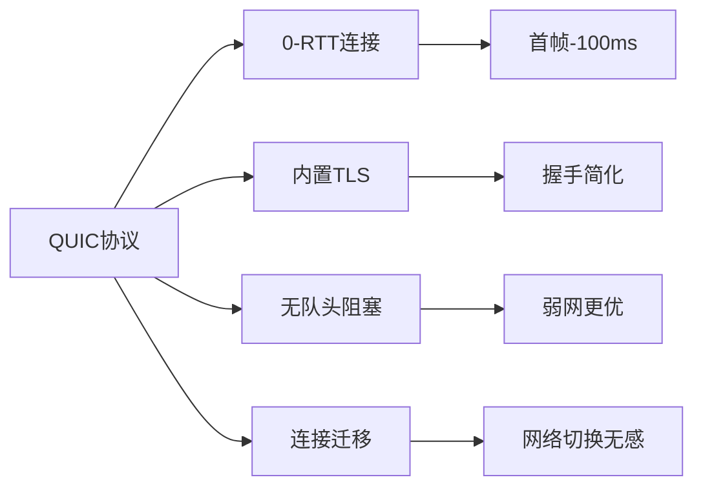
```mermaid
graph LR
    A[QUIC协议] --> B[0-RTT连接]
    A --> C[内置TLS]
    A --> D[无队头阻塞]
    A --> E[连接迁移]
    
    B --> B1[首帧-100ms]
    C --> C1[握手简化]
    D --> D1[弱网更优]
    E --> E1[网络切换无感]
```

**QUIC vs TCP+TLS首帧对比**：

| 阶段 | TCP+TLS 1.2 | TCP+TLS 1.3 | QUIC |
|-----|------------|------------|------|
| TCP握手 | 1-RTT | 1-RTT | 0-RTT |
| TLS握手 | 2-RTT | 1-RTT | 内置 |
| 总握手 | 3-RTT | 2-RTT | 0-RTT |
| 典型耗时 | 300-600ms | 200-400ms | 50-100ms |

---

## 第5章 How — 编解码器预创建

### 5.1 编码器预热

**编码器预热原理**：

编码器首次初始化需要完成以下耗时操作：
1. 加载编解码驱动
2. 分配内存缓冲区
3. 初始化硬件上下文
4. 编译着色器（GPU编码）
5. 建立与系统的通信通道

**预热策略对比**：

| 策略 | 说明 | 收益 | 资源消耗 |
|-----|------|------|---------|
| **冷启动** | 按需创建 | 基准 | 低 |
| **预创建** | 提前初始化 | -50ms | 中 |
| **实例池** | 维护编码器池 | -80ms | 高 |
| **伪编码** | 预编码一帧 | -100ms | 中 |

**iOS VideoToolbox预热实现**：

```objc
// VideoEncoderWarmup.h
@interface VideoEncoderWarmup : NSObject

+ (instancetype)sharedInstance;

// 预热编码器
- (void)warmupEncoderWithWidth:(int)width height:(int)height;

// 获取预热后的编码器
- (VTCompressionSessionRef)getWarmedSession:(int)width height:(int)height;

@end

// VideoEncoderWarmup.m
@implementation VideoEncoderWarmup {
    NSMutableDictionary<NSString *, NSValue *> *_warmedSessions;
}

+ (instancetype)sharedInstance {
    static VideoEncoderWarmup *instance;
    static dispatch_once_t onceToken;
    dispatch_once(&onceToken, ^{
        instance = [[self alloc] init];
    });
    return instance;
}

- (instancetype)init {
    self = [super init];
    if (self) {
        _warmedSessions = [NSMutableDictionary dictionary];
    }
    return self;
}

- (void)warmupEncoderWithWidth:(int)width height:(int)height {
    NSString *key = [NSString stringWithFormat:@"%dx%d", width, height];
    
    if (_warmedSessions[key]) {
        return; // 已预热
    }
    
    VTCompressionSessionRef session = NULL;
    OSStatus status = VTCompressionSessionCreate(
        NULL,
        width,
        height,
        kCMVideoCodecType_H264,
        NULL,
        NULL,
        NULL,
        encodeOutputCallback,
        (__bridge void *)self,
        &session
    );
    
    if (status == noErr) {
        // 配置编码参数
        VTSessionSetProperty(session, 
            kVTCompressionPropertyKey_RealTime, kCFBooleanTrue);
        VTSessionSetProperty(session,
            kVTCompressionPropertyKey_ProfileLevel, 
            kVTProfileLevel_H264_Baseline_AutoLevel);
        
        // 预编码一帧以完成初始化
        [self encodeDummyFrame:session];
        
        _warmedSessions[key] = [NSValue valueWithPointer:session];
        
        NSLog(@"编码器预热完成: %dx%d", width, height);
    }
}

- (void)encodeDummyFrame:(VTCompressionSessionRef)session {
    // 创建空白帧
    CVPixelBufferRef pixelBuffer = NULL;
    CVPixelBufferCreate(NULL, 320, 240, 
        kCVPixelFormatType_420YpCbCr8BiPlanarVideoRange, 
        NULL, &pixelBuffer);
    
    // 预编码
    VTEncodeInfoFlags flags;
    VTCompressionSessionEncodeFrame(session, pixelBuffer, 
        CMTimeMake(0, 1), CMTimeMake(1, 30), NULL, NULL, &flags);
    
    CVPixelBufferRelease(pixelBuffer);
}

- (VTCompressionSessionRef)getWarmedSession:(int)width height:(int)height {
    NSString *key = [NSString stringWithFormat:@"%dx%d", width, height];
    NSValue *value = _warmedSessions[key];
    
    if (value) {
        VTCompressionSessionRef session = [value pointerValue];
        _warmedSessions[key] = nil; // 取出后移除
        return session;
    }
    
    return NULL;
}

@end
```

**Android MediaCodec预热实现**：

```kotlin
// VideoEncoderWarmup.kt
class VideoEncoderWarmup private constructor() {
    
    private val warmedEncoders = ConcurrentHashMap<String, MediaCodec>()
    
    companion object {
        @Volatile
        private var instance: VideoEncoderWarmup? = null
        
        fun getInstance(): VideoEncoderWarmup {
            return instance ?: synchronized(this) {
                instance ?: VideoEncoderWarmup().also { instance = it }
            }
        }
    }
    
    // 预热编码器
    fun warmupEncoder(width: Int, height: Int) {
        val key = "${width}x${height}"
        
        if (warmedEncoders.containsKey(key)) return
        
        try {
            val codec = MediaCodec.createEncoderByType(MediaFormat.MIMETYPE_VIDEO_AVC)
            
            val format = MediaFormat.createVideoFormat(
                MediaFormat.MIMETYPE_VIDEO_AVC, width, height
            ).apply {
                setInteger(MediaFormat.KEY_BIT_RATE, width * height * 2)
                setInteger(MediaFormat.KEY_FRAME_RATE, 30)
                setInteger(MediaFormat.KEY_I_FRAME_INTERVAL, 2)
                setInteger(MediaFormat.KEY_COLOR_FORMAT, 
                    MediaCodecInfo.CodecCapabilities.COLOR_FormatSurface)
            }
            
            codec.configure(format, null, null, MediaCodec.CONFIGURE_FLAG_ENCODE)
            codec.start()
            
            // 预编码一帧
            encodeDummyFrame(codec)
            
            warmedEncoders[key] = codec
            
            Log.d("EncoderWarmup", "编码器预热完成: ${width}x${height}")
        } catch (e: Exception) {
            Log.e("EncoderWarmup", "预热失败", e)
        }
    }
    
    private fun encodeDummyFrame(codec: MediaCodec) {
        val inputBufferId = codec.dequeueInputBuffer(10000)
        if (inputBufferId >= 0) {
            val inputBuffer = codec.getInputBuffer(inputBufferId)
            // 填充空白数据
            inputBuffer?.clear()
            
            codec.queueInputBuffer(inputBufferId, 0, 0, 
                System.nanoTime() / 1000, 0)
        }
        
        // 消费输出
        val bufferInfo = MediaCodec.BufferInfo()
        val outputBufferId = codec.dequeueOutputBuffer(bufferInfo, 10000)
        if (outputBufferId >= 0) {
            codec.releaseOutputBuffer(outputBufferId, false)
        }
    }
    
    // 获取预热后的编码器
    fun getWarmedEncoder(width: Int, height: Int): MediaCodec? {
        val key = "${width}x${height}"
        return warmedEncoders.remove(key)
    }
}
```

### 5.2 解码器预创建与实例池化

**解码器实例池设计**：

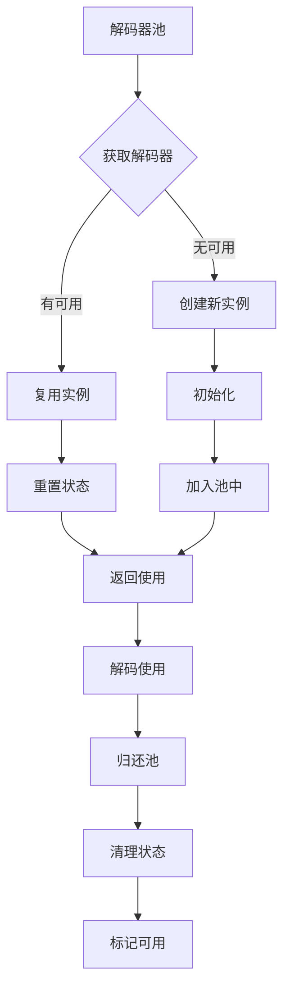
```mermaid
graph TD
    A[解码器池] --> B{获取解码器}
    B -->|有可用| C[复用实例]
    B -->|无可用| D[创建新实例]
    
    C --> E[重置状态]
    E --> F[返回使用]
    
    D --> G[初始化]
    G --> H[加入池中]
    H --> F
    
    F --> I[解码使用]
    I --> J[归还池]
    J --> K[清理状态]
    K --> L[标记可用]
```

**C++解码器池实现**：

```cpp
// DecoderPool.h
class DecoderPool {
public:
    struct DecoderInstance {
        std::unique_ptr<VideoDecoder> decoder;
        std::chrono::steady_clock::time_point lastUsed;
        std::atomic<bool> inUse{false};
        DecoderConfig config;
    };
    
    struct DecoderConfig {
        int width;
        int height;
        std::string codecType; // "h264", "hevc", etc.
    };
    
    explicit DecoderPool(size_t maxSize = 5);
    
    // 预创建解码器
    void precreate(const DecoderConfig& config, size_t count);
    
    // 获取解码器
    std::shared_ptr<VideoDecoder> acquire(const DecoderConfig& config);
    
    // 归还解码器
    void release(std::shared_ptr<VideoDecoder> decoder);
    
private:
    size_t maxSize_;
    std::mutex mutex_;
    std::vector<std::unique_ptr<DecoderInstance>> pool_;
    
    std::shared_ptr<VideoDecoder> createDecoder(const DecoderConfig& config);
    bool matchConfig(const DecoderInstance& instance, const DecoderConfig& config);
    void cleanupIdle();
};

// DecoderPool.cpp
std::shared_ptr<VideoDecoder> DecoderPool::acquire(const DecoderConfig& config) {
    std::lock_guard<std::mutex> lock(mutex_);
    
    // 查找匹配的可用解码器
    for (auto& instance : pool_) {
        if (!instance->inUse.load() && matchConfig(*instance, config)) {
            instance->inUse = true;
            instance->lastUsed = std::chrono::steady_clock::now();
            
            // 重置解码器状态
            instance->decoder->reset();
            
            return std::shared_ptr<VideoDecoder>(
                instance->decoder.get(),
                [this, &instance](VideoDecoder*) {
                    this->releaseInternal(instance.get());
                }
            );
        }
    }
    
    // 创建新解码器
    auto decoder = createDecoder(config);
    
    // 如果池未满，加入池中
    if (pool_.size() < maxSize_) {
        auto instance = std::make_unique<DecoderInstance>();
        instance->decoder = std::unique_ptr<VideoDecoder>(decoder.get());
        instance->config = config;
        instance->inUse = true;
        instance->lastUsed = std::chrono::steady_clock::now();
        
        pool_.push_back(std::move(instance));
    }
    
    return std::shared_ptr<VideoDecoder>(decoder);
}

void DecoderPool::precreate(const DecoderConfig& config, size_t count) {
    std::lock_guard<std::mutex> lock(mutex_);
    
    size_t toCreate = std::min(count, maxSize_ - pool_.size());
    
    for (size_t i = 0; i < toCreate; ++i) {
        auto instance = std::make_unique<DecoderInstance>();
        instance->decoder = createDecoder(config);
        instance->config = config;
        instance->inUse = false;
        instance->lastUsed = std::chrono::steady_clock::now();
        
        pool_.push_back(std::move(instance));
    }
    
    LOG(INFO) << "预创建 " << toCreate << " 个解码器，当前池大小: " << pool_.size();
}

std::shared_ptr<VideoDecoder> DecoderPool::createDecoder(const DecoderConfig& config) {
    if (config.codecType == "h264") {
        return std::make_shared<H264Decoder>(config.width, config.height);
    } else if (config.codecType == "hevc") {
        return std::make_shared<HEVCDecoder>(config.width, config.height);
    }
    return nullptr;
}
```

### 5.3 编解码器参数预配置

**参数预配置策略**：

| 参数类别 | 预配置项 | 收益 | 注意事项 |
|---------|---------|------|---------|
| **编码参数** | 码率、帧率、GOP | -20ms | 根据场景预设 |
| **缓冲区** | 输入/输出缓冲区 | -30ms | 预分配内存 |
| **回调设置** | 输出回调、错误回调 | -10ms | 提前注册 |
| **硬件上下文** | GPU上下文、Surface | -50ms | 与系统预建立 |

**预配置代码示例（C++）**：

```cpp
// CodecConfigCache.h
class CodecConfigCache {
public:
    struct CachedConfig {
        int width;
        int height;
        int bitrate;
        int fps;
        std::string codecType;
        void* platformConfig; // 平台相关配置
    };
    
    // 预配置编解码器
    void preconfigure(const CachedConfig& config);
    
    // 应用预配置
    void applyConfig(void* codec, const CachedConfig& config);
    
    // 获取匹配的配置
    CachedConfig* findConfig(int width, int height, const std::string& codecType);
    
private:
    std::vector<CachedConfig> configs_;
    std::mutex mutex_;
};

// 使用示例
void setupCodecWithCache() {
    CodecConfigCache cache;
    
    // 应用启动时预配置常用参数
    CodecConfigCache::CachedConfig config720p;
    config720p.width = 1280;
    config720p.height = 720;
    config720p.bitrate = 2000000;
    config720p.fps = 30;
    config720p.codecType = "h264";
    cache.preconfigure(config720p);
    
    // 实际使用时快速应用
    auto matched = cache.findConfig(1280, 720, "h264");
    if (matched) {
        cache.applyConfig(encoder, *matched);
    }
}
```

### 5.4 代码示例汇总

**完整预热流程（伪代码）**：

```cpp
// 应用启动阶段
void onAppLaunch() {
    // 1. 预收集ICE候选
    IceCandidateCollector::getInstance()->precollectCandidates();
    
    // 2. 预建立信令连接
    WebSocketManager::getInstance()->preconnect();
    
    // 3. 预热编解码器
    VideoEncoderWarmup::getInstance()->warmupEncoder(1280, 720);
    VideoEncoderWarmup::getInstance()->warmupEncoder(640, 360);
    
    // 4. 预创建解码器池
    DecoderPool::getInstance()->precreate({1280, 720, "h264"}, 2);
    DecoderPool::getInstance()->precreate({640, 360, "h264"}, 2);
    
    // 5. 预配置参数
    CodecConfigCache::getInstance()->preconfigure(commonConfigs);
}

// 用户触发播放
void onUserPlay() {
    auto startTime = std::chrono::steady_clock::now();
    
    // 1. 复用信令连接（已预建立）
    auto ws = WebSocketManager::getInstance()->getConnection();
    
    // 2. 复用ICE候选（已预收集）
    auto candidates = IceCandidateCollector::getInstance()->getCachedCandidates();
    
    // 3. 获取预热编码器
    auto encoder = VideoEncoderWarmup::getInstance()->getWarmedEncoder(1280, 720);
    
    // 4. 从池获取解码器
    auto decoder = DecoderPool::getInstance()->acquire({1280, 720, "h264"});
    
    auto endTime = std::chrono::steady_clock::now();
    auto prepareTime = std::chrono::duration_cast<std::chrono::milliseconds>(
        endTime - startTime).count();
    
    LOG(INFO) << "准备阶段耗时: " << prepareTime << "ms";
    // 预期: < 50ms（vs 冷启动 300-500ms）
}
```

---

## 第6章 How — 快速关键帧获取

### 6.1 GOP设计对首帧的影响

**GOP（Group of Pictures）结构**：


```mermaid
graph LR
    I1[I帧/IDR] --> P1[P帧]
    P1 --> P2[P帧]
    P2 --> P3[P帧]
    P3 --> I2[I帧]
    I2 --> P4[P帧]
    
    style I1 fill:#f9f,stroke:#333
    style I2 fill:#f9f,stroke:#333
```

**GOP大小对首帧的影响**：

| GOP大小 | 首帧等待时间 | 编码效率 | 适用场景 |
|--------|------------|---------|---------|
| 1帧（全I帧） | 0ms | 低（码率高） | 极低延迟场景 |
| 15帧（0.5s） | 0-500ms | 中 | 实时通话 |
| 30帧（1s） | 0-1s | 较高 | 互动直播 |
| 60帧（2s） | 0-2s | 高 | 普通直播 |
| 120帧（4s） | 0-4s | 很高 | 点播 |

**首帧等待时间计算**：

```
最坏情况首帧等待 = GOP大小 / 帧率
平均首帧等待 = GOP大小 / (2 * 帧率)

示例（30fps，GOP=60）：
- 最坏情况: 60 / 30 = 2s
- 平均情况: 60 / (2 * 30) = 1s
```

**GOP优化策略**：

| 策略 | 说明 | 首帧收益 | 码率代价 |
|-----|------|---------|---------|
| **短GOP** | 减小GOP大小 | -500ms | +20%码率 |
| **开场IDR** | 推流开始强制IDR | -平均等待 | 无 |
| **动态GOP** | 根据场景调整 | 灵活 | 可控 |
| **GOP边界对齐** | CDN缓存对齐GOP | -50%等待 | 无 |

### 6.2 快速关键帧请求（FIR/PLI）

**关键帧请求机制**：

| 机制 | 全称 | 触发条件 | 响应时间 | 适用场景 |
|-----|------|---------|---------|---------|
| **FIR** | Full Intra Request | 新用户加入、切换 | < 100ms | 多人会议 |
| **PLI** | Picture Loss Indication | 解码错误、丢包 | < 50ms | 错误恢复 |
| **IDR请求** | IDR Frame Request | 手动触发 | < 100ms | 特殊场景 |

**FIR/PLI流程**：

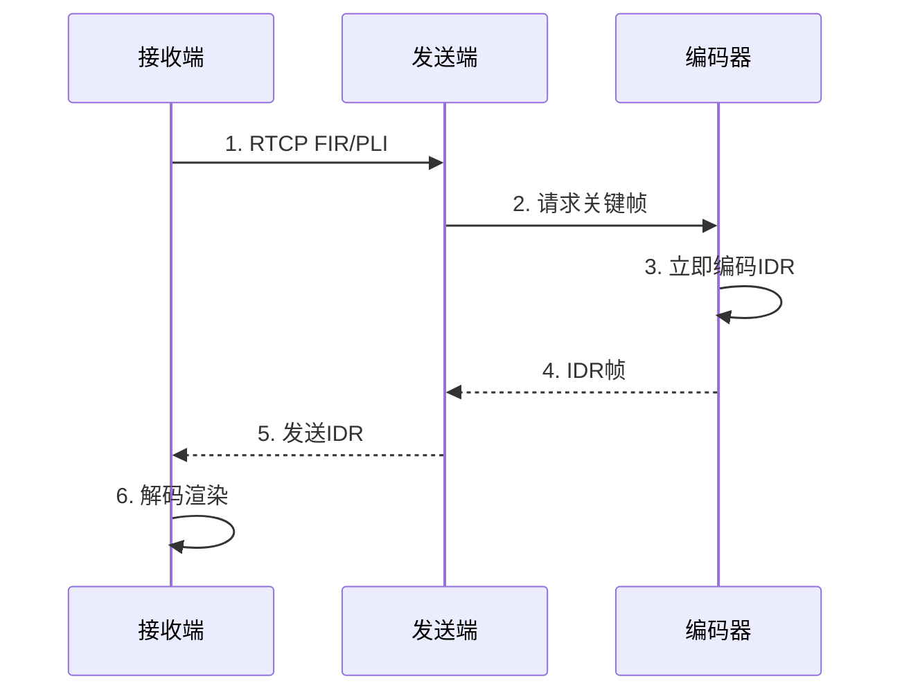
```mermaid
sequenceDiagram
    participant Receiver as 接收端
    participant Sender as 发送端
    participant Encoder as 编码器
    
    Receiver->>Sender: 1. RTCP FIR/PLI
    Sender->>Encoder: 2. 请求关键帧
    Encoder->>Encoder: 3. 立即编码IDR
    Encoder-->>Sender: 4. IDR帧
    Sender-->>Receiver: 5. 发送IDR
    Receiver->>Receiver: 6. 解码渲染
```

**iOS FIR请求实现**：

```objc
// RTCKeyFrameRequester.m
@interface RTCKeyFrameRequester : NSObject

- (void)requestKeyFrameForSsrc:(uint32_t)ssrc;
- (void)requestKeyFrameForAllStreams;

@end

@implementation RTCKeyFrameRequester

- (void)requestKeyFrameForSsrc:(uint32_t)ssrc {
    // 创建RTCP FIR包
    RTCPFIRPacket *firPacket = [[RTCPFIRPacket alloc] init];
    firPacket.ssrc = ssrc;
    firPacket.seqNum = [self nextFIRSequenceNumber];
    
    // 发送FIR
    [self.rtcpSender sendRTCPPacket:firPacket];
    
    NSLog(@"发送FIR请求, SSRC: %u", ssrc);
    
    // 埋点
    [self reportMetric:@"fir_sent" ssrc:ssrc];
}

- (void)requestKeyFrameForAllStreams {
    for (NSNumber *ssrc in self.activeSsrcs) {
        [self requestKeyFrameForSsrc:[ssrc unsignedIntValue]];
    }
}

// 收到新流时自动请求关键帧
- (void)onNewStreamDetected:(uint32_t)ssrc {
    // 延迟一帧后请求，避免与首包冲突
    dispatch_after(dispatch_time(DISPATCH_TIME_NOW, (int64_t)(16 * NSEC_PER_MSEC)), 
                   dispatch_get_main_queue(), ^{
        [self requestKeyFrameForSsrc:ssrc];
    });
}

@end
```

**Android PLI请求实现**：

```kotlin
// KeyFrameRequester.kt
class KeyFrameRequester(private val rtcpSender: RtcpSender) {
    
    private val firSequenceNumbers = ConcurrentHashMap<Long, Int>()
    
    // 发送PLI请求
    fun requestPLI(ssrc: Long) {
        val pliPacket = RtcpPLIPacket().apply {
            this.ssrc = ssrc
            senderSsrc = this@KeyFrameRequester.senderSsrc
        }
        
        rtcpSender.sendPacket(pliPacket)
        Log.d("KeyFrameRequester", "发送PLI请求, SSRC: $ssrc")
    }
    
    // 发送FIR请求
    fun requestFIR(ssrc: Long) {
        val seqNum = firSequenceNumbers.getOrDefault(ssrc, 0) + 1
        firSequenceNumbers[ssrc] = seqNum
        
        val firPacket = RtcpFIRPacket().apply {
            this.ssrc = ssrc
            this.seqNum = seqNum
            senderSsrc = this@KeyFrameRequester.senderSsrc
        }
        
        rtcpSender.sendPacket(firPacket)
        Log.d("KeyFrameRequester", "发送FIR请求, SSRC: $ssrc, Seq: $seqNum")
    }
    
    // 解码失败时自动请求
    fun onDecodeError(ssrc: Long, error: DecodeError) {
        when (error) {
            is DecodeError.MissingKeyFrame -> requestFIR(ssrc)
            is DecodeError.CorruptedFrame -> requestPLI(ssrc)
            else -> requestPLI(ssrc)
        }
    }
}
```

### 6.3 服务端缓存最新关键帧

**服务端缓存策略**：

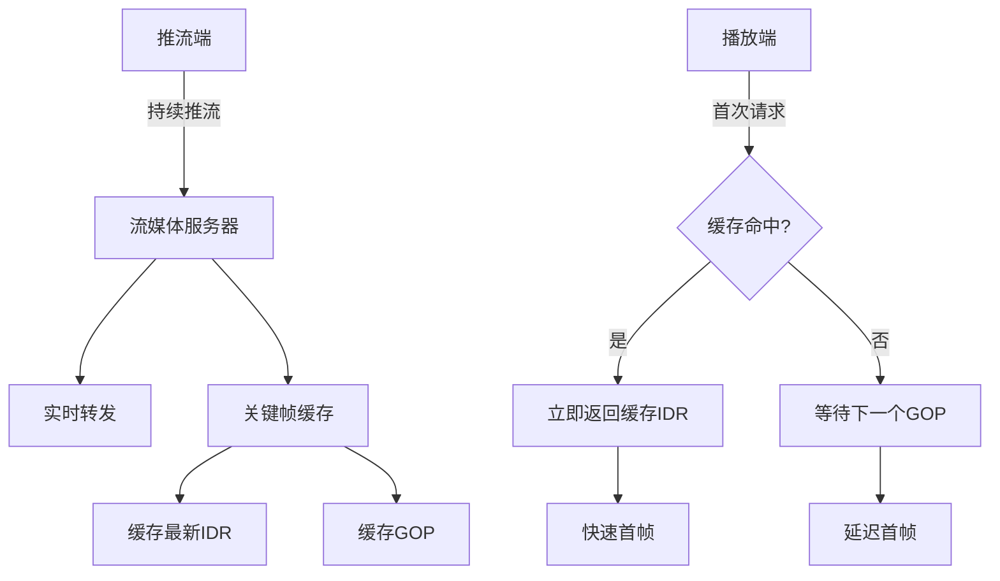
```mermaid
graph TD
    A[推流端] -->|持续推流| B[流媒体服务器]
    B --> C[实时转发]
    B --> D[关键帧缓存]
    
    D --> E[缓存最新IDR]
    D --> F[缓存GOP]
    
    G[播放端] -->|首次请求| H{缓存命中?}
    H -->|是| I[立即返回缓存IDR]
    H -->|否| J[等待下一个GOP]
    
    I --> K[快速首帧]
    J --> L[延迟首帧]
```

**缓存策略对比**：

| 策略 | 缓存内容 | 内存占用 | 首帧收益 | 复杂度 |
|-----|---------|---------|---------|-------|
| **单IDR缓存** | 最新IDR帧 | 低 | 高 | 低 |
| **GOP缓存** | 完整GOP | 中 | 极高 | 中 |
| **多分辨率** | 多路关键帧 | 高 | 高 | 高 |
| **智能预取** | 预测缓存 | 中 | 中 | 高 |

**SRS服务器关键帧缓存配置**：

```nginx
# srs.conf
vhost __defaultVhost__ {
    # 启用GOP缓存
    gop_cache on;
    
    # GOP缓存队列大小
    gop_cache_max_frames 250;
    
    # 关键帧缓存
    keyframe_cache on;
    keyframe_cache_max_frames 1;
    
    # 首帧优化：新连接先发送缓存的关键帧
    fast_keyframe on;
}
```

**自研服务端关键帧缓存实现（C++）**：

```cpp
// KeyFrameCache.h
class KeyFrameCache {
public:
    struct CachedFrame {
        std::vector<uint8_t> data;
        int64_t timestamp;
        bool isKeyFrame;
        int width;
        int height;
    };
    
    // 缓存新帧
    void onFrame(const std::vector<uint8_t>& data, 
                 int64_t timestamp, 
                 bool isKeyFrame,
                 int width, int height);
    
    // 获取最新关键帧
    std::optional<CachedFrame> getLatestKeyFrame();
    
    // 获取完整GOP
    std::vector<CachedFrame> getCachedGOP();
    
    // 新订阅者接入处理
    void onNewSubscriber(std::shared_ptr<Subscriber> subscriber);
    
private:
    std::deque<CachedFrame> frameCache_;
    CachedFrame latestKeyFrame_;
    std::mutex mutex_;
    
    static constexpr size_t MAX_GOP_CACHE_SIZE = 250; // 约8s @ 30fps
};

// KeyFrameCache.cpp
void KeyFrameCache::onFrame(const std::vector<uint8_t>& data,
                            int64_t timestamp,
                            bool isKeyFrame,
                            int width, int height) {
    std::lock_guard<std::mutex> lock(mutex_);
    
    CachedFrame frame;
    frame.data = data;
    frame.timestamp = timestamp;
    frame.isKeyFrame = isKeyFrame;
    frame.width = width;
    frame.height = height;
    
    if (isKeyFrame) {
        // 新关键帧，清空旧GOP缓存
        frameCache_.clear();
        latestKeyFrame_ = frame;
        LOG(INFO) << "缓存新关键帧, timestamp: " << timestamp;
    }
    
    // 添加到GOP缓存
    frameCache_.push_back(frame);
    
    // 限制缓存大小
    while (frameCache_.size() > MAX_GOP_CACHE_SIZE) {
        frameCache_.pop_front();
    }
}

void KeyFrameCache::onNewSubscriber(std::shared_ptr<Subscriber> subscriber) {
    std::lock_guard<std::mutex> lock(mutex_);
    
    // 立即发送缓存的关键帧
    if (!latestKeyFrame_.data.empty()) {
        subscriber->sendFrame(latestKeyFrame_);
        LOG(INFO) << "新订阅者接入，立即发送关键帧";
        
        // 可选：发送完整GOP以获得更好质量
        for (const auto& frame : frameCache_) {
            subscriber->sendFrame(frame);
        }
    }
}
```

### 6.4 IDR帧立即发送策略

**IDR立即发送机制**：

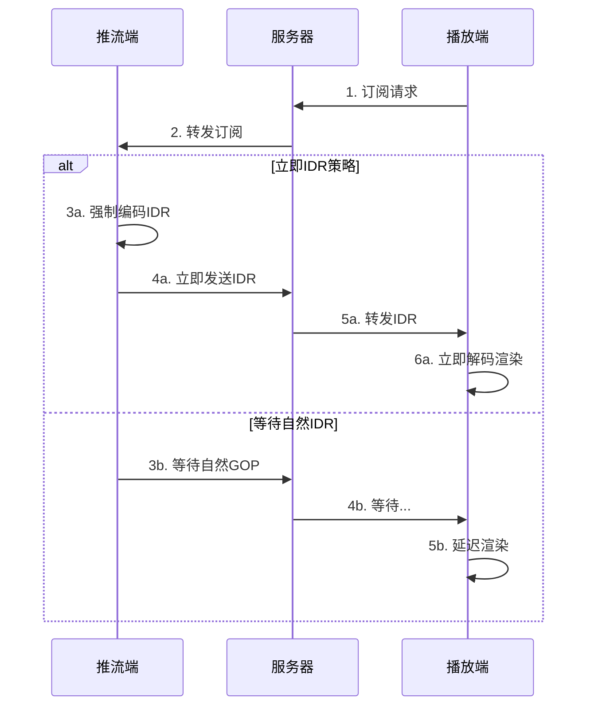
```mermaid
sequenceDiagram
    participant S as 推流端
    participant Server as 服务器
    participant P as 播放端
    
    P->>Server: 1. 订阅请求
    Server->>S: 2. 转发订阅
    
    alt 立即IDR策略
        S->>S: 3a. 强制编码IDR
        S->>Server: 4a. 立即发送IDR
        Server->>P: 5a. 转发IDR
        P->>P: 6a. 立即解码渲染
    else 等待自然IDR
        S->>Server: 3b. 等待自然GOP
        Server->>P: 4b. 等待...
        P->>P: 5b. 延迟渲染
    end
```

**IDR立即发送实现**：

```cpp
// ImmediateIDRController.h
class ImmediateIDRController {
public:
    // 新订阅者接入通知
    void onNewSubscriber(uint32_t subscriberId);
    
    // 编码器输出回调
    void onEncodedFrame(const EncodedFrame& frame);
    
    // 是否需要立即发送IDR
    bool shouldForceIDR();
    
private:
    std::atomic<bool> forceIDR_{false};
    std::atomic<int> pendingSubscribers_{0};
    std::mutex mutex_;
};

// 编码器集成
class VideoEncoder {
public:
    void encodeFrame(const VideoFrame& frame) {
        // 检查是否需要强制IDR
        if (idrController_.shouldForceIDR()) {
            encodeIDRFrame(frame);
        } else {
            encodeNormalFrame(frame);
        }
    }
    
private:
    void encodeIDRFrame(const VideoFrame& frame) {
        // 强制关键帧
        encoder_->ForceKeyFrame();
        encodeFrameInternal(frame, true);
    }
    
    ImmediateIDRController idrController_;
};
```

---

## 第7章 How — 播放器冷启动优化

### 7.1 播放器组件预加载

**播放器预加载策略**：

| 策略 | 预加载内容 | 触发时机 | 内存占用 | 首帧收益 |
|-----|-----------|---------|---------|---------|
| **实例预创建** | 播放器对象 | 应用启动 | 中 | -50ms |
| **动态库加载** | 解码库、渲染库 | 应用启动 | 高 | -100ms |
| **配置预加载** | 播放参数、解码器列表 | 应用启动 | 低 | -20ms |
| **UI预渲染** | 播放器UI组件 | 页面加载 | 中 | -30ms |

**iOS播放器预加载实现**：

```objc
// PlayerPreloader.h
@interface PlayerPreloader : NSObject

+ (instancetype)sharedInstance;

// 预加载播放器
- (void)preloadPlayer;

// 获取预加载的播放器
- (AVPlayer *)getPreloadedPlayer;

@end

// PlayerPreloader.m
@implementation PlayerPreloader {
    AVPlayer *_preloadedPlayer;
}

+ (instancetype)sharedInstance {
    static PlayerPreloader *instance;
    static dispatch_once_t onceToken;
    dispatch_once(&onceToken, ^{
        instance = [[self alloc] init];
    });
    return instance;
}

- (void)preloadPlayer {
    dispatch_async(dispatch_get_global_queue(DISPATCH_QUEUE_PRIORITY_LOW, 0), ^{
        // 预创建播放器
        AVPlayerItem *dummyItem = [[AVPlayerItem alloc] initWithURL:[NSURL URLWithString:@""]];
        self->_preloadedPlayer = [AVPlayer playerWithPlayerItem:dummyItem];
        
        // 预加载必要的资源
        [self preloadDecoderResources];
        
        NSLog(@"播放器预加载完成");
    });
}

- (void)preloadDecoderResources {
    // 预加载视频解码器
    VTDecompressionSessionRef session;
    CMVideoFormatDescriptionRef formatDesc;
    
    // 创建格式描述
    const uint8_t *sps = ...;
    const uint8_t *pps = ...;
    const void *params[] = {sps, pps};
    size_t sizes[] = {spsSize, ppsSize};
    
    CMVideoFormatDescriptionCreateFromH264ParameterSets(
        NULL, 2, params, sizes, 4, &formatDesc);
    
    // 预创建解码会话
    VTDecompressionOutputCallbackRecord callback;
    callback.decompressionOutputCallback = dummyDecompressionCallback;
    
    VTDecompressionSessionCreate(NULL, formatDesc, NULL, NULL, &callback, &session);
    
    // 保存会话供后续使用
    self->_warmDecoderSession = session;
    CFRelease(formatDesc);
}

- (AVPlayer *)getPreloadedPlayer {
    AVPlayer *player = _preloadedPlayer;
    _preloadedPlayer = nil; // 取出后置空
    return player ?: [[AVPlayer alloc] init];
}

@end
```

**Android播放器预加载实现**：

```kotlin
// PlayerPreloader.kt
class PlayerPreloader private constructor(private val context: Context) {
    
    private var preloadedPlayer: ExoPlayer? = null
    private var preloadedCodec: MediaCodec? = null
    
    companion object {
        @Volatile
        private var instance: PlayerPreloader? = null
        
        fun getInstance(context: Context): PlayerPreloader {
            return instance ?: synchronized(this) {
                instance ?: PlayerPreloader(context.applicationContext).also { 
                    instance = it 
                }
            }
        }
    }
    
    // 预加载播放器
    fun preloadPlayer() {
        GlobalScope.launch(Dispatchers.Default) {
            // 预创建ExoPlayer实例
            preloadedPlayer = ExoPlayer.Builder(context)
                .setLoadControl(createLowLatencyLoadControl())
                .build()
            
            // 预加载解码器
            preloadDecoder()
            
            // 预加载渲染器
            preloadRenderers()
            
            Log.d("PlayerPreloader", "播放器预加载完成")
        }
    }
    
    private fun preloadDecoder() {
        try {
            // 预创建H264解码器
            preloadedCodec = MediaCodec.createDecoderByType(
                MediaFormat.MIMETYPE_VIDEO_AVC
            )
            
            // 预配置格式
            val format = MediaFormat.createVideoFormat(
                MediaFormat.MIMETYPE_VIDEO_AVC, 1280, 720
            )
            preloadedCodec?.configure(format, null, null, 0)
            
        } catch (e: Exception) {
            Log.e("PlayerPreloader", "预加载解码器失败", e)
        }
    }
    
    private fun preloadRenderers() {
        // 预初始化SurfaceTexture
        val surfaceTexture = SurfaceTexture(0)
        surfaceTexture.setDefaultBufferSize(1280, 720)
        
        // 预创建Surface
        val surface = Surface(surfaceTexture)
        
        // 保存供后续使用
        this.warmSurface = surface
        this.warmSurfaceTexture = surfaceTexture
    }
    
    fun getPreloadedPlayer(): ExoPlayer {
        return preloadedPlayer ?: ExoPlayer.Builder(context).build().also {
            preloadedPlayer = null
        }
    }
    
    fun getPreloadedDecoder(): MediaCodec? {
        return preloadedCodec.also {
            preloadedCodec = null
        }
    }
}
```

### 7.2 缓冲区预分配

**缓冲区预分配策略**：

| 缓冲区类型 | 预分配大小 | 预分配时机 | 收益 |
|-----------|-----------|-----------|------|
| **输入缓冲区** | 10-20帧 | 播放器创建 | -30ms |
| **输出缓冲区** | 3-5帧 | 播放器创建 | -20ms |
| **网络缓冲区** | 1-2s数据 | 连接建立 | -50ms |
| **解码缓冲区** | 根据分辨率 | 解码器创建 | -40ms |

**缓冲区预分配代码（C++）**：

```cpp
// BufferPreallocator.h
class BufferPreallocator {
public:
    struct BufferConfig {
        size_t inputBufferCount = 10;
        size_t outputBufferCount = 5;
        size_t inputBufferSize = 1024 * 1024; // 1MB
        size_t outputBufferSize = 1920 * 1080 * 3 / 2; // YUV 1080p
    };
    
    void preallocate(const BufferConfig& config);
    
    std::shared_ptr<Buffer> acquireInputBuffer();
    std::shared_ptr<Buffer> acquireOutputBuffer();
    
private:
    std::vector<std::shared_ptr<Buffer>> inputBufferPool_;
    std::vector<std::shared_ptr<Buffer>> outputBufferPool_;
    std::mutex mutex_;
};

// BufferPreallocator.cpp
void BufferPreallocator::preallocate(const BufferConfig& config) {
    std::lock_guard<std::mutex> lock(mutex_);
    
    // 预分配输入缓冲区
    for (size_t i = 0; i < config.inputBufferCount; ++i) {
        auto buffer = std::make_shared<Buffer>(config.inputBufferSize);
        buffer->preallocate(); // 实际分配内存
        inputBufferPool_.push_back(buffer);
    }
    
    // 预分配输出缓冲区
    for (size_t i = 0; i < config.outputBufferCount; ++i) {
        auto buffer = std::make_shared<Buffer>(config.outputBufferSize);
        buffer->preallocate();
        outputBufferPool_.push_back(buffer);
    }
    
    LOG(INFO) << "预分配 " << config.inputBufferCount << " 个输入缓冲区, "
              << config.outputBufferCount << " 个输出缓冲区";
}
```

### 7.3 渲染Surface预创建

**Surface预创建策略**：

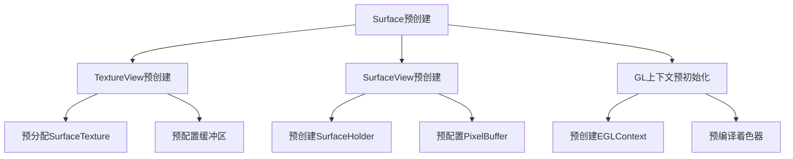
```mermaid
graph TD
    A[Surface预创建] --> B[TextureView预创建]
    A --> C[SurfaceView预创建]
    A --> D[GL上下文预初始化]
    
    B --> B1[预分配SurfaceTexture]
    B --> B2[预配置缓冲区]
    
    C --> C1[预创建SurfaceHolder]
    C --> C2[预配置PixelBuffer]
    
    D --> D1[预创建EGLContext]
    D --> D2[预编译着色器]
```

**Android Surface预创建实现**：

```kotlin
// SurfacePreloader.kt
class SurfacePreloader(private val context: Context) {
    
    private var warmSurfaceTexture: SurfaceTexture? = null
    private var warmSurface: Surface? = null
    private var eglContext: EGLContext? = null
    
    // 预创建Surface
    fun preloadSurface(width: Int, height: Int) {
        // 主线程创建SurfaceTexture
        Handler(Looper.getMainLooper()).post {
            warmSurfaceTexture = SurfaceTexture(0).apply {
                setDefaultBufferSize(width, height)
            }
            warmSurface = Surface(warmSurfaceTexture)
            
            Log.d("SurfacePreloader", "Surface预创建完成: ${width}x${height}")
        }
    }
    
    // 预初始化EGL上下文
    fun preloadEGL() {
        val eglDisplay = EGL14.eglGetDisplay(EGL14.EGL_DEFAULT_DISPLAY)
        EGL14.eglInitialize(eglDisplay, null, 0, null, 0)
        
        val attribList = intArrayOf(
            EGL14.EGL_RED_SIZE, 8,
            EGL14.EGL_GREEN_SIZE, 8,
            EGL14.EGL_BLUE_SIZE, 8,
            EGL14.EGL_ALPHA_SIZE, 8,
            EGL14.EGL_RENDERABLE_TYPE, EGL14.EGL_OPENGL_ES2_BIT,
            EGL14.EGL_NONE
        )
        
        val configs = arrayOfNulls<EGLConfig>(1)
        val numConfigs = IntArray(1)
        EGL14.eglChooseConfig(eglDisplay, attribList, 0, configs, 0, 1, numConfigs, 0)
        
        val contextAttribs = intArrayOf(
            EGL14.EGL_CONTEXT_CLIENT_VERSION, 2,
            EGL14.EGL_NONE
        )
        
        eglContext = EGL14.eglCreateContext(
            eglDisplay, configs[0], EGL14.EGL_NO_CONTEXT, contextAttribs, 0
        )
        
        // 预编译着色器
        preloadShaders()
    }
    
    private fun preloadShaders() {
        // 预编译YUV转RGB着色器
        val vertexShader = loadShader(GLES20.GL_VERTEX_SHADER, VERTEX_SHADER_CODE)
        val fragmentShader = loadShader(GLES20.GL_FRAGMENT_SHADER, FRAGMENT_SHADER_CODE)
        
        val program = GLES20.glCreateProgram()
        GLES20.glAttachShader(program, vertexShader)
        GLES20.glAttachShader(program, fragmentShader)
        GLES20.glLinkProgram(program)
        
        this.warmShaderProgram = program
    }
    
    fun getWarmSurface(): Surface? {
        return warmSurface.also {
            warmSurface = null
            warmSurfaceTexture = null
        }
    }
}
```

### 7.4 首帧渲染加速（跳过部分后处理）

**首帧快速渲染策略**：

| 后处理阶段 | 首帧跳过 | 质量影响 | 恢复时机 |
|-----------|---------|---------|---------|
| **去噪** | 是 | 轻微 | 第2帧恢复 |
| **锐化** | 是 | 轻微 | 第2帧恢复 |
| **色彩增强** | 否 | 明显 | - |
| **超分** | 是 | 中等 | 缓冲充足后 |
| **HDR转换** | 否 | 明显 | - |

**首帧快速渲染实现**：

```cpp
// FastFirstFrameRenderer.h
class FastFirstFrameRenderer {
public:
    void renderFrame(const VideoFrame& frame, bool isFirstFrame) {
        if (isFirstFrame) {
            renderFastPath(frame);
        } else {
            renderNormalPath(frame);
        }
    }
    
private:
    void renderFastPath(const VideoFrame& frame) {
        // 简化渲染管线
        // 1. 跳过去噪
        // 2. 跳过锐化
        // 3. 使用简化着色器
        
        glUseProgram(fastShaderProgram_);
        
        // 直接渲染，不经过后处理链
        uploadTexture(frame);
        drawQuad();
        
        frameCount_++;
    }
    
    void renderNormalPath(const VideoFrame& frame) {
        // 完整渲染管线
        VideoFrame processed = frame;
        
        if (enableDenoise_) {
            processed = denoiseFilter_->process(processed);
        }
        
        if (enableSharpen_) {
            processed = sharpenFilter_->process(processed);
        }
        
        if (enableSuperRes_ && bufferHealth_ > 0.5f) {
            processed = superResFilter_->process(processed);
        }
        
        glUseProgram(normalShaderProgram_);
        uploadTexture(processed);
        drawQuad();
    }
    
    int frameCount_ = 0;
    bool enableFastPath_ = true;
};
```

---

## 第8章 How — CDN与服务端优化

### 8.1 CDN边缘节点缓存关键帧

**CDN缓存策略**：

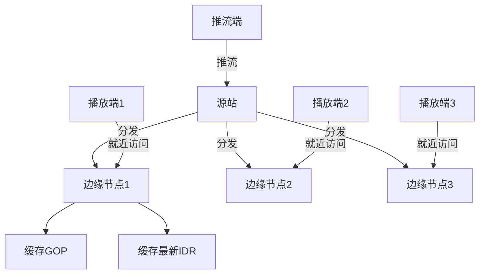
```mermaid
graph TD
    A[推流端] -->|推流| B[源站]
    B -->|分发| C[边缘节点1]
    B -->|分发| D[边缘节点2]
    B -->|分发| E[边缘节点3]
    
    C --> C1[缓存GOP]
    C --> C2[缓存最新IDR]
    
    F[播放端1] -->|就近访问| C
    G[播放端2] -->|就近访问| D
    H[播放端3] -->|就近访问| E
```

**边缘缓存配置对比**：

| 缓存策略 | 缓存内容 | 内存占用 | 首帧收益 | 适用场景 |
|---------|---------|---------|---------|---------|
| **单IDR缓存** | 最新关键帧 | 50KB | 高 | 通用 |
| **GOP缓存** | 完整GOP | 500KB-2MB | 极高 | 高并发直播 |
| **多码率缓存** | 多路流 | 数倍内存 | 高 | 自适应码率 |
| **智能预取** | 预测数据 | 可变 | 中 | 点播场景 |

**Nginx RTMP关键帧缓存配置**：

```nginx
rtmp {
    server {
        listen 1935;
        
        application live {
            live on;
            
            # 启用GOP缓存
            gop_cache on;
            gop_cache_max_frames 250;
            
            # 关键帧缓存
            keyframe_cache on;
            
            # 推流时缓存到内存
            meta on;
            
            # 边缘节点配置
            push rtmp://edge1.example.com/live;
            push rtmp://edge2.example.com/live;
        }
    }
}
```

### 8.2 GOP边界对齐

**GOP对齐原理**：

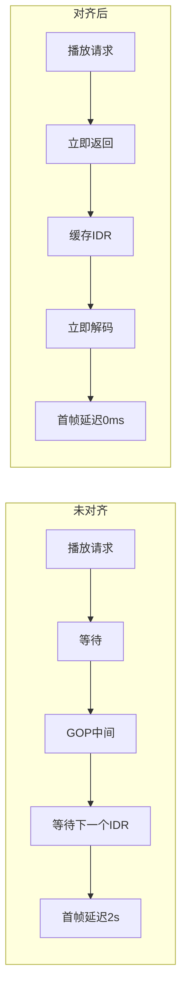
```mermaid
graph LR
    subgraph 未对齐
        A1[播放请求] --> B1[等待]
        B1 --> C1[GOP中间]
        C1 --> D1[等待下一个IDR]
        D1 --> E1[首帧延迟2s]
    end
    
    subgraph 对齐后
        A2[播放请求] --> B2[立即返回]
        B2 --> C2[缓存IDR]
        C2 --> D2[立即解码]
        D2 --> E2[首帧延迟0ms]
    end
```

**GOP对齐策略**：

| 策略 | 实现方式 | 首帧收益 | 代价 |
|-----|---------|---------|------|
| **服务端缓存对齐** | 缓存到GOP边界 | -50%平均等待 | 内存增加 |
| **播放器请求对齐** | 请求时指定GOP位置 | -30%平均等待 | 协议复杂度 |
| **智能调度** | 预测最佳接入点 | -40%平均等待 | 算法复杂度 |

### 8.3 服务端快速转发策略

**快速转发优化**：

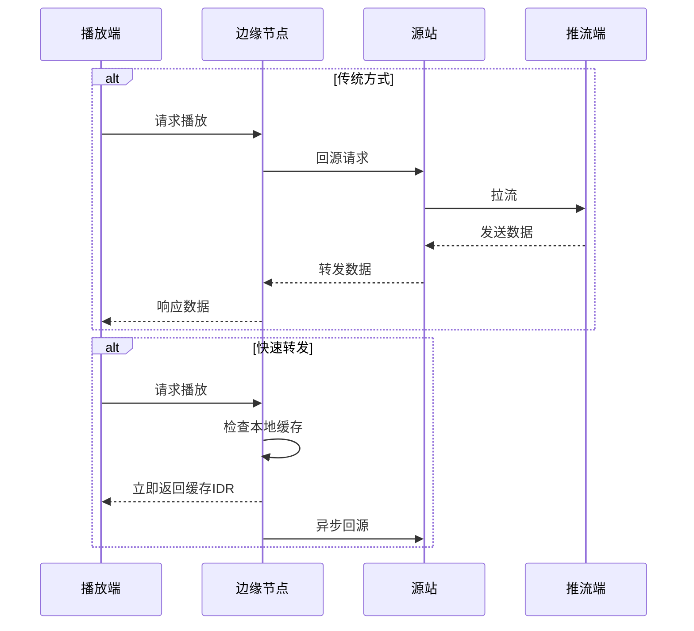
```mermaid
sequenceDiagram
    participant P as 播放端
    participant Edge as 边缘节点
    participant Origin as 源站
    participant Pub as 推流端
    
    alt 传统方式
        P->>Edge: 请求播放
        Edge->>Origin: 回源请求
        Origin->>Pub: 拉流
        Pub-->>Origin: 发送数据
        Origin-->>Edge: 转发数据
        Edge-->>P: 响应数据
    end
    
    alt 快速转发
        P->>Edge: 请求播放
        Edge->>Edge: 检查本地缓存
        Edge-->>P: 立即返回缓存IDR
        Edge->>Origin: 异步回源
    end
```

**快速转发实现**：

```cpp
// FastForwardServer.h
class FastForwardServer {
public:
    void onPlayRequest(std::shared_ptr<Client> client, const std::string& streamId) {
        // 1. 检查本地缓存
        auto cachedGop = gopCache_.get(streamId);
        
        if (cachedGop && !cachedGop->empty()) {
            // 2. 立即发送缓存的关键帧
            for (const auto& frame : *cachedGop) {
                client->sendFrame(frame);
            }
            
            LOG(INFO) << "快速转发: " << streamId << ", 发送 " 
                      << cachedGop->size() << " 帧";
            
            // 3. 标记为快速首帧
            client->setFastFirstFrame(true);
        }
        
        // 4. 订阅实时流
        subscribeStream(client, streamId);
    }
    
private:
    GopCache gopCache_;
};
```

### 8.4 就近接入优化

**智能调度策略**：

| 调度维度 | 策略 | 首帧收益 | 实现复杂度 |
|---------|------|---------|-----------|
| **地理位置** | DNS就近解析 | -50ms | 低 |
| **网络运营商** | 同运营商优先 | -30ms | 中 |
| **实时质量** | 质量探测调度 | -20ms | 高 |
| **负载均衡** | 低负载节点优先 | -10ms | 中 |

**DNS就近解析配置**：

```bind
; named.conf
view "beijing" {
    match-clients { Beijing; };
    zone "cdn.example.com" {
        type master;
        file "beijing.zone";
    };
};

view "shanghai" {
    match-clients { Shanghai; };
    zone "cdn.example.com" {
        type master;
        file "shanghai.zone";
    };
};
```

---

## 第9章 How — 秒开链路全链路实践

### 9.1 完整的秒开优化方案架构

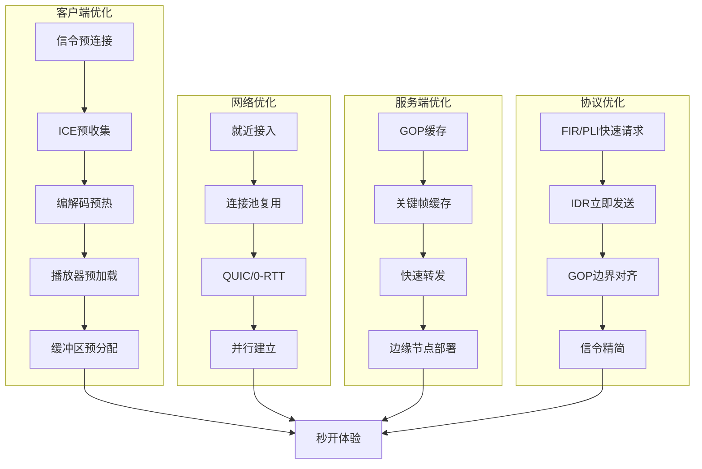
```mermaid
graph TB
    subgraph 客户端优化
        A1[信令预连接] --> A2[ICE预收集]
        A2 --> A3[编解码预热]
        A3 --> A4[播放器预加载]
        A4 --> A5[缓冲区预分配]
    end
    
    subgraph 网络优化
        B1[就近接入] --> B2[连接池复用]
        B2 --> B3[QUIC/0-RTT]
        B3 --> B4[并行建立]
    end
    
    subgraph 服务端优化
        C1[GOP缓存] --> C2[关键帧缓存]
        C2 --> C3[快速转发]
        C3 --> C4[边缘节点部署]
    end
    
    subgraph 协议优化
        D1[FIR/PLI快速请求] --> D2[IDR立即发送]
        D2 --> D3[GOP边界对齐]
        D3 --> D4[信令精简]
    end
    
    A5 --> E[秒开体验]
    B4 --> E
    C4 --> E
    D4 --> E
```

### 9.2 各优化手段的收益叠加分析

**优化收益叠加表**：

| 优化阶段 | 优化手段 | 单点收益 | 累计收益 | 实施成本 |
|---------|---------|---------|---------|---------|
| **准备阶段** | 信令预连接 | -100ms | -100ms | 低 |
| | ICE预收集 | -150ms | -250ms | 中 |
| | 编解码预热 | -50ms | -300ms | 中 |
| | 播放器预加载 | -80ms | -380ms | 低 |
| **连接阶段** | 连接池复用 | -100ms | -480ms | 中 |
| | 并行建立 | -80ms | -560ms | 中 |
| **首帧阶段** | GOP缓存 | -500ms | -1.06s | 低 |
| | 快速转发 | -200ms | -1.26s | 中 |
| | FIR/PLI | -100ms | -1.36s | 低 |
| **渲染阶段** | 快速渲染 | -30ms | -1.39s | 低 |

**收益曲线**：

```mermaid
xychart-beta
    title "秒出优化收益曲线"
    x-axis [冷启动, 信令优化, 连接优化, 编解码优化, 服务端优化, 全链路优化]
    y-axis "首帧时间(ms)" 0 --> 3000
    line [3000, 2500, 1800, 1200, 700, 300]
```

### 9.3 优化前后首帧时间对比数据

**RTC场景对比**：

| 场景 | 优化前 | 优化后 | 提升幅度 | 优化重点 |
|-----|-------|-------|---------|---------|
| **1v1通话** | 800ms | 250ms | 69% | ICE预收集+信令并行 |
| **多人会议** | 1.2s | 400ms | 67% | 编解码预热+GOP缓存 |
| **弱网通话** | 2s | 800ms | 60% | 连接池+快速重连 |

**直播场景对比**：

| 场景 | 优化前 | 优化后 | 提升幅度 | 优化重点 |
|-----|-------|-------|---------|---------|
| **互动直播** | 1.5s | 400ms | 73% | CDN边缘缓存+预加载 |
| **普通直播** | 3s | 800ms | 73% | GOP优化+就近接入 |
| **直播回放** | 2s | 600ms | 70% | 关键帧索引+预加载 |

**数据可视化**：

```mermaid
bar title 首帧时间优化对比（单位：ms）
    y-axis 首帧时间
    x-axis [1v1通话, 多人会议, 互动直播, 普通直播]
    bar [800, 1200, 1500, 3000]
    bar [250, 400, 400, 800]
    legend [优化前, 优化后]
```

### 9.4 A/B测试方案

**A/B测试设计**：

| 测试组 | 样本比例 | 优化内容 | 观察指标 |
|-------|---------|---------|---------|
| **对照组** | 50% | 无优化 | 基准数据 |
| **实验组A** | 25% | 客户端优化 | 首帧时间 |
| **实验组B** | 25% | 全链路优化 | 首帧时间+留存率 |

**测试指标**：

| 指标类型 | 核心指标 | 目标提升 | 统计显著性 |
|---------|---------|---------|-----------|
| **性能指标** | 首帧时间P50 | > 50% | p < 0.05 |
| | 首帧时间P90 | > 40% | p < 0.05 |
| | 首帧成功率 | > 2% | p < 0.05 |
| **业务指标** | 播放转化率 | > 10% | p < 0.05 |
| | 观看时长 | > 15% | p < 0.05 |
| | 用户留存 | > 5% | p < 0.05 |

**测试代码示例**：

```cpp
// ABTestManager.h
class ABTestManager {
public:
    enum class TestGroup {
        CONTROL,      // 对照组
        CLIENT_OPT,   // 客户端优化
        FULL_OPT      // 全链路优化
    };
    
    TestGroup getTestGroup(const std::string& userId) {
        // 根据用户ID哈希分组
        uint32_t hash = std::hash<std::string>{}(userId);
        uint32_t bucket = hash % 100;
        
        if (bucket < 50) return TestGroup::CONTROL;
        if (bucket < 75) return TestGroup::CLIENT_OPT;
        return TestGroup::FULL_OPT;
    }
    
    void applyOptimization(TestGroup group) {
        switch (group) {
            case TestGroup::CONTROL:
                // 不应用任何优化
                break;
            case TestGroup::CLIENT_OPT:
                enableClientOptimization();
                break;
            case TestGroup::FULL_OPT:
                enableClientOptimization();
                enableServerOptimization();
                break;
        }
    }
    
    void reportMetrics(TestGroup group, const FirstFrameMetrics& metrics) {
        // 上报埋点
        analytics_->track("first_frame_time", {
            {"group", static_cast<int>(group)},
            {"ttf", metrics.timeToFirstFrame},
            {"success", metrics.success}
        });
    }
};
```

---

## 第10章 监控与度量

### 10.1 首帧时间定义与埋点方案

**埋点位置设计**：

```mermaid
sequenceDiagram
    participant U as 用户
    participant App as 应用
    participant Player as 播放器
    participant Net as 网络层
    
    U->>App: 点击播放
    App->>App: 埋点: play_click
    
    App->>Player: 创建播放器
    Player->>Player: 埋点: player_create_start
    Player->>Player: 埋点: player_create_end
    
    Player->>Net: 建立连接
    Net->>Net: 埋点: connect_start
    Net->>Net: 埋点: connect_end
    
    Net->>Net: 埋点: first_packet
    
    Player->>Player: 埋点: first_frame_decode
    
    Player->>U: 首帧渲染
    Player->>Player: 埋点: first_frame_render
```

**埋点规范**：

| 埋点事件 | 触发时机 | 关键字段 | 采样率 |
|---------|---------|---------|-------|
| **play_click** | 用户点击播放 | timestamp, user_id, room_id | 100% |
| **player_create_start** | 开始创建播放器 | timestamp, player_type | 100% |
| **player_create_end** | 播放器创建完成 | timestamp, duration_ms | 100% |
| **connect_start** | 开始建立连接 | timestamp, protocol | 100% |
| **connect_end** | 连接建立完成 | timestamp, duration_ms | 100% |
| **first_packet** | 收到首包 | timestamp, packet_size | 100% |
| **first_frame_decode** | 首帧解码完成 | timestamp, decode_duration | 100% |
| **first_frame_render** | 首帧渲染完成 | timestamp, total_duration | 100% |

**埋点代码示例（C++）**：

```cpp
// FirstFrameTracker.h
class FirstFrameTracker {
public:
    void onPlayClick() {
        metrics_.playClickTime = getCurrentTimeMs();
        reportEvent("play_click");
    }
    
    void onPlayerCreateStart() {
        metrics_.playerCreateStart = getCurrentTimeMs();
    }
    
    void onPlayerCreateEnd() {
        metrics_.playerCreateEnd = getCurrentTimeMs();
        reportEvent("player_create", {
            {"duration", metrics_.playerCreateEnd - metrics_.playerCreateStart}
        });
    }
    
    void onConnectStart() {
        metrics_.connectStart = getCurrentTimeMs();
    }
    
    void onConnectEnd() {
        metrics_.connectEnd = getCurrentTimeMs();
        reportEvent("connect", {
            {"duration", metrics_.connectEnd - metrics_.connectStart}
        });
    }
    
    void onFirstPacket(int size) {
        metrics_.firstPacketTime = getCurrentTimeMs();
        reportEvent("first_packet", {
            {"size", size},
            {"time_from_click", metrics_.firstPacketTime - metrics_.playClickTime}
        });
    }
    
    void onFirstFrameDecode() {
        metrics_.firstFrameDecodeTime = getCurrentTimeMs();
        reportEvent("first_frame_decode", {
            {"duration", metrics_.firstFrameDecodeTime - metrics_.firstPacketTime}
        });
    }
    
    void onFirstFrameRender() {
        metrics_.firstFrameRenderTime = getCurrentTimeMs();
        
        // 计算总首帧时间
        int64_t totalTTF = metrics_.firstFrameRenderTime - metrics_.playClickTime;
        
        reportEvent("first_frame_render", {
            {"total_ttf", totalTTF},
            {"network_time", metrics_.firstPacketTime - metrics_.playClickTime},
            {"decode_time", metrics_.firstFrameDecodeTime - metrics_.firstPacketTime},
            {"render_time", metrics_.firstFrameRenderTime - metrics_.firstFrameDecodeTime}
        });
        
        // 上报分位数统计
        reportPercentile("ttf", totalTTF);
    }
    
private:
    struct Metrics {
        int64_t playClickTime = 0;
        int64_t playerCreateStart = 0;
        int64_t playerCreateEnd = 0;
        int64_t connectStart = 0;
        int64_t connectEnd = 0;
        int64_t firstPacketTime = 0;
        int64_t firstFrameDecodeTime = 0;
        int64_t firstFrameRenderTime = 0;
    };
    
    Metrics metrics_;
};
```

### 10.2 首帧成功率

**成功率定义**：

```
首帧成功率 = 首帧渲染成功次数 / 播放请求总次数 × 100%

首帧失败原因分类：
- 连接失败（网络问题）
- 解码失败（格式不支持）
- 超时（超过阈值未收到首帧）
- 其他错误
```

**成功率监控**：

| 成功率等级 | 范围 | 告警级别 | 处理策略 |
|-----------|------|---------|---------|
| **优秀** | > 99% | 无 | 保持 |
| **良好** | 95% - 99% | 提示 | 关注趋势 |
| **警告** | 90% - 95% | 一般告警 | 排查原因 |
| **严重** | < 90% | 紧急告警 | 立即处理 |

### 10.3 各环节耗时分布

**耗时分布分析**：

```mermaid
pie title 首帧耗时分布（优化后）
    "网络连接" : 120
    "信令交互" : 50
    "解码器创建" : 30
    "首帧解码" : 30
    "渲染准备" : 20
```

**各环节目标值**：

| 环节 | P50目标 | P90目标 | P99目标 | 告警阈值 |
|-----|--------|--------|--------|---------|
| **信令耗时** | < 50ms | < 100ms | < 200ms | > 300ms |
| **连接耗时** | < 100ms | < 200ms | < 400ms | > 500ms |
| **首包耗时** | < 150ms | < 300ms | < 500ms | > 600ms |
| **解码耗时** | < 30ms | < 60ms | < 100ms | > 150ms |
| **渲染耗时** | < 20ms | < 40ms | < 80ms | > 100ms |
| **总首帧时间** | < 300ms | < 500ms | < 800ms | > 1s |

### 10.4 分位数统计（P50/P90/P99）

**分位数计算实现**：

```cpp
// PercentileCalculator.h
class PercentileCalculator {
public:
    void addValue(double value) {
        std::lock_guard<std::mutex> lock(mutex_);
        values_.push_back(value);
        
        // 定期计算分位数
        if (values_.size() >= 1000) {
            calculatePercentiles();
            values_.clear();
        }
    }
    
    struct Percentiles {
        double p50;
        double p90;
        double p95;
        double p99;
    };
    
    Percentiles getPercentiles() {
        std::lock_guard<std::mutex> lock(mutex_);
        
        if (values_.empty()) return {0, 0, 0, 0};
        
        std::vector<double> sorted = values_;
        std::sort(sorted.begin(), sorted.end());
        
        return {
            getPercentile(sorted, 0.50),
            getPercentile(sorted, 0.90),
            getPercentile(sorted, 0.95),
            getPercentile(sorted, 0.99)
        };
    }
    
private:
    double getPercentile(const std::vector<double>& sorted, double p) {
        size_t index = static_cast<size_t>(sorted.size() * p);
        return sorted[std::min(index, sorted.size() - 1)];
    }
    
    std::vector<double> values_;
    std::mutex mutex_;
};
```

---

## 第11章 最佳实践清单

### 11.1 秒出优化Checklist

**客户端优化Checklist**：

- [ ] 信令连接预建立（应用启动时）
- [ ] ICE候选预收集（应用启动时）
- [ ] 编解码器预热（常用分辨率）
- [ ] 播放器实例预创建
- [ ] 缓冲区预分配
- [ ] Surface/GL上下文预初始化
- [ ] 信令与媒体通道并行建立
- [ ] 首帧快速渲染（跳过后处理）

**服务端优化Checklist**：

- [ ] GOP缓存启用
- [ ] 关键帧缓存配置
- [ ] 快速转发策略
- [ ] 边缘节点部署
- [ ] 就近接入配置
- [ ] FIR/PLI快速响应
- [ ] IDR立即发送支持

**监控埋点Checklist**：

- [ ] 全链路埋点覆盖
- [ ] 首帧时间分位数统计
- [ ] 各环节耗时监控
- [ ] 首帧成功率监控
- [ ] 失败原因分类上报
- [ ] 实时监控告警

### 11.2 常见问题与解决方案

**问题1：预创建资源占用过多内存**

| 现象 | 原因 | 解决方案 |
|-----|------|---------|
| 应用启动慢 | 预创建阻塞主线程 | 异步预创建，降低优先级 |
| 内存占用高 | 预创建过多实例 | 限制池大小，按需预创建 |
| 后台被kill | 内存占用过高 | 后台释放预创建资源 |

**问题2：预连接资源过期**

| 现象 | 原因 | 解决方案 |
|-----|------|---------|
| 预连接失效 | 连接超时 | 定期保活，超时重连 |
| 信令token过期 | 长时间未使用 | 预连接时刷新token |
| ICE候选失效 | 网络环境变化 | 网络变化时重新收集 |

**问题3：首帧优化与流畅度冲突**

| 现象 | 原因 | 解决方案 |
|-----|------|---------|
| 首帧快但后续卡顿 | 缓冲区太小 | 首帧后动态调整缓冲区 |
| 短GOP导致码率高 | GOP设置过短 | 动态GOP策略 |
| 跳过处理后画质差 | 后处理跳过过多 | 渐进式恢复后处理 |

**问题4：服务端缓存命中率低**

| 现象 | 原因 | 解决方案 |
|-----|------|---------|
| 缓存未命中 | 缓存策略不当 | 优化缓存大小和策略 |
| 内存不足 | 缓存过多 | LRU淘汰策略 |
| 并发冲突 | 读写冲突 | 读写锁分离 |

**问题5：A/B测试结果不显著**

| 现象 | 原因 | 解决方案 |
|-----|------|---------|
| 样本量不足 | 测试时间太短 | 延长测试周期 |
| 分组不均 | 哈希冲突 | 改进分组算法 |
| 指标选择不当 | 指标不敏感 | 选择核心指标 |

---

## 参考资源

### 标准文档

- WebRTC Specification: https://www.w3.org/TR/webrtc/
- RTP/RTCP Specification: RFC 3550, RFC 4585
- RTCP FIR/PLI: RFC 5104
- QUIC Protocol: RFC 9000

### 权威书籍

- 《WebRTC权威指南》 - Alan B. Johnston
- 《实时音视频技术解析》 - 李智慧
- 《视频编码全角度详解》 - 毕厚杰
- 《High Performance Browser Networking》 - Ilya Grigorik

### 开源项目

| 项目 | 链接 | 描述 |
|------|------|------|
| WebRTC | https://webrtc.org/ | Google开源RTC框架 |
| SRS | https://ossrs.net/ | 开源流媒体服务器 |
| nginx-rtmp-module | https://github.com/arut/nginx-rtmp-module | Nginx RTMP模块 |
| Pion | https://pion.ly/ | Go语言WebRTC框架 |
| mediasoup | https://mediasoup.org/ | 现代化WebRTC服务器 |

### 技术文章

- WebRTC 首帧优化实践
- QUIC协议在直播中的应用
- CDN边缘计算与首帧优化
- 移动端播放器秒开技术

---

> 本文档提供了秒出优化的完整工程实践方案，从信令到渲染的全链路优化策略，涵盖iOS/Android/C++的工程实现。建议按照Checklist逐项实施，并通过A/B测试验证效果。秒出优化是一个持续迭代的过程，需要结合业务场景和监控数据不断调优。
