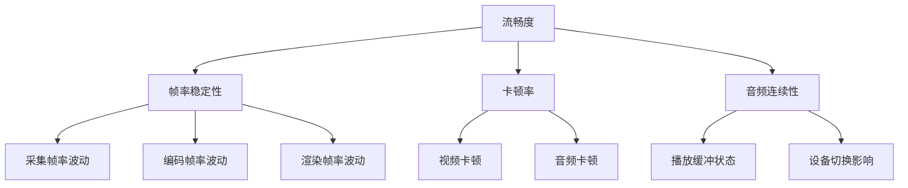
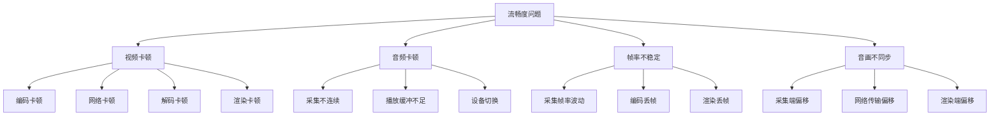
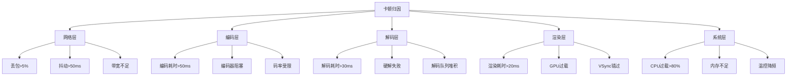
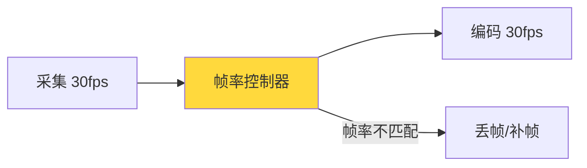
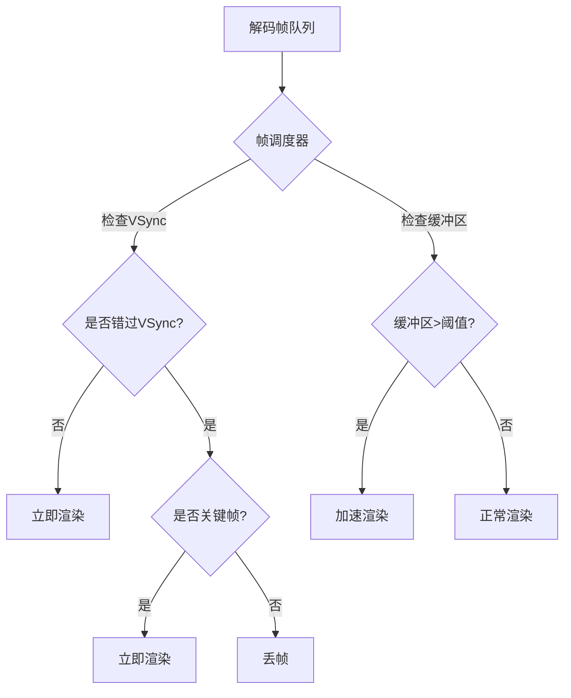
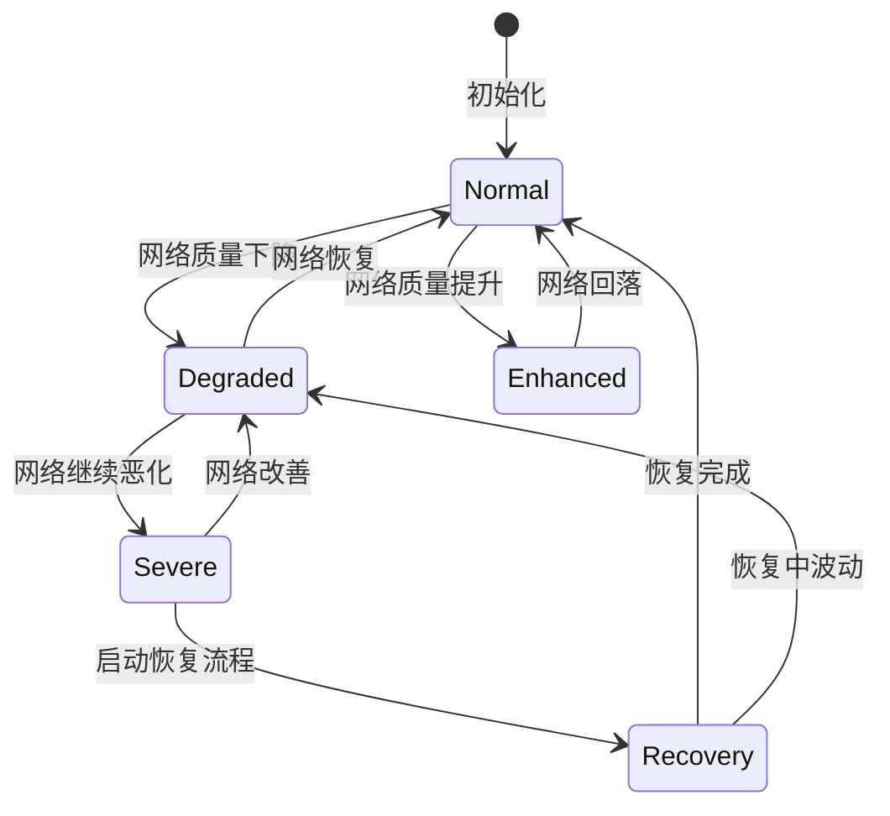
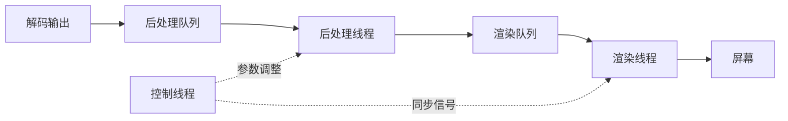

# 流畅度优化详细解析

> **TL;DR：流畅度是音视频体验的核心指标，直接决定用户留存与满意度。工程优化核心策略包括：① 建立科学的卡顿定义与监控体系（卡顿率 < 1%为优质）；② 帧率稳定性全链路保障（采集-编码-渲染协同）；③ 质量自适应决策引擎（多维度输入、状态机驱动、滞回防抖动）；④ 渲染管线深度优化（VSync对齐、双/三缓冲、平台适配）；⑤ 弱网场景分级保障（检测→降级→恢复的闭环策略）。本文档提供从监控定义到工程落地的完整方法论。**

---

## 核心结论（TL;DR）

**流畅度优化的本质是在资源约束下，通过系统化的监控、归因与治理，将卡顿率控制在用户无感知阈值以下。**

现代音视频系统流畅度优化的关键支柱：

1. **度量先行**：卡顿定义必须标准化（视频：200ms无新帧；音频：缓冲区欠载），监控覆盖全链路各环节
2. **帧率稳定**：采集-编码-渲染三环节帧率对齐，波动控制在±5%以内
3. **自适应决策**：网络/设备/电量多维度输入，状态机驱动分辨率/帧率/码率动态调整
4. **渲染优化**：VSync同步、双/三缓冲、平台渲染API深度适配（Metal/OpenGL ES）
5. **弱网闭环**：网络分级检测→梯度降级→渐进恢复，形成完整保障链路

**一句话理解流畅度优化**：与其追求"绝对零卡顿"，不如确保"卡顿可度量、根因可归因、策略可降级"——流畅度优化本质上是一种**系统性质量保障**的工程实践。

---

## 文章导航

本文采用MECE分类法组织，系统覆盖流畅度优化的十大方向：

| 章节 | 核心内容 | 适用场景 | 优先级 |
|-----|---------|---------|-------|
| **第1章** | 流畅度的用户体验价值与定义 | 全场景 | P0 |
| **第2章** | 流畅度问题MECE分类总览 | 全场景 | P0 |
| **第3章** | 卡顿率定义与监控体系 | 全场景 | P0 |
| **第4章** | 帧率稳定性优化（采集/编码/渲染） | 全场景 | P0 |
| **第5章** | 质量自适应策略（分辨率/帧率/码率） | 弱网/动态场景 | P0 |
| **第6章** | 渲染管线优化 | 播放端 | P1 |
| **第7章** | 音频流畅度优化 | 音频场景 | P1 |
| **第8章** | 弱网场景流畅度保障 | 弱网场景 | P0 |
| **第9章** | 监控与度量体系 | 全场景 | P1 |
| **第10章** | 最佳实践清单 | 全场景 | P0 |

---

## 第1章 Why — 流畅度为什么是核心体验指标

### 1.1 卡顿对用户体验的影响

**数据驱动的卡顿影响分析**：

| 卡顿率 | 用户满意度 | 通话/观看时长 | 投诉率 | 业务影响 |
|-------|-----------|--------------|--------|---------|
| < 0.5% | 95%+ | 基准 | 基准 | 优质体验 |
| 0.5-1% | 85-95% | -5% | 2x | 可接受 |
| 1-3% | 60-85% | -20% | 5x | 明显影响 |
| 3-5% | 40-60% | -40% | 10x | 严重问题 |
| > 5% | < 40% | -60% | 20x+ | 不可用 |

**关键洞察**：
- 卡顿率从1%上升到3%，用户满意度下降约25个百分点
- 卡顿率超过5%时，超过60%的用户会在1分钟内退出
- 卡顿对用户留存的影响是延迟的2-3倍

### 1.2 流畅度定义：三维指标体系



**流畅度三维定义**：

| 维度 | 定义 | 度量指标 | 优质阈值 | 可接受阈值 |
|-----|------|---------|---------|-----------|
| **帧率稳定性** | 实际帧率与目标帧率的偏离程度 | 帧率标准差、波动率 | < 5% | < 10% |
| **卡顿率** | 卡顿时间占总时间的比例 | 卡顿时长/总时长 | < 1% | < 3% |
| **音频连续性** | 音频播放无中断的持续时间占比 | 音频中断次数/时长 | 中断<1次/分钟 | 中断<3次/分钟 |

### 1.3 不同场景的流畅度要求

**场景化流畅度标准**：

| 场景 | 目标帧率 | 最低帧率 | 卡顿率目标 | 特殊要求 |
|-----|---------|---------|-----------|---------|
| **实时通信（RTC）** | 30fps | 15fps | < 1% | 延迟<200ms |
| **互动直播** | 30fps | 20fps | < 2% | 延迟<1s |
| **游戏直播** | 60fps | 30fps | < 1% | 低延迟优先 |
| **在线教育** | 25fps | 15fps | < 2% | 音频连续性>99% |
| **视频会议** | 30fps | 15fps | < 1% | 多人场景稳定 |
| **短视频播放** | 30fps | 24fps | < 3% | 首帧优先 |

---

## 第2章 What — 流畅度问题MECE分类

### 2.1 流畅度问题全景图



### 2.2 视频卡顿分类详解

| 卡顿类型 | 根因 | 典型表现 | 检测方法 | 优化方向 |
|---------|------|---------|---------|---------|
| **编码卡顿** | CPU/GPU过载、编码器阻塞 | 发送端帧堆积、编码耗时突增 | 编码耗时监控 | 硬编优先、负载均衡 |
| **网络卡顿** | 丢包、抖动、带宽不足 | 接收端缓冲耗尽、解码等待 | 缓冲区水位监控 | FEC/ARQ、自适应码率 |
| **解码卡顿** | 解码耗时过长、硬解失败 | 解码队列堆积、软解 fallback | 解码耗时监控 | 硬解优先、降分辨率 |
| **渲染卡顿** | GPU过载、VSync未对齐 | 渲染帧间隔不均、掉帧 | 渲染时间戳分析 | 渲染线程优化、丢帧策略 |

### 2.3 音频卡顿分类详解

| 卡顿类型 | 根因 | 典型表现 | 检测方法 | 优化方向 |
|---------|------|---------|---------|---------|
| **采集不连续** | 采集线程阻塞、设备占用 | 音频帧丢失、断续 | 采集时间戳差 | 独立采集线程、优先级提升 |
| **播放缓冲不足** | 网络抖动、缓冲区过小 | 播放欠载、静音填充 | 缓冲区水位监控 | 自适应缓冲、加速播放 |
| **设备切换** | 蓝牙/有线切换、路由变更 | 切换期间静音/杂音 | 设备状态监听 | 无缝切换、预缓冲 |

### 2.4 帧率不稳定分类详解

| 不稳定类型 | 根因 | 典型表现 | 检测方法 | 优化方向 |
|-----------|------|---------|---------|---------|
| **采集帧率波动** | 自动曝光、光线变化、温控 | 实际帧率偏离目标 | 采集时间戳统计 | 锁定帧率、补帧策略 |
| **编码丢帧** | 编码器过载、码率受限 | 编码输出帧率<采集帧率 | 编码输入输出对比 | 动态降帧、编码器负载监控 |
| **渲染丢帧** | GPU过载、VSync错过 | 渲染帧率<显示刷新率 | 渲染时间戳分析 | 丢帧策略、渲染优先级 |

### 2.5 音画不同步分类详解

| 不同步类型 | 根因 | 典型表现 | 检测方法 | 优化方向 |
|-----------|------|---------|---------|---------|
| **采集端偏移** | 音视频采集时钟不同源 | 发送端已不同步 | 采集时间戳对比 | 统一时钟源、NTP同步 |
| **网络传输偏移** | 音视频包传输路径差异 | 接收端不同步 | RTP时间戳分析 | 同步发送、联合缓冲 |
| **渲染端偏移** | 音视频渲染时钟独立 | 播放时不同步 | 渲染时间戳对比 | 统一渲染时钟、同步调整 |

---

## 第3章 How — 卡顿率定义与监控体系

### 3.1 卡顿定义标准

#### 3.1.1 视频卡顿定义

**标准定义**：连续200ms无新帧渲染即判定为一次视频卡顿。

```
卡顿判定逻辑：
┌─────────────────────────────────────────────────────────┐
│  当前渲染帧时间戳: Tn                                    │
│  上一帧渲染时间戳: Tn-1                                  │
│  帧间隔: Δt = Tn - Tn-1                                  │
│                                                          │
│  IF Δt > 200ms THEN                                      │
│      卡顿时长 = Δt - 目标帧间隔(33ms@30fps)              │
│      记录一次卡顿事件                                    │
│  END IF                                                  │
└─────────────────────────────────────────────────────────┘
```

**分级卡顿定义**：

| 卡顿级别 | 帧间隔阈值 | 用户感知 | 处理优先级 |
|---------|-----------|---------|-----------|
| **轻微卡顿** | 100-200ms | 轻微感知 | P2 |
| **明显卡顿** | 200-500ms | 明显感知 | P1 |
| **严重卡顿** | 500-1000ms | 严重影响 | P0 |
| **卡死** | > 1000ms | 不可用 | P0 |

#### 3.1.2 音频卡顿定义

**标准定义**：音频播放缓冲区欠载（Underflow）即判定为音频卡顿。

```cpp
// 音频卡顿检测伪代码
class AudioStallDetector {
public:
    void OnPlaybackCallback(int framesInBuffer) {
        int64_t now = GetCurrentTimeMs();
        
        // 检测缓冲区欠载
        if (framesInBuffer < underrunThreshold_) {
            if (!isStalling_) {
                // 卡顿开始
                stallStartTime_ = now;
                isStalling_ = true;
                ReportStallBegin();
            }
        } else {
            if (isStalling_) {
                // 卡顿结束
                int64_t stallDuration = now - stallStartTime_;
                ReportStallEnd(stallDuration);
                isStalling_ = false;
            }
        }
    }
    
private:
    int underrunThreshold_ = 480;  // 10ms @ 48kHz
    bool isStalling_ = false;
    int64_t stallStartTime_ = 0;
};
```

#### 3.1.3 卡顿率计算方法

**核心公式**：

```
卡顿率 = 卡顿时长 / 总播放时长 × 100%

其中：
- 卡顿时长 = Σ(单次卡顿持续时间)
- 总播放时长 = 正常播放时长 + 卡顿时长
```

**统计口径**：

| 统计维度 | 计算方法 | 用途 |
|---------|---------|------|
| **单次会话卡顿率** | 该会话卡顿时长/总会话时长 | 单用户质量评估 |
| **分位数卡顿率** | P50/P90/P99卡顿率 | 整体质量分布 |
| **时间维度卡顿率** | 某时间段内卡顿率均值 | 趋势监控 |
| **维度拆分卡顿率** | 按网络/设备/版本拆分 | 根因分析 |

#### 3.1.4 行业标准参考

| 标准来源 | 卡顿定义 | 优质阈值 | 可接受阈值 |
|---------|---------|---------|-----------|
| **WebRTC标准** | 帧间隔>150ms | < 1% | < 3% |
| **腾讯视频云** | 帧间隔>200ms | < 0.5% | < 2% |
| **声网Agora** | 帧间隔>200ms | < 1% | < 3% |
| **阿里云直播** | 帧间隔>250ms | < 1% | < 5% |

### 3.2 卡顿分类与归因

#### 3.2.1 按原因分类



#### 3.2.2 卡顿归因算法

**基于时间戳的归因算法**：

```cpp
// 卡顿归因核心逻辑
StallReason AnalyzeStallCause(const StallEvent& stall, 
                               const PipelineMetrics& metrics) {
    // 1. 检查网络层
    if (metrics.networkBufferEmpty && 
        metrics.packetLossRate > 0.05) {
        return StallReason::NETWORK_LOSS;
    }
    
    if (metrics.networkJitter > 50) {
        return StallReason::NETWORK_JITTER;
    }
    
    // 2. 检查编码层（发送端卡顿）
    if (metrics.encodeTime > 50) {
        return StallReason::ENCODE_SLOW;
    }
    
    if (metrics.encoderQueueSize > 5) {
        return StallReason::ENCODE_BLOCKED;
    }
    
    // 3. 检查解码层
    if (metrics.decodeTime > 30) {
        return StallReason::DECODE_SLOW;
    }
    
    if (metrics.decoderQueueSize > 3) {
        return StallReason::DECODE_BLOCKED;
    }
    
    // 4. 检查渲染层
    if (metrics.renderTime > 20) {
        return StallReason::RENDER_SLOW;
    }
    
    if (metrics.gpuUsage > 0.9) {
        return StallReason::GPU_OVERLOAD;
    }
    
    // 5. 检查系统层
    if (metrics.cpuUsage > 0.8) {
        return StallReason::CPU_OVERLOAD;
    }
    
    return StallReason::UNKNOWN;
}
```

**归因优先级规则**：

| 优先级 | 归因类型 | 判定条件 | 置信度 |
|-------|---------|---------|-------|
| 1 | 网络丢包 | 缓冲区空且丢包率>5% | 高 |
| 2 | 编码阻塞 | 编码队列>5帧 | 高 |
| 3 | 解码缓慢 | 解码耗时>30ms | 高 |
| 4 | GPU过载 | GPU使用率>90% | 中 |
| 5 | CPU过载 | CPU使用率>80% | 中 |
| 6 | 网络抖动 | 抖动>50ms | 中 |
| 7 | 未知原因 | 无明确匹配 | 低 |

#### 3.2.3 卡顿事件上报格式设计

```json
{
  "event_type": "video_stall",
  "event_time": 1699123456789,
  "session_id": "sess_abc123",
  "user_id": "user_xyz789",
  
  "stall_info": {
    "stall_start_time": 1699123456000,
    "stall_end_time": 1699123456800,
    "stall_duration_ms": 800,
    "stall_level": "severe"
  },
  
  "attribution": {
    "primary_reason": "network_loss",
    "secondary_reason": "decode_slow",
    "confidence": 0.85
  },
  
  "context": {
    "network_type": "4G",
    "packet_loss_rate": 0.08,
    "rtt_ms": 120,
    "jitter_ms": 45,
    "bandwidth_kbps": 500,
    
    "encode_time_ms": 15,
    "encode_queue_size": 1,
    "decode_time_ms": 25,
    "decode_queue_size": 2,
    "render_time_ms": 8,
    
    "cpu_usage": 0.65,
    "gpu_usage": 0.45,
    "memory_usage_mb": 180
  },
  
  "device_info": {
    "platform": "iOS",
    "os_version": "16.5",
    "device_model": "iPhone14,2",
    "app_version": "3.2.1"
  }
}
```

### 3.3 卡顿监控大盘

#### 3.3.1 核心指标体系

| 指标名称 | 定义 | 采集频率 | 告警阈值 | 用途 |
|---------|------|---------|---------|------|
| **卡顿率** | 卡顿时长/总时长 | 实时 | > 3% | 核心体验指标 |
| **卡顿次数** | 单位时间内卡顿次数 | 实时 | > 5次/分钟 | 频繁度评估 |
| **卡顿时长分布** | P50/P90/P99卡顿时长 | 1分钟 | P99>500ms | 严重程度评估 |
| **卡顿归因分布** | 各原因占比 | 5分钟 | 单一原因>50% | 根因定位 |
| **帧率稳定性** | 实际帧率标准差 | 实时 | σ>2fps | 稳定性评估 |

#### 3.3.2 分维度统计

**网络类型维度**：

| 网络类型 | 卡顿率目标 | 卡顿率告警 | 样本量要求 |
|---------|-----------|-----------|-----------|
| WiFi | < 0.5% | > 2% | > 1000 |
| 4G | < 1% | > 3% | > 1000 |
| 5G | < 0.5% | > 2% | > 500 |
| 弱网 | < 3% | > 5% | > 500 |

**设备类型维度**：

| 设备分级 | 卡顿率目标 | 卡顿率告警 | 典型设备 |
|---------|-----------|-----------|---------|
| 高端 | < 0.5% | > 1% | iPhone 14+/旗舰安卓 |
| 中端 | < 1% | > 3% | iPhone 11-13/中端安卓 |
| 低端 | < 2% | > 5% | iPhone X/低端安卓 |

**地域维度**：

| 地域类型 | 卡顿率目标 | 卡顿率告警 | 重点关注 |
|---------|-----------|-----------|---------|
| 一线城市 | < 0.5% | > 1% | 高价值用户 |
| 二三线 | < 1% | > 3% | 网络质量 |
| 海外 | < 2% | > 5% | 跨国链路 |

#### 3.3.3 告警规则设计

**分级告警策略**：

| 告警级别 | 触发条件 | 通知方式 | 响应时间 | 处理动作 |
|---------|---------|---------|---------|---------|
| **P0-紧急** | 卡顿率>5%且持续>2分钟 | 电话+短信+IM | 5分钟 | 立即降级、回滚 |
| **P1-重要** | 卡顿率>3%且持续>5分钟 | 短信+IM | 30分钟 | 排查原因、热修复 |
| **P2-一般** | 卡顿率>2%且持续>10分钟 | IM | 2小时 | 排期优化 |
| **P3-提示** | 卡顿率环比上升>50% | 邮件 | 1天 | 关注趋势 |

**智能告警收敛**：

```
告警收敛规则：
1. 时间收敛：同一问题5分钟内只告警一次
2. 维度收敛：按网络类型/设备类型聚合
3. 依赖收敛：根因告警抑制衍生告警
   - 网络中断抑制所有网络相关告警
   - 服务器故障抑制所有服务相关告警
```

---

## 第4章 How — 帧率稳定性优化

### 4.1 采集帧率稳定性

#### 4.1.1 摄像头帧率波动原因

| 波动原因 | 机制说明 | 影响程度 | 可控性 |
|---------|---------|---------|-------|
| **自动曝光** | 低光环境延长曝光时间 | 高（可能降帧50%） | 中 |
| **自动对焦** | 场景变化触发AF | 中（短暂降帧） | 高 |
| **光线变化** | 明暗变化导致AE调整 | 中 | 低 |
| **温控降频** | 设备过热触发throttling | 高（可能降帧70%） | 中 |
| **CPU负载** | 前处理阻塞采集线程 | 中 | 高 |

#### 4.1.2 帧率稳定策略

**策略一：锁定帧率**

```objc
// iOS: 锁定帧率配置
- (void)lockFrameRate:(AVCaptureDevice *)device targetFPS:(int32_t)fps {
    NSError *error = nil;
    
    [device lockForConfiguration:&error];
    
    // 获取支持的帧率范围
    NSArray<AVFrameRateRange *> *ranges = device.activeFormat.videoSupportedFrameRateRanges;
    
    // 找到最接近目标的帧率范围
    AVFrameRateRange *targetRange = nil;
    for (AVFrameRateRange *range in ranges) {
        if (range.minFrameRate <= fps && range.maxFrameRate >= fps) {
            targetRange = range;
            break;
        }
    }
    
    if (targetRange) {
        // 设置最小和最大帧率为相同值，实现锁定
        device.activeVideoMinFrameDuration = CMTimeMake(1, fps);
        device.activeVideoMaxFrameDuration = CMTimeMake(1, fps);
        
        // 禁用自动低光降帧
        device.automaticallyAdjustsVideoHDREnabled = NO;
    }
    
    [device unlockForConfiguration];
}
```

```java
// Android: 锁定帧率配置
public void lockFrameRate(CameraDevice camera, int targetFps) {
    CaptureRequest.Builder builder = camera.createCaptureRequest(CameraDevice.TEMPLATE_RECORD);
    
    // 设置帧率范围（min=max实现锁定）
    builder.set(CaptureRequest.CONTROL_AE_TARGET_FPS_RANGE, 
                new Range<>(targetFps, targetFps));
    
    // 禁用自动曝光调整
    builder.set(CaptureRequest.CONTROL_AE_MODE, 
                CaptureRequest.CONTROL_AE_MODE_OFF);
    
    // 设置固定曝光时间（根据帧率计算）
    long exposureTime = 1000000000L / targetFps;  // 纳秒
    builder.set(CaptureRequest.SENSOR_EXPOSURE_TIME, exposureTime);
    
    // 提交请求
    camera.setRepeatingRequest(builder.build(), null, null);
}
```

**策略二：动态补帧**

```cpp
// 补帧器实现
class FrameInterpolator {
public:
    CVPixelBufferRef GetFrame(int64_t targetTimestamp) {
        // 查找最接近的帧
        auto it = frameBuffer_.lower_bound(targetTimestamp);
        
        if (it == frameBuffer_.end()) {
            // 没有后续帧，返回最后一帧
            return frameBuffer_.rbegin()->second;
        }
        
        if (it == frameBuffer_.begin()) {
            // 只有这一帧
            return it->second;
        }
        
        // 前后帧插值
        auto nextIt = it;
        auto prevIt = std::prev(it);
        
        int64_t t1 = prevIt->first;
        int64_t t2 = nextIt->first;
        
        // 计算插值权重
        float alpha = (float)(targetTimestamp - t1) / (t2 - t1);
        
        // 返回插值帧（简化：返回最近帧）
        return alpha < 0.5 ? prevIt->second : nextIt->second;
    }
    
private:
    std::map<int64_t, CVPixelBufferRef> frameBuffer_;
    static constexpr size_t kMaxBufferSize = 3;
};
```

#### 4.1.3 采集-编码帧率对齐



**帧率对齐策略**：

| 场景 | 采集帧率 | 编码帧率 | 处理策略 |
|-----|---------|---------|---------|
| 标准场景 | 30fps | 30fps | 直通 |
| 降功耗 | 30fps | 15fps | 均匀丢帧（每2帧取1） |
| 弱网适配 | 30fps | 10fps | 均匀丢帧（每3帧取1） |
| 采集受限 | 15fps | 30fps | 帧复制补帧 |

```cpp
// 帧率控制器实现
class FrameRateController {
public:
    FrameRateController(int inputFps, int outputFps) 
        : inputFps_(inputFps), outputFps_(outputFps) {
        // 计算丢帧间隔
        if (inputFps > outputFps) {
            dropInterval_ = inputFps / outputFps;
        } else {
            dropInterval_ = 1;
        }
    }
    
    bool ShouldProcessFrame() {
        frameCount_++;
        
        if (inputFps_ <= outputFps_) {
            // 采集帧率<=编码帧率，全部处理
            return true;
        }
        
        // 均匀丢帧
        return (frameCount_ % dropInterval_) == 0;
    }
    
private:
    int inputFps_;
    int outputFps_;
    int dropInterval_;
    int frameCount_ = 0;
};
```

### 4.2 编码帧率稳定性

#### 4.2.1 编码耗时波动控制

**编码耗时监控**：

```cpp
class EncodeTimeMonitor {
public:
    void OnEncodeStart(int64_t frameId) {
        encodeStartTime_[frameId] = GetCurrentTimeMs();
    }
    
    void OnEncodeEnd(int64_t frameId) {
        auto it = encodeStartTime_.find(frameId);
        if (it != encodeStartTime_.end()) {
            int64_t encodeTime = GetCurrentTimeMs() - it->second;
            encodeStartTime_.erase(it);
            
            // 更新统计
            UpdateStats(encodeTime);
            
            // 告警检测
            if (encodeTime > kEncodeTimeThreshold) {
                ReportSlowEncode(encodeTime);
            }
        }
    }
    
private:
    static constexpr int64_t kEncodeTimeThreshold = 50;  // 50ms
    std::unordered_map<int64_t, int64_t> encodeStartTime_;
};
```

**编码耗时优化策略**：

| 策略 | 实现方式 | 适用场景 | 效果 |
|-----|---------|---------|------|
| **硬编优先** | VideoToolbox/MediaCodec | 所有移动端 | 耗时-70% |
| **动态预设** | 根据负载调整编码速度 | CPU波动场景 | 稳定性+30% |
| **帧并行** | 多帧并行编码 | 多核设备 | 吞吐+50% |
| **ROI编码** | 重点区域高质量 | 带宽受限 | 主观质量+20% |

#### 4.2.2 编码丢帧策略（优雅降帧）

```cpp
// 优雅降帧策略
class GracefulFrameDrop {
public:
    enum DropStrategy {
        DROP_NONE,      // 不丢帧
        DROP_B_FRAME,   // 优先丢B帧
        DROP_P_FRAME,   // 必要时丢P帧
        DROP_FORCE      // 强制丢帧
    };
    
    bool ShouldDropFrame(int64_t encodeQueueSize, 
                         int64_t targetFps,
                         int64_t currentFps) {
        // 计算负载率
        float loadRatio = (float)currentFps / targetFps;
        
        if (loadRatio > 0.9) {
            strategy_ = DROP_NONE;
            return false;
        }
        
        if (loadRatio > 0.7) {
            strategy_ = DROP_B_FRAME;
            return frameType_ == B_FRAME;
        }
        
        if (loadRatio > 0.5) {
            strategy_ = DROP_P_FRAME;
            return frameType_ != I_FRAME;
        }
        
        strategy_ = DROP_FORCE;
        return true;
    }
    
    // 降帧后恢复策略
    void OnFrameDropped() {
        consecutiveDrops_++;
        
        // 连续丢帧过多，降低目标帧率
        if (consecutiveDrops_ > 5) {
            targetFps_ = std::max(targetFps_ - 5, minFps_);
            consecutiveDrops_ = 0;
        }
    }
    
private:
    DropStrategy strategy_ = DROP_NONE;
    FrameType frameType_ = P_FRAME;
    int consecutiveDrops_ = 0;
    int targetFps_ = 30;
    int minFps_ = 10;
};
```

#### 4.2.3 编码器负载监控

```cpp
// 编码器负载监控器
class EncoderLoadMonitor {
public:
    struct LoadMetrics {
        float cpuUsage;
        float gpuUsage;
        int queueSize;
        float encodeTimeMs;
        float frameRate;
    };
    
    LoadMetrics GetCurrentLoad() {
        LoadMetrics metrics;
        
        // 获取系统负载
        metrics.cpuUsage = GetCPUUsage();
        metrics.gpuUsage = GetGPUUsage();
        
        // 获取编码器状态
        metrics.queueSize = encoder_->GetQueueSize();
        metrics.encodeTimeMs = avgEncodeTime_.GetAverage();
        metrics.frameRate = CalculateActualFps();
        
        return metrics;
    }
    
    bool IsOverloaded() {
        auto metrics = GetCurrentLoad();
        
        // 多维度过载判断
        return metrics.cpuUsage > 0.8 ||
               metrics.gpuUsage > 0.9 ||
               metrics.queueSize > 5 ||
               metrics.encodeTimeMs > 33;  // 超过一帧时间
    }
    
    void AdjustEncodingParams() {
        if (IsOverloaded()) {
            // 降级策略
            if (currentResolution_ > minResolution_) {
                ReduceResolution();
            } else if (currentFps_ > minFps_) {
                ReduceFrameRate();
            } else if (currentBitrate_ > minBitrate_) {
                ReduceBitrate();
            }
        } else if (CanUpgrade()) {
            // 升级策略（带滞回）
            UpgradeParams();
        }
    }
    
private:
    MovingAverage avgEncodeTime_{10};
    VideoEncoder* encoder_;
    
    Resolution currentResolution_;
    int currentFps_;
    int currentBitrate_;
};
```

### 4.3 渲染帧率稳定性

#### 4.3.1 VSync对齐渲染

**VSync机制原理**：

```
显示刷新周期（60Hz = 16.67ms）
│
├─ VSync信号 ─┬─ 渲染窗口 ─┬─ VSync信号 ─┬─ 渲染窗口 ─┤
│             │            │             │            │
│             ▼            │             ▼            │
│         渲染帧 N         │         渲染帧 N+1       │
│                          │                          │
└──────────────────────────┴──────────────────────────┘

错过VSync的后果：
- 帧N在VSync后提交 → 需要等待下一个VSync → 显示延迟+16.67ms
- 连续错过 → 帧率从60fps降至30fps
```

**iOS VSync对齐（CADisplayLink）**：

```objc
// iOS: CADisplayLink实现VSync同步渲染
@interface VideoRenderer : NSObject
@property (nonatomic, strong) CADisplayLink *displayLink;
@property (nonatomic, strong) dispatch_queue_t renderQueue;
@end

@implementation VideoRenderer

- (void)setupDisplayLink {
    // 创建专用渲染队列
    self.renderQueue = dispatch_queue_create("com.example.render", 
                                              DISPATCH_QUEUE_SERIAL);
    
    // 创建CADisplayLink，与屏幕刷新同步
    self.displayLink = [CADisplayLink displayLinkWithTarget:self 
                                                       selector:@selector(onVSync:)];
    
    // 设置帧率（默认与屏幕刷新率一致）
    if (@available(iOS 10.0, *)) {
        self.displayLink.preferredFramesPerSecond = 60;
    }
    
    // 添加到主runloop
    [self.displayLink addToRunLoop:[NSRunLoop mainRunLoop] 
                           forMode:NSRunLoopCommonModes];
}

- (void)onVSync:(CADisplayLink *)displayLink {
    // 在VSync回调中提交渲染任务
    dispatch_async(self.renderQueue, ^{
        [self renderFrame];
    });
}

- (void)renderFrame {
    // 获取待渲染帧
    CVPixelBufferRef frame = [self dequeueFrame];
    if (!frame) return;
    
    // 执行渲染
    [self.metalRenderer render:frame];
    
    // 提交到屏幕
    [self.metalLayer present];
}

@end
```

**Android VSync对齐（Choreographer）**：

```java
// Android: Choreographer实现VSync同步
public class VideoRenderer implements Choreographer.FrameCallback {
    private Choreographer choreographer;
    private Handler renderHandler;
    
    public void start() {
        // 创建专用渲染线程
        HandlerThread renderThread = new HandlerThread("RenderThread");
        renderThread.start();
        renderHandler = new Handler(renderThread.getLooper());
        
        // 获取Choreographer实例
        choreographer = Choreographer.getInstance();
        
        // 请求VSync回调
        choreographer.postFrameCallback(this);
    }
    
    @Override
    public void doFrame(long frameTimeNanos) {
        // 在VSync回调中执行渲染
        renderHandler.post(() -> {
            // 获取待渲染帧
            VideoFrame frame = frameQueue.poll();
            if (frame != null) {
                // 执行渲染
                renderFrame(frame);
                
                // 交换缓冲区
                eglSurface.swapBuffers();
            }
        });
        
        // 请求下一帧VSync
        choreographer.postFrameCallback(this);
    }
}
```

#### 4.3.2 帧调度器设计



```cpp
// 帧调度器实现
class FrameScheduler {
public:
    enum ScheduleDecision {
        RENDER_IMMEDIATE,  // 立即渲染
        RENDER_DELAYED,    // 延迟渲染
        DROP_FRAME,        // 丢帧
        FAST_RENDER        // 加速渲染
    };
    
    ScheduleDecision ScheduleFrame(const VideoFrame& frame, 
                                    int64_t currentTime) {
        // 计算目标渲染时间
        int64_t targetRenderTime = frame.pts();
        
        // 计算距离下一个VSync的时间
        int64_t timeToVSync = GetTimeToNextVSync(currentTime);
        
        // 检查是否错过VSync
        if (targetRenderTime < currentTime - kFrameTolerance) {
            // 已经错过VSync
            if (frame.isKeyFrame()) {
                // 关键帧不能丢
                return RENDER_IMMEDIATE;
            }
            return DROP_FRAME;
        }
        
        // 检查缓冲区水位
        int bufferLevel = frameQueue_.size();
        if (bufferLevel > kHighWaterMark) {
            // 缓冲区过高，加速渲染
            return FAST_RENDER;
        }
        
        if (bufferLevel < kLowWaterMark) {
            // 缓冲区过低，延迟渲染
            return RENDER_DELAYED;
        }
        
        return RENDER_IMMEDIATE;
    }
    
private:
    static constexpr int64_t kFrameTolerance = 5;  // 5ms容差
    static constexpr int kHighWaterMark = 5;
    static constexpr int kLowWaterMark = 2;
    
    int64_t GetTimeToNextVSync(int64_t currentTime) {
        // 计算距离下一个VSync的时间
        int64_t vsyncInterval = 16667;  // 60Hz
        return vsyncInterval - (currentTime % vsyncInterval);
    }
};
```

#### 4.3.3 丢帧策略（当解码速度跟不上时）

```cpp
// 智能丢帧策略
class SmartFrameDropper {
public:
    struct DropDecision {
        bool shouldDrop;
        std::string reason;
    };
    
    DropDecision DecideDrop(const VideoFrame& frame,
                            int queueSize,
                            float decodeFps,
                            float renderFps) {
        // 策略1: 队列深度检查
        if (queueSize > kMaxQueueSize) {
            if (!frame.isKeyFrame()) {
                return {true, "queue_overflow"};
            }
        }
        
        // 策略2: 解码-渲染帧率差检查
        if (decodeFps > renderFps * 1.2) {
            // 解码快于渲染，需要丢帧
            if (!frame.isKeyFrame()) {
                return {true, "decode_faster_than_render"};
            }
        }
        
        // 策略3: 延迟检查
        int64_t delay = GetCurrentTimeMs() - frame.pts();
        if (delay > kMaxDelayMs) {
            if (frame.isKeyFrame()) {
                // 关键帧延迟过大，可能需要跳帧追赶
                return {false, "key_frame_delay_accept"};
            }
            return {true, "excessive_delay"};
        }
        
        return {false, "no_drop_needed"};
    }
    
    // 追帧模式
    void EnterCatchUpMode() {
        catchUpMode_ = true;
        targetQueueSize_ = 1;  // 降低目标队列大小
    }
    
    void ExitCatchUpMode() {
        catchUpMode_ = false;
        targetQueueSize_ = 3;  // 恢复正常队列大小
    }
    
private:
    static constexpr int kMaxQueueSize = 5;
    static constexpr int64_t kMaxDelayMs = 200;
    
    bool catchUpMode_ = false;
    int targetQueueSize_ = 3;
};
```

#### 4.3.4 渲染线程优先级提升

**iOS渲染线程优先级**：

```objc
// iOS: 提升渲染线程优先级
- (void)setupHighPriorityRenderQueue {
    // 创建高质量队列（QoS: User Interactive）
    dispatch_queue_attr_t qosAttr = dispatch_queue_attr_make_with_qos_class(
        DISPATCH_QUEUE_SERIAL, 
        QOS_CLASS_USER_INTERACTIVE,  // 最高优先级
        -1
    );
    
    self.renderQueue = dispatch_queue_create("com.example.render", qosAttr);
    
    // 设置线程名称（便于调试）
    dispatch_async(self.renderQueue, ^{
        [[NSThread currentThread] setName:@"VideoRenderThread"];
        
        // 设置实时调度策略（需要特权）
        struct sched_param param;
        param.sched_priority = sched_get_priority_max(SCHED_FIFO);
        pthread_setschedparam(pthread_self(), SCHED_FIFO, &param);
    });
}
```

**Android渲染线程优先级**：

```java
// Android: 提升渲染线程优先级
public void setupHighPriorityRenderThread() {
    HandlerThread renderThread = new HandlerThread("RenderThread") {
        @Override
        protected void onLooperPrepared() {
            // 提升线程优先级
            Process.setThreadPriority(Process.THREAD_PRIORITY_URGENT_DISPLAY);
            
            // 或者使用更激进的设置
            // Process.setThreadPriority(-20);  // 最高优先级
        }
    };
    renderThread.start();
}

// 使用RenderThread（API 23+）
public void setupRenderThread() {
    RenderThread renderThread = RenderThread.create("VideoRender");
    renderThread.start();
    
    renderThread.setPriority(RenderThread.PRIORITY_URGENT_DISPLAY);
}
```

---

## 第5章 How — 质量自适应策略

### 5.1 自适应分辨率

#### 5.1.1 基于网络带宽的分辨率切换

```cpp
// 分辨率自适应决策
class ResolutionAdaptation {
public:
    struct Resolution {
        int width;
        int height;
        int bitrate;
    };
    
    static const std::vector<Resolution> kResolutionLadder;
    
    Resolution GetTargetResolution(int estimatedBandwidthKbps,
                                   float packetLossRate,
                                   int rttMs) {
        // 基础带宽需求（每分辨率）
        // 1080p: ~4000kbps
        // 720p: ~2000kbps
        // 480p: ~1000kbps
        // 360p: ~500kbps
        
        // 根据网络质量调整需求
        float bandwidthMultiplier = 1.0;
        if (packetLossRate > 0.05) {
            bandwidthMultiplier = 0.7;  // 高丢包，预留更多余量
        }
        if (rttMs > 200) {
            bandwidthMultiplier *= 0.8;  // 高延迟，降低码率
        }
        
        int adjustedBandwidth = estimatedBandwidthKbps * bandwidthMultiplier;
        
        // 选择合适的分辨率
        for (const auto& res : kResolutionLadder) {
            if (adjustedBandwidth >= res.bitrate * 1.2) {  // 1.2x余量
                return res;
            }
        }
        
        return kResolutionLadder.back();  // 返回最低分辨率
    }
};

const std::vector<ResolutionAdaptation::Resolution> 
    ResolutionAdaptation::kResolutionLadder = {
    {1920, 1080, 4000},
    {1280, 720, 2000},
    {854, 480, 1000},
    {640, 360, 500},
    {480, 270, 300}
};
```

#### 5.1.2 分辨率切换的平滑过渡

```cpp
// 平滑分辨率切换
class SmoothResolutionTransition {
public:
    void RequestResolutionChange(int newWidth, int newHeight) {
        if (pendingResolution_) {
            // 已有待处理的切换，更新目标
            pendingResolution_ = {newWidth, newHeight};
            return;
        }
        
        // 检查是否需要切换
        if (abs(newWidth - currentWidth_) < 100 && 
            abs(newHeight - currentHeight_) < 100) {
            // 变化太小，忽略
            return;
        }
        
        // 启动切换流程
        pendingResolution_ = {newWidth, newHeight};
        transitionStartTime_ = GetCurrentTimeMs();
        
        // 请求关键帧，确保新分辨率从关键帧开始
        RequestKeyFrame();
    }
    
    void OnKeyFrameReceived() {
        if (!pendingResolution_) return;
        
        // 关键帧到达，执行切换
        currentWidth_ = pendingResolution_->width;
        currentHeight_ = pendingResolution_->height;
        pendingResolution_ = std::nullopt;
        
        // 通知编码器切换
        encoder_->SetResolution(currentWidth_, currentHeight_);
    }
    
private:
    void RequestKeyFrame() {
        // 发送关键帧请求
        encoder_->ForceKeyFrame();
    }
    
    int currentWidth_ = 1280;
    int currentHeight_ = 720;
    std::optional<Resolution> pendingResolution_;
    int64_t transitionStartTime_ = 0;
};
```

#### 5.1.3 编码器重建 vs 动态调整

| 切换方式 | 实现方式 | 延迟 | 质量影响 | 适用场景 |
|---------|---------|------|---------|---------|
| **编码器重建** | 销毁旧编码器，创建新编码器 | 高（100-300ms） | 无 | 分辨率变化大 |
| **动态调整** | 编码器支持动态分辨率 | 低（<50ms） | 可能有1-2帧质量波动 | 分辨率变化小 |
| **Simulcast** | 同时编码多路 | 无 | 无（但CPU高） | 多人会议 |

```cpp
// 编码器重建流程
void ReconstructEncoder(int newWidth, int newHeight) {
    // 1. 保存当前状态
    EncoderState state = encoder_->GetState();
    
    // 2. 优雅关闭旧编码器
    encoder_->Drain();
    encoder_->Release();
    
    // 3. 创建新编码器
    encoder_ = CreateEncoder(newWidth, newHeight, state.bitrate);
    
    // 4. 恢复状态
    encoder_->SetBitrate(state.bitrate);
    encoder_->SetFrameRate(state.fps);
}
```

### 5.2 自适应帧率

#### 5.2.1 帧率降级策略

```cpp
// 帧率降级策略
class FrameRateAdaptation {
public:
    static const std::vector<int> kFrameRateLadder;
    
    int GetTargetFrameRate(float cpuUsage,
                          float networkQuality,
                          int currentFps) {
        // 评估降级需求
        bool needDowngrade = false;
        
        if (cpuUsage > 0.8) {
            needDowngrade = true;
        }
        
        if (networkQuality < 0.5) {
            needDowngrade = true;
        }
        
        if (!needDowngrade) {
            // 检查是否可以升级
            return TryUpgradeFrameRate(currentFps, cpuUsage, networkQuality);
        }
        
        // 降级
        auto it = std::find(kFrameRateLadder.begin(), 
                           kFrameRateLadder.end(), 
                           currentFps);
        if (it != kFrameRateLadder.end() && it != kFrameRateLadder.end() - 1) {
            return *(it + 1);  // 返回下一级（更低的帧率）
        }
        
        return currentFps;
    }
    
private:
    int TryUpgradeFrameRate(int currentFps, float cpuUsage, float networkQuality) {
        // 滞回检查：确保稳定后才升级
        if (stableTime_ < kMinStableTimeMs) {
            return currentFps;
        }
        
        if (cpuUsage > 0.6 || networkQuality < 0.7) {
            return currentFps;
        }
        
        // 升级
        auto it = std::find(kFrameRateLadder.begin(), 
                           kFrameRateLadder.end(), 
                           currentFps);
        if (it != kFrameRateLadder.begin()) {
            return *(it - 1);  // 返回上一级（更高的帧率）
        }
        
        return currentFps;
    }
    
    static constexpr int64_t kMinStableTimeMs = 5000;
    int64_t stableTime_ = 0;
};

const std::vector<int> FrameRateAdaptation::kFrameRateLadder = {
    60, 30, 24, 20, 15, 10, 8
};
```

#### 5.2.2 帧率提升策略

```cpp
// 帧率提升决策
bool ShouldIncreaseFrameRate(const SystemMetrics& metrics) {
    // 检查各项条件
    bool cpuOk = metrics.cpuUsage < 0.5;
    bool gpuOk = metrics.gpuUsage < 0.5;
    bool networkOk = metrics.bandwidthUtilization < 0.6;
    bool temperatureOk = metrics.deviceTemperature < 40;  // 摄氏度
    
    // 所有条件满足才提升
    return cpuOk && gpuOk && networkOk && temperatureOk;
}

// 渐进式帧率提升
void GradualFrameRateIncrease(int targetFps) {
    int currentFps = GetCurrentFrameRate();
    
    while (currentFps < targetFps) {
        // 每次只提升5fps
        int nextFps = std::min(currentFps + 5, targetFps);
        SetFrameRate(nextFps);
        
        // 等待稳定
        std::this_thread::sleep_for(std::chrono::seconds(2));
        
        // 检查系统状态
        if (!ShouldIncreaseFrameRate(GetSystemMetrics())) {
            // 状态不佳，停止提升
            break;
        }
        
        currentFps = nextFps;
    }
}
```

#### 5.2.3 帧率变化对用户感知的影响

| 帧率 | 用户感知 | 适用场景 | 最低可接受 |
|-----|---------|---------|-----------|
| 60fps | 非常流畅 | 游戏直播、高帧率内容 | 45fps |
| 30fps | 流畅 | 标准视频通话 | 24fps |
| 24fps | 可接受 | 电影内容 | 20fps |
| 15fps | 轻微卡顿感 | 弱网保底 | 12fps |
| 10fps | 明显卡顿感 | 极端弱网 | 8fps |

**帧率切换平滑策略**：

```cpp
// 帧率切换平滑处理
class SmoothFrameRateTransition {
public:
    void SetTargetFrameRate(int targetFps) {
        targetFps_ = targetFps;
        
        // 计算过渡步长
        int diff = targetFps - currentFps_;
        if (abs(diff) <= 5) {
            // 小变化，直接切换
            currentFps_ = targetFps;
            ApplyFrameRate(currentFps_);
        } else {
            // 大变化，渐进切换
            stepSize_ = diff > 0 ? 5 : -5;
            StartTransition();
        }
    }
    
private:
    void StartTransition() {
        transitionTimer_ = CreateTimer(1000, [this]() {
            currentFps_ += stepSize_;
            ApplyFrameRate(currentFps_);
            
            // 检查是否完成
            if ((stepSize_ > 0 && currentFps_ >= targetFps_) ||
                (stepSize_ < 0 && currentFps_ <= targetFps_)) {
                currentFps_ = targetFps_;
                ApplyFrameRate(currentFps_);
                StopTransition();
            }
        });
    }
    
    int currentFps_ = 30;
    int targetFps_ = 30;
    int stepSize_ = 0;
};
```

### 5.3 自适应码率

#### 5.3.1 与拥塞控制的联动

```cpp
// 码率自适应与拥塞控制联动
class BitrateAdaptation {
public:
    void OnBandwidthEstimate(int estimatedBps) {
        // 结合拥塞控制估计调整码率
        int targetBps = CalculateTargetBitrate(estimatedBps);
        
        // 平滑调整
        SmoothBitrateAdjustment(targetBps);
    }
    
    void OnCongestionEvent(CongestionType type) {
        switch (type) {
            case CongestionType::MILD:
                // 轻微拥塞，小幅降码率
                ReduceBitrate(0.9);
                break;
            case CongestionType::MODERATE:
                // 中度拥塞，中幅降码率
                ReduceBitrate(0.7);
                break;
            case CongestionType::SEVERE:
                // 严重拥塞，大幅降码率
                ReduceBitrate(0.5);
                // 同时降分辨率/帧率
                TriggerResolutionDowngrade();
                break;
        }
    }
    
private:
    int CalculateTargetBitrate(int estimatedBps) {
        // 预留20%余量应对突发
        int target = estimatedBps * 0.8;
        
        // 应用限制
        target = std::clamp(target, minBitrate_, maxBitrate_);
        
        return target;
    }
    
    void SmoothBitrateAdjustment(int targetBps) {
        // 限制调整幅度
        int maxChange = currentBitrate_ * 0.2;  // 每次最多调整20%
        
        if (targetBps > currentBitrate_) {
            // 升码率，更保守
            maxChange = currentBitrate_ * 0.1;  // 每次最多10%
        }
        
        int newBitrate = std::clamp(targetBps, 
                                    currentBitrate_ - maxChange,
                                    currentBitrate_ + maxChange);
        
        encoder_->SetBitrate(newBitrate);
        currentBitrate_ = newBitrate;
    }
    
    int currentBitrate_ = 2000000;
    int minBitrate_ = 100000;
    int maxBitrate_ = 8000000;
};
```

#### 5.3.2 码率调整的平滑策略

```cpp
// 码率平滑调整器
class SmoothBitrateController {
public:
    void UpdateTargetBitrate(int targetBps) {
        targetBitrate_ = targetBps;
        
        // 计算调整方向
        if (targetBps > currentBitrate_) {
            // 升码率：更保守
            adjustmentSpeed_ = kRisingSpeed;
        } else {
            // 降码率：更激进
            adjustmentSpeed_ = kFallingSpeed;
        }
    }
    
    void OnTick() {
        if (currentBitrate_ == targetBitrate_) return;
        
        // 计算本次调整量
        int diff = targetBitrate_ - currentBitrate_;
        int adjustment = diff * adjustmentSpeed_;
        
        // 限制最小调整量
        if (abs(adjustment) < kMinAdjustment) {
            adjustment = diff > 0 ? kMinAdjustment : -kMinAdjustment;
        }
        
        // 应用调整
        currentBitrate_ += adjustment;
        
        // 检查是否接近目标
        if (abs(currentBitrate_ - targetBitrate_) < kMinAdjustment) {
            currentBitrate_ = targetBitrate_;
        }
        
        // 应用到编码器
        encoder_->SetBitrate(currentBitrate_);
    }
    
private:
    static constexpr float kRisingSpeed = 0.05;   // 升码率速度5%
    static constexpr float kFallingSpeed = 0.15;  // 降码率速度15%
    static constexpr int kMinAdjustment = 50000;  // 最小调整50kbps
    
    int currentBitrate_ = 2000000;
    int targetBitrate_ = 2000000;
    float adjustmentSpeed_ = kRisingSpeed;
};
```

#### 5.3.3 最低码率保障

```cpp
// 最低码率保障策略
class MinimumBitrateGuarantee {
public:
    void SetMinimumBitrate(int minBps) {
        minBitrate_ = minBps;
    }
    
    int GetAdjustedBitrate(int requestedBps, 
                          float packetLossRate,
                          int rttMs) {
        // 计算网络质量评分
        float networkScore = CalculateNetworkScore(packetLossRate, rttMs);
        
        // 根据网络质量调整最低码率
        int adjustedMin = minBitrate_;
        if (networkScore < 0.3) {
            // 网络极差，允许更低码率
            adjustedMin = minBitrate_ * 0.5;
        } else if (networkScore > 0.8) {
            // 网络良好，提高最低码率保证质量
            adjustedMin = minBitrate_ * 1.2;
        }
        
        return std::max(requestedBps, adjustedMin);
    }
    
private:
    float CalculateNetworkScore(float packetLossRate, int rttMs) {
        // 丢包权重60%，延迟权重40%
        float lossScore = std::max(0.0f, 1.0f - packetLossRate * 20);
        float rttScore = std::max(0.0f, 1.0f - rttMs / 300.0f);
        
        return lossScore * 0.6 + rttScore * 0.4;
    }
    
    int minBitrate_ = 100000;  // 默认100kbps
};
```

### 5.4 综合自适应决策引擎

#### 5.4.1 多维度输入

```cpp
// 自适应决策引擎输入
struct AdaptationInputs {
    // 网络维度
    struct Network {
        int estimatedBandwidthKbps;
        float packetLossRate;
        int rttMs;
        int jitterMs;
        NetworkType type;  // WiFi/4G/5G
    } network;
    
    // 设备性能维度
    struct Device {
        float cpuUsage;
        float gpuUsage;
        int memoryUsageMB;
        float temperature;
        DeviceTier tier;  // 高/中/低端
    } device;
    
    // 电量维度
    struct Battery {
        int levelPercent;
        bool isCharging;
        BatteryState state;  // 正常/低电量/极低
    } battery;
    
    // 业务场景维度
    struct Context {
        bool isScreenShare;
        int participantCount;
        bool isBackground;
        ContentType content;  // 摄像头/屏幕/视频文件
    } context;
};
```

#### 5.4.2 决策优先级

**优先级策略**：流畅性 > 清晰度 > 帧率

```cpp
// 自适应决策优先级
class AdaptationPriority {
public:
    struct Decision {
        int resolutionWidth;
        int resolutionHeight;
        int frameRate;
        int bitrateKbps;
    };
    
    Decision MakeDecision(const AdaptationInputs& inputs) {
        Decision decision;
        
        // 优先级1: 保证流畅性（不卡顿）
        // 根据网络带宽确定基础参数
        int baseBitrate = CalculateBaseBitrate(inputs.network);
        
        // 优先级2: 在流畅前提下最大化清晰度
        auto resolution = SelectResolution(baseBitrate, inputs.device.tier);
        decision.resolutionWidth = resolution.width;
        decision.resolutionHeight = resolution.height;
        
        // 优先级3: 在清晰度和帧率间平衡
        decision.frameRate = SelectFrameRate(inputs.device, inputs.context);
        
        // 最终码率计算
        decision.bitrateKbps = CalculateFinalBitrate(
            decision.resolutionWidth,
            decision.resolutionHeight,
            decision.frameRate,
            inputs.network
        );
        
        return decision;
    }
    
private:
    int CalculateBaseBitrate(const AdaptationInputs::Network& network) {
        // 基础码率 = 估计带宽 × 安全系数
        float safetyFactor = 0.8;
        
        // 根据丢包率调整安全系数
        if (network.packetLossRate > 0.05) {
            safetyFactor = 0.6;
        } else if (network.packetLossRate > 0.02) {
            safetyFactor = 0.7;
        }
        
        return network.estimatedBandwidthKbps * safetyFactor;
    }
};
```

#### 5.4.3 状态机设计



```cpp
// 自适应状态机实现
class AdaptationStateMachine {
public:
    enum class State {
        NORMAL,      // 正常状态
        DEGRADED,    // 降级状态
        SEVERE,      // 严重降级
        RECOVERY,    // 恢复中
        ENHANCED     // 增强状态（网络极好）
    };
    
    void Update(const AdaptationInputs& inputs) {
        auto newState = DetermineState(inputs);
        
        if (newState != currentState_) {
            TransitionTo(newState, inputs);
        }
        
        // 在当前状态下执行策略
        ExecuteStatePolicy(inputs);
    }
    
private:
    State DetermineState(const AdaptationInputs& inputs) {
        float networkScore = ScoreNetwork(inputs.network);
        float deviceScore = ScoreDevice(inputs.device);
        
        if (networkScore < 0.2 || deviceScore < 0.3) {
            return State::SEVERE;
        }
        
        if (networkScore < 0.5 || deviceScore < 0.6) {
            return State::DEGRADED;
        }
        
        if (networkScore > 0.9 && deviceScore > 0.9) {
            return State::ENHANCED;
        }
        
        if (currentState_ == State::SEVERE || currentState_ == State::DEGRADED) {
            // 检查是否可以恢复
            if (networkScore > 0.7 && deviceScore > 0.7) {
                return State::RECOVERY;
            }
        }
        
        return State::NORMAL;
    }
    
    void TransitionTo(State newState, const AdaptationInputs& inputs) {
        // 退出当前状态
        OnExitState(currentState_);
        
        // 记录状态转换
        LogStateTransition(currentState_, newState);
        
        // 进入新状态
        currentState_ = newState;
        stateEnterTime_ = GetCurrentTimeMs();
        
        OnEnterState(newState, inputs);
    }
    
    void ExecuteStatePolicy(const AdaptationInputs& inputs) {
        switch (currentState_) {
            case State::NORMAL:
                MaintainNormalQuality(inputs);
                break;
            case State::DEGRADED:
                ApplyDegradedPolicy(inputs);
                break;
            case State::SEVERE:
                ApplySeverePolicy(inputs);
                break;
            case State::RECOVERY:
                ApplyRecoveryPolicy(inputs);
                break;
            case State::ENHANCED:
                ApplyEnhancedPolicy(inputs);
                break;
        }
    }
    
    void ApplyDegradedPolicy(const AdaptationInputs& inputs) {
        // 降级策略
        ReduceResolution(0.75);  // 降至75%
        ReduceFrameRate(0.8);    // 降至80%
        ReduceBitrate(0.7);      // 降至70%
    }
    
    void ApplySeverePolicy(const AdaptationInputs& inputs) {
        // 严重降级策略
        ReduceResolution(0.5);   // 降至50%
        ReduceFrameRate(0.5);    // 降至50%
        ReduceBitrate(0.4);      // 降至40%
        
        // 启用更强的FEC
        EnableAggressiveFEC();
    }
    
    void ApplyRecoveryPolicy(const AdaptationInputs& inputs) {
        // 渐进式恢复
        if (GetTimeInCurrentState() > kRecoveryStabilizationTime) {
            // 稳定后才逐步提升
            GradualQualityImprovement();
        }
    }
    
    State currentState_ = State::NORMAL;
    int64_t stateEnterTime_ = 0;
    static constexpr int64_t kRecoveryStabilizationTime = 5000;  // 5秒
};
```

#### 5.4.4 策略切换的滞回机制

```cpp
// 滞回机制防止频繁切换
class HysteresisController {
public:
    bool ShouldUpgrade(const SystemMetrics& metrics) {
        // 升级阈值更高（需要更好的条件）
        if (metrics.networkQuality < upgradeNetworkThreshold_) {
            stableTime_ = 0;
            return false;
        }
        
        if (metrics.cpuUsage > upgradeCpuThreshold_) {
            stableTime_ = 0;
            return false;
        }
        
        // 检查稳定时间
        stableTime_ += kCheckIntervalMs;
        return stableTime_ >= kMinStableTimeMs;
    }
    
    bool ShouldDowngrade(const SystemMetrics& metrics) {
        // 降级阈值更低（更容易触发）
        if (metrics.networkQuality < downgradeNetworkThreshold_ ||
            metrics.cpuUsage > downgradeCpuThreshold_) {
            stableTime_ = 0;
            return true;
        }
        
        return false;
    }
    
private:
    // 滞回区间设计
    // 升级需要网络质量>0.8，降级在<0.5时触发
    static constexpr float upgradeNetworkThreshold_ = 0.8;
    static constexpr float downgradeNetworkThreshold_ = 0.5;
    
    // 升级需要CPU<50%，降级在>70%时触发
    static constexpr float upgradeCpuThreshold_ = 0.5;
    static constexpr float downgradeCpuThreshold_ = 0.7;
    
    static constexpr int64_t kMinStableTimeMs = 3000;
    static constexpr int64_t kCheckIntervalMs = 1000;
    
    int64_t stableTime_ = 0;
};
```

---

## 第6章 How — 渲染管线优化

### 6.1 渲染架构设计

#### 6.1.1 解码输出→后处理→渲染的管线设计



**管线设计原则**：

| 设计原则 | 说明 | 实现方式 |
|---------|------|---------|
| **线程分离** | 解码、后处理、渲染独立线程 | 避免互相阻塞 |
| **队列缓冲** | 各环节使用队列解耦 | 平滑处理波动 |
| **零拷贝** | 避免内存拷贝 | GPU纹理直通 |
| **背压控制** | 下游慢时通知上游 | 队列水位监控 |

```cpp
// 渲染管线实现
class RenderPipeline {
public:
    void Initialize() {
        // 创建解码线程
        decodeThread_ = std::thread([this]() {
            while (running_) {
                auto packet = demuxer_.ReadPacket();
                auto frame = decoder_.Decode(packet);
                postprocessQueue_.Push(frame);
            }
        });
        
        // 创建后处理线程
        postprocessThread_ = std::thread([this]() {
            while (running_) {
                auto frame = postprocessQueue_.Pop();
                auto processed = postprocessor_.Process(frame);
                renderQueue_.Push(processed);
            }
        });
        
        // 创建渲染线程
        renderThread_ = std::thread([this]() {
            while (running_) {
                auto frame = renderQueue_.Pop();
                renderer_.Render(frame);
            }
        });
    }
    
private:
    ThreadSafeQueue<Frame> postprocessQueue_{3};  // 后处理队列
    ThreadSafeQueue<Frame> renderQueue_{2};       // 渲染队列
    
    std::thread decodeThread_;
    std::thread postprocessThread_;
    std::thread renderThread_;
};
```

#### 6.1.2 双缓冲/三缓冲策略

```
双缓冲原理：
┌─────────────┐     ┌─────────────┐
│  前台缓冲区  │ ←── │   屏幕显示   │
│  (Front)    │     │             │
└─────────────┘     └─────────────┘
         ↑
         │ 交换
         ↓
┌─────────────┐     ┌─────────────┐
│  后台缓冲区  │ ←── │   渲染写入   │
│  (Back)     │     │             │
└─────────────┘     └─────────────┘

三缓冲原理（GPU过载时使用）：
┌─────────┐    ┌─────────┐    ┌─────────┐
│ Buffer1 │ ←→ │ Buffer2 │ ←→ │ Buffer3 │
│ (显示)  │    │ (就绪)  │    │ (渲染)  │
└─────────┘    └─────────┘    └─────────┘
```

```cpp
// 三缓冲实现
class TripleBuffer {
public:
    struct Buffer {
        CVPixelBufferRef pixelBuffer;
        std::atomic<BufferState> state;
    };
    
    enum class BufferState {
        FREE,       // 空闲，可渲染写入
        RENDERING,  // 正在渲染
        READY,      // 渲染完成，待显示
        DISPLAYING  // 正在显示
    };
    
    CVPixelBufferRef AcquireForRender() {
        // 找一个FREE的buffer
        for (auto& buffer : buffers_) {
            BufferState expected = BufferState::FREE;
            if (buffer.state.compare_exchange_strong(expected, BufferState::RENDERING)) {
                return buffer.pixelBuffer;
            }
        }
        // 没有空闲buffer，等待或复用最老的
        return nullptr;
    }
    
    void ReleaseForDisplay(CVPixelBufferRef renderedBuffer) {
        for (auto& buffer : buffers_) {
            if (buffer.pixelBuffer == renderedBuffer) {
                buffer.state.store(BufferState::READY);
                break;
            }
        }
    }
    
    CVPixelBufferRef AcquireForDisplay() {
        // 找一个READY的buffer
        for (auto& buffer : buffers_) {
            BufferState expected = BufferState::READY;
            if (buffer.state.compare_exchange_strong(expected, BufferState::DISPLAYING)) {
                // 标记之前的display buffer为free
                for (auto& b : buffers_) {
                    if (&b != &buffer && b.state.load() == BufferState::DISPLAYING) {
                        b.state.store(BufferState::FREE);
                    }
                }
                return buffer.pixelBuffer;
            }
        }
        return nullptr;
    }
    
private:
    std::array<Buffer, 3> buffers_;
};
```

#### 6.1.3 渲染线程与UI线程分离

**iOS实现**：

```objc
// iOS: 渲染线程与UI线程分离
@interface VideoRenderView : UIView
@property (nonatomic, strong) CAMetalLayer *metalLayer;
@property (nonatomic, strong) dispatch_queue_t renderQueue;
@end

@implementation VideoRenderView

+ (Class)layerClass {
    return [CAMetalLayer class];
}

- (instancetype)initWithFrame:(CGRect)frame {
    self = [super initWithFrame:frame];
    if (self) {
        // 创建专用渲染队列（非主队列）
        self.renderQueue = dispatch_queue_create("com.example.video.render", 
                                                  DISPATCH_QUEUE_SERIAL);
        
        // 配置MetalLayer
        self.metalLayer = (CAMetalLayer *)self.layer;
        self.metalLayer.pixelFormat = MTLPixelFormatBGRA8Unorm;
        self.metalLayer.framebufferOnly = YES;
        
        // 渲染在后台线程执行
        [self startRenderLoop];
    }
    return self;
}

- (void)startRenderLoop {
    dispatch_async(self.renderQueue, ^{
        while (self.isRunning) {
            // 获取待渲染帧
            CVPixelBufferRef frame = [self dequeueFrame];
            if (!frame) continue;
            
            // 执行渲染（在后台线程）
            [self renderFrame:frame];
            
            // 提交到屏幕
            [self.metalLayer present];
        }
    });
}

// UI操作在主线程
- (void)setFrame:(CGRect)frame {
    dispatch_async(dispatch_get_main_queue(), ^{
        [super setFrame:frame];
        // 更新MetalLayer大小
        self.metalLayer.drawableSize = frame.size;
    });
}

@end
```

**Android实现**：

```java
// Android: 渲染线程与UI线程分离
public class VideoRenderView extends SurfaceView implements SurfaceHolder.Callback {
    private RenderThread renderThread;
    
    public VideoRenderView(Context context) {
        super(context);
        getHolder().addCallback(this);
    }
    
    @Override
    public void surfaceCreated(SurfaceHolder holder) {
        // 创建并启动渲染线程
        renderThread = new RenderThread(holder);
        renderThread.start();
    }
    
    @Override
    public void surfaceDestroyed(SurfaceHolder holder) {
        // 停止渲染线程
        if (renderThread != null) {
            renderThread.stopRendering();
            renderThread = null;
        }
    }
    
    // 渲染线程
    private class RenderThread extends Thread {
        private SurfaceHolder surfaceHolder;
        private boolean running = true;
        private EGLContext eglContext;
        private EGLSurface eglSurface;
        
        public RenderThread(SurfaceHolder holder) {
            this.surfaceHolder = holder;
        }
        
        @Override
        public void run() {
            // 初始化EGL（在渲染线程）
            initializeEGL();
            
            while (running) {
                // 获取待渲染帧
                VideoFrame frame = frameQueue.poll();
                if (frame != null) {
                    // 渲染（在渲染线程，非UI线程）
                    renderFrame(frame);
                    
                    // 交换缓冲区
                    EGL14.eglSwapBuffers(eglDisplay, eglSurface);
                }
            }
            
            // 清理EGL
            cleanupEGL();
        }
        
        public void stopRendering() {
            running = false;
        }
    }
}
```

### 6.2 平台渲染优化

#### 6.2.1 iOS: MetalLayer直接渲染、CADisplayLink同步

**Metal直接渲染优化**：

```objc
// iOS: Metal直接渲染实现
@interface MetalVideoRenderer : NSObject
@property (nonatomic, strong) id<MTLDevice> device;
@property (nonatomic, strong) id<MTLCommandQueue> commandQueue;
@property (nonatomic, strong) id<MTLRenderPipelineState> pipelineState;
@property (nonatomic, strong) id<MTLSamplerState> samplerState;
@property (nonatomic, strong) CADisplayLink *displayLink;
@end

@implementation MetalVideoRenderer

- (void)initializeMetal {
    // 获取默认Metal设备
    self.device = MTLCreateSystemDefaultDevice();
    self.commandQueue = [self.device newCommandQueue];
    
    // 创建渲染管线
    MTLRenderPipelineDescriptor *pipelineDescriptor = [[MTLRenderPipelineDescriptor alloc] init];
    pipelineDescriptor.vertexFunction = [self loadVertexShader];
    pipelineDescriptor.fragmentFunction = [self loadFragmentShader];
    pipelineDescriptor.colorAttachments[0].pixelFormat = MTLPixelFormatBGRA8Unorm;
    
    NSError *error;
    self.pipelineState = [self.device newRenderPipelineStateWithDescriptor:pipelineDescriptor 
                                                                     error:&error];
    
    // 创建采样器
    MTLSamplerDescriptor *samplerDescriptor = [[MTLSamplerDescriptor alloc] init];
    samplerDescriptor.minFilter = MTLSamplerMinMagFilterLinear;
    samplerDescriptor.magFilter = MTLSamplerMinMagFilterLinear;
    self.samplerState = [self.device newSamplerStateWithDescriptor:samplerDescriptor];
}

- (void)renderFrame:(CVPixelBufferRef)pixelBuffer {
    // 创建CVMetalTexture
    CVMetalTextureRef metalTexture = NULL;
    CVMetalTextureCacheCreateTextureFromImage(
        kCFAllocatorDefault,
        textureCache_,
        pixelBuffer,
        NULL,
        MTLPixelFormatBGRA8Unorm,
        CVPixelBufferGetWidth(pixelBuffer),
        CVPixelBufferGetHeight(pixelBuffer),
        0,
        &metalTexture
    );
    
    id<MTLTexture> texture = CVMetalTextureGetTexture(metalTexture);
    
    // 获取当前drawable
    id<CAMetalDrawable> drawable = [metalLayer_ nextDrawable];
    
    // 创建命令缓冲区
    id<MTLCommandBuffer> commandBuffer = [self.commandQueue commandBuffer];
    
    // 创建渲染命令编码器
    MTLRenderPassDescriptor *renderPassDescriptor = [MTLRenderPassDescriptor renderPassDescriptor];
    renderPassDescriptor.colorAttachments[0].texture = drawable.texture;
    renderPassDescriptor.colorAttachments[0].loadAction = MTLLoadActionClear;
    renderPassDescriptor.colorAttachments[0].clearColor = MTLClearColorMake(0, 0, 0, 1);
    renderPassDescriptor.colorAttachments[0].storeAction = MTLStoreActionStore;
    
    id<MTLRenderCommandEncoder> renderEncoder = [commandBuffer renderCommandEncoderWithDescriptor:renderPassDescriptor];
    
    // 设置渲染状态
    [renderEncoder setRenderPipelineState:self.pipelineState];
    [renderEncoder setVertexBuffer:vertexBuffer offset:0 atIndex:0];
    [renderEncoder setFragmentTexture:texture atIndex:0];
    [renderEncoder setFragmentSamplerState:self.samplerState atIndex:0];
    
    // 绘制
    [renderEncoder drawPrimitives:MTLPrimitiveTypeTriangleStrip 
                      vertexStart:0 
                      vertexCount:4];
    
    [renderEncoder endEncoding];
    
    // 提交并呈现
    [commandBuffer presentDrawable:drawable];
    [commandBuffer commit];
    
    // 释放纹理
    CFRelease(metalTexture);
}

@end
```

#### 6.2.2 Android: SurfaceView vs TextureView选型

| 特性 | SurfaceView | TextureView | 推荐场景 |
|-----|-------------|-------------|---------|
| **渲染性能** | 高（独立Surface） | 中（需合成） | SurfaceView优先 |
| **内存占用** | 低 | 高 | SurfaceView优先 |
| **支持动画** | 不支持 | 支持 | TextureView |
| **截图/录屏** | 困难 | 容易 | TextureView |
| **多实例** | 支持 | 支持有限 | SurfaceView |
| **API级别** | API 1+ | API 14+ | 通用SurfaceView |

```java
// Android: SurfaceView渲染（推荐）
public class SurfaceViewRenderer extends SurfaceView 
    implements SurfaceHolder.Callback {
    
    @Override
    public void surfaceCreated(SurfaceHolder holder) {
        // Surface创建，启动渲染
        eglBase = new EglBase14(null, EglBase.ConfigType.PLAIN);
        eglBase.createSurface(holder.getSurface());
        eglBase.makeCurrent();
    }
    
    public void renderFrame(VideoFrame frame) {
        // 上传纹理
        GLES20.glActiveTexture(GLES20.GL_TEXTURE0);
        GLES20.glBindTexture(GLES20.GL_TEXTURE_2D, textureId);
        
        // 使用GLUtils上传YUV或Bitmap
        GLUtils.texImage2D(GLES20.GL_TEXTURE_2D, 0, bitmap, 0);
        
        // 绘制
        drawTexture(textureId, frame.getRotatedWidth(), frame.getRotatedHeight());
        
        // 交换缓冲区
        eglBase.swapBuffers();
    }
}

// Android: TextureView渲染（需要动画时）
public class TextureViewRenderer extends TextureView 
    implements TextureView.SurfaceTextureListener {
    
    @Override
    public void onSurfaceTextureAvailable(SurfaceTexture surface, int width, int height) {
        // 创建EGLSurface
        eglBase.createSurface(new Surface(surface));
    }
    
    @Override
    public void onSurfaceTextureSizeChanged(SurfaceTexture surface, int width, int height) {
        // 处理大小变化
        GLES20.glViewport(0, 0, width, height);
    }
}
```

#### 6.2.3 渲染API选择

| API | 平台 | 延迟 | 功耗 | 功能 | 推荐场景 |
|-----|------|------|------|------|---------|
| **Metal** | iOS/macOS | 极低 | 低 | 丰富 | iOS首选 |
| **OpenGL ES** | 全平台 | 低 | 中 | 丰富 | 跨平台/安卓 |
| **Vulkan** | Android/桌面 | 极低 | 低 | 最丰富 | 高性能需求 |
| **DirectX** | Windows | 低 | 中 | 丰富 | Windows专属 |

---

## 第7章 How — 音频流畅度优化

### 7.1 播放缓冲管理

#### 7.1.1 音频播放缓冲区大小设计

```
缓冲区大小设计公式：

目标缓冲区大小 = (抖动上限 × 采样率 × 声道数 × 位深) + 安全余量

示例（48kHz, 立体声, 16bit, 100ms抖动）：
= 0.1s × 48000 × 2 × 2 bytes
= 19200 bytes ≈ 19KB

实际配置：
- 低延迟模式：20-40ms（低抖动环境）
- 标准模式：60-100ms（一般网络）
- 抗抖动模式：150-300ms（弱网环境）
```

| 模式 | 缓冲区大小 | 延迟 | 抗抖动能力 | 适用场景 |
|-----|-----------|------|-----------|---------|
| **低延迟** | 20-40ms | 低 | 弱 | RTC、游戏 |
| **标准** | 60-100ms | 中 | 中 | 普通通话 |
| **高缓冲** | 150-300ms | 高 | 强 | 弱网环境 |

#### 7.1.2 缓冲区欠载处理

```cpp
// 音频缓冲区管理
class AudioBufferManager {
public:
    enum class BufferState {
        HEALTHY,    // 健康（>50%）
        LOW,        // 偏低（20-50%）
        CRITICAL,   // 临界（<20%）
        UNDERRUN    // 欠载（=0%）
    };
    
    BufferState GetBufferState() {
        float fillRatio = (float)bufferedFrames_ / maxBufferFrames_;
        
        if (fillRatio > 0.5) return BufferState::HEALTHY;
        if (fillRatio > 0.2) return BufferState::LOW;
        if (fillRatio > 0) return BufferState::CRITICAL;
        return BufferState::UNDERRUN;
    }
    
    void OnPlaybackCallback(int framesRequested) {
        auto state = GetBufferState();
        
        switch (state) {
            case BufferState::HEALTHY:
                // 正常播放
                DeliverFrames(framesRequested);
                break;
                
            case BufferState::LOW:
                // 缓冲区偏低，请求更多数据
                RequestMoreData();
                DeliverFrames(framesRequested);
                break;
                
            case BufferState::CRITICAL:
                // 临界状态，降低播放速度
                DeliverFrames(framesRequested * 0.9);  // 慢放10%
                RequestMoreData();
                break;
                
            case BufferState::UNDERRUN:
                // 欠载，插入静音
                DeliverSilence(framesRequested);
                ReportUnderrun();
                // 增加缓冲区目标大小
                IncreaseTargetBuffer();
                break;
        }
    }
    
    void IncreaseTargetBuffer() {
        // 欠载后增加缓冲区
        maxBufferFrames_ = std::min(maxBufferFrames_ * 1.2, absoluteMax_);
    }
    
private:
    int bufferedFrames_ = 0;
    int maxBufferFrames_ = 4800;  // 100ms @ 48kHz
    int absoluteMax_ = 14400;     // 300ms上限
};
```

#### 7.1.3 采样率适配与重采样

```cpp
// 音频重采样器
class AudioResampler {
public:
    AudioResampler(int inputSampleRate, int outputSampleRate, 
                   int channels, int quality = 4) {
        // 使用Speex或SOXR重采样
        int err;
        speexResampler_ = speex_resampler_init(
            channels,
            inputSampleRate,
            outputSampleRate,
            quality,  // 质量等级1-10
            &err
        );
    }
    
    int Resample(const int16_t* input, int inputFrames,
                 int16_t* output, int outputFrames) {
        spx_uint32_t inLen = inputFrames;
        spx_uint32_t outLen = outputFrames;
        
        speex_resampler_process_int(
            speexResampler_,
            0,  // 声道
            input,
            &inLen,
            output,
            &outLen
        );
        
        return outLen;  // 返回实际输出帧数
    }
    
private:
    SpeexResamplerState* speexResampler_;
};

// 采样率适配策略
class SampleRateAdapter {
public:
    int SelectOptimalSampleRate(const AudioDevice& device) {
        // 优先使用设备原生采样率
        int nativeRate = device.GetNativeSampleRate();
        
        // 检查是否支持
        if (IsSupported(nativeRate)) {
            return nativeRate;
        }
        
        // 选择最接近的标准采样率
        const int standardRates[] = {48000, 44100, 32000, 24000, 16000};
        for (int rate : standardRates) {
            if (device.IsSampleRateSupported(rate)) {
                return rate;
            }
        }
        
        return 48000;  // 默认
    }
};
```

### 7.2 音频设备切换

#### 7.2.1 设备热插拔处理

```objc
// iOS: 音频设备切换监听
@interface AudioDeviceManager : NSObject
@property (nonatomic, strong) AVAudioSession *audioSession;
@end

@implementation AudioDeviceManager

- (void)setupRouteChangeNotification {
    [[NSNotificationCenter defaultCenter] 
        addObserver:self
           selector:@selector(handleRouteChange:)
               name:AVAudioSessionRouteChangeNotification
             object:nil];
}

- (void)handleRouteChange:(NSNotification *)notification {
    NSDictionary *userInfo = notification.userInfo;
    AVAudioSessionRouteChangeReason reason = 
        [userInfo[AVAudioSessionRouteChangeReasonKey] integerValue];
    
    switch (reason) {
        case AVAudioSessionRouteChangeReasonNewDeviceAvailable:
            // 新设备可用（如插入耳机）
            [self handleNewDeviceAvailable];
            break;
            
        case AVAudioSessionRouteChangeReasonOldDeviceUnavailable:
            // 旧设备不可用（如拔出耳机）
            [self handleOldDeviceUnavailable];
            break;
            
        case AVAudioSessionRouteChangeReasonCategoryChange:
            // 音频类别改变
            [self handleCategoryChange];
            break;
            
        default:
            break;
    }
}

- (void)handleNewDeviceAvailable {
    // 获取新设备信息
    AVAudioSessionRouteDescription *route = self.audioSession.currentRoute;
    for (AVAudioSessionPortDescription *output in route.outputs) {
        NSLog(@"New audio device: %@", output.portType);
        
        if ([output.portType isEqualToString:AVAudioSessionPortBluetoothA2DP] ||
            [output.portType isEqualToString:AVAudioSessionPortBluetoothLE]) {
            // 蓝牙设备
            [self configureForBluetoothDevice];
        } else if ([output.portType isEqualToString:AVAudioSessionPortHeadphones]) {
            // 有线耳机
            [self configureForWiredHeadphones];
        }
    }
}

- (void)configureForBluetoothDevice {
    // 蓝牙设备通常有更高延迟，调整缓冲区
    audioBufferManager_.SetTargetLatency(150);  // 150ms
    
    // 可能需要调整采样率
    int bluetoothSampleRate = [self getBluetoothSampleRate];
    audioResampler_.SetOutputSampleRate(bluetoothSampleRate);
}

@end
```

```java
// Android: 音频设备切换监听
public class AudioDeviceManager {
    private AudioManager audioManager;
    private AudioDeviceCallback deviceCallback;
    
    public void registerDeviceCallback() {
        deviceCallback = new AudioDeviceCallback() {
            @Override
            public void onAudioDevicesAdded(AudioDeviceInfo[] addedDevices) {
                for (AudioDeviceInfo device : addedDevices) {
                    Log.d(TAG, "Audio device added: " + device.getProductName());
                    handleDeviceAdded(device);
                }
            }
            
            @Override
            public void onAudioDevicesRemoved(AudioDeviceInfo[] removedDevices) {
                for (AudioDeviceInfo device : removedDevices) {
                    Log.d(TAG, "Audio device removed: " + device.getProductName());
                    handleDeviceRemoved(device);
                }
            }
        };
        
        audioManager.registerAudioDeviceCallback(deviceCallback, null);
    }
    
    private void handleDeviceAdded(AudioDeviceInfo device) {
        int type = device.getType();
        
        switch (type) {
            case AudioDeviceInfo.TYPE_BLUETOOTH_SCO:
            case AudioDeviceInfo.TYPE_BLUETOOTH_A2DP:
                configureForBluetooth(device);
                break;
                
            case AudioDeviceInfo.TYPE_WIRED_HEADSET:
            case AudioDeviceInfo.TYPE_WIRED_HEADPHONES:
                configureForWiredHeadset();
                break;
                
            case AudioDeviceInfo.TYPE_USB_DEVICE:
            case AudioDeviceInfo.TYPE_USB_HEADSET:
                configureForUSBDevice(device);
                break;
        }
    }
    
    private void configureForBluetooth(AudioDeviceInfo device) {
        // 切换到蓝牙SCO模式（通话质量）
        audioManager.setMode(AudioManager.MODE_IN_COMMUNICATION);
        audioManager.startBluetoothSco();
        audioManager.setBluetoothScoOn(true);
        
        // 调整缓冲区大小适应蓝牙延迟
        audioTrack.setBufferSizeInFrames(bluetoothBufferSize);
    }
}
```

#### 7.2.2 切换过程中的无缝过渡

```cpp
// 无缝设备切换实现
class SeamlessDeviceSwitcher {
public:
    void SwitchDevice(AudioDevice newDevice) {
        // 1. 预缓冲
        PrebufferForSwitch();
        
        // 2. 创建新设备音频流（但不激活）
        auto newStream = CreateAudioStream(newDevice);
        
        // 3. 同步两个流的播放位置
        int64_t syncPosition = GetCurrentPlaybackPosition();
        newStream->SetStartPosition(syncPosition);
        
        // 4. 交叉淡入淡出
        Crossfade(oldStream_, newStream, kCrossfadeDurationMs);
        
        // 5. 切换完成，关闭旧流
        oldStream_->Stop();
        oldStream_ = newStream;
    }
    
private:
    void PrebufferForSwitch() {
        // 增加缓冲区，确保切换期间不断流
        bufferManager_.IncreaseBuffer(kPrebufferDurationMs);
    }
    
    void Crossfade(AudioStream* oldStream, AudioStream* newStream, int durationMs) {
        int fadeSteps = durationMs / 10;  // 每10ms一步
        
        for (int i = 0; i <= fadeSteps; i++) {
            float oldGain = 1.0f - (float)i / fadeSteps;
            float newGain = (float)i / fadeSteps;
            
            oldStream->SetGain(oldGain);
            newStream->SetGain(newGain);
            
            std::this_thread::sleep_for(std::chrono::milliseconds(10));
        }
    }
    
    static constexpr int kPrebufferDurationMs = 200;
    static constexpr int kCrossfadeDurationMs = 100;
};
```

#### 7.2.3 音频路由管理

```cpp
// 音频路由管理器
class AudioRouteManager {
public:
    enum class Route {
        SPEAKER,           // 扬声器
        EARPIECE,          // 听筒
        WIRED_HEADSET,     // 有线耳机
        BLUETOOTH_HFP,     // 蓝牙通话
        BLUETOOTH_A2DP,    // 蓝牙媒体
        USB                // USB设备
    };
    
    void SetPreferredRoute(Route route) {
        preferredRoute_ = route;
        ApplyRoute();
    }
    
    Route GetCurrentRoute() {
        return currentRoute_;
    }
    
private:
    void ApplyRoute() {
        switch (preferredRoute_) {
            case Route::SPEAKER:
                audioSession_.OverrideOutputAudioPort(AVAudioSessionPortOverrideSpeaker);
                break;
                
            case Route::EARPIECE:
                audioSession_.OverrideOutputAudioPort(AVAudioSessionPortOverrideNone);
                break;
                
            case Route::BLUETOOTH_HFP:
                audioSession_.SetMode(AVAudioSessionModeVoiceChat);
                break;
                
            case Route::BLUETOOTH_A2DP:
                audioSession_.SetMode(AVAudioSessionModeDefault);
                break;
        }
        
        currentRoute_ = preferredRoute_;
    }
    
    Route preferredRoute_ = Route::SPEAKER;
    Route currentRoute_ = Route::SPEAKER;
};
```

### 7.3 音频降噪/回声消除对流畅度的影响

#### 7.3.1 AEC/ANS处理延迟

| 算法 | 典型延迟 | CPU占用 | 质量 | 适用场景 |
|-----|---------|--------|------|---------|
| **WebRTC AEC3** | 20-40ms | 中 | 高 | 通用 |
| **Speex AEC** | 10-20ms | 低 | 中 | 低端设备 |
| **硬件AEC** | < 5ms | 极低 | 高 | 支持设备 |
| **AI降噪** | 30-100ms | 高 | 极高 | 高端设备 |

#### 7.3.2 处理线程调度

```cpp
// 3A处理线程池
class AudioProcessingThreadPool {
public:
    void Initialize() {
        // 创建专用3A处理线程
        processingThread_ = std::thread([this]() {
            // 设置实时优先级
            SetRealTimePriority();
            
            while (running_) {
                // 获取待处理音频帧
                AudioFrame frame = inputQueue_.Pop();
                
                // 执行3A处理
                frame = aecProcessor_.Process(frame);
                frame = ansProcessor_.Process(frame);
                frame = agcProcessor_.Process(frame);
                
                // 输出
                outputQueue_.Push(frame);
            }
        });
    }
    
private:
    void SetRealTimePriority() {
#ifdef __APPLE__
        // iOS: 设置实时调度策略
        struct sched_param param;
        param.sched_priority = sched_get_priority_max(SCHED_FIFO);
        pthread_setschedparam(pthread_self(), SCHED_FIFO, &param);
#elif __ANDROID__
        // Android: 设置线程优先级
        setpriority(PRIO_PROCESS, 0, -20);
#endif
    }
    
    std::thread processingThread_;
    ThreadSafeQueue<AudioFrame> inputQueue_;
    ThreadSafeQueue<AudioFrame> outputQueue_;
    
    AECProcessor aecProcessor_;
    ANSProcessor ansProcessor_;
    AGCProcessor agcProcessor_;
};
```

---

## 第8章 How — 弱网场景流畅度保障

### 8.1 弱网检测与分级

#### 8.1.1 网络质量分级标准

| 等级 | 丢包率 | RTT | 抖动 | 带宽利用率 | 策略 |
|-----|-------|-----|------|-----------|------|
| **优** | < 0.5% | < 50ms | < 10ms | < 50% | 保持高质量 |
| **良** | 0.5-2% | 50-100ms | 10-30ms | 50-70% | 轻度自适应 |
| **中** | 2-5% | 100-200ms | 30-50ms | 70-85% | 中度降级 |
| **差** | 5-10% | 200-500ms | 50-100ms | 85-95% | 重度降级 |
| **极差** | > 10% | > 500ms | > 100ms | > 95% | 极限模式 |

```cpp
// 网络质量分级器
class NetworkQualityClassifier {
public:
    enum class Quality {
        EXCELLENT,  // 优
        GOOD,       // 良
        FAIR,       // 中
        POOR,       // 差
        VERY_POOR   // 极差
    };
    
    Quality Classify(const NetworkMetrics& metrics) {
        // 计算各维度得分
        float lossScore = ScorePacketLoss(metrics.packetLossRate);
        float rttScore = ScoreRTT(metrics.rttMs);
        float jitterScore = ScoreJitter(metrics.jitterMs);
        float bandwidthScore = ScoreBandwidth(metrics.bandwidthUtilization);
        
        // 加权平均
        float overallScore = lossScore * 0.4 + 
                            rttScore * 0.25 + 
                            jitterScore * 0.2 + 
                            bandwidthScore * 0.15;
        
        // 映射到等级
        if (overallScore >= 0.9) return Quality::EXCELLENT;
        if (overallScore >= 0.7) return Quality::GOOD;
        if (overallScore >= 0.5) return Quality::FAIR;
        if (overallScore >= 0.3) return Quality::POOR;
        return Quality::VERY_POOR;
    }
    
private:
    float ScorePacketLoss(float lossRate) {
        return std::max(0.0f, 1.0f - lossRate * 10);
    }
    
    float ScoreRTT(int rttMs) {
        return std::max(0.0f, 1.0f - rttMs / 500.0f);
    }
    
    float ScoreJitter(int jitterMs) {
        return std::max(0.0f, 1.0f - jitterMs / 100.0f);
    }
    
    float ScoreBandwidth(float utilization) {
        // 利用率50%时得分最高
        return 1.0f - std::abs(utilization - 0.5f) * 2;
    }
};
```

#### 8.1.2 分级对应的流畅度策略

| 网络等级 | 分辨率策略 | 帧率策略 | 码率策略 | FEC策略 | 缓冲策略 |
|---------|-----------|---------|---------|---------|---------|
| **优** | 保持/提升 | 保持/提升 | 保持 | 关闭/5% | 正常 |
| **良** | 保持 | 保持 | 保持 | 5% | 正常 |
| **中** | 降至75% | 降至75% | 降至70% | 10% | 增加20% |
| **差** | 降至50% | 降至50% | 降至50% | 15% | 增加50% |
| **极差** | 降至25% | 降至25% | 降至30% | 20% | 增加100% |

### 8.2 弱网降级策略

#### 8.2.1 分辨率/帧率/码率梯度降级

```cpp
// 弱网降级策略
class WeakNetworkDegradation {
public:
    struct DegradationLevel {
        float resolutionRatio;  // 分辨率比例
        float frameRateRatio;   // 帧率比例
        float bitrateRatio;     // 码率比例
        int fecRedundancy;      // FEC冗余度
        int bufferIncreaseMs;   // 缓冲增加
    };
    
    static const std::vector<DegradationLevel> kDegradationLadder;
    
    void ApplyDegradation(int level) {
        if (level >= kDegradationLadder.size()) {
            level = kDegradationLadder.size() - 1;
        }
        
        const auto& config = kDegradationLadder[level];
        
        // 应用降级
        encoder_->SetResolution(
            baseResolution_.width * config.resolutionRatio,
            baseResolution_.height * config.resolutionRatio
        );
        
        encoder_->SetFrameRate(baseFrameRate_ * config.frameRateRatio);
        encoder_->SetBitrate(baseBitrate_ * config.bitrateRatio);
        
        fecController_->SetRedundancy(config.fecRedundancy);
        bufferManager_->IncreaseTargetBuffer(config.bufferIncreaseMs);
    }
};

const std::vector<WeakNetworkDegradation::DegradationLevel> 
    WeakNetworkDegradation::kDegradationLadder = {
    {1.0, 1.0, 1.0, 0, 0},     // Level 0: 正常
    {0.75, 0.75, 0.7, 5, 20},  // Level 1: 轻度降级
    {0.5, 0.5, 0.5, 10, 50},   // Level 2: 中度降级
    {0.5, 0.25, 0.4, 15, 100}, // Level 3: 重度降级
    {0.25, 0.25, 0.3, 20, 200} // Level 4: 极限降级
};
```

#### 8.2.2 纯音频模式降级

```cpp
// 纯音频降级模式
class AudioOnlyFallback {
public:
    void EnterAudioOnlyMode() {
        // 1. 暂停视频编码
        videoEncoder_->Pause();
        
        // 2. 降低音频码率（节省带宽）
        audioEncoder_->SetBitrate(24000);  // 24kbps
        
        // 3. 启用更强的音频FEC
        audioFec_->SetRedundancy(30);  // 30%冗余
        
        // 4. 发送纯音频模式通知
        signaling_->SendModeChange(MODE_AUDIO_ONLY);
        
        // 5. 显示降级提示
        ui_->ShowAudioOnlyNotification();
        
        isAudioOnly_ = true;
    }
    
    void ExitAudioOnlyMode() {
        if (!isAudioOnly_) return;
        
        // 1. 恢复视频编码
        videoEncoder_->Resume();
        
        // 2. 恢复音频码率
        audioEncoder_->SetBitrate(48000);  // 48kbps
        
        // 3. 恢复FEC设置
        audioFec_->SetRedundancy(10);
        
        // 4. 发送模式恢复通知
        signaling_->SendModeChange(MODE_AUDIO_VIDEO);
        
        // 5. 隐藏降级提示
        ui_->HideAudioOnlyNotification();
        
        isAudioOnly_ = false;
    }
    
private:
    bool isAudioOnly_ = false;
};
```

#### 8.2.3 降级的用户提示

```cpp
// 降级提示管理
class DegradationNotifier {
public:
    void NotifyDegradation(DegradationType type, int level) {
        switch (type) {
            case DegradationType::RESOLUTION:
                ShowToast("当前网络较弱，已降低视频清晰度");
                break;
                
            case DegradationType::FRAME_RATE:
                ShowToast("当前网络较弱，视频流畅度可能受影响");
                break;
                
            case DegradationType::AUDIO_ONLY:
                ShowDialog("网络质量较差", 
                          "已切换至纯音频模式以保证通话质量",
                          "确定");
                break;
                
            case DegradationType::RECONNECTING:
                ShowLoading("网络连接不稳定，正在重新连接...");
                break;
        }
        
        // 记录用户感知到的降级
        analytics_->LogDegradationEvent(type, level);
    }
    
    void NotifyRecovery() {
        ShowToast("网络已恢复，视频质量提升中");
    }
    
private:
    void ShowToast(const std::string& message) {
        // 显示短暂提示
        ui_->ShowToast(message, 3000);
    }
    
    void ShowDialog(const std::string& title, 
                    const std::string& message,
                    const std::string& button) {
        ui_->ShowDialog(title, message, button);
    }
    
    void ShowLoading(const std::string& message) {
        ui_->ShowLoadingIndicator(message);
    }
};
```

### 8.3 弱网恢复策略

#### 8.3.1 网络恢复检测

```cpp
// 网络恢复检测器
class NetworkRecoveryDetector {
public:
    bool IsNetworkRecovering(const NetworkMetrics& metrics) {
        // 记录历史
        history_.push_back(metrics);
        if (history_.size() > kHistorySize) {
            history_.pop_front();
        }
        
        // 检查趋势
        if (history_.size() < kMinSamples) {
            return false;
        }
        
        // 计算丢包率趋势
        float lossTrend = CalculateTrend([](const NetworkMetrics& m) {
            return m.packetLossRate;
        });
        
        // 计算RTT趋势
        float rttTrend = CalculateTrend([](const NetworkMetrics& m) {
            return m.rttMs;
        });
        
        // 趋势改善且当前质量良好
        bool improving = lossTrend < -0.1 && rttTrend < -5;
        bool currentlyGood = metrics.packetLossRate < 0.02 && 
                            metrics.rttMs < 100;
        
        if (improving && currentlyGood) {
            stableGoodCount_++;
        } else {
            stableGoodCount_ = 0;
        }
        
        // 连续多个周期良好才认为恢复
        return stableGoodCount_ >= kStableThreshold;
    }
    
private:
    template<typename T>
    float CalculateTrend(T getter) {
        // 简单线性回归计算趋势
        float sumX = 0, sumY = 0, sumXY = 0, sumX2 = 0;
        int n = history_.size();
        
        for (int i = 0; i < n; i++) {
            sumX += i;
            sumY += getter(history_[i]);
            sumXY += i * getter(history_[i]);
            sumX2 += i * i;
        }
        
        return (n * sumXY - sumX * sumY) / (n * sumX2 - sumX * sumX);
    }
    
    static constexpr int kHistorySize = 10;
    static constexpr int kMinSamples = 5;
    static constexpr int kStableThreshold = 3;
    
    std::deque<NetworkMetrics> history_;
    int stableGoodCount_ = 0;
};
```

#### 8.3.2 渐进式恢复

```cpp
// 渐进式恢复策略
class GradualRecovery {
public:
    void StartRecovery() {
        recoveryLevel_ = 0;
        StartRecoveryStep();
    }
    
private:
    void StartRecoveryStep() {
        if (recoveryLevel_ >= kRecoverySteps.size()) {
            // 恢复完成
            NotifyRecoveryComplete();
            return;
        }
        
        const auto& step = kRecoverySteps[recoveryLevel_];
        
        // 应用恢复步骤
        ApplyRecoveryStep(step);
        
        // 设置定时器，等待稳定后下一步
        recoveryTimer_ = SetTimeout([this]() {
            // 检查网络是否仍然良好
            if (IsNetworkStillGood()) {
                recoveryLevel_++;
                StartRecoveryStep();
            } else {
                // 网络恶化，暂停恢复
                PauseRecovery();
            }
        }, step.stabilizationTimeMs);
    }
    
    void ApplyRecoveryStep(const RecoveryStep& step) {
        encoder_->SetResolution(
            currentResolution_.width * step.resolutionRatio,
            currentResolution_.height * step.resolutionRatio
        );
        
        encoder_->SetFrameRate(currentFrameRate_ * step.frameRateRatio);
        encoder_->SetBitrate(currentBitrate_ * step.bitrateRatio);
        
        // 通知用户
        if (step.showNotification) {
            notifier_->NotifyQualityImprovement(step.description);
        }
    }
    
    struct RecoveryStep {
        float resolutionRatio;
        float frameRateRatio;
        float bitrateRatio;
        int stabilizationTimeMs;
        bool showNotification;
        std::string description;
    };
    
    static const std::vector<RecoveryStep> kRecoverySteps;
    
    int recoveryLevel_ = 0;
};

const std::vector<GradualRecovery::RecoveryStep> 
    GradualRecovery::kRecoverySteps = {
    {1.0, 1.0, 1.1, 3000, false, ""},        // Step 1: 提升码率10%
    {1.0, 1.0, 1.2, 3000, false, ""},        // Step 2: 提升码率20%
    {1.33, 1.0, 1.3, 5000, true, "清晰度提升中"},  // Step 3: 提升分辨率
    {1.33, 1.33, 1.4, 5000, true, "流畅度提升中"}, // Step 4: 提升帧率
};
```

#### 8.3.3 追帧策略（加速播放消除积压）

```cpp
// 追帧策略
class CatchUpStrategy {
public:
    void EnableCatchUpMode() {
        if (isCatchUpMode_) return;
        
        isCatchUpMode_ = true;
        catchUpStartTime_ = GetCurrentTimeMs();
        
        // 计算需要追赶的延迟
        int64_t bufferDelay = GetBufferDelay();
        targetCatchUpDuration_ = bufferDelay / 2;  // 目标：一半时间内追上
        
        // 计算播放速度
        playbackSpeed_ = 1.0 + (double)bufferDelay / targetCatchUpDuration_;
        playbackSpeed_ = std::min(playbackSpeed_, kMaxPlaybackSpeed);
        
        // 应用加速播放
        audioRenderer_->SetPlaybackSpeed(playbackSpeed_);
        videoRenderer_->SetPlaybackSpeed(playbackSpeed_);
    }
    
    void Update() {
        if (!isCatchUpMode_) return;
        
        int64_t bufferDelay = GetBufferDelay();
        
        // 检查是否追上
        if (bufferDelay < kTargetBufferMs) {
            DisableCatchUpMode();
            return;
        }
        
        // 动态调整播放速度
        AdjustPlaybackSpeed(bufferDelay);
    }
    
    void DisableCatchUpMode() {
        if (!isCatchUpMode_) return;
        
        isCatchUpMode_ = false;
        playbackSpeed_ = 1.0;
        
        // 恢复正常播放速度
        audioRenderer_->SetPlaybackSpeed(1.0);
        videoRenderer_->SetPlaybackSpeed(1.0);
    }
    
private:
    void AdjustPlaybackSpeed(int64_t bufferDelay) {
        // 根据剩余延迟调整速度
        double remainingRatio = (double)bufferDelay / kTargetBufferMs;
        
        if (remainingRatio > 2.0) {
            playbackSpeed_ = kMaxPlaybackSpeed;  // 2.0x
        } else if (remainingRatio > 1.5) {
            playbackSpeed_ = 1.5;
        } else {
            playbackSpeed_ = 1.2;
        }
        
        audioRenderer_->SetPlaybackSpeed(playbackSpeed_);
        videoRenderer_->SetPlaybackSpeed(playbackSpeed_);
    }
    
    static constexpr double kMaxPlaybackSpeed = 2.0;
    static constexpr int64_t kTargetBufferMs = 100;
    
    bool isCatchUpMode_ = false;
    int64_t catchUpStartTime_ = 0;
    int64_t targetCatchUpDuration_ = 0;
    double playbackSpeed_ = 1.0;
};
```

---

## 第9章 监控与度量

### 9.1 流畅度核心指标体系

| 指标类别 | 指标名称 | 定义 | 采集方式 | 目标值 | 告警阈值 |
|---------|---------|------|---------|-------|---------|
| **卡顿指标** | 卡顿率 | 卡顿时长/总时长 | 渲染时间戳分析 | < 1% | > 3% |
| | 卡顿次数 | 单位时间卡顿次数 | 事件统计 | < 3次/分钟 | > 10次/分钟 |
| | 平均卡顿时长 | 单次卡顿平均时长 | 事件统计 | < 300ms | > 500ms |
| **帧率指标** | 实际帧率 | 每秒渲染帧数 | 帧计数 | 目标±1fps | < 目标-3fps |
| | 帧率稳定性 | 帧率标准差/均值 | 统计分析 | < 5% | > 10% |
| | 丢帧率 | 丢帧数/应渲染帧数 | 帧计数 | < 1% | > 5% |
| **音频指标** | 音频中断率 | 中断次数/总时长 | 缓冲区监控 | < 1次/分钟 | > 5次/分钟 |
| | 缓冲区欠载率 | 欠载时长/总时长 | 缓冲区监控 | < 0.1% | > 1% |
| **同步指标** | 音画同步差 | 音视频渲染时间差 | 时间戳对比 | < 40ms | > 100ms |

### 9.2 卡顿归因分析报表

```
卡顿归因报表模板：

【日报】卡顿归因分析
日期: 2024-01-15
样本量: 1,234,567 会话

1. 整体卡顿率: 1.2% (环比 -0.3%)

2. 卡顿归因分布:
   - 网络丢包: 45% (↑5%)
   - 编码阻塞: 20% (↓3%)
   - 解码缓慢: 15% (↓2%)
   - GPU过载: 10% (→)
   - CPU过载: 8% (↓1%)
   - 其他: 2%

3. 分网络类型卡顿率:
   - WiFi: 0.8%
   - 4G: 1.5%
   - 5G: 0.6%
   - 弱网: 4.2%

4. 分设备类型卡顿率:
   - 高端: 0.5%
   - 中端: 1.2%
   - 低端: 2.8%

5. Top问题:
   - #1: 弱网场景卡顿率高 → 优化FEC策略
   - #2: 低端机解码慢 → 推进硬解适配
   - #3: 高并发场景GPU过载 → 优化渲染管线

6. 优化建议:
   - 弱网场景增加10% FEC冗余
   - 低端机默认启用720p以下分辨率
   - 渲染线程优先级提升
```

### 9.3 版本间流畅度对比

| 版本 | 卡顿率 | 帧率稳定性 | 音频中断率 | 主要优化 |
|-----|-------|-----------|-----------|---------|
| v3.1.0 | 2.5% | 8% | 2.1% | 基准版本 |
| v3.2.0 | 1.8% | 6% | 1.5% | 硬编优化 |
| v3.3.0 | 1.2% | 4% | 0.8% | 自适应策略 |
| v3.4.0 | 0.9% | 3% | 0.5% | 渲染优化 |

### 9.4 性能回归检测

```cpp
// 性能回归检测
class PerformanceRegressionDetector {
public:
    void CompareWithBaseline(const Metrics& current, const Metrics& baseline) {
        // 检查卡顿率回归
        if (current.stallRate > baseline.stallRate * 1.2) {
            Alert("卡顿率回归", 
                  current.stallRate, baseline.stallRate);
        }
        
        // 检查帧率稳定性回归
        if (current.frameRateStability < baseline.frameRateStability * 0.8) {
            Alert("帧率稳定性回归",
                  current.frameRateStability, baseline.frameRateStability);
        }
        
        // 检查CPU占用回归
        if (current.cpuUsage > baseline.cpuUsage * 1.15) {
            Alert("CPU占用回归",
                  current.cpuUsage, baseline.cpuUsage);
        }
    }
    
private:
    void Alert(const std::string& metric, float current, float baseline) {
        // 发送告警
        std::string message = StringPrintf(
            "性能回归告警: %s 当前=%.2f 基准=%.2f",
            metric.c_str(), current, baseline
        );
        
        alerting_->SendAlert(message, AlertLevel::WARNING);
    }
};
```

---

## 第10章 最佳实践清单

### 10.1 流畅度优化Checklist

#### 采集端
- [ ] 摄像头帧率锁定（避免自动曝光降帧）
- [ ] 采集-编码帧率对齐（丢帧/补帧策略）
- [ ] 采集线程优先级提升
- [ ] 温控降帧监控与告警

#### 编码端
- [ ] 硬件编码优先（VideoToolbox/MediaCodec）
- [ ] 编码耗时监控（>50ms告警）
- [ ] 编码队列水位控制（>5帧触发降级）
- [ ] 优雅降帧策略（B帧→P帧→I帧优先级）

#### 传输端
- [ ] 带宽估计实时性（<1s更新）
- [ ] FEC策略自适应（丢包率驱动）
- [ ] NACK重传限制（避免风暴）
- [ ] 缓冲区自适应（网络质量驱动）

#### 解码端
- [ ] 硬件解码优先
- [ ] 解码耗时监控（>30ms告警）
- [ ] 解码队列水位控制
- [ ] 软解降级策略

#### 渲染端
- [ ] VSync同步（CADisplayLink/Choreographer）
- [ ] 渲染线程优先级提升
- [ ] 双/三缓冲策略
- [ ] 丢帧策略（非关键帧优先）

#### 音频端
- [ ] 播放缓冲区自适应
- [ ] 设备切换无缝过渡
- [ ] 3A处理延迟监控
- [ ] 采样率适配

#### 监控端
- [ ] 卡顿定义标准化
- [ ] 卡顿归因自动化
- [ ] 实时监控大盘
- [ ] 分级告警机制

### 10.2 常见问题与解决方案

| 问题 | 现象 | 根因 | 解决方案 |
|-----|------|------|---------|
| **周期性卡顿** | 每隔几秒卡顿一次 | 编码器关键帧冲击 | 启用CBR、分散关键帧 |
| **弱网频繁卡顿** | 网络差时严重卡顿 | 缓冲区不足 | 增加自适应缓冲 |
| **低端机卡顿** | 低端设备频繁卡顿 | 解码性能不足 | 硬解优先、分辨率降级 |
| **发热后卡顿** | 使用一段时间后卡顿 | 温控降频 | 动态降帧、功耗控制 |
| **切换App卡顿** | 后台返回后卡顿 | 资源被回收 | 快速恢复机制 |
| **多人会议卡顿** | 人多时卡顿 | 渲染压力过大 | 视口外降级、GPU优化 |

### 10.3 分场景配置推荐表

| 场景 | 分辨率 | 帧率 | 码率 | 缓冲 | FEC | 特殊配置 |
|-----|-------|------|------|------|-----|---------|
| **1v1通话** | 720p | 30fps | 1.5Mbps | 100ms | 5% | 低延迟优先 |
| **多人会议** | 360p | 15fps | 500kbps | 150ms | 10% | 多路渲染优化 |
| **直播推流** | 1080p | 30fps | 4Mbps | 200ms | 5% | 画质优先 |
| **游戏直播** | 720p | 60fps | 3Mbps | 80ms | 5% | 高帧率优先 |
| **弱网通话** | 360p | 15fps | 300kbps | 300ms | 15% | 流畅优先 |
| **屏幕共享** | 1080p | 10fps | 2Mbps | 100ms | 5% | 内容自适应 |

---

## 参考资源

### 标准文档

- **WebRTC标准**: https://www.w3.org/TR/webrtc/
- **RTP/RTCP**: RFC 3550, RFC 4585
- **GCC拥塞控制**: RFC 8298
- **RIST协议**: VSF TR-06-1

### 技术文章

- WebRTC拥塞控制详解: https://webrtc.org/documentation/congestion-control/
- iOS Metal渲染优化: https://developer.apple.com/documentation/metal
- Android Choreographer: https://developer.android.com/reference/android/view/Choreographer

### 开源项目

| 项目 | 链接 | 描述 |
|------|------|------|
| WebRTC | https://webrtc.googlesource.com/src | Google开源RTC框架 |
| FFmpeg | https://ffmpeg.org/ | 多媒体处理 |
| Google Congestion Control | https://github.com/google/congestion_control | GCC算法实现 |

### 性能工具

| 工具 | 平台 | 用途 |
|------|------|------|
| Instruments | iOS/macOS | 性能分析 |
| Android Profiler | Android | CPU/内存/GPU分析 |
| Systrace | Android | 系统级性能追踪 |
| AGI | Android | GPU分析 |

---

> 本文是音视频链路优化系列的流畅度优化专题。流畅度优化是一个系统工程，需要从监控定义、归因分析、策略设计到工程落地形成完整闭环。建议结合《音视频链路优化_深度解析.md》中的全链路视角，系统性地推进流畅度优化工作。
