# OBS 框架流程与架构详细解析

> **TL;DR：OBS 作为全球最流行的开源直播推流软件，其架构设计体现了高性能音视频处理的工程最佳实践。理解 OBS 的模块化设计、插件系统、音视频 Pipeline 和渲染引擎，对音视频 SDK 开发和直播技术栈选型有重要参考价值。OBS 的核心架构优势包括：① 高度模块化的 libobs 核心库；② 强大的插件化扩展机制；③ 高效的 GPU 渲染合成管线；④ 灵活的编码器抽象层；⑤ 跨平台的图形子系统封装。**

---

## 核心结论（TL;DR）

**OBS 架构设计的核心经验是"分离关注点、抽象平台差异、插件化扩展"。**

现代音视频系统中，OBS 架构值得借鉴的关键支柱：

1. **核心库与 UI 分离**：libobs 作为无头核心库，UI 通过 API 与之交互，支持多种前端实现
2. **插件即一切**：采集、编码、输出、滤镜全部插件化，便于功能扩展和第三方贡献
3. **GPU 优先渲染**：场景合成在 GPU 完成，支持高效的滤镜链和复杂的视觉效果
4. **零拷贝通路**：GPU 采集 → GPU 渲染 → GPU 编码的直通路径，避免 CPU 往返
5. **跨平台抽象**：gs_* 图形 API 封装 D3D11/OpenGL/Metal，平台差异对上层透明

**一句话理解 OBS 架构**：与其追求"功能大而全的 monolithic 设计"，不如确保"核心精简、扩展灵活、平台无关"——OBS 架构本质上是一种**分层抽象与插件组合**的工程艺术。

---

## 文章导航

本文采用金字塔结构组织，从宏观架构到微观实现逐步深入：

| 章节 | 核心内容 | 技术深度 | 优先级 |
|-----|---------|---------|-------|
| **第1章** | Why — 为什么要研究 OBS 架构 | 概述 | P0 |
| **第2章** | What — OBS 整体架构总览 | 架构 | P0 |
| **第3章** | How — 音视频数据处理 Pipeline | 核心机制 | P0 |
| **第4章** | How — 采集模块详解 | 平台实现 | P1 |
| **第5章** | How — 编码模块详解 | 编码器抽象 | P1 |
| **第6章** | How — 输出与传输模块 | 协议实现 | P1 |
| **第7章** | How — 插件系统机制 | 扩展机制 | P2 |
| **第8章** | How — 渲染引擎 | 图形系统 | P2 |
| **第9章** | How — 性能优化策略 | 优化实践 | P1 |
| **第10章** | OBS 源码导读指南 | 源码导航 | P2 |
| **第11章** | 总结与参考资源 | 经验沉淀 | P0 |

---

## 第1章 Why — 为什么要研究 OBS 架构

### 1.1 OBS 在直播行业的地位与影响力

OBS（Open Broadcaster Software）是全球最流行的开源直播推流软件，其影响力体现在多个维度：

**市场份额与用户量**：

| 指标 | 数据 | 来源/时间 |
|-----|------|----------|
| GitHub Stars | 60,000+ | obsproject/obs-studio |
| 周活跃用户 | 1000万+ | OBS Project 官方统计 |
| 月直播时长 | 数亿小时 | Twitch/YouTube 平台数据推算 |
| 插件生态 | 1000+ 第三方插件 | OBS 社区统计 |

**行业影响力**：

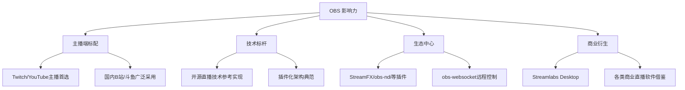

### 1.2 OBS 架构对音视频 SDK 设计的参考价值

OBS 的架构设计对自研音视频 SDK 有以下重要参考价值：

| 参考维度 | OBS 实现 | SDK 设计启示 |
|---------|---------|-------------|
| **模块化设计** | libobs 核心 + UI 分离 | 核心库与业务层解耦，便于多场景复用 |
| **插件系统** | 全功能插件化 | 功能扩展不修改核心，降低维护成本 |
| **渲染管线** | GPU 场景合成 | 复杂视觉效果在 GPU 完成，CPU 零负担 |
| **编码抽象** | obs_encoder 统一接口 | 支持多编码器无缝切换和 fallback |
| **跨平台** | gs_* 图形抽象层 | 平台差异下沉，业务代码平台无关 |
| **配置系统** | 结构化配置 + 热更新 | 动态调整参数无需重启 |

### 1.3 OBS 核心技术亮点

#### 1.3.1 插件化架构

OBS 的核心理念是"一切皆插件"：

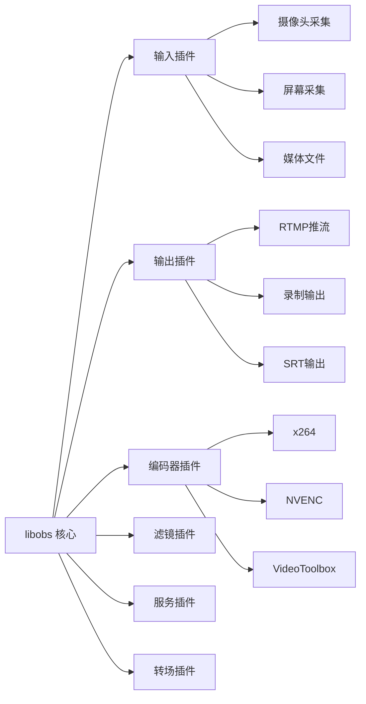

**插件化优势**：
- **功能扩展**：新功能通过插件实现，不触碰核心代码
- **社区贡献**：第三方开发者可独立开发维护插件
- **按需加载**：只加载需要的功能，降低资源占用
- **版本独立**：插件可独立更新，与核心版本解耦

#### 1.3.2 高性能渲染管线

OBS 的渲染管线设计体现了现代图形编程的最佳实践：

| 特性 | 实现方式 | 性能收益 |
|-----|---------|---------|
| **GPU 场景合成** | 所有源渲染到 GPU 纹理后混合 | CPU 零拷贝 |
| **异步渲染** | 渲染与编码线程分离 | 并行度最大化 |
| **着色器滤镜** | GPU 端实时特效处理 | 复杂效果低延迟 |
| **多后端支持** | D3D11/OpenGL/Metal | 跨平台一致体验 |

#### 1.3.3 低延迟采集编码 Pipeline

OBS 针对游戏直播等低延迟场景做了深度优化：

```
游戏画面 → GPU Hook 采集 → GPU 纹理 → NVENC 编码 → RTMP 输出
         ↑                              ↓
         └────── 全程 GPU 内存，零 CPU 拷贝 ────┘
```

**延迟优化成果**：
- 游戏采集延迟：< 5ms（Hook 模式）
- 编码延迟：3-10ms（硬件编码）
- 端到端延迟：可控制在 100ms 以内

### 1.4 OBS 版本演进

#### 1.4.1 版本历史与里程碑

| 版本 | 时间 | 核心特性 | 技术意义 |
|-----|------|---------|---------|
| **OBS Classic** | 2012-2014 | 初代版本，基础功能 | 开源直播软件先驱 |
| **OBS Studio 0.x** | 2014-2016 | 完全重写，插件化架构 | 现代架构奠基 |
| **OBS Studio 20+** | 2017-2019 | Studio Mode、多视图 | 专业制作功能 |
| **OBS Studio 26+** | 2020-2021 | 虚拟摄像头、源分组 | 易用性提升 |
| **OBS Studio 28+** | 2022 | Qt6、HDR、AV1 | 现代化升级 |
| **OBS Studio 30+** | 2023-2024 | WHIP/WebRTC、AI降噪 | 新协议支持 |

#### 1.4.2 OBS 28.0+ 重大更新

**Qt6 迁移**：
- 更现代的 UI 框架
- 更好的 HiDPI 支持
- 改进的跨平台一致性

**HDR 支持**：
- HDR 采集（Windows 10+）
- HDR 渲染管线
- HDR 录制（H.265 PQ/HLG）

**AV1 编码**：
- SVT-AV1 软件编码
- NVENC AV1（RTX 40 系列）
- QSV AV1（Intel Arc）

---

## 第2章 What — OBS 整体架构总览

### 2.1 架构分层

OBS 采用清晰的分层架构设计，各层职责明确：

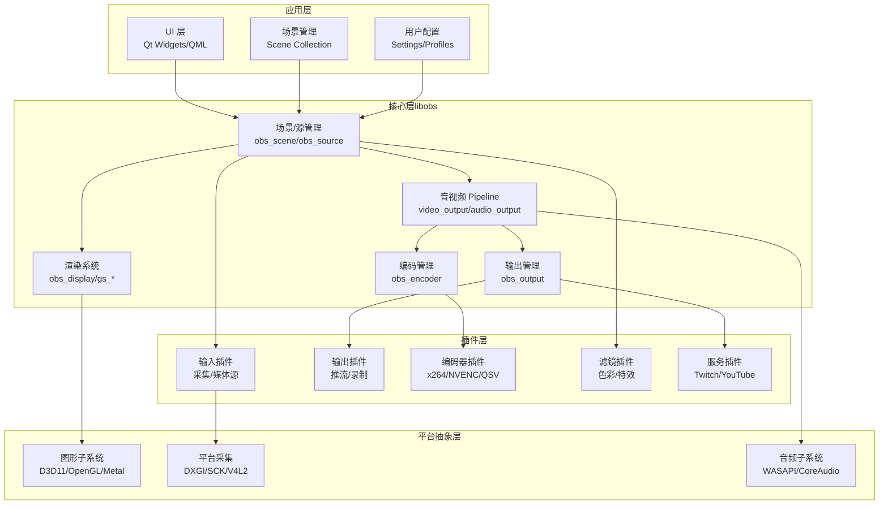

**各层职责说明**：

| 层级 | 核心职责 | 关键组件 | 设计原则 |
|-----|---------|---------|---------|
| **应用层** | 用户交互、场景管理 | UI、配置系统 | 与核心解耦 |
| **核心层** | 音视频处理 Pipeline | libobs | 平台无关 |
| **插件层** | 功能扩展实现 | 各类插件 | 动态加载 |
| **平台抽象层** | 屏蔽平台差异 | gs_*/平台API | 统一接口 |

### 2.2 核心模块关系图

libobs 内部各核心模块的依赖关系：

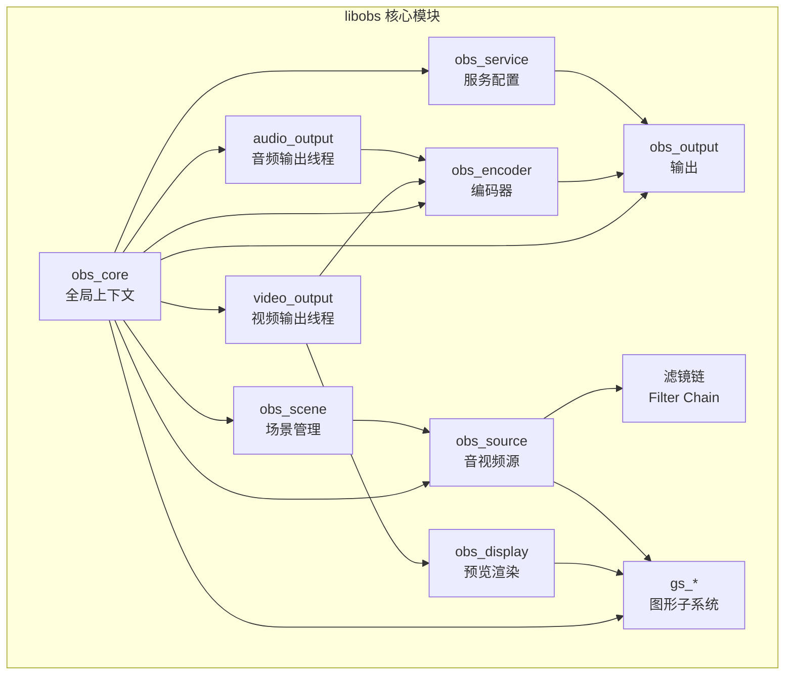

**模块职责详解**：

| 模块 | 核心功能 | 关键数据结构 | 生命周期 |
|-----|---------|-------------|---------|
| **obs_core** | 全局上下文管理 | `obs_core_t` | 应用生命周期 |
| **obs_source** | 音视频源管理 | `obs_source_t` | 场景内动态 |
| **obs_scene** | 场景与源层级 | `obs_scene_t` | 场景切换 |
| **obs_encoder** | 编码器抽象 | `obs_encoder_t` | 输出会话 |
| **obs_output** | 输出目标管理 | `obs_output_t` | 推流/录制会话 |
| **obs_service** | 服务平台配置 | `obs_service_t` | 配置持久化 |
| **video_output** | 视频渲染管线 | `video_output_t` | 核心线程 |
| **audio_output** | 音频处理管线 | `audio_output_t` | 核心线程 |
| **obs_display** | 预览窗口渲染 | `obs_display_t` | UI 窗口 |
| **gs_*** | 图形 API 抽象 | `gs_device_t` | 图形上下文 |

### 2.3 关键数据结构

OBS 使用 C 语言结构体定义插件接口，以下是核心数据结构：

#### 2.3.1 源插件注册结构（obs_source_info）

```c
// libobs/obs-source.h
// 源插件注册信息结构体
struct obs_source_info {
    /* 必需字段 */
    const char *id;              // 唯一标识符，如 "dshow_input"
    const char *name;            // 显示名称
    enum obs_source_type type;   // 类型: INPUT/FILTER/TRANSITION
    
    /* 能力标志 */
    uint32_t output_flags;       // 输出能力: VIDEO/AUDIO/ASYNC/SYNC
    
    /* 生命周期回调 */
    void *(*create)(obs_data_t *settings, obs_source_t *source);
    void (*destroy)(void *data);
    
    /* 视频渲染回调 */
    void (*video_render)(void *data, gs_effect_t *effect);
    uint32_t (*get_width)(void *data);
    uint32_t (*get_height)(void *data);
    
    /* 音频回调（同步源） */
    struct obs_source_info *(*audio_render)(void *data,
        uint64_t *ts_out, struct obs_source_info *audio_out,
        uint32_t mixers, size_t channels, size_t sample_rate);
    
    /* 异步源回调 */
    void (*video_tick)(void *data, float seconds);
    enum gs_color_format (*video_get_color_format)(void *data);
    
    /* 属性配置 */
    obs_properties_t *(*get_properties)(void *data);
    void (*get_defaults)(obs_data_t *settings);
    
    /* 更新配置 */
    void (*update)(void *data, obs_data_t *settings);
    
    /* 其他回调... */
    void (*activate)(void *data);
    void (*deactivate)(void *data);
    void (*show)(void *data);
    void (*hide)(void *data);
};

// 源插件注册宏
#define OBS_SOURCE_INFO struct obs_source_info
#define OBS_SOURCE_CAP_VIDEO      (1<<0)
#define OBS_SOURCE_CAP_AUDIO      (1<<1)
#define OBS_SOURCE_ASYNC_VIDEO    (1<<2)
#define OBS_SOURCE_ASYNC_AUDIO    (1<<3)
```

#### 2.3.2 输出插件注册结构（obs_output_info）

```c
// libobs/obs-output.h
struct obs_output_info {
    const char *id;              // 唯一标识符
    const char *name;            // 显示名称
    
    uint32_t flags;              // 能力标志
    
    /* 生命周期 */
    void *(*create)(obs_data_t *settings, obs_output_t *output);
    void (*destroy)(void *data);
    
    /* 输出控制 */
    bool (*start)(void *data);
    void (*stop)(void *data, uint64_t ts);
    void (*force_stop)(void *data, uint64_t ts);
    
    /* 状态查询 */
    bool (*active)(void *data);
    bool (*paused)(void *data);
    
    /* 数据接收 */
    void (*raw_video)(void *data, struct video_data *frame);
    void (*raw_audio)(void *data, struct audio_data *frames);
    void (*encoded_packet)(void *data, struct encoder_packet *packet);
    
    /* 配置 */
    obs_properties_t *(*get_properties)(void *data);
    void (*get_defaults)(obs_data_t *settings);
    void (*update)(void *data, obs_data_t *settings);
    
    /* 统计信息 */
    uint64_t (*get_total_bytes)(void *data);
    int (*get_dropped_frames)(void *data);
};

// 输出能力标志
#define OBS_OUTPUT_VIDEO          (1<<0)
#define OBS_OUTPUT_AUDIO          (1<<1)
#define OBS_OUTPUT_AV             (OBS_OUTPUT_VIDEO | OBS_OUTPUT_AUDIO)
#define OBS_OUTPUT_ENCODED        (1<<2)
#define OBS_OUTPUT_SERVICE        (1<<3)
#define OBS_OUTPUT_MULTI_TRACK    (1<<4)
```

#### 2.3.3 编码器注册结构（obs_encoder_info）

```c
// libobs/obs-encoder.h
struct obs_encoder_info {
    const char *id;
    const char *name;
    const char *codec;           // "h264", "aac", etc.
    
    enum obs_encoder_type type;  // OBS_ENCODER_VIDEO/AUDIO
    
    /* 生命周期 */
    void *(*create)(obs_data_t *settings, obs_encoder_t *encoder);
    void (*destroy)(void *data);
    
    /* 编码控制 */
    bool (*update)(void *data, obs_data_t *settings);
    void (*get_defaults)(obs_data_t *settings);
    obs_properties_t *(*get_properties)(void *data);
    
    /* 视频编码 */
    bool (*encode)(void *data, struct encoder_frame *frame,
                   struct encoder_packet *packet, bool *received_packet);
    
    /* 音频编码 */
    bool (*encode_audio)(void *data, struct encoder_frame *frame,
                         struct encoder_packet *packet, bool *received_packet);
    
    /* 关键帧控制 */
    void (*get_extra_data)(void *data, uint8_t **extra_data, size_t *size);
    void (*get_sei_data)(void *data, uint8_t **sei_data, size_t *size);
    
    /* 能力查询 */
    uint32_t (*get_caps)(void *data);
    
    /* 质量/速度预设 */
    void (*get_defaults2)(obs_data_t *settings, void *type_data);
};

// 编码器能力标志
#define OBS_ENCODER_CAP_PASS_TEXTURE   (1<<0)  // 支持纹理输入
#define OBS_ENCODER_CAP_DYN_BITRATE    (1<<1)  // 支持动态码率
#define OBS_ENCODER_CAP_INTERNAL       (1<<2)  // 内部编码器
#define OBS_ENCODER_CAP_ROI            (1<<3)  // 支持 ROI 编码
```

#### 2.3.4 核心数据结构关系

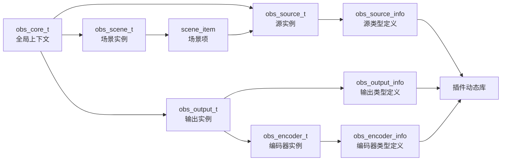

---

## 第3章 How — 音视频数据处理 Pipeline

### 3.1 视频 Pipeline

OBS 的视频 Pipeline 是其架构的核心，采用固定帧率驱动的渲染模型：

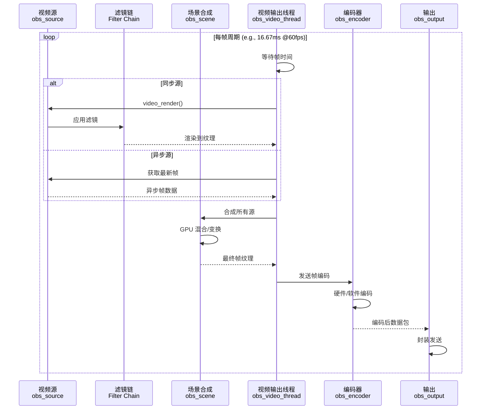

#### 3.1.1 视频输出线程（obs_video_thread）

视频输出线程是 OBS 的核心渲染循环，以固定帧率驱动：

```c
// libobs/obs-video.c
// 视频输出线程主循环（简化版）
static void *obs_video_thread(void *param)
{
    struct obs_core_video *video = param;
    uint64_t last_time = os_gettime_ns();
    uint64_t interval = video_get_frame_interval(video);
    
    while (os_event_try(video->stop_event) == EAGAIN) {
        uint64_t cur_time = os_gettime_ns();
        uint64_t elapsed = cur_time - last_time;
        
        // 等待到下一帧时间
        if (elapsed < interval) {
            uint64_t sleep_time = interval - elapsed;
            os_sleep_ns(sleep_time);
            continue;
        }
        
        last_time = cur_time;
        
        // 1. 渲染所有输出通道
        for (size_t i = 0; i < video->render_views.num; i++) {
            struct obs_view *view = video->render_views.array[i];
            render_video_view(view);
        }
        
        // 2. 渲染所有预览显示
        for (size_t i = 0; i < video->displays.num; i++) {
            struct obs_display *display = video->displays.array[i];
            render_display(display);
        }
        
        // 3. 输出到编码器
        output_video_data(video);
        
        // 4. 帧率控制与统计
        video->total_frames++;
        if (elapsed > interval * 2) {
            video->lagged_frames++;
        }
    }
    
    return NULL;
}
```

**关键设计要点**：

| 设计点 | 实现方式 | 工程意义 |
|-------|---------|---------|
| **固定帧率驱动** | 基于纳秒级睡眠的精确时序 | 保证输出帧率稳定 |
| **分离渲染与输出** | 渲染后立即释放，异步编码 | 降低单帧处理延迟 |
| **多视图支持** | 同时渲染多个场景视图 | 支持 Studio Mode |
| **延迟帧检测** | 统计 lagged_frames | 性能监控指标 |

#### 3.1.2 GPU 渲染合成

OBS 的场景合成完全在 GPU 完成：

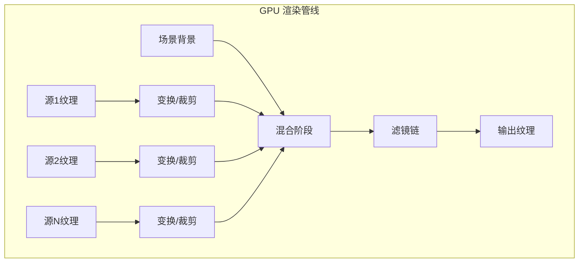

**渲染流程代码示意**：

```c
// 场景渲染伪代码
void render_scene(obs_scene_t *scene)
{
    // 1. 清空渲染目标
    gs_clear(GS_CLEAR_COLOR | GS_CLEAR_DEPTH, &background, 1.0f, 0);
    
    // 2. 按 Z-order 遍历场景项
    for (struct scene_item *item = scene->first_item; 
         item != NULL; item = item->next) {
        
        if (!item->visible) continue;
        
        // 3. 设置变换矩阵
        gs_matrix_push();
        gs_matrix_mul(&item->draw_transform);
        
        // 4. 渲染源
        obs_source_video_render(item->source);
        
        // 5. 恢复矩阵
        gs_matrix_pop();
    }
}

// 源渲染
void obs_source_video_render(obs_source_t *source)
{
    // 应用源级滤镜
    apply_source_filters(source);
    
    // 调用源的渲染回调
    if (source->info.video_render) {
        source->info.video_render(source->context.data, 
                                  gs_get_effect());
    }
}
```

#### 3.1.3 异步源 vs 同步源

OBS 区分两种源类型，处理方式不同：

| 特性 | 异步源（Async） | 同步源（Sync） |
|-----|----------------|---------------|
| **典型代表** | 摄像头、媒体文件、窗口采集 | 图片、文字、色块 |
| **数据提供方式** | 主动推送帧数据 | 被动渲染回调 |
| **帧率控制** | 由源自身决定 | 由视频输出线程驱动 |
| **缓冲区** | 需要帧缓冲队列 | 无需缓冲 |
| **延迟特性** | 可能有采集延迟 | 即时渲染 |
| **实现复杂度** | 较高（需线程同步） | 较低 |

**异步源处理流程**：

```c
// 异步源帧接收
void async_source_tick(obs_source_t *source, float seconds)
{
    // 从队列获取最新帧
    struct obs_source_frame *frame = 
        get_most_recent_frame(source);
    
    if (frame) {
        // 上传到 GPU 纹理
        if (!source->async_texture) {
            source->async_texture = 
                gs_texture_create(frame->width, frame->height, 
                                  frame->format, 1, NULL, 0);
        }
        gs_texture_set_image(source->async_texture, 
                             frame->data[0], frame->linesize[0], 
                             false);
    }
}

void async_source_render(obs_source_t *source)
{
    // 直接绘制缓存的纹理
    if (source->async_texture) {
        gs_effect_set_texture(param, source->async_texture);
        gs_draw_sprite(source->async_texture, 0, 
                       source->async_width, source->async_height);
    }
}
```

#### 3.1.4 帧率控制

OBS 通过精确的时序控制保证输出帧率：

```c
// 帧率控制核心逻辑
uint64_t video_get_frame_interval(struct obs_core_video *video)
{
    // 根据目标帧率计算帧间隔（纳秒）
    return 1000000000ULL / video->ovi.fps_num * video->ovi.fps_den;
}

void video_sleep(struct obs_core_video *video, bool *raw_active)
{
    uint64_t interval = video_get_frame_interval(video);
    uint64_t cur_time = os_gettime_ns();
    uint64_t expected_time = video->last_time + interval;
    
    if (cur_time < expected_time) {
        // 提前完成，睡眠等待
        uint64_t sleep_ns = expected_time - cur_time;
        os_sleep_ns(sleep_ns);
    } else if (cur_time > expected_time + interval) {
        // 严重延迟，重置基准时间
        video->last_time = cur_time;
        video->lagged_frames++;
    }
    
    video->last_time += interval;
}
```

#### 3.1.5 色彩空间处理

OBS 28+ 增加了完整的 HDR 支持：

| 色彩空间 | 支持版本 | 应用场景 | 数据格式 |
|---------|---------|---------|---------|
| **SDR sRGB** | 全版本 | 传统直播 | BGRA/NV12 |
| **HDR PQ (ST.2084)** | 28+ | HDR10 直播 | P010/AYUV |
| **HDR HLG** | 28+ | 广播 HDR | P010/AYUV |
| **Rec.2100** | 28+ | 广色域 HDR | 10bit+ |

**色彩转换流程**：

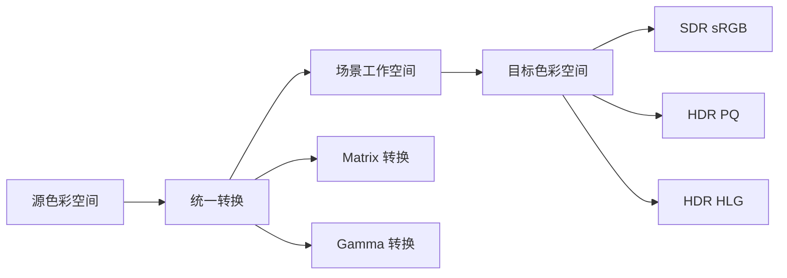

### 3.2 音频 Pipeline

OBS 的音频 Pipeline 采用基于样本的连续处理模型：

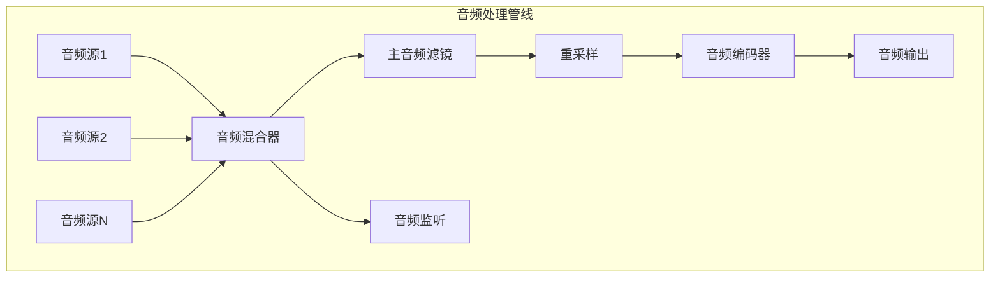

#### 3.2.1 音频混合机制

OBS 支持多轨音频混合：

```c
// libobs/obs-audio.c
// 音频混合核心逻辑
static inline void mix_audio(struct audio_output_data *mixes,
                             struct obs_source *source,
                             size_t channels, size_t sample_rate)
{
    // 获取源音频数据
    struct obs_source_audio_mix audio_mix;
    if (!source->info.audio_render || 
        !source->info.audio_render(source->context.data, ...)) {
        return;
    }
    
    // 混合到各输出轨道
    for (size_t mix_idx = 0; mix_idx < MAX_AUDIO_MIXES; mix_idx++) {
        if ((source->mixers & (1 << mix_idx)) == 0)
            continue;
        
        for (size_t ch = 0; ch < channels; ch++) {
            float *mix = mixes[mix_idx].data[ch];
            float *aud = audio_mix.output[mix_idx].data[ch];
            
            // 音量控制与混合
            float vol = source->user_volume * source->volume;
            for (size_t i = 0; i < AUDIO_OUTPUT_FRAMES; i++) {
                mix[i] += aud[i] * vol;
            }
        }
    }
}
```

**音频轨道设计**：

| 轨道 | 用途 | 默认源 |
|-----|------|-------|
| **Track 1** | 主音频（推流） | 桌面音频+麦克风 |
| **Track 2** | 麦克风单独 | 麦克风 |
| **Track 3** | 桌面音频单独 | 桌面音频 |
| **Track 4-6** | 备用/多语言 | 自定义 |

#### 3.2.2 音频时间戳同步

OBS 使用统一的时间基准保证音视频同步：

```c
// 时间戳生成
uint64_t obs_get_audio_timestamp(struct obs_core_audio *audio)
{
    // 基于样本数计算时间戳
    return audio->total_samples * 1000000000ULL / audio->sample_rate;
}

// 音视频同步检查
bool check_av_sync(obs_source_t *video_src, obs_source_t *audio_src)
{
    int64_t video_ts = video_src->timing_adjusted_timestamp;
    int64_t audio_ts = audio_src->timing_adjusted_timestamp;
    int64_t diff = video_ts - audio_ts;
    
    // 允许 ±40ms 偏差
    return llabs(diff) < 40000000;
}
```

#### 3.2.3 重采样实现

OBS 使用 libsamplerate 或 speexdsp 进行音频重采样：

```c
// 音频重采样
struct resample_info {
    uint32_t samples_per_sec;
    enum audio_format format;
    uint32_t speakers;
};

void *audio_resampler_create(const struct resample_info *dst,
                             const struct resample_info *src);

bool audio_resampler_resample(void *resampler,
                              uint8_t *output[],
                              uint32_t *out_frames,
                              uint64_t *ts_offset,
                              const uint8_t *input[],
                              uint32_t in_frames);
```

### 3.3 音视频同步机制

OBS 采用基于时间戳的同步策略：

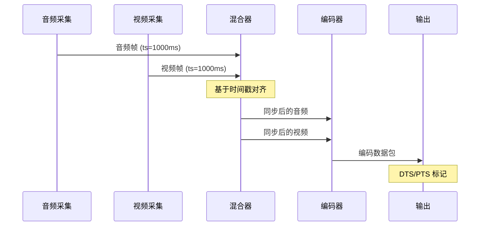

**同步策略详解**：

| 策略 | 实现方式 | 适用场景 |
|-----|---------|---------|
| **时间戳对齐** | 统一系统时钟基准 | 大多数场景 |
| **音频主导** | 以音频时间戳为基准调整视频 | 音频连续性优先 |
| **缓冲补偿** | 动态调整缓冲区大小 | 网络抖动场景 |

**DTS/PTS 处理**：

```c
// 编码包时间戳设置
void set_packet_timing(struct encoder_packet *packet,
                       int64_t pts, int64_t dts,
                       int64_t timebase_num, int64_t timebase_den)
{
    packet->pts = pts * timebase_den / (1000000000 / timebase_num);
    packet->dts = dts * timebase_den / (1000000000 / timebase_num);
    
    // 确保 DTS <= PTS
    if (packet->dts > packet->pts) {
        packet->dts = packet->pts;
    }
}
```

---

## 第4章 How — 采集模块详解

### 4.1 视频采集源

OBS 支持丰富的视频采集源，各平台实现如下：

| 平台 | 摄像头采集 | 屏幕采集 | 窗口采集 | 游戏采集 |
|-----|-----------|---------|---------|---------|
| **Windows** | DirectShow / MediaFoundation | DXGI Desktop Duplication / WGC | BitBlt / WGC | Game Capture Hook |
| **macOS** | AVFoundation | ScreenCaptureKit / CGDisplay | ScreenCaptureKit | - |
| **Linux** | V4L2 / PipeWire | X11 / PipeWire | X11 / PipeWire | - |

#### 4.1.1 Windows Game Capture 核心技术

Windows 游戏采集是 OBS 的核心技术亮点，采用注入式 Hook 方案：

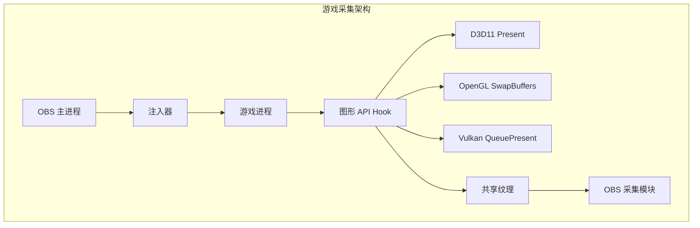

**Hook 实现原理**：

```c
// 游戏采集 Hook 核心逻辑（简化）
// plugins/win-capture/game-capture/hook/d3d11-capture.cpp

typedef HRESULT (STDMETHODCALLTYPE *Present_t)(IDXGISwapChain *, UINT, UINT);
static Present_t Real_Present = nullptr;

HRESULT STDMETHODCALLTYPE Hook_Present(IDXGISwapChain *swap, UINT sync, UINT flags)
{
    // 1. 获取当前渲染的纹理
    ID3D11Texture2D *back_buffer = nullptr;
    swap->GetBuffer(0, IID_ID3D11Texture2D, (void**)&back_buffer);
    
    // 2. 复制到共享纹理
    if (back_buffer && shared_texture) {
        context->CopyResource(shared_texture, back_buffer);
        
        // 3. 通知 OBS 采集模块
        signal_frame_ready();
    }
    
    // 4. 调用原始 Present
    return Real_Present(swap, sync, flags);
}

// Hook 安装
void install_hook()
{
    // 获取系统 d3d11.dll 的 Present 地址
    HMODULE d3d11 = GetModuleHandleW(L"d3d11.dll");
    // ... 使用 MinHook 或类似库安装 Hook
    MH_CreateHook(Real_Present_Ptr, Hook_Present, (void**)&Real_Present);
}
```

**游戏采集性能对比**：

| 采集方式 | CPU 占用 | 延迟 | 兼容性 | 适用场景 |
|---------|---------|------|-------|---------|
| **Hook 采集** | < 1% | < 5ms | 需支持注入 | 游戏直播首选 |
| **DXGI Duplication** | 5-15% | 10-20ms | Win8+ | 通用屏幕采集 |
| **BitBlt** | 20-40% | 30-50ms | 全版本 | 兼容性兜底 |
| **WGC** | 5-10% | 15-25ms | Win10 1903+ | UWP/现代应用 |

#### 4.1.2 macOS ScreenCaptureKit

OBS 28+ 引入 ScreenCaptureKit 作为 macOS 现代采集方案：

```objc
// macOS ScreenCaptureKit 采集（简化）
// plugins/mac-capture/mac-screen-capture.m

#import <ScreenCaptureKit/ScreenCaptureKit.h>

@interface ScreenCapture : NSObject <SCStreamOutput>
@property SCStream *stream;
@property CMSampleBufferRef currentFrame;
@end

@implementation ScreenCapture

- (void)startCapture {
    SCContentFilter *filter = [[SCContentFilter alloc] 
        initWithDisplay:targetDisplay 
        excludingApplications:@[] 
        exceptingWindows:@[]];
    
    SCStreamConfiguration *config = [[SCStreamConfiguration alloc] init];
    config.width = targetDisplay.width * scaleFactor;
    config.height = targetDisplay.height * scaleFactor;
    config.minimumFrameInterval = CMTimeMake(1, 60); // 60fps
    config.queueDepth = 3;
    config.pixelFormat = 'BGRA'; // 或 'l10r' for HDR
    
    self.stream = [[SCStream alloc] initWithFilter:filter 
                                       configuration:config 
                                             delegate:self];
    
    [self.stream addStreamOutput:self 
                            type:SCStreamOutputTypeScreen 
                  sampleHandlerQueue:dispatch_get_main_queue()];
    [self.stream startCapture];
}

- (void)stream:(SCStream *)stream 
    didOutputSampleBuffer:(CMSampleBufferRef)sampleBuffer 
           ofType:(SCStreamOutputType)type {
    // 处理采集帧
    if (type == SCStreamOutputTypeScreen) {
        CVImageBufferRef imageBuffer = CMSampleBufferGetImageBuffer(sampleBuffer);
        // 传递给 OBS 渲染管线
        processCapturedFrame(imageBuffer);
    }
}

@end
```

### 4.2 音频采集源

| 平台 | 音频采集 API | 桌面音频 | 麦克风 | 独占模式 |
|-----|-------------|---------|-------|---------|
| **Windows** | WASAPI | ✓ | ✓ | 支持 |
| **macOS** | CoreAudio | ✓ (BlackHole/SCK) | ✓ | 不支持 |
| **Linux** | PulseAudio / PipeWire | ✓ | ✓ | 支持 |

**WASAPI 采集核心代码**：

```c
// Windows WASAPI 音频采集
// plugins/win-wasapi/win-wasapi.cpp

HRESULT WASAPISource::InitDevice()
{
    IMMDeviceEnumerator *enumerator = nullptr;
    CoCreateInstance(__uuidof(MMDeviceEnumerator), nullptr,
                     CLSCTX_ALL, IID_IMMDeviceEnumerator,
                     (void**)&enumerator);
    
    // 获取默认设备或指定设备
    if (device_id.empty()) {
        enumerator->GetDefaultAudioEndpoint(
            isInput ? eCapture : eRender,
            eConsole, &device);
    } else {
        enumerator->GetDevice(device_id.c_str(), &device);
    }
    
    // 激活音频客户端
    device->Activate(__uuidof(IAudioClient), CLSCTX_ALL,
                     nullptr, (void**)&client);
    
    // 设置格式
    WAVEFORMATEX *wfex = nullptr;
    client->GetMixFormat(&wfex);
    
    // 初始化共享模式或独占模式
    client->Initialize(
        exclusive ? AUDCLNT_SHAREMODE_EXCLUSIVE : AUDCLNT_SHAREMODE_SHARED,
        AUDCLNT_STREAMFLAGS_LOOPBACK | AUDCLNT_STREAMFLAGS_EVENTCALLBACK,
        BUFFER_TIME_100NS, 0, wfex, nullptr);
    
    // 获取捕获客户端
    client->GetService(__uuidof(IAudioCaptureClient),
                       (void**)&capture);
    
    return S_OK;
}
```

### 4.3 采集与编码的数据通路

OBS 优化了采集到编码的数据通路，支持零拷贝：

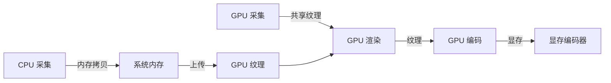

**纹理直通编码优化**：

```c
// NVENC 纹理编码路径
// plugins/obs-ffmpeg/jim-nvenc.c

static bool nvenc_encode_texture(void *data, uint32_t handle,
                                 uint64_t lock_key, uint64_t *next_key,
                                 struct encoder_packet *packet,
                                 bool *received_packet)
{
    struct nvenc_data *enc = data;
    
    // 1. 从共享句柄创建 CUDA 图形资源
    CUgraphicsResource resource;
    cuGraphicsD3D11RegisterResource(&resource, (ID3D11Resource*)handle, 
                                    CU_GRAPHICS_REGISTER_FLAGS_NONE);
    
    // 2. 映射资源到 CUDA
    cuGraphicsMapResources(1, &resource, 0);
    CUdeviceptr device_ptr;
    size_t size;
    cuGraphicsResourceGetMappedPointer(&device_ptr, &size, resource);
    
    // 3. 创建 NVENC 输入缓冲区描述
    NV_ENC_REGISTER_RESOURCE reg_resource = {0};
    reg_resource.resourceType = NV_ENC_INPUT_RESOURCE_TYPE_CUDADEVICEPTR;
    reg_resource.resourceToRegister = (void*)device_ptr;
    reg_resource.width = enc->width;
    reg_resource.height = enc->height;
    reg_resource.pitch = enc->pitch;
    reg_resource.bufferFormat = NV_ENC_BUFFER_FORMAT_NV12;
    
    // 4. 注册资源并编码
    nvEncRegisterResource(enc->nvenc_session, &reg_resource);
    
    // 5. 执行编码（无需 CPU 拷贝）
    NV_ENC_PIC_PARAMS pic_params = {0};
    pic_params.inputBuffer = reg_resource.registeredResource;
    nvEncEncodePicture(enc->nvenc_session, &pic_params);
    
    // 6. 清理
    cuGraphicsUnmapResources(1, &resource, 0);
    
    return true;
}
```

---

## 第5章 How — 编码模块详解

### 5.1 编码器插件架构

OBS 的编码器架构高度抽象，支持多种编码器无缝切换：

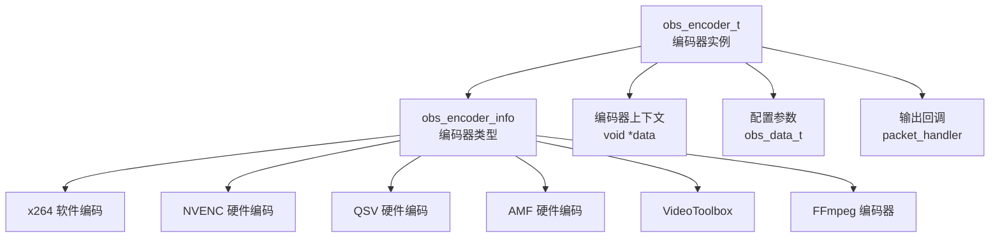

### 5.2 支持的编码器对比

| 编码器 | 标准 | 类型 | 平台 | 延迟 | 画质 | 特点 |
|-------|------|------|------|------|------|------|
| **x264** | H.264 | 软件 | 全平台 | 20-50ms | 最佳 | 质量标杆、CPU 占用高 |
| **NVENC** | H.264/H.265/AV1 | 硬件 | Windows/Linux | 3-8ms | 良好 | NVIDIA GPU 加速 |
| **QSV** | H.264/H.265/AV1 | 硬件 | Windows/Linux | 4-10ms | 良好 | Intel 核显/独显 |
| **AMF** | H.264/H.265/AV1 | 硬件 | Windows | 5-10ms | 良好 | AMD GPU 加速 |
| **VideoToolbox** | H.264/H.265 | 硬件 | macOS | 3-8ms | 良好 | Apple 硬件编码 |
| **AOM AV1** | AV1 | 软件 | 全平台 | 50-100ms | 优秀 | 开源 AV1 |
| **SVT-AV1** | AV1 | 软件 | 全平台 | 30-60ms | 优秀 | Intel 优化 AV1 |

### 5.3 编码参数配置

OBS 的编码参数设计兼顾易用性和专业性：

```c
// 编码器配置示例
obs_data_t *encoder_settings = obs_data_create();

// 基础参数
obs_data_set_string(encoder_settings, "rate_control", "CBR");
obs_data_set_int(encoder_settings, "bitrate", 6000);      // 6 Mbps
obs_data_set_int(encoder_settings, "keyint_sec", 2);      // 2秒 GOP
obs_data_set_int(encoder_settings, "preset", 5);          // 质量预设

// 高级参数
obs_data_set_bool(encoder_settings, "psycho_aq", true);   // 心理视觉优化
obs_data_set_int(encoder_settings, "lookahead", 20);      // 前瞻帧数
obs_data_set_bool(encoder_settings, "repeat_headers", true);

// 创建编码器
obs_encoder_t *encoder = obs_video_encoder_create(
    "obs_x264",           // 编码器 ID
    "My Encoder",         // 名称
    encoder_settings,     // 配置
    nullptr               // 热键数据
);
```

**码率控制模式对比**：

| 模式 | 适用场景 | 码率稳定性 | 质量稳定性 | OBS 推荐度 |
|-----|---------|-----------|-----------|-----------|
| **CBR** | 直播推流 | 极高 | 中等 | ⭐⭐⭐⭐⭐ |
| **VBR** | 录制存档 | 低 | 高 | ⭐⭐⭐ |
| **ABR** | 自适应场景 | 中等 | 中等 | ⭐⭐⭐⭐ |
| **CRF/CQP** | 质量优先录制 | N/A | 极高 | ⭐⭐⭐ |

### 5.4 硬件编码集成

#### 5.4.1 NVENC 集成

```c
// NVENC 编码器初始化
// plugins/obs-ffmpeg/jim-nvenc.c

static void *nvenc_create(obs_data_t *settings, obs_encoder_t *encoder)
{
    struct nvenc_data *enc = bzalloc(sizeof(struct nvenc_data));
    
    // 1. 初始化 CUDA
    cuInit(0);
    cuDeviceGet(&enc->cu_device, 0);
    cuCtxCreate(&enc->cu_context, 0, enc->cu_device);
    
    // 2. 创建 NVENC 编码会话
    NV_ENC_OPEN_ENCODE_SESSION_EX_PARAMS params = {0};
    params.version = NV_ENC_OPEN_ENCODE_SESSION_EX_PARAMS_VER;
    params.deviceType = NV_ENC_DEVICE_TYPE_CUDA;
    params.device = enc->cu_context;
    params.apiVersion = NVENCAPI_VERSION;
    
    NvEncOpenEncodeSessionEx(&params, &enc->nvenc_session);
    
    // 3. 获取编码器预设配置
    NV_ENC_PRESET_CONFIG preset_config = {0};
    preset_config.version = NV_ENC_PRESET_CONFIG_VER;
    preset_config.presetCfg.version = NV_ENC_CONFIG_VER;
    
    nvEncGetEncodePresetConfig(enc->nvenc_session, 
                               NV_ENC_CODEC_H264_GUID,
                               NV_ENC_PRESET_P5_GUID,  // P5 = Slow (Quality)
                               &preset_config);
    
    // 4. 初始化编码配置
    NV_ENC_INITIALIZE_PARAMS init_params = {0};
    init_params.version = NV_ENC_INITIALIZE_PARAMS_VER;
    init_params.encodeGUID = NV_ENC_CODEC_H264_GUID;
    init_params.presetGUID = NV_ENC_PRESET_P5_GUID;
    init_params.encodeWidth = enc->width;
    init_params.encodeHeight = enc->height;
    init_params.darWidth = enc->width;
    init_params.darHeight = enc->height;
    init_params.frameRateNum = enc->fps_num;
    init_params.frameRateDen = enc->fps_den;
    init_params.enablePTD = 1;  // 允许 B 帧重排序
    
    // 5. 配置码率控制
    NV_ENC_CONFIG *config = &init_params.encodeConfig;
    config->rcParams.rateControlMode = NV_ENC_PARAMS_RC_CBR;
    config->rcParams.averageBitRate = enc->bitrate * 1000;
    config->rcParams.vbvBufferSize = config->rcParams.averageBitRate;
    
    // 6. 初始化编码器
    nvEncInitializeEncoder(enc->nvenc_session, &init_params);
    
    return enc;
}
```

#### 5.4.2 纹理模式编码

```c
// 纹理直通编码路径
static bool nvenc_encode_texture(void *data, uint32_t handle,
                                 uint64_t lock_key, uint64_t *next_key,
                                 struct encoder_packet *packet,
                                 bool *received_packet)
{
    struct nvenc_data *enc = data;
    
    // 关键：直接从 GPU 纹理编码，无需 CPU 拷贝
    // 1. 注册 D3D11 纹理到 NVENC
    // 2. 执行编码
    // 3. 获取编码结果
    
    // 这种模式下，视频数据全程在 GPU 内存中流动
    // 采集(GPU) → 渲染(GPU) → 编码(GPU) → 输出
    
    return true;
}
```

---

## 第6章 How — 输出与传输模块

### 6.1 输出类型

OBS 支持多种输出类型，满足不同场景需求：

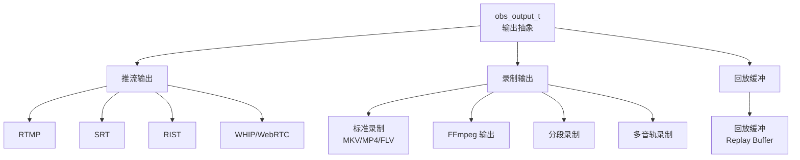

### 6.2 RTMP 推流实现

OBS 的 RTMP 输出基于修改版 librtmp：

```c
// RTMP 输出核心逻辑
// plugins/obs-outputs/rtmp-stream.c

static bool rtmp_stream_start(void *data)
{
    struct rtmp_stream *stream = data;
    
    // 1. 初始化 RTMP 连接
    RTMP_Init(&stream->rtmp);
    RTMP_SetupURL(&stream->rtmp, stream->url);
    RTMP_EnableWrite(&stream->rtmp);
    
    // 2. 设置连接参数
    stream->rtmp.Link.swfUrl = av_strdup("obs-studio");
    stream->rtmp.Link.flashVer = av_strdup(FMS_VERSION);
    stream->rtmp.Link.tcUrl = av_strdup(stream->url);
    stream->rtmp.Link.app = av_strdup(stream->key);
    
    // 3. 建立连接
    if (!RTMP_Connect(&stream->rtmp, NULL)) {
        warn("RTMP_Connect failed");
        return false;
    }
    
    // 4. 发送元数据（onMetaData）
    send_meta_data(stream);
    
    // 5. 发送音视频头
    send_audio_header(stream);
    send_video_header(stream);
    
    // 6. 启动发送线程
    pthread_create(&stream->send_thread, NULL, send_thread, stream);
    
    return true;
}

// 发送线程
static void *send_thread(void *data)
{
    struct rtmp_stream *stream = data;
    
    while (os_event_try(stream->stop_event) == EAGAIN) {
        // 从队列获取编码包
        struct encoder_packet packet;
        if (!get_next_packet(stream, &packet)) {
            os_sleep_ms(1);
            continue;
        }
        
        // 封装为 FLV Tag
        int size = encode_flv_tag(&packet, stream->output_buffer);
        
        // 发送
        int ret = RTMP_Write(&stream->rtmp, 
                             stream->output_buffer, 
                             size, 
                             packet.type == OBS_ENCODER_VIDEO);
        
        if (ret <= 0) {
            // 连接断开，触发重连
            handle_disconnect(stream);
        }
        
        // 更新统计
        stream->total_bytes_sent += size;
        stream->dropped_frames += calculate_drops(stream);
    }
    
    return NULL;
}
```

### 6.3 新传输协议支持

| 协议 | 支持版本 | 特点 | 适用场景 |
|-----|---------|------|---------|
| **SRT** | 24+ | 低延迟、抗丢包 | 专业直播、远程制作 |
| **RIST** | 27+ | 可靠流传输 | 广播级应用 |
| **WHIP** | 30+ | WebRTC 推流标准 | 浏览器级延迟 |

**协议对比**：

| 特性 | RTMP | SRT | RIST | WHIP |
|-----|------|-----|------|------|
| 延迟 | 2-5s | 0.5-2s | 0.5-2s | <500ms |
| 抗丢包 | 弱 | 强 (ARQ) | 强 (ARQ) | 强 (WebRTC) |
| 穿透能力 | 一般 | 好 | 好 | 优秀 |
| 防火墙友好 | 一般 | 好 | 好 | 优秀 (HTTPS) |
| 标准化程度 | 高 | 中 | 中 | 高 |
| OBS 推荐度 | ⭐⭐⭐ | ⭐⭐⭐⭐ | ⭐⭐⭐ | ⭐⭐⭐⭐⭐ |

### 6.4 录制模块

OBS 的录制功能基于 FFmpeg muxer：

```c
// FFmpeg 录制输出
// plugins/obs-ffmpeg/obs-ffmpeg-mux.c

static void *ffmpeg_mux_create(obs_data_t *settings, obs_output_t *output)
{
    struct ffmpeg_mux *mux = bzalloc(sizeof(struct ffmpeg_mux));
    
    // 配置输出格式
    mux->params.file = obs_data_get_string(settings, "path");
    mux->params.format = obs_data_get_string(settings, "format");
    
    // 支持的封装格式
    // MKV: 容错性好，断电可恢复
    // MP4: 兼容性好，适合分享
    // FLV: 流式格式，适合网络
    // MOV: 专业格式，支持多轨
    
    // 初始化 FFmpeg 上下文
    avformat_alloc_output_context2(&mux->output_format, NULL, 
                                   mux->params.format, 
                                   mux->params.file);
    
    // 添加视频流
    AVStream *video_stream = avformat_new_stream(mux->output_format, NULL);
    video_stream->codecpar->codec_type = AVMEDIA_TYPE_VIDEO;
    video_stream->codecpar->codec_id = AV_CODEC_ID_H264;
    video_stream->codecpar->width = mux->width;
    video_stream->codecpar->height = mux->height;
    
    // 添加音频流（支持多轨）
    for (int i = 0; i < mux->num_audio_tracks; i++) {
        AVStream *audio_stream = avformat_new_stream(mux->output_format, NULL);
        audio_stream->codecpar->codec_type = AVMEDIA_TYPE_AUDIO;
        audio_stream->codecpar->codec_id = AV_CODEC_ID_AAC;
        audio_stream->codecpar->sample_rate = 48000;
        audio_stream->codecpar->channels = 2;
    }
    
    // 打开输出文件
    avio_open(&mux->output_format->pb, mux->params.file, AVIO_FLAG_WRITE);
    avformat_write_header(mux->output_format, NULL);
    
    return mux;
}
```

**录制格式安全性对比**：

| 格式 | 断电恢复 | 流媒体友好 | 编辑友好 | 推荐场景 |
|-----|---------|-----------|---------|---------|
| **MKV** | ⭐⭐⭐⭐⭐ | ⭐⭐⭐ | ⭐⭐⭐⭐ | 长时间录制首选 |
| **MP4** | ⭐⭐ | ⭐⭐⭐⭐ | ⭐⭐⭐⭐⭐ | 短片段、分享 |
| **FLV** | ⭐⭐⭐ | ⭐⭐⭐⭐⭐ | ⭐⭐ | 直播录制 |
| **MOV** | ⭐⭐⭐ | ⭐⭐⭐ | ⭐⭐⭐⭐⭐ | 专业后期制作 |

---

## 第7章 How — 插件系统机制

### 7.1 插件架构设计

OBS 的插件系统是其架构的核心亮点：

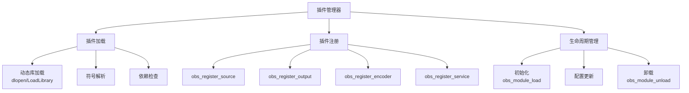

**插件类型分类**：

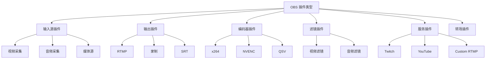

### 7.2 源插件开发示例

```c
// 简单源插件示例：纯色源
// plugins/obs-source/color-source.c

#include <obs-module.h>

struct color_source {
    uint32_t color;
    uint32_t width;
    uint32_t height;
    gs_texture_t *texture;
};

static const char *color_source_get_name(void *unused)
{
    UNUSED_PARAMETER(unused);
    return obs_module_text("ColorSource");
}

static void *color_source_create(obs_data_t *settings, obs_source_t *source)
{
    struct color_source *cs = bzalloc(sizeof(struct color_source));
    cs->width = 640;
    cs->height = 480;
    
    // 创建纯色纹理
    cs->texture = gs_texture_create(cs->width, cs->height, 
                                    GS_RGBA, 1, NULL, 0);
    
    // 应用初始配置
    color_source_update(cs, settings);
    
    return cs;
}

static void color_source_destroy(void *data)
{
    struct color_source *cs = data;
    gs_texture_destroy(cs->texture);
    bfree(cs);
}

static void color_source_render(void *data, gs_effect_t *effect)
{
    struct color_source *cs = data;
    
    // 设置效果参数
    gs_effect_set_texture(gs_effect_get_param_by_name(effect, "image"),
                          cs->texture);
    
    // 绘制全屏矩形
    gs_draw_sprite(cs->texture, 0, cs->width, cs->height);
}

static void color_source_update(void *data, obs_data_t *settings)
{
    struct color_source *cs = data;
    
    // 读取配置
    uint32_t color = (uint32_t)obs_data_get_int(settings, "color");
    cs->color = color;
    
    // 更新纹理颜色
    uint8_t rgba[4] = {
        (color >> 16) & 0xFF,  // R
        (color >> 8) & 0xFF,   // G
        color & 0xFF,          // B
        0xFF                   // A
    };
    
    // 填充纹理
    gs_texture_set_image(cs->texture, rgba, 4, false);
}

static obs_properties_t *color_source_properties(void *unused)
{
    UNUSED_PARAMETER(unused);
    
    obs_properties_t *props = obs_properties_create();
    
    // 添加颜色选择器
    obs_properties_add_color(props, "color", 
                             obs_module_text("Color"));
    
    // 添加尺寸设置
    obs_properties_add_int(props, "width", 
                           obs_module_text("Width"), 1, 4096, 1);
    obs_properties_add_int(props, "height", 
                           obs_module_text("Height"), 1, 4096, 1);
    
    return props;
}

static void color_source_defaults(obs_data_t *settings)
{
    obs_data_set_default_int(settings, "color", 0xFFFFFFFF);  // 白色
    obs_data_set_default_int(settings, "width", 640);
    obs_data_set_default_int(settings, "height", 480);
}

// 插件注册信息
struct obs_source_info color_source_info = {
    .id = "color_source",
    .type = OBS_SOURCE_TYPE_INPUT,
    .output_flags = OBS_SOURCE_VIDEO,
    .get_name = color_source_get_name,
    .create = color_source_create,
    .destroy = color_source_destroy,
    .video_render = color_source_render,
    .update = color_source_update,
    .get_properties = color_source_properties,
    .get_defaults = color_source_defaults,
    .get_width = color_source_width,
    .get_height = color_source_height
};

// 模块加载入口
OBS_MODULE_USE_DEFAULT_LOCALE("color-source", "en-US")

bool obs_module_load(void)
{
    obs_register_source(&color_source_info);
    return true;
}
```

### 7.3 滤镜插件

滤镜插件分为视频滤镜和音频滤镜：

```c
// 视频滤镜示例：色彩校正
struct obs_source_info color_correction_filter = {
    .id = "color_correction_filter",
    .type = OBS_SOURCE_TYPE_FILTER,
    .output_flags = OBS_SOURCE_VIDEO,
    
    .get_name = color_correction_name,
    .create = color_correction_create,
    .destroy = color_correction_destroy,
    .video_render = color_correction_render,
    .update = color_correction_update,
    .get_properties = color_correction_properties,
};

void color_correction_render(void *data, gs_effect_t *effect)
{
    struct color_correction_data *filter = data;
    
    // 获取输入源的渲染结果
    obs_source_t *target = obs_filter_get_target(filter->source);
    
    // 设置色彩校正参数
    gs_effect_set_float(filter->gamma_param, filter->gamma);
    gs_effect_set_float(filter->contrast_param, filter->contrast);
    gs_effect_set_float(filter->brightness_param, filter->brightness);
    gs_effect_set_float(filter->saturation_param, filter->saturation);
    
    // 渲染源（滤镜会自动应用）
    obs_source_video_render(target);
}
```

### 7.4 第三方插件生态

| 插件名称 | 功能 | 流行度 | 推荐场景 |
|---------|------|-------|---------|
| **StreamFX** | 高级特效、模糊、3D变换 | ⭐⭐⭐⭐⭐ | 专业视觉效果 |
| **obs-websocket** | 远程控制 API | ⭐⭐⭐⭐⭐ | 自动化/集成 |
| **obs-ndi** | NDI 协议支持 | ⭐⭐⭐⭐ | 专业视频制作 |
| **Move Transition** | 高级转场动画 | ⭐⭐⭐⭐ | 场景切换美化 |
| **Advanced Scene Switcher** | 智能场景切换 | ⭐⭐⭐⭐ | 自动化直播 |
| **Waveform** | 音频可视化 | ⭐⭐⭐ | 音乐直播 |

---

## 第8章 How — 渲染引擎

### 8.1 图形子系统抽象

OBS 的图形子系统（libobs-d3d11/libobs-opengl/libobs-metal）提供统一的 GPU 抽象：

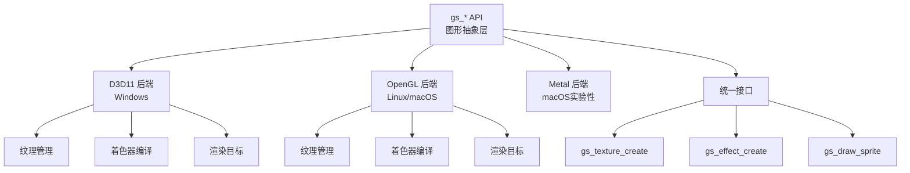

**核心 API 列表**：

| API 类别 | 关键函数 | 功能 |
|---------|---------|------|
| **设备管理** | `gs_create`, `gs_destroy` | 图形上下文生命周期 |
| **纹理** | `gs_texture_create`, `gs_texture_set_image` | GPU 图像数据 |
| **渲染目标** | `gs_texrender_create`, `gs_texrender_begin` | 离屏渲染 |
| **效果/着色器** | `gs_effect_create`, `gs_effect_set_texture` | GPU 程序 |
| **绘制** | `gs_draw_sprite`, `gs_draw_rectangle` | 图元绘制 |
| **矩阵变换** | `gs_matrix_push`, `gs_matrix_mul` | 坐标变换 |

### 8.2 场景渲染流程

```c
// 场景渲染核心流程
void render_scene_main(struct obs_scene *scene)
{
    // 1. 设置渲染目标
    gs_viewport_push();
    gs_set_viewport(0, 0, base_width, base_height);
    
    // 2. 清空背景
    gs_clear(GS_CLEAR_COLOR | GS_CLEAR_DEPTH, &background, 1.0f, 0);
    
    // 3. 获取场景项列表（按 Z-order 排序）
    DARRAY(struct scene_item *) items;
    da_init(items);
    
    for (struct scene_item *item = scene->first_item; 
         item; item = item->next) {
        if (item->visible) {
            da_push_back(items, &item);
        }
    }
    
    // 4. 渲染每个场景项
    for (size_t i = 0; i < items.num; i++) {
        struct scene_item *item = items.array[i];
        
        // 应用变换矩阵
        gs_matrix_push();
        gs_matrix_mul(&item->draw_transform);
        
        // 渲染源
        obs_source_video_render(item->source);
        
        gs_matrix_pop();
    }
    
    da_free(items);
    gs_viewport_pop();
}
```

### 8.3 预览渲染

OBS 支持多预览窗口，每个预览对应一个 `obs_display`：

```c
// 创建预览显示
obs_display_t *display = obs_display_create(
    &init_data,           // 初始化数据（窗口句柄等）
    0, 0,                 // 尺寸（0=自动）
    GS_BGRA               // 颜色格式
);

// 设置渲染回调
obs_display_add_draw_callback(display, render_preview, user_data);

// 渲染回调实现
void render_preview(void *data, uint32_t cx, uint32_t cy)
{
    // 获取当前场景
    obs_source_t *scene = obs_get_output_source(0);
    
    // 渲染场景
    obs_source_video_render(scene);
    
    obs_source_release(scene);
}
```

### 8.4 GPU 性能优化

OBS 在 GPU 使用上的优化策略：

| 优化技术 | 实现方式 | 效果 |
|---------|---------|------|
| **纹理共享** | D3D11/OpenGL 互操作 | 跨 API 零拷贝 |
| **异步提交** | 多缓冲 Command Buffer | GPU 并行度提升 |
| **延迟创建** | 按需创建 GPU 资源 | 内存占用降低 |
| **纹理池** | 复用纹理对象 | 减少分配开销 |

---

## 第9章 How — 性能优化策略

### 9.1 OBS 性能瓶颈分析

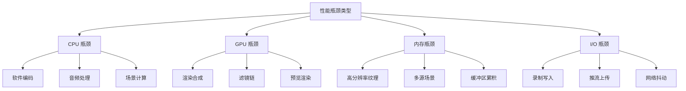

### 9.2 OBS 内置优化手段

| 优化手段 | 实现机制 | 适用场景 |
|---------|---------|---------|
| **纹理直通编码** | GPU 采集→GPU 编码 | 游戏直播 |
| **渲染降帧** | 预览独立帧率 | 复杂场景 |
| **动态分辨率** | 根据负载调整 | 性能不足时 |
| **线程分离** | 渲染/编码/输出分离 | 多核 CPU |
| **内存池** | 对象复用 | 频繁创建销毁 |

### 9.3 用户侧优化建议

**编码器选择决策树**：

```
开始
  │
  ├─ NVIDIA GPU (RTX 系列) ──→ NVENC H.264/H.265
  │
  ├─ Intel 核显/独显 ────────→ QSV H.264/H.265
  │
  ├─ AMD GPU ────────────────→ AMF H.264/H.265
  │
  ├─ Apple Silicon ──────────→ VideoToolbox
  │
  └─ 无硬件编码 ─────────────→ x264 (fast/veryfast)
```

**场景优化建议**：

| 场景 | 推荐设置 | 避免 |
|-----|---------|------|
| **游戏直播** | NVENC + 游戏采集 | 屏幕采集 + 软编 |
| **摄像头直播** | 硬编 + 适中分辨率 | 过高分辨率 |
| **屏幕分享** | 区域采集 + 动态码率 | 全屏高帧率 |
| **多机位** | 硬编 + 场景切换 | 多源同时渲染 |

---

## 第10章 OBS 源码导读指南

### 10.1 源码目录结构

| 目录 | 功能 | 关键文件 |
|-----|------|---------|
| **libobs/** | 核心库 | obs.c, obs-source.c, obs-output.c |
| **libobs-d3d11/** | D3D11 图形后端 | d3d11-subsystem.cpp |
| **libobs-opengl/** | OpenGL 图形后端 | gl-subsystem.c |
| **UI/** | Qt 界面 | obs-app.cpp, window-basic-main.cpp |
| **plugins/** | 插件集合 | 各子目录 |
| **deps/** | 依赖库 | media-playback, glad, etc. |

### 10.2 关键模块源码入口

| 功能 | 文件路径 | 关键函数 |
|-----|---------|---------|
| **视频线程** | libobs/obs-video.c | `obs_graphics_thread` |
| **音频处理** | libobs/obs-audio.c | `audio_thread` |
| **源管理** | libobs/obs-source.c | `obs_source_create` |
| **编码器** | libobs/obs-encoder.c | `obs_encoder_create` |
| **输出** | libobs/obs-output.c | `obs_output_start` |
| **FFmpeg 编码** | plugins/obs-ffmpeg/*.c | `obs_ffmpeg_encoder_create` |
| **游戏采集** | plugins/win-capture/game-capture/ | `init_hook` |

### 10.3 调试与开发

**编译指南**：

```bash
# 克隆源码
git clone --recursive https://github.com/obsproject/obs-studio.git
cd obs-studio

# 创建构建目录
mkdir build && cd build

# 配置 (macOS 示例)
cmake .. \
  -DCMAKE_PREFIX_PATH=/usr/local/opt/qt6 \
  -DENABLE_BROWSER=ON \
  -DENABLE_VLC=ON

# 编译
make -j$(sysctl -n hw.ncpu)
```

**日志系统**：

```c
// OBS 日志级别
blog(LOG_INFO, "Information message");
blog(LOG_WARNING, "Warning message");
blog(LOG_ERROR, "Error message");
blog(LOG_DEBUG, "Debug message");
```

---

## 第11章 总结

### 11.1 OBS 架构设计的核心经验

OBS 的架构设计体现了以下工程最佳实践：

| 设计原则 | OBS 实现 | 借鉴价值 |
|---------|---------|---------|
| **关注点分离** | libobs 核心与 UI 分离 | 核心库可独立使用 |
| **插件化扩展** | 全功能插件架构 | 功能扩展不修改核心 |
| **平台抽象** | gs_* 图形 API | 跨平台一致性 |
| **零拷贝优化** | GPU 直通 Pipeline | 最大化性能 |
| **配置驱动** | 结构化配置系统 | 灵活可定制 |

### 11.2 对自研音视频 SDK 的启发

基于 OBS 架构分析，对自研 SDK 的建议：

1. **采用插件化架构**：功能模块化，便于扩展和维护
2. **GPU 优先设计**：渲染合成在 GPU 完成，减少 CPU 负担
3. **抽象平台差异**：统一的跨平台 API，降低适配成本
4. **零拷贝数据流**：采集→渲染→编码全程 GPU 内存
5. **配置与代码分离**：运行时调整参数，无需重新编译

### 11.3 OBS 与商业 SDK 的架构差异

| 维度 | OBS | 商业 SDK (TRTC/声网) |
|-----|-----|---------------------|
| **定位** | 直播制作工具 | 实时通信引擎 |
| **架构** | 插件化、模块化 | 一体化、封装 |
| **延迟** | 1-5s（直播） | <400ms（RTC） |
| **扩展性** | 极高（开源插件） | 有限（封闭接口） |
| **复杂度** | 高（功能丰富） | 低（快速集成） |
| **适用场景** | 专业直播 | 实时通信应用 |

### 11.4 参考资源

**官方资源**：
- GitHub: https://github.com/obsproject/obs-studio
- 官方文档: https://obsproject.com/docs/
- 开发者 Wiki: https://github.com/obsproject/obs-studio/wiki

**社区资源**：
- OBS Forums: https://obsproject.com/forum/
- OBS Discord: https://discord.gg/obsproject
- 插件仓库: https://obsproject.com/forum/resources/

**技术文章**：
- OBS Architecture Overview（官方文档）
- OBS Plugin Development Guide
- NVENC Integration Deep Dive

---

> 本文是音视频链路优化系列的 OBS 架构专题。OBS 作为全球最流行的开源直播软件，其架构设计对音视频 SDK 开发具有重要的参考价值。理解 OBS 的模块化设计、插件系统、音视频 Pipeline 和渲染引擎，有助于构建高质量的音视频应用。

**学习路径建议**：
1. 通读本文了解 OBS 整体架构
2. 结合 [采集优化](./01_采集优化/采集优化_详细解析.md) 深入理解采集模块
3. 结合 [编码优化](./02_编码优化/编码优化_详细解析.md) 深入理解编码模块
4. 阅读 OBS 源码，实践插件开发
