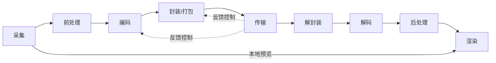
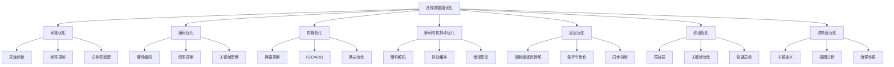

# 音视频链路优化深度解析

> **TL;DR：音视频链路优化的核心原则是"工程优化为主，算法优化为辅"。在资源受限的实时场景中，通过系统化的链路梳理、度量驱动的精准定位、分层分级的治理策略，往往比追求单一算法极致更能带来显著的体验提升。本文档提供全链路优化的全景视图，涵盖采集、编码、传输、解码、渲染各环节的核心优化方向与工程方法论。**

---

## 核心结论（TL;DR）

**音视频链路优化的本质是在质量、延迟、成本三者之间寻找最优平衡。**

现代音视频系统优化的关键支柱：

1. **全链路思维**：端到端延迟是各环节延迟的累加，单点优化往往事倍功半，必须建立全链路视角
2. **度量驱动**：无法度量就无法优化，建立完善的埋点体系和核心指标看板是优化前提
3. **工程优先**：在算法收益递减的边际，工程手段（并发、缓存、调度、降级）往往投入产出比更高
4. **分层治理**：按链路环节分层、按严重程度分级，避免"头痛医头、脚痛医脚"
5. **灰度验证**：任何优化策略都必须经过A/B测试验证，建立快速回滚机制

**一句话理解链路优化**：与其追求"每个环节都做到极致"，不如确保"各环节协同配合、瓶颈及时消除"——链路优化本质上是一种**系统性平衡**的艺术。

---

## 文章导航

本文采用金字塔结构组织，主文章提供全景视图，子文件深入关键优化方向：

### 采集与预处理优化

- [采集优化_详细解析](./01_采集优化/采集优化_详细解析.md) - 摄像头参数调优、帧率控制、分辨率适配、Zero-copy通路
- [前处理优化_详细解析](./02_前处理优化/前处理优化_详细解析.md) - 美颜/滤镜性能、GPU加速、内存优化

### 编码优化

- [编码参数优化_详细解析](./02_编码优化/编码参数优化_详细解析.md) - 码率控制、关键帧策略、Profile/Level选择
- [硬件编码实践_详细解析](./02_编码优化/硬件编码实践_详细解析.md) - MediaCodec/VideoToolbox硬编优化

### 传输优化

- [网络传输优化_详细解析](./03_传输优化/网络传输优化_详细解析.md) - 拥塞控制、FEC、ARQ、自适应码率
- [弱网对抗策略_详细解析](./03_传输优化/弱网对抗策略_详细解析.md) - 丢包恢复、抖动缓冲、前向纠错

### 解码与抗抖动优化

- [解码与抗抖动优化_详细解析](./04_解码与抗抖动优化/解码与抗抖动优化_详细解析.md) - 硬件解码器管理、Jitter Buffer、丢包恢复、Pipeline设计、音视频同步

### 端到端优化

- [延迟优化_详细解析](./05_端到端优化/延迟优化_详细解析.md) - 端到端延迟拆解、各环节优化策略
- [首帧优化_详细解析](./05_端到端优化/首帧优化_详细解析.md) - 秒开技术、预加载、关键帧优化
- [卡顿治理_详细解析](./05_端到端优化/卡顿治理_详细解析.md) - 卡顿定义、根因分析、治理体系

---

## 第1章 Why — 为什么需要系统化链路优化

### 1.1 音视频体验的核心指标

音视频体验可以从四个核心维度来衡量，每个指标都有其明确的工程含义：

| 核心指标 | 定义 | 工程含义 | 用户感知阈值 | 典型目标值 |
|---------|------|---------|-------------|-----------|
| **端到端延迟** | 从采集到渲染的完整耗时 | 反映系统实时性，影响互动体验 | < 150ms 无感知，> 400ms 明显延迟 | RTC: < 200ms，直播: < 3s |
| **卡顿率** | 播放不流畅的时间占比 | 反映系统稳定性和网络适应性 | < 1% 无感知，> 5% 明显卡顿 | < 1%（优质），< 3%（可接受） |
| **画质评分** | 客观/主观质量评估 | 反映编码效率和传输质量 | VMAF > 80 良好，> 90 优秀 | VMAF > 85 |
| **首帧时间** | 从请求到首帧渲染的耗时 | 反映启动速度和预加载效率 | < 500ms 秒开感知 | < 1s（直播），< 3s（点播） |

**指标间的权衡关系**：

```
        提高画质
            │
            ▼
        增加码率 ──→ 传输压力增大 ──→ 延迟增加/卡顿风险
            │
            ▼
        降低延迟 ──→ 缓冲区减小 ──→ 抗抖动能力下降 ──→ 卡顿增加
```

优化不是追求单一指标极致，而是在业务场景约束下找到最优平衡点。

### 1.2 全链路思维 vs 单点优化

**单点优化的局限性**：

假设一个RTC系统的端到端延迟为500ms，各环节延迟分布如下：

| 环节 | 延迟 | 占比 |
|-----|------|------|
| 采集 + 前处理 | 50ms | 10% |
| 编码 | 30ms | 6% |
| 封装/发送 | 20ms | 4% |
| 网络传输 | 200ms | 40% |
| 接收/解封装 | 20ms | 4% |
| 解码 | 40ms | 8% |
| 后处理 + 渲染 | 140ms | 28% |
| **总计** | **500ms** | **100%** |

**单点优化陷阱**：
- 将编码延迟从30ms优化到10ms（提升66%），端到端延迟仅减少4%
- 将渲染延迟从140ms优化到70ms（提升50%），端到端延迟减少14%

**全链路思维的核心**：
1. **识别瓶颈**：延迟占比最高的环节是优化重点（上例中是网络传输40% + 渲染28%）
2. **协同优化**：各环节参数需要匹配，避免"上游快、下游慢"的拥塞
3. **端到端度量**：建立从采集到渲染的完整埋点，避免局部最优

### 1.3 工程优化 vs 算法优化

在音视频链路优化中，需要明确区分两类优化手段：

| 维度 | 工程优化 | 算法优化 |
|-----|---------|---------|
| **核心关注点** | 系统架构、资源调度、并发设计 | 算法效率、数学模型、参数调优 |
| **典型手段** | 多线程并行、缓冲区管理、降级策略 | 编码算法改进、滤波算法优化、预测模型 |
| **投入产出比** | 通常较高（20%投入带来80%收益） | 边际递减（后期投入大、收益小） |
| **风险程度** | 相对可控，可快速回滚 | 可能引入兼容性问题，验证周期长 |
| **适用阶段** | 系统构建期、性能瓶颈期 | 算法研究期、差异化竞争期 |

**本系列定位说明**：

本文档系列**偏重工程优化**，原因如下：

1. **RTC场景的约束**：实时场景下，算法复杂度受限于延迟要求，工程手段往往更直接有效
2. **收益递减规律**：H.264→H.265压缩提升50%，但编码复杂度增加10倍；工程优化（如硬件编码）可以用20%的复杂度获得80%的收益
3. **可落地性**：工程优化方案通常具有更好的跨平台兼容性和可维护性
4. **系统性价值**：单点算法优化可能被链路其他环节的瓶颈抵消，工程优化更注重系统性平衡

**算法优化的适用场景**：
- 编码器内核开发（x264/x265/SVT-AV1调优）
- 特定场景的自适应策略（如屏幕共享编码优化）
- 差异化竞争点（如AI超分、智能降噪）

---

## 第2章 What — 全链路优化总览

### 2.1 完整音视频处理链路



**各环节功能说明**：

| 环节 | 核心功能 | 典型耗时 | 主要优化方向 |
|-----|---------|---------|-------------|
| **采集** | 摄像头/麦克风数据采集 | 8-16ms（一帧@60fps） | 帧率控制、分辨率适配、曝光同步 |
| **前处理** | 美颜、滤镜、降噪、3A | 5-20ms | GPU加速、算法裁剪、内存优化 |
| **编码** | 视频/音频压缩 | 10-50ms（软编）<br>3-10ms（硬编） | 硬件编码、参数调优、码率控制 |
| **封装** | 打包为RTP/RTMP/FLV等 | 1-5ms | 零拷贝、批量发送、协议选择 |
| **传输** | 网络传输（P2P/中转） | 20-200ms | 拥塞控制、FEC、ARQ、路由优化 |
| **解封装** | 解析协议、分离音视频 | 1-5ms | 快速解析、错误恢复、缓冲区管理 |
| **解码** | 视频/音频解压缩 | 10-40ms（软解）<br>3-8ms（硬解） | 硬件解码、解码线程池、低延迟解码 |
| **后处理** | 超分、色彩调整、混音 | 5-15ms | GPU加速、算法选择、异步处理 |
| **渲染** | 视频显示/音频播放 | 8-33ms（一帧） | 同步机制、丢帧策略、Surface优化 |

### 2.2 各环节典型延迟数据

**发送端（上行链路）**：

| 环节 | 理想值 | 典型值 | 劣化值 | 优化重点 |
|-----|-------|-------|-------|---------|
| 采集延迟 | 8ms | 16ms | 33ms | 摄像头参数、帧率控制 |
| 前处理延迟 | 5ms | 10ms | 30ms | GPU加速、算法裁剪 |
| 编码延迟 | 5ms | 15ms | 50ms | 硬件编码、编码预设 |
| 封装发送 | 1ms | 3ms | 10ms | 零拷贝、批量发送 |
| **上行总计** | **19ms** | **44ms** | **123ms** | - |

**网络传输**：

| 场景 | RTT | 传输延迟 | 抖动 | 优化重点 |
|-----|-----|---------|------|---------|
| 同城同运营商 | 10ms | 5-15ms | < 5ms | 直连优先 |
| 跨省同运营商 | 30ms | 20-40ms | 5-15ms | 边缘节点部署 |
| 跨运营商 | 50ms | 40-80ms | 10-30ms | 智能路由、中转优化 |
| 跨国 | 150ms | 100-200ms | 20-50ms | 专线、海外节点 |
| 弱网（4G/5G） | 100ms | 50-150ms | 30-100ms | 弱网对抗、自适应 |

**接收端（下行链路）**：

| 环节 | 理想值 | 典型值 | 劣化值 | 优化重点 |
|-----|-------|-------|-------|---------|
| 接收缓冲 | 20ms | 50ms | 200ms | 自适应缓冲、抖动消除 |
| 解封装 | 1ms | 3ms | 10ms | 快速解析、错误恢复 |
| 解码延迟 | 5ms | 10ms | 40ms | 硬件解码、解码线程 |
| 后处理 | 3ms | 8ms | 20ms | GPU加速、异步处理 |
| 渲染延迟 | 8ms | 16ms | 33ms | 同步机制、丢帧策略 |
| **下行总计** | **37ms** | **87ms** | **303ms** | - |

**端到端延迟参考**：

| 场景 | 目标延迟 | 可接受延迟 | 技术特征 |
|-----|---------|-----------|---------|
| **实时通信（RTC）** | < 150ms | < 400ms | 超低延迟编码、UDP传输、无缓冲 |
| **互动直播** | < 500ms | < 1s | 低延迟编码、边缘节点、小缓冲 |
| **普通直播** | < 3s | < 5s | 标准编码、CDN分发、适度缓冲 |
| **点播** | < 1s（首帧） | < 3s（首帧） | 预加载、自适应码率、大缓冲 |

### 2.3 七大优化方向的MECE分类



**七大优化方向详解**：

| 优化方向 | 核心目标 | 关键技术 | 典型收益 | 优先级 |
|---------|---------|---------|---------|-------|
| **1. 采集优化** | 降低采集延迟，提升采集质量 | 帧率控制、分辨率自适应、曝光同步 | 延迟-10ms，质量+10% | P1 |
| **2. 编码优化** | 在质量/码率/延迟间取得平衡 | 硬件编码、动态码率、场景自适应 | 延迟-30ms，CPU-50% | P0 |
| **3. 传输优化** | 提升弱网适应性，降低传输延迟 | 拥塞控制、FEC、ARQ、智能路由 | 卡顿率-50% | P0 |
| **4. 解码与抗抖动** | 平滑播放，快速恢复 | 硬件解码、自适应缓冲、错误隐藏 | 卡顿率-30% | P1 |
| **5. 延迟优化** | 降低端到端延迟 | 全链路延迟拆解、零拷贝、同步优化 | 延迟-100ms | P0 |
| **6. 秒出优化** | 缩短首帧时间 | 预加载、GOP优化、快速解码 | 首帧时间-50% | P1 |
| **7. 流畅度优化** | 降低卡顿率 | 卡顿监控、根因分析、分级治理 | 卡顿率-60% | P0 |

---

## 第3章 How — 各方向核心结论速查表

### 3.1 优化方向速查总表

| 优化方向 | 核心目标 | 关键技术 | 典型收益 | 实施难度 | 优先级 |
|---------|---------|---------|---------|---------|-------|
| **采集优化** | 降低采集延迟，适配设备能力 | 动态分辨率、帧率自适应、曝光同步 | 延迟-10ms<br>功耗-20% | 低 | P1 |
| **前处理优化** | 保证效果前提下降低计算开销 | GPU加速、算法分级、内存池 | CPU-40%<br>延迟-10ms | 中 | P1 |
| **硬件编码** | 降低编码延迟和CPU占用 | MediaCodec/VideoToolbox、码率控制 | CPU-80%<br>延迟-20ms | 中 | P0 |
| **码率控制** | 在带宽波动下保持稳定质量 | ABR/CBR/VBR、场景检测、动态调整 | 质量+15%<br>卡顿-20% | 中 | P0 |
| **关键帧策略** | 平衡随机访问能力和编码效率 | GOP大小、IDR帧、SVC | 首帧-30%<br>码率+10% | 低 | P1 |
| **拥塞控制** | 最大化带宽利用率，避免拥塞 | GCC/BBR、带宽预测、码率反馈 | 卡顿-40%<br>带宽+20% | 高 | P0 |
| **FEC策略** | 在冗余和恢复能力间取得平衡 | 冗余度自适应、ULPFEC、FlexFEC | 丢包恢复+30%<br>冗余-20% | 高 | P1 |
| **ARQ优化** | 快速重传，降低重传风暴 | NACK、RTX、重传上限控制 | 恢复延迟-50% | 中 | P1 |
| **硬件解码** | 降低解码延迟和CPU占用 | 硬解优先、降级策略、多实例 | CPU-70%<br>延迟-15ms | 中 | P0 |
| **抖动缓冲** | 消除网络抖动，平滑播放 | 自适应缓冲、加速播放、跳帧 | 卡顿-35%<br>延迟+20ms | 中 | P1 |
| **端到端延迟** | 系统性地降低全链路延迟 | 零拷贝、批量优化、同步机制 | 延迟-100ms | 高 | P0 |
| **首帧优化** | 缩短从请求到首帧的时间 | 预加载、GOP对齐、快速解码 | 首帧-60% | 中 | P1 |
| **卡顿治理** | 建立体系化的卡顿防治能力 | 监控告警、根因分析、分级响应 | 卡顿率-60% | 高 | P0 |

### 3.2 优化优先级排序（基于ROI）

**P0 - 必须优先实施（高ROI，基础能力）**：

| 优先级 | 优化项 | 预期收益 | 投入成本 | ROI评估 |
|-------|-------|---------|---------|--------|
| 1 | 硬件编解码 | CPU-70%，延迟-30ms | 2周 | 极高 |
| 2 | 拥塞控制算法 | 卡顿-40%，带宽+20% | 3周 | 极高 |
| 3 | 端到端延迟拆解与优化 | 延迟-100ms | 2周 | 高 |
| 4 | 卡顿监控与治理体系 | 卡顿率-60% | 3周 | 高 |
| 5 | 码率控制策略 | 质量+15%，卡顿-20% | 1周 | 高 |

**P1 - 建议实施（中等ROI，体验提升）**：

| 优先级 | 优化项 | 预期收益 | 投入成本 | ROI评估 |
|-------|-------|---------|---------|--------|
| 6 | 抖动缓冲自适应 | 卡顿-35% | 2周 | 中高 |
| 7 | 首帧优化 | 首帧-60% | 1周 | 中高 |
| 8 | FEC/ARQ策略 | 弱网体验+30% | 2周 | 中 |
| 9 | 前处理GPU加速 | CPU-40% | 1周 | 中 |
| 10 | 采集参数优化 | 延迟-10ms，功耗-20% | 3天 | 中 |

**P2 - 选择性实施（特定场景）**：

| 优先级 | 优化项 | 适用场景 | 投入成本 |
|-------|-------|---------|---------|
| 11 | SVC分层编码 | 多订阅、弱网降级 | 3周 |
| 12 | AI超分/降噪 | 高端设备、差异化 | 4周 |
| 13 | 智能路由 | 跨国、跨运营商 | 3周 |
| 14 | 边缘计算 | 大规模分发 | 4周 |

### 3.3 场景化优化策略

**实时通信（RTC）场景**：

| 优化重点 | 策略 | 目标值 |
|---------|------|-------|
| 延迟优先 | 硬件编码、零拷贝、小GOP、无缓冲 | < 200ms |
| 质量保障 | 动态码率、场景自适应、前处理适度 | VMAF > 80 |
| 弱网适应 | 快速降码率、NACK重传、动态分辨率 | 20%丢包可通话 |

**互动直播场景**：

| 优化重点 | 策略 | 目标值 |
|---------|------|-------|
| 延迟与流畅平衡 | 边缘节点、适度缓冲、自适应码率 | < 1s |
| 首帧体验 | 预加载、GOP缓存、快速启动 | < 500ms |
| 高并发支持 | CDN分发、多码率适配、智能调度 | 百万并发 |

**点播场景**：

| 优化重点 | 策略 | 目标值 |
|---------|------|-------|
| 首帧与流畅 | 预加载、大缓冲、自适应码率 | 首帧<1s |
| 画质优先 | 高码率、慢预设、两遍编码 | VMAF > 90 |
| 成本控制 | 智能缓存、P2P加速、码率分级 | 带宽成本-30% |

---

## 第4章 工程优化方法论

### 4.1 度量驱动：先度量再优化

**核心原则**：无法度量就无法优化，优化必须以数据为依据。

#### 4.1.1 核心指标体系设计

**延迟指标**：

| 指标名称 | 定义 | 采集方式 | 目标值 | 告警阈值 |
|---------|------|---------|-------|---------|
| 端到端延迟 | 采集到渲染的完整耗时 | 时间戳对齐 | < 200ms | > 400ms |
| 采集延迟 | 摄像头采集耗时 | 帧时间戳差 | < 16ms | > 33ms |
| 编码延迟 | 一帧编码耗时 | 编码前后时间戳 | < 15ms | > 30ms |
| 发送延迟 | 从编码完成到发送完成 | 发送回调时间戳 | < 5ms | > 10ms |
| 网络RTT | 往返时延 | RTCP SR/RR | < 50ms | > 100ms |
| 接收缓冲延迟 | 包到达至解码开始 | 缓冲区大小计算 | 20-100ms | > 200ms |
| 解码延迟 | 一帧解码耗时 | 解码前后时间戳 | < 10ms | > 20ms |
| 渲染延迟 | 解码完成到上屏 | 渲染回调时间戳 | < 16ms | > 33ms |

**质量指标**：

| 指标名称 | 定义 | 采集方式 | 目标值 | 告警阈值 |
|---------|------|---------|-------|---------|
| 视频码率 | 实际编码码率 | 编码器统计 | 目标±10% | 偏离>20% |
| 帧率 | 实际输出帧率 | 帧时间戳统计 | 目标±1fps | < 目标-3fps |
| 分辨率 | 实际编码分辨率 | 编码器配置 | 符合预期 | 异常切换 |
| VMAF评分 | 感知质量评分 | 离线计算/实时估算 | > 85 | < 70 |
| 卡顿率 | 卡顿时间/总时间 | 渲染帧间隔统计 | < 1% | > 3% |
| 花屏率 | 花屏帧/总帧 | 解码错误统计 | 0% | > 0.1% |

**网络指标**：

| 指标名称 | 定义 | 采集方式 | 目标值 | 告警阈值 |
|---------|------|---------|-------|---------|
| 丢包率 | 丢失包/总发送包 | RTCP统计 | < 1% | > 5% |
| 抖动 | 包到达间隔方差 | RTP时间戳计算 | < 10ms | > 30ms |
| 带宽估计 | 当前可用带宽 | GCC/BBR算法 | 准确 | 偏差>30% |
| FEC恢复率 | FEC恢复包/丢包 | FEC统计 | > 80% | < 50% |
| NACK重传率 | 重传包/总包 | RTX统计 | < 5% | > 10% |

#### 4.1.2 埋点设计原则

**埋点位置**：

```
采集 → [埋点:采集完成] → 前处理 → [埋点:处理完成] → 编码 → [埋点:编码完成]
  → 封装 → [埋点:发送完成] → 网络 → [埋点:接收完成] → 解封装
  → [埋点:解码开始] → 解码 → [埋点:解码完成] → 后处理 → [埋点:渲染完成]
```

**埋点规范**：

| 字段 | 说明 | 示例 |
|-----|------|------|
| event_type | 事件类型 | capture_start, encode_end, render_end |
| timestamp_us | 微秒级时间戳 | 1699123456789012 |
| stream_id | 流标识 | user123_video |
| seq_num | 帧序号 | 12345 |
| payload_size | 数据大小 | 1024 |
| extra_info | 扩展信息 | {"qp": 25, "codec": "h264"} |

#### 4.1.3 指标看板设计

**实时看板**：

| 看板模块 | 展示指标 | 刷新频率 |
|---------|---------|---------|
| 延迟大盘 | 端到端延迟、各环节延迟 | 5s |
| 质量大盘 | 码率、帧率、分辨率、VMAF | 10s |
| 网络大盘 | 丢包率、抖动、带宽估计 | 5s |
| 卡顿监控 | 卡顿率、卡顿分布、趋势 | 1min |
| 设备性能 | CPU、内存、温度、电量 | 10s |

**离线分析**：

| 分析维度 | 分析内容 | 输出 |
|---------|---------|------|
| 延迟分析 | 延迟分布、长尾分析、趋势 | 日报 |
| 卡顿归因 | 卡顿根因分类、热点分析 | 周报 |
| 质量评估 | 画质分布、码率效率 | 周报 |
| 网络分析 | 弱网场景分析、地域分布 | 月报 |

### 4.2 分层治理：按链路环节分层、按严重程度分级

#### 4.2.1 链路分层治理模型

```
┌─────────────────────────────────────────────────────────────┐
│                      应用层（业务逻辑）                        │
│         场景识别、策略决策、用户体验优化                        │
├─────────────────────────────────────────────────────────────┤
│                      算法层（编解码）                          │
│         编码参数、码率控制、场景自适应                          │
├─────────────────────────────────────────────────────────────┤
│                      传输层（网络）                            │
│         拥塞控制、FEC/ARQ、路由选择                            │
├─────────────────────────────────────────────────────────────┤
│                      系统层（平台）                            │
│         硬件编解码、线程调度、内存管理                          │
├─────────────────────────────────────────────────────────────┤
│                      设备层（硬件）                            │
│         摄像头、麦克风、GPU、网络模块                           │
└─────────────────────────────────────────────────────────────┘
```

**分层优化原则**：

| 层级 | 优化重点 | 典型手段 | 优化周期 |
|-----|---------|---------|---------|
| 应用层 | 业务策略 | 场景识别、降级策略、用户反馈 | 1-2周 |
| 算法层 | 编码效率 | 参数调优、场景自适应、SVC | 2-4周 |
| 传输层 | 网络适应 | 拥塞控制、FEC策略、路由优化 | 3-6周 |
| 系统层 | 资源效率 | 硬件加速、线程优化、内存池 | 2-4周 |
| 设备层 | 硬件能力 | 驱动优化、参数适配、兼容性 | 4-8周 |

#### 4.2.2 问题分级响应机制

**严重程度分级**：

| 级别 | 定义 | 示例 | 响应时间 | 处理策略 |
|-----|------|------|---------|---------|
| P0 - 致命 | 导致崩溃或完全不可用 | 编码器崩溃、内存泄漏 | 15分钟 | 立即回滚，紧急修复 |
| P1 - 严重 | 严重影响用户体验 | 频繁卡顿、高延迟 | 2小时 | 热修复，灰度验证 |
| P2 - 一般 | 影响部分场景体验 | 弱网体验差、首帧慢 | 1天 | 排期优化，常规发布 |
| P3 - 轻微 | 体验有瑕疵 | 画质波动、偶发卡顿 | 1周 | 需求池，择机优化 |

**分级治理流程**：

```
问题发现 → 定级 → 响应 → 定位 → 修复 → 验证 → 复盘
   │         │      │      │      │      │      │
   ▼         ▼      ▼      ▼      ▼      ▼      ▼
 监控告警   P0/P1  值班   日志    修复   灰度   文档
 用户反馈   /P2/P3 响应   分析    方案   测试   沉淀
```

### 4.3 灰度验证：A/B测试、灰度发布、回滚机制

#### 4.3.1 A/B测试框架

**测试设计原则**：

| 原则 | 说明 | 示例 |
|-----|------|------|
| 单一变量 | 每次只测试一个变化 | 只改码率控制算法，其他不变 |
| 样本充足 | 确保统计显著性 | 至少1000个会话，覆盖不同网络 |
| 随机分组 | 避免选择偏差 | 用户ID哈希分组 |
| 时长合理 | 足够观察长期效果 | 至少7天，覆盖工作日和周末 |

**评估指标**：

| 指标类型 | 核心指标 | 辅助指标 |
|---------|---------|---------|
| 体验指标 | 卡顿率、延迟 | 首帧时间、画质评分 |
| 性能指标 | CPU占用、内存 | 功耗、发热 |
| 业务指标 | 通话时长、留存 | 评分、投诉率 |

#### 4.3.2 灰度发布策略

**渐进式发布**：

| 阶段 | 流量比例 | 观察指标 | 持续时间 | 通过标准 |
|-----|---------|---------|---------|---------|
| 内测 | 1% | 崩溃率、核心功能 | 1天 | 无P0/P1问题 |
| 小流量 | 5% | 卡顿率、延迟 | 2天 | 指标不劣化 |
| 中流量 | 20% | 全量指标对比 | 3天 | 优于基线 |
| 大流量 | 50% | 长尾场景 | 3天 | 稳定 |
| 全量 | 100% | 持续监控 | - | - |

**回滚机制**：

| 触发条件 | 回滚动作 | 回滚时间 |
|---------|---------|---------|
| 崩溃率 > 基线×2 | 立即停止灰度 | < 5分钟 |
| 卡顿率 > 基线×1.5 | 逐步回滚 | < 30分钟 |
| 用户投诉激增 | 紧急回滚 | < 10分钟 |
| 核心功能异常 | 立即停止 | < 5分钟 |

### 4.4 持续监控：线上指标大盘、告警体系

#### 4.4.1 监控体系架构

```
┌─────────────────────────────────────────────────────────────┐
│                        数据采集层                            │
│         SDK埋点、服务端日志、网络探针、第三方数据               │
├─────────────────────────────────────────────────────────────┤
│                        数据处理层                            │
│         实时计算、离线分析、特征工程、异常检测                  │
├─────────────────────────────────────────────────────────────┤
│                        数据存储层                            │
│         时序数据库、日志存储、数据仓库、缓存                    │
├─────────────────────────────────────────────────────────────┤
│                        数据应用层                            │
│         可视化看板、智能告警、根因分析、自动决策                │
└─────────────────────────────────────────────────────────────┘
```

#### 4.4.2 告警体系设计

**告警分级**：

| 级别 | 触发条件 | 通知方式 | 响应要求 |
|-----|---------|---------|---------|
| 紧急 | P0问题、核心指标崩溃 | 电话+短信+IM | 5分钟内响应 |
| 重要 | P1问题、指标显著劣化 | 短信+IM | 30分钟内响应 |
| 一般 | P2问题、趋势异常 | IM | 2小时内响应 |
| 提示 | P3问题、需要注意 | 邮件 | 1天内处理 |

**告警收敛**：

| 策略 | 说明 | 示例 |
|-----|------|------|
| 时间收敛 | 同一问题短时间内只告警一次 | 5分钟内相同问题只发一次 |
| 维度收敛 | 聚合同类告警 | 按地域聚合网络问题 |
| 依赖收敛 | 根因告警抑制衍生告警 | 网络中断抑制所有相关告警 |

**智能告警**：

| 能力 | 说明 | 效果 |
|-----|------|------|
| 动态阈值 | 基于历史数据自适应阈值 | 减少误报 |
| 异常检测 | 机器学习识别异常模式 | 提前发现 |
| 根因分析 | 自动关联相关指标 | 快速定位 |
| 预测告警 | 预测趋势提前告警 | 主动预防 |

---

## 第5章 技术栈与工具链

### 5.1 主流RTC引擎对比

| 特性 | WebRTC | TRTC | 声网SDK |
|-----|--------|------|--------|
| **开发商** | Google（开源） | 腾讯云 | 声网Agora |
| **开源协议** | BSD-3 | 闭源 | 闭源 |
| **核心优势** | 开源生态、浏览器原生 | 国内节点、腾讯生态 | 全球节点、稳定可靠 |
| **延迟水平** | 150-300ms | 200-400ms | 150-300ms |
| **弱网对抗** | GCC + NACK + FEC | 自研算法 | SD-RTN + 自适应 |
| **平台支持** | 全平台 | 全平台 | 全平台 |
| **适用场景** | 自研RTC、浏览器应用 | 国内直播、社交 | 出海、高质量要求 |
| **成本** | 免费（自建） | 按量计费 | 按量计费 |

**选型建议**：

| 场景 | 推荐方案 | 理由 |
|-----|---------|------|
| 自研RTC、技术可控 | WebRTC | 开源可控，可深度定制 |
| 国内应用、快速上线 | TRTC | 国内节点覆盖好，集成简单 |
| 出海应用、全球服务 | 声网SDK | 全球节点，跨国体验好 |
| 大规模会议 | WebRTC + 自研SFU | 成本控制，灵活扩展 |

### 5.2 性能分析工具

#### 5.2.1 系统性能分析

| 工具 | 平台 | 功能 | 使用场景 |
|-----|------|------|---------|
| **perf** | Linux | CPU性能分析、热点函数 | 服务器性能优化 |
| ** Instruments** | macOS/iOS | Time Profiler、Allocations、System Trace | iOS性能分析 |
| **Systrace/Perfetto** | Android | 系统级性能追踪 | Android性能分析 |
| **Android Profiler** | Android | CPU、Memory、Network | Android应用分析 |
| **Xcode Instruments** | iOS | GPU Driver、Metal Frame | iOS图形性能 |

#### 5.2.2 音视频专用工具

| 工具 | 功能 | 使用场景 |
|-----|------|---------|
| **FFmpeg** | 编解码、格式转换、流分析 | 通用音视频处理 |
| **ffprobe** | 媒体文件分析 | 码流分析、元数据查看 |
| **Wireshark** | 网络包分析 | RTP/RTCP包分析 |
| **Elecard StreamEye** | 码流可视化 | H.264/H.265分析 |
| **VQ Analyzer** | 视频质量分析 | 编码细节分析 |
| **Mediainfo** | 媒体信息查看 | 文件格式分析 |

#### 5.2.3 延迟分析工具

| 工具/方法 | 说明 | 使用场景 |
|----------|------|---------|
| **端到端延迟测试** | 摄像头拍摄计时器，对比显示延迟 | 真实延迟测量 |
| **RTP时间戳分析** | 分析RTP包的时间戳分布 | 网络延迟分析 |
| **帧时间戳追踪** | 记录每帧在各环节的时间戳 | 链路延迟拆解 |
| **自动化测试工具** | 模拟不同网络条件测试 | 弱网场景测试 |

### 5.3 质量评估工具

#### 5.3.1 客观质量指标

| 指标 | 工具/库 | 特点 | 适用场景 |
|-----|--------|------|---------|
| **PSNR** | FFmpeg、MATLAB | 计算简单，与主观质量相关性一般 | 快速评估 |
| **SSIM** | FFmpeg、skimage | 考虑结构信息，优于PSNR | 常规评估 |
| **VMAF** | Netflix vmaf | 机器学习指标，与主观质量高度相关 | 生产环境 |
| **MS-SSIM** | 多尺度SSIM | 多尺度评估，更稳定 | 质量监控 |
| **LPIPS** | 深度学习指标 | 基于感知相似度 | 研究场景 |

**VMAF使用示例**：

```bash
# 计算VMAF分数
ffmpeg -i distorted.mp4 -i reference.mp4 -lavfi libvmaf="model_path=vmaf_v0.6.1.pkl:log_path=vmaf.json" -f null -
```

#### 5.3.2 音频质量评估

| 指标 | 标准 | 特点 | 适用场景 |
|-----|------|------|---------|
| **PESQ** | ITU-T P.862 | 窄带/宽带语音质量 | 传统语音 |
| **POLQA** | ITU-T P.863 | PESQ升级版，支持高清语音 | 高清语音 |
| **STOI** | 短时客观可懂度 | 关注可懂度 | 噪声环境 |
| **VISQOL** | 虚拟语音质量 | 开源实现 | 研究场景 |

#### 5.3.3 主观质量评估

| 方法 | 说明 | 适用场景 |
|-----|------|---------|
| **MOS评分** | 1-5分主观评分 | 最终质量验证 |
| **DMOS** | 差异MOS，对比评分 | A/B测试 |
| **ABX测试** | 辨别两个样本 | 细微差异检测 |
| **专家评估** | 专业测试人员 | 关键版本发布 |

---

## 第6章 典型优化案例分析

### 6.1 案例一：端到端延迟优化

**背景**：某RTC应用端到端延迟平均400ms，用户反馈延迟明显。

**优化过程**：

| 阶段 | 分析 | 优化措施 | 效果 |
|-----|------|---------|------|
| 1. 度量 | 各环节延迟拆解 | 增加全链路埋点 | 定位瓶颈 |
| 2. 编码 | 软编延迟50ms | 切换硬件编码 | -40ms |
| 3. 缓冲 | 接收缓冲150ms | 自适应缓冲策略 | -80ms |
| 4. 渲染 | 渲染线程阻塞 | 异步渲染优化 | -30ms |
| 5. 同步 | 音视频同步开销 | 优化同步算法 | -20ms |
| **总计** | - | - | **-170ms** |

**关键经验**：
- 硬件编码是降低延迟最有效的手段之一
- 接收缓冲是延迟大户，需要精细控制
- 全链路度量是优化的前提

### 6.2 案例二：卡顿率治理

**背景**：某直播应用卡顿率5%，严重影响用户体验。

**治理过程**：

| 阶段 | 分析 | 治理措施 | 效果 |
|-----|------|---------|------|
| 1. 监控 | 卡顿分布分析 | 按网络、设备、版本分析 | 定位热点 |
| 2. 网络 | 弱网丢包严重 | 优化FEC策略、NACK机制 | 卡顿-30% |
| 3. 编码 | 码率波动大 | 优化码率控制算法 | 卡顿-20% |
| 4. 解码 | 低端机解码慢 | 硬解优先、降级策略 | 卡顿-15% |
| 5. 渲染 | 渲染掉帧 | 优化渲染线程、丢帧策略 | 卡顿-10% |
| **总计** | - | - | **卡顿-75%** |

**关键经验**：
- 卡顿治理需要系统性地分析各环节
- 弱网优化是降低卡顿的关键
- 设备分级和降级策略必不可少

### 6.3 案例三：首帧时间优化

**背景**：某直播应用首帧时间平均3秒，用户流失率高。

**优化过程**：

| 阶段 | 分析 | 优化措施 | 效果 |
|-----|------|---------|------|
| 1. 分析 | 首帧时间拆解 | 建立首帧度量 | 定位瓶颈 |
| 2. 预加载 | 无预加载机制 | 实现播放器预加载 | -1.5s |
| 3. GOP | GOP过大 | 优化GOP大小 | -0.5s |
| 4. 解码 | 首帧解码慢 | 优化解码器初始化 | -0.3s |
| 5. 渲染 | 渲染准备耗时 | 优化Surface准备 | -0.2s |
| **总计** | - | - | **-2.5s** |

**关键经验**：
- 预加载是首帧优化最有效的手段
- GOP大小直接影响首帧时间
- 播放器初始化流程需要优化

---

## 第7章 进一步优化方向

### 7.1 前沿技术趋势

| 技术方向 | 发展趋势 | 应用场景 | 成熟度 |
|---------|---------|---------|-------|
| **AI编码** | 神经网络编码器 | 超低码率场景 | 研究中 |
| **AV1普及** | 开源免版税，压缩效率高 | 流媒体、RTC | 快速增长 |
| **SVC/AVC** | 可伸缩编码 | 多订阅、弱网适配 | 成熟 |
| **WebTransport** | 基于QUQ的传输协议 | WebRTC替代 | 早期 |
| **边缘计算** | 就近处理 | 降低延迟、节省带宽 | 增长期 |
| **AI超分** | 实时超分辨率 | 低码率高清化 | 落地中 |

### 7.2 持续优化建议

1. **建立度量文化**：持续完善指标体系，数据驱动决策
2. **关注用户体验**：技术指标最终要转化为用户体验提升
3. **保持技术敏感**：关注行业动态，及时引入新技术
4. **沉淀优化经验**：建立知识库，避免重复踩坑
5. **自动化优化**：探索AI辅助的参数调优和策略决策

---

## 参考资源

### 标准文档

- WebRTC Specification: https://www.w3.org/TR/webrtc/
- RTP/RTCP Specification: RFC 3550, RFC 4585
- GCC Congestion Control: RFC 8298

### 权威书籍

- 《WebRTC权威指南》 - Alan B. Johnston
- 《实时音视频技术解析》 - 李智慧
- 《视频编码全角度详解》 - 毕厚杰

### 开源项目

| 项目 | 链接 | 描述 |
|------|------|------|
| WebRTC | https://webrtc.org/ | Google开源RTC框架 |
| FFmpeg | https://ffmpeg.org/ | 多媒体处理工具 |
| SRS | https://ossrs.net/ | 开源流媒体服务器 |
| Janus | https://janus.conf.meetecho.com/ | WebRTC服务器 |
| mediasoup | https://mediasoup.org/ | 现代化WebRTC服务器 |

### 在线资源

- WebRTC Samples: https://webrtc.github.io/samples/
- WebRTC Internals: chrome://webrtc-internals/
- TestRTC: https://testrtc.com/

---

> 本文是音视频链路优化系列的顶层概览。如需深入了解特定优化方向，请参考对应的子文件。建议学习路径：总纲 → 延迟优化/卡顿治理（P0方向） → 编码优化/传输优化 → 其他方向。
