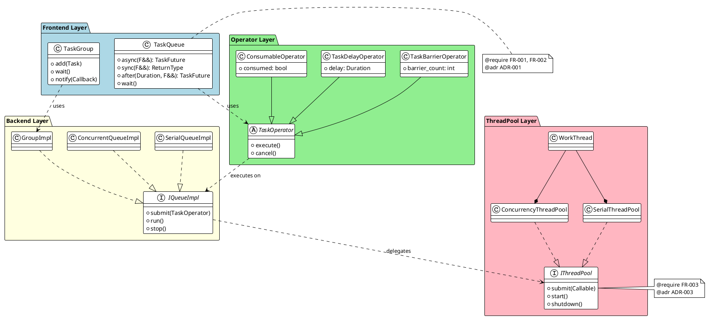

# Phase 2: 规范设计 (Design)

## 目标

将需求转化为**具体的架构决策、接口规范和技术方案**。

**关键产出**:
- 架构决策记录 (ADR)
- 接口规范 (OpenAPI/TypeSpec)
- 领域模型图
- 数据 Schema

---

## 可执行方法

### 方法 1: 架构决策记录 (ADR)

**ADR = Architecture Decision Record**

**模板**:
```markdown
# ADR {NUMBER}: [决策标题]

## Status
- Proposed (提议中)
- Accepted (已接受)
- Deprecated (已废弃)
- Superseded by ADR-XXX (被替代)

## Context
[背景信息，为什么需要做这个决策]
[面临的问题，约束条件]

## Decision
[做出的决策]
[用主动语态、现在时]

## Consequences
### Positive
- [好处 1]
- [好处 2]

### Negative
- [代价 1]
- [代价 2]

### Neutral
- [影响，但说不上好坏]

## Alternatives Considered
### Alternative 1: [方案名]
- **Pros**: [优点]
- **Cons**: [缺点]
- **Why Rejected**: [拒绝原因]

### Alternative 2: [方案名]
...

## Compliance
- [需求 ID]: [如何满足该需求]
- [ADR]: [与哪个 ADR 相关]

## Notes
[参考链接、相关讨论]
```

**示例**: 选择线程池实现策略
```markdown
# ADR-003: 线程调度策略

## Status
Accepted (2024-03-15)

## Context
TaskQueue 需要支持三种队列类型，需要决定：
1. 串行独占队列如何绑定线程？
2. 串行并行队列如何保证任务顺序？
3. 并行队列如何负载均衡？

约束：
- 最小化上下文切换
- 支持动态线程数调整
- 优雅关闭（等待任务完成）

## Decision
采用分层调度策略：

1. **SerialQueue** → **SerialThreadPool**
   - 每个队列绑定一个专属线程
   - 使用 thread_local 队列

2. **ConcurrentQueue** → **ConcurrencyThreadPool**
   - 全局任务队列，但保证 FIFO 顺序
   - 使用 ticket lock 保证顺序

3. **ParallelQueue** → **ConcurrencyThreadPool**
   - Work-stealing 队列
   - 无序执行，最大化并行度

## Consequences
### Positive
- 清晰的分离，易于理解和维护
- 每种策略针对场景优化
- 支持运行时调整

### Negative
- 增加代码复杂度（3 种实现）
- SerialQueue 线程不能复用

## Alternatives Considered
### Alternative 1: 统一使用线程池
- **Cons**: 串行队列难以保证严格顺序
- **Why Rejected**: 不满足 FR-002 要求

### Alternative 2: 所有队列专用线程
- **Cons**: 资源浪费，无法扩展
- **Why Rejected**: 不满足 NFR-001 性能要求

## Compliance
- FR-002: 三种队列类型要求
- NFR-001: 性能要求
- ADR-001: 类层次架构设计
```

---

### 方法 2: API-First 设计 (OpenAPI)

**原则**: 先设计接口，再实现

**示例**:
```yaml
# specs/api/TaskQueue.openapi.yaml
openapi: 3.0.3
info:
  title: TaskQueue API
  version: 1.0.0
  x-requirement-refs:
    - FR-001
    - FR-002

paths: {}
  # TaskQueue 是 C++ 库，无 HTTP API
  # 但这是接口规范的 YAML 表示

components:
  schemas:
    TaskQueue:
      type: object
      description: |
        @require FR-001, FR-002
        Task execution queue with support for async/sync operations
      properties:
        type:
          $ref: '#/components/schemas/QueueType'
        name:
          type: string
          description: Queue identifier for debugging
      required:
        - type
        
    QueueType:
      type: string
      enum:
        - Serial       # @require FR-002
        - Concurrent   # @require FR-002
        - Parallel     # @require FR-002
      
    TaskFuture:
      type: object
      description: |
        @require FR-001
        Future for retrieving async task result
      properties:
        valid:
          type: boolean
        
    TaskOperator:
      type: object
      description: Base class for task operations
      discriminator:
        propertyName: operatorType
      properties:
        operatorType:
          type: string
          enum:
            - Barrier
            - Delay
            - Consumable

  # 方法定义（类似 gRPC service）
  x-methods:
    TaskQueue:
      - name: async
        signature: "template<typename F> auto async(F&& f) -> TaskFuture"
        description: Execute task asynchronously
        requirement_ref: FR-001
        
      - name: sync
        signature: "template<typename F> auto sync(F&& f) -> ReturnType"
        description: Execute task synchronously
        requirement_ref: FR-001
        
      - name: after
        signature: "template<typename D, typename F> auto after(D delay, F&& f)"
        description: Execute task after delay
        requirement_ref: FR-001
```

---

### 方法 3: 领域模型图 (PlantUML)

**示例**:


---

### 方法 4: 数据 Schema

**SQL Schema 示例**:
```sql
-- specs/data/schema.sql
-- @require FR-ORDER-001

CREATE TABLE orders (
    id UUID PRIMARY KEY DEFAULT gen_random_uuid(),
    user_id UUID NOT NULL,
    status VARCHAR(20) NOT NULL DEFAULT 'pending',
    total_amount DECIMAL(10, 2) NOT NULL,
    created_at TIMESTAMP DEFAULT CURRENT_TIMESTAMP,
    updated_at TIMESTAMP DEFAULT CURRENT_TIMESTAMP,
    
    CONSTRAINT valid_status 
        CHECK (status IN ('pending', 'paid', 'shipped', 'delivered', 'cancelled'))
);

CREATE INDEX idx_orders_user ON orders(user_id);
CREATE INDEX idx_orders_status ON orders(status);
```

---

## Spec 文档目录结构

```
specs/
├── README.md                    # Spec 总览
├── requirements/                # 需求文档
│   ├── FR-001-task-execution.md
│   ├── FR-002-queue-types.md
│   ├── FR-003-thread-pool.md
│   ├── FR-004-task-group.md
│   └── NFR-001-performance.md
├── architecture/                # 架构决策
│   ├── ADR-001-class-hierarchy.md
│   ├── ADR-002-queue-impl-strategy.md
│   └── ADR-003-thread-scheduling.md
├── api/                         # 接口规范
│   ├── TaskQueue.openapi.yaml
│   └── TaskGroup.openapi.yaml
├── data/                        # 数据模型
│   └── schema.sql
└── diagrams/                    # 架构图
    ├── class-diagram.puml
    ├── sequence-diagram.puml
    └── component-diagram.puml
```

---

## 设计检查清单

- [ ] 所有需求都有对应的架构决策
- [ ] ADR 包含至少 2 个备选方案
- [ ] 接口规范可追溯到需求
- [ ] 领域模型图覆盖核心类
- [ ] 数据 Schema 定义完整
- [ ] 所有 Spec 文件都有版本控制

---

## 下一章

→ [继续阅读: 05-phase-decompose - 任务分解阶段](../05-phase-decompose/README.md)
