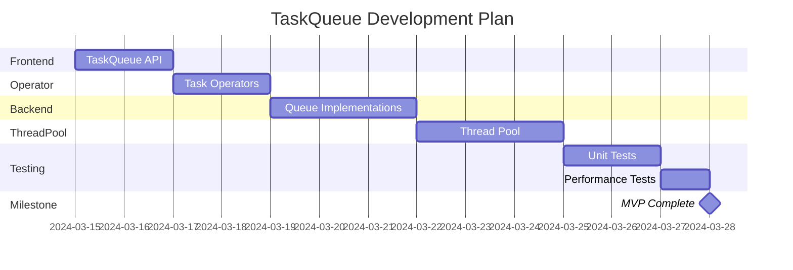
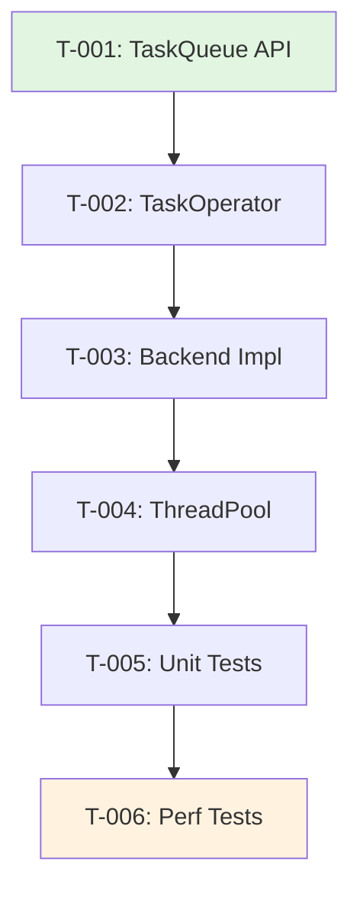

# Phase 3: 任务分解 (Decompose)

## 目标

将设计转化为**可执行、可追踪、可并行**的任务列表。

**关键产出**:
- 任务清单 (Tasks)
- 依赖关系图
- 执行计划（甘特图）
- 资源分配

---

## 可执行方法

### 方法 1: 任务分解模板

**YAML 格式**:
```yaml
tasks:
  - id: T-001
    title: [任务标题]
    description: [详细描述]
    type: spec | design | impl | test | doc
    requirement_ref: [FR-XXX, NFR-XXX]
    adr_ref: [ADR-XXX]
    dependencies: [T-XXX, T-YYY]  # 前置任务
    estimated_hours: [数字]
    assignee: [负责人]
    
    acceptance_criteria:
      - [可验证的条件 1]
      - [可验证的条件 2]
    
    deliverables:
      - [产出文件 1]
      - [产出文件 2]
    
    notes: [额外说明]
```

**示例**:
```yaml
# tasks/task-breakdown.yaml
tasks:
  - id: T-001
    title: 实现 TaskQueue Frontend API
    description: |
      实现 TaskQueue 类的公共接口，包括 async(), sync(), after(), wait() 方法。
      需要处理模板实例化和类型擦除。
    type: impl
    requirement_ref: [FR-001, FR-002]
    adr_ref: ADR-001
    dependencies: []
    estimated_hours: 8
    assignee: "dev-team"
    
    acceptance_criteria:
      - 所有公共方法有单元测试
      - 代码覆盖率 > 80%
      - 通过 clang-tidy 检查
      - 文档注释完整
    
    deliverables:
      - src/frontend/TaskQueue.h
      - src/frontend/TaskQueue.cpp
      - tests/unit/test_task_queue.cpp

  - id: T-002
    title: 实现 TaskOperator 基类及派生类
    description: 实现任务操作符基类和 Barrier、Delay、Consumable 派生类
    type: impl
    requirement_ref: FR-001
    adr_ref: ADR-001
    dependencies: [T-001]
    estimated_hours: 6
    
    deliverables:
      - src/operator/TaskOperator.h
      - src/operator/TaskBarrierOperator.cpp
      - src/operator/TaskDelayOperator.cpp
      - src/operator/ConsumableOperator.cpp

  - id: T-003
    title: 实现 Backend 队列实现
    description: 实现 SerialQueueImpl, ConcurrentQueueImpl, GroupImpl
    type: impl
    requirement_ref: FR-002
    adr_ref: [ADR-001, ADR-002]
    dependencies: [T-002]
    estimated_hours: 12

  - id: T-004
    title: 实现 Thread Pool
    description: 实现 ConcurrencyThreadPool, SerialThreadPool, WorkThread
    type: impl
    requirement_ref: FR-003
    adr_ref: ADR-003
    dependencies: [T-003]
    estimated_hours: 10

  - id: T-005
    title: 编写单元测试
    description: 为核心组件编写单元测试
    type: test
    requirement_ref: [FR-001, FR-002, FR-003, FR-004]
    dependencies: [T-004]
    estimated_hours: 8

  - id: T-006
    title: 性能基准测试
    description: 实现性能测试并生成报告
    type: test
    requirement_ref: NFR-001
    dependencies: [T-005]
    estimated_hours: 4
```

---

### 方法 2: 依赖图可视化

**Mermaid 甘特图**:


**Mermaid 依赖图**:


---

### 方法 3: 并行任务识别

**拓扑排序算法**:
```python
def find_parallel_groups(tasks):
    """
    识别可并行执行的任务组
    返回: [{task_ids}, {task_ids}, ...]
    """
    # 计算每个任务的依赖深度
    depth_map = {}
    
    for task in topological_sort(tasks):
        if not task.dependencies:
            depth_map[task.id] = 0
        else:
            depth_map[task.id] = 1 + max(
                depth_map[dep] for dep in task.dependencies
            )
    
    # 按深度分组
    from collections import defaultdict
    groups = defaultdict(list)
    for task_id, depth in depth_map.items():
        groups[depth].append(task_id)
    
    return [groups[d] for d in sorted(groups.keys())]

# 输出示例:
# [
#   [T-001],           # Wave 1: 无依赖
#   [T-002],           # Wave 2: 依赖 T-001
#   [T-003],           # Wave 3: 依赖 T-002
#   [T-004],           # Wave 4: 依赖 T-003
#   [T-005],           # Wave 5: 依赖 T-004
#   [T-006]            # Wave 6: 依赖 T-005
# ]
```

**关键路径分析**:
```python
def find_critical_path(tasks):
    """
    找到决定最短工期的任务链
    """
    # 计算每个任务的最早完成时间
    earliest_finish = {}
    for task in topological_sort(tasks):
        if not task.dependencies:
            earliest_finish[task.id] = task.estimated_hours
        else:
            earliest_finish[task.id] = task.estimated_hours + max(
                earliest_finish[dep] for dep in task.dependencies
            )
    
    # 从终点回溯找关键路径
    critical_path = []
    current = max(earliest_finish, key=earliest_finish.get)
    
    while current:
        critical_path.append(current)
        task = get_task(current)
        if task.dependencies:
            current = max(task.dependencies, key=lambda d: earliest_finish[d])
        else:
            current = None
    
    return list(reversed(critical_path))
```

---

## 任务分解原则

### 1. 原子性
每个任务应该是**不可再分的最小工作单元**。

❌ **过大**:
```yaml
- id: T-BAD
  title: 实现整个系统
  estimated_hours: 100
```

✓ **合适**:
```yaml
- id: T-GOOD
  title: 实现 TaskQueue::async 方法
  estimated_hours: 4
```

### 2. 可验证性
每个任务必须有**明确的完成标准**。

```yaml
acceptance_criteria:
  - 代码通过编译
  - 单元测试覆盖率 > 80%
  - 通过代码审查
  - 文档注释完整
```

### 3. 可追溯性
每个任务必须关联到**需求和架构决策**。

```yaml
requirement_ref: [FR-001, FR-002]
adr_ref: ADR-001
```

### 4. 工期估算
建议工期范围：**2-8 小时**。

- < 2 小时：可能过于细碎
- > 8 小时：可能需要进一步分解

---

## AI 辅助任务分解

**Prompt 模板**:
```
基于以下 Spec，分解为可执行的任务列表：

[Spec 内容]

要求：
1. 每个任务有明确的 ID、标题、描述
2. 识别任务依赖关系
3. 估算工时（2-8小时/任务）
4. 标记可并行执行的任务组
5. 输出为 YAML 格式
```

**示例输出**:
```yaml
# AI 生成的任务分解
tasks:
  - id: T-001
    title: Design TaskQueue interface
    ...
  
parallel_groups:
  - name: "Wave 1"
    tasks: [T-001, T-002]
  - name: "Wave 2"
    tasks: [T-003, T-004]
```

---

## 工具推荐

| 工具 | 用途 | 格式 |
|------|------|------|
| YAML | 任务定义 | `tasks.yaml` |
| Mermaid | 依赖图 | Markdown |
| GitHub Projects | 任务跟踪 | Kanban |
| Linear | 任务管理 | 与 Git 集成 |

---

## 检查清单

- [ ] 所有设计决策都分解为任务
- [ ] 每个任务关联到需求
- [ ] 任务依赖关系清晰
- [ ] 工期估算合理
- [ ] 识别了可并行任务
- [ ] 关键路径明确

---

## 下一章

→ [继续阅读: 06-phase-develop - 编码实现阶段](../06-phase-develop/README.md)
